# 第十章：渐变、网格和图案

渐变在矢量图形中非常重要，因为它们是脱离单调平面色彩填充、呈现更生动效果的最便宜和最通用的方式。设计师可以仅凭精心布置的渐变，创作出惊人复杂且逼真的艺术作品。尽管渐变具有极高的多样性，但它们相对容易创建和编辑，渲染速度也很快，而且几乎在所有 SVG 软件中都得到广泛支持——这一点对于 SVG 滤镜（例如模糊效果，17.1）来说，情况并非完全如此。

基本上，*渐变*是两种或多种颜色之间的平滑过渡。*颜色*还包括透明度的级别；这意味着你可以，例如，从不透明的红色到透明的红色创建一个渐变，中间有半透明的红色阴影。SVG 支持两种类型的渐变：*线性*（沿一条线）和*椭圆*，或*径向*（从中心开始，可能具有不等的*轴*和非中心的*焦点*）。

在平面线性和椭圆渐变之后，本章介绍了*网格渐变*，它们更加强大和灵活——尽管不幸的是，目前其他 SVG 软件不支持它们。最后，我讨论了*图案*，它通过重复另一个对象的副本来填充一个对象；图案在用户界面上与渐变有许多相似之处。

## 10.1 创建渐变

渐变工具（G 或 Ctrl-F1）是你在对象上创建新渐变的地方。它也是*编辑*现有渐变的最自然的地方——尽管一旦创建，对象的渐变控制点也可以在节点工具（12.5）、所有形状工具（第十一章）和滴管工具（8.8）中看到（因此它们可以被拖动和着色）。

创建一个新渐变很简单。只需确保你已经选择了对象（或多个对象），然后开始在画布上拖动——从选中的对象或任何附近的点开始。当你拖动时，你将看到一个实际的渐变出现在你鼠标的移动路径上，并且你还将看到一个由线条连接的*控制点*（小的画布内控制器）。

你不需要在选中的对象上拖动*渐变*——渐变控制点完全可以位于它们应用的对象之外。你可以选择任意数量的对象，并通过一次拖动将它们全部涂上相同的渐变（更准确地说，是多个重合的渐变）。另一种快速创建跨越整个对象的渐变的方法是使用渐变工具双击该对象。

为了使用最常见的对象选择快捷键，你无需切换到选择工具：点击选择，Alt+点击选择下方的对象，Shift+点击可以向选择中添加对象，这些操作在渐变工具中也同样适用。

你可以将渐变应用到对象的*填充*、*描边*，或者两者都应用（8.2）。在 Inkscape 中，描边渐变在控制点之间显示粉色的连接线，而填充渐变则显示蓝色的线条，如图 10-1 所示。

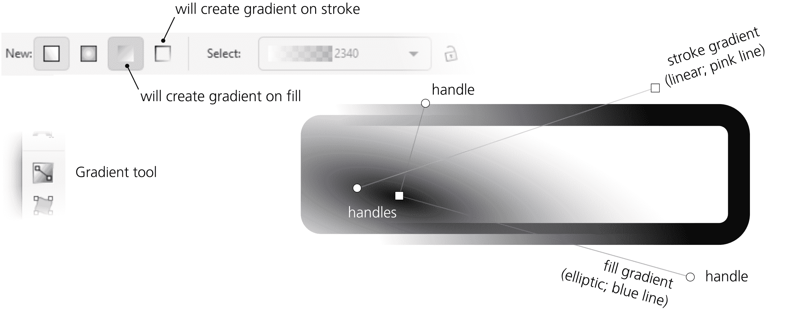

图 10-1：对象的填充和描边上的不同渐变

如果你在一个之前有纯色填充的对象上创建渐变，初始的渐变将从对象的完全不透明到完全透明的颜色*从你开始拖动的地方*。例如，如果你选中了一个黄色矩形并从该矩形开始拖动，你将填充一个从不透明黄色到透明黄色的渐变。然而，如果你在其他地方有一个蓝色填充的对象，并从它开始拖动，你可以填充一个从不透明蓝色到透明蓝色的渐变。换句话说，你创建的渐变应用于选中的对象，但使用的颜色可以来自于任何对象，无论该对象是否选中，只要你从它开始拖动。（如果这不是你想要的，别担心——创建后更改渐变颜色非常简单。）

类似地，如果你开始拖动的对象已经有一些渐变，工具会为所选对象重新绘制渐变，保留该渐变的颜色（即保留*渐变定义*，10.2）。如果你从空白处开始拖动，而不是从任何对象上开始，则会使用*最上层选中对象*的颜色或渐变来创建新的渐变。

在许多*去除*对象渐变的方法中，最简单的一种是确保没有选中任何渐变控制点（所有控制点是白色的，而不是蓝色的；如果有些是蓝色的，按一次 Escape 键即可），然后点击调色板上的任意颜色（或者按住 Shift 键点击以从描边中去除渐变）。该对象将会被填充或描边为纯色，替代之前的渐变。

当你变换（即移动、缩放、旋转或倾斜，第六章）一个使用渐变的填充或描边的对象时，所有渐变控制点会与对象一起变换，从而保持渐变的位置不变。然而，选择工具栏上的第三个影响按钮（6.11）可以改变这一点。如果取消勾选该按钮（默认选中），渐变将保持*相对于画布*固定，无论如何变换使用该渐变的对象。这在某些情况下非常有用，例如，如果你想缩放对象使其大小与所使用的椭圆渐变完全匹配。

现在让我们更详细地看一下 Inkscape 可以创建的两种渐变类型：线性渐变和椭圆渐变。

### 10.1.1 线性渐变

线性渐变沿直线段展开，且该线段的两个端点（以及可能的某些中间点）会分配特定的颜色和透明度。对象上颜色区域之间的过渡总是垂直于渐变线。这是渐变工具创建的默认渐变类型；该工具的线性渐变模式对应于工具控制栏上的第一个切换按钮（见图 10-2）。

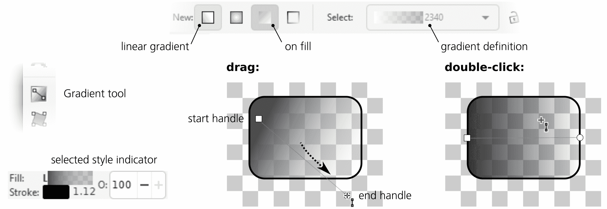

图 10-2：通过拖动和双击创建线性渐变

线性渐变有两个可以自由拖动的控制点：一个位于渐变线起点的方形控制点，另一个位于渐变线终点的圆形控制点。通过拖动它们，你可以改变渐变的方向和长度。当你拖动控制点时，渐变会实时重新绘制。

按住 Ctrl 键，绘制新的渐变或拖动现有渐变的控制点时，渐变线会*捕捉*到角度增量，默认每 15 度（你可以在首选项对话框的行为 ▶ 步骤页面中更改此值，参见 6.3）。在线性渐变模式下双击一个对象会创建一个通过对象边界框中心的水平线性渐变。

### 10.1.2 椭圆渐变

若要切换到创建*椭圆渐变*而非线性渐变的工具，点击工具控制栏（画布上方）的第二个切换按钮。现在，如果你在画布上拖动并选择了一些对象，将会在这些对象上创建椭圆渐变，如图 10-3 所示。

图 10-3：通过拖动和双击创建椭圆渐变

椭圆渐变至少有三个可拖动的控制点——*中心*（方形控制点）和两个垂直的*半径*（圆形控制点）。这些控制点允许你移动、拉伸、压缩或旋转渐变；你可以将其从圆形变为狭长的椭圆，并可以在任何角度进行旋转。移动中心控制点会移动整个渐变（所有控制点）；移动半径则会拉伸和旋转渐变，而不会移动中心。两个半径始终保持垂直。与线性渐变一样，按住 Ctrl 键拖动半径时，渐变会*捕捉*到 15 度的角度增量。

当你开始拖动以创建新的渐变时，你标记了它的中心，并且正在拖出其中一个半径。另一个半径则被设定为选中对象高度的一半——也就是说，如果你从对象的中心开始拖动，水平拖动到它的边界框右边缘，那么椭圆将整齐地被内切到边界框中。你也可以通过双击对象来实现相同的效果。

椭圆渐变还具有一个通常隐藏的第四个控制点：*焦点*。这是渐变中心停顿点的颜色和不透明度所在的点。通常，它与中心控制点合并在一起，并随其移动，保持渐变的完全对称。要将焦点—通过一个 X 形控制点表示—与中心分开，只需按住 Shift 键并从中心控制点处拖动。这将创建一个不对称的或*偏心*渐变（图 10-4）。要将焦点重新合并，只需将其拖动到足够接近中心控制点，它将自动吸附。

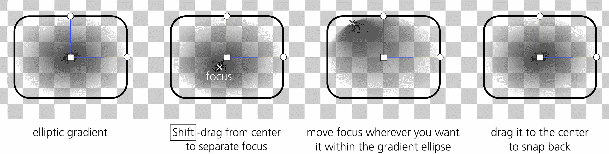

图 10-4：通过移动焦点创建偏心椭圆渐变

## 10.2 渐变定义

渐变有一组*停顿点*，每个停顿点都有自己的颜色和透明度值。停顿点的最小数量是两个*端点停顿点*：渐变线的两端（线性）或椭圆的中心和边缘（椭圆）。然而，渐变也可以有任意数量的*中间停顿点*，这些停顿点位于端点停顿点之间的某个位置。例如，你可以在渐变的 0.5 位置上设置一个中间停顿点，这意味着它总是位于端点停顿点之间的正中间。渐变的停顿点列表，包括它们的颜色、透明度和相对位置，被称为*渐变定义*。

渐变定义是文档范围的资源。这意味着你创建或编辑的任何渐变都会将其定义添加到文档中所有渐变定义的列表中。之后，你可以将该定义应用于文档中的任何其他渐变，这意味着该渐变将从定义中获取颜色和中间停顿点的相对位置（但渐变的端点控制点不会移动）。相同的渐变定义可以同时用于线性渐变和椭圆渐变。使用渐变工具的控制栏中的下拉列表可以查看并选择文档中的渐变定义（图 10-5）。

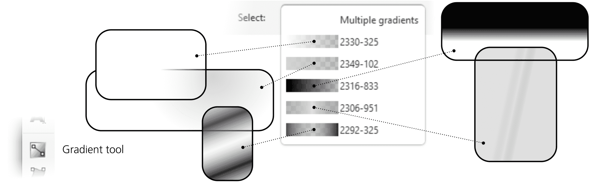

图 10-5：选择渐变定义

相同的渐变样本列表也可以在填充和描边对话框以及绘画服务器对话框中找到（10.9）。当你选择一个或多个带有渐变的对象时，从列表中选择一个定义会将其应用于所有选中的渐变。

你可以通过按 Shift-R 键或点击控制栏上的“反转方向”按钮来*反转*选中对象的渐变颜色定义。例如，如果你有一个中心为不透明蓝色、边缘为透明黄色的椭圆渐变，按下 Shift-R 后，你将得到中心为透明黄色、边缘为不透明蓝色的渐变。对于线性渐变来说，这相当于将渐变线旋转 180 度，但椭圆渐变不能仅通过移动其控制点来反转，这使得 Shift-R 功能变得必不可少。

### 10.2.1 分享渐变定义

当复制和粘贴或复制一个带有渐变的对象时，该对象的副本会自动获得*原始渐变的副本*，因此修改副本的渐变不会影响源对象的渐变定义。这一行为由“工具 ▶ 渐变”页面中的“防止共享渐变定义”复选框控制，默认是选中的；如果取消选中，复制粘贴、复制、粘贴样式以及将现有渐变定义显式分配给对象时，将会*共享*渐变定义。当两个对象共享同一个渐变定义时，改变其中一个对象的渐变颜色/透明度或中间停止位置会影响*所有*使用相同定义的对象。然而，移动结束控制点总是只影响单个渐变，因为这些节点的位置并不属于渐变定义的一部分。

另一个影响对象复制过程中渐变定义共享的设置是渐变工具控制栏上的锁定按钮。如果它被按下，下次复制带有渐变的对象时会导致共享渐变，从而使得编辑其中一个对象的渐变会影响另一个对象。如果你取消按下按钮，编辑其中一个共享渐变会立即打破与另一个对象的链接（而再次按下按钮不会恢复它）。

文件菜单中的“清理文档”命令会删除文档中可能残留的未使用的渐变定义。这是整理文档并减少文件大小（有时是显著减少）的好方法。

## 10.3 渐变重复

如你所见，渐变控制点不需要与它们所应用的对象的边缘对齐；它们可以被放置在画布上的任何位置，且对象只会显示落在其范围内的渐变部分。但那些不被渐变覆盖的对象部分——例如，超出线性渐变端点或椭圆渐变边缘的部分怎么办？

默认情况下，这些区域会被第一或最后一个渐变停止的平面颜色和透明度填充。例如，如果你有一个小的椭圆形渐变，半透明的白色位于半径处，那么渐变之外的其余部分将是相同的半透明白色。然而，这并不是唯一的可能性。

选择一个带有渐变的对象（但确保没有选中任何控制点），然后在渐变工具的控制栏中的**重复**列表里，选择**反射**或**直接**，而不是默认的**无**。这些选项会强制渐变无限次重复，既可以保持不变（直接），也可以每隔一个复制品进行反转（反射）。这是在对象上创建各种条纹图案的简单方法，如图 10-6 所示。

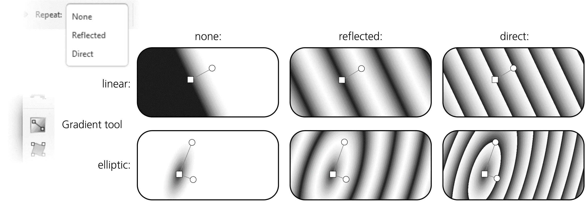

图 10-6：使用渐变重复选项

## 10.4 渐变控制点

控制点是与渐变停止点对应的画布上的控件。在渐变工具中，控制点不仅可以被拖动，还可以被*选中*并且*着色*，与选中的对象着色类似。

### 10.4.1 选择

选中的控制点为蓝色，未选中的为白色。选择一个控制点的最简单方法是点击它；你也可以按住 Shift 键点击以将控制点添加到选择中，或者将其从选择中移除，或者按住 Shift 键拖动多个节点，使用橡皮带选择它们（参见 5.7）。当你通过拖动创建新的渐变后，拖动的控制点会保持选中状态。

与选择器类似，在渐变工具中，你也可以通过键盘选择控制点。Tab 和 Shift-Tab 可以选择*下一个*和*上一个*控制点（如果之前没有选择，则为第一个和最后一个）；Ctrl-A 可以选择*所有*控制点（在所有选中的对象中）；Escape 键取消选择任何控制点（但保持对象被选中；第二次按下 Escape 键取消选中对象）。

### 10.4.2 绘制渐变停止点

你可以使用与改变对象样式相同的方法，给选中的渐变控制点或多个控制点分配任何颜色或不透明度级别（参见 8.1）。当一个控制点被选中时，调色板、填充和描边对话框、选中样式指示器中的颜色手势和命令（参见 8.2）、粘贴样式命令，甚至滴管工具都会作用于选中的控制点，而不是选中的对象。图 10-7 显示了一个示例。

图 10-7：为选中的渐变控制点分配颜色

与对象不同，渐变停止点没有填充或描边（即使渐变本身可以应用于填充或描边）。因此，当你选中一个或多个停止点时，状态栏中的样式指示器会显示停止点在*填充*和描边样本中的颜色；这可能不完全符合逻辑，但非常方便。渐变停止点的不透明度由主不透明度控制器（状态栏中的“O”标签）指示。然而，显示的描边*宽度*始终是对象的描边宽度（如果有描边），而不是停止点的宽度，因为停止点不能有描边。

如果你希望渐变的一端与其他对象平滑融合，使用滴管工具会很方便；确保对应的控制点被选中，切换到滴管工具并点击你希望渐变融合的区域。请注意，通过切换到滴管工具，你会离开渐变工具，但这不是问题；像许多其他工具一样，滴管工具会显示渐变控制点，甚至保留控制点的选择。你不能在滴管工具中选择对象，但可以切换渐变控制点的选择。

当*多个*渐变控制点被选中时，选中样式指示器会显示选中停止点的*平均*颜色和不透明度，并标记一个（这与多个选中对象的行为相同，8.4.1）。

当至少选择一个控制点时，复制命令（Ctrl-C）会将单个选中控制点的样式（包括颜色和不透明度）或多个选中控制点的平均样式复制到剪贴板。这意味着你可以在渐变停靠点之间复制和粘贴样式——选择一个控制点，复制，选择其他控制点，然后粘贴样式（Shift-Ctrl-V）。如果选择多个控制点，这样可以通过复制并粘贴它们的平均样式来快速平均它们的颜色和不透明度。

顺便提一下，如果你想将渐变中的*所有*停靠点的不透明度调整相同的量，你不需要单独调整每个停靠点的不透明度。只需调整使用该渐变的对象的主不透明度（见 8.3）。

### 10.4.3 移动、合并和吸附

你可以通过直接拖动选中的渐变控制点或使用箭头键（配合常规的修饰键）来*移动*选中的渐变控制点（Shift 表示位移 10 倍标准的 2 像素，Alt 表示像素级位移，Shift-Alt 表示位移 10 个像素；见 6.5.1）。自然，端点控制点（线性渐变中的渐变端点，椭圆渐变中的中心和半径）可以任意移动，而中间控制点只能沿渐变线移动。（不要把*中间*控制点与椭圆渐变的*中心*控制点混淆；后者尽管位于椭圆的中心，但代表的是渐变定义的*端点*。）

如果选择多个对象，所有包含渐变（无论是线性渐变还是椭圆渐变，应用于填充或描边）的对象都会显示其控制点，你可以同时编辑它们中的任何一个。这为你提供了许多有趣的可能性。例如，你可以选择所有线性渐变的端点并一起平行移动它们。或者按 Ctrl-A 选择所有渐变的所有停靠点，并使用箭头键一起移动整个渐变组。

更重要的是，任意数量的端点控制点（但不是中间停靠点）可以被*合并*。只要将一个控制点移到足够接近另一个控制点的位置，它就会吸附并合并到一起。（状态栏会报告该控制点的合并状态——例如，“2 个渐变共享的渐变点”）。当你拖动这样的合并控制点时，它会影响到它所属于的所有渐变。要分离一个合并的控制点，可以按住 Shift 键将其拖离。

例如，你可以合并两个对象的椭圆渐变中心，将椭圆控制点与另一个对象的线性控制点合并，合并多个对象的所有三个椭圆控制点，或者合并同一对象上填充和描边的渐变，如图 10-8 所示。

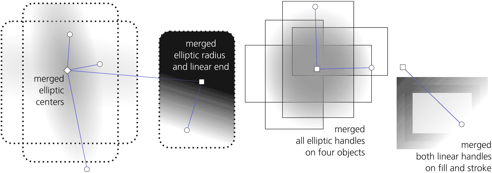

图 10-8：合并渐变控制点

当你拖动以创建一个新的渐变并选择多个对象时，你会看到看起来像是一个应用于多个对象的单一渐变——但实际上它是多个渐变，且其控制点已经合并在一起。

如果两个控制点有不同的颜色或透明度，它们在合并后仍会保持不同。然而，如果你为合并后的控制点指定颜色或透明度，它将应用于该控制点所合并的所有停止点，从而统一它们的样式。如果你想改变合并后某个控制点的样式而不解开合并，这在控制点属于不同对象时是可能的：只需取消选择所有内容（包括控制点和对象），然后只选择你想重新着色的控制点所属的对象。

当被拖动时，任何物体的渐变控制点都会根据捕捉条开关进行*捕捉*（见 7.3）。特别地，作为可捕捉对象的渐变控制点由第二组的主开关控制（捕捉节点、路径和控制点）。渐变控制点的捕捉目标由第一组和第二组中的单独开关控制；你可以捕捉到边缘、角落、中心或边界框的中点，路径和路径交点，以及路径上的尖角或平滑节点。当然，当网格或参考线存在并启用时，你也可以捕捉到它们。

此外，在拖动控制点或创建渐变时，按住 Ctrl 键可以使渐变角度对齐到水平、垂直以及 15 度增量（见图 10-9）。

图 10-9：捕捉渐变控制点

## 10.5 多阶段渐变

一个至少在结束控制点之间有一个中间停止点的渐变被称为*多阶段*渐变，因为它包含多个颜色过渡。在这样的渐变中，每个中间停止点都有自己的颜色和透明度，但其位置仅限于结束点之间的某个位置。在 Inkscape 中，中间停止点由菱形控制点表示，如插图 7 所示。

### 10.5.1 创建中间停止点

要在渐变中添加一个中间停止点，双击或 Ctrl-Alt-点击渐变线的任意位置。新添加的停止点将自动获得点击位置的颜色和透明度，因此渐变的外观不会发生变化。

你可以*拖放*调色板中的颜色到渐变线上。将颜色放到已有的控制点上会改变该停止点的颜色；将其放到渐变线的其他位置则会*创建*一个新停止点，并应用该颜色。

当选择了两个或更多相邻的控制点时，按下插入键会在所有选中的停止点间隙的中间添加新停止点（其效果与节点工具中的操作类似，12.5.3）。渐变工具控制栏上的“加号”按钮也具有相同的效果。以这种方式添加的新控制点会被包含在控制点选择中，因此反复按下插入键会不断增加更多的控制点；如果你从两个控制点开始选择并按下插入键*n*次，最终你会得到 2^(*n*)个控制点。

要删除所有选定的停靠点，只需按下 Delete 键。你也可以通过 Ctrl-Alt 点击删除单个停靠点（无论是否被选中）。或者选中一个停靠点，并点击控制条上的“减号”按钮。

删除操作不仅限于中间停靠点；你还可以删除一个端点停靠点，这样最近的中间停靠点就会成为渐变的新端点。当你删除线性渐变的端点控制点或椭圆渐变的半径控制点时，行为会根据操作方式有所不同；如果你 Ctrl-Alt 点击了端节点，最近的剩余控制点会移到它的位置，从而保持渐变跨度不变，但如果你选中该节点并按下 Delete 键，渐变会缩短。如果删除椭圆形渐变的中央控制点，它最近的控制点总会向内移动并成为新的中心点。最后，如果删除一个两停靠点渐变的端点控制点，渐变将消失，物体将被最后一个剩余的停靠点的平面颜色和不透明度填充。

按下 Ctrl-L 并选择一些中间停靠点，*简化*渐变的选定部分，移除那些在不影响渐变外观的情况下可以删除的停靠点（参见 12.3）。特别是，通过双击或按下 Insert 键创建的新停靠点最初不会改变渐变的外观，简化操作会删除所有那些在创建后没有被移动或重绘的冗余停靠点。你可能需要反复按 Ctrl-L 来删除所有不需要的停靠点。

### 10.5.2 移动中间停靠点

自然地，你可以将一个中间停靠点的控制点沿着渐变线（无论是通过拖动还是使用箭头键）移动，但不能超过其邻近控制点的范围。按住 Ctrl 拖动一个中间控制点时，它会吸附到可用范围的 1/10 分之一位置——也就是说，它会吸附到其邻近控制点之间的 1/10、2/10、3/10 等位置。控制条上的 Offset 字段显示并允许你编辑所选停靠点在渐变中的位置（介于 0 和 1 之间）。

两个或更多的中间停靠点可能会*重合*。如果它们具有不同的颜色，那么该点的渐变将形成一个明显的颜色边界。例如，添加两个中间停靠点，将一个涂成绿色，另一个涂成蓝色，然后将绿色的停靠点拖到蓝色停靠点上，便会在渐变中创建一个明显的绿色到蓝色的边界。

按住 Alt 拖动多个选定的控制点时，它们以一种柔软的“橡胶”方式移动。你抓住并拖动的控制点会完全移动，而所有其他选定的控制点会滞后，距离你拖动的控制点越远，滞后越明显。渐变的选定部分不会僵硬地整体移动，而是随着你的拖动平滑地重塑（参见节点工具中的节点雕刻功能，12.5.7.2）。

为什么这很有用？Inkscape（以及 SVG 整体）缺少的一个渐变功能是*轮廓*，意味着任何两个颜色之间的过渡总是线性的，不能加速或减速（即，它不能向其中一个端点偏移更多）。然而，通过 Alt 拖动中间控制点，可以轻松*近似*这种非线性轮廓。如果你有一个两停点的渐变，想要根据弯曲轮廓来调整它，选择渐变的两个端点，按多次插入来添加多个中间控制点，然后通过 Alt 拖动中间控制点，平滑地重新塑造渐变，如图 10-10 所示。

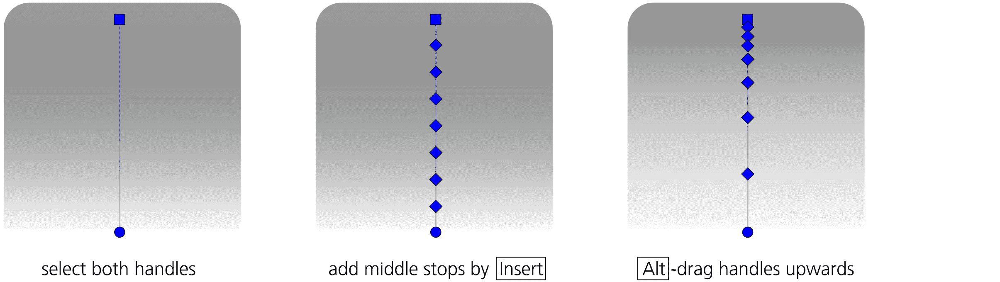

图 10-10：通过拖动中间停点并使用 Alt 来近似配置渐变

## 10.6 渐变技巧与示例

如果你想“淡出”或“羽化”一个物体的边缘，你不必对其应用颜色到透明的渐变（实际上，通常你*不能*，例如，如果它是一个无法填充的位图）。你可以使用遮罩（18.3）；然而，如果物体下方的背景是纯色的，那么一组与背景颜色相同的覆盖物体（*着色器*），并且带有不透明到透明的渐变，通常更容易创建和维护。这种方法对于多个需要一起羽化的物体，对于不同边缘的羽化效果，对于已经具有不同渐变填充的物体，或者对于位图或图案填充的物体都同样有效。

在图 10-11 中，四个渐变着色器被放置在位图的边缘，用于在白色背景上羽化它。

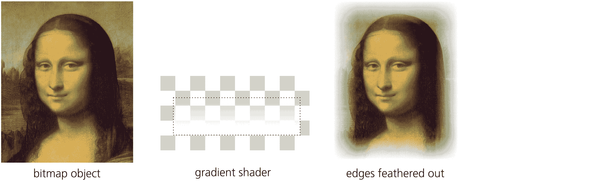

图 10-11：使用线性渐变着色器为矩形物体的边缘添加羽化效果

在使用着色器时，你不需要移动渐变控制点来将渐变放置到所需位置。相反，只需将整个带有渐变的着色器对象进行变换即可。在图 10-12 中，渐变工具仅使用了两次：一次用于在两个椭圆上创建不透明到透明的椭圆渐变，一个为白色，一个为黑色。然后，使用这两个着色器椭圆的 29 个克隆（链接副本），它们的大小和旋转不同，且具有不同的主不透明度水平，用来为卡通面部添加深度。

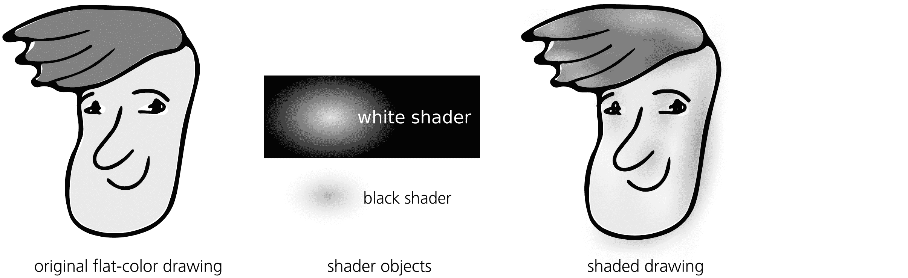

图 10-12：通过椭圆渐变着色器为卡通人物添加深度

黑色（或任何其他深色）着色器的一个问题是，它们可能看起来不够柔和——尤其是在完全不透明时，边缘显得太生硬。这是由于默认的渐变轮廓是线性的结果。你可以通过添加中间停点并通过 Alt 拖动来“配置”它们，从而尝试解决这个问题（10.5.2）。另一种技巧是对着色器进行一些模糊处理（17.1），使其边缘不那么突出。

然而，也许解决这个问题的最简单方法是将渐变绘制为不透明黑色到透明黑色（默认设置），而是从不透明黑色到透明的*白色*（或者，如果您打算在其他浅色上使用着色器，则使用该浅色的透明版本），如图 10-13 所示。这会大大改变渐变轮廓的感知效果，使其边缘更加平滑和自然。缺点是，这可能会让椭圆渐变的中心部分显得过于尖锐，这通常可以通过稍微放大着色器对象来解决。

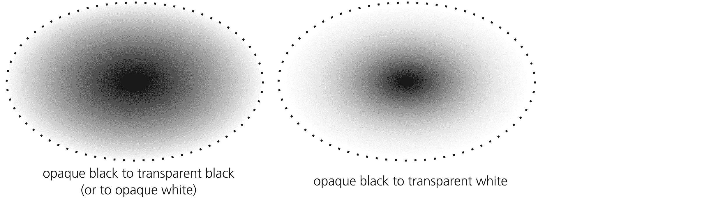

图 10-13：通过在边缘使用完全透明的浅色来创建更好的暗色着色器渐变轮廓

在设计中使用渐变通常涉及*叠加*几个带有半透明渐变的对象。彩色插图中的图 8 展示了一个彩色水滴（或玻璃按钮），实际上是六个带有不同椭圆渐变的对象的组合。

Tweak 工具的颜色模式（8.9）不仅可以在纯色填充或描边中绘制或随机化颜色，还可以在渐变中进行操作。对于渐变，工具考虑的不仅是带有渐变的对象的位置，还包括每个渐变停靠点相对于工具画笔的位置。

例如，您可以通过仅用画笔在蓝色端覆盖涂色，而不接触红色端，轻松地重新着色对象的蓝色端，使用蓝-红渐变。颜色调整不会在以前使用纯色的对象上*创建*渐变，也不会添加停靠点，但它会在绘图中涂抹现有渐变的停靠点。

让我们试试看。拿一个简单的不透明黑色到透明黑色的渐变，按 Insert 键多次添加中间停靠点，然后通过在 Jitter Colors 模式下使用 Tweak 画笔在对象上划线，随机化停靠点的亮度，仅启用 L 通道。然后，对另外两个平滑的原始渐变副本做同样的操作，并将它们全部稍微旋转叠加在一起。最终的纹理看起来就像一幅非常逼真的雾气海景，如图 10-14 所示。

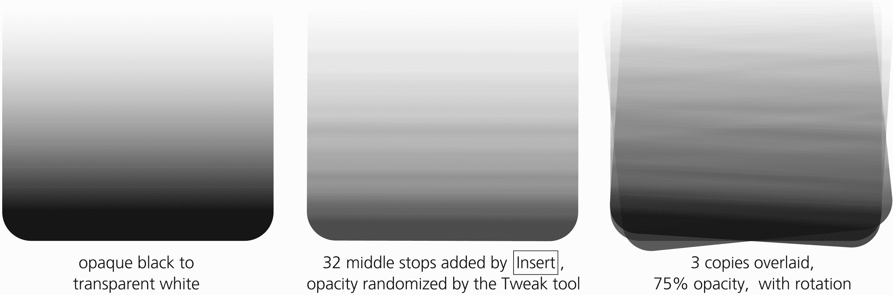

图 10-14：使用 Tweak 工具随机化渐变

## 10.7 网格渐变 [1.1]

与传统的旧式渐变类似，*网格渐变*，或简称为*网格*，也可以在两种或更多颜色之间创建平滑的过渡。然而，在网格中，承载这些颜色的点——类似于线性或椭圆渐变的渐变停靠点——并不是位于同一条直线上。相反，颜色的*节点*可以被放置在对象的内部或外部的任何位置。此外，节点被连接成网格状或圆锥状的*网格*，其段落是贝塞尔曲线，类似于路径中使用的曲线（参见第十二章）。由这些段落划定的区域被称为*网格补丁*。

每个网格节点都有其独特的颜色/不透明度；移动节点，添加新节点（因此增加段和补丁）以及重塑连接段，都会影响它们之间颜色过渡的拉伸和弯曲方式。所有这些机制使得你在一定技能下，可以快速高效地创建各种物体和效果的逼真近似。当你进行照片描摹时，甚至可以通过从网格对象下方提取颜色来自动完成这项工作（10.7.5）。

网格渐变是 Inkscape 中相对较新的功能。我很愿意说它们也加入到了 SVG 标准中，但遗憾的是，事实并非如此。网格渐变曾出现在 SVG 2.0 的草案中，并由标准工作组广泛开发。Inkscape 提供了这个新功能的首个，也是迄今为止最先进的实现。然而，浏览器厂商对其的支持一直持保留态度。

可以理解的是，Chrome 或 Firefox 在技术界的影响力远大于 Inkscape；特别是在 SVG 方面，浏览器的支持对其存活至关重要。因此，为了加速其采用，SVG 工作组决定在即将发布的 SVG 2.0 标准中删除此功能。网格功能可能会在未来的 SVG 版本中恢复；与此同时，尽管这一功能目前不是标准 SVG，Inkscape 计划继续支持网格渐变。

### 10.7.1 何时使用网格渐变？

网格渐变是位图和矢量图形的一种奇特混合体。像位图一样，它是一个由彩色点组成的网格——有时是许多点。像矢量渐变一样，它允许你在放置这些点时拥有相当大的自由度，并能在它们之间平滑地插值颜色。因此，网格渐变的一个完美应用场景是那些对于简单的几何渐变来说过于有机、无形或自由形态的东西——但仍然平滑，且没有太多的纹理或细节。

这一类适合网格的图像包括各种（主要是）平滑的物体，具有柔和、微妙的色彩变化、曲线阴影和高光：衣物和窗帘、面孔和身体、水果和花卉、树干和树叶、餐具、汽车、船只以及帆。另如你将在下文中看到的，网格在你需要在绘图中插入位图图像并进行修整以遮盖一些细节时非常方便。

尽管网格比简单的渐变功能更强大，但在 Inkscape 中的网格也更复杂，且目前使用起来并不那么方便。许多使得使用常规渐变变得更加轻松的功能（例如使用调整工具着色或按住 Alt 拖动多个节点）在网格渐变工具中还不能使用。希望未来版本的 UI 能不断改进。

需要记住的另一件事是，目前网格渐变是 Inkscape 独有的功能，其他 SVG 软件不支持。如果你打算将最终作品导出为位图或 PDF 格式，这应该不会太打扰你。如果你打算以 SVG 格式分享作品，最好的办法是将网格转换为位图（18.6.4）并嵌入 SVG 文档中。

### 10.7.2 创建网格

要在路径上创建网格（第十二章）、形状（第十一章）或甚至文本对象（第十五章），请通过工具栏按钮切换到网格渐变工具，并双击对象（图 10-15）。

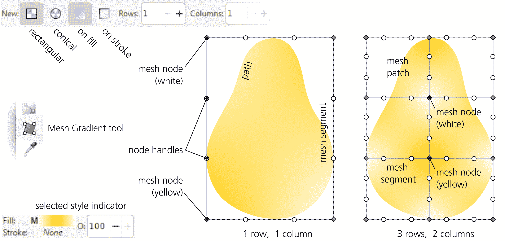

图 10-15：在梨形路径上创建网格渐变

默认情况下，工具会创建最简单的矩形网格，包含一个补丁和四个位于对象边界框角落的节点。你可以通过控制条上的行和列值来改变初始的补丁数量（它们只影响新创建的网格，不会影响已有的网格）。节点最初按棋盘顺序上色，使用对象的原始颜色（例如黄色）和不透明的白色。

就像线性渐变或椭圆渐变一样，你可以在对象的填充或描边上创建网格渐变。这是通过控制条上的一个开关来控制的。

#### 10.7.2.1 矩形网格还是圆锥网格？

控制条上的另一个开关提供了选择*矩形*网格或*圆锥*网格的选项。具有中央点和径向线段的圆锥网格，听起来非常适合（大致）圆形或其他中心对称的对象。事实上，当你在多边形或星形（11.5）上创建网格时，Inkscape 会创建一个圆锥网格，具有相应数量的半径，无论控制条上的矩形/圆锥开关是什么状态。

然而，圆锥网格并不是一种不同的网格类型；在后台，它仍然是一个矩形网格，只是被弯曲成一个圆形，所有节点都集中在其中一侧的同一个中央点上。因此，圆锥网格的一个半径就是一个可以展开的接缝，如图 10-16 所示。

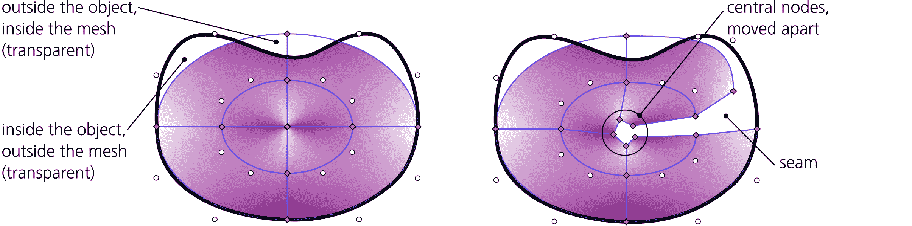

图 10-16：圆锥网格渐变的结构

在编辑圆锥网格时，你需要避免弄乱接缝或中央点。这并不难做到；只需要记住通过拖动选择接缝上的节点和中央节点，而不是点击—这样你可以选择该位置上*所有*重叠的节点（单击只会选择其中一个重合的节点）。

请注意，在 Inkscape 创建的初始圆锥网格中，中心的不同节点具有不同的（交替的）颜色，这使得该区域具有了特有的圆锥形外观。如果你想在保持颜色不同的同时进行编辑，你必须将这些节点分开，应用颜色，然后再合并这些节点。否则，如果你通过拖动选择所有中心节点并应用颜色，你将得到一个平坦的对称色彩峰（类似于椭圆渐变），而不是一个圆锥（见图 10-17）。

图 10-17：圆锥网格的中心：圆锥或峰值

### 10.7.3 塑形网格

网格节点在许多方面类似于路径节点（见 12.1）。最大区别在于，只有网格的角落节点连接有两个控制柄和两个段（像路径上的非末端节点）；网格的边缘节点有三个控制柄/段，内部节点则有四个。这种控制方式的繁杂使得编辑复杂网格变得困难。你可以选择并移动多个节点，但无法像对“网格布料”那样弹性地按住 Alt 拖动它们（参见 12.5.7.2），而且 Tweak 工具（见 12.6）在网格节点上无法使用。

在网格中，你希望节点——颜色的承载体——位于物体的色彩斑点、峰值高光和阴影所在的位置。然而，连接节点的段形状与节点的位置同样重要，因为这些段形成立体的“力场”，弯曲并拉伸色彩。最好通过确保新节点*创建*的位置大致与需要它们的位置相符，并且新添加的段*已经*与模型的形状贴合，来最小化对网格节点的编辑。

当你细分网格时，新的段是通过在相邻的现有段之间*插值*创建的。这给我们提供了一个最佳策略：从一个最小的四节点单补丁网格开始（见图 10-15，左侧），但在添加更多节点之前，先将外框塑形以匹配所建模物体的整体形状（在我的例子中是一个梨形）。由于网格的外部始终是完全透明的（见图 10-16，左侧），你需要将外部节点放置得足够靠近物体的路径，但仍然在外部，如图 10-18 所示。

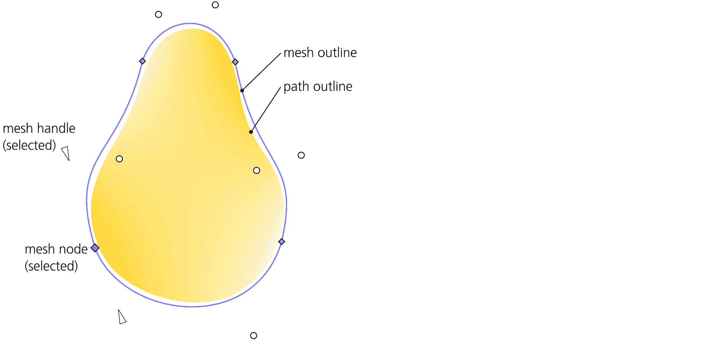

图 10-18：在添加更多节点之前，先塑形网格的外边缘

与路径不同（参见 12.5.5），网格没有平滑节点类型，因此你需要手动拖动节点及其控制柄，以使其平滑并塑形段落。你可以一次选择多个节点并一起拖动；请注意，选中节点的控制柄将变成指向其母节点的定向三角形（这使得解开复杂网格变得稍微容易一些，因为节点和其控制柄之间没有连接线）。你还可以在控制栏上使用两个按钮，将段落（在选择其端节点后）切换为直线，并恢复为曲线。

由于重塑即使是一个简单的网格也非常麻烦，因此你可能会很高兴得知，当你在椭圆形上创建一个网格时（11.4），Inkscape 会自动将其形状调整为符合椭圆形状（图 10-19，左图；请注意，这是一个圆角矩形网格，而不是锥形网格）。因此，如果你的物体大致呈圆形或椭圆形（例如盘子或液滴），那么首先将其创建为椭圆形，之后在其上创建网格，然后在必要时将其转换为路径并在椭圆网格内重新塑形，可能是一个明智的选择。此方法的一个问题是，节点工具同时显示路径节点和网格节点（它们看起来非常相似）；要隐藏网格节点，可以在节点工具的**首选项**页面上取消选中**启用渐变编辑**（这会影响渐变节点和网格节点）。

### 10.7.4 子划分网格

一旦你将物体塑形至大致所需的样子，并且将默认的单一补丁网格形状调整以贴合物体（图 10-18），你可以开始对子网格进行子划分，以添加更多的点和补丁。现在，插值段和点将跟随网格的外形—就像地球上的经线和纬线—因此，在大多数情况下，它们只需要进行最小的编辑。接下来要做的就是为网格节点分配颜色，以创建你设想的阴影和色调。

子划分网格非常简单。你可以通过选择两个或更多节点并按下插入键或 Shift-I 来半自动完成：这将在（每对）选定的节点之间添加一个节点（和相应的段）。例如，如果你选择一个单一补丁网格的四个节点（Ctrl-A）并按插入键，你最终将得到一个 2×2 的补丁网格，总共有九个节点。现在，如果你再次按下 Ctrl-A（将新创建的节点添加到选择中），然后再次按下插入键，每个段将再次被一分为二，生成 4×4 补丁和 25 个节点（图 10-19）。

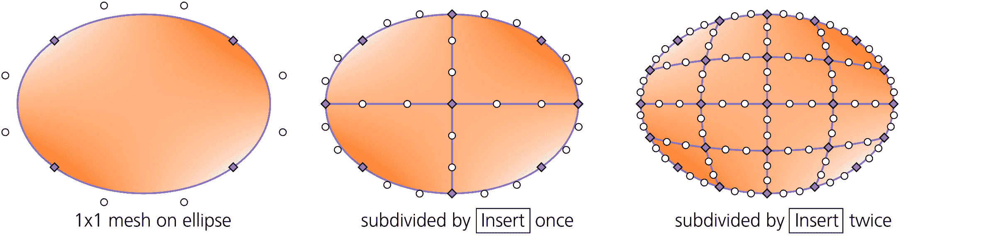

图 10-19：使用插入键子划分形状网格

这种不加区分的网格加倍策略是一个不错的选择，特别是当你不确定节点的最佳位置时（例如，在创建位图修饰补丁时，10.7.5.1）。如果你知道高光、阴影和着色点的位置，那么使用手动细分来瞄准它们。在任何点双击一个段落，都会在该点添加一个节点，并在该点处生成一条新的段落链。例如，如果你想在点 A 创建一个高光，首先在点 B 的顶部段落双击，以便在 A 处创建一条经过的段落链，然后在 A 处双击以创建交点，如图 10-20 所示。

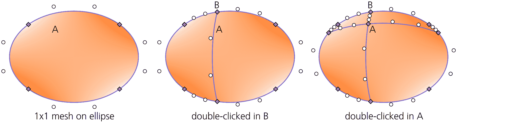

图 10-20：通过手动创建节点细分形状网格

请注意，添加节点（无论使用哪种方法）并不会改变网格的外观：Inkscape 不仅会插值位置和段落形状，还会插值颜色——因此新节点会自动获得网格在该点的颜色。现在由你来雕刻颜色过渡，通过为新节点应用颜色来实现。

### 10.7.5 网格节点着色

在开始实际着色之前，不要过于激动地细分你的网格；最好从最小的细分开始，只有当你发现没有新节点无法正确着色时才添加节点。没有什么比看到一个非常简单的网格能产生令人惊叹的生动色彩和阴影效果更令人满意的了。

然而，在你开始着色之前，我建议你将网格的默认 Coons 插值切换为控制栏上的三次插值。Coons 插值是线性的，这会使网格看起来不自然地棱角分明；而三次插值则要平滑得多。

网格节点的实际着色方式与渐变停止点的着色方式相同（10.4.2）。选择一个或多个节点（单击、Shift+单击、框选拖动），并从调色板中选择一个颜色，或通过填充和描边对话框调整现有颜色（再次建议使用“轮盘”标签，它是最自然的选择）。你也可以直接将颜色从调色板拖放到节点上（无论是否已选择）。

从这里开始，操作网格基本上是一个重复的循环：选择一个节点；调整其颜色；取消选择节点和对象（为了隐藏网格，因为网格遮挡下很难看出颜色效果）；再次选择对象；然后重复。偶尔，你可能还需要通过细分添加节点或稍微移动一些节点。只要投入足够的时间，你将会惊讶于你的对象如何变得栩栩如生（插图 9）。

在图 10-20 中有几点值得注意。A 点保留了我最初分配给所有节点的黄色颜色；从这样的平均颜色开始，然后稍微偏离它要容易得多。B 和 C 点是两个主要的亮点；它们被涂成非常浅的（几乎是白色的）梨黄色。D 点添加了绿色的点缀，而 E、F 和 G 点则带来了一些红色。自然，梨的右侧和底部的点被涂成较深的颜色，以创造整体的阴影效果，但也有局部例外；特别是 E1 到 E2 和 E3 到 E4 的边缘节点（注意它们位于实际形状之外）被涂成纯白色，以创造出类似于物体置于明亮背景前时的“溶解边缘”效果（比如窗户前的效果）。

#### 10.7.5.1 使用网格修补位图

网格是一种简单的方式来创建照片修补——它是一个完美融合的对象，能够覆盖位图图像中你不需要的部分。假设你想要遮挡蒙娜丽莎脸颊上的裂纹。首先，在一个区域上画一个圆形对象。为它创建一个矩形网格，并用插入（10.7.4）将其分割几次。为了获得最佳效果，网格的外部节点应该位于对象区域之外；为此，只需在节点工具中选择路径的所有节点（而不是网格），然后通过按 < 键缩小路径几次（如图 10 在颜色插入所示）。

现在，你所需要做的就是选择网格渐变工具中的所有网格节点，然后点击控制栏上的“选取颜色”按钮。对于每个选中的节点，Inkscape 会查找此点的背景（即位图）颜色，并将该颜色分配给节点。修补仍然在放大时可见，因为它的平滑度与面部其余部分的裂纹纹理形成对比——但是如果稍微缩小视图，它就会完美地融入！虽然可能使用其他工具（如普通渐变、滴管工具、模糊等）也能实现类似的效果，但只有网格渐变能让修饰工作如此轻松愉快。

## 10.8 图案

*图案*是一种填充类型（8.2），其中对象的填充或描边由重复的*图块*组成。图块可以是任何东西：一个单独的对象或一组对象，使用任何样式属性或 Inkscape 技巧（例如，图块本身可以递归地用图案填充）。这种通用性使得图案成为一个非常丰富和灵活的特性。然而，从另一个角度来看，SVG 中的图案是有限制的：它们只能以简单的矩形网格方式平铺，不能进行旋转或反射（与克隆平铺工具 16.6 进行比较，后者可以使用 17 种不同的平面对称方式排列克隆）。

对象不能同时应用渐变和图案，它们是两种不同的绘制类型。如果你想要在一个带图案的对象上使用透明渐变，请参考 10.6 中的着色器部分或 18.3 中的遮罩部分。

### 10.8.1 创建图案

与渐变或网格不同，图案在 Inkscape 中没有专门的创建工具。相反，只需选择你想要转换为图案的对象或对象集，然后从菜单中选择**对象 ▶ 图案 ▶ 将对象转换为图案**，或者按 Alt-I。

选中的对象不会消失，也不会明显改变；然而，你会注意到现在选中的是一个单一的*矩形*，而不是原来的对象。这个矩形填充了由你的对象所构成的图案，并且它的大小和位置正好与它们的边界框相同，这意味着正好有一个图案副本适合填充矩形。如果你现在拖动矩形的调整手柄（使用矩形工具或节点工具），你将看到其他的图案瓷砖，正如图 10-21 所示。

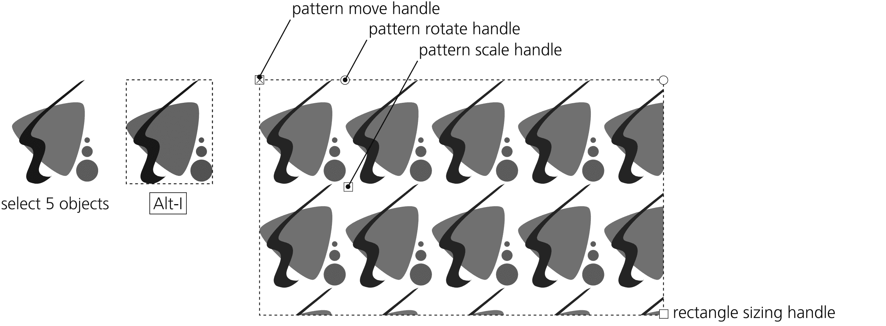

图 10-21：从对象创建图案

现在，你可以通过从这个矩形中选择“复制并粘贴样式”（如果不再需要，可以删除它），或者从填充和描边对话框中的图案列表中选择它，轻松地将新图案应用到任何对象上，如图 10-22 所示。

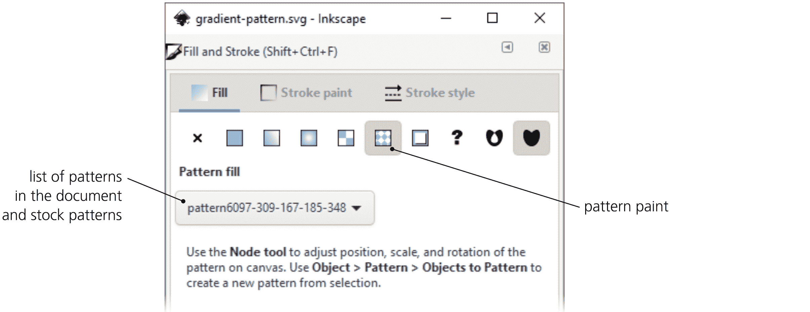

图 10-22：填充和描边对话框中的图案填充

SVG 允许你设置图案瓷砖之间的间距以将它们分开。Inkscape 目前还不支持通过 UI 来实现这一点，但一种更简单的方法是在将对象转换为图案之前，给原始对象添加一个透明矩形，扩展到其他对象的边缘之外，从而在图案瓷砖之间增加分隔。图案瓷砖不可能重叠。

如果你想从图案中提取出瓷砖对象以便编辑，选择一个带有该图案的对象，然后使用**对象 ▶ 图案 ▶ 图案转为对象**命令（但如果你不想丢失图案对象，请先复制带图案的对象）。

### 10.8.2 编辑图案

当你使用节点工具或形状工具时，带有图案填充的每个对象都会显示三个编辑手柄，允许你在对象内移动、缩放和旋转图案（如图 10-21 所示）。与渐变类似，这些手柄可以出现在画布上的任何位置，不一定在对象本身上。点击缩放或旋转手柄（但奇怪的是，点击移动手柄并不会选中它），然后你可以使用箭头键进行移动。

X 形手柄

这个手柄位于其中一个瓷砖的左上角（“原点”瓷砖）。拖动这个手柄*可以移动*图案的方向。

方形手柄

位于原始图块的右下角。拖动这个控件可以*缩放*图案。若要使缩放保持一致（即保持图块的宽高比），请按住 Ctrl 拖动。

圆形控件

位于原始图块的右上角。拖动此控件可以*围绕 X 形控件旋转*图案，旋转以 X 形控件为轴心。按住 Ctrl 拖动，旋转角度将以 15 度为步进量对齐。

### 10.8.3 艺术中的图案

从美学角度看，图案的问题与其主要优点相同：*重复性*。图案可能在技术插图中是必要的或至少可以接受的，但艺术作品通常不会因为烦人的重复矩形图案而有所改进。

如果你在艺术作品中使用了图案，但又不希望它看起来太过规整，你可以选择放大图案（让图案在物体中出现的次数减少）和/或将其旋转使其不再水平/垂直。更激进的方法是，不仅仅在一个对象上平铺图案，而是将多个副本（或克隆）的图案随机分布在其中；这样，观众可能需要费点力气才能发现任何规律性（这就是库存波点图案的制作方式，10.8.4）。

### 10.8.4 库存图案

“对象到图案”命令并不是将图案添加到文档中的唯一方式。Inkscape 提供了一系列简单的*库存图案*，你可以在文档中重复使用。

选择一个对象，并通过点击**填充和描边**对话框对应选项卡中的**图案**按钮，将其切换为图案填充。你将看到一个下拉列表（图 10-22），其中包含文档的自定义图案（如果有的话）在顶部，接着是一个库存的 Inkscape 图案集合。要使用任何图案，只需从列表中选择即可。

+   这里有一系列简单的条纹图案，条纹宽度与间隙宽度的比例从 4:1 到 1:64 不等。例如，1:2 的条纹图案表示间隙的宽度是条纹的两倍。所有条纹图案有两种版本：黑色条纹和白色条纹（间隙始终是透明的）。

+   有两种棋盘格图案，黑白相间的方格（偶数方格为透明的）。

+   “打包圆圈”选项是一种黑色圆圈密集排列的六边形图案，间隙透明。

+   波点是一种点状图案，随机但均匀地分布，掩盖了重复图案的规律性。该图案有三种尺寸变体（小、中、大点）和两种颜色变体（黑色和白色点）。

+   波浪是由波浪线组成的图案，线条之间有透明的间隙。

+   伪装图案是一种绿色调的保护性图案，通常用于军事用途。

+   白鼬纹是传统的纹章图案，源自对白鼬皮毛的 stylized 表现，尤其是黑色的尾巴。

+   三种位图图案，沙地、布料和旧油漆，是基于无缝摄影图像的瓦片，允许你为绘图添加一些自然纹理。它们都是灰度图案，因此你可以使这些纹理对象半透明，并将它们覆盖在其他彩色对象上进行纹理化。

图案存储在 Inkscape 数据文件夹中的 inkscape/paint/patterns.svg 文件中，你可以在首选项的系统页面中查找该文件。你可以将自己的图案添加到此文件中，或者用任何包含所需图案的 SVG 文件替换它。

### 10.8.5 网格填充 [1.1]

网格填充是 SVG 提供的另一种机制，用于通过重复某个元素的副本来填充对象。网格填充比图案更为局限，因为它只能使用*任意*路径碎片作为瓦片，而不是任意对象——这些碎片被用来“网格化”引用此网格的对象，作为填充或描边绘画。

网格填充是 SVG 2.0 中的新特性（截至撰写本文时尚未最终确定），并且在浏览器中并未得到普遍支持。Inkscape 可以渲染 SVG 网格填充，但它没有提供画布上的控件和其他方便的编辑工具。这个功能我不推荐任何人使用；我提到网格填充只是因为 Inkscape 配备了一些预设的网格填充，你可以通过“绘画服务器”对话框进行浏览和应用（10.9）。

## 10.9 绘画服务器对话框 [1.1]

请记住，绘画（8.2）是用来绘制对象的填充或描边的任何东西。在所有绘画类型中，有些是简单的（例如无填充或纯色填充）而有些则是复杂的（例如渐变或图案）。在 SVG 中，复杂的绘画定义不是在使用它们的对象中，而是单独定义的——这就是为什么你可以在不同的对象之间共享渐变定义的原因（例如，10.2）。这样的复杂绘画被称为*绘画服务器*，因为它们将其绘画提供给任意数量的用户（即对象）。

Inkscape 有一个绘画服务器对话框（从对象菜单中可以找到），可以让你查看绘画服务器并将它们应用于选定对象的填充或描边。这不是你不能用其他工具和对话框完成的事情；这个对话框的主要价值在于它将每种绘画显示为缩略图，使得比较变得更加容易。你可以查看当前文档中定义的绘画服务器（渐变、网格渐变、图案和网格填充），或者查看程序随附的预设图案和网格填充。
