# 第十一章：形状

任何时间对任何事物做任何事情的自由，正是矢量图形如此吸引人的原因。借助少量通用的对象类型和操作这些对象的工具，你可以呈现，或者至少近似呈现，任何可以想象的图形。

然而，绝对自由并不总是好事。例如，路径（第十二章）可以表示任何可能的二维形状。然而，通常你需要的不是“任何形状”，而是一个简单、明确的几何实体，比如矩形。当然，一个四节点路径会给你一个完美的矩形——但难道没有更快更方便的方式来专门创建矩形吗？

确实，Inkscape 有多种常用几何形状的对象类型：矩形、3D 方块、椭圆、多边形、星形和螺旋线。每种形状类型都有相应的创建工具，并且 Inkscape 提供了一系列数字参数、可拖动的控制点和快捷键来操作这些形状。你不能对这种形状对象做*所有*事情，但你*可以*做的事情非常符合其特定形状类型的需求。

你可以随时按下 Shift-Ctrl-C 将一个形状转换为路径（或者，在 3D 方块的情况下，转换为一个组）。然而，反向转换是不可行的（至少不是自动的）。这意味着，形状比路径是*更高层次的抽象*：将一个形状转换为路径会导致信息丢失，因此这是一种单向的、破坏性的操作。

## 11.1 形状工具

要创建一个新的形状对象，使用相应的工具在画布上拖动——例如，使用矩形工具拖动会创建一个新的矩形。新创建的形状会保持被选中状态，任何选中的形状会显示其编辑*控制点*（外观类似于渐变控制点，10.1）。通过拖动这些控制点，你可以立即编辑你创建的内容。

当你拖动控制点时，大多数控制点会根据是否按下各种键盘修饰键（Ctrl、Shift、Alt）而表现不同。将鼠标悬停在一个控制点上，可以在状态栏中读取提示，了解当按下不同的修饰键时，拖动或点击该控制点会执行什么操作。

和大多数工具一样，形状工具也具有某些对象选择功能。在任何形状工具中，你可以通过点击选择一个对象（不一定是形状）——这就像在选择工具中按 Ctrl-click（一种忽略任何分组的操作，5.10）。Alt-click（选择下方，5.9）有效，但 Alt-wheel 无效；Shift-click（添加到选择或从选择中移除）有效，但橡皮筋工具无效（因为拖动会创建一个新形状）。按 Escape 键可以取消选择。

要*创建*一个矩形，你需要使用矩形工具——但*编辑*一个形状则是另一回事。*任何*形状对象，在选中后，都允许你在*任何*形状工具中拖动其特定的控制点，也可以在节点工具（F2）中进行编辑。然而，当你选中*多个*形状时，只有节点工具允许你编辑它们的控制点。

### 11.1.1 形状参数

每个形状工具都有自己的控制栏（2.3），在这里你可以查看和编辑参数。通常，控制栏上会有几个数字输入框和切换按钮，以及一个重置按钮，用于将值恢复为默认设置（该按钮位于所有其他控制项的右侧）。

控制栏最左侧的标签会在所有其他控制项之前显示“New:”或“Change:”。“New”表示未选择相应类型的形状，因此你所编辑的参数将在创建新形状时使用。“Change”表示选择的对象包含当前工具类型的形状——因此你的参数更改将应用于这些形状。

对这些控制项所做的任何更改都会被记住，并用于你使用该工具绘制的下一个对象——就像你赋予对象的样式属性通常会用于下一个创建的对象一样（11.1.2）。例如，在你更改星形的角数之后，任何新绘制的星形将会具有相同的角数。

此外，即使只是选择一个形状，也会将其参数传送到控制栏，在那里这些参数会被记住，并在稍后创建相同类型的新形状时使用。这使得重用形状参数变得容易——类似于从对象到对象粘贴样式（8.1），但不需要使用复制和粘贴。例如，如果你在绘图中某处有一个略微圆角的九角星，并且没有随机化，只需在星形工具中选择该星形，随后的星形将会使用完全相同的参数创建。

### 11.1.2 新形状的样式

你为下一个创建的形状选择的样式是什么？你可以通过查看控制栏最右端来找到这个答案。所有形状工具——实际上，所有的对象创建工具——在此处都有一个样式样本，显示将用于新创建对象的填充、描边和不透明度（图 11-1）。

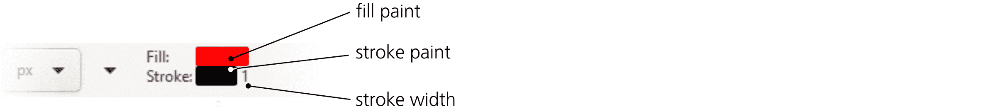

图 11-1: 这个样式将用于新创建的形状。

默认情况下，除螺旋形工具外，所有形状工具都会使用*上一次设置的样式*作为新对象的样式。这意味着每当你更改对象中的某些样式属性时，Inkscape 会记住该属性，并在创建新形状时使用它。例如，在你将某物涂成绿色后，所有新创建的矩形、椭圆、星形等将会使用相同的绿色阴影。或者，如果你为某个路径或形状分配了 3 像素的描边宽度和 1:1 的虚线样式，新的形状也将使用该描边样式。（对于 3D 盒子来说，这种行为更为复杂，因为它们不仅仅使用一种样式，而是为盒子的六个面使用六种不同的样式；详细信息请参见 11.3.5）。

如果你不希望新对象使用最近设置的样式，可以进行更改。在工具箱左侧双击某个形状工具按钮，打开该工具在偏好设置对话框中的页面（3.1.1），如图 11-2 所示。在那里，使用双向切换按钮将新对象的样式设置为*最后使用的样式*，或者设置为该工具特定的固定*工具样式*。要更改工具样式，点击**从选择中获取**按钮，将当前选择的样式保存为该工具的样式。

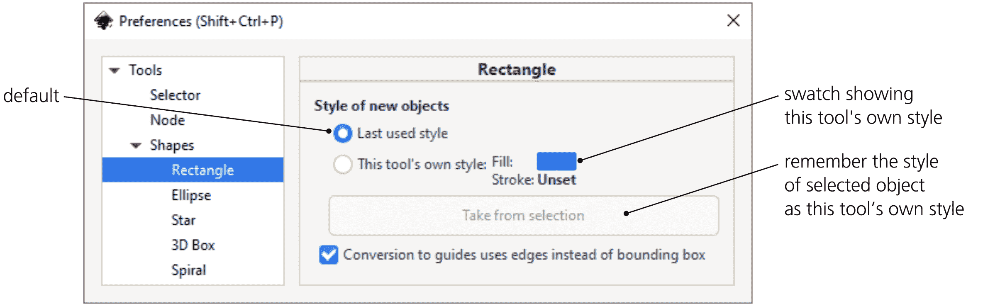

图 11-2：形状工具的偏好设置页面

例如，如果你希望所有新建的矩形都是黑色且没有边框，选择一个黑色的无边框对象，进入**偏好设置 ▶ 工具 ▶ 形状 ▶ 矩形**，切换到**此工具的自定义样式**，然后点击**从选择中获取**。

## 11.2 矩形

*矩形*，虽然听起来有些无聊，却是最常用的形状类型。你几乎不可能找到一个不以矩形为主的设计。Inkscape 使得创建和编辑矩形变得尽可能简单和多功能。

切换到矩形工具（点击左侧工具栏按钮或按 R 或 F4 键），然后在画布上任意位置拖动，如图 11-3 所示。按住 Ctrl 拖动可以绘制正方形或整数比例（2:1，3:1 等）矩形；按住 Shift 拖动可以让矩形的起始点位于矩形的中心，而不是角落。你也可以同时按 Ctrl 和 Shift。

图 11-3：绘制矩形

新的矩形会显示四个控件，如图 11-4 所示。左上角和右下角各有一个小方块，这些是*调整大小控件*。另外两个控件是小圆圈，称为*圆角控件*；它们都位于右上角，看起来像是一个控件，直到你拖动其中一个。

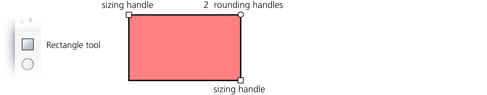

图 11-4：矩形控件

### 11.2.1 调整大小

使用调整大小控件，你可以通过*拖动*任意一侧来调整矩形的大小。按住 Ctrl 拖动会锁定宽度、高度或宽高比，控件会自动对齐到矩形的边缘或对角线。

在控制栏中，标有 W 和 H 的两个数值控件也可以控制选中矩形的宽度和高度。它们使用右侧单位选择器中选定的计量单位。

为什么要使用大小调整手柄，当你可以用选择工具轻松调整矩形的大小呢？选择工具总是按照文档坐标系水平或垂直地缩放物体——也就是沿着页面的边缘。相比之下，矩形的大小调整手柄会沿着矩形的边缘缩放它，即使矩形被旋转或倾斜。W 和 H 值也总是反映矩形固有的宽度和高度，而不一定是其边界框的尺寸，如果矩形被旋转或倾斜，可能会有很大的不同（见 图 11-5）。

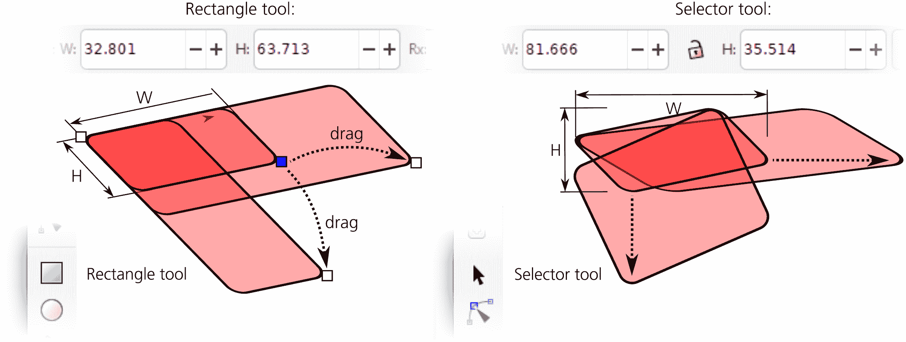

图 11-5：矩形大小调整手柄与选择工具的缩放

大小调整手柄的另一个优点是它们始终保留矩形圆角的半径（尽管稍后你将看到选择工具也能做到这一点）。

与任何其他形状类型一样，你可以使矩形的手柄与网格、参考线和其他对象对齐（7.3）。如果你从一个特别旋转和/或倾斜的矩形开始，并启用节点对路径、节点和交点的捕捉，就可以使用复制（Ctrl-D）和大小调整手柄创建紧密贴合、无缝的轴测矩形组合，如 图 11-6 所示。

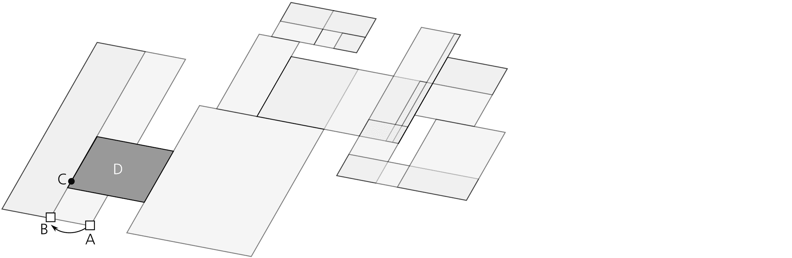

图 11-6：将倾斜的矩形互相对齐

捕捉的是*鼠标指针*，而不一定是手柄本身。如果例如你在使用 Ctrl 锁定矩形的宽度或高度进行调整，这两者可能会相差很远。在 图 11-6 中，我想使最左边的矩形变窄但保持其高度，所以我使用 Ctrl 将手柄从 A 移动到 B。然而，我还想让这个矩形紧邻矩形 D 的左边缘（用粗线标记），所以在拖动时，不放开 Ctrl，我将鼠标指针移动到点 C，使其捕捉到我需要的边缘（实际手柄位置在 B），然后释放鼠标。为了实现这一点，我启用了节点和手柄作为捕捉目标以及路径作为捕捉目标（7.3）。

### 11.2.2 圆角

要使矩形的角变为圆角，抓住一个圆形的角落手柄，并沿着矩形的边拖动它。矩形的所有四个角都会变成圆弧。此外，现在你可以看到第二个圆角手柄——它保持在角落的原始位置（见 图 11-7）。如果你需要圆形的圆角，可以保持这种方式。如果你想要椭圆形的角而非圆形的，把另一个手柄从角落移开，沿着矩形的另一边移动。

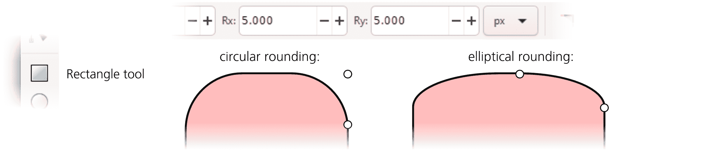

图 11-7：矩形圆角手柄

使用控制栏中的 Rx 和 Ry 数值字段，你可以在绝对单位（通过右侧的单位选择器选择）中明确设置两个圆角半径。如果选择了多个矩形，你输入的值将应用于所有矩形（如果选择了非矩形对象，它们将被忽略）。右侧带有角图标的按钮可以去除所选矩形的所有圆角。

你可以移动圆角手柄的最大距离是对应矩形尺寸的一半。当两个圆角手柄都达到这个最大值时，矩形会变成一个圆形，非正方形则会变成椭圆形。

在技术图纸如方案图和示意图中，圆角的大小和形状通常需要在整个构图中保持一致，即使矩形的大小不同。Inkscape 使这变得简单。选择工具栏中四个 Affect 按钮中的第二个（6.11），带有两个同心圆角的按钮，控制矩形缩放时是否缩放圆角。图 11-8 显示了使用此按钮开启和关闭时，缩放矩形的效果。

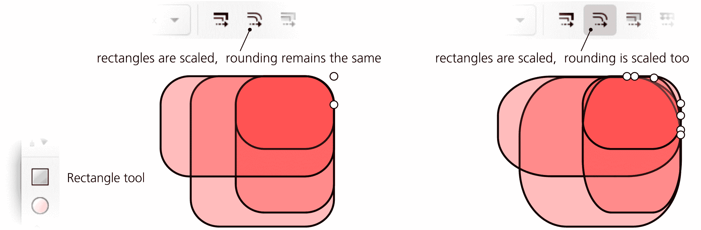

图 11-8：缩放矩形可能会或不会影响其圆角半径。

以下是矩形圆角手柄的快捷键：

+   按住 Ctrl 拖动以使圆角变为圆形（即使另一个半径相同）。

+   Ctrl+点击一个手柄，可以不拖动而使圆角变为圆形。

+   Shift+点击一个手柄以去除圆角。

## 11.3 3D 方框

*3D 方框* 是表示三维方框（长方体）投影到平面上的对象。因此，它由六个*面*组成，从纯 SVG 视角来看，它只是六条路径的组合，每条路径有四个节点和四个线段。然而，Inkscape 以特殊方式处理这些对象——例如，你可以在它们自己的 3D 空间中调整大小和移动，或者一次性重新定位多个方框的消失点。

除了 3D 方框工具，其他大多数工具和命令将 3D 方框视为一个组。特别是在选择工具中，你可以 Ctrl+点击、Ctrl+Alt+点击或 Alt+拖动选择方框内的任意一面（通常用于更改样式），就像选择组内的对象一样。选择方框内的面不会破坏方框；但是，你可以轻松地通过路径 ▶ 对象转路径（Shift-Ctrl-C）命令“取消方框”——这会去除任何 3D 特性，留下一个普通的包含路径的组。你也可以简单地取消组合（Ctrl-U）一个 3D 方框。

### 11.3.1 为什么使用 3D 方框？

3D 方框这种专门构造的实用性在哪里？

Inkscape 并不会取代一个功能全面的 3D 应用程序——它并不会模拟一个“真实”的三维空间，你无法在其中放置你的 3D 物体。Inkscape 是并且永远是一个二维绘图工具。然而，它经常被用来绘制三维物体。为了辅助这一点，Inkscape 实现了一个简单的、以二维为导向的*透视绘制*系统——其原理自文艺复兴时期六百年前被完善以来一直未变。

在 Inkscape 中，你并不是在“构建一个 3D 世界”；你只是创建一个平面图形，表示某个透视下的三维场景。Inkscape 的 3D 方框工具主要是一个助手，它使得创建这种透视图形变得更加容易。在透视图绘制中，方框几乎和矩形在二维绘图和排版中的重要性一样；正确的透视绘制通常从绘制其包围方框开始。因此，Inkscape 的 3D 方框通常不是为了它们自身的目的，而是作为快速且 3D 精确的透视绘图指南——用来对齐物体和将其描绘进去（见第二十二章的示例）。

另一方面，在 Inkscape 中创建和重塑 3D 方框的便利性本身就是一种灵感。Inkscape 0.46（该工具首次亮相的版本）的关于页面（帮助 ▶ 关于）就是一幅艺术作品的例子，作品中以 3D 方框为主，如图 11-9 所示。

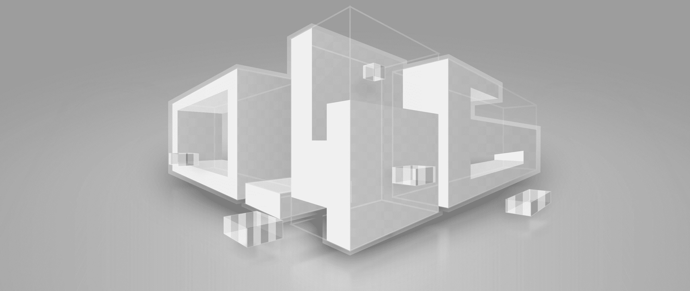

图 11-9：3D 方框的组合

### 11.3.2 绘制

要绘制 3D 方框，切换到 3D 方框工具（按 X 键或 Shift-F4），然后在页面框架内的任意位置拖动（因为默认的消失点位于页面的左右边缘）。这样会在 X/Y 平面上创建方框的前面，沿 Z 轴的深度保持固定。要切换到 Z 轴，按住 Shift 键进行拖动；这会冻结 X/Y 侧面，但可以调整深度，如图 11-10 所示。

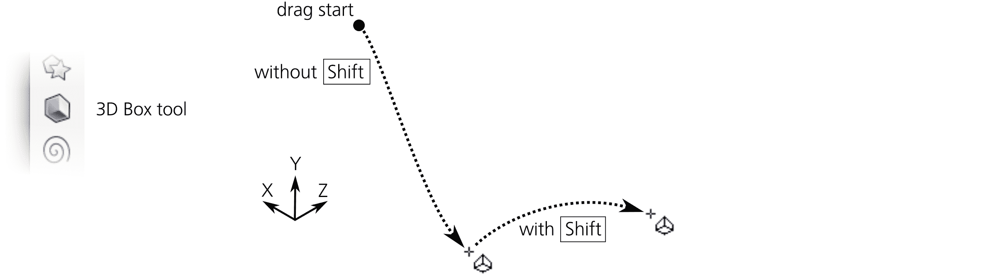

图 11-10：绘制 3D 方框

一旦创建了方框，它将在八个角落显示一个菱形控制柄，并在中央显示一个十字形控制柄。此外，彩色线条会从方框的边缘延伸到消失点。让我们详细看看这些控制项。

### 11.3.3 透视与消失点

每个 3D 方框都存在于某个*透视*中，这个透视由三个*消失点*定义，分别对应三个空间维度：X（红色导向线）、Y（蓝色导向线）和 Z（黄色导向线）。每个消失点可以是*有限*的（它是一个实际的控件，你可以拖动它）或*无限*的（它只是指向无限远的方向；你可以改变这个方向的角度）。

默认情况下，X 和 Z 消失点是有限的，位于文档页面的左右边缘的中间。Y 消失点是无限的，其方向垂直，如图 11-11 所示。

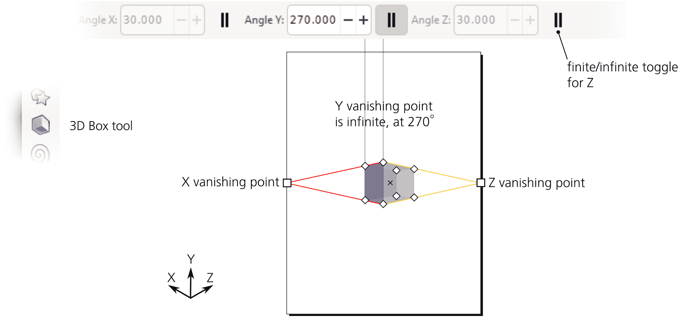

图 11-11：默认透视

你可以使用工具控制栏中的三个按钮切换每个维度消失点的有限/无限状态。有限的消失点可以在画布上自由拖动。无限消失点的角度可以在控制栏中数值调整，或者通过快捷键进行调整：

+   [ 和 ] 旋转 X 消失点的方向。

+   ( 和 ) 旋转 Y 消失点的方向。

+   { 和 } 旋转 Z 消失点的方向。

如果没有按修饰键，这些键按角度步长旋转（默认是 15 度，6.3）。按住 Alt 键时，它们旋转的角度使得透视线在当前缩放级别下最多移动 1 个屏幕像素。

Shift-X、Shift-Y 和 Shift-Z 切换相应的消失点，从有限状态切换到无限状态，反之亦然。

例如，你可以将三个消失点都设为无限，并将它们旋转到 150（X）、90（Y）和 30（Z）度的角度，从而绘制等距盒子而没有透视缩短。此外，虽然盒子在三个消失点之间的位置最自然，但它们不必局限于此；将盒子移离“自然”透视的甜点位置，会使其看起来奇怪的失真——有时，这正是你所需要的效果。

#### 11.3.3.1 合并与分离透视

对于新创建的 3D 盒子，Inkscape 会重复使用*最后选择的* 3D 盒子的透视。因此，图形中的盒子通常会*共享*相同的透视。当你改变透视时，*所有*使用该透视的盒子——无论是否被选中——都会响应变化，如图 11-12 所示。

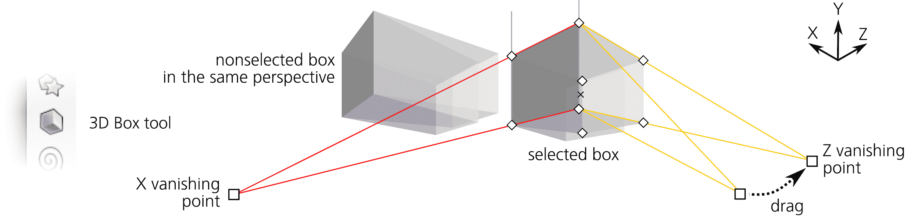

图 11-12：通过拖动消失点改变透视会影响该透视中的所有盒子。

如果多个盒子共享一个透视，你可以通过按住 Shift 拖动其有限消失点（仅选择该盒子）来*分离*其中任何一个。与没有按 Shift 拖动不同，这一变化只会影响所选的盒子。一旦分离，任何透视变化（无论是通过拖动有无 Shift，还是通过控制栏）只会影响该盒子。

此外，当你在选择工具中移动一个 3D 盒子对象时，它的消失点集合会随盒子一起移动，如果它之前共享透视，实际上会将其透视分离。这意味着，如果你希望你的 3D 场景保持一致的透视，应避免在选择工具中操作 3D 盒子。

将两种不同的视角*合并*在一起，使它们成为一个整体是同样简单的。为此，选择两个具有不同视角的框，将一个视角的有限消失点移动到另一个视角的同一维度（同色）点——它们将自动对齐并连接（类似于渐变处理当拖动靠近时的连接方式，10.4.3），如图 11-13 所示。现在，这两个框将具有相同的视角。（如果视角中有任何无限消失点，则它们的方向角度必须相同，才能成功合并视角。）

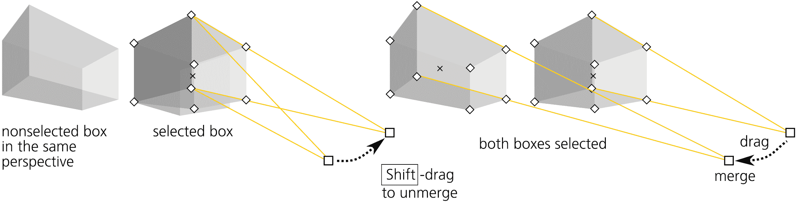

图 11-13：合并和分离消失点

### 11.3.4 手柄

每个 3D 框体，在形状工具或节点工具中选中时，会显示八个菱形的*角落手柄*和一个 X 形的*中心手柄*。没有修饰符时，前 X/Y 面上的四个手柄会重新塑造该面，而另外四个手柄则会改变框体的 Z 深度。然而，按住 Shift 时，它们的角色会发生反转，如图 11-14 所示。

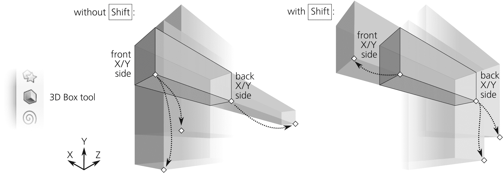

图 11-14：带 Shift 和不带 Shift 拖动框体角落手柄

按住 Ctrl 时，边缘调整手柄会自动对齐到该边缘的延续线以及其对角线。对于深度调整手柄，Ctrl 不会产生任何效果（图 11-15）。

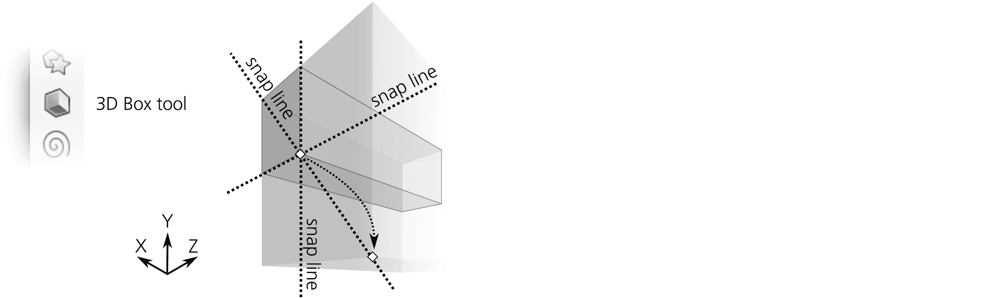

图 11-15：按住 Ctrl 拖动框体角落手柄

你可以通过将手柄拖动到并超出对应轴上另一个手柄的位置，来使框的任何一个维度变为负值。这样会反转边的顺序（即，该轴上的远端变为近端，反之亦然）。不过不推荐这样做，因为这种“里外反转”的框并不总是正确渲染其侧面的 z 顺序。

拖动中心手柄时不使用任何修饰键会在 X/Y 平面内移动框体；按住 Ctrl 时，它会使框体对齐到其 X 和 Y 消失点的方向，以及它们之间的角平分线。按住 Shift（无论是否按住 Ctrl），中心手柄会将框体朝向其 Z 消失点移动，如图 11-16 所示。

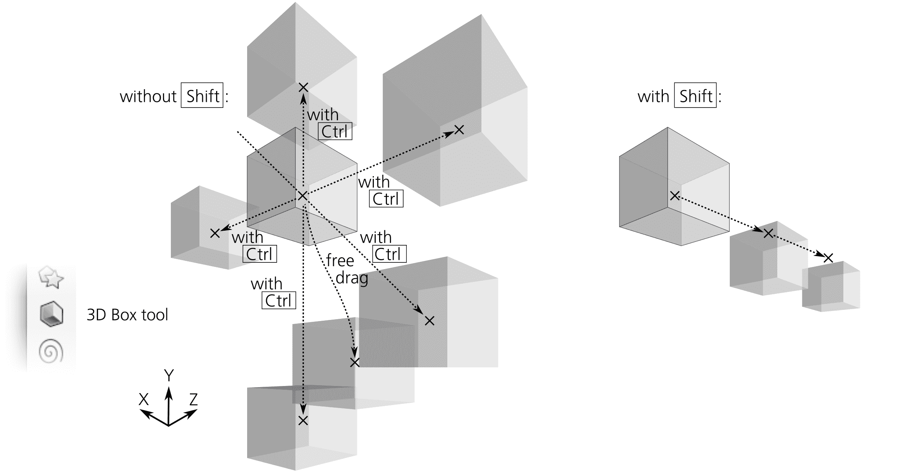

图 11-16：带 Shift 和不带 Shift 拖动框体中心手柄

与矩形相似，如果启用了节点对路径、节点和交点的对齐（7.3.1.2），你的 3D 场景会非常灵敏——你绘制或调整大小的所有内容都将热衷于对齐和连接，使得用框体构建没有缝隙的实心结构变得愉快。例如，要构建一个多层建筑，可以先绘制一个单层的框体，然后按 Ctrl-D 复制它，接着按住 Ctrl 拖动复制框体的中心手柄向上移动，直到它自动对齐到下一级，如图 11-17 所示。

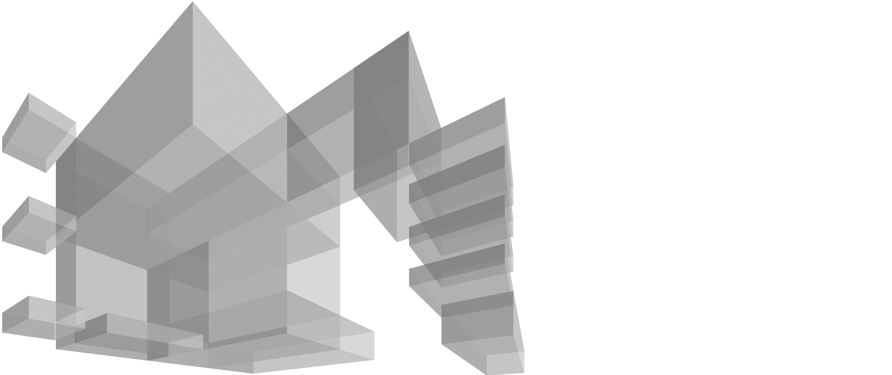

图 11-17：使用 Ctrl 和自动对齐手柄到路径，使构建复杂场景变得轻松。

### 11.3.5 样式

从样式的角度来看，3D 盒子与路径组没有什么不同。默认情况下，新盒子的六个面有不同的蓝色阴影；你可以给整个盒子涂上某种颜色（消除面之间的差异），或者你可以按住 Ctrl 键点击并按住 Ctrl+Alt 键点击来选择任何一个面单独涂色。

你甚至可以像进入一个组一样*进入*盒子（5.10），通过选择它并按 Ctrl+Enter 键。之后，你可以通过简单的点击或使用 Tab 和 Shift-Tab 来选择单个面。无论你如何为各个面设置样式，盒子仍然是一个盒子，因此它的样式会在所有 3D 变换中被保留。要移除 3D 盒子的功能，你需要取消分组（Ctrl-U）或将其转换为路径（Shift-Ctrl-C，这实际上将其转换为一个*路径组*）。

除了改变填充或描边的颜色之外，你还可以对整个盒子或它的单个面应用模糊效果（17.1）、裁剪和蒙版效果（18.3）。如果你降低了 3D 盒子的透明度，它将在组级别（4.8.2）工作——也就是说，你可以看到盒子下面的内容，但无法看到盒子本身的隐藏面。要查看隐藏面，你需要通过单独选择每个面并降低它们的透明度，如图 11-18 所示。

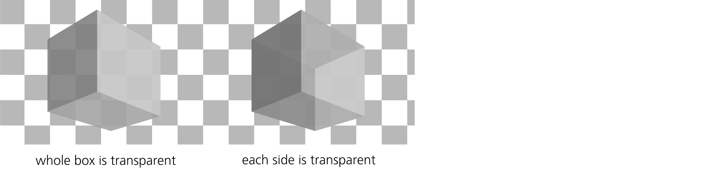

图 11-18：整个盒子的透明度与单个面透明度对比

从三维视角来看，盒子各面的*z 顺序*是自动正确的——也就是说，应该距离你更远的面位于 z 顺序的底部，前面的面位于 z 顺序的顶部。然而，不同盒子的 z 顺序并不会被 Inkscape 强制执行；和其他形状工具一样，3D 盒子工具会在当前图层的 z 顺序之上创建一个新盒子（4.4）。因此，在绘制一个盒子之后，你可能需要将其在 z 顺序堆栈中相对于其他盒子进行移动，以便让组合看起来正确。

对于新创建的盒子，工具提供了一个选择项，在最后设置的样式与工具自带的样式之间进行选择（11.1.2）——但有一点不同。默认情况下，3D 盒子工具使用最后设置的样式，但与所有其他工具不同，它会记住在*同一个 3D 盒子面*上最后设置的样式，而不是任何对象的样式。例如，如果你将任何盒子的顶面涂成红色，那么你之后创建的所有新盒子的顶面（而不是其他面）都会是红色。

由于三维场景通常假设只有一个光源，这种行为是合理的。绘制一个单独的盒子，并绘制它的各个面，就像它们被从例如左上角的光源照亮一样。之后，你创建的所有新盒子将以类似的方式“照亮”。

Tweak 工具在 3D 框体上的工作方式与它在路径（无论是否分组）上的工作方式完全相同。使用路径调整模式（12.6），一旦你扭曲了框体的边，框体就不再是 3D 框体，而变成了一个简单的组。然而，颜色绘制和颜色抖动模式会在不破坏其 3D 能力的情况下对框体进行着色。启用色相和可能的饱和度通道，而不是亮度通道（8.9.3），可能是有意义的，这样你就可以调整框体的颜色，但仍能保留其边缘的相对亮度和暗度，以保持 3D 效果，如图 11 在颜色插图中所示。

## 11.4 椭圆

椭圆是一种形状，既可以表示*椭圆*或*圆*，也可以表示*弧*（椭圆或圆的一段弧，带有弦）或*线段*（弧加上从弧的两端出发并在中心相交的两个半径），如图 11-19 所示。

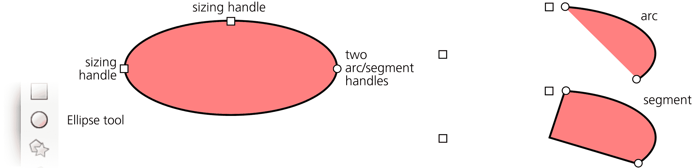

图 11-19：椭圆、弧和线段的控制点

### 11.4.1 绘制

要切换到椭圆工具，按 E 或 F5。以下是椭圆绘制的快捷键：

+   在画布上拖动会创建一个内接于你拖动创建的（假想的）矩形的椭圆。

+   按住 Ctrl 时，那个假想的矩形首先被限制为一个正方形或一个整数比例（1:2、2:1 等），然后椭圆被内接到其中。

+   按住 Shift 时，绘制从中心开始，因此*椭圆的四分之一*被内接到这个矩形中，而不是整个椭圆。当同时按住 Ctrl 和 Shift 时，你会从中心开始绘制一个圆或一个整数比例的椭圆（图 11-20）。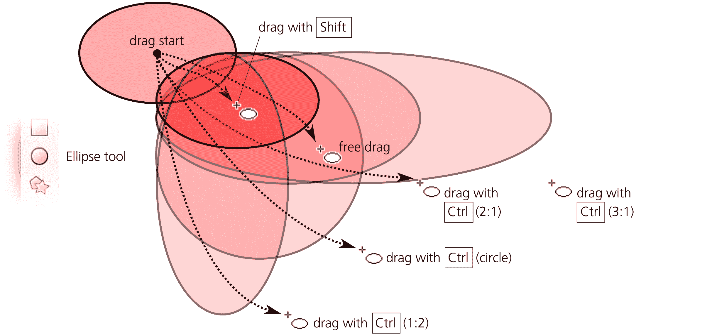

    图 11-20：绘制没有 Alt 的椭圆

+   按住 Alt 时，工具的行为发生变化（见图 11-21）。现在它绘制一个*对角线*从鼠标拖动的开始到结束点的椭圆。换句话说，你从椭圆的 10:30 时钟位置开始拖动，并在 4:30 点结束，椭圆会根据需要被压缩以适应这个对角线。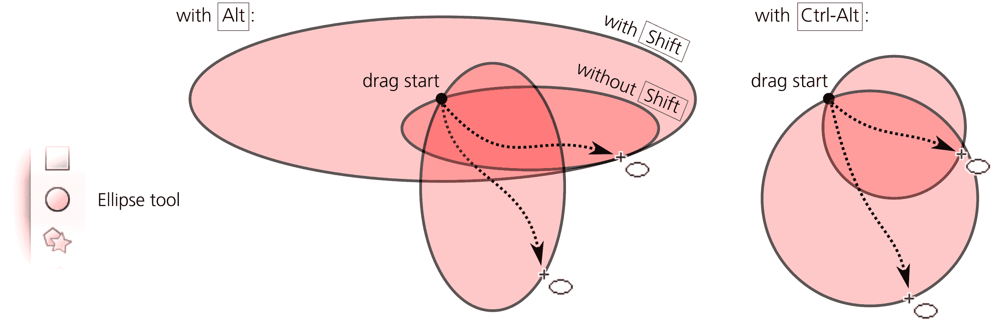

    图 11-21：按住 Alt 绘制椭圆

+   按住 Ctrl-Alt 时，工具总是绘制一个完美的圆形，其直径从拖动开始到拖动结束。这对于需要给定直径的圆形非常方便。

+   在 Alt 和 Ctrl-Alt 的基础上按住 Shift，操作与没有 Shift 时相同，但开始时是从中心绘制——换句话说，它会创建一个给定*半径*的圆。

创建固定大小圆形的一个快速方法是通过在“钢笔工具”中的直线或平行模式下 Ctrl+点击（14.1.4）。你可以在钢笔工具的首选项页面设置这些圆形的大小。按住 Shift 可以使它们的大小加倍，或按住 Alt 可以随机化它们的大小，如图 11-21 所示。

### 11.4.2 控制点

创建时，椭圆会显示四个手柄：两个方形手柄（上方和左侧），一个圆形手柄（右侧），以及一个 X 形手柄（中心）。与矩形类似，方形手柄是大小调整手柄，而圆形手柄实际上是两个重叠在一起的手柄。在椭圆中，它们不是用来做圆角的，而是用来将椭圆转变为弧形或线段，正如你将很快看到的那样。X 形手柄移动整个椭圆，并用于中心吸附（7.3.1.3）。

与矩形类似，椭圆的大小调整手柄改变的是椭圆的宽度和高度*在椭圆的坐标系中*，而不是文档坐标系中。无论你如何旋转或倾斜椭圆，这些手柄都会记住椭圆两个轴的位置，并允许你相对于这些固有轴拉伸或挤压椭圆，同时始终保持中心位置不变，如图 11-22 所示。

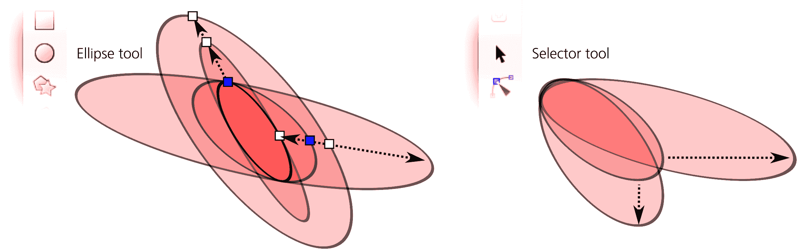

图 11-22：在选择器中以及通过大小调整手柄转换椭圆形状

以下是椭圆大小调整手柄的快捷键：

+   按住 Ctrl 拖动将椭圆转为圆形，通过使另一个半径相同。

+   Ctrl+点击一个手柄将椭圆转换为圆形，而无需拖动。请注意，如果椭圆已被倾斜，圆形仍可能看起来是椭圆形的。

现在让我们来看看弧形/线段手柄——圆形手柄。要创建一个线段（一个弧加上两个半径），将这些手柄之一或两个拖动到椭圆形外部；要创建一个*弧形*，则拖动时保持*在椭圆内*。当然，手柄本身既不在内也不在外，而是恰好位于椭圆的边缘；“在内部拖动”是指当你抓住手柄时，鼠标的移动位置。请注意，大小调整手柄仍然有效，并且与整个椭圆形时的位置相同（这可能在你的弧形或线段之外）。

椭圆工具的控制栏允许你指定弧形的精确角度，将其转为线段，并将椭圆恢复为完整形状（图 11-23）。

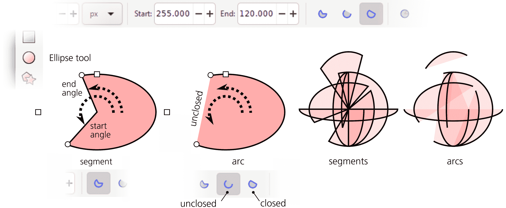

图 11-23：线段和弧形

请注意，与线段（始终是封闭的）不同，弧形可以是*封闭*或*未封闭*的。未封闭的弧形沿椭圆的边缘绘制，但不会连接弧形的两端（如果你去掉填充，仅保留描边，就能明显看到这一点）。使用控制栏上的两个弧形按钮之一，可以在封闭和未封闭之间切换弧形。

以下是弧形/线段手柄的快捷键：

+   按住 Ctrl 键时，拖动时会将手柄卡入角度增量（默认 15 度，6.3）。

+   Shift+点击一个手柄将弧形或线段转换为完整椭圆。

与所有其他形状参数一样，椭圆的起始和结束角度会被记住并在新创建的形状中重新使用。如果你最近将另一个椭圆转为线段时，你本想绘制椭圆却得到一个窄的扇形，可能会让你感到惊讶。

## 11.5 星形与多边形

星形工具（*键或 Shift-F9）创建两种略有不同的旋转对称形状：多边形和星形（见图 11-24）。尽管这一概念很简单，但这是 Inkscape 中最有趣的工具之一——非常适合给朋友们留下深刻印象！

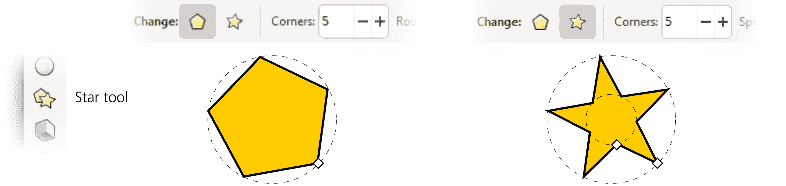

图 11-24：多边形和星形

*多边形*由一组等距的点组成，这些点位于一个假想的圆上，并通过线段连接。在 Inkscape 中，多边形有一个菱形手柄，用于缩放、旋转，并控制连接线段的形状。

*星形*是一种更有趣的形状。它在两条假想的同心圆上有两组等距的点，星形的轮廓在内圆和外圆上的点之间来回折返。使用星形的两个手柄，你可以改变这两条圆的直径，并使它们围绕共同的中心彼此旋转，从而产生一种迷人的对称形状变化。

### 11.5.1 绘制

在绘制新形状之前，通过按下控制栏中的切换按钮决定你是想要绘制多边形还是星形，并在数字控制中选择角点的数量（凸顶点）。例如，三个角点的多边形是等边三角形，如果转换为路径，则会有三个节点；而三个角点的星形则会有六个节点。你也可以随时更改现有形状的多边形/星形类型和角点数——只需选择形状并编辑数值。

星形的最小角点数为 2，而多边形为 3。三角形自然是一个三角形，而两角的星形则会形成菱形或平行四边形。

绘制一个形状再次和在画布上拖动鼠标一样简单。星形或多边形总是从其中心开始绘制。这里只有一个快捷键：按住 Ctrl 拖动时，会将形状某个角点相对于其中心的角度调整为 15 度的增量。

### 11.5.2 手柄

拖动多边形的菱形手柄可以缩放和旋转多边形——这也是通过选择器进行转换时能够做的操作。星形的两个手柄则更加有趣。

首先，通过将其中一个角点移动到离星形中心更近或更远的位置，你正在改变星形角点所在的两个圆的直径比例。这个比例称为*辐条比*，并且在控制栏中可以作为数字参数进行调整（多边形无法调整此参数）（见图 11-25）。

图 11-25：调整一个五顶点星形的辐条比

你甚至可以将原始的内手柄移动到比外部手柄更远的位置。控制条仍然会显示一个小于 1 的比例，因为它始终将较小的半径除以较大的半径，无论它们最初是内圈还是外圈。

接着，内手柄（最初位于内圆上）可以沿着星形中心的弧线*切向*移动——以扭曲星形的顶点，如图 11-26 所示。（旋转外手柄只会旋转整个星形。）

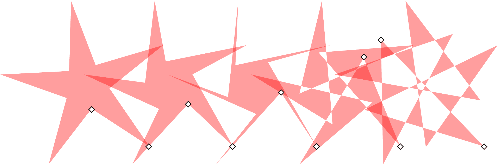

图 11-26：将星形的内手柄沿切线方向移动

如果您希望保持顶点严格按径向排列（没有切向位移），可以按住 Ctrl 拖动内手柄，或者 Ctrl+点击内手柄以去除任何现有的切向倾斜而无需拖动。

### 11.5.3 圆角

通过*圆角化*星形或多边形，您可以创造出迷人的效果。这与矩形的圆角不同；在星形或多边形中，不仅角部失去锐利感，而且形状的边缘也会弯曲成优雅的贝塞尔曲线（图 11-27）。

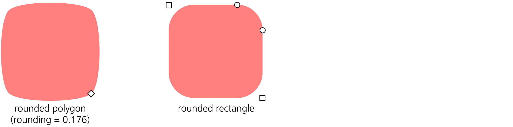

图 11-27：与圆角矩形相比，圆角四边形

请注意，圆角矩形的直线段位于圆形或椭圆形的圆角之间。然而，圆角多边形或星形没有任何直线段——它的所有边都变成了贝塞尔曲线。

星形工具的圆角数字控制是每个贝塞尔手柄的长度（12.1.4）与该手柄影响的多边形/星形边长的比例。该参数可以为负值，这会反转切线的方向。通常，0.2 到 0.4 之间的值能产生最自然的效果。负值或过高的正值可能会导致扭曲、循环或自交。通过调整此值，您可以获得各种各样的美丽形状，如图 11-28 所示。

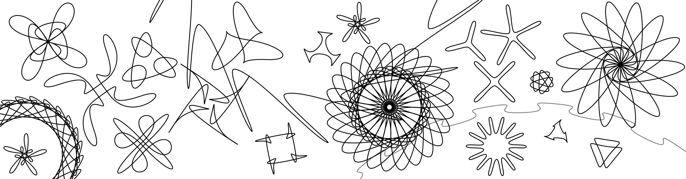

图 11-28：圆角星形的乐趣

除了控制栏上的数字圆角参数外，您还可以通过按住 Shift 键切向拖动任意手柄来进行圆角处理。对于正向圆角，逆时针旋转手柄；顺时针旋转则为负向圆角。Shift+点击手柄可去除任何圆角效果。

如果您希望星形的外角保持锐角，而内角保持平滑，或反之，请尝试从星形创建一个偏移路径（12.4）。

### 11.5.4 随机化

另一种使星形变得有趣的方式是通过*随机化*它。随机化将星形或多边形的所有顶点沿随机方向和随机距离移动。如果星形已经是圆角的，随机化将保留所有顶点的平滑度。

控制栏中的随机化参数控制效果的整体强度。它可以取正值或负值。当您更改此值时，或者简单地按住 Alt 键并切向拖动星形的手柄时，每个节点的随机位移方向保持不变，只有距离发生变化；负值则会使顶点向相反方向移动。换句话说，星形的随机化方式保持不变，只是程度有所不同。

相比之下，当你简单地拖动一个随机化星形的控制点来缩放或重塑它，或者当你绘制一个具有非零随机化的新星形时，形状会颤动并且抖动，所有节点的随机位移会随着鼠标的微小移动而突然改变（在数学术语中，这就是*重新播种*随机化）。因此，如果你希望你的星形随机化有所不同，但整体振幅保持相同，只需轻微拖动其任何一个控制点，如图 11-29 所示。

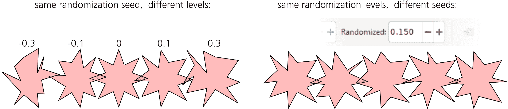

图 11-29：随机化星形

随机化的星形有什么用呢？随机性是自然的基本原则，设计中的随机性是一种让事物看起来不那么僵化、更自然的好方法。你的艺术感觉会告诉你在哪里以及多少程度的随机化是合适的。Inkscape 提供了许多艺术随机性的来源：你可以打乱对象的位置（7.5.2），创建具有随机位置、缩放和旋转的图案（16.6），以及随机地改变路径中节点的位置来扭曲它们（12.6.6）。然而，随机化的星形在创造一种内在对称性突显其随机性的形状时独具特色。

轻微的随机化会让星形更加生动——有时甚至非常有趣。强烈的随机化会产生各种狂野且无法预测的形状——凌乱的毛球，圆形的变形虫样墨迹，大星形边缘的奇幻景观，具有许多顶点和接近 1 的辐条比例。作为一个例子，图 11-30 显示了一个有 500 个顶点的星形，没有随机化（左）和随机化了 0.005（右），看起来更加自然，且去除了莫尔纹理。

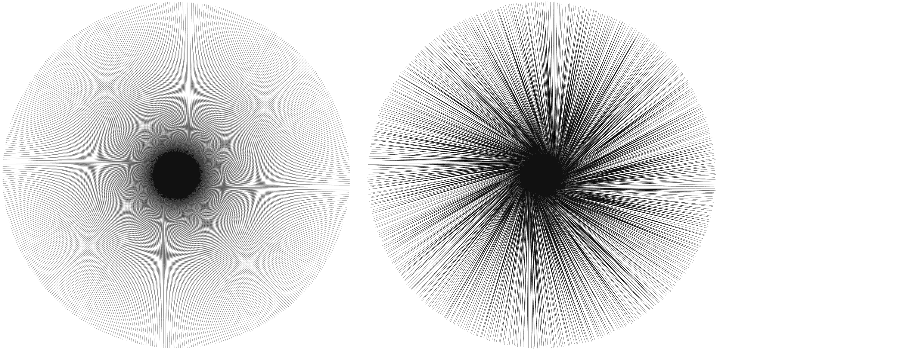

图 11-30：一个没有随机化的 500 个顶点的星形（左）和随机化程度为 0.005 的星形（右）

另一个例子是这里有一组随机但不聚集的（7.5.2）五边形，圆角为 0.28，随机化程度为 0.15，看起来很像海滩上的卵石，正如图 11-31 所示。

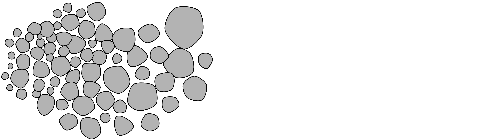

图 11-31：卵石：一种不聚集的圆角随机化五边形分布

## 11.6 螺旋线

螺旋线工具（I 键或 F9）创建了另一种简单但多用途的形状：*同心螺旋线*。作为绘图辅助工具和一种独立的形状，螺旋线非常有用——并且不亚于星形的激动人心。

螺旋线，像星形一样，是从中心开始绘制的。按住 Ctrl 键拖动时，拖动点（螺旋线的外端）会按 15 度的增量对齐（6.3）。与所有其他形状工具不同，螺旋线工具默认使用自己的样式来创建新螺旋线——没有填充，黑色 1px 的描边——而不是上次使用的样式（11.1.2）。

绘制完成后，螺旋会在线的两端显示两个手柄。只需拖动这些手柄，螺旋就会从内侧或外侧滚动进出。通过这种方式，你可以例如创建一个只有一圈的螺旋。

控制栏上的 Turns 参数表示你的螺旋从中心到外端绕了多少圈。螺旋的最大圈数为 1000。Inner radius 值控制内端；它表示螺旋开始的总圈数的百分比（图 11-32）。例如，Inner radius 为 0 表示螺旋从中心开始；0.5 表示它从中心和外端之间的中点开始。

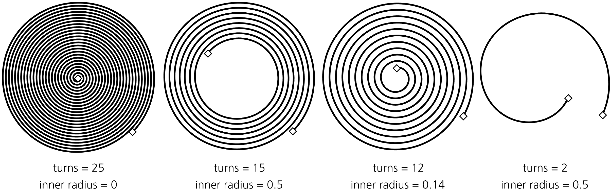

图 11-32：调整圈数和内半径

螺旋的发散度控制螺旋的缠绕是否均匀（发散度 = 1）、是否向中心变得更密集（发散度 > 1）或是否向外围变得更密集（发散度 < 1）。你可以通过控制栏数值更改该参数，或者通过按住 Alt 键并上下拖动内手柄，如图 11-33 所示。

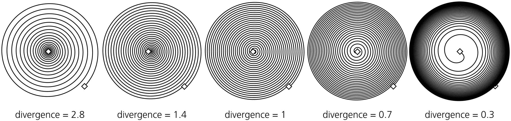

图 11-33：调整发散度

这是外部手柄的其他快捷键：

+   按住 Shift 键并拖动以围绕中心进行缩放或旋转（不会滚动或展开）；这与绘制螺旋时的行为相同。

+   按住 Alt 键并拖动以在滚动或展开时锁定半径。这样，整个螺旋将变得更密集或更稀疏，而不会改变其整体大小。

内部手柄快捷键包括：

+   按住 Alt 键并垂直拖动以调整发散度。

+   按住 Alt 键并点击以将发散度重置为默认值 1。

+   按住 Shift 键并点击以将内半径重置为 0（即将内手柄移动到中心）。

什么时候使用螺旋比较合适？螺旋以均匀的同心图案填充指定空间——这是手动绘制或使用其他工具可能很难实现的效果。因此，它可以作为绘图指南或承载其他对象的载体，例如标记（9.5.1）、虚线图案（9.4）、路径上的文字（15.2.4）或实时路径效果（第十三章）。另外，像椭圆工具一样，螺旋工具对于创建曲率平滑变化的曲线也很方便；与普通的贝塞尔曲线不同，你可以通过沿曲线拖动手柄*调整*弧线或螺旋的长度，而不影响其形状。
