# 第十二章：编辑路径

在典型的矢量绘图中，绝大多数对象都是路径。这就是为什么熟悉路径如此重要——否则，你无法真正说自己懂得如何在矢量编辑器中工作。Inkscape 提供了丰富的工具、命令和效果，专门用于处理路径。

我将从 SVG 路径的基础知识和一些传统的路径工具开始，这些工具的类似物你可能已经在其他软件中见过。然后，在本章后半部分以及下一章中，我将介绍一些先进的 Inkscape 路径编辑技巧，它们通常更加高效——而且几乎总是使用起来更有趣。例如，你可能会发现，Tweak 工具（12.6）非常自然，你很少需要依赖更加技术性和底层的节点工具（12.5）。尽管如此，了解路径由什么组成并且在必要时能直接操作路径节点仍然非常重要，因为这是任何类型的矢量图形的基石之一。

## 12.1 路径的结构

路径是由一系列*节点*（点）通过直线或曲线*段*连接而成的（图 12-1）。每个节点可能只有一个相邻段（如果它是端节点）或两个相邻段（如果它是中间节点）；SVG 不支持在同一节点连接多个段的分支路径。

图 12-1：路径 = 节点 + 段

路径的长度没有限制；它可以有从两个到成千上万个节点。一个路径也可以只有一个甚至零个节点，但这样的路径是不可见的。

使用路径，你至少可以近似（在许多情况下，甚至可以精确地复制）任何可想象的形状、形式或图形。根据所需的形状和精度，在最糟糕的情况下，你只需要使用许多密集排列的节点（图 12-2）。

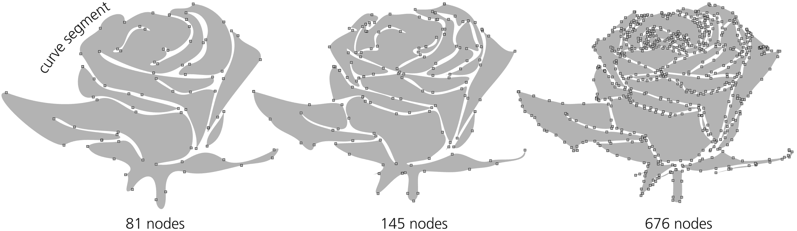

图 12-2：你可以通过几个节点大致近似相同的图形，或通过更多节点更精确地重现它。

### 12.1.1 子路径

在路径中，顺序相邻的一对节点可能并不通过一个段连接。这会在路径中产生一个间隙，每一个这样的间隙将路径分割成不相连的部分，称为*子路径*，如图 12-3 所示。

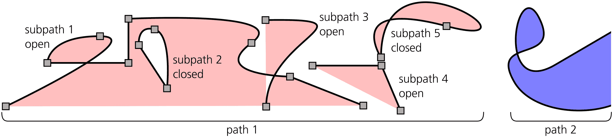

图 12-3：子路径是路径中一组相连的节点。

一个没有任何间隙的路径被认为由单一的子路径组成。任何子路径，就像一段绳子，可以是*开放的*（有两个松散的端点，称为*端节点*）或*封闭的*（绑成一个环，端节点是同一个节点）。

在许多方面，子路径看起来和行为就像独立的路径。你可以随时使用路径菜单中的“拆分”命令，将路径的子路径转换为独立的路径对象。相反的命令“合并”会将多个选中的路径转换为一个路径的子路径。

当组合具有不同样式的路径时，除了最上层（按 z 顺序排列）的选定路径外，其他路径的样式都会丢失——因为无论有多少子路径，一个路径只能有一个样式。但是，路径数据永远不会丢失或增加：如果你组合然后分解任意数量的路径，节点不会以任何方式发生变化。

每个子路径都有一个*方向*——也就是说，它的节点总是从起点到终点排序。在封闭子路径中，起始节点和结束节点是相同的节点；在开放子路径中，起始节点和结束节点是不同的。通常，子路径的方向并不重要；需要考虑方向的情况包括使用起始和结束标记（9.5）和路径上的文本（15.2.4）。方向还可能通过填充规则（12.1.2）影响路径的填充。如果你在节点工具中启用路径轮廓（图 12-17），并在工具的首选项中勾选“显示路径方向”，就可以在节点工具中可视化路径方向。使用**路径 ▶ 反转**（Shift-R）可以翻转选定路径的方向（或者，当在节点工具中时，翻转选定节点的子路径方向）。

### 12.1.2 填充路径

无论你使用什么方式填充路径——实色、渐变、网格还是图案（8.2）——有几件重要的事情需要注意。

填充总是停止于路径本身——也就是说，如果路径有描边，它会停在描边的中心线处。封闭的子路径如果没有与自己或其他子路径相交，就只会填充内部。开放的子路径就像在子路径的起始节点和结束节点之间有一段直线段一样进行填充，如图 12-4 所示。

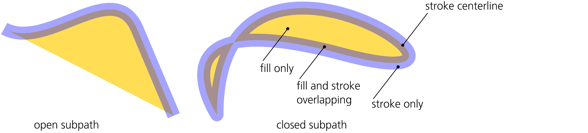

图 12-4：填充开放和封闭子路径

这条直线不是路径的一部分——它没有描边，例如，你不能用节点工具弯曲它。如果在编辑一个开放的没有描边的路径时，遇到一段无法按预期编辑的直线段，最可能的原因是它实际上不是一个路径段，而只是填充的边缘。关闭子路径（12.5.4）可以让你不受限制地编辑它。

当路径自交或一个子路径完全位于另一个子路径内时，是否填充某个区域取决于两个因素：围绕该区域的子路径的*方向*和路径的*填充规则*。填充规则是一种样式属性，可以是`nonzero`或`evenodd`，由填充和描边对话框中的两个切换按钮设置（图 8-3）：

+   当填充规则为`evenodd`时，孔和环总是保持空白，除非你有一个“孔中有孔”的情况——在这种情况下，内部的孔将变成一个填充岛屿。

+   当填充规则为`nonzero`时，只有当一个循环或孔的边界与外部路径的方向*相反*时，它才会被填充；如果它们方向相同，则保持空白。

使用`nonzero`的填充规则时，填充的环形和孔洞是不可见的，除非路径有描边。通常这些不会构成问题，但有时你可能想要去除它们。最简单的做法是选择该路径并使用路径 ▶ 联合命令（Ctrl-+）。将路径与自身合并可以移除所有不影响填充的子路径。

要反转路径，请使用**路径 ▶ 反向**（Shift-R）；如果你想反转路径内某个子路径的方向，请使用节点工具选择该子路径中的一个或多个节点，然后按 Shift-R，这将只作用于选中的子路径（如果没有选中节点，所有子路径都会被反转）。

### 12.1.3 描边路径

路径的*描边*是沿着路径本身绘制的涂料带，因此路径标记了*中心线*的位置。描边通常绘制在填充物之上（如果有的话），但你可以更改这一点（9.6）。影响描边外观的许多样式属性在第九章中有详细介绍。

路径 ▶ 描边转路径命令（Ctrl-Alt-C）将选定路径的描边转换为填充，如图 12-5 所示。换句话说，它用一个新路径替换了描边路径，新路径的*填充*看起来与原路径的*描边*相同，并且保持了该描边的所有连接、端点、斜接和虚线属性。原路径的描边填充将变为新路径的填充，而原路径的填充则被丢弃。如果原路径有标记（9.5），结果将是一个组合，其中描边转为路径的部分与标记一起作为单独的对象。

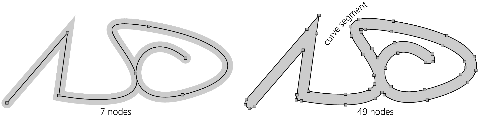

图 12-5：将描边转换为路径

### 12.1.4 贝塞尔曲线

如前所述，路径的各个段落——即路径中节点之间的部分——可以是直线或曲线。让我们更仔细地看一下那些曲线段——它们被称为*贝塞尔曲线*，以法国工程师皮埃尔·贝塞尔（1910-1999）的名字命名，他是第一个在设计中使用这些曲线的人。

贝塞尔曲线完全由四个点的位置决定，其中两个是*节点*，另外两个是*控制点*，即*手柄*。曲线本身总是完全位于这四个点组成的四边形内部。在节点工具中（12.5），每个手柄通过一条直线与其节点相连。这些*手柄线*始终与曲线在相应节点处切线，如图 12-6 所示。

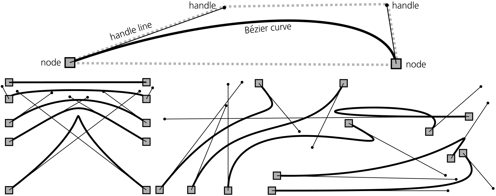

图 12-6：贝塞尔曲线

如果路径节点位于两个贝塞尔曲线段之间，它将有两个与之相连的手柄，每个手柄分别对应一个相邻的曲线段。

贝塞尔曲线对控制点移动的反应很难描述，但一旦尝试过，你很快就能感觉到它的特性。贝塞尔曲线可能和圆弧非常相似，但也可能具有尖锐的弯曲，几乎呈尖点形状；它可能会自交，或者当控制点在节点之间的直线上时，变得完全笔直（或者完全缩回）。

当然，尽管贝塞尔曲线具有广泛的应用，但用一条*单一*的贝塞尔曲线能够实现的形状并不多。当构建路径以近似某些形状时（例如，在手动描摹位图时，18.5.2），经验会告诉你当前的贝塞尔段能延伸多远，以及下一个节点的最佳位置在哪里。强行让路径更接近某个真实形状，通常需要通过添加节点和调整控制点来细分贝塞尔曲线。相比之下，简化路径，无论是手动操作还是使用 Simplify 命令（12.3），通常会减少节点的数量，导致贝塞尔曲线变得更长。

## 12.2 布尔操作

英国数学家乔治·布尔（1815–1864）并不专攻几何学。他发明了自己的*布尔代数*，用于处理“真”与“假”的逻辑值。然而，后来人们发现，这些相同的概念也非常适用于其他数学对象，如集合或任意几何形状。

Inkscape 支持对路径执行多种布尔操作。这些操作可以通过路径菜单访问，也可以通过与相应数学操作符号对应的快捷键进行访问。有些操作需要正好选择两个对象；而其他操作则可以作用于任何数量的已选形状。所有操作不仅适用于路径，也适用于文本对象和形状（3D 框除外），会自动将它们转换为路径。如果布尔操作失败（例如，由于选择的操作数数量或类型错误），状态栏会解释失败的原因。

### 12.2.1 联集

两条或多条路径的*联集*（Ctrl-+）会创建一条新的路径，用其填充区域覆盖原路径覆盖的每一个点。这样，它将任意数量的路径合并成一条路径，并赋予它最底部选中对象的样式，如图 12-7 所示。

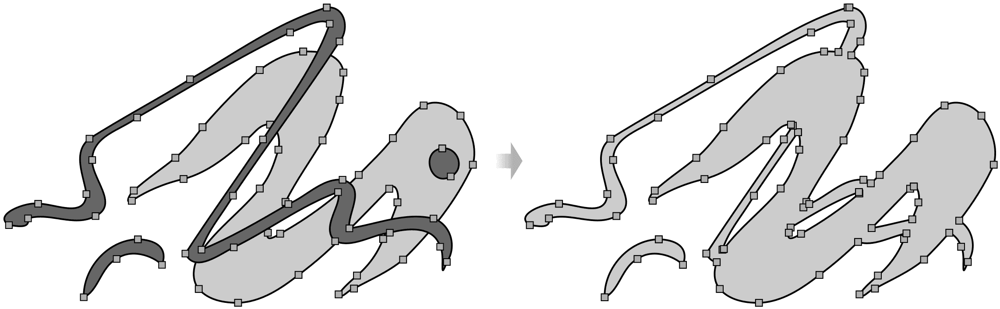

图 12-7：路径联集

如果路径不重叠，结果将与路径 ▶ 合并（12.1.1）的结果完全相同。然而，如果路径重叠， 与合并不同，这个命令永远不会创建任何空洞；它会在路径相交的地方创建新的节点，并移除路径中位于最终路径填充区域内的部分。

例如，如果一个小圆完全位于一个大圆内，将这两个圆进行联合操作将简单地去掉较小的内圆。如果你想让较小的圆在较大的圆内形成一个孔洞，可以使用差集（组合也有效，除非结果路径的填充规则是`nonzero`，并且两个圆刚好是反向的，12.1.2）。不过，联合命令即便对于单一选中的路径也有意义，因为它允许你快速清理掉任何对填充没有影响的内部分。

### 12.2.2 差集

两条路径的*差集*（Ctrl-–）创建了一条路径，其填充覆盖了底部（按 z 顺序排列的）路径所覆盖的所有点，但不包括上面的路径——换句话说，它是从底部减去顶部。结果路径采用底部对象的样式，如图 12-8 所示。

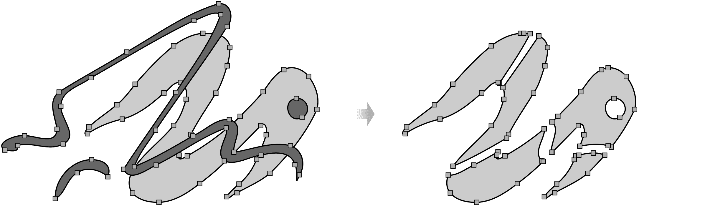

图 12-8：从一条路径中减去另一条路径

如果路径不重叠，路径 ▶ 差集将简单地删除上面的路径；如果上面的路径完全覆盖了下面的路径，结果将是空白（两个对象都被删除，且没有任何选中）。此命令是创建孔洞和擦除不需要路径部分的主要工具。

书法笔（14.2）在你按住 Shift 键绘制时会将新创建的路径与选中的路径*联合*，而在你按住 Alt 键绘制时会从选中的路径中*减去*新路径。在橡皮擦工具（14.4）中，某些模式也会将你所绘制的部分从选中的路径或形状中减去。

### 12.2.3 交集

两条或多条路径的*交集*（Ctrl-*）创建了一条路径，其填充仅覆盖原始路径*全部*交叉的点。它使用最底层选中对象的样式来呈现结果，如图 12-9 所示。

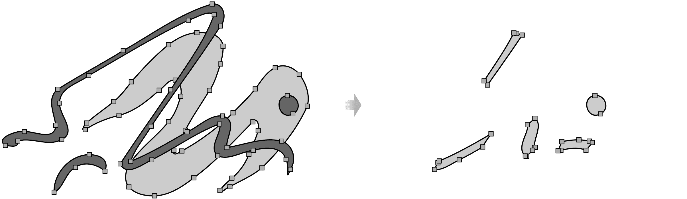

图 12-9：交叉的路径

如果至少两个选中的路径不重叠（即它们的交集为空），路径 ▶ 交集将删除所有路径，而不会创建任何内容。此命令类似于用另一条路径裁剪一条路径（18.3），不同之处在于，裁剪路径是非破坏性的，且可以作用于任何对象，而不仅仅是路径；另一方面，交集可以同时对任意数量的路径进行交集操作。

### 12.2.4 排除

两条重叠路径的排除（Ctrl-^）创建了一条路径，其填充覆盖了*只有一个*原始路径所覆盖的点。它使用底部对象的样式来呈现结果路径，正如图 12-10 所展示的那样。

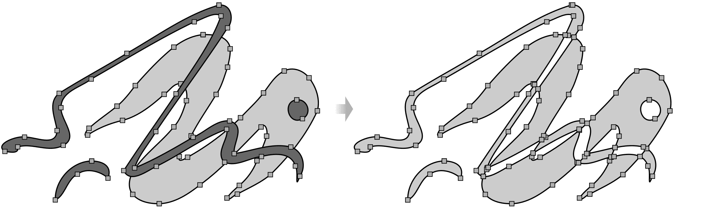

图 12-10：从一条路径中排除另一条路径

当两条路径不重叠时，路径 ▶ 排除的结果与路径 ▶ 组合完全相同。当路径重叠时，结果*看起来*像是组合，但实际路径不同：它在原始路径轮廓相交的地方有新的节点，而组合则不会创建新的节点。

### 12.2.5 划分

两条路径的*分割*（Ctrl-/）通过上方路径将下方路径切割成若干段，删除上方路径，如图 12-11 所示。

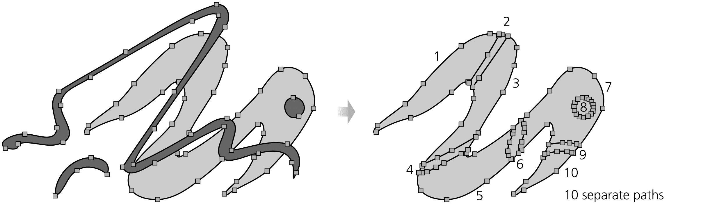

图 12-11：通过另一条路径分割路径

### 12.2.6 剪切路径

剪切路径操作（Ctrl-Alt-/）类似于分割路径。主要的区别在于，剪切路径不会沿着切割线创建任何新的节点或段落，从而使得结果路径不封闭。它还会移除被切割路径的填充部分。对于切割填充路径，使用分割路径更为自然，而对于切割没有填充的描边路径，则使用剪切路径，如图 12-12 所示。

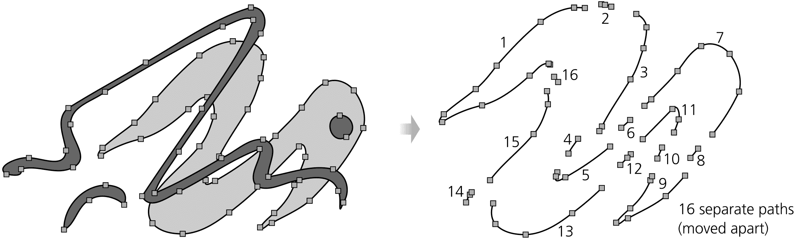

图 12-12：剪切路径类似于分割路径。

## 12.3 简化

路径上的一个重要操作是*简化*。当你简化路径时（路径 ▶ 简化 或 Ctrl-L），Inkscape 会尝试用更少的节点重新绘制该路径，去除小细节但保留路径的大致特征。如果这个描述听起来有点模糊，那是因为该操作本身并非完全确定的；通常，在尝试简化之前，很难准确预测简化的结果。即使是节点数量的减少也不能保证（虽然这是常见的情况）。

尽管如此，简化是非常常见的操作，对于某些艺术绘图风格来说，简化是一项真正的救命稻草。另一方面，在技术绘图中，这种操作很少有用——如果说有用的话，那也是因为它将路径中的任何尖角视为需要“平滑”的“缺陷”。

你几乎可以确定的一个效果是，如果路径中有可以删除的节点，而不会对路径形状造成*任何*变化，它们*将*在简化时被删除。这包括你通过节点工具（12.5.3）或添加节点扩展（13.4.2.1）添加的节点，但这些节点从未从它们的初始位置移动。

路径简化类似于渐变工具中的渐变简化操作，也可以通过 Ctrl-L 来触发（10.5.1）。渐变简化也会移除你添加的但尚未移动的渐变停靠点。

每个简化操作都使用一定的*强度*。弱简化仅会稍微改变路径，只移除最明显冗余的节点。强简化则会改变路径更多，并平滑掉较大的起伏。

当你按下 Ctrl-L *一次* 时使用的默认强度可以在偏好设置对话框的行为页面上设置为简化阈值。默认值是 0.002；大于 0.01 的值对大多数情况来说可能太强。如果你做任何更改，考虑降低此值，因为它实际上是*最小*的简化强度；你可以随时临时增强你的简化命令，通过提高该值而无需进入偏好设置对话框。

如何让简化效果更强大？只需快速连续按 Ctrl-L 几次（参见图 12-13）。每次调用该命令都会略微增加效果，前提是它发生在上次调用后的不到半秒钟内。通过这种*加速简化*，你可以对每条路径应用恰到好处的简化效果。如果第一次按键没有足够地平滑路径，只需继续按 Ctrl-L，它会逐渐加大。如果等待超过半秒钟，简化力度会重置为在偏好设置中定义的默认值。

图 12-13：简化路径

图 12-13 展示了简化如何影响路径的一些示例（参见图 12-2，它是通过逐渐简化节点较多的玫瑰轮廓产生的）。如你所见，除了减少节点数量并抚平细节外，这个操作还会消融尖锐的角落并使直线弯曲，产生一种自然且常常具有艺术感的扭曲。

## 12.4 偏移

*偏移*路径意味着以一种方式扩展或收缩路径，使得每个点相对于路径在该点处沿垂直方向移动。向内偏移叫做*内插*，而向外偏移叫做*外插*。想象你的路径是一个岛屿；外插会通过将海岸线的每个点都移动相同的步数向海洋扩展，从而使其变大，而内插则通过让海洋按相同的步数向内侵蚀，使岛屿变小，如图 12-14 所示。

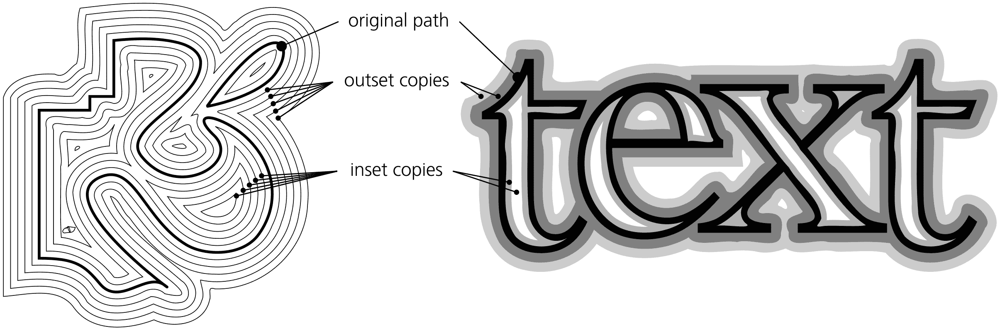

图 12-14：偏移路径

要内插所选路径，按 Ctrl-(（向内偏移 2 像素），或 Alt-(（在当前缩放下向内偏移 1 屏幕像素），或 Shift-Alt-(（向内偏移 10 屏幕像素）。要外插路径，使用相同的修饰键加上 ) 键。在大多数键盘上，9 和 0 键与 ( 和 ) 键在同一个键上，因此数字也会像括号一样工作。

偏移用于那些希望在不改变整体形状的情况下让路径变得“更粗”或“更细”的情况。这对于阴影、轮廓、光晕、斜面等非常有用。（有时，除了外偏移，你也可以简单地为路径设置一个足够宽的笔画，颜色与填充色相同。）

如果你多次对一条路径进行外插和内插，它会以一种独特的方式发生扭曲，这种扭曲与简化的扭曲类似但有所不同（参见 12.3）。这种扭曲将路径的各个部分焊接在一起——圆滑的角落、平滑的交点，并将路径中的相近子路径融合在一起。例如，将书法笔绘图中的所有笔画合并，然后对其进行几次内插/外插循环，使其看起来更加自然和磨损（参见图 12-15）。

图 12-15：通过重复偏移来融化复杂路径

偏移操作，像简化操作一样，是一种破坏性操作：你无法恢复原始的精确路径，除非通过撤销操作来恢复。（例如，偏移一个开放路径总会使其闭合。）然而，Inkscape 也有两种动态对象类型，*链接偏移*和*动态偏移*，它们会存储原始路径的精确数据，并允许你在不产生失真的情况下调整偏移量（13.3.11）。

内插和外扩命令，以及链接偏移和动态偏移，会将相同的偏移距离应用到整个路径。然而，实际上，你也可以仅对路径的一部分进行内插或外扩（例如，书法笔触的一端），这可以通过 Tweak 工具的“增大”和“缩小”模式来实现（12.6.4）。

## 12.5 节点工具

和 Inkscape 中的其他工具一样，节点工具——主工具栏中的第二个按钮，可以通过按 N 或 F2 快捷键访问——旨在让简单的操作变得简单，让复杂的操作成为可能。这可能是 Inkscape 中最复杂的工具——至少，节点工具的键盘和鼠标快捷键数量比任何其他工具都要多。你不需要知道所有的技巧就能高效使用 Inkscape，但你应该了解基础操作。

### 12.5.1 路径显示

切换到节点工具后，任何选中的路径都会显示其*节点*，这些节点呈现为小灰色方块、菱形或圆形（具体取决于每个节点的类型，12.5.5）。作为额外的功能，形状（第十一章）、渐变、网格和图案（第十章），以及许多路径效果（第十三章）在节点工具中也会显示其编辑控制柄。

你可以*选择*部分或全部路径节点；选中的节点会变为蓝色并稍微增大。*贝塞尔曲线*的控制柄（12.1.4）仅在选中的节点及其相邻节点处可见。即使如此，如果这些控制柄妨碍操作，你也可以通过控制栏上的按钮来隐藏它们，如图 12-16 所示。

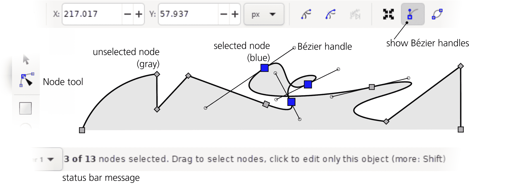

图 12-16：节点工具中的节点和贝塞尔控制柄

默认情况下，选中的路径在节点工具中不会被视觉化，只会显示其节点。通常，你会看到路径的描边和/或填充在编辑节点时实时更新。然而，有时你的路径可能过于透明或模糊，或者可能应用了某些路径效果（第十三章）；在这种情况下，你可以通过切换控制栏上的另一个按钮，要求 Inkscape 用红线高亮显示实际路径，如图 12-17 所示。

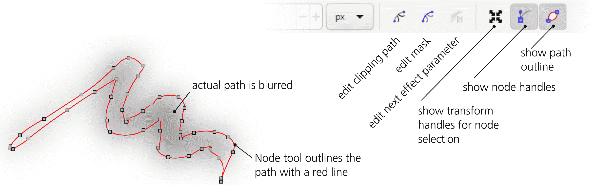

图 12-17：节点工具中的路径高亮显示

除了路径本身，节点工具还允许你编辑与对象关联的其他一些路径——它们是不可见的，但会影响路径的外观：剪切路径（显示为浅绿色，18.3）、蒙版路径（显示为蓝色，18.3）和路径效果的链接路径参数（显示为深绿色，13.2.1）。这些对应于控制栏上的三个按钮；剪切路径和蒙版按钮是开关切换，而显示下一个可编辑路径效果参数按钮切换到*下一个*链接路径参数（因为可能有多个，具体取决于所使用的效果）。

最后，如前所述，节点工具显示了对象（不一定是路径）所拥有的各种编辑控件。例如，在这个工具中，你可以编辑形状（第十一章）、调整渐变、网格和图案（第十章），或者更改流动文本对象的尺寸（15.2.2）。

### 12.5.2 选择节点

就像 Inkscape 中的许多其他功能一样，路径的节点可以在节点工具中被*选择*。毫不意外，节点选择的方法与对象选择的方法非常相似（第五章）。

除了在路径中选择节点外，该工具还可以选择对象（记住，选择对象是 Inkscape 中所有工具和命令的共通功能）。在节点工具中，你可以使用一些你从选择工具中学到的快捷键：点击选择一个对象（忽略分组），Shift-点击添加到选择中或从选择中移除，Alt-点击选择下方的对象（5.9）。节点工具可以同时编辑多个选定路径中的节点（在许多方面，它将它们视为单一路径的子路径，12.1.1）。

这与节点类似。要选择选定路径中的单个节点，只需点击它；该节点会变成蓝色，并且比未选中的灰色节点稍大。按住 Shift 键点击*添加*一个节点到节点选择中；选定的节点不需要相邻，甚至可以不在同一条路径上。拉框选择（在节点周围拖动矩形，参见 5.7）也可以使用；按住 Shift 键拖动会将矩形框内的节点添加到选择中。

如果你点击两个节点之间的路径段，两个节点都会被选中。点击空白区域（远离已选路径），就像按下 Escape 键一样，会取消选择任何已选的节点——或者，如果没有已选节点，则取消选择任何已选的对象。

在选择工具中，Tab 和 Shift-Tab 键用于跳转到下一个或上一个对象，而在节点工具中，它们用于选择所选路径或路径中的下一个或上一个节点。当到达最后一个节点时，按下 Tab 会跳转到第一个节点；当到达第一个节点时，按下 Shift-Tab 会跳转到最后一个节点。顺便说一下，按 Tab 键几次是快速了解一个（子）路径*方向*（12.1.1）的方法，而不会以任何方式更改文档。

与选择工具中的操作一样，Ctrl-A 选择所有选定路径中的所有节点。但是，如果你已经选中了某些节点，Ctrl-A 仅选择那些已经选择节点的*路径和子路径*中的节点（这类似于选择工具中的 Ctrl-A 仅选择当前图层内的对象）。要始终选择所有路径中的所有节点，请使用 Ctrl-Alt-A。！键会*反转*选择，选择未被选中的内容，反之亦然，在已经选中了某些节点的（子）路径内。

另一种选择节点的方法是节点工具特有的。当你将鼠标悬停在一个节点上（该节点会高亮显示为红色）时，你可以通过旋转鼠标滚轮或按 Page Up 和 Page Down 键来*扩展*或*收缩*节点选择。向上滚动一格或按 Page Up 会将*最近*的未选中节点添加到选择中；向下滚动一格或按 Page Down 会取消选择*最远*的已选中节点。

为了确定“最近”和“最远”的节点，Inkscape 通过计算每个节点到鼠标指针的直线欧几里得距离来测量。但是，如果在旋转滚轮或按 Page Up 或 Page Down 时按住 Ctrl 键，距离将按*路径*计算，选择将仅限于你悬停的节点所在的（子）路径。

### 12.5.3 删除和创建节点

删除任意数量的选定节点，只需按 Delete 或 Backspace 键，或者点击控制栏上的“减号”按钮。

删除子路径的末端节点会使子路径变短，但你不能通过删除节点来打开一个闭合的子路径——你需要按照 12.5.4 中的描述将其*断开*。

当删除中间节点（位于其他节点之间）时，Inkscape 会将每组相邻节点替换为一个单独的 Bézier 曲线段。在大多数情况下，这会引入一些失真，但 Inkscape 尽量最小化这种失真——它会调整剩余节点的控制柄，使得新的 Bézier 曲线段尽可能接近它所替代的路径片段。换句话说，在路径上删除节点可能像一个局部的简化命令（12.3）。

然而，有时候，你不需要新的 Bézier 曲线来完全突出显示你正在删除的节点，因为你正试图避免更改剩余节点的控制柄。在这种情况下，直接按 Ctrl-Delete 或 Ctrl-Backspace，如图 12-18 所示。

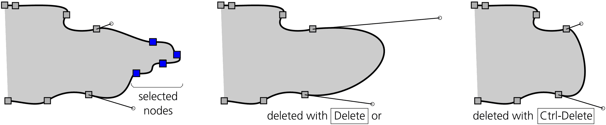

图 12-18：删除节点

与删除不同，*插入*新节点总是可以在路径的任何位置进行，而不会改变其形状。只需在路径上（即笔触的中心线或填充的边缘）双击或按 Ctrl-Alt 点击你希望插入新节点的位置。一个新节点将被插入，并且其相邻节点的控制手柄会自动调整，以确保路径形状不变（图 12-19）。

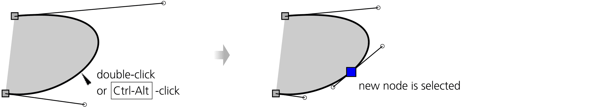

图 12-19：通过点击创建节点

还有另一种创建节点的方法，无需点击。选择两个或更多相邻节点，然后按 Insert 或 Shift-I（或点击控制栏上的插入节点按钮）在每个路径段的*中间*插入一个新节点（图 9-11）。由于新节点会被添加到选择中，这是增加路径上节点数量的快捷方式—例如，如果你从两个节点开始并按 Insert 八次，你的路径将有 257 个节点（2⁸ + 1）。这类似于通过按 Insert 创建新的渐变停点（10.5.1）。

[1.1]

控制栏上的插入节点按钮有一个下拉子菜单，命令可以将新节点插入路径或其选中部分的*端点*—但前提是该端点还没有节点。例如，如果你选择两个节点之间的曲线，而该曲线比任一节点的 Y 轴值都要低，你可以使用“在最大 Y 处插入节点”命令，在该段最低点插入一个节点（图 12-20）。所有端点的节点将是平滑节点（12.5.5），其控制手柄严格水平（对于最小/最大 Y）或严格垂直（对于最小/最大 X）。

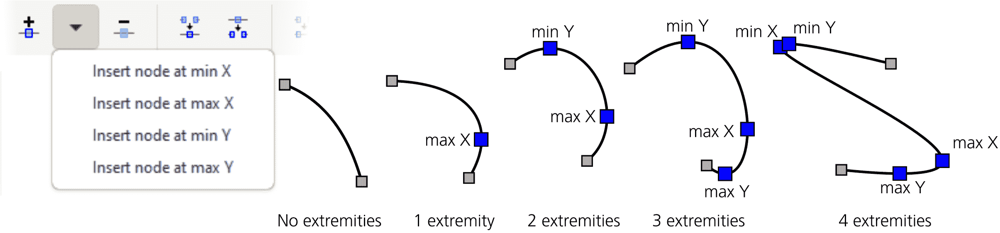

图 12-20：在路径的端点插入节点

另一种方法是*复制*节点。选择任意数量的节点后，按 Shift-D。这将“分割”每个选中的节点为两个，每个新节点继承原节点的两个控制手柄之一。图 12-21 展示了如果你复制路径中的所有节点，并通过按→将新节点（原本与旧节点位于相同位置）移开时的效果。

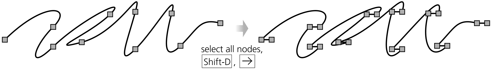

图 12-21：复制节点

Shift-D 方法特别适合通过复制并移开路径末端节点来继续开放的（子）路径。例如，如果你选择了一条直线段的末端节点（即没有 Bézier 控制手柄的末端节点），你可以轻松地通过按 Shift-D 然后按箭头键来“绘制”线段。

#### 12.5.3.1 复制、剪切和粘贴节点 [1.1]

传统的复制、剪切和粘贴命令和快捷键也可以在节点工具中使用，尽管有一些限制。

复制单个节点没有什么用处。复制两个或更多选定的节点会从这些节点创建一个路径，并将其放入剪贴板。从这里开始，无论你是在选择工具还是在任何其他工具中，都可以将其粘贴回来，作为由复制的节点子集创建的新路径对象。如果你复制的不是一个完整的封闭子路径，粘贴的路径将会是开放的。

如果你将从节点工具复制的节点选择粘贴到同一工具中，并且选择了单个路径，则会在选定路径中创建一个新的子路径（12.1.1）。粘贴时，是否选择了节点并不重要，因为粘贴操作不会将复制的节点插入到现有节点之间。它总是创建一个独立的子路径，并且根据填充规则（12.1.2），此操作可能会在填充区域中产生空洞。虽然这可能有用，但有时将节点并入路径并避免创建独立的子路径更为合适。要做到这一点，退出节点工具，将复制的节点粘贴为独立路径，根据需要定位该路径，并将其与目标路径合并。

### 12.5.4 连接与断开

要*连接*两个端节点，首先选择它们。这些节点可以是同一开放子路径的端节点，在这种情况下，连接它们将闭合该子路径。也可以是属于不同子路径的节点，在这种情况下，你将这些子路径连接成一个单一子路径。它们还可以属于不同的路径对象，在这种情况下，这些对象将合并为一个路径（并采用第一个选中的路径的样式）。

有两种方法可以连接节点，这与节点控制栏上的两个连接按钮对应。第一种方法——“连接节点”按钮或 Shift-J——实际上是将两个端节点移动并合并为一个单一节点。第二种方法——“与路径段连接”按钮——则保留端节点的位置，但在它们之间添加一个新的路径段。如果你使用第一种方法，但又不希望其中一个端节点移动，可以在按 Shift-J 时，将鼠标悬停在该节点上以锁定其位置（见图 12-22）。

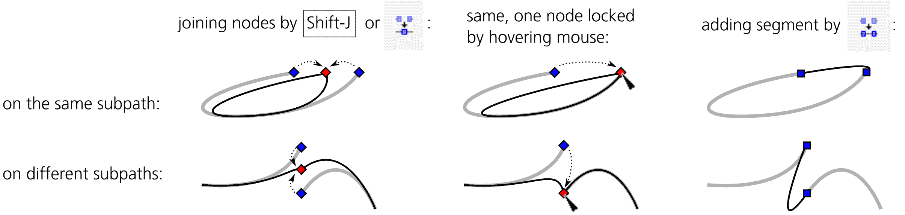

图 12-22：连接节点和插入路径段

同样，有两种方法可以*断开*路径。第一种方法是选择一个或多个非端节点，然后点击**断开节点**按钮或按 Shift-B。这将复制每个选定的节点，但不会将其与原始节点连接，从而使路径在每个选定节点处断开，形成多个子路径。第二种方法是选择两个相邻的非端节点，然后点击**删除路径段**按钮，删除它们之间的路径段，如图 12-23 所示。

图 12-23：断开节点和删除路径段

使用任何这些方法剪切开放路径会在路径内产生新的子路径（12.1.1）。如果你想将路径分解为独立的对象，首先将其分解为子路径，然后使用**路径 ▶ 分离**将每个子路径分成独立的路径对象。

### 12.5.5 节点类型

中间节点可能有一个或两个控制柄，分别位于两侧。在 Inkscape 中，节点可以属于多种*节点类型*，这些类型在拖动控制柄或节点本身时表现不同（图 12-24）。

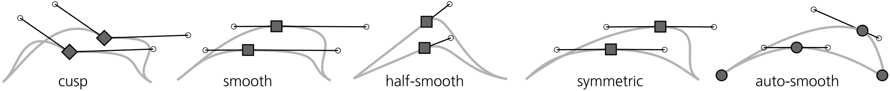

图 12-24：节点类型：尖点、平滑、半平滑、对称和平滑自动节点

+   如果节点没有控制柄（它们都*缩回*了），或者一个控制柄与另一控制柄或路径段不共线，或者在拖动一个控制柄时另一个控制柄不动，那么这个节点被称为*尖点*节点——因为当两个控制柄成角度时，节点表示路径中的急转弯（尖点）。尖点节点以菱形表示。

+   如果另一个控制柄的旋转始终与正在移动的控制柄保持共线，这种节点称为*平滑*节点，因为它使路径保持平滑流畅。平滑节点以方形表示。

+   节点可能只有一个控制柄，一侧是贝塞尔曲线，另一侧是直线段，而节点的唯一控制柄可能被*锁定*为始终与该直线段共线——这样，当你拖动节点时，其控制柄会自动旋转以保持共线。这样的节点被称为*半平滑*；它也以方形表示，但与其他节点类型不同，它没有自己的按钮或快捷键。要将节点转换为半平滑，可以通过**使选定段为直线**按钮（12.5.6.1）将两个平滑节点之间的段转换为直线，或简单地缩回该段节点的内部控制柄（外部控制柄会与段对齐，节点变为半平滑）。你还可以通过将一个控制柄与直线相邻的尖点节点转换为平滑节点（Shift-S）*一次*，使其成为半平滑节点；再次平滑后，节点会变为完全平滑，并具有两个控制柄。

+   平滑节点的另一个控制柄可以旋转和缩放，以始终与正在移动的控制柄共线且长度相同。这样的节点被称为*对称*节点，因为其控制柄总是围绕节点对称。对称节点也以方形表示。

+   自动平滑节点，以圆形表示，是一种会在移动时自动调整控制柄的平滑节点。你不应该手动编辑自动节点的控制柄；如果这样做，节点将从自动平滑变为平滑节点。如果你使用自动节点，最好通过控制栏按钮（图 12-16）完全隐藏控制柄，以免它们干扰操作。

    自动平滑节点会调整其控制柄的角度和长度，以使相邻的路径段尽可能平滑。如果相邻的节点也是自动平滑的，它们的控制柄也会进行调整。例如，当你将一个自动平滑节点 A 移动到其相邻的自动平滑节点 B 旁边时，两个节点的控制柄会逐渐变短，并朝彼此旋转，从而保持它们之间的路径段，以及两侧相邻路径段的曲率最小。这种行为类似于 Spiro 曲线路径效果（13.3.7.2）。

要改变一个循环中的节点类型（尖点到平滑到对称到自动平滑，再回到尖点），按住 Ctrl 并点击它。要改变多个选中节点的类型，可以点击控制栏上的一个节点类型按钮，或使用快捷键：

+   按下 Shift-C 使选中的节点成为尖点。第一次 Shift-C 仅改变节点类型，但不会移动控制柄；第二次 Shift-C 会收回选中节点的所有控制柄。

+   按下 Shift-S 使选中的节点平滑。如果之前是尖点且控制柄未收回，它们将被旋转为共线；如果控制柄已收回，它们会被拉出并使其在一个角度下共线，以最小化曲率。

    如果一个节点在一侧有直线段（12.5.6.1），而另一侧有控制柄，则第一次 Shift-S 会使它半平滑，将单个控制柄锁定到直线段的方向。再次按 Shift-S 会延长第二个控制柄，使节点完全平滑。

+   按下 Shift-Y 使选中的节点成为对称节点。

+   按下 Shift-A 使选中的节点成为自动平滑节点。

将路径的所有节点从尖点切换为平滑或自动平滑会以一种典型的方式扭曲路径，去除直线和锐角，正如图 12-25 所示。

图 12-25：整个路径中节点类型的转换

### 12.5.6 控制柄移动

也许编辑 Bézier 路径段最简单的方法是通过拖动曲线本身，而不是节点或控制柄。这不需要选择任何节点，也不会移动任何节点。Inkscape 会自动调整两个相邻节点的 Bézier 控制柄，使曲线跟随你的鼠标，如图 12-26 所示。

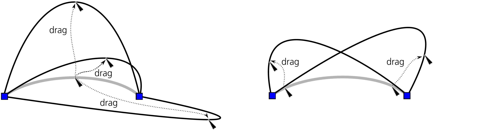

图 12-26：曲线拖动

如果一个节点是平滑或对称的，拖动该节点一侧的曲线也会改变另一侧的曲线，因为节点一个控制柄的移动会被另一控制柄镜像。与自动平滑节点旁的曲线拖动会将该节点转换为平滑节点。

当然，你还可以拖动任何选中节点的贝塞尔句柄（如果没有看到句柄，请确保你在控制栏上按下了“显示句柄”按钮，图 12-16）。尽管句柄仅在选中的节点及其邻近的路径节点上显示，但句柄本身（与节点不同）是不可选择的。当你拖动句柄时，Inkscape 的状态栏会报告总位移以及句柄的当前角度和长度。

按住 Ctrl 时，你旋转的句柄会以 15 度为增量对齐。按住 Shift 时，同一节点的另一个句柄也会旋转相同的角度，保持句柄之间的角度（这对于平滑节点始终如此；不过使用 Shift 时，这对于尖点节点也适用）。按住 Alt 时，句柄的长度被锁定，因此只有它的角度发生变化。这些修饰符可以任意组合使用。

也可以使用键盘快捷键来移动节点句柄。在 12.5.7.3 中，你会看到<和>键进行缩放，而[和]键旋转多个选中的节点，就像它们是一个物体一样。从逻辑上讲，当你选中一个*单独*节点时，这些相同的键会旋转和缩放（即改变）该节点的贝塞尔句柄的长度，而不会移动节点本身，如图 12-27 所示。

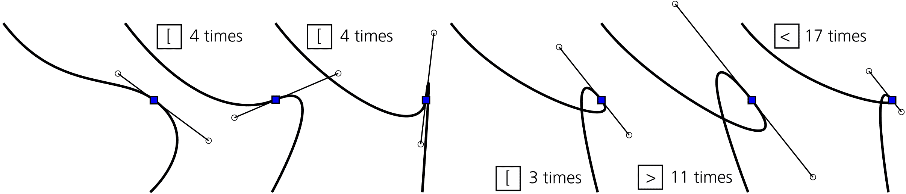

图 12-27：使用键盘快捷键调整节点句柄

使用 Alt 键，你甚至可以分别缩放和旋转每个节点的句柄。只需使用键盘上的*左侧*Alt 键来缩放（使用<和>）或旋转（使用[和]）单个选中节点的*左侧*句柄——即那个端点位于左侧，比另一个句柄更靠左的句柄。右侧 Alt 键则会影响右侧句柄。

#### 12.5.6.1 段类型

如果你想通过将贝塞尔曲线转换为直线段来平整它呢？实际上，直线就是一个贝塞尔曲线，只不过它的两个句柄*收回*了——即与相应的节点重合。要收回句柄，Ctrl+点击它；要把收回的句柄从节点中拉出，按住 Shift 并拖动它远离该节点。

另一种将贝塞尔曲线转换为直线（并反向转换）的方法是使用控制栏上的段类型按钮。这些按钮要求至少选择两个相邻节点，但它们会作用于选中节点之间的任意多个段。使段为直线按钮（或 Shift-L）会收回任何拉出的句柄；使段为曲线按钮（或 Shift-U）实际上并不会将段变成曲线，但它会拉出句柄并将其放置在段上，这样你就可以手动移动它们，如图 12-28 所示。

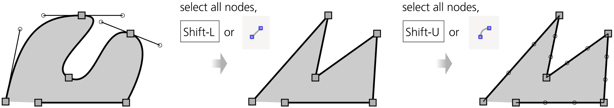

图 12-28：改变段的类型

### 12.5.7 移动节点

重塑路径就像选中一些节点并拖动它们一样简单。属于这些节点的 Bézier 控制点会与节点一起平行移动（除了半光滑和自动光滑节点，在拖动时它们的控制点可能会旋转）。

与选择工具中的操作一样，简单的点击并拖动可按预期移动单个*未选择*的节点；如果拖动的是已选中的节点，那么你将一起拖动*所有*已选中的节点。按住 Ctrl 键时，鼠标拖动仅限于水平和垂直方向的移动。

箭头键以与选择工具中相同的方式和相同的距离移动选中的节点（6.5.1）：不使用修饰键时移动 2 像素（默认值），按住 Shift 时移动该距离的 10 倍，按住 Alt 时移动 1 屏幕像素，按住 Shift-Alt 时移动 10 屏幕像素。

如果你按住 Ctrl-Alt 拖动一个节点，移动将限制在拖动节点的 Bézier 控制点及其垂直方向上。如果节点的一侧有直线段，则使用该线段的方向，而不是控制点的方向。所以，如果节点的两个控制点或相邻的线段共线，你可以在四个方向之一拖动它；否则，你可以在八个方向之一拖动它（图 12-29）。

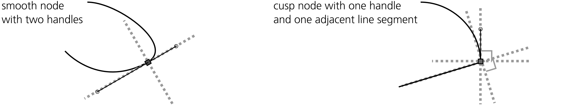

图 12-29：按住 Ctrl-Alt 拖动节点的方向

你可以按住 Ctrl-Alt 并拖动多个选中的节点，但移动将仅限于你用鼠标拖动的节点的控制点/线段。

你通过鼠标拖动的节点可能会对齐到（7.3.1.2）指南、网格以及其他对象或节点。默认情况下，节点会对齐到指南和网格，但不会对齐到对象。你可以通过按住 Shift 键临时禁用对齐。

#### 12.5.7.1 数字方式移动节点

单个选中节点的坐标会显示在节点工具的控制栏中的 X 和 Y 字段内（图 12-30）；编辑这些值会将选中的节点移动到新的坐标位置。

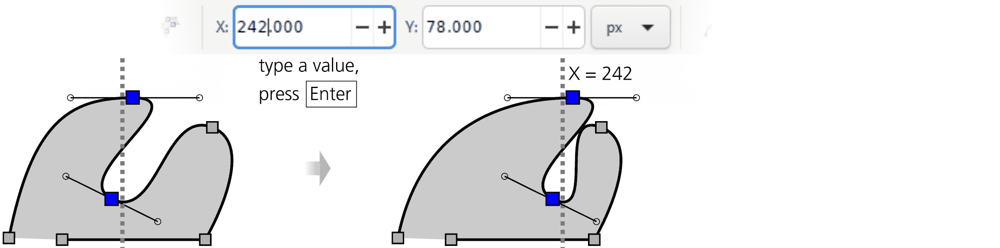

图 12-30：使用 X 和 Y 可编辑字段定位节点

如果选中了多个节点，这些字段会显示它们的*平均*坐标——换句话说，就是选中节点的几何中心坐标。在这种情况下，输入这些字段中的一个值会整体移动选中的节点，使它们的中心位置达到新的坐标值。

你还可以使用一个你已经见过的工具对选中的节点进行对齐：对齐和分布对话框（7.4）。当你处于节点工具时，此对话框会显示节点部分，四个按钮可以让你：

+   将选中的节点水平对齐。

+   将选中的节点垂直对齐。

+   将选中的节点在 X 轴上均匀分布。

+   将选中的节点在 Y 轴上均匀分布。

对于节点对齐，Relative to 下拉列表让你选择对齐的参考点。例如，如果你想垂直对齐选中的节点——在一列中——你可以选择该列是否位于选择的中间（默认设置），最小值（左边缘），最大值（右边缘），或是第一个选中节点或最后一个选中节点的位置。

#### 12.5.7.2 节点雕刻

简单的拖动会使所有选中的节点移动相同的距离，这通常是你需要的。例如，在一个示意的面部轮廓（图 12-31，左侧）中，你可以通过选择两个节点并将它们拖到右边，轻松地将鼻子变长——对于这种风格的画法，这个结果是可以接受的。然而，如果你有一个更复杂且更逼真的绘图，包含大量节点（图 12-31，右侧）呢？无论你选择多少个节点，拖动它们都会引入不连续性，并破坏面部的自然轮廓。

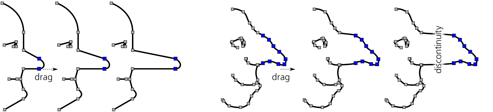

图 12-31：拉动两个鼻子

在这种情况下，能够按不同的距离移动不同的节点是非常有用的，这样鼻尖会移动得最远，而其他节点随着离开鼻尖的路径逐渐移动较少。这正是 Inkscape 在你选中所有鼻子节点并按住 Alt 拖动鼻尖节点时所做的。这种技巧叫做*节点雕刻*。

在最简单的情况下，当所有选中的节点在同一条直线上时，按住 Alt 并拖动中间的选中节点，会将路径弯曲成一个平滑的钟形曲线。最远的选中节点保持不动；被拖动的节点完全移动；其他选中的节点则按一定的中间距离移动。现在，如果你选中的节点形成了一条弯曲的线、文本转化为路径，或者是一个逼真的鼻子，按住 Alt 拖动会平滑地弯曲它们，同时保留它们的特征（图 12-32）。

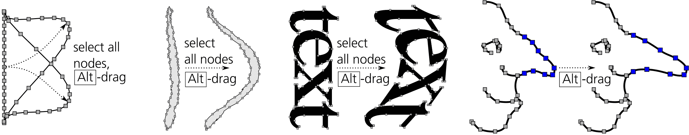

图 12-32：使用 Alt 雕刻节点

在按住 Alt 拖动时，决定移动哪些节点以及移动多远，拖动节点的距离是沿着一条直线（空间方向）计算的，而不是沿着路径。

如果你在路径的某部分没有足够的节点进行雕刻，只需选择已有的节点并按几次 Insert 键，以在路径的该部分填充节点。在雕刻具有许多密集节点的复杂形状时，例如位图追踪（18.5），隐藏它们的贝塞尔控制柄（通过取消按下控制栏上的按钮），这样它们就不会干扰，并通过从一个节点扩展选择来选择节点（12.5.2）。

节点雕刻让人联想到 Tweak 工具（12.6），因为它使路径编辑更加自然，并且让你能够从简单的形状中发展出复杂的形状。然而，与 Tweak 不同的是，这种技术不会创建或删除节点——总体而言，它更具确定性。对复杂的分散路径进行反复调整，最终会简化并退化整个路径，即使你没有用工具触及某些细节。而节点雕刻则不同，只有选定的节点会受到影响，不论你将选定的节点来回拖动多少次，都不会发生退化。

#### 12.5.7.3 节点变换

*变换节点*是什么意思？你已经知道许多移动节点甚至雕刻节点的方法。那么这有什么不同呢？

请记住，在选择器工具中，*变换*不仅包括移动，还包括缩放和旋转（第六章）。这些变换对于路径上的一组节点也非常合理——如果你把这组节点看作一个“对象”。

[1.1]

控制栏上的显示变换手柄按钮正是执行这一操作：显示八个缩放手柄——与选择器中的完全相同——围绕路径上选定的节点（图 12-33）。与选择器中的操作一样，如果你点击任何一个选中的节点，缩放手柄会切换为旋转/倾斜手柄，反之亦然（参见 6.3）。选择器工具中的大部分修饰符同样适用：按住 Ctrl 进行缩放以保持比例，按住 Shift 进行缩放以围绕中心进行缩放，按住 Ctrl 进行旋转以将角度对齐到 15 度增量。

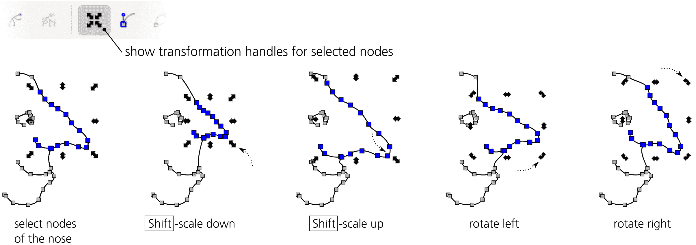

图 12-33：变换选定的节点

节点变换同样可以通过键盘快捷键实现。就像在选择器中一样，<和>键可以缩放选定的节点，[和]键可以整体旋转节点。没有修饰符时，旋转以 15 度为增量，缩放以 2 像素为增量；按住 Alt 键时，相同的按键会以当前缩放级别下的 1 屏幕像素进行旋转和缩放。H 和 V 键用于水平和垂直翻转（反射）。

默认情况下，键盘上的缩放、旋转和翻转操作是围绕选定节点的几何中心进行的。然而，如果你将鼠标光标悬停在其中一个节点上，它会保持固定，而其他选定节点会围绕它作为中心进行缩放或旋转。例如，你可以通过按 Ctrl-A 选择一个对象的所有节点，然后将光标悬停在某个节点上，并使用[和]键围绕该节点旋转整个对象。

## 12.6 路径调整

你已经在 8.9 中看到过如何使用 Tweak 工具（W, Shift-F2）在对象中绘制和抖动颜色，在 6.10 中，也了解了如何用它来移动和变换对象。这个多功能工具剩下的模式——*推拉*、*缩放/放大*、*吸引/排斥*和*粗化*——用于编辑路径。

Tweak 工具在编辑路径的方式上与节点工具有本质的不同。节点工具，顾名思义，允许你编辑节点，并且你需要具备一定的知识，了解节点如何定义路径的形状。而使用 Tweak 工具时，你可以忘掉任何有关节点的知识；只需将路径当作一个可塑的物体与之交互，就像一块雕塑泥，可以在任何位置、任何方向上弯曲和雕刻它。虽然这对于技术绘图来说几乎没有用，但调整路径非常适合创作艺术图像，比如卡通图。

Tweak 工具适用于任何选中的对象。例如，你可以全选（Ctrl-A）并在推拉模式下“涂抹”整个绘图。该工具甚至可以进入组内并作用于组内的单独路径。如果你在没有选中任何对象的情况下尝试使用它，它会通过状态栏消息提醒你先选择一些对象。

### 12.6.1 宽度和力量

在任何 Tweak 工具的模式下，你所使用的是一个圆形的*画笔*（位于光标中心的橙色边缘圆形），用它“涂抹”选中的对象以改变它们。宽度参数控制画笔的大小，而施加的效果量取决于力量参数，以及如果你使用的是压力感应板，笔压也会影响效果。有关这些参数的更多细节，请参见 6.10。

要在正确的位置以适当的力量（包括笔压）和正确的画笔大小施加恰当的拖动，需要练习。然而，这项技能非常值得——过去在节点工具下显得笨拙且耗时的操作，使用 Tweak 工具后往往更加迅速且自然。

### 12.6.2 保真度

对路径的任何微调都会稍微扭曲——或者说是*简化*，就像简化命令一样——整个路径，包括你没有用画笔触碰到的部分。

保真度值允许你控制这种寄生简化的程度。这里的权衡是结果路径中的节点数量。低保真度下，结果路径将节点较少，但可能比你能接受的更扭曲。而高保真度则尽量减少变形，但路径可能会有很多节点——这会增加 SVG 文件的大小并减慢 Inkscape 的速度。

最佳的保真度值取决于你作品的性质。如果你正在雕刻无定形的块状物，你可以选择较低的保真度，大约 20\. 然而，如果你正在推拉或扩展一个已转换为路径的文本字符串，并希望变形区域外的字母保持尽可能干净且易读，那么你需要将保真度提高到 80 或更高。

在幕后，Tweak 工具将路径重塑为一个“近似多边形”，该多边形由成千上万的细小直线段组成，调整该多边形的顶点，然后再将其转换回由 Bézier 曲线段构成的路径。保真度级别控制此转换的精度，从而影响结果中的节点数量，但无论如何都无法得到与原始路径完全相同的节点——一些节点始终会被移位和更改，就像简化操作后那样。

### 12.6.3 推模式

Push 是 Tweak 工具的默认模式。要从任何其他模式切换到 Push 模式，按 Shift-P，或点击控制栏上的按钮。

Push 是一种通用的雕刻模式。在此模式下，当你拖动时，选定路径上被画笔覆盖的部分会朝着你拖动的方向移动，只要按住鼠标按钮或触控笔，直到松开为止，如图 12-34 所示。

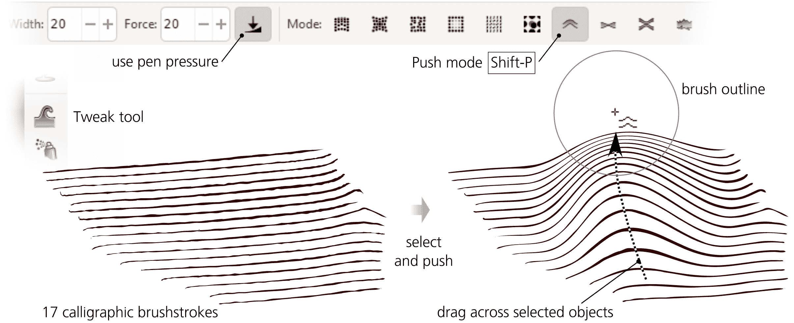

图 12-34：Tweak 工具的推模式

根据需要调整画笔宽度，你可以通过推动任何路径将其变形为几乎任何其他形状——你还可以用它来进行小的调整，比如压平一个凸起、弯曲一个附加部分或弯曲雕刻网格。由于画笔呈钟形轮廓，推动的路径会相应地软化并平滑地弯曲，如图 12-35 所示。

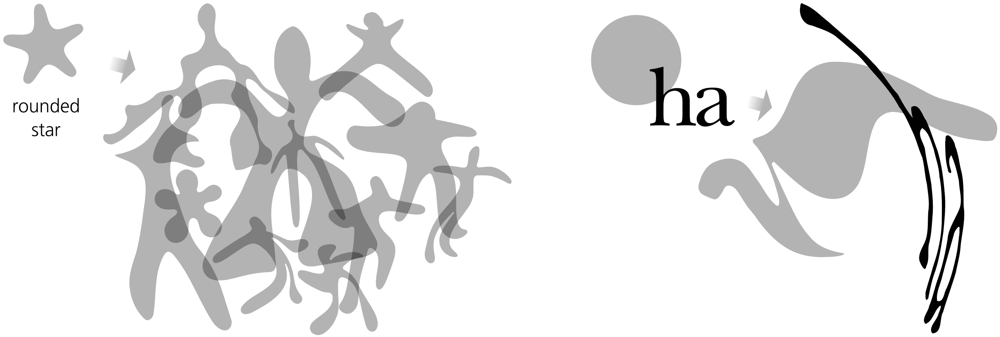

图 12-35：在推模式下雕刻路径

### 12.6.4 Shrink/Grow 模式

Shrink/Grow 模式（Shift-S）会使路径的每个点沿路径边缘的垂直方向移动，可以向内（收缩，普通拖动）或向外（扩展，按 Shift 拖动）。要快速从工具的任何其他模式切换到此模式，按住 Ctrl 并拖动以缩小，按住 Shift+Ctrl 并拖动以扩展。

Shrink/Grow 模式与 Inset 和 Outset 命令非常相似（参见 12.4），不同之处在于，Tweak 工具始终只对路径的一部分进行柔和操作，而不是整个路径。你可以使用此模式来调整细节丰富的图形的明暗——例如雕刻、手写涂鸦，甚至是文本（转换为路径后），如图 12-36 所示。

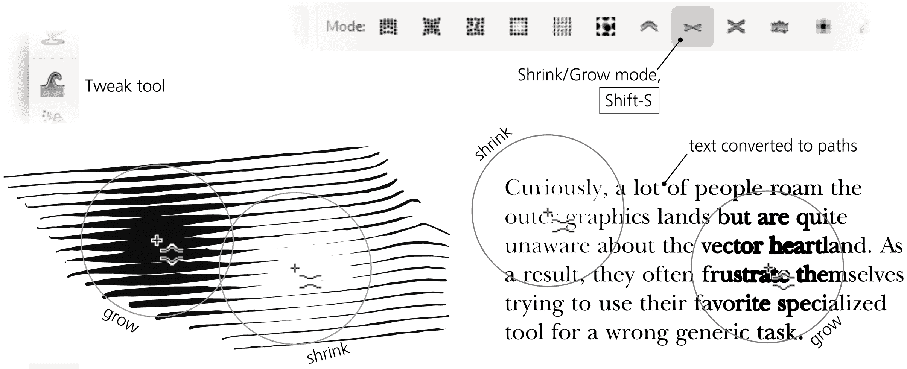

图 12-36：Tweak 工具的 Shrink/Grow 模式

Shrink/Grow 模式允许你通过 Shift-拖动轻松追踪路径的移动边缘：通过使用小尺寸的画笔，你可以从路径中生长出附加部分和分支，且长度不受限制。（你也可以在 Push 模式中实现这一点，但 Grow 模式对此任务更为简便。）此外，Shrink 模式可以作为一种快速的橡皮擦——轻松剪切路径、去除小碎片和修剪长画笔笔画，正如图 12-37 所示。

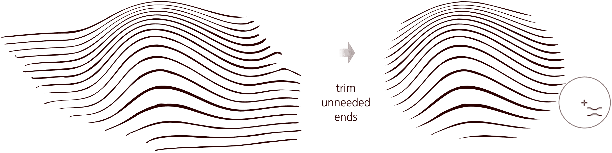

图 12-37：将 Shrink 模式用作橡皮擦

### 12.6.5 吸引/排斥模式

吸引/排斥模式（Shift-A）通过将路径上每个受影响的点朝向（吸引，普通拖动）或远离（排斥，按住 Shift 拖动）光标点移动，从而挤压或爆炸任何位于画笔下的路径。有时，这看起来可能与收缩/膨胀模式相似，但区别在于吸引/排斥模式不关心被调整路径的方向；该模式将一切围绕画笔的中心对称地移动（见图 12-38）。

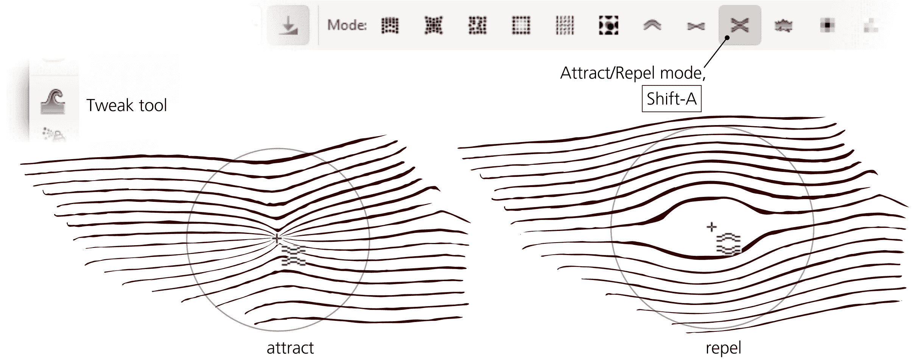

图 12-38：调整工具的吸引/排斥模式

### 12.6.6 粗化模式

粗化模式（Shift-R）随机扭曲你应用画笔的路径边缘，而不会改变路径的整体形状，如图 12-39 所示。轻微的粗化使边缘弯曲不平，而强烈的粗化则将边缘撕裂并爆炸成随机的斑点和污渍。

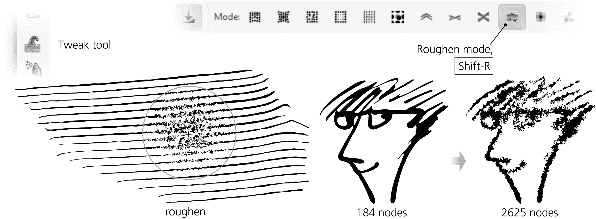

图 12-39：调整工具的粗化模式

这个操作，尤其是高保真度时，会添加*大量*的节点。如此粗糙的路径可能会变得难以编辑——用节点工具处理起来很别扭，使用调整工具可能会非常慢。我建议在需要时使用推拉、膨胀和收缩来最终确定路径的整体形状——只有在最后一步，才需要将其粗化。
