# 第十三章：路径效果

Inkscape 有三种主要的可扩展机制：滤镜、路径效果和扩展。如果你是一个开发者，渴望添加一个不需要成为矢量编辑器核心功能的新特性，那么你应该研究一下这些机制。滤镜（第十七章），源于位图处理软件，主要用于改变颜色和纹理；在本章中，继续讨论形状和路径的主题，我将描述那些为简单的 SVG 路径增添了全新复杂性和*激动人心*的交互式路径效果。扩展是为 Inkscape 用户提供新功能的最通用（但最少交互性）方式，相关内容在第十九章中有详细介绍，尽管我们将在 13.4 节中讨论路径处理扩展。

## 13.1 路径效果的工作原理

*实时路径效果*（LPEs），或者简单地称为*路径效果*，是一种易于使用（对最终用户而言）但功能强大的（对开发者而言）机制，用于修改路径的可见形状——例如，圆角、使平滑路径变粗糙，或通过拉伸或捏合使其变形。当你对路径应用路径效果（或多个路径效果）时，*原始的*效果前的路径仍然存在——你可以随时查看和编辑它。每次你编辑原始路径时，*可见的*效果后的路径都会根据原始路径和效果参数重新计算。这就是“实时路径效果”中“实时”的含义！

Inkscape 的路径效果是矢量图形基本原理的另一种应用：不是对对象做出一些永久性和破坏性的改变，而是保留原始对象不变，并记录如何应用该变化。之后，原始对象和效果的参数可以在任何时候单独进行编辑。

尽管名字如此，路径效果不仅适用于路径，也适用于形状（第十一章）——这些形状仍然是形状，并且依然可以像普通形状那样进行编辑，使用其形状工具中的句柄或数字参数（图 13-1）。路径效果也可以应用于一个组，得到的效果就像将效果应用于该组中的所有路径和形状一样。路径效果从不应用于文本对象、克隆或位图。

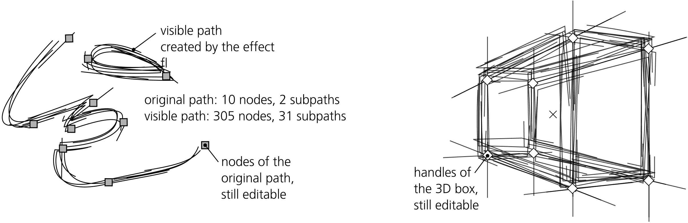

图 13-1：应用于路径（左）和 3D 方框（右）的素描效果（13.3.4.1）

当路径效果应用于对象时，唯一改变的是对象的*可见形状*；如果你想以非破坏性方式改变其*样式*，可以尝试使用滤镜（第十七章）。路径效果可以相互堆叠，使得一个效果的输出成为下一个效果的输入。

路径效果是 Inkscape 专有的功能；与滤镜等功能不同，路径效果并不是 SVG 标准的一部分。然而，它们是以 SVG 兼容的方式实现的。换句话说，如果你将一个使用了路径效果的 SVG 文件加载到任何 SVG 查看器中（或加载到不支持此效果的旧版本 Inkscape 中），你将看到与最新 Inkscape 中相同的*可见*路径——只不过无法访问*原始*路径和效果参数。

不幸的是，*显示*兼容性（你的文件在所有 SVG 查看器中保证看起来一样）并不意味着*编辑*兼容性。如果你在其他编辑器或旧版本的 Inkscape 中编辑带有路径效果的 SVG 文档，你将编辑*可见*路径，忽略了效果。如果你随后将编辑过的文件重新加载到一个支持该效果的 Inkscape 版本并尝试在其中编辑，它的修改将会丢失，因为新的可见路径将会根据未更改的原始路径和效果参数重新生成。更糟糕的是，路径效果及其解释列表没有标准化；没有保证未来版本的 Inkscape 会以完全相同的方式实现你所使用的所有效果。

尽管存在这些潜在的缺点，路径效果仍然是 Inkscape 的重要技术，自从其诞生以来，已经广泛应用于整个软件中。在内部，许多命令和功能都通过路径效果实现。举例来说，包括在钢笔和铅笔工具中的压力感应（14.1.2.2）和形状化（14.1.5）笔画，此外还有这些工具中的 Spiro 和 BSpline 模式（14.1.4），以及 Power Clip 和 Power Mask（13.3.12）。

## 13.2 管理路径效果

Inkscape 自带了一些示例 SVG 文件（位于 Inkscape 数据文件夹下的 inkscape/examples 文件夹中，你可以在首选项的系统页面查找）。其中一些示例文件（文件名以 live-path-effects 开头）展示并解释了部分 Inkscape 路径效果。让我们加载并探索其中一个，快速了解路径效果的外观和行为。

当你选择一个应用了一个或多个路径效果的路径对象时，你会注意到在状态栏中会显示相关信息——例如，“路径 328 节点，路径效果：沿路径图案，粗糙化，背景层”。你可以使用复制/粘贴技巧将相同的效果（或效果堆栈）重用到任意数量的路径上：复制源对象（Ctrl-C），选择其他路径（或形状）对象，然后使用**路径 ▶ 粘贴路径效果**命令（Ctrl-7）。

要清除路径效果并恢复到原始路径，请使用 **删除路径效果** 命令，位于 **路径** 菜单中。然而，如果你想保留效果的结果并忘记原始路径（这有时称为“扁平化”或“烘焙”效果），请使用 **对象转路径** 命令（Shift-Ctrl-C）；这样，路径看起来完全相同，但效果会消失。

对带有路径效果的路径进行布尔操作（12.2）也会“扁平化”它们——也就是说，结果与事先对所有路径使用对象转路径相同（不过，布尔操作有一个不破坏原始路径的路径效果重新实现，13.3.10）。不幸的是，这对于合并和拆分操作（12.1.1）也是如此，尽管许多效果作用于子路径，因此能够在不丢失效果的情况下操作子路径将非常有用。（事实上，这就是合并和拆分在 Inkscape 早期版本中的工作方式。）一种解决方法是将不同的路径分组，然后对组应用效果。之后，你可以进入该组（4.9.1），根据需要合并或拆分组内的路径，而不会丢失组的效果。

节点工具（12.5）编辑的是 *原始* 路径，而不是应用效果后的 *可见* 路径。由于你正在编辑的原始路径本身不可见，因此如果启用显示路径轮廓工具栏按钮（图 12-17），节点工具可以选择性地将其高亮显示为红色。此外，正如你将看到的，许多效果具有可在画布上编辑的控制柄，你可以使用节点工具拖动它们。

### 13.2.1 路径效果编辑器对话框

路径效果编辑器对话框（Shift-Ctrl-7）是 Inkscape 用于路径效果的主要控制中心（图 13-2）。在这里，你可以为选定的对象应用单独的效果，并编辑已应用效果的参数。当选定的对象包含一个或多个路径效果时，这里就是管理效果堆栈的地方——你可以在堆栈中添加、重新排列或删除效果。

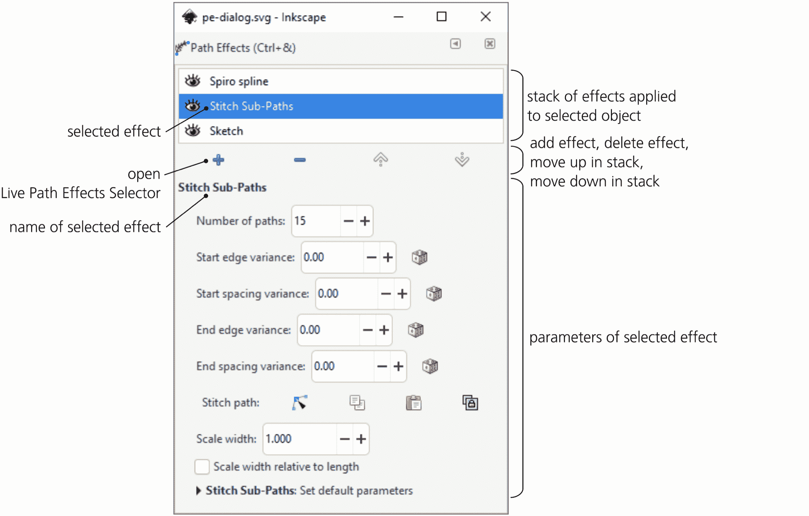

图 13-2：路径效果编辑器对话框：选定了一个包含三个效果的路径（Spiro 样条曲线、缝合子路径和素描）。

该对话框仅在选定单一路径、形状或组时有效——也就是说，你不能同时编辑多个路径上的效果。再次强调，路径效果可以应用于组这一事实提供了一个解决方法：如果你有许多路径或形状希望应用相同的效果和相同的参数，只需将它们分组，选择该组，并使用此对话框将效果应用于该组。之后，你只能在选择父组时访问或编辑这些效果，而不能选择组内的单个路径（记住，例如，节点工具总是选择路径，忽略分组）。

对话框顶部的列表显示所有应用于选定对象的效果。这些效果按从上到下的顺序列出——也就是说，列表中最上面的效果是第一个应用于源路径的。它的输出作为输入传递给第二个效果，以此类推，直到最后列出的效果的输出显示为最终结果。

你添加的任何新效果（使用列表下方的加号按钮）都会被放置在堆栈的末尾。你可以使用箭头按钮上下移动堆栈中的任何效果。点击每个效果名称前的眼睛图标可以禁用该效果，迫使 Inkscape 跳过它。要从堆栈中删除效果，请使用带有减号的按钮。

列表下方的面板是你编辑所选效果参数的地方。这些可能是普通的复选框或下拉列表，但有些效果参数属于更有趣的类型：

+   *数字*可以是整数或小数，具体取决于参数的性质。当数字表示距离时，通常会有一个单位选择器。

+   如果一个效果使用了随机数，对应的*随机数参数*给出了随机值必须落在的范围（参见图 13-3）。右侧的骰子按钮会重新随机化（技术上是*重新播种*）由该参数控制的随机值！

    图 13-3：路径效果的随机数参数

+   *链接参数*用于当一个路径的效果使用另一个路径作为其参数之一时，如图 13-4 所示。这个*链接路径*可以是位于画布上某个地方的独立对象（在同一个文档中），也可以是完全存储在路径效果中的路径，而在文档中不可见！

    图 13-4：路径效果的链接参数

每个链接参数显示一排四个按钮：

编辑

切换 Inkscape 到节点工具，并让你编辑那个链接的参数路径——无论它是一个独立对象还是存储在效果内部的路径（图 13-5）。参数路径显示为深绿色轮廓。

这就像你手动切换到节点工具并点击控制栏上的“显示下一个可编辑路径效果参数”按钮（参见图 12-17），以导航到这个特定的链接参数路径（因为根据效果的不同，可能有多个）。

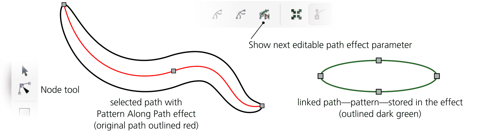

图 13-5：编辑路径效果的链接路径

复制

将链接的路径复制到剪贴板。

粘贴

将剪贴板中的路径粘贴到效果中，制作一个剪贴板路径的副本并将其存储在效果中。

链接

将复制到剪贴板的路径链接到文档中的原始路径。现在，编辑你复制的路径将改变该路径的效果。

一些效果只能*链接*到文档中的另一路径，而不能将其存储在内部，因此它们没有复制和粘贴按钮（例如，克隆原始效果，13.3.5.1）。

除了对话框中的数字控制外，一些路径效果还允许你通过节点工具和形状工具中的画布上手柄来可视化编辑它们的参数（在我讨论具体效果时，你会看到这些例子）。这些手柄通常是白色的，呈菱形，但它们可以是任何颜色或形状，只要它们不会与路径节点和节点手柄混淆，这些节点和手柄也可以在该工具中进行编辑。将鼠标悬停在路径效果手柄上时，通常会在状态栏中显示一些有用的提示。

在参数面板的底部，有一个折叠的部分，标题为“设置默认参数”。在这里，你可以将任何效果参数的当前值设为默认值。然后，当你将此特定效果应用到新对象时，默认值将被使用。

## 13.3 Inkscape 路径效果指南

路径效果仍然是 Inkscape 开发中的一个活跃增长领域，程序支持的效果列表在每个新版本中都会扩展。不幸的是，这也意味着路径效果在 Inkscape 中比其他部分更处于“进行中”状态。某些效果被标记为“实验性”，但即使是非实验性的效果，也并非所有效果都足够完善和可靠，不能常规使用。

本节列出了最新版本 Inkscape 中最有用和最实用的路径效果，并按主题进行了分组，并附有示例。图 13-6 显示了当你点击路径效果编辑器对话框中的加号按钮以添加新效果时所看到的内容。

图 13-6：Inkscape 中的所有路径效果（不包括实验性效果）

### 13.3.1 描边塑形效果

从历史上看，后来的 Inkscape 路径效果最初是受到了希望让路径的描边更加有趣和富有表现力的想法的启发——而不仅仅是标准的同宽 SVG 描边——即拥有可编辑的*矢量画笔*。现在，Inkscape 提供了两种不同的方法，在本节和随后的章节中进行了描述；每种方法至少有两种不同的实现，作为独立的路径效果。

#### 13.3.1.1 功率描边

想象一下，你的描边路径沿其长度有额外的手柄，你可以水平拖动其中任何一个，以便在该区域内使路径变宽或变窄。这正是功率描边效果所提供的：一种可变宽度的描边，你可以通过拖动屏幕上的手柄（在节点工具中）来交互式地调整其轮廓。就像常规描边一样，你还可以调整端点类型（9.3）和连接类型（9.2），并可以调整各种插值和平滑设置。

Power stroke 是铅笔工具在压力敏感模式下应用于它所创建的路径的效果（14.1.2.2）。然而，像其他任何路径效果一样，你也可以手动将其应用于任何路径。只需选择一个路径，点击**路径效果编辑器**对话框中的加号按钮，并在列表中选择**Power stroke**（图 13-6）。这将在路径上创建一个带有（最初）三个紫色 Power stroke 控件的效果。切换到节点工具，拖动其中任何一个控件，查看路径的反应（图 13-7）。

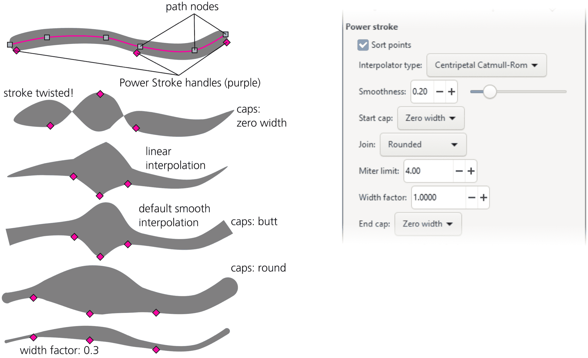

图 13-7：Power stroke 效果

在该效果的参数中，最有用的是宽度因子，它可以在所有控件上均匀地缩放笔触宽度，以及端点类型，你可以为起始和结束节点分别选择。默认的零宽度端点将笔触从第一个/最后一个紫色控件平滑地渐变到路径的终点，而平头、圆头和峰头端点则保持从最终控件到路径末端的相同宽度。

如果你需要更多的紫色控件来塑造你的笔触，可以按住 Ctrl 键点击其中任何一个控件，然后拖动以创建一个新的控件，位置与原控件相同。要删除一个控件，按住 Ctrl+Alt 键点击它。

#### 13.3.1.2 渐变笔触

Power stroke 的一个更简单的变体是渐变笔触效果，如图 13-8 所示。与任意形状的设计不同，它只是在笔触的两端进行渐变——但这对于许多使用场景来说已经足够。这种效果显示了两个圆形控件，它们只能沿路径的中心线移动，指示路径开始变窄的位置。渐变平滑参数允许你调整渐变的程度，从三角形（0）到平滑的椭圆形（1）。

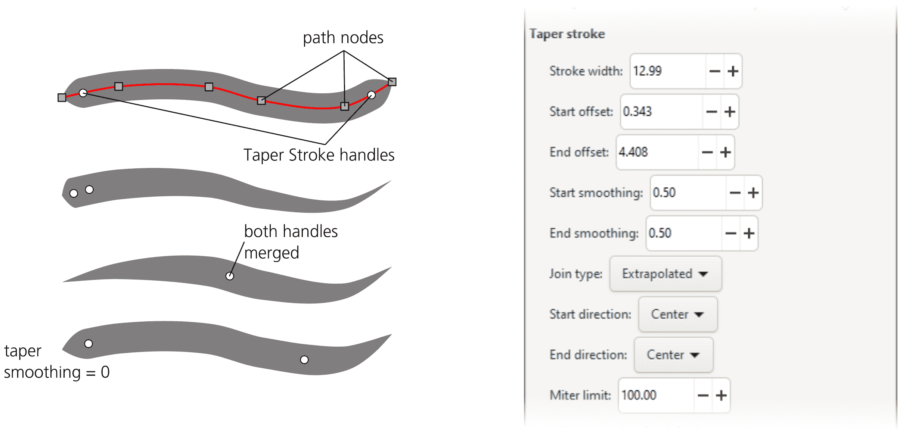

图 13-8：渐变笔触效果

渐变笔触和 Power stroke 的最大问题在于，它们依赖于路径中节点的位置，而不是路径上的距离。例如，渐变笔触中的数字起始/结束偏移是以路径中第一个/最后一个节点的单位来衡量的——因此当起始偏移为 1 时，起始渐变控件与路径上的*第二个*节点重合。许多路径操作（如简化功能，12.3）不会保留节点位置，这使得渐变笔触和 Power stroke 的表现变得不可预测。

### 13.3.2 路径弯曲效果

路径沿线图案和弯曲效果实现了另一种可编辑向量画笔的方法（图 13-9）。它们都取一个路径（称为*图案*）并将其沿另一个路径（称为*骨架*）进行弯曲和/或拉伸。像往常一样，路径效果中，骨架路径和图案始终是可编辑的，结果会实时更新。

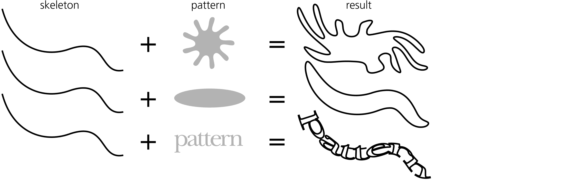

图 13-9：沿着骨架弯曲一个图案

这也被铅笔工具使用：你可以将预定义的固定形状分配给铅笔笔画，而不是由压力敏感平板笔控制的强力笔划（参见图 14-12 示例）。你还可以将使用普通 SVG 笔画绘制的现有图形尝试应用各种图案。

#### 13.3.2.1 路径沿线图案

路径沿线图案和 Bend 效果的主要区别在于哪个路径是骨架，哪个是图案。在路径沿线图案中，你应用效果的路径是骨架，而图案是通过链接参数连接的。

该效果非常适合应用于任意复杂骨架的简单、可能重复的图案。链接的图案路径可以是文档中的独立路径对象，也可以是效果本身内部存储的路径。结果将获得骨架的样式。这是钢笔和铅笔工具中形状选项所使用的效果（14.1.5）。

一旦你将路径沿线图案应用到骨架路径上，你需要通过图案源链接参数提供图案。编辑按钮不会起作用，除非你先粘贴或链接某个图案路径，因此操作的常规顺序如下：选择一个图案路径，复制它（Ctrl-C），选择一个骨架路径，给它分配**路径沿线图案**，然后将图案粘贴或链接到它，如图 13-10 所示。如果你在钢笔或铅笔工具的形状列表中选择“从剪贴板”选项，你还可以自动将已复制的图案应用到新绘制的路径上。

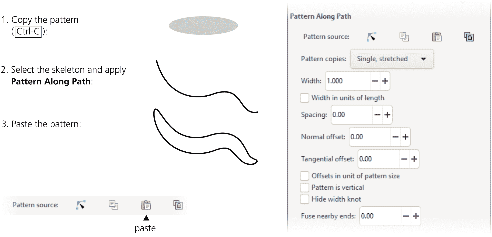

图 13-10：路径沿线图案效果

路径沿线图案效果可以使用以下*重复模式*之一：

单一

沿着骨架从起始节点放置一个图案副本，而不拉伸它。如果图案短于骨架，它只会覆盖骨架的一部分；如果图案长到根本无法适应，甚至不符合一次，它将不会被应用。

单一，拉伸（默认）

也会将图案的单个副本沿着骨架放置，但总是会拉伸或压缩它，以使其完全适应骨架的长度。Bend 效果始终使用这种模式；与路径沿线图案不同，在 Bend 中，重复模式不可更改。

重复

沿着骨架放置尽可能多的图案副本，但不拉伸它们，因此骨架的剩余部分（少于一个图案长度）保持为空。（这并不意味着图案的副本是相同的；骨架的曲率可能会明显扭曲它们，如图 13-11 所示。）

重复，拉伸

沿着骨架放置尽可能多的图案副本，并均匀地拉伸它们，使它们完全填充整个骨架长度。

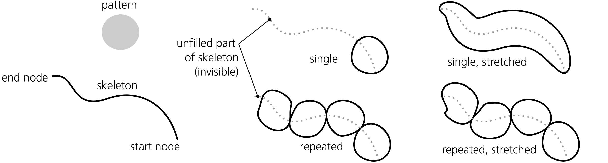

图 13-11：路径沿线图案的重复模式

图案总是从路径的起点开始；如果你想让它反向排列，可以使用**路径 ▶ 反转**。

路径沿图案效果还允许你调整一些*距离参数*：

间距（仅适用于重复模式）

设置图案在路径上副本之间的间距。

正常偏移

将所有图案副本*垂直*于骨架路径移动。

切向偏移

将所有图案副本*沿着*骨架路径移动，使得第一个图案不从骨架的起点开始，而是从指定的距离开始。

这些偏移和间距参数默认使用绝对`px`单位。通过勾选“以图案大小为单位的偏移”复选框，你可以将它们表示为图案大小的乘数——例如，0.5 的切向偏移会将图案沿骨架移动图案宽度的一半，如图 13-12 所示。

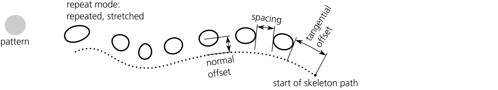

图 13-12：路径沿图案的间距和偏移

默认情况下，原始图案被认为是水平的——即图案通过图案的水平轴与骨架对齐。通过勾选“图案为垂直（对于路径沿图案）”或“原始路径为垂直（对于弯曲）”，你可以将图案旋转 90 度，使其垂直轴与路径对齐（见图 13-13）。

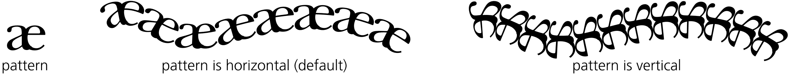

图 13-13：路径沿图案中的图案方向

这两个效果都允许你改变图案的宽度。宽度参数可以用图案原始宽度的单位来测量，也可以用骨架长度的单位（长度单位下的宽度）。在这两个效果中，你还可以通过屏幕上的手柄来调整宽度，该手柄通过一个垂直的线段附加到骨架路径的一端（图 13-14）。

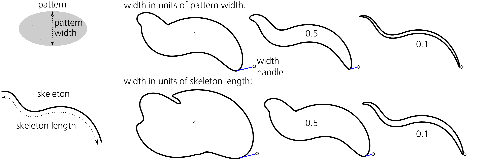

图 13-14：在路径沿图案中调整图案的宽度

#### 13.3.2.2 弯曲

在弯曲效果中，你应用效果的路径就是图案，而骨架则通过链接参数连接。当你有一个复杂的图案，想要沿着一个简单的骨架路径轻微弯曲时，这种方式更加方便，多个弯曲路径可以共享这个骨架路径。类似地，链接的骨架路径可以是文档中的独立路径，也可以是效果内部存储的路径。结果将得到图案的样式。

对于这个效果，你从图案开始，应用效果，并使用弯曲链接参数连接到骨架。不过，与路径沿图案不同，弯曲效果提供了一个默认的两节点骨架路径，这个路径沿图案的水平轴拉伸——因此你可以直接使用编辑按钮编辑这个骨架（图 13-15）。或者，你可以从剪贴板粘贴一个骨架（该骨架本身可能已应用了一些路径效果），或者链接到剪贴板中复制的路径。

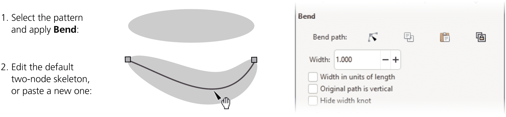

图 13-15：弯曲效果

### 13.3.3 变形效果

这一组效果会在你的路径上创建一个可编辑的外部框架，然后你可以编辑该框架，从而以各种方式变形或扭曲路径。例如，当你将复杂的形状嵌入到 3D 场景中（透视变形）或将标签贴到曲线瓶身上（格栅或信封变形）时，你将需要使用这个效果。与所有其他路径效果一样，这些变形既可以应用于群组，也可以应用于单个路径，并且该群组可以包含各种不同风格的对象（尽管该群组中的非路径对象和非形状对象，如位图或未转换为路径的文本，将*不会*受到该效果的扭曲）。

#### 13.3.3.1 信封

这一组中最简单的效果——信封变形，创建一个矩形信封，四个边都可以作为贝塞尔曲线进行编辑。该效果将四个边视为四条独立的辅助路径（“弯曲路径”），这有点不便：你需要依次点击编辑按钮来弯曲四个边。复制和粘贴按钮允许你将信封的形状从一个对象转移到另一个对象，但这也需要四次独立的复制/粘贴操作。另一方面，四条边是独立的，意味着它们不一定需要相互接触，这使得变形具有更多灵活性，如图 13-16 所示。

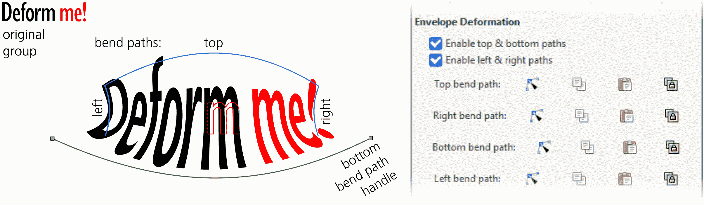

图 13-16：在路径群组上进行信封扭曲（底部弯曲路径激活）；红色轮廓（在节点工具中鼠标悬停时显示）显示了其中一个字母的原始未扭曲路径。

#### 13.3.3.2 格栅

格栅变形效果是相同概念的一个更复杂的变种。它创建一个五乘五的控制点格栅，你可以单独拖动每个控制点（同样适用于节点工具），这使得可以进行更复杂、更精细的变形（见图 13-17）。

手动处理这么多点可能会很麻烦，因此该效果提供了一些简化工作流程的方法：水平/垂直参数的镜像运动使格栅对称，这样你只需要编辑其中一半；使用“仅使用外围”会完全移除内部点，仅限于外围的 16 个点。重置网格按钮可以清除所有出错的格栅编辑，并重新开始。

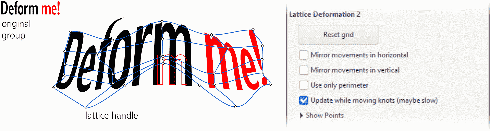

图 13-17：在路径群组上进行格栅扭曲；红色轮廓（在节点工具中鼠标悬停时显示）显示了其中一个字母的原始未扭曲路径。

#### 13.3.3.3 透视

最后，透视变换效果专门用于路径的 3D 类变换——例如，这是你将文本放置在 3D 盒子侧面时所使用的效果（见 11.3）。在这里，信封只有四个角节点，且其边不能进行弯曲，如图 13-18 所示。该效果的参数允许你数值设置四个点的坐标，或使信封具有对称性。

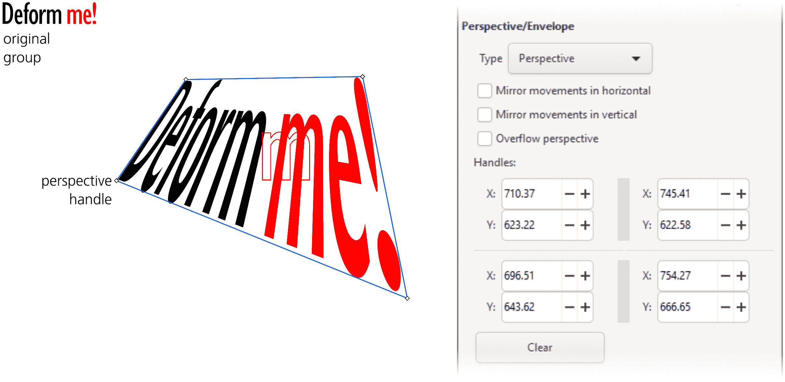

图 13-18：一组路径的透视失真；红色轮廓（在节点工具中鼠标悬停时显示）显示了其中一个字母的原始未失真路径。

### 13.3.4 艺术效果

这一组效果旨在使物体看起来不那么几何化，更加有机或像自由手绘的效果。通常，这涉及到一定的随机元素。

#### 13.3.4.1 草图

草图是一种艺术效果，将路径转换为像草图一样的图形，由多条笔画构成，就像艺术家在纸上草拟完美形状的过程一样（见图 13-19）。

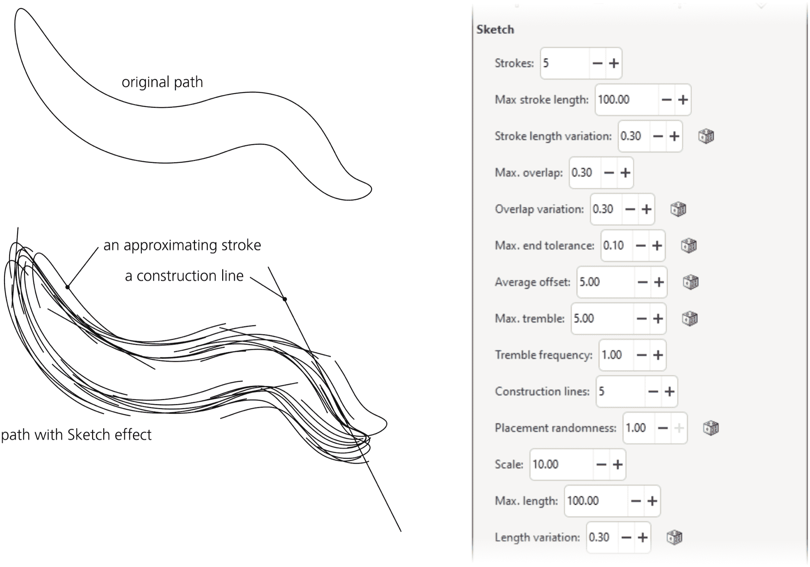

图 13-19：草图效果

为了理解这个复杂效果的参数，注意草图由两种类型的图形元素组成：近似笔画和构建线条。*近似笔画*覆盖整个路径；它们通常是曲线，或多或少与原始路径平行（带有一定的抖动），并与原始路径保持一定距离。而*构建线条*则通过绘制直线，在路径的每个直线或近似直线的段落两侧延伸，以识别并强调这些段落。

对于近似笔画，你可以更改以下内容：

+   路径上每个点的平均*笔画数量*（默认值为五）。将此参数设置为 0 可以隐藏近似笔画（仅保留构建线条）。较低的值使草图显得轻盈和试探性；增加数量则使草图更加大胆且喧闹，如图 13-20 所示。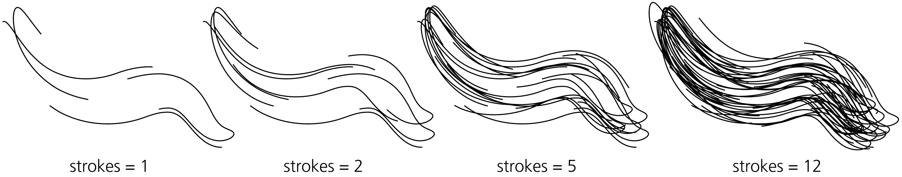

    图 13-20：改变近似笔画的数量（构建线条关闭）

+   笔画的最大*长度*（以`px`为单位）及其随机长度变化的范围（相对于最大长度）。

+   后续笔画的最大*重叠*（以`px`为单位）及该参数的随机变化范围（相对于最大重叠值）。

+   *结束容差*，影响近似笔画与原始路径之间的接近程度。

+   近似笔画与原始路径的平均*偏移*；通过调整该参数，你可以使草图看起来既整齐紧凑，又宽松凌乱。

+   最大的*抖动*和它的*频率*；这些控制笔画围绕原始路径的振荡方式（见图 13-21）。增加最大抖动会使草图更加凌乱，类似于增加偏移量，但更具随机性。增加频率则会让草图线条看起来更粗糙，因为它们在更小的尺度上抖动。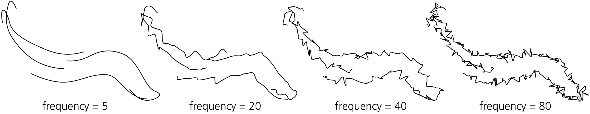

    图 13-21：改变近似笔画的抖动频率

对于构建线条，你可以更改以下内容：

+   草图中的总*线条数量*（非平均值，默认值为五）。将此设置为 0 可以抑制构建线条，只保留近似笔画。

+   *scale*参数指示构造线的端点可以超出路径的直线（或近似直线）段的多远。

+   最大的*长度*及其随机*变化*，用于设定构造线的长度上限（见图 13-22）。

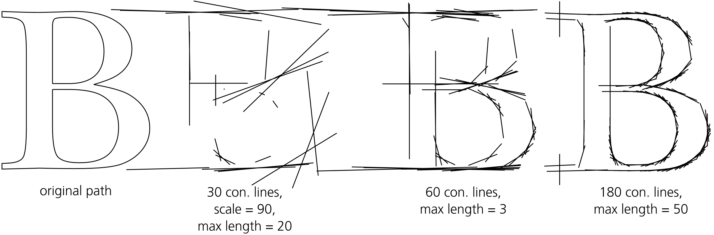

图 13-22：调整构造线（近似的笔画已关闭）

#### 13.3.4.2 Hatches

Hatches 效果与您之前看到的所有其他效果不同，它聚焦于路径的填充，而不是其笔画。它创建了一条填充路径的波动线，给人一种自由手绘艺术填充的印象。

填充的基本参数通过屏幕上的手柄进行控制，可以在节点工具中编辑。共有两对手柄：绿色的一对控制填充的密度（频率）和倾斜度，黄色的一对将填充线条弯曲成弧线。在每一对手柄中，圆形手柄为基准（可以放置在任何位置），而菱形手柄则通过相对于基准的位置来控制其参数，如图 13-23 所示。

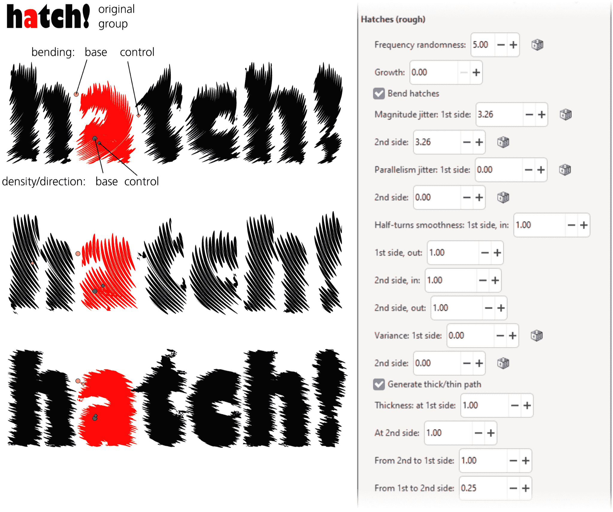

图 13-23：Hatches 效果及其控制手柄

该复杂效果的其余参数控制填充形状的各个方面。频率随机性控制填充笔画密度的随机变化量；此值越小，填充的密度越均匀。

参数标签中的第 1 侧和第 2 侧指的是交替弯曲的两组方向——例如，如果填充是垂直的，则为底部和顶部。因此，Magnitude 抖动，第 1 侧控制了每个弯曲在底部的随机位置——即，填充在底部沿着原始路径的边缘跟踪的程度。

Parallelism 抖动会增加笔画方向的随机性，Half-turn 平滑度允许您调整弯曲角度的锐利度，直到形成圆弧。最后，Thickness 值会改变不同部分的填充笔画宽度。图 13-24 展示了一些示例。

图 13-24：调整 Hatches 效果参数

#### 13.3.4.3 Roughen

Roughen 效果是路径效果生态系统中的通用噪声组件。它将路径的 Bézier 曲线细分为较短的段，并随机位移节点和节点手柄（见图 13-25）。

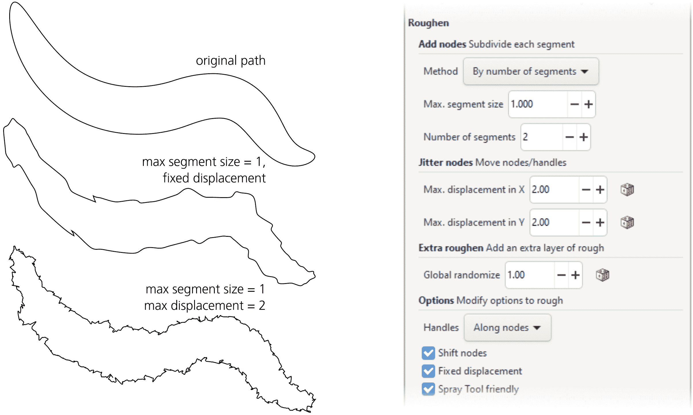

图 13-25：Roughen 效果

细分通过两种方式之一完成：要么指定最大段长度，要么给定将原始路径的每个 Bézier 曲线分成的段数。第一种方法（默认）更好，因为它不依赖于原始路径的节点，并且产生大致相等的段长度。

接下来，你可以选择节点抖动的幅度。最大位移参数将从上方限制此幅度——但如果勾选固定位移复选框，它还会限制节点的移动幅度为（细分后的）段长度的 1/3。也就是说，如果你想将节点抖动 10 像素，你需要在最大位移字段中输入 10，并且取消勾选固定位移复选框。如果未勾选移动节点选项，效果仅会随机旋转贝塞尔段的控制点，而不会移动节点本身。

#### 13.3.4.4 简化

你已经在 12.3 中遇到过简化效果，它是一个一次性破坏性命令。现在，来认识一下它的温和、合作且完全可逆的“亲戚”：简化路径效果。

简化是一个强大的概念。你取一个路径，要求 Inkscape 从头开始重新绘制它，不看原始节点，但尽量保留整体形状——并进行一定的简化。结果可能或多或少有用，但它很少不令人愉悦。将简化与粗化一起归类是有道理的，因为它们的作用是完全相反的——尽管，当然，简化一个粗化的路径不会得到完全相同的原始路径，而只是得到一种不同的（更微妙的）艺术性扭曲，正如图 13-26 所示。

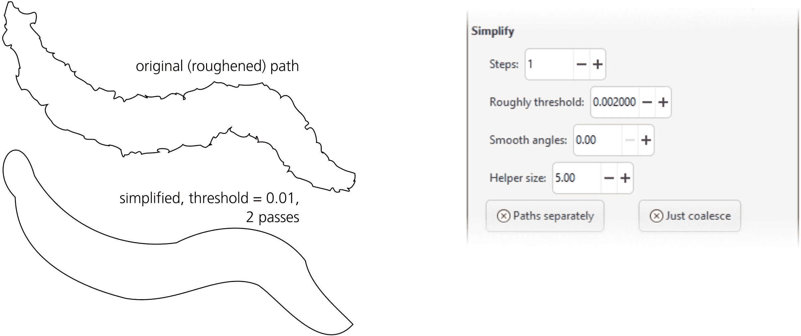

图 13-26：简化效果

该效果的参数包括简化阈值和通道次数，值得调整。（辅助线大小最好设置为 0；我无法找到此效果在画布上显示的辅助线有什么用。）

有时，将粗化效果叠加到简化效果上也是有意义的，这样简化就会创建一个具有特征的有机形状，而粗化则为其添加纹理，正如图 13-27 所示。

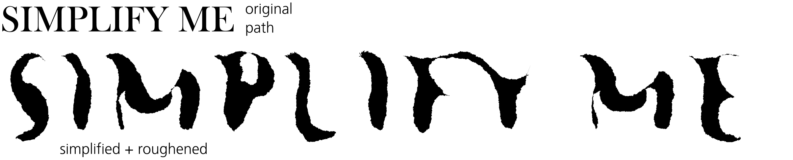

图 13-27：粗化叠加在简化效果之上

### 13.3.5 重复器与分形

一些效果不是扭曲源路径，而是以各种有用的方式简单地复制或乘以它。

#### 13.3.5.1 克隆原始路径

这是一个通用的克隆效果，用于将一个路径的节点（更准确地说，是*路径数据*，包括所有节点和控制点的位置与类型）复制到另一个路径。与标准 SVG 克隆效果（第十六章）不同，这个效果只允许复制路径数据，而不包括其路径效果。克隆路径仍然是路径，因此你可以在原始路径上应用其他效果。例如，你可以有一个使用 Spiro 曲线的原始路径，以及多个在其上应用不同程度的粗化或简化效果的克隆路径。这个效果还允许你精确指定克隆对象从原始路径获取的属性或 CSS 样式（8.1）。

你甚至可以将一个路径链接到文本对象，而无需将其转换为路径。这样，文本仍然保持可编辑状态，但你也会拥有一个自动相同的路径，具有克隆原始效果，可以在其上叠加其他路径效果。

要使用此效果，首先需要一个路径对象，它将成为克隆（其自身的路径数据将被丢弃）。为其分配**克隆原始**效果。然后，选择并复制（Ctrl-C）你想要克隆的路径或文本。接着，再次选择具有**克隆原始**效果的路径，并在其参数面板中点击**链接到项目**按钮。（旁边的“选择原始”按钮用于选择该路径克隆自的对象。）然后，选择一个**形状**选项来精确控制将被复制的路径数据：

+   带有 LPE（默认）：显示所有路径效果的路径。

+   无 LPE：路径未应用任何路径效果之前的状态。

+   仅限 Spiro 或 BSpline：仅应用了其样条效果的路径（如有）(13.3.7)。

+   无形状：没有任何内容被复制。

最后，你可以指定（以逗号分隔的列表形式）克隆将从原始路径获得的属性和 CSS 属性。一个单独的复选框控制变换的复制（第六章）；如果未选中，克隆将始终精确地定位在原始路径的上方（或下方，取决于 z 顺序）。

#### 13.3.5.2 切割 [1.1]

切割效果将一个路径（或形状或组）通过直线切割成两半。这个“把人一分为二”的技巧会生成两个独立的路径，你可以分别移动、变换和样式化它们（图 13-28）。这两个生成的路径中，一个（应用了切割效果的路径）存储并允许你编辑整个路径，但只显示其中的一半。另一个路径没有任何路径效果，但当你编辑第一个路径时，它会自动更新以反映更改。你可以通过控件调整切割线的位置和角度。

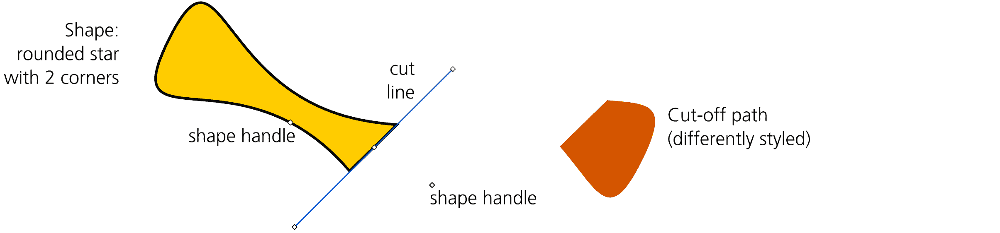

图 13-28：切割形状

#### 13.3.5.3 镜像对称

此效果会将原始路径进行镜像，并围绕一个对称轴创建其副本，你可以通过节点工具中的屏幕控件进行交互式调整（图 13-29）。镜像轴的长度无关紧要，只有其位置和方向才是关键。在镜像轴上的三个控件中，端点控件会旋转它，而中间的控件则使其平行移动。

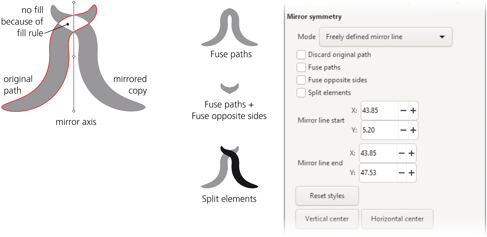

图 13-29：镜像对称效果

默认情况下，效果会将副本创建为原始路径的子路径，因此在原始路径和副本重叠的区域，填充规则决定了绘制方式（12.1.2）。如果启用融合路径，路径将永远不会重叠，因为它们会被镜像轴裁剪；如果你同时启用融合对面，则裁剪本身也会镜像，因此你只会看到超出镜像轴的路径部分（以及它们的反射）。分割元素选项会为镜像副本创建一个单独的路径元素，而不是子路径，它可以有不同的样式；你可以手动变换或节点编辑这个镜像路径——但如果你之后对原始路径进行变换或节点编辑，镜像副本对象会同步并覆盖你的更改。

甚至像镜像对称这样的简单效果，如果应用到一个大型复杂的星形，例如图 13-30 所示，也能产生令人惊叹的深度图案。

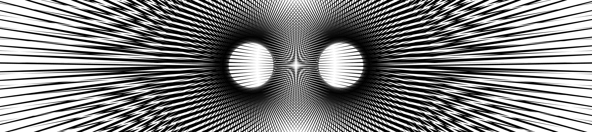

图 13-30：猫头鹰的眼睛：一个镜像的 183 射线星

#### 13.3.5.4 旋转副本

这是镜像对称效果的近亲，区别在于它可以创建任意数量的副本，这些副本被放置在一个圆圈上，你可以通过节点工具的屏幕手柄调整圆心和起始角度。你还可以选择镜像每第二个副本。你也可以启用分割元素选项，为每个副本创建独立的路径元素，而不是子路径。请注意，调整起始角度会旋转所有路径副本，包括原始路径（即使节点工具仍会显示原位置，如果你启用了红色轮廓），如图 13-31 所示。

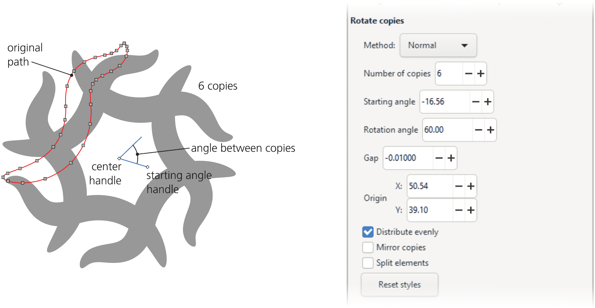

图 13-31：旋转副本效果

#### 13.3.5.5 填充多重[1.1]

填充多重效果会创建一个新的路径，链接到一个或多个原始路径，并覆盖它们之间的整个空间——就像这些路径的端点通过直线段连接形成一个单一的闭合路径一样。原始路径可以有一些自己的路径效果（例如，路径形状效果）。编辑任何链接路径时，填充路径会自动更新。这个效果非常有用，它甚至有自己的菜单命令：路径 ▶ 填充路径之间。

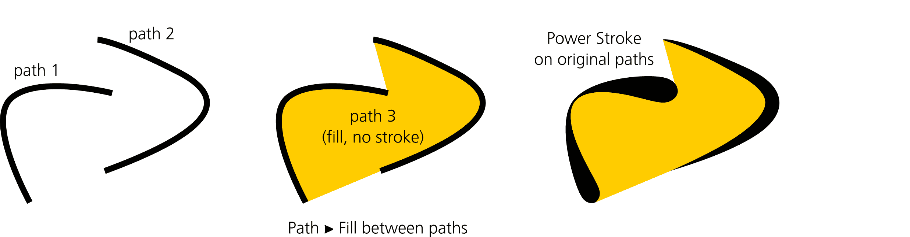

图 13-32：填充多重效果

你不能使用选择器进行节点编辑或转换填充路径，但你可以为其设置自己的填充和/或描边样式。你还可以选择并删除它作为一个独立的对象，而不会影响链接的路径。

尽管名称中有*many*（许多）一词，这个效果在只有一个原始路径时也同样有效。当你给带填充的路径分配 Power stroke 或 Taper stroke（13.3.1.1），也会创建一个填充路径，这个路径与原始路径关联，重新生成其原始的填充样式（否则会丢失）。这样，你就可以获得一个有形状的笔触和其中的填充，且当你编辑路径时，两者都会实时更新。

### 13.3.6 VonKoch

这个递归效果会将原始路径重复两次（作为子路径），并进行位移、缩放和旋转；然后，它会对这些副本重复相同的操作，如此反复进行，直到达到指定的*代*数。这是一个分形的例子——一种自相似的形状，在不同的缩放级别下看起来是相同的。

三条辅助路径控制副本的变换：一个*参考段*（最初，水平跨越源路径）和两条*生成路径*（最初，水平跨越两个第一代副本），如图 13-33 所示。

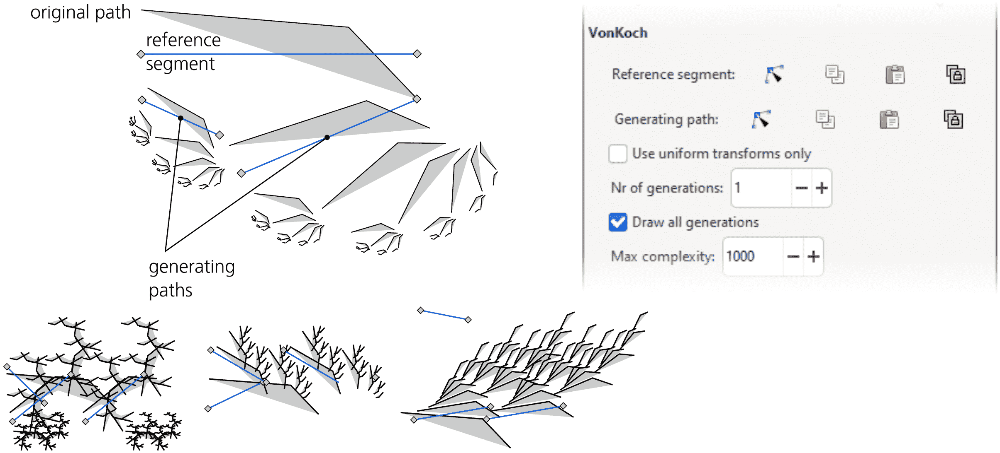

图 13-33：多个 VonKoch 分形，源路径相同，但辅助路径不同

这些辅助路径是两节点的直线段；要编辑它们，请使用节点工具，并在其控制栏上点击**显示下一个可编辑路径效果参数**按钮一次（对于参考段）或两次（对于生成路径）。

### 13.3.7 样条

*样条*一词最早由造船工人使用，指的是一种有弹性的木条，它被固定在几个点上，并根据限制条件形成最自然平滑的形状。在计算机设计中，样条是一种数学曲线，它通过给定的点，并具有一些理想的特性，如平滑度和自然性。

贝塞尔曲线（12.1.4）是一种样条，但也有其他类型的样条。贝塞尔曲线具有灵活性和强大功能；使用它们构建路径已有许多年的传统。所有现代图形软件都以类似的方式支持它们，数以百万计的用户对此非常熟悉。然而，一旦尝试更好的东西，贝塞尔曲线的缺点就变得显而易见。

通过路径效果，Inkscape 实现了另外两种样条曲线类型：BSplines 和 Spiro 样条曲线。钢笔和铅笔工具可以直接生成 BSplines 和 Spiro 路径（14.1.4）。

#### 13.3.7.1 BSpline

*BSpline* 是一种平滑曲线，刻画在由原始路径的节点组成的多边形中（见图 13-34）。它并不经过这些节点，而是将它们视为滑雪道上的标杆——尽量接近它们，但不会减速（也就是说，不会牺牲平滑度）。只有曲线的起点和终点节点位于 BSpline 上，而平滑的内部节点则是*离曲线*的。（实际上，这些离曲线的节点几乎表现得就像它们是一个单一庞大 Bézier 曲线的控制点，该曲线可以有任意数量的控制点，而不仅仅是两个。）

图 13-34：BSpline 示例

一个 BSpline 路径也可以包含尖点节点（这些节点*确实*位于曲线上，因为它们开始或结束一个弯曲段）。如果原始路径的某个节点拥有非零长度的 Bézier 控制点，那么它就会变成 BSpline 的离曲线平滑点；如果某个节点至少有一个控制点被收回，那么它就会被解释为一个尖点节点。要在 BSpline 中切换节点类型，在节点工具中使用 Shift-S（平滑）和 Shift-C 两次（尖点，第一个 Shift-C 只是改变节点类型，第二个 Shift-C 则实际上收回控制点）。

除了第一个/最后一个节点和尖点节点外，所有其他节点都是离曲线的这一事实，可能是 BSpline 在实践中的最大缺点。尽管如此，如果你希望路径始终保持自然平滑，并且比一系列 Bézier 曲线更容易操作，那么 BSpline 效果值得一试。

#### 13.3.7.2 Spiro Spline

*Spiro splines*，由 Raph Levien 开发，是另一种定义曲线路径的方式。Spiro 路径需要一些时间来适应，但对于某些任务（如字母形状设计，图 13-35），它们相比 Bézier 曲线有明显的优势。与 BSpline 相比，Spiro 路径通常更难操作——有时甚至让人很难控制——但作为回报，它们在平滑度上达到了一个全新的自然水平。

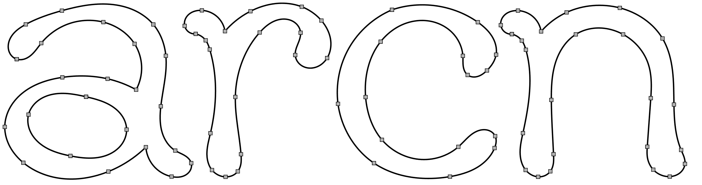

图 13-35：通过 Spiro 路径创建的字母形状

Spiro 路径由一系列节点定义。一个 Spiro 路径没有离曲线的节点或控制点；与 BSpline 不同，Spiro 路径会经过它的所有节点。路径的曲率完全由节点的位置及其类型定义，如图 13-36 所示。该路径的行为非常类似于原始船舶制造商的*spline*——一根弹性杆，必须通过给定的点并假设*最小可能的曲率*以满足要求。

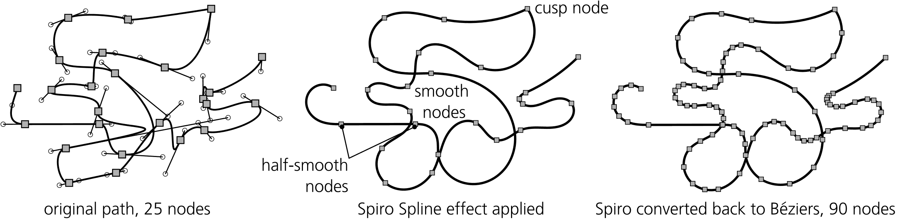

图 13-36：将常规路径转换为 Spiro 路径并再转换回

Spiro 路径的最大卖点是它总是非常平滑——不仅仅是表面或局部平滑，比如没有尖点，而是整个路径在平滑度上的一致性，这是通过贝塞尔曲线只有通过大量繁琐的调整才能近似得到的。使用 Spiro 时，移动一个节点可能会明显影响几节点远处的曲线。这需要一些适应，但结果可能值得付出努力。

对于贝塞尔曲线，主要问题是每个节点不仅有一个位置，还有它的内在方向和曲率，这些是由控制点定义的。所以，每当你移动贝塞尔节点时，还需要仔细调整它的控制点，以确保曲线保持自然平滑。使用 BSpline 或 Spiro 时，只需将节点移动到你想要的地方，曲线的平滑度会自动处理。

要创建 Spiro 路径，选择任何路径并为其指定**Spiro 样条**路径效果。没有参数。路径的每个节点根据节点类型（12.5.5）成为 Spiro 路径的一个点，如图 13-37 所示：

平滑节点

具有两条共线贝塞尔控制点的节点是 Spiro 路径上的平滑点。源路径上贝塞尔控制点的长度和方向会被忽略，只要它们保持共线（即节点是平滑的）。按 Shift-S 可将选定节点的控制点对齐，使其平滑。

半平滑节点

具有一条贝塞尔控制点与另一侧直线段共线的节点，在 Spiro 路径上表现得完全相同：它们位于直线与曲线之间，并强制它们平滑连接而不形成尖点。如果节点的一侧有直线段，第一次按 Shift-S 会使其变为半平滑。

尖点节点

源路径上的节点成为 Spiro 路径的拐角点。它们像弹性杆上的自由铰链一样，可以在任意角度弯曲。在两个拐角点之间，Spiro 路径始终是直线。要使节点成为尖点，按两次 Shift-C（第一次 Shift-C 只改变节点的类型，第二次实际上会收回控制点）。

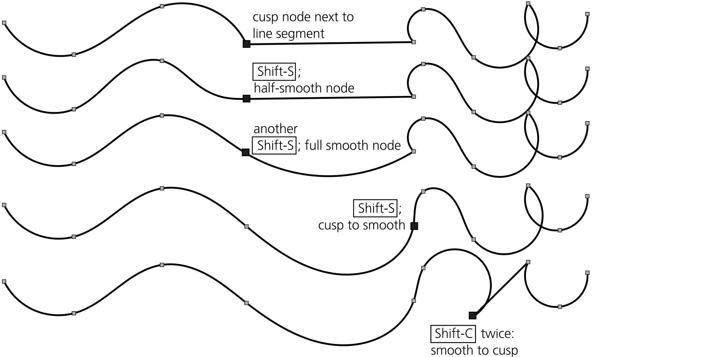

图 13-37：在 Spiro 路径中玩弄节点类型

Spiro 样条的最大问题是某些点配置不稳定，导致出现狂野的环路和螺旋，而不是平滑的曲线（图 13-38）。不过，合理的点序列通常没有问题；你只需要避免节点间方向的剧烈变化，以防止这种不稳定性。

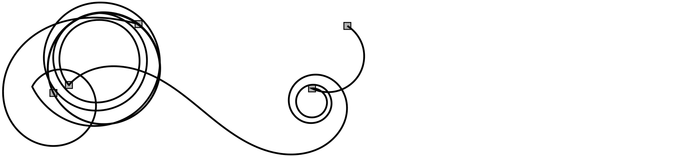

图 13-38：具有五个节点的发散 Spiro 路径

在使用节点工具编辑 Spiro 路径时，源路径的红色高亮可能会成为干扰；你可以通过控制栏上的切换按钮关闭它。

### 13.3.8 路径工具

这一类别包括对路径进行一些有用的调整，这些调整手动执行会非常耗时。

#### 13.3.8.1 拐角（圆角/斜角）

圆角是设计和技术制图中非常常见的操作。矩形有方便的控制柄用于圆角处理（11.2.2），但普通路径并没有这个优势。当然，你可以手动圆化路径的尖角，但这是一项繁琐的任务，而且使得路径后续的编辑或变换更加困难。幸运的是，Inkscape 有一个路径效果，能够为你完成所有繁重的工作，同时保留原始路径的灵活性。它甚至比矩形圆角处理更好，因为它允许不同的圆角半径应用于不同的角，并且支持不同的圆角样式！

*倒圆角*意味着用弧线将角部圆化，而*倒角*意味着用直线段切割角部。为了增加趣味性，倒圆角和倒角都可以*反转*——即，围绕切角的对角线翻转。倒角可以是多步骤的——即，由多个直线段组成（显然，只有在多步骤倒角中，反转才会产生效果）。

你可以通过节点工具中的屏幕上的控制柄调整任意节点（不一定是尖角）的倒角/倒圆角大小，如图 13-39 所示。你还可以在参数面板中更改半径值；默认情况下，这个值（以及任何其他参数变化，如角类型）会应用于路径的所有节点，但如果启用了“仅更改所选节点”，则可以限制为仅对选定的节点应用。半径可以是绝对单位，也可以是相邻段长度的百分比。

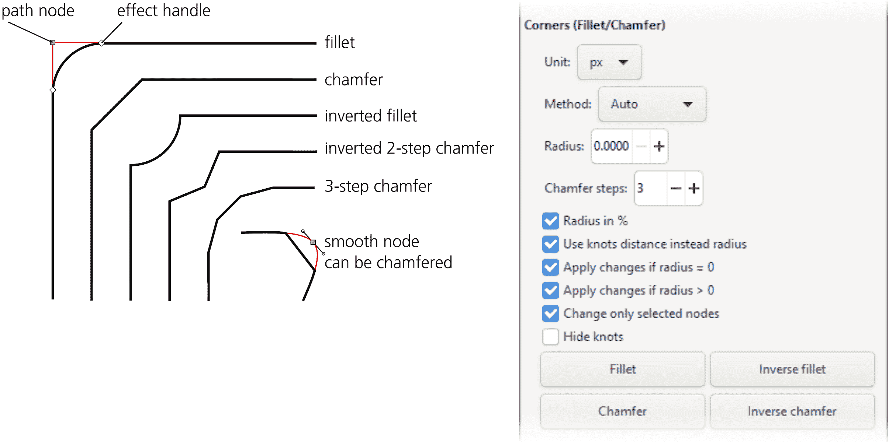

图 13-39：角部（倒圆角/倒角）效果

#### 13.3.8.2 节点

该效果通过将路径分割成子路径，来在路径（或一组路径）自交的地方创建间隙。图 13-40 展示了如何将带有自交的笔画路径转变为凯尔特结。

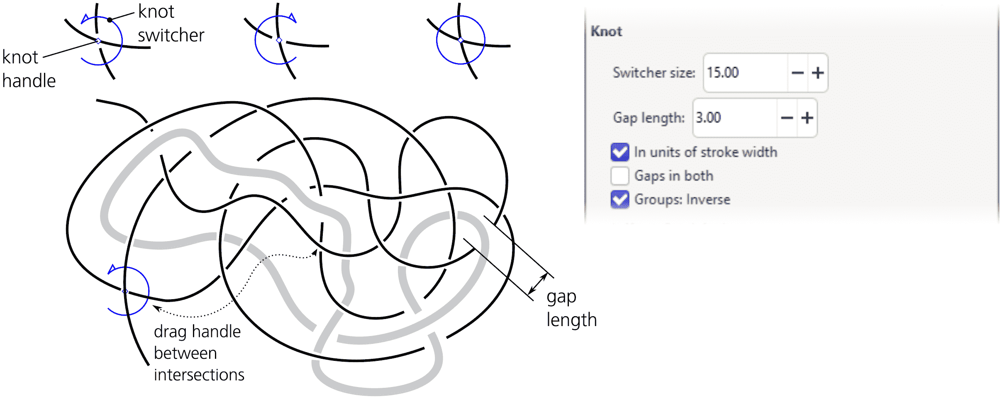

图 13-40：对一组包含自交路径的两条路径应用“节点”效果

它不一定是单一的自交路径。记住，你可以将任何路径效果应用于路径组——在使用“节点”效果时，这将强制所有路径在与组内所有其他路径交点处创建间隙。

该效果的间隙长度数值参数指定每个间隙的宽度，如果勾选框关闭，则以笔画宽度为单位，或以文档单位为单位。如果你将此效果应用于一个包含不同笔画宽度路径的组，"组：反向" 参数确保当路径 A 创建一个跨越路径 B 的间隙时，它会以路径 B（而不是路径 A）的宽度作为计算间隙宽度的基准。

在画布上，你可以单独控制每个交点。在节点工具中，请注意其中一个自交点有一个菱形的把手和一个在一侧打开的蓝色圆形指示器。点击该把手，指示器会翻到另一侧，现在在交点的*另一*条线上创建了间隙。再次点击它，你会关闭交点，去除任何间隙（指示器现在是实心圆形）。继续点击把手，会循环切换该交点的这三种状态。要控制另一个交点，只需拖动把手并将其放置到你需要的交点上。

### 13.3.9 子路径操作

一些效果专注于原始路径的子路径，并对它们做出各种有趣的操作，如连接或插值。

#### 13.3.9.1 缝线子路径

那个出乎意料有用的缝线子路径效果仅适用于具有两个或更多子路径的路径（12.1.1）。它将源路径替换为一个连接子路径上等间距点的路径格网，路径数参数控制这些连接路径的密度。通过这个效果，你可以创建各种各样的头发、毛发、格栅、莫尔条纹或“电力场”，正如图 13-41 所示。

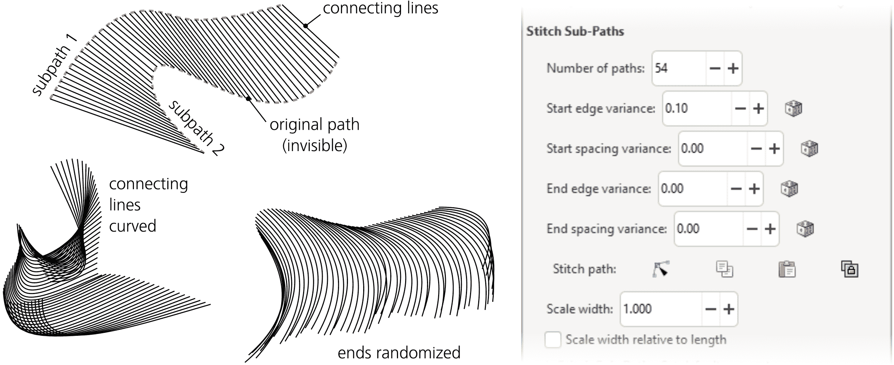

图 13-41：缝合子路径

如果一条路径有三个或更多子路径，每对子路径都会得到自己的连接格网（图 13-42）。这意味着随着你增加原始路径中子路径的数量，连接线的数量会爆炸式增长——因此不要在具有太多子路径的路径上使用此效果，否则 Inkscape 可能会卡住。

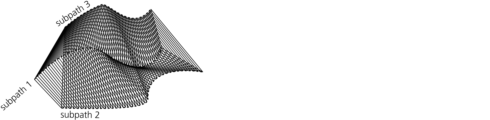

图 13-42：缝合三个或更多子路径

连接线不一定是直线——这只是默认设置。你可以使用缝线路径链接参数将任何现有的开放路径粘贴或链接作为缝线的模板，或者你也可以用节点工具编辑该模板。宽度缩放参数会在垂直于其起止方向的方向上缩放缝线路径（值为 1 时，给出其自然宽度）。相对于长度的宽度缩放参数使每条缝线的宽度取决于该缝线的长度，如图 13-43 所示。

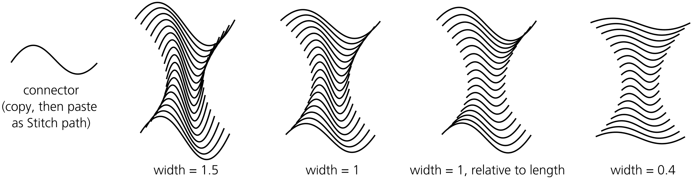

图 13-43：调整弯曲缝线路径的宽度

最后，一组随机化（方差）参数使你能够打乱缝线的附着点，既可以沿路径（间距）打乱，也可以垂直于路径（边缘）打乱，分别应用于每条缝线的起始和结束部分，正如图 13-44 所示。

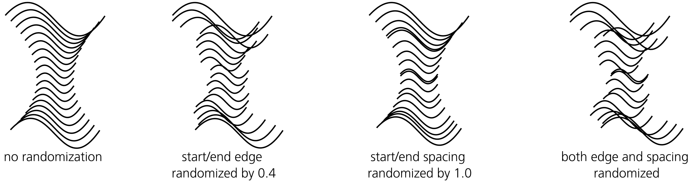

图 13-44：随机化缝线子路径

#### 13.3.9.2 插值子路径

这个效果是“缝合子路径”（Stitch Sub-Paths）的自然补充。它不是直接从一个子路径绘制线条到另一个子路径，而是绘制多个插值子路径，位于原始路径的子路径之间。就像缝合子路径一样，你可以通过节点编辑或链接到一个路径来引导插值步骤的定位，正如在图 13-45 中所示。

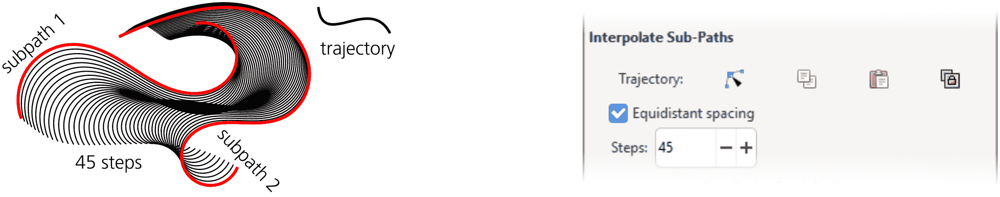

图 13-45：插值子路径效果

为了获得最佳效果，子路径应该足够相似，理想情况下拥有相同数量的节点；否则，插值可能会产生难以理解的丑陋尖点。

### 13.3.10 布尔运算

你已经熟悉了路径上的布尔运算（12.2）。它们是一个重要工具，但也有一个大问题：它们是破坏性的。一旦你将两个路径联合起来，它们就不再是可分离的对象，因此你不能复制或克隆其中一个以供重用，也不能分别对它们进行节点编辑。原始对象的某些部分（在联合的情况下，就是路径重叠的区域）将永远丢失。再次说明，路径效果是一个自然的解决方案。

应用于一个路径的布尔运算路径效果会存储到另一个路径的链接，并使第一个路径看起来像是与链接路径进行布尔运算（联合、切割、除法、交集、差集或对称差集）的结果。第二个（链接的）路径不会被销毁，而是被隐藏（4.1），除非你取消勾选“隐藏链接路径”参数；然而，你可以通过效果参数面板中的“选择原始路径”按钮轻松选择该路径进行编辑。

例如，要制作图 13-46 中显示的“an”字母组合，我将布尔运算效果应用于“n”路径，然后选择“a”路径，复制它，再次选择“n”路径，并将其粘贴到效果的操作数路径参数中。原始的“a”路径仍然存在于文档中，但被隐藏了。

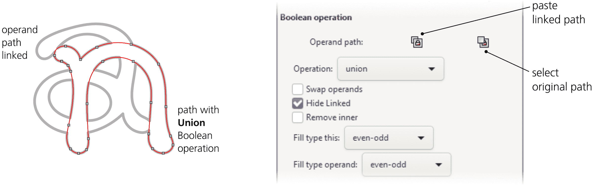

图 13-46：布尔运算效果

当我选择字母组合时，边界框会框住整个联合路径，但节点工具只能编辑“n”路径（如红色轮廓和高亮显示的节点所示）；要编辑“a”路径，我需要点击效果中的“选择原始路径”按钮。请注意，这两个字母都是使用 Spiro 样条曲线（13.3.7.2）制作的，因此布尔运算效果叠加在了 Spiro 效果之上。

### 13.3.11 偏移

你已经看过常规的偏移命令（12.4），它们可以扩展（*outset*）或收缩（*inset*）路径，在每个点上垂直于路径方向。与普通的布尔运算一样，这些命令是破坏性的——一旦你偏移了一个路径，原始路径就会丢失。Inkscape 现在提供了一种非破坏性的方法来实现相同的效果。

偏移路径效果在节点工具中会显示路径上的一个单独的圆形控制点。您可以将该控制点拖动到路径上任何方便的地方；对于偏移而言，重要的是它与原始路径上最近点的距离。您还可以通过“偏移”参数以数值形式指定偏移量。

此外，您可以选择连接方式和斜接限制（请参见 9.2）。外凸路径类似于您通过给原始路径添加描边所得到的效果，因此这些参数使您可以访问这个假想描边的属性。特别地，通过将连接方式设置为斜接，您可以确保原始路径的尖锐角在外凸路径中保持尖锐，如 图 13-47 所示。

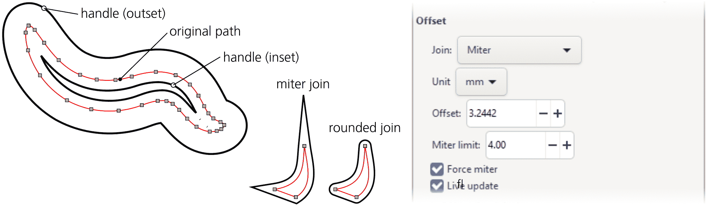

图 13-47：偏移路径效果

出于历史原因，Inkscape 还有几个路径偏移的实现，同样是可交互并可在画布上调整，但不是通过路径效果（它们是在路径效果发明之前添加到程序中的）。这些实现是路径菜单中的动态偏移和链接偏移命令，以及它们的快捷键（分别是 Ctrl-J 和 Ctrl-Alt-J）。动态偏移与偏移路径效果非常相似，而链接偏移可以通过将偏移效果应用于克隆原始效果（13.3.5.1）来模拟。我认为没有理由再使用这些过时的实现，因为现在有一种路径效果可以做同样的事情，且效果更好（特别是，路径效果可以偏移一个未闭合的路径而无需将其闭合）。

### 13.3.12 Power Clip 和 Power Mask

与布尔运算不同，普通的 SVG 剪切和遮罩（18.3）本身就是非破坏性的：您总是可以通过移除剪切或遮罩来恢复原始对象。那么，为什么要将这些功能重新实现为路径效果呢？

事实上，Power clip 和 Power mask 路径效果并没有什么特别的“强大”之处。它们的创建目的只有一个：能够创建一个*反转的*剪切或遮罩，揭示普通剪切或遮罩隐藏的内容，反之亦然。因此，它们甚至不能通过路径效果对话框进行分配；相反，您需要前往菜单，选择 **对象 ▶ 剪切 ▶ 设置反向 (LPE)** 或 **对象 ▶ 遮罩 ▶ 设置反向 (LPE)**。之后，您可以在路径效果对话框中查看该效果的参数，其中包括用于启用或禁用该效果的复选框，以及切换反转的选项。

### 13.3.13 虚线描边

在标准 SVG 的虚线描边（9.4）中，究竟还能改进什么呢？事实证明，很多。

在 SVG 中，虚线模式是以描边宽度为单位指定的，但它与路径本身——其形状或大小——并没有任何协调。当处理一个简单的对称形状（例如矩形）时，如果虚线不能在角落处对称地连接，或者两条对称相等的边的虚线不同步，就会显得很烦人。虚线描边路径效果解决了所有这些问题。

在此效果中，你可以精确地告诉 Inkscape 你希望路径中有多少个破折号，而不是它们的长度。这样，即使你缩放或改变笔画宽度，破折号也始终与形状保持同步。如果启用“使用段”参数，你将在每个段落中获得指定数量的破折号——即在路径的每两个节点之间；如果段落长度不相等，破折号的长度也会不同。启用**均匀破折号**选项以修复此问题：现在，整个路径的破折号将具有与其最短段落相同的长度。

破折号之间的间隙由孔因子参数控制，范围从−1（所有间隙，无破折号）到 1（所有破折号，无间隙）。默认值为零，使间隙与破折号长度相同。

默认启用的半开始/结束参数使每个段落的开始和结束处都有一个半宽度的破折号，这样段落边界的组合破折号与其他地方的长度相同。当此参数关闭时，你将在每个段落的节点之间看到双倍长度的破折号（图 13-48）。

图 13-48：虚线笔画路径效果

此效果的最大缺点是，由于它通过独立的子路径模拟破折号，整个路径不能填充，因为 SVG 无法填充路径的子路径之间的区域。一个解决方案是使用“克隆原始路径”(13.3.5.1)来克隆没有效果的路径，并对该克隆路径应用所需的填充。

### 13.3.14 辅助效果

边界框和显示控制柄效果在你需要为路径创建持久的可视化效果时非常有用——例如，当你为类似本书的插图创建图形时。边界框效果将一个路径（其路径数据将被丢弃）转换为另一个（链接的）路径的动态更新矩形边界框。显示控制柄效果在路径上添加模拟节点和节点控制柄的子路径，就像它们在节点工具中显示的那样。

尺寸标尺效果将任何路径（不一定是直线）转换为带有细刻度和粗刻度的标尺，并可以调整大小和间距。测量效果是一个复杂的引擎，用于在路径的段落上创建测量；这与测量工具的功能部分重叠（6.9.6），但在特定任务上更为强大——提供大量颜色、尺寸、精度和标签格式的选项，如图 13-49 所示。

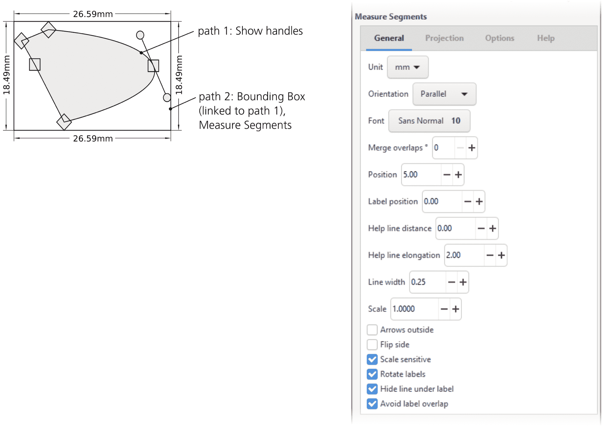

图 13-49：显示控制柄、边界框和测量段效果的示例

### 13.3.15 几何构造

最后一组路径效果将帮助你进行一些简单的交互式几何构造（图 13-50）。在路径效果对话框中，它们当前被标记为“实验性”，并且默认情况下是隐藏的。

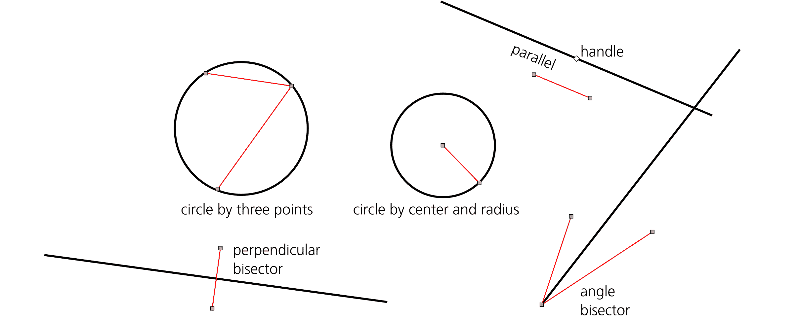

图 13-50：几何构造扩展

通过三个点画圆

使用“钢笔”工具，点击三次创建一个三点路径，赋予此效果后，Inkscape 会创建一个通过这三点的圆。圆形永远不会被裁剪——即使当三条线在同一条直线上时它可能是无限的（在实际操作中，将点放置在同一条线上会导致效果不正常）。此路径效果没有参数。

通过中心和半径的圆形

路径的第一个节点给定了圆心，最后一个节点设置了半径。此路径效果没有参数。

平行

此效果创建一条通过*锚点*的线，这条线与连接路径起始节点和结束节点的线平行。您可以通过节点工具中的菱形句柄或通过平行路径效果的偏移参数移动锚点。要改变平行线相对于锚点的左右距离，请使用**左长度**和**右长度**参数。

当您创建平行线时，原始路径——该路径与新线平行——会变得不可见：平行线现在成为该对象的可见路径，原始节点只能在节点工具中进行编辑。如果您需要始终自动平行的两条可见直线，请创建*两条*线，并将第二条线设置为第一条线的**克隆原始**（13.3.5.1），但选择**不带 LPE**选项。然后，选择第一条线，使用此工具将其转变为自己的平行线。

垂直平分线

这个效果类似于平行效果，不过它不是创建一条平行线，而是创建一条与给定段垂直并通过其中心的线。如果您需要两条线自动互相垂直，请在其中一条线上的路径效果中创建**垂直平分线**，然后打开**路径效果**对话框，添加**克隆原始**效果，并将其移动到**垂直平分线**效果之前。最后，选择第二条线对象，复制它，并粘贴到**克隆原始**的**链接**参数中。

角平分线

这个效果类似于“垂直平分线”，但它平分的是由三节点路径创建的角度。只需将此路径效果赋给一个包含三节点的路径。

镜像对称

请参见 13.3.5.3 了解镜像对称效果的描述。

从点创建椭圆

此效果会根据原始路径中的点数进行调整。对于两个或三个点，它会创建一个圆形；对于五个点，它会创建一个恰好通过这五个点的椭圆。对于其他任意数量的点，效果无法完全精确，但它会尽力而为，创建一个*近似*的椭圆，尽量减少与所有点的偏差（图 13-51）。

可选地，您可以为椭圆添加框架或坐标轴。如果将“方法”参数设置为“强制圆形”，该效果将始终创建一个圆，无论是精确的还是近似的。

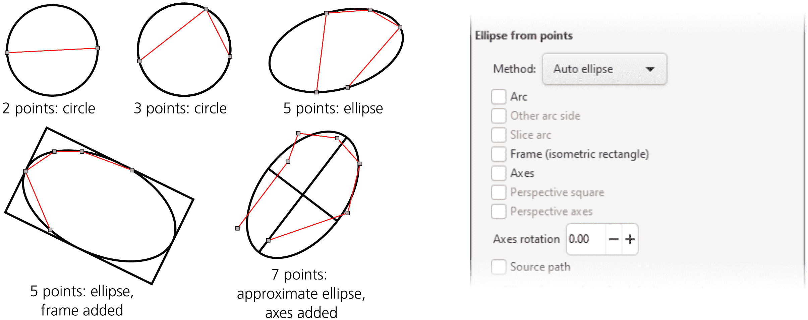

图 13-51：从点创建椭圆效果

## 13.4 路径扩展

在扩展 ▶ 从路径生成、扩展 ▶ 修改路径和扩展 ▶ 可视化路径子菜单中，Inkscape 提供了许多与路径相关的扩展（第十九章）。多年来，许多扩展已经重新实现为路径效果——具有画布上可编辑性、更好的与其他程序的集成，并且通常具有更丰富的选项。然而，Inkscape 仍然包含大部分已废弃的扩展。

其中一个原因是，作为一次性操作，扩展不会向文档引入任何非 SVG 属性，因此不像路径效果可能面临的兼容性问题那样容易出现问题（13.1）。扩展对于好奇的 Inkscape 用户来说，也更容易学习、实验并朝着新的方向发展。最后，这些扩展中有一些仍然具有路径效果中没有的独特功能或选项。

### 13.4.1 从路径生成子菜单

#### 13.4.1.1 内凹/外凸光晕

该扩展向选定路径添加了指定数量的内凹或外凸路径（步骤），它们之间有一个宽度，每个进一步偏移的路径具有较低的透明度（图 13-52）。

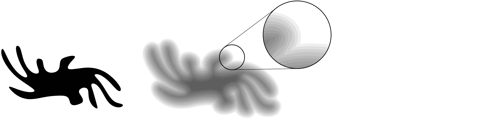

图 13-52：光晕扩展可以被认为是“穷人的高斯模糊”。

#### 13.4.1.2 拉伸，运动

这些扩展通过以给定角度和给定距离拉伸选定路径来创建一个原始的 3D 效果。结果是两个对象的组合，一个是原始路径，另一个是其拉伸裙带，您可以对其进行不同的样式处理。一个类似的拉伸路径效果目前标记为实验性（图 13-53）。

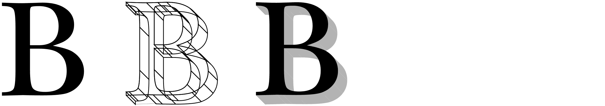

图 13-53：拉伸扩展

#### 13.4.1.3 插值

该扩展创建两个路径之间的插值或*混合*——当您将一个路径转换为另一个路径时，形成一组平滑的过渡步骤。您可以指定插值步骤的数量和指数，如果与默认的 0 不同，指数会将混合向一个端点偏移，如图 13-54 所示。

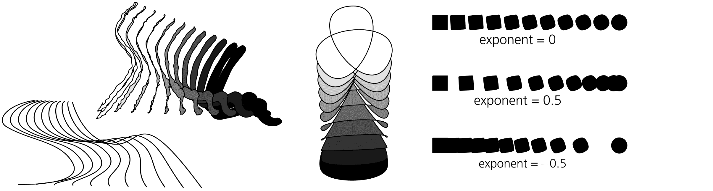

图 13-54：插值扩展

这与插值子路径效果（13.3.9）类似。然而，与路径效果不同的是，此扩展具有插值样式选项，可用中间颜色绘制中间步骤。

该扩展通过生成中间步骤作为一组路径；“复制端路径”选项还会将原始路径的副本添加到该组中。由于插值始终连接两个路径的起点和终点，您可能需要反转其中一个路径（路径 ▶ 反转），以便获得所需的结果。

#### 13.4.1.4 沿路径图案

这与同名的路径效果（13.3.2）类似，实际上，这是在路径效果被发明之前创建的该功能的第一个版本。与路径效果相比，扩展有一个优势：它可以使用一组对象（每个对象都有自己的样式）作为模式；而路径效果中，你只能使用单一模式的路径。要使用该扩展，选择模式路径或组和骨架路径（模式必须位于骨架之上，遵循 z 顺序），然后应用命令；其选项与相应路径效果的选项类似。

#### 13.4.1.5 Voronoi 图和 Voronoi 图案

Voronoi 图（像素追踪器也使用它，18.5.2.6）是一种将平面镶嵌成多边形的方式，使得每个多边形上的每个点离其自身多边形的中心比离其他多边形的中心更近（如图 13-55 所示）。

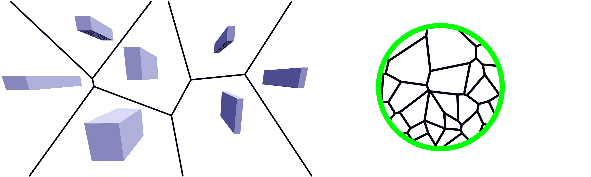

图 13-55：来自选定 3D 盒子的 Voronoi 图（左）和作为圆形图案的 Voronoi 图（右）

这些扩展中的第一个通过从所有选定对象的中心生成镶嵌图案；第二个则创建一个随机的 Voronoi 图案，并将其作为填充分配给选定的对象（你随后也可以将其用于其他对象，详细信息请参见 10.8）。

### 13.4.2 修改路径子菜单

#### 13.4.2.1 添加节点

这个有用的扩展可以在不改变路径形状的情况下创建额外的节点。你可以指定相邻节点之间的最大允许距离，或者指定每个线段将被分割成的段数。图 9-11 展示了此扩展的应用。

#### 13.4.2.2 扁平化贝塞尔曲线和拉直线段

扁平化贝塞尔曲线扩展通过一系列直线段近似选定路径中的每条贝塞尔曲线；较高的平滑度值会导致更粗略的近似，使用更少的线段。拉直线段仅通过给定百分比缩短所有贝塞尔控制柄，因此将该值设置为 100%会将每条贝塞尔曲线转化为一条直线段，如图 13-56 所示。

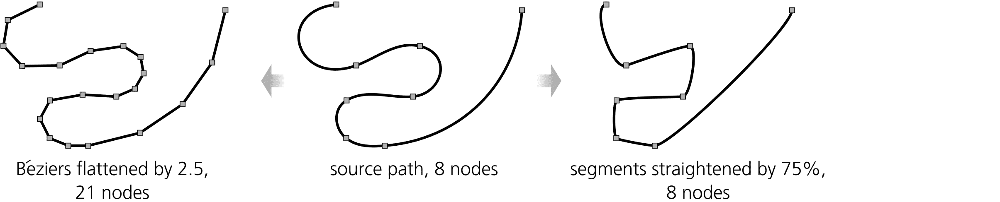

图 13-56：扁平化贝塞尔曲线和拉直线段扩展

#### 13.4.2.3 抖动节点

此扩展通过随机方向和随机距离位移所有节点来随机化选定的路径，位移的距离受限于可分别为 X 和 Y 设置的最大位移参数（例如，将 X 轴的最大位移设置为 0 将仅在垂直方向上抖动节点）。此外，你可以单独为节点本身和它们的贝塞尔控制柄启用抖动，就像图 13-57 所示。

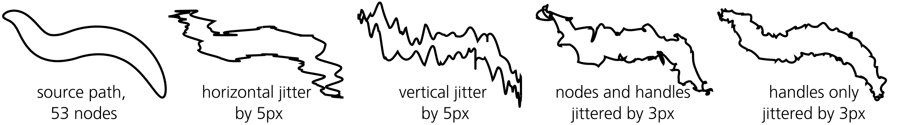

图 13-57：抖动节点扩展

位移参数的分布决定了不同位移值的概率，如图 13-58 所示。通过将默认的均匀分布切换为帕累托分布，可以使较小的位移比较大的位移更可能发生（就像生活中一样，一个城市人口非常庞大的概率是非常小的）。高斯分布的峰值较为平缓，概率在峰值周围缓慢下降，但远离峰值时下降较快。对数正态分布看起来像帕累托分布，但其极端值更为极端，可能会远远超出最大位移范围。

图 13-58：Jitter 节点中的概率分布：仅水平位移，范围相同。

#### 13.4.2.4 Fractalize

这也是一种随机化路径的方法。它会将原始路径中的所有贝塞尔曲线展平，然后在现有节点之间创建新的节点，并使这些新节点移动，同时保持原始节点不变。`Subdivisions` 参数决定每个段落被细分的次数（例如，10 次细分将一个两节点路径转变为一个拥有 1,025 个节点的路径，因为 2¹⁰ + 1 = 1025）。`Smoothness` 决定新节点的移动范围；较低的平滑度会产生较粗糙的路径。这种效果非常适合用于创建幻想地图中的海岸线（图 13-59）。

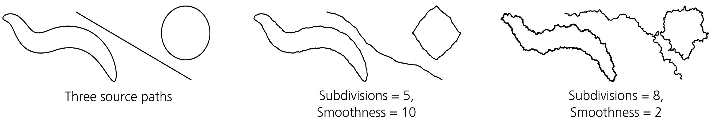

图 13-59：Fractalize 扩展

#### 13.4.2.5 网格

该子菜单中的两个扩展将网格渐变（10.7）转换为路径并进行反向操作，考虑到 Inkscape 当前编辑网格节点的工具相对较差，这可能是一个救命稻草（10.7.3）。

#### 13.4.2.6 像素捕捉

使用此扩展将所有选定路径中的所有节点对齐到像素网格边界，从而在以 96 dpi 导出作品时最大程度减少抗锯齿效果 (18.6.1.2)。

#### 13.4.2.7 橡胶拉伸和旋涡

这些扩展会扭曲选定的路径，如图 13-60 所示。它们最适用于包含多个节点的路径，因为它们仅移动现有节点，而不创建新节点。旋涡扩展在启动时会围绕 Inkscape 中视图的中心进行操作；要将视图中心放置在选择的几何中心位置，请按 3 或选择 **视图 ▶ 放大 ▶ 选择区域** (3.11)。

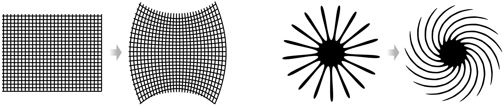

图 13-60：橡胶拉伸（左）和旋涡（右）扩展

### 13.4.3 可视化路径子菜单

#### 13.4.3.1 数字节点

该功能将路径替换为一组点，每个点标记原始路径的一个节点，并用一个顺序号（文本对象）表示。你可以调整这些点的大小和数字的字体大小。

#### 13.4.3.2 绘制控制柄

该扩展可视化所选路径的贝塞尔控制柄，类似于显示控制柄路径效果（13.3.14）。对于每个选定的路径，它会创建一个新路径，其中每个控制柄都是一个子路径。

#### 13.4.3.3 尺寸与测量路径

尺寸扩展在选定对象（不一定是路径）周围创建一个框架和尺寸线；使用**测量路径**扩展可以向其添加实际的长度测量值。这与测量效果所做的类似（13.3.14）。
