# 第十四章：绘图

从历史上看，矢量编辑器曾被称为*矢量绘图*—或者简而言之就是*绘图*—应用程序。而位图编辑器则有时被称为*绘画程序*。绘图和绘画之间的对比，源自传统媒介（纸张与画布），这一对比延续到了数字领域。尽管现在矢量程序已经用于更高层次的任务，例如排版和布局，甚至可能更为常用，但*绘图*仍然是这种工具最基本的使用场景。

的确，矢量绘图永远无法像位图那样具备自然主义和“绘画感”；即使是最好的矢量艺术，也会有那种可辨认的平滑、计算机生成的外观。然而，通常这并不是问题—它甚至可能是一个优势。此外，矢量编辑器拥有位图编辑器无法比拟的优点：它能够将每一笔作为一个独立的对象处理，这些对象永远不会合并或“平坦化”成其他对象（除非你告诉它这样做）。事实证明，这种无限的可调整性在制作好的手绘作品时，有时比模仿粉彩笔触或湿画水彩的能力更为重要。

Inkscape 提供了多个绘图工具供你选择，具体取决于你希望创作的艺术类型（图 14-1）。如果你需要直线几何或具有精确节点位置的样条路径，可以使用钢笔工具（14.1.1）。对于更为自由手绘的路径，可以使用铅笔工具（14.1.2），它会进行适当的平滑处理。对于复杂、自然主义的压力敏感填充笔触，模仿各种物理效果，如颤动或惯性，可以使用书法笔（14.2）。如果你需要在多个复杂笔触之间进行类似卡通的填充，Inkscape 提供了油漆桶工具（14.3）。

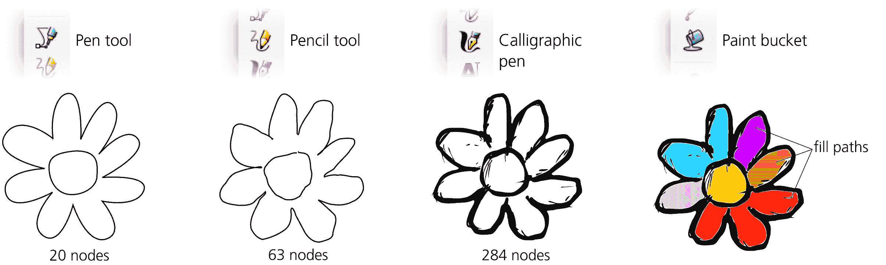

图 14-1：Inkscape 绘图工具一览

还有许多其他工具值得在本章中提到。你可以使用喷雾工具（4.7）来字面上用对象的副本或克隆绘制图形。调整工具对于艺术创作至关重要，无论你是用它来调整你的笔触（6.10），应用颜色（8.9），还是进行自由手绘路径的推移（12.6）。你可以使用橡皮擦工具（14.4）擦除绘图的部分内容。最后，Inkscape 还拥有一个专门的连接器工具用于绘制图表（14.5）。

本章如果不提到你可以轻松地旋转 Inkscape 的画布及其所有内容，使用 Ctrl-Shift-滚轮（3.13），就显得不完整了。你还可以通过视图 ▶ 画布方向子菜单中的命令进行翻转（镜像）画布。对于艺术家来说，能够将绘图调整到最方便的角度进行描绘，确实是一个很大的帮助。

## 14.1 钢笔和铅笔工具

传统上，钢笔与写字和草图绘制相关，铅笔则与艺术素描和绘画相关。在 Inkscape 中，铅笔和钢笔工具都是用来创建路径的。不同之处在于，当你希望精确控制单个节点的位置时使用钢笔工具，而铅笔工具则用于自由手绘，Inkscape 会自动处理节点和其他细节。像所有比喻一样，这个比喻是有些随意的，但它已经深入人心。

在本节中，我首先介绍钢笔和铅笔的基本操作，然后探讨这些工具共有的高级功能——绘图模式和笔画形状，它们共同使用路径效果（第十三章）。

### 14.1.1 钢笔工具

使用钢笔工具，通过点击画布来创建单独的节点，这与节点工具（12.5）相似，只不过它是针对创建新节点进行优化，而不是编辑现有节点。

切换到铅笔工具（Shift-F6 或 B），确保它处于默认的贝塞尔模式（控制栏上最左边的按钮），然后点击画布。你已经创建了新路径的第一个节点。只需移动鼠标（不点击）即可移动一个红色线段，显示如果你在当前位置创建下一个节点，路径将如何延展。

持续点击以添加更多节点。要完成路径，可以双击（这会添加一个节点并完成路径），或者右键点击，或按下 Enter 键（这两种方法都会完成路径，并取消红色线段，而不再添加任何节点）。直到此时，整个路径才会作为对象真正创建；你之前看到的只是一个虚拟的框架。完成路径的另一种方式是*闭合*它；如果你在路径的第一个节点上精确创建下一个节点（该节点会被一个方形锚点标记），路径就会闭合并完成。

如果你点击并拖动，而不是仅仅点击，你就创建了一个平滑的贝塞尔节点（图 14-2）；当你拖动时，末端带有圆形控制柄的蓝色直线就是单个控制柄（用于起始节点）或两个对称控制柄（用于中间节点，12.1.4）。一旦你松开鼠标按钮，节点的控制柄就会固定（但路径仍在创建中）。

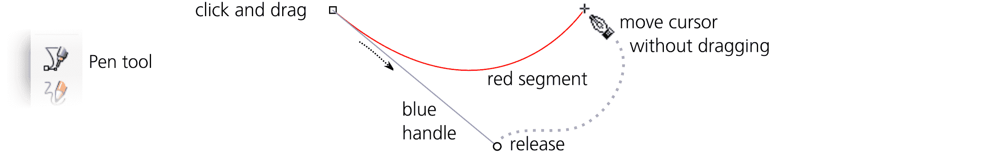

图 14-2：钢笔：已设置第一个节点，准备设置第二个节点

在你创建第二个节点之后，到目前为止定义的两个节点之间的路径部分变为绿色，最后创建的节点到下一个节点之间又会出现一个红色线段（图 14-3）。你可以无限制地重复这一操作——继续点击并拖动（以创建平滑的对称节点），或者仅点击（以创建尖角节点）；在每一步中，你已布置的路径会变为绿色，而你即将创建的最后一段路径是红色的。

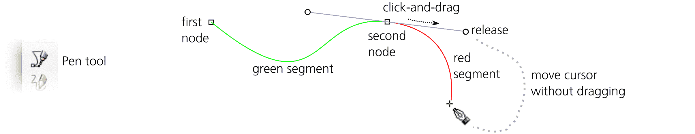

图 14-3：钢笔：已设置两个节点，准备设置第三个节点

要随时取消创建路径，请按下 Escape 键或直接切换到另一个工具。

#### 14.1.1.1 节点类型

如你所见，点击并拖动会创建一个平滑的节点，并带有两个对称的控制手柄（除非这是路径的第一个节点，且只有一个控制手柄）。简单的点击会创建一个没有控制手柄的尖角节点。你还可以通过不共线的控制手柄来创建尖角节点；为此，点击并拖动，但当相对的控制手柄到达你想要的位置时，按住 Shift 键继续拖动。这会固定远端控制手柄，并允许你独立移动近端控制手柄，正如 图 14-4 所示。

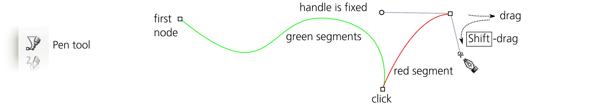

图 14-4：使用钢笔创建尖角节点

你还可以在拖动控制手柄时按住 Ctrl 键，将其对齐到 15 度的增量（参见 6.3；你可以在首选项 ▶ 行为 ▶ 步骤中选择其他对齐值）。在创建节点之间移动鼠标时按住 Ctrl 键也会使最后创建的节点和鼠标点之间的方向对齐；这是一种轻松创建严格水平或垂直线条的方法，如 图 14-5 所示。

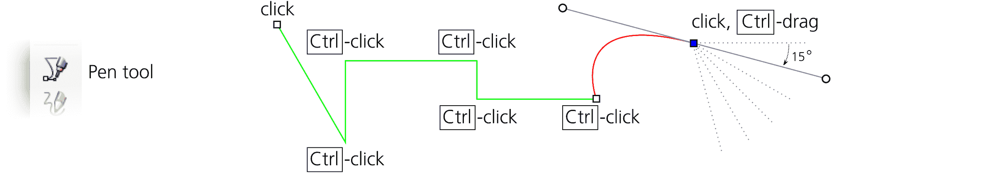

图 14-5：钢笔：使用 Ctrl 键对齐

#### 14.1.1.2 返回

你可以随时在路径创建过程中后退。要取消最后添加的绿色线段，按一次 Backspace 或 Delete，或者多次按它来移除多个线段。移除最后剩余的节点将取消整个路径。

在第一次尝试时，通常不容易精确点击到你想要节点出现的位置。Inkscape 允许你在不最终确定路径的情况下，使用箭头键移动最后创建的节点（即绿色线段的末端），并且可以使用与其他工具相同的方便修饰符：按住 Alt 键移动 1 个屏幕像素，按住 Shift 键移动 10 倍距离（6.5.1）。

#### 14.1.1.3 继续路径

当你使用钢笔工具时，任何单一选中的路径都会显示它的端节点（如果有的话，即如果它是开放的），这些端节点是小方形的*锚点*。（这对于你刚刚用该工具创建的任何路径都是如此——在最终确定后，它仍然是选中的。）这些锚点允许你继续添加到选中的路径（通过在锚点处放置第一个节点），或者关闭路径（通过从一个锚点画到另一个锚点）。

你也可以向选中的路径添加一个新的子路径（12.1.1）。为此，只需按住 Shift *同时* 点击以创建第一个节点。之后，像平常一样创建并最终确定路径；你的路径将作为子路径添加到选中的路径中。选中路径的所有开放子路径会显示锚点，这意味着你可以关闭它们或将它们连接起来（图 14-6）。

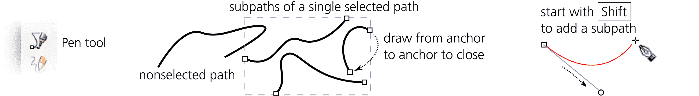

图 14-6：钢笔：添加或关闭子路径

### 14.1.2 铅笔工具

铅笔工具（F6 或 P）类似于钢笔工具。主要区别在于，使用铅笔工具时，你不需要担心单独的节点或控制手柄；你只需手绘一条线，Inkscape 会用路径来逼近它。

#### 14.1.2.1 平滑

当你使用铅笔工具绘制时，生成的路径总是比你鼠标拖动的实际轨迹更平滑。要更改应用的平滑程度，请使用工具控制条中的平滑部分。较小的平滑值会生成更精确、节点丰富的近似路径；相反，较大的值会创建更简化、节点较少的通用路径（图 14-7）。在平滑值最大为 100 时，大多数鼠标拖动将只在两个节点之间创建一个贝塞尔曲线段。

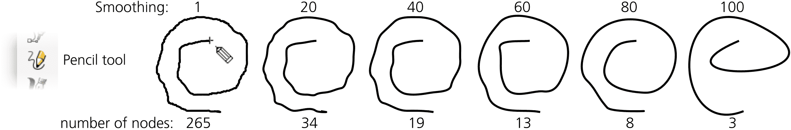

图 14-7：在不同平滑级别下的铅笔笔画

在数字平滑值旁边，有一个名为 LPE 基于交互式平滑的切换按钮，用于控制平滑功能的工作方式。当此按钮未按下时，启用旧方法，其中平滑操作在路径完成时以指定级别一次性应用，未平滑的原始路径会被丢弃。这样，平滑仅应用于铅笔工具中新创建的路径，并且之后无法更改。

当此按钮按下（现在是默认设置）时，源路径首先以最低平滑级别存储，然后应用简化路径效果（13.3.4.4）。这种平滑方法是完全可逆的（你可以通过移除路径效果来恢复原状）并且是可调的（你可以通过路径效果对话框中的效果参数或简单地在铅笔工具控制条中调整平滑值来改变平滑量，当选择了带有简化效果的路径时）。如果你喜欢新方法的交互性，但不希望文档中有路径效果，可以使用压平按钮去除效果并以当前平滑级别生成纯路径。

这种方法理论上很棒，但其实现存在一些问题。我发现，如果你想要最小的平滑效果，应该将值设置为 1（最大值为 100），而不是零。此外，在较低的平滑值下，简化路径效果有时会产生比原始路径更多的节点，而不是更少。

#### 14.1.2.2 压力敏感度

曾经，在 Inkscape 中唯一使用平板笔压力信号的工具是书法笔（14.2）。随着时间的推移，Tweak（6.10，8.9，12.6）、橡皮擦（14.4）、喷雾（4.7）工具相继加入。现在，铅笔工具也可以使用压力敏感输入设备创建具有可变笔画宽度的路径。它通过 Power stroke 路径效果（13.3.1.1）实现这一点。

通过点击控制栏上的切换按钮启用压力感应绘图。此时，形状控制（14.1.5）消失了（因为压力控制的笔画不能有预定义的形状），而绘图模式按钮（14.1.4）被禁用。取而代之的是你会看到最小和最大宽度的数值控制（它们对应于笔的最小和最大压力），以及一个用于选择笔画端点类型的下拉框。这些控制仅适用于新创建的笔画；如果你想更改现有笔画的宽度或端点，可以通过其 Power stroke 路径效果进行更改（13.3.1.1）。

启用压力感应绘图会留下红色圆圈的轨迹；它们的大小表示每个点的压力，间距由笔的移动速度决定。一旦抬起笔，会创建一条带有 Power stroke 的路径，该路径近似（并进行了一些平滑处理）在绘制过程中记录的压力数据，如图 14-8 所示。

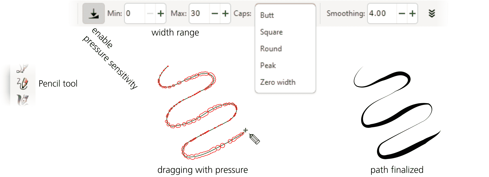

图 14-8：使用压力敏感平板笔绘制铅笔图

#### 14.1.2.3 继续路径

与钢笔工具类似，在铅笔工具中，任何选择的路径都会在所有子路径的开头节点显示锚点。你可以通过从一个锚点画到另一个锚点来继续、关闭和连接子路径，也可以通过按住 Shift 键开始绘制来将新的子路径添加到选定的形状中。

#### 14.1.2.4 使用 Alt 进行草图绘制

在铅笔工具中使用 Alt 绘制可以启用*草图*。在释放 Alt 之前进行的任何拖动都会被*平均*，而那个单一的平均路径只有在你释放 Alt 后才会被创建。你可以将其视为对草图路径效果的反向操作（13.3.4.1）。草图功能使你在绘图时能够“摸索前进”——寻找最佳线条，而不会创建一堆不确定的、需要丢弃的线条。

在铅笔工具的首选项页面上，默认启用的“平均所有草图”设置会对你按住 Alt 键时所做的*所有*草图描绘进行加权平均。如果你关闭它，工具将会在最新的笔画和之前的平均值之间进行平均，从而使你的最新笔画权重更大。

### 14.1.3 样式

像所有物体创建工具一样，钢笔和铅笔工具可以使用最后设置的样式或它们自己的工具样式（11.1.2）。默认情况下，它们使用自己的样式，初始设置为无填充，1 像素黑色描边。这是因为通常情况下，最后设置的样式是填充且没有描边，而在使用这些工具绘制时，你可能希望结果有描边，但不一定需要填充。请参考图 11-2 查看如何更改工具样式。像往常一样，下一次你创建路径时将使用的样式会显示在控制栏的右端（如图 11-1 所示）。

### 14.1.4 绘图模式

钢笔工具和铅笔工具都有许多模式，除了默认的*贝塞尔模式*，这些模式允许你使用其他类型的样条线或段落来创建路径。这些模式对应于这些工具控制栏上的“模式”按钮（图 14-9）。第一个按钮是默认模式，用于创建由直线和贝塞尔曲线组成的常规 SVG 路径。

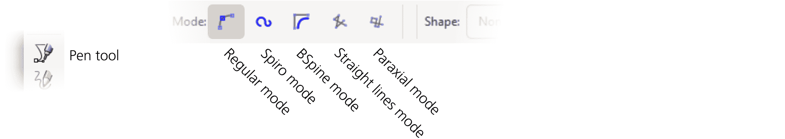

图 14-9：钢笔工具的模式（铅笔工具没有最后两个模式）

第二种模式创建*Spiro 路径*——即应用了 Spiro 曲线路径效果的路径（13.3.7.2）。在此模式下，钢笔工具的简单点击会创建一个平滑节点，而 Shift+点击则会创建一个尖点节点；无法创建半平滑节点（12.5.5）。

如你所见，铅笔工具（14.1.2.1）首先对你手绘的笔划进行一些平滑处理，默认情况下使用简化路径效果。然后，它会在简化的基础上应用 Spiro 曲线效果。由于在（默认）低值的平滑设置下，简化路径通常会产生比原路径更多的节点，结果可能看起来与 Spiro 曲线差别不大——因为简化产生的额外节点使得 Spiro 曲线跟踪路径时异常紧密。如果你对此感到困惑，可以从路径的效果堆栈中移除简化效果。

第三个按钮创建*BSpline 路径*——即应用了 BSpline 路径效果的路径（13.3.7.1）。在此模式下，钢笔工具的简单点击会创建一个平滑的曲线节点，而 Shift+点击则会创建一个尖点节点。

另外两种模式（仅限钢笔工具）是常规模式的限制。*直线*模式禁用了平滑节点的创建：即使你拖动，最终也会得到一个没有控制柄的尖点节点。*平行轴*模式额外限制了路径中每个段落必须与第一段所创建的段落平行或垂直；此外，每个段落还必须与前一个段落垂直。例如，如果你通过按 Ctrl 键将第一段限制为垂直，那么接下来的段落将是水平的，再然后是垂直的，再接着是水平的，依此类推。这个技巧或许看起来不算什么，但这种绘图模式的真正实用性在于它可以在倾斜的坐标系中绘制：只需在正确的角度绘制第一段，然后继续在这个旋转后的世界中绘制。

在直线和平行轴模式下，如果你在没有创建路径的情况下按 Ctrl+点击，你会创建一个单一的*点*——一个小圆形（11.4）。这在几何和技术绘图中非常方便。你可以在钢笔工具的首选项中设置 Ctrl+点击点的大小，单位为笔划宽度（双击工具箱中的工具图标以访问其首选项对话框）；默认值为三个笔划宽度。如果使用 Shift+Ctrl，点的大小将是默认大小的两倍（图 14-10）。

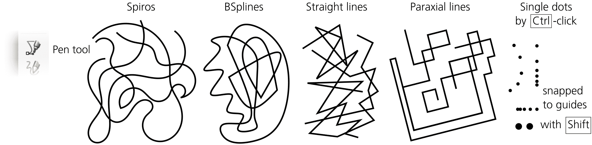

图 14-10：钢笔：螺旋线、B 样条、直线、平行线和单个点

### 14.1.5 笔画形状

钢笔和铅笔工具的形状下拉菜单让你可以选择你所创建路径的笔画形状。旁边的比例值可以调整形状笔画的宽度（以相对单位表示）。在铅笔工具中，只有在你没有启用压力敏感度时（14.1.2.2），这些控制项才会显示出来。

单独来看，SVG 不支持有形状的笔画；在 SVG 中，笔画始终是恒定宽度的条带（第九章）。所有其他的笔画形状都通过 Inkscape 的路径效果来模拟（第十三章）。这就是为什么在此列表中，默认的“无”和其他笔画形状之间存在行为差异的原因（图 14-11）。

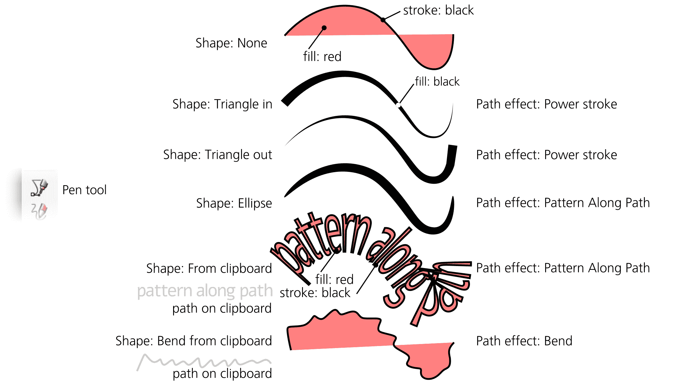

图 14-11：使用钢笔工具的有形状笔画

选择“无”时，你将得到一个基础的 SVG 路径，带有一个普通的、恒定宽度的笔画。以下是该工具在其他形状选项中的作用：

+   两个三角形：Triangle in *减小*路径末端的宽度至零，而 Triangle out *增加*路径末端的宽度。这些是使用“强力笔画”路径效果创建的（13.3.1.1）。要调整宽度，请使用钢笔或铅笔的**比例**控制或在节点工具中拖动屏幕上的紫色把手。

+   椭圆：使用“路径上的图案”效果，将一个直径为 10 像素的圆应用到你的路径上（13.3.2）。要调整宽度，请使用钢笔或铅笔的**比例**控制或在节点工具中使用屏幕上的把手（在末端节点处垂直）。

+   从剪贴板：任何你复制到剪贴板的路径都会作为图案应用到你绘制的路径上，使用“路径上的图案”路径效果（13.3.2）。要调整宽度，请使用钢笔或铅笔的**比例**控制或在节点工具中使用屏幕上的把手（在末端节点处垂直）。要编辑笔画形状，请使用节点工具中的**显示下一个可编辑路径效果参数**按钮（12.5.1）。

    例如，如果你创建一行文本并将其转换为单个路径，复制它，然后在铅笔工具中选择此选项，每条笔画将由这行文本绘制（适当弯曲和拉伸）。

+   从剪贴板弯曲：任何你复制到剪贴板的路径都会作为骨架应用到你绘制的路径上，使用弯曲路径效果（13.3.2.2）。例如，如果你创建一个弧线并复制它，在铅笔工具中选择此选项后，每个你创建的自由手绘将*被弯曲*，以适应这个弧线，覆盖其自身的形状。

+   最后应用：你上次使用该工具时的形状会再次被使用。为什么这很有用？你可以创建一个画笔形状，将其复制，使用“从剪贴板”将其应用到钢笔或铅笔的笔画上，然后切换到“最后应用”并继续使用此画笔，这样剪贴板就可以用于其他内容了。

你创建的路径可能会有填充，可能没有填充，这取决于工具使用的样式（14.1.3）。使用 Power stroke 时，路径内部不能有填充，因为该工具会自动将笔画样式应用于填充，并丢弃原始的笔画样式。然而，使用沿路径图案时，你可以在沿路径拉伸的图案内有填充。使用 Bend 时，你可以同时拥有填充和笔画，像默认的 None 样式一样。

创建笔画形状的路径效果会叠加在笔或铅笔工具添加的其他效果之上，包括 Spiro 样条曲线或 BSpline（适用于笔和铅笔）以及简化（仅限铅笔）。例如，如果你用椭圆形绘制 Spiro 路径，然后切换到节点工具并调整 Spiro 节点，整个椭圆形状会沿着 Spiro 样条曲线弯曲和卷曲。在该路径的路径效果编辑器对话框中，你会发现 Spiro 样条曲线和沿路径图案效果叠加在一起。要将带有任何路径效果的路径转换为常规路径，请使用**对象转路径**命令（Shift-Ctrl-C）。

图 14-12 展示了用样条曲线和/或笔画形状创建的铅笔路径示例。

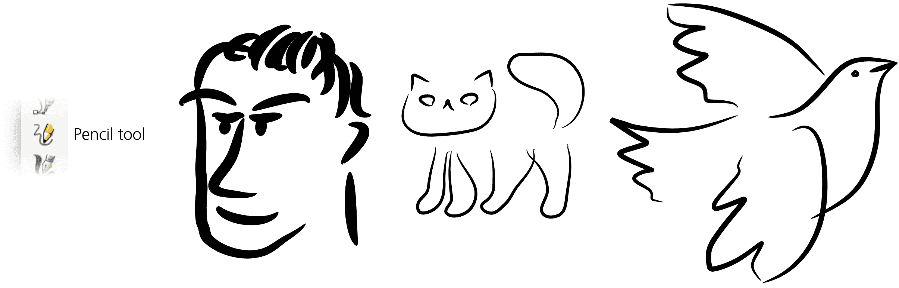

图 14-12：铅笔工具的形状笔画

## 14.2 书法笔工具

*Inkscape*这个名字非常贴切：程序中最复杂的绘图工具——书法笔，确实感觉*像墨水*。正如其名所示，这个工具最初是为书法设计的——也就是漂亮的手工字母。然而，随着时间的推移，它变得更加多功能，现在广泛用于一般艺术素描、绘画和勾线。

切换到书法笔（Ctrl-F6 或 C），然后在画布上拖动。Inkscape 将创建一个填充路径，其宽度和形状取决于笔画的角度、拖动的速度以及笔的压力（如果你使用的是压力感应平板）。结果可能类似于压力感应模式下的铅笔工具（14.1.2.2），但书法笔提供了更多选项和行为细节。该工具的结果始终是一个普通的填充路径，没有任何路径效果。

### 14.2.1 宽度

工具控制栏上最重要的设置是宽度，指定笔画的宽度（更准确地说，是其*最大*宽度；其他因素也可能影响宽度，但它永远不会超过你在这里设置的值），如图 14-13 所示。你可以在使用书法笔工具时，随时通过←和→键调整宽度值。

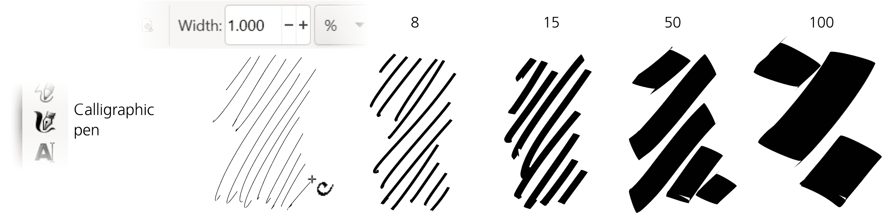

图 14-13：书法笔：变化的宽度（压力灵敏度关闭）

除了绝对单位（像素、毫米等），你还可以用相对单位（%）设置工具的宽度，这样宽度就相对于文档窗口的大小，而不是相对于文档中的任何对象或测量值。换句话说，如果你缩小视图，笔划的绝对宽度会变大，但对你来说，*看起来*宽度保持不变。值为 1 时始终是细线，值为 100 时始终是约 2 厘米宽的笔划（以屏幕测量为准）。

这种方法刚开始可能会显得有些奇怪，但它的优点是你始终可以保持工具的相同*手感*，无论你的缩放级别如何，从而实现直观的工作流程。首先，缩小视图并铺设绘图的主要粗笔触；然后，放大以添加越来越细的细节——这一切都不需要来回调整宽度。

#### 14.2.1.1 压力敏感性

如果你的输入设备是压力敏感的平板，Inkscape 可以利用压力信息来改变笔划的宽度：轻轻按压时画出细线，用力按压时画出较宽的笔触（见图 14-14）。

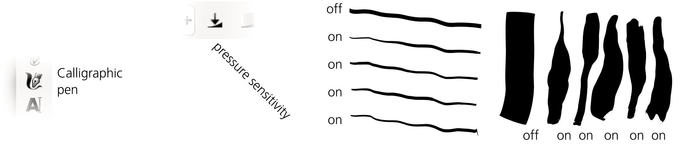

图 14-14：书法笔：带或不带压力敏感性的绘制（宽度相同）

要启用压力敏感性，点击**宽度**控制旁边的切换按钮。没有压力敏感性时，工具会假定始终施加最大压力进行绘制。

#### 14.2.1.2 背景跟踪

另一种可能影响书法笔宽度的因素——如果你启用了该功能——是背景颜色的深浅：在白色背景上绘制时，笔刷最细；在黑色背景上绘制时，笔刷最粗。当你使用*引导跟踪*（见 14.2.7）在现有绘图或位图上进行描绘，并希望通过笔划宽度平滑变化来实现阴影效果时，这一点尤其有用，如图 14-15 所示。

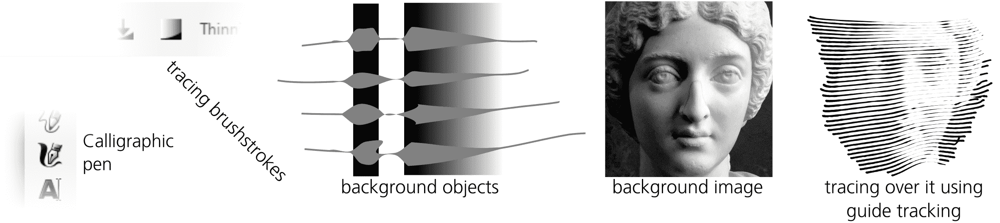

图 14-15：书法笔：按宽度跟踪背景

要启用背景跟踪，点击**压力敏感性**切换按钮后的下一个切换按钮。你可以将此设置与压力敏感性结合使用，尽管通常在进行背景跟踪时关闭压力敏感性更为合理。

#### 14.2.1.3 按速度细化

最后，绘图的速度——你拖动鼠标或笔的速度——也可能影响笔划的宽度。这由“细化”值控制，取值范围从 -100 到 100（见图 14-16）。正值使笔划在速度加快时变细；负值则使笔划变粗。如果将此参数设置为 0，则禁用速度细化功能。

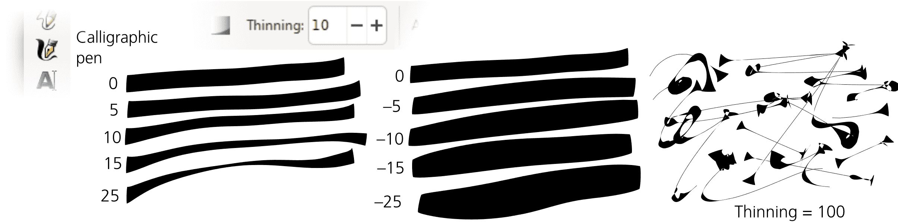

图 14-16：书法笔：按速度细化（压力敏感性关闭）

由于笔划运动通常在拖动的中间部分较快，因此结果是笔划的两端宽度固定，而中间部分则有“呼吸感”——对于该参数的正值，中间部分更细。压力敏感度通常会产生相反的效果，因为笔划中部的压力通常比两端更大。这两个因素的相互作用赋予了工具自然的手感。

现实中的毛毡笔或铅笔，通常在快速移动时会留下较细的痕迹；该参数的默认值设置为 10，以模拟这种行为。然而，你也可以将其调至–100 或 100，这会产生一种奇特的“爆炸”或“塌陷”效果，完全不同于现实世界中的任何效果！

### 14.2.2 角度

角度（Angle）和 Fixation 参数将书法笔视为可以以不同角度持有的平头书法笔（见图 14-17）。Angle 设置笔尖相对于水平线的角度：0 表示水平，+90 表示逆时针旋转至垂直位置，–90 表示顺时针旋转。你也可以通过按↑（增加）或↓（减少）箭头键来更改该值。

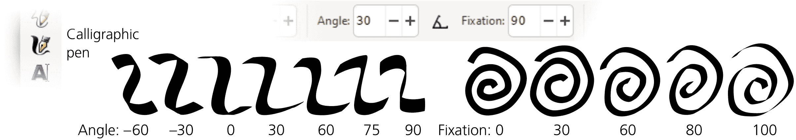

图 14-17：书法笔：角度和 Fixation

设置一个非零的 Fixation 角度对于制作书法字体最为有用。对于大多数书法风格，角度应设置在 30 到 60 度之间。

Fixation（范围从 0 到 100）控制角度的严格程度。当 Fixation 达到最大值时，笔尖总是以设定角度旋转，无论你的笔划方向如何——这样，与笔尖角度平行的绘制总会产生极细的线条，而与其垂直绘制则产生最大宽度。Fixation 为零时，笔的方向总是与移动方向垂直，这使得角度无关紧要，产生类似于圆头笔或圆刷的效果。Fixation 的中间值使笔划受**角度**和移动方向的双重影响，比例不同。

### 14.2.3 Caps

默认情况下，书法笔的笔划末端是平直的。这对于书法作品来说最为合适，但在其他情况下，你可能希望笔尖呈现更圆润的外观。将 Caps 参数调至 0.5 左右，末端会略微膨胀；调至 1.3 时，末端大致为圆形；调至 5 时，末端则会变得较长且突出，如图 14-18 所示。

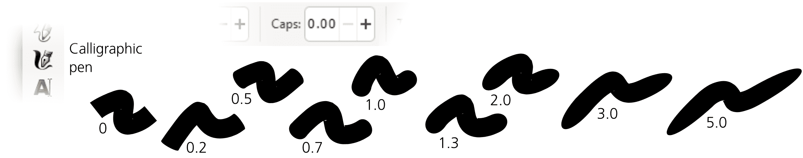

图 14-18：书法笔：笔划的末端

### 14.2.4 颤动、摇摆和质量

你目前看到的书法笔工具虽然有用，但可能略显乏味。是时候加入一些乐趣了！最后三个参数——颤动（Tremor）、摇摆（Wiggle）和质量（Mass）（都在 0 到 100 的范围内）——以一些不常见的方式修改工具的行为。

即使使用带有压力感应的绘图板，书法笔的笔触也常常显得过于平滑和计算机化。增加震动可以为笔触增加小范围的干扰，使其看起来更自然——粗糙、颤抖，甚至是斑驳的。震动的频率是时间性的，而非空间性的，这意味着如果你绘制得更快，粗糙感会沿着笔画拉伸，从而看起来更平滑。

晃动参数也会扰动笔画，但幅度较大，使笔画呈现波浪或环形的波动图案，有时会偏离光标的实际位置，尤其在急转弯时（见图 14-19）。

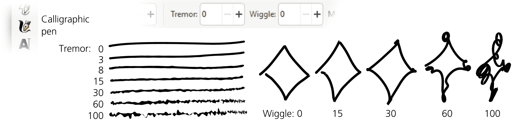

图 14-19：书法笔：震动（左）和晃动（右）的效果

质量使得画笔跟不上光标的移动，好像被惯性减速，从而平滑了急转角并缩短了笔的快速移动。震动和晃动的默认设置为 0，但质量有一个小的非零默认值（100 分之 2），使得书法笔感觉轻盈且响应灵敏，但并非完全没有重量。

### 14.2.5 书法预设

书法笔是 Inkscape 中设置选项最丰富的工具之一。当然，每次想要从平滑的马克笔切换到晃动的画笔时，调节多个滑块和按钮是非常耗时的。预设是解决这个问题的一个方法：你可以通过选择工具栏左端下拉菜单中的一个预设，一次性设置多个参数。程序自带了几个预设：

蘸水笔

是一种模仿软毛书法笔的画笔：平滑（无震动或晃动），压力感应，角度固定为 30 度，无圆角笔尖。

马克笔

是一种简单的、常规宽度的毡尖马克笔：平滑，无压力感应，无速度稀释，无角度固定，圆形笔尖。

画笔

与马克笔相比，增加了压力感应、负稀释（当移动速度较快时，笔画变宽）和一些晃动。

晃动

顾名思义，具有较大的晃动和一些震动，呈现出特有的“脏”效果。

斑驳

是一种非常宽的画笔，具有高震动和高负稀释，可以产生一系列“斑点”，这些斑点通过细长的条纹连接起来（见图 14-16，右）。

追踪

与马克笔类似，但启用了背景追踪功能（见 14.2.1.2）。

要使用当前参数添加新预设，请点击预设列表旁边的按钮，并为你的预设提供一个名称。

### 14.2.6 添加与减去

如果在开始绘制之前选择了一个路径，按住 Shift 键并松开鼠标按钮或抬起笔时，*将*你刚刚创建的笔画添加到选定的路径中，通过路径合并操作形成新的单一路径（见 12.2）。

类似地，按住 Alt 键将 *减去*（通过差异操作）新画笔路径与选定路径的交集。这使得快速“修补”或“雕刻”任何路径变得容易。橡皮擦工具的切割模式（14.4）具有相同的功能，因此你也可以在单独的工具中使用此功能，而无需按住 Alt 键。

### 14.2.7 跟踪指南路径

按住 Ctrl 键绘制书法笔时，激活 *指南追踪* 功能，这使得你的笔始终与所选的 *指南路径* 保持一定的距离滑动，从而让你能够沿着该路径进行描绘或围绕它进行描绘。

这个功能的灵感来源于传统的线雕刻技术，长期以来，这种技术是复制逼真阴影的唯一实用方式；大约一个世纪前，线雕刻几乎完全被自动半色调屏幕所取代。*刻画*—用许多平行的直线或曲线（宽度不同）填充空间以表示逐渐的阴影—是一项非常劳动密集的过程。Inkscape 的指南追踪功能，以及背景追踪（14.2.1.2）和微调工具（12.6），让这种古老艺术的痛苦与无聊消失了。虽然你仍然需要敏锐的眼光和大量的细致，但有了 Inkscape，你可以在合理的时间内，完全用矢量创建看起来真实的线雕刻作品。

近似画线网格的一种方法是使用路径插值（例如，使用插值子路径效果，13.3.9.2），但这种方法不太灵活，产生的输出明显是计算机生成的，缺乏“人类触感”。另一方面，手动刻画则既繁琐又几乎不可能做到均匀。指南追踪功能让你能够快速而均匀地画线，而且不会过于完美，你可以对整个过程进行相当的手动控制。

操作步骤如下。首先，选择你将要跟踪的 *指南路径*。它可以是另一条书法笔画、任何路径或形状，甚至是文本对象的字母。切换到书法笔工具，在开始绘制之前按下 Ctrl 键。你会看到一个灰色的 *跟踪圆圈*，它会集中在鼠标指针附近，并触及所选指南路径的最近点。（如果没有选择指南路径，状态栏会提示你选择路径。）

现在，移动鼠标靠近指南路径，使得跟踪圆圈的半径与所需的刻画图案间距相等，然后开始沿着指南路径绘制。只要开始绘制，圆圈的半径就会锁定，圆圈会变为绿色。此时，圆圈沿着指南路径滑动—而实际的笔画是由跟踪圆圈的中心绘制的，*不是*由你的鼠标指针绘制的。结果，你会创建一个平滑的笔画，它与指南路径平行，并且始终保持相同的距离（图 14-20）。

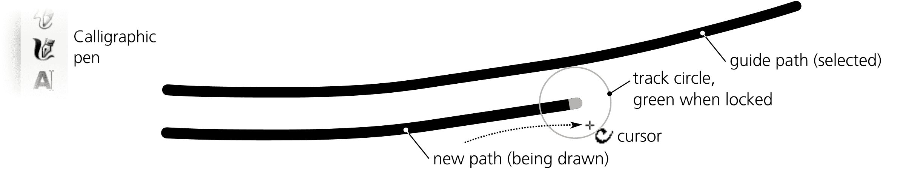

图 14-20：书法笔：跟踪指南路径

当笔画准备好后，释放鼠标按钮（或抬起平板笔）。但是，暂时不要松开 Ctrl 键，因为只要按住它，工具就会记住你开始绘制时设置的 Hatch 间距。由于你刚刚创建了一个新的笔画，因此该笔画对象被选中，而不是之前选中的对象——这意味着它现在成为新的引导路径。接下来，沿着第一笔画绘制第二笔，再沿着第二笔画绘制第三笔，以此类推。最终，你可以填充你想要的区域，形成均匀的 Hatch，如图 14-21 所示。

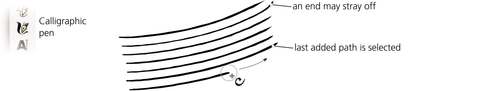

图 14-21：书法笔：创建均匀的 Hatch

对引导路径的附着并不是绝对的。如果你的鼠标指针远离引导路径，你将能够将其撕离（轨迹圆圈会从绿色变为红色），并远离——但不会完全自由：笔会保持一定的惯性，沿着引导路径的方向继续移动。这是故意设计的；例如，它允许你继续绘制笔画*超出*引导路径的末端，从而覆盖比初始引导路径更大的区域。由于惯性的存在，这种撕离通常比较平滑，但无法完全抑制抖动。如果抖动和意外的撕离仍然困扰你，可以尝试增加质量参数（14.2.4）。

跟踪引导路径还允许通过根据你的绘制行为逐渐调整跟踪距离来获得一些反馈。如果你始终试图绘制得比当前的跟踪距离更近或更远，跟踪距离会稍微增加或减少，从而使得 Hatch 图案的间距稍微变窄或变宽。

如果你不小心取消了上次创建的笔画（例如，通过撤销一个错误的笔画），你可以通过按 Shift-Tab 重新选择它，而无需离开书法笔工具（5.11）。你可以将引导跟踪与添加或删除结合使用；按 Shift-Ctrl 可以将新笔画添加到选中的引导路径中，按 Alt-Ctrl 可以将其从引导路径中删除。

跟踪功能是为了平滑的雕刻图案设计的，因此它无法在转弯较急或不均匀的引导路径上工作（例如，高颤抖的书法笔画，14.2.4）。由于跟踪是沿着笔画的*边缘*进行的，因此宽度变化的笔画（例如，跟踪背景时，14.2.1.2）会导致随着绘制过程的进行，Hatch 图案逐渐弯曲。最后，你只能跟踪路径；如果你有一个想要覆盖的位图，你必须先在每个 Hatch 区域手动创建第一笔画，然后才能将其作为引导路径进行跟踪（图 14-22）。

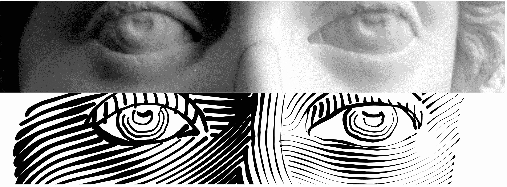

图 14-22：获取一个位图（上图），使用书法笔工具在其上进行 Hatch，然后使用 Tweak 工具调整生成的 Hatch（下图）。

使用带有引导跟踪的调整工具和书法笔是很方便的。描绘的阴影很少完美：松散的杂乱末端、错误的倾斜角度或弯曲度、不正确的笔触宽度（过深或过浅的阴影）是最常见的问题。使用调整工具，你可以修正这些问题，避免重新描绘阴影。使用收缩/扩展模式像橡皮擦一样清理松散的末端，同时调整笔触宽度；推拉模式可以弯曲或塑造阴影。借助这些强大的工具，使用照片作为参考，你可以创建复杂且看起来真实的阴影效果。

## 14.3 油漆桶工具

“油漆桶”或“区域填充”工具的概念你可能在位图编辑器中见过。在 Inkscape 中，油漆桶工具的工作方式正如你所期望的那样：点击任何被四周边界围起来的区域，它就会用颜色填充该区域。然而，作为一个矢量工具，Inkscape 的油漆桶会创建一个新的*路径*，填充你点击的区域，如图 14-23 所示。

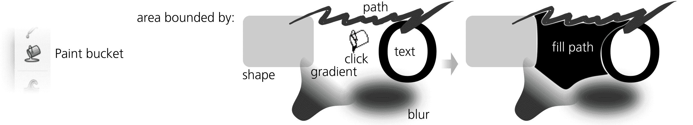

图 14-23：油漆桶填充一个有边界的区域

另一方面，Inkscape 的油漆桶工具是*感知性的*，而非*几何性的*。这意味着，在寻找你点击点的边界时，它会识别任何*可见*的颜色不均匀性作为边界。因此，填充会在渐变、模糊和位图中的颜色边界处停止，但它会忽略任何完全（或几乎）透明的路径或其他因某种原因与背景没有明显区别的对象。

例如，你可以扫描一张铅笔素描，将位图导入 Inkscape（18.1），并通过填充所有有边界的区域来快速“描摹”它。这种便捷的交互式方式使得传统的位图描摹（位图追踪对话框，18.5.2）在许多情况下变得不再必要。

在内部，该工具通过对可见画布的屏幕分辨率渲染执行位图区域填充，然后将结果填充路径追踪为矢量路径。该工具使用的渲染位图的*分辨率*与当前的缩放级别相关；你越是放大一个区域，填充的分辨率就越高。如果油漆桶填充的结果过于不精确，或者有圆角，或者没有进入应该填充的小缝隙——只需撤销操作，放大（但要确保整个填充区域可见），然后从同一点重新填充。相反，如果填充从小缝隙溢出，缩小视图使缝隙不那么明显，再次填充（或者调整自动关闭缝隙的参数，14.3.5）。

### 14.3.1 填充技巧

要填充一个有限区域，切换到油漆桶工具（F7 或 U），然后点击区域内。如果按 Shift 键点击，结果路径将与选中的路径联合（12.2）；例如，如果你的第一次尝试没有填充完整的区域，只需按 Shift 键点击剩余的角落来完成，如 图 14-24 所示。

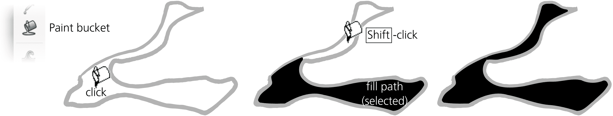

图 14-24：向现有路径添加油漆桶填充

如果你点击并拖动（你的拖动路径会通过红线显示），你将从*你经过的每一个点*开始填充。从每个点开始，填充会扩展到颜色相似的邻近区域。换句话说，这就像是用这个工具在拖动路径的每个点上点击并结合结果。通过这种方式，你可以轻松填充由渐变或模糊占据的区域——只需从最暗到最亮的点拖动你想填充的区域（图 14-25）。

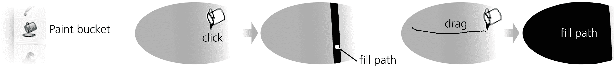

图 14-25：单击一次，只有渐变的窄条被填充；拖动跨越一个区域以填充整个渐变。

Alt 点击并拖动类似于简单的拖动，区别在于从拖动路径中的每个点开始，填充会扩展到与*起始点*（即你开始拖动的点）颜色相似的邻近区域（如果有的话），而不是你正在拖动的点。这使你能够通过从一个区域开始拖动并使用 Alt 键拖动穿越所有其他区域，填充一系列相似颜色但分开的区域（例如，漫画中的多个单元格）。

### 14.3.2 按通道填充

在寻找停止的颜色边界时，油漆桶工具默认会查看画布上你看到的相同颜色。然而，你可以将其视野限制为特定的颜色通道。除了默认的可见颜色，填充下拉菜单允许你选择任何三个 RGB 通道（红色、绿色、蓝色）、任何 HSL 通道（色相、饱和度、亮度）或 Alpha 通道（透明度）。

例如，如果选择红色通道，即使是最锐利的绿色/蓝色边界也无法阻止填充。选择 Alpha 通道会让工具忽略所有颜色，仅查看透明度变化的位置；例如，如果你有一个复杂的、多色的、但完全不透明的物体在透明背景上，点击这个物体的 Alpha 模式会填充到整个物体的轮廓。

### 14.3.3 阈值

阈值参数的范围从 0 到 100，控制一个点的颜色与初始点击点相比，必须有多大差异才能停止填充的传播。零容差意味着只有严格相同颜色的区域会被填充；容差越大，填充区域也会越大，且填充越容易泄漏到相邻的颜色区域。默认值为 5。

### 14.3.4 扩展与收缩

通过“增长/缩小”参数，你可以控制应用到创建的填充路径的内缩或外扩量。这与 Outset 和 Inset 路径命令（12.4）的工作原理非常相似，只是它是在每次填充后自动执行的。

正的增长/缩小值会使填充路径比它所代表的填充位图区域更大；这通常有助于消除填充与边界之间的抗锯齿空隙。负值则会使路径变小，确保填充与边界之间的宽度恒定。

### 14.3.5 填补空隙

通过“填补空隙”参数，你可以让油漆桶工具忽略区域边界中的任何空隙，这些空隙通常会导致填充溢出到不希望填充的区域。自动填补空隙有四个级别：

+   无

+   小（最多关闭 2 个屏幕像素大小的空隙）

+   中（最多关闭 4 个屏幕像素大小的空隙）

+   大（最多关闭 6 个屏幕像素大小的空隙）

将此参数设置为非“无”值会显著减慢工具的速度，特别是在填充大区域时。

### 14.3.6 样式

和所有创建对象的工具一样，油漆桶工具可以使用它所创建的对象的最后设置样式（11.1.2）（这是默认值），或者它可以使用自己的固定样式。你可以在工具的首选项页面切换这两种模式（双击工具图标进入）。与其他工具一样，控制栏最右侧的样式样本显示将用于下一个填充的样式。要更改最后设置的颜色而不影响任何对象，只需取消选择所有对象（Esc）并点击调色板上的颜色。

在油漆桶工具中，按住 Ctrl 并点击具有特殊功能。按住 Ctrl 时，工具不会填充区域，而是对你点击的现有对象进行即时样式更改（无需选择该对象）：它只是简单地将该对象的填充颜色更改为工具当前的填充颜色。同样，按住 Shift-Ctrl 并点击则将该对象的描边更改为工具当前的描边颜色（如果没有设置描边，则 Shift-Ctrl 点击的行为与 Ctrl 点击相同）。例如，你可以使用此功能重新着色你之前创建的一些填充对象，而无需先选择它们，并且无需离开油漆桶工具。

## 14.4 橡皮擦工具

正如其名字所示，这个工具是为了快速方便地擦除内容。Inkscape 的橡皮擦工具（Shift-E）实现了三种不同的模式，由控制栏上的三个切换按钮表示（图 14-26）。

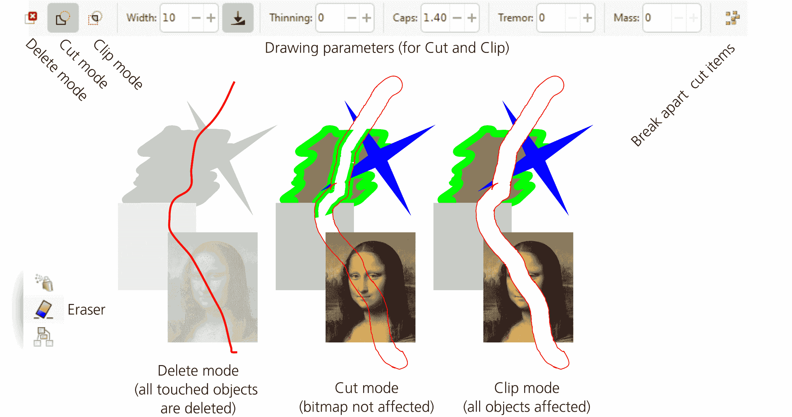

图 14-26：橡皮擦工具

删除模式

在此模式下，你可以在对象上拖动（留下红色轨迹），松开后，工具会删除你拖动路径所触及的对象（参见 5.8）。此模式没有其他选项。

剪切模式

在此模式下，橡皮擦绘制一条路径，就像书法笔一样，然后使用差异布尔操作（12.2）将其从下面的其他路径或形状中减去。此模式中的选项类似于书法笔的选项，包括宽度（14.2.1），细化（14.2.1.3），端点（14.2.3），甚至震动和质量（14.2.4）。最后一个切换按钮强制工具将每个被切割的路径拆分成不连贯的部分（12.1.1）。

剪切模式

此模式与剪切模式类似，但不同之处在于，工具会对你绘制的对象进行剪切（18.3），而不是减去它们。这是一种更好的方法，因为首先，剪切操作是非破坏性的（你始终可以使用“对象 ▶ 剪切 ▶ 释放”恢复原始对象），其次，剪切不仅适用于路径，也适用于位图等其他对象。SVG 中的对象只能拥有单一的剪切路径，但该工具足够智能，当你剪切一个已经被剪切的对象时，能够按预期工作：它会将新的剪切路径添加到当前的剪切路径中。

## 14.5 连接器工具

绘图应用程序，其中最著名的是 Microsoft Visio，是一种非常流行的软件类别，与矢量图形有很大的重叠。Inkscape 的连接器工具扩展了该领域的功能——尽管不足以替代 Visio，但足够用于小型绘图项目。

基本上，图表是一个矢量图形，其中对象通过不同类型的线连接——用于说明工作流顺序、链接、调用、分类或其他类型的关系。至关重要的是，程序能够识别哪些内容与哪些内容相连，并且每当你移动连接的对象时，连接线会自动更新。这正是连接器工具所做的工作。

要尝试该功能，在矩形工具中绘制几个矩形。你还可以创建文本标签，并将每个标签与其矩形分组。然后切换到连接器工具（O）。当你将鼠标悬停在其中一个对象上时，你会看到其中央有一个白色方形控件。抓住它，向另一个矩形拖动，并将其放置在另一个矩形的中央控件上。这将创建一条连接矩形边缘的直线，沿着连接它们中心的线（图 14-27）。现在，移动矩形（在选择器中），你会看到连接线实时更新。

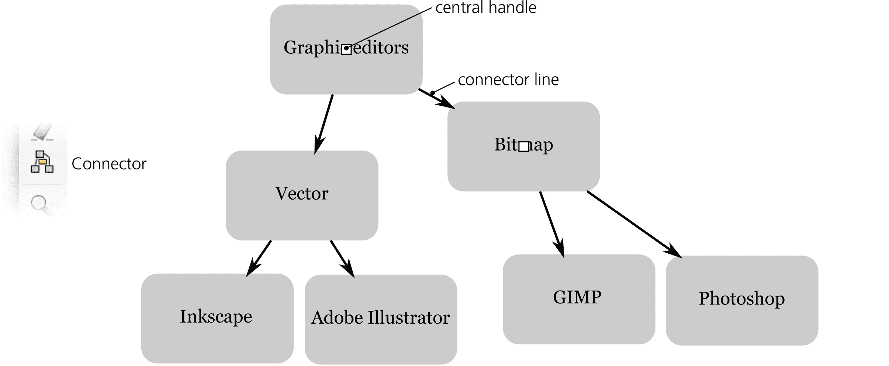

图 14-27：连接器工具

连接器是常规的 SVG 路径，你可以根据需要对其进行样式设置——例如，给它们添加箭头标记（9.5）。你也可以像编辑路径一样编辑它们的节点，但实际上不应这样做。只要其中一个连接的对象移动，其连接器会自动更新，丢弃你对它们做的任何节点编辑。

当你移动对象时，你自然会希望避免连接线与已连接的（或任何其他）对象交叉的情况。连接器工具也可以为你完成这一点。工具控制栏中的前两个按钮将启用和禁用当前选定对象的 *避免属性*。如果某个对象具有此属性，连接线将被引导到避免与其交叉或接触的方式。如果你选择了图表中的所有块，并通过一次点击为它们启用此属性，你将拥有更多的自由来移动元素而不会让图表变得难以阅读。你可以通过间距参数调整对象和连接器之间的间距（见 图 14-28）。

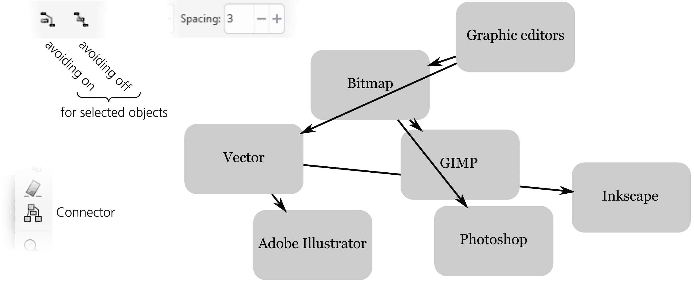

图 14-28：连接器工具：启用块的避免属性

连接器工具还可以生成另一种风格的连接器：*直角*，由垂直和水平段组成， optionally 带有圆角，如 图 14-29 所示。

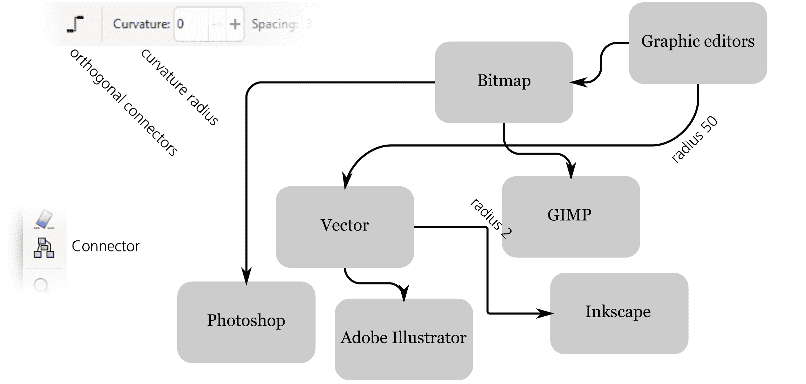

图 14-29：连接器工具：直角连接器

你可以单独更改每个连接器的曲率半径（点击连接器工具中的连接器进行选择）。此选项可以与图表块的避免属性结合使用。
