# 第十五章：文本

正如你在矢量编辑器中所期待的，任何你添加到 Inkscape 绘图中的文本，无论你对其应用了什么样的样式、滤镜或变换，都始终可以*作为文本*随时进行编辑。创建和编辑文本对象是文本工具的功能，允许你输入或删除单词，将文本手动或自动分列，应用样式于文本段落，调整字距和行距等。

Inkscape 并不与文字处理软件或桌面出版软件竞争；它在处理大量文本时并不特别方便。Inkscape 没有结构化格式化工具，如自动标题或样式库。相反，作为一个视觉设计工具，Inkscape 在大多数情况下，能够让你对每个字形、单词和段落进行完全而精确的控制，同时不牺牲文本的可编辑性。

## 15.1 基本编辑

如果你有一个现有的文本对象，选择它并切换到文本工具（F8 或 T）。这会将文本编辑光标（一个闪烁的垂直线）放置在文本对象的末尾。此时，你可以点击文本中的任何位置来放置光标，或者用箭头键移动光标。或者，在选择工具中，双击一个文本对象——这会切换工具，选择对象，并同时将光标放置到你点击的位置。

单击或双击文本对象仅当你的鼠标光标为“I”形状并且文本周围出现蓝色框架时才可能，这表示你正在点击一个可编辑的文本对象（图 15-1）。

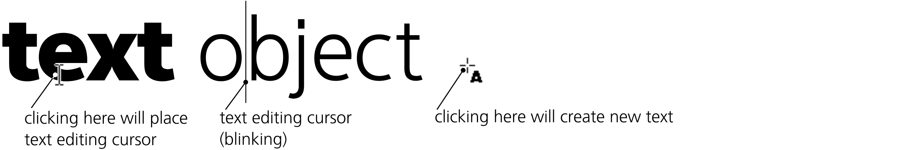

图 15-1：通过点击放置文本编辑光标

在 Inkscape 中，输入和编辑文本的方式与文字处理软件类似。使用 Delete 或 Backspace 删除字符（包括换行符）；按 Enter 键开始新的一行。你可以使用箭头键移动文本光标（按住 Ctrl 键可按单词跳转），使用 Home 和 End 键（按住 Ctrl 键可移动到文本对象的开始或结束），以及使用 Page Up 和 Page Down 键。画布会在必要时自动滚动，以确保文本光标始终可见。

如果因为某种原因，在画布上编辑文本不方便，可以打开**文本和字体**对话框（15.3.2），然后在**文本**标签下，在标准文本区域编辑所选文本对象。不幸的是，点击“应用”会丢失你可能已经应用到文本中某些部分的格式设置（15.3.1），但如果你只是打开对话框查看文本或将其复制到剪贴板而没有进行任何更改，这样是完全安全的。

### 15.1.1 选择

你可以通过拖动*覆盖*某些字符来选择文本对象中的内容（与点击一样，必须从字符的主体开始，而不是空白区域），或者通过使用 Shift+箭头键移动文本编辑光标来选择文本（图 15-2）。这种*文本选择*，以绿色蓝色矩形叠加显示，不应与程序范围内的*对象选择*（第五章）混淆；文本选择是文本工具独有的，允许你在选定的文本对象内进行样式设置、字符间距调整或删除操作。在使用文本工具编辑文本时，按 Ctrl-A 选择的不是所有对象，而是该文本对象内的所有文本。

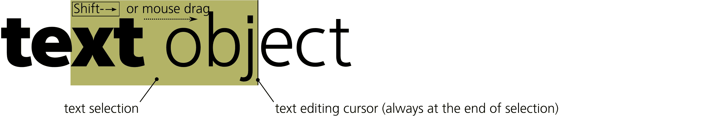

图 15-2：使用文本工具进行文本选择

使用 Ctrl-C（或 Ctrl-X 剪切）复制文本选择，再使用 Ctrl-V 粘贴到光标位置，是移动文本的简单方法——无论是在同一文本对象内，在同一文档的多个文本对象之间，跨文档之间，甚至在 Inkscape 和其他应用程序之间。例如，你可以在文字处理器中复制一段文本，并将其插入到 Inkscape 的文本对象中。Inkscape 中的复制/粘贴操作永远不会传递格式，仅传递文本内容。

## 15.2 文本对象的类型

如何创建一个新文本对象？这取决于你想创建的对象类型。Inkscape 中的文本对象可以属于不同类型，这些类型大致相似，但在能力和行为的细节上有所不同。

### 15.2.1 常规文本

要创建*常规文本对象*，切换到文本工具（F8），点击画布（不是现有的文本对象！）以放置文本光标，然后开始输入。（如果你拖动而不是点击，将创建一个文本嵌入形状对象，15.2.2）。按 Enter 键开始新的一行。

一旦你输入至少一个字符，新文本对象将被添加到文档中。此时，你可以切换到任何其他工具处理新创建的对象，就像处理其他对象一样——例如，使用选择工具进行变换（图 15-3），通过点击调色板颜色来为其着色（这可以在任何工具中完成），或使用渐变工具在其上绘制渐变。

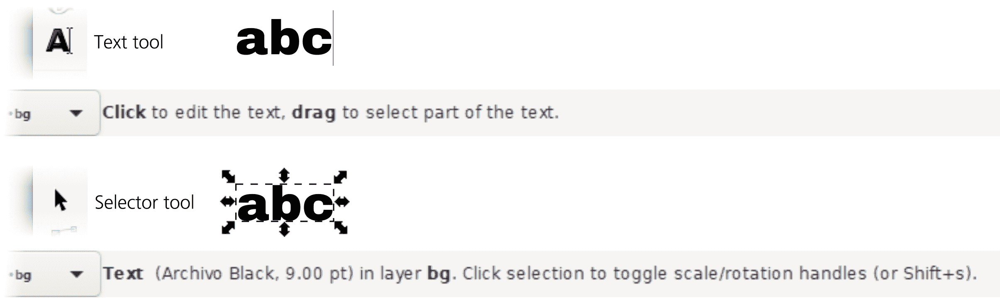

图 15-3：文本工具和选择工具中的文本对象状态栏描述

#### 15.2.1.1 常规文本中的换行

在常规文本对象中，默认情况下没有自动换行；你需要按 Enter 键来开始新的一行。如果你不这样做，继续输入的话，行的长度将没有限制。

要在常规文本对象中启用自动换行，请注意文本右端的菱形句柄。（左侧较小的方形标记是基准线原点标记，无法拖动。）一旦句柄被移离默认位置，文本将显示两条垂直引导线，定义了文本流入的列（这些引导线仅在文本工具中可见）。您可以通过拖动句柄来调整宽度。任何超过列宽的文本行都会自动换行，如图 15-4 所示。

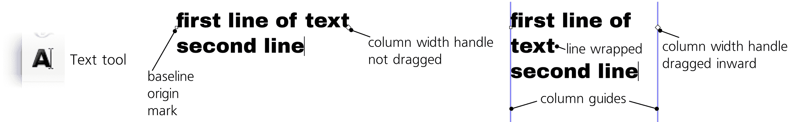

图 15-4：常规文本对象中长行换行

在从右至左的文本中（15.4.1），基准线原点标记在右侧，列宽句柄在左侧，您只能调整列左侧的引导线。对于垂直文本，引导线是水平的；您可以通过移动下部引导线来重新排列文本。

常规文本可以左对齐、居中或右对齐（15.4.2），但即使文本已自动换行到列中，仍然无法进行完全对齐。如果您需要一个完全对齐的文本列，可以使用形状中的文本（15.2.2）。

如果列的宽度比文本中最长的单词还要窄，Inkscape 就面临着如何处理无法适应的单词的问题。Inkscape 不知道如何正确断开单词（因为单词断开规则取决于语言，而 Inkscape 不知道文本的语言）；它尝试做的一件事是断开带连字符的单词（在连字符处断开）。最终，Inkscape 会放弃并截断文本—从第一个无法适应的单词开始，所有后续内容都会被隐藏；这种被截断的文本对象会显示红色列引导线，而不是蓝色的。要修复被截断的文本对象，可以加宽列，减少字体大小，或编辑文本以确保所有单词都能适应。

### 15.2.2 形状中的文本

如您所见，常规文本对象可能具有，也可能没有特定的列宽，这取决于是否拖动了菱形句柄。相比之下，*形状中的文本*总是具有自己的内在宽度和高度——更一般地说，它是一个*框架*——并且会自动换行以填充其框架。在这种文本对象中输入时，按下 Enter 键会开始一个新段落。如果文本过长而无法完全适应框架，*形状中的文本*可能会被*截断*（请参阅 15.2.1.1）。

#### 15.2.2.1 内部框架

创建*形状中的文本*的最简单方法是使用文本工具在画布上*拖动*（而非点击）。这会创建一个矩形框架，就像使用矩形工具拖动一样（图 15-5）。松开鼠标后，您可以输入或粘贴文本，当文本到达框架边缘时，它会自动换行。您还可以拖动右下角的句柄来调整框架大小，文本会自动重新流动以适应新的大小。

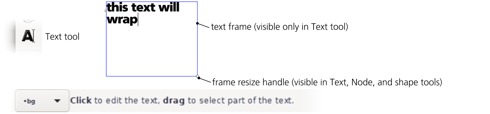

图 15-5：带有内部框架的形状中的文本

文本在单词边界处换行；不支持自动连字符。如果文本超出了框架的大小，额外的文本（从一个单词边界开始）会被截断——隐藏但不会丢失；如果你减小字体大小或删除一些文本，尾部会移动并变得可见。

这种类型的文本对象被称为具有*内部框架*：其矩形框架是对象本身的一部分，而不是一个独立的对象。例如，当你变换文本时，它与其框架一起整体变换。

#### 15.2.2.2 外部框架

代替自己的内部矩形框架，文本对象可以链接到任何外部路径作为其框架。为此，选择两个对象——任意文本（常规文本或形状内文本）和一个路径——然后选择**文本 ▶ 流入框架**，如图 15-6 所示。

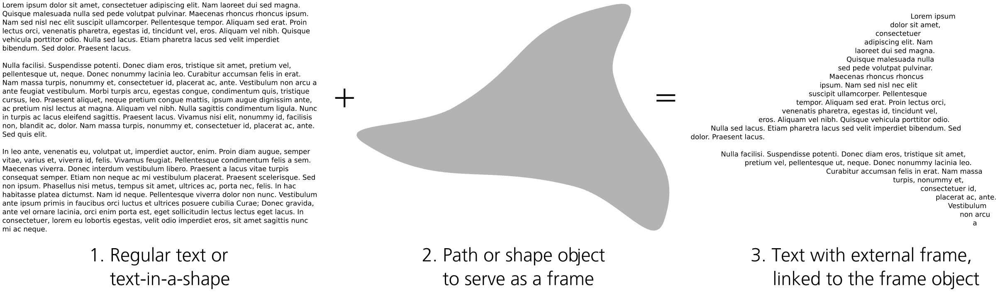

图 15-6：具有外部框架的文本对象

这个命令不会删除或隐藏框架对象；文本和框架保持分开，文本被称为与其框架*链接*，就像克隆与原始对象是链接的（第十六章）。编辑框架对象的形状会迫使链接的文本重新流动到更改后的形状中，但样式化框架（例如，通过使其完全透明来隐藏它）不会影响文本。

你可以单独移动或变换链接的文本，而不影响框架，但移动或变换框架会影响文本（参见 16.2 中的变换克隆补偿模式）。选择一个链接的文本对象并按 Shift-D 键，会选择其框架，就像在克隆及其原始对象之间一样（参见 16.4）。

要去掉框架，请使用**文本**菜单中的**取消流动**命令。此命令会删除文本形状的内部框架（或断开与外部框架的链接），并将其转换为常规文本对象。每个段落变为一行。

### 15.2.3 流动文本

如果你打开一个在旧版本 Inkscape 中创建的文件，你可能会发现另一种文本对象，它看起来和行为几乎与文本在形状内相同，但在状态栏描述中被称为*流动文本*。这种类型的对象（在 SVG 中由非标准的`svg:flowRoot`元素及其子元素表示）曾长期以来是 Inkscape 中唯一创建自动换行文本的方式。这种流动文本在 Inkscape 以外的地方从未得到支持，尽管你仍然可以在旧版本的 Inkscape 文件中查看和编辑流动文本对象，但最好通过“文本 ▶ 转换为文本”命令将它们转换为常规的换行文本对象。

### 15.2.4 路径上的文本

除了使用路径作为框架（参见 15.2.2.2），Inkscape 中的单行文本对象可以链接到路径，使用它作为引导来弯曲文本的基线。只需选择文本和路径，然后选择**文本 ▶ 放置到路径上**，如图 15-7 所示。

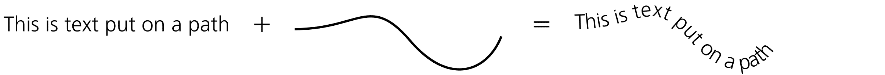

图 15-7：将文本放置到路径上

这个连接是实时的——文本和路径都可以编辑，改变路径的形状会使文本跟随新的形状。如果文本长度超过路径，它的末尾会被隐藏（但仍然存在：如果你删除文本的开头部分，末尾部分会向内移动并变得可见）。如果路径由多个子路径组成（12.1.1），文本会从一个子路径的字符边界继续到下一个子路径（但不是单词边界）。

路径是否有描边或填充并不重要；对文本来说，唯一重要的是路径的几何形状。路径方向也很重要：如果你想将文本放置在路径的另一侧并反向排列，选择**路径 ▶ 反转**，如图 15-8 所示。

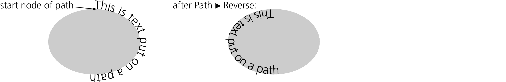

图 15-8：路径方向会影响路径上的文本。

你可以通过使引导路径完全透明，或者去除其填充和描边来轻松隐藏引导路径。转换路径（例如，移动路径）会影响其链接的路径文本；然而，你可以缩放、旋转或将文本对象移离路径，它会保持这个独立的变换而不会破坏链接。

一个以上的文本对象可以链接到同一路径。使用**文本 ▶ 从路径中移除**将路径上的文本转换为普通的线性文本，切断其与路径的连接。

## 15.3 文本样式

在许多方面，文本对象与其他类型的对象没有什么不同：你可以整体转换和样式化文本对象（选择填充或描边、调整透明度、应用滤镜），而无需进入文本工具（当然，编辑文本的能力也不会丧失）。然而，只有文本工具允许你更改特定于文本的样式属性（例如字体家族和字体大小），以及对文本对象内的*文本段*（片段）应用样式。

你可以更改文本样式的两个地方是文本工具的控制栏（画布上方）和文本与字体对话框（Shift-Ctrl-T）。前者更快捷方便，而后者提供了更多选项。

### 15.3.1 非文本样式属性

当你在文本工具中选中一个文本段落时，大多数（但不是所有）改变样式的命令和样式报告 UI 元素都会应用到该段文本，而不是整个文本对象。例如，你可以通过选中它并点击调色板中的颜色样本，使用填充和描边对话框（8.2）或颜色手势（8.7）来轻松更改文本段落的颜色，如图 15-9 所示。同样，你也可以为该段落添加或去除描边，或者调整其透明度。然而，模糊或其他滤镜无法应用到文本段落；如果你尝试这样做，整个文本对象将被模糊或滤镜化。

将渐变或图案填充应用到文本跨度是可能的，但操作较为复杂。你需要创建一个包含所需渐变或图案的单独对象，复制它（Ctrl-C），然后选择文本工具中的文本跨度，最后粘贴样式（Shift-Ctrl-V）到文本跨度上。不幸的是，你不能再使用渐变工具中的控制柄来编辑这种渐变。

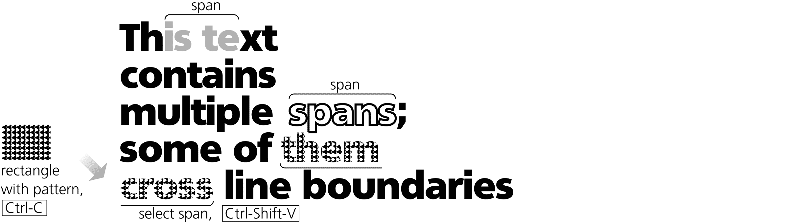

图 15-9：为文本跨度设置样式

一般来说，粘贴样式技巧在为文本跨度（text spans）设置样式时非常有用——它允许你在对象和文本部分之间传递样式（不仅包括颜色，还包括字体、大小、字间距等）。要从文本跨度复制样式，你甚至不需要选择它；只需将文本编辑光标放在跨度内的任何位置，然后按 Ctrl-C。

### 15.3.2 字体和变体

Inkscape 允许你使用操作系统中安装的任何轮廓字体（TrueType、OpenType、Type 1）。你还可以通过将字体放入 Inkscape 数据文件夹下的 inkscape/fonts 文件夹中来提供额外的字体，只有 Inkscape 能够使用这些字体。你可以在首选项的系统页面中查找这个文件夹。此外，你还可以通过在首选项、工具▶文本页面中的“附加字体目录”中列出其他字体文件夹，指示 Inkscape 查找这些目录。

一个包含所有字体家族（不是单独的字体）的列表会从文本工具的控制栏打开；每个字体家族都有图形样本，你可以通过滚动列表来选择一个家族。如果你知道所需字体的名称，可以点击文本框（或者按 Alt-X）并开始输入；一个下拉列表会显示可能的匹配项（图 15-10）。

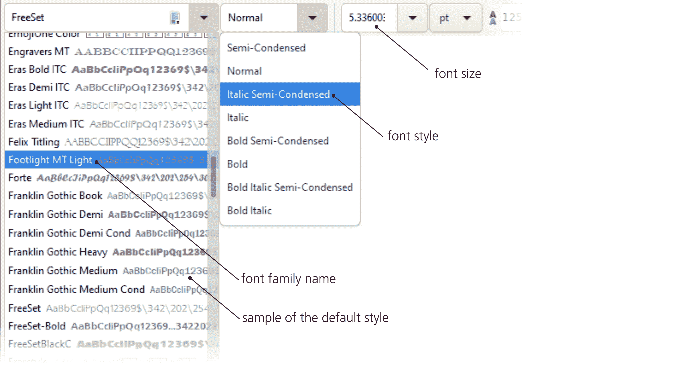

图 15-10：在文本工具中选择字体家族和样式

大多数字体在同一家族内包含多种变体（样式）；除了斜体/倾斜体和不同粗细的变化（轻体、中体、粗体、重体等），它们还可能包含宽度轴上的变化（紧凑或拉伸）。在控制栏上，所选字体家族的样式列表位于字体家族下拉框的右侧。编辑时，Ctrl-I 和 Ctrl-B 快捷键会尝试将所选文本切换为当前字体的斜体或倾斜体（如果可能，保持相同的粗细）或粗体样式。

在文本和字体对话框中（Shift-Ctrl-T，图 15-11），也可以找到相同的字体家族和样式列表。在这里，你不仅能看到一个小的通用样本，还能看到在所选字体和字体大小下的文本对象预览。选择对话框中的样式后，点击**应用**，更改才会生效。

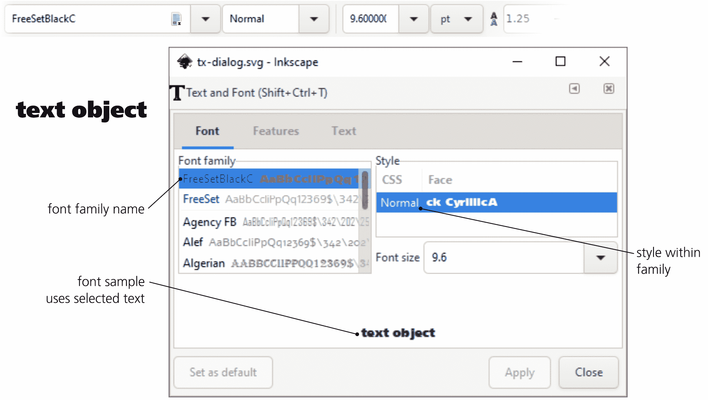

图 15-11：文本和字体对话框

#### 15.3.2.1 可变字体

*可变*字体并不像传统字体那样提供不同的样式作为独立的字体文件，而是具有一个或多个*设计轴*，允许你平滑地调整某些字体参数——最常见的是字重或字宽。这是 OpenType 字体的一个特性（OpenType 是 TrueType 的继任者）；许多免费字体，包括 Google Fonts 上的字体（[`fonts.google.com/`](https://fonts.google.com/)）都采用了这一特性。Inkscape 在其“文本和字体”对话框中支持可变字体：当选择可变字体时，其设计轴（或多个设计轴）会以滑块（或多个滑块）的形式显示在字体样本上，实时反映可变参数的值。

### 15.3.3 字体大小

在许多情况下，你甚至不需要以数字形式设置字体大小；你可以使用选择工具（6.2）或键盘快捷键来缩放整个文本对象。否则，可以使用控制栏上的字体大小控件（带单位选择器）或在“文本和字体”对话框中使用（该对话框始终使用 px 单位）。这两种字体大小控件都会在显示字体大小时考虑到这个缩放；例如，如果你将文本对象设置为 12 px 字体大小，但随后将其放大两倍，你会看到其字体大小显示为 24 px。

## 15.4 文本布局

### 15.4.1 写作模式和方向

不是所有语言都像英语那样从左到右、从上到下书写。有些语言是从右到左书写的（例如，希伯来语），而有些语言则偏好垂直放置字形（例如，日语）。

控制语言特定文本参数的三个下拉开关（位于文本工具控制栏的最右端）中，第一个开关将文本切换为垂直模式（从上到下）。对于垂直文本，它还控制*块进度*（此处的块指段落或段落内的行），可以设置为从右到左或从左到右。这给该开关提供了三种选择：水平文本、具有从右到左块进度的垂直文本，以及具有从左到右块进度的垂直文本。

第二个开关控制垂直文本中单个字形的方向。这区分了那些通常只出现在水平文本中的字符（例如西方语言中的字符）和那些在垂直文本中常见的字符（例如日文字符）。三种选项——混合、竖直和横向——如图 15-12 所示。

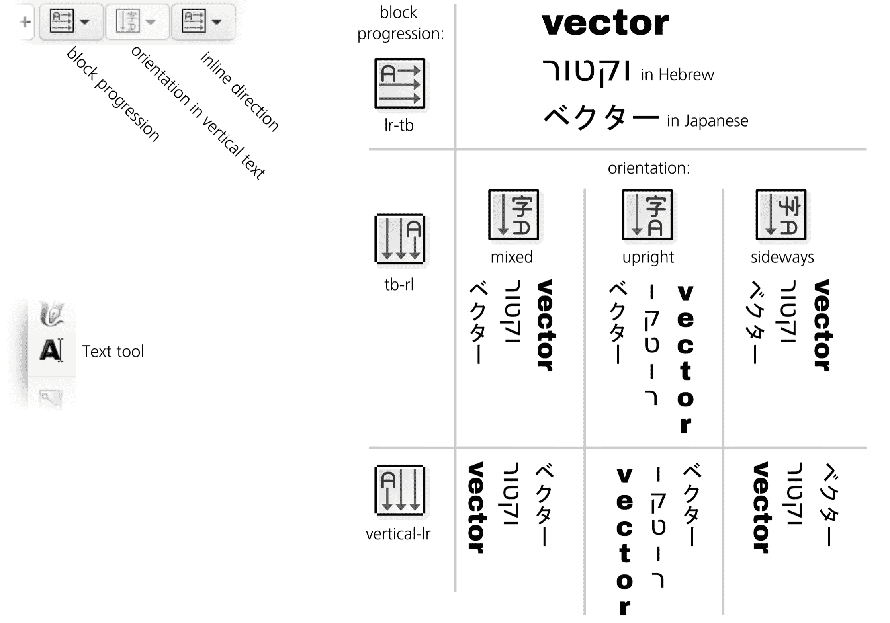

图 15-12：文本方向、块进度和字形方向选项

三个按钮中的最后一个设置文本的内联书写方向（从左到右或从右到左）。通常，右到左的文本（如希伯来语）在不触及此选项的情况下也能正常显示；它并不会真正反转字符串中字符的顺序，而是标记文本为右到左，同时反转对齐方式并改变光标移动和选择键的工作方式。

### 15.4.2 对齐

每个文本对象都有特定的对齐方式：*左对齐*（默认）、*右对齐*或*居中*，你可以在文本工具的控制栏中通过下拉菜单选择它（图 15-13）。例如，在编辑左对齐文本时，按 Enter 会将光标水平移动到下一行的*起始*位置，而你输入的文本会在此对齐边缘的右侧扩展，并随着光标一起移动。相反，在右对齐文本中，按 Enter 会将光标移至前一行的*结束*位置，而你输入的文本会向左移动，光标保持在原位。

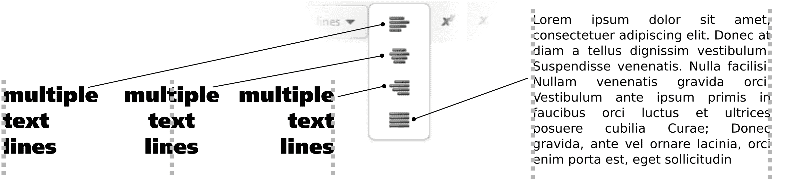

图 15-13：文本对齐和排版

对于图形中的文本，还有一个额外的对齐选项：*两端对齐*，它会扩展每行中的空格，使文本列的两端对齐。

### 15.4.3 下标与上标

要将部分文本转为上标，选择该部分文本并点击控制栏上的上标按钮 (**x^y**) 。例如，输入 `1.496 × 1011`，然后选择最后两个字符并将其转为上标，以科学记数法表示地球到太阳的距离：`1.496 × 10¹¹`。另一个按钮用于生成下标；如果你希望将上标和下标同时应用于同一字符，如*T*²[2*n* + 1]，你可能需要应用一些水平字距调整（15.4.4），以使其看起来更好。

### 15.4.4 字距调整

在使用文本时，Inkscape 让你自由地移动每个字符并调整字母之间的间距。

将光标放在字符前并按 Alt-→。光标右侧的整行文本将在当前缩放级别下向右移动 1 个屏幕像素；按 Shift-Alt 时，箭头键会移动 10 倍于 Alt 的距离（参考 6.5.1）。这是调整两个字符之间的*字距间隔*的交互方式；你也可以通过控制栏中的水平字距值（以 px 为单位）以数值方式进行调整。

你可以将任意一对字符的间距调得更近或更远，以实现文本行的最佳平衡和视觉节奏。你还可以调整空格的间距，将*单词*拉近或分开，视需要而定。为了直观地查看你添加的字距调整，只需选择文本（Ctrl-A）。每当两个字母被手动调整得更紧密时，它们的选择矩形将重叠，你会看到一条更深的带状区域；相反，字距扩展的字符对则会在选择覆盖层之间留下空隙（图 15-14）。这条深色带或空隙的宽度正好对应你在该位置添加的字距调整量。

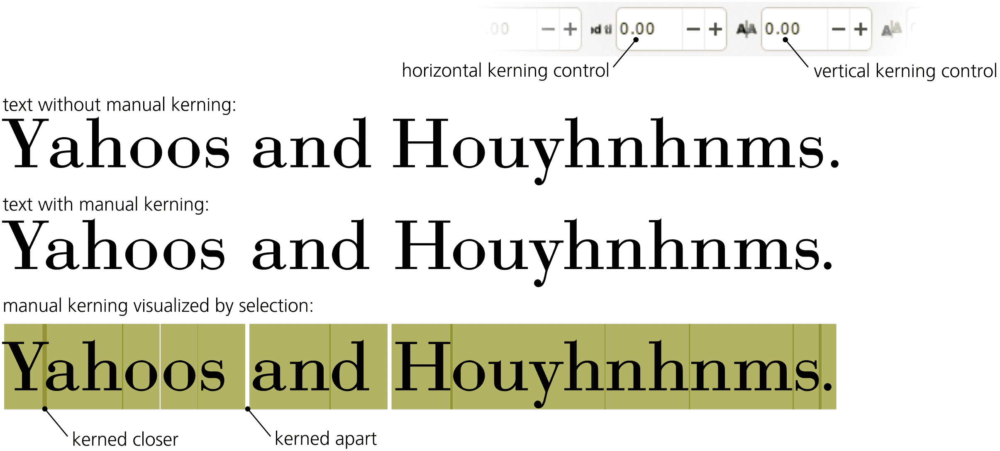

图 15-14：调整字符串中的字距间隔

通过放大缩放，你可以进行更精细的字距调整。但不要过度放大；始终缩小查看你的间隔在整个文本行中的效果。

水平字距调整对于路径上的文本尤其有用。正如图 15-7 所示，字母在凹曲线处往往太紧凑，而在凸曲线上则分得太开。通过手动字距调整，可以轻松抵消这种效果，使字符沿曲线均匀分布。

许多字体包含内建的字距调整指令；例如，一种字体可能指定，当 *Y* 和 *a* 相邻时，它们的字距为字体大小的 0.03。Inkscape 会遵守这些自动字距调整指令。然而，如果你尝试手动调整这对字符的字距，你将禁用自动字距调整。这就是为什么首次按 Alt-← 来将 *Y* 和 *a* 拉近时，可能会意外地让这两个字母拉得更远。别担心，只需继续按 Alt-←，直到达到你需要的间隔。

你也可以通过按 Alt-↑ 和 Alt-↓ 或通过另一个控制条小部件来垂直调整字符间距。水平和垂直字距的组合使你能够在文本字符串中自由地定位单个字母，正如图 15-15 所示。

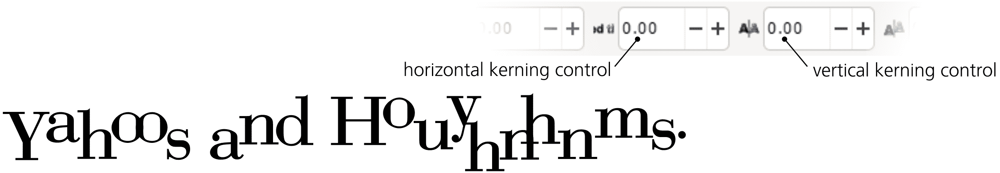

图 15-15：组合水平和垂直字距调整

如果你选择了一个或多个字符（通过鼠标拖动或按住 Shift+箭头键），字距快捷键将通过在所选文本前后插入两个相反的字距，来有效地将选定部分相对于其余文本移动，正如图 15-16 所示。

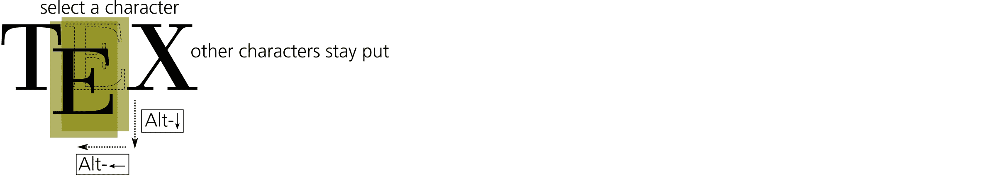

图 15-16：通过字距快捷键移动选择内容

最后，你可以通过按 Alt-[ 或 Alt-] 来旋转文本对象中的任何字符，当光标位于该字符之前时（参见图 15-17）。

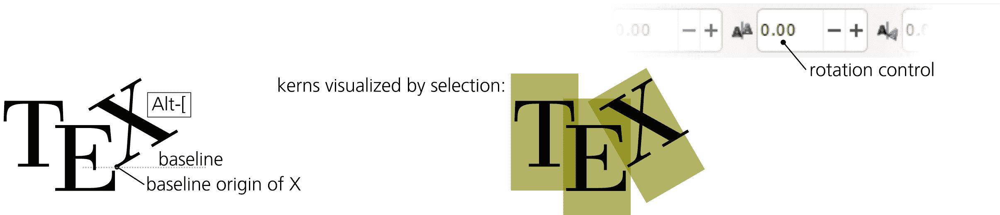

图 15-17：旋转字符

这种旋转是围绕字符的*基线原点*进行的——即字符在*基线*（大多数没有扩展部分字母的底部线，如 *i* 或 *m*）上的最左侧点。所选文本对象中第一个字符的基线原点会在画布上显示为一个小方块，出现在选择工具和文本工具中。

### 15.4.5 字母、单词和行间距

如果你想要让文本中的所有字符——而不仅仅是某一对字符——更加紧密或更加分开呢？这种调整叫做*字母间距*（在其他软件中，它可能被称为*字距调整*）。选择全部或部分文本，然后按 Alt-> 来拉开字符间距，或者按 Alt-< 将它们拉得更近（这些与选择工具中缩放对象的快捷键相同），或者在文本工具的控制条中修改**字母之间的间距**值（参见图 15-18）。

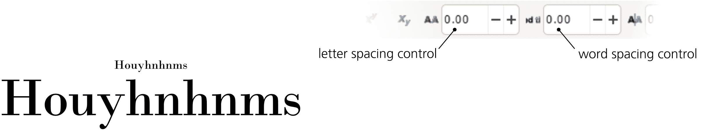

图 15-18：将字母间距拉开（上）或紧缩它们（下）

理想的字母间距取决于文本的最终显示大小。通常，较小的字体需要更多的空隙，而较大的文本应更加紧凑。

同样，你可以调整单词之间的间距——即更改空格字符的默认宽度。例如，如果你在控制条的“单词之间的间距”字段中输入 10，则所选文本中的每个空格将比默认宽 10 像素。

要调整文本对象中行之间的间距，按 Ctrl-Alt->或 Ctrl-Alt-<。在控制条上，基线之间的间距值可以用相对单位（行或%，指的是字体的大小）表示，也可以用绝对单位如英寸表示（见图 15-19）。例如，在 20 像素字体下，行间距设置为 1.2 行时，邻近的基线之间将有 24 像素的间距。更改行间距会影响整个文本对象，无论是否选择了任何文本。

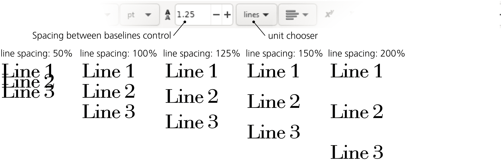

图 15-19：调整行间距

### 15.4.6 连字

一些字体除了单一字符外，还有*连字*——对于某些字符对（或三字符组、更多字符）的组合字形。默认情况下，Inkscape 使用字体中定义的连字。例如，Alef 字体有一个“fi”连字，如图 15-20 所示。

图 15-20：Inkscape 中的连字

然而，具有单一字形表示两个或更多字符会导致 Inkscape 在你用箭头键移动光标时出现异常：你仍然需要两次按键才能通过“fi”连字（因为它是两个字符），但由于 Inkscape 无法将光标放置在连字中，视觉上的光标在某次按键时不会移动。你需要在按下→之前想象一个“虚拟”光标位于“f”和“i”之间，但视觉光标不会移动。

这提供了一种去除不需要的连字的方法。当“虚拟”光标位于连字中时，按一次 Alt-←或 Alt-→。Inkscape 将插入一个字间距符号，从而打破连字。

要查看某种字体支持哪些类型的连字，请打开**文本与字体**对话框（Shift-Ctrl-T）。在所选字体的“特性”标签页中，你将看到某些连字类别旁有勾选标记：常用（包括“fi”，“fl”及其他一些），任选（如某些装饰性字体中的“sp”，“st”，“rt”等），历史（主要是带有老式“长 s”字母的连字），以及上下文（这些连字仅在某些特定情境下使用）。

### 15.4.7 特殊字符

有时，你可能需要输入一个键盘上没有的字符。在“Unicode 字符”对话框中（来自“文本”菜单），你可以查找并插入任何可用于 Inkscape 的字体中的 Unicode 字符。

*Unicode* 是一种全球标准，涵盖了所有现存的和大多数历史字母表，以及大量其他特殊字符。Unicode 字符的丰富性可以按 *脚本*（例如，通用、塞尔维亚字母或片假名）进行分类，并且可以更狭义地按 *范围*（例如，通用标点符号、塞尔维亚字母补充、或片假名音标扩展）进行细分。查找极为复杂的 Unicode 标准的最佳地点是 [`unicode.org/`](https://unicode.org/)。

如果你在 Unicode 字符对话框中将脚本和范围选择器设置为全部，窗口会显示所选字体中的所有字符（图 15-21）。双击你需要的字符，将其放入左下角的编辑框中，然后点击 **附加** 将其添加到当前文本对象中。

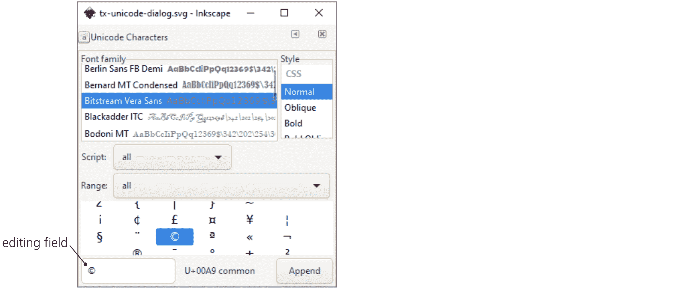

图 15-21：Unicode 字符对话框

在底部，Unicode 字符对话框会显示你在表格中选择的字符的十六进制 Unicode 编号（例如，版权符号字符的编号是 00A9）。如果你知道该编号，你可以直接插入该字符，而无需打开对话框。只需在编辑文本对象时按 Ctrl-U，输入编号（查看状态栏获取反馈），然后按 Enter。字符会被插入到文本光标处。

以下是一些常用的特殊字符：

| **名称** | **字符** | **十六进制编号** |
| --- | --- | --- |
| 长破折号 | — | 2014 |
| 短破折号 | – | 2013 |
| 左双引号 | “ | 201C |
| 右双引号 | ” | 201D |
| 左单引号 | ‘ | 2018 |
| 右单引号 | ’ | 2019 |
| 左双引号 | « | 00AB |
| 右双引号 | » | 00BB |
| 省略号 | … | 2026 |
| 乘号 | × | 00D7 |
| 版权符号 | © | 00A9 |
| 注册商标符号 | ® | 00AE |
| 商标符号 | ™ | 2122 |
| 圆点符号 | • | 2022 |

## 15.5 将文本转换为路径

对于 Inkscape 的所有文本编辑功能，有时你需要将文本转换为路径——例如，编辑单个字母的形状，使用文本裁剪某些内容（这需要路径），或者将 SVG 文档发送给没有你所使用字体的人。命令路径 **路径 ▶ 对象转路径**（Shift-Ctrl-C）会像在形状上操作一样作用于文本对象（13.1）。

然而，与形状不同，文本对象并非单一路径，而是一个*路径组*，每个路径代表原始文本中的一个字形（字符）。这使得 Inkscape 能够完全保留文本的外观，包括应用于文本中各个跨度的任何样式。现在，你可以通过在选择器中按住 Ctrl 点击或在节点工具中简单点击来选择任何单独的字母。如果你确实需要整个文本对象的单一路径，可以选择 **路径 ▶ 对象转路径**，然后使用 **路径 ▶ 合并**（Ctrl-K）将所有字符合并为一个具有统一样式的单一路径对象。

## 15.6 拼写检查

Inkscape 内置的拼写检查器可以同时使用最多三个词典。要设置它，请转到 **拼写检查** 页面，在 **首选项** 对话框中（图 15-22）。

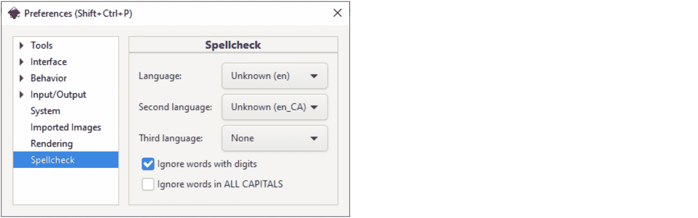

图 15-22：在首选项中设置 Inkscape 拼写检查器

例如，您可以将法语作为主要语言，但添加英语和俄语作为第二和第三语言。这样，您可以检查这三种语言中的任何一种或它们的混合拼写，只有在所有三种语言中都缺少的单词才会被标记为拼写错误。如果您只需要一种语言，请将第二和第三选项设置为 **无**。

许多语言有多个词典。例如，英语（en）有美国（en_US）、英国（en_GB）、加拿大（en_CA）和澳大利亚（en_AU）变体；英国变体还根据首选动词后缀（en_GB-ise 或 en_GB-ize）进一步分为子变体，等等。

一旦通过 Ctrl-Alt-K 调用拼写检查器（或通过文本 ▶ 检查拼写），它会依次检查文档中所有可见的文本对象（无需选择），从上到下，从左到右。当发现拼写错误的单词时，Inkscape 会在单词周围显示一个红框，并在对话框中列出建议，如图 15-23 所示。

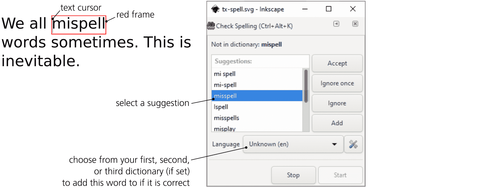

图 15-23：拼写检查文档

拼写错误的对象被选中；如果您正在使用文本工具，编辑光标将放置在拼写错误的单词的开头。接下来，您可以做以下操作：

+   选择列出的建议并 **接受** 它。

+   忽略一次：下次遇到这个词时，拼写检查器将再次标记它。

+   忽略这个词 *在本次会话的其余部分*：在此检查期间，任何其他出现的该词都会被忽略，但下次运行拼写检查器时，它会再次标记该词。

+   将该词添加到一个活动词典中，这样它将不会在本次或后续会话中被标记为拼写错误。

此外，由于对话框不会锁定 Inkscape 窗口，您可以像平常一样使用文本工具编辑该词。一旦将其编辑为可接受的内容，拼写检查器将自动关闭红框并继续检查文档。

您可以随时通过点击 **停止**（或直接关闭 **检查拼写** 对话框）来停止拼写检查。通过再次点击 **开始** 来重新启动已停止的检查。

## 15.7 文本扩展

在“扩展”▶“文本”中有许多扩展工具非常有用，用于处理文本。它们包括：

+   一组大小写转换扩展可以将选定的文本对象转换为大写、小写、句子首字母大写、标题大小写（每个单词的首字母大写）、反转大小写（将小写转为大写，反之亦然）或随机大小写。所有这些扩展仅在选定的对象上起作用。

+   一个简单的替换字体扩展可以在文档中搜索并替换特定字体，或者用一个单一的字体替换所有字体，或者仅列出文档中使用的字体。

+   拆分文本会将选中的文本对象拆分成行、单词或单个字符，并将它们作为独立的文本对象添加到文档中（不幸的是，它不会保留单词和字符的位置）。

## 15.8 创建字体

创建新字体并非面向普通用户。你需要掌握的大量术语令人望而却步。不过，拥有一个自己创作的原创字体，并可以在任何地方使用，确实是很有诱惑力的。最棒的是，你也可以在 Inkscape 中（大部分功能）完成这项工作！

Inkscape 的字体编辑功能基于 SVG 1.1，其中包括将自定义字体直接存储在 SVG 文档中的规定，并可以用于文本。不幸的是，SVG 2.0 中删除了这部分标准，因为它未能在浏览器中获得广泛支持。不过，Inkscape 仍然支持创建带有嵌入 SVG 字体的 SVG 1.1 文件，你可以使用开源字体编辑器 FontForge ([`fontforge.org/`](https://fontforge.org/)) 将这样的 SVG 文件转换为标准的字体格式，例如 OpenType。你可能不希望通过这种方式制作具备高级功能的商业字体，但对于一些简单的字体，例如模仿你手写字的字母字体，这是完全可行的。

我不会详细描述这个功能，因为字体创作的整个过程完全可以写成一本书。下面是一个高层次的概述，应该能帮助你入门。

你可以从任何空白文档开始，但有一个方便的排版画布模板（文件 ▶ 从模板新建），提供了一个 1024x1024 像素的正方形，并在定义拉丁字母的水平位置上添加了水平参考线：基线、小写字母的升部和降部，以及大写字母的高度。每个字母的形状都应在单独的图层中创建；每个字母必须是一个单独的路径。

然后，打开**文本 ▶ SVG 字体编辑器**对话框。点击**新建**按钮创建一个新字体。接着，转到**字形**标签，并通过点击**添加字形**开始添加字形；字形名称可以是描述性的（例如，“小写字母 a”），但匹配字符串必须包含此字形将使用的确切字符（也就是说，小写字母 *a* 的匹配字符串就是“a”）。在**高级**列中，输入该字符在字符串中的占位距离（即它的宽度加上一些默认间距）。

最后，你需要将已制作的字母形状路径复制到字体的字形中（图 15-24）。确保在画布上选择了路径，并在列表中选择了相应的字形，然后点击**从选择中获取曲线**按钮。以后，如果你在其图层中编辑了字形的形状，你需要重新进行这一步复制，以更新字体。要预览你的字形在一个字符串中的效果，可以在**预览文本**中输入一些内容，并在预览窗格中查看结果。你还可以通过进入对话框的字距调整选项卡，为特定字形对指定自动字距。

图 15-24：创建字体：在图层中绘制字符，然后在文档中创建新字体，并将每个路径复制到字形中。

当你的字形准备好后，保存 SVG 文件并在 FontForge 中打开以进行检查。如果看起来不错，可以通过 FontForge 中的**文件 ▶ 生成字体**将其保存为 OpenType 格式。然后，你可以将生成的.otf 文件安装到操作系统中，供任何程序使用。如果你需要更改字体的一些参数，通常可以在 FontForge 中进行修改；然而，如果你想在 Inkscape 中编辑字形，你需要返回原始 SVG 文件，编辑其层中的路径，并确保将每个更改后的字形路径复制到字体中（从选择中获取曲线）。
