# 第十六章：彩色插图

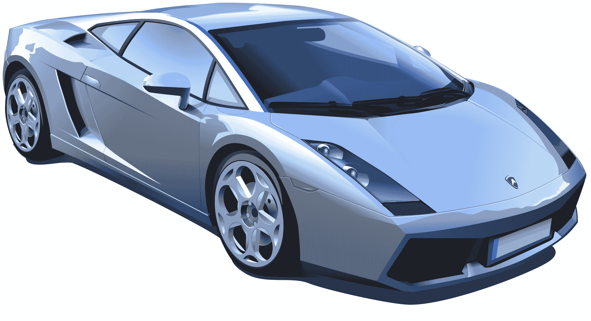

图 1：一个包含 280 个对象（主要是路径）的复杂矢量图示例（第 4 页）

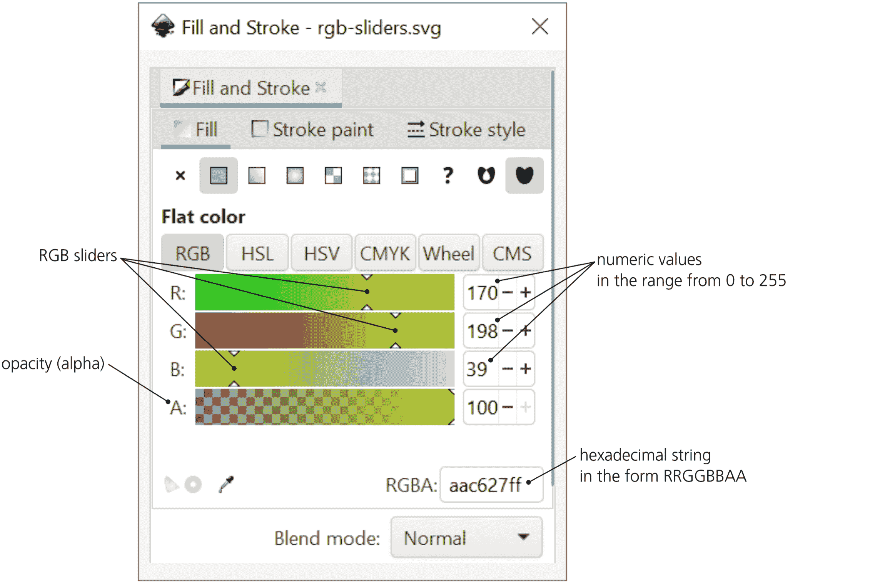

图 2：通过 RGB 滑块编辑填充和描边颜色（第 146 页）

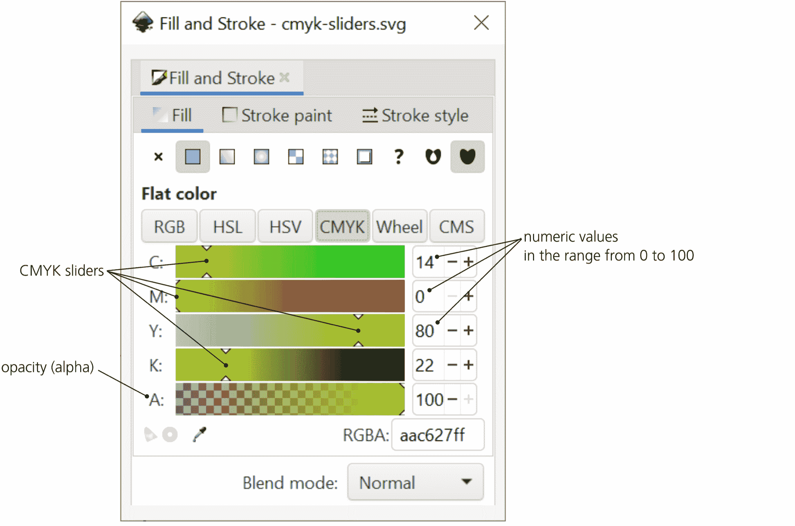

图 3：通过 CMYK 滑块编辑填充和描边颜色（第 146 页）

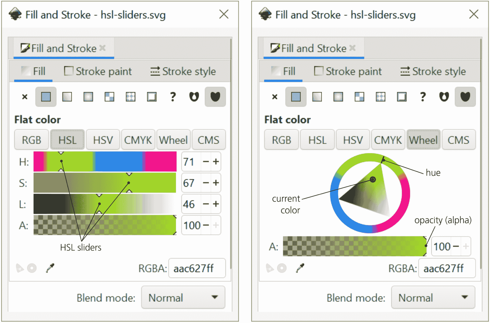

图 4：通过 HSL 滑块和颜色轮编辑填充和描边颜色（第 147 页）

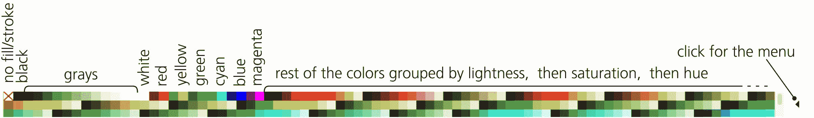

图 5：Inkscape 默认的颜色调色板位于窗口底部；此处显示了无需滚动即可查看所有颜色。您可以选择 Inkscape 附带的约 20 种调色板，或者创建自己的调色板（第 147 页）

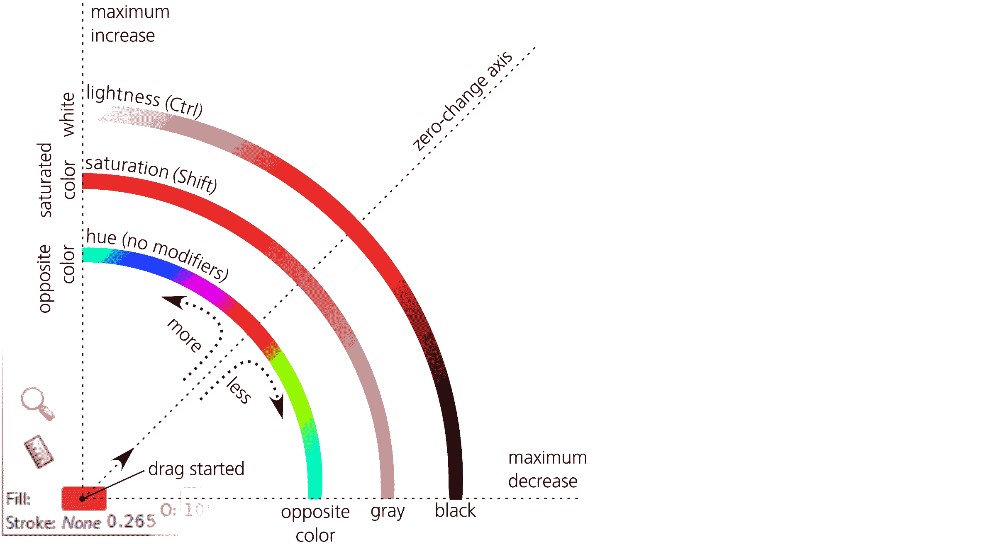

图 6：在 HSL 空间中使用颜色手势调整填充或描边颜色（第 151 页）

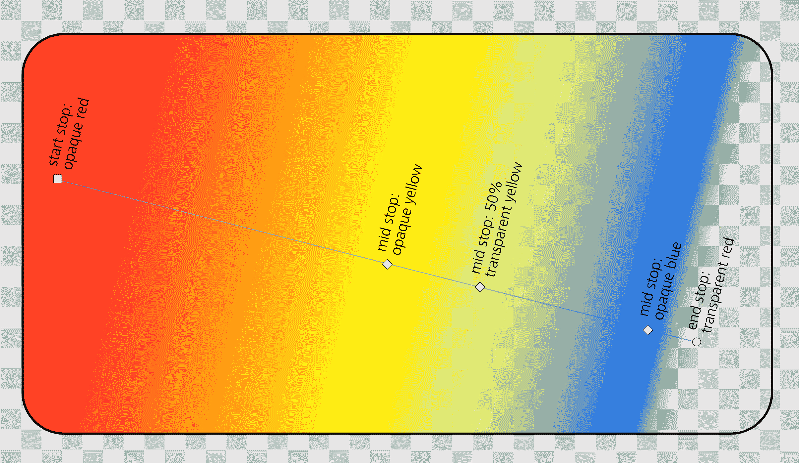

图 7：线性渐变中的中间停止点（第 184 页）

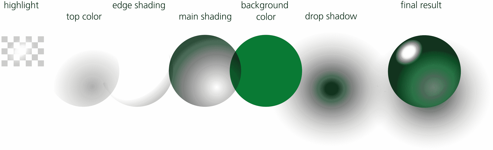

图 8：通过渐变创建半透明玻璃效果（第 187 页）

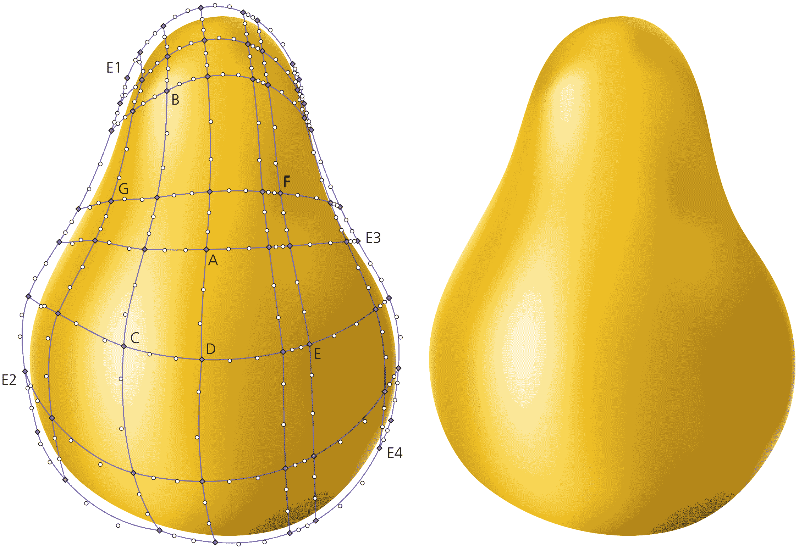

图 9：美味的梨（见正文中标记节点的注释）（第 194 页）

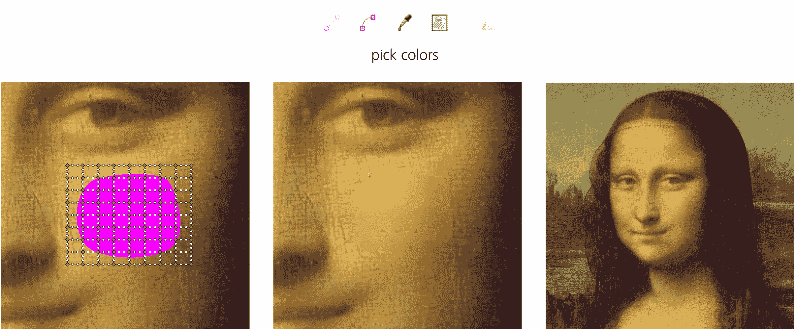

图 10：用渐变网格修复蒙娜丽莎（第 194 页）

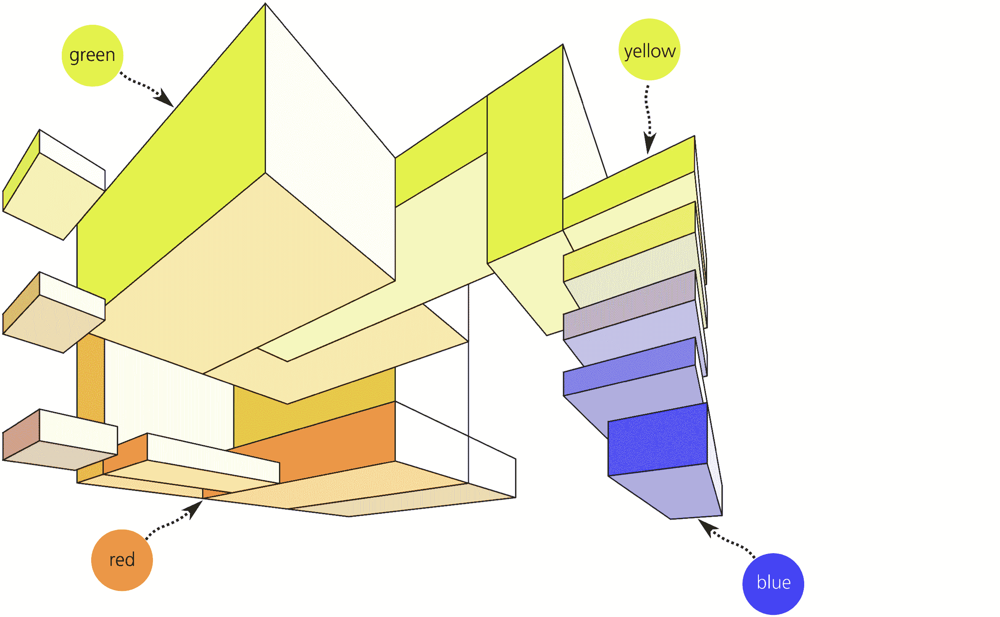

图 11：用 Tweak 工具的颜色绘制模式和宽画笔绘制的 3D 方块组成（第 212 页）

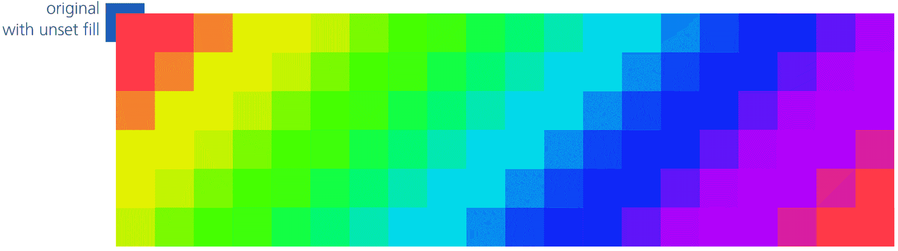

图 12：彩虹图案（第 349 页）

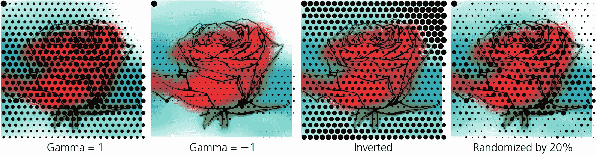

图 13：处理选定值，将亮度映射到大小（第 350 页）

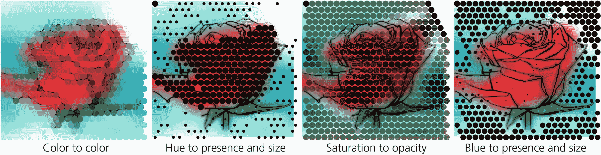

图 14：在描摹时应用所选并处理的值（第 350 页）

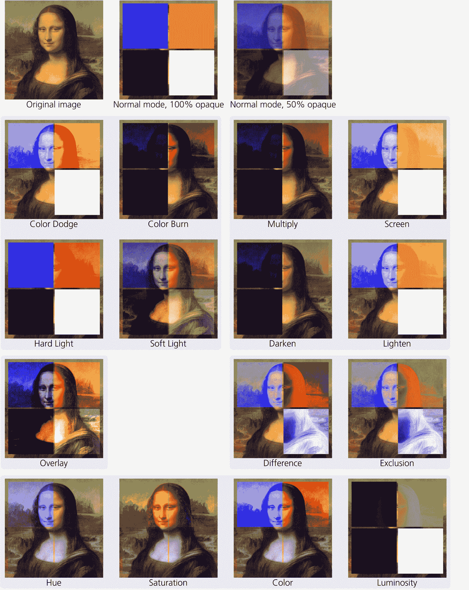

图 15：将混合模式应用于覆盖位图的彩色矩形。所有前景矩形的透明度为 100%，除非另有指示（第 357 页）

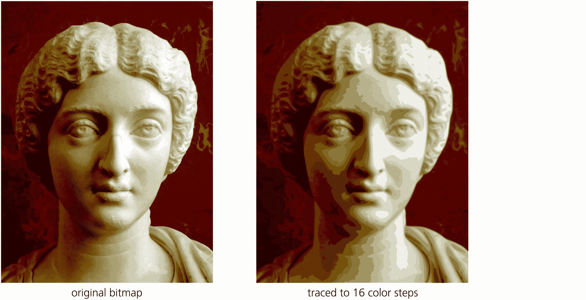

图 16：多次扫描描摹：12 种颜色（第 389 页）

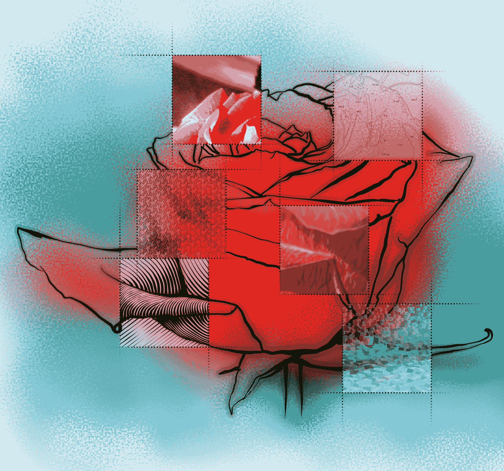

图 17：玫瑰（第 451 页）

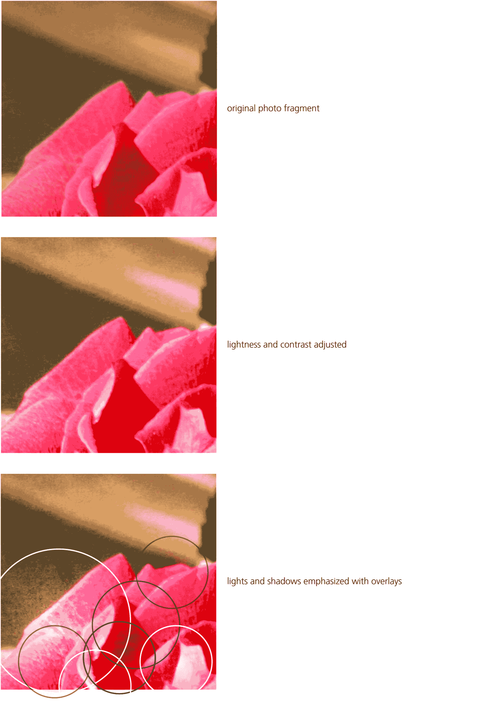

图 18：修饰过的照片处理（第 462 页）
