# 第十七章：克隆与符号

*克隆*的概念——一个与原始对象链接的副本，当原始对象变化时，克隆会自动更新——自然地源自于图形的矢量思维方式。从某种意义上说，克隆并不是一个真实的对象——而是一个命令：“在这里显示一个对象的副本。” 文档保存的是这个命令，而不是一个实际的对象。只有当 SVG 应用程序（如 Inkscape）显示文档时，实际对象才会在内存中创建，而不是命令。

使用克隆有艺术性和技术性的原因。仅仅编辑一个对象时，看着多个对象实时变化是一种令人兴奋的体验，激发了许多创意的可能性。另一方面，使用克隆代替复制可以让 SVG 文档更小、更快加载。地图符号、重复设计元素如项目符号或图标、各种对称设计或图案——所有这些都可以通过克隆自然实现。很少有其他矢量编辑器像 Inkscape 一样，能如此直接、轻松地创建实时链接的对象副本。

## 16.1 创建克隆

要克隆一个或多个对象，只需选择它们并按下 Alt-D（或**编辑 ▶ 克隆 ▶ 创建克隆**）。此操作的可见结果与复制（Ctrl-D）完全相同：会创建并放置在原始对象上方的（每个）选定对象的副本。如果你需要将多个对象整体克隆，可以将它们组合在一起并克隆该组。

克隆是一个*链接*的对象副本，如图 16-1 所示。这个链接的构成是什么？

最重要的是，克隆复制了原始对象的*内容*。如果它是路径的克隆（第十二章）或形状的克隆（第十一章），它会完全复制原始对象的形式，并且当你在节点工具或形状工具中编辑原始对象时，它会自动更新。如果它是文本对象的克隆，它会有相同的文本内容，并且当你用文本工具编辑原始对象时，它也会实时更新。最后，如果你克隆一个组，你可以进入该组（5.10）来添加、删除或编辑组内的对象——而组的克隆会立即更新。另一方面，由于克隆没有自己的内容，所以你不能编辑它的内容——只要它是克隆，就不能对其进行节点编辑、文本编辑或取消分组操作。

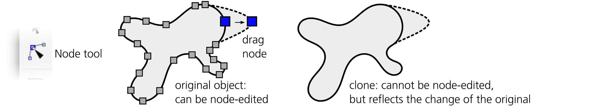

图 16-1：克隆是一个与对象链接的副本。

那么*变换*呢？如果你缩放、旋转或倾斜原始对象，所有它的克隆都会做同样的操作（图 16-2）。然而，如果你只是移动原始对象，默认情况下克隆*不会*移动（尽管这个行为可以改变，见下文）。当然，如果你同时选择*原始对象*和它的克隆，你可以一起对它们进行变换——移动、缩放、旋转或倾斜。

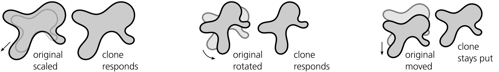

图 16-2：克隆会响应原始对象的变换，除了移动。

你还可以完全独立地移动、缩放、旋转或倾斜克隆。克隆自身的变换是在其继承自原始对象的变换*之上*应用的。例如，如果你将克隆在垂直方向上挤压，然后旋转原始对象，克隆将同时旋转并被挤压——但是，垂直挤压将应用于旋转后的形状*之后*，从而导致变形，如图 16-3 所示。

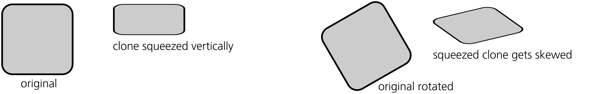

图 16-3：克隆的自身变换是在它继承自原始对象的变换*之上*应用的。

原始对象的*样式*也会传递给它的克隆。如果你为原始对象涂上不同的填充或描边颜色，所有的克隆将立即采用相同的颜色。相反，如果你试图改变克隆的颜色，它将拒绝改变，保持原始状态。（再次强调，这个规则也有例外，稍后你将看到。）

这张表总结了你可以和不能对克隆及其原始对象进行的各种操作，以及这些变动是如何相互影响的：

|  | **移动** | **缩放、旋转、倾斜** | **节点或形状编辑** | **样式** |
| --- | --- | --- | --- | --- |

| 应用到**原始对象** | *不*影响克隆

（默认） | 影响克隆 | 影响克隆 | 影响克隆 |

| 应用到**克隆** | 是可能的 | 在原始对象的变换上进行变换是可能的 | 是不可能的 | 是不可能的（除非在原始对象中取消设置） |
| --- | --- | --- | --- | --- |

## 16.2 变换克隆

正如你所看到的，克隆可以以任何方式进行变换，而这种变换会应用在它继承自原始对象的变换*之上*。你可以使用任何变换方法——用鼠标拖动、通过快捷键进行变换（6.5）、对齐、分布和捕捉等，这些方法对克隆的作用与对常规对象完全相同。

另一方面，原始对象的变换会根据其对克隆的影响，被分为两类：简单的移动和其他所有变换。对于“其他所有变换”（缩放、旋转和倾斜），这些变换会传递给所有克隆。而简单的移动则会被视为不同的操作。

默认情况下，Inkscape 尝试将克隆隔离，这样当原始对象被移动时，克隆会保持在原地。实际上，这是通过将克隆向相反方向移动来补偿原始对象的移动来实现的。这种方式非常直观，并且通常很方便；例如，你可以将一个由大量克隆组成的大型图案的原始对象移动而不打乱图案。你还可以同时选择原始对象及其克隆并将它们一起移动，它们会按预期行为表现——即，它们会并行移动，即使克隆本身有自己的变换。

用户可以修改这种补偿行为。偏好设置对话框的行为 ▶ 克隆页面（图 16-4）包含以下选项：

+   平行移动强制所有克隆体（包括那些已旋转或缩放的克隆体）始终与原始对象平行移动，仿佛它们始终与原始对象一起被选中（即使实际上并非如此）。

+   保持不动（这是默认设置）强制那些未被选中的克隆体保持不动（但已被选中的克隆体按正常方式移动）。

+   根据变换移动会关闭任何克隆体的移动补偿。此时，每个克隆体，无论是否被选中，都将根据其原始对象继承的变换进行移动，不进行任何补偿。当复杂的变换生效时，最终的行为可能会显得混乱——但从 SVG 的角度来看，这是最不干扰的选项，因为克隆体的继承变换并没有受到任何干扰。

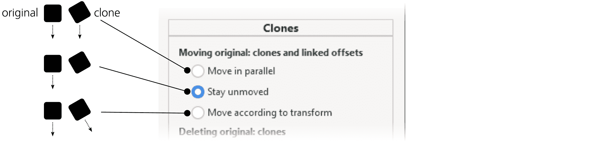

图 16-4：设置克隆体的移动补偿

此外，变换克隆体时不会尊重选择器控制栏上的影响按钮（6.11）：它总是表现得像所有这些按钮都已被按下。你不能以某种方式缩放克隆体，从而使其笔画宽度保持不变或渐变不受影响——因为你变换的实际上是原始对象的图像，而该图像无法与原始对象相比，拥有不同的笔画宽度或渐变位置。

## 16.3 克隆体的样式设置

我之前提到过，克隆体继承其原始对象的样式：一个红色矩形的克隆体将是红色的。然而，针对这一限制，有几个例外和解决方法。

首先，透明度（8.3）和模糊（17.1）不受此限制：你可以轻松地将克隆体模糊或使其半透明。这是因为这些属性是*累积的*——也就是说，如果你先模糊某个对象，再模糊它的父对象，这两个模糊效果会相加，最终效果会比单独的任何一个模糊效果更模糊。这也意味着，如果你的原始对象*已经*被模糊或具有小于 100%的透明度，你可以使它的克隆体变得*更加*模糊或*更加*透明，但不能变得不那么模糊或透明。

同样适用于滤镜效果（第十七章；实际上，模糊只是众多滤镜之一）。你可以对克隆体应用任何滤镜，它会叠加在原始对象的滤镜之上。例如，你可以通过应用颜色偏移滤镜将红色矩形的克隆体变为绿色或灰色。

但是，普通的填充或笔画颜色呢？你可以在克隆体中更改它们——但前提是原始对象配合。也就是说，你想在克隆体中更改的任何样式属性，必须在原始对象中*取消设置*。取消设置（8.2）与设置为`none`不同：一个属性被取消设置时，它只是*未被指定*，这使得克隆体的属性可以生效，如图 16-5 所示。

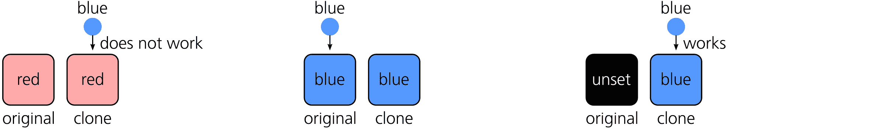

图 16-5：如果原始对象未设置油漆，克隆体可以被涂绘。

Inkscape 在填充和描边对话框中有一个特殊按钮，并且在选定的样式指示器中（8.6）也有一个命令，用于取消对象的填充或描边属性。取消描边的对象只是没有可见的描边，但如果取消其填充，它会显示为黑色。如果你想取消其他样式属性，请使用**选择器和 CSS**对话框（8.1）来移除你希望覆盖的克隆属性。

如果原始对象是一个组，你可以仅在该组中的某些成员中取消填充或描边，其他成员保持有色。然后，如果你克隆该组并对克隆进行着色，只有那些取消属性的对象会呈现该颜色，而其他对象将保持原样。

## 16.4 链接克隆

复制（4.5）或复制并粘贴一个克隆，会得到另一个*相同原始对象*的克隆。（你可以复制并将克隆粘贴到另一个文档中，但必须连同其原始对象一起粘贴；如果你只尝试粘贴一个克隆，它将变成*孤立*并不可见。）复制一个现有克隆通常很方便，因为这个副本也会获得第一个克隆的变换和样式（如果有的话）。当然，你也可以通过再次克隆原始对象来获得另一个克隆。

没有什么能阻止你克隆一个克隆对象本身。结果对象——一个*克隆的克隆*——仍然会显示其最终原始对象的内容，但与原始对象的链接不再是直接的：它现在是原始对象的孙代克隆，而不是子代克隆。这样的孙代克隆首先会继承原始对象的变换和样式，然后继承其父克隆的变换和样式，最后再在其上应用自己的变换和样式。这样的克隆链（可以有任意长度）很少有用；几乎所有情况下，都可以使用同一原始对象的多个克隆，如图 16-6 所示。

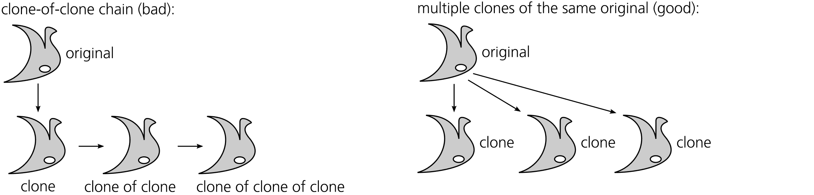

图 16-6：使用同一对象的多个克隆，而不是克隆的克隆。

要判断你选择的对象是否是克隆对象——如果是，它是哪个对象的克隆——请查看状态栏。它会描述你选择的对象，例如，克隆自：组或克隆自：克隆自：路径。如果你想知道哪个对象是选定克隆的父对象，请按 Shift-D：Inkscape 会从克隆绘制一条虚线到其原始对象（那条线会在一秒钟后消失），并选中原始对象，如图 16-7 所示。

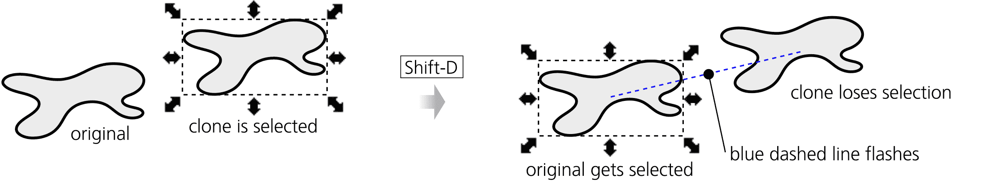

图 16-7：按 Shift-D 查找克隆的原始对象。

## 16.5 取消链接和重新链接克隆

克隆与原始对象之间的实时链接是其主要特性——毕竟，这就是我们使用克隆的原因。这个链接在复杂设计中方便了很多任务；例如，你可以在网站模型中使用克隆来做相同的按钮或项目符号，然后通过更改它们的共同原始对象一次性更改所有这些元素。然而，有时这个链接会成为障碍。如果你想独立编辑一个克隆，你需要*取消链接*该克隆。

选择一个克隆（或克隆的克隆）并按 Shift-Alt-D（或选择**编辑 ▶ 克隆 ▶ 取消链接克隆**）。从视觉上看，没什么变化，但该对象不再是克隆——它现在是原始对象的副本，所有附加的变换和样式都被保留，但现在独立且完全可编辑。你可以一次取消多个克隆的链接。

如果你删除了克隆的原始对象，会发生什么？默认情况下，它的克隆会自动取消链接——也就是变成被删除对象的副本。然而，你可以在首选项对话框的同一行为 ▶ 克隆页面中，强制克隆在其原始对象删除时也消失（图 16-8）。

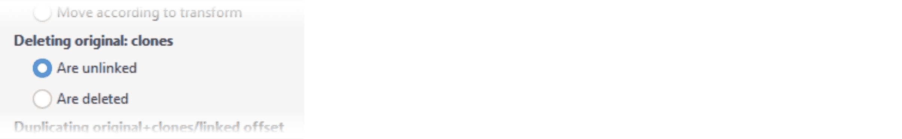

图 16-8：当原始对象被删除时设置克隆的行为

当你*重新链接*一个克隆时，它仍然是克隆，但其原始对象会发生变化。操作步骤如下。假设你有一个对象 A 的克隆 C，但你希望它成为对象 B 的克隆。选择 B 并将其复制到剪贴板（Ctrl-C），然后选择克隆 C 并点击**编辑 ▶ 克隆 ▶ 重新链接到已复制的**。之后，C 将成为 B 的克隆——根据 B 的内容，C 可能会改变形状、样式、位置、变换，或者这些的组合，如图 16-9 所示。

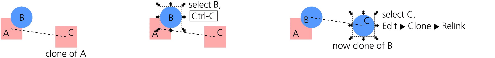

图 16-9：将克隆重新链接到不同的原始对象

手动重新链接是一个很少需要的操作。更有用的是*在复制时自动重新链接*。假设你有一个复杂的对象小组，其中一些是其他对象的克隆——例如，一个 3D 风格的图形按钮，其中阴影是主形状的模糊克隆。现在，假设你选择了整个小组并进行复制。会发生什么？

在该小组内，每个常规对象会复制为常规对象，每个克隆会复制为克隆。然而，克隆仍会与源组中的原始对象保持连接——这很可能不是你想要的！更自然的方式是，在复制的小组中，阴影应该是*在同一小组中的*形状的克隆，而不是远离的其他小组的克隆。为了确保这一点，在同一**行为 ▶ 克隆**页面中，勾选**复制原始对象+克隆/链接偏移：重新链接复制的克隆**。现在，复制之后，你将拥有两个独立的按钮，每个按钮都有自己可编辑的形状，并且阴影与该形状相关联（图 16-10）。

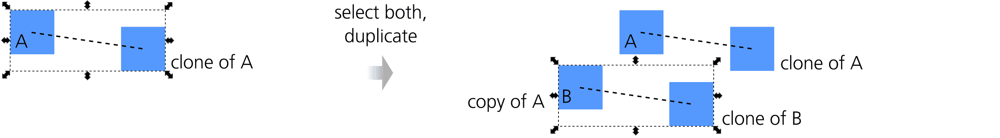

图 16-10：在复制时自动重新链接克隆

## 16.6 克隆的平铺

强大的“创建铺设克隆”对话框（编辑 ▶ 克隆 ▶ 创建铺设克隆）是一个一次性创建多个克隆的工具，可以将克隆排列成各种空间和颜色模式，从完全规则到完全随机都有。作为附加功能，你还可以让克隆的图案追踪下面的图像。

### 16.6.1 图案大小与边界框

第一步是选择你要克隆的对象。我建议使用一个组合体；即使你只有一个对象，也可以将其组合起来（Ctrl-G）。这样，你稍后可以向原始组合中添加更多对象，克隆将会反映出这些变化。将原始对象放置在你希望填充图案的区域的左上角。

在**创建铺设克隆**对话框中，首先指定铺设的大小（图 16-11）。你可以指定图案中的行数和列数；或者，如果你有一个特定的区域要填充，你可以输入或粘贴该区域的宽度和高度。请注意，图案太大（克隆数量超过几千个）可能会显著降低 Inkscape 的性能。

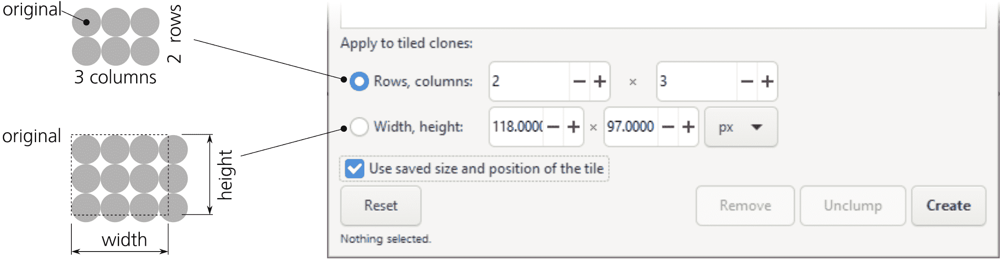

图 16-11：设置图案的大小

一旦你设置了下面所描述的所有其他参数（或者直接信任默认设置），点击**创建**按钮。图案会出现在画布上，但你仍然选中原始对象。删除按钮会删除任何先前已铺设的克隆对象。请注意，创建操作会首先执行删除操作——也就是说，当你点击创建时，任何现有的铺设克隆（但不包括通过 Alt-D 创建的常规克隆）都会被删除，并由新的图案替换。

“取消聚集”按钮的功能与对齐和分布对话框中的同名按钮完全相同（7.5.2），不同之处在于，它会移动选定对象的所有铺设克隆，而不是所有选定对象，如图 16-12 所示。取消聚集特别适用于使随机化图案更均匀，而不会使其变得规则化。“重置”按钮会将所有对话框参数恢复为默认值。

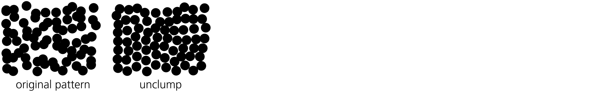

图 16-12：取消聚集一个随机化图案

“使用已保存的图案大小和位置”复选框在第一次创建图案时没有效果。然而，如果你修改了要铺设的对象并重新创建图案，通常 Inkscape 会使用修改后的对象大小，这可能导致图案的整体大小和瓷砖的对齐发生变化。为了让 Inkscape 即使在对象大小发生变化时，也使用上次创建图案时的相同瓷砖大小，可以勾选此复选框。例如，你可以从一个矩形创建一个图案，微调所有参数，然后放大原始矩形并重新创建图案，同时勾选此复选框。这会给你和上次完全相同的图案，但瓷砖会更大并互相重叠。

所有拼贴图案都包括一个精确（除非随机化）覆盖原始物体的克隆。这意味着如果你丢失了原始选择，只需点击原始位置将选择覆盖的克隆，而不是原始物体。使用 Alt-click（5.9）或选择任何克隆并按 Shift-D 跳转到原始物体。

### 16.6.2 对称性

对话框中的第一个标签标题为对称性。它包含一个*对称性组*列表，从中选择一个用于你的图案。每个对称性组是将克隆转换为图案的特定方式。这些组的数量恰好是 17，因为已经证明任何平面上的规则图案都可以分类为这 17 种类型；详细信息和示例请参阅 Wikipedia 上的“墙纸群”文章。以下是对称性类型的简要概述：

**P1**

这是最简单的对称性：图案瓷砖仅仅在矩形网格中重复，而没有任何旋转或翻转（图 16-13）。

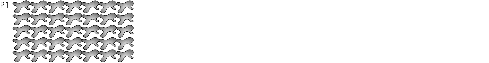

图 16-13：基本对称性：P1

P2、PM、PG、CM、PMM、PMG、PGG 和 CMM

这些对称性使用 180 度旋转以及垂直和水平翻转的各种组合（图 16-14）。然而，所有这些对称性都使用与 P1 相同的矩形网格布局，其中每个网格单元的宽度和高度与原始物体相同。

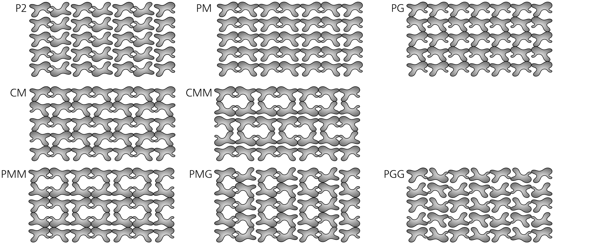

图 16-14：带有翻转和 180 度旋转的对称性

P4、P4M 和 P4G

这些对称性涉及 90 度旋转，因此产生基于正方形的图案。P4M 对称性导致矩形瓷砖的部分重叠；通过它，你可以使用三角形瓷砖避免重叠并填充平面，如 图 16-15 所示。

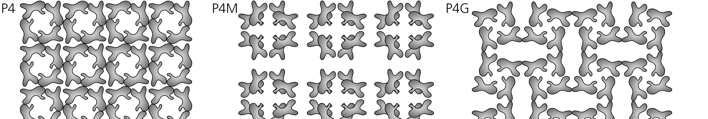

图 16-15：带有 90 度旋转的对称性

P3、P31M 和 P3M1

这些对称性涉及 120 度旋转，因此呈现出大致三角形的外观（图 16-16）。同样，P31M 创建了更密集的图案，瓷砖部分重叠，因此你可以使用“派切”形状来填充平面，避免重叠。

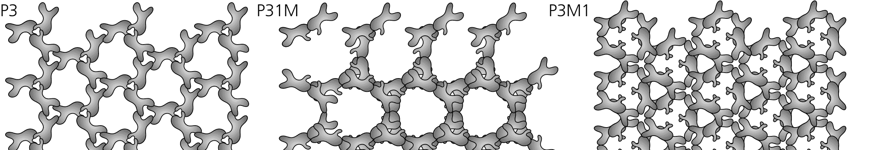

图 16-16：带有 120 度旋转的对称性

P6 和 P6M

这些对称性将瓷砖旋转 60 度，形成类似雪花的六角形图案（图 16-17）。其中，P6M 再次重叠瓷砖，需要使用“派切”形状填充平面而不产生重叠。

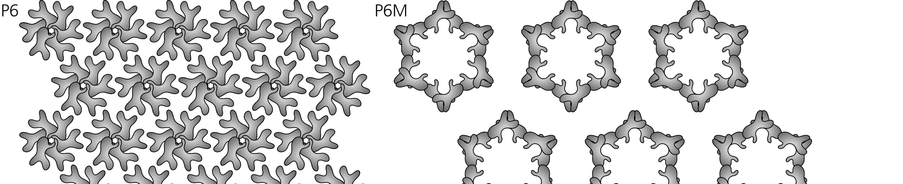

图 16-17：带有 60 度旋转的对称性

对于重叠瓷砖的“密集”图案（P4M、P31M、P6M），尝试创建图案后缩小原图。这将使图案更加稀疏，并且其特征逻辑会更容易理解。

在处理*镶嵌图案*（一种在没有间隙或重叠的情况下完全填充平面的图案）时，即使你理解所选择的对称方式，单独创建所需的图块形状也会非常困难。相反，你可以从任何随机形状开始，使用所需的对称性来创建图案，然后对原始路径进行节点编辑，观察图案的克隆如何重复其变化。通过这种方式，你可以轻松地制作出一个令人惊讶的复杂镶嵌图案（请参阅 25.2 了解示例）。

### 16.6.3 平移、缩放和旋转

对话框中的接下来的三个标签允许你指定要应用于图案平铺的*附加*变换——即在选择的对称群体所创建的平移、旋转和翻转之上的变换（图 16-18）。

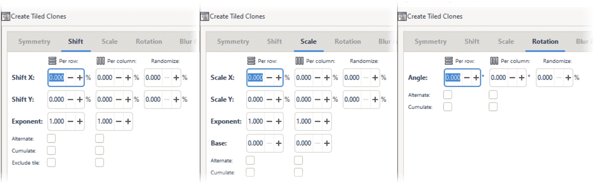

图 16-18：平移、缩放和旋转标签

你可以为每行和每列单独指定所有这些附加变换组件，并且每个值可以包括一定程度的随机性。你可以指定，例如，“使每行的图块高度增加 20%，使每列的图块旋转 5 度，并使旋转角度随机变化 10%。”所有平移、缩放和随机化的值都以原始物体的尺寸百分比来衡量。

图 16-19 展示了平移的应用方式。

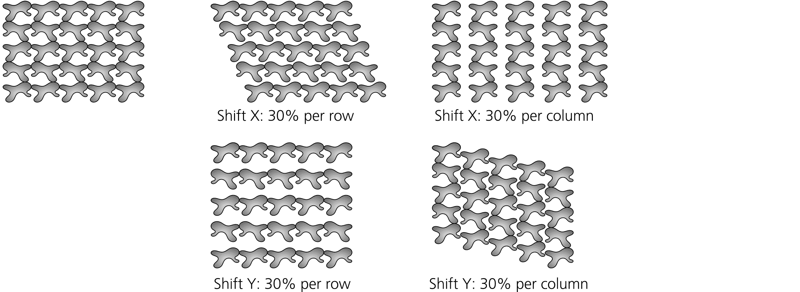

图 16-19：为每行和每列指定平移（PG 对称性）

负向平移也是可能的。当然，为了让所有克隆重叠到原始图形上，你需要为每列指定**平移 X:** –100%和**平移 Y:** –100%。如果将其与每行的旋转结合使用，就容易制作出花朵或时钟面盘，如图 16-20 所示。

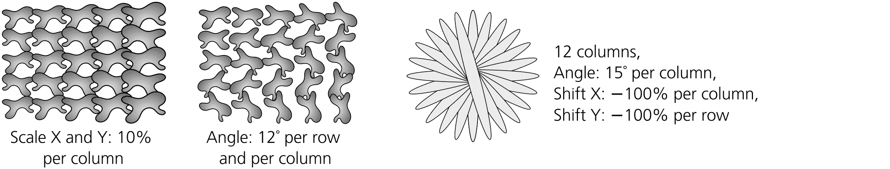

图 16-20：为每行和每列指定缩放和旋转

如图 16-21 所示，你可以使值交替变化（例如，每隔一行缩放克隆）。Cumulate 复选框会强制平移或缩放值累积。例如，通常每列的平移 10 像素意味着每列相对于前一列平移 10 像素；如果你选中 Cumulate，则相同的值会使每一列比其前一列平移 10 像素——即第二列与第一列相距 10 像素，第三列与第二列相距 20 像素，依此类推。

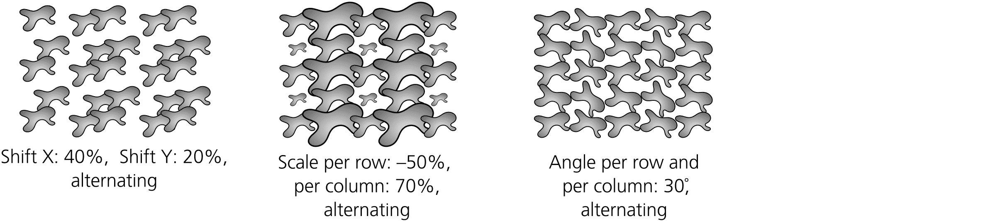

图 16-21：交替变换

在计算复杂对称图形的变换值时，什么被认为是“行”和“列”？Inkscape 通过对称的克隆簇（3、4、6 或 12 个克隆，取决于对称性）绘制复杂图案，横向地从一个簇到下一个簇。换句话说，属于同一个簇的克隆被视为在同一行中，但位于不同列中。这意味着，按行值会改变簇的行数，或者在每个簇中均匀缩放克隆，而按列值则会独立影响每个克隆——结果是簇失去了其对称性，正如图 16-22 所示。

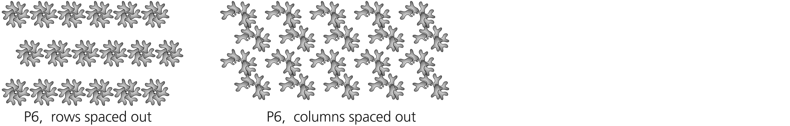

图 16-22：变换复杂对称性

如果你想在两个维度上间隔对称簇，只需创建一个包含所选对称性的单一簇，将其分组，并使用简单的 P1 对称性平铺该组，可能会进行交替偏移。

### 16.6.4 模糊度和不透明度

这个对话框标签看起来和功能非常类似于变换标签；在这里，你可以按行或按列调整图案中克隆的模糊度和不透明度，并可选择进行交替或随机化（见图 16-23）。记住，你只能使克隆的模糊度或不透明度比原始图形更多，而不能更少。

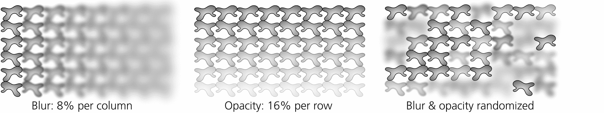

图 16-23：在图案中变化模糊度和不透明度

### 16.6.5 颜色

如你在 16.3 中所见，如果你想用克隆的自身颜色进行绘制，必须先取消原始图形中对应的属性。一旦你为要更改的绘制部分（填充、描边或两者）完成了此操作，创建平铺克隆对话框将允许你创建各种颜色模式。

对话框的颜色标签看起来与之前看到的标签相似（见图 16-24）。在这里，你可以在 HSL 模型中按行或按列变化克隆颜色的三个组成部分——色调、饱和度和明度（见 8.4.3），并且可以交替或随机化这些变化。你还需要指定所有这些变化将从哪个初始颜色开始；只需点击颜色样本并使用颜色选择器对话框即可。记住，原始图形必须取消填充或描边，否则此标签将不起作用！

图 16-24：为颜色标签设置初始颜色

例如，通过从红色开始，并且每行和每列将色调变化 5%，你将得到一个倾斜的彩虹（见颜色插图中的图 12）。

### 16.6.6 跟踪

创建平铺克隆对话框的最后一个标签（见图 16-25）是不同的。在这里，你可以使图案*跟踪*它所构建之上的任何图像——也就是说，使每个克隆的某些方面取决于其下方的内容。你正在跟踪的背景图像可以是导入的位图（如照片）或任何矢量图形；跟踪器选择值时，选择什么样式无关紧要。

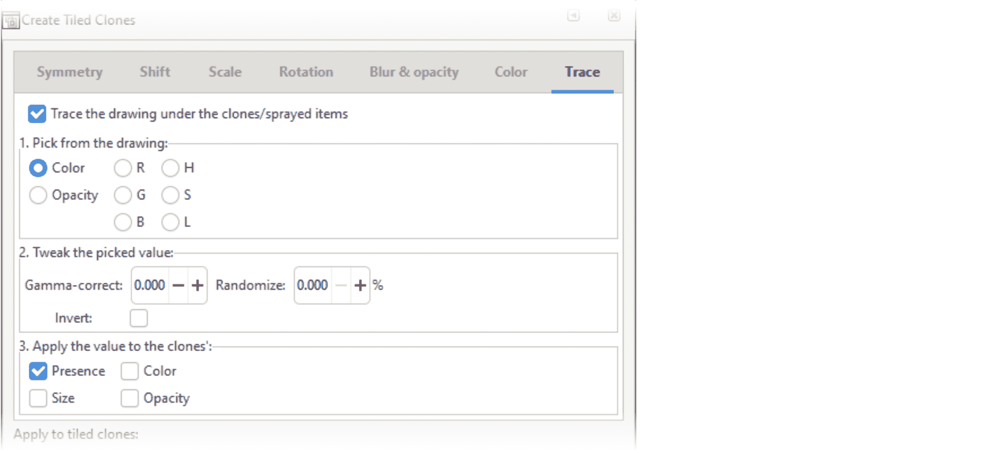

图 16-25：追踪标签

该标签包含三个主要区域，分别对应追踪算法的三个主要步骤。首先，在每个克隆的当前位置选择一个值；其次，对该值进行一些可选处理；最后，将结果应用到克隆的某个方面。通过勾选**在瓷砖下追踪图形**复选框来启用该标签的控制。

对于输入值，您可以选择颜色、透明度或 RGB 或 HSL 模型中任何单一组件的值。为每个克隆所选的值将在克隆的边界框将要覆盖的整个矩形区域内平均。所有这些选项都会产生一个范围从 0 到 1 的单一数值，除了颜色，它会选择颜色的三个组件作为复合值。

处理该值的可能方式包括：

伽马校正

正伽马会将所选值向上移动；负伽马则会将其向下移动。

按给定百分比进行随机化

该值将具有给定大小的随机成分：0%的随机化意味着值与所选值完全相同，100%的随机化意味着它是完全随机的，完全不依赖于所选值。

反转

将高值转为低值，反之亦然。

如果选择了颜色，则该处理将独立应用于每个组件（参见颜色插图中的图 13）。

最终，所得的值可以应用于克隆的存在概率（0 表示克隆在该位置不存在，1 表示存在，介于两者之间的值使其以给定的概率出现）；颜色（如果选择了背景色，则可以直接重用，否则将单一值转换为灰度色）；大小（从 0 时的消失到 1 时的完全大小）；或透明度（较小的值使克隆更加透明）。您可以同时启用多个选项；例如，您可以选择亮度，反转它，并将其同时应用于克隆的透明度和大小（参见颜色插图中的图 14）。

## 16.7 符号对话框

您可以将*符号*看作是组织在库中的克隆，用于重复使用。Inkscape 的对象▶符号对话框（Shift-Ctrl-Y）让您可以访问 Inkscape 自带的多个常见图形符号集。您还可以使用它来创建和管理您自己的自定义符号集合。

Inkscape 的预打包符号集应该能让您了解哪些类型的对象适合组织成库：

AIGA（美国平面艺术协会）

城市标识，主要用于机场：到达、海关、美发店——非常容易识别，也非常具有 1970 年代的风格。

美国国家公园服务地图符号

营地、导游小道、邮局——在风格上与 AIGA 符号相似。

流程图形状

流程图中的常规模块，如存储、提取、合并、显示等。

逻辑图符号

与门、或门、非门及其相关符号。

文字气泡

用于漫画中的各种形状的文字气泡。

要在文档中插入符号，只需将其从对话框拖动到画布上。你得到的对象表现得像是某个对象的克隆，但状态栏描述为*符号*；然而，如果你想编辑这个对象，你可以像编辑克隆一样执行编辑▶克隆▶取消链接克隆操作。（如果你只想移动、缩放或旋转符号，则无需取消链接它。）

符号对话框中的搜索字段允许你根据符号描述中的某个词语或短语来查找符号。搜索将在当前选中的符号集内进行，或者如果你选择符号集：所有符号集，将在所有符号集中进行。

如果你将对话框切换到当前文档（图 16-26），你会看到它已经包含了你从标准库中添加的所有符号（如果有的话）。在这里，你还可以将自己的对象添加为符号：选择一个对象并点击左下角的**添加符号**按钮。一旦新符号添加到列表中，原始对象可以被删除并用符号的副本替换。你的新符号将以你创建时的相同大小和样式插入。

要从文档中删除一个符号，选择列表中的符号并使用**删除符号**按钮；之后，符号的实际副本将被放置在画布上，所有该符号的实例将被转换为该可见对象的克隆。

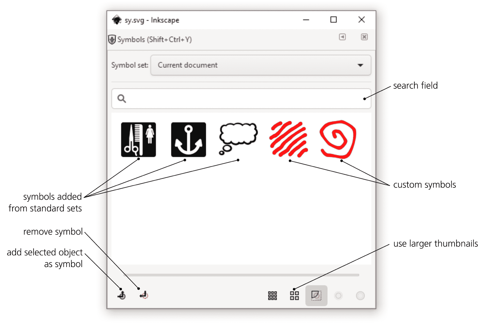

图 16-26：符号对话框管理当前文档中的符号

如果你想在文档之间共享自定义符号库，你需要做的就是将包含符号的 SVG 文档放入 Inkscape 的符号文件夹中（进入**首选项**、**系统**页面，并点击**打开**，位于**用户符号**旁边）。之后，你的符号集将出现在符号集列表中（以你的 SVG 文件名命名）。
