# 第十八章：滤镜

Inkscape 滤镜是一种将复杂的位图处理算法应用于绘图对象的方式。忠实于矢量精神，滤镜是非破坏性的：你可以随时更改任何滤镜的参数，且原始的矢量对象仍然可以完全编辑。滤镜的应用示例包括模糊、锐化、色彩调整、添加纹理、各种失真、类似 3D 的效果（如斜角）等。此外，你还可以将多个滤镜组合成任意复杂的*滤镜堆栈*。

SVG 滤镜（如 SVG 标准定义并由 Inkscape 实现）非常强大；关于它们的使用和功能，可以写一本书。不幸的是，它们也可能相当技术性，尤其是当你尝试自己组合滤镜堆栈时。在本章中，我首先介绍一些简单的滤镜使用方法，如模糊（17.1）和混合模式（17.2）。然后，我更一般性地描述如何管理对象上的滤镜（17.3），并概述 Inkscape 附带的预设滤镜库（17.4）。最后，对于那些需要更多功能并且不怕更技术性内容的用户，我会介绍滤镜编辑器对话框（17.5），在这里你可以从标准滤镜原语创建自己的滤镜堆栈。

## 17.1 模糊

正确地说，*高斯模糊*（以德国数学家卡尔·弗里德里希·高斯命名）是一种平滑地溶解物体的效果，就像你通过失焦镜头观看它一样。这是 Inkscape 支持的 14 种滤镜原语之一，但在所有这些原语中，模糊是最容易访问的。对于任何选定的对象，你可以通过填充和描边对话框底部的滑块来应用模糊，如图 17-1 所示。

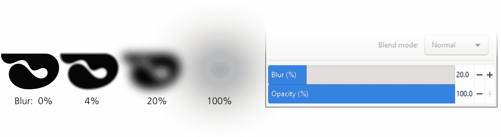

图 17-1：填充和描边对话框中的模糊滑块

在图层对话框中可以找到相同的配对透明度和模糊滑块（4.9.4），它们作用于整个选定的图层。

简单的模糊极大地扩展了 Inkscape 的功能。模糊在物理世界中无处不在——不清晰的阴影、光晕或任何失焦或运动中的物体——因此在绘制任何现实主义作品时它都是必不可少的。它也不是你能轻易通过常规矢量形状或渐变来模仿的。因此，Inkscape 将模糊视为物体的基本属性，类似于透明度和混合模式（17.2）。

模糊滑块控制从 0 到 100 百分比范围内的*模糊量*；1%的模糊几乎不会改变物体的外观，而 100%的模糊会将任何物体变成没有形状的云雾。从技术上讲，100%的模糊使模糊半径等于物体大小的一半，但比例并不均匀：从 0 到 10%的模糊半径增加比从 90 到 100%的增加要小得多，因为在比例较低的部分你需要更精细的控制。

将模糊设置为百分比可以确保它对任何大小的物体都能产生相同的效果：一个被模糊 10%的大物体，其*绝对*模糊量（模糊半径）较大，但看起来与一个同样被模糊 10%的小物体成比例。如果你希望在不同大小的物体上得到相同的模糊半径，你需要使用不同的模糊百分比，正如图 17-2 所示。

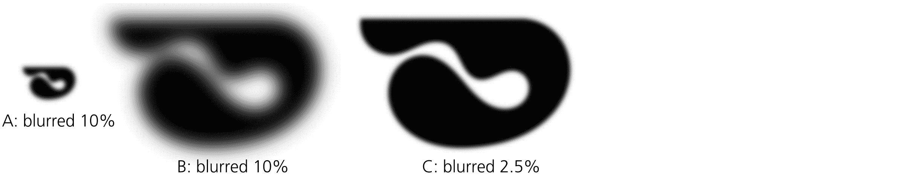

图 17-2：模糊量（A 和 B 中相同）与模糊半径（A 和 C 中相同）

对物体进行模糊会扩大其边界框，但仅在使用视觉边界框类型时才会发生这种情况（这是默认设置，4.3）。例如，如果你想导出一个模糊物体而不裁剪模糊效果，你不能使用物体的几何边界框作为导出区域（18.6）。

你可以把每个模糊物体看作处于自己独立的完全透明的图层中，因此它永远不会“拖动”任何相邻的未模糊物体。由于该每个物体的图层是透明的，模糊物体的边缘变得部分透明。然而，你可以模糊一个组合，在这种情况下，组合中的成员会一起被模糊，仿佛它们被放置在一个单一的图层中作为整体进行模糊。

在图 17-3 中，左侧是两个相邻的矩形，它们之间没有间隙且没有模糊。在中间，每个矩形分别被模糊了 20%；正如你所看到的，条纹背景透过物体间的模糊间隙显现出来。然而，在右侧，相同的矩形被组合在一起，然后整个组合被模糊了 20%；现在没有间隙——模糊只在边缘增加了透明度，但无法揭示遮挡在不透明组合中心的部分。

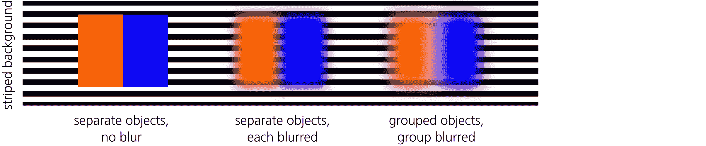

图 17-3：模糊单独物体与模糊组合物体的对比

组合还允许你对同一物体应用多个模糊层。例如，你可以先对物体本身进行模糊，然后将它组合起来（甚至可能与自身组合，形成一个由单一物体组成的组合），再对该组合进行模糊。自然地，通过模糊组合，你可以使物体看起来比之前*更*模糊，但不能*更少*模糊。（同样，正如你在 16.3 中看到的，你可以使克隆比原始物体模糊得更多，但不会更少。）

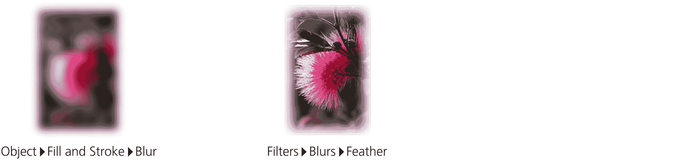

图 17-4：模糊与羽化的对比

### 17.1.1 模糊与变换

当你对一个模糊的物体进行变换时，会发生什么？

移动一个模糊的对象时，整个对象会一起移动，不会影响模糊效果。比例（均匀）缩放同样会整体缩放对象，包括模糊半径，因此模糊百分比（在填充和描边对话框中）不会改变。

非均匀缩放更有趣。例如，如果你将一个模糊的对象在垂直方向上压缩，它的模糊效果也会随之压缩，并变得*不均匀*——此时，对象在水平方向上的模糊程度大于垂直方向。这样的非均匀模糊可以近似现实世界中的*运动模糊*——即物体在快速运动下拍摄的照片效果（在本例中是水平运动）。因此，如果你想对一个没有压缩的对象应用非均匀模糊，可以先将它在相反方向上拉伸，模糊它，然后再将其压缩回原形（此方法仅适用于路径和位图），如图 17-5 所示。

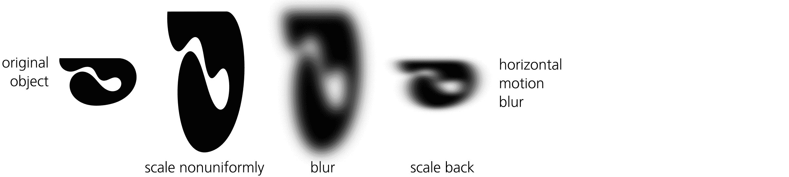

图 17-5：运动模糊，逐步实现

你也可以通过在“滤镜 ▶ 模糊 ▶ 模糊...”可调滤镜对话框中设置不同的水平和垂直模糊值来创建非均匀运动模糊，但这里描述的拉伸/压缩方法通常更为简单。

要在一个组或文本对象上创建运动模糊（即不是路径或位图），请使用这个技巧。拉伸该对象，然后将其与自身分组（Ctrl-G，4.8），对该组应用模糊效果，再将其压缩回原形。分组步骤确保最终得到的对象具有正确的比例，同时压缩的`transform`属性也会影响模糊效果。

许多其他滤镜在变换时的行为也适用类似的说明。例如，压缩和/或旋转对象可以创建纹理滤镜的透视失真变体（17.4），并应用于 3D 场景中的墙壁和地板（第二十二章）。当然，通过拉伸和压缩对象来变换滤镜不如在画布上拖动手柄那样方便，但它是可行的。

### 17.1.2 模糊调整

调整工具的模糊模式会使选中的对象在画笔下的模糊程度增加（默认）或减少（按住 Shift 键时）。模糊的量取决于力度、笔压（如果你使用的是平板笔）、对象与画笔中心的距离以及你施加画笔的时间长度。

## 17.2 混合模式 [1.1]

选择混合模式会影响对象颜色与其下方背景对象颜色的*混合*（混合）方式。像模糊一样，混合模式可以在“图层”和“填充和描边”对话框中轻松访问——你可以在这些地方分别为图层和单个对象更改混合模式。

总共有 16 种混合模式，其中包括默认情况下所有对象都具有的 Normal 模式。每种混合模式基本上是一个公式，计算堆叠在一起的两个或多个对象中每一点的可见颜色。在默认的 Normal 模式中，只有在前景对象的不透明度低于 100% 时，背景对象的颜色才会被考虑进去。然而，在所有其他模式中，即使前景完全不透明，背景也可能以某种方式透过（具体取决于模式和顶部对象的颜色）。

你可能已经熟悉了位图图形编辑器中混合模式的工作方式，比如 GIMP 或 Adobe Photoshop，它们让你可以改变每一层绘图如何与下方的层叠合。在 Inkscape 中，混合模式也经常用于调整导入的位图外观，使用不同的模式和有色“镜头”，以此方式它们变得不可或缺——你无法通过普通模式的有色透明效果达到同样的效果。你可以使用外部位图编辑器调整位图的颜色（Inkscape 甚至会重新读取由外部程序更改的链接图像，18.2.1），或者使用预定义的合成滤镜，如 Sepia（褐色调）。然而，在大多数情况下，更简单且更灵活的方法是将纯色或渐变覆盖层放在图像上，改变该覆盖对象的混合模式，并调整其不透明度来控制效果的强度。

我不会用所有模式的细节和公式把你搞晕；相反，我会尝试有意义地分组和对比各种模式，并给出一些实用的技巧，帮助你实现常见的有用效果。请参见颜色插图中的图 15，该图展示了将四个有色覆盖层（蓝色、橙色、黑色和白色）应用到 *蒙娜丽莎* 上。顶部一行显示了原始位图和两个 Normal 模式的覆盖层：一个是 100% 不透明（完全不透明），另一个是 50% 不透明。所有其他混合模式都显示在 100% 前景不透明度下；如果你降低不透明度，每种模式的效果将以你预期的方式减弱。

Color Dodge、Color Burn、Hard Light 和 Soft Light 形成了两个对比鲜明的组合，其中 Color Dodge 与 Hard Light 有些相似，Color Burn 则与 Soft Light 相似。在这个组合中，左边的两种模式（Color Dodge 和 Hard Light）要么会使背景颜色变亮，要么使前景变得不透明；Color Burn 则会让背景变暗，或使前景变得不透明。最后，Soft Light 对所有四种前景颜色都有意义；在所有模式中，它最类似于部分不透明的 Normal 模式，但事实上它更有用。当 Normal 模式通过渐变背景来混合颜色时，Soft Light 会在不降低饱和度和对比度的情况下给背景上色。

乘法、筛选、变暗和变亮是另外一组四种模式，它们分为两对对立的模式：乘法与变暗相似，筛选与变亮相似。在这里，左边的两种模式（乘法和变暗）如果前景是黑色的，会使背景变暗，直到呈现为黑色；右边的两种模式（筛选和变亮）则会使背景变亮，直到变为白色。这意味着，白色前景在乘法和变暗模式下不会产生任何效果，而黑色前景在筛选和变亮模式下是不可见的。变暗和变亮模式只是选择背景和前景中较暗或较亮的颜色，而乘法和筛选模式则实际将两种颜色进行组合。

覆盖模式是我最喜欢的模式；我常常使用它与一些椭圆渐变镜头散射效果配合，在照片中加深高光（使用白色）和阴影（使用黑色），同时使整体画面看起来更阳光明媚或更阴沉。它也非常适合用来为图像上色，混合前景色而不使背景褪色（类似于柔光模式），但同时强调图像中的高光或阴影（取决于前景颜色是浅色还是深色）。

差异和排除是两种模式，它们不是加法，而是*减去*前景颜色与背景的差异（使用略有不同的公式）。因此，黑色前景没有任何效果（因为黑色在 RGB 中是“零颜色”），而白色前景则*反转*背景。其他颜色则会产生各种“有色反转”效果，对于浅色比深色更加戏剧性。

最后一组四个模式——色调、饱和度、颜色和亮度——与所有其他模式不同，因为它们不是作用于背景和前景颜色的 RGB 通道，而是将其转换为 HSL 模型（8.4.3），并以不同方式组合 HSL 通道。

+   色调模式将前景色调与背景的饱和度和亮度相结合。与所有其他上色方法不同，这种方法完全不使用背景的色调；对于平色覆盖，它通过去色后的背景和前景色调创建一个纯粹的单色图像。

+   饱和度模式将前景的饱和度应用于背景的色调和亮度。这是一种自然的方式来变化图像的饱和度，从完全去饱和（如果前景的饱和度为零，如白色或黑色）到极度过饱和的颜色（如果前景具有完全饱和的颜色，如亮橙色）。

+   颜色模式将前景的色调和饱和度与背景的亮度相结合。可以将其视为色调（上色背景）和饱和度（调整背景饱和度）模式的结合。

+   最后，亮度模式会将前景的亮度（光亮度）与背景的色调和饱和度相结合。如果你的前景是纯色，背景是图像，如颜色插图中的第 15 图，亮度模式会以其自身的颜色渲染图像，但会将所有颜色的亮度平衡到相同的水平。结果通常没有什么用处——甚至难以察觉——因为在图像中，承载大部分视觉信息的是像素的相对亮度，而不是它们的色调或饱和度。

## 17.3 滤镜管理

应用到对象上的滤镜是其样式的一部分。因此，可以通过复制并粘贴样式（第八章）将一个对象的滤镜复制到另一个对象。所选对象的滤镜名称会显示在状态栏中，例如：1 个对象的组合；*已滤镜（镜面光）*。

在 SVG 中，一个对象只能应用单一的滤镜。然而，大多数滤镜由多个滤镜原语堆叠在一起构成，你可以通过将一个滤镜的原语堆叠叠加到另一个滤镜的原语堆叠上，来组合两个或更多的单独滤镜。当你将预设滤镜（17.4）应用于一个已经有滤镜的对象时，Inkscape 会足够智能地为你将它们的原语组合起来，以便你得到两个滤镜的预期合成效果（例如，纹理叠加和阴影）。

如果由于某种原因，滤镜的自动组合无法正常工作，你可以使用以下技巧。首先应用一个滤镜，然后将对象与自身组合（Ctrl-G），再将第二个滤镜应用于该组合。通过重复此操作，你可以按任何顺序对对象应用任意数量的滤镜。你甚至可以通过将滤镜应用于对象两次来加倍使用某个滤镜（尽管在大多数情况下，如果滤镜效果过弱，最好进入滤镜编辑器（17.5）并尝试调整哪些原语的哪些参数来增强效果）。

如果应用的滤镜的尺度不符合你的需求（例如，如果气泡或羽化的边缘对你的对象来说太大或太小），且滤镜本身不允许通过对话框进行调整，你可以使用这个简单的技巧：将对象缩放（放大或缩小）——例如，通过按几次 Ctrl-<或 Ctrl->，然后应用滤镜，再通过相同的倍数将结果缩放回来（或放大）。

要移除应用于所选对象的任何滤镜，请使用**滤镜 ▶ 移除滤镜**命令。

### 17.3.1 编辑滤镜区域 [1.1]

正如你在模糊部分(17.1)中看到的，应用滤镜可能会扩展对象的视觉边界框。这对于除了模糊以外的其他需要绘制、散布或将图像移出原始边界框的滤镜也适用。在 SVG 中，任何被滤镜处理的对象都有一个相关的*滤镜区域*——一个虚拟画布，滤镜可以在上面绘制。正是滤镜区域的大小被 Inkscape 视为被滤镜处理对象的新视觉边界框。

通常，你不需要担心这个问题。当你对对象进行模糊处理或选择预设滤镜(17.4)时，Inkscape 会自动设置滤镜区域的大小，依据每个滤镜的性质（例如，通过模糊半径扩展预滤镜边界框）。大多数情况下，这样的设置效果非常好——但有时，特别是在你组合多个滤镜或复制粘贴滤镜到不同对象时，这个自动设置的滤镜区域可能会导致滤镜外部边缘被裁剪，这时你需要手动修正。

编辑滤镜区域的最简单方法是切换到节点工具(12.5)或任何形状工具(第十一章)，然后拖动视觉边界框左上角和右下角的两个小钻石形手柄，如图 17-6 所示。通常，你会扩展滤镜区域以避免裁剪，但如果需要，你也可以使用这种方法裁剪你的滤镜对象（不过在那种情况下，注意任何其他对象，它们可能由于复制或样式粘贴使用了相同的滤镜——这些对象也可能会被裁剪）。

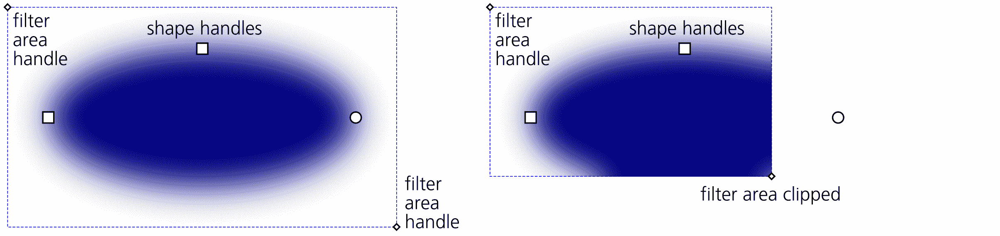

图 17-6：通过节点工具编辑滤镜区域

滤镜区域的交互式编辑无法应用于克隆和符号。你也可以在滤镜编辑器对话框中数值化编辑任何滤镜的区域(17.5.4)。

## 17.4 预设滤镜

SVG 定义了有限数量的滤镜原语，你可以基于这些原语构建任意复杂的复合滤镜。在深入了解这一点之前，让我们先看看 Inkscape 附带的令人印象深刻的预设复合滤镜集合。

要将预设滤镜应用到选中的对象或多个对象，只需从**滤镜**菜单的子菜单中选择一个命令。要获得单个预设滤镜（或任何菜单命令）的简要描述，只需将鼠标悬停在菜单中的命令上，并查看状态栏，如图 17-7 所示。

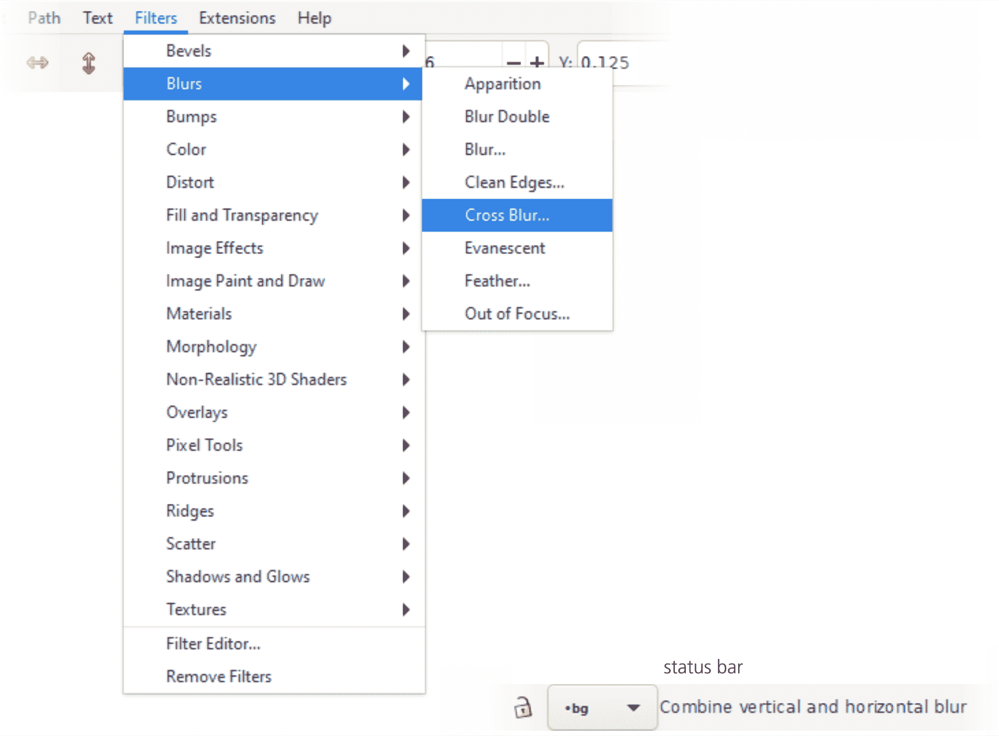

图 17-7：预设滤镜效果

大多数滤镜会立即应用。其他的——即名称末尾带有“...”的滤镜——会显示一个对话框，你可以在其中调整其参数。这样的对话框总是有一个实时预览复选框，你可以打开它，以便在画布上实时查看任何参数变化的结果（但是，这个复选框会锁定画布，因此你无法选择其他对象，甚至不能滚动或缩放）。点击应用会根据当前参数创建滤镜，但不会关闭对话框（这样你可以选择另一个对象来应用）；点击关闭则会取消对话框和预览（无需撤销）。

图 17-8 显示了一个相当复杂的可调效果示例，其对话框包含多个数字参数和一个颜色选择器。

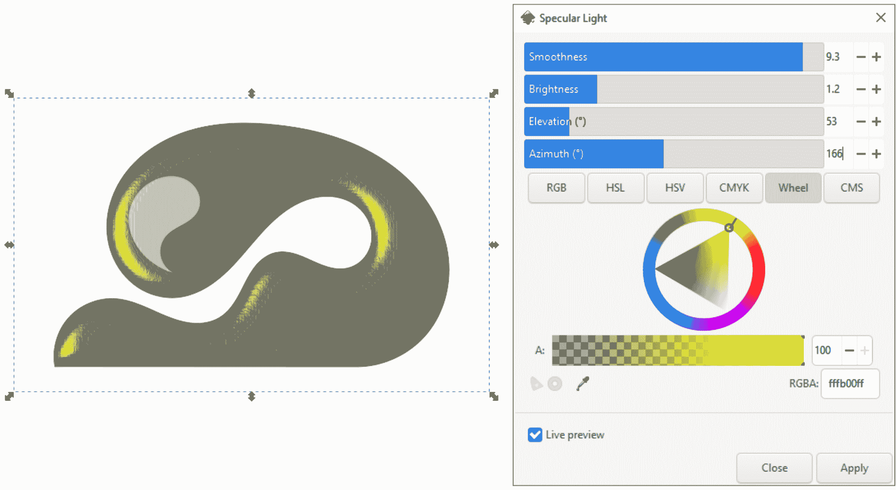

图 17-8：可调预设滤镜的对话框

我不会在这里描述所有的预设滤镜——它们实在太多了（并且每个 Inkscape 版本都会增加更多滤镜）。不过，我会描述滤镜菜单的每个子菜单，并简要说明每个子菜单中最显著的滤镜（通常是可调的滤镜）。

### 17.4.1 倾斜子菜单

倾斜子菜单提供了许多关于倾斜（伪 3D 凸起边缘）主题的变化，如图 17-9 所示。在这里，你会找到不透明和半透明的材质，光泽和哑光表面，多个光源照亮的倾斜效果，有无阴影，中心有凹陷或边缘有凸起等等。大多数这些滤镜会保留对象的原始颜色，尽管它们可能会在某些地方使颜色变得更浅或更暗，从而实现 3D 效果。

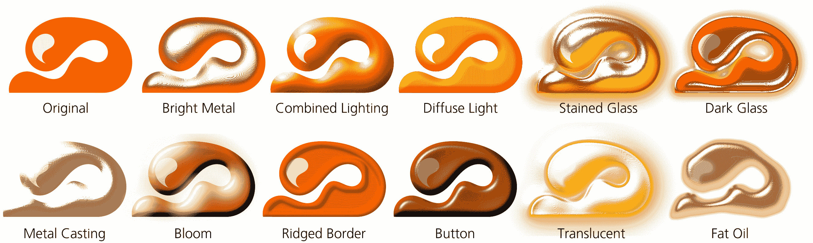

图 17-9：来自倾斜子菜单的滤镜

该组中的大多数可调滤镜允许你指定倾斜的高度（平滑度）、光源的坐标（高度和方位角），以及高光的亮度和颜色。如果你选择的滤镜不可调，你仍然可以在应用该滤镜后移动光源，打开滤镜编辑器，选择应用于对象的滤镜堆栈中的镜面光或漫反射光原件，并在这里调整高度和方位角参数。

### 17.4.2 模糊子菜单

模糊子菜单（图 17-10）包括基本的可调模糊效果，你可以分别设置水平和垂直的模糊量。如果你想要一个非水平和非垂直的运动模糊，可以将对象旋转，使其运动方向变为水平，先进行水平模糊处理，然后再旋转回来。

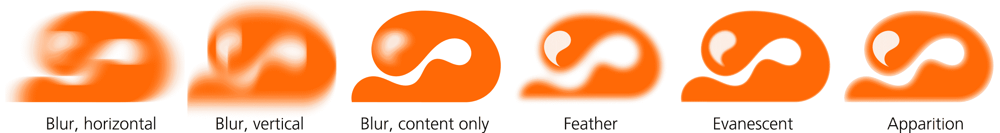

图 17-10：来自模糊子菜单的滤镜

"仅模糊内容"复选框在模糊效果中仅模糊对象的内部（例如，位图中的图像），但不影响其边缘（边缘处透明度降至零）。羽化效果则相反：它模糊对象的透明度蒙版，但不影响其内容。

Apparition 和 Evanescent 将一个褪色模糊的对象副本叠加到正常副本上，使其看起来更加柔和且略显不真实，但不会模糊到无法识别的程度；其中，Apparition 作用于对象的边缘（类似于羽化效果），而 Evanescent 作用于其内容。最后，Out of Focus 尝试比普通模糊更好地模拟现实世界中近视视角下的对象内容。

### 17.4.3 Bumps 子菜单

Bumps 子菜单（图 17-11）包含添加各种伪 3D 纹理的滤镜，这些纹理突出了图像中的特征。它们类似于你可能在其他软件中看到的“浮雕”效果。

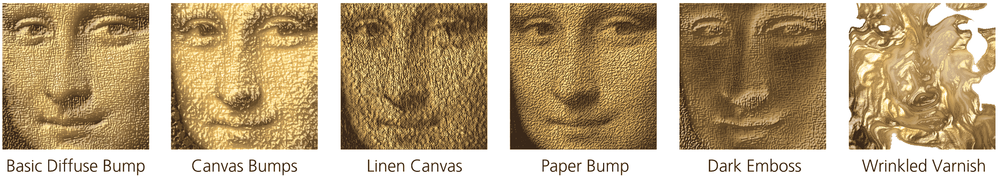

图 17-11：Bumps 子菜单中的滤镜

### 17.4.4 Color 子菜单

Color 子菜单集合了调整或转换对象颜色的各种方式。这些功能对于导入的位图特别有用，但也可以应用于矢量设计，尤其是可以将它们分组并作为整体进行过滤的复杂设计，而无需单独重新绘制每个对象。

个人而言，我更喜欢使用半透明的覆盖层与混合模式（17.2），因为它们让我可以完全控制要影响图像的哪些部分，但在某些情况下，混合模式并不足以满足需求。尽管如此，这个子菜单包括模拟任何混合模式作为效果的简单混合模式。你还可以：

+   调整亮度-对比度。

+   按通道反转。

+   转换为灰度，控制每个 RGB 通道对结果的贡献程度。

+   使用 Color Shift 旋转色调。

+   模拟各种类型的色盲。

+   渲染一幅使用两种（双色）或三种（三色）颜色的图像。

+   可调地为图像着色，选择所需的颜色。

+   使颜色变为荧光色。

+   提取通道以获取一个 RGB 或 CMY 通道，或相对地推动它们以获得“错位打印”般的复古效果。

### 17.4.5 Distort 子菜单

Distort 子菜单中的滤镜对对象的内容、透明度蒙版或两者都应用随机失真效果（图 17-12）。其中包括多功能的可调 Roughen，可以设置随机波动的频率和振幅，以及该主题的一些预设变体。

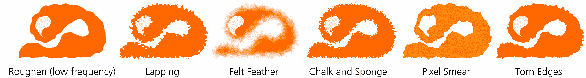

图 17-12：Distort 子菜单中的滤镜

### 17.4.6 填充和透明度子菜单

填充和透明度子菜单包含几个基本的滤镜：

+   通道透明度（可调）使对象的某些部分根据 RGB 通道值变为透明（例如，通过设置红色超过某个阈值的区域为透明，形成孔洞效果）。

+   Fast Crop 不会以任何方式改变对象的外观，但会在左上角和右下角添加一个带有 X 形手柄的矩形裁剪框。拖动手柄可以以无破坏的方式裁剪对象。

+   Light Eraser 渲染对象的白色或浅色区域为透明（启用反转复选框时，渲染除浅色区域以外的所有内容为透明）。

+   填充背景会将对象边界框（加上扩展部分，17.3.1）的透明部分填充为不透明颜色（此滤镜不可调节，若要更改颜色，请使用滤镜编辑器）；平坦透明度则将背景填充为白色。

+   不透明度（可调）阈值设定对象的透明度，使所有模糊或透明渐变的边缘变得清晰。

+   剪影（可调）将对象中的所有颜色替换为黑色或你选择的其他颜色。

### 17.4.7 图像效果子菜单

图像效果子菜单包含一些经典的位图处理算法，包括边缘检测（渲染图像的黑白版本，显示原图中的颜色边界）和锐化（通过增加对比度强调颜色边界）。

### 17.4.8 图像绘画和绘制子菜单

图像绘画和绘制子菜单汇集了模仿各种绘画和绘制技巧及材料的滤镜（见图 17-13）。并非所有这些仿真都令人信服，但许多可以激发灵感。

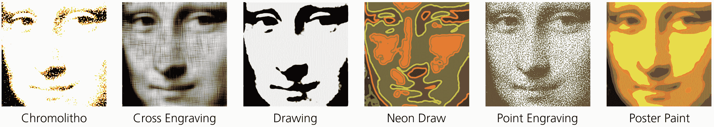

图 17-13：来自图像绘画和绘制子菜单的滤镜

### 17.4.9 材料子菜单

材料子菜单的滤镜模仿各种材料，按照对象的颜色着色，并按其不透明度蒙版剪切（见图 17-14）。名称中带有“3D”的滤镜还会在边缘添加斜角效果。

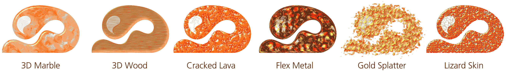

图 17-14：来自材料子菜单的滤镜

### 17.4.10 形态学子菜单

形态学来源于希腊语，意为“研究形状”；这些滤镜模仿内嵌/外嵌（见 12.4）以及各种类型的填充和描边，如图 17-15 所示。

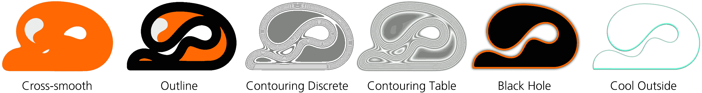

图 17-15：来自形态学子菜单的滤镜

### 17.4.11 非现实 3D 着色器子菜单

非现实 3D 着色器用于平面颜色形状，它们类似于斜角效果，但更厚、更深入边缘，并且光与影之间的对比度要高得多（因此称为“非现实”），如图 17-16 所示。

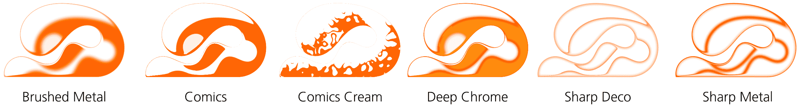

图 17-16：来自非现实 3D 着色器子菜单的滤镜

### 17.4.12 覆盖层子菜单

覆盖层不会改变对象本身，而是将其作为显示某种纹理的底图，将其作为覆盖层添加到对象的原始颜色上（有时会完全遮掩原色），如图 17-17 所示。该组包括通用可调噪声填充。

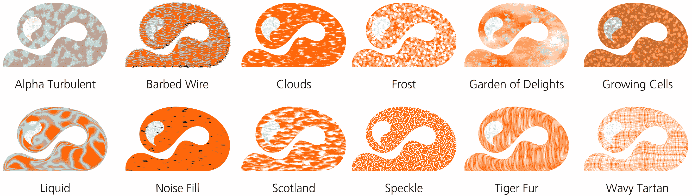

图 17-17：来自覆盖层子菜单的滤镜

### 17.4.13 像素工具子菜单

像素工具有一个滤镜：像素化，它会抑制像素级的抗锯齿效果（见图 1-1）。它不会将矢量形状栅格化——但通过此滤镜，在任何缩放级别下，矢量形状的边缘都能保持非常清晰（通常会显得明显锯齿状）。

### 17.4.14 突起物和脊子菜单

凸起滤镜是有趣的滤镜，可以为你的形状添加各种扩展效果，比如滴水或火焰。脊脉子菜单的滤镜将一个物体变成沿边缘的狭窄脊状，并以不同方式处理这个脊脉（见图 17-18）。

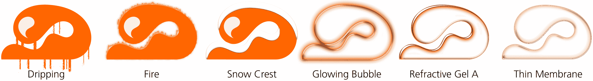

图 17-18：来自“凸起”和“脊脉”子菜单的滤镜

### 17.4.15 “散布”和“阴影与辉光”子菜单

“散布”子菜单滤镜将一个物体炸裂成各种形状的碎片——树叶、立方体（看起来更像正方形）、随机喷溅的斑点——并随机散布这些碎片。

“阴影与辉光”子菜单是你寻找通用“投影阴影”滤镜的地方：该可调滤镜让你选择阴影（或辉光）的颜色和不透明度、相对于物体的位移以及模糊半径（见图 17-19）。这个组还包括几个其他的滤镜，实现了内阴影与外阴影、辉光及其组合。

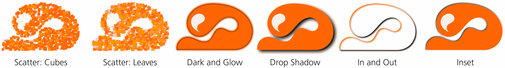

图 17-19：来自“散布”和“阴影与辉光”子菜单的滤镜

### 17.4.16 纹理子菜单

“纹理”子菜单包含各种自然质感的纹理：皱塑料、果酱涂抹、树皮、横条纹地毯等（见图 17-20）。

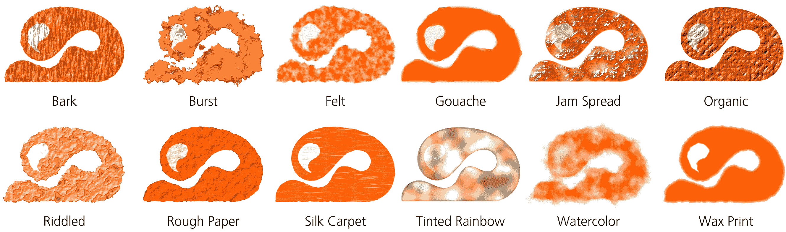

图 17-20：来自“纹理”子菜单的滤镜

## 17.5 滤镜编辑器对话框

Inkscape 自带的预设滤镜不仅本身很有用，还可以作为你自己衍生滤镜的起点。选择一个最接近你想要效果的预设滤镜，然后从它开始调整，通常比从头开始要容易。让我们来看一下图 17-21 中显示的滤镜编辑器对话框（菜单中的“滤镜 ▶ 滤镜编辑器...”）。

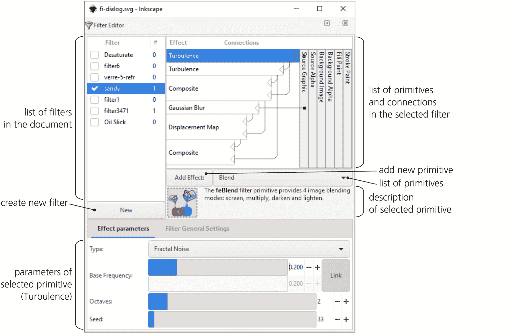

图 17-21：滤镜编辑器对话框的主要区域

### 17.5.1 滤镜列表

对话框的左上角面板列出了文档中定义的所有滤镜；选择其中任何一个即可编辑其结构和参数。如果当前选定的对象已应用某个滤镜，列表中将显示该滤镜的勾选标记——通过设置或移除勾选标记，你可以对任何对象应用或取消应用滤镜。

右键单击一个滤镜，选择**选择**以选择文档中使用此滤镜的所有对象。当前未被任何对象使用的滤镜仍会保留在列表中；要从文档中移除未使用的滤镜，可以使用**文件 ▶ 清理文档**命令。

在列表下方，**新建**按钮用于添加新滤镜。如果你在一个空文档中打开这个对话框，滤镜列表也是空的。点击**新建**以创建一个新的空滤镜——通常命名为`filter1`（要重命名，只需双击列表中的名字并直接编辑）。你还可以通过右键点击滤镜并使用弹出菜单命令来复制或删除列表中的滤镜。

现在，创建或选择文档中的某个对象，并选中你的新滤镜的复选框。什么都不会改变——空滤镜不会影响对象的渲染效果。要使滤镜实际发挥作用，你需要向其中添加一些原语。

### 17.5.2 原语堆栈

滤镜列表右侧区域是主要的滤镜构建板，你可以在这里列出、排列并连接构成滤镜的*原语*堆栈。直到你向滤镜添加原语之前，这个区域将是空的。

Inkscape 支持的 16 个原语列在“添加效果”按钮旁边的下拉列表中。当你在列表中选择一个原语时，下方会显示简短的描述和插图——阅读这些描述可以大致了解每个原语的作用。所有原语的详细解释超出了本书的范围；有关完整细节，请参考 SVG 规范（[`w3.org/TR/SVG11/`](http://w3.org/TR/SVG11/)）。

相反，我们来看看创建一个相当复杂的滤镜的逐步过程，它使用了几种不同的原语。我的滤镜叫做“沙漠模糊”；我为玫瑰图像的背景着色设计了它（见图 25-5）。这个滤镜的目的是模仿在粗糙纸张上模糊的水彩笔触。

普通的高斯模糊对我来说不起作用：它太平滑、太明显是计算机生成的、太无聊了。为了实现一个可接受的水彩模仿，我需要同时模拟纸张纹理的小尺度粗糙度和水彩颜料在不同位置流动和粘附形成的大尺度“水渍”。对于这两种不均匀性，我使用了湍流原语，它在给定的尺度上生成随机的分形噪声（见图 17-22）。

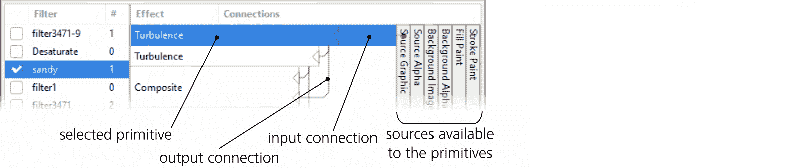

图 17-22：两个湍流原语

两个湍流原语是滤镜的前两个组件——堆栈中的两个最顶部框。每个滤镜原语都有一个或多个*输入*和一个*输出*；在列表中，输入通过从右侧水平进入原语框的线条表示，输出是从框中垂直向下的线条。你可以通过拖动连接，从原语框右侧的输入三角形开始。

如你所见，一些原语的输出是其他原语的输入。通常，信息从原语堆栈的顶部流向底部，最底层原语的输出就是你在文档窗口中看到的渲染效果。你可以通过拖动来重新排列原语；右键菜单允许你复制或删除某个原语。

右侧垂直堆叠的框是什么？这些是任何原始图形都可以作为输入使用的预定义源。最有用的其中包括 Source Graphic 和 Source Alpha。顾名思义，Source Graphic 提供当前缩放级别下正在被滤镜处理的对象的渲染图像。Source Alpha 则提供原始对象的不透明度（alpha）蒙版的灰度表示；在 Source Graphic 中完全不透明的点（无论颜色如何）将在 Source Alpha 图像中显示为不透明的黑色，而透明的点则会显示为透明的黑色。

### 17.5.3 原始图形的参数

让我们再次看看堆叠顶部的两个 Turbulence 原始图形。它们都以 Source Alpha 作为输入，并将其结果——随机噪声——传递给其他原始图形。不同之处在于这些滤镜的参数。

当你选择堆栈中的一个滤镜原始图形时，它的参数会显示在对话框的底部窗格中。图 17-23 显示了两个 Turbulence 原始图形的参数。

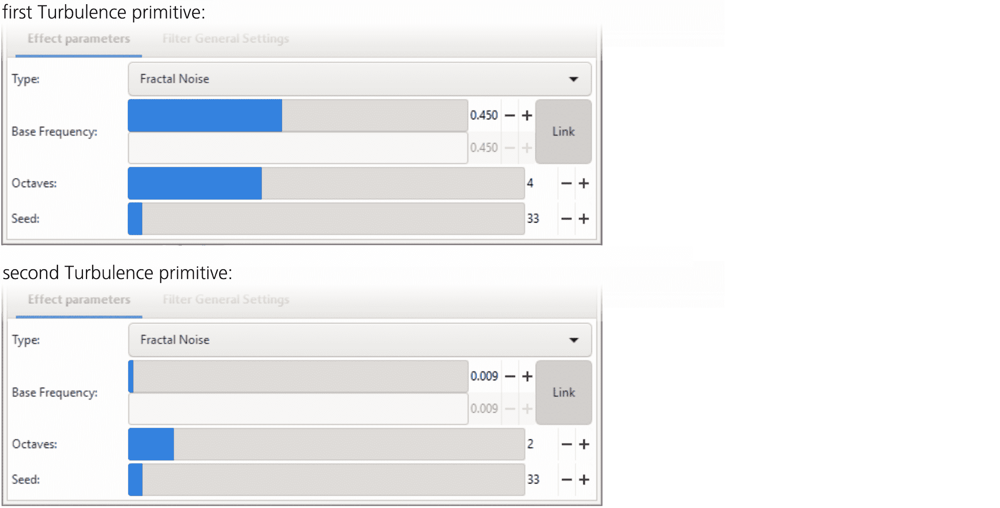

图 17-23：两个 Turbulence 原始图形的参数

这两个原始图形的类型相同（Fractal Noise，在这种情况下比另一个选项 Turbulence 更合适），但它们在 Base Frequency 和 Octaves 上有所不同。Base Frequency 参数设置湍流的尺度；较高的频率会产生较小、类似沙粒的纹理，而较低的频率则会产生较大的云朵。Octaves 的数量指定算法递归的深度：增加 Octaves 会产生更锐利的不均匀性和更多的小细节；降低该值则会得到更平滑、更模糊的图像。

现在，为了将两个湍流输出合并，我使用了另一种原始图形，名为 Composite，如图 17-24 所示。

图 17-24：Composite 原始图形

它有两个输入，并通过多种方法逐像素地将它们合并。在这里，我使用了 Arithmetic 方法；根据四个系数（K1 到 K4）的数值，如所示，它将大尺度波浪和小尺度波纹合成到一个对比度稍有增加的复合图像中，如图 17-25 所示。

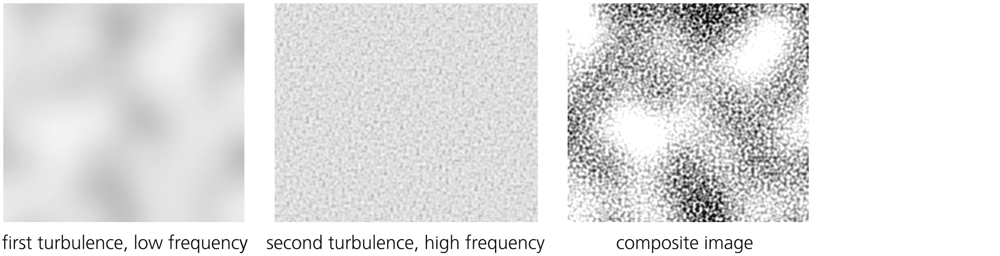

图 17-25：合成两个湍流的结果

到目前为止，我还没有使用滤镜将应用于对象本身的图像——也就是说，我没有使用 Source Graphic。假设那个对象是某种类似宽刷的路径，可能是使用书法笔工具(14.2)创建的。当然，要使一个平面颜色、锐利边缘的路径更像水彩笔触，首先要做的就是模糊它，如图 17-26 所示。

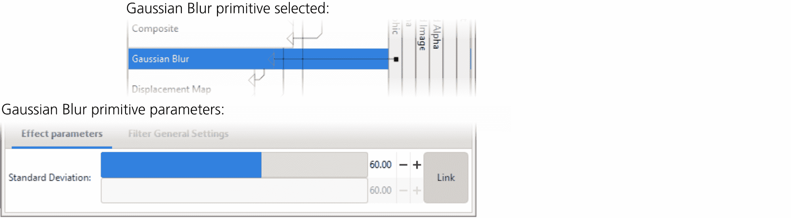

图 17-26：高斯模糊原始图形

高斯模糊的标准差参数类似于你在填充和描边对话框中调整的模糊量（图 17-1），不同之处在于这里它是以绝对的`px`单位衡量的（A.6），而不是以对象大小的百分比来表示。

如何将模糊笔触与湍流结合？在这里合成模式不起作用。任何一种模式都会导致平滑的模糊与湍流波纹*叠加*，底层的平滑感并没有消失（试试看）。它看起来不像粗糙纸上的水彩画——更像是通过有斑点的玻璃看到的计算机生成的模糊效果。

想想你在真实纸张上用真正的画笔作画时发生的事情。笔触的模糊是由画笔的柔软度造成的——你在画笔的中部施加的压力比在边缘大。当画笔接触到纸上的凹陷时，压力发生了变化：如果这个纸面较高，它会得到更多的颜料，就像它靠近画笔的最大压力点；如果是凹陷区域，它会得到更少的颜料。换句话说，纸张的粗糙度使得模糊的笔触*在绘图平面内*发生抖动，就像随机地将笔触的部分横向位移一样。你如何通过滤镜实现这种效果呢？

位移图原语非常适合这个任务。它接受第一个输入并根据第二个输入的指示移动像素。你可以选择第二个输入的哪个通道（红色、绿色、蓝色或 Alpha）来在 X 轴和 Y 轴方向上移动第一个输入，并设置这种位移的规模。在这个例子中，第一个输入是模糊的对象，第二个输入是合成的湍流场，我选择了 Alpha 通道作为两个轴的位移来源（图 17-27）。

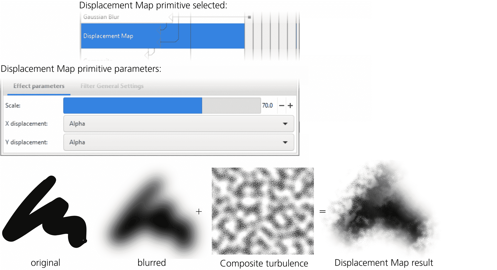

图 17-27：位移图原语

作为额外的好处，结果在某些区域看起来更粗糙，在其他区域则更平滑。这是因为在平滑区域，位移图作用于模糊笔触的几乎平坦部分——高频抖动只是在几乎相同颜色的像素间移动，几乎不打扰平滑感。然而，在笔触的边缘，不同颜色的像素被混合并抖动，产生了可见的粗糙感。所有这些还会受到低频噪声的调制，从而产生逼真的水彩模拟效果。

然而，如果你将这个滤镜应用到浅色的笔触上（而不是黑色的，如图 17-27 所示），结果仍然不完美。当你观察真实的粗糙纸张上的水彩笔触时，看到的并不仅仅是颜料的空间分布；你还看到的是粗糙感本身，这看起来像是一个阴影模式。如果没有这些阴影，浅色的笔触即使使用这个滤镜，看起来仍然过于平坦、不自然。幸运的是，这很容易修复；我已经有了高频湍流源，一旦与位移映射模糊合成，它就能很好地作为阴影使用（如图 17-28 所示）。

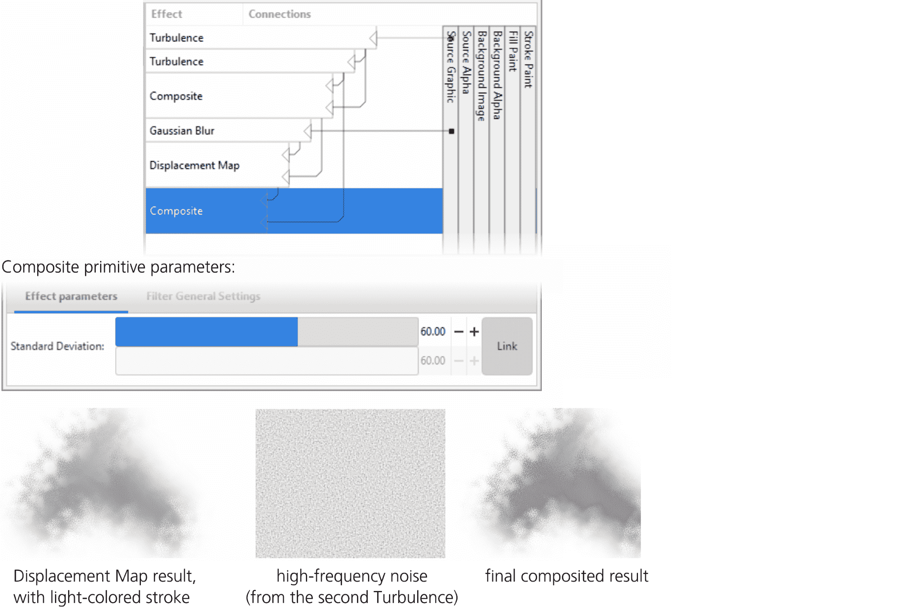

图 17-28：最终滤镜和最后合成原语的参数，该原语覆盖了阴影效果

到此为止，滤镜看起来相当不错。我可以继续改进它，加入各种拖影、水漏、扩散等效果；然而，由于我的演示图像仅在背景中使用了这个滤镜，所以它已经足够满足需求。

### 17.5.4 滤镜区域

滤镜编辑器对话框中的第二个标签叫做**滤镜常规设置**。它包含应用于整个滤镜堆栈的参数，而不是某个单独的原语。目前，你在这里唯一可以更改的就是*滤镜区域*——即滤镜渲染的区域，单位为应用滤镜的对象边界框的单位。你可以在画布上交互式地编辑这个区域（见 17.3.1），但滤镜编辑器允许你通过数值方式来设置它。

坐标小部件指定区域的左上角，而尺寸指定右下角的坐标。所有值都以预滤镜边界框的单位来衡量。

例如，如果你将坐标设置为 0/0 并将尺寸设置为 1/1，则区域将等于预滤镜的边界框。如果你的滤镜没有超出对象（例如，仅是使用颜色矩阵原语进行颜色变化），那么这样设置是有效的。然而，对于像模糊这种会在边界框外绘制的效果，你需要提供足够的边距以避免裁剪。当你通过“填充和笔触”对话框应用模糊或使用某个预设滤镜时，这些边距会自动为你设置；然而，当你从零开始创建新的滤镜堆栈时，你必须自己处理这些边距。默认值是坐标为 0.1/0.1，尺寸为 1.2/1.2，这意味着对象四周会有 10%的边距，如图 17-29 所示。

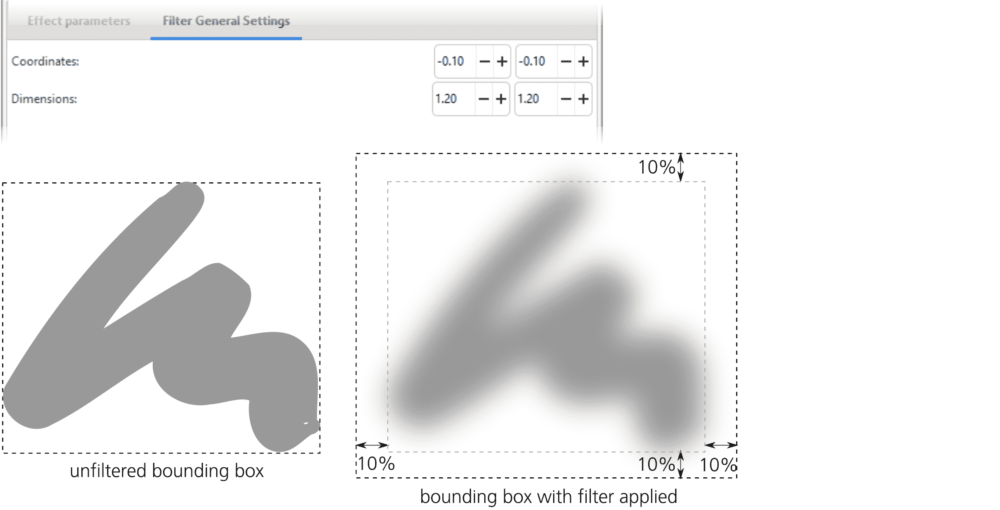

图 17-29：指定滤镜区域

如果 Inkscape 使用视觉边界框（这是默认设置，4.3），则过滤器对象的边界框——你在选择它时在选择器中看到的框架——就是放大的过滤区域。除此之外，这意味着，当将选定对象导出为位图时（18.6），Inkscape 会确保位图包含模糊的边缘而不会裁剪掉它们。

## 17.6 过滤器渲染选项

Inkscape 过滤器的渲染速度多年来有了很大的提升。然而，对于复杂或大面积的过滤器，它仍然可能会成为问题。因此，Inkscape 提供了多个首选项选项来调整过滤器（以及渲染一般）的性能。

首先，你总是可以切换到轮廓模式（3.14），以加快在文档工作时的渲染速度。还有“无过滤器模式”，这与正常模式相同，只是过滤器没有被渲染；如果过滤器是导致你工作慢的主要原因，这可能是最简单的解决方法。

[1.1]

影响渲染速度的选项被集中在首选项对话框的渲染页面上（图 17-30）。你可以设置线程数（同时执行的渲染管道数），默认四个；通常建议将此值设置为你的 CPU 的逻辑处理器数（例如我的情况是八个）。你还可以增加渲染缓存（默认 64MB）并扩大渲染瓦片倍增器（默认 16）。如果你的硬件足够现代且有足够的内存，增加这些值是值得的，看看你能获得多少性能提升。此外，如果你在编辑过程中更新屏幕时注意到卡顿（例如，拖动节点时），尝试将编辑时重绘选项从默认的响应式改为保守模式。

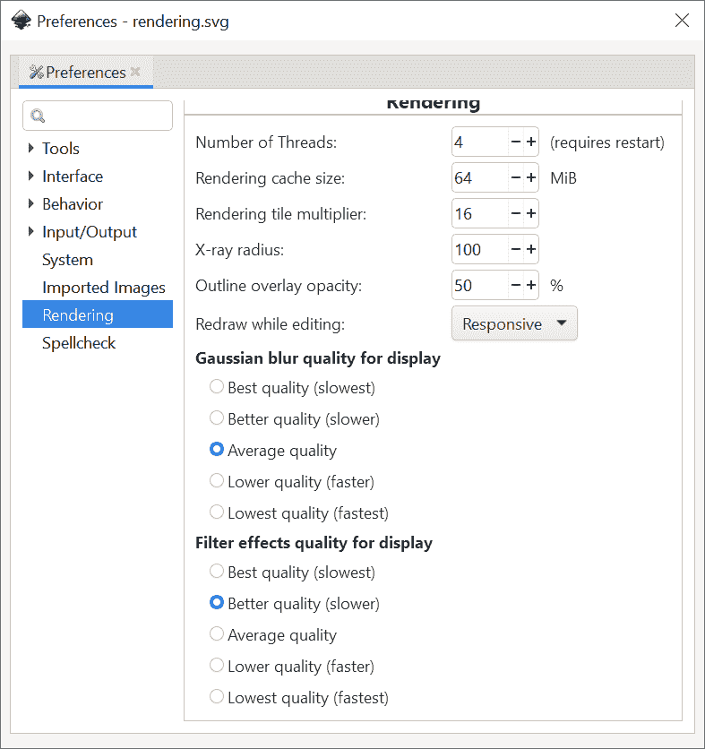

图 17-30：首选项对话框的渲染页面

特别适用于过滤器的选项包括两个单选按钮组：显示用的高斯模糊质量和显示用的过滤器效果质量——这是你搜索最佳速度/质量平衡的地方。第一个组仅影响模糊；默认的“平均质量”看起来*几乎*完美，且渲染速度较快。在较低质量设置下，会出现明显的缺陷，但渲染速度更快；较高的设置几乎不会带来质量上的改善，但渲染速度明显较慢。

第二组单选按钮适用于所有过滤器（包括模糊）。它同样提供了通过牺牲渲染质量来换取渲染速度提升的选项，但它的速度优势并不显著，因此在这种情况下，“更好质量”选项可能是最佳选择。

## 17.7 导出过滤器到 PS 和 PDF

PostScript 和 PDF 格式虽然是矢量图形，但不支持类似于 SVG 的滤镜。默认情况下，在导出时，Inkscape 会提供将应用了滤镜的任何对象光栅化（转换为位图）的选项。这可以完全保留滤镜在 Inkscape 中的外观，但可能会显著增加文件大小。在导出选项对话框中，你可以指定位图的分辨率，并且可以关闭光栅化选项，在这种情况下，对象将保持为矢量图形，但会丧失滤镜效果（图 17-31）。

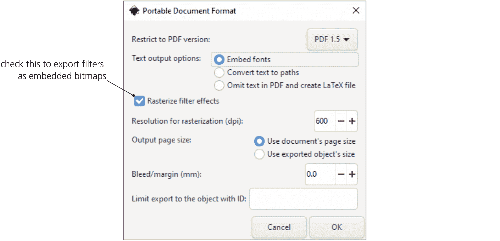

图 17-31：指定保存文档为 PDF 时滤镜的处理方式

在通过命令行导出时（C.4），相应的选项是 `--export-dpi` 用来指定分辨率，`--export-ignore-filters` 用来关闭光栅化。
