# 第十九章：位图

大多数矢量图像在其生命周期的开始或结束时（通常是两者）都是位图形式（1.1），Inkscape 的 SVG 文档也不例外。许多矢量绘图，无论是艺术性的还是技术性的，都是通过照片、扫描或其他位图图像的描摹而开发的；而在它们生命周期的另一端，几乎所有的矢量图形都会导出为位图格式，以便在无法直接处理矢量的程序中查看。位图是 Inkscape 中重要的对象类型，处理位图的技巧足够复杂和有趣，值得专门用一章来讲解。

## 18.1 位图作为对象

如果你有一个位图图像文件，可以通过文件 ▶ 导入命令将其插入到 Inkscape 文档中。你也可以通过文件 ▶ 打开命令将任何位图文件作为独立文档打开。在这种情况下，Inkscape 会自动创建一个新的 SVG 文档，页面大小（3.5.2）与位图的像素大小匹配，并将位图放置到画布上（进入文档根目录——也就是不在任何图层中）。此时，你可以向该文档添加其他对象并保存为 SVG（如果你想得到包含结果的位图，你需要导出它，18.6），或者你也可以将位图对象从该文档复制并粘贴到任何其他文档中。

[1.1]

Inkscape 可以读取多种位图格式，包括所有主流格式（PNG、JPG、TIFF、GIF、BMP），但它尚不能读取相对较新的 WebP 格式，尽管它可以导出 WebP 格式。选择**所有位图**选项，在**导入**对话框中只显示支持的位图格式文件。Inkscape 的早期版本在尝试打开大于几千像素的位图时会失败；现在，如果你的计算机有足够的内存，处理几万像素的图像将不会有问题。

无论是打开还是导入，最终在文档中呈现的是一个*位图对象*（图 18-1）。在大多数方面，这是一个普通的对象，你可以对其进行变换、复制、克隆、应用滤镜等等。在状态栏中，它被描述为图像，并显示其像素大小，例如 640 × 480。位图的像素大小仅仅是它在水平和垂直方向上的像素数量；这与位图对象在画布上的大小不同——你可以在 SVG 中将其缩放到任何尺寸，但位图的固有像素大小始终不变。

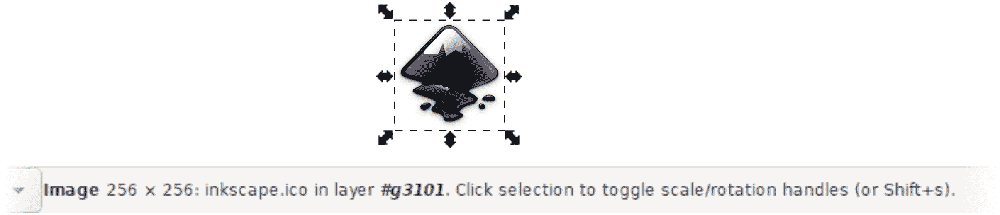

图 18-1：文档中的位图对象

## 18.2 位图导入选项

图 18-2 显示了你在打开或导入位图到 Inkscape 时看到的对话框。

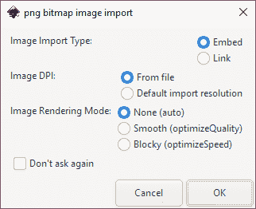

图 18-2：从文件导入位图

### 18.2.1 链接与嵌入

在处理位图时，您首先面临的选择是是否*嵌入*位图或*链接*到它。默认情况下，您导入到 Inkscape 中的任何位图都是链接到文档的——这意味着位图的实际内容始终来自原始位图文件。SVG 文档仅包含该文件的引用——它的文件名和相对于 SVG 文件位置的路径。链接位图对象在状态栏中显示其文件名（如 图 18-1 中的 inkscape.ico）。

这样，SVG 文件的大小得以保持最小，并且多个 SVG 文档可以重用相同的位图文件。这也意味着，您对该链接位图文件在 Inkscape 外部所做的任何更改都会立即反映在 Inkscape 文档中。此外，您可以通过右键点击位图对象并选择“外部编辑”来在 Inkscape 内部使用外部编辑器（如 GIMP 或 Photoshop）编辑链接的图像。

在“偏好设置”的“导入图像”页面（3.1.1）中，您可以取消勾选“自动重新加载图像”选项，以禁用导入位图的更新。您还可以选择通过“外部编辑”（浏览选择可执行文件）来选择使用哪个位图编辑器进行编辑。

链接位图的最大缺点是链接容易被破坏。如果位图文件被删除或相对于 SVG 文档移动到其他位置，结果就不太好，如 图 18-3 所示。


图 18-3：Inkscape 在无法找到链接的位图文件时的显示效果

这是一个常见问题，尤其是当您将艺术作品发送给他人时，却忘记包括链接的图像。

对 Inkscape 来说，重要的是位图的相对位置，因为在 `svg:image` 对象的 `xlink:href` 属性中，它存储的是从 SVG 文档位置到图像文件的相对路径。例如，如果位图位于您的 SVG 文档所在文件夹的 images 子文件夹中，您可以将该文件夹及其 images 子文件夹一起移动到不同的位置，而不会有问题。

Inkscape 还可以将图像的*绝对路径*存储在 `sodipodi:absref` 属性中；如果该属性存在，当 `xlink:href` 中的相对链接失效时，Inkscape 会使用它。您可以通过在“偏好设置”的“导入图像”页面中勾选“为链接图像存储绝对路径”选项来启用此功能（默认情况下该选项为禁用）。使用 `sodipodi:absref` 将在您将 SVG 文档移动到计算机上的其他位置，但留下链接图像时恢复图像；然而，如果您移动了图像，或者尝试在没有关联图像的不同计算机上打开 SVG 文件，这个方法则无效。

为了彻底防止任何链接问题，在位图导入时选择相应的选项将图像*嵌入*到 SVG 文档中（图 18-2）。此类图像的状态栏描述类似“图像 64 × 64：已嵌入”。嵌入图像被存储在 SVG 文件内部，因此永远不会丢失。缺点是，这会增加 SVG 文件的大小（大约是位图文件大小的 1.4 倍，这可能是一个显著的增加）。另外，嵌入的图像不能在外部位图编辑器中编辑，也不能被多个 SVG 文件共享。

如果你将图像导入为链接图像，但现在希望将其嵌入，使用**扩展 ▶ 图像 ▶ 嵌入图像**。你可以将此操作应用于选定的位图对象（保持其他对象不变），或者应用于文档中的所有位图对象，如图 18-4 所示。

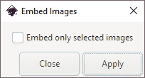

图 18-4：扩展 ▶ 图像 ▶ 嵌入图像将链接图像嵌入到 SVG 文件中。

使用扩展 ▶ 图像 ▶ 提取图像，你可以逆转这个过程——将选定的嵌入图像或文档中的所有嵌入图像提取为链接文件。你将被要求选择保存提取文件的路径，如图 18-5 所示。

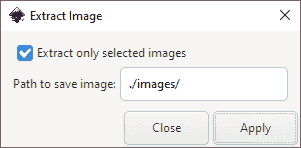

图 18-5：扩展 ▶ 图像 ▶ 提取图像将嵌入的图像转换为链接图像。

### 18.2.2 导入时的大小

打开或导入图像时，它的大小是多少？

由于其本质，位图没有以英寸或厘米为单位的物理大小。它所拥有的是*像素大小*——例如，960 × 480 像素。除此之外，一些位图格式会指定建议的*分辨率*，也叫做 DPI（*每英寸点数*，这是一个历史术语，意味着与每英寸像素数相同）。例如，如果一个 960 × 480 像素的图像具有 96 dpi 的分辨率，那么它应该显示在 10 × 5 英寸的空间中。对于 Inkscape 这样一个矢量应用程序来说，这不过是一个建议——它将位图的像素视为可以缩放到任意大小的矢量形状。

[1.1]

并非所有位图格式都能指定 DPI，也并非所有图像都有一个有意义的 DPI 值。尽管如此，默认情况下，Inkscape 在可用时会使用图像的 DPI 来计算画布上位图对象的*初始*大小。否则，它会使用默认的导入分辨率（在“首选项”中的“导入图像”页面上），该分辨率为 96 dpi。在这个分辨率下，每个像素方块的大小恰好是 1×1 px（A.6）。你可以通过启用“覆盖文件分辨率”复选框，强制 Inkscape 对所有导入的图像使用相同的分辨率，而不考虑它们自己的 DPI。

### 18.2.3 渲染选项 [1.1]

位图由像素组成（1.1），对 Inkscape 来说，它们与平面颜色的矩形没有太大区别，这些矩形在转换图像时会被缩放、旋转或倾斜。如果你放大足够，你甚至可以分辨出这些单独的像素——但这只是勉强可见，因为默认情况下，Inkscape 会尝试平滑它们。如果你不喜欢这个效果，可以在导入图像时通过将图像渲染模式（图 18-2）设置为“块状”（优化速度）来关闭平滑。默认的“无”（自动）和“平滑”（优化质量）当前是相同的，都会在高倍放大时平滑像素，如图 18-6 所示。

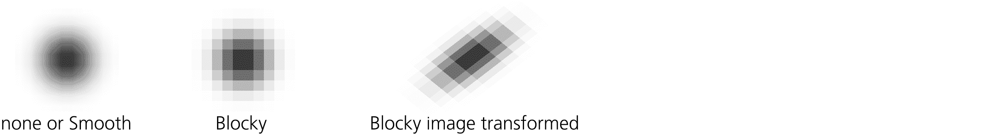

图 18-6：图像渲染选项

例如，在处理像素艺术时使用“块状”是合理的，因为每个像素的位置非常重要。当你处理不打算进行放大的大图像时，它也是首选——对于这些图像，个别像素的锯齿状不会被看到，但“块状”选项会导致稍微更快的渲染。

如果你导入了一个或多个设置错误的图像，需要更改它们，可以使用**扩展 ▶ 图像 ▶ 设置图像属性**扩展。它的“渲染图像为块状”选项可以应用于文档中的所有图像或仅应用于选定的图像。

## 18.3 剪切和蒙版

通常，你首先想要对导入的位图进行*裁剪*，去除不必要的边距，只保留图像的一部分。Inkscape 提供了几种方法来实现这一点。

本节中的所有技术展示的是针对位图对象的——因为它们最常用于位图对象——但你也可以将它们应用于任何类型的对象，包括组或图层（正如你记得的，它们只是特殊类型的组）。

### 18.3.1 剪切

Inkscape 允许任何对象被路径*剪切*，使得只有该路径内部的部分对象可见。为了确定哪些点在内部，哪些在外部，使用的规则与填充相同（12.1.2）。

从一个位图对象开始，使用任何方便的工具，如矩形工具或铅笔工具，在其上绘制一个剪切路径或形状。然后，选择位图和路径/形状，选择对象 ▶ 剪切 ▶ 设置。剪切路径消失（它现在位于 `defs` 中，A.4），但底部对象现在被该路径剪切。要编辑剪切路径（通过其节点或形状句柄）而不解除剪切，请单击节点工具控制栏中的相应切换，如图 18-7 所示。

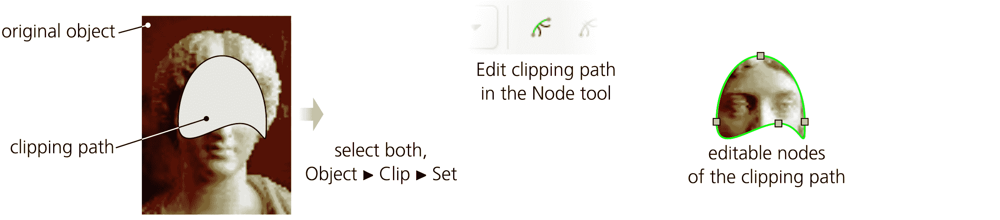

图 18-7：应用剪切到位图对象

随时，你都可以执行对象 ▶ 剪切 ▶ 释放，以去除剪切并将对象及其剪切路径恢复为两个独立的对象。

裁剪路径可以是路径或形状的组，而不是单一的路径或形状。然而，更实用的做法是将组作为裁剪目标，而不是裁剪路径。当你裁剪一个组时，你总是可以进入该组（4.9.1），在其中工作，添加更多对象，移动它们，或者可能用不同的对象替换你原本想要裁剪的对象——这一切都可以在不释放裁剪的情况下完成。这就是为什么我建议，即使你只有一个想要裁剪的位图，也先将其与自己组合成一个组，再裁剪这个组，而不是直接裁剪裸位图。

### 18.3.2 蒙版

蒙版与裁剪类似。你选择对象和蒙版，然后选择对象 ▶ 蒙版 ▶ 设置来进行蒙版，或对象 ▶ 蒙版 ▶ 释放来移除蒙版。然而，在裁剪中，对象被限制在裁剪路径的内部；裁剪的任何属性，如不透明度、填充颜色、描边或模糊，对裁剪没有影响。裁剪是*二元*的：在任何时刻，被裁剪的对象要么是可见的，要么是不可见的。而蒙版则是*渐变*的——它可能使对象*部分*透明。

记住这个规则：在蒙版中，*黑色*使被蒙版的对象*透明*（不可见），而*白色*使其*不透明*（可见）。50% 灰色或 50% 不透明的白色使被蒙版的对象半透明，而 50% 不透明的黑色与完全不透明的黑色效果相同（使对象不可见）。任何未被蒙版覆盖的区域，或者蒙版完全透明的地方，都不会在蒙版对象中显示。换句话说，要使对象可见，蒙版必须具有*可见的亮度*：不透明的白色蒙版提供 100%的可见性，而任何较暗或更透明的部分则会降低可见性。

显然，蒙版在渐变或模糊效果中最为有用。例如，你可以使用线性渐变蒙版将照片条与背景混合，或使用模糊蒙版对照片剪裁的边缘进行羽化处理（图 18-8）。

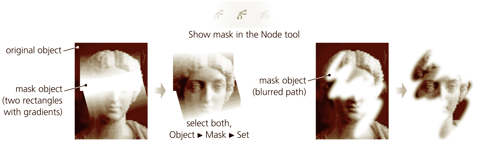

图 18-8：蒙版位图对象

节点工具有一个按钮用于编辑选中对象的蒙版。然而，作为节点工具，该按钮仅允许你对蒙版的单一路径或形状进行节点编辑——你不能更改其颜色、渐变或模糊效果；对于这些，你需要释放蒙版并在更改后重新设置它。

就像裁剪路径一样，蒙版和被蒙版的对象也可以是组。即使最初只是单一对象的组，使用蒙版也更有意义，因为你可以进入该组并在其中工作，而无需移除蒙版。

### 18.3.3 位图作为图案

如果你希望导入的位图保持矩形形状，只是想去掉一些边距，你可以通过按下 Alt-I 将其转变为*图案*（10.8）。这不会改变可见显示，而是将一个矩形位图（为了确保正常工作，必须未旋转或未拉伸）转变为一个矩形对象（11.2），并填充图案来显示该位图。

这种方法很方便，因为你可以同时编辑形状或路径及其位图填充（图 18-9）。如果你通过矩形的两个角手柄调整大小，例如，使用节点或矩形工具（11.2.1），它不会影响填充，这意味着你可以通过将矩形手柄向内移动来裁剪它。同时，你可以使用图案的三个手柄来移动、缩放和旋转图案，具体请参见 10.8.2。（最初，图案手柄与矩形手柄重合；拖动左上角的 X 形手柄可以将它们分开。）

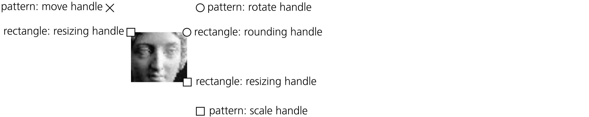

图 18-9：矩形中的位图作为图案

将位图转换为图案矩形后，你可以按下 Shift-Ctrl-C 将其转换为路径，并进行节点编辑，或者将矩形与另一个路径相交（12.2）。变换默认会影响形状/路径及其图案填充；有关如何更改这一点，请参见 6.11。

## 18.4 修饰和修补

在 Inkscape 中，简单的位图编辑任务，例如隐藏缺陷或抑制不必要的细节，可以使用其向量工具完成，而无需求助于外部位图编辑器。虽然这种方法有限，但它通常非常有用且快速。

假设你需要去除照片中的小瑕疵。首先，放大并在其上绘制一个书法笔画。然后，切换到吸管工具，从照片中选择一个附近的颜色并将其赋给新创建的路径。

在某些情况下，这可能就是你真正需要的——即使如此简单的修补也可能足够融合，直到你缩小视图时它变得“不可见”。然而，更可能的是，修补的边缘至少在某一侧仍然可见。因此，下一步是使用渐变：切换到渐变工具（10.1），绘制一个线性或椭圆渐变，尽量匹配背景中颜色变化的主导方向，并再次使用吸管工具（8.8）选择渐变停靠点的颜色。如果渐变无法使修补完全与背景融合，请查看是否可以通过稍微模糊来帮助，如图 18-10 所示。

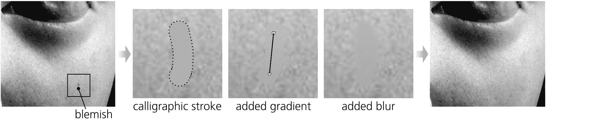

图 18-10：用向量修补路径覆盖脸颊上的小瑕疵，通过渐变和模糊处理使其“不可见”

当这些简单的方法不够好时，可以尝试使用新的网格渐变工具（10.7），通过自动为网格节点选择颜色（10.7.5）来创建更复杂或更广泛的补丁。

完成修整后，别忘了将位图对象与所有矢量补丁一起分组，这样整个组就可以作为一个单独的对象进行移动。

## 18.5 描摹

对于矢量编辑器，两个与位图相关的重要功能是将位图转换为矢量对象（*描摹*）和反向操作（*位图导出*）。Inkscape 提供了丰富且强大的工具来进行这些转换，接下来的章节将详细探讨这些工具。

### 18.5.1 手动描摹

一种描摹位图的方法不涉及任何你不熟悉的工具。只需切换到钢笔工具（14.1.1），放大位图，然后在你想转化为矢量路径的区域周围点击一系列的点（图 18-11）。在尖角处使用点击-释放来创建尖角节点；对于平滑的曲线边缘，在曲线的沿线做一系列短的点击-拖动。根据你想要描摹的具体区域的精确程度，调整点击的密度。双击、按回车键或点击起始节点来完成路径。

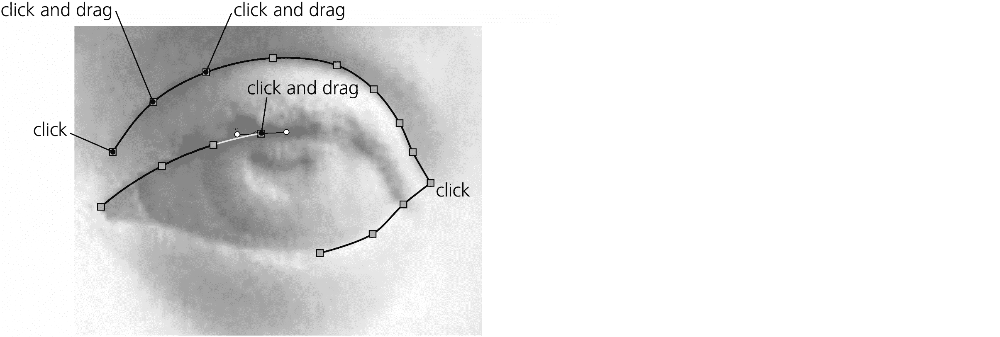

图 18-11：使用钢笔手动描摹位图（在默认的贝塞尔模式下）

为了更加平滑，你可以在 Spiro 或 BSpline 模式下描摹（14.1.4）；在这些模式下，每次点击都会创建一个平滑的节点，想要创建尖角节点时，可以按住 Shift 键进行点击。另外，在 BSpline 模式下，记住不要点击曲线本身，而是在曲线外侧稍微点击，这样平滑的路径会被刻入你通过点击创建的多边形中。如果你正在描摹没有任何曲线的艺术作品，可以使用直线模式，这样一个不小心的拖动就不会创建不需要的平滑节点。

这种技巧乍一看可能显得乏味且耗时，但一旦掌握了它，你将能够令人惊讶地快速描摹复杂的艺术作品。像任何手动技巧一样，它的主要优点是完全的创造性控制——你决定要描摹哪些部分，忽略哪些部分，如何简化复杂的形状，在哪里偏离位图，在哪里放置每个节点。根据你的技能水平，最终效果可能比自动描摹或完全手工绘制的结果更加令人满意。

### 18.5.2 位图描摹对话框

Inkscape 的自动位图描摹工具基于独立的 Potrace 开源描摹工具（[`potrace.sourceforge.net/`](http://potrace.sourceforge.net/)），功能非常强大。使用它，你可以描摹从简单的黑白标志（只需要少量节点）到复杂的照片（生成数十条彩色路径和成千上万个节点）等各种内容。

跟踪位图对话框（Shift-Alt-B，图 18-12）有两个主要区域：左侧是选项面板，右侧是预览面板。预览面板显示的不是跟踪后的矢量路径（那可能需要耗费时间来创建），而是将输入到跟踪器的位图—包括在选项面板中指定的所有颜色减缩和过滤预处理。更改选项后，要更新预览，请点击**更新**。请注意，尽管位图可能在文档中被裁剪、遮罩或以其他方式遮挡，但对话框始终显示并且跟踪器始终会跟踪整个位图。

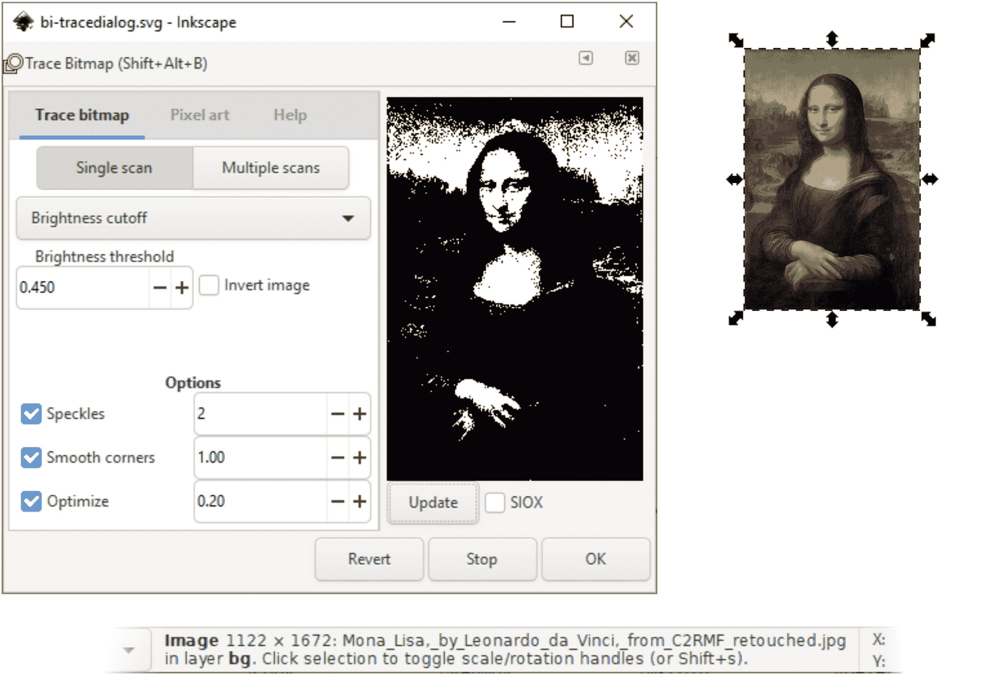

图 18-12：跟踪位图对话框

要执行选定位图对象的实际跟踪，请点击**确定**。对于大位图，这可能会很慢；请注意状态栏中的进度消息。您可以通过点击停止按钮中断跟踪；点击恢复将重置选项为默认值。

跟踪工具有几种操作模式。这些模式分为*单次扫描模式*（从图像创建单一路径）和*多次扫描模式*（创建多个路径并将其组合在一起）。

#### 18.5.2.1 亮度截止

亮度截止是最简单的路径跟踪方法。生成的路径覆盖比您设置的阈值更暗的任何区域。这个跟踪路径虽然是一个单一对象，但可以由多个不重叠的子路径组成（12.1.1）。这是跟踪简单单色形状（如徽标、文本、渐晕等）的最佳模式。

阈值设置为图像完整亮度范围的一个分数（图 18-13）。例如，阈值为 0.6 时，跟踪路径覆盖图像中比 60%亮度暗的区域；勾选反转框会反转阈值，使得路径覆盖图像中最亮的 40%区域。

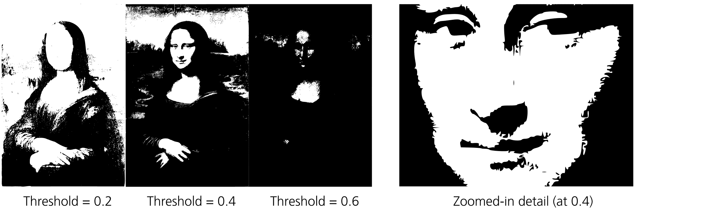

图 18-13：不同阈值的亮度截止跟踪

自动跟踪模式是另一种亮度截止模式，由不同的跟踪后端 Autotrace 提供支持，而不是其他模式使用的 Potrace 后端。在这种模式下，您不能设置阈值，但默认值可能适合您，正如图 18-14 所示。

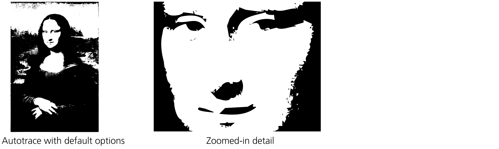

图 18-14：不同阈值的亮度截止跟踪

#### 18.5.2.2 跟踪质量

即使您正在跟踪的位图本身就是矢量路径的表现，跟踪也永远无法完全重现该原始路径。将矢量形状转换为位图总会导致信息丢失，而 Inkscape 的跟踪器无法通过任何其他方式恢复这些丢失的信息，只能进行猜测。一般来说，它在这方面表现不错，但在某些情况下，尤其是跟踪低分辨率位图或包含文本的位图时，您可能会对它无法识别某些特征（如弧线、直线、拐角）感到失望，正如图 18-15 所示。

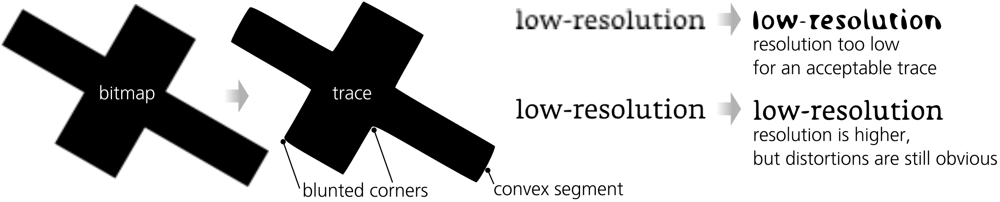

图 18-15：位图追踪中的一些常见质量问题

在这种情况下最好的建议是尽可能获得最高分辨率的位图。从一个关键特征仅有几个像素宽度的位图中获取体面追踪是非常困难的；追踪图像的高分辨率版本通常会带来巨大差异。此外，你可以尝试调整阈值，并在对话框底部尝试不同的选项（这些选项适用于所有模式，包括单次扫描和多次扫描模式）：

+   “斑点”选项会删除任何小于指定像素数的颜色块。这会抑制在追踪脏污或抖动的位图时出现的小的多余子路径。

+   增加“平滑角落”参数使得追踪算法不那么容易识别图像中的尖锐角落。当你从一个高度像素化、低分辨率的位图中追踪一个自然平滑的形状时，这可能很有用，因为你不希望意外的像素尖角在追踪路径中变成尖锐角落。相反，降低此参数适用于追踪没有任何曲线的几何形状。当“平滑角落”为零时，生成的路径几乎完全由直线段构成，这些直线段之间有尖角节点（但角落仍可能被倒角）。

+   “优化路径”参数尝试减少轨迹路径中的节点数，类似于“简化”命令的作用（12.3）。提高这个值会减少节点的数量，但也增加了引入可见失真或丢失形状细节的风险。

#### 18.5.2.3 其他单次扫描模式

边缘检测模式在追踪位图之前应用边缘检测滤镜。因此，追踪路径将包含沿着源位图颜色边界的窄条纹。阈值越低，检测到并追踪的边缘就越多。

颜色量化模式首先将图像量化（划分）为给定数量的区域（颜色），每个区域都有其主导颜色，类似于在位图编辑器中将全彩图像减少为固定调色板。然后，它会追踪*每一个*这样的区域，这通常会使颜色渐变呈现条纹状，正如图 18-16 所示。

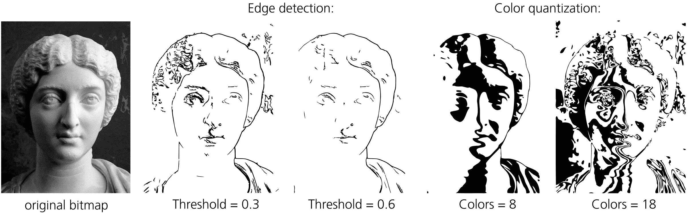

图 18-16：边缘检测和颜色量化模式

自动追踪提供的中心线追踪选项非常有趣。它有点类似于边缘检测，但生成的是描边路径，而不是类似描边的条纹。在没有明确边缘的区域，这种模式会创建一个迷人的几何图案，偏爱对角线，如图 18-17 所示。

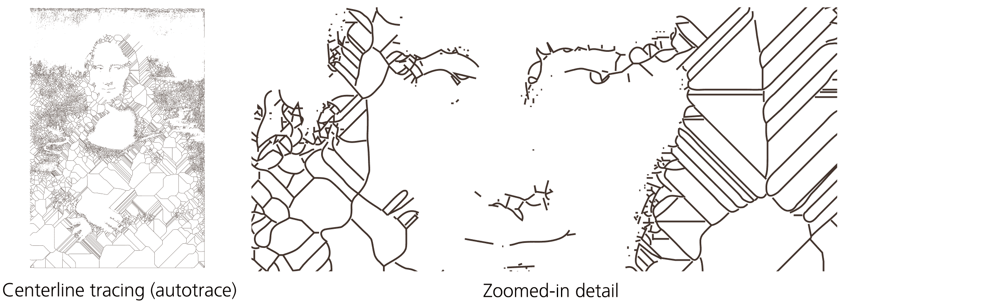

图 18-17：中心线追踪（自动追踪）模式

#### 18.5.2.4 多次扫描模式

像单次扫描的颜色量化模式一样，每种多次扫描模式开始时都会将图像量化为给定数量的区域（`Scans`参数）。接着，它会分别描摹每个区域，为每条描摹路径分配适当的颜色或灰度级别，并将所有路径合并在一起。通过足够多次的扫描，高分辨率位图的结果可能会看起来相当不错——忠实地重现颜色渐变、模糊、自然纹理等。

亮度级别模式最适合灰度图像；它忽略任何色调或饱和度的差异，仅根据亮度将像素分组到区域中（见图 18-18）。颜色模式在进行量化时考虑颜色的各个方面，能够最忠实地重现全彩图像（参见彩色插页中的图 16）。最后，灰度选项与颜色模式相同，只是生成的路径使用近似的灰度色调，而不是原始颜色。

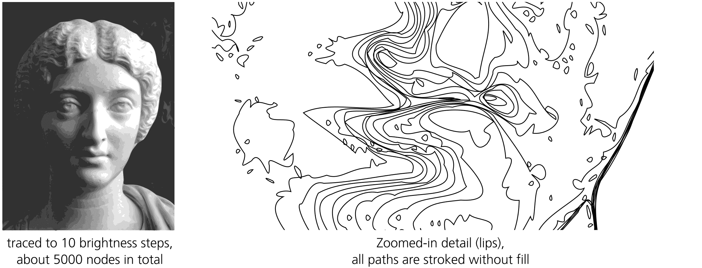

图 18-18：多次扫描：10 个亮度级别

平滑选项在进行量化之前会对图像应用一定程度的模糊；这在复杂的摄影图像中可能产生更好的效果。`堆叠扫描`选项最好保持开启：它确保每个区域的路径不仅覆盖该区域，还包括其下方所有区域的 z 轴顺序，这意味着扫描之间不会有间隙，如图 18-19 所示。

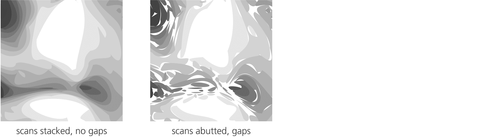

图 18-19：堆叠扫描与相邻扫描

删除背景选项仅从组中移除最底层的扫描路径。当你正在描摹一张带有单一颜色背景的物体照片，并希望仅保留物体的矢量表示而不包括背景时，这个功能非常有用。

#### 18.5.2.5 使用 SIOX 提取对象

SIOX 代表“简单交互式对象提取”；这是一种帮助你从图像背景中分离前景对象的算法。在 Inkscape 中，它是应用于图像的预处理器，在你勾选更新按钮旁的 SIOX 复选框时，在进行描摹（使用任何模式）之前进行处理。

然而，SIOX 的“交互式”部分表明，它不能完全自动完成任务，而是需要一些帮助。为了让 SIOX 正常工作，你必须选择两个对象：位图和位于其上的一个掩码路径，该路径标识你感兴趣的前景对象。这个掩码路径可以相当粗略，但它必须覆盖整个前景对象，并且周围至少有一些背景。SIOX 扫描的结果通常不完美（在图 18-20 中，猫周围仍需清除一些背景），但这是一个很好的起点，且你可以非常轻松地达到。

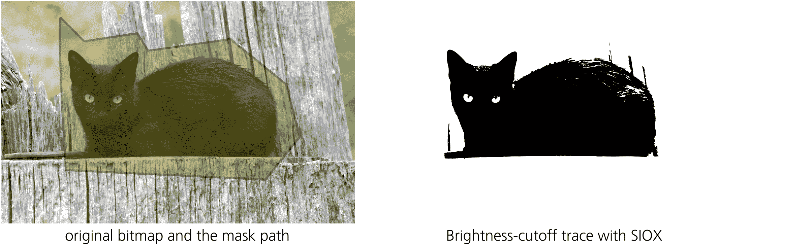

图 18-20：使用 SIOX 选项在描摹过程中提取前景对象

#### 18.5.2.6 像素艺术描摹 [1.1]

Inkscape 还有另一个叫做 *libdepixelize* 的追踪后端，专门用于将低分辨率位图向量化，其中有意义的特征可能小到单个像素，而且几乎没有抗锯齿效果。这类图像，通常被称为 *像素艺术*，曾是低分辨率时代计算机游戏的常态，然而令人惊讶的是，即使到今天，这仍然是数字艺术中的一种受欢迎的子类别。

Inkscape 并不是创建像素艺术的最佳应用程序，但其 Trace Bitmap 对话框中的 Pixel art 选项卡使其成为将一些旧的（或新的）像素艺术重新利用到矢量设计中的最佳工具之一。这并不意味着简单地将位图的像素重新创建为方形路径；如果你需要那样的效果，只需使用 Blocky 选项 (18.2.3) 导入位图并按原样使用，而不需要跟踪。相反，Inkscape 的像素艺术追踪器会尝试推断并重新创建像素艺术作者所设想的形状——基于他们的像素近似值。尽管听起来似乎不太可能，但结果往往非常令人满意。例如，当两个相同颜色的像素呈对角线相邻时，像素艺术追踪器足够智能，可以推断它们是一个单一特征，并将它们合并在输出中，如图 18-21 所示。

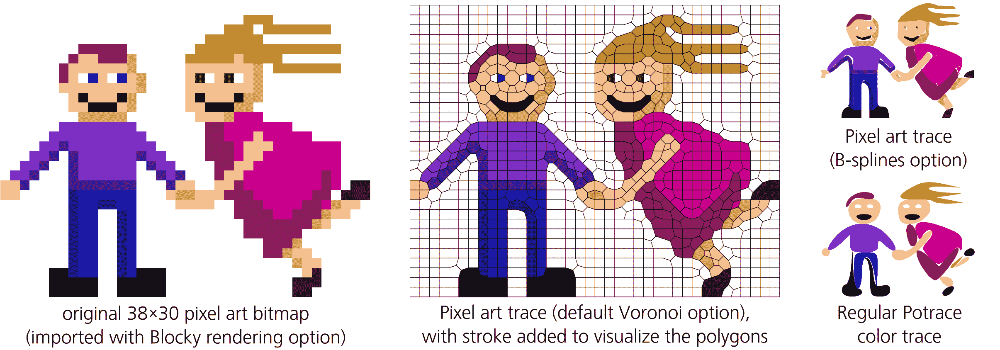

图 18-21：使用像素艺术追踪器

像素艺术追踪器的默认 Voronoi 选项通常是最好的；它创建的多边形分组被称为 *Voronoi 拼贴*（以 19 世纪的俄罗斯数学家命名）。另一个输出选项，B-splines，则尝试进一步平滑 Voronoi 多边形的形状，但结果通常不如前者整洁。为了做个对比，图 18-21 也展示了常规的 Potrace 颜色追踪器对同一像素艺术图像的处理效果。

Heuristics 部分的选项最好保持默认设置。如果你想了解更多关于像素艺术追踪器使用的算法，以及这些选项可以为你带来什么，建议从[`inkscape.org/doc/tutorials/tracing-pixelart/tutorial-tracing-pixelart.html`](https://inkscape.org/doc/tutorials/tracing-pixelart/tutorial-tracing-pixelart.html)中开始，这篇教程是由该功能的作者编写的。

## 18.6 位图导出

如今，由于网页浏览器对 SVG 的支持，Inkscape 的 SVG 文件常常直接用于网页中。不过，我们仍然生活在一个位图主导的世界里，因此栅格化的质量和位图导出功能对于矢量编辑器来说至关重要。

### 18.6.1 导出 PNG 图像对话框

使用导出 PNG 图像对话框（Shift-Ctrl-E）可以将你的图形或其中的任何部分以任意分辨率导出为 PNG 文件。对话框的各个区域从上到下允许你进行选择：

+   你想要导出的画布区域 (18.6.1.1)

+   位图的像素大小 (18.6.1.2)

+   导出文件的文件名及其格式 (18.6.1.3)

+   其他导出选项 (18.6.1.4)

+   导出格式参数 (18.6.1.5)

#### 18.6.1.1 导出区域

对于你想要导出的区域，窗口顶部有四个主要选项：Page、Drawing、Selection 和 Custom (图 18-22)。

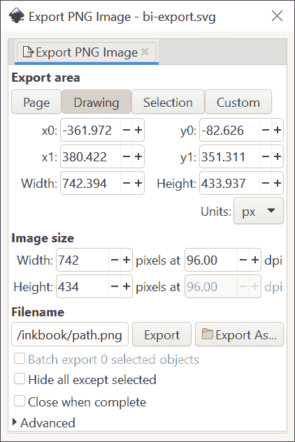

图 18-22：导出 PNG 图像对话框

Page 按钮导出的是 SVG 文档的页面内容，如画布上的框架所示 (2.3)，但页面边缘之外的对象会被排除。Drawing 按钮导出的是整个可见图形的边界框（隐藏的图层或对象不计入），它可能比页面要小或大；在导出的位图中，页面框架不可见。当按下 Selection 按钮时，窗口会导出当前选区的边界框（同样，它可以位于页面框架内外——这无关紧要）。

另外，你可以点击 Custom 并输入自定义文档坐标来设定左上角（x0, y0）以及右下角（x1, y1）或导出区域的宽度和高度。你还可以选择这些值的测量单位（默认为 `px`，A.6）。

导出 PNG 图像对话框不是模态的——也就是说，你可以在它打开时继续在画布上工作。除非你选择了 Custom，否则窗口会响应选区的更改，切换到选区模式，并更新坐标以匹配新选区的边界框。如果没有选择任何内容且你不在 Custom 模式下，窗口默认处于 Drawing 模式。

#### 18.6.1.2 图像大小

对于图像大小，输入宽度和高度的像素值（这里是位图像素，而不是 px 单位），或者调整 dpi 的分辨率值，dpi 代表每英寸的*点*（即像素）数。默认的 96 dpi 分辨率会使一个 SVG px 单位等于渲染位图的一个像素。水平和垂直的 DPI 值始终相同；更改三个可编辑值中的任何一个（宽度、高度、dpi）会自动调整另外两个以匹配。

如果你的图形包含一些以 px 为单位的对象（例如宽度为整数 px 的线条），并且你希望它们精确地导出到位图的像素中，那么仅选择 96 dpi 的分辨率可能不足够。例如，SVG 中的 1×1 px 方块可能会落在导出位图的像素边界之间，因此最终会扩展到四个相邻的像素，而不是一个。

解决此问题的一种方法是对导出的对象应用像素化滤镜（17.4）。另一种方法是在 PNG 导出选项中禁用抗锯齿（18.6.1.5）。这两种方法都能起作用，但你可能会发现单像素的特征在导出时消失或被固定到错误的像素位置。为了正确修复这个问题，你需要做更多工作。启用网格（7.2），并将你的对象对齐到默认的 1 像素大小网格（或者使用像素对齐扩展，13.4.2.6）。确保你的导出区域本身与网格对齐——也就是说，它在 px 中测量时具有整数的 x0 和 y0 坐标。完成这些步骤后，以 96 dpi 导出将为你提供一张完美清晰的图像，没有不必要的抗锯齿效果。

#### 18.6.1.3 导出文件名和格式

对于文件名，你可以手动输入或粘贴完整路径，或点击“另存为”按钮来访问文件系统并选择一个文件夹和文件。如果你已经导出了这个对象或整个页面，Inkscape 将尝试自动填充文件名（18.6.1.4）。如果文件已存在，系统会询问你是否要覆盖它。

[1.1]

长期以来，PNG 是 Inkscape 唯一支持的导出格式。默认情况下，Inkscape 仍然导出为 PNG 格式；PNG 格式保留了 Inkscape 所能提供的最高渲染质量，包括 alpha 透明度、抗锯齿和每通道 8 位的 RGB 颜色。从 1.1 版本开始，你还可以导出为其他一些格式：JPG（有损），WebP（有损或无损）和 TIFF（无损），以及优化的 PNG（有损或无损）。在“另存为”文件名选择器中的 **保存类型** 列表中选择其中一种格式，或者简单地在文件名后附加相应的扩展名（.jpg、.webp 或 .tiff；无法通过扩展名选择优化的 PNG）。

#### 18.6.1.4 导出提示

当你导出单个选定对象时，导出的文件名和分辨率会被记住并保存在该对象的节点中（因此在完成导出后你可能需要保存文档）。每当你再次选择此对象进行导出时，这些值会自动恢复到导出 PNG 图像对话框中。类似地，导出页面或图形时，文件名和分辨率也会被记住。

这些*导出提示*对于需要导出多个对象的情况非常省时——例如，将网页图形的多个切片导出为多个位图文件。如果你已经做过一次（并在之后保存了文档），只需在导出 PNG 图像对话框打开的情况下选择对象，你将会看到它们保存的导出文件名显示在文件名字段中。出于同样的原因——为了更方便地逐个导出多个对象——对话框会在你点击“导出”后仍然保持打开状态（尽管文件名字段下方也有一个“完成后关闭”复选框）。

你还可以通过选择所有要导出的对象并勾选“批量导出所有选定对象”复选框来加速这个过程。现在，当你点击“导出”时，Inkscape 会为每个选定的对象创建一个位图文件。如果某个对象已经被导出过（即已经保存了文件名和分辨率信息），则会使用这些值；否则，位图文件的名称将根据对象的 ID 构造（例如，text2402.png，参见 A.9），并且文件将被保存到最后一次保存 SVG 文档的文件夹中。

通常，即使你正在导出选择区域，你实际上导出的是一个区域——选择框，它可能包含其他可见的对象。勾选“隐藏所有非选定项”复选框可确保导出的位图仅包含*导出的对象*，而所有其他对象，即使它们重叠导出区域，也不会被渲染。

#### 18.6.1.5 导出格式参数 [1.1]

Inkscape 允许你调整导出格式的各种参数。虽然没有预览窗口，但如果你想尝试不同的参数值并立即看到结果，可以使用这个技巧。导出你的对象，然后再将其导入到 Inkscape 中，放置在你正在导出的对象或区域旁边。现在，你可以反复导出到同一个文件，使用不同的选项，每次 Inkscape 会重新加载新导出的文件，立即显示你设置的效果。

##### 18.6.1.5.1 PNG

在对话框的高级部分（默认收起）中，你可以为常规 PNG 导出（非优化 PNG）设置一些格式选项。

+   使用隔行扫描会创建隔行扫描 PNG 图像，当它用于网页时，在完整传输完图像之前，会先显示一个低分辨率的版本。

+   位深度控制输出 PNG 中颜色的表示方式。默认值是 `RGBA_8`，表示 RGB 颜色，Alpha 通道（透明度），每个通道 8 位；这正是 Inkscape 渲染器中颜色的表示方式，因此该选项将程序的光栅化输出存储得非常优化。你可以通过去除 Alpha 通道（`RGB_8`）或切换到灰度（`GrayAlpha_8` 或 `Gray_8`）并调整每个通道的位数，直到 1 位（适用于严格的黑白图像，`Gray_1`）。你还可以使用每个通道 16 位的全彩图像表示（`RGBA_16`），但由于渲染器仍然是 8 位的，这并不会实际增加输出中的信息量（例如，如果你在渐变中遇到带状现象，这个选项并不会减少带状现象）。

+   压缩设置决定 PNG 文件的压缩级别；最佳值取决于文件的内容，所以如果你想获得尽可能小的 PNG 文件，我建议使用外部工具，如 *pngcrush* 来处理 Inkscape 的 PNG 文件。

+   pHYs dpi 是记录在 PNG 文件中的分辨率值；这个值很少使用，因此将其设置为 0 没有问题。

+   抗锯齿实际上是 Inkscape 渲染器（称为 Cairo）的一个参数，而不是 PNG 文件的参数。你可以在此处选择关闭所有抗锯齿（`CAIRO_ANTIALIASING_NONE` 选项），或者通过选择 `CAIRO_ANTIALIASING_BEST` 来改善默认的 `CAIRO_ANTIALIASING_GOOD`。

##### 18.6.1.5.2 其他格式

对于除常规 PNG 以外的格式，进度条完成后会弹出一个选项对话框——即 Inkscape 渲染位图完成后。

对于 JPG 格式，你可以设置质量（1 到 100，默认值为 90）和渐进选项；在通过慢速连接下载时，渐进 JPG 文件会先显示低分辨率的预览，随后再显示完整的高清图像（这对于大图像更为适用）。WebP 格式具有无损选项，并且可以调整质量和速度的参数。TIFF 格式仅具有质量和速度参数。

对于优化的 PNG 格式，你可以开启交错（类似于 JPG 的渐进选项），并选择进行多少次尝试以实现最佳图像压缩。在“选项”对话框的“有损选项”标签下，你可以启用各种减小图像大小但可能降低质量的选项（如位深、颜色类型、调色板）。

### 18.6.2 通过命令行导出

在命令行运行 Inkscape 时，也可以使用“导出 PNG 图像”对话框中的所有功能。通过这种方式，Inkscape 可以作为一个无图形界面的实用工具，通过脚本或程序自动化各种 SVG 渲染任务。例如，下面是如何以 600 dpi 导出 `id="text2402"` 的对象：

```
$ inkscape document.svg --export-fileid=img/text.png --export-id=text2402 \ --export-dpi=600
```

通过命令行导出非 PNG 格式的功能从 Inkscape 1.1 起不再有效。有关 Inkscape 命令行开关的完整列表，请参见 附录 C。

### 18.6.3 图标预览

虽然在“导出 PNG 图像”对话框中没有预览窗格，但如果你使用 Inkscape 创建图标，一种预览你作品在不同图标尺寸下渲染效果的方法是通过图标预览对话框，你可以从“视图”菜单中调用它（图 18-23）。

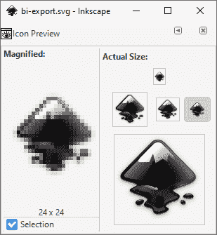

图 18-23：图标预览对话框

此对话框包含您文档在几个典型图标尺寸下的光栅化预览，从 16×16 到 128×128 像素；在对话框的左侧，其中一个渲染图像会被放大显示，以便你查看你的矢量对象如何转换为实际的像素。点击 **选择** 复选框，可以将预览从显示整个文档切换为当前选择部分。

### 18.6.4 创建位图副本

在你从文档中导出某个内容后，你可以导入（18.1）位图文件来检查光栅化效果。如果你需要将该位图包含在文档中而不是作为单独的文件，可以使用 Inkscape 的快捷键：编辑 ▶ 创建位图副本命令。

该命令导出所选对象（不保存文件），并将结果作为嵌入式位图重新导入文档，覆盖在选择区域上。你可以在首选项的“导入图像”页面设置导出的分辨率；默认值为 96 dpi，对于该值，命令还会将导出区域对齐到 1 像素网格，确保创建的位图的像素精确对齐到像素方块的边界，如图 18-24 所示。

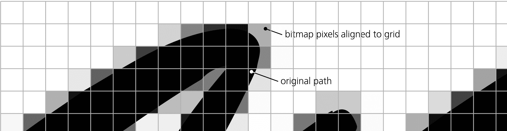

图 18-24：与网格对齐的 96-dpi 位图路径副本

你可以使用此命令快速预览艺术作品的光栅化效果（之后，可以删除位图对象）。它还在你使用一些非常慢渲染的过滤器（17.6）时很有用，尤其是当你不想在无过滤器或轮廓模式下工作时；在这种情况下，只需制作过滤后的对象的位图副本，并隐藏那些渲染缓慢的原始对象。

## 18.7 位图过滤器和扩展

你可以将 Inkscape 的过滤器（第十七章）应用于任何类型的对象，但它们在你有一个无法用标准矢量工具编辑的位图时可能最为有用。我特别推荐混合模式叠加（17.2）和预设过滤器（17.4），它们位于模糊、颜色和图像效果子菜单中。你应该尽可能使用过滤器，因为它们是无破坏性的，并且不会改变你导入的原始位图文件。

然而，有时你确实需要改变位图数据本身。如上所述（18.2.1），对于链接的图像，你可以直接使用你最喜欢的位图编辑器进行编辑，甚至可以从 Inkscape 内部启动该编辑器。然而，这种功能对于嵌入图像来说并不可用。在这种情况下，扩展（第十九章）可以提供帮助；一些常见的位图处理算法已经作为扩展实现。以下是那些最有用的—并且是通过过滤器无法完全实现的—扩展，它们位于扩展▶栅格子菜单中（见图 18-25）：

+   自适应阈值会将每个像素的 RGB 通道的值调整为极端值，取决于该像素是否高于或低于阈值。这个阈值是根据该像素的局部邻域计算得出的（其大小由宽度和高度参数定义）。这是一种有价值的转换，因为它类似于人类感知图像的方式——我们判断一个点是“亮”还是“暗”，是相对于其局部区域，而不是整个图像的平均亮度。

+   添加噪声可以让你选择多种类型的噪声叠加在图像上；大多数类型看起来或多或少像散布的沙粒。

+   裁剪是一种减少嵌入图像的 SVG 大小的方法——与裁切不同，它实际上会从边缘移除部分位图数据（你可以指定每一侧裁剪的大小）。

+   降噪、增强和减少噪点实现了各种噪声降低算法。

+   抖动随机地将像素散布在位图中，数量指定散布的半径。

+   均衡化应用直方图均衡化到图像。

+   HSB 调整调整色相（范围从-360 到 360）、饱和度（-200 到 200）和亮度（-200 到 200）。

+   爆炸、旋转和波动平滑地扭曲图像，或多或少地符合其名称所暗示的效果。波动使用具有给定振幅和波长的水平正弦波。

+   Level 将黑色点以下的像素变黑，将白色点以上的像素变白，并将位于该范围内的像素按完整颜色范围进行缩放。当黑色点大于 0 或白色点小于 100 时，扩展会增加图像的对比度。伽玛校正指定额外的亮度修正（1 表示无变化）。

+   Level（带通道）与 Level 相同，但只针对单一通道。

+   中值滤波将每个像素涂上其圆形邻域的中值颜色；结果有点类似于模糊处理，但中值滤波能够保留那些颜色差异较大的部分之间的清晰边界。

+   归一化通过将像素的颜色范围扩展到完整的颜色范围来增加对比度（例如，如果图像没有红色，所有颜色将会倾向于红色，以弥补这一点）。

+   油画效果类似于中值滤波，但还会以类似画笔笔触的方式融化相似的邻近颜色。

+   重采样改变位图的像素大小而不进行缩放。重采样*向上*不会改变图像的外观，但如果你打算应用其他效果并希望其适用于更高分辨率，则可能会很有用。重采样*向下*会使图像失去细节，但不会改变文档中的尺寸；像裁剪一样，这会减小嵌入位图的 SVG 文档的文件大小。

+   锐化和反锐化蒙版是经典的图像锐化算法。

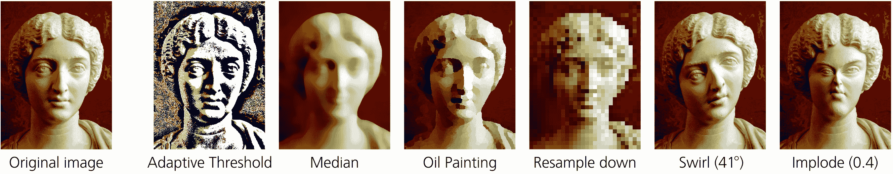

图 18-25：来自扩展▶栅格的扩展效果示例

与滤镜不同，扩展会对它们处理的位图进行永久性修改。你可以撤销一个扩展，但不能在应用之后调整其参数。此外，与滤镜不同，这些扩展*仅*能作用于位图对象——你不能将位图效果应用于位图的克隆。例如，如果位图是链接的，这些效果将嵌入位图并作用于嵌入的副本，而不是外部链接的原始图像。有关扩展效果的工作技巧，请参考 19.1。

## 18.8 色彩管理

色彩管理的目的是确保你的艺术作品中的颜色能够在不同的输出设备之间正确转换，通常是从屏幕到打印。不同设备可以再现的颜色范围不同，一些色彩失真是不可避免的。色彩管理让你可以预览、控制，从而尽量减少这些失真。

Inkscape 从来没有声称自己在色彩管理方面是最好的。你可以使用屏幕校样来预览输出颜色，但仅凭 Inkscape，你不能准备一个嵌入色彩配置文件的色彩分离文件进行打印。然而，在大多数情况下，你可以通过使用一些额外的软件来获得所需的结果，正如本节所描述的那样。

另一方面，自从本书的第一版出版以来，色彩管理的重要性确实有所下降。如今，许多图形更多的是从屏幕传输到屏幕，而不是从屏幕传输到纸张。此外，消费级计算机显示器和桌面彩色打印机的质量现在更加统一——大多数桌面打印机会接受并打印与屏幕上显示的 RGB 数据相同的数据，自动进行色彩转换，而无需你做额外的工作。

只有当你打算在高端商业打印机上打印设计时，通常是通过将其发送给印刷服务提供商，你才需要研究 Inkscape 的色彩管理功能。即使那样，如果你要求的话，一些提供商可以为你执行色彩管理。如果你能够充分控制这个过程（例如，能够审阅打印样张），通常这是最好的选择，因为印刷服务人员知道什么对他们的设备最有效。

### 18.8.1 ICC 色彩配置文件

ICC 色彩配置文件是一个描述输出设备色彩能力的文件。如果你想准备文档以便在特定设备上输出，首先必须获取与该设备及输出介质（例如用于打印的纸张类型）完全对应的 ICC 配置文件。有时，你可以在互联网上找到合适的配置文件（例如，在打印机硬件制造商的网站上），但通常，你需要向将要使用的印刷服务提供商索取。

一旦获取到目标配置文件，你需要将其安装到操作系统中。在 Windows 10 中，安装非常简单，只需右键点击 .icc 文件并选择“安装配置文件”。在 Linux 中，你需要安装*gnome-color-manager* 或 *colord-kde*；然后，双击 .icc 文件并点击“导入”。

### 18.8.2 屏幕校样

由于典型打印机的色彩范围比计算机显示器狭窄，Inkscape 可以通过模拟打印机色彩来预览（校样）打印输出。这被称为*屏幕校样*或*软校样*。为此，你需要拥有两个 ICC 色彩配置文件：一个是你将要使用的打印机的配置文件，另一个是你屏幕的配置文件。

理想情况下，你应该使用一种叫做*色度计*的专用硬件设备对显示器进行*校准*；这种校准会为你的显示器创建一个自定义的 ICC 配置文件。然而，除非你的质量要求非常严格，否则你大概可以使用一个通用的 RGB 配置文件，例如 Windows 自带的那个配置文件。

在**首选项**中，进入**输入/输出 ▶ 色彩管理**页面。在**显示调整**部分选择显示配置文件（如果有多个的话）。然后，在**校样**部分，勾选**模拟屏幕输出**并选择目标设备的**设备配置文件**（即你计划用于打印作品的打印机）。设置完成后，可以通过**视图 ▶ 色彩管理视图**或在 Inkscape 编辑窗口中垂直和水平滚动条之间的小切换按钮来切换色彩管理视图。

对于屏幕和目标设备配置文件，你还可以选择设备渲染意图。在大多数情况下，默认的感知渲染（Perceptual）是最佳选择；如果你希望输出看起来尽可能色彩丰富（例如，当打印简单的商业图形时），可以尝试饱和度（Saturation）。

如果某个屏幕颜色是“色域外”——即在输出设备上无法渲染——你可以通过指定色域外标记颜色使其立即可见。例如，如果你的设计中没有红色，勾选**标记色域外颜色**并为**色域外警告颜色**选择红色。然后，每当你在图形中看到红色时，就知道你需要更改该对象的实际颜色（该颜色会显示在状态栏或填充和描边对话框中——红色标记仅在图形中显示），如果你希望打印时不会出现严重的失真。

### 18.8.3 色彩分离与嵌入

屏幕校样有帮助，但可能不够——你可能需要生成一个已经转换为目标色彩系统的文件。这类文件通常被称为*色彩分离文件*，因为它们包含了与输出设备墨水对应的分离色彩通道（通常是 CMYK，8.4.2）。这样的文件也可能嵌入了目标色彩配置文件。最常用的格式是 PDF（矢量）和 TIFF（位图）；两者都可以包含色彩分离数据并嵌入 ICC 配置文件。

尽管 Inkscape 可以导出 PDF 和 PNG，但它无法进行色彩分离或配置文件嵌入。你需要一些其他软件来完成这项工作，比如 Adobe Photoshop（用于 TIFF）或 Illustrator（用于 PDF）；两者都可以直接导入 Inkscape 的 SVG 格式。

你还可以使用开源软件。Scribus 排版程序（[`scribus.net/`](http://scribus.net/)）可以导入 SVG 并创建色彩分离的 PDF；从 Inkscape 1.0.1 版本开始，你可以通过 Inkscape 的保存对话框设置 PDF 导出到 Scribus（详细信息请参阅 Inkscape 1.0.1 发布说明）。GIMP 的青色插件（[`github.com/rodlie/cyan/`](https://github.com/rodlie/cyan/)）可以将 Inkscape 导出的 PNG 位图转换为带有屏幕校样的色彩分离 TIFF，便于完全控制。
