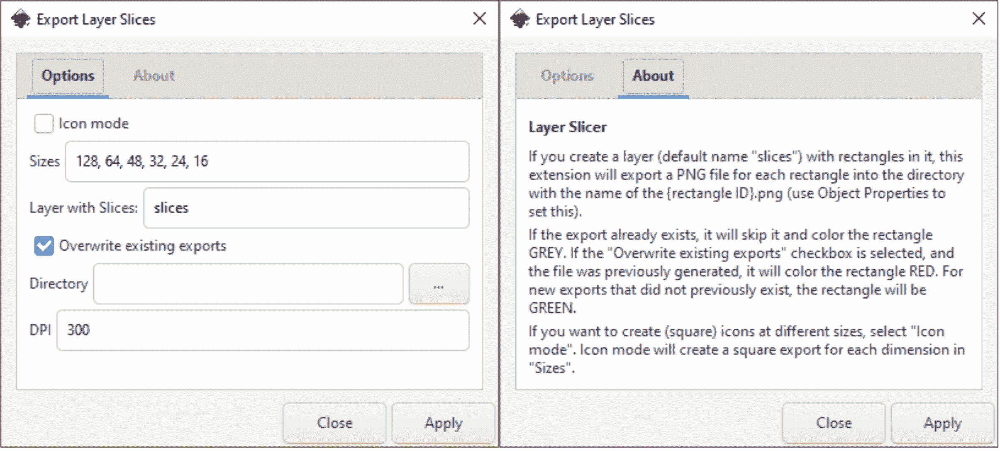
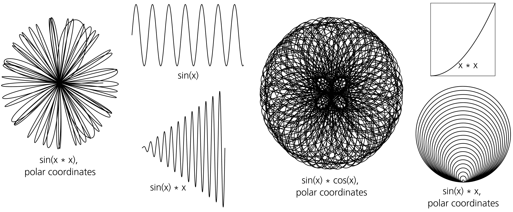
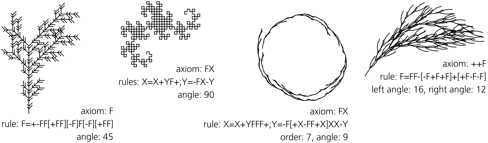
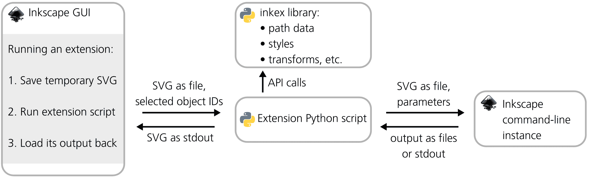
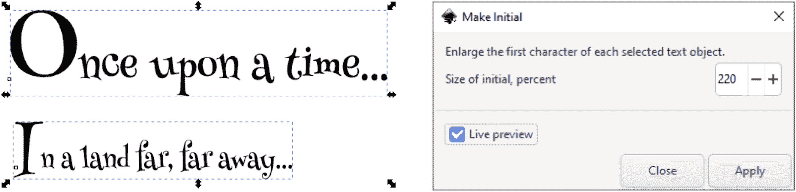

# 第二十章：扩展

大多数长期存在的软件项目都将其成功的很大一部分归功于可扩展性。如果你能吸引并留住外部开发者，他们拥有独特的需求、视角和方法，你的软件产品就能获得防止遗忘的良好保障。Inkscape 的扩展生态系统虽然不大，但它是程序影响力的重要组成部分。Inkscape 1.0 自带了近 200 个扩展，你可以在网上找到更多的扩展。

在本章中，我首先从用户的角度介绍扩展。我将解释扩展的 UI 界面（19.1）并通过示例描述 Inkscape 自带的一些重要扩展（19.2）。接下来，我将转变为开发者的身份；我将解释 Inkscape 扩展的架构（19.3），并引导你完成从零开始创建一个简单扩展的示例（19.4）。由于 Inkscape 是一个开源应用程序，每个人都可以（并且被鼓励）为其贡献；编写扩展可能是解决你独特问题并让你的解决方案对他人有用的最简单方法。

## 19.1 使用扩展

*扩展*是你可以运行的代码片段，用来对 Inkscape 文档中选定的对象执行某些操作。在 Inkscape 中，你可以通过扩展子菜单中的命令访问大多数扩展。与路径效果（第十三章）或滤镜（第十七章）不同，扩展是一次性的操作；它通常是破坏性的，修改对象时不会保留原始对象。撤销扩展操作的唯一方法是通过 编辑 ▶ 撤销。

一个典型的扩展有多个参数，你需要在运行扩展之前在对话框中设置这些参数。对话框可能有多个标签页，一些功能最完善的扩展会有一个关于或帮助标签，描述扩展及其使用方法，如图 19-1 所示。



图 19-1：导出图层切片扩展：参数对话框的两个标签页

大多数扩展对话框都有一个实时预览复选框；选中后，它会显示应用当前参数后的文档效果。这样，你可以在不撤销并重新运行扩展的情况下，尝试不同的参数值。要将参数应用为最终值，点击**应用**；要取消并不运行扩展，点击**关闭**。

当实时预览关闭时，扩展对话框不是模态的，因此你可以平移画布并选择不同的对象；一旦开启实时预览，对话框会锁定 Inkscape 的其余部分，这样你只能更改对话框中的参数并查看其效果。对于一些扩展，更新可能会很慢，尤其是当你的文档很大且复杂时。

“扩展”菜单中的“上一个扩展”命令可以重新运行上一个扩展命令，而无需显示参数对话框。“上一个扩展设置”命令会打开上一个扩展的参数对话框，您可以从中再次运行该扩展。

## 19.2 Inkscape 扩展指南

许多扩展已经在本书中提到或描述过。在某些（但远不是所有）情况下，某个扩展是实现相同结果的另一种选择，可能是某个更方便或集成的方法；当扩展重复了程序核心中的功能时，通常是因为扩展先于核心功能出现。不过，许多扩展仍然是 Inkscape 工具箱中独特且不可或缺的工具。让我们一起浏览“扩展”菜单，看看有哪些可用功能：

+   “排列”子菜单包含用于 z 轴顺序操作的“重堆叠”（Restack）功能（4.4）和用于解除多层次组合的“深度解除组合”（Deep Ungroup）功能（4.8.1）。

+   颜色扩展改变所选矢量对象的颜色（但不适用于位图），如 8.10.1 中详细说明。

+   文档有两个扩展，用于在假设 90 dpi 分辨率的旧版 Inkscape SVG 文档和基于 96 dpi 的新文档之间转换（详细信息请参见 4.2 末尾的注释）。

+   导出扩展实现了多种导出文档的方法，例如将其发送到绘图仪设备（Plot）或导出网页设计稿的多个切片（Export Layer Slices，这是一种对标准批量导出功能的改进，见 18.6.1.4）。

+   Gcodetools 是一组扩展，用于将文档准备并导出为各种计算机化机床理解的 G 代码语言，您可以利用这些扩展，比如将金属徽章从 Inkscape 设计中切割或雕刻出来。

+   “从路径生成”、“修改路径”和“可视化路径”子菜单提供了多种路径处理扩展，详见路径效果章节（13.4）。

+   “图像”子菜单包含嵌入和提取图像的工具（18.2.1），以及更改图像属性的工具（18.2.3）。

+   JessyInk 扩展将 Javascript 代码片段插入文档中，当在浏览器中查看时，它会将文档转变为互动演示。通过这些代码片段，您可以滚动页面、让对象响应点击、使用过渡效果，甚至插入视频。

+   光栅（位图处理）扩展在 18.7 中进行了审查。

+   样式表 ▶ 合并样式到 CSS 是当你有多个对象使用相同样式并且希望将样式存储在一个地方，以便同时更新所有对象时使用的工具。请记得，Inkscape 支持应用共享样式到多个对象的选择器（8.1）；此扩展从选定的对象创建这样的选择器，然后将它们的内联样式属性切换为该选择器。

+   文本扩展在关于文本的章节中已描述（15.7）。

+   Typography 是一组有助于创建 SVG 字体的扩展（15.8）。

+   网络扩展再次提醒你，Inkscape 的文档可以作为网页使用，因为现代网页浏览器支持 SVG（另见上面的 JessyInk）。Web ▶ JavaScript ▶ 设置属性扩展允许你根据给定事件（通常是点击某个其他元素）改变对象的样式属性。Web ▶ JavaScript ▶ 传输属性则类似，但会将被点击对象的属性复制到另一个对象。你需要先选择两个对象，点击目标对象为第一选项，改变属性的对象为第二选项，然后调用这些扩展。

### 19.2.1 渲染子菜单

渲染子菜单包含生成全新对象的扩展—这些对象与文档中的任何内容无关。大多数扩展尚未提及，以下是一些显著的扩展：

3D 多面体

创建任何多个三维形状的投影，从立方体到巨大星形十二面体；你可以指定形状的空间角度和面部样式。

条形码

本子菜单中的扩展创建经典的线性条形码（支持的格式包括 EAN8、EAN13、Code39、Code128 等），二维 Datamatrix 条形码，或带有指定文本的方形二维码。

日历

如果你需要的话，此扩展会为你填充页面，生成一个给定年份的完整格式化日历，提供多种布局、样式和本地化选项。

Draw From Triangle，Triangle

类似于几何构造的路径效果（13.3.15），Draw From Triangle 根据通过选定路径的前三个节点定义的三角形，绘制一系列几何形状（如外接圆或垂心）。Triangle 扩展通过任何明确的边和角的组合创建一个三角形。

Function Plotter，Parametric Curves

这两个扩展用于绘制函数图形。Function Plotter 创建单个函数的图形（例如，移动物体的高度随时间的变化），而 Parametric Curves 则绘制一个曲线，其中 X 和 Y 坐标作为独立*参数*变量（通常称为 *t*）的函数变化（例如，X 和 Y 可能代表物体随着时间变化的坐标）。

在调用这些扩展之前，绘制或选择一个矩形，定义图形的比例，并使用数字参数来定义 X 和 Y 坐标的范围。勾选“将 X 范围乘以 2*pi”复选框对于三角函数非常方便；例如，0 到 2 的范围将被视为 0 到 2 × π。在函数绘图器中，勾选“使用极坐标”复选框将图形转换为一个圆，其中心位于所选矩形的中心，X 范围映射到角度，Y 范围映射到半径。

“样本”参数设置函数（们）将被采样的总次数；由于每次采样都会产生一个节点，因此这也是生成路径中节点的总数。这个数字越高，图形越精确。样本的最佳数量取决于函数的特性；例如，X 范围内具有*n*个周期的周期性函数，至少需要每个周期几个样本才能准确再现。

函数是用 Python 编程语言编写的。你可以使用一些内置的数学函数，如`sin(x)`、`log(x)`或`sqrt(x)`；参阅“函数”选项卡以查看完整列表。

在函数绘图器（图 19-2）中，你可以给出绘制函数的**一阶导数**；导数的值决定了每个节点的贝塞尔手柄的角度。你可以选择让扩展程序数值计算一阶导数，或者取消勾选该复选框并提供导数函数的解析形式，使用相同的 Python 语法和内置函数——例如，`sin(x)`的一阶导数是`cos(x)`。



图 19-2：函数绘图器示例

齿轮

这两个扩展创建一个圆形齿轮或齿条齿轮，具有给定数量的齿、齿距和接触角。

网格

这一系列扩展用于创建线网格——矩形网格（笛卡尔坐标系，例如图 13-60 中的网格）、等距网格或极坐标网格。线条数量和间距的选项不言而喻；主线和次线使用不同的笔画宽度。线条可以按对数间隔分布。每条线都是一个独立的路径对象。

指导线创建器

这个扩展通过添加指导线将页面划分为任意数量的行和列（7.1）。

L 系统

这个扩展实现了**林登迈尔系统**——一种简单的图形语言，通过递归可以生成复杂的顺序或树状结构（图 19-3）。

这种语言中的程序由简单的命令构成，例如“向前画一步”或“向左转”。你从一个公理开始，并递归地应用替代规则，受限于 Order 参数。其余参数决定了由基本命令生成的线条的长度和角度；你也可以随机化这些值，以产生更自然的结果。有关公理和规则中识别的命令的完整列表，请参见帮助标签。



图 19-3：L 系统示例

数学 ▶ LaTeX

这个扩展运行`pdflatex`（需要在你的计算机上安装）将 LaTeX 字符串转换为矢量公式图像，并将其插入到你的文档中。

NiceCharts

这个扩展可以基于文件或字符串中的数据创建条形图、堆叠条形图或饼图。参数决定了图表元素的大小、间距和样式。

随机树

类似于 L 系统，但更为原始，这个扩展绘制了一个随机分支树，其中树干的第一段是初始大小，并且每个后续的分支逐渐变短，直到达到最小大小，绘制停止。初始大小和最小大小之间的差距越大，树就越复杂。

Spirograph

Spirograph 是一个玩具，其中一个小圆圈（持笔）沿着一个更大圆形孔的内边缘滚动。这个扩展实现了相同的思想，你可以用它来生成各种光滑的中央对称曲线。

Wireframe Sphere

这是一个扩展，当你需要一个几何上正确的经纬度网格球体时可以使用。

## 19.3 扩展架构

本章其余部分更加技术性。如果你有兴趣了解 Inkscape 的扩展是如何实现的，为什么你可能想自己制作一个，以及如何操作，请继续阅读。熟悉编程基础，特别是 Python 语言，会更有帮助。

图 19-4 展示了 Inkscape 扩展架构的概览。



图 19-4：Inkscape 扩展：幕后解析

与 Adobe 产品不同，Inkscape 没有“一级”插件，这些插件会加载到主程序的内存空间中，并具有与 Inkscape 本身相同的访问权限，能够访问文档的树结构和程序的 API。相反，Inkscape 扩展只是一个用 Python 编写的脚本，Inkscape 在当前文档的（临时）保存副本上运行该脚本——然后将脚本的输出重新加载进来，用它替换文档并尽可能恢复对象选择。Inkscape 的扩展运行机制将所有这些保存、处理和重新加载的过程压缩成一个可撤销的操作，用户无需了解细节。更重要的是，当你在扩展对话框中启用实时预览复选框时，每次更改参数都会导致另一个保存-处理-加载周期——如果你再次更改参数或在未点击应用的情况下关闭对话框，这个周期会被自动撤销。

扩展脚本的责任是不要触碰文档中不应该触碰的部分。除了对文档进行保存的临时副本引用外，它还传递了当前选定对象的列表，以及当然，还有用户在扩展对话框中设置的参数。脚本必须加载并解析 SVG 文件，找到其中的选定对象，进行相应操作，并将修改后的文档以序列化 SVG 格式输出（通过标准输出）。

如果这种方法让你觉得笨拙和低效，那是因为它确实是这样的。然而，扩展代码与 Inkscape 核心的这种彻底解耦也有其优点。最大的一点就是为新开发者提供了低门槛。你不需要深入了解 Inkscape 本身就可以开始；你只需要基本的 SVG 熟悉度和了解如何在 Python 中处理文档的 XML 树。现有的 Inkscape 扩展也很容易学习、修改或分叉，原因正是如此。另一个优点是，任何扩展都可以很容易地作为独立脚本重用，你不仅可以在 Inkscape 中运行它，还可以在各种自动化处理场景中使用。

虽然在扩展中无法访问 Inkscape 的内部，但这并不意味着你完全孤立无援。Inkscape 附带了一个名为 `inkex` 的 Python 库（用于 INKscape EXtensions），扩展脚本应该使用它。它提供了许多繁琐且复杂的任务功能，你的代码中无需处理这些任务，例如解析路径数据（`d` 属性）、解析样式字符串并计算对象的有效样式（考虑继承和 CSS 选择器）、操作变换矩阵等等。通过 `inkex`，你可以编写更强大的算法，让它为你处理低级的繁琐工作。

然而，有时即使是 `inkex` 也不够用。你可能需要做一些只有 Inkscape 本身才能做到的事情——例如，从源文档中创建一个或多个 PNG 导出。为此，你需要运行 Inkscape 本身——通过命令行调用，可能是多次调用一个 *第二份* Inkscape 副本。在旧版本中，甚至获取对象的正确边界框也需要通过命令行调用 Inkscape（使用 `--query` 参数，C.5）；截至目前，`inkex` 可以为路径对象提供正确的边界框，但对于文本仍然无法做到（因为正确渲染任意字体和文本布局的复杂性）。

## 19.4 创建扩展

本章的其余部分将引导你从头开始创建一个极其简单——但仍然基本有用——的 Inkscape 扩展。希望通过看到这一过程是多么简单和自然，你能感到鼓励去自动化你自己的繁琐和重复的手动任务——也许，最终，你会分享你的解决方案，让其他人也能受益。

这个示例扩展，叫做 *Make Initial*，通过取文本对象的第一个字符并增大其字体大小，创建一个简单的初始字母。它有一个参数：字母的大小，作为其余文本字体大小的百分比。

### 19.4.1 .inx 文件

在开始 Python 代码之前，我们需要为扩展创建一个 .inx 文件（来自 INkscape eXtension）。这是一个 XML 文件，它向 Inkscape 描述这个扩展是什么，如何运行，以及如何呈现给用户。以下是 Make Initial 扩展的 makeinitial.inx 文件：

```
<?xml version="1.0" encoding="UTF-8"?>
<inkscape-extension xmlns="http://www.inkscape.org/namespace/inkscape/extension"> <name>Make Initial</name> <id>com.kirsanov.text.makeinitial</id> <label>Enlarge the first character of each selected text object.</label> <param id="initialsize" type="int" min="0" max="1000" gui-text="Size of initial, percent">200</param> <effect> <object-type>text</object-type> <effects-menu> <submenu id="Text"/> </effects-menu> </effect> <script> <command location="inx" interpreter="python">makeinitial.py</command> </script>
</inkscape-extension>
```

根元素 `inkscape-extension` 只是一个容器。注意强制要求的 `xmlns` 属性，它设置了文件的命名空间，缺少它的话，Inkscape 无法识别该文件。`name` 是扩展在菜单中显示的名称；`label` 是将在扩展对话框中显示的介绍文本。`id` 可以是任何字符串，只要它对你的扩展来说是唯一的。

单个 `param` 元素（可以有任意数量的它们）描述了扩展的参数。它叫做 `initialsize`，是一个整数（因为这是一个百分比，所以我们不需要浮点精度），范围从 0 到 1000。`gui-text` 属性提供了它在对话框中的标签，而元素的内容（200）是初始值（第一次使用后，Inkscape 会记住并恢复你上次为所有参数使用的值）。

`effect` 元素将这个扩展标识为 *效果扩展*；其他扩展类型包括 `input`、`output` 和 `template`（详见 19.4.2）。在其中，`object-type` 元素标识了此扩展接受的选定对象类型；可能的值有 `all`、`path` 或 `text`。`effects-menu` 元素将此扩展放置在扩展菜单中的文本子菜单下。

最后，`script` 元素告诉 Inkscape 如何运行此扩展。在 `command` 元素中，`location="inx"` 指示它在与 .inx 文件相同的文件夹中查找可执行文件，`interpreter` 属性指定 Python 作为要使用的解释器（Inkscape 1.1 中包含的版本是 Python 3.8.9）。该元素的内容（makeinitial.py）指向扩展的主代码文件。

### 19.4.2 inkex 基类

过去，Python 是一种快速而粗糙的脚本语言，结构较为松散。如今，你可以—并且被鼓励—编写完全面向对象的 Python 代码。Inkscape 的 `inkex` 库就是一个很好的例子：在 `import inkex` 后，你首先要做的就是创建一个类来容纳扩展的代码。你的类应该扩展 `inkex` 的 *基础扩展类*，以便继承加载 SVG 文档、解析参数以及将修改后的文档输出回去所需的所有实用方法。

`inkex` 库包含几个基础扩展类，适用于各种类型的扩展，从通用到专业化的都有。选择一个最适合你需求的类。

+   `EffectExtension` 是最通用的扩展类型，如 图 19-4 所示，它接受输入文档和选定对象的列表，对它们进行处理，然后返回修改后的文档。你需要实现执行实际处理的 `effect` 方法。这是我们将用于示例的基类。

+   `GenerateExtension` 用于一种不关心源文档或其选择的扩展；它所做的仅仅是生成一些新对象，并将其添加到文档中。基类负责将生成的对象添加到文档中，默认将它们放置在视图的中心。你需要实现 `generate` 方法。

+   `InputExtension` 是一种在扩展菜单中不可用的扩展；相反，它将一个新项添加到“打开”和“导入”对话框中的文件格式列表中。要通过输入扩展支持新文件格式，你需要实现 `load` 方法，该方法从流中读取输入文件，并可选地实现 `effect` 方法来转换结果。不用说，你必须返回有效的 SVG。

+   `OutputExtension` 类似，用于输出扩展，它表现为在“保存”和“另存为”对话框中的文件格式。你需要实现一个可选的 `effect` 方法，在保存前转换文档，以及一个强制性的 `save` 方法，执行实际的输出到流中。

+   `CallExtension` 是为设计为 Inkscape 与某些外部 SVG 处理应用程序之间简单接口的扩展。你需要实现 `call` 方法，该方法在输入文件上调用你的应用程序并生成输出文件。对于此类任务，这个基类比通用的 `EffectExtension` 更高效，因为它甚至不需要在 Python 代码中解析 SVG。

+   `TemplateExtension` 是一个提供新文档模板的扩展。与输入和输出扩展一样，它不在扩展菜单中列出；相反，它会在从模板新建对话框中将一个项目添加到模板列表中（见图 3-3）。你可以实现 `get_template` 方法，该方法返回模板的可用 SVG 代码（例如，通过从文件中读取）。或者，你可以实现 `get_size` 方法（返回模板的大小）和/或 `set_namedview` 方法（创建 `sodipodi:namedview` 元素，在该元素中设置标尺、页面边框、缩放等）。

+   `ColorExtension` 是一个专门用于调整选定对象颜色的效果扩展。你需要做的就是实现 `modify_color` 方法，该方法接受一个输入颜色并返回输出颜色；你也可以选择添加 `modify_opacity` 方法，它对不透明度执行相同的操作。基类会处理其余的内容（例如解析样式、追踪克隆、处理渐变等等）。

+   `TextExtension` 是一个专门用于编辑文档文本内容的效果扩展。你需要做的就是实现 `process_chardata` 方法，该方法接受一个输入文本字符串并返回其编辑后的版本。

除了每个基类的必选方法（如上所列），任何扩展类还可能需要实现 `add_arguments` 方法，前提是你的扩展有一些可供用户调整的参数。

### 19.4.3 makeinitial.py 文件

完成这些准备工作后，我们终于可以进入实际的 Python 代码。以下是 *makeinitial.py* 文件的完整内容：

```
1  import inkex
2  from lxml import etree
3 
4  class Makeinitial(inkex.EffectExtension):
5 
6      def add_arguments(self, pars):
7          pars.add_argument("--initialsize", type=int)
8 
9      def effect(self):
10         texts = self.svg.get_selected(inkex.TextElement)
11         for text in texts:
12             self.__makeinitial(text)
13 
14     def __makeinitial(self, node):
15         if node.text != None and node.text.strip() != "":
16             char = node.text.strip()[0]
17             charAt = node.text.index(char)
18             newNode = etree.Element("tspan")
19             newNode.attrib["style"] = "font-size:" + str(self.options.initialsize) + "%"
20             newNode.text = char
21             newNode.tail = node.text[charAt + 1:]
22             node.text = ""
23             node.insert(0, newNode)
24         elif len(node) != 0:
25             self.__makeinitial(node[0])
26 
27 if __name__ == '__main__':
28     Makeinitial().run()
```

自然，我们首先做的是 `import inkex`。由于我们将操作文档的树（以创建一个新的 `tspan` 节点作为初始值），因此我们还需要导入 `lxml` 的 `etree` 组件，这是 Python 用于处理 XML 的库（如果你不熟悉它，可以阅读[`lxml.de/tutorial.html`](https://lxml.de/tutorial.html)上的教程）。

我们通过扩展 `inkex.EffectExtension` 来创建扩展类（见 19.4.2）。我们类中需要实现的第一个必选方法是 `add_arguments`。在这个方法中，我们调用 `pars.add_argument`；该方法的第一个字符串参数是命令行参数（因此以 `--` 开头），这是 Inkscape 传递给我们脚本的参数，必须与 .inx 文件中定义的扩展参数（`initialsize`）的名称匹配。它也是我们稍后访问该值时使用的名称。

第 9 行中显示的 `effect` 方法执行实际工作。调用 `self.svg.get_selected(inkex.TextElement)` 返回用户在调用扩展之前选择的元素列表，经过筛选后只包含文本元素。然后，我们遍历这些元素，并依次调用我们自己的方法 `__makeinitial`（方法名中的双下划线是 Python 的私有方法命名约定）来处理每个元素。

在`__makeinitial`（第 14 行）中，事情变得有些复杂。我们需要获取该文本元素的第一个字符。然而，在 SVG 中，`text`元素通常不包含文本；相反，它包含`tspan`元素，用于表示行，并且这些`tspan`元素可能还会包含其他`tspan`元素来进行样式设置。因此，我们检查这个节点是否有文本内容（`node.text != None`），并且它的文本是否不全是空白字符（`node.text.strip() != ""`）。如果不是，我们会递归地调用`__makeinitial`方法，针对它的第一个子节点（如果有的话）（第 24-25 行）；在`lxml`中，元素是子节点的列表，因此检查是否有子节点的方式是`len(node) != 0`，然后第一个子节点就是`node[0]`。

如果当前节点确实有文本，我们通过`node.text.strip()[0]`提取它的第一个非空白字符（第 16 行）。由于可能存在空白字符，我们计算该字符的索引（第 17 行）。然后，在第 18 行创建新的`tspan`节点（对于 XML 专家：不要担心命名空间，因为 SVG 命名空间是 Inkscape SVG 文档中的默认命名空间）。我们通过`self.options.initialsize`获取扩展参数的值，并在新的节点中构造使用该值的`style`属性（第 19 行）。根据 CSS 规则，属性中的百分比值是指父节点的字体大小（即当前正在处理的`node`）。

现在，我们需要处理文本。初始字符被分配给新的`tspan`节点的`text`属性（第 20 行）。至于其余的文本，我们需要从当前的`node`中提取（第 22 行），并将其分配给`newNode`的`tail`属性（第 21 行）。这是因为在`lxml`中，节点的`text`属性只包含其文本内容中位于第一个子节点之前的部分。之后，每个子节点的`tail`属性保存它之后的文本片段（如果有的话）。

最后，`newNode`已经准备好，我们将它插入到当前的`node`中（第 23 行）。

脚本的最后两行（27-28）包含一些运行所需的黑魔法。我们检查这个脚本是否作为独立程序运行（例如，而不是被导入到其他脚本中），如果是的话，就运行我们类的`run`方法（由其`inkex`父类提供）。

### 19.4.4 部署和测试

具有扩展代码的.py 文件和其.inx 文件被放置到 Inkscape 的扩展文件夹中。在首选项 ▶ 系统中，你可以查找 Inkscape 的扩展文件夹—这里是 Inkscape 自带扩展的位置，也是你可以寻找灵感和可重用代码的地方。然而，你自己的扩展应该放到用户扩展文件夹中；在我的系统中，它位于 C:\Users\dmitry\AppData\Roaming\inkscape\extensions。这样，当你升级到新版的 Inkscape 时，你的代码就不会丢失。

将文件复制过来，重新启动 Inkscape，瞧！新扩展出现在扩展 ▶ 文本菜单中，可以应用于任何文本对象，如图 19-5 所示。



图 19-5：新建 Make Initial 扩展的实际应用
