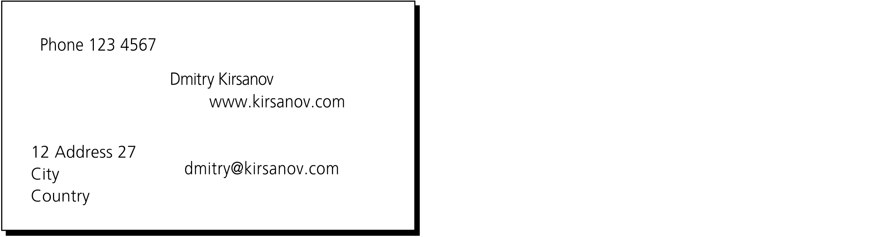
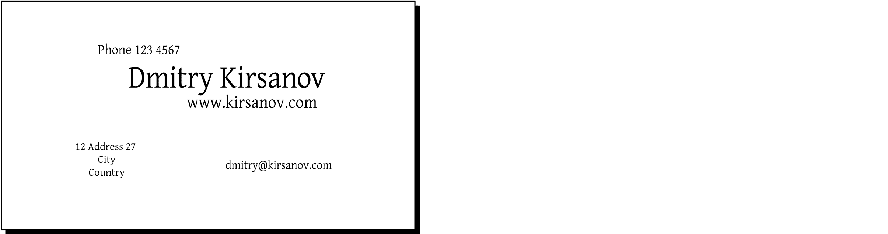
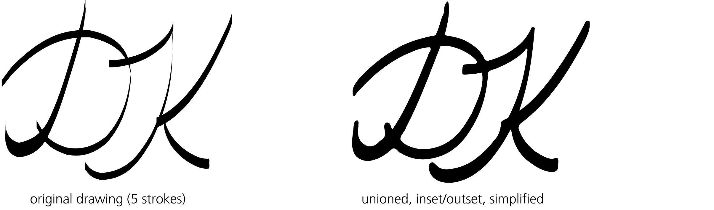
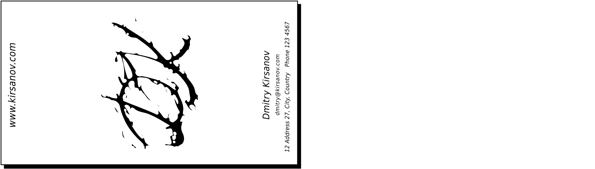
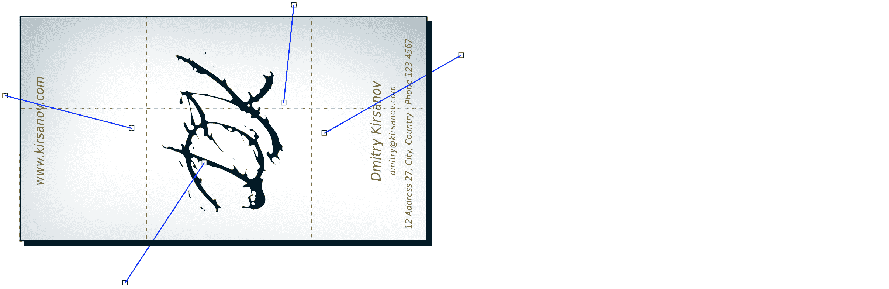
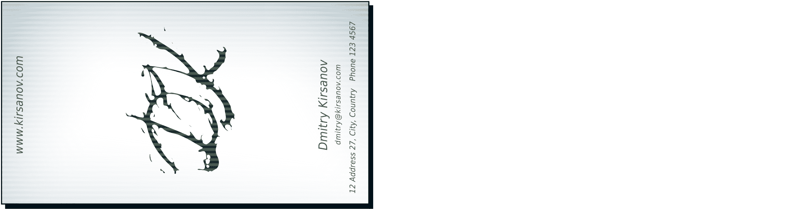
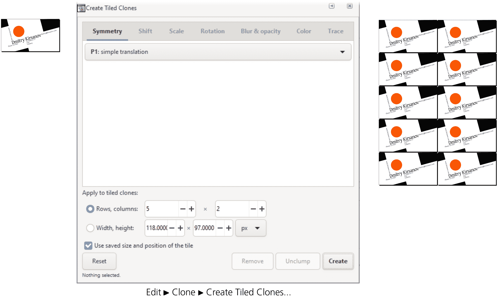

# 第二十一章：教程：设计名片

即使在虚拟会议的时代，名片仍然有其独特的作用。它们反映了你或你的组织的个性，并展示了你最希望他人了解或记住的内容。就像三行俳句一样，你有有限的空间来做出清晰、独特且令人难忘的陈述，而这种陈述可能会比你目前的网站更具持久性。

简洁、有限的空间和设计必须突出：这些标准使得名片成为一个很好的矢量编辑器测试项目，作为设计工具使用。Inkscape 的工具集非常适合这项工作——尽管它不是为创建要打印在纸上的设计而最理想的软件（见 18.8）。

本教程展示了两种不同的名片设计。我并不是邀请你完全按照这些步骤来操作（除非你只是想学习这些技巧）。如果你计划创建名片，看看比这两个设计更多的示例，并尝试使用 Inkscape 将这里展示的最佳设计技巧与一些原创元素结合起来。创造力无法传授，但可以激发。无论你是要创作艺术性作品，还是设计一款完全传统的名片，Inkscape 都能为你提供帮助。

## 20.1 设计 1：简约图形

要开始创建名片，从**文件**菜单中选择**从模板创建**，在列表中选择**名片**，在**名片大小**列表中选择首选尺寸，然后点击**从模板创建**。这将打开一个新的 Inkscape 窗口，带有适当尺寸的名片画布。本教程中的示例使用的是 90×50 毫米的尺寸。

切换到文本工具，并为名片上的所有文本行创建文本对象：姓名、职位、地址、电话等（见图 20-1）。确保它们都是独立的对象（每次点击并单独输入一个），因为你会频繁地移动它们，尝试不同的布局。如果你想在名片上显示一个徽标，导入徽标文件（见 18.2）。如果你的徽标只是低分辨率的位图，你可以对其进行描摹（见 18.5），并手动清理生成的路径，然后删除位图。

图 20-1：准备工作区并添加文本对象

### 20.1.1 选择字体

下一步是为你的文本对象选择字体。使用你喜欢的字体来帮助个性化你的设计。如果你对平面设计感兴趣，可能已经拥有一套自己喜欢的字体库；否则，操作系统通常会自带一些基本的（但很不错的）字体，此外你也可以在网上找到许多高质量（且价格适中的）字体。

我为这款设计选择了免费的 Gentium 字体（可在[`software.sil.org/gentium/`](https://software.sil.org/gentium/)下载），因为它具有美观的外观，并且支持广泛的 Unicode 字符集。在为所有文本字符串指定相同的字体后，使用选择工具调整它们的相对大小（见图 20-2）。

图 20-2：字体和大小

相同字体的不同大小搭配在一起好看吗？如果不好看，可以尝试为不同的元素使用不同的字体，但请记住，使用超过两种字体可能会使设计显得杂乱无章，尤其是在这么小的设计中。

要让 Inkscape 显示新的字体，只需像在操作系统中通常那样安装它（例如，在 Windows 中，右键点击字体文件并选择**为所有用户安装**），然后重启 Inkscape。新字体将会出现在“文本和字体”对话框以及“文本工具”的下拉列表中（15.3.2）。

### 20.1.2 布局

在制作多个名片（或其他设计项目）的模板时，您需要为可变长度的姓名和地址预留额外的空间。然而，我这里只是为自己制作名片，这让我不受此限制，可以精确地定位和对齐所有文本对象。我能够将所有地址信息紧密地排列在姓名旁边，创建一个通过对齐紧密绑定在一起的不对称构图（地址与姓氏的起始位置对齐，电子邮件与姓名的顶部对齐，等等），如图 20-3 所示。

图 20-3：排版文本

这种布局看起来很有趣，但可能有点过于矩形。显而易见的做法是选择全部（Ctrl-A），然后旋转（按一次）。效果好多了！现在的设计有了一种构成主义的风格——这是一种短暂但具有影响力的 1920 年代设计运动，提倡大胆的对比和斜线排版。让我们进一步发展这种风格：从边缘向构图中侵入的三个黑色角落，并在构图中心放置一个大的红色圆圈（[图 20-4）。构成主义者喜欢黑色和红色的简单几何形状！

图 20-4：旋转和添加形状

为了达到最佳效果，大多数文本对象需要调整字间距（文本中所有字母之间的均匀间距）和字形对间距（特定字母对之间的间隔）。在“文本工具”中，使用控制栏中的（**字母间距**和**水平字形对间距**数值）来调整这些参数；对于字形对间距，您也可以使用 Alt+方向键来改变文本光标处的间隔（15.4.4）。通常，大号文本对象的字母间距需要更紧凑，而小号字体则需要增加字母间距以提高可读性。

## 20.2 设计 2：艺术绘画

我的第一张名片设计主要受文本行排版的启发，图形元素则是其次的支持和强化这一排版的部分。你也可以反过来做，从图形开始，再围绕它构建设计。

对于一张公司名片，显而易见的起点是 logo。如果你设计的是个人名片，并希望它更具个性，可以添加一张照片，然后将其转换为矢量图形（18.5）进行调整。你也可以使用一张剪贴画（1.3）作为设计的重点。

对于第二张演示卡，我选择了另一种方法：艺术字母缩写。我切换到书法笔，设置角度为 90 度，固定值为 100，并画了几个交织的字母。最后我基本上把字母的形状做对了，但结果充其量只是稍微有点意思。我尝试通过合并路径对象，再进行简化、内嵌和外扩几次来改进它，正如图 20-5 所示。

图 20-5：创建字母缩写

现在字母看起来更自然了，但我希望让它们更有趣。“不要太整齐”是一种可行的设计策略；如果你能以创意的方式涂抹、扭曲或损坏你的艺术作品，就大胆去做吧。基于这一思路，我选择了一个稍微窄一点的笔尖，将颤动幅度最大化到 100，并用我的平板笔在字母周围疯狂地“舞动”了一下（图 20-6）。使用鼠标做这个效果也差不多可以达到同样的效果。刚开始的结果看起来不太吸引人，因为我忘了应用通常的简化/内嵌/外扩技巧。

图 20-6：创意性地损坏字母形状

### 20.2.1 布局

这幅扭曲的艺术作品应该占据卡片的中央位置，其余部分则对称地环绕其周围。我使用了一种简单的倾斜、非常浅的无衬线字体（Helvetica Condensed Light），这种字体不会分散对中央艺术作品的注意力。由于横向布局让卡片显得拥挤，我把所有内容都旋转了 90 度（通过按 Ctrl-），让艺术作品有更多空间，同时让文字漂浮到边缘，不干扰艺术作品，如[图 20-7 所示。

图 20-7：围绕字母缩写排版名片

### 20.2.2 纹理与颜色

一个令人愉悦的设计开始显现出来，但离完成还差得远。卡片看起来太空旷、平坦，并且中间那块不规则的墨迹显得有些敌意。为了修正这个问题，我决定添加一些背景渐变。

如 10.6 所述，默认的渐变效果是从某个颜色（例如蓝色）的不透明度 1 到不透明度 0，看起来比较粗糙，因为即使使用浅色，边界在白色背景下仍然明显可见。为了改善在白色背景上的渐变效果，可以将渐变的透明端涂成白色，而不是与另一端相同的颜色。

在这里，我在卡片的边缘添加了四个带有不规则倾斜蓝绿色渐变的矩形，以实现柔和的融合、自然的弯曲、不对称的外观。在图 20-8 中，虚线表示四个带有渐变的矩形的边框，渐变线显示了每个渐变的跨度和方向。我将首字母涂成深蓝色，并为字母添加了一个模糊的、50%不透明的投影效果（过滤器 ▶ 阴影与辉光 ▶ 投影）。

图 20-8：添加渐变和阴影

为了让它更加美观，我决定通过叠加一层常规的半透明线网格来为卡片添加纹理（图 20-9）。

图 20-9：添加条纹纹理。名片已准备好。

为了添加纹理，我在整个卡片上画了一个矩形，打开了填充和描边（Shift-Ctrl-F），将填充设置为图案，并选择了条纹 1:1 的白色纸纹理。使用节点工具中的图案调整手柄（10.8.1），我旋转了条纹并将其缩小。最后，我将矩形的 z 顺序调整为在渐变和首字母之上，但在文本之下，并将其不透明度降低到 20%。

## 20.3 导出和打印

如果你已经设计好了名片，并且想要打印，首先需要将文件转换为 PDF 格式。

Inkscape 的 PDF 导出器（B.3）足够成熟和精细，能够渲染任何设计，无论是本教程的第一张卡片（没有透明度或渐变，全为不透明形状的集合），还是第二张卡片（带透明度、渐变，甚至是首字母上的投影效果）。需要栅格化的部分将被栅格化，文本对象要么会嵌入字体，要么在导出时转换为路径。

如果即使是 PDF 也不够，你总是可以将整个设计导出为位图。Inkscape 只能导出为 PNG 格式，但其他许多程序可以将 PNG 转换为其他位图格式，例如 TIFF（虽然已较旧，但在印刷领域仍然流行）。

### 20.3.1 使用设备颜色

有时打印服务会要求使用特定设备的 CMYK 或专色（例如，要求为公司徽标使用指定的专色），而不是 PDF 或 TIFF 文件。虽然 Inkscape 提供了一些色彩管理的显示支持，但你无法将除了 RGB 屏幕色彩空间之外的任何东西导出为任何输出格式。你将需要使用外部软件来执行色彩分离（18.8.3）。

### 20.3.2 平铺输出

如果你计划在办公室或家用打印机上打印名片，可能会使用 A4 或 Letter 纸张，每张纸上有多张名片，打印后剪成单独的卡片。为了准备可打印文件，将所有卡片的对象组合在一起，然后使用**创建平铺克隆**对话框（16.6）创建一个 2×5 的克隆网格，以适应你可打印的页面（图 20-10）。

图 20-10：铺设卡片以填充输出页面
