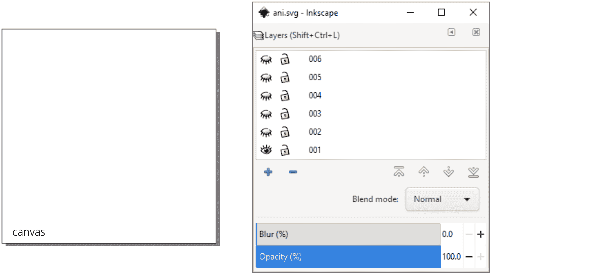
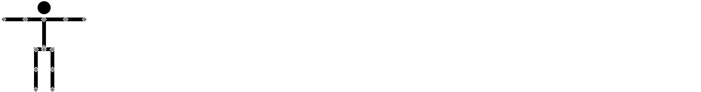
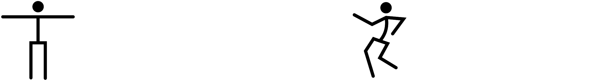
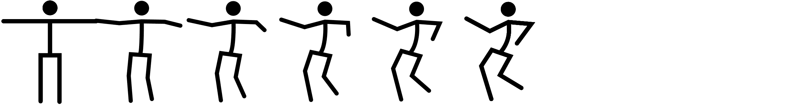
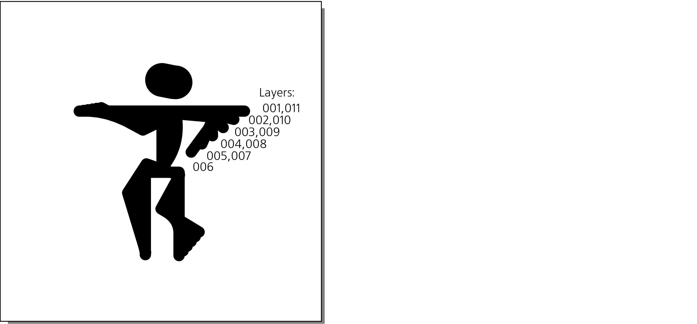
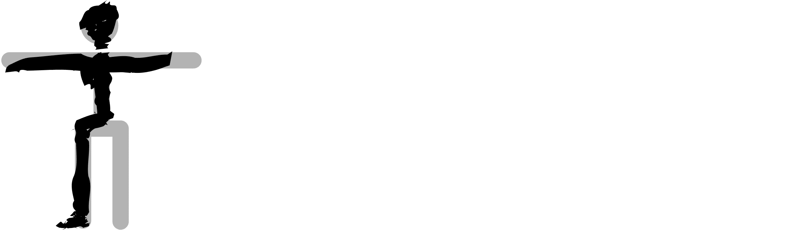
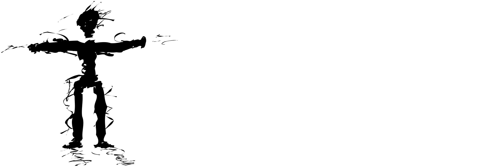
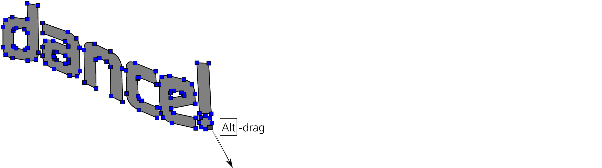
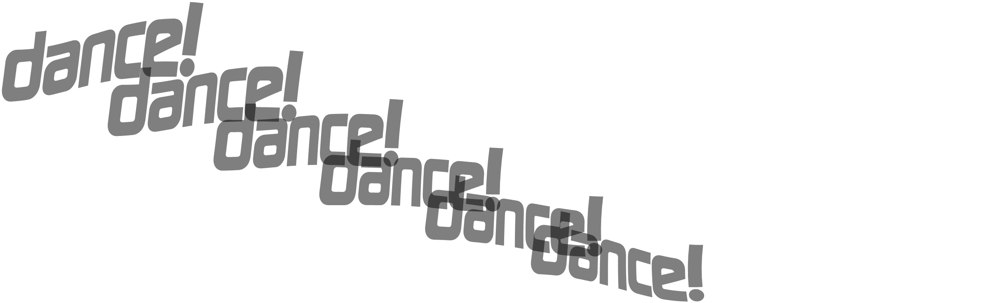
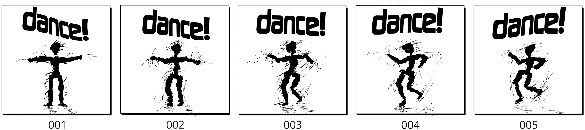

# 第二十二章：教程：创建动画

从一开始，SVG 就被设计为既支持静态图形也支持动画矢量图形的语言。它支持脚本化动画和声明式动画。然而，无论是好是坏，基于 SVG 的动画在网页上的应用从未真正流行开来，现在看起来任何形式的矢量动画（如 Flash）似乎都已经过时。现在，HTML + JavaScript 或纯视频已成为主流在线内容呈现方式。

Inkscape 不支持动画 SVG 文档（尽管你可以通过 XML 编辑器手动添加动画属性），只能静态显示 SVG 文档。不过，你仍然可以使用 Inkscape 创建静态帧，然后将它们合成一个动画 GIF 或视频——尽管没有时间线控制，处理超过几帧的动画会变得非常困难。

## 21.1 创建模板

在 Inkscape 中创建动画帧的最简单方法是将它们放置在不同的图层上（4.9）。通过切换相邻图层的可见性，你可以看到帧如何堆叠，并控制每一帧之间的变化。手动创建多个图层是非常繁琐的，因此我编写了一个简单的 Python 脚本，它可以创建一个 200×200 像素的文档，并带有 100 个空图层：

```
print ("""<svg width="200" height="200"  xmlns:svg="http://www.w3.org/2000/svg"  xmlns:inkscape="http://www.inkscape.org/namespaces/inkscape">""")
for i in range(100): print ('<g inkscape:groupmode="layer" display="none" id="%03d"/>' % (i + 1))
print ('</svg>')
```

所有图层都默认创建为隐藏状态（这就是`display="none"`的作用），所以在 Inkscape 中，你需要逐个解除隐藏（4.9.3）才能在上面绘制。你可以更改脚本创建的图层数量（`range(100)`）以及画布的尺寸（`width="200" height="200"`）。将脚本保存为名为 generate-layers.py 的文件，并在命令提示符下运行它，并将其输出捕获到一个 SVG 文件中。（你需要在计算机上安装 Python，可以通过[`python.org/`](https://python.org/)下载。）然后，在 Inkscape 中打开该文件：

```
$ python generate-layers.py > ani.svg
$ inkscape ani.svg
```

你还可以将生成的文件（ani.svg）放入你的~/.inkscape/templates 文件夹中，这样它就会作为一个模板工作，所以下次你可以通过从文件▶新建列表中选择它来创建一个空的 100 层文件。图 21-1 显示了加载了多层文件的 Inkscape 图层对话框（4.9.4）。



图 21-1：加载到 Inkscape 中的 100 层动画模板

## 21.2 创建角色

让我们做一个跳舞的男人的动画，它既有趣又足够简单，不需要太多绘画技巧，适合小格式的动画。我的主角将以他的动作著称，因此我不需要让他看起来过于复杂。一个简单的简笔画就足够了（图 21-2）。



图 21-2：表示人物节点的简笔画，在节点工具中显示

它由三条简单的路径（手臂、腿部和身体）和一个椭圆（头部）组成。使用钢笔工具（14.1.1）并按 Ctrl 键绘制水平/垂直直线；使用椭圆工具（11.4）创建头部。为了方便插值，对身体和四肢使用**路径 ▶ 合并**，使它们成为一条路径，并在节点工具中按 Ctrl-Alt 点击（12.5.3）在肘部和膝关节处添加节点。

## 21.3 补间

现在通过复制角色来创建一个副本（选中头部和身体后按 Ctrl-D），将其移动到右侧，并在节点工具中调整节点，给我们的人物一个有趣的舞蹈姿势（图 21-3）。这提供了两个*关键帧*，整个动画可以简单地在这两个帧之间交替进行。



图 21-3：两个关键帧

让我们添加一些中间帧，使关键帧之间的过渡更为平滑。动画师称这种过渡为*tweening*（来源于*between*）。选择两个身体（即两个路径对象），然后执行**扩展 ▶ 从路径生成 ▶ 插值**。指定**插值步骤数**（例如，4），选择**插值方法 1**，如果需要，可以使用非零的**指数**值，使得运动的速度加快或减慢非线性。然后，通过插值两个椭圆来为每个插值后的身体创建头部，使用相同的步骤数和相同的指数（图 21-4）。



图 21-4：插值关键帧

如果补间效果看起来不对，你可以撤销插值，调整关键帧，然后重新插值，直到你得到满意的效果。插值方法 1 会将处于相同路径位置的节点对齐，因此在一个关键帧的路径是通过调整另一个路径而创建的且没有添加或删除节点的情况下最为有效（就像我们的案例）。如果两条路径的起源不同并且节点不兼容，则方法 2 会更好。

## 21.4 合成

让我们将动画放置在画布的合适位置，并将帧分布在不同的图层上。移除补间，并将第二个关键帧移动到第一个关键帧的位置上。（请注意，舞者的右脚在两个关键帧中是重合的，因为它踩在地板上。）选择两个重叠的角色并将它们放置在画布上，必要时进行缩放，并为你计划添加的其他元素（如文本标题）留出空间。最后，再次插值身体和头部——如图 21-5 所示。



图 21-5：就位插值

接下来的任务有些无聊。你需要取消组合插值路径，并将每一条路径单独放置到自己的图层上，从 002 到 005，关键帧占据 001 和 006 图层。然后，按照反向顺序复制这些帧：将第 005 帧到第 001 帧放入 007 到 011 的范围内，使舞者平滑地返回到原始位置。

使用 Shift-Page Up 和 Shift-Page Down 将选中的对象向上一层/下一层移动，并观察状态栏，查看你所选对象位于哪一层。或者，你可以剪切（Ctrl-X）一个对象，切换到目标图层，然后粘贴到该位置（Ctrl-Alt-V）。最后，确保你使用的所有图层都是可见的，并保存 SVG 文件。

## 21.5 导出

你可以手动导出图层，但那会非常繁琐——特别是在查看结果并对源文件做出更改后，你还需要再做一次。幸运的是，Inkscape 提供了方便的命令行参数，所以我编写了一个 Python 脚本来自动化导出过程：

```
import os, sys
for i in range(int(sys.argv[2]), int(sys.argv[3]) + 1): os.system("""inkscape --export-fileid=%s-%03d.png --export-id=%03d \ --export-id-only --export-dpi=400 --export-area-page \ --export-background-opacity=1 %s""" % (sys.argv[1], i, i, sys.argv[1]))
os.system("convert -loop 0 -delay 10 %s-*.png %s" % (sys.argv[1], sys.argv[4]))
```

该脚本以源文件的名称、开始和结束图层的编号以及生成的 GIF 文件名作为参数。它调用 Inkscape 分别导出每个图层；然后，它调用 ImageMagick 的 `convert` 工具将这些帧合成一个可以在任何网页浏览器中查看的动画 GIF 文件。

将其保存为 produce-gif.py 并运行：

```
$ python produce-gif.py ani.svg 001 011 stick.gif
Exporting only object with id="001"; all other objects hidden
DPI: 400
Background RRGGBBAA: ffffffff
Area 0:0:100:100 exported to 444 x 444 pixels (400 dpi)
Bitmap saved as: ani.svg-001.png
Exporting only object with id="002"; all other objects hidden
...
Exporting only object with id="011"; all other objects hidden
...
```

在[`www.kirsanov.com/inkscape-animation/stick.gif`](http://www.kirsanov.com/inkscape-animation/stick.gif)查看输出结果。

## 21.6 自由手绘

到目前为止，我们的简笔画动画看起来最多只能算是稍微引人入胜。这种平滑、矢量风格适合技术性动画，比如演示机器的工作原理，但对于一段动画舞蹈来说，灵感不足。

为了改善简笔画人物，隐藏所有图层，除了 `001`，选择人物并降低其不透明度。然后使用书法笔（14.2），选择 **宽度** 为 20，**颤抖** 为 40，并在简笔画人物上绘制自由手绘的笔画。尽量让它看起来更随意、时髦、有个性；添加更加突出的脚和拳头，以及更具人性化的身体形态（图 21-6）。



图 21-6：使用书法笔使人物更加人性化

完成后，删除原始的骨架图形。它已完成作为蓝图的功能，不再需要。由于其粗糙的外观，它在纯白背景下看起来有些陌生。为了修正这一点，减少笔的宽度至 1，并在舞者周围添加一些细小的随机笔画，暗示他的四肢运动和地板上的阴影，如图 21-7 所示。别担心如果看起来*太*随意——在移动的图形中，这种随机性将会生动起来，显得很自然。



图 21-7：骨架去除，运动噪音添加

这个项目的主要规则是*不要复制*。自由手绘的粗糙感不能被回收。无论一帧与另一帧有多相似，你都需要从头开始完全手绘每一帧，只用简笔人物作为指南。复制自由手绘的笔画—即使你移动或缩放它们—会立刻消除那种粗犷、自然的感觉，使你的动画变得呆板和沉闷。不要偷懒；你画得越多，越容易。查看完整的手绘动画：[`www.kirsanov.com/inkscape-animation/rough.gif`](http://www.kirsanov.com/inkscape-animation/rough.gif)。

你可以使用相同的技术在导入的位图上手动描摹书法笔。将位图设为半透明并在其上进行草绘，尽量突出最重要的特征，忽略其他部分。在动画中，源位图可能是视频帧、静态照片或渲染的 3D 图像。

## 21.7 添加文本

让我们将整个动画向下移动，为其上方腾出一些空间，用于添加文本标题。取消所有图层的隐藏，选择所有图层上的所有对象（Ctrl-Alt-A），然后将它们向下移动。

我们动画中的横幅将只是一个单词：“dance!”。我们能做得比将相同的静态文本对象复制到每一帧更有趣吗？

我们可以使用书法笔在某些文本对象上绘制起伏的手写字母—将整个动画渲染为相同的风格。然而，为了演示的目的，我们尝试做些不同的事情：让文本横幅像旗帜一样平滑地飘动。我们可以使用信封变形路径效果（13.3.3），但使用节点雕刻可能更简单（12.5.7.2）。

首先，创建一个文本对象，选择一个好看的字体，将其转换为路径（Shift-Ctrl-C），取消分组（Ctrl-U），合并（Ctrl-+），切换到节点工具（F2），选择所有节点（Ctrl-A），然后按住 Alt 拖动其中一个节点。整个形状会平滑地弯曲和拉伸，如图 21-8 所示。如果字母形状变得过于扭曲，可以撤销拖动并按几次 Insert，每次都将节点数翻倍—这通常有助于让你雕刻的路径表现得更自然。



图 21-8：文本横幅的节点雕刻

复制两份文本对象，对每一份进行不同的雕刻处理—使它们看起来像是两幅在风中飘动的横幅画面—然后在它们之间进行插值。接着，像我们为舞者形象做的那样，将插值步骤分布到多个图层，将它们放置在画布上的人物上方（图 21-9）。不必担心精确位置；轻微的横幅晃动并不会有问题。



图 21-9：横幅的插值

要查看每个对象相对于前一层的位置，请使用**不透明度**控制，在**图层**对话框中将前一层暂时设置为半透明。使用 produce-gif.py 脚本重新生成动画 GIF。图 21-10 显示了帧 001 到 005。



图 21-10：动画帧的一半（向前移动）

访问 [`www.kirsanov.com/inkscape-animation/with-banner.gif`](http://www.kirsanov.com/inkscape-animation/with-banner.gif) 查看目前的效果。

## 21.8 添加颜色

我们的动画唯一的不足就是完全没有颜色。让我们给每一帧添加不同颜色的背景——为了呈现真正的频闪舞池效果。为了自动选择随机颜色，创建一个颜色未设置的矩形，并使用**创建平铺克隆**对话框（16.6）来将其复制并添加一些色调变化。

用对比鲜明的亮色涂上“dance！”横幅，并且让颜色在每一帧之间有所变化。最后，为了让跳舞的人物从背景中突出出来，在他身后添加一个椭圆形渐变“聚光灯”；每一帧随机移动、缩放并旋转这个聚光灯，增加额外的动感效果。最终版本请见[`www.kirsanov.com/inkscape-animation/final.gif`](http://www.kirsanov.com/inkscape-animation/final.gif)。享受吧！
