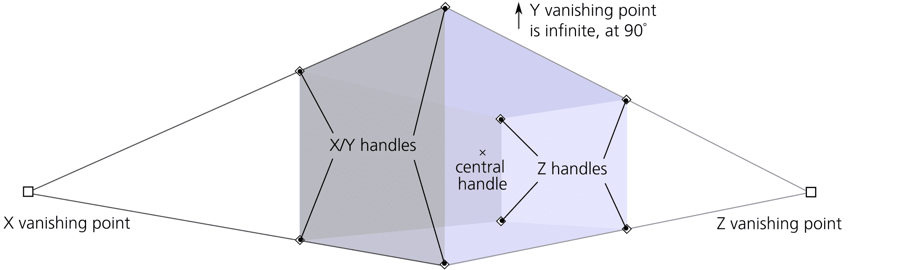
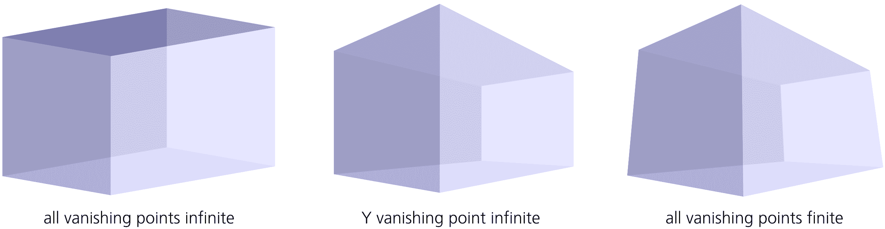
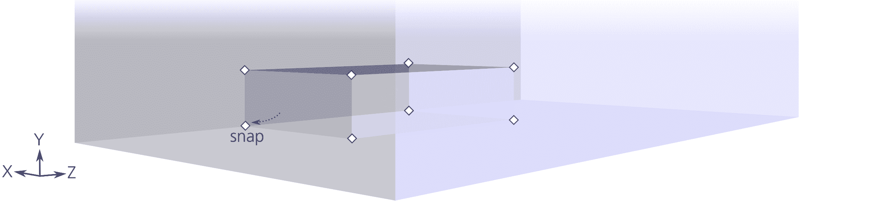
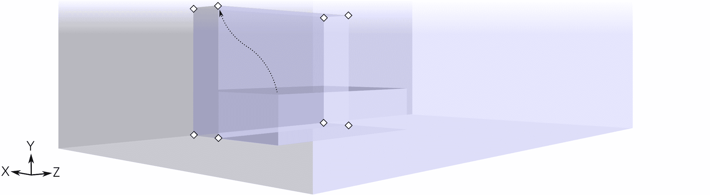
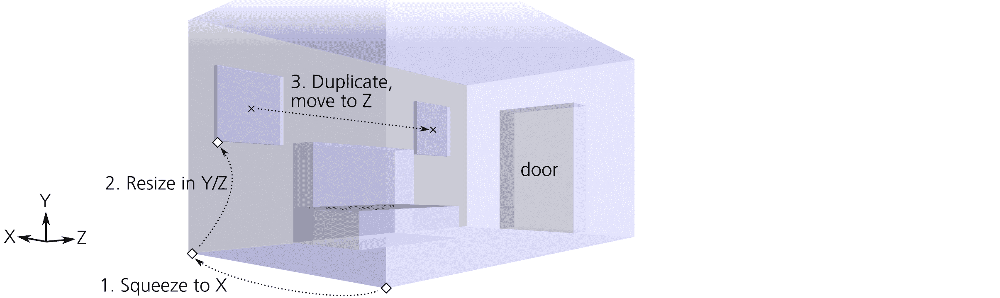
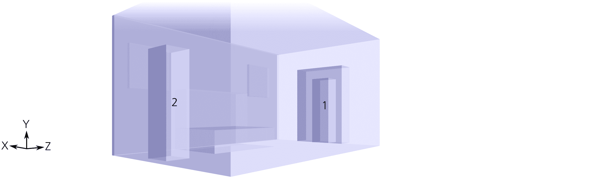
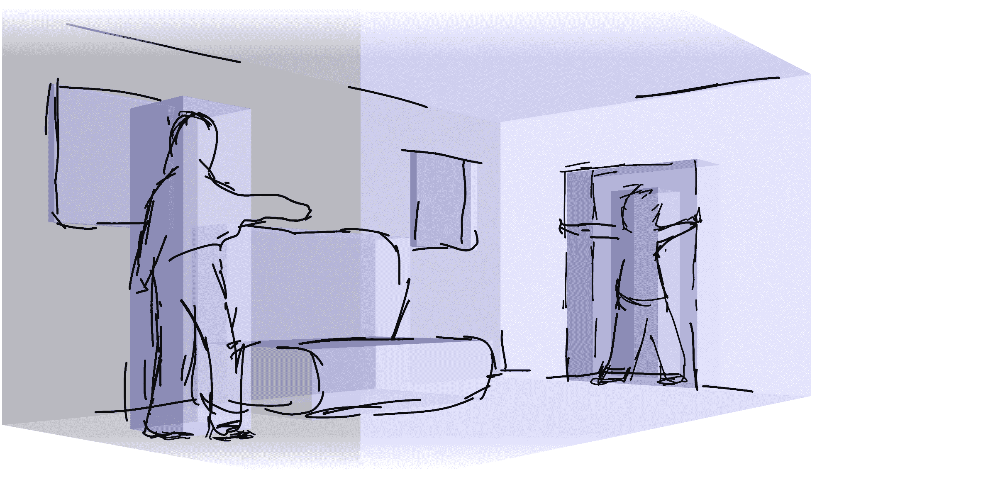
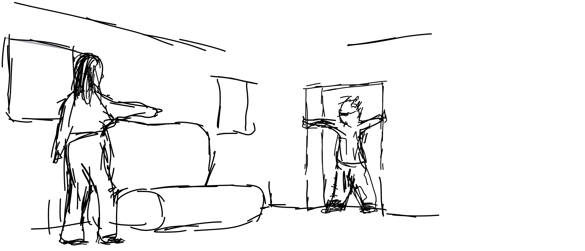
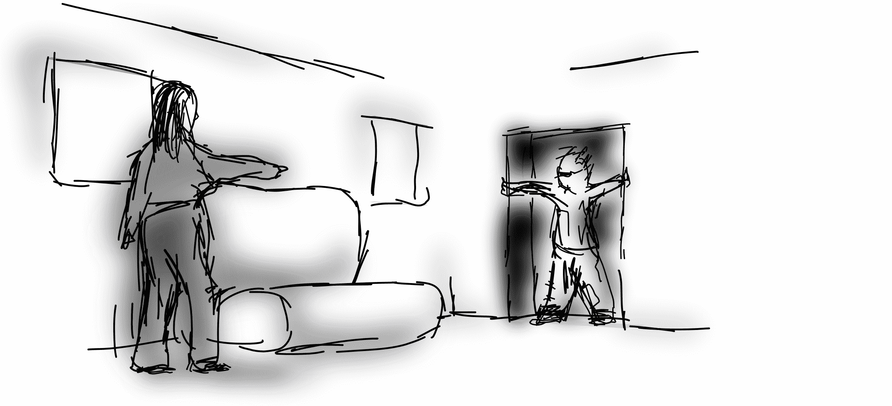

# 第二十三章：教程：绘制 3D 正确的卡通图

Inkscape 的 3D 盒子工具（11.3.1）并不打算替代专业的 3D 设计应用程序。Inkscape 是一个绘图程序，它的 3D 盒子工具最好作为*绘图辅助工具*来使用，这也是我们在本教程中使用它的方式。

一个*3D 正确*的图画是符合艺术家数百年来已知透视规则的作品。它不需要完全真实的阴影和纹理；只要线条和形状在角度和尺寸方面大致正确即可。

有意的透视失真可能本身就具有艺术价值，而某些绘画风格根本不使用透视法。当必要时，许多艺术家能够在没有任何技术辅助的情况下绘制 3D 正确的艺术作品。然而，你会发现，许多看似做得很好的艺术作品中，透视错误时有发生——从几乎不明显到令人尴尬。我希望看到更多的艺术家——不仅仅是初学者——利用 Inkscape 简单快捷的方式设置绘图透视，而不需要繁琐的测量和辅助线。

## 22.1 房间

让我们画一个简单的场景，表现两个人在房间里见面。切换到 3D 盒子工具（X），并在画布中央拖动，绘制房间的盒子。为了同时看到盒子的所有面，可以将其作为一个组进入（Ctrl-Enter），选择组内的所有面（Ctrl-A），并将状态栏中的**透明度**滑块（标记为 O:）设置为 50%，如图 22-1 所示。然后，退出组（Ctrl-Backspace）。

图 22-1：创建房间

不用担心第一次尝试就能把形状做对；继续拖动盒子的手柄，必要时拖动消失点来调整你绘制的内容。使用角落手柄来调整房间的大小。四个 X/Y 手柄默认在 X/Y 平面上移动，按住 Shift 键时沿 Z 轴移动。相反，四个 Z 手柄在不按 Shift 键时沿 Z 轴移动，按住 Shift 键时在 X/Y 平面上移动。X 形的中央手柄将移动整个房间，在不按 Shift 时，沿 X/Y 平面移动，按 Shift 时沿 Z 轴移动。当在 X/Y 方向移动手柄时，按住 Ctrl 键可以限制其只在某一轴（仅 X 或仅 Y）上移动。拖动消失点将重新倾斜并调整整个房间的大小，以适应改变后的透视效果（11.3.3）。

除了 X 轴和 Z 轴上的消失点外，你还可以在 Y 轴上创建第三个消失点。换句话说，你可以让 Y 轴的消失点*有限*。如果你希望你的绘图有更戏剧性或夸张的透视效果——就像从房间角落的蜘蛛视角看一样——可以这么做。相反，如果你想要一种更为客观的“科学”视角，可以让 X 和/或 Y 的消失点变为无限远，就像在图 22-2 中所示。

图 22-2：不同的视角

## 22.2 家具

让我们添加一些家具——例如，一个沙发。

在创建 3D 框架组合时，使用对齐（7.3）是一种便捷的方法，可以使框对齐得非常精确。在对齐控制条（7.3.1）上，确保开启以下选项：启用对齐（最上面），对齐节点、路径和控制点，和对齐到路径。

接下来，在较大的框内画一个较小的框。（这里的“内部”是指透视；在 Z 顺序中，框可以是任意顺序，只要它们的边缘是半透明的，你能看到所有创建的框的边缘。）新的框将使用与房间框相同的透视（相同的消失点）。抓住左下角的 X/Y 控制点，将其拖动，使其对齐到房间的左下角 Z 边缘。这将成为沙发的底座；使用其他角控制点调整其正确的高度、宽度和深度（图 22-3）。

图 22-3：沙发底座

对于沙发背面，画一个新的框，并以类似的方式对齐；或者，更简单的方法是，复制底座（Ctrl-D），并拖动其 X/Y 控制点来调整其大小，直到得到正确的形状，如图 22-4 所示。

图 22-4：沙发背面

我们在沙发两侧添加两个小地下窗户。一对在 X 方向上压缩的框将完美地形成窗户。然而，如何才能正确地放置它们，因为没有任何一个窗户的侧面与其他框的侧面对齐呢？

再次强调，复制然后调整大小的方法是最简单的。复制你拥有的最大框——房间本身。按住 Ctrl 并拖动前方 X/Y 控制点向后（沿 X 轴），将其压缩为一个薄层；然后，拖动 X/Y 平面上的四个控制点，调整窗户位置。对于第二个窗户，复制第一个窗户并按住 Shift 拖动其中央控制点在 Z 轴方向上进行调整；这样，第二个窗户将与第一个窗户完全对齐，保持透视一致。使用相同的复制和压缩技巧，在 Z 最远的墙面（即最接近 Z 消失点的墙）添加一个门框，使其突出于房间框之外，正如图 22-5 所示。

图 22-5：窗户和门

## 22.3 人物

现在让我们画两个人，一个站在沙发旁，另一个站在门口。3D 框工具如何帮助绘制人物？我并不会将它们建模为类似机器人的平行六面体结构，但我仍然希望每个角色的高度和体积在绘画的透视下是准确的，使用 3D 框工具是确保这一点的简单方法。

操作方法如下。首先，在门口添加一个高而窄的框。这将代表人类 1。像之前一样，复制门框，在 X/Y 平面上将其两侧挤压，并调整大小，以使人物高度与门的高度比例更为真实。（你可以请某人站在真正的门口，来获得大致的感受。）

然后，复制人体 1 的框。使用这个新人体中间的 X 形控件，按住 Shift 拖动它到前面，再按住 Ctrl 稍微水平拖动一小段，沿 X 轴方向。这将是站在沙发旁的第二个人（图 22-6）。

图 22-6：这两个人

这样，两个人物框会有相同的透视调整高度，并将作为绘制人物的有用指南。如果我要达到更好的解剖学精度，我可以为每个人物使用三块框来表示腿、身体和头部。（不幸的是，你不能一次性在 3D 空间中拖动多个选中的框；你必须一个个拖动它们。）

## 22.4 草图和上色

够了，别再用这些框了！收起 3D 框工具，拿起书法笔，在 3D 蓝图上开始绘制草图。创建一个新图层（**图层 ▶ 添加图层**），这样你就可以分别显示和隐藏 3D 框和绘图。

不要试图精确地描摹框的边缘。对于非几何物体，如沙发和人物，这是几乎不可能的，甚至连墙壁和窗户也会从一些手绘的粗糙感和不完美中受益。将 3D 框的边缘作为大致的指南，但除此之外，*自由绘制*（Inkscape 的座右铭）以你自己的方式和风格来画（图 22-7）。你当然不需要描摹*所有*的线条；可以省略一些，或用短小的部分笔触暗示其他部分。

图 22-7：在 3D 蓝图上草图绘制

你会发现，3D 框架使得在处理细节时更容易记住图形的整体构图和空间关系。我不会详细讲解绘制过程；你已经在另一个教程中看到过我使用书法笔的草图风格（21.6）。

一旦完成了基本轮廓，关闭 3D 图层，看看你的图像如何凭借自身的优点展现出来，如图 22-8 所示。

图 22-8：当草图完成后，隐藏 3D 图层。

最后，使用宽模糊的彩色笔触，在深色清晰的轮廓下为图形上色，如图 22-9 所示。

图 22-9：添加颜色
