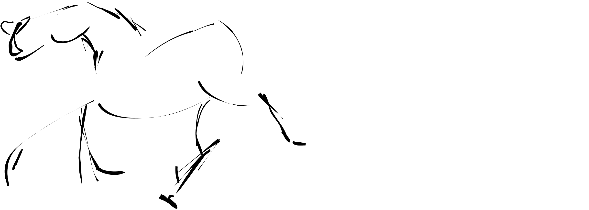
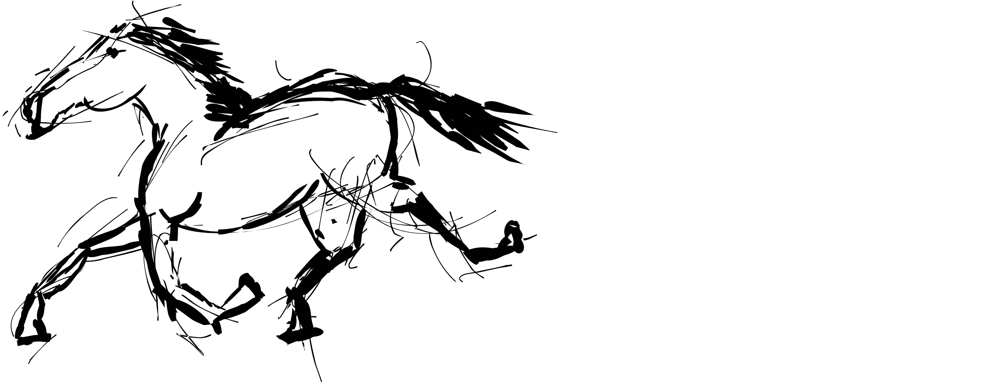
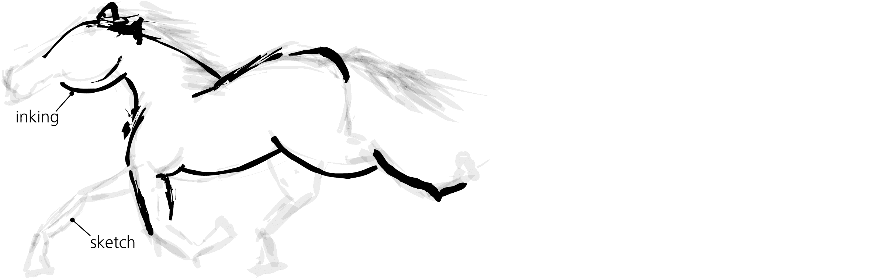
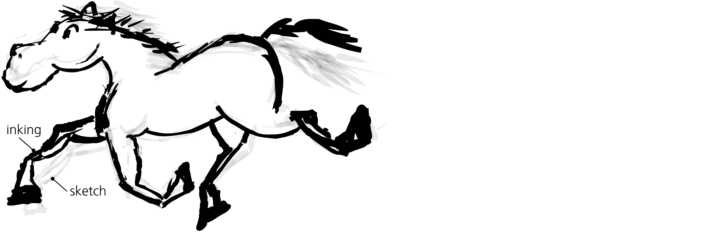
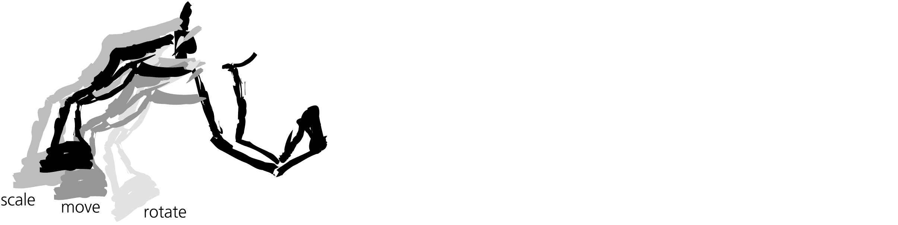
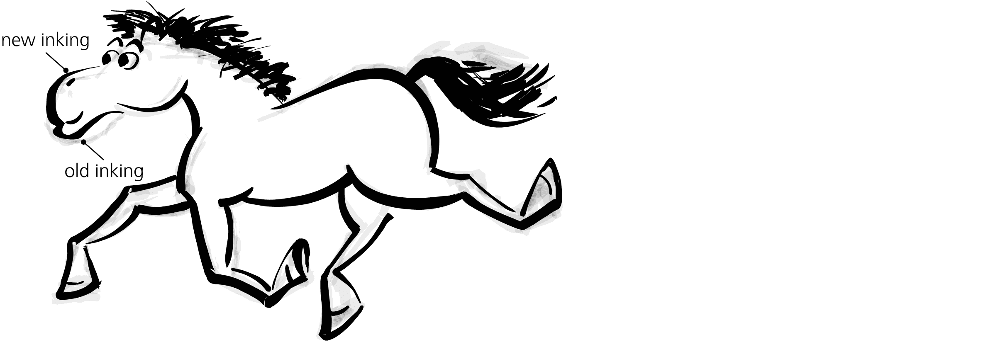
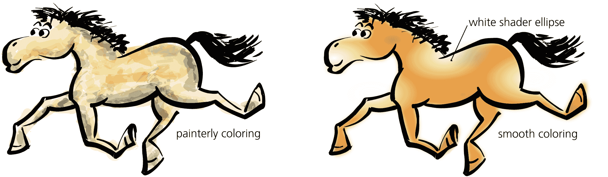
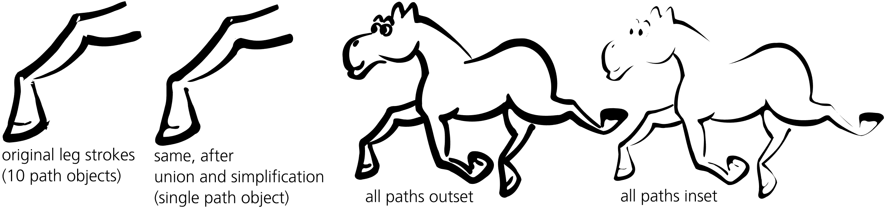
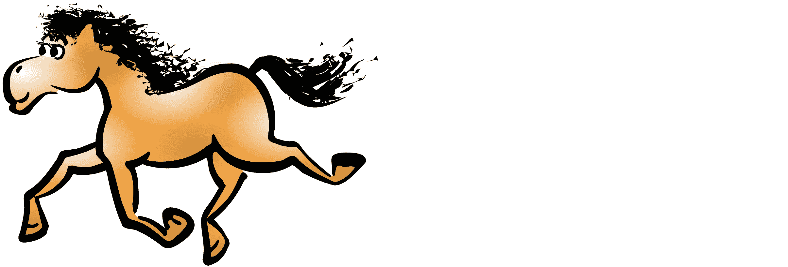
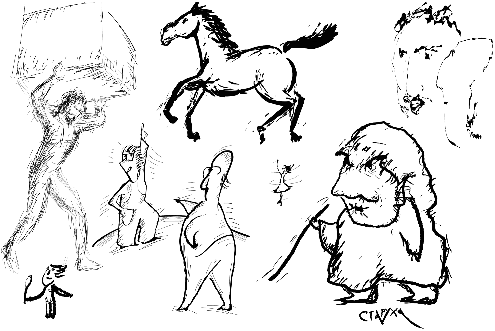

# 第二十四章：教程：艺术绘画

在矢量编辑器中，Inkscape 是最适合草图和自由绘画的工具之一，得益于其多功能的书法笔工具（14.2）。与其他矢量工具不同，Inkscape 的书法笔不仅几何上不完美，而且充满了个性——但它依然是一个矢量工具，能够生成始终可编辑的矢量对象。

在本教程中，我们将详细介绍如何完全使用 Inkscape 创建一幅简单的绘画。我将画一匹搞笑的卡通奔跑的马，它可能是一个吉祥物或漫画人物。我一直觉得从零开始绘画非常具有挑战性，我想许多读者也能理解这一点。然而，在 Inkscape 的帮助下，我终于画出了一幅我喜欢的作品。

## 23.1 第一幅草图

首先，切换到书法笔工具，并在工具控制条中设置**宽度**为 0.05，**收缩**为 0.2（14.2）。如果你有绘图板，可以启用笔压来调节笔画宽度（14.2.1.1）。角度和固定参数仅适用于书法，不适用于自由绘画，因此将**固定**设置为 0——这实际上将固定角度的笔变成了一个无方向的圆形刷子（14.2.2）。

不管你信不信，我以前从没画过马，而且我的前几笔让这一点显得异常明显。像这样的开始，我想很多人都会有放弃的冲动（我也是）。但是耐心和努力终究会有回报——尤其是在 Inkscape 中。只需要不停地在画布上画下几笔，撤销，调整，再画一次。迟早，总会有一些不*完全*糟糕的东西，从那些乱七八糟的线条中闪现出来（图 23-1）。

图 23-1：第一笔

对大多数人来说，绘制物体需要视觉辅助。你可能很难自己想象马的身体如何弯曲，或者马的腿是如何弯曲的。我发现真实马的照片帮助不大；相比之下，*马的*风格化**画作**要更具启发性——在这些画作中，其他更有能力的艺术家已经完成了抽象和强调核心马术特征的艰苦工作。通过 Google 图片搜索，你可以找到大量参考资料。经过多次草图绘制、撤销和强调（通过增加笔压），我得到了图 23-2 中展示的草图。

图 23-2：第一幅草图

## 23.2 上墨

传统的漫画或卡通艺术家工作流程主要分为两个阶段：*草图*（通常用铅笔）和*描线*（用钢笔）覆盖在粗略的草图上。你可以在 Inkscape 中遵循相同的流程。当绘图看起来差不多像一匹马时，就开始在其上进行描线，使用新的图层进一步发展它。通过这种方式，你可以放大草图中的优点，并在此基础上进行创作，而无需担心过度调整导致破坏草图。选择所有笔画（Ctrl-A），并将其透明度设置为 0.05，使其变得几乎不可见；这有效地隐藏了细笔画，使你更容易集中精力于粗笔画上。然后，锁定此图层（使用状态栏中的锁定切换按钮），创建一个新的图层（**图层 ▶ 添加图层**），并再次使用草图作为指南重新绘制同样的马，如图 23-3 所示。

图 23-3：在新图层上进行描线

这是同一匹马吗？不完全是。第一张草图中的马看起来像一匹真实的马——也许有些过于真实。我们想要的是一幅卡通画，而不是照片级逼真。在卡通画中，生物的头部（尤其是眼睛）和脚部（或手或爪子）通常被放大，比例失调。在第一层描线中，我们就要做到这一点：保持身体不变，但放大蹄子和头部，添加一双超大的卡通风格眼睛（图 23-4）。

图 23-4：让马看起来更卡通化

## 23.3 调整

向量编辑器的独特优势在于所有笔画保持独立对象，这使得对图纸的调整（如微调、缩放或旋转）变得容易。要在马的图纸上进行这样的调整，使用选择工具，拖动腿部或头部选择其所有对象，并使用鼠标手柄或便捷的键盘快捷键：按住 Alt 键并使用箭头键移动，Alt-<或 Alt->进行缩放，或 Alt-[或 Alt-]进行旋转。通常，你会做出一条不错的笔画，但比例或位置不对——此时可以将其变换为合适的尺寸，而不是删除。即使看起来已经可以接受，调整角色的四肢或面部特征有时也能让它比你想象的更具表现力（图 23-5）。

图 23-5：调整绘图的部分

你不限于只使用一个描线图层。随时可以隐藏之前的草图图层，锁定并淡化当前图层，将其作为新的草图，再在上方创建一个新的描线图层。每次这样的过渡，绘图通常会看起来越来越不像铅笔草图，而更像是带有平滑笔画和精致细节的墨线画。图 23-6 展示了我在前一层草图上进行的第三次描线尝试；让头部看起来像马而不是像河马尤其困难。

图 23-6：另一个描线图层

## 23.4 上色与平滑处理

轮廓几乎完成后，开始考虑给图形上色。Inkscape 可以模拟多种不同的上色风格。例如，你可以通过叠加许多随机的书法笔画，并给每一笔涂上不同的颜色和不透明度（使用 Tweak 工具，8.9.1）来模仿一幅画。

我们将尝试一种更简单、更传统的方法：使用平面填充颜色，并叠加一些光照和阴影效果（白色和黑色椭圆，带有椭圆形不透明度渐变，10.1.2）。使用油漆桶工具（14.3）创建内部形状；对其应用一点模糊效果（约 2%），以增加平滑度（图 23-7）。

图 23-7：上色选项

让我们回到轮廓部分（暂时隐藏上色层）。如果你选择图形的一部分（例如一条腿或头部）中的所有笔触，合并它们（Ctrl-+），然后按几次 Ctrl-L，你可以让它变得更加平滑和吸引人。执行这些步骤会融化尖角并焊接接缝，使得整体看起来更加自然和一体化（图 23-8）。另一个有用的技巧是通过按 Alt-) 来加粗所有笔触，然后按 Alt-( 使它们变薄（12.4）。

图 23-8：焊接与融化

路径上的多个内嵌和外扩效果类似于简化。过多的内嵌可能会使路径的某些部分完全消失，但这不一定是坏事——相信整体效果和你的艺术感觉。

## 23.5 绘制头发

对于许多新手艺术家来说，绘制逼真的头发是很难的。找到规律与混乱、整洁与凌乱之间的平衡是塑造角色印象的关键。在这个马的绘制阶段，尾巴，尤其是鬃毛，并没有给人留下深刻印象。我反复画了它们，但所有尝试都显得太块状或太蓬松（或两者兼有）。最终，我通过在书法笔刷中使用高值的颤动效果（14.2.4），成功画出了不错的波浪形头发（图 23-9）。最大化此参数使得书法笔触更加斑驳且比我手动操作时更加均匀不规则。

图 23-9：让马鬃看起来更逼真

最后的调整是尝试对整个图形进行缩放、旋转和扭曲，这有时可以在不需要太多工作的情况下显著改善效果。

总体而言，结果远超我的预期。我非常确定，如果是用纸上作画，我不可能达到这样的质量水平。当然，你可以使用 Inkscape 绘制其他风格的图形；通过实验来找到最适合你的技巧。我特别喜欢使用 Tremor 值较高的书法笔，它提供了一种几乎“自然媒介”的绘图工具，如图 23-10 所示。

图 23-10：更多的自由手绘示例
