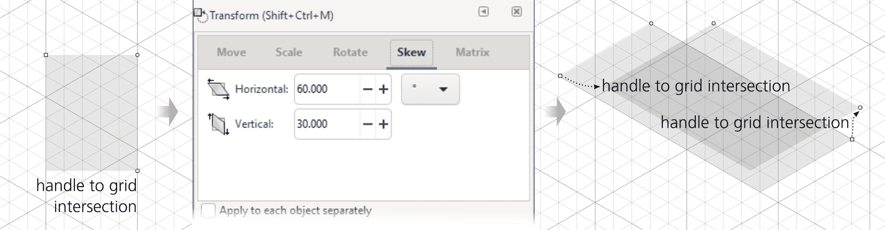
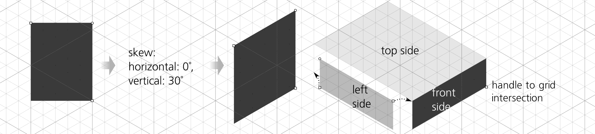
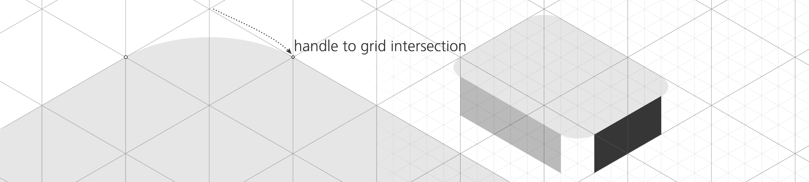
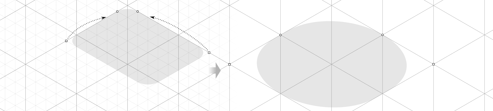
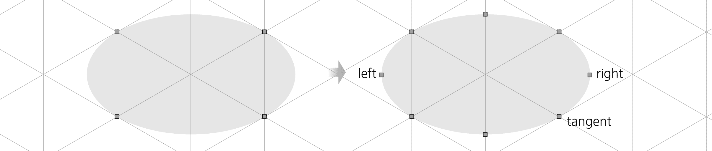
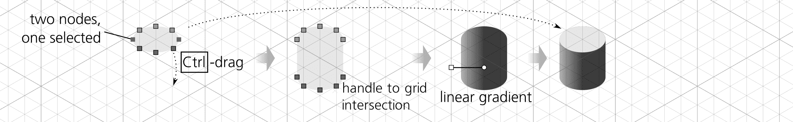
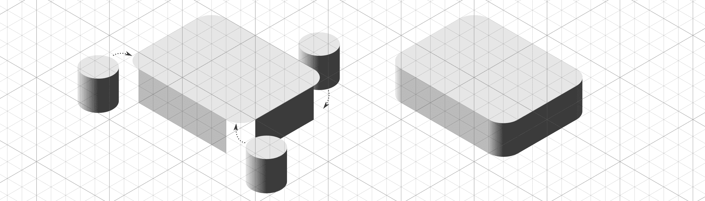
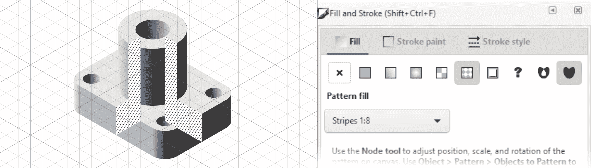
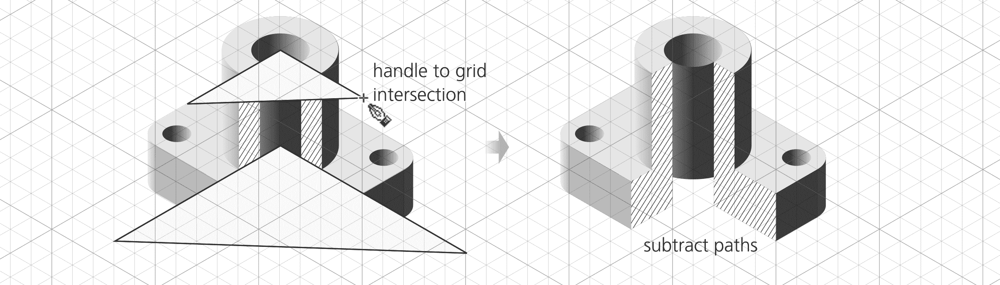
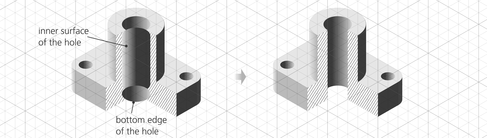

# 第二十五章：教程：技术图纸

你也可以使用 Inkscape 来创建技术图纸。Inkscape 并不是一个 CAD（计算机辅助设计）应用程序，但它非常适合制作中等复杂度的技术图纸。如果你已经知道如何使用 Inkscape，那么使用它进行这种类型的工作是一个合乎逻辑的选择。举个例子，让我们画出一个发动机部件的等角剖面图（图 24-13）。

在 Inkscape 中创建技术图纸的关键在于使用网格（7.2）、对齐（7.3）、数字变换（6.6）和形状，尤其是矩形（11.2）。这些功能使你能够快速且精确地创建复杂部件的 3D 视图，而不必手动进行任何近似或调整。每个对象、控件和节点都会精准地对齐到其确切位置。一旦你掌握了这些技巧，制作这类图纸将变得几乎令人上瘾地容易。

## 24.1 设置网格

*等角投影*图像是所有三个坐标轴之间的角度相等（60 度）且比例相同的图像。例如，在等角立方体中，所有可见的边长都相同。

要开始设置网格绘制发动机部件图纸，打开**文档属性**对话框（7.2.1），选择**网格**标签，并创建默认的轴测网格，设置 X 和 Z 角度都为 30 度（相对于水平面），如 图 24-1 所示。你可能需要将 Y 轴间距（因为网格是等角的，所以它适用于所有三个坐标轴）设置为图纸中可度量的最小距离。例如，如果你的图纸所有尺寸都是毫米且精确到小数点后一位，设置网格间距为 0.1 毫米，这样你就不需要将任何东西放置在网格线之间。

图 24-1：设置等角网格

你还可以更改主网格线（较深的网格线）的间距；默认情况下，它们每五条常规网格线出现一次。当你缩小时，常规网格线会先消失。

## 24.2 制作箱体

让我们创建对象的底部框。开启网格（并默认启用对齐网格），使用矩形工具绘制一个矩形——任何矩形。注意，矩形的角会对齐到网格线的交点（留意对齐指示器和提示，7.3.2），但矩形并非等角投影。

要将其倾斜成等角投影，打开**变换**对话框（Shift-Ctrl-M，6.7），在**倾斜**标签下，分别设置**水平**倾斜角度为 60 度，**垂直**倾斜角度为 30 度。点击**应用**后，矩形会变换以适应网格；请注意，矩形的调整控件现在也会在等角投影中移动（11.2.1）。现在，你只需将它们对齐到相应的网格交点，如 图 24-2 所示。

图 24-2：创建、倾斜并对齐盒子的顶部

盒子的另外两个侧面更容易创建。对于前面，你只需 30 度的垂直倾斜，水平倾斜设为 0。盒子的左侧只是前面的一份复制（Ctrl-D）并翻转（H）。经过倾斜和翻转后，将三个矩形的角点对齐，形成一个精确、实心、无缝的 6×8×2 的盒子，非常简单。X 和 Z 单位需要是偶数，以便两个网格线交点位于顶部的中心位置（图 24-3）。

图 24-3：创建盒子的前面和左侧

现在你已经有了一个盒子，可以通过复制它的侧面并重新对齐角点到新位置，快速构建复杂的结构。然而，我们不打算这么做；下一步是将盒子的角落圆滑化。

## 24.3 圆角

要圆滑矩形的角落（11.2.2），抓住一个角上的圆形手柄并沿侧边拖动。在盒子的双倾斜顶部，圆角按预期工作；矩形在其平面内变得圆滑，并具有适当的投影畸变。在按住 Ctrl 拖动其中一个圆角手柄时，将其对齐到最近的交点，以使圆角半径等于一个网格单位。然后，在前面和左侧，将大小调整手柄移动，使每一侧都变窄一个网格单位（图 24-4）。

图 24-4：圆滑盒子顶部角落

为了填补盒子角落的空隙，创建一个垂直的圆柱体，并将副本（或克隆）放置在盒子所有三个可见角落。你还将它用于引擎部件的顶部圆柱体。

要制作一个圆柱体，从椭圆开始，但你甚至不需要椭圆工具来绘制它。相反，只需复制盒子的顶部，并将其调整为一个 2×2 网格单位的等距方块。由于调整大小会保留圆角，每个角的半径为 1 个单位，因此这将生成一个完美的等距椭圆（图 24-5）。

图 24-5：从矩形创建椭圆

要创建一个圆柱体，你可以复制这个椭圆，将其向下移动，并在它们之间绘制一个平的非等距矩形。虽然可行，但这种方法并不“简洁”，因为椭圆的极端没有网格线来对齐矩形的左右边缘。采用这种方法需要关闭对齐，并使用手动微调，这样会不可避免地牺牲速度和精度。让我们尝试另一种方法。

将这个类似椭圆的矩形复制一份并转换为路径（Shift-Ctrl-C），然后切换到节点工具（F2）。你会看到路径上看起来有四个节点——但实际上有八个：每个可见节点实际上是两个节点，由相遇的两个圆角所贡献。为了修复这个问题，逐个框选这些重复的节点（状态栏应显示*选中了 2 个节点，共 8 个节点*），并点击节点工具控制条上的**连接选中的节点**按钮。这样做四次，你将得到一个由四个节点构成的路径。

然而，椭圆的左右极端处并没有你需要的节点。选择所有节点（Ctrl-A），然后通过按下插入键（12.5.3）在每两个选中的节点之间插入新节点，如图 24-6 所示。

图 24-6：在椭圆的极端处添加节点

现在，只选择水平极端的两个节点（在图 24-6 中标记为*左*和*右*），并复制它们（Shift-D）。通过按住 Shift 键拖动，选择椭圆下半部分的三个节点。抓住与网格线相切的节点（标记为*tangent*），并按住 Ctrl 拖动它和其余选中的节点向下，直到它们都对齐在比原位置低两个单位的水平面，形成精确的圆柱轮廓。完成后，只需将原始椭圆的副本放回其顶部位置，并绘制一个水平渐变（图 24-7）。

图 24-7：拉伸、着色并封顶圆柱

将圆柱分组，创建三个副本，并将每个副本移到圆角盒子的空隙中。这些圆柱将恰好贴合到它们的位置。为了使盒子看起来更加立体，只需整理 z 轴顺序并匹配颜色，如图 24-8 所示。使用滴管工具（8.8）从平面侧面复制颜色到圆柱上的渐变停靠点（或反之）。

图 24-8：盒子准备好。

## 24.4 制作顶部圆柱

要创建顶部圆柱，复制一个角落圆柱，并通过按 Ctrl->将其缩放两倍，然后将其对准并放置在盒子中心的顶部。

复制顶部椭圆并将其缩小至原来的 50%（Ctrl-<）。现在，你甚至不需要移动它；它已经精确地位于顶部圆柱孔的位置。你需要做的就是通过添加一个水平线性渐变来让它*看起来*像是一个孔，方向与圆柱相反。在此过程中，再复制三个孔，将每个孔对齐到基础盒子的四个角落，并再次按 Ctrl-<缩小。它们将成为用于固定细节的螺栓孔，如图 24-9 所示。

图 24-9：添加顶部圆柱和孔洞

## 24.5 制作切口

现在，物体的完整等距视图已经完成。为了展示一些附加技术，接下来我们创建一个物体的切口，展示两个垂直的截面。

由于你目前所做的所有操作都已对齐网格，因此添加切口形状非常容易。切换到钢笔工具 (14.1.1)，然后点击接近正确的网格交点，创建交叉截面的左侧封闭路径。接着，按住 Shift 键，在同一路径上创建第二个子路径，点击右侧的角落 (图 24-10)。

图 24-10：添加切口形状

在技术设计中，切口通常会填充一个象征物体材质的图案。金属使用的是条纹图案，你可以选择一个预设的图案来表示物体是金属的。打开 **填充与描边** 对话框 (8.2)，点击 **填充** 标签上的 **图案** 按钮，选择 **条纹 1:8** 图案。这个图案的问题在于它在透明背景上显示黑色条纹，而你需要的是在白色背景上的黑色条纹。只需要复制该形状，将它涂成白色，并将白色副本移到带条纹形状的下方（z 轴顺序）如图 24-11 所示。

图 24-11：绘制条纹

现在，你需要删除切口前面的物体部分。选择并删除最前面的圆柱体。使用矩形缩放手柄，将盒子的左右两侧收缩，使其对齐到切口的边缘。至于其余物体——盒子的顶部和圆柱体的顶部椭圆——你实际上需要*切割*它们。

再次使用钢笔工具，按网格绘制一个覆盖你想要切除区域的三角形。通过选择这两个形状并按下 Ctrl-–，将这个三角形从形状中减去，如 图 24-12 所示。

图 24-12：切割不必要的部分

现在，创建切口中可见的孔的内部。复制圆柱形状，缩小它（Ctrl-<），并将其在 z 轴顺序中下降，使它位于切口形状和孔椭圆形状下方。这将成为孔的内表面。使用节点工具，选择并向下拉动该形状的底部节点。接着，复制孔的椭圆，将其向下移动至底边的水平位置，并从内表面形状中减去它。

最后，你需要绘制内表面。选择孔顶部的椭圆并将其复制到剪贴板（Ctrl-C）。然后，选择内表面路径，并将样式粘贴到它上面（Shift-Ctrl-V）。这将把顶部椭圆的反向水平渐变绘制到孔的整个内表面，如 图 24-13 所示。

图 24-13：创建孔的内表面
