# 第二十六章：教程：玫瑰

玫瑰的复杂图像（见色彩图插图中的第 17 图）旨在展示 Inkscape 的多功能性。玫瑰的单一绘图——从照片中描摹出来——在六个不同的方形窗口以及背景中以不同的方式呈现。展示此图像创建过程的单一教程，就像是七个不同的教程，教你如何画一朵玫瑰——或者任何其他东西。

我从一张照片开始，但如果你画得好，完全可以不这么做。你可以在空白画布上随意画任何你喜欢的东西。尽管如此，追踪一张照片本身是一项有用的技术。

转到**文件 ▶ 导入**（或按 Ctrl-I）导入照片，并根据需要调整其大小和位置。将包含图像的图层重命名为背景。你可能需要多次隐藏和显示照片，当它在单独的图层时，这样做会更容易。减少照片的不透明度并锁定其图层，这样你就不会不小心移动它，是一个好主意。

然后，创建一个名为“ink”的新图层，开始追踪照片中的轮廓和颜色之间的边界（图 25-1）。

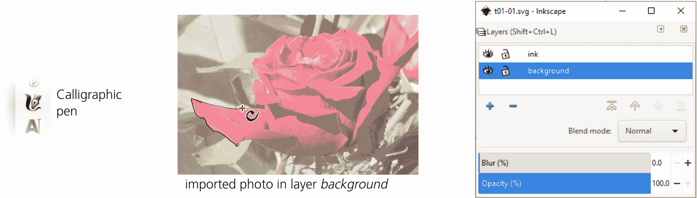

图 25-1：导入图像并使用书法笔设置追踪

用于追踪图像的最佳工具取决于图像的性质和你想要的结果。如果你在追踪可以用直线和贝塞尔曲线表示的几何形状，使用钢笔工具。如果你需要更多自由形式和艺术性形状，但又希望最小化路径和节点的数量，那么铅笔工具会是更好的选择。最后，如果你想要一种富有表现力、艺术感的凌乱风格，使用书法笔。我希望我的画作既简洁又富有艺术感和自然感，而且没有理由节省节点的数量，因此我使用了书法笔，如图 25-2 所示。

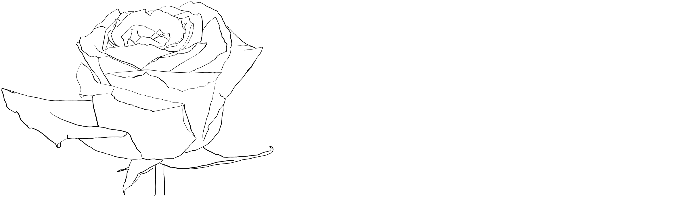

图 25-2：追踪完成：图层 ink 中有 106 个路径对象

我使用了一支压力感应的平板笔，可以根据按压的力度来改变笔画的宽度。用普通鼠标也可以得到类似的效果。事实上，你甚至可能更喜欢使用鼠标，因为用笔压力来控制笔画粗细，虽然理论上很不错，但需要大量练习，且很少能得到你想要的精确结果。一个更好的方法是用书法笔绘制恒定宽度的线条，然后使用调整工具的缩小/放大模式（12.6.4）在适当的位置使笔画变粗或变细，如图 25-3 所示。

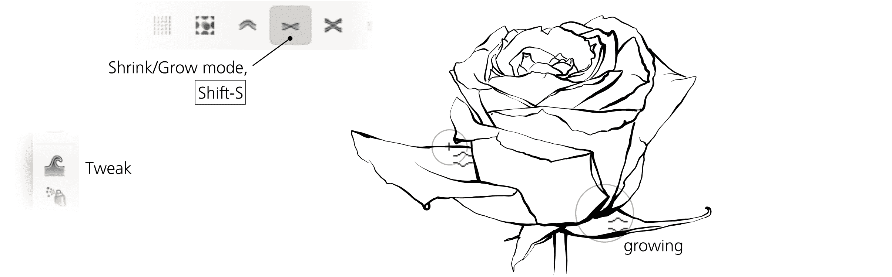

图 25-3：使用调整工具修改绘图

黑白轮廓已经完成，现在让我们给它添加颜色。使用清晰的墨水轮廓，我想要一种柔和的洗涤色调。为此，隐藏背景层，创建一个名为水彩的新层，并将其放置在墨水层下方。接下来，使用宽大的书法笔刷，做几笔狂野的涂抹：玫瑰下方涂红色，茎和叶下方涂绿色，周围则涂上各种蓝色的色调。最后，通过足够大的半径模糊这些笔触，使它们几乎融合在一起（图 25-4）。

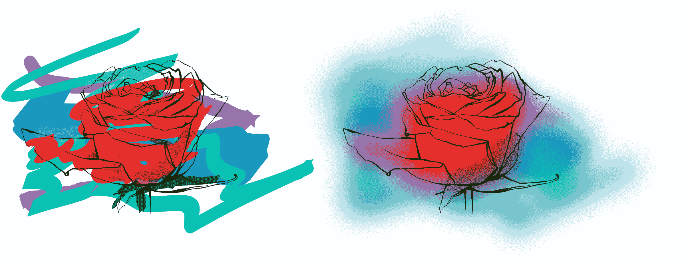

图 25-4：添加模糊背景

这看起来已经不错，但还不够好。平滑的模糊斑点 *太* 平滑——坦率来说，挺无聊的。为了让它们看起来更自然，我通过增加更多原始元素来扩展应用于背景的简单高斯模糊滤镜。首先，我加入了一个湍流原语，并与模糊效果合成，模拟纸张纹理。这样看起来更好，但仍然太单一——看起来像是计算机生成的。我接着加入了另一个具有更大周期的湍流组件，并使用了两次：第一次通过位移图（Displacement Map），使整体水彩效果更加斑驳不均；第二次通过合成操作符（Composite operator），调节小尺度的纸张纹理，更加真实地模拟纸张，其中有些区域更平滑，有些则更粗糙，如图 25-5 所示。

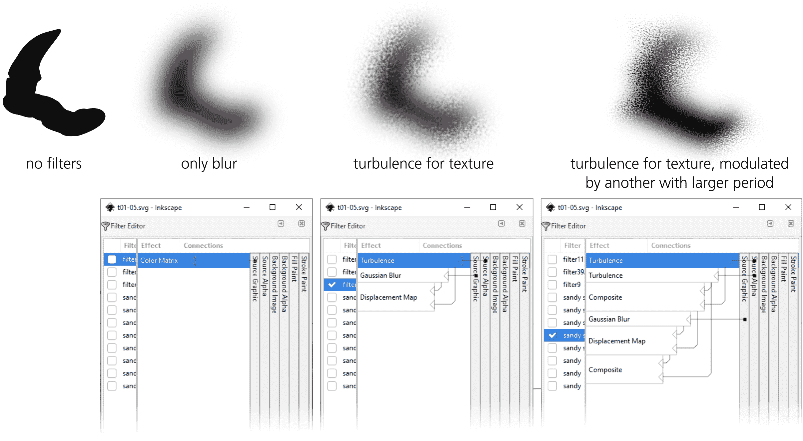

图 25-5：为背景构建“逼真水彩”滤镜

最终的合成滤镜，我称之为 *Sandy Blur*（更多细节请参见 17.5.2），看起来更加逼真，但渲染速度较慢。我不得不切换到无滤镜模式（17.5.4），以便在没有烦人的渲染延迟的情况下工作。

最后的点缀，你可以复制墨水层的内容并将其模糊，以形成阴影，或者（如我所做的）通过偏移（加粗）墨水路径的副本并使其半透明，稍微软化墨水线条。玫瑰图的背景已经完成。

## 25.1 处理效果 1：雕刻

完成了墨水和水彩层后，我继续创建一系列的处理效果——展示如何用不同的方式渲染同一幅图像。我将玫瑰覆盖上六个随机散布的方块，并将每个处理效果限制在一个方块内。

第一个版本是由弯曲的变宽笔触组成的雕刻效果。在这个处理效果中，我选择了玫瑰花瓣弯曲和阴影特别深的区域。雕刻是一门复杂的艺术；我并不认为我的尝试很完美，但我对使用 Inkscape 工具制作它的简便性感到惊讶。

当你有了轮廓并想将其转变为雕刻时，第一步是规划。考虑每个部分中雕刻线条最自然的方向。创建一个新图层，使用书法笔绘制几条间隔较大的测试笔画，尝试捕捉每个区域的曲率变化，同时保持最佳的方向对比，特别是在不同曲率区域的边界处相遇的位置（图 25-6）。

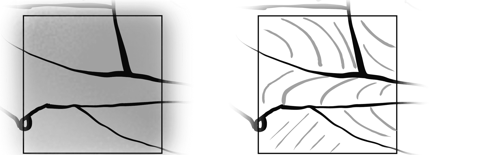

图 25-6：选择雕刻区域并进行测试笔画

一旦你有了如何让雕刻笔画进行的想法，将测试笔画移到一旁（但保留它们作为参考），并使用书法笔的导向跟踪功能（14.2.7）来填充每个区域，使用均匀间距的统一宽度笔画（图 25-7）。

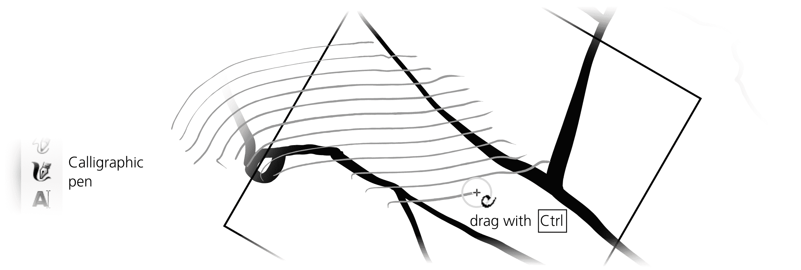

图 25-7：使用书法笔创建均匀间距的格子

不必担心你的笔画方向或曲率稍有偏离；你稍后可以修正这个问题。此时更重要的是间距的一致性。你可以旋转画布（Ctrl-Shift-滚轮），使笔画更加顺畅。绘制超出你正在填充的区域的边界；修剪过长的笔画要比延长过短的笔画容易得多。

你将使用调节工具完成剩下的工作（图 25-8）。

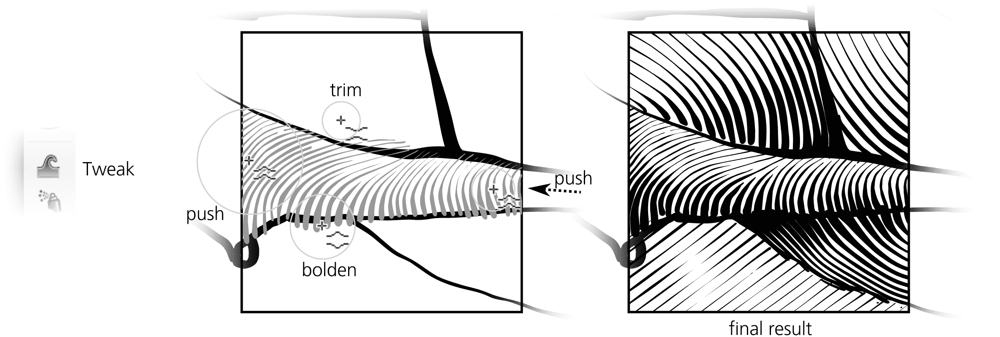

图 25-8：使用调节工具完成雕刻

使用收缩模式修剪线条的端点并使其变细，使用扩展模式加粗，使用推送模式移动并弯曲整个格子（选择所有格子笔画一起弯曲）。不要担心修剪的笔画末端的不雅外观。在最终结果中，墨水层的宽边界笔画会覆盖它们。

## 25.2 处理 2：镶嵌

这个处理非常容易，因为它大多是自动化的。唯一棘手的部分是创建镶嵌图案本身——即一组复杂的互锁瓷砖，覆盖整个平面，没有空隙或重叠。

画一个形状——任何形状——并从中创建一个瓷砖克隆的图案（**编辑 ▶ 克隆 ▶ 创建瓷砖克隆**，16.6），使用任何非平凡的对称群；我使用了 P3。一开始，克隆并没有形成任何类型的镶嵌图案；你的任务是重新塑造源形状——克隆已经到位——直到克隆相遇并平滑地相互锁定。这一步比看起来要简单得多。由于克隆会立即反映源形状的任何变化，这项任务几乎变得微不足道。只需添加节点并将其移动，以便为你的形状增添附加部分或制造凹陷。每个克隆都会镜像这些变化。继续雕刻形状，直到克隆精确地互锁并覆盖整个平面，如图 25-9 所示。

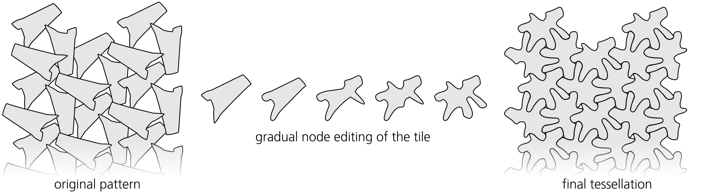

图 25-9：创建镶嵌

现在，让我们让图案反射背景颜色，使玫瑰图案显示出来。一旦设置好，过程大部分是自动化的。确保**使用保存的图案大小和位置**复选框已选中，删除现有的平铺（**移除**按钮），并设置图案的**宽度**和**高度**，以覆盖你想要覆盖的所有区域。取消原始形状的填充色（右键点击状态栏中的**填充：**色板并选择**取消设置**）。然后，进入**跟踪**标签，启用**跟踪图案下的绘图**，选择**颜色**，并将选定的值应用到克隆体的**颜色**中（图 25-10）。

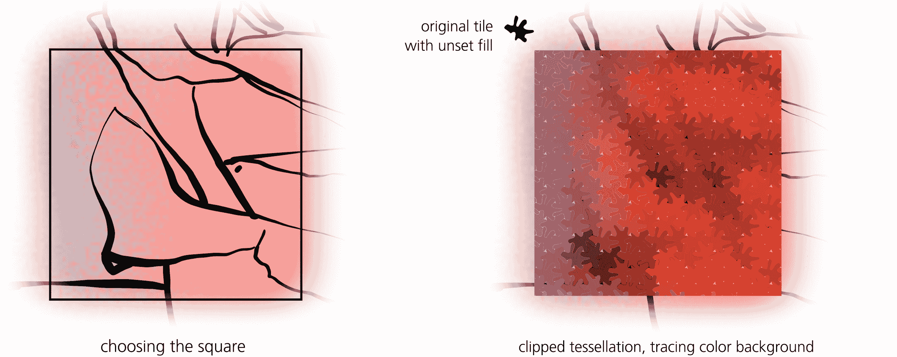

图 25-10：颜色跟踪与拼贴

最后，使用滤镜为平铺图案添加轻微的光泽高光（第十七章）。其中一个问题是，光泽滤镜不是对称的——它有一个特殊的方向，光线从该方向投射。然而，如果你对旋转过的*克隆体*应用这样的滤镜，滤镜将与克隆体一起旋转，所有高光将显示为从不同的方向照射而来。为了解决这个问题，只需将所有平铺克隆体组合（Ctrl-G），并将**按钮**滤镜从**滤镜 ▶ 凸面**应用到组合体中，如图 25-11 所示。

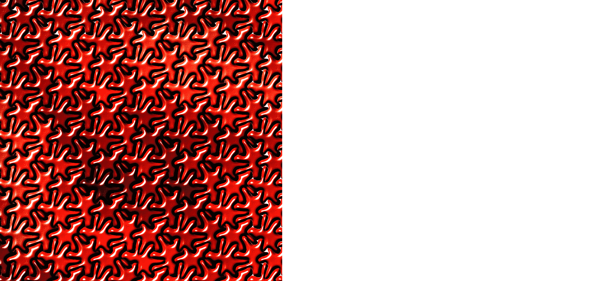

图 25-11：添加高光

## 25.3 处理方法 3：立方体场

与颜色跟踪拼贴一样，这种处理方法也使用了创建平铺克隆的对话框。然而，在其他方面，这种设计完全相反。它是随机的而非规则的，伪 3D 而非平面的，并且使用了三个不同的原始物体——因此有三个交织的图案——而不是单一的一个。

首先使用 3D Box 工具绘制一个立方体。将其转换为路径组（Shift-Ctrl-C）并复制（Ctrl-D）。在其中一个立方体副本中，进入该组，选择六个面并将它们联合（Ctrl-+），然后取消组合。这将一个立方体变为一个单一的立方体形状路径。取消其填充色——在克隆体中，这个副本将采用背景色。对于第二个立方体副本，使用 50%不透明度，并且在每个面上使用白色或黑色，且不进行联合。你还可以在立方体的前角添加一个具有从白色到透明的椭圆渐变的椭圆作为高光（图 25-12，左）。这就是阴影层，它使每个立方体看起来像一个立方体，尽管整体颜色发生了变化。

最后，将阴影立方体精确地放置在背景形状的正上方，并将它们组合在一起。这就是你的可克隆物体，它既可以通过未填充的形状选择背景色，也可以通过半透明的覆盖层呈现伪 3D 效果。对于另外两个不同方向的立方体，重复所有这些步骤，这样总共有三个立方体（图 25-12，右）。

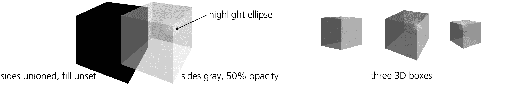

图 25-12：立方体散布的原始物体

现在，选择一个准备好的立方体，并在你想要覆盖的区域上创建一个 P1 对称散射，使用“创建平铺克隆”对话框中的颜色到颜色追踪（16.6.6）。随机化它们的旋转（稍微旋转，以免破坏所有立方体处于相同透视中的视觉效果）、大小和位置。为了模仿 3D 场景的效果，将缩放和行间距设置为从上到下逐行增加，如图 25-13 所示。

图 25-13：散布立方体

对你准备的另外两个立方体重复此过程，覆盖相同的区域。这个结合的立方体场景还看起来不像一个*场景*，因为 z 轴排序错误。那些靠近底部且较大的立方体应该更靠近我们，因此应位于其他立方体之上，但它们并没有。为了修正这个问题，使用**Restack**扩展（在**扩展 ▶ 排列**中）对立方体的 z 轴排序进行调整，使它们从上到下堆叠。然后，从**对齐与分布**对话框中执行一次**去聚集**操作，以减少立方体排列中的间隙（图 25-14）。

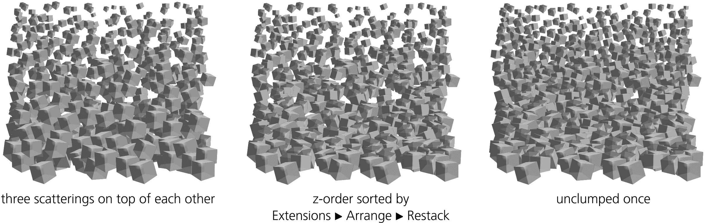

图 25-14：立方体的场景：z 轴排序和去聚集

目标是复制玫瑰背景图层的方形区域。然而，如果你对覆盖目标区域的所有三种图案使用自动的颜色到颜色背景追踪（如 16.6.6 中所做的那样），你可能会发现追踪后的颜色相当单调。这是因为每个立方体从它所覆盖的相对较大区域采样颜色，并对其进行平均，结果使其颜色比原始背景图像的饱和度低。此外，每个立方体中的 3D 阴影叠加会冲淡背景形状的颜色。

为了修正这个问题，你可以像图 25-15 中所示那样手动涂绘立方体。

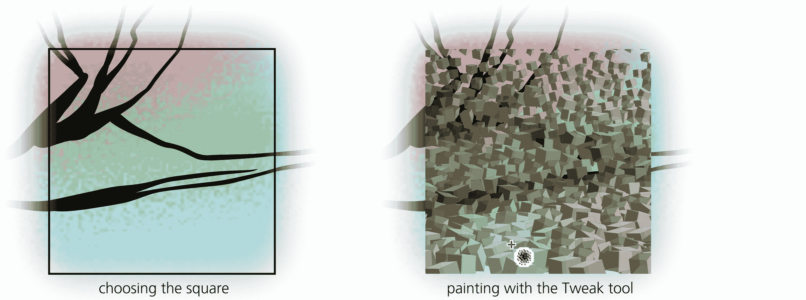

图 25-15：在立方体上涂绘颜色

只需选择所有立方体克隆，选择 Tweak 工具的颜色绘画模式（8.9），选择鲜红色（或使用滴管工具从背景图像中选择它，8.8），然后在图像的红色区域上进行涂绘。然后，对其他彩色区域（包括黑色墨线）做同样的操作。（如果没有效果，可能是你忘记取消每个立方体底部路径中的填充，参见图 25-12。）这种彻底的位图式涂绘是一种有趣的方式来编辑矢量图！

最后，将所有立方体分组，并将组裁剪到所选择的方形区域（18.3）。

## 25.4 处理 4：逼真绘图

这种摄影现实主义的表现是所有部分中最耗时的。我希望在这部分的绘画中尽可能地重现原始照片。绝对的摄影现实主义，当然既不可能也不理想，但你可以追求那种具有独特吸引力的“矢量摄影现实主义”外观。关键在于巧妙地运用形状、渐变和模糊效果。

首先，定位你将要工作的区域，并显示（但保持锁定）包含源照片的图层。从划分你的绘图区域开始，每个区域通过平面颜色或单一渐变来大致表示。使用铅笔工具（14.1.2）创建这些区域，使用渐变工具（10.1）在这些区域上绘制并拉伸渐变，如图 25-16 所示。使用吸管工具（8.8）从照片图层中选取精确的颜色。

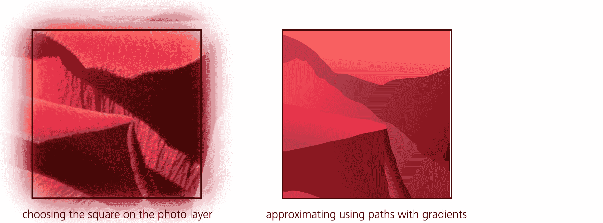

图 25-16：使用带渐变的路径近似图像区域

为了柔化边缘，使用**填充和描边**对话框将形状稍微模糊（不超过 2%）。为了添加一些自然的纹理，在形状上绘制一个 40% 灰色、10% 不透明度的矩形，并对其应用**滤镜 ▶ 覆盖层 ▶ 小斑点**。在**滤镜编辑器**对话框中，增加随机纹理的频率（在**湍流**原语中的**基础频率**），如图 25-17 所示。

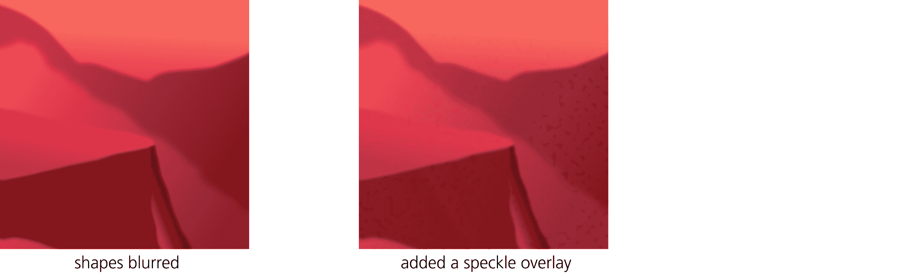

图 25-17：模糊和加纹理的背景

目前的效果仅仅是一层粗略的背景涂料，你将在其上覆盖细节——重现玫瑰花瓣的典型皱纹和质感。你将主要使用相对较小宽度、零固定和一定震颤的书法笔（14.2）。通常你会使用半透明的黑色或白色来绘制阴影或高光，分别对应不同的效果。你也可以尝试使用略微饱和的互补色版本（例如，红色区域使用淡绿色），这常常能让你的绘画看起来更自然——在现实生活中，颜色的色调从来不会完全均匀。

当然，你还需要对这些半透明的笔触进行模糊处理。不要对每一笔单独应用模糊——这样做会很麻烦（与不透明度不同，模糊效果不会保留在工具样式中，因此不会自动应用到下一个创建的对象）并且渲染速度较慢。相反，绘制一笔单独的笔触，将其分组（Ctrl-G），对整个组应用模糊，然后进入该组（Ctrl-Enter）。现在，使用书法笔或任何其他工具创建的每个新对象都会被添加到模糊的组中，并与同组的其他对象一起被模糊处理（图 25-18）。绘制完组内的内容后，按 Ctrl-Backspace 退出该组。

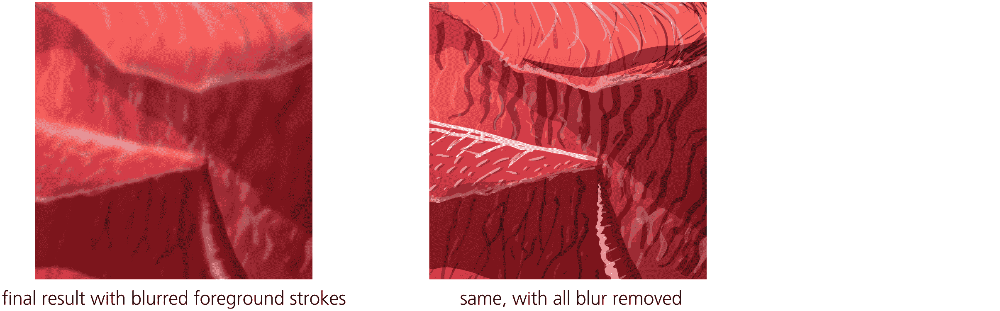

图 25-18：添加手绘前景笔触

在绘图时，特别注意物体的边缘——通过密集的高光和阴影来适当强调边缘，是获得吸引人的“绘画风格”外观的关键。将高光和阴影的边缘稍微加重通常效果不错。

## 25.5 处理方法 5：地图

地图处理法并非一种实用的技术示例，而是对某些简单直白内容的创意再创作。当时我只是玩弄原始照片的这一部分，使用了一个八色的 Potrace 路径追踪（路径 ▶ 跟踪位图，18.5.2），当我丢弃填充颜色并为结果形状指定虚线轮廓时，我注意到它获得了一种有趣的类似地图的外观，如图 25-19 所示。

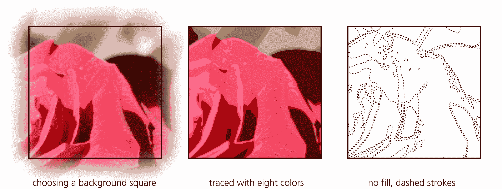

图 25-19：追踪源照片

为了模仿旧地图的表面，我创建了一个黄色、略微粗糙（滤镜 ▶ 扭曲 ▶ 粗糙化）、半透明的背景矩形（以便背景的绘图能稍微透过来）。然后，我添加了一些神秘的文字标签来完善图像。

## 25.6 处理方法 6：修饰过的照片

对于修饰过的照片处理，我想展示 Inkscape 作为使位图更美观的工具，而非作为矢量编辑器。当然，“更美观”是一个主观的词汇，但你可以在 Inkscape 中进行一些简单的编辑，改善几乎任何照片的外观。彩色插图中的图 18 展示了原始玫瑰照片的一部分，亮度增加、阴影加深、高光添加，纹理得到强调。

作为对合成玫瑰图像的最后修饰，我为包含各种处理的六个方框添加了虚线框架。彩色插图中的图 17 展示了完整的图像。

每当我将照片导入 Inkscape 时，我通常会进行以下一项或多项更改：

+   我应用滤镜 ▶ 色彩 ▶ 明度-对比度来扩展照片的动态范围。在像 Photoshop 或 GIMP 这样的位图编辑器中，我会使用 Levels 命令来完成此操作，但在 Inkscape 中，明度-对比度滤镜是最接近的近似方法。其原理是拉开照片中所有颜色的差距，使得最暗的区域变得极暗（即黑色），最亮的区域变得极亮（即白色）。如果操作得当，图像细节不会丢失，但照片的视觉效果通常会显著改善。我通常会在明度-对比度对话框中启用实时预览复选框，并调整两个值，尽量在不丢失阴影或高光的情况下进行对比。

+   明暗对比度范围扩展适用于整个图像，通常我可以发现某些区域会从手动提亮或加深中受益。我最喜欢的做法是创建一个白色圆形（11.4），用白色到透明的椭圆渐变填充它（10.1），并为其指定叠加（Overlay）混合模式（17.2）。我将其复制并移动到需要高光的位置，根据需要调整大小；如果某个高光过于强烈，我会降低其不透明度。为了强调黑色细节，我会用黑色而不是白色创建类似的着色对象。有时，我还会使用其他颜色的高光来增加色彩点缀。这就是我在彩色插图中的图 18（底部）上所做的，以使花瓣的阴影更加生动；叠加层的范围通过黑白轮廓显示出来。

+   几乎总是，设计组合中的图像需要调整其饱和度。有些图像——比如我们的玫瑰——在高饱和度下效果最好。然而，大多数情况下，照片可能会受益于完全或部分去饱和。为此，我使用“滤镜 ▶ 颜色 ▶ 色彩偏移”滤镜，该滤镜具有色调和饱和度两个滑块。

+   我经常通过使用“滤镜 ▶ 图像效果 ▶ 锐化”或“锐化更多”滤镜来改善低分辨率的照片。
