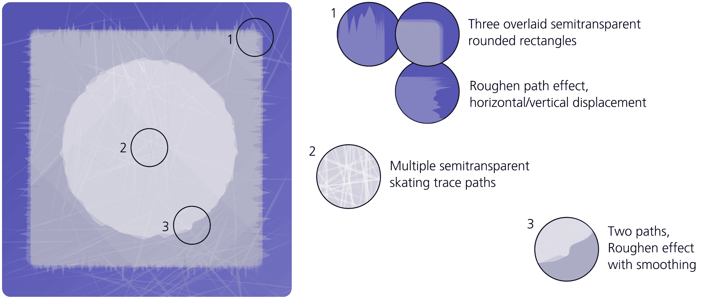
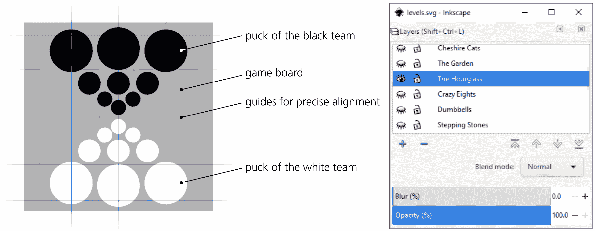
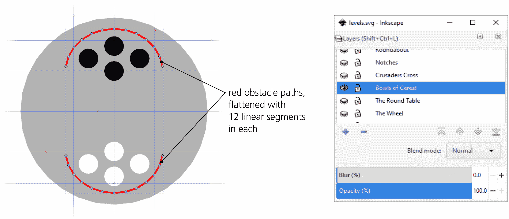
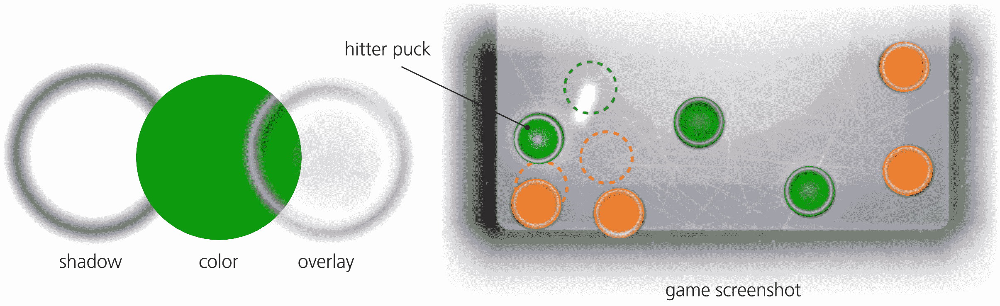
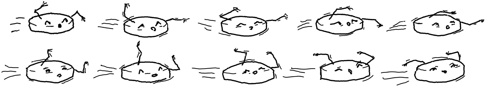
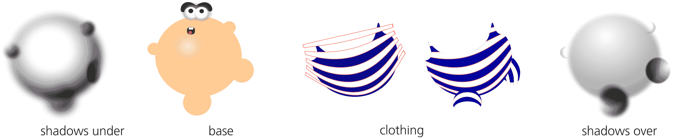
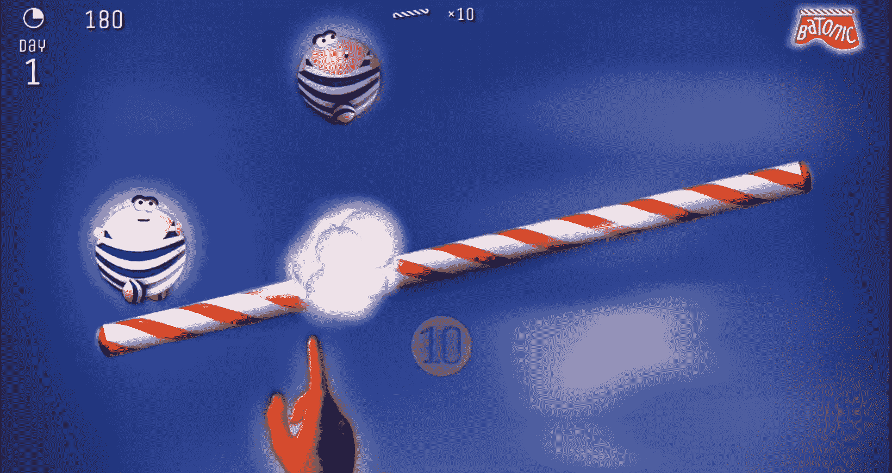

# 第二十七章：教程：游戏的艺术创作

针对各种硬件的游戏——桌面电脑、游戏主机、移动设备——是一个庞大、不断增长并且对图形需求极高的行业。如今，许多游戏图形是 3D 的，但传统的 2D 图形编辑器，如 Inkscape，依然有大量的工作需求——即使只是作为 3D 世界中图形资产的创作者。在本教程中，我展示了 Inkscape 如何成为游戏开发者的瑞士军刀。

本教程中的示例来自我和我的家人共同为 Android 移动设备开发的两款游戏。它们是简单的 2D 游戏，具有基于物理模拟（使用 Box2D 库）的街机类玩法。开发一款游戏是一个复杂的过程，涉及设计、编程、艺术创作、音乐制作，然后是看似无尽的测试、调整和修复——更不用说市场营销和推广了。我们使用了许多不同的工具和资源来创建我们的游戏。然而，我会将 Inkscape 排在列表的顶部，仅次于 Google 的 Android Studio IDE。本教程是几个小项目的集合，演示了 Inkscape 在各种游戏开发任务中的应用。

## 26.1 BotP：冰场

我们开发的其中一款游戏叫做 *Battle of the Pucks*（*BotP*，可通过 [`kirsanov.com/battle-of-the-pucks/`](http://kirsanov.com/battle-of-the-pucks/) 访问），游戏中有两个冰球队伍，玩家通过滑动手指来推动冰球，目标是将对方的冰球推入冰场边缘之外的空地。

创建冰场图像是一个挑战，因为它必须给人一种真实冰面的印象，包括冰面的凹痕、刮痕和滑冰痕迹。图 26-1 展示了我们如何使用多个半透明路径和 Roughen 路径效果来实现这一点。最终的图像导出为 PNG 并作为图形资产加载到游戏中。

图 26-1：制作逼真的冰面

## 26.2 BotP：Inkscape 作为关卡编辑器

*Battle of the Pucks* 具有多个关卡，每个关卡中冰球的初始位置不同（在高级关卡中，还会有各种障碍物）。我可以通过代码来定义这些关卡，但由于关卡超过 90 个，这样做会非常繁琐。通常，当你拥有视觉信息时，应该使用视觉工具来处理它，即使这意味着前期需要做一些额外的投资。这就是我们决定使用 Inkscape 作为我们游戏关卡编辑器的原因。

任何有关关卡的游戏都需要某种关卡编辑器，对于复杂的游戏项目，它可能是与游戏本身并行开发的定制软件。对于相对简单的游戏，如*BotP*，使用 Inkscape 完成此任务是非常合适的。关卡以图像形式绘制，每个图像位于独立的图层上，并保存为 SVG 文件。游戏代码加载并解析 SVG 文件，找到当前图层元素，并读取其子元素以在每个关卡开始时放置冰球和障碍物。

正如你所预料的那样，这个看似简单的创意并不完全容易实现。我们为游戏使用的 Java 库有一个 XML 解析器，但它并没有处理诸如变换等 SVG 特定数据的功能（A.7）。因此，在创建和编辑游戏的 levels.svg 文件时，我们不得不遵守一些限制。

### 26.2.1 冰球

游戏中的冰球可以有不同的尺寸，但它们都是圆形的，因此在 levels.svg 中，它们由 Ellipse 工具创建的 `circle` 元素表示（11.4）。我们必须小心保持圆形的圆形。如果你不小心挤压或拉伸一个圆形，Inkscape 会将其转换为 SVG 中的 `ellipse` 元素；如果你触碰到该形状的圆弧/线段控制点（11.4.2），它会变成路径。这两种变化都会破坏我们游戏的解析代码，该代码只识别 `circle` 元素，并利用其 `cx` 和 `cy` 属性来放置冰球，`r` 属性来确定其大小（和质量）。圆形的白色或黑色（从其 `style` 属性解析出）决定了该冰球属于哪条命令（图 26-2）。

图 26-2：一个名为“沙漏”的 *BotP* 关卡：两支冰球队准备战斗。

当在 Inkscape 中移动冰球圆形时，确保圆形元素不会获得 `transform` 属性非常重要。在“首选项”中的“行为 ▶ 变换”页面上，必须将“存储变换”设置为“优化”。现在，当你移动圆形时，Inkscape 会更新其 `cx` 和 `cy` 属性，而不会创建 `transform` 属性。然而，这种方法有一些不明显的限制：当你旋转或翻转圆形时，即使在优化变换下，它仍然会获得 `transform`。我们了解到，我们需要在不翻转的情况下安排我们的冰球队伍，只通过移动或缩放来实现。

### 26.2.2 障碍物

高级游戏关卡包含障碍物——反射冰球的墙壁——使得游戏玩法更加有趣，且往往相当具有挑战性。在 levels.svg 中，障碍物表示为具有红色轮廓的 `path` 元素。游戏代码可以解析该元素中的路径数据，并将其重新创建为游戏中的对象，但它有一个限制：只能将障碍物创建为线性片段。为了创建曲线形障碍物，我们必须使用短的线段来近似它们，使用“扩展 ▶ 修改路径 ▶ 扁平化贝塞尔曲线”扩展，如图 26-3 所示。

图 26-3：一个名为“麦片碗”的 *BotP* 关卡，其中每侧的四个冰球背靠碗形墙壁。

图 26-4 显示了该关卡的渲染方式。

图 26-4：实际游戏中的“麦片碗”关卡

当游戏代码读取 SVG 文件时，它会从`d`属性中提取路径点的坐标。这些数据由一系列单字符命令（例如，`l`表示线性段，`c`表示贝塞尔曲线）和紧随其后的数字坐标组成。通常，路径数据中的坐标是相对的；每对坐标表示相对于前一个点的位移。在我们的游戏代码中，我们发现处理绝对坐标要简单得多。为此，在偏好设置对话框的输入/输出 ▶ SVG 输出页面，我们将路径字符串格式切换为绝对格式。路径命令的绝对变体使用大写字母，因此更改后，您将在路径的`d`属性中看到`L`、`C`等。

### 26.2.3 文件缩小

移动应用程序对文件大小非常敏感，因此在将 levels.svg 包含到游戏资源中之前，我们尽力将其大小尽可能缩小。Inkscape 提供了几种现成的方法来实现这一点。

+   偏好设置对话框的输入/输出 ▶ SVG 输出页面有多个选项，可以使保存的 SVG 文件更小：内联属性（即将每个元素的所有属性放在同一行）、缩进空格的数量以及数值的精度（数字位数）。这会影响从 Inkscape 保存的所有 SVG 文件。

+   您可以在保存、另存为或保存副本对话框中选择的优化 SVG 输出文件类型可以执行一些额外的优化。它可以通过将数值四舍五入到指定的数字位数来缩小数值数据，缩短颜色值，将 CSS 属性转换为 XML 属性，删除不必要的分组，删除注释和元数据，删除未使用的 ID，嵌入栅格图像，以及美化打印 SVG。

然而，对我们来说，这还不够。我们编写了自己的 Python 脚本，删除了 SVG 文件中的注释、不必要的命名空间、属性和样式属性。这个脚本还会在所有防范措施都到位的情况下，如果一些圆形有`transform`属性或一些路径数据（`d`属性）使用小写命令（相对坐标）而不是大写命令（绝对坐标）时发出警告。

## 26.3 BotP：冰球

*BotP*中的冰球可以有不同的颜色，这取决于它们所属的队伍以及选择的颜色主题。因此，游戏中的每个冰球对象由三层图像组成：底部的环形阴影、一个彩色圆形，然后是一个半透明的覆盖层，增加了圆形的边缘以及一些光线色彩的高光和划痕，以增加真实感（图 26-5）。

图 26-5：冰球的结构以及它在游戏中的样子

有趣的是，尽管顶部的边缘有假定的光照方向（来自左上方），但在游戏中，冰球—包括覆盖层—自由旋转，但这种旋转从未产生误打阴影的印象。

## 26.4 BotP：溅射动画

作为对冰面和冰球的真实风格的有意对比，闪屏动画（在游戏加载时播放）和主菜单采用了自由手绘、凌乱、颤抖的动画风格。制作这种动画的秘诀很简单：从头开始重新绘制每一帧，包括那些在每帧之间没有真正移动的部分。我们使用了带有颤动和/或抖动效果的书法笔（14.2），并尽量避免太整齐或过于拘泥于指导方针。

图 26-6 显示了*BotP*的闪屏动画的 10 帧，特点是一个拟人化的冰球在冰面上狂奔。虽然这些图像单独看起来似乎只是画得很糟且随意，但当它们快速连续展示时，它们融合成了一个栩栩如生、甚至具有共鸣的角色。

图 26-6：动画闪屏图像的帧

## 26.5 Batonic：一个标志性角色

我们制作的另一个游戏叫做*Batonic*（[`kirsanov.com/batonic/`](http://kirsanov.com/batonic/)）。这个游戏有趣的地方在于主角的设计，既是游戏的图标，也是本书封面上的设计。

图 26-7 显示了将其切割成组成的分层物体后是什么样子。我们将信封变形路径效果应用于矩形条纹的路径，创造了条纹背带裤的效果，然后通过复制的蓝色服装路径进行裁切。

图 26-7：巴贝尔先生的分层

在游戏中，这位名叫巴贝尔先生的有趣绅士，会在你用手指尖平衡一个马戏棒时，召唤出一整支从天而降的巴贝尔军团。这里，每个角色的形象被分离成身体、眼睛、手臂和腿部，并通过动画使巴贝尔们栩栩如生，如图 26-8 所示。

图 26-8：*Batonic*：巴贝尔们攻击你的马戏棒。
