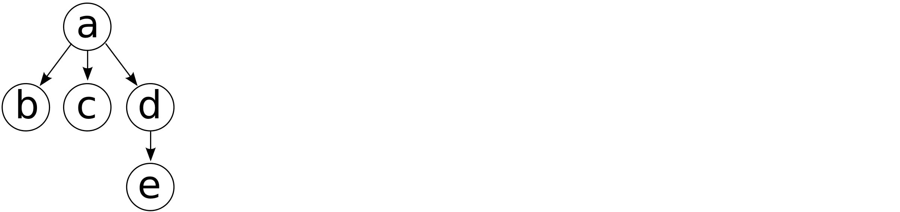

# 第二十八章：A

SVG 入门

本附录是对 SVG 工作原理及其在 Inkscape 中实现的一个非常高层次的概览。如果你想要最终的、完整的、权威的 SVG 参考，请参阅 W3C 的 SVG 规范，[`w3.org/Graphics/SVG/`](https://w3.org/Graphics/SVG/)。截至本文撰写时，SVG 2.0 仍处于草案阶段；Inkscape 支持最新发布的标准版本 1.1，你可以在 [`w3.org/TR/SVG11/`](https://w3.org/TR/SVG11/) 找到它。

对于掌握 Inkscape，了解 SVG 和更广泛的 XML（SVG 基于 XML）知识并非严格必要——但它会有所帮助。它将使你能够深入了解 Inkscape 绘图的内部结构，并且它通常能揭示一些 Inkscape 功能（或缺乏功能）的真正原因。让我们从一个简短的 XML 介绍开始，这对于许多场合都很有用，即便这些场合与 Inkscape 或 SVG 无关。

## A.1 简短的 XML 介绍

如果你曾经查看过网页的源代码，你已经知道 XML 看起来是什么样子，因为 XHTML，今天在网页上使用的标记语言，是 XML 的一种亚种——更准确地说，是*XML 词汇*。SVG 也是这样的一个词汇。

XML 是一种标准化的方式，用于以纯文本记录结构化信息。它便于计算机解析，而且对人类来说也相当容易理解。与大多数计算机相关概念通常复杂得让你以为它们比你想象的更复杂不同，XML 简单到几乎令人难以置信。

XML 文档的基本构建块是*元素*。下面是一个包含文本的元素示例：

```
<example>Here goes some text.</example>
```

元素内的文本称为其*内容*，这些内容由*标签*限定。所有位于小于号（`<`）和大于号（`>`）之间的部分都是标签。在这里，开始标签和结束标签几乎是相同的，唯一不同的是结束标签的元素名称前有一个斜杠（`/`），在这个例子中，元素名称是 `example`。

一个元素可能完全没有内容：

```
<example></example>
```

或者

```
<example/>
```

这两个*空元素*是等价的；第二个元素由一个单一标签组成，它只是第一个元素的一种拼写变体。注意在单标签空元素中斜杠（`/`）的位置不同。

除了文本外，元素还可以包含其他元素，但这些元素必须*完全*位于包含元素内。例如，下面这是错误的：

```
<a><b></a></b>
```

因为元素 `b` 从 `a` 内部开始，但在外部结束。如果一个元素从另一个元素内部开始，它也必须在该元素内结束。下面是正确的 XML 示例：

```
<a><b/><c/><d><e/></d></a>
```

我们说 `a` 是 `b`、`c` 和 `d` 的*父元素*，而 `d` 是 `e` 的父元素。一个元素可以有多个子元素，但它只有一个父元素（除了文档的根元素，它没有父元素）。图 A-1 是这个 XML 片段的图示表示。



图 A-1：表示 XML 代码的树形图

除了子元素，XML 元素还可以拥有 *属性*。每个属性都有一个名称及其关联的值。属性在元素的开始标签中指定：

```
<text type="important" font-size="10">Here is some text.</text>
```

请注意等号（`=`）和属性值周围的双引号。两者都是必需的。

整个 XML 文档就是一个单一的元素（称为*根元素*），可能包含一些文本内容和子元素——这些子元素又可以包含更多的内容和更多的子元素，依此类推。因此，XML 文档可以被看作是一棵从单一根元素生长出来的树。例如，以下是一个完整且有效的 SVG 文档，其根元素 `svg` 包含了两个元素，分别表示一个矩形和一段文本字符串：

```
<svg> <rect x="100" y="100" width="300" height="50" fill="blue"/> <text x="100" y="150">This is a text string.</text>
</svg>
```

## A.2 词汇和命名空间

XML 本身只是一个基础——你可以在这个基础上构建许多不同的应用。你无法想象在 XML 出现之前，有多少工作时间被浪费在为每个应用发明新数据格式、制定规则、编写和测试支持软件，以及处理不可避免的错误、异常和版本不兼容上。

如今，如果你需要记录一些数据，你不再需要进入那些字符具有特殊含义以及各种字段大小的低级细节。通过选择 XML（你必须有非常充分的理由*不*选择它），你可以专注于真正重要的内容：数据的结构，以及如何命名元素和属性，以最佳方式表达该结构。

此外，你甚至可能不需要这样做，因为针对你的数据类型，可能已经存在一个通用的标准化 XML *词汇*。每个词汇定义了一组元素和属性，详细说明了它们的含义、使用的上下文、哪些是强制的、哪些是可选的，等等。SVG 就是这样一个词汇，XHTML 是另一个。许多不同的标准化 XML 词汇存在，涉及从狗的家谱到星星目录等许多奇异事物。它们中的许多重用了其他词汇的部分内容。

为了能够无混淆地混合不同的词汇，XML 使用*命名空间*。命名空间是一种指示特定元素或属性来源的方法。例如，下面是一个来自 SVG 词汇的 `image` 元素，表示一个位图图像链接，嵌入在 SVG 文档中：

```
<svg:image xlink:href="/dir/file.png" width="200" height="100"/>
```

请注意，元素名称和其中一个属性使用了冒号（`:`）。冒号前的部分称为*命名空间前缀*。要找出哪个命名空间对应于该前缀，请查找形式为特殊 `xmlns` 前缀的命名空间声明属性（`xmlns` 是 *XML NameSpace* 的缩写），该声明位于同一元素或其任何祖先元素中。

通常将所有命名空间声明属性放在根元素上，因此你很可能会在根 `svg` 元素中找到 `svg` 和 `xlink` 前缀的声明：

```
<svg:svg ... xmlns:svg="http://www.w3.org/2000/svg" xmlns:xlink="http://www.w3.org/1999/xlink" ... >
```

这意味着`svg`前缀绑定到命名空间`http://www.w3.org/2000/svg`，而`xlink`前缀对应于`http://www.w3.org/1999/xlink`。在这里，命名空间是网址，但它们不一定需要是网址；唯一的要求是它们必须是全局唯一的，而网址是确保这一点的最简单方式。

SVG 的命名空间 URL`http://www.w3.org/2000/svg`必须与显示的完全一致。如果您的 SVG 文档中元素的命名空间前缀无法解析为`http://www.w3.org/2000/svg`，Inkscape（或任何其他 SVG 软件）将无法将该文档识别为 SVG。然而，命名空间*前缀*可以是任意的，只要它绑定到正确的命名空间。如果您这样声明，前缀甚至可以为空：

```
<svg ... xmlns="http://www.w3.org/2000/svg" ... >
```

在带有该声明的元素内，任何*没有*前缀的元素名称都被假定为属于 SVG 命名空间。例如，以下将被识别为有效的 SVG `image`元素，它链接到一个外部 PNG 格式的图像文件：

```
<image xlink:href="/dir/portrait.png" width="200" height="100"/>
```

命名空间错误，比如没有为前缀声明命名空间或命名空间 URL 错误，是手动编辑 SVG 时最常见的问题——要小心这些错误！

## A.3 根元素

这是一个典型的 Inkscape SVG 文档的根`svg`元素，包含一堆命名空间声明和其他属性：

```
<svg xmlns:dc="http://purl.org/dc/elements/1.1/" xmlns:cc="http://creativecommons.org/ns#" xmlns:rdf="http://www.w3.org/1999/02/22-rdf-syntax-ns#" xmlns:svg="http://www.w3.org/2000/svg" xmlns="http://www.w3.org/2000/svg" xmlns:xlink="http://www.w3.org/1999/xlink" xmlns:sodipodi="http://sodipodi.sourceforge.net/DTD/sodipodi-0.dtd" xmlns:inkscape="http://www.inkscape.org/namespaces/inkscape" width="385.6" height="210" id="svg2" sodipodi:version="0.32" inkscape:version="1.0 (4035a4fb49, 2020-05-01)" version="1.1" sodipodi:docid="file.svg"
>
```

SVG 使用 SVG 命名空间（`http://www.w3.org/2000/svg`）来表示其自身的元素，使用 XLink 命名空间（`http://www.w3.org/1999/xlink`）来表示链接属性（A.9）。此外，Inkscape 在属于 Inkscape（`http://www.inkscape.org/namespaces/inkscape`）和其前身 Sodipodi（`http://sodipodi.sourceforge.net/DTD/sodipodi-0.dtd`）的命名空间中添加了元素和属性（请参阅 1.6 了解 Inkscape 的简短历史）。此处声明的其他命名空间用于元数据元素（有关文档的一般信息）和许可证标识符（A.4）。

在这个示例的根元素中，SVG 标准中定义的唯一属性是`width`和`height`（定义画布的大小），`id`和`version`。其余的要么是命名空间声明，要么是 Inkscape/Sodipodi 命名空间中的属性。

`inkscape:version`指定了创建此文档时 Inkscape 的版本，在本例中为 1.0（括号中有构建号和日期）。它还声明该文档可以与 Sodipodi 的版本 0.32 一起使用（`sodipodi:version="0.32"`），因为从那个版本开始，Inkscape 从 Sodipodi 中分支出来。没有命名空间的`version`属性指的是此文档所实现的 SVG 规范的版本，1.1。

当你保存文档时，可以选择 Inkscape SVG 格式或 Plain SVG 格式；它们的唯一区别在于 Plain SVG 会去除 Inkscape 和 Sodipodi 命名空间中的所有元素和属性，仅保留标准命名空间。通常，Inkscape 特定的元素或属性不能改变文档的*外观*；它们只能影响文档在 Inkscape 中编辑时的*行为*（例如，`g` 元素上的一个属性可能会告诉 Inkscape 将该元素视为 3D 方框，而不是简单的组；请参见 11.3）。因此，将文件保存为 Plain SVG 会使文件稍微变小，但代价是失去了一些 Inkscape 可编辑性。如果你发现文件在保存为 Plain SVG 后呈现不同的效果，那说明你遇到了一个 bug——请报告给开发者！

## A.4 Defs、视图和元数据

让我们从典型 Inkscape SVG 文档的根元素开始，看看里面还包含了什么。

首先是 `defs` 元素。`defs` 是 SVG 标准的一部分，它是一个存储区，用来存放那些本身不会显示在画布上的元素，但其他元素可以引用它们。这些包括渐变、图案、标记（箭头，9.5）、剪切路径、蒙版、滤镜等等，它们都作为 `defs` 元素的子元素存储。SVG 规范允许你将多个 `defs` 元素几乎放置在文档中的任何位置，但 Inkscape 总是使用一个位于根 `svg` 元素下的单一 `defs` 元素。下面是一个包含渐变的 `defs` 元素示例：

```
<defs id="defs4"> <linearGradient inkscape:collect="always" id="linearGradient2798"> <stop style="stop-color:#000000;stop-opacity:1;" offset="0" id="stop2800"/> <stop style="stop-color:#000000;stop-opacity:0;" offset="1" id="stop2802"/> </linearGradient>
</defs>
```

将 `linearGradient` 元素添加到 `defs` 中本身并不会改变画布上的任何内容。不过，现在任何对象都可以引用（10.2.1）这个渐变，用来填充或描边。

即使没有任何可见元素使用，`defs` 中的大部分内容也会被保留。例外情况是具有 `inkscape:collect="always"` 属性的元素；这些元素在不再使用时会自动删除。Inkscape 通常使用这个标志来标记它自己创建的各种辅助元素，并可以安全地删除它们；它绝不会删除你创建的或明确添加的任何内容，除非获得你的许可。通过这种方式，你可以重新使用曾经定义但后来不再使用的元素。

因此，随着你在文档中工作的进行，`defs` 可能会变得越来越大。要移除 `defs` 中任何未使用的定义，请使用**文件 ▶ 清理文档**命令。有时，这个命令可能在第一次尝试时无法删除`defs`中*所有*未使用的内容；你可能需要退出文档，重新加载后再次清理。

在 Inkscape SVG 文档的根元素下，紧接着的元素是 `sodipodi:namedview`：

```
<sodipodi:namedview inkscape:window-height="950" inkscape:window-width="1280" inkscape:window-x="0" inkscape:window-y="24" inkscape:pageshadow="2" inkscape:pageopacity="0.0" bordercolor="#666666" pagecolor="#ffffff" inkscape:zoom="0.64306408" inkscape:cx="836.6226" inkscape:cy="619.40089" inkscape:current-layer="layer2" showguides="true" />
```

这个 Inkscape 特定的元素在其属性中保存了所有与该文档相关的选项：Inkscape 在加载文档时将使用的缩放级别和滚动位置，画布的旋转角度，网格的颜色和间距，各种吸附模式，当前图层，文档单位等。在 Inkscape 中，您可以通过文件 ▶ 文档属性对话框 (3.1.2) 设置其中大多数选项。

最后，`metadata` 元素出现在文档内容实际开始之前。它存储有关文档的作者、目的、日期、许可证等信息，并对应于 Inkscape 中的文件 ▶ 文档元数据对话框。`metadata` 内的元素使用 RDF 标准（请参见 [`w3.org/RDF/`](https://w3.org/RDF/)），可能会使用额外的 XML 命名空间来描述不同种类的信息。

## A.5 图层和分组

在 `metadata` 元素之后，SVG 文档的实际可视内容开始。自然地，每个文档的*对象*都对应一个 SVG *元素*。此外，文件中元素的顺序对应于对象在画布上视觉堆叠的顺序（4.4）：文件末尾的元素绘制在文件开头的元素之上。

当你将对象组合在一起时（4.8），它们被放置在一个`g` 元素中。例如，这里有一个包含矩形和文本对象的分组：

```
<g id="g2893"> <rect id="rect2310" y="350" x="100" width="300" height="150" style="opacity:1;fill:#ff0000;stroke:#000000;stroke-width:1px;" /> <text id="text2889" y="400" x="200" style="font-size:40px;font-style:normal;font-weight:normal;fill:#000000; stroke:none;font-family:Bitstream Vera Sans" xml:space="preserve">Text in rectangle</text>
</g>
```

除了分组，另一种组织对象的方式是通过图层 (4.9)。SVG 没有专门用于图层的元素类型；相反，Inkscape 使用一个 SVG `g` 元素，添加了一个自定义属性，使其在编辑文件时知道将该分组视为图层。

```
<g inkscape:groupmode="layer" inkscape:label="Layer 1" id="layer1"> ...contents of the layer...
</g>
```

由于图层因此是一种特定类型的分组，便于看到 Inkscape 如何“进入一个分组”，暂时将其视为图层（4.9.1）。这也是为什么在将 Inkscape 的 SVG 文件导入到其他矢量编辑器（如 Adobe Illustrator）时，通常会丢失图层，但对象会获得额外的分组层次：其他编辑器不知道 Inkscape 使用某些 `g` 元素作为图层的约定，而将它们视为常规分组。

在图层和分组内部，其他 SVG 元素表示绘图中的实际对象。有关 SVG 1.1 中元素的完整列表，请参见 [`w3.org/TR/SVG11/eltindex.html`](https://w3.org/TR/SVG11/eltindex.html)，但请注意，Inkscape 尚不支持其中的所有元素。

## A.6 坐标和单位

你可以使用多种单位来表示 SVG 绘图中的距离和坐标：厘米（`cm`）、毫米（`mm`）、英寸（`in`）、点（`pt`）和其他一些单位。然而，有一个单位是特殊的：*SVG 像素*（缩写为`px`），有时被称为*匿名单位*，因为你可以在不指定单位的情况下直接使用它。例如，在这个`rect`元素中，`x`、`y`、`width`和`height`都是以 SVG 像素表示的：

```
<rect id="rect2310" y="350" x="100" width="300" height="150" />
```

你也可以用毫米来指定这些相同的长度：

```
<rect id="rect2310" y="92.604mm" x="26.458mm" width="79.375mm" height="39.688mm" />
```

并且 Inkscape 能够正确理解它。然而，如果你更改并重新保存这个 SVG 文件，Inkscape 会将所有尺寸转换回 SVG 像素。

SVG 像素与*屏幕像素*不同。当你放大时，一个 SVG 像素的距离会比屏幕上的一个像素大；当你缩小时，它会比一个屏幕像素小。然而，当你的缩放级别（显示在 Inkscape 窗口状态栏的右端；参见图 2-2）为 100%时，一个 SVG 像素恰好对应一个屏幕像素，这在为屏幕显示创建图形时非常方便。

在 Inkscape 中，96 个 SVG 像素等于一英寸，因此当你以 96 dpi（每英寸像素）分辨率导出图像时，它将在 Inkscape 以 100%缩放显示时精确地显示出来。在 Inkscape 的 UI 中，大多数地方都可以指定大小或距离的单位，而`px`（SVG 像素）是默认单位。你可以在文档属性的页面选项卡中为文档选择不同的默认显示单位。

SVG 使用矩形笛卡尔坐标来指定对象在画布上的位置。SVG 中的坐标原点位于页面的左上角，`y`坐标向下增长。默认情况下，Inkscape 的 UI 使用相同的约定，尽管你可以通过将`y`向上增长来将原点切换到左下角（**首选项 ▶ 界面**，取消勾选默认选中的**左上角为原点**）。在旧版本的 Inkscape 中，左下角为原点是唯一可用的选项，尽管它总是与 SVG 的约定相悖。

## A.7 变换

SVG 中的每个对象都有其在画布上的自然位置。例如，对于一个矩形，`rect`元素的`x`和`y`坐标定义了这个位置：

```
<rect id="rect2310" y="350" x="100" width="300" height="150" />
```

然而，SVG 最有趣的特点之一是，这个位置可以通过`transform`属性进行影响。通常，这个属性包含一个`matrix(...)`内的六个数字序列：

```
<rect transform="matrix(0.96333,0.26831,-0.26831,0.96333,203.200,-160.066)" id="rect2310" y="350" x="100" width="300" height="150" />
```

在这种形式下，属性表示一个*仿射变换矩阵*。矩阵代数的处理超出了本书的范围，但这里列出了几种被称为仿射的变换：

+   任何*平移*，也叫*平移变换*（图 6-1）。

+   任何*缩放*，包括均匀缩放和非均匀缩放；例如，只缩放宽度或只缩放高度（图 6-2）。

+   任何*旋转*围绕任意中心进行（图 6-6）。

+   任何*倾斜*，有时也称为*剪切*（图 6-7）。

并非巧合，这些变换正是选择工具可以执行的变换（第六章）。例如，透视变换*不是*仿射变换：它们不能通过`transform`属性表示，也不能通过选择工具执行。

带有`transform`属性的元素会告诉 Inkscape 在其自然位置和大小绘制此元素，然后按`transform`中指定的内容进行平移、缩放、旋转或倾斜。

元素的父级（例如，包含此对象的`g`元素）上的`transform`值也会影响该对象。对象及其所有祖先上的所有变换都会*合并*。这就是为什么，例如，当你移动或缩放一个组时，所有属于该组的对象都会按相同的量移动和缩放，尽管实际上只有父级`g`元素的`transform`属性被修改。

在首选项对话框的行为▶变换页面（3.1），有一个存储变换选项，其值为“优化”和“保留”。这决定了 Inkscape 在变换对象时使用的策略。选择“保留”时，它将始终将所有对象的所有变换记录为`transform`属性，保持其他属性不变。选择“优化”（默认）时，Inkscape 会尽可能将变换记录到对象的其他属性中，而不是`transform`。例如，当你移动一个矩形时，在优化模式下，它会改变矩形的`x`和`y`属性，而不是添加或更改它的`transform`。然而，并不是所有类型的变换和所有类型的对象都允许这种优化，因此即使在优化模式下，`transform`属性仍会被创建。唯一能够优化所有变换并始终不使用`transform`的对象类型是`path`。

## A.8 样式

自然，对象的样式属性可以表示为相应元素的属性。这些属性称为*展示属性*。例如，这个矩形具有蓝色填充和宽度为 1 像素的黑色描边：

```
<rect id="rect2310" y="350" x="100" width="300" height="150" fill="blue" stroke="black" stroke-width="1" />
```

然而，这只是记录样式属性的一种方式。另一种方式是将所有属性打包成一个单独的属性，称为`style`，使用分号（`;`）分隔属性，使用冒号（`:`）分隔每个属性的名称和值：

```
<rect id="rect2310" y="350" x="100" width="300" height="150" style="fill:blue;stroke:black;stroke-width:1" />
```

Inkscape 理解这两种方法——但在写入 SVG 时，由于历史原因，它只使用第二种方法，即单一的`style`属性。当两者都存在时，`style`属性中的属性优先于展示属性中的相同属性。

本附录未列出 SVG 使用的所有样式属性（完整列表见[`w3.org/TR/SVG11/propidx.html`](https://w3.org/TR/SVG11/propidx.html)），但你应该能够识别最常见的那些。

SVG 规定，大多数（但不是所有）样式属性可以从父元素继承给子元素，前提是子元素没有为该属性指定自己的值。例如，如果矩形没有指定`fill`属性，但其父元素`g`有`fill="blue"`，那么矩形将被填充为蓝色。在 Inkscape 中，这种继承通常不会发挥作用，因为通常对象的绝大多数属性会显式地设置，无论你是否更改了它们。然而，对于`fill`和`stroke`属性，存在通过 UI 移除或*取消设置*这些属性的方法，使得子元素可以从父元素继承这些属性（8.2）。

## A.9 链接

通常，SVG 中的元素需要彼此引用或*链接*。这在画布上的可见元素使用`defs`中的一些定义时最为常见（A.4）。例如，如果你有一个填充线性渐变的矩形，`rect`元素仅描述矩形本身。文档中名为`linearGradient`的另一个元素描述了其渐变，矩形通过链接该渐变定义来实现渐变效果。

为了实现可链接性，元素必须具有一个`id`属性，其值在文档中是唯一的。Inkscape 会自动为所有元素提供唯一的`id`。链接到元素的 URL 就是其`id`，前面加上井号（`#`）——例如，`#linearGradient2128`。要在`style`属性中使用此 URL，您需要将其括在括号中，并在前面加上`url`字符串。例如，下面是一个`linearGradient`元素，以及一个通过其`fill`属性链接到该元素的矩形：

```
<defs> <linearGradient id="linearGradient2128"> <stop id="stop2286" offset="0" style="stop-color:#0000ff;stop-opacity:0;" /> <stop id="stop2284" offset="1" style="stop-color:#0000ff;stop-opacity:1;" /> </linearGradient>
</defs>
...
<rect id="rect2310" y="350" x="100" width="300" height="150" style="fill:url(#linearGradient2128)" />
```

链接并不总是通过样式属性进行的；例如，SVG 标准规定渐变可以相互链接，以共享颜色停靠点和其他属性。在这种情况下，SVG 使用`xlink:href`属性（换句话说，XLink 命名空间中的`href`属性；XLink 是一个独立于 SVG 的 W3C 标准，用于在许多 XML 词汇中进行链接）。`xlink:href`属性使用不带`url()`包装的纯 URL——例如，`xlink:href="#linearGradient2128"`。

SVG 允许你链接到同一文档中的其他元素，也可以链接到其他文档，无论是本地文档还是互联网上的文档，以及它们内部的元素。Inkscape 尚不支持跨文档链接到 SVG 文档——虽然它可以链接到作为位图对象插入文档中的外部位图文件（18.2.1）。

## A.10 对象类型

Inkscape 可以创建多种对象类型，每个对象都记住其类型，并提供特定于该类型的控制和行为（第十一章）。SVG 直接支持其中一些对象类型；例如，SVG 中的 `rect` 元素代表 Inkscape 的矩形。但是其他一些对象是 Inkscape 独有的——例如，SVG 没有专门表示螺旋、星形或 3D 盒子的元素。那 Inkscape 如何在保持与 SVG 兼容的同时使用这些对象类型呢？

解决方案就是 `sodipodi:type` 属性。Inkscape 将星形保存为一个通用的 `path` 元素，能够表示任何形状，但在此基础上增加了 `sodipodi:type`，表示它实际上是一个星形，同时还会添加一些其他扩展属性来存储与星形相关的各种参数。与此同时，`path` 的标准 `d` 属性提供了星形的精确表示：

```
<path sodipodi:type="star" style="fill:#ff0000;" sodipodi:sides="5" sodipodi:cx="342.85715" sodipodi:cy="703.79077" sodipodi:r1="105.75289" sodipodi:r2="40.397606" sodipodi:arg1="0.90027477" sodipodi:arg2="1.5285933" inkscape:flatsided="false" inkscape:rounded="0" inkscape:randomized="0" d="M 408.571,786.647 L 344.561,744.152 L 284.362,791.893  L 304.997,717.884 L 240.990,675.383 L 317.754,672.139  L 338.395,598.132 L 365.202,670.135 L 441.965,666.897  L 381.770,714.642 L 408.571,786.647 z" />
```

当加载包含此类元素的文档时，Inkscape 会识别 `sodipodi:type`，并在编辑时将该对象视为星形而不是路径。当其他 SVG 软件加载相同的文件时，它会忽略任何 Inkscape 特有的属性，并将此元素解释为简单路径——但它的 *外观* 完全与 Inkscape 中显示的星形相同。换句话说，尽管只有 Inkscape 能够将星形 *编辑* 为星形，使用标准的 `path` 作为该对象类型的基础，确保了它仍然与任何 SVG 软件兼容。

## A.11 Inkscape 的 SVG 扩展

为了总结这个必要但非常表面的附录，我列出了你可能会在 Inkscape SVG 文件中看到的最重要的扩展元素和属性。

有一点需要重申：这些额外的元素和属性并不会使 Inkscape 文档变成无效的 SVG。"XML" 中的 "X" 代表 "eXtensible"（可扩展）的原因很简单：自由混合不同词汇表是 XML 从一开始就设定的目标之一。这意味着任何 Inkscape SVG 文件必须——并且确实——在所有兼容的 SVG 渲染器中呈现完全相同的效果。

+   根元素上的 `inkscape:version` 属性标识了最后编辑并保存该文件的 Inkscape 版本。

+   `inkscape:collect` 属性被添加到 `defs` 中那些如果不再使用则可以自动删除的元素上（A.4）。

+   [1.1]

    `inkscape:isstock` 属性设置在 `defs` 中的元素上，这些元素来自 Inkscape 的库存标记、图案、渐变等，而不是你自己创建的元素。`inkscape:stockid` 属性提供了该元素在库存源中的 `id`。

+   `sodipodi:namedview` 元素及其属性是 Inkscape 存储每个文档偏好的地方（A.4）。

+   `sodipodi:type` 属性是 Inkscape 用来标记非 SVG 类型对象的属性（A.10）。具有此属性的元素通常还会有一些其他 Inkscape 特有的属性，用来存储与该对象类型相关的各种参数。

+   如果您已移动对象的固定点，则 `inkscape:transform-center-x` 和 `inkscape:transform-center-y` 属性会设置在该对象上 (6.4)。Inkscape 会记住每个对象的该点位置，任何更改都会被记录。

+   `sodipodi:nodetypes` 属性是 Inkscape 存储您使用节点工具编辑的路径上所有节点类型的地方。将节点分类为平滑、对称和尖点 (12.5.5) 是 Inkscape 允许您执行的操作，但 SVG 本身没有相关规定——因此需要扩展属性。

+   `sodipodi:role` 属性值为 `line` 时，设置在 `text` 元素内的 `tspan` 元素上，表示一行文本 (15.2.1)。

+   `g` 上的 `inkscape:groupmode` 属性是区分 Inkscape 中组和图层的标志 (A.5)。对于图层，此属性存储值 `layer`。

+   `inkscape:label` 属性可以设置在任何元素上，以提供对应对象的人类可读标签（`id` 属性不适用于此目的，因为它不能包含空格和标点符号；`inkscape:label` 不受这些限制，4.1）。此属性中，Inkscape 存储图层的人类可读名称。

+   `inkscape:menu` 和 `inkscape:menu-tooltip` 属性出现在 `defs` 中的 `filter` 元素上，当您将预设滤镜之一 (17.4) 应用到文档中的对象时。它们存储该滤镜所在的子菜单及其简短描述（Inkscape 用于当您浏览菜单时，显示在状态栏上的提示）。

+   当您使用 3D 盒子工具 (11.3) 时，`inkscape:perspective` 元素会存储在 `defs` 中；它存储一个共享视角，多个 3D 盒子对象可以引用该视角。

+   一组 `inkscape:tile-*` 属性会出现在您使用克隆平铺器应用到对象后 (16.6)；它们存储瓷砖的已保存大小和位置。

+   `inkscape:export-filename` 属性可以在任何元素（包括根元素）上设置，它存储文件名（包括路径），即该对象（或根元素的情况下，整个文档）上次导出为位图的文件。此值会自动填入导出 PNG 图像对话框中的文件名字段 (18.6.1.4)，因此您可以快速重新导出到相同的文件。（这也是为什么 Inkscape 在您从文档中导出位图后，声明文档已更改并需要重新保存的原因。）类似地，`inkscape:export-xdpi` 和 `inkscape:export-ydpi` 属性包含您上次导出该文档时使用的水平和垂直分辨率。
