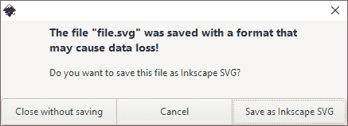
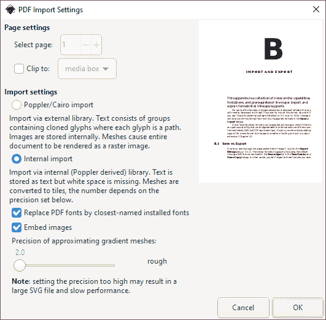
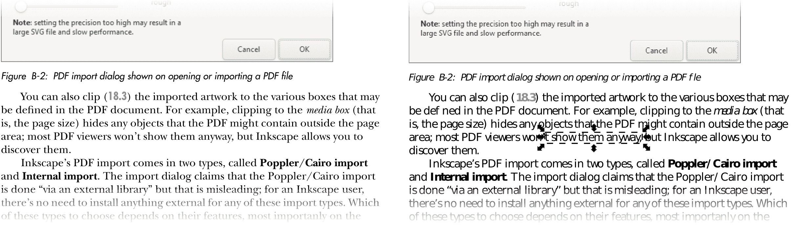
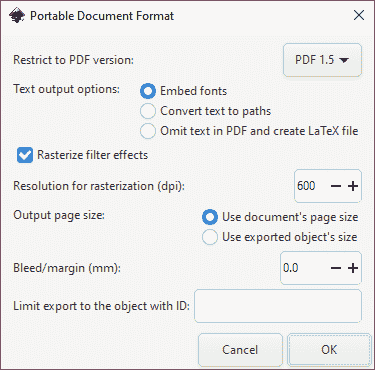
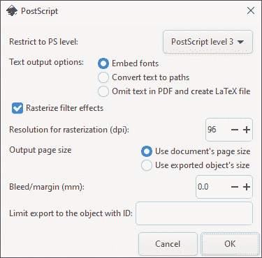

# 第二十九章：B

导入与导出

本附录收集了 Inkscape 支持的主要导入和导出格式的功能、限制和前提条件的说明。

如果你想让 Inkscape 导入某些格式，你需要下载并安装外部软件。通常情况下，如果没有安装必要的外部软件（或该软件不在 `PATH` 中），Inkscape 会直接从打开或导入对话框中省略该格式。

如果 Inkscape 不支持你最喜欢的向量格式，检查是否有开源工具可以填补该格式与已知格式之间的空白（理想情况下是 SVG，但 PDF 也可以）。如果存在这样的转换器，向 Inkscape 添加对新格式的支持，只需编写一个输入或输出扩展（第十九章）。

## B.1 保存与导出

关于术语：Inkscape 仅在导出 PNG 图像对话框中使用 *export* 这个术语（18.6.1）。它支持的向量格式，包括默认的 Inkscape SVG 格式，都列在保存、另存为和保存副本对话框中的“保存类型”列表中。换句话说，你不是 *导出* 到这些格式，而是 *保存* 到这些格式。由于除了 Inkscape SVG 外的所有向量格式都会丧失一些可编辑性特性，甚至丢失某些类型的对象，保存为这种格式后再尝试关闭文档时会显示警告，如图 B-1 所示。

图 B-1：小心！你正在关闭最后一次保存为 Inkscape SVG 以外格式的文档！

如果你在保存非 SVG 文件后做了任何更改，你可能需要再次将原始的 SVG 文件另存为。为了避免这个麻烦，使用 **保存副本** 命令（Shift-Ctrl-Alt-S）来保存为非 SVG 格式。保存副本后，打开的文档将继续与原始 SVG 文件关联，任何进一步的更改都将保存到该文件中。

## B.2 SVG 变体

Inkscape 使用 *Inkscape SVG* 向量格式。正如在 1.4 中所解释的，这种格式是符合标准的 SVG，并有一些仅影响是否能够在 Inkscape 中编辑不同类型对象的 Inkscape 特有的扩展。这些扩展从不改变这些对象类型的外观。除非为了获得（适度的）文件大小提升，或遇到某些与 Inkscape SVG 兼容性差的有缺陷的软件，否则保存为 *Plain SVG* 并没有太大意义。两种 SVG 格式都有 *压缩版*（使用 .svgz 文件扩展名），这会产生更小的、不可读的文件，但除此之外它们是一样的，并且应该被大多数 SVG 软件理解。

你可以像平常一样打开从 Adobe Illustrator 导出的 SVG 文件。这些文件通常包含许多特定于 AI 的元素，这些元素对 Inkscape 来说是无用的，但却会增加 SVG 文件的大小。Inkscape 有一个导入过滤器，可以删除 AI 特有的二进制块，并将 AI 层转换为 Inkscape 层；为了触发这个过滤器，SVG 文件需要使用.ai.svg 的文件扩展名，而不仅仅是.svg。

## B.3 PDF

在 SVG 之后，PDF 是 Inkscape 支持的最强大且广泛认可的矢量格式（1.5.1.1）。虽然 Inkscape 并不是进行*回溯*PDF 编辑（即打开 PDF，编辑其内容，并重新保存为 PDF）的最佳工具，但 PDF 无疑是将 Inkscape 与不支持 SVG 的软件连接的最佳选项。Inkscape 支持 PDF 静态特性的大部分最新版本（形状、文本、图像、渐变、不透明度、网格），但不支持 PDF 的交互特性（如表单）。

### B.3.1 导入

最大的障碍是，PDF 支持文档中的多页，而 SVG 不支持。因此，在 PDF 导入对话框中（图 B-2），你首先看到的是页面选择器。该对话框会在你点击“确定”导入之前，显示所选页面的预览。

图 B-2：打开或导入 PDF 文件时的 PDF 导入对话框

你还可以将导入的艺术作品裁剪到 PDF 文档中可能定义的各种框中（18.3）。例如，裁剪到*媒体框*（即页面大小）会隐藏 PDF 中可能包含的页面区域之外的任何对象；大多数 PDF 查看器反正不会显示它们，但 Inkscape 允许你发现这些对象。

Inkscape 的 PDF 导入有两种类型：*Poppler/Cairo*导入和*内部*导入。导入对话框声称 Poppler/Cairo 导入是“通过外部库”完成的，但这有误导性；Inkscape 用户不需要为这两种导入类型安装任何外部组件。选择哪种类型取决于其特性及其在 PDF 中处理文本的不同方式。

#### B.3.1.1 文本和字体

一个 PDF 文件可以—并且通常会—将自己的字体嵌入其中；SVG 则没有（关于这个背景，见 15.8）。Inkscape 可以通过两种不同的方式处理这个限制。

如果你主要关心文档的外观，可以选择**Poppler/Cairo 导入**选项（图 B-3，左）。通过此选项，每个文本字符都会变成一个符号（16.7），你可以取消链接（16.5）将其转换为可编辑路径。这个选项完全保留了外观，但显然，文本不再作为文本可编辑。

相比之下，内部导入会保留文本作为文本——但只有在你已经在系统中安装了相应的字体时，它才会显示正确（图 B-3，右）。例如，如果 PDF 文件使用 FancyShmancy 字体作为文本，你在仅仅查看该 PDF 文件时（例如在 Adobe Acrobat Reader 或其他 PDF 查看器中），不需要关心（甚至不知道）字体的具体信息，因为该字体已嵌入文件中，PDF 查看器会使用它。然而，如果你想使用内部导入选项将该文件导入 Inkscape，你需要先从某处获取 FancyShmancy 字体并安装到计算机上，然后再尝试导入。没有该字体，FancyShmancy 文本将显示错误。

图 B-3：使用 Poppler/Cairo 导入的本书 PDF 页面（左）和使用内部导入器导入但计算机上未安装主文本字体的页面（右）

即使你确实拥有 PDF 文档使用的确切字体，在导入的文件中编辑文本也不是特别自然。PDF 文本的一段通常不会转换为一个自动换行的单一文本对象。相反，每一行都成为一个独立的文本对象。通常情况甚至比这更糟：你会看到行在看似随机的地方被分割成文本对象片段（如右侧所示）。这是因为 PDF 本质上是一种视觉格式，它不提供任何更高级的逻辑结构——甚至简单的段落结构也没有。

Inkscape 提供了“通过最接近名称的已安装字体替换 PDF 字体”选项，这可能有助于解决这个问题。使用此选项时，如果你没有安装 FancyShmancy 字体，但有 FancyPancy 字体，Inkscape 会使用该字体，如果该字体足够接近，也可能有效。

一个额外的复杂性是，大多数 PDF 文件通过其*PostScript 名称*引用所使用的字体，这些名称可能与操作系统显示的字体名称不同。例如，PDF 可能引用名为 `AlbertusMT-Light` 的字体，而在你的 Inkscape 字体列表中，这个字体叫做 `Albertus MT Lt`。Inkscape 会尽力将 PostScript 名称转换为常规名称，但它只能针对你已安装的字体进行转换——即使如此，有时它也会失败，选择错误的已安装字体。

你始终可以通过在“选择器和 CSS”对话框中查看文本对象字体的样式来查找导入 PDF 中任何文本对象的原始 PostScript 名称（8.1）。你需要查找的属性是 `-inkscape-font-specification`。例如，该属性可能包含 `AlbertusMT-Light`，而标准的 `font-family` 属性是 `Albertus MT Lt`。

#### B.3.1.2 网格

与 SVG 类似，PDF 支持网格渐变（10.7）。然而，Inkscape 不会尝试将 PDF 网格转换为 SVG 网格；相反，它通过平面颜色瓷砖的网格来近似它们。在对话框的底部（图 B-2），你可以选择这个近似的精确度，从粗略到非常精细。通常，你需要通过实验来确定适合你使用网格的 PDF 文件的最佳值，但对话框会警告你，要求过高的精度会使文件过大，导致操作缓慢。

### B.3.2 导出

如前所述，Inkscape 没有单独的“导出”命令用于矢量格式；相反，前往 **文件 ▶ 另存为** 或 **文件 ▶ 另存副本** 并在 **保存类型** 列表中选择 PDF 格式。在输入文件名并点击 **确定** 后，你将看到一个用于设置 PDF 导出选项的对话框（图 B-4）。

图 B-4：PDF 导出选项

你可以导出 PDF 版本 1.4 或 1.5。对于文档中使用的字体，你可以选择将它们嵌入 PDF 中，或者在导出时将所有文本对象转换为路径。

滤镜（第十七章）是 SVG 的特性，在 PDF 中没有对应的功能。你可以选择在导出时将任何使用滤镜的对象转换为位图（栅格化滤镜效果）。如果取消选中此选项，滤镜将被简单地忽略（例如，任何模糊的对象将失去模糊效果）。栅格化会增加文件大小并丧失受影响对象的矢量可编辑性，但它保留了对象的滤镜外观。栅格化的分辨率参数可以是用于屏幕查看的默认 96 dpi，但对于用于打印的 PDF，至少需要 300 dpi。

默认情况下，整个文档都会导出为 PDF，但你可以通过输入其 ID 来限制导出单个元素（4.1）。例如，在一个包含多个徽标的文件中，你可以使用此选项将每个徽标导出为自己的 PDF 文件。PDF 的页面大小默认与 SVG 相同，因此页面外的任何对象都会被隐藏（但仍然存在于 PDF 代码中）；如果将输出页面大小设置为“使用导出对象的大小”，PDF 页面将与所导出对象的边界框大小相同。

## B.4 PostScript 和 EPS

几十年前，PostScript 是 *唯一* 的矢量数据交换格式。现在，它已经在很大程度上被 PDF 取代，后者功能更丰富，并且得到了各种软件的更好支持。如果有选择，你应该使用 PDF 而不是 PostScript。然而，许多旧项目和剪贴画仍然是 PostScript 文件，你可能仍然需要处理它们。

EPS 是带有一些额外限制的 PostScript，允许你将其导入并插入到其他文档中。EPS 文件始终是单页的，始终包含所有字体和位图图像（普通的 PS 文件不需要嵌入任何内容），且其页面大小始终裁剪到其内容。

### B.4.1 导入

要导入 PS 和 EPS 文件，你需要安装 Ghostscript 解释器，Inkscape 会自动运行它。Ghostscript 将 PS 或 EPS 文件转换为 PDF 格式，然后再将其输入 Inkscape。所有主要操作系统的版本可以在[`www.ghostscript.com/`](https://www.ghostscript.com/)上下载。确保 Ghostscript 的 ps2pdf（在 Linux 上）或 ps2pdf.bat（在 Windows 上）文件已包含在你的`PATH`环境变量中。

由于从 Inkscape 的角度来看，PS 和 EPS 文件最终以 PDF 形式导入，你将看到相同的 PDF 导入对话框（图 B-2）。特别是，如果 PS 文件包含多页，您可以选择要导入的页面。

### B.4.2 导出

Inkscape 原生支持 PS 和 EPS 的导出。该对话框有许多与 PDF 导出对话框相同的选项，如图 B-5 所示。

图 B-5：PS 或 EPS 导出选项

你可以选择 PostScript 的版本（即级别）；大多数现代软件和打印机都支持 Level 3。与 PDF 导出类似，字体要么嵌入，要么转换为路径，滤镜也可以栅格化。具有非零不透明度的对象也会被栅格化（无法禁用），因为与 PDF 不同，PostScript 不支持矢量透明度。

## B.5 AI

在版本 8 之前，Adobe Illustrator（AI）的原生格式基于 PostScript（1.5.1.1）。然而，它并不是完全标准的 PostScript 格式，导入到其他软件中一直是个麻烦。网上有各种脚本声称能将这种旧的 AI 格式转换为更容易处理的格式，但它们都有限且不可靠。虽然你可以尝试使用它们，但 Inkscape 不正式支持导入或导出旧版 AI 格式。

从版本 9 开始，Adobe 将其新的 Illustrator 格式的基础改为 PDF 格式。尽管 Illustrator 保存的 AI 文件包含许多 AI 特定的扩展，但它们仍然是标准的 PDF，任何支持 PDF 的应用程序都能打开和查看。Inkscape 正是这么做的：它将任何带有.ai 扩展名的文件当作 PDF 文件处理，并展示其标准的 PDF 导入设置对话框（B.3）。导入时，Inkscape 会丢失 AI 特定的元数据（如图层），但至少你仍然可以将矢量对象作为矢量图形获取。

Inkscape 不支持 AI 导出，因为 Adobe Illustrator 的最新版本可以无问题地导入 SVG 和 PDF 文件。

## B.6 CorelDRAW

Inkscape 可以原生导入由 CorelDRAW 矢量编辑器创建的各种文件（扩展名为.cdr、.cdt、.ccx 和.cmx）。不支持导出到 CorelDRAW 格式。

## B.7 WMF、EMF 和 EMF+

WMF（Windows MetaFile）、EMF（Enhanced MetaFile）和 EMF+（Enhanced MetaFile Plus）是 Windows 专用的矢量格式，某些仅限 Windows 的软件（如 Microsoft Office）用于数据交换和矢量剪贴画。在这些格式中，EMF 功能最强大，且被广泛支持，因此通常更为优选（如果有选择的话）。Inkscape 原生支持这些格式的导入和导出。

## B.8 XAML

Inkscape 可以导入和导出 Microsoft 在其 .NET 和 Silverlight 技术中使用的 XAML（可扩展应用程序标记语言）格式。无需额外的软件。

## B.9 WPG

WPG（WordPerfect 图形）是一种老旧的矢量格式，曾被 WordPerfect 文本处理器使用；该格式的剪贴画集仍然存在。Inkscape 可以原生导入 WPG（无需外部软件）。

## B.10 VSD

VSD 是 Microsoft Visio 的原生格式。Inkscape 对 VSD 文件的导入支持有限。

## B.11 DXF 和 HPGL（导出）

DXF（绘图交换格式）是用于 AutoCAD 等软件中计划和技术图纸的常见 CAD（计算机辅助设计）格式。HPGL 是一些惠普绘图仪使用的矢量格式。Inkscape 对导入和导出这些格式的支持有限。

## B.12 ODG

OpenDocument 图形（ODG）是包括 OpenOffice 和 LibreOffice 套件在内的一些软件使用的格式。Inkscape 对 ODG 导出的支持有限；对于最新版本的办公套件，最好使用 SVG 进行图形交换。

## B.13 POV

POVRay（[`povray.org/`](http://povray.org/)）是一个流行的开源 3D 光线追踪器，而不是矢量应用程序。然而，Inkscape 可以将路径和形状导出为 3D 场景，然后由 POVRay 渲染；你可以手动编辑基于文本的 .pov 文件，调整角度、相机、光照等。

## B.14 LaTeX（导出）

LaTeX 是一种古老且强大的开源文档格式化系统。Inkscape 可以将其图形直接输出到 LaTeX 文档中。你需要在 LaTeX 系统中安装 PSTricks 包（[`tug.org/PSTricks/`](http://tug.org/PSTricks/)）来渲染该文件。

## B.15 位图格式（导入/导出）

正如我们在 18.6 中看到的，Inkscape 可以原生导出 PNG、JPG、TIFF 和 WebP 格式。它内置了对更多位图格式的导入支持，包括所有主要格式（PNG、JPG、TIFF、GIF 等）。

GIMP 位图编辑器使用 XCF 格式。Inkscape 可以通过扩展导出到此格式，保留图层（即，SVG 文件中的图层变为 XCF 文件中的图层）。你需要安装 GIMP 并将其添加到 `PATH`，以便此扩展正常工作。

## B.16 打印

你可以将打印视为导出——如果仅仅因为，要打印文档，Inkscape 会将其导出为打印机能理解的格式。根据打印机驱动程序，这可能是 PostScript 或 PDF，而不是 SVG。如果你从打印对话框中选择打印到文件选项，你将获得一个 PS 或 PDF 文件，看起来就像是你使用该文件类型保存的文档。

我不会描述你在选择文件▶打印（Ctrl-P）时会看到的打印对话框，因为它是由你的操作系统创建的，而不是 Inkscape 创建的，其选项——纸张大小、边距、打印质量等等——反映了你的打印机的功能。Inkscape 在这个对话框中唯一添加的内容是渲染选项卡。

默认情况下，Inkscape 通过将文档导出为矢量格式（PostScript 或 PDF）进行打印。如前所述，Inkscape 足够智能，能够使用这些格式不支持的特性来光栅化对象：滤镜和网格（PS 和 PDF 都不支持）以及透明度（仅 PS）。另外，你可以通过在渲染选项卡上将渲染模式从矢量切换为位图并设置位图分辨率，将整个文档渲染为位图。此选项通常更安全，因为它避免了格式转换可能带来的任何意外，但它可能会导致较大的打印文件和较慢的打印速度。
