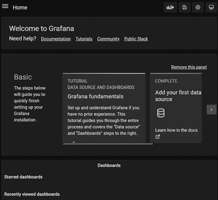
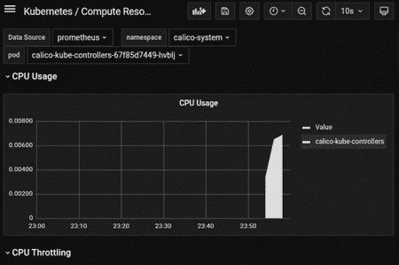
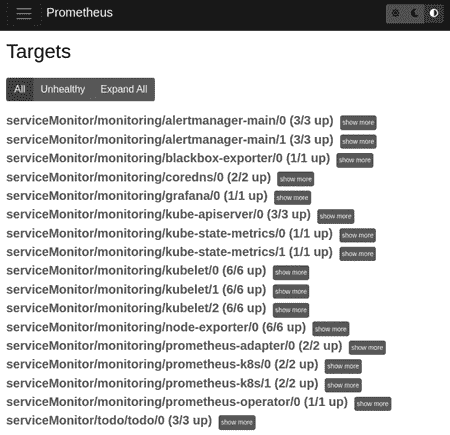
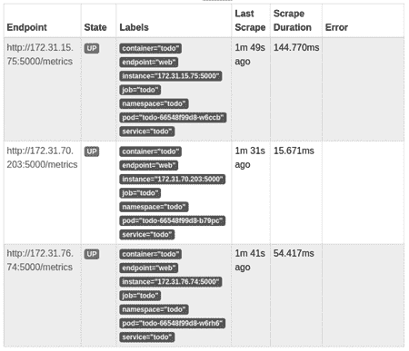
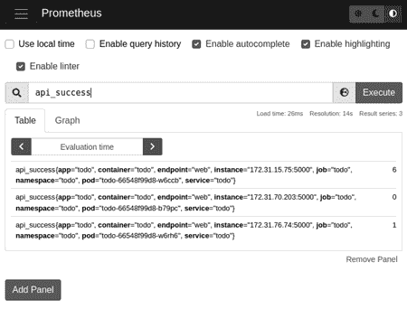

# 应用程序弹性


在本书的过程中，我们已经看到容器和 Kubernetes 如何实现可扩展的、具有弹性的应用程序。通过使用容器，我们可以将应用程序组件封装起来，使得进程相互隔离，拥有独立的虚拟化网络堆栈和独立的文件系统。然后，每个容器可以快速部署，而不会干扰其他容器。当我们在容器运行时之上添加 Kubernetes 作为容器编排层时，我们能够将多个独立的主机合并为一个集群，动态调度容器到可用的集群节点，支持自动扩展和故障转移、分布式网络、流量路由、存储和配置。

本书中我们看到的所有容器和 Kubernetes 特性协同工作，为部署可扩展且具备弹性的应用程序提供了必要的基础设施，但要利用这些基础设施，我们需要正确配置我们的应用程序。在本章中，我们将再次回顾我们在第一章中部署的 `todo` 应用程序。不过这次，我们将其部署到 Kubernetes 集群中的多个节点上，从而消除单点故障，并利用 Kubernetes 提供的关键功能。我们还将探讨如何监控我们的 Kubernetes 集群和已部署的应用程序的性能，以便在问题导致用户停机之前识别性能瓶颈。

### 示例应用栈

在第一章中，我们将 `todo` 部署到运行 `k3s`（由 Rancher 提供）的 Kubernetes 集群上。我们已经具备了一定的可扩展性和故障转移功能。Web 层基于 Deployment，因此我们可以通过单个命令来扩展服务器实例的数量。我们的 Kubernetes 集群会监控这些实例，以便在实例失败时进行替换。然而，我们仍然存在一些单点故障问题。我们尚未引入高可用 Kubernetes 控制平面的概念，因此选择仅在单节点配置下运行 `k3s`。此外，尽管我们为 PostgreSQL 数据库使用了 Deployment，但它缺乏任何必要的高可用性配置。在本章中，我们将看到如何纠正这些限制，并利用我们所学到的其他 Kubernetes 特性。

#### 数据库

让我们从部署一个高可用的 PostgreSQL 数据库开始。第十七章展示了 Kubernetes Operator 设计模式如何使用自定义资源定义（CustomResourceDefinitions）来扩展集群的行为，使得打包和部署高级功能变得更加容易。我们将使用在那一章中介绍的 Postgres Operator 来部署我们的数据库。

**注意**

*本书的示例代码库在* [`github.com/book-of-kubernetes/examples`](https://github.com/book-of-kubernetes/examples)。*有关设置的详细信息，请参见第 xx 页中的“运行示例”。本章使用了一个更大的六节点集群，以为应用程序和我们将要部署的所有监控组件提供空间。有关更多信息，请参阅本章的 *README.md* 文件。*

本章的自动化已部署了 Postgres Operator 及其配置。你可以通过查看 */etc/kubernetes/components* 目录中的文件来检查 Postgres Operator 及其配置。该 Operator 正在 `todo` 命名空间中运行，`todo` 应用程序也已在该命名空间中部署。许多 Operator 更倾向于在自己的命名空间中运行并跨集群操作，但 Postgres Operator 设计为直接部署到数据库所在的命名空间中。

因为我们使用的是 Postgres Operator，所以可以通过向集群应用自定义资源来创建一个高可用的 PostgreSQL 数据库：

*database.yaml*

```
 ---
 apiVersion: "acid.zalan.do/v1"
 kind: postgresql
 metadata:
➊ name: todo-db
 spec:
   teamId: todo
   volume:
     size: 1Gi
     storageClass: longhorn
➋ numberOfInstances: 3
   users:
  ➌ todo:
     - superuser
     - createdb
   databases:
  ➍ todo: todo
   postgresql:
     version: "14"
```

本文演示的所有文件都已被放置在 */etc/kubernetes/todo* 目录中，方便你进行探索并尝试修改。`todo` 应用程序已自动部署，但所有组件可能需要几分钟才能达到健康状态。

Postgres Operator 的职责是创建 Secrets、StatefulSets、Services 以及部署 PostgreSQL 所需的其他核心 Kubernetes 资源。我们只需要提供它应该使用的配置。我们首先确定数据库的名称为 `todo-db` ➊，这个名称将作为连接到主数据库实例的主要 Service 的名称，因此我们将在应用程序配置中再次看到这个名称。

我们需要一个高可用的数据库，因此我们指定了三个实例 ➋。我们还要求 Postgres Operator 创建一个 `todo` 用户 ➌，并使用 `todo` 用户作为所有者创建一个 `todo` 数据库 ➍。这样，我们的数据库就已经设置好了，我们只需要填充表格以存储应用程序数据。

我们可以验证数据库是否在集群中运行：

```
root@host01:~# kubectl -n todo get sts
NAME      READY   AGE
todo-db   3/3     6m1s
```

`todo-db` StatefulSet 有三个 Pod，所有 Pod 均已准备就绪。

由于 Postgres Operator 使用 StatefulSet，如我们在第十五章中所见，数据库实例创建时会为其分配 PersistentVolumeClaim：

```
root@host01:~# kubectl -n todo get pvc
NAME               STATUS   ... CAPACITY   ACCESS MODES   STORAGECLASS   AGE
pgdata-todo-db-0   Bound    ... 1Gi        RWO            longhorn       10m
pgdata-todo-db-1   Bound    ... 1Gi        RWO            longhorn       8m44s
pgdata-todo-db-2   Bound    ... 1Gi        RWO            longhorn       7m23s
```

这些 PersistentVolumeClaims 会在数据库实例 Pod 出现故障并需要重新创建时被重新使用，且 Longhorn 存储引擎正在将存储分布在整个集群中，因此即使我们遇到节点故障，数据库仍能保持应用程序数据。

请注意，当我们要求 Postgres 操作员创建`todo`用户时，并没有指定密码。出于安全考虑，Postgres 操作员会自动生成密码。此密码会放入一个 Secret 中，名称基于用户和数据库的名称。我们可以看到为`todo`用户创建的 Secret：

```
root@host01:~# kubectl -n todo get secret
NAME                                                    TYPE    DATA   AGE
...
todo.todo-db.credentials.postgresql.acid.zalan.do       Opaque  2      8m30s
```

我们需要使用这些信息来配置应用，使其能够进行数据库身份验证。

在查看应用配置之前，让我们检查一下 Postgres 操作员创建的服务：

```
root@host01:~# kubectl -n todo get svc todo-db
NAME      TYPE        CLUSTER-IP      EXTERNAL-IP   PORT(S)    AGE
todo-db   ClusterIP   10.110.227.34   <none>        5432/TCP   59m
```

这是一个`ClusterIP`服务，这意味着它可以在集群内部的任何地方访问，但不会对外暴露。这完全符合我们应用的需求，因为我们的 Web 服务组件是唯一对外暴露的组件，因此是唯一会暴露到集群外的。

#### 应用部署

我们应用的所有数据都存储在 PostgreSQL 数据库中，因此 Web 服务器层是无状态的。对于这个无状态组件，我们将使用部署并设置自动扩展。

部署包含大量信息，让我们一步一步来看。要查看整个部署配置并了解其如何组合在一起，您可以查看集群节点上的文件*/etc/kubernetes/todo/application.yaml*。

第一部分告诉 Kubernetes 我们正在创建一个部署：

```
---
kind: Deployment
apiVersion: apps/v1
metadata:
  name: todo
  labels:
    app: todo
```

这一部分很简单，因为我们只是指定了部署的元数据。请注意，我们没有在元数据中包含`namespace`。相反，当我们将此部署应用到集群时，会直接将其提供给 Kubernetes。这样，我们可以在开发、测试和生产版本中重复使用相同的部署 YAML，并将每个版本放在不同的命名空间中，以避免冲突。

`label`字段纯粹是信息性字段，不过它也为我们提供了一种方法，通过匹配标签查询集群中与此应用相关的所有资源。

部署 YAML 的下一部分指定了集群应如何处理更新：

```
spec:
  replicas: 3
  strategy:
    type: RollingUpdate
    rollingUpdate:
      maxUnavailable: 30%
      maxSurge: 50%
```

`replicas`字段告诉 Kubernetes 要初始创建多少个实例。自动扩展配置会自动调整这个数量。

`strategy`字段允许我们配置此部署以便在没有应用停机的情况下进行更新。我们可以选择`RollingUpdate`或`Recreate`作为策略。使用`Recreate`时，当部署发生变化时，所有现有的 Pods 都会被终止，然后创建新的 Pods。而使用`RollingUpdate`时，新的 Pods 会立即创建，旧的 Pods 会继续运行，以确保在更新过程中应用组件可以继续运行。

我们可以使用`maxUnavailable`和`maxSurge`字段控制滚动更新的操作方式，这些字段可以指定为整数值或当前副本数量的百分比。在这种情况下，我们为`maxUnavailable`指定了 30％，因此 Deployment 将限制滚动更新过程，以防止我们低于当前副本数的 70％。此外，由于我们将`maxSurge`设置为 50％，Deployment 将在新的 Pod 启动时，直到正在运行或创建过程中的 Pod 数量达到当前副本数的 150％。

`RollingUpdate`策略是默认策略，默认情况下，`maxSurge`和`maxUnavailable`均为 25％。除非必须使用`Recreate`，否则大多数 Deployment 应该使用`RollingUpdate`策略。

Deployment YAML 的下一部分将 Deployment 与其 Pod 关联起来：

```
  selector:
    matchLabels:
      app: todo
  template:
 metadata:
      labels:
        app: todo
```

Pod `metadata`中的`selector`和`labels`必须匹配。正如我们在第七章中看到的，Deployment 使用`selector`来跟踪其 Pod。

在这一部分，我们现在开始定义此 Deployment 所创建 Pod 的`template`。Deployment YAML 的其余部分完成了 Pod 模板，完全由此 Pod 运行的单个容器的配置组成：

```
    spec:
      containers:
      - name: todo
        image: bookofkubernetes/todo:stable
```

容器名称主要是信息性的，尽管它对于有多个容器的 Pod 来说是必需的，这样我们可以在需要检索日志和使用`exec`运行命令时选择一个容器。`image`告诉 Kubernetes 需要获取哪个容器镜像来运行该容器。

Pod 模板的下一部分指定了此容器的环境变量：

```
        env:
        - name: NODE_ENV
          value: production
        - name: PREFIX
          value: /
        - name: PGHOST
          value: todo-db
        - name: PGDATABASE
          value: todo
        - name: PGUSER
          valueFrom:
            secretKeyRef:
              name: todo.todo-db.credentials.postgresql.acid.zalan.do
              key: username
              optional: false
        - name: PGPASSWORD
          valueFrom:
            secretKeyRef:
              name: todo.todo-db.credentials.postgresql.acid.zalan.do
              key: password
              optional: false
```

一些环境变量具有静态值；它们预计在所有使用此 Deployment 的实例中保持不变。`PGHOST`环境变量与 PostgreSQL 数据库的名称匹配。Postgres Operator 在`todo`命名空间中创建了一个名为`todo-db`的 Service，在这些 Pod 运行的地方，因此 Pod 能够将此主机名解析为 Service 的 IP 地址。目标为 Service IP 地址的流量随后将通过我们在第九章中看到的`iptables`配置路由到主 PostgreSQL 实例。

最后的两个变量提供了应用程序用于认证数据库的凭证。我们使用从 Secret 中获取配置并将其作为环境变量提供给容器的功能，类似于我们在第十六章中看到的。然而，在这种情况下，我们需要环境变量的名称与 Secret 中的键名称不同，因此我们使用了一种稍微不同的语法，允许我们分别指定每个变量的名称。

最后，我们声明了此容器的资源需求和它暴露的端口：

```
        resources:
          requests:
            memory: "128Mi"
            cpu: "50m"
          limits:
            memory: "128Mi"
            cpu: "50m"
        ports:
        - name: web
          containerPort: 5000
```

`ports`字段在 Pod 中纯粹是信息性的；实际的流量路由将在 Service 中配置。

在`resources`字段中，我们将`requests`和`limits`设置为该容器相同的值。正如我们在第十九章中看到的，这意味着 Pod 将被放置在`Guaranteed`服务质量类中。由于 Web 服务组件是无状态的且易于扩展，因此使用相对较低的 CPU 限制是合理的，在此情况下为 50 毫核心，即一个核心的 5%，并依赖自动扩展来创建新的实例，以应对负载增大时的需求。

#### Pod 自动扩展

为了自动扩展部署以匹配当前负载，我们使用了水平 Pod 自动扩展器（HorizontalPodAutoscaler），正如我们在第七章中看到的那样。这是自动扩展器的配置：

*scaler.yaml*

```
---
apiVersion: autoscaling/v2
kind: HorizontalPodAutoscaler
metadata:
  name: todo
  labels:
    app: todo
spec:
 scaleTargetRef:
    apiVersion: apps/v1
    kind: Deployment
    name: todo
  minReplicas: 3
  maxReplicas: 10
  metrics:
  - type: Resource
    resource:
      name: cpu
      target:
        type: Utilization
        averageUtilization: 50
```

如我们之前的示例所示，我们为该资源应用标签，纯粹是为了信息目的。这个自动扩展器需要三个关键配置项。首先，`scaleTargetRef`指定了我们希望扩展`todo`部署。由于这个自动扩展器部署在`todo`命名空间中，它会找到正确的部署进行扩展。

其次，我们指定`minReplicas`和`maxReplicas`的范围。我们选择`3`作为最小副本数，因为我们希望即使发生 Pod 故障，应用程序也能保持弹性。为了简化，我们没有应用我们在第十八章中看到的反亲和性配置，但这也是一种避免所有实例都部署在单个节点上的良好实践。我们根据集群的大小选择最大副本数；对于生产环境的应用程序，我们会根据预计处理的最大负载来选择副本数。

第三，我们需要指定自动扩展器将用来决定需要多少副本的指标。我们基于 CPU 利用率来配置这个自动扩展器。如果 Pod 的平均利用率超过 Pod `requests`的 50%，部署将会扩展。我们将`requests`设置为 50 毫核心，这意味着平均利用率超过 25 毫核心将导致自动扩展器增加副本数。

为了获取平均 CPU 利用率，自动扩展器依赖于一个集群基础设施组件，该组件从每个节点上运行的`kubelet`服务中获取度量数据，并通过 API 暴露这些度量数据。对于本章，我们有一些额外的集群监控功能要展示，所以自动化跳过了我们在第六章中描述的常规度量服务器组件。我们将在本章稍后部署一个替代方案。

#### 应用程序服务

我们应用程序的最终集群资源是服务。列表 20-1 展示了我们在本章中使用的定义。

*service.yaml*

```
---
kind: Service
apiVersion: v1
metadata:
  name: todo
  labels:
    app: todo
spec:
  type: NodePort
  selector:
    app: todo
  ports:
  - name: web
    protocol: TCP
    port: 5000
    nodePort: 5000
```

*列表 20-1：Todo 服务*

我们使用与在部署中看到的相同的`selector`来查找将接收发送到该服务的流量的 Pods。正如我们在第九章中看到的，服务的`ports`字段至关重要，因为`iptables`流量路由规则仅为我们指定的端口配置。在这种情况下，我们声明`port`为 5000，并未声明`targetPort`，因此此服务将流量发送到 Pods 的 5000 端口，这与我们的 Web 服务器监听的端口相匹配。我们还为这个端口配置了一个`name`，这在稍后配置监控时会很重要。

本章中，我们通过`NodePort`暴露了我们的应用程序服务，这意味着我们集群中的所有节点都将被配置为将流量路由到发送到任何主机接口的`nodePort`的服务。因此，我们可以访问集群中任何节点的 5000 端口，流量会被路由到我们的应用程序：

```
root@host01:~# curl -v http://host01:5000/
...
< HTTP/1.1 200 OK
< X-Powered-By: Express
...
<html lang="en" data-framework="backbonejs">
    <head>
        <meta charset="utf-8">
        <title>Todo-Backend client</title>
        <link rel="stylesheet" href="css/vendor/todomvc-common.css">
        <link rel="stylesheet" href="css/chooser.css">
    </head>
...
</html>
```

这个服务流量路由在任何主机接口上都能工作，因此`todo`应用程序也可以从集群外部访问。URL 的不同取决于你使用的是 Vagrant 配置还是 Amazon Web Services 配置，因此本章的自动化包括一条消息，告知使用的 URL。

**NODEPORT，而非 INGRESS**

当我们在第一章中部署`todo`时，我们使用 Ingress 暴露了服务。正如我们在第九章中看到的，Ingress 将多个服务整合在一起，使它们都可以在不要求每个服务有单独外部可路由 IP 地址的情况下暴露到集群外部。我们将在本章稍后暴露一个监控服务，因此我们需要暴露多个服务到集群外部。然而，由于我们正在使用私有网络上的示例集群，我们没有可用的底层网络基础设施来充分利用 Ingress。通过改为使用`NodePort`，我们能够以一种既适用于 Vagrant 配置又适用于 Amazon Web Services 配置的方式，将多个服务暴露到集群外部。

现在我们已经查看了`todo`应用程序中的所有组件，利用本书中学到的知识消除了单点故障并最大化了可扩展性。

你还可以在* [`github.com/book-of-kubernetes/todo`](https://github.com/book-of-kubernetes/todo) *上查看`todo`应用程序的源代码，其中包括用来构建应用程序容器镜像的*Dockerfile*，以及每当代码发生更改时，自动构建并发布到 Docker Hub 的 GitHub Actions。

然而，尽管我们的 Kubernetes 集群现在会尽最大努力保持此应用程序的运行和性能，我们仍可以做更多工作来监控`todo`应用程序和 Kubernetes 集群。

### 应用程序和集群监控

适当的应用和集群监控对应用程序至关重要，原因有很多。首先，我们的 Kubernetes 集群将尽力保持应用程序运行，但任何硬件或集群故障都可能导致应用程序处于无法正常工作或降级的状态。如果没有监控，我们将依赖用户告诉我们应用程序何时出现故障或表现异常，这样的用户体验很差。其次，如果我们确实看到应用程序出现故障或性能问题，我们需要数据来诊断问题，或者试图识别某种模式以找到根本原因。提前构建监控要比在我们已经看到问题后再去应用它要容易得多。最后，我们可能会遇到一些集群或应用程序的问题，这些问题发生在用户未察觉的层面，但它们可能预示着潜在的性能或稳定性问题。集成适当的监控使我们能够在这些问题变得更严重之前发现它们。它还使我们能够随着时间的推移衡量应用程序，确保新增的功能不会降低其性能。

幸运的是，尽管我们确实需要在每个应用组件的层面上考虑监控，但我们不需要自己构建监控框架。许多成熟的监控工具已经设计好，可以在 Kubernetes 集群中工作，因此我们可以快速启动并运行。在本章中，我们将介绍`kube-prometheus`，这是一个完整的工具栈，我们可以将其部署到集群中，用于监控集群和`todo`应用程序。

#### Prometheus 监控

`kube-prometheus`的核心组件是，顾名思义，开源的 Prometheus 监控软件。Prometheus 作为服务器部署，定期查询各种指标源并累积它收到的数据。它支持一种优化为“时间序列”数据的查询语言，使得收集显示系统在某一时刻性能的单个数据点变得容易。然后，它将这些数据点汇总，绘制出系统负载、资源利用率和响应能力的图景。

对于每个暴露指标的组件，Prometheus 期望访问一个 URL 并返回标准格式的数据。通常使用路径*/metrics*来暴露指标给 Prometheus。遵循这一约定，Kubernetes 控制平面组件已经以 Prometheus 期望的格式暴露了指标。

举个例子，我们可以使用`curl`访问 API 服务器上的*/metrics*路径，以查看它提供的指标。为了实现这一点，我们需要进行 API 服务器的身份验证，因此让我们使用一个脚本来收集客户端证书以进行身份验证：

*api-metrics.sh*

```
#!/bin/bash
conf=/etc/kubernetes/admin.conf
...
curl --cacert $ca --cert $cert --key $key https://192.168.61.10:6443/metrics
...
```

运行此脚本会返回大量的 API 服务器指标：

```
root@host01:~# /opt/api-server-metrics.sh
...
# TYPE rest_client_requests_total counter
rest_client_requests_total{code="200",host="[::1]:6443",method="GET"} 9051
rest_client_requests_total{code="200",host="[::1]:6443",method="PATCH"} 25
rest_client_requests_total{code="200",host="[::1]:6443",method="PUT"} 21
rest_client_requests_total{code="201",host="[::1]:6443",method="POST"} 179
rest_client_requests_total{code="404",host="[::1]:6443",method="GET"} 155
rest_client_requests_total{code="404",host="[::1]:6443",method="PUT"} 1
rest_client_requests_total{code="409",host="[::1]:6443",method="POST"} 5
rest_client_requests_total{code="409",host="[::1]:6443",method="PUT"} 62
rest_client_requests_total{code="500",host="[::1]:6443",method="GET"} 18
rest_client_requests_total{code="500",host="[::1]:6443",method="PUT"} 1
...
```

这个示例仅说明了收集和暴露的数百个指标中的一小部分。此响应的每一行都提供一个数据点给 Prometheus。我们可以在大括号中包含附加的指标参数，以便进行更复杂的查询。例如，前面示例中的 API 服务器数据可以用来确定 API 服务器处理的客户端请求总数，以及导致错误的请求的原始数量和百分比。大多数系统能应对少量的 HTTP 错误响应，但错误响应的突然增加通常是更严重问题的良好指示，因此在配置报告阈值时，这非常有价值。

除了 Kubernetes 集群已经提供给 Prometheus 的所有数据外，我们还可以配置我们的应用程序来暴露指标。我们的应用程序基于 Node.js，因此我们使用`prom-client`库来完成此操作。如清单 20-2 所示，我们的`todo`应用程序在*/metrics*处暴露指标，类似于 API 服务器。

```
root@host01:~# curl http://host01:5000/metrics/
# HELP api_success Successful responses
# TYPE api_success counter
api_success{app="todo"} 0

# HELP api_failure Failed responses
# TYPE api_failure counter
api_failure{app="todo"} 0
...
# HELP process_cpu_seconds_total Total user and system CPU time ...
# TYPE process_cpu_seconds_total counter
process_cpu_seconds_total{app="todo"} 0.106392
...
```

*清单 20-2：待办事项指标*

响应包括一些与所有应用程序相关的默认指标。它还包括一些特定于`todo`应用程序的计数器，用于跟踪 API 的使用情况和响应时间。

#### 部署 kube-prometheus

到此为止，我们的 Kubernetes 集群和应用程序已经准备好根据需求提供这些指标，但我们还没有在集群中运行 Prometheus 服务器来收集它们。为了解决这个问题，我们将部署完整的`kube-prometheus`堆栈。它不仅包括一个 Prometheus 操作员，简化了 Prometheus 的部署和配置，还包括其他有用的工具，如 Alertmanager，它可以响应集群和应用程序的警报触发通知，以及 Grafana，这是一个我们将用来查看收集的指标的仪表盘工具。

要部署`kube-prometheus`，我们将使用一个已安装在*/opt*中的脚本。这个脚本从 GitHub 下载当前的`kube-prometheus`版本并应用清单。

按照以下方式运行脚本：

```
root@host01:~# /opt/install-kube-prometheus.sh
...
```

这些清单还包括一个 Prometheus 适配器。Prometheus 适配器实现了与我们在第二部分中部署到集群的`metrics-server`相同的 Kubernetes 指标 API，因此它暴露了从`kubelet`获取的 CPU 和内存数据，使我们的 HorizontalPodAutoscaler 能够跟踪`todo`应用程序的 CPU 利用率。然而，它还将这些利用率数据暴露给 Prometheus，以便我们在 Grafana 仪表盘中查看它。正因为如此，在本章中我们使用 Prometheus 适配器来替代常规的`metrics-server`。

我们可以通过列出`monitoring`命名空间中的 Pods 来查看 Prometheus 适配器和其他组件：

```
root@host01:~# kubectl -n monitoring get pods
NAME                                   READY   STATUS    RESTARTS   AGE
alertmanager-main-0                    2/2     Running   0          14m
alertmanager-main-1                    2/2     Running   0          14m
alertmanager-main-2                    2/2     Running   0          14m
blackbox-exporter-6b79c4588b-pgp5r     3/3     Running   0          15m
grafana-7fd69887fb-swjpl               1/1     Running   0          15m
kube-state-metrics-55f67795cd-mkxqv    3/3     Running   0          15m
node-exporter-4bhhp                    2/2     Running   0          15m
node-exporter-8mc5l                    2/2     Running   0          15m
node-exporter-ncfd2                    2/2     Running   0          15m
node-exporter-qp7mg                    2/2     Running   0          15m
node-exporter-rtn2t                    2/2     Running   0          15m
node-exporter-tpg97                    2/2     Running   0          15m
prometheus-adapter-85664b6b74-mglp4    1/1     Running   0          15m
prometheus-adapter-85664b6b74-nj7hp    1/1     Running   0          15m
prometheus-k8s-0                       2/2     Running   0          14m
prometheus-k8s-1                       2/2     Running   0          14m
prometheus-operator-6dc9f66cb7-jtrqd   2/2     Running   0          15m
```

除了 Prometheus 适配器外，我们还看到 Alertmanager、Grafana 和各种 `exporter` Pod，这些 Pod 从集群基础设施中收集指标并将其暴露给 Prometheus。我们还看到了 Prometheus 本身和 Prometheus Operator 的 Pod。每当我们更改 Prometheus Operator 所监控的自定义资源时，Prometheus Operator 会自动更新 Prometheus。最重要的自定义资源是清单 20-3 中所示的 Prometheus 资源。

```
root@host01:~# kubectl -n monitoring describe prometheus
Name:         k8s
Namespace:    monitoring
...
API Version:  monitoring.coreos.com/v1
Kind:         Prometheus
...
Spec:
...
  Image:  quay.io/prometheus/prometheus:v2.32.1
...
  Service Account Name:  prometheus-k8s
  Service Monitor Namespace Selector:
  Service Monitor Selector:
...
```

*清单 20-3：Prometheus 配置*

Prometheus 自定义资源允许我们配置哪些命名空间中的服务需要被监控。在清单 20-3 中展示的默认配置并没有为 Service Monitor Namespace Selector 或 Service Monitor Selector 指定值。因此，默认情况下，Prometheus Operator 会在所有命名空间中查找监控配置，且没有任何元数据标签。

为了识别要监控的特定服务，Prometheus Operator 会监视另一个自定义资源 *ServiceMonitor*，正如在清单 20-4 中所示。

```
root@host01:~# kubectl -n monitoring get servicemonitor
NAME                      AGE
alertmanager-main         20m
blackbox-exporter         20m
coredns                   20m
grafana                   20m
kube-apiserver            20m
kube-controller-manager   20m
kube-scheduler            20m
kube-state-metrics        20m
kubelet                   20m
node-exporter             20m
prometheus-adapter        20m
prometheus-k8s            20m
prometheus-operator       20m
```

*清单 20-4：默认 ServiceMonitors*

当我们安装 `kube-prometheus` 时，它配置了多个 ServiceMonitor 资源。因此，我们的 Prometheus 实例已经在监控 Kubernetes 控制平面组件和在集群节点上运行的 `kubelet` 服务。让我们看看 Prometheus 从哪些目标中抓取指标，并查看这些指标是如何用于填充 Grafana 中的仪表板的。

#### 集群指标

安装脚本修改了 `monitoring` 命名空间中 Grafana 和 Prometheus 服务，将其暴露为 `NodePort` 服务。自动化脚本会打印出可以用来访问 Prometheus 的 URL。初始页面如下所示图 20-1。


*图 20-1：Prometheus 初始页面*

点击顶部菜单栏中 **状态** 菜单下的 **目标** 项，查看 Prometheus 当前正在抓取集群中的哪些组件。点击 **折叠所有**，以获取汇总列表，如图 20-2 所示。


*图 20-2：Prometheus 目标*

这个列表与我们在清单 20-4 中看到的 ServiceMonitors 列表匹配，向我们展示了 Prometheus 正在按照 Prometheus Operator 配置的方式抓取服务。

我们可以使用 Prometheus Web 界面直接查询数据，但 Grafana 已经配置了一些有用的仪表板，因此我们可以更轻松地在其中查看数据。自动化脚本会打印出可以用来访问 Grafana 的 URL。使用默认的 `admin` 作为用户名，`admin` 作为密码登录。系统会提示你更改密码；你可以直接点击 *跳过*。此时，你应该看到 Grafana 的初始页面，如图 20-3 所示。



*图 20-3：Grafana 初始页面*

从这个页面中，选择菜单中的**浏览**选项。在*默认*文件夹中有许多仪表盘。例如，通过选择**默认**，然后选择**Kubernetes** ▸ **计算资源** ▸ **Pod**，你可以看到一个仪表盘，如图 20-4 所示，展示了集群中任何 Pod 随时间变化的 CPU 和内存使用情况。



*图 20-4：Pod 计算资源*

在这个仪表盘中，所有的`todo`数据库和应用 Pod 都可以选择，首先选择`todo`命名空间，这样我们就可以通过使用默认监控配置来获取关于我们应用的宝贵信息。这是可能的，因为 Prometheus 适配器正在从`kubelet`服务拉取数据，这些数据包括每个运行中的 Pod 的资源利用情况。然后，Prometheus 适配器暴露了一个*/metrics*端点供 Prometheus 抓取和存储，而 Grafana 则查询 Prometheus 来构建显示随时间变化的使用情况图表。

在`kube-prometheus`的默认安装中，还有许多其他 Grafana 仪表盘可以探索。再次选择*浏览*菜单项，选择其他仪表盘，查看可用的数据。

#### 添加服务监控

尽管我们已经获得了关于`todo`应用程序的有用指标，但 Prometheus 尚未抓取我们的应用 Pod 以提取我们在清单 20-2 中看到的 Node.js 指标。为了配置 Prometheus 抓取`todo`的指标，我们需要向 Prometheus Operator 提供一个新的 ServiceMonitor 资源，告诉它有关我们`todo`服务的信息。

在生产集群中，像我们`todo`应用程序这样的应用部署团队通常没有权限在`monitoring`命名空间中创建或更新资源。然而，Prometheus Operator 默认会在所有命名空间中查找 ServiceMonitor 资源，因此我们可以在`todo`命名空间中创建一个 ServiceMonitor。

不过，首先我们需要授权 Prometheus 查看我们在`todo`命名空间中创建的 Pods 和 Services。由于此访问控制配置只需应用于单一命名空间，我们将通过创建一个 Role 和 RoleBinding 来实现。以下是我们将使用的 Role 配置：

*rbac.yaml*

```
---
apiVersion: rbac.authorization.k8s.io/v1
kind: Role
metadata:
...
  name: prometheus-k8s
rules:
  - apiGroups:
    - ""
    resources:
    - services
    - endpoints
    - pods
    verbs:
    - get
    - list
    - watch
...
```

我们需要确保允许访问 Services、Pods 和 Endpoints，因此我们确认这些资源列在`resources`字段中。Endpoint 资源记录了当前接收流量的 Pod，这对 Prometheus 识别它抓取的所有 Pod 至关重要。由于 Prometheus 只需要只读权限，我们只指定`get`、`list`和`watch`操作符。

拥有这个角色后，我们需要将其绑定到 Prometheus 使用的 ServiceAccount 上。我们可以通过这个 RoleBinding 来完成：

*rbac.yaml*

```
---
apiVersion: rbac.authorization.k8s.io/v1
kind: RoleBinding
metadata:
...
  name: prometheus-k8s
roleRef:
  apiGroup: rbac.authorization.k8s.io
  kind: Role
  name: prometheus-k8s
subjects:
  - kind: ServiceAccount
    name: prometheus-k8s
    namespace: monitoring
```

`roleRef`与我们在前面的示例中声明的 Role 相匹配，而`subjects`字段列出了 Prometheus 正在使用的 ServiceAccount，基于我们在清单 20-3 中看到的信息。

这两个 YAML 资源位于同一个文件中，因此我们可以将它们同时应用到集群中。我们需要确保将它们应用到`todo`命名空间，因为这是我们希望 Prometheus 访问的命名空间：

```
root@host01:~# kubectl -n todo apply -f /opt/rbac.yaml
role.rbac.authorization.k8s.io/prometheus-k8s created
rolebinding.rbac.authorization.k8s.io/prometheus-k8s created
```

现在我们已授权 Prometheus 访问我们的 Pods 和服务，我们可以创建 ServiceMonitor 了。以下是其定义：

*svc-mon.yaml*

```
---
apiVersion: monitoring.coreos.com/v1
kind: ServiceMonitor
metadata:
  name: todo
spec:
  selector:
    matchLabels:
      app: todo
  endpoints:
    - port: web
```

ServiceMonitor 使用选择器，类似于 Service 或 Deployment。我们之前将`app: todo`标签应用于服务，因此`matchLabels`字段会使 Prometheus 选择该服务。`endpoints`字段与我们在清单 20-1 中声明的端口名称相匹配。Prometheus 要求我们命名端口，以便进行匹配。

让我们将这个 ServiceMonitor 应用到集群中：

```
root@host01:~# kubectl -n todo apply -f /opt/svc-mon.yaml
servicemonitor.monitoring.coreos.com/todo created
```

和之前一样，我们需要确保将其部署到`todo`命名空间，因为 Prometheus 将配置为查找与 ServiceMonitor 位于同一命名空间的具有适当标签的服务。

因为 Prometheus Operator 正在监视新的 ServiceMonitor 资源，使用我们在第十七章中看到的 API，它会立即获取这个新的资源，并重新配置 Prometheus 以开始抓取该服务。然后，Prometheus 需要几分钟时间来注册新的目标并开始抓取它们。如果我们在此完成后回到 Prometheus 的目标页面，新的服务就会出现，如图 20-5 所示。



*图 20-5：Prometheus 监控 todo*

如果我们点击`todo`服务旁边的**显示更多**按钮，我们会看到它的三个端点，如图 20-6 所示。



*图 20-6：Todo 端点*

可能会让人惊讶的是，我们创建了一个 ServiceMonitor，指定`todo`服务作为目标，但 Prometheus 却在抓取 Pods。不过，这正是 Prometheus 必须这样工作的原因。因为 Prometheus 使用常规的 HTTP 请求来抓取指标，并且由于服务流量路由每次会随机选择一个 Pod 进行新连接，Prometheus 每次抓取时都会从一个随机的 Pod 获取指标。通过绕过服务直接识别端点，Prometheus 能够抓取所有服务 Pod 的指标，从而实现整个应用的指标聚合。

我们已经成功将 Node.js 和自定义指标集成到 Prometheus 中，除了已经收集的默认资源使用率指标。在我们结束对应用监控的介绍之前，先运行一个 Prometheus 查询，来演示数据是否已经被拉取。首先，你应该使用自动化脚本打印出的 URL 与`todo`应用程序进行交互。这将确保有足够的指标可以显示，并且已经有足够的时间让 Prometheus 抓取这些数据。接下来，再次打开 Prometheus Web 界面，或者点击任何 Prometheus 网页顶部的**Prometheus**，返回主页。然后，在查询框中输入**api_success**并按下 ENTER。自定义的`todo`指标应该会显示出来，如图 20-7 所示。



*图 20-7：Todo 指标查询*

现在我们可以监控 Kubernetes 集群和`todo`应用程序了。

### 最后的思考

在本章中，我们探讨了容器和 Kubernetes 的各种功能是如何结合在一起，使我们能够部署一个可扩展、具有弹性的应用程序。我们使用了关于容器的一切知识——部署（Deployments）、服务（Services）、网络、持久存储、Kubernetes 运维管理器（Operators）和基于角色的访问控制（RBAC）——不仅部署了`todo`应用，还配置了我们集群和应用的 Prometheus 监控。

Kubernetes 是一个功能复杂的平台，具有许多不同的能力，而且新的功能正在不断增加。本书的目的不仅仅是向你展示运行 Kubernetes 应用所需的最重要功能，还为你提供工具来探索 Kubernetes 集群，进行故障排除和性能监控。因此，你应该能够在 Kubernetes 添加新功能时，能够探索这些功能，并克服部署复杂应用程序并使其表现良好的挑战。
