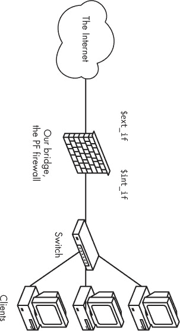

## 第三章. 进入真实世界


前一章演示了单台机器上基本数据包过滤的配置。在这一章中，我们将在此基础设置上进行扩展，但将进入更常规的领域：数据包过滤“网关”。尽管这一章中的大部分内容在单机设置中可能也很有用，但我们的主要关注点是设置一个网关，转发特定的网络流量并处理基本本地网络的常见网络服务。

## 一个简单的网关

我们将从构建你可能与“防火墙”一词关联的东西开始：一台作为至少一台其他机器网关的机器。除了在它的多个网络之间转发数据包外，这台机器的使命是提高它所处理的网络流量的信噪比。这就是我们的 PF 配置发挥作用的地方。

但在深入实际的配置细节之前，我们需要深入一些理论，完善一些概念。请耐心等一下；这将帮助你避免我在邮件列表、新闻组和网络论坛上经常看到的一些头痛问题。

### 保持简单：避免陷入“in”、“out”和“on”的误区

在单机设置中，生活相对简单。你创建的流量应该要么传递到外部世界，要么被你的过滤规则阻止，而你可以决定想要让哪些流量从其他地方进入。

当你设置一个网关时，你的视角会发生变化。你从“是我与外部网络对抗”的心态转变为“我是决定所有我连接的网络之间传输什么内容的人”。这台机器有多个，或者至少有两个，网络接口，每个接口连接到一个独立的网络，它的主要功能（或者至少是我们在这里关注的功能）是转发网络流量在各个网络之间。概念上，网络看起来应该像图 3-1 那样。

图 3-1. 具有单一网关的网络

如果你希望将流量从连接到`re1`的网络传递到连接到`re0`的主机，认为你需要像下面这样的规则是非常合理的：^([13])

```
pass in proto tcp on re1 from re1:network to re0:network \
                  port $ports keep state
```

然而，在防火墙配置中，最常见且最令人抱怨的错误之一是没有意识到`to`关键字本身并不能保证数据包能到达终点。这里的`to`关键字仅仅意味着数据包或连接必须具有与这些标准匹配的目的地址，才能匹配该规则。我们刚才写的规则允许流量“进入”到网关本身，并且“在”规则中指定的特定接口上。为了让数据包进一步进入并传递到下一个网络，我们需要一个匹配的规则，类似这样：

```
pass out proto tcp on re0 from re1:network to re0:network \
                     port $ports keep state
```

但是，请停下来再看一遍这些规则。最后这一条规则只允许目的地在直接连接到 `re0` 的网络中的数据包通过，其他的都不行。如果这正是你想要的，那就好了。在其他情况下，这样的规则虽然完全有效，但比实际需要的要更具体。很容易让自己陷入具体细节而忽视配置目的的更高层次视角——并可能在此过程中让自己陷入更多的调试循环。

如果有充分的理由编写非常具体的规则，比如前面的规则，你可能已经知道需要这些规则以及为什么需要它们。当你读完本书（如果不是更早一些的话）时，你应该能够清楚地表达出在何种情况下需要更具体的规则。然而，对于本章中的基本网关配置，你可能会希望编写不特定于接口的规则。事实上，在某些情况下，指定方向并没有什么实际意义；你只需使用如下规则来让本地网络访问互联网：

```
pass proto tcp from re1:network to port $ports keep state
```

对于简单的设置，绑定到接口的 `in` 和 `out` 规则可能会为你的规则集增加比其价值更多的杂乱。对于繁忙的网络管理员来说，一个易于阅读的规则集是更安全的。（我们将在第十章中讨论一些额外的安全措施，如 `antispoof`。）

本书的其余部分，在一些例外情况下，我们将尽可能简化规则，以便于阅读。

### 网络地址转换与 IPv6

一旦我们开始处理不同网络之间的流量，了解网络地址是如何工作的以及为什么你可能会遇到几种不同的地址方案就变得非常有用。多年来，网络地址一直是混乱和流行词汇的来源。除非你查阅相关文档并深入研究一系列 RFC，否则很难确定其中的事实。在接下来的几段中，我将努力澄清一些混乱。

例如，一个广泛流传的观点是，如果你拥有一个使用与连接互联网接口分配的地址范围完全不同的内部网络，那么你就安全了，外界无法访问你的网络资源。这个观点与这样一个想法密切相关：防火墙在本地网络中的 IP 地址必须是 `192.168.0.1` 或 `10.0.0.1`。

这两种观点都有一定的真实性，而且这些地址是常见的默认值。但真正的情况是，尽管 PF 提供了一些技巧使这一任务更难，但仍然有可能绕过网络地址转换。

我们使用一套特定的内部地址范围和一套不同的外部地址范围，并不是为了主要解决安全问题。而是因为这是绕过互联网协议设计问题的最简单方式：有限的地址范围。

在 1980 年代，当互联网协议被制定时，互联网上的大多数计算机（当时被称为 ARPANET）都是大型计算机，每台有几十到几千个用户。当时，32 位地址空间提供的超过 40 亿个地址似乎相当充足，但几个因素证明了这一假设是错误的。一个因素是地址分配过程导致在一些世界人口较多的国家甚至还没有连接互联网之前，已经分配了大量的地址空间。另一个，更重要的因素是，到 1990 年代初，互联网不再是一个研究项目，而是一个商业化的资源，消费者和各种规模的公司以惊人的速度消耗 IP 地址空间。

长期解决方案是重新定义互联网，使用更大的地址空间。1998 年，IPv6 的规范发布了，提供了 128 位的地址空间，总共有 2¹²⁸个地址，作为 RFC 2460 发布。但在我们等待 IPv6 广泛可用的同时，我们需要一个临时解决方案。这个解决方案通过一系列 RFCs 提出，指定了网关如何转发经过地址转换的流量，使得大型本地网络在互联网上看起来像一个计算机。某些以前未分配的 IP 地址范围被划定为这些私有网络。这些地址范围对任何人都是免费的，前提是这些范围内的流量不得未经转换直接进入互联网。因此，*网络地址转换（NAT）*在 1990 年代中期诞生，并迅速成为本地网络中处理地址的默认方式。^([14])

PF 支持 IPv6 以及各种 IPv4 地址转换技巧。（实际上，BSD 是最早采用 IPv6 的系统之一，得益于 KAME 项目的努力。^([15])) 所有支持 PF 的系统也都支持 IPv4 和 IPv6 地址族。如果你的 IPv4 网络需要 NAT 配置，你可以在 PF 规则集中根据需要集成地址转换。换句话说，如果你使用的是支持 PF 的系统，你可以合理地确信，至少在操作系统层面，你的 IPv6 需求已经得到满足。然而，一些带有 PF 端口的操作系统使用的是较旧版本的代码，值得注意的是，“更新的 PF 代码更好”这一通用规则同样适用于 IPv6 环境。

本书中的示例主要使用 IPv4 地址和必要时的 NAT，但大部分内容同样适用于已实现 IPv6 的网络。

### 最终准备：定义本地网络

在第二章中，我们为一台单独的独立机器设置了配置。接下来，我们将把这个配置扩展到网关版本，并且定义一些宏来帮助提高可读性，并在概念上将你有一定控制权的本地网络与其他网络分开。那么，如何在 PF 术语中定义你的“本地”网络呢？

在本章前面，你已经看到了*`interface`*`:network`的表示法。这是一种很好的简写方式，但你可以通过稍微扩展宏的使用，使规则集更加易读且便于维护。例如，你可以将`$localnet`宏定义为直接连接到你内部接口的网络（在我们的示例中是`re1:network`）。或者，你也可以将`$localnet`的定义更改为 IP 地址/子网掩码表示法，来表示一个网络，比如`192.168.100.0/24`表示一个私有 IPv4 地址子网，或者`2001:db8:dead:beef::/64`表示一个 IPv6 范围。

如果你的网络环境要求，你可以将`$localnet`定义为一个网络列表。例如，结合使用宏的`pass`规则，像下面这样的合理`$localnet`定义，可能会帮你省去不少麻烦：

```
pass proto { tcp, udp } from $localnet to port $ports
```

从这里开始，我们将坚持使用像`$localnet`这样的宏，来提高可读性。

### 设置网关

我们将以上一章中从头开始构建的单机配置为基础，来构建我们的数据包过滤网关。我们假设机器已经安装了另一块网络卡（或者你已经通过以太网、PPP 或其他方式，从本地网络连接到一个或多个其他网络）。

在我们的语境中，接口如何配置并不特别重要。我们只需要知道接口已经启用并正常工作。

在接下来的讨论和示例中，PPP 和以太网设置之间的唯一不同是接口名称，我们会尽量快速地去除接口名称，以便让示例更简洁。

首先，因为 BSD 系统默认禁用了数据包转发，我们需要启用它，以便让计算机将接收到的网络流量从一个接口转发到其他网络通过一个或多个单独的接口。最初，我们将在命令行使用`sysctl`命令来启用传统的 IPv4 转发：

```
# sysctl net.inet.ip.forwarding=1
```

如果需要转发 IPv6 流量，我们使用这个`sysctl`命令：

```
# sysctl net.inet6.ip6.forwarding=1
```

目前这样设置是可以的。然而，为了在将来重新启动计算机时仍然有效，你需要将这些设置输入到相关的配置文件中。

在 OpenBSD 和 NetBSD 中，你需要通过编辑*/etc/sysctl.conf*并在文件末尾添加 IP 转发行，使得最后几行看起来像这样：

```
net.inet.ip.forwarding=1
net.inet6.ip6.forwarding=1
```

在 FreeBSD 中，通过将这些行添加到*/etc/rc.conf*来进行更改：

```
gateway_enable="YES" #for ipv4
ipv6_gateway_enable="YES" #for ipv6
```

最终效果是相同的；FreeBSD 的*rc*脚本通过`sysctl`命令设置这两个值。然而，FreeBSD 的更大一部分配置集中在*rc.conf*文件中。

现在是检查你打算使用的所有接口是否已经启动并运行的时机。使用**`ifconfig -a`**或**`ifconfig` *interface_name***来查看。

我的一台系统上`ifconfig -a`的输出如下所示：

```
$ **ifconfig -a**
lo0: flags=8049<UP,LOOPBACK,RUNNING,MULTICAST> mtu 33224
        groups: lo
        inet 127.0.0.1 netmask 0xff000000
        inet6 ::1 prefixlen 128
        inet6 fe80::1%lo0 prefixlen 64 scopeid 0x5
xl0: flags=8843<UP,BROADCAST,RUNNING,SIMPLEX,MULTICAST> mtu 1500
        lladdr 00:60:97:83:4a:01
        groups: egress
        media: Ethernet autoselect (100baseTX full-duplex)
        status: active
        inet 194.54.107.18 netmask 0xfffffff8 broadcast 194.54.107.23
        inet6 fe80::260:97ff:fe83:4a01%xl0 prefixlen 64 scopeid 0x1
fxp0: flags=8843<UP,BROADCAST,RUNNING,SIMPLEX,MULTICAST> mtu 1500
        lladdr 00:30:05:03:fc:41
        media: Ethernet autoselect (100baseTX full-duplex)
        status: active
        inet 194.54.103.65 netmask 0xffffffc0 broadcast 194.54.103.127
        inet6 fe80::230:5ff:fe03:fc41%fxp0 prefixlen 64 scopeid 0x2
pflog0: flags=141<UP,RUNNING,PROMISC> mtu 33224
enc0: flags=0<> mtu 1536
```

你的设置很可能与此不同。这里，网关上的物理接口是`xl0`和`fxp0`。系统中可能还会有逻辑接口`lo0`（回环接口）、`enc0`（用于 IPSEC 的封装接口）和`pflog0`（PF 日志设备）。

如果你是拨号连接，可能使用某种变体的 PPP 进行互联网连接，外部接口是`tun0`伪设备。如果你的连接是通过某种宽带连接，你可能会有一个以太网接口可供使用。然而，如果你是使用以太网 PPP（PPPoE）的 ADSL 用户群体中的一员，那么正确的外部接口将是`tun0`或`pppoe0`中的一个伪设备（取决于你使用的是用户空间`pppoe(8)`还是内核模式`pppoe(4)`），而不是物理以太网接口。

根据你的具体设置，你可能需要对接口进行一些其他的设备特定配置。在配置完成后，你可以继续处理 TCP/IP 层面的问题，并进行数据包过滤配置。

如果你仍然打算允许来自内部机器的任何流量，你的初始网关设置中的*/etc/pf.conf*可能看起来大致如下：

```
ext_if = "re0" # macro for external interface - use tun0 or pppoe0 for PPPoE
int_if = "re1" # macro for internal interface
localnet = $int_if:network
# ext_if IPv4 address could be dynamic, hence ($ext_if)
match out on $ext_if inet from $localnet nat-to ($ext_if) # NAT, match IPv4 only
block all
pass from { self, $localnet }
```

注意使用宏为网络接口分配逻辑名称。在这里，使用的是 Realtek 以太网卡，但这是我们在此上下文中最后一次关注这个问题。

在像这样简单的设置中，使用这些宏可能不会带来太多好处，但一旦规则集变得稍微复杂些，你会开始欣赏它们所带来的可读性。

对这个规则集的一个可能优化是去除宏`ext_if`，并将`$ext_if`的引用替换为字符串`egress`，这是包含默认路由的接口所在的接口组的名称。接口组不是宏，因此你应当不带`$`字符地写出名称`egress`。

还请注意`nat-to`的`match`规则。这是处理从你本地网络中不可路由地址到分配给你的唯一官方地址的 NAT 的地方。如果你的网络使用官方的、可路由的 IPv4 地址，你可以直接省略这行配置。`match`规则是 OpenBSD 4.6 中引入的，它们可以在连接匹配某些标准时应用动作，而不决定连接是应该被阻止还是通过。

`match`规则最后部分`($ext_if)`周围的括号是为了补偿外部接口的 IP 地址可能是动态分配的情况。这个细节将确保即使接口的 IP 地址发生变化，你的网络流量也能顺利运行，不会出现严重的中断。

是时候总结我们迄今为止构建的规则集了：(1) 我们阻止来自我们自己网络外部的所有流量。 (2) 我们确保所有从我们本地网络中的主机发起的 IPv4 流量，在进入外部世界时，其源地址会被重写为网关外部接口分配的可路由地址。 (3) 最后，我们允许来自我们本地网络（IPv4 和 IPv6 均包括）和网关本身的所有流量通过。最后`pass`规则中的`self`关键字是 PF 语法中的一个类似宏的保留字，表示本地主机上所有接口分配的所有地址。

如果你的操作系统运行的是 OpenBSD 4.7 之前的 PF 版本，你的第一个网关规则集可能看起来像这样：

```
ext_if = "re0" # macro for external interface - use tun0 or pppoe0 for PPPoE
int_if = "re1" # macro for internal interface
localnet = $int_if:network
# ext_if IP address could be dynamic, hence ($ext_if)
nat on $ext_if inet from $localnet to any -> ($ext_if) # NAT, match IPv4 only
block all
pass from { self, $localnet } to any keep state
```

这里的`nat`规则处理的转换方式与前一个示例中的`nat-to`的`match`规则类似。

另一方面，这个规则集可能允许比你实际希望通过的流量更多。在我曾经工作过的一些网络中，规则集的主要部分基于一个名为`client_out`的宏：

```
client_out = "{ ftp-data, ftp, ssh, domain, pop3, auth, nntp, http,\
                https, 446, cvspserver, 2628, 5999, 8000, 8080 }"
```

它有这个`pass`规则：

```
pass proto tcp from $localnet to port $client_out
```

这可能是一个有些奇特的端口选择，但它正是我那里的同事们当时所需要的。有些编号端口是为其他站点上为特定目的设置的系统所需要的。你的需求在某些细节上可能有所不同，但这应该涵盖了一些更常用的服务。

这里有另一个`pass`规则，对那些希望能够从其他地方管理机器的人很有用：

```
pass in proto tcp to port ssh
```

如果你更喜欢，也可以使用这种格式：

```
pass in proto tcp to $ext_if port ssh
```

当你完全省略`from`部分时，默认值是`from any`，这相当宽松。它允许你从任何地方登录，这对你经常旅行并需要从全球未知地点进行 SSH 访问时非常有用。如果你不怎么流动——比如你还没完全习惯参加远方的会议，或者你觉得同事们可以在你度假时自己应对——你可能想通过包含仅限你和其他管理员从合法地点登录的`from`部分来加强安全性。

我们的非常基础的规则集仍然不完整。接下来，我们需要让名称服务为我们的客户端工作。我们从规则集开始时的另一个宏开始：

```
udp_services = "{ domain, ntp }"
```

这通过一个规则来补充，该规则允许我们想要的流量通过防火墙：

```
pass quick proto { tcp, udp } to port $udp_services
```

请注意此规则中的`quick`关键字。我们已经开始编写由多个规则组成的规则集，现在是时候重新审视它们之间的关系和互动了。

如前一章所述，规则是按照它们在配置文件中书写的顺序从上到下进行评估的。对于 PF 评估的每个数据包或连接，*最后匹配的规则*就是被应用的规则。

`quick`关键字提供了逃离普通顺序的方式。当一个数据包匹配到`quick`规则时，数据包会按照当前规则进行处理。规则处理停止，不再考虑可能匹配该数据包的其他规则。随着你的规则集变得越来越长和复杂，你会发现这非常方便。例如，当你需要一些与一般规则隔离的例外时，这会非常有用。

这个`quick`规则还处理了 NTP，它用于时间同步。名称服务和时间同步协议的共同点是，在某些情况下，它们可能会交替通过 TCP 和 UDP 进行通信。

### 测试你的规则集

你可能还没来得及为你的规则集编写正式的测试套件，但完全有理由测试你的配置是否按预期工作。

前一章中的独立示例中的基本测试仍然适用。但现在，你需要从你网络中的其他主机以及你的数据包过滤网关进行测试。对于你在`pass`规则中指定的每项服务，测试你本地网络中的机器是否获得了有意义的结果。从你本地网络中的任何机器，输入类似这样的命令：

```
$ **host nostarch.com**
```

它应该返回与前一章中测试独立规则集时完全相同的结果，并且你指定的服务流量应该通过^([16])。

你可能觉得没必要，但检查一下规则集是否在你的网关外部按预期工作并没有坏处。如果你迄今为止做了本章所说的，那么从外部应该无法联系到你本地网络中的机器。

为什么只有 IP 地址——而不是主机名或域名？

看到到目前为止的示例，你可能已经注意到规则集中的宏总是展开为 IP 地址或地址范围，而从不展开为主机名或域名。你可能在想，为什么呢？毕竟，你已经看到 PF 允许在规则集中使用服务名称，那么为什么不包括主机名或域名呢？

答案是，如果你在规则集中使用了域名和主机名，那么规则集只有在名称服务运行并且可访问时才有效。在默认配置下，PF 会在任何网络服务运行之前加载。这意味着，如果你希望在 PF 配置中使用域名和主机名，你需要改变系统的启动顺序（可能需要编辑 */etc/rc.local*），以便在名称服务可用后再加载依赖名称服务的规则集。如果你只需要引用少量的主机名或域名，将它们作为 IP 地址添加到 */etc/hosts* 文件的名称映射条目中，并且不更改 *rc* 脚本，可能会更有用。

## 那个悲伤的旧 FTP 协议

我们刚才简要查看的实际 TCP 端口清单中，包含了*FTP*——经典的*文件传输协议*。FTP 是早期互联网的遗物，那时实验是常态，安全性并不是现代意义上的一个关注点。事实上，FTP 比 TCP/IP 还要早，^([17])，我们可以通过超过 50 个 RFC 来追踪这个协议的发展。经过 30 多年，FTP 既是一个悲伤的老东西，也是一个问题孩子——特别是对于那些试图将 FTP 和防火墙结合使用的人来说。FTP 是一个古老且奇怪的协议，存在很多值得反感的地方。以下是反对它的最常见几点：

+   密码以明文传输。^([18])

+   该协议要求至少使用两个 TCP 连接（控制和数据），并且需要使用不同的端口。

+   当会话建立时，数据通常通过随机选择的端口进行传输。

所有这些问题都会带来安全上的挑战，即便在考虑到客户端或服务器软件中的潜在弱点可能导致安全问题之前。正如任何网络老兵所说的，这些问题通常会在你最不需要的时候出现。

无论如何，存在其他更现代、更安全的文件传输选项，例如 SFTP 和 SCP，这些协议都通过加密连接进行身份验证和数据传输。称职的 IT 专业人员应该偏好使用除 FTP 之外的某种文件传输方式。

不论我们多么专业，也有时候不得不处理一些我们根本不想使用的东西。在通过防火墙使用 FTP 时，我们可以通过将流量重定向到一个专门为此目的编写的小程序来解决问题。对我们来说，处理 FTP 给了我们一个机会，去了解两个相对先进的 PF 特性：*重定向*和*锚点*。

在像我们这样默认阻止的情况下，处理 FTP 的最简单方法是让 PF 将该服务的流量重定向到一个外部应用程序，这个应用程序充当该服务的*代理*。代理维护自己的命名子规则集（在 PF 术语中称为*锚点*），在其中根据需要插入或删除 FTP 流量的规则。重定向和锚点的组合提供了一个干净、明确的接口，连接数据包过滤子系统和代理。

### 如果必须：带有 Divert 或 Redirect 的 ftp-proxy

通过你的网关启用 FTP 传输非常简单，这要归功于 OpenBSD 基础系统中包含的 FTP 代理程序。这个程序叫做——你猜对了——`ftp-proxy`。

要启用`ftp-proxy`，你需要在 OpenBSD 的*/etc/rc.conf.local*文件中添加这一行：

```
ftpproxy_flags=""
```

在 FreeBSD 中，*/etc/rc.conf*至少需要包含以下两行中的第一行：

```
ftpproxy_enable="YES"
ftpproxy_flags="" # and put any command line options here
```

如果你需要为`ftp-proxy`指定任何命令行选项，你可以将它们放入`ftpproxy_flags`变量中。

如果你愿意，你可以手动启动代理，运行*/usr/sbin/ftp-proxy*（或者更好的是，使用 OpenBSD 上的*/etc/rc.d/ftp-proxy*脚本并加上`start`选项），你可能想这样做，以检查你即将对 PF 配置所做的更改是否按预期生效。

对于基本配置，你只需要向*/etc/pf.conf*添加三个元素：锚点和两个`pass`规则。锚点声明看起来像这样：

```
anchor "ftp-proxy/*"
```

在 OpenBSD 4.7 之前的版本中，需要两个锚点声明：

```
nat-anchor "ftp-proxy/*"
rdr-anchor "ftp-proxy/*"
```

代理将在此插入它为 FTP 会话生成的规则。然后，你还需要一个`pass`规则，以允许 FTP 流量进入代理：

```
pass in quick inet proto tcp to port ftp divert-to 127.0.0.1 port 8021
```

注意`divert-to`部分。它将流量重定向到本地端口，在那里代理通过高效的、本地连接专用的 divert(4)接口监听流量。在 OpenBSD 4.9 及之前的版本中，流量重定向是通过`rdr-to`实现的。如果你正在升级一个旧的 OpenBSD 5.0 之前的配置，你需要更新 FTP 代理的`rdr-to`规则，将其改为使用`divert-to`。

如果你的操作系统使用的是 OpenBSD 4.7 之前的 PF 版本，你需要这个版本的重定向规则：

```
rdr pass on $int_if inet proto tcp from any to any port ftp -> 127.0.0.1 port 8021
```

最后，确保你的规则集包含一个`pass`规则，以允许数据包从代理传递到其他地方，在那里，`$proxy`扩展为代理守护进程绑定的地址：

```
pass out inet proto tcp from $proxy to any port ftp
```

重新加载你的 PF 配置：

```
$ **sudo pfctl -f /etc/pf.conf**
```

不久之后，你的用户会感谢你让 FTP 工作。

### ftp-proxy 设置的变体

上面的示例涵盖了一个基本配置，其中你本地网络中的客户端需要联系其他地方的 FTP 服务器。这个配置应该与大多数 FTP 客户端和服务器的组合配合得很好。

你可以通过向`ftpproxy_flags=`行添加选项来改变代理的行为。你可能会遇到一些具有特定怪癖的客户端或服务器，你需要在配置中进行补偿，或者你可能希望以特定方式将代理集成到你的设置中，比如将 FTP 流量分配到特定的队列。对于这些以及其他`ftp-proxy`配置的细节，最好的办法是从研究手册页开始。

如果你有兴趣了解如何在 PF 和`ftp-proxy`保护下运行 FTP 服务器，你可以考虑在单独的端口上以反向模式（使用`-R`选项）运行单独的`ftp-proxy`，并为其设置自己的重定向`pass`规则。甚至可以将代理设置为在 IPv6 模式下运行，但如果你在运行现代协议方面走在前面，你可能不会再将 FTP 作为主要的文件传输协议。

### 注意

*如果你的 PF 版本早于这里描述的版本，那么你正在使用一个过时且不受支持的操作系统。我强烈建议你尽快安排操作系统升级。如果由于某种原因升级不可行，请查阅本书的第一版并研究你操作系统的文档，了解如何使用一些早期的 FTP 代理。*

## 使你的网络故障排除更友好

使你的网络故障排除更友好是一个可能相当庞大的话题。一般来说，你的 TCP/IP 网络的调试或故障排除友好性取决于你如何处理专门为调试设计的 Internet 协议：ICMP。

ICMP 是用于在主机和网关之间发送和接收*控制消息*的协议，主要是为了向发送方提供有关到达目标主机的过程中出现的任何异常或困难情况的反馈。

有大量的 ICMP 流量，通常在你浏览网页、阅读邮件或传输文件时会在后台发生。路由器（记住，你正在构建一个）使用 ICMP 来协商数据包大小和其他传输参数，这一过程通常被称为*路径 MTU 发现*。

你可能听过管理员称 ICMP 为“邪恶”或，如果他们的理解稍微深入一点，则称其为“必要的邪恶”。这种态度的原因纯粹是历史性的。几年前，人们发现一些操作系统的网络堆栈中包含代码，如果收到足够大的 ICMP 请求，机器可能会崩溃。

受此影响最严重的公司之一是微软，你可以通过使用你喜欢的搜索引擎找到大量关于*死亡 ping*漏洞的资料。然而，这一切发生在 1990 年代后半期，自那时以来，所有现代操作系统都彻底清理了它们的网络代码（至少，这是我们被告知的情况）。

早期的解决方法之一是直接阻止 ICMP 回显（ping）请求，甚至是所有 ICMP 流量。这种措施几乎肯定导致了性能差和难以调试的网络问题。然而，在某些地方，这些规则集已经存在了将近二十年，而且设置这些规则的人仍然很害怕。现在，几乎没有理由再担心有害的 ICMP 流量了，但我们还是会看看如何管理哪些 ICMP 流量能够进出你的网络。

在现代的 IPv6 网络中，更新后的 `icmp6` 协议在参数传递甚至主机配置中扮演着比以往更为关键的角色，网络管理员在学习如何屏蔽或允许 `icmp6` 流量时，实际上是在玩一场高风险的游戏。在很大程度上，IPv4 的 ICMP 问题对于 IPv6 的 ICMP6 也同样适用，但除了这些，ICMP6 还用于几个在 IPv4 中处理方式不同的机制。我们将在梳理适用于这两个 IP 协议版本的相关问题后，再深入这些问题。

### 我们是否让它全部通过？

显然的问题是：“如果 ICMP 是如此有用且重要的东西，我们是不是应该一直让它全部通过？”答案是，这取决于具体情况。

当然，让诊断流量不加限制地通过可以让调试变得更容易，但这也让其他人相对容易获取到关于你网络的信息。所以，如果你想隐藏你 IPv4 网络的内部工作原理，像下面这样的规则可能不是最优的：

```
pass inet proto icmp
```

如果你想让你的 IPv6 流量也有类似的自由信息流通，对应的规则是这样的：

```
pass inet6 proto icmp6
```

公正地说，还应该提到，你可能会发现一些 ICMP 和 ICMP6 流量无害地通过你的 `keep state` 规则悄悄进行。

### 最简单的解决办法：问题在这里解决

最简单的解决方案可能是允许本地网络的所有 ICMP 和 ICMP6 流量通过，同时让来自其他地方的探测在你的网关处停止：

```
pass inet proto icmp icmp-type $icmp_types from $localnet
pass inet6 proto icmp6 icmp6-type $icmp6_types from $localnet
pass inet proto icmp icmp-type $icmp_types to $ext_if
pass inet6 proto icmp6 icmp6-type $icmp6_types to $ext_if
```

当然，这是假设你已经识别了你希望通过的 ICMP 和 ICMP6 类型，并将它们填入你的宏定义中。稍后我们会回到这些内容。无论如何，停止网关的探测可能是一个有吸引力的选项，但让我们看看其他几种选项，这些选项能展示 PF 的灵活性。

### 让 ping 通过

到目前为止，我们在本章中开发的规则集有一个明显的缺点：常用的故障排除命令，如 `ping` 和 `traceroute`（以及它们的 IPv6 等价命令 `ping6` 和 `traceroute6`），将无法使用。这对于你的用户来说可能影响不大，而且正是 `ping` 命令最早让人们害怕 ICMP 流量，从而去过滤或阻止它，所以显然有些人认为没有它我们反而会更好。然而，你会发现这些故障排除工具非常有用。只需对规则集做几个小的调整，它们就能重新可用。

诊断命令`ping`和`ping6`依赖于 ICMP 和 ICMP6 的*回显请求*（以及匹配的*回显回复*）类型，为了保持规则集的整洁，我们首先定义另一个宏集：

```
icmp_types = "echoreq"
icmp6_types = "echoreq"
```

然后，我们添加使用这些定义的规则：

```
pass inet proto icmp icmp-type $icmp_types
pass inet6 proto icmp6 icmp6-type $icmp6_types
```

这些宏和规则意味着类型为*回显请求*的 ICMP 和 ICMP6 数据包将被允许通过，并且匹配的*回显回复*将被允许返回，因为 PF 具有状态性特征。这就是`ping`和`ping6`命令所需的一切，以产生它们预期的结果。

如果你需要更多或其他类型的 ICMP 或 ICMP6 数据包通过，你可以将`icmp_types`和`icmp6_types`扩展为你希望允许的那些数据包类型的列表。

### 帮助 traceroute

`traceroute`命令（以及 IPv6 版本`traceroute6`）在用户声称互联网无法连接时非常有用。默认情况下，Unix 的`traceroute`使用 UDP 连接，依据基于目标的固定公式。以下规则适用于所有我能访问的 Unix 版本中的`traceroute`和`traceroute6`命令，包括 GNU/Linux：

```
# allow out the default range for traceroute(8):
# "base+nhops*nqueries-1" (33434+64*3-1)
pass out on egress inet proto udp to port 33433:33626 # For IPv4
pass out on egress inet6 proto udp to port 33433:33626 # For IPv6
```

这也让你初步了解了端口范围的样子。在某些情况下它们非常有用。

迄今为止的经验表明，其他操作系统上的`traceroute`和`traceroute6`实现方式大致相同。一个显著的例外是微软 Windows 平台。在该平台上，*tracert.exe*程序及其 IPv6 版本*tracert6.exe*使用 ICMP 回显请求来实现此目的。因此，如果你希望让 Windows 的 traceroute 通过，你只需要第一个规则，就像允许`ping`通过一样。Unix 的`traceroute`程序也可以被指示使用其他协议，并且如果你使用其`-I`命令行选项，它将表现得与微软的对应程序非常相似。你可以查阅`traceroute`手册页（或者它的源代码）来获取所有详细信息。

这个解决方案基于我在`openbsd-misc`帖子中找到的一个示例规则。我发现了这个列表，并且可以在* [`marc.info/`](http://marc.info/)*等地方访问的可搜索的列表存档，是你需要 OpenBSD 或 PF 相关信息时一个有价值的资源。

### 路径 MTU 发现

在故障排除时我最后要提醒你的一点是路径 MTU 发现。互联网协议被设计为设备无关的，而设备无关的一个后果是你无法总是可靠地预测给定连接的最佳数据包大小。数据包大小的主要限制称为*最大传输单元*，或*MTU*，它设置了接口数据包大小的上限。`ifconfig`命令将显示你的网络接口的 MTU。

现代 TCP/IP 实现期望通过一个过程来确定连接的正确数据包大小，该过程仅涉及在本地链路的 MTU 范围内发送大小不同的数据包，并设置“不要分片”标志。如果数据包在到达目的地的过程中超出了某处的 MTU，具有较低 MTU 的主机将返回一个 ICMP 数据包，指示“类型 3，代码 4”，并在本地上限已达到时引用其本地 MTU。现在，你不需要马上去查 RFC。类型 3 表示*目的地不可达*，代码 4 表示*需要分片，但“不要分片”标志已设置*。因此，如果你与其他网络的连接（它们的 MTU 可能与你的不同）似乎表现不佳，你可以尝试稍微更改你的 ICMP 类型列表，允许 IPv4 目的地不可达数据包通过：

```
icmp_types = "{ echoreq, unreach }"
```

如你所见，这意味着你不需要修改`pass`规则本身：

```
pass inet proto icmp icmp-type $icmp_types
```

现在，我要告诉你一个小秘密：在几乎所有情况下，这些规则对于路径 MTU 发现来说并不是必须的（但它们也无妨）。然而，尽管 PF 的默认`keep state`行为可以处理大部分你需要的 ICMP 流量，PF 确实允许你过滤所有 ICMP 类型和代码的变体。对于 IPv6，你可能希望让更常见的 ICMP6 诊断信息通过，例如以下内容：

```
icmp6_types = "{ echoreq unreach timex paramprob }"
```

这意味着我们允许回显请求、目的地不可达、超时以及参数问题消息通过 IPv6 流量。感谢宏定义，你也无需更改 ICMP6 情况的`pass`规则：

```
pass inet6 proto icmp6 icmp6-type $icmp6_types
```

但值得记住的是，IPv6 主机依赖 ICMP6 消息来执行自动配置相关任务，你可能需要显式地过滤，以便在网络中的不同位置允许或拒绝特定的 ICMP6 类型。

例如，你可能希望让路由器及其客户端交换路由请求和路由通告消息（分别为 ICMP6 类型`routeradv`和`routersol`），同时，你可能希望确保邻居通告和邻居请求（分别为 ICMP6 类型`neighbradv`和`neighbrsol`）仅限于它们直接连接的网络内。

如果你想深入了解更多细节，可能的类型和代码列表已经在`icmp(4)`和`icmp6(4)`手册页中记录。背景信息可以在 RFC 文档中找到。^([19])

## 表格让你的生活更轻松

到目前为止，你可能会觉得这个设置显得非常静态和僵化。毕竟，某些时间点可能会有一些与过滤和重定向相关的数据，但它们不值得被写入配置文件！说得对，PF 提供了处理这些情况的机制。

*表格*就是这样的一个功能。它们作为 IP 地址列表非常有用，可以在不重新加载整个规则集的情况下进行操作，并且在需要快速查找时也非常实用。

表格名称总是用`< >`括起来，像这样：

```
table <clients> persist { 192.168.2.0/24, !192.168.2.5 }
```

这里，网络`192.168.2.0/24`是表格的一部分，唯一的例外是：使用`!`操作符（逻辑非）排除了地址`192.168.2.5`。关键字`persist`确保即使当前没有规则引用该表格，表格本身仍然存在。

还可以从文件加载表格，其中每个项位于单独的一行，例如文件*/etc/clients*：

```
192.168.2.0/24
!192.168.2.5
```

这反过来用于初始化*/etc/pf.conf*中的表格：

```
table <clients> persist file "/etc/clients"
```

因此，例如，您可以将我们早些时候的规则更改为如下所示，以管理来自客户端计算机的出站流量：

```
pass inet proto tcp from <clients> to any port $client_out
```

有了这个，您可以像这样实时操作表格的内容：

```
$ **sudo pfctl -t clients -T add 192.168.1/16**
```

请注意，这只会改变表格的内存副本，这意味着除非您安排存储更改，否则该更改在断电或重启后将不会保存。

您也可以选择通过`cron`作业维护表格的磁盘副本，该作业定期将表格内容转储到磁盘，使用如下命令：

```
$ **sudo pfctl -t clients -T show >/etc/clients**
```

或者，您可以编辑*/etc/clients*文件，并使用该文件数据替换内存中的表格内容：

```
$ **sudo pfctl -t clients -T replace -f /etc/clients**
```

对于您将频繁执行的操作，迟早您会编写 shell 脚本。很可能，表格的常规操作，例如插入或删除项或替换表格内容，将成为您不久后用于维护的脚本的一部分。

一个常见的例子是通过`cron`作业在特定时间替换作为`from`地址引用的表格内容，从而强制实施网络访问限制。在某些网络中，您甚至可能需要为一周中的不同天设置不同的访问规则。唯一的真正限制在于您自身的需求和创造力。

在接下来的章节中，我们将频繁回到表格的一些便捷用途，并将查看几个与表格交互的有用程序。

* * *

^([13]) 实际上，`keep state`部分表示默认行为，如果您使用的是 OpenBSD 4.1 或更高版本的 PF，通常是多余的。然而，通常不需要在从早期版本升级时删除现有规则中的此规范。为了简化过渡，本书中的示例在需要时会做出此区分。

^([14]) RFC 1631，“IP 网络地址转换器（NAT）”，1994 年 5 月发布，以及 RFC 1918，“私人互联网地址分配”，1996 年 2 月发布，提供了有关 NAT 的详细信息。

^([15]) 引用项目主页上的内容，* [`www.kame.net/`](http://www.kame.net/)*， “KAME 项目是日本六家公司联合发起的，旨在为 BSD 变种提供免费的 IPv6、IPsec 和移动 IPv6 栈。”主要的研发活动已于 2006 年 3 月完成，重要部分已经纳入相关系统，现在只剩下维护活动。

^([16]) 除非信息在此期间发生了变化，否则这一点是正确的。当然，有些系统管理员喜欢恶作剧，但大多数情况下，DNS 区域信息的变化是由于该特定组织或网络的实际需求。

^([17]) 描述 FTP 协议的最早 RFC 是 RFC 114，日期为 1971 年 4 月 10 日。随着 FTP 版本 5 的推出，切换到 TCP/IP 协议，该版本定义在 RFC 765 和 775 中，分别发布于 1980 年 6 月和 12 月。

^([18]) 一种加密版本的协议，称为 FTPS，在 RFC4217 中有详细说明，但其支持仍然有些不稳定。

^([19]) 描述 ICMP 及相关技术的主要 RFC 包括 792、950、1191、1256、2521 和 6145。IPv6 的 ICMP 更新在 RFC 3542 和 RFC 4443 中。这些文档可以在互联网上的多个地方找到，例如 *[`www.ietf.org/`](http://www.ietf.org/)* 和 *[`www.faqs.org/`](http://www.faqs.org/)*，并可能也可以通过你的包管理系统访问。
