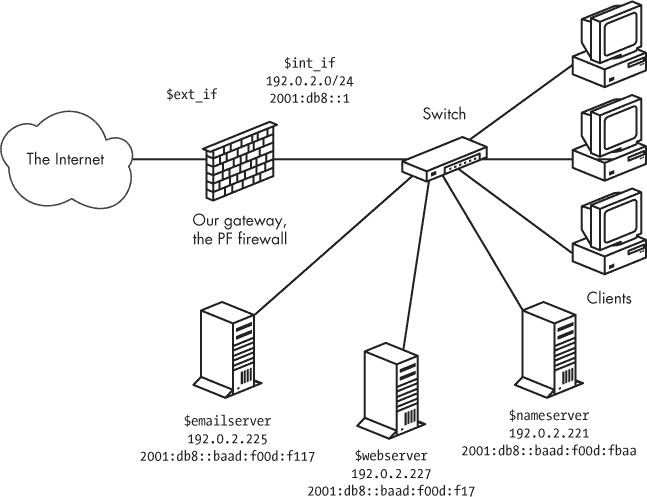
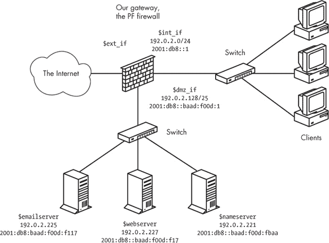
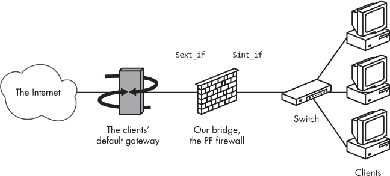

## 第五章：更大或更复杂的网络


在本章中，我们将在前几章的基础上，解决大中型网络中相对要求较高的应用或用户的现实挑战。本章中的示例配置假设你的数据包过滤设置需要容纳你在本地网络上运行的服务。我们将主要从 Unix 的角度来审视这一挑战，重点关注 SSH、电子邮件和 Web 服务（并提供一些关于如何处理其他服务的提示）。

本章介绍了当你需要将数据包过滤与必须在本地网络外部可访问的服务结合使用时需要做的事情。这将如何增加你的规则集的复杂性，取决于你的网络设计，并在一定程度上取决于你拥有的可路由地址数量。我们将首先讨论官方的、可路由的 IPv4 地址配置，以及通常较为宽松的 IPv6 地址范围。然后，我们将讨论即使只有一个可路由的 IPv4 地址时的情况，并介绍基于 PF 的解决方案，这些解决方案即使在这些限制下也能使服务可用。

## 内部的 Web 服务器和邮件服务器：可路由的 IPv4 地址

你的网络有多复杂？它需要多复杂？

我们将从第三章中的示例客户端的基础场景开始。我们将客户端设置在一个基础的 PF 防火墙后，并让它们访问托管在其他地方的各种服务，但本地网络上没有运行任何服务。这些客户端将获得三个新的邻居：一个邮件服务器、一个 Web 服务器和一个文件服务器。在这个场景中，我们使用官方的、可路由的 IPv4 地址，因为这样会稍微简化工作。另一种优势是，使用可路由地址时，我们可以让两台新机器为我们的 *example.com* 域名提供 DNS 服务：一个作为主服务器，另一个作为权威从属服务器。^([25]) 正如你将看到的，添加 IPv6 地址并运行双栈网络不一定会使你的规则集变得显著复杂。

### 注意

*对于 DNS，至少在你的网络外部有一个权威的从属服务器总是有意义的（事实上，一些顶级域名不允许你在没有它的情况下注册域名）。你可能还希望安排一个备份邮件服务器托管在其他地方。在构建网络时，请牢记这些事项。*

在这一阶段，我们将物理网络布局保持得相对简单。我们将新的服务器放在与客户端相同的本地网络中——可能在一个单独的服务器房间中，但肯定与客户端位于同一网络段或交换机上。从概念上讲，新的网络看起来像是图 5-1。

在网络的基本参数设置完成后，我们可以开始为所需的服务设置一个合理的规则集。再次强调，我们从基础规则集开始，并添加一些宏以提高可读性。

我们需要的宏自然来自于规范：

+   Web 服务器：

    ```
    webserver = "{ 192.0.2.227, 2001:db8::baad:f00d:f17 }"
    ```

+   Web 服务器服务：

    ```
    webports = "{ http, https }"
    ```

+   邮件服务器：

    ```
    emailserver = "{ 192.0.2.225, 2001:db8::baad:f00d:f117 }"
    ```

图 5-1. 内部有服务器和客户端的基本网络

+   邮件服务器服务：

    ```
    email = "{ smtp, pop3, imap, imap3, imaps, pop3s }"
    ```

+   域名服务器：

    ```
    nameservers = "{ 192.0.2.221, 192.0.2.223 , \
                          2001:db8::baad:f00d:fbaa, 2001:db8::baad:f00d:ff00 }"
    ```

### 注意

*此时，您可能已经注意到我们的服务器的 IPv4 和 IPv6 地址都比较靠近各自的地址范围。某些思潮认为，在 IPv6 的情况下，每个接口如果总分配量允许，应该分配至少一个 /64 范围。其他人则提倡更为适度的分配。IETF 关于此问题的当前最佳实践文档是 RFC6177，可以从 IETF 网站获取* ([`www.ietf.org`](http://www.ietf.org)).

我们假设文件服务器不需要对外界可访问，除非我们选择为它设置一个需要在本地网络外部可见的服务，例如作为我们域的权威从属域名服务器。然后，在手头有了宏之后，我们添加 `pass` 规则。从 Web 服务器开始，我们使用以下方式让它对外界可访问：

```
pass proto tcp to $webserver port $webports
```

SYN 代理值得一试吗？

多年来，`synproxy state` 选项作为一种防御外部恶意流量的可能屏障，受到了大量关注。具体来说，`synproxy state` 选项旨在防御可能导致后端资源耗尽的 SYN 洪水攻击。

它是这样工作的：当创建一个新连接时，PF 通常让通信伙伴自行处理连接设置，只要数据包匹配 `pass` 规则，就简单地将其传递。启用 `synproxy` 后，PF 处理初始连接设置，只有在连接正确建立后才将连接交给通信伙伴，基本上在通信伙伴之间创建了一个缓冲区。SYN 代理比默认的 `keep state` 稍微昂贵一些，但在合理规模的设备上不一定会显著感觉到。

在负载均衡设置中，潜在的缺点变得显而易见，其中一个 SYN 代理 PF 可能会接受后端尚未准备好接受的连接，在某些情况下通过将连接设置到负载均衡逻辑原本不会选择的主机上，从而短路冗余。这里的经典例子是一个使用轮询 DNS 的 HTTP 服务器池。但这个问题在像 SMTP 这样的协议中变得尤为明显，因为内置的冗余机制规定（至少按惯例—实际的 RFC 有点模糊）如果主邮件交换器不接受连接，应该尝试一个次级邮件交换器。

在考虑一个`synproxy`看起来有吸引力的设置时，记住这些问题，并分析将`synproxy`添加到配置中可能对设置造成的影响。如果你认为需要使用 SYN 代理，只需在需要该选项的规则末尾添加`synproxy state`。经验法则是，如果你正在遭受主动攻击，插入`synproxy`选项可能作为临时措施有用。在正常情况下，它不需要作为配置的永久部分。

同样，我们允许外部世界与邮件服务器进行通信：

```
pass proto tcp to $emailserver port $email
```

这样，任何地方的客户端都能与局域网中的客户端拥有相同的访问权限，包括一些可能未加密运行的邮件检索协议。这在现实世界中是常见的，但如果你正在设置一个新的网络，可能需要考虑你的选择。

为了让邮件服务器发挥作用，它也需要能够向局域网外的主机发送邮件：

```
pass log proto tcp from $emailserver to port smtp
```

请记住，规则集以`block all`规则开始，这意味着只有邮件服务器被允许从局域网发起到外部世界的 SMTP 流量。如果网络上的其他主机需要向外界发送或接收邮件，它们需要使用指定的邮件服务器。这可能是一个很好的方法，确保例如你能尽可能让任何可能出现在网络中的垃圾邮件僵尸机难以投递其负载。

最后，名称服务器需要能够被外部网络中的客户端访问，这些客户端需要查找关于*example.com*以及我们权威回答的任何其他域的信息：

```
pass proto { tcp, udp } to $nameservers port domain
```

在整合了所有需要从外部访问的服务后，我们的规则集大致如下所示：

```
ext_if = "ep0" # macro for external interface - use tun0 or pppoe0 for PPPoE
int_if = "ep1" # macro for internal interface
localnet = $int_if:network
webserver = "{ 192.0.2.227, 2001:db8::baad:f00d:f17 }"
webports = "{ http, https }"
emailserver = "{ 192.0.2.225, 2001:db8::baad:f00d:f117 }"
email = "{ smtp, pop3, imap, imap3, imaps, pop3s }"
nameservers = "{ 192.0.2.221, 192.0.2.223, \
                 2001:db8::baad:f00d:fbaa, 2001:db8::baad:f00d:ff00 }"
client_out = "{ ssh, domain, pop3, auth, nntp, http,\
                https, cvspserver, 2628, 5999, 8000, 8080 }"
udp_services = "{ domain, ntp }"
icmp_types = "{ echoreq, unreach }"
icmp6_types = "{ echoreq unreach timex paramprob }"
block all
pass quick proto { tcp, udp } from $localnet to port $udp_services
pass log inet proto icmp all icmp-type $icmp_types
pass inet6 proto icmp6 icmp6-type $icmp6_types
pass proto tcp from $localnet to port $client_out
pass proto { tcp, udp } to $nameservers port domain
pass proto tcp to $webserver port $webports
pass log proto tcp to $emailserver port $email
pass log proto tcp from $emailserver to port smtp
```

这仍然是一个相对简单的设置，但不幸的是，它有一个可能令人担忧的安全缺点。这个网络的设计方式是，所有为外界提供服务的服务器都与客户端位于*同一局域网*内，而你需要将任何内部服务限制为仅本地访问。原则上，这意味着攻击者只需要入侵你局域网中的一个主机，就能访问该局域网中的任何资源，从而使恶意者与你局域网中的任何用户处于平等地位。根据每台机器和资源对未经授权访问的保护程度，这可能从一个小麻烦到一个大问题不等。

在接下来的章节中，我们将探讨一些将需要与外界交互的服务与局域网隔离的选项。

### 一定的隔离度：引入 DMZ（隔离区）

在上一节中，你已经学习了如何在本地网络上设置服务，并通过合理的 PF 规则集将它们选择性地公开给外部世界。为了更精细地控制对内部网络的访问，以及需要对外界可见的服务，可以增加一定程度的物理隔离。即使是一个单独的*虚拟局域网（VLAN）*也能很好地解决问题。

实现物理和逻辑分离相当简单：只需将运行公共服务的机器移到一个连接到网关单独接口的网络中。其最终效果是创建一个独立的网络，它既不是你本地网络的一部分，也不完全属于互联网上的公共部分。从概念上讲，这个隔离的网络看起来像是图 5-2 中所示。

图 5-2。具有服务器的 DMZ 网络

### 注意

*把这个小网络看作是敌对派系领土之间相对平静的区域。几年前，有人创造了“*非军事区（DMZ）*”这一术语，用来描述这种配置。*

对于地址分配，你可以为新的 DMZ 网络隔离出一块适当大小的官方地址空间。或者，你可以将那些没有特定需求需要使用公开可访问和可路由的 IPv4 地址的网络部分，转移到 NAT 环境中。无论哪种方式，你最终都会在过滤配置中至少拥有一个额外的接口。正如你稍后将看到的，如果你的官方 IPv4 地址非常紧张，也可以在全 NAT 环境中运行 DMZ 设置。

对规则集本身的调整不需要太复杂。如果需要，你可以修改每个接口的配置。基本的规则集逻辑保持不变，但你可能需要调整宏的定义（`webserver`，`mailserver`，`nameservers`，以及可能的其他宏），以适应你的新网络布局。

在我们的示例中，我们可以选择将已经放置服务器的地址范围部分进行隔离。如果为扩展留出一些空间，我们可以为新的`dmz_if`设置 IPv4 范围，使用/25 子网，其网络地址和子网掩码为 192.0.2.128/255.255.255.128。这样，192.0.2.129 到 192.0.2.254 将作为 DMZ 中主机可用的地址范围。由于我们已经将服务器放置在 2001:db8::baad:f00d:0/112 网络中（该网络有 65,536 个地址可供使用），对于 IPv6 范围来说，最简单的方式是也将该网络进行隔离，并为面向该网络的接口分配适当的 IPv6 地址，就像图 5-2 中所示。

使用该配置，并且没有更改分配给服务器的 IP 地址，你实际上不需要触碰规则集，只需在设置物理隔离的 DMZ 后，数据包过滤就能正常工作。这是一个很好的副作用，可能是由于懒惰或者是出色的长远规划。无论如何，它都强调了拥有合理地址分配策略的重要性。

通过编辑你的 `pass` 规则来严格限制规则集可能会很有用，这样流量进出服务器时只能通过与服务相关的接口：

```
pass in on $ext_if proto { tcp, udp } to $nameservers port domain
pass in on $int_if proto { tcp, udp } from $localnet to $nameservers \
     port domain
pass out on $dmz_if proto { tcp, udp } to $nameservers port domain
pass in on $ext_if proto tcp to $webserver port $webports
pass in on $int_if proto tcp from $localnet to $webserver port $webports
pass out on $dmz_if proto tcp to $webserver port $webports
pass in log on $ext_if proto tcp to $mailserver port smtp
pass in log on $int_if proto tcp from $localnet to $mailserver \
     port $email
pass out log on $dmz_if proto tcp to $mailserver port smtp
pass in on $dmz_if from $mailserver to port smtp
pass out log on $ext_if proto tcp from $mailserver to port smtp
```

你可以选择使其他引用本地网络接口的 `pass` 规则也具有接口特定性，但如果你保持它们不变，它们将继续有效。

### 负载共享：重定向到地址池

一旦你设置了可以向全球提供访问的服务，一个可能的场景是，随着时间的推移，你的某些服务会变得更复杂、需要更多资源，或者只是吸引了比你希望单台服务器处理的更多流量。

有多种方法可以使多台机器共享运行服务的负载，包括对服务本身进行微调的方式。对于网络级负载均衡，PF 提供了你所需的基本功能，通过重定向到表格或地址池。实际上，你可以在不触碰 `pass` 规则的情况下实现一种负载均衡，至少如果你的环境还不是双栈的情况下。

以我们示例中的 Web 服务器为例。我们已经有了表示服务的宏，我们的 Web 服务器。由于接下来将要讨论的原因，我们需要将该宏简化为只表示公共 IPv4 地址（`webserver = "192.0.2.227"`），该地址与用户书签中可能标记的主机名（*例如：[www.example.com](http://www.example.com)*）相关联。当需要分担负载时，设置所需数量的相同或至少等效的服务器，然后稍微修改规则集以引入重定向。首先，定义一个表格，用于存储 Web 服务器池的 IPv4 地址：

```
table <webpool> persist { 192.0.2.214, 192.0.2.215, 192.0.2.216, 192.0.2.217 }
```

然后，执行重定向：

```
match in on $ext_if protp tcp to $webserver port $webports \
        rdr-to <webpool> round-robin
```

与早期示例中的重定向不同，比如 第三章 中的 FTP 代理，此规则将 `webpool` 表中的所有成员设置为即将到来的连接的潜在重定向目标，这些连接目标是指向 `webserver` 地址上的 `webports` 端口。每个与此规则匹配的传入连接都会被重定向到表中的一个地址，从而将负载分散到多个主机上。完成此重定向切换后，你可以选择退休原 Web 服务器，或者让其被新的 Web 服务器池吸收。

在 OpenBSD 4.7 之前的 PF 版本中，相应的规则如下：

```
rdr on $ext_if proto tcp to $webserver port $webports -> <webpool> round-robin
```

在这两种情况下，`round-robin` 选项意味着 PF 通过依次循环重定向地址表中的机器，来分担池中机器的负载。

一些应用程序期望每个单独的源地址的访问总是定向到后端的同一主机（例如，有些服务依赖于客户端或会话特定的参数，如果新连接访问不同的后端主机，这些参数将丢失）。如果你的配置需要支持这种服务，你可以添加 `sticky-address` 选项，确保来自客户端的新连接始终定向到与初始连接相同的后端主机。使用此选项的缺点是，PF 需要为每个客户端维护源跟踪数据，而最大源节点跟踪的默认值是 10,000，这可能成为一个限制因素。（有关调整此类限制值的建议，请参见第十章。）

当负载分配的平衡不是绝对要求时，选择 `random` 的重定向地址可能是合适的：

```
match in on $ext_if proto tcp to $webserver port $webports \
        rdr-to <webpool> random
```

### 注意

*在 OpenBSD 4.7 之前的 PF 版本中，`random` 选项不支持用于重定向到地址表或地址列表。*

即使是拥有大量官方可路由 IPv4 地址的组织，也选择在其负载均衡服务器池与互联网之间引入 NAT。这种技术在各种基于 NAT 的设置中同样有效，但迁移到 NAT 提供了一些额外的可能性和挑战。

为了以这种方式支持 IPv4 和 IPv6 双栈环境，你需要为地址池设置独立的表，并为 IPv4 和 IPv6 设置独立的 `pass` 或 `match` 规则和重定向。虽然一开始听起来将 IPv4 和 IPv6 地址放在一个表中是一个优雅的想法，但这里概述的简单重定向规则并不智能到足以根据单个表条目的地址族做出正确的重定向决策。

### 使用 relayd 进行负载均衡

在通过轮询重定向进行负载均衡运行一段时间后，你可能会注意到重定向不会自动适应外部条件。例如，除非采取特殊措施，否则如果重定向目标列表中的某个主机宕机，流量仍然会被重定向到可能的 IP 地址列表中。

显然，需要一个监控解决方案。幸运的是，OpenBSD 基础系统提供了一个。中继守护进程 `relayd`^([26]) 与你的 PF 配置交互，提供了从你的池中筛选掉不正常主机的功能。然而，将 `relayd` 引入你的设置可能需要对你的规则集做一些小的调整。

`relayd`守护进程基于两类主要服务工作，分别称为*重定向*和*中继*。它期望能够将主机的 IP 地址添加到或从它控制的 PF 表中删除。该守护进程通过一个专门的锚点`relayd`与你的规则集交互（在 OpenBSD 4.7 之前的版本中，还包含一个名为`rdr-anchor`的重定向锚点，名称相同）。

为了看看我们如何通过使用`relayd`使我们的示例配置更好，我们回顾一下负载均衡规则集。从*pf.conf*文件的顶部开始，添加`relayd`的锚点，以便根据需要插入规则：

```
anchor "relayd/*"
```

在 OpenBSD 4.7 之前的版本中，你还需要使用重定向锚点：

```
rdr-anchor "relayd/*" anchor "relayd/*"
```

在负载均衡规则集中，我们为 Web 服务器池定义了以下内容：

```
table webpool persist { 192.0.2.214, 192.0.2.215, 192.0.2.216, 192.0.2.217 }
```

它有一个`match`规则来设置重定向：

```
match in on $ext_if proto tcp to $webserver port $webports \
         rdr-to <webpool> round-robin
```

或者，在 OpenBSD 4.7 之前的版本中，你会使用以下配置：

```
rdr on $ext_if proto tcp to $webserver port $webports -> <webpool> round-robin
```

为了让这个配置效果更好，我们移除重定向和表（记得在双栈配置中处理好这两个部分），并让`relayd`通过在锚点内设置自己的版本来处理重定向。 （不过，不要移除`pass`规则，因为你的规则集仍然需要一个`pass`规则，允许流量访问`relayd`表中的 IP 地址。如果你有针对`inet`和`inet6`流量的单独规则，你可能可以将这些规则合并回一个规则。）

一旦处理了*pf.conf*的部分内容，我们转向`relayd`的*relayd.conf*配置文件。这个配置文件的语法与*pf.conf*类似，因此比较容易阅读和理解。首先，我们添加稍后将使用的宏定义：

```
web1="192.0.2.214"
web2="192.0.2.215"
web3="192.0.2.216"
web4="192.0.2.217"
webserver="192.0.2.227"
sorry_server="192.0.2.200"
```

所有这些都对应于我们可以在*pf.conf*文件中放置的定义。`relayd`的默认检查间隔是 10 秒，这意味着主机可能会停机近 10 秒钟，才会被标记为离线。为了小心起见，我们将检查间隔设置为 5 秒，以尽量减少可见的停机时间，配置如下：

```
interval 5 # check hosts every 5 seconds
```

现在，我们创建一个名为`webpool`的表，使用了大部分的宏：

```
table <webpool> { $web1, $web2, $web3, $web4 }
```

出于稍后会讲到的原因，我们定义了另一个表：

```
table <sorry> { $sorry_server }
```

到这一步，我们准备好设置重定向：

```
redirect www {
       listen on $webserver port 80 sticky-address
       tag relayd
       forward to <webpool> check http "/status.html" code 200 timeout 300
       forward to <sorry> timeout 300 check icmp
}
```

这个重定向表示对端口 80 的连接应该被重定向到`webpool`表中的成员。`sticky-address`选项在这里与 PF 规则中的`rdr-to`效果相同：来自同一源 IP 地址的新连接（在由`timeout`值定义的时间间隔内）会被重定向到后端池中与之前相同的主机。

`relayd`守护进程应检查主机是否可用，方法是请求文件*/status.html*，使用 HTTP 协议，并期望返回码为 200\。这是客户端请求运行中的 Web 服务器提供其可用文件时的预期结果。

到目前为止，应该没有什么大惊小怪的，对吧？`relayd`守护进程会处理从表中排除故障主机的情况。如果`webpool`表中的所有主机都宕机了怎么办？幸运的是，开发人员也考虑到了这一点，并引入了为服务配置备份表的概念。这是`www`服务定义的最后一部分，`sorry`表作为备份表：如果`webpool`表为空，`sorry`表中的主机会接管。这意味着你需要配置一个能够在`webpool`中的所有主机失败时提供“抱歉，我们已停机”消息的服务。

如果你运行的是 IPv6-only 服务，当然应该将你的 IPv6 地址替换为之前示例中给出的地址。如果你运行的是双栈配置，最好为每种协议分别设置负载均衡机制，其中配置仅在名称上有所不同（例如，将`4`或`6`附加到 IPv4 和 IPv6 名称集上），以及地址本身。

在所有有效的`relayd`配置元素都到位后，你可以启用你的新配置。

在你实际启动`relayd`之前，向你的*/etc/rc.conf.local*文件中添加一个空的`relayd_flags`集来启用：

```
relayd_flags="" # for normal use: ""
```

重新加载你的 PF 规则集，然后启动`relayd`。如果你想在实际启动`relayd`之前检查配置，可以使用`-n`命令行选项来检查`relayd`：

```
$ **sudo relayd -n**
```

如果你的配置正确，`relayd`会显示消息`configuration OK`并退出。

要实际启动守护进程，你可以不带任何命令行标志地启动`relayd`，但像大多数守护进程一样，最好通过其`rc`脚本包装器启动，包装器存储在*/etc/rc.d/*中，因此以下序列会重新加载你编辑过的 PF 配置并启用`relayd`。

```
**$ sudo pfctl -f /etc/pf.conf**
**$ sudo sh /etc/rc.d/relayd start**
```

配置正确时，两个命令将静默启动，而不会显示任何消息。（如果你更喜欢更详细的消息，`pfctl`和`relayd`都提供了`-v`标志。对于`relayd`，你可能希望在*rc.conf.local*条目中添加`-v`标志。）你可以使用`top`或`ps`检查`relayd`是否正在运行。在这两种情况下，你将看到三个`relayd`进程，大致如下所示：

```
**$ ps waux | grep relayd**
_relayd   9153  0.0   0.1  776  1424  ??  S   7:28PM   0:00.01 relayd: pf update engine
(relayd)
_relayd   6144  0.0   0.1  776  1440  ??  S   7:28PM   0:00.02 relayd: host check engine
(relayd)
root      3217  0.0   0.1  776  1416  ??  Is  7:28PM   0:00.01 relayd: parent (relayd)
```

正如我们之前提到的，在你的*rc.conf.local*文件中添加一个空的`relayd_flags`集时，`relayd`会在启动时启用。然而，一旦配置启用，与你的`relayd`交互的绝大多数操作将通过`relayctl`管理程序进行。除了让你监控状态外，`relayctl`还允许你重新加载`relayd`配置并有选择地禁用或启用主机、表和服务。你甚至可以以交互方式查看服务状态，如下所示：

```
**$ sudo relayctl show summary**
Id      Type            Name                                 Avlblty Status
1       redirect        www                                          active
1       table           webpool:80                                   active (2 hosts)
1       host            192.0.2.214                          100.00% up
2       host            192.0.2.215                          0.00%   down
3       host            192.0.2.216                          100.00% up
4       host            192.0.2.217                          0.00%   down
2       table           sorry:80                                     active (1 hosts)
5       host            127.0.0.1                            100.00% up
```

在这个示例中，`webpool`严重降级，只有四个主机中的两个正在运行。幸运的是，备用表仍在正常工作，如果最后两个服务器也失败，它应该仍然能够正常工作。目前，所有表格都至少有一个主机处于活动状态。对于没有任何成员的表格，`Status`列会显示为空。请求`relayctl`获取主机信息时，显示的是主机中心格式的状态信息：

```
**$ sudo relayctl show hosts**
Id      Type            Name                              Avlblty Status
1       table           webpool:80                                active (3 hosts)
1       host            192.0.2.214                       100.00% up
                        total: 11340/11340 checks
2       host            192.0.2.215                       0.00%   down
                        total: 0/11340 checks, error: tcp connect failed
3       host            192.0.2.216                       100.00% up
                        total: 11340/11340 checks
4       host            192.0.2.217                       0.00%   down
                        total: 0/11340 checks, error: tcp connect failed
2       table           sorry:80                                  active (1 hosts)
5       host            127.0.0.1                         100.00% up
                        total: 11340/11340 checks
```

如果你需要将某个主机从池中移除以进行维护（或其他任何耗时的操作），你可以使用`relayctl`禁用它，如下所示：

```
$ **sudo relayctl host disable 192.0.2.217**
```

在大多数情况下，操作会显示`command succeeded`，以表明操作成功完成。一旦你完成了维护并将机器重新上线，你可以使用以下命令将其重新启用为`relayd`池的一部分：

```
$ **sudo relayctl host enable 192.0.2.217**
```

再次，你应该几乎立即看到消息`command succeeded`，以表示操作成功。

除了此处演示的基本负载均衡外，`relayd`在最近的 OpenBSD 版本中进行了扩展，提供了多个功能，使其在更复杂的设置中具有吸引力。例如，它现在可以处理第 7 层代理或中继功能，用于 HTTP 和 HTTPS，包括带有头部附加和重写的协议处理、URL 路径附加和重写，甚至会话和 cookie 处理。协议处理需要根据你的应用进行定制。例如，以下是一个简单的 HTTPS 中继，用于负载均衡从客户端到 Web 服务器的加密 Web 流量。

```
http protocol "httpssl" {
          header append "$REMOTE_ADDR" to "X-Forwarded-For"
          header append "$SERVER_ADDR:$SERVER_PORT" to "X-Forwarded-By"
          header change "Keep-Alive" to "$TIMEOUT"
          query hash "sessid"
          cookie hash "sessid"
          path filter "*command=*" from "/cgi-bin/index.cgi"

          ssl { sslv2, ciphers "MEDIUM:HIGH" }
          tcp { nodelay, sack, socket buffer 65536, backlog 128 }
}
```

这个协议处理器定义演示了一系列对 HTTP 头部的简单操作，并设置了 SSL 参数和特定的 TCP 参数，以优化连接处理。头部选项对协议头部进行操作，通过附加到现有头部（`append`）或将内容更改为新值（`change`）来插入变量的值。

URL 和 cookie 哈希值由负载均衡器用于选择将请求转发到目标池中的哪个主机。`path filter`指定任何`get`请求，包括第一个引用字符串作为第二个字符串的子串，都应被丢弃。`ssl`选项指定只接受 SSL 版本 2 密码套件，密钥长度处于中高范围——换句话说，128 位或更高。^([27]) 最后，`tcp`选项指定`nodelay`以最小化延迟，指定使用选择确认方法（RFC 2018），并设置套接字缓冲区大小和负载均衡器跟踪的最大待处理连接数。这些选项仅作为示例；在大多数情况下，你的应用程序在默认值设置下表现良好。

使用协议处理器定义的中继遵循一种模式，考虑到之前定义的`www`服务，应该是很熟悉的：

```
relay wwwssl {
          # Run as a SSL accelerator
          listen on $webserver port 443 ssl
          protocol "httpssl"
          table <webhosts> loadbalance check ssl
}
```

尽管如此，启用 SSL 的 Web 应用程序可能会从稍微不同的一组参数中受益。

### 注意

*我们添加了`check ssl`，假设`webhosts`表中的每个成员都已正确配置以完成 SSL 握手。根据您的应用程序，可能有必要考虑将所有 SSL 处理保持在`relayd`中，从而将加密处理任务从后端卸载。*

最后，对于运行`relayd`的主机的基于 CARP 的故障切换（有关 CARP 的信息，请参见第八章），`relayd`可以通过在关机或启动时为指定的接口组设置 CARP 降级计数器来配置以支持 CARP 交互。

和 OpenBSD 系统的其他部分一样，`relayd`带有详细的手册页。对于这里没有涵盖的角度和选项（有一些），可以深入查阅`relayd`、`relayd.conf`和`relayctl`的手册页，并开始实验，找到所需的配置。

## 内部的 Web 服务器和邮件服务器——NAT 版本

让我们稍微回溯一下，从基线场景重新开始，在这个场景中，来自第三章的示例客户端获得了三个新邻居：一台邮件服务器、一台 Web 服务器和一台文件服务器。这次，外部可见的 IPv4 地址要么不可用，要么过于昂贵，而且在一台主要是防火墙的机器上运行其他多个服务并不理想。这意味着我们又回到了在网关处进行 NAT 的情况。幸运的是，PF 中的重定向机制使得将服务器保持在执行 NAT 的网关内部变得相对容易。

网络规格与我们刚才处理的*example.com*设置相同：我们需要运行一台 Web 服务器，提供明文（`http`）和加密（`https`）形式的数据，同时希望运行一台邮件服务器，发送和接收电子邮件，同时允许内外部的客户端使用多个知名的提交和检索协议。简而言之，我们希望的功能几乎与上一部分的设置相同，但只使用一个可路由地址。

在这三台服务器中，只有 Web 服务器和邮件服务器需要对外部可见，因此我们将它们的 IP 地址和服务添加到第三章规则集中：

```
webserver = "192.168.2.7"
webports = "{ http, https }"
emailserver = "192.168.2.5"
email = "{ smtp, pop3, imap, imap3, imaps, pop3s }"
```

由于只有一个可路由的地址，并且服务器隐藏在 NAT 地址空间中，我们需要在网关上设置规则，重定向我们希望服务器处理的流量。我们可以定义一组`match`规则来设置重定向，然后在稍后的规则集中单独处理`block`或`pass`问题，如下所示：

```
match in on $ext_if proto tcp to $ext_if port $webports rdr-to $webserver
match in on $ext_if proto tcp to $ext_if port $email rdr-to $emailserver

pass proto tcp to $webserver port $webports
pass proto tcp to $emailserver port $email
pass proto tcp from $emailserver to port smtp
```

这种 `match` 和 `pass` 规则的组合与 OpenBSD 4.7 之前的 PF 版本做法非常相似，如果您从旧版本升级，这种快速编辑可以迅速弥合语法差距。但您也可以选择使用新的风格，写出这种稍微简洁的版本：

```
pass in on $ext_if inet proto tcp to $ext_if port $webports rdr-to $webserver tag RDR
pass in on $ext_if inet proto tcp to $ext_if port $email rdr-to $mailserver tag RDR
pass on $int_if inet tagged RDR
```

请注意使用带有 `rdr-to` 的 `pass` 规则。这个过滤和重定向的组合将在稍后使事情变得更简单，因此现在可以尝试使用这种组合。

在 OpenBSD 4.7 之前的 PF 中，规则集会非常相似，区别在于我们处理重定向的方式。

```
webserver = "192.168.2.7"
webports = "{ http, https }"
emailserver = "192.168.2.5"
email = "{ smtp, pop3, imap, imap3, imaps, pop3s }"

rdr on $ext_if proto tcp to $ext_if port $webports -> $webserver
rdr on $ext_if proto tcp to $ext_if port $email -> $emailserver

pass proto tcp to $webserver port $webports
pass proto tcp to $emailserver port $email
pass proto tcp from $emailserver to any port smtp
```

### 带 NAT 的 DMZ

在全 NAT 配置下，分配给 DMZ 的可用地址池可能比我们之前的示例更大，但相同的原则适用。当您将服务器移动到物理隔离的网络时，需要检查规则集的宏定义是否合理，并在必要时调整这些值。

就像在路由地址的情况下，编辑 `pass` 规则以使进出服务器的流量仅能通过与服务实际相关的接口，这样可以更有效地精简您的规则集：

```
pass in on $ext_if inet proto tcp to $ext_if port $webports rdr-to $webserver
pass in on $int_if inet proto tcp from $localnet to $webserver port $webports
pass out on $dmz_if proto tcp to $webserver port $webports
pass in log on $ext_if inet proto tcp to $ext_if port $email rdr-to $mailserver
pass in log on $int_if proto tcp from $localnet to $mailserver port $email
pass out log on $dmz_if proto tcp to $mailserver port smtp
pass in on $dmz_if from $mailserver to port smtp
pass out log on $ext_if proto tcp from $mailserver to port smtp
```

对于 OpenBSD 4.7 之前的 PF，规则集在某些细节上有所不同，重定向仍然是在单独的规则中进行：

```
pass in on $ext_if proto tcp to $webserver port $webports
pass in on $int_if proto tcp from $localnet to $webserver port $webports
pass out on $dmz_if proto tcp to $webserver port $webports
pass in log on $ext_if proto tcp to $mailserver port smtp
pass in log on $int_if proto tcp from $localnet to $mailserver port $email
pass out log on $dmz_if proto tcp to $mailserver port smtp
pass in on $dmz_if from $mailserver to port smtp
pass out log on $ext_if proto tcp from $mailserver to port smtp
```

您可以创建特定的 `pass` 规则来引用您的本地网络接口，但如果保持现有的 `pass` 规则不变，它们仍会继续有效。

### 用于负载均衡的重定向

来自前一个示例的基于重定向的负载均衡规则在 NAT 环境下同样有效，其中公共地址是网关的外部接口，重定向地址位于私有范围内。

这是 `webpool` 的定义：

```
table <webpool> persist { 192.168.2.7, 192.168.2.8, 192.168.2.9, 192.168.2.10 }
```

路由地址和 NAT 版本之间的主要区别在于，在添加了 `webpool` 定义之后，您需要编辑现有的带有重定向的 `pass` 规则，变成如下所示：

```
pass in on $ext_if inet proto tcp to $ext_if port $webports rdr-to <webpool> round-robin
```

或者对于 OpenBSD 4.7 之前的 PF 版本，使用如下配置：

```
rdr on $ext_if proto tcp to $ext_if port $webports -> <webpool> round-robin
```

从那时起，您的 NATed DMZ 的行为与具有正式路由地址的 DMZ 十分相似。

### 注意

*您可以配置有效的 IPv6 设置，以与像这样的 NAT IPv4 设置共存，但如果选择这样做，请确保在 PF 规则中分别处理 inet 和 inet6 流量。与普遍看法相反，带有 nat-to 和 rdr-to 选项的规则在 IPv6 配置中与 IPv4 相同。*

### 回到单一 NAT 网络

你可能会惊讶地发现，在某些情况下，设置一个小型网络比处理一个大型网络更为困难。例如，回到服务器与客户端位于同一物理网络的情况，基本的 NAT 配置运行得非常好——直到某个程度。事实上，只要您的目标是让外部主机流量到达您的服务器，一切都会运行得非常顺利。

这是完整的配置：

```
ext_if = "re0" # macro for external interface - use tun0 or pppoe0 for PPPoE
int_if = "re1" # macro for internal interface
localnet = $int_if:network
# for ftp-proxy
proxy = "127.0.0.1"
icmp_types = "{ echoreq, unreach }"
client_out = "{ ssh, domain, pop3, auth, nntp, http, https, \
                446, cvspserver, 2628, 5999, 8000, 8080 }"
udp_services = "{ domain, ntp }"
webserver = "192.168.2.7"
webports = "{ http, https }"
emailserver = "192.168.2.5"
email = "{ smtp, pop3, imap, imap3, imaps, pop3s }"
# NAT: ext_if IP address could be dynamic, hence ($ext_if)
match out on $ext_if from $localnet nat-to ($ext_if)
block all
# for ftp-proxy: Remember to put the following line, uncommented, in your
# /etc/rc.conf.local to enable ftp-proxy:
# ftpproxy_flags=""
anchor "ftp-proxy/*"
pass in quick proto tcp to port ftp rdr-to $proxy port 8021
pass out proto tcp from $proxy to port ftp
pass quick inet proto { tcp, udp } to port $udp_services
pass proto tcp to port $client_out
# allow out the default range for traceroute(8):
# "base+nhops*nqueries-1" (33434+64*3-1)
pass out on $ext_if inet proto udp to port 33433 >< 33626 keep state
# make sure icmp passes unfettered
pass inet proto icmp icmp-type $icmp_types from $localnet
pass inet proto icmp icmp-type $icmp_types to $ext_if
pass in on $ext_if inet proto tcp to $ext_if port $webports rdr-to $webserver
pass in on $ext_if inet proto tcp to $ext_if port $email rdr-to $mailserver
pass on $int_if inet proto tcp to $webserver port $webports
pass on $int_if inet proto tcp to $mailserver port $email
```

这里的最后四个规则是我们最关心的。如果你尝试从自己网络中的主机访问官方地址上的服务，你很快会发现，来自本地网络的重定向服务请求很可能永远不会到达外部接口。这是因为所有的重定向和翻译都发生在外部接口上。网关接收到来自本地网络的包，在内部接口上，目标地址设置为外部接口的地址。网关将该地址识别为其自身的地址，并试图将请求处理为针对本地服务的请求；结果，重定向在内部无法正常工作。

对于 OpenBSD 4.7 之前的系统，前面规则集中的最后四行对应的部分如下所示：

```
rdr on $ext_if proto tcp to $ext_if port $webports -> $webserver
rdr on $ext_if proto tcp to $ext_if port $email -> $emailserver

pass proto tcp to $webserver port $webports
pass proto tcp to $emailserver port $email
pass proto tcp from $emailserver to any port smtp
```

幸运的是，有几个针对这个特定问题的解决方法。这个问题足够常见，以至于 PF 用户指南列出了四种不同的解决方案，^([28])，其中包括将服务器迁移到 DMZ，正如前面所述。因为这是一本关于 PF 的书，我们将专注于基于 PF 的解决方案（实际上是一个相当糟糕的解决方法），该方法通过将本地网络作为我们重定向和 NAT 规则的特殊情况来处理。

我们需要拦截来自本地网络的网络数据包，并正确处理这些连接，确保任何返回流量都能定向到实际发起连接的通信伙伴。这意味着为了使重定向在本地网络中按预期工作，我们需要添加特殊情况的重定向规则，这些规则与设计用来处理外部请求的规则相似。首先，下面是 OpenBSD 4.7 及更新版本的`pass`规则与重定向：

```
pass in on $ext_if inet proto tcp to $ext_if port $webports rdr-to $webserver
pass in on $ext_if inet proto tcp to $ext_if port $email rdr-to $mailserver
pass in log on $int_if inet proto tcp from $int_if:network to $ext_if \
port $webports rdr-to $webserver
pass in log on $int_if inet proto tcp from $int_if:network to $ext_if \
port $email rdr-to $mailserver
match out log on $int_if proto tcp from $int_if:network to $webserver \
port $webports nat-to $int_if
pass on $int_if inet proto tcp to $webserver port $webports
match out log on $int_if proto tcp from $int_if:network to $mailserver \
port $email nat-to $int_if
pass on $int_if inet proto tcp to $mailserver port $email
```

前两条规则与原始规则相同。接下来的两条规则拦截来自本地网络的流量，且两者中的`rdr-to`操作会重写目标地址，类似于对应规则在处理来自其他地方的流量时所做的事情。`pass`规则在`$int_if`接口上的作用与之前版本中的相同。

`match`规则与`nat-to`作为路由解决方法存在。没有它们，`webserver`和`mailserver`主机会将重定向连接的返回流量直接路由回本地网络中的主机，而这些流量将无法匹配任何外发连接。有了`nat-to`，这些服务器将网关视为流量的源，并将返回流量通过最初的路径重新定向回去。网关将返回流量与从本地网络的客户端创建的连接状态进行匹配，并采取适当的操作将流量返回到正确的客户端。

对于 OpenBSD 4.7 之前的版本，相应的规则乍一看可能更为复杂，但最终结果是相同的。

```
rdr on $int_if proto tcp from $localnet to $ext_if port $webports -> $webserver
rdr on $int_if proto tcp from $localnet to $ext_if port $email -> $emailserver
no nat on $int_if proto tcp from $int_if to $localnet
nat on $int_if proto tcp from $localnet to $webserver port $webports -> $int_if
nat on $int_if proto tcp from $localnet to $emailserver port $email -> $int_if
```

通过这种方式，我们可以扭转重定向和地址转换的逻辑，完成我们需要的操作，而根本不需要触及`pass`规则。（我有幸通过电子邮件和 IRC 目睹了几个网络管理员在意识到这五行重新配置的真相时的反应。）

## 过滤接口组

你的网络可能有多个子网，这些子网之间可能永远不需要相互通信，除非是一些公共服务，如电子邮件、网页、文件和打印。你如何处理这些子网的进出流量取决于你的网络设计。一个有用的方法是将每个低权限的网络视为一个独立的本地网络，并将其附加到一个公共过滤网关的独立接口上，然后为其设定一套规则，仅允许与主网关相邻网络的所需直接交互。

通过将逻辑相似的接口分组到接口组中，并将过滤规则应用于这些组而不是单个接口，你可以使 PF 配置更加可管理和易于阅读。接口组是通过`ifconfig` *group*选项实现的，最早出现在 OpenBSD 3.6 版本中，之后在 FreeBSD 7.0 及以后的版本中得到了采用。

所有配置的网络接口都可以配置为属于一个或多个组。有些接口会自动属于某个默认组。例如，所有 IEEE 802.11 无线网络接口都属于`wlan`组，而与默认路由相关的接口则属于`egress`组。幸运的是，接口可以是多个组的成员，你可以通过适当的`ifconfig`命令将接口添加到接口组中，下面是一个示例：

```
# ifconfig sis2 group untrusted
```

对于永久配置，在 OpenBSD 中等效的配置将出现在*hostname.sis2*文件中，或者在 FreeBSD 7.0 及以后的版本中出现在`ifconfig_sis2=`行中。

在有意义的地方，你可以像处理单个接口一样处理接口组中的过滤规则：

```
pass in on untrusted to any port $webports
pass out on egress to any port $webports
```

如果你现在想到，在到目前为止的大多数规则集示例中，完全可以在`egress`组上进行过滤，而不是宏`$ext_if`，那么你已经掌握了一个重要的概念。回顾你现有的规则集，看看使用接口组如何进一步帮助提高可读性，可能是一个有益的练习。记住，一个接口组可以有一个或多个成员。

请注意，过滤接口组使得编写本质上与硬件无关的规则集成为可能。只要你的*hostname.if*文件或`ifconfig_if=`行将接口放入正确的组中，始终在接口组上过滤的规则集将能够在硬件配置可能不同的机器之间完全移植。

在没有接口组功能的系统中，你可能能够通过创造性地使用宏来实现类似的效果，具体如下：

```
untrusted = "{ ath0 ath1 wi0 ep0 }"
egress = "sk0"
```

## 标签的力量

在某些网络中，不能轻易通过子网和服务等标准来决定数据包是否允许通过。站点策略所需的精细控制可能会使规则集变得复杂，且难以维护。

幸运的是，PF 提供了另一种分类和过滤机制，即*数据包标签*。实现数据包标签的有效方式是对符合特定`pass`规则的传入数据包进行`tag`标记，然后根据数据包所标记的标识符将其传递到其他地方。在 OpenBSD 4.6 及以后的版本中，甚至可以有单独的`match`规则，根据匹配标准进行`tag`标记，将传递、重定向或其他操作的决定留给规则集中后面的规则。

一个例子可能是我们在第四章中设置的无线接入点，我们可以合理地预期这些接入点将以与接入点的`$ext_if`地址相同的源地址将流量注入到本地网络中。在这种情况下，对于网关的规则集，可以合理地添加以下内容（当然，假设`wifi_allowed`和`wifi_ports`宏的定义符合站点的要求）：

```
wifi = "{ 10.0.0.115, 10.0.0.125, 10.0.0.135, 10.0.0.145 }"
pass in on $int_if from $wifi to $wifi_allowed port $wifi_ports tag wifigood
pass out on $ext_if tagged wifigood
```

随着规则集复杂性的增加，考虑在传入的`match`和`pass`规则中使用`tag`，使规则集更具可读性并易于维护。

标签是粘性的，一旦数据包被匹配规则标记，标签就会保留，这意味着即使数据包不是由最后匹配的规则应用的，它也可以拥有标签。然而，任何时候一个数据包只能有一个标签。如果数据包匹配多个应用标签的规则，标签会被每个新的匹配`tag`规则覆盖。

例如，你可以通过一组`match`或`pass`规则为传入流量设置多个标签，然后再通过一组`pass`规则根据传入流量上设置的标签来确定数据包的去向。

## 桥接防火墙

以太网*桥接*由两个或更多配置为透明转发以太网帧的接口组成，这些接口对于上层（如 TCP/IP 协议栈）是不可见的。在过滤的上下文中，桥接配置通常被认为很有吸引力，因为它意味着过滤操作可以在没有自己 IP 地址的机器上进行。如果该机器运行 OpenBSD 或类似功能的操作系统，它仍然可以过滤和重定向流量。

这种设置的主要优点是攻击防火墙本身更加困难。^([29]) 缺点是，除非配置一个通过某种安全网络或串行控制台可以访问的网络接口，否则所有管理任务必须在防火墙的控制台上执行。由此可见，未配置 IP 地址的桥接不能作为网络的网关，也无法在桥接接口上运行任何服务。相反，你可以将桥接视为网络电缆上的一个智能凸起，它能够过滤并重定向数据。

使用作为桥接实现的防火墙时，需要注意一些通用的警告：

+   接口被设置为混杂模式，这意味着它们将接收（并在某种程度上处理）网络上的每一个数据包。

+   桥接在以太网层工作，并且默认情况下会转发所有类型的数据包，而不仅仅是 TCP/IP 数据包。

+   接口没有 IP 地址使得一些更有效的冗余功能（例如 CARP）无法使用。

配置桥接的方法在不同操作系统之间存在一些细微差别。以下示例非常基础，并未涵盖所有可能的细节，但它们应该足以让你入门。

### 在 OpenBSD 上的基本桥接设置

OpenBSD 的 GENERIC 内核包含了所有配置桥接和在其上过滤的必要代码。除非你编译了一个没有桥接代码的自定义内核，否则设置过程非常直接。

### 注意

*在 OpenBSD 4.7 及更新版本中，brconfig 命令不再存在。所有桥接配置和相关功能已并入 ifconfig，适用于 OpenBSD 4.7 版本。如果你正在使用包含 brconfig 的 OpenBSD 版本，说明你正在使用过时且不再支持的配置。请尽快升级到更新的版本。*

要在命令行上设置一个包含两个接口的桥接，首先需要创建桥接设备。第一种类型的设备通常会给定序号 0，因此我们使用以下命令创建 `bridge0` 设备：

```
$ **sudo ifconfig bridge0 create**
```

在下一个 `ifconfig` 命令之前，使用 `ifconfig` 检查预期的成员接口（在我们的例子中是 `ep0` 和 `ep1`）是否处于活动状态，但没有分配 IP 地址。接下来，通过输入以下命令来配置桥接：

```
$ **sudo ifconfig bridge0 add ep0 add ep1 blocknonip ep0 blocknonip ep1 up**
```

OpenBSD 的 `ifconfig` 命令本身包含了一些过滤代码。在这个例子中，我们为每个接口使用 `blocknonip` 选项来阻止所有非 IP 流量。

### 注意

*OpenBSD 的 ifconfig 命令提供了自己的过滤选项，除此之外还有其他配置选项。`bridge(4)`和`ifconfig(8)`的手册页提供了更多的信息。因为它是在以太网层操作，所以可以使用`ifconfig`来指定过滤规则，使得桥接可以基于 MAC 地址进行过滤。通过这些过滤功能，也可以让桥接通过`tagged`关键字标记数据包，以便在 PF 规则集中进一步处理。对于标记功能，一个带有单个成员接口的桥接器就可以工作。*

为了使配置永久生效，创建或编辑*/etc/hostname.ep0*并输入以下行：

```
up
```

对于另一个接口，*/etc/hostname.ep1*应包含相同的行：

```
up
```

最后，在*/etc/hostname.bridge0*中输入桥接设置：

```
add ep0 add ep1 blocknonip ep0 blocknonip ep1 up
```

现在你的桥接器应该已经启动，你可以继续创建 PF 过滤规则。

### FreeBSD 上的基本桥接设置

对于 FreeBSD，过程比 OpenBSD 稍微复杂一些。为了能够使用桥接功能，你的运行中的内核必须包含`if_bridge`模块。默认的内核配置会构建这个模块，因此在普通情况下，你可以直接创建接口。要将桥接设备编译到内核中，请在内核配置文件中添加以下行：

```
device if_bridge
```

你也可以通过在*/etc/loader.conf*文件中加入以下行来在启动时加载该设备。

```
if_bridge_load="YES"
```

通过输入以下内容来创建桥接器：

```
$ **sudo ifconfig bridge0 create**
```

创建`bridge0`接口还会创建一组与桥接相关的`sysctl`值：

```
$ sudo sysctl net.link.bridge
net.link.bridge.ipfw: 0
net.link.bridge.pfil_member: 1
net.link.bridge.pfil_bridge: 1
net.link.bridge.ipfw_arp: 0
net.link.bridge.pfil_onlyip: 1
```

检查这些`sysctl`值是否可用是值得的。如果它们存在，说明桥接已启用。如果没有，返回检查出错原因。

### 注意

*这些值适用于对桥接接口本身的过滤。你不需要修改它们，因为对成员接口（管道的两端）的 IP 级别过滤默认是启用的。*

在执行下一个`ifconfig`命令之前，检查拟议的成员接口（在我们的例子中是`ep0`和`ep1`）是否已经启动，但尚未分配 IP 地址。然后输入以下内容来配置桥接器：

```
$ **sudo ifconfig bridge0 addm ep0 addm ep1 up**
```

为了使配置永久生效，将以下行添加到*/etc/ rc.conf*中：

```
ifconfig_ep0="up"
ifconfig_ep1="up"
cloned_interfaces="bridge0"
ifconfig_bridge0="addm ep0 addm ep1 up"
```

这意味着你的桥接器已经启动，你可以继续创建 PF 过滤规则。有关 FreeBSD 特定桥接信息，请参阅`if_bridge(4)`的手册页。

### NetBSD 上的基本桥接设置

在 NetBSD 上，默认的内核配置没有编译过滤桥接支持。你需要编译一个自定义内核，并将以下选项添加到内核配置文件中。一旦你有了包含桥接代码的新内核，设置过程就很简单。

```
options      BRIDGE_IPF #      bridge uses IP/IPv6 pfil hooks too
```

在命令行上创建一个具有两个接口的桥接器，首先创建`bridge0`设备：

```
$ **sudo ifconfig bridge0 create**
```

在执行下一个`brconfig`命令之前，使用`ifconfig`检查拟议的成员接口（在我们的例子中是`ep0`和`ep1`）是否已经启动，但尚未分配 IP 地址。然后，输入以下内容来配置桥接器：

```
$ **sudo brconfig bridge0 add ep0 add ep1 up**
```

接下来，启用 `bridge0` 设备的过滤功能：

```
$ **sudo brconfig bridge0 ipf**
```

为了使配置永久生效，请创建或编辑 */etc/ifconfig.ep0* 并输入以下行：

```
up
```

对于另一个接口，*/etc/ifconfig.ep1* 应包含相同的行：

```
up
```

最后，在 */etc/ifconfig.bridge0* 中输入桥接设置：

```
create
!add ep0 add ep1 up
```

现在您的桥接应该已启动，您可以继续创建 PF 过滤规则。有关更多信息，请参见 *[`www.netbsd.org/Documentation/network/pf.html`](http://www.netbsd.org/Documentation/network/pf.html)* 中的 NetBSD 文档。

### 桥接规则集

图 5-3 显示了一个基线规则集的*pf.conf* 文件，该规则集在本章开始时我们介绍的基础规则集的基础上进行了扩展。如您所见，网络稍有变化。

图 5-3. 带桥接防火墙的网络

本地网络中的计算机共享一个公共默认网关，该网关不是桥接器，但可以放置在桥接器内或外部。

```
ext_if = ep0
int_if = ep1
localnet= "192.0.2.0/24"
webserver = "192.0.2.227"
webports = "{ http, https }"
emailserver = "192.0.2.225"
email = "{ smtp, pop3, imap, imap3, imaps, pop3s }"
nameservers = "{ 192.0.2.221, 192.0.2.223 }"
client_out = "{ ssh, domain, pop3, auth, nntp, http, https, \
                446, cvspserver, 2628, 5999, 8000, 8080 }"
udp_services = "{ domain, ntp }"
icmp_types = "{ echoreq, unreach }"
set skip on $int_if
block all
pass quick on $ext_if inet proto { tcp, udp } from $localnet \
        to port $udp_services
pass log on $ext_if inet proto icmp all icmp-type $icmp_types
pass on $ext_if inet proto tcp from $localnet to port $client_out
pass on $ext_if inet proto { tcp, udp } to $nameservers port domain
pass on $ext_if proto tcp to $webserver port $webports
pass log on $ext_if proto tcp to $emailserver port $email
pass log on $ext_if proto tcp from $emailserver to port smtp
```

可能出现复杂得多的设置。但请记住，虽然重定向有效，但没有 IP 地址的接口无法运行任何服务。

## 处理来自其他地方的不可路由 IPv4 地址

即使有一个正确配置的网关来处理过滤和可能的 NAT（网络地址转换）以应对您自己的网络，您仍可能会发现自己处于不得不补偿其他人配置错误的尴尬境地。

### 建立全局规则

一种令人沮丧的常见配置错误类型是允许具有不可路由地址的流量访问互联网。来自不可路由 IPv4 地址的流量在几种*拒绝服务（DoS）*攻击技术中发挥作用，因此值得考虑显式地阻止来自不可路由地址的流量进入您的网络。这里概述了一个可能的解决方案。为确保万无一失，它还会阻止任何通过网关外部接口尝试与不可路由地址建立联系的行为。

```
martians = "{ 127.0.0.0/8, 192.168.0.0/16, 172.16.0.0/12, \
              10.0.0.0/8, 169.254.0.0/16, 192.0.2.0/24, \
              0.0.0.0/8, 240.0.0.0/4 }"

block in quick on $ext_if from $martians to any
block out quick on $ext_if from any to $martians
```

在这里，`martians` 宏表示 RFC 1918 地址和其他一些 RFC 强制要求不应在开放互联网中流通的地址范围。到这些地址的流量以及来自这些地址的流量会在网关的外部接口上静默丢弃。

### 注意

*martians 宏也可以轻松地实现为一个表格形式，这样您的规则集将有额外的表格优势。事实上，如果您查看包含此宏和规则组合的规则集中的加载规则，您会看到宏展开和规则集优化最有可能用每个规则一个表格替代了您的列表。然而，如果您自己编写表格，您可以为它选择一个更合适的名字。*

如何实现这种保护的具体细节会根据你的网络配置有所不同，可能是更广泛的网络安全措施的一部分。你的网络设计可能还会决定是否包含或排除这些地址范围之外的内容。

### 使用锚点重构你的规则集

我们已经在多个场合提到过锚点，例如在使用锚点与运行中的 PF 配置交互的应用程序（如 FTP 代理或`relayd`）的上下文中。锚点是命名的子规则集，可以根据需要插入或删除规则，而无需重新加载整个规则集。

一旦你有了一个规则集，其中定义了一个平时未使用的锚点，你甚至可以使用`pfctl`的`-a`开关从命令行操作锚点内容，如下所示：

```
echo "block drop all" | pfctl -a baddies -f -
```

在这里，一个规则被插入到现有的锚点`baddies`中，覆盖了任何先前的内容。

你甚至可以从一个单独的文件加载规则到锚点中：

```
pfctl -a baddies -f /etc/anchor-baddies
```

或者你可以列出锚点的当前内容：

```
pfctl -a baddies -s rules
```

### 注意

*你还会发现一些其他的 pfctl 选项对于处理锚点很有用。请参考 pfctl 手册页获取灵感。*

你还可以通过将锚点的内容放入单独的文件，在规则集加载时加载这些文件，从而拆分你的配置。这样就可以单独编辑锚点中的规则，重新加载编辑后的锚点，当然，也可以进行如上所述的任何其他操作。为此，首先在*pf.conf*中添加如下行：

```
anchor ssh-good load anchor ssh-good from "/etc/anchor-ssh-good"
```

这引用了文件*/etc/anchor-ssh-good*，它可能看起来像这样：

```
table <sshbuddies> file "/etc/sshbuddies"
     pass inet proto tcp from <sshbuddies> to any port ssh
```

可能只是为了让初级管理员能够委派`sshbuddies`表的责任，锚点从文件*/etc/sshbuddies*加载该表，文件内容可能是这样的：

```
192.168.103.84
10.11.12.13
```

这样，你可以通过以下方式操作锚点的内容：通过编辑文件并重新加载锚点来添加规则，通过标准输入从命令行传递其他规则来替换规则（如前面示例所示），或者通过操作它们引用的表的内容来改变锚点内部规则的行为。

### 注意

*对于更复杂的锚点，例如以下段落中讨论的锚点，如果你希望将锚点作为单独的文件来维护，使用 include 语句可能更有用。* pf.conf *中。*

前面提到的概念（指定适用于锚点内所有操作的共同标准集）在你的配置足够庞大，需要一些额外的结构化帮助时非常有用。例如，“在接口上”可能是一个有用的共同标准，用于到达特定接口的流量，因为这些流量通常具有某些相似性。例如，看看以下内容：

```
anchor "dmz" on $dmz_if {
    pass in proto { tcp udp } to $nameservers port domain
    pass in proto tcp to $webservers port { www https }
    pass in proto tcp to $mailserver port smtp
    pass in log (all, to pflog1) in proto tcp from $mailserver \
                 to any port smtp
}
```

一个单独的锚点`ext`将服务于`egress`接口组：

```
anchor ext on egress {
    match out proto tcp to port { www https } set queue (qweb, qpri) set prio (5,6)
    match out proto { tcp udp } to port domain set queue (qdns, qpri) set prio (6,7)
    match out proto icmp set queue (q_dns, q_pri) set prio (7,6)
    pass in log proto tcp to port smtp rdr-to 127.0.0.1 port spamd queue spamd
    pass in log proto tcp from <nospamd> to port smtp
    pass in log proto tcp from <spamd-white> to port smtp
    pass out log proto tcp to port smtp
    pass log (all) proto { tcp, udp } to port ssh keep state (max-src-conn 15, \
        max-src-conn-rate 7/3, overload <bruteforce> flush global)
}
```

如果你根据接口亲和性将规则分组到锚点中，那么另一个显而易见的逻辑优化就是加入标签来帮助策略路由决策。一个简单但有效的例子可能是这样的：

```
anchor "dmz" on $dmz_if {
    pass in proto { tcp udp } to $nameservers port domain tag GOOD
    pass in proto tcp to $webservers port { www https } tag GOOD
    pass in proto tcp to $mailserver port smtp tag GOOD
    pass in log (all, to pflog1) in proto tcp from $mailserver
                 to any port smtp tag GOOD
    block log quick ! tagged GOOD
}
```

即使这里的锚点示例都包含了在锚点内做出阻止决策，基于标签信息来决定是阻止还是放行并不一定需要在锚点内进行。

在对锚点作为结构工具的快速概览后，可能会有尝试将整个规则集转换为基于锚点的结构的冲动。如果你尝试这么做，你可能会找到让内部逻辑更清晰的方法。但不要惊讶于某些规则需要是全局性的，而不是与常见标准关联的锚点之外的规则。而且你几乎肯定会发现，最终在你的环境中有用的东西至少与我在这里呈现的场景有所不同。

## 你的网络有多复杂？——再探讨

在本章早期，我们提出了“你的网络有多复杂？”和“它需要有多复杂？”的问题。在本章的各个小节中，我们展示了一些工具和技术，使得可以用 PF 和相关工具构建复杂的基础设施，并帮助管理这些复杂性，同时保持网络管理员的理智。

如果你负责的站点需要应用我们在本章中提到的所有或大部分技术，我理解你的痛苦。另一方面，如果你负责的是一个如此多样化的网络，那么后续关于流量整形和资源可用性管理的章节可能对你也会很有帮助。

本书的其余部分主要讲述如何优化设置以提高性能和资源可用性，除了其中有一章稍微偏离，采用了更轻松的语气。在我们深入探讨如何优化性能并确保高可用性之前，是时候看看如何使基础设施对特定群体或个人变得不可用或难以访问。下一章专门讲述如何让那些试图滥用你所负责服务的未受洗礼的大众——或者甚至是组织严密的犯罪分子——的生活更加困难。

* * *

^([25]) 事实上，这里提到的 *example.com* 网络位于 192.0.2.0/24 网段，该网段在 RFC 3330 中为示例和文档用途保留。我们使用这个地址范围，主要是为了与本书中其他地方使用的 NAT 示例区分开来，后者使用的是“私有” RFC 1918 地址空间中的地址。

^([26]) 最初在 OpenBSD 4.1 中以 `hoststated` 名称引入，这个守护进程在多年的开发中（主要由 Reyk Floeter 和 Pierre-Yves Ritschard 完成）经历了积极的开发，包括对配置语法的一些重要更改，并且在 OpenBSD 4.3 版本中被重新命名为 `relayd`。

^([27]) 请参见 OpenSSL 手册页以获得更多关于加密选项的说明。

^([28]) 请参阅 PF 用户指南中的“重定向与反射”部分 (*[`www.openbsd.org/faq/pf/rdr.html#reflect`](http://www.openbsd.org/faq/pf/rdr.html#reflect)*)。  

^([29]) 这一措施实际增加的安全性，是在 *openbsd-misc* 和其他面向网络的邮件列表中偶尔激烈讨论的主题。阅读 OpenBSD 核心开发者对其优缺点的看法，既能娱乐又能启发思考。
