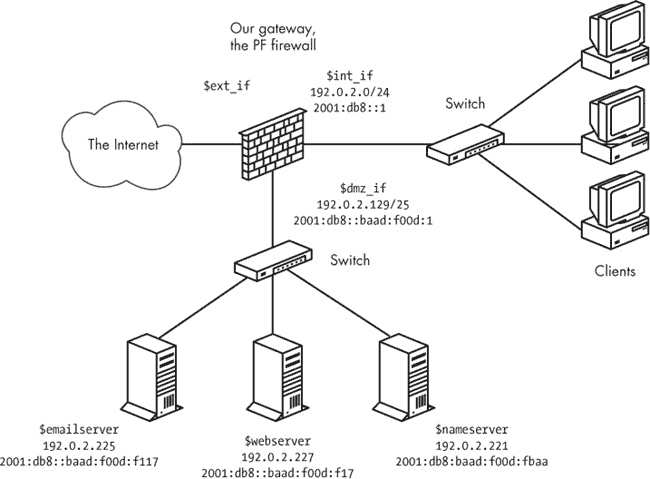

## 第七章 使用队列和优先级进行流量整形


在本章中，我们将探讨如何使用流量整形来高效地分配带宽资源，并根据特定策略进行调整。如果“流量整形”这个术语对你来说有些陌生，请放心，它的意思正如你所理解的那样：你将修改网络分配资源的方式，以满足用户及其应用程序的需求。通过正确理解你的网络流量以及产生这些流量的应用程序和用户，你实际上可以通过优化网络来实现“更大、更好、更快、更强”的目标，尽管只针对网络中实际需要传输的流量进行优化。

有一套小巧而强大的流量整形工具可供你使用；所有这些工具通过在你的网络设置中引入非默认行为来调整网络现实，以符合你的需求。针对 PF 上下文的流量整形目前有两种方式：一种是曾经实验性的*ALTQ*（*alternate queuing*，即“替代队列”）框架，经过约 15 年的使用后，现在被视为旧式方法；另一种是 OpenBSD 5.5 引入的较新的 OpenBSD *优先级和队列*系统。

本章的第一部分通过观察新的 OpenBSD 优先级和队列系统的特点来介绍流量整形。如果你准备在 OpenBSD 5.5 或更高版本上进行设置，可以直接进入下一部分，始终开启的优先级和队列用于流量整形。在这一部分，我们将介绍流量整形的主要概念，并通过示例进行说明。

在 OpenBSD 5.4 及更早版本，以及其他一些 BSD 系统中，PF 代码尚未与 OpenBSD 5.5 保持同步，因此流量整形由 ALTQ 系统负责。在 OpenBSD 中，ALTQ 在经过一次过渡发布后被移除，从 OpenBSD 5.6 开始，只有较新的流量整形系统得以保留。如果你有兴趣将现有的 ALTQ 设置迁移到新系统，你可能会发现从 ALTQ 到优先级和队列的过渡部分很有用；这一节重点介绍了旧版 ALTQ 系统与新系统之间的差异。

如果你正在使用一个尚未支持 OpenBSD 5.5 引入的队列系统的操作系统，你需要研究 ALTQ 流量整形子系统，相关内容可参见使用 ALTQ 引导流量。如果你正在学习流量整形的概念并希望将其应用于 ALTQ 设置，请在深入 ALTQ 特定配置细节之前阅读本章的第一部分。

## 始终开启的优先级和队列用于流量整形

管理带宽与平衡支票簿或处理其他有限资源有很多相似之处。这些资源持续供应，且有严格的上限，你需要根据*政策*或*规格*中设定的*优先级*，以最大*效率*分配资源。

OpenBSD 5.5 及更新版本通过 PF 规则集中的分类机制提供了几种不同的带宽资源管理选项。我们将首先看看如何仅使用*流量优先级*来管理流量，然后再讨论如何通过为你的流量分配定义的子集到*队列*来细分带宽资源。

### 注意

*始终启用的优先级是作为 OpenBSD 5.0 中的一种预告功能引入的。经过几年的开发和测试，新的队列系统最终在 OpenBSD 5.5 中正式提交，并于 2014 年 5 月 1 日发布。如果你从 OpenBSD 5.5 或更新版本开始流量整形，或者打算这么做，本节是一个合适的起点。如果你从早期版本的 OpenBSD 升级或从其他 ALTQ 系统迁移到最新版本的 OpenBSD，你很可能会发现接下来的部分，从 ALTQ 到优先级和队列的过渡，非常有用。*

### 通过设置流量优先级进行整形

如果你主要是希望将某些类型的流量推到其他流量之前，你可以通过简单地设置优先级来实现：为一些项目分配更高的优先级，使它们在其他流量之前获得处理。

#### prio 优先级方案

从 OpenBSD 5.0 开始，可以基于每条规则对网络流量进行分类的优先级方案。优先级范围从 0 到 7，其中 0 为最低优先级。被分配优先级 7 的项目会优先于其他所有流量，默认值 3 会自动分配给大多数类型的流量。该优先级方案通常称为`prio`，在 PF 语法关键字之后最常见，你可以通过`match`或`pass`规则设置优先级来调整你的流量。

例如，为了最大化你的出站 SSH 流量，你可以在配置中添加如下规则：

```
pass proto tcp to port ssh set prio 7
```

然后你的 SSH 流量将优先处理。

然后你可以检查其余的规则集，决定哪些流量更重要，哪些流量你希望始终能够到达目的地，哪些部分流量你认为不那么重要。

为了将 Web 流量推到所有流量之前，并提升网络时间和名称服务的优先级，你可以在配置中添加类似这样的规则：

```
pass proto tcp to port { www https } set prio 7
pass proto { udp tcp } to port { domain ntp } set prio 6
```

或者，如果你已经有一个包含符合除端口以外其他标准的规则集，你可以通过将优先级流量整形写成`match`规则来实现类似的效果：

```
match proto tcp to port { www https } set prio 7
match proto { udp tcp } to port { domain ntp } set prio 6
```

在某些网络中，时间敏感型流量，如语音网络协议（VoIP），可能需要特殊处理。对于 VoIP，像这样的优先级设置可能改善电话通话质量：

```
voip_ports="{ 2027 4569 5036 5060 10000:20000 }"
match proto udp to port $voip_ports set prio 7
```

但请检查你的 VoIP 应用程序的文档，了解它使用的具体端口。无论如何，像这样的`match`规则不仅能对你的配置产生积极影响：你可以像这里的例子那样使用`match`规则，将过滤决策——如通过、阻塞或重定向——与流量整形决策分开，并通过这种分离，你很可能会得到一个更易读和易维护的配置。

同样值得注意的是，OpenBSD 网络栈的某些部分为开发者认为对网络功能至关重要的特定类型流量设置了默认优先级。如果你没有设置任何优先级，那么任何带有`proto carp`和其他一些管理协议及数据包类型的流量将按照优先级 6 处理，而所有没有通过`set prio`规则获得具体分类的流量，将有一个默认优先级 3。

#### 双优先级加速技巧

在刚才展示的例子中，我们为不同类型的流量设置了不同的优先级，并成功地使特定类型的流量（如 VoIP 和 SSH）比其他流量更快地传输。但得益于 TCP 的设计，尽管它承载了大部分流量，即使是一个简单的优先级整形方案，通过对规则集进行少量调整，也能提供更多的优化空间。

正如 RFC 的读者和一些实践者所发现的那样，TCP 的面向连接设计意味着，对于每个发送的数据包，发送方都期望在预设的时间内或在定义的“窗口”序列号范围内收到一个确认（ACK）数据包。如果发送方在预期的限制时间内没有收到确认，它会假设数据包在传输过程中丢失，并安排重新发送数据。

另一个需要考虑的重要因素是，默认情况下，数据包按到达的顺序处理。这被称为*先进先出（FIFO）*，这意味着基本没有数据的 ACK 数据包会在较大的数据包之间等待它们的顺序。在繁忙或拥塞的链路上，这正是流量整形变得有趣的地方，等待 ACK 并执行重传会明显消耗有效带宽，减慢所有传输的速度。事实上，双向并发传输可能会相互显著减慢，超过它们预计数据大小的值。^([39])

幸运的是，这个问题有一个简单且相当流行的解决方案：你可以使用优先级确保那些较小的数据包提前通过。如果你在`match`或`pass`规则中分配两个优先级，例如这样：

```
match out on egress set prio (5, 6)
```

第一优先级将分配给常规流量，而 ACK 数据包和其他低延迟类型的服务（ToS）数据包将分配第二优先级，并将比常规数据包更快地处理。

当一个数据包到达时，PF 会检测 ACK 数据包并将其放入更高优先级的队列。PF 还会检查到达数据包的 ToS 字段。那些设置为低延迟的 ToS（表示发送方希望更快速地传输数据）的数据包也会获得更高优先级的处理。当多个优先级被指示时，如前面的规则所示，PF 会相应地分配优先级。其他 ToS 值的数据包将按到达顺序处理，但由于 ACK 数据包更快到达，发送方将花更少的时间等待 ACK 并重新发送假定丢失的数据。最终结果是可用带宽得到了更高效的利用。（这里引用的 `match` 规则是我写的第一条规则，用来熟悉新的 `prio` 功能——当然是在测试系统上——这个功能是在 OpenBSD 5.0 开发周期中提交的。如果你将这条 `match` 规则放到现有的规则集上，你可能会看到链接能够承载更多的流量和更多的并发连接，直到出现明显的拥塞症状。）

在你将两级优先级技巧引入流量整形之前，看看你是否能找到一种方法来测量引入前后的流量情况，并记录下差异，再继续进行更复杂的流量整形选项。

### 引入带宽分配队列

我们已经看到，仅使用优先级的流量整形可以非常有效，但也会有一些情况，单纯依赖优先级的方案无法达到你的目标。一个这样的场景是，当你面临一些需求时，最有用的解决方案是为某些类型的流量分配更高的优先级，也许还需要更大的带宽份额，例如电子邮件和其他高价值的服务，同时对其他类型的流量分配较少的带宽。另一个这样的场景是，当你只是想将可用的带宽分配给不同大小的块以供特定服务使用，可能还需要为某些类型的流量设置硬性的上限，同时确保你关心的所有流量至少能获得其公平的带宽份额。在这种情况下，你将放弃纯优先级方案，至少不会把它作为主要工具，而是开始使用*队列*进行实际的流量整形。

与优先级级别不同，优先级级别是始终可用的，可以在任何规则中使用而无需进一步准备，而队列代表你可用带宽的特定部分，只有在你根据可用容量定义它们之后，才可以在规则中使用。队列是网络数据包的缓冲区。队列被定义为具有特定带宽量，或作为可用带宽的特定部分，你可以将每个队列带宽份额的一部分分配给子队列，或将队列嵌套在其他队列中，共享父队列的资源。数据包会被保存在队列中，直到它们根据队列的标准被丢弃或发送，并受到队列可用带宽的限制。队列附加到特定接口，带宽是按接口管理的，每个接口的可用带宽会细分到你定义的队列中。

定义队列的基本语法遵循以下模式：

```
queue *name* on *interface* bandwidth *number [ ,K,M,G]*
     queue *name1* parent *name* bandwidth *number[ ,K,M,G]* default
     queue *name2* parent *name* bandwidth *number[ ,K,M,G]*
     queue *name3* parent *name* bandwidth *number[ ,K,M,G]*
```

带宽数字后面的字母表示测量单位：*`K`*表示千比特；*`M`*表示兆比特；*`G`*表示千兆比特。当你只写带宽数字时，它会被解释为每秒比特数。你还可以在这个基本语法上添加其他选项，正如我们在后面的示例中将看到的。

### 注意

*子队列定义会命名它们的父队列，并且必须有一个队列作为默认队列，用于接收任何未特别分配到其他队列的流量。*

一旦队列定义完成，你可以通过重写`pass`或`match`规则，将流量分配到特定的队列中，从而将流量整形集成到规则集中。

你的总可用带宽是多少？

一旦我们开始处理总带宽的定义部分，而不是依靠某种方式共享整个带宽的优先级，确定你总可用带宽的准确值就变得非常有趣。确定特定接口的实际可用带宽用于队列可能比较困难。如果你没有指定总带宽，那么将使用可用的总带宽来计算分配值，但某些类型的接口无法可靠地报告实际带宽值。一个常见的例子是，如果你的网关的外部接口是一个 100 兆比特（Mb）以太网接口，并连接到一条仅提供 8Mb 下载和 1Mb 上传速度的 DSL 线路。^([40]) 这个以太网接口将自信地报告 100Mb 带宽，而不是面向互联网连接的实际值。

因此，通常最好将总带宽设置为一个固定值。不幸的是，使用的值可能与带宽供应商告诉你的可用带宽值不完全相同，因为各种技术和实现总会有一些开销。例如，在典型的 TCP/IP 有线以太网中，开销可以低至个位数的百分比，但在 ATM 上的 TCP/IP，开销已经接近 20%。如果你的带宽供应商没有提供开销信息，你需要对起始值做一个合理的猜测。无论如何，请记住，总带宽永远不会大于网络路径中最弱链路的带宽。

队列仅支持相对于执行队列操作的系统的出站连接。在规划带宽管理时，考虑到实际可用带宽应该等于连接路径中最弱（带宽最小）的链路，即使你的队列设置在不同的接口上。

#### HFSC 算法

在 OpenBSD 5.5 及以后版本中，任何你定义的队列系统的基础都是 *分层公平服务曲线（HFSC）* 算法。HFSC 的设计目的是在一个层级结构中公平地分配资源。它的一个有趣特性是，直到某部分流量接近预设限制时，它才开始整形流量。该算法会在流量接近剥夺其他队列的最小保证份额的点之前开始整形。

### 注意

*我们在本书中展示的所有示例配置都将流量分配到出站队列中，因为你只能现实地控制本地生成的流量，并且一旦达到限制，任何流量整形系统最终都会通过丢包来迫使端点回退。正如我们在前面的示例中看到的，所有表现良好的 TCP 堆栈会通过较慢的包速率响应丢失的 ACK。*

现在你至少了解了 OpenBSD 队列系统背后的基本理论，让我们来看看队列是如何工作的。

#### 将带宽分成固定大小的块

你会经常发现某些流量应该比其他流量具有更高的优先级。例如，你可能希望重要的流量，如邮件和其他关键服务，始终保持一定的带宽，而其他服务，如点对点文件共享，则不应允许消耗超过某个量的带宽。为了解决这些问题，队列提供了比纯优先级方案更广泛的选择。

第一个队列示例基于前面章节中的规则集。场景是我们有一个小型本地网络，我们希望让本地网络的用户连接到一个预定义的外部服务集，同时也允许外部网络的用户访问本地网络上的 Web 服务器和 FTP 服务器。

#### 队列定义

在以下示例中，所有队列都设置在根队列上，根队列叫做`main`，并且位于面向外部、连接互联网的接口上。这个方法主要是因为外部链路的带宽比本地网络更容易受到限制。然而，原则上，分配队列并进行流量整形可以在任何网络接口上进行。

这个设置包括一个总带宽为 20Mb 的队列，并且有六个子队列。

```
queue main on $ext_if bandwidth 20M
      queue defq parent main bandwidth 3600K default
      queue ftp parent main bandwidth 2000K
      queue udp parent main bandwidth 6000K
      queue web parent main bandwidth 4000K
      queue ssh parent main bandwidth 4000K
        queue ssh_interactive parent ssh bandwidth 800K
        queue ssh_bulk parent ssh bandwidth 3200K
queue icmp parent main bandwidth 400K
```

前面示例中显示的子队列`defq`具有 3600K 的带宽分配，即占总带宽的 18%，并被指定为默认队列。这意味着任何匹配`pass`规则但没有明确分配到其他队列的流量都会进入此队列。

其他队列大致遵循相同的模式，直到子队列`ssh`，它本身有两个子队列（下方的两个缩进行）。在这里，我们看到了使用两个不同优先级加速 ACK 包的技巧的变化，正如我们稍后会看到的，分配流量到这两个 SSH 子队列的规则分配了不同的优先级。大容量 SSH 传输，通常是 SCP 文件传输，使用指示吞吐量的 ToS，而交互式 SSH 流量则设置为低延迟的 ToS 标志，并且会优先于大容量传输。交互式流量可能消耗的带宽较少，因此获得较小的带宽份额，但由于它被分配了更高的优先级，因此得到优先处理。这个方案还帮助了 SCP 文件传输的速度，因为 SCP 传输的 ACK 包将被分配更高的优先级。

最后，我们有`icmp`队列，它为剩余的 400K 带宽（即 2%的带宽）保留。这确保了我们希望传递的 ICMP 流量能够获得最小的带宽保证，即使它不符合分配到其他队列的标准。

#### 规则集

为了将队列与规则集绑定，我们使用`pass`规则来指示哪些流量被分配到哪些队列及其相应标准。

```
set skip on { lo, $int_if }
pass log quick on $ext_if proto tcp to port ssh \
    queue (ssh_bulk, ssh_interactive) set prio (5,7)
pass in quick on $ext_if proto tcp to port ftp queue ftp
pass in quick on $ext_if proto tcp to port www queue http
pass out on $ext_if proto udp queue udp
pass out on $ext_if proto icmp queue icmp
pass out on $ext_if proto tcp from $localnet to port $client_out ➊
```

`ssh`、`ftp`、`www`、`udp`和`icmp`的规则将流量分配到它们各自的队列，并且我们再次注意到，`ssh`队列的子队列分配了两种不同的优先级的流量。最后的兜底规则➊将所有其他来自本地网络的外发流量通过，并将其放入默认的`defq`队列。

你也可以让一组`match`规则来执行队列分配，从而使配置更加灵活。有了匹配规则，你可以将过滤决策移到其他地方的规则集来进行阻塞、通过，甚至重定向。

```
match log quick on $ext_if proto tcp to port ssh \
    queue (ssh_bulk, ssh_interactive) set prio (5,7)
match in quick on $ext_if proto tcp to port ftp queue ftp
match in quick on $ext_if proto tcp to port www queue http
match out on $ext_if proto udp queue udp
match out on $ext_if proto icmp queue icmp
```

请注意，使用`match`规则进行队列分配时，无需一个最终的兜底规则将不匹配其他规则的流量放入默认队列。任何不匹配这些规则并且允许通过的流量都会进入默认队列。

#### 上限和下限与突发流量

固定带宽分配是不错的选择，但对于那些有流量整形需求的网络管理员来说，在初步尝试后，他们往往希望有更多的灵活性。假如有一个带宽分配机制，既能提供每个队列的带宽下限和上限保证，又能随时间变化进行灵活分配，并且只有在真正需要时才开始进行流量整形，那该有多好呢？

好消息是，OpenBSD 队列正好能够做到这一点，得益于我们之前讨论过的 HFSC 算法。HFSC 使得可以设置带有保证的最小分配和硬性上限的排队机制，甚至可以设置包含`burst`值的分配，让可用容量随时间变化。

#### 队列定义

从我们在前几章中逐步修改的典型网关配置出发，我们在*pf.conf*文件的开头插入这个队列定义：

```
queue rootq on $ext_if bandwidth 20M
        queue main parent rootq bandwidth 20479K min 1M max 20479K qlimit 100
             queue qdef parent main bandwidth 9600K min 6000K max 18M default
             queue qweb parent main bandwidth 9600K min 6000K max 18M
             queue qpri parent main bandwidth 700K min 100K max 1200K
             queue qdns parent main bandwidth 200K min 12K burst 600K for 3000ms
        queue spamd parent rootq bandwidth 1K min 0K max 1K qlimit 300
```

这个定义与引入带宽分配队列中的定义有一些显著不同。我们从这个相对较小的层次结构开始，将顶层队列`rootq`分成两个。接下来，我们将`main`队列细分成几个子队列，所有子队列都有一个设置了的`min`值——即分配给队列的最小带宽保证。（`max`值会设置队列分配的硬上限。）`bandwidth`参数还设置了当队列出现积压时可用的带宽分配——即当队列开始消耗其`qlimit`（*队列限制*）分配时。

队列限制参数的工作原理如下：在发生拥塞时，每个队列默认有一个 50 个槽位的池（即队列限制），用来保存那些无法立即传输的数据包。在这里，顶层队列`main`和`spamd`都通过它们的`qlimit`设置，分别设定了大于默认值的池：`main`为 100，`spamd`为 300。增大这些`qlimit`值意味着我们在流量接近设置的限制时丢包的可能性较小，但也意味着当流量整形启动时，我们会看到进入这些较大池中的连接的延迟增加。

#### 规则集

下一步是将新创建的队列与规则集关联起来。如果你已经有了过滤机制，那么关联就很简单——只需要添加几条`match`规则：

```
match out on $ext_if proto tcp to port { www https } \
    set queue (qweb, qpri) set prio (5,6)
match out on $ext_if proto { tcp udp } to port domain \
    set queue (qdns, qpri) set prio (6,7)
match out on $ext_if proto icmp \
    set queue (qdns, qpri) set prio (6,7)
```

在这里，`match`规则再次通过高优先级和低优先级队列分配来加速 ACK 包，就像我们在基于纯优先级的系统中看到的那样。唯一的例外是当我们将流量分配到最低优先级队列时（对现有的`pass`规则稍作修改），此时我们确实不希望加速。

```
pass in log on egress proto tcp to port smtp \
    rdr-to 127.0.0.1 port spamd set queue spamd set prio 0
```

将`spamd`流量分配到一个最小大小的队列，并将其优先级设置为 0，目的是在垃圾邮件发送者到达我们的`spamd`之前减缓他们的速度。（有关`spamd`及相关问题的更多信息，请参见第六章。）

在队列分配和优先级设置到位之后，应该能清楚地看到，队列层次结构使用了两种熟悉的技巧来高效利用可用带宽。首先，它使用了一种高优先级和低优先级混合的变种，这种方法在之前的纯优先级示例中已经展示过。其次，我们通过为名称服务查找分配一个小而有保证的带宽部分，来加速几乎所有其他流量，特别是 Web 流量。对于`qdns`队列，我们设置了带有时间限制的`burst`值：在`3000`毫秒后，分配将降低到最小值`12K`，以适应总`200K`配额。像这样的短时`burst`值对于加速在早期阶段传输大部分负载的连接非常有用。

从这个示例中可能不太明显，但 HFSC 要求流量只能分配给*叶子队列*，即没有子队列的队列。这意味着，可以将流量分配给`main`的子队列——`qpri`、`qdef`、`qweb`和`qdns`——以及`rootq`的子队列——`spamd`——正如我们刚才通过`match`和`pass`规则所做的那样，但不能直接分配给`rootq`或`main`本身。所有队列分配到位后，我们可以使用`systat`队列命令来显示队列及其流量：

```
    6 users Load 0.31 0.28 0.34                   Tue May 19 21:31:54 2015

QUEUE            BW SCH  PR PKTS BYTES DROP_P DROP_B QLEN BORR SUSP P/S B/S
rootq           20M            0     0      0      0    0
main            20M            0     0      0      0    0
 qdef            9M        48887   15M      0      0    0
 qweb            9M        18553 8135K      0      0    0
 qpri          600K        37549 2407K      0      0    0
 qdns          200K        15716 1568K      0      0    0
spamd            1K        10590 661K     126   8772   47
```

队列以缩进方式显示，表示它们的层级结构，从根队列到叶子队列。`main`队列及其子队列——`qpri`、`qdef`、`qweb`和`qdns`——显示了它们的带宽分配以及通过的字节和包数量。如果在此阶段我们被迫丢包，`DROP_P`和`DROP_B`列会显示丢弃的包和字节数。`QLEN`表示等待处理的包数量，而最后两列显示每秒包和字节的实时更新。

要查看更详细的视图，请使用`pfctl -vvsq`显示队列及其流量：

```
queue rootq on xl0 bandwidth 20M qlimit 50
  [ pkts:          0  bytes:          0  dropped pkts:      0 bytes:      0 ]
  [ qlength:   0/ 50 ]
  [ measured:     0.0 packets/s, 0 b/s ]
queue main parent rootq on xl0 bandwidth 20M, min 1M, max 20M qlimit 100
  [ pkts:          0  bytes:          0  dropped pkts:      0 bytes:      0 ]
  [ qlength:   0/100 ]
  [ measured:     0.0 packets/s, 0 b/s ]
queue qdef parent main on xl0 bandwidth 9M, min 6M, max 18M default qlimit 50
  [ pkts:       1051  bytes:     302813  dropped pkts:      0 bytes:      0 ]
  [ qlength:   0/ 50 ]
  [ measured:   2.6 packets/s, 5.64Kb/s ]
queue qweb parent main on xl0 bandwidth 9M, min 6M, max 18M qlimit 50
  [ pkts:       1937  bytes:    1214950  dropped pkts:      0 bytes:      0 ]
  [ qlength:   0/ 50 ]
  [ measured:     3.6 packets/s, 13.65Kb/s ]
queue qpri parent main on xl0 bandwidth 600K, max 1M qlimit 50
  [ pkts:       2169  bytes:     143302  dropped pkts:      0 bytes:      0 ]
  [ qlength:   0/ 50 ]
  [ measured:     6.6 packets/s, 3.55Kb/s ]
queue qdns parent main on xl0 bandwidth 200K, min 12K burst 600K for 3000ms qlimit 50
  [ pkts:        604 bytes:       65091  dropped pkts:      0 bytes:      0 ]
  [ qlength:    0/ 50 ]
  [ measured:      1.6 packets/s, 1.31Kb/s ]
queue spamd parent rootq on xl0 bandwidth 1K, max 1K qlimit 300
  [ pkts:        884 bytes:       57388  dropped pkts:      0 bytes: 0 ]
  [ qlength: 176/300 ]
  [ measured:     1.9 packets/s, 1Kb/s ]
```

这个视图显示了队列接收流量的情况，基本与站点的典型工作负载一致。请注意，在规则集重新加载后不久，`spamd`队列就已经接近其`qlimit`设置的一半，似乎表明队列的维度设置与实际流量相符。

### 注意

*请注意每个队列的丢包计数器（`dropped pkts:`）。如果丢包数量较高或持续增加，那么可能意味着需要调整某个带宽分配参数，或者需要调查其他网络问题。*

#### DMZ 网络，现在启用了流量整形

在第五章中，我们设置了一个拥有单一网关的网络，并将所有外部可见的服务配置在一个独立的 DMZ（非军事区）网络中，以便从互联网和内部网络到服务器的所有流量都必须通过该网关。该网络示意图在第五章中已展示，这里在图 7-1 中再次展示。以第五章中的规则集为起点，我们将添加一些队列，以优化我们的网络资源。网络的物理和逻辑布局不会改变。

图 7-1. 带有 DMZ 的网络

该网络最可能的瓶颈是网关外部接口与互联网之间的带宽。尽管我们设置中的其他地方的带宽当然不是无限的，但本地网络上任何接口的可用带宽通常会比与外部世界通信的实际带宽更不受限制。为了使服务以最佳性能可用，我们需要设置队列，以便站点上可用的带宽能够分配给我们希望允许的流量。DMZ 接口上的接口带宽可能是 100Mb 或 1Gb，而*实际可用带宽*则大大小于从本地网络外部连接的带宽。这一考虑体现在我们的队列定义中，其中，外部流量的实际带宽可用性是队列设置中的主要限制因素。

```
queue ext on $ext_if bandwidth 2M
        queue ext_main parent ext bandwidth 500K default
        queue ext_web parent ext bandwidth 500K
        queue ext_udp parent ext bandwidth 400K
        queue ext_mail parent ext bandwidth 600K

queue dmz on $dmz_if bandwidth 100M
        queue ext_dmz parent dmz bandwidth 2M
                queue ext_dmz_web parent ext_dmz bandwidth 800K default
                queue ext_dmz_udp parent ext_dmz bandwidth 200K
                queue ext_dmz_mail parent ext_dmz bandwidth 1M
        queue dmz_main parent dmz bandwidth 25M
        queue dmz_web parent dmz bandwidth 25M
        queue dmz_udp parent dmz bandwidth 20M
        queue dmz_mail parent dmz bandwidth 20M
```

注意，对于每个接口，都有一个根队列，其带宽限制决定了分配给该接口所有队列的带宽。为了使用新的队列基础设施，我们还需要对过滤规则进行一些修改。

### 注

*由于任何未明确分配到特定队列的流量都会被分配到接口的默认队列，因此务必根据网络中的实际流量调整过滤规则和队列定义。*

添加队列后，过滤规则的主要部分可能如下所示：

```
pass in on $ext_if proto { tcp, udp } to $nameservers port domain \
    set queue ext_udp set prio (6,5)
pass in on $int_if proto { tcp, udp } from $localnet to $nameservers \
    port domain
pass out on $dmz_if proto { tcp, udp } to $nameservers port domain \
    set queue ext_dmz_udp set prio (6,5)
pass out on $dmz_if proto { tcp, udp } from $localnet to $nameservers \
    port domain set queue dmz_udp
pass in on $ext_if proto tcp to $webserver port $webports set queue ext_web
pass in on $int_if proto tcp from $localnet to $webserver port $webports
pass out on $dmz_if proto tcp to $webserver port $webports \
    set queue ext_dmz_web
pass out on $dmz_if proto tcp from $localnet to $webserver port $webports \
    set queue dmz_web
pass in log on $ext_if proto tcp to $mailserver port smtp
pass in log on $ext_if proto tcp from $localnet to $mailserver port smtp
pass in log on $int_if proto tcp from $localnet to $mailserver port $email
pass out log on $dmz_if proto tcp to $mailserver port smtp set queue ext_mail
pass in on $dmz_if proto tcp from $mailserver to port smtp set queue dmz_mail
pass out log on $ext_if proto tcp from $mailserver to port smtp \
    set queue ext_dmz_mail
```

注意，只有通过 DMZ 或外部接口的流量才会被分配到队列。在这种配置下，如果内部网络没有外部可访问的服务，那么在内部接口上进行队列管理就没有太大意义，因为那可能是带宽限制最少的网络部分。此外，正如之前的示例所示，可以通过将`match`规则块专门用于队列分配，从而将队列分配与规则集的过滤部分分开。

### 使用队列处理不需要的流量

到目前为止，我们专注于队列化作为确保特定类型流量高效通过的一种方式。现在，我们将查看两个示例，它们展示了一种稍微不同的方法，使用各种与队列相关的技巧来识别和处理不需要的流量，以确保不法分子被控制。

#### 超载到一个小队列

在《抵御暴力攻击》中，我们使用了状态跟踪选项和`overload`规则的组合，将特定地址填充到一个特殊处理的表格中。我们在第六章中演示的特殊处理方法是切断所有连接，但同样也可以将`overload`流量分配到特定队列。例如，考虑下面这个我们第一个队列示例中的规则。

```
pass log quick on $ext_if proto tcp to port ssh flags S/SA \
    keep state queue (ssh_bulk, ssh_interactive) set prio (5,7)
```

要创建第六章中超载表格技巧的变种，可以添加状态跟踪选项，像这样：

```
pass log quick on $ext_if proto tcp to port ssh flags S/SA \
    keep state (max-src-conn 15, max-src-conn-rate 5/3, \
    overload <bruteforce> flush global) queue (ssh_bulk, ssh_interactive) \
    set prio (5,7)
```

然后，将其中一个队列略微缩小：

```
queue smallpipe parent main bandwidth 512
```

并通过这个规则将不法分子的流量分配到小带宽队列：

```
pass inet proto tcp from <bruteforce> to port $tcp_services queue smallpipe
```

结果是，来自暴力破解者的流量将被通过，但每秒传输速率有一个严格的上限为 512 比特。（值得注意的是，由于网络栈的计时器精度问题，可能很难在高速链接上强制执行小带宽分配。如果分配的带宽相对于链路容量过小，超出每秒最大分配的包可能仍然会被传输，直到带宽限制生效。）此外，像这样的规则可能还需要补充表项过期设置，如在使用 pfctl 整理表格中所描述的那样。

#### 基于操作系统指纹的队列分配

第六章介绍了几种使用`spamd`减少垃圾邮件的方法。如果在你的环境中无法运行`spamd`，你可以基于以下知识使用队列和规则集：发送垃圾邮件的机器很可能运行某个特定的操作系统。（我们将这个操作系统称为 Windows。）

PF 具有一个相当可靠的操作系统指纹识别机制，可以根据连接建立时初始 SYN 数据包的特征来检测网络连接另一端的操作系统。如果你已经确定从运行该特定操作系统的系统中不太可能传送合法邮件，那么以下内容可以作为`spamd`的简单替代方案。

```
pass quick proto tcp from any os "Windows" to $ext_if \
    port smtp set queue smallpipe
```

在这里，来自运行特定操作系统的主机的电子邮件流量不会超过你带宽的 512 比特每秒。

## 从 ALTQ 过渡到优先级和队列

如果你已经有使用 ALTQ 进行流量整形的配置，并计划切换到 OpenBSD 5.5 或更新版本，本节内容将提供一些如何管理过渡的提示。主要要点如下：

***过渡后的规则可能更简单。*** OpenBSD 5.5 及更新版本的流量整形系统已经摒弃了之前较为复杂的 ALTQ 语法和其队列算法的选择，且明确区分了队列和纯优先级的排序。在大多数情况下，转换为新流量整形系统后，你的配置将变得更具可读性和可维护性。

***对于简单的配置，`set prio` 已经足够。*** ALTQ 中最简单的队列纪律是 `priq`，即优先级队列。最常见的简单用例是丹尼尔·哈特迈耶在前述文章中首次展示的两优先级加速技巧。基本的两优先级配置如下所示：

```
ext_if="kue0"

altq on $ext_if priq bandwidth 100Kb queue { q_pri, q_def }
      queue q_pri priority 7
      queue q_def priority 1 priq(default)

pass out on $ext_if proto tcp from $ext_if queue (q_def, q_pri)
pass in on $ext_if proto tcp to $ext_if queue (q_def, q_pri)
```

在 OpenBSD 5.5 及更新版本中，可以通过不定义队列来实现相同的效果。相反，你只需在 `match` 或 `pass` 规则中指定两个优先级，如下所示：

```
match out on egress set prio (5, 6)
```

在这里，第一个优先级将分配给常规流量，而 ACK 和其他具有低延迟 ToS 的数据包将分配第二个优先级，并比常规数据包更快地得到处理。其效果与我们刚刚引用的 ALTQ 示例相同，唯一的不同是定义了带宽限制和流量整形对入站流量的某些可疑影响。

***大部分情况下，优先级队列可以被 `set prio` 构造所替代。*** 对于纯优先级的区分，按 `pass` 或 `match` 规则应用 `set prio` 比定义队列并分配流量要简单，并且只影响数据包的优先级。ALTQ 允许你定义 CBQ 或 HFSC 队列，并且队列定义中包含优先级值。在新的队列系统下，优先级的分配仅发生在 `match` 或 `pass` 规则中，但如果你的应用需要在同一规则中同时设置优先级和队列分配，新的语法也允许这样做：

```
pass log quick on $ext_if proto tcp to port ssh \
      queue (ssh_bulk, ssh_interactive) set prio (5,7)
```

这种效果与之前在将带宽分割成固定大小的块中展示的行为类似，这种变体在过渡期间可能特别有帮助。

***优先级现在始终很重要。请记住，默认值是 3。*** 需要注意的是，从 OpenBSD 5.0 开始，流量优先级始终是启用的，即使你没有主动分配优先级，也需要考虑优先级。在使用两级优先级技巧来加速 ACK 和所有流量的旧式配置中，唯一重要的是有两个不同的优先级。低延迟的数据包会被分配到高优先级队列中，最终的效果是流量可能通过得更快，带宽使用比默认的 FIFO 队列更有效。现在默认优先级是 3，并且如果将队列的优先级设置为 0（如一些旧示例所做的），那么只有在没有更高优先级的流量需要处理时，分配到该优先级的流量才会被视为准备通过。

***对于实际的带宽塑形，HFSC 在幕后工作。*** 一旦你确定你的规格要求将可用带宽分割成多个块，底层算法始终是 HFSC。不同类型队列的语法已经不再使用。HFSC 被选中是因为它的灵活性，以及它只有在流量接近你队列配置设置的某个限制时，才会主动开始塑形流量。此外，限制队列定义为仅包含带宽声明的配置，可以实现类似 CBQ 的配置。将你的带宽划分为固定大小的块（前文提到）展示了一种静态配置，作为 HFSC 的子集实现 CBQ。

***你可以通过旧队列机制从 ALTQ 过渡。*** OpenBSD 5.5 支持传统的 ALTQ 配置，仅需要对配置进行一次小改动：`queue`关键字作为新队列系统的保留字，因此 ALTQ 队列需要声明为`oldqueue`。只要做出这个更改（这实际上是一个纯粹的搜索替换操作，甚至可以在操作系统升级前执行），配置就会按预期工作。

***如果你的设置足够复杂，请返回规格并重新实现。*** 本章中的示例有些风格化且相对简单。如果你有经过多次增量建设的现有配置，并且已经达到比这里描述的复杂度大几个数量级的水平，新语法可能提供了一个机会，帮助你定义你的设置用途，并创建一个更清晰、更易维护的配置规范进行重新实现。

采用 `oldqueue` 路线并从那里进行调整会在一定程度上有效，但通过在测试环境中根据修订后的规范进行干净的重新实现可能更容易过渡，在这个环境中你可以测试你的假设是否在新的流量整形系统背景下成立。无论你选择哪种过渡方式，切换到 OpenBSD 5.5 或更高版本后，你几乎可以确定最终会得到一个更加易读和可维护的配置。

## 使用 ALTQ 定向流量

*ALTQ* 是一个非常灵活的旧有机制，用于网络流量整形，它在 OpenBSD^([41]) 3.3 版本时被 Henning Brauer 集成到 PF 中，他也是 OpenBSD 5.5 引入的优先级和队列系统（在本章前面的部分已描述）的主要开发者。从 OpenBSD 3.3 开始，所有 ALTQ 配置都被移入 *pf.conf*，以便于流量整形和过滤的集成。PF 移植到其他 BSD 系统时，快速地采用了至少一些可选的 ALTQ 集成功能。

### 注意

*OpenBSD 5.5 引入了一个全新的队列系统，用于流量整形，语法与之前有着根本性的不同（而且更易读），它补充了在 OpenBSD 5.0 中引入的始终开启的优先级系统。这个新系统旨在经过一次过渡发布后完全取代 ALTQ。本章的其余部分只有在你有兴趣学习如何设置或维护基于 ALTQ 的系统时才有用。*

### 基本的 ALTQ 概念

正如其名，ALTQ 配置完全以队列为中心。与更新后的流量整形系统一样，ALTQ 队列是通过带宽来定义的，并附加到接口上。队列可以分配优先级，在某些情况下，它们可以有子队列，子队列可以接收父队列带宽的一部分。

ALTQ 队列的一般语法如下：

```
altq on *interface type* [options ... ] *main_queue* { *sub_q1*, *sub_q2* ..}
  queue *sub_q1* [ options ... ]
  queue *sub_q2* [ options ... ] { *subA*, *subB*, ... }
[...] 
pass [ ... ] queue *sub_q1* 
pass [ ... ] queue *sub_q2*
```

### 注意

*在 OpenBSD 5.5 及更新版本中，由于与新队列子系统之间无法解决的语法冲突，ALTQ 队列用 `oldqueue` 代替了 `queue`。*

一旦队列定义就位，你可以通过重写 `pass` 或 `match` 规则，将流量分配到特定队列，从而将流量整形集成到你的规则集中。任何未显式分配到特定队列的流量都会与其他所有流量一起放入默认队列。

### 队列调度器，也称为队列纪律

在默认的网络配置中，如果没有队列设置，TCP/IP 栈及其过滤子系统会按照 FIFO 纪律处理数据包。

ALTQ 提供了三种队列调度算法，或称为 *纪律*，它们可以稍微改变这个行为。类型有 `priq`、`cbq` 和 `hfsc`。其中，`cbq` 和 `hfsc` 队列可以有多个子队列。`priq` 队列本质上是扁平的，只有一个队列级别。每种纪律都有其独特的语法规则，我们将在接下来的部分中介绍这些规则。

#### priq

*基于优先级的队列*完全根据总带宽中声明的优先级来定义。对于`priq`队列，允许的优先级范围是 0 到 15，其中较高的值会获得优先处理。符合较高优先级队列标准的数据包会在符合较低优先级队列标准的数据包之前被处理。

#### cbq

*基于类别的队列*定义为常量大小的带宽分配，作为总可用带宽的百分比，或以千比特、兆比特或千兆比特每秒为单位。`cbq` 队列可以细分为多个子队列，这些子队列也被分配了 0 到 7 范围内的优先级，优先级较高意味着优先处理。

#### hfsc

`hfsc` 规则使用 HFSC 算法确保队列层次中的带宽分配“公平”。HFSC 允许设置具有最小保留分配和硬性上限的队列策略。分配甚至可以随时间变化，且你还可以拥有从 0 到 7 范围的细粒度优先级。

因为算法和与 ALTQ 配置相关的设置都相当复杂，且有多个可调参数，大多数 ALTQ 用户倾向于使用更简单的队列类型。然而，那些声称理解 HFSC 的人都对它推崇备至。

### 设置 ALTQ

启用 ALTQ 可能需要一些额外步骤，具体取决于你选择的操作系统。

#### OpenBSD 上的 ALTQ

在 OpenBSD 5.5 上，所有支持的队列规则都已经编译到 GENERIC 和 GENERIC.MP 内核中。请检查你的 OpenBSD 版本是否仍然支持 ALTQ。如果是，唯一需要配置的就是编辑你的 *pf.conf* 文件。

#### FreeBSD 上的 ALTQ

在 FreeBSD 上，确保你的内核已经编译了 ALTQ 和 ALTQ 队列规则选项。默认的 FreeBSD GENERIC 内核没有启用 ALTQ 选项，正如你在运行 */etc/rc.d/pf* 脚本启用 PF 时看到的消息所示。相关选项如下：

```
options            ALTQ
options            ALTQ_CBQ        # Class Bases Queuing (CBQ)
options            ALTQ_RED        # Random Early Detection (RED)
options            ALTQ_RIO        # RED In/Out
options            ALTQ_HFSC       # Hierarchical Packet Scheduler (HFSC)
options            ALTQ_PRIQ       # Priority Queuing (PRIQ)
options            ALTQ_NOPCC      # Required for SMP build
```

`ALTQ` 选项是启用 ALTQ 内核功能所必需的，但在 SMP 系统中，你还需要启用 `ALTQ_NOPCC` 选项。根据你将使用的队列类型，你至少需要启用以下其中一个选项：`ALTQ_CBQ`、`ALTQ_PRIQ` 或 `ALTQ_HFSC`。最后，你可以通过启用 `ALTQ_RED` 和 `ALTQ_RIO` 选项来启用拥塞避免技术 *随机早期检测（RED）* 和 *RED 进/出*。 （有关如何编译和安装带有这些选项的自定义内核的信息，请参阅 *FreeBSD 手册*。）

#### NetBSD 上的 ALTQ

ALTQ 已集成到 NetBSD 4.0 PF 实现中，并支持 NetBSD 4.0 及之后的版本。NetBSD 的默认 GENERIC 内核配置不包括 ALTQ 相关选项，但 GENERIC 配置文件中将所有相关选项注释掉，方便用户加入。主要的内核选项如下：

```
options    ALTQ         # Manipulate network interfaces' output queues
options    ALTQ_CBQ     # Class-Based queuing
options    ALTQ_HFSC    # Hierarchical Fair Service Curve
options    ALTQ_PRIQ    # Priority queuing
options    ALTQ_RED     # Random Early Detection
```

`ALTQ`选项用于启用内核中的 ALTQ。根据你将使用的队列类型，必须至少启用以下之一：`ALTQ_CBQ`、`ALTQ_PRIQ`或`ALTQ_HFSC`。

使用 ALTQ 要求将 PF 编译进内核，因为 PF 加载模块不支持 ALTQ 功能。（有关最新信息，请参阅 NetBSD PF 文档，* [`www.netbsd.org/Documentation/network/pf.html`](http://www.netbsd.org/Documentation/network/pf.html) *）

## 基于优先级的队列

基于优先级的队列（`priq`）的基本概念相当简单。在分配给主队列的总带宽内，只有流量优先级才是重要的。你为队列分配一个介于 0 到 15 之间的优先级值，其中较高的值意味着该队列的流量请求会更早被处理。

### 使用 ALTQ 优先级队列来提高性能

Daniel Hartmeier 发现了一种简单而有效的方式，通过使用 ALTQ 优先级队列来改善家庭网络的吞吐量。像许多人一样，他的家庭网络是基于非对称连接，总带宽较低，以至于他希望能更好地利用带宽。此外，当线路接近或达到最大容量时，奇怪的现象开始出现。特别有一个症状似乎表明有改进的空间：每当出站流量开始时，进入的流量（下载、邮件等）会不成比例地变慢——这一现象无法仅通过测量传输的数据量来解释。所有这一切都回到了 TCP 的一个基本特性。

当一个 TCP 数据包被发送时，发送方期望接收方的确认（ACK 数据包），并会在指定时间内等待其到达。如果 ACK 在规定时间内没有到达，发送方假设数据包没有被接收并重新发送。由于在默认设置中，数据包是按到达顺序依次由接口处理的，因此 ACK 数据包几乎没有数据负载，结果会在较大的数据包传输时排队等待。

如果 ACK 数据包能够在较大的数据包之间穿插，那么结果将是更高效地利用可用带宽。使用 ALTQ 实现这样一个系统的最简单实际方法是设置两个具有不同优先级的队列，并将它们集成到规则集中。以下是规则集的相关部分。

```
ext_if="kue0"

altq on $ext_if priq bandwidth 100Kb queue { q_pri, q_def }
      queue q_pri priority 7
      queue q_def priority 1 priq(default)

pass out on $ext_if proto tcp from $ext_if queue (q_def, q_pri)

pass in on $ext_if proto tcp to $ext_if queue (q_def, q_pri)
```

在这里，基于优先级的队列在外部接口上设置，并且有两个子队列。第一个子队列`q_pri`具有优先级值 7；另一个子队列`q_def`的优先级值为 1，明显较低。

这个看似简单的规则集通过利用 ALTQ 如何处理不同优先级队列的方式来工作。一旦连接建立，ALTQ 检查每个数据包的 ToS 字段。ACK 数据包的 ToS 延迟位设置为低，这表示发送方希望尽可能快速地传输。当 ALTQ 看到低延迟的数据包且有不同优先级的队列可用时，它会将该数据包分配给优先级更高的队列。这意味着 ACK 数据包会跳过低优先级队列并更快地传输，从而使得数据包也能更快地得到服务。最终结果是，使用相同硬件和带宽的情况下，比纯 FIFO 配置的性能更好。（丹尼尔·哈特迈尔关于他这种配置的文章中有更详细的分析。）

### 使用队列分配的匹配规则

在之前的示例中，规则集是传统方式构建的，队列分配作为`pass`规则的一部分。然而，这并不是唯一的队列分配方式。当你使用`match`规则（在 OpenBSD 4.6 及以后版本中可用）时，简单的优先级排队机制可以非常容易地应用到现有规则集上。

如果你已经完成了第三章和第四章中的示例，那么你的规则集可能已经有一个`match`规则，用于处理出站流量的`nat-to`。要在规则集中引入基于优先级的排队，你需要首先添加队列定义，并对出站的`match`规则做一些小调整。

从前面示例中的队列定义开始，根据本地情况调整总带宽，如下所示。

```
altq on $ext_if priq bandwidth $ext_bw queue { q_pri, q_def }
      queue q_pri priority 7
      queue q_def priority 1 priq(default)
```

这会根据你使用`ext_bw`宏定义的带宽分配队列。

将队列集成到规则集中的最简单快捷方式是编辑你的出站`match`规则，使其类似于这样：

```
match out on $ext_if from $int_if:network nat-to ($ext_if) queue (q_def, q_pri)
```

重新加载你的规则集，优先级排队机制会应用到所有从本地网络发起的流量。

你可以使用`systat`命令实时查看流量如何分配到你的队列中。

```
**$ sudo systat queues**
```

这会给你一个实时显示，类似于以下内容：

```
   2 users    Load 0.39 0.27 0.30                      Fri Apr 1 16:33:44 2015

QUEUE                BW SCH  PR   PKTS  BYTES  DROP_P  DROP_B  QLEN BORRO SUSPE  P/S   B/S
q_pri                   priq  7  21705  1392K       0       0     0               12   803
q_def                   priq     12138  6759K       0       0     0                9  4620
```

查看`PKTS`（数据包）和`BYTES`（字节）列中的数字，你会明显看到排队机制按预期工作。

`q_pri`队列处理了相当多的包与数据量的比率，正如我们预期的那样。ACK 数据包占用的空间不大。另一方面，分配给`q_def`队列的流量在每个数据包中包含更多数据，数字显示了与`q_pri`队列相比的反向包与数据大小比率。

### 注意

*`systat` 是一个在所有 BSD 系统上都非常有用的程序，OpenBSD 版本提供了与 PF 相关的多个视图，而这些视图在其他系统的 `systat` 版本中并没有，直到写这本书时仍然如此。我们将在下一章再次讨论 `systat`。在此期间，阅读手册并多尝试使用这个程序，它是了解系统的一个非常有用的工具。*

### 面向小型网络的基于类别的带宽分配

最大化网络性能通常感觉很好。然而，你可能会发现网络还有其他需求。例如，某些流量（如邮件和其他重要服务）可能需要始终保持一定的带宽基准，而其他服务（比如点对点文件共享）则不应允许消耗超过某个限制的带宽。为了应对这些需求或问题，ALTQ 提供了带有更多选项的基于类别的队列（`cbq`）规则。

为了说明如何使用`cbq`，我们将在一个小型本地网络中基于前几章的规则集进行构建。我们希望允许本地网络中的用户连接到自己网络之外的预定义服务集，并允许外部网络的用户访问本地网络中的某个 Web 服务器和 FTP 服务器。

#### 队列定义

所有队列都设置在面向外部的互联网接口上。这样做的主要原因是外部链路上的带宽往往比本地网络更容易受到限制。然而，原则上，队列的分配和流量整形可以在任何网络接口上进行。这里展示的示例设置包括一个总带宽为 2Mb 的 `cbq` 队列，带有六个子队列。

```
altq on $ext_if cbq bandwidth 2Mb queue { main, ftp, udp, web, ssh, icmp }
      queue main bandwidth 18% cbq(default borrow red)
      queue ftp bandwidth 10% cbq(borrow red)
      queue udp bandwidth 30% cbq(borrow red)
      queue web bandwidth 20% cbq(borrow red)
      queue ssh bandwidth 20% cbq(borrow red) { ssh_interactive, ssh_bulk }
            queue ssh_interactive priority 7 bandwidth 20%
            queue ssh_bulk priority 5 bandwidth 80%
      queue icmp bandwidth 2% cbq
```

子队列 `main` 占有 18% 的带宽，并被指定为默认队列。这意味着任何符合 `pass` 规则但没有明确分配到其他队列的流量都会进入此队列。`borrow` 和 `red` 关键字表示该队列可以从其父队列“借用”带宽，而系统会尝试通过应用 RED 算法来避免拥塞。

其他队列基本遵循相同的模式，直到子队列 `ssh`，该子队列本身有两个子队列，并具有独立的优先级。在这里，我们看到了一个基于 ACK 优先级的变种示例。大批量 SSH 传输，通常是 SCP 文件传输，使用标明吞吐量的 ToS 进行传输，而交互式 SSH 流量则将 ToS 标志设置为低延迟，并优先于大批量传输。交互式流量通常消耗的带宽较少，因此得到较少的带宽份额，但由于赋予其更高的优先级，它会得到优待。这种方案也有助于提升 SCP 文件传输的速度，因为 SCP 传输的 ACK 包将被分配到更高优先级的子队列。

最后，我们有 `icmp` 队列，它被保留用于来自顶级的剩余 2% 带宽。这保证了一个最低的带宽分配给 ICMP 流量，确保其可以传递，但这些流量不符合其他队列的分配标准。

#### 规则集

为了使这一切得以实现，我们使用这些 `pass` 规则，指示哪些流量被分配到相应的队列中，以及它们的分配标准：

```
set skip on { lo, $int_if }
pass log quick on $ext_if proto tcp to port ssh queue (ssh_bulk, ssh_
interactive)
pass in quick on $ext_if proto tcp to port ftp queue ftp
pass in quick on $ext_if proto tcp to port www queue http
pass out on $ext_if proto udp queue udp
pass out on $ext_if proto icmp queue icmp
pass out on $ext_if proto tcp from $localnet to port $client_out
```

`ssh`、`ftp`、`www`、`udp` 和 `icmp` 的规则将流量分配到各自的队列中。最后一个捕获规则将来自本地网络的所有其他流量传递到默认的 `main` 队列。

### 一个基础的 HFSC 流量整形器

迄今为止我们所看到的简单调度器可以提供高效的配置，但有流量整形需求的网络管理员通常会寻找比纯优先级队列或简单的基于类队列更具灵活性的方案。HFSC 排队算法（在 *pf.conf* 术语中为 `hfsc`）提供了灵活的带宽分配、为每个队列提供带宽的上下限保证以及随时间变化的动态分配，并且只有在确实需要时才开始进行流量整形。然而，增加的灵活性是有代价的：其设置比其他 ALTQ 类型稍微复杂一些，调整配置以获得最佳结果可能是一个相当有趣的过程。

#### 队列定义

首先，在我们稍早更改过的相同配置基础上，我们将此队列定义提早放入 *pf.conf* 文件中：

```
altq on $ext_if bandwidth $ext_bw hfsc queue { main, spamd }
       queue main bandwidth 99% priority 7 qlimit 100 hfsc (realtime 20%, linkshare 99%) \
            { q_pri, q_def, q_web, q_dns }
          queue q_pri bandwidth 3% priority 7 hfsc (realtime 0, linkshare 3% red )
          queue q_def bandwidth 47% priority 1 hfsc (default realtime 30% linkshare 47% red)
          queue q_web bandwidth 47% priority 1 hfsc (realtime 30% linkshare 47% red)
          queue q_dns bandwidth 3% priority 7 qlimit 100 hfsc (realtime (30Kb 3000 12Kb), \
                  linkshare 3%)
       queue spamd bandwidth 0% priority 0 qlimit 300 hfsc (realtime 0, upperlimit 1%, \
            linkshare 1%)
```

`hfsc` 队列定义使用的参数与简单调度器略有不同。我们从这个相对较小的层级开始，将顶级队列拆分成两个。在下一级，我们将 `main` 队列细分成几个子队列，每个子队列都有一个定义的优先级。所有子队列都设置了一个 `realtime` 值——分配给队列的最低带宽保证。可选的 `upperlimit` 设置队列分配的硬性上限。`linkshare` 参数设置当队列积压时，队列可用的分配带宽——即当队列开始占用其 `qlimit` 分配时。

在发生拥塞的情况下，每个队列默认有一个 50 个槽位的池（队列限制 `qlimit`），用于在数据包无法立即传输时将其保留。在此示例中，顶级队列 `main` 和 `spamd` 都通过各自的 `qlimit` 设置设定了大于默认值的池：`main` 为 `100`，`spamd` 为 `300`。增加队列大小意味着当流量接近设置的限制时，我们丢包的可能性较小，但这也意味着当流量整形启动时，进入这些大于默认池的连接会出现更高的延迟。

此队列层级使用了两种常见的技巧来有效利用可用带宽：

+   它使用了先前纯优先级示例中展示的高优先级与低优先级混合的变种。

+   我们通过为名称服务查找分配一个小而保证的带宽部分，加速几乎所有其他流量（特别是这里看似最优先的 Web 流量）。对于`q_dns`队列，我们设置了`realtime`值，并设定了时间限制——在`3000`毫秒后，`realtime`分配降至`12Kb`。这对于加速在初期阶段传输大部分负载的连接非常有用。

#### 规则集

接下来，我们将新创建的队列添加到规则集中。如果你已经有一个过滤机制（假设你已经有了），那么连接起来变得非常简单，只需要添加一些`match`规则。

```
match out on $ext_if from $air_if:network nat-to ($ext_if) \
    queue (q_def, q_pri)
match out on $ext_if from $int_if:network nat-to ($ext_if) \
    queue (q_def, q_pri)
match out on $ext_if proto tcp to port { www https } queue (q_web, q_pri)
match out on $ext_if proto { tcp udp } to port domain queue (q_dns, q_pri)
match out on $ext_if proto icmp queue (q_dns, q_pri)
```

在这里，`match`规则再次通过高优先级和低优先级队列分配的方式加速 ACK 数据包，正如你在纯优先级系统中看到的那样。唯一的例外是当我们将流量分配给最低优先级队列时，在这种情况下，我们真的不在乎是否加速。

```
pass in log on egress proto tcp to port smtp rdr-to 127.0.0.1 port spamd queue spamd
```

这个规则的目的是让垃圾邮件发送者在到达我们的`spamd`时稍微慢一点。通过设置分层队列系统，`systat queues`也会将队列及其流量以层次结构的形式显示出来。

```
  2 users    Load 0.22 0.25 0.25                    Fri Apr 3 16:43:37 2015

QUEUE         BW  SCH  PRIO    PKTS    BYTES  DROP_P  DROP_B QLEN  BORROW SUSPEN P/S    B/S
root_nfe0     20M hfsc    0       0        0       0       0    0                  0      0
 main         19M hfsc    7       0        0       0       0    0                  0      0
  q_pri      594K hfsc    7    1360    82284       0       0    0                 11    770
  q_def     9306K hfsc          158    15816       0       0    0                0.2     11
  q_web     9306K hfsc          914   709845       0       0    0                 50  61010
  q_dns      594K hfsc    7     196    17494       0       0    0                  3    277
  spamd         0 hfsc    0     431    24159       0       0    0                  2    174
```

根队列显示为附加到物理接口——在本例中为`nfe0`和`root_nfe0`。`main`及其子队列——`q_pri`、`q_def`、`q_web`和`q_dns`——显示了它们的带宽分配及通过的字节和数据包数量。`DROP_P`和`DROP_B`列会显示如果我们在此阶段被迫丢弃数据包时，丢弃的数据包数和字节数。最后两列显示了每秒数据包数和每秒字节数的实时更新。

### 在 DMZ 中排队等待服务器

在第五章中，我们配置了一个带有单一网关的网络，但所有对外可见的服务都配置在一个单独的 DMZ 网络中。这样，从互联网和内部网络到服务器的所有流量都必须通过网关（见图 7-1）。

以第五章中的规则集为起点，我们将添加一些排队策略，以优化我们的网络资源。网络的物理和逻辑布局不会改变。这个网络最可能的瓶颈是网关外部接口与互联网之间的连接带宽。虽然我们设置中的其他带宽并非无限，但任何本地网络接口上的可用带宽通常不会像与外部世界通信时实际可用的带宽那样成为限制因素。为了确保服务在最佳性能下可用，我们需要设置队列，使站点上的可用带宽分配给我们希望允许的流量。

在我们的例子中，DMZ 接口的接口带宽可能是 100Mb 或 1Gb，而来自本地网络外部的连接的*实际可用带宽*要小得多。这个考虑因素在我们的队列定义中体现得非常明显，你可以清楚地看到可用于外部流量的带宽是队列设置中的主要限制。

```
total_ext = 2Mb
total_dmz = 100Mb
altq on $ext_if cbq bandwidth $total_ext queue { ext_main, ext_web, ext_udp, \
    ext_mail, ext_ssh }
queue ext_main bandwidth 25% cbq(default borrow red) { ext_hi, ext_lo }
queue ext_hi priority 7 bandwidth 20%
queue ext_lo priority 0 bandwidth 80%
queue ext_web bandwidth 25% cbq(borrow red)
queue ext_udp bandwidth 20% cbq(borrow red)
queue ext_mail bandwidth 30% cbq(borrow red)
altq on $dmz_if cbq bandwidth $total_dmz queue { ext_dmz, dmz_main, dmz_web, \
    dmz_udp, dmz_mail }
queue ext_dmz bandwidth $total_ext cbq(borrow red) queue { ext_dmz_web, \
    ext_dmz_udp, ext_dmz_mail }
      queue ext_dmz_web bandwidth 40% priority 5
      queue ext_dmz_udp bandwidth 10% priority 7
      queue ext_dmz_mail bandwidth 50% priority 3
queue dmz_main bandwidth 25Mb cbq(default borrow red) queue { dmz_main_hi, \
    dmz_main_lo }
queue dmz_main_hi priority 7 bandwidth 20%
queue dmz_main_lo priority 0 bandwidth 80%
queue dmz_web bandwidth 25Mb cbq(borrow red)
queue dmz_udp bandwidth 20Mb cbq(borrow red)
queue dmz_mail bandwidth 20Mb cbq(borrow red)
```

请注意，`total_ext`带宽限制决定了所有可以进行外部连接的队列的分配。为了使用新的队列基础设施，我们也需要对过滤规则进行一些修改。请记住，任何没有明确分配到特定队列的流量都会被分配到接口的默认队列。因此，调整过滤规则和队列定义，以适应网络中的实际流量是非常重要的。

使用队列分配，过滤规则的主要部分可能最终如下所示：

```
pass in on $ext_if proto { tcp, udp } to $nameservers port domain \
    queue ext_udp
pass in on $int_if proto { tcp, udp } from $localnet to $nameservers \
    port domain
pass out on $dmz_if proto { tcp, udp } to $nameservers port domain \
    queue ext_dmz_udp
pass out on $dmz_if proto { tcp, udp } from $localnet to $nameservers \
    port domain queue dmz_udp
pass in on $ext_if proto tcp to $webserver port $webports queue ext_web
pass in on $int_if proto tcp from $localnet to $webserver port $webports
pass out on $dmz_if proto tcp to $webserver port $webports queue ext_dmz_web
pass out on $dmz_if proto tcp from $localnet to $webserver port $webports \
    queue dmz_web
pass in log on $ext_if proto tcp to $mailserver port smtp
pass in log on $ext_if proto tcp from $localnet to $mailserver port smtp
pass in log on $int_if proto tcp from $localnet to $mailserver port $email
pass out log on $dmz_if proto tcp to $mailserver port smtp queue ext_mail
pass in on $dmz_if from $mailserver to port smtp queue dmz_mail
pass out log on $ext_if proto tcp from $mailserver to port smtp \
    queue ext_dmz_mail
```

请注意，只有通过 DMZ 接口或外部接口的流量才会被分配到队列中。在这种配置下，如果内部网络没有外部可访问的服务，那么在内部接口上进行排队就没有太大意义，因为它很可能是我们网络中对带宽限制最少的部分。

### 使用 ALTQ 来处理不需要的流量

到目前为止，我们已经专注于将队列作为一种方法，确保在现有网络条件下，以尽可能高效的方式通过特定类型的流量。接下来，我们将看两个示例，展示稍微不同的方法来识别和处理不需要的流量，并演示一些与队列相关的技巧，帮助你保持恶意流量的控制。

#### 超载到一个小型队列

回想一下拒绝野蛮人，我们使用了状态跟踪选项和`overload`规则的组合，填充了一个地址表以便进行特殊处理。我们在第六章中展示的特殊处理是切断所有连接，但同样也可以将`overload`流量分配到一个特定的队列中。

请参考我们在基于类别的带宽分配示例中的规则。

```
pass log quick on $ext_if proto tcp to port ssh flags S/SA \
   keep state queue (ssh_bulk, ssh_interactive)
```

我们可以添加状态跟踪选项，如这里所示。

```
pass log quick on $ext_if proto tcp to port ssh flags S/SA \
   keep state (max-src-conn 15, max-src-conn-rate 5/3, \
   overload <bruteforce> flush global) queue (ssh_bulk, ssh_interactive)
```

然后，我们可以将其中一个队列稍微设置得小一些。

```
queue smallpipe bandwidth 1kb cbq
```

接下来，我们可以使用以下规则将恶意流量分配到这个小带宽队列。

```
pass inet proto tcp from <bruteforce> to port $tcp_services queue smallpipe
```

补充类似这些规则的表项过期机制也可能很有用，正如在使用 pfctl 整理表项中所描述的那样。

#### 基于操作系统指纹的队列分配

第六章介绍了几种使用`spamd`减少垃圾邮件的方法。如果在你的环境中不能运行`spamd`，你可以使用基于常识的队列和规则集，因为发送垃圾邮件的机器很可能运行某些特定的操作系统。

PF 有一个相当可靠的操作系统指纹识别机制，可以根据连接建立时初始 SYN 包的特征，检测网络连接另一端的操作系统。如果你已经确定合法邮件不太可能来自运行该特定操作系统的系统，以下方法可能是`spamd`的简单替代方案。

```
pass quick proto tcp from any os "Windows" to $ext_if port smtp queue smallpipe
```

在这里，来自运行特定操作系统的主机的电子邮件流量不会超过 1KB 带宽，并且没有带宽借用。

## 结论：流量整形的乐趣，甚至可能带来利润

本章讨论了可以让流量传输更快的流量整形技术，或者至少可以按照你的规格，使优先流量更高效地传输。到现在为止，你应该至少对流量整形的基本概念以及如何在系统上使用流量整形工具有了初步的了解。

我希望本章中那些稍显风格化（但功能性的）示例，能让你对流量整形的可能性感到一些兴趣，并激发你自己思考如何在网络中使用流量整形工具。如果你注意观察网络流量和它所表达的潜在需求（更多内容请参见第九章和第十章，了解如何详细研究网络流量），你可以利用流量整形工具来提升你的网络为用户提供服务的方式。幸运的话，用户会感谢你的努力，甚至你自己也可能会享受这个过程。

* * *

^([39]) 丹尼尔·哈特迈尔（Daniel Hartmeier），PF 的原始开发者之一，写了一篇关于这个问题的精彩文章，文章可以在 *[`www.benzedrine.cx/ackpri.html`](http://www.benzedrine.cx/ackpri.html)* 查阅。丹尼尔的解释使用了旧版 ALTQ 优先级队列语法，但包含的数据清楚地展示了为帮助 ACK 传递分配两个不同优先级的效果。

^([40]) 我知道这让书籍显得有些过时。几年后，这些数字看起来会显得有些古老。

^([41]) ALTQ 的原始研究在 USENIX 1999 年会议上以论文形式发表。你可以在线阅读 Kenjiro Cho 的论文《使用 ALTQ 管理流量》，地址为 *[`www.usenix.org/publications/library/proceedings/usenix99/cho.html`](http://www.usenix.org/publications/library/proceedings/usenix99/cho.html)*。该代码随后通过 Cho 和 Chris Cappucio 的努力出现在 OpenBSD 中。
