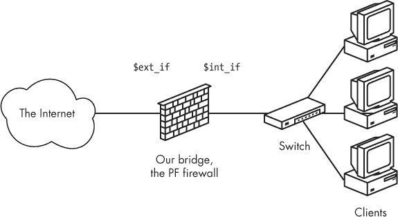
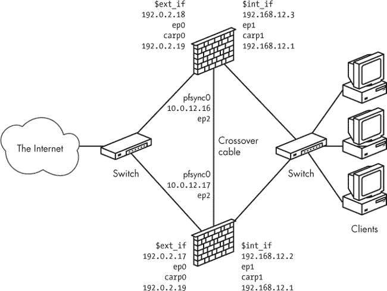

## 第八章. 冗余与资源可用性


*高可用性*和*持续服务*一直以来既是市场营销的流行词，也是现实世界中 IT 专业人员和网络管理员所追求的目标。为了满足这一需求并解决一些相关问题，*CARP* 和 *pfsync* 被作为两项备受期待的功能添加到 OpenBSD 3.5 中。借助这些工具，OpenBSD 及其他采用这些工具的操作系统在提供类似于其他操作系统所称的通用 *集群* 功能方面迈出了重要步伐。OpenBSD 及其姐妹 BSD 系统使用的术语与其他产品不同，但正如您将在本章中看到的那样，CARP、pfsync 和相关工具提供的高可用性功能相当于许多专有系统通常仅作为昂贵的可选功能提供的功能。

本章介绍如何使用基础系统中的这些工具来管理资源可用性——换句话说，如何利用它们确保在不利条件下，您负责的资源和服务保持可用。

## 冗余与故障转移：CARP 和 pfsync

通用地址冗余协议（CARP）被开发出来作为一种不受专利限制的替代方案，用于虚拟路由器冗余协议（VRRP），后者已经接近成为 IETF 批准的标准，尽管潜在的专利问题尚未解决。^([42]) CARP 的主要目的是确保即使由于错误或计划中的维护活动（如升级）导致防火墙或其他服务停机，网络也能继续正常运行。OpenBSD 开发人员不仅仅满足于复制受专利限制的协议，而是决定在多个方面做得更好。CARP 具有经过认证的冗余功能——它与地址族无关，并且配有状态同步功能。作为 CARP 的补充，pfsync 协议设计用于处理冗余数据包过滤节点或网关之间的 PF 状态同步。这两个协议的目的是确保关键网络功能的冗余，并实现自动故障转移。

CARP 基于将一组机器设置为一个*主机*和一个或多个冗余*备份*的方式，所有这些机器都能够处理一个公共的 IP 地址。如果主机出现故障，其中一个备份将继承该 IP 地址。CARP 主机之间的交接可以通过认证进行，基本上是通过设置共享密钥（实际上类似于密码）来完成。

在 PF 防火墙的情况下，可以设置 pfsync 来处理同步。如果通过 pfsync 的同步已经正确设置，活跃连接将在不中断的情况下进行切换。本质上，pfsync 是一种虚拟网络接口，专门设计用于在 PF 防火墙之间同步状态信息。它的接口通过 `ifconfig` 分配给物理接口。

即使从技术上讲，可以将 pfsync 流量与其他流量一起放在常规接口上，强烈建议你在单独的网络或甚至 VLAN 上设置 pfsync。pfsync 不对同步伙伴进行身份验证，因此保证正确同步的唯一方法是为 pfsync 流量使用专用接口。

### 项目规格：一对冗余网关

为了演示使用 CARP 和 pfsync 的有效故障转移设置，我们将检查一个有一个网关连接到外部网络的网络。重新配置网络的目标如下：

+   网络应该像我们引入冗余之前一样正常运行。

+   我们应该在没有明显停机时间的情况下实现更好的可用性。

+   网络应该经历平滑的故障转移，活跃连接不受影响。

我们将从第三章中相对简单的网络开始，如图 8-1 所示。

图 8-1. 单网关的网络

我们用一对冗余的网关替代了单个网关，这对网关共享一个私有网络，通过 pfsync 更新状态信息。结果如图 8-2 所示。

图 8-2. 冗余网关的网络

CARP 地址是虚拟地址，除非你能访问 CARP 群组中所有机器的控制台，否则几乎总是应该为物理接口分配 IP 地址。为每个物理接口分配唯一的 IP 地址，你将能够与主机通信，并确保知道你在与哪台机器交互。如果物理接口没有分配 IP 地址，你可能会遇到一个问题，即备份网关无法通信（除非在物理接口已分配地址的网络中与主机通信），直到它们成为冗余组中的主机，并接管虚拟 IP 地址。

合理的假设是，分配给物理接口的 IP 地址应该属于与虚拟共享 IP 地址相同的子网。同样需要注意的是，这实际上并不是一个硬性要求——甚至可以配置 CARP，其中物理接口没有分配地址。如果你没有为 CARP 接口指定特定的物理接口，内核会尝试将 CARP 地址分配给一个已经配置有与 CARP 地址同一子网的物理接口。即使在更简单的配置中这可能不是必须的，通常还是建议通过 `ifconfig` 命令中的 `carpdev` 选项明确选择接口来设置 CARP 接口。

### 警告

*如果在重新配置网络时，默认网关地址从固定的变为特定接口，从主机变为虚拟地址，那么几乎无法避免临时连接中断。*

### 设置 CARP

大多数 CARP 设置工作都集中在布线（根据你的网络示意图）、设置 `sysctl` 值以及发出 `ifconfig` 命令。此外，在一些系统中，你需要确保你的内核已经编译了所需的设备。

#### 检查内核选项

在 OpenBSD 中，CARP 和 pfsync 设备都包含在默认的 GENERIC 和 GENERIC.MP 内核配置中。除非你正在运行没有这些选项的自定义内核，否则无需进行内核重新配置。如果你正在运行 FreeBSD，确保内核已编译 CARP 和 pfsync 设备，因为默认的 GENERIC 内核没有这些选项。（请参阅 *FreeBSD 手册* 了解如何编译和安装带有这些选项的自定义内核。）

NetBSD 应该检查内核是否已编译伪设备 CARP，因为 NetBSD 默认的 GENERIC 内核配置中没有这个设备。（你会在 GENERIC 配置文件中找到相关行被注释掉。）截至本文写作时，NetBSD 由于协议编号问题，尚不支持 pfsync。

#### 设置 sysctl 值

在所有支持 CARP 的系统中，基本功能由一些 `sysctl` 变量控制。主要的变量是 `net.inet.carp.allow`，默认情况下它是启用的。在典型的 OpenBSD 系统中，你会看到：

```
$ **sysctl net.inet.carp.allow** 
net.inet.carp.allow=1
```

这意味着你的系统已配备 CARP。

如果你的内核没有配置 CARP 设备，在 FreeBSD 上运行此命令时应该会产生如下类似的输出：

```
sysctl: unknown oid 'net.inet.carp.allow'
```

或者它可能在 NetBSD 上产生类似这样的输出：

```
sysctl: third level name 'carp' in 'net.inet.carp.allow' is invalid
```

使用此 `sysctl` 命令查看所有与 CARP 相关的变量：

```
$ **sysctl net.inet.carp** 
net.inet.carp.allow=1
net.inet.carp.preempt=0
net.inet.carp.log=2
```

### 注意

*在 FreeBSD 中，你还会遇到只读状态变量 `net.inet.carp.suppress_preempt`，它表示是否可以进行抢占。在基于 OpenBSD 4.2 或更早版本的 CARP 代码的系统中，你还会看到 `net.inet.carp.arpbalance`，它用于启用 CARP ARP 平衡，为本地网络上的主机提供有限的负载均衡。*

为了在我们的设置中实现网关之间的优雅故障转移，我们需要设置`net.inet.carp.preempt`变量，以便在具有多个网络接口的主机（如我们的网关）上，所有 CARP 接口将同时在主状态和备份状态之间切换。此设置必须在 CARP 组中的所有主机上保持一致，并且在设置过程中应在所有主机上重复执行。

```
$ **sudo sysctl net.inet.carp.preempt=1**
```

`net.inet.carp.log`变量设置 CARP 日志的调试级别，范围为 0 到 7。默认值为 2，意味着仅记录 CARP 状态变化。

#### 使用 ifconfig 设置网络接口

请注意，在图 8-2 中显示的网络图中，本地网络使用 192.168.12.0 网络中的地址，而面向互联网的接口则位于 192.0.2.0 网络中。考虑到这些地址范围和 CARP 接口的默认行为，设置虚拟接口的命令实际上非常直接。

除了常规的网络参数外，CARP 接口还需要一个额外的参数：*虚拟主机 ID（`vhid`）*，它唯一标识将共享虚拟 IP 地址的接口。

### 警告

*`vhid`是一个 8 位值，必须在网络的广播域内唯一设置。将`vhid`设置为错误的值可能会导致难以调试的网络问题，甚至有传闻称，与其他无关系统的 ID 冲突可能会发生，并导致基于 VRRP 的冗余和负载均衡系统出现中断，VRRP 使用的虚拟节点标识方案类似于 CARP。*

在将作为该组初始主机的机器上运行这些命令：

```
$ **sudo ifconfig carp0 192.0.2.19 vhid 1** 
$ **sudo ifconfig carp1 192.168.1.1 vhid 2**
```

我们不需要显式设置物理接口，因为`carp0`和`carp1`虚拟接口将自动绑定到已配置有地址且与分配的 CARP 地址在同一子网中的物理接口。

### 注意

*在提供`carpdev`选项的`ifconfig`系统上，建议对所有 CARP 接口设置使用`carpdev`选项，即使它并非严格要求。在某些情况下，选择物理网络设备用于 CARP 接口可能并不明显，向`ifconfig`命令中添加`carpdev interface`字符串可以使设置从无功能到正常工作之间产生差异。这在某些非直观配置和相关网络中的空闲 IP 地址非常有限时尤其有用。FreeBSD 的 CARP 端口从 FreeBSD 10.0 开始提供`carpdev`选项。*

使用`ifconfig`确保每个 CARP 接口已正确配置，并特别注意`carp:`这一行，它表示`MASTER`状态，如下所示：

```
$ **ifconfig carp0** 
carp0: flags=8843<UP,BROADCAST,RUNNING,SIMPLEX,MULTICAST> mtu 1500
        lladdr 00:00:5e:00:01:01
        carp: MASTER carpdev ep0 vhid 1 advbase 1 advskew 0
        groups: carp
        inet 192.0.2.19 netmask 0xffffff00 broadcast 192.0.2.255
        inet6 fe80::200:5eff:fe00:101%carp0 prefixlen 64 scopeid 0x5
```

备份上的设置几乎与主服务器相同，不同之处在于您添加了 `advskew` 参数，它表示指定机器接管的优先级相对于当前主机有多少*较低的优先级*。

```
$ **sudo ifconfig carp0 192.0.2.19 vhid 1 advskew 100** 
$ s**udo ifconfig carp1 192.168.1.1 vhid 2 advskew 100**
```

`advskew` 参数及其配套值 `advbase` 用于计算当前主机在接管之后宣布其主机身份的间隔时间。`advbase` 的默认值为 1，`advskew` 的默认值为 0。在上述示例中，主机会每秒宣布一次（1 + 0/256），而备份主机会等到 1 + 100/256 秒后才会宣布。

在所有故障转移组主机上启用 `net.inet.carp.preempt=1` 后，当主服务器停止宣布或宣布自己不可用时，备份服务器会接管，新的主机开始以配置的速率进行宣布。较小的 `advskew` 值意味着更短的宣布间隔，并且主机成为新主机的可能性更大。如果更多主机具有相同的 `advskew` 值，则已为主机的主机将保持其主机身份。

在 OpenBSD 4.1 及更高版本中，另一个决定哪个主机接管 CARP 主职责的因素是 *降级计数器*，这是每个 CARP 主机为其接口组宣布的一个值，用来衡量其 CARP 接口的就绪状态。当降级计数器值为 0 时，主机完全就绪；更高的值表示状态有所下降。您可以使用 `ifconfig -g` 从命令行设置降级计数器，但通常该值由系统自动设置，通常在启动过程中会有较高的值。所有其他条件相等时，降级计数器值最低的主机会赢得接管 CARP 主机职责的竞争。

### 注意

*截至本文写作时，FreeBSD 10 之前的 CARP 版本不支持设置降级计数器。*

在备份服务器上，再次使用 `ifconfig` 检查每个 CARP 接口是否正确配置：

```
$ **ifconfig carp0** 
carp0: flags=8843<UP,BROADCAST,RUNNING,SIMPLEX,MULTICAST> mtu 1500
        lladdr 00:00:5e:00:01:01
        carp: BACKUP carpdev ep0 vhid 1 advbase 1 advskew 100
        groups: carp
        inet 192.0.2.19 netmask 0xffffff00 broadcast 192.0.2.255
        inet6 fe80::200:5eff:fe00:101%carp0 prefixlen 64 scopeid 0x5
```

这里的输出与您刚刚在主服务器上看到的只有一点点不同。请注意，`carp:` 行表示 `BACKUP` 状态，并且包含 `advbase` 和 `advskew` 参数。

对于实际生产环境，您应当通过配置 CARP 组成员使用共享的秘密密码短语，来增加防止未经授权的 CARP 活动的安全措施，例如以下内容：^([43])

```
$ **sudo ifconfig carp0 pass mekmitasdigoat 192.0.2.19 vhid 1**
$ **sudo ifconfig carp1 pass mekmitasdigoat 192.168.1.1 vhid 2**
```

### 注意

*与其他密码一样，密码短语将成为您设置中所有 CARP 流量的必需组成部分。请确保在故障转移组中配置所有 CARP 接口使用相同的密码短语（或无密码）。*

一旦确定了适当的设置，通过将它们放入 */etc* 中的正确文件，确保它们在未来的系统重启中得到保留：

+   在 OpenBSD 上，将适当的 `ifconfig` 参数放入 *hostname.carp0* 和 *hostname.carp1* 中。

+   在 FreeBSD 和 NetBSD 上，将相关行放入 *rc.conf* 文件中，作为 `ifconfig_carp0=` 和 `ifconfig_carp1=` 变量的内容。

### 保持状态同步：添加 pfsync

作为最终的配置步骤，设置冗余组内主机之间的状态表同步，以防止故障转移期间流量中断。这个操作是通过一组 pfsync 接口实现的。（如前所述，截至本文写作时，NetBSD 不支持 pfsync。）

配置 pfsync 接口需要一些规划和 `ifconfig` 命令。你可以在任何已配置的网络接口上设置 pfsync，但最好为同步设置一个独立的网络。图 8-2 中的示例配置展示了一个专门为此目的设置的小型网络。交叉电缆连接了两个以太网接口，但在具有超过两个主机的故障转移组中，你可能需要一个带有独立交换机、集线器或 VLAN 的设置。用于同步的接口分别被分配了 IP 地址 10.0.12.16 和 10.0.12.17。

完成基本的 TCP/IP 配置后，每个同步伙伴接口的完整 pfsync 设置是

```
$ **sudo ifconfig pfsync0 syncdev ep2**
```

pfsync 协议本身提供的安全功能有限：它没有认证机制，并且默认通过 IP 多播流量进行通信。然而，在无法实现物理独立网络的情况下，你可以通过将 pfsync 设置为仅与指定的 `syncpeer` 同步来增强其安全性：

```
$ **sudo ifconfig pfsync0 syncpeer 10.0.12.16 syncdev ep2**
```

这将生成一个配置的接口，在 `ifconfig` 输出中显示如下：

```
pfsync0: flags=41<UP,RUNNING> mtu 1500
        priority: 0
        pfsync: syncdev: ep2 syncpeer: 10.0.12.16 maxupd: 128 defer: off
        groups: carp pfsync
```

另一种选择是设置一个 IPsec 隧道，并使用它来保护同步流量。在这种情况下，`ifconfig` 命令是

```
$ **sudo ifconfig pfsync0 syncpeer 10.0.12.16 syncdev enc0**
```

这意味着 `syncdev` 设备变成了 `enc0` 封装接口，而不是物理接口。

### 注意

*如果可能，设置物理独立的专用网络或独立 VLAN 进行同步，因为任何丢失的 pfsync 更新可能导致故障转移时状态不清晰。*

检查 PF 状态同步是否正常运行的一个非常有用的方法是使用 **`systat states`** 在每台机器上查看同步主机的状态表。该命令为你提供一个实时显示的状态，展示同步目标上的批量更新。在同步之间，所有主机的状态应该一致显示。（流量计数器——如传输的包数和字节数——是例外；它们只在处理实际连接的主机上显示更新。）

这标志着基于 CARP 的故障转移的基本网络配置的结束。在接下来的部分中，我们将讨论在编写冗余配置规则集时需要注意的事项。

### 构建规则集

在我们经历了所有这些曲折的配置以实现基本的网络功能后，你可能会想知道，将当前*pf.conf*中的规则迁移到新设置需要做哪些工作。幸运的是，所需的修改并不多。我们引入的主要变化对外界基本上是不可见的，针对单一网关配置设计的规则集通常也能很好地适用于冗余配置。

尽管如此，我们引入了两种额外的协议（CARP 和 pfsync），你可能需要对规则集做一些相对较小的调整，以便故障转移能够正常工作。基本上，你需要将 CARP 和 pfsync 流量传递到合适的接口。处理 CARP 流量的最简单方法是为你的`carpdevs`引入一个宏定义，包含所有将处理 CARP 流量的物理接口。你还需要引入一个配套的`pass`规则，例如以下规则，以便在适当的接口上传递 CARP 流量：

```
pass on $carpdevs proto carp
```

同样地，对于 pfsync 流量，你可以为`syncdev`引入宏定义，并添加一个配套的`pass`规则：

```
pass on $syncdev proto pfsync
```

完全跳过 pfsync 接口进行过滤，在性能上比过滤和转发要便宜。要完全把 pfsync 设备排除在过滤范围外，可以使用如下规则：

```
set skip on $syncdev
```

你还应该考虑虚拟 CARP 接口及其地址与物理接口的角色。就 PF 而言，所有流量都会通过物理接口，但流量的源地址或目标地址可能会是 CARP 接口的 IP 地址。

你可能会发现你的配置中有一些规则，你不想在故障转移时费心去同步，比如与运行在网关本身上的服务的连接。一个典型的例子是允许管理员 SSH 连接的规则：

```
pass in on $int_if from $ssh_allowed to self
```

对于这样的规则，你可以使用状态选项`no-sync`来防止同步在故障转移发生后实际上并不相关的连接状态变化：

```
pass in on $int_if from $ssh_allowed to self keep state (no-sync)
```

使用这种配置，你将能够在 CARPed 系统组的成员中安排操作系统升级和以前会造成停机的活动，选择在最合适的时机进行，而不会对服务用户造成明显的停机。

Ifstated，接口状态守护进程

在正确配置的 CARP 环境中，基本的网络功能已经得到很好的支持，但你的设置可能包含一些在主机网络配置发生变化时需要特别关注的元素。例如，当某个特定接口停止工作或重新启动时，某些服务可能需要启动或停止，或者你可能希望在接口状态变化时运行特定的命令或脚本。如果这听起来很熟悉，那么`ifstated`就是为你准备的。

`ifstated`工具是在 OpenBSD 3.5 中引入的，用于基于网络接口状态变化触发动作。您可以在 OpenBSD 的基础系统中找到它，或者在 FreeBSD 的端口系统中找到*net/ifstated*。在 OpenBSD 中，文件*/etc/ifstated.conf*（或者在 FreeBSD 中安装端口后的*/usr/local/etc/ifstated.conf*）包含一个几乎可以直接运行的配置文件，并提供了一些关于如何为 CARP 环境设置`ifstated`的提示。

主要的控制对象是接口及其状态——例如，`carp0.link.up`是`carp0`接口变为主控的状态——您将在状态变化时执行相应的操作。

每当接口状态发生变化时需要执行的状态和动作都在一个直观的脚本语言中进行指定，该语言具备基本的特性，如变量、宏和简单的逻辑条件。（请参见`man ifstated`和`man ifstated.conf`，以及在您的基础系统安装中提供的默认*ifstated.conf*示例文件，以了解更多相关内容，以及如何在您的环境中实现基于 CARP 的集群功能。）

### CARP 负载均衡

通过故障切换实现冗余是不错的选择，但有时候，硬件闲置以防故障并不那么吸引人，反而更好的是创建一个配置，将网络负载分散到多个主机上。

除了 ARP 负载均衡（它通过基于传入连接的源 MAC 地址计算哈希来工作），OpenBSD 4.3 及更高版本中的 CARP 支持多种基于 IP 的负载均衡方法，其中流量根据从连接的源和目的 IP 地址计算的哈希进行分配。由于 ARP 负载均衡是基于源 MAC 地址的，它仅适用于直接连接的网络段中的主机。另一方面，基于 IP 的方法适用于负载均衡到互联网及其访问的连接。

您的应用程序选择方法将取决于您需要配合的其他网络设备的规格。基本的`ip`负载均衡模式使用组播 MAC 地址，让直接连接的交换机将流量转发到负载均衡集群中的所有主机。

不幸的是，一些系统不支持单播 IP 地址和组播 MAC 地址的组合。在这种情况下，您可能需要将负载均衡配置为`ip-unicast`模式，该模式使用单播 MAC 地址，并配置交换机将流量转发到适当的主机。或者，您可能需要将负载均衡配置为`ip-stealth`模式，该模式根本不使用组播 MAC 地址。像往常一样，问题出在细节上，答案可以在 man 页和其他文档中找到，通常还需要通过一些实验来验证。

### 注意

*传统上，`relayd`被用作智能负载均衡的前端，用于提供对外服务的服务器。在 OpenBSD 4.7 中，`relayd`获得了跟踪可用上行链路并根据链路健康状况修改系统路由表的能力，这一功能通过与`router`关键字捆绑在一起实现。对于具有多个可能上行链路或不同路由表的设置，可以配置`relayd`选择上行链路，或者借助`sysctl`变量`net.inet.ip.multipath`和`net.inet6.ip6.multipath`，在可用路由和上行链路之间执行负载均衡。具体的配置方式会根据网络环境的不同而有所不同。`relayd.conf`手册页提供了一个完整的示例，帮助你入门。*

#### CARP 负载均衡模式

在负载均衡模式下，CARP 概念得到了扩展，每个 CARP 接口可以成为多个故障转移组的成员，并且可以成为与共享虚拟地址的物理主机数量相等的负载均衡组的成员。与故障转移模式相比，负载均衡模式下每个节点*必须*是其所在组的主节点，以便能够接收流量。哪个组（以及相应的物理主机）最终处理某个连接，由 CARP 通过哈希值计算决定。此计算基于连接的源 MAC 地址（在 ARP 平衡模式下）以及源和目标 IP 地址（在 IP 平衡模式下）和实际可用性。该方案的缺点是每个组会消耗一个虚拟主机 ID，因此在负载均衡配置中，这些 ID 会比仅使用故障转移时更快地用完。实际上，基于 CARP 的负载均衡*集群*的数量上限是 32 个虚拟主机 ID。

`advskew`参数在负载均衡配置中的作用与在故障转移配置中相似，但 CARP 负载均衡的`ifconfig`（以及*hostname.carpN*）语法与故障转移模式下略有不同。

#### 设置 CARP 负载均衡

将前面部分中建立的 CARP 故障转移组更改为负载均衡集群只需编辑配置文件并重新加载。在以下示例中，我们选择一个 IP 负载均衡方案。如果选择其他方案，配置文件中的区别仅在于模式选择的关键字。

在第一台主机上，我们将*/etc/hostname.carp0*更改为

```
pass mekmitasdigoat 192.0.2.19 balancing ip carpnodes 5:100,6:0
```

这表示在该主机上，`carp0`接口是`vhid 5`组的成员（`advskew`为`100`），并且也是`vhid 6`组的成员，在该组中它是成为初始主节点的主要候选者（`advskew`设置为`0`）。

接下来，我们将*/etc/hostname.carp1*更改为：

```
pass mekmitasdigoat 192.168.12.1 balancing ip carpnodes 3:100,4:0
```

对于`carp1`，其成员是`vhid`为`3`和`4`的虚拟主机，`advskew`值分别为`100`和`0`。

对于另一个主机，`advskew` 值是相反的，但配置其他方面大致相似。这里，*/etc/hostname.carp0* 文件内容如下：

```
pass mekmitasdigoat 192.0.2.19 balancing ip carpnodes 5:0,6:100
```

这意味着 `carp0` 接口是 `vhid 5` 的成员，`advskew 0`，并且是 `vhid 6` 的成员，`advskew 100`。与之互补的是 */etc/hostname.carp1* 文件，其内容如下：

```
pass mekmitasdigoat 192.168.12.1 balancing ip carpnodes 3:0,4:100
```

再次强调，`carp1` 是 `vhid 3` 和 `4` 的成员，`advskew 0` 位于第一个组，`100` 位于第二个组。

第一个主机上 `carp` 接口组的 `ifconfig` 输出如下所示：

```
$ **ifconfig carp** 
carp0: flags=8843<UP,BROADCAST,RUNNING,SIMPLEX,MULTICAST> mtu 1500
        lladdr 01:00:5e:00:01:05
        priority: 0
        carp: carpdev vr0 advbase 1 balancing ip
                state MASTER vhid 5 advskew 0
                state BACKUP vhid 6 advskew 100
        groups: carp
        inet 192.0.2.19 netmask 0xffffff00 broadcast 192.0.2.255
        inet6 fe80::200:24ff:fecb:1c10%carp0 prefixlen 64 scopeid 0x7
carp1: flags=8843<UP,BROADCAST,RUNNING,SIMPLEX,MULTICAST> mtu 1500
        lladdr 01:00:5e:00:01:03
        priority: 0
        carp: carpdev vr1 advbase 1 balancing ip
                state MASTER vhid 3 advskew 0
                state BACKUP vhid 4 advskew 100
        groups: carp
        inet 192.168.12.1 netmask 0xffffff00 broadcast 192.168.12.255
        inet6 fe80::200:24ff:fecb:1c10%carp1 prefixlen 64 scopeid 0x8
pfsync0: flags=41<UP,RUNNING> mtu 1500
        priority: 0
        pfsync: syncdev: vr2 syncpeer: 10.0.12.17 maxupd: 128 defer: off
        groups: carp pfsync
```

另一个主机的 `ifconfig` 输出如下：

```
$ **ifconfig carp** 
carp0: flags=8843<UP,BROADCAST,RUNNING,SIMPLEX,MULTICAST> mtu 1500
        lladdr 01:00:5e:00:01:05
        priority: 0
        carp: carpdev vr0 advbase 1 balancing ip
                state BACKUP vhid 5 advskew 100
                state MASTER vhid 6 advskew 0
        groups: carp
        inet 192.0.2.19 netmask 0xffffff00 broadcast 192.0.2.255
        inet6 fe80::200:24ff:fecb:1c18%carp0 prefixlen 64 scopeid 0x7
carp1: flags=8843<UP,BROADCAST,RUNNING,SIMPLEX,MULTICAST> mtu 1500
        lladdr 01:00:5e:00:01:03
        priority: 0
        carp: carpdev vr1 advbase 1 balancing ip
                state BACKUP vhid 3 advskew 100
                state MASTER vhid 4 advskew 0
        groups: carp
        inet 192.168.12.1 netmask 0xffffff00 broadcast 192.168.12.255
        inet6 fe80::200:24ff:fecb:1c18%carp1 prefixlen 64 scopeid 0x8
pfsync0: flags=41<UP,RUNNING> mtu 1500
        priority: 0
        pfsync: syncdev: vr2 syncpeer: 10.0.12.16 maxupd: 128 defer: off
        groups: carp pfsync
```

如果我们在负载均衡方案中有三个节点，每个 `carp` 接口都需要加入一个额外的组，总共是三个组。简而言之，对于每个在负载均衡组中引入的物理主机，每个 `carp` 接口都成为一个额外组的成员。

一旦设置好负载均衡集群，运行 **`systat states`** 命令，观察每个主机的连接流量，持续几分钟，确保系统按预期运行，并验证你所做的努力是值得的。

* * *

^([42]) VRRP 在 RFC 2281 和 RFC 3768 中有详细描述。相关专利由 Cisco、IBM 和 Nokia 持有。详情请参阅 RFC 文档。

^([43]) 这个特定的密码短语有着非常明确的含义。通过 Web 搜索可以发现它的意义，以及为什么它是现代网络文档中*理所当然*的标准。最终的答案可以通过 *openbsd-misc* 邮件列表的归档找到。
