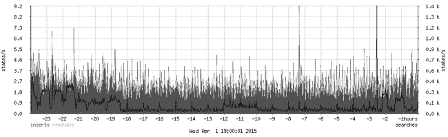
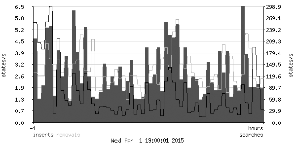

## 第九章：日志记录、监控与统计


控制网络——无论是为了家庭网络需求，还是在专业环境中的应用——可能是阅读本书的每个人的主要目标之一。保持控制的一个必要元素是能够访问关于网络中发生的所有相关信息。幸运的是，PF —— 就像大多数类 Unix 系统的组件 —— 能够生成网络活动的日志数据。

PF 提供了丰富的选项来设置日志详细程度、处理日志文件以及提取特定类型的数据。你已经可以使用基础系统中的工具做很多事情，并且通过你的包管理系统还可以获得其他一些工具，用于以多种有用的方式收集、研究和查看日志数据。在本章中，我们将更详细地探讨 PF 日志的一般情况以及你可以用来提取和展示信息的一些工具。

## PF 日志：基础

PF 记录的信息和日志详细程度由你决定，取决于你的规则集。基础的日志记录很简单：对于每个你希望记录数据的规则，添加 `log` 关键字。当你加载带有 `log` 的规则集时，任何开始连接的匹配日志规则的数据包（被阻止、通过或匹配）都会被复制到 `pflog` 设备。*数据包一旦被 PF 看到并且日志规则被评估时，它就会立即被记录。*

### 注意

*在复杂的规则集中，由于 `match` 或 `pass` 规则，数据包可能会经历多次转换，当数据包进入主机时匹配的条件可能在转换后不再匹配。*

PF 还会存储一些附加数据，例如时间戳、接口、原始的源和目的 IP 地址、数据包是否被阻止或通过，以及从加载的规则集中关联的规则编号。

PF 日志数据由 `pflogd` 日志守护进程收集，该进程默认在系统启动时启用 PF 时启动。默认的日志数据存储位置是 */var/log/pflog*。日志以二进制格式写入，通常称为 *数据包捕获格式（pcap）*，旨在通过 `tcpdump` 进行读取和处理。稍后我们将讨论一些提取和展示日志文件信息的附加工具。日志文件格式是一种文档化完善且广泛支持的二进制格式。

开始时，这是一个基本的日志示例。首先从你希望记录的规则开始，并添加 `log` 关键字：

```
block log
pass log quick proto { tcp, udp } to port ssh
```

重新加载规则集后，你应该会看到 */var/log/pflog* 文件的时间戳发生变化，文件开始增长。要查看存储了什么内容，可以使用 `tcpdump` 配合 `-r` 选项读取该文件。

如果日志记录已经进行了一段时间，输入以下命令可能会产生大量输出：

```
$ **sudo tcpdump -n -ttt -r /var/log/pflog**
```

例如，以下仅是一个长文件的前几行，几乎所有行都足够长，需要换行显示：

```
$ **sudo tcpdump -n -ttt -r /var/log/pflog**
tcpdump: WARNING: snaplen raised from 116 to 160
Sep 13 13:00:30.556038 rule 10/(match) pass in on epic0: 194.54.107.19.34834 >
194.54.103.66.113: S 3097635127:3097635127(0) win 16384 <mss 1460,nop,nop,sackOK,nop,wscale
0,[|tcp]> (DF)
Sep 13 13:00:30.556063 rule 10/(match) pass out on fxp0: 194.54.107.19.34834 >
194.54.103.66.113: S 3097635127:3097635127(0) win 16384 <mss 1460,nop,nop,sackOK,nop,wscale
0,[|tcp]> (DF)
Sep 13 13:01:07.796096 rule 10/(match) pass in on epic0: 194.54.107.19.29572 >
194.54.103.66.113: S 2345499144:2345499144(0) win 16384 <mss 1460,nop,nop,sackOK,nop,wscale
0,[|tcp]> (DF)
Sep 13 13:01:07.796120 rule 10/(match) pass out on fxp0: 194.54.107.19.29572 >
194.54.103.66.113: S 2345499144:2345499144(0) win 16384 <mss 1460,nop,nop,sackOK,nop,wscale
0,[|tcp]> (DF)
Sep 13 13:01:15.096643 rule 10/(match) pass in on epic0: 194.54.107.19.29774 >
194.54.103.65.53: 49442 [1au][|domain]
Sep 13 13:01:15.607619 rule 12/(match) pass in on epic0: 194.54.107.19.29774 >
194.54.107.18.53: 34932 [1au][|domain]
```

`tcpdump`程序非常灵活，特别是在输出方面，它提供了多种显示选项。此示例中的格式来自我们提供给`tcpdump`的选项。该程序几乎总是显示数据包到达的日期和时间（`-ttt`选项指定了这种长格式）。接下来，`tcpdump`列出了加载的规则集中的规则编号、数据包出现的接口、源地址和目标地址及端口（`-n`选项告诉`tcpdump`显示 IP 地址而不是主机名），以及各种数据包属性。

### 注意

*日志文件中的规则编号指的是* 加载到内存中的 *规则集。你的规则集在加载过程中会经历一些自动步骤，例如宏扩展和优化，这使得日志中存储的规则编号可能与从`pf.conf`文件顶部开始计算得到的规则编号不完全匹配。如果你不确定是哪个规则匹配了，可以使用`pfctl -vvs rules`命令并研究输出。*

在我们的`tcpdump`输出示例中，我们看到加载的规则集中的第十条规则（`rule 10`）似乎是一个捕获规则，匹配 IDENT 请求和域名查询。这种输出在调试时非常有价值，要保持网络的掌控，必须具备这种类型的数据。通过一些努力和仔细阅读`tcpdump`手册页面，你应该能够从日志数据中提取出有用的信息。

若要实时显示你记录的流量，可以使用`tcpdump`直接从日志设备读取日志信息。为此，使用`-i`选项指定你希望`tcpdump`读取的接口，如下所示。（`-l`选项可启用输出的行缓冲，如果你想查看正在捕获的内容，这个选项很有用。）

```
$ **sudo tcpdump -lnettti pflog0**
Apr 29 22:07:36.097434 rule 16/(match) pass in on xl0: 85.19.150.98.53 > 213.187.179.198.41101:
63267*- 1/0/2 (68)
Apr 29 22:07:36.097760 rule def/(match) pass out on em0: 213.187.179.198.22 >
192.168.103.44.30827: P 1825500807:1825500883(76) ack 884130750 win 17520 [tos 0x10]
Apr 29 22:07:36.098386 rule def/(match) pass in on em0: 192.168.103.44.30827 >
213.187.179.198.22: . ack 76 win 16308 (DF) [tos 0x10]
Apr 29 22:07:36.099544 rule 442/(match) pass in on xl0: 93.57.15.161.4487 > 213.187.179.198.80:
P ack 3570451894 win 65535 <nop,nop,timestamp 4170023961 0>
Apr 29 22:07:36.108037 rule 25/(match) pass out on xl0: 213.187.179.198.25 >
213.236.166.45.65106: P 2038177705:2038177719(14) ack 149019161 win 17424 (DF)
Apr 29 22:07:36.108240 rule def/(match) pass out on em0: 213.187.179.198.22 >
192.168.103.44.30827: P 76:232(156) ack 1 win 17520 [tos 0x10]
```

该序列以域名查询响应开始，接着是两个来自打开 SSH 连接的数据包，这告诉我们该站点的管理员可能在匹配规则上启用了`log (all)`（参见记录所有数据包：log (all)")). 第四个数据包属于一个网站连接，第五个是一个外发 SMTP 连接的一部分，最后是另一个 SSH 数据包。如果你让这个命令一直运行，显示的行最终会滚动出屏幕，但你可以将数据重定向到文件或其他程序以进一步处理。

### 注意

*有时你可能主要对特定主机之间的流量或符合特定条件的流量感兴趣。在这种情况下，`tcpdump`的过滤功能可能会非常有用。详情请参见`man tcpdump`。*

### 记录数据包在规则集中的路径：log（匹配）

PF 日志代码的早期版本没有提供一种简单的方法来跟踪数据包在规则集遍历过程中将匹配的所有规则。当 OpenBSD 4.6 引入`match`规则并为 PF 用户提供一种更方便且稍微简化的方式来对数据包和连接进行转换（例如地址重写）时，这个问题变得更加明显。`match`规则允许您独立于最终的`pass`或`block`决定，对数据包或连接执行操作。指定的操作——如`nat-to`、`rdr-to`等——会立即执行。这可能导致一种情况：数据包已被`match`规则转换，且不再匹配规则集中后续出现的过滤规则，如果没有发生转换，它本应匹配这些规则。一个相对基本的例子是，在规则集中放置一个应用了`nat-to`的`match`规则，该规则位于任何`pass`规则之前。一旦`nat-to`操作被应用，任何原本会匹配数据包源地址的过滤条件将不再匹配该数据包。

这种更大的灵活性使得某些规则集更难以调试（通常是那些包含多个执行转换的`match`规则的规则集），因此明显需要一种新的日志选项。

PF 开发者一直在关注日志代码的重写，直到 OpenBSD 4.9 发布时，日志系统被重写，重构后的代码使得引入日志选项`matches`变得容易，从而帮助调试规则集并跟踪数据包在规则集中的路径，其中多个`match`或`pass`规则可能会转化数据包。

将`log (matches)`添加到规则中会强制记录所有匹配该规则的规则，一旦数据包匹配到包含`log (matches)`子句的规则。一旦发生这种匹配，所有后续规则也会被记录。因此，您可以使用有针对性的`log (`**`matches`**`)`语句来追踪数据包在加载规则集中的路径，使得解开复杂规则集变得更加容易。

例如，考虑这个简单的包含 NAT 的规则集。`log (matches)`规则如下：

```
match in log (matches) on $int_if from $testhost tag localnet
```

我们的测试主机是一台位于本地网络中的工作站，IP 地址为 192.168.103.44。当测试主机访问互联网上的一个网站时，日志信息如下所示：

```
Apr 29 21:08:24.386474 rule 3/(match) match in on em0: 192.168.103.44.14054 > 81.93.163.115.80:
S 1381487359:1381487359(0) win 16384 <mss 1460,nop,nop,sackOK,nop,wscale 3,nop,nop,timestamp
735353043[|tcp]> (DF) ➊
Apr 29 21:08:24.386487 rule 11/(match) block in on em0: 192.168.103.44.14054 >
81.93.163.115.80: S 1381487359:1381487359(0) win 16384 <mss 1460,nop,nop,sackOK,nop,wscale
3,nop,nop,timestamp 735353043[|tcp]> (DF) ➋
Apr 29 21:08:24.386497 rule 17/(match) pass in on em0: 192.168.103.44.14054 > 81.93.163.115.80:
S 1381487359:1381487359(0) win 16384 <mss 1460,nop,nop,sackOK,nop,wscale 3,nop,nop,timestamp
735353043[|tcp]> (DF) ➌
Apr 29 21:08:24.386513 rule 17/(match) pass in on em0: 192.168.103.44.14054 > 81.93.163.115.80:
S 1381487359:1381487359(0) win 16384 <mss 1460,nop,nop,sackOK,nop,wscale 3,nop,nop,timestamp
735353043[|tcp]> (DF)
Apr 29 21:08:24.386553 rule 5/(match) match out on xl0: 213.187.179.198.14054 >
81.93.163.115.80: S 1381487359:1381487359(0) win 16384 <mss 1460,nop,nop,sackOK,nop,wscale
3,nop,nop,timestamp 735353043[|tcp]> (DF) ➍
Apr 29 21:08:24.386568 rule 16/(match) pass out on xl0: 213.187.179.198.14054 >
81.93.163.115.80: S 1381487359:1381487359(0) win 16384 <mss 1460,nop,nop,sackOK,nop,wscale
3,nop,nop,timestamp 735353043[|tcp]> (DF) ➎
```

初始数据包首先匹配`规则 3`，即上述日志片段➊中的`match log (matches)`规则。下一个匹配的是我们加载的规则集中的`规则 11` ➋，即最初的`block all`，但是数据包也匹配了`规则 17`，这允许它通过`pass in on em0` ➌。接下来匹配的`规则 5` ➍显然是一个`match`规则，它应用了`nat-to`（注意源地址已发生变化）。最后，数据包通过`规则 16` ➎，这是一条匹配的`pass`规则，允许其通过`out on xl0`。

这个示例实际上只有一个转换（`nat-to`），但`log (matches)`功能使我们能够跟踪连接的初始数据包，通过规则集中的所有匹配规则，包括源地址的替换。

### 记录所有数据包：log (all)

对于大多数调试和轻量级监控目的，记录连接中的第一个数据包就提供了足够的信息。然而，有时你可能希望记录所有匹配某些规则的数据包。为此，在你想要监控的规则中使用`(all)`日志选项。对我们的最小规则集做出这个更改后，我们得到了以下内容：

```
block log (all)
pass log (all) quick proto tcp to port ssh keep state
```

这个选项使得日志变得更加冗长。为了说明`log (all)`生成的日志数据有多少，我们将使用以下规则集片段，它包含了域名查找和网络时间同步的内容：

```
udp_services = "{ domain, ntp }"
pass log (all) inet proto udp to port $udp_services
```

在这些规则设置好后，以下是一个示例，展示当一个俄罗斯域名服务器向我们网络中的服务器发送域名请求时会发生什么：

```
$ **sudo tcpdump -lnttti pflog0 port domain** 
tcpdump: WARNING: snaplen raised from 116 to 160
tcpdump: listening on pflog0, link-type PFLOG
Sep 30 14:27:41.260190 212.5.66.14.53 > 194.54.107.19.53:[|domain]
Sep 30 14:27:41.260253 212.5.66.14.53 > 194.54.107.19.53:[|domain]
Sep 30 14:27:41.260267 212.5.66.14.53 > 194.54.107.19.53:[|domain]
Sep 30 14:27:41.260638 194.54.107.19.53 > 212.5.66.14.53:[|domain]
Sep 30 14:27:41.260798 194.54.107.19.53 > 212.5.66.14.53:[|domain]
Sep 30 14:27:41.260923 194.54.107.19.53 > 212.5.66.14.53:[|domain]
```

现在我们有六条记录，而不仅仅是一条。

即使通过`tcpdump`过滤掉所有除`port domain`外的数据，向一个或多个规则添加`log (all)`也会显著增加日志中的数据量。如果你需要记录所有流量，但网关的存储容量有限，你可能会发现自己需要购买额外的存储设备，而增加的 I/O 活动实际上可能对性能产生负面影响。此外，以这种细节级别记录和存储流量日志很可能会带来法律影响。

负责任地记录日志！

创建任何类型的日志都可能带来意想不到的后果，包括一些法律影响。一旦你开始存储由网络流量生成的日志数据，你就在创建关于用户的信息存储库。存储日志数据长时间的技术和商业理由可能是合理的，但仅记录足够的数据并将其存储在适当的时间内，是一门精细的艺术。

你可能已经对生成日志数据的实际问题有了一些了解，比如安排足够的存储空间，以便保留足够多的日志数据并且能够保持足够长的时间以便使用。法律影响会根据你所在的地区有所不同。某些国家和地区有关于如何处理日志数据的具体要求，并且对这些数据如何使用和保留日志的时间有着限制。其他地方要求服务提供商在特定的时间段内保留流量日志，在某些情况下还要求在执法部门提出请求时提供相关数据。在建立日志基础设施之前，确保你了解法律问题。

### 记录到多个 pflog 接口

在 OpenBSD 4.1 之后的 PF 版本中，你可以将日志数据定向到多个`pflog`接口。在 OpenBSD 4.1 中，`pflog`接口成为了一个*可克隆*设备，这意味着你可以使用`ifconfig`命令创建多个`pflog`接口，除了默认的`pflog0`之外。这使得将不同规则集部分的日志数据记录到不同的`pflog`接口成为可能，如果需要，还可以更方便地单独处理这些数据。

从默认的单一`pflog0`接口转移到多个`pflog`接口需要对你的设置进行一些微妙但有效的修改。为了将日志记录到多个接口，请确保你规则集中使用的所有日志接口都已创建。你不需要在加载规则集之前创建这些设备；如果你的规则集记录到一个不存在的接口，日志数据会被简单地丢弃。

当调整你的设置以使用多个`pflog`接口时，你很可能会通过命令行添加所需的接口，如下所示：

```
$ **sudo ifconfig create pflog1**
```

在你的规则集中添加`log`关键字时，指定日志设备，如下所示：

```
pass log (to pflog1) proto tcp to $emailserver port $email
pass log (to pflog1) proto tcp from $emailserver to port smtp
```

对于 OpenBSD 上更永久的配置，创建一个包含仅有`up`的*hostname.pflog1*文件，以及针对任何额外日志接口的类似*hostname.pflogN*文件。

在 FreeBSD 上，克隆的`pflog`接口的配置应包含在你的*rc.conf*文件中，格式如下：

```
ifconfig_pflog1="up"
```

截至本文写作时，NetBSD 上的`pflog`接口克隆尚不可用。

正如你在第六章中看到的，将日志信息定向到规则集的不同部分并分配到不同的接口使得可以将 PF 生成的日志数据的不同部分输送到不同的应用程序。这使得像`spamlogd`这样的程序仅处理相关信息，而你可以将 PF 日志数据的其他部分传输给其他日志处理程序。

### 将日志记录到 syslog，本地或远程

避免将 PF 日志数据存储在网关本身的一种方式是指示网关将日志记录到另一台机器。如果你已经有了集中式日志基础设施，尽管 PF 的普通日志机制并未专门设计为传统的`syslog`风格的日志记录，但这仍然是一个相当合乎逻辑的做法。

正如任何老牌 BSD 用户所告诉你的，传统的 `syslog` 系统日志设施在处理它从其他主机通过 UDP 接收到的数据时有些天真，经常提到的一个危险是磁盘填满的拒绝服务攻击。还有一个永远存在的风险是，在高负载下，无论是个别系统还是网络，都可能丢失日志信息。因此，考虑在所有相关主机通过一个安全且适当规划的网络进行通信时，*仅*设置远程日志记录。在大多数 BSD 系统中，默认情况下，`syslogd` 并没有配置为接受来自其他主机的日志数据。（如果你计划使用远程 `syslog` 日志记录，请参见 `syslogd` 手册页，了解如何启用监听来自远程主机的日志数据。）

如果你仍然希望通过 `syslog` 来进行 PF 日志记录，以下是一个简短的教程，介绍如何实现这一目标。在普通的 PF 配置中，`pflogd` 会将日志数据复制到日志文件中。当你希望将日志数据存储在远程系统上时，你应该通过修改 *rc.conf.local* 文件（在 OpenBSD 上）来禁用 `pflog` 的数据收集，像这样：

```
pflogd_flags="NO"
```

在 FreeBSD 和 NetBSD 上，修改 *rc.conf* 文件中的 `pflog_flats=` 设置行。然后终止 `pflogd` 进程。接下来，确保不再由 `pflogd` 收集的日志数据以有意义的方式传输到你的日志处理系统中。这个步骤分为两部分：首先，配置系统日志程序将数据传输到日志处理系统，然后使用 `tcpdump` 和 `logger` 将数据转换并注入到 `syslog` 系统中。

要设置 `syslogd` 来处理数据，选择你的 *日志设施*、*日志级别* 和 *动作*，然后将生成的行添加到 */etc/syslog.conf* 文件中。这些概念在 `man syslog.conf` 中有很好的解释，如果你想理解系统日志，这是必读的。*动作* 部分通常是本地文件系统中的一个文件。例如，如果你已经设置好系统日志程序在 *`loghost.example.com`* 接收数据，那么选择日志设施 `local2` 和日志级别 `info`，并输入以下行：

```
local2.info             @loghost.example.com
```

完成此更改后，重新启动 `syslogd` 以使其读取新的设置。

接下来，设置 `tcpdump` 将日志数据从 `pflog` 设备转换并传递给 `logger`，然后 `logger` 会将其发送到系统日志程序。在这里，我们重复使用本章早些时候示例中的 `tcpdump` 命令，并添加了一些有用的内容：

```
$ **sudo nohup tcpdump -lnettti pflog0 | logger -t pf -p local2.info &**
```

`nohup` 命令确保即使进程没有控制终端或者被放到后台（正如我们在这里使用 `&` 处理的那样），它仍会继续运行。`tcpdump` 命令的 `-l` 选项指定行缓冲输出，这对于重定向到其他程序非常有用。`logger` 选项为数据流添加标签 `pf`，以标识 PF 数据，并使用 `-p` 选项将日志优先级设置为 `local2.info`。结果会被记录到你在日志主机上指定的文件中，日志条目将类似于以下内容：

```
pf: Sep 21 14:05:11.492590 rule 93/(match) pass in on ath0:
10.168.103.11.15842 > 82.117.50.17.80: [|tcp] (DF)
pf: Sep 21 14:05:11.492648 rule 93/(match) pass out on xl0:
194.54.107.19.15842 > 82.117.50.17.80: [|tcp] (DF)
pf: Sep 21 14:05:11.506289 rule 93/(match) pass in on ath0:
10.168.103.11.27984 > 82.117.50.17.80: [|tcp] (DF)
pf: Sep 21 14:05:11.506330 rule 93/(match) pass out on xl0:
194.54.107.19.27984 > 82.117.50.17.80: [|tcp] (DF)
pf: Sep 21 14:05:11.573561 rule 136/(match) pass in on ath0:
10.168.103.11.6430 > 10.168.103.1.53:[|domain]
pf: Sep 21 14:05:11.574276 rule 136/(match) pass out on xl0:
194.54.107.19.26281 > 209.62.178.21.53:[|domain]
```

这段日志片段主要显示了来自 NAT 本地网络中客户端的 Web 浏览活动，从网关的视角来看，并伴随有域名查找。

### 使用标签跟踪每个规则的统计信息

从获取日志数据时得到的顺序信息基本上是跟踪数据包随时间的移动。在其他情况下，连接的序列或历史记录不如总数重要，例如自从计数器最后一次重置以来，匹配规则的数据包或字节的数量。

在第二章的结尾，你看到如何使用`pfctl -s info`查看全局汇总计数器以及其他数据。要更详细地分析数据，按规则逐个跟踪流量总数，使用稍微不同形式的`pfctl`命令，比如`pfctl -vs rules`，以显示带规则的统计信息，如下所示：

```
$ **pfctl -vs rules**
pass inet proto tcp from any to 192.0.2.225 port = smtp flags S/SA keep state label "mail-in"
  [ Evaluations: 1664158 Packets: 1601986 Bytes: 763762591 States: 0 ]
  [ Inserted: uid 0 pid 24490 ]
pass inet proto tcp from 192.0.2.225 to any port = smtp flags S/SA keep state label "mail-out"
  [ Evaluations: 2814933 Packets: 2711211 Bytes: 492510664 States: 0 ]
  [ Inserted: uid 0 pid 24490 ]
```

该输出的格式易于阅读，显然是为那些希望快速了解发生了什么的场景设计的。如果你指定更详细的输出，使用`pfctl -vvs rules`，你会看到基本相同的显示，只不过添加了规则编号。另一方面，这个命令的输出并不非常适合用作脚本或其他程序进一步处理的数据。要以脚本友好的格式提取这些统计数据和其他一些项，并根据自己的需求决定哪些规则值得追踪——请使用规则*标签*。

标签不仅仅是为了标识处理特定类型流量的规则；它们还使得提取流量统计信息变得更容易。通过将标签附加到规则，你可以存储一些关于规则集部分的额外数据。例如，你可以使用标签来测量带宽使用情况以供计费目的。

在以下示例中，我们将标签`mail-in`和`mail-out`分别附加到入站和出站邮件流量的`pass`规则上。

```
pass log proto { tcp, udp } to $emailserver port smtp label "mail-in"
pass log proto { tcp, udp } from $emailserver to port smtp label "mail-out"
```

一旦你加载了带标签的规则集，使用`pfctl -vsl`检查数据：

```
$ sudo pfctl -vsl
    ➊      ➋       ➌        ➍        ➎       ➏        ➐       ➑
mail-in 1664158 1601986 763762591 887895 682427415 714091 81335176
mail-out 2814933 2711211 492510664 1407278 239776267 1303933 252734397
```

该输出包含以下信息：

1.  ➊ 标签

1.  ➋ 规则被评估的次数

1.  ➌ 传递的数据包总数

1.  ➍ 传递的总字节数

1.  ➎ 传递的数据包数量

1.  ➏ 传入的字节数

1.  ➐ 传递出去的数据包数量

1.  ➒ 传递出去的字节数

该列表的格式非常适合脚本和应用程序进行解析。

标签会从规则集加载时起累积数据，直到它们的计数器被重置。在许多情况下，设置一个`cron`作业，定期读取标签值并将这些值存入永久存储是有意义的。

如果你选择定期运行数据收集，考虑使用`pfctl -vsl -z`来收集数据。`z`选项在`pfctl`读取计数器后重置它们，这样你的数据收集器就会获取*周期性数据*，即自从命令或脚本上次运行以来的累积数据。

### 注意

*使用宏和列表的规则会扩展为几个不同的规则。如果你的规则集中包含带标签的列表和宏，则内存中的结果将是多个规则，每个规则都附带一个相同名称的标签。虽然这可能导致`sudo pfctl -vsl`的输出令人困惑，但只要接收数据的应用程序或脚本能够通过汇总相同标签的总数正确解释数据，就不应该成为问题。*

如果这种数据收集方式对你有用，那么值得注意的是，最近的 PF 版本提供了将流量元数据收集为 NetFlow 或 IPFIX 数据的选项。有关详细信息，请参见使用 pflow(4)收集 NetFlow 数据收集 NetFlow 数据")。

### PF 日志和统计信息的附加工具

保持对网络的控制还需要能够实时查看系统的状态。在本节中，我们将介绍一些你可能会觉得有用的监控工具。这里介绍的所有工具要么在基础系统中可用，要么可以通过 OpenBSD 和 FreeBSD 的包管理系统获得（在 NetBSD 中也有，但有一些例外）。

### 使用 systat 监控系统

如果你有兴趣查看当前通过你系统传递的流量的即时快照，OpenBSD 上的`systat`程序提供了几个有用的视图。在第七章中，我们简要查看了`systat queues`，以了解流量是如何在我们的流量整形规则集中分配到队列的。这里，我们将回顾一些其他有用的选项。

`systat`程序在所有 BSD 操作系统中都有，版本略有不同。在所有系统中，`systat`都提供系统统计视图，语法和输出有一些小的差异。例如，`queues`视图是最近 OpenBSD 版本中的多个`systat`视图之一，但在本文写作时，FreeBSD 和 NetBSD 中并没有这个视图。

如果你需要比`queues`提供的当前状态表更全面的视图，可以尝试`systat states`，它提供了一个与`top(1)`进程列表非常相似的输出。以下是典型的`systat states`输出示例：

```
   2 users     Load 0.24 0.28 0.27 (1-16 of 895)       Wed Apr 1 14:00:04 2015

PR   D SRC                  DEST                 STATE    AGE   EXP  PKTS BYTES  RATE  PEAK   AVG RU G
udp  O 192.168.103.1:56729  192.168.103.9:12345   1:0   8340m    25  372K  542M  1492  4774  1137  *
tcp  I 10.168.103.15:47185  213.187.179.198:22    4:4   62377 86398  2954  613K 13264 23654    10  18
tcp  I 10.168.103.15:2796   213.187.179.198:22    4:4   62368 86219  4014  679K     0     0    11  18
tcp  I 10.168.103.15:15599  129.240.64.10:6667    4:4   61998 86375  9266  849K     0    58    14  *
tcp  O 213.187.179.198:1559 129.240.64.10:6667    4:4   61998 86375  9266  849K     0    58    14  * 1
tcp  I 10.168.103.15:8923   140.211.166.4:6667    4:4   61843 86385 15677 4794K     0   299    79  *
tcp  O 213.187.179.198:8923 140.211.166.4:6667    4:4   61843 86385 15677 4794K     0   299    79  * 1
tcp  I 10.168.103.15:47047  217.17.33.10:6667     4:4   61808 86385  7093  556K     0    88     9  *
tcp  O 213.187.179.198:4704 217.17.33.10:6667     4:4   61808 86385  7093  556K     0    88     9  * 1
tcp  I 10.168.103.15:30006  203.27.221.42:6667    4:4   61744 86375  6000  487K     0    49     8  *
tcp  O 213.187.179.198:3000 203.27.221.42:6667    4:4   61744 86375  6000  487K     0    49     8  * 1
tcp  I 10.168.103.15:31709  209.250.145.51:6667   4:4   61744 86385  6646  613K     0   114    10  *
tcp  O 213.187.179.198:3170 209.250.145.51:6667   4:4   61744 86385  6646  613K     0   114    10  * 1
tcp  I 192.168.103.254:5386 69.90.74.197:80       4:4   56718 29844    10  3282     0     0     0  *
tcp  O 213.187.179.198:5386 69.90.74.197:80       4:4   56718 29844    10  3282     0     0     0  * 1
tcp  I 10.168.103.15:33241  192.168.103.84:22     4:4   46916 82678  7555  897K     0     0    19  *
```

如果你的状态列表无法完全显示在一个屏幕上，只需通过实时显示翻页查看。

类似地，`systat rules`会显示加载的规则集的实时数据，包括数据包、字节和其他统计信息，如以下示例所示：

```
2 users       Load 1.25 0.87 0.52  (1-16 of 239)        Fri Apr  3 14:01:59 2015

RUL ANCHOR      A DIR L Q IF    PR   K   PKTS BYTES STATE MAX INFO
  0             M In                      26M   12G 4946K     all max-mss 1440
  1             M Out     nfe0          4853K 3162M 94858     inet from 10.0.0.0/8 to any queue(q_def
  2             M Out     nfe0          3318K 2430M 61672     inet from 192.168.103.0/24 to any queue
  3             M Out     nfe0  tcp     6404K 4341M  134K     from any to any port = www queue(q_web,
  4             M Out     nfe0  tcp     84298   43M  1594     from any to any port = https queue(q_we
  5             M Out     nfe0  tcp       502 34677    63     from any to any port = domain queue(q_d
  6             M Out     nfe0  udp      512K   64M  257K     from any to any port = domain queue(q_d
  7             M Out     nfe0  icmp       11  1008     3     all queue(q_dns, q_pri)
  8             B Any L                 14638 1346K     0     return all
  9             B Any  Q                   95  5628     0     return from <bruteforce> to any
 10             P Any                   1139K 1005M   757     all flags any
 11             P In   Q        tcp  K  18538 1350K   708     inet from any to any port = ftp
 12             P Out           tcp  K      0     0     0     inet from 127.0.0.1/32 to any port = ftp
 13             P Any                    1421  128K   134     all flags any
 14             P In L    egres tcp  K  1830K   87M 18933     inet from any to any port = smtp queue
 15             P In L    egres tcp  K     31  5240     2     from <nospamd> to any port = smtp
```

`systat rules`视图特别有用，因为它提供了对完全解析并加载的规则集的实时查看。例如，如果你的规则集表现异常，`rules`视图可以帮助你找出问题所在，并显示数据包的流动情况。

`systat` 程序还提供了一个视图，呈现你通过命令行使用 `pfctl -s status` 获取的相同数据。下面的示例显示了 `systat pf` 的一部分输出。`systat pf` 视图提供了比大多数屏幕显示更多的信息，但你可以分页浏览数据的实时显示。

```
2 users    Load 0.34 0.64 0.47  (1-16 of 51)        Fri Apr  3 14:04:04 2015

         TYPE NAME                          VALUE       RATE NOTES
           pf Status                      Enabled
           pf Since                     139:05:08
           pf Debug                           err
           pf Hostid                   0x82aea702

         nfe0 Bytes In                 6217042900            IPv4
         nfe0 Bytes In                          0            IPv6
         nfe0 Bytes Out                5993394114            IPv4
         nfe0 Bytes Out                        64            IPv6
         nfe0 Packets In                 12782504            IPv4, Passed
         nfe0 Packets In                        0            IPv6, Passed
         nfe0 Packets In                    11096            IPv4, Blocked
         nfe0 Packets In                        0            IPv6, Blocked
         nfe0 Packets Out                12551463            IPv4, Passed
         nfe0 Packets Out                       1            IPv6, Passed
         nfe0 Packets Out                     167            IPv4, Blocked
```

`systat` 程序提供了许多其他视图，包括与网络相关的视图，例如 `netstat`、用于虚拟内存统计的 `vmstat` 以及用于按设备显示输入/输出统计的 `iostat`。你可以通过左右光标键切换所有 `systat` 视图。（请参阅 `man systat` 获取详细信息。）

### 使用 pftop 监控事物

如果你的系统没有包含带有 PF 相关视图的 `systat` 版本，你仍然可以使用 Can Erkin Acar 的 `pftop` 实时监控进出网络的流量。这个命令显示的是流量的运行快照。`pftop` 并不包含在基础系统中，但作为一个包可以使用——在 OpenBSD 和 FreeBSD 的 ports 系统中为 *sysutils/pftop*^([44])，在 NetBSD 通过 `pkgsrc` 提供 *sysutils/pftop*。以下是其输出的一个示例：

```
pfTop: Up State 1-17/771, View: default, Order: none, Cache: 10000                             14:05:42

PR    DIR SRC                   DEST                           STATE            AGE   EXP   PKTS  BYTES
udp   Out 192.168.103.1:56729   192.168.103.9:12345        SINGLE:NO_TRAFFIC  8346m    22   373K   543M
tcp   In  10.168.103.15:47185   213.187.179.198:22    ESTABLISHED:ESTABLISHED 62715 86395   3232   667K
tcp   In  10.168.103.15:2796    213.187.179.198:22    ESTABLISHED:ESTABLISHED 62706 86369   4071   686K
tcp   In  10.168.103.15:15599   129.240.64.10:6667    ESTABLISHED:ESTABLISHED 62336 86379   9318   854K
tcp   Out 213.187.179.198:15599 129.240.64.10:6667    ESTABLISHED:ESTABLISHED 62336 86379   9318   854K
tcp   In  10.168.103.15:8923    140.211.166.4:6667    ESTABLISHED:ESTABLISHED 62181 86380  15755  4821K
tcp   Out 213.187.179.198:8923  140.211.166.4:6667    ESTABLISHED:ESTABLISHED 62181 86380  15755  4821K
tcp   In  10.168.103.15:47047   217.17.33.10:6667     ESTABLISHED:ESTABLISHED 62146 86379   7132   559K
tcp   Out 213.187.179.198:47047 217.17.33.10:6667     ESTABLISHED:ESTABLISHED 62146 86379   7132   559K
tcp   In  10.168.103.15:30006   203.27.221.42:6667    ESTABLISHED:ESTABLISHED 62082 86380   6034   489K
tcp   Out 213.187.179.198:30006 203.27.221.42:6667    ESTABLISHED:ESTABLISHED 62082 86380   6034   489K
tcp   In  10.168.103.15:31709   209.250.145.51:6667   ESTABLISHED:ESTABLISHED 62082 86379   6685   617K
tcp   Out 213.187.179.198:31709 209.250.145.51:6667   ESTABLISHED:ESTABLISHED 62082 86379   6685   617K
tcp   In  192.168.103.254:53863 69.90.74.197:80       ESTABLISHED:ESTABLISHED 57056 29506     10   3282
tcp   Out 213.187.179.198:53863 69.90.74.197:80       ESTABLISHED:ESTABLISHED 57056 29506     10   3282
tcp   In  10.168.103.15:33241   192.168.103.84:22     ESTABLISHED:ESTABLISHED 47254 82340   7555   897K
tcp   Out 10.168.103.15:33241   192.168.103.84:22     ESTABLISHED:ESTABLISHED 47254 82340   7555   897K
```

你可以使用 `pftop` 按多个不同的标准对连接进行排序，包括按 PF 规则、流量、连接时间、源地址和目标地址等。

### 使用 pfstat 绘制流量图

一旦你的系统启动并运行并开始生成数据，图形化表示流量数据是查看和分析数据的有用方式。绘制 PF 数据图表的一种方法是使用 `pfstat`，这是由 Daniel Hartmeier 开发的一个工具，用于提取并呈现 PF 自动生成的统计数据。`pfstat` 工具可以通过 OpenBSD 的包系统或作为端口 *net/pfstat*，通过 FreeBSD 的 ports 系统作为 *sysutils/pfstat*，以及通过 NetBSD `pkgsrc` 提供作为 *sysutils/pfstat* 来获得。

`pfstat` 程序收集你在配置文件中指定的数据，并以 JPG 或 PNG 图形文件的形式呈现这些数据。数据源可以是通过 */dev/pf* 设备在本地系统上运行的 PF，或者是通过运行配套的 `pfstatd` 守护进程的远程计算机收集的数据。

要设置 `pfstat`，你只需决定哪些 PF 数据需要绘制成图，并且如何绘制，然后编写配置文件并启动 `cron` 作业以收集数据并生成图表。该程序附带一个注释良好的示例配置文件和一个有用的手册页。示例配置文件是编写自己配置文件的一个有用起点。例如，下面的 *pfstat.conf* 片段非常接近你在示例配置中会看到的内容：^([45])

```
collect 8 = global states inserts diff
collect 9 = global states removals diff
collect 10 = global states searches diff

image "/var/www/users/peter/bsdly.net/pfstat-states.jpg" {
        from 1 days to now
        width 980 height 300
        left
                graph 8 "inserts" "states/s" color 0 192 0 filled,
                graph 9 "removals" "states/s" color 0 0 255
        right
                graph 10 "searches" "states/s" color 255 0 0
}
```

这里的配置从三个`collect`语句开始，每个数据系列都分配了一个唯一的数字标识符。在这里，我们捕获状态表中的插入、删除和查找次数。接下来是`image`定义，它指定要绘制的数据。`from`行指定要显示的时间段（`from 1 days to now`表示只显示过去 24 小时收集的数据）。`width`和`height`指定图形的大小，单位为每个方向的像素数。`graph`语句指定如何显示数据系列以及图例。每分钟收集一次状态插入、删除和查找数据，然后将收集的数据绘制成一天的数据图，产生的图形大致与图 9-1 中的图形相似。

图 9-1。状态表统计，24 小时时间尺度

可以调整图形以提供相同数据的更详细视图。例如，要以稍高的分辨率查看过去一小时的数据，可以将时间段更改为`from 1 hours to now`，并将尺寸设置为`width 600 height 300`。结果类似于图 9-2 中的图形。

图 9-2。状态表统计，1 小时时间尺度

`pfstat`主页位于*[`www.benzedrine.cx/pfstat.html`](http://www.benzedrine.cx/pfstat.html)*，其中包含了多个示例，并展示了来自*benzedrine.cx*域网关的实时数据图。通过阅读这些示例并结合你自己对流量的了解，你应该能够创建适合你站点需求的`pfstat`配置。

### 注意

*除了`pfstat`，其他系统监控工具包至少提供了一些 PF 监控功能。其中一个工具包是流行的`symon`实用程序，它通常与`symon`数据收集器一起配置，在所有监控的系统上运行，至少有一个主机安装了`symux`和可选的`syweb` Web 接口。`symon`基于循环数据库工具（RRDtool），它提供了一个用于记录 PF 数据的有用接口，并通过`syweb` Web 接口展示 PF 统计信息的图形化界面。`symon`可以作为端口或包在 OpenBSD 和 FreeBSD 上使用，作为`sysutils/symon`，`syweb` Web 接口则作为`www/syweb`提供。*

### 使用 pflow(4)收集 NetFlow 数据

*NetFlow* 是一种网络数据收集与分析方法，已催生出许多支持工具，用于记录和分析有关 TCP/IP 连接的数据。NetFlow 起源于思科，随着时间的推移，已成为各种网络设备中的一个重要功能，作为网络管理和分析工具。

NetFlow 数据模型将网络 *流量* 定义为一个单向的数据包序列，具有相同的源和目标 IP 地址及协议。例如，一个 TCP 连接在 NetFlow 数据中会表现为两个流：每个方向一个。

PF 数据可以通过在 OpenBSD 4.5 中引入的 `pflow(4)` 虚拟接口以及 `pflow` 状态选项提供给 NetFlow 工具。基本上，你期望在 NetFlow 样式的流记录中找到的所有信息，都可以从 PF 在状态表中保存的数据中轻松推导出来，而 `pflow` 接口提供了一种直接的方式，以这种易于处理且文档齐全的格式导出 PF 状态表数据。与其他日志记录一样，你可以在 PF 规则集中逐条规则启用 NetFlow 数据收集。

完整的基于 NetFlow 的网络监控系统由多个不同的部分组成。NetFlow 数据来自一个或多个 *传感器*，这些传感器生成有关网络流量的数据。传感器将流量数据转发到 *收集器*，该收集器存储接收到的数据。最后，一个 *报告* 或 *分析* 系统使你能够提取并处理这些数据。^([46])

#### 设置 NetFlow 传感器

NetFlow 传感器需要两个组件：一个或多个配置好的 `pflow(4)` 设备，以及至少一条在规则集中启用 `pflow` 状态选项的 `pass` 规则。`pflow` 接口需要两个必需的参数：流量源 IP 地址和流量目标的 IP 地址与端口。以下是用于 */etc/hostname.pflow0* 文件的 `ifconfig` 命令示例：

```
flowsrc 192.0.2.1 flowdst 192.0.2.105:3001
```

通过命令行，使用以下命令：

```
$ **sudo ifconfig pflow0 create flowsrc 192.0.2.1 flowdst 192.0.2.105:3001**
```

在这两种情况下，命令都将设置主机，以将 NetFlow 数据从源地址 192.0.2.1 发送到应该监听 NetFlow 数据的收集器 192.0.2.105，UDP 端口 3001。

### 注意

*可以设置多个 `pflow` 设备，并为每个设备指定不同的流量目标。然而，目前无法在每条规则的基础上指定应该接收生成数据的 `pflow` 设备。*

启用 `pflow` 设备后，在 */etc/pf.conf* 中指定哪些 `pass` 规则应将 NetFlow 数据提供给传感器。例如，如果你主要关注收集客户的电子邮件流量到 IPv4 主机的数据，则该规则会设置必要的传感器：

```
pass out log inet proto tcp from <client> to port $email \
      label client-email keep state (pflow)
```

当`pflow`首次引入 PF 时，早期用户的即时反应是，他们很可能希望将`pflow`选项添加到其规则集中大多数`pass`规则中。这促使 PF 开发者 Henning Brauer 引入了另一个有用的 PF 功能——设置*状态默认值*，该默认值适用于所有规则，除非另有指定。例如，如果在规则集的开始添加以下行，配置中的所有`pass`规则都将生成 NetFlow 数据，并通过`pflow`设备进行导出。

```
set state-defaults pflow
```

配置了至少一个`pflow`设备，并且在你的*pf.conf*中至少有一条规则生成用于通过`pflow`设备导出的数据后，你几乎完成了传感器的设置。然而，你可能仍然需要添加一条规则，允许 UDP 数据从你指定的流量数据源的 IP 地址流向收集器的 IP 地址和目标端口。一旦完成这最后一步，你应该可以开始集中精力收集数据，以便进一步处理。

#### NetFlow 数据收集、报告和分析

如果你的网站已经建立了基于 NetFlow 的收集和分析基础设施，可能已经添加了必要的配置，将 PF 生成的数据输入到数据收集和分析系统中。如果你还没有设置流量分析环境，仍然有许多可用的选项。

OpenBSD 的软件包系统提供了三个 NetFlow 收集和分析包：`flow-tools`、`flowd`和`nfdump`。^([47])这三个系统都有专门的、有能力的开发者和用户社区，并且提供各种附加功能，包括图形 Web 界面。`flow-tools`是许多站点流量分析设置中的主要组件。`nfdump`的爱好者则推崇`nfsen`分析包，它将`nfdump`工具集成到一个强大且灵活的基于 Web 的分析前端中，除此之外，它还会显示你在 GUI 中选择的命令行等效内容。当你需要深入挖掘数据，而 GUI 的选择无法满足时，命令行显示会非常有用。你可以复制 GUI 中显示的命令，并在`shell`会话或脚本中的`nfdump`命令行上做进一步调整，以提取你所需要的确切数据。

选择收集器

收集器的选择在某种程度上与分析包的选择相关。也许因为收集器倾向于以自己独特的格式存储流量数据，导致大多数报告和分析后台都是根据其中一个或另一个收集器的特性开发的。

无论你选择哪个 NetFlow 收集器，熟悉的日志记录警告仍然适用：详细的流量日志信息将需要存储空间。对于 NetFlow 来说，每个流将生成一个相对固定大小的记录，根据一些经验数据，即使是忙碌站点的适度收集配置，也能每天生成数 GB 的 NetFlow 数据。你所需的存储空间直接与连接数量以及你保留原始 NetFlow 数据的时间长度成正比。最后，记录和存储如此详细的流量日志可能会带来法律上的影响。

收集器通常提供过滤功能，可以让你丢弃特定主机或网络的数据，甚至丢弃某些 NetFlow 记录的部分内容，这些过滤可以是全局性的，也可以针对特定主机或网络的数据。

为了说明一些基本的 NetFlow 收集以及如何提取已收集数据的子集以便进一步分析，我们将使用 `flowd`，这是由长期 OpenBSD 开发者 Damien Miller 开发的，并且可以通过软件包系统获取（在 OpenBSD 中为 *net/flowd*，在 FreeBSD 中为 *net-mgmt/flowd*）。

我之所以选择使用 `flowd`，主要是因为它是为了小巧、简单和安全而开发的。正如你所看到的，`flowd` 依然能够非常有用且灵活。使用其他工具进行流数据操作在某些细节上会有所不同，但基本原理是相同的。

与其他 NetFlow 收集器套件相比，`flowd` 非常紧凑，只有两个可执行程序——收集器守护进程 `flowd` 和流过滤与展示程序 `flowd-reader`——以及支持库和控制配置文件。文档内容足够，尽管有些简略，示例的 */etc/flowd.conf* 文件包含了大量注释。根据手册页和示例配置文件中的注释，你应该能很快创建一个有用的收集器配置。

在去掉所有注释行后——使用 `grep -v \# /etc/flowd.conf` 或类似命令——一个非常基础的 `flowd` 配置可能如下所示：

```
logfile "/var/log/flowd"
listen on 192.0.2.105:3001
flow source 192.0.2.1
store ALL
```

尽管该配置几乎没有比前面设置传感器时提到的 `pflow` 接口配置多出多少信息，但它确实包括了两个重要项：

+   `logfile` 行告诉我们收集的数据将存储的位置（并揭示了 `flowd` 倾向于将所有数据存储在一个单独的文件中）。

+   最后一行告诉我们 `flowd` 将存储从指定流源接收到的所有字段数据。

配置完成后，启动 `flowd` 守护进程，几乎立刻你就会看到 */var/log/flowd* 文件在网络流量通过网关并收集流记录时不断增长。过一段时间后，你应该能够使用 `flowd` 的伴随程序 `flowd-reader` 查看这些数据。例如，当所有字段都被存储时，从 NAT 局域网内某个主机进行的一个名称查找在 `flowd-reader` 的默认视图中看起来是这样的：

```
$ **sudo flowd-reader /var/log/flowd**
FLOW recv_time 2011-04-01T21:15:53.607179 proto 17 tcpflags 00 tos 00 agent
[213.187.179.198] src [192.0.2.254]:55108 dst [192.0.2.1]:53 packets 1 octets
62
FLOW recv_time 2011-04-01T21:15:53.607179 proto 17 tcpflags 00 tos 00 agent
[213.187.179.198] src [192.0.2.1]:53 dst [192.0.2.254]:55108 packets 1 octets
129
```

请注意，查找生成了两个流：每个方向一个。

第一个流主要由接收时间标识，后面是使用的协议（协议 17 是 UDP，如 *etc/protocols* 中所示）。该连接的 TCP 和 TOS 标志都未设置，收集器从我们的网关 192.0.2.1 收到数据。流的源地址是 192.0.2.254，源端口是 55108，目的地址是 192.0.2.1，源端口是 53，通常是 DNS 端口。该流包含 1 个数据包，负载为 62 字节。返回流在同一时间由收集器接收，我们可以看到该流的源和目的地址交换，负载略大，为 129 字节。`flowd-reader` 的输出格式适合通过正则表达式进行解析，以便在报告工具或绘图软件中进行后处理。

你可能认为这些数据是任何人想要了解特定网络流集的全部内容，但其实可以提取更详细的信息。例如，使用 `flowd-reader -v` 选项来获取详细输出，你可能会看到如下内容：

```
FLOW recv_time 2011-04-01T21:15:53.607179 proto 17 tcpflags 00 tos 00
agent [213.187.179.198] src [192.0.2.254]:55108 dst [192.0.2.1]:53 gateway
[0.0.0.0] packets 1 octets 62 in_if 0 out_if 0 sys_uptime_ms 1w5d19m59s.000
time_sec 2011-04-01T21:15:53 time_nanosec 103798508 netflow ver 5 flow_start
1w5d19m24s.000 flow_finish 1w5d19m29s.000 src_AS 0 src_masklen 0 dst_AS 0
dst_masklen 0 engine_type 10752 engine_id 10752 seq 5184351 source 0 crc32
759adcbd
FLOW recv_time 2011-04-01T21:15:53.607179 proto 17 tcpflags 00 tos 00
agent [213.187.179.198] src [192.0.2.1]:53 dst [192.0.2.254]:55108 gateway
[0.0.0.0] packets 1 octets 129 in_if 0 out_if 0 sys_uptime_ms 1w5d19m59s.000
time_sec 2011-04-01T21:15:53 time_nanosec 103798508 netflow ver 5 flow_start
1w5d19m24s.000 flow_finish 1w5d19m29s.000 src_AS 0 src_masklen 0 dst_AS 0
dst_masklen 0 engine_type 10752 engine_id 10752 seq 5184351 source 0 crc32
f43cbb22
```

`gateway` 字段表示传感器本身作为此连接的网关。你可以看到涉及的接口列表（`in_if` 和 `out_if` 值）、传感器的系统正常运行时间（`sys_uptime_ms`）以及许多其他参数——如 `AS` 数字（`src_AS` 和 `dst_AS`）——它们可能在不同的上下文中对统计或过滤有用。再次强调，输出非常适合通过正则表达式进行过滤。

你不需要依赖外部软件来对从 `pflow` 传感器收集的数据进行初步过滤。`flowd` 本身提供了一系列过滤功能，使你可以只存储所需的数据。一个方法是将过滤表达式放入 *flowd.conf* 中，如下所示（已去除注释以节省空间）：

```
logfile "/var/log/flowd.compact"
listen on 192.0.2.105:3001
flow source 192.0.2.1
store SRC_ADDR
store DST_ADDR
store SRCDST_PORT
store PACKETS
store OCTETS
internalnet = "192.0.2.0/24"
unwired = "10.168.103.0/24"
discard src $internalnet
discard dst $internalnet
discard src $unwired
discard dst $unwired
```

你可以选择仅存储流记录中的某些字段。例如，在只有一个收集器或代理的配置中，`agent` 字段没有任何实用价值，因此不需要存储。在这种配置中，我们选择只存储源地址和目的地址及端口、数据包数和字节数。

你可以进一步限制存储的数据。宏 `internalnet` 和 `unwired` 扩展为两个 NATed 本地网络，宏定义后的四行 `discard` 表示 `flowd` 丢弃任何关于源地址或目的地址在这两个本地网络中的流量数据。结果是一个更紧凑的数据集，专门针对你的特定需求，你只会看到可路由的地址和传感器网关外部接口的地址：

```
$ **sudo flowd-reader /var/log/flowd.compact | head**
FLOW src [193.213.112.71]:38468 dst [192.0.2.1]:53 packets 1 octets 79
FLOW src [192.0.2.1]:53 dst [193.213.112.71]:38468 packets 1 octets 126
FLOW src [200.91.75.5]:33773 dst [192.0.2.1]:53 packets 1 octets 66
FLOW src [192.0.2.1]:53 dst [200.91.75.5]:33773 packets 1 octets 245
FLOW src [200.91.75.5]:3310 dst [192.0.2.1]:53 packets 1 octets 75
FLOW src [192.0.2.1]:53 dst [200.91.75.5]:3310 packets 1 octets 199
FLOW src [200.91.75.5]:2874 dst [192.0.2.1]:53 packets 1 octets 75
FLOW src [192.0.2.1]:53 dst [200.91.75.5]:2874 packets 1 octets 122
FLOW src [192.0.2.1]:15393 dst [158.37.91.134]:123 packets 1 octets 76
FLOW src [158.37.91.134]:123 dst [192.0.2.1]:15393 packets 1 octets 76
```

即使使用详细选项，`flowd-reader` 的显示也仅显示你在过滤配置中明确指定的内容：

```
$ **sudo flowd-reader -v /var/log/flowd.compact | head**
LOGFILE /var/log/flowd.compact
FLOW src [193.213.112.71]:38468 dst [192.0.2.1]:53 packets 1 octets 79
FLOW src [192.0.2.1]:53 dst [193.213.112.71]:38468 packets 1 octets 126
FLOW src [200.91.75.5]:33773 dst [192.0.2.1]:53 packets 1 octets 66
FLOW src [192.0.2.1]:53 dst [200.91.75.5]:33773 packets 1 octets 245
FLOW src [200.91.75.5]:3310 dst [192.0.2.1]:53 packets 1 octets 75
FLOW src [192.0.2.1]:53 dst [200.91.75.5]:3310 packets 1 octets 199
FLOW src [200.91.75.5]:2874 dst [192.0.2.1]:53 packets 1 octets 75
FLOW src [192.0.2.1]:53 dst [200.91.75.5]:2874 packets 1 octets 122
FLOW src [192.0.2.1]:15393 dst [158.37.91.134]:123 packets 1 octets 76
```

幸运的是，`flowd` 不会强迫你在收集器从传感器接收流数据时就做出所有的过滤决策。通过使用 `-f` 标志，你可以指定一个单独的文件，包含过滤语句，从更大的收集的流数据集中提取特定数据。例如，为了查看指向 Web 服务器的 HTTP 流量，你可以编写一个过滤器，仅存储目标地址为你的 Web 服务器地址并且目标端口为 TCP 端口 80 的流量，或者源地址为你的 Web 服务器并且源端口为 TCP 端口 80 的流量：

```
webserver = 192.0.2.227
discard all
accept dst $webserver port 80 proto tcp
accept src $webserver port 80 proto tcp
store RECV_TIME
store SRC_ADDR
store DST_ADDR
store PACKETS
store OCTETS
```

假设你将过滤器存储在 *towebserver.flowdfilter* 中，那么你可以从 */var/log/flowd* 中提取符合过滤条件的流量，像这样：

```
$ **sudo flowd-reader -v -f towebserver.flowdfilter /var/log/flowd | tail**
FLOW recv_time 2011-04-01T21:13:15.505524 src [89.250.115.174] dst
[192.0.2.227] packets 6 octets 414
FLOW recv_time 2011-04-01T21:13:15.505524 src [192.0.2.227] dst
[89.250.115.174] packets 4 octets 725
FLOW recv_time 2011-04-01T21:13:49.605833 src [216.99.96.53] dst [192.0.2.227]
packets 141 octets 7481
FLOW recv_time 2011-04-01T21:13:49.605833 src [192.0.2.227] dst [216.99.96.53]
packets 212 octets 308264
FLOW recv_time 2011-04-01T21:14:04.606002 src [91.121.94.14] dst [192.0.2.227]
packets 125 octets 6634
FLOW recv_time 2011-04-01T21:14:04.606002 src [192.0.2.227] dst [91.121.94.14]
packets 213 octets 308316
FLOW recv_time 2011-04-01T21:14:38.606384 src [207.46.199.44] dst
[192.0.2.227] packets 10 octets 642
FLOW recv_time 2011-04-01T21:14:38.606384 src [192.0.2.227] dst
[207.46.199.44] packets 13 octets 16438
FLOW recv_time 2011-04-01T21:15:14.606768 src [213.187.176.94] dst
[192.0.2.227] packets 141 octets 7469
FLOW recv_time 2011-04-01T21:15:14.606768 src [192.0.2.227] dst
[213.187.176.94] packets 213 octets 308278
```

除了这里展示的过滤选项外，`flowd` 过滤功能还支持许多其他选项。其中一些选项在其他过滤上下文中可能很熟悉，例如 PF，包括一系列面向网络的参数；其他选项则更多地面向提取特定日期或时间段内来源的流量数据以及其他面向存储的参数。完整的说明，像往常一样，可以在 `man flowd.conf` 中找到。

一旦你提取了所需的数据，你可以使用几种工具来处理和展示数据。

### 使用 pfflowd 收集 NetFlow 数据

对于不支持通过 `pflow` 导出 NetFlow 数据的系统，可以通过 `pfflowd` 包来实现 NetFlow 支持。正如我们在上一节中看到的那样，PF 状态表数据与 NetFlow 数据模型非常契合，而 `pfflowd` 的目的是记录来自本地系统的 `pfsync` 设备的状态变化。一旦启用，`pfflowd` 充当 NetFlow 传感器，将 `pfsync` 数据转换为 NetFlow 格式，并传输到网络上的 NetFlow 收集器。

`pfflowd` 工具由 Damien Miller 编写并维护，提供于 *[`www.mindrot.org/projects/pfflowd/`](http://www.mindrot.org/projects/pfflowd/)*，也可以通过 OpenBSD 和 FreeBSD 的包管理系统以 *net/pfflowd* 的形式安装。在 NetBSD 上由于缺乏对 `pfsync` 的支持，`pfflowd` 在该平台上暂时不可用。

### SNMP 工具和与 PF 相关的 SNMP MIB

*简单网络管理协议（SNMP）* 是为了让网络管理员收集和监控其系统运行的关键数据，并从一个集中式系统对多个网络节点进行配置更改而设计的。^([48]) SNMP 协议提供了一个明确定义的接口，并有一个方法来扩展 *管理信息库（MIB）*，它定义了被管理的设备和对象。

无论是专有的还是开源的网络管理和监控系统，一般都支持某种形式的 SNMP，在一些产品中，这甚至是核心功能。在 BSD 系统上，SNMP 支持通常通过`net-snmp`包提供，该包为你提供了检索 SNMP 数据和收集数据供管理系统检索所需的工具。该包在 OpenBSD 上称为*net/net-snmp*，在 FreeBSD 上称为*net-mgmt/net-snmp*，在 NetBSD 上也称为*net/net-snmp*。OpenBSD 的`snmpd`（主要由 Reyk Floeter 编写）作为 OpenBSD 4.3 版本的一部分首次亮相，并实现了所有所需的 SNMP 功能。（有关详细信息，请参阅`man snmpd`和`man snmpd.conf`。）

有一些 MIB（管理信息库）可以让 SNMP 监控获取 PF 数据。Joel Knight 维护这些 MIB，用于获取 PF、CARP 和 OpenBSD 内核传感器的数据，并提供下载，地址是 *[`www.packetmischief.ca/openbsd/snmp/`](http://www.packetmischief.ca/openbsd/snmp/)*。该网站还提供了`net-snmp`包的补丁，以便集成 OpenBSD 的 MIB。

安装包和扩展后，你的支持 SNMP 的监控系统将能够详细监控 PF 数据。（FreeBSD 的`bsnmpd`包括 PF 模块，详细信息请参见`bsnmpd`手册页面。）

## 日志数据作为有效调试的基础

在本章中，我们介绍了如何收集、显示和解释 PF 启用系统的运行数据。了解如何查找并使用有关系统行为的信息，对多种目的都非常有用。

跟踪运行系统的状态本身就很有用，但在测试配置时，能够读取和解释日志数据更加重要。日志数据的另一个重要用途是跟踪你在配置中所做更改的影响，比如调整系统以获得最佳性能时。在下一章中，我们将重点介绍如何根据日志数据和其他观察结果检查和优化配置，以获得最佳性能。

* * *

^([44]) 在 OpenBSD 上，所有`pftop`功能都包含在各种`systat`视图中，正如前一节所描述的那样。

^([45]) 配置示例中列出的颜色值将给你一个包含红色、蓝色和绿色线条的图表。为了本书的印刷版，我们将颜色更改为灰度值：`0 192 0`变为`105 105 105`，`0 0 255`变为`192 192 192`，而`255 0 0`变为`0 0 0`。

^([46]) 要更深入地了解基于 NetFlow 工具的网络分析，请参考 Michael W. Lucas 的*《网络流量分析》*（No Starch Press, 2010）。

^([47]) `flow-tools` 和 `nfdump` 的活跃维护项目主页分别是 *[`code.google.com/p/flow-tools/`](http://code.google.com/p/flow-tools/)* 和 *[`nfdump.sourceforge.net/`](http://nfdump.sourceforge.net/)*。（旧版本仍应可以从 *[`www.splintered.net/sw/flow-tools/`](http://www.splintered.net/sw/flow-tools/)* 获取。）`nfsen` 的 Web 前端有一个项目页面，地址为 *[`nfsen.sourceforge.net/`](http://nfsen.sourceforge.net/).* 获取有关`flowd`的最新信息，请访问 *[`www.mindrot.org/flowd.html`](http://www.mindrot.org/flowd.html).*

^([48]) 该协议于 1988 年 8 月首次通过 RFC 1067 发布，现在已经进入第三个主要版本，定义在 RFC 3411 至 3418 中。
