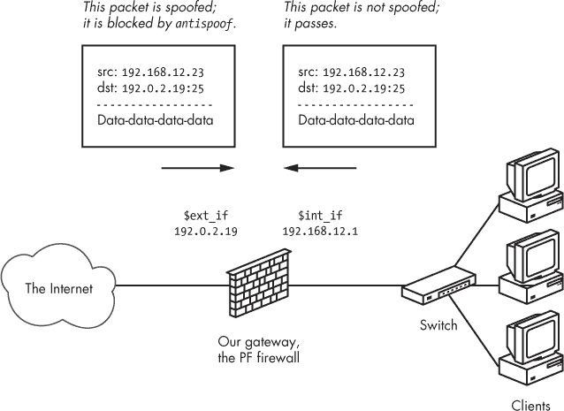
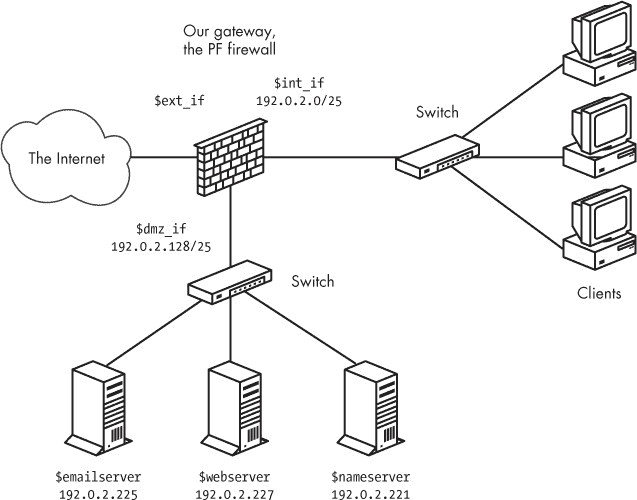

## 第十章：精确调整你的配置


到现在为止，你已经花费了大量时间设计你的网络并在 PF 配置中实现这个设计。将配置调整到完美——也就是说，消除任何剩余的配置错误和低效——有时可能非常具有挑战性。

本章描述了将帮助你获得所需配置的选项和方法。首先，我们将查看一些全球性选项和设置，它们会对配置的行为产生深远的影响。

## 你可以调整的内容和你可能不应该轻易更改的内容

网络配置本质上是非常可调的。在浏览 `pf.conf` 手册页或其他参考文档时，你可能会被可以调整的选项和设置的数量所淹没，以便获得一个完美优化的配置。

请记住，对于 PF 来说，*默认设置*对于大多数配置来说是合理的。有些设置和变量适合调优；其他设置则应附带一个大警告，表示只有在非常特殊的情况下，才应该进行调整（如果有必要的话）。

在这里，我们将看看一些你应该了解的全局设置，尽管在大多数情况下你不需要更改它们。

这些选项以 `set` *`选项设置`* 形式写出，并且要*放在*任何宏定义之后，*但在*翻译或过滤规则之前。

### 注意

*如果你阅读 `pf.conf` 手册页，你会发现还有一些其他选项。然而，大多数选项在网络测试和性能调优的上下文中并不相关。*

### 阻止策略

`block-policy` 选项决定了 PF 是否会向尝试创建连接但被随后阻止的主机提供反馈。如果提供反馈，该选项有两个可能的值：

+   `drop` 在没有反馈的情况下丢弃被阻止的数据包。

+   `return` 用状态码返回，例如 `Connection refused` 或类似信息。

阻止策略的正确策略多年来一直是一个备受讨论的话题。`block-policy` 的默认设置是 `drop`，这意味着数据包会被静默丢弃，没有任何反馈。然而，静默丢弃数据包会让发送方可能重新发送那些未确认的数据包，而不是断开连接。因此，发送方可能会继续发送，直到相关的超时计数器到期。如果你不希望这种行为成为默认设置，可以将阻止策略设置为 `return`：

```
set block-policy return
```

这个设置意味着发送方的网络堆栈将收到一个明确的信号，表示连接被拒绝。

无论你使用哪种`block-policy`选项，它都会指定*全局*默认的阻塞策略。然而，如果需要，你仍然可以为特定规则修改阻塞类型。例如，你可以将暴力破解保护规则集从第六章更改为将`block-policy`设置为`return`，但也可以使用`block drop quick from <bruteforce>`来让暴力破解者浪费时间，如果他们在被添加到`<bruteforce>`表后还继续停留。你还可以为来自不可路由地址的流量指定`drop`，这些流量通过你的面向互联网的接口进入，或者其他明显不受欢迎的流量，例如尝试将你的设备用于放大分布式拒绝服务（DDoS）攻击。^([49])

### 跳过接口

`skip`选项让你将特定接口排除在所有 PF 处理之外。其效果类似于该接口上的`pass-all`规则，但实际上它禁用了该接口上的所有 PF 处理。例如，你可以使用此选项来禁用回环接口组的过滤，在大多数配置中，在该接口上进行过滤对于安全性或便利性几乎没有帮助：

```
set skip on lo
```

实际上，在回环接口上进行过滤几乎没有任何用处，而且可能会导致一些常见程序和服务出现奇怪的结果。默认情况下，`skip`未设置，这意味着所有配置的接口都可以参与 PF 处理。除了让规则集稍微简化之外，在不需要过滤的接口上设置`skip`会带来轻微的性能提升。

### 状态策略

`state-policy`选项指定 PF 如何将数据包与状态表匹配。它有两个可能的值：

+   使用默认的`floating`状态策略，流量可以在所有接口上匹配状态，而不仅仅是状态创建的那个接口。

+   使用`if-bound`策略时，流量将只在创建状态的接口上匹配；其他接口上的流量将无法匹配现有的状态。

与`block-policy`选项类似，此选项指定全局的状态匹配策略，但如果需要，你可以在每条规则的基础上覆盖状态匹配策略。例如，在使用默认`floating`策略的规则集中，你可以有如下规则：

```
pass out on egress inet proto tcp to any port $allowed modulate state (if-bound)
```

使用此规则，任何尝试重新进入的返回流量必须通过创建状态的相同接口才能匹配状态表条目。

`if-bound`策略有用的情况非常少，因此你应该将此设置保留为默认值。

### 状态默认

在 OpenBSD 4.5 中引入的`state-defaults`选项使你可以将特定的状态选项设置为规则集中所有规则的默认选项——除非这些状态选项在单个规则中被其他选项显式覆盖。

这是一个常见的例子：

```
set state-defaults pflow
```

该选项设置配置中的所有`pass`规则，以生成通过`pflow`设备导出的 NetFlow 数据。

在某些情况下，将状态跟踪选项（例如连接限制）作为全局状态默认值应用于整个规则集是有意义的。以下是一个示例：

```
set state-defaults max 1500, max-src-conn 100, source-track rule
```

此选项将每条规则的默认最大状态条目数设置为 1,500，单个主机的最大并发连接数为 100，并且每个加载的规则集中的每条规则都有单独的限制。

对于 `keep state` 中的任何有效选项，它们也可以包含在 `set state-defaults` 语句中。如果有一些状态选项不是系统默认的，但您希望将其应用于配置中的所有规则，使用这种方式设置状态默认值是很有用的。

### 超时

`timeout` 选项设置了与状态表条目相关的超时和相关选项。大多数可用的参数是特定于协议的值，以秒为单位存储，并以 `tcp.`、`udp.`、`icmp.` 和 `other.` 为前缀。然而，`adaptive.start` 和 `adaptive.end` 表示状态表条目的数量。

以下 `timeout` 选项会影响状态表的内存使用和在一定程度上的查找速度：

+   `adaptive.start` 和 `adaptive.end` 值设置了当状态条目数量达到 `adaptive.start` 值后，超时值缩减的限制。当状态数量达到 `adaptive.end` 时，所有超时都被设置为 0，实际上立即使所有状态过期。默认值为 6,000 和 12,000（分别计算为状态限制的 60% 和 120%）。这些设置与通过 `limit` 选项设置的内存池限制参数密切相关。

+   `interval` 值表示清除过期状态和片段之间的秒数。默认值为 10 秒。

+   `frag` 值表示在丢弃之前，片段将保持在未组装状态的秒数。默认值为 30 秒。

+   设置后，`src.track` 表示源跟踪数据将在最后一个状态过期后保持的秒数。默认值为 0 秒。

您可以通过 `pfctl -s timeouts` 检查所有 `timeout` 参数的当前设置。例如，以下显示了一个使用默认值运行的系统：

```
$ **sudo pfctl -s timeouts**
tcp.first                  120s
tcp.opening                 30s
tcp.established          86400s
tcp.closing                900s
tcp.finwait                 45s
tcp.closed                  90s
tcp.tsdiff                  30s
udp.first                   60s
udp.single                  30s
udp.multiple                60s
icmp.first                  20s
icmp.error                  10s
other.first                 60s
other.single                30s
other.multiple              60s
frag                        30s
interval                    10s
adaptive.start            6000 states
adaptive.end             12000 states
src.track                    0s
```

这些选项可以用来调整您的设置以优化性能。然而，从默认值更改协议特定的设置会带来一定的风险，因为有效但空闲的连接可能会被过早丢弃或直接阻止。

### 限制

`limit` 选项设置 PF 用于状态表和地址表的内存池大小。这些是硬性限制，因此您可能需要根据各种原因增加或调整这些值。如果您的网络繁忙，且需要的数量超过了默认值的限制，或者如果您的设置需要较大的地址表或大量的表，那么本节将非常相关。

请记住，通过内存池可用的总内存量来自*内核内存空间*，而总可用量是总可用内核内存的函数。内核内存在一定程度上是动态的，但分配给内核的内存量永远不能等于或超过系统中的所有物理内存。 （如果发生这种情况，将没有空间运行用户模式程序。）

可用池内存量取决于您使用的硬件平台以及特定于本地系统的一些难以预测的变量。在 i386 架构上，最大内核内存在 768MB 至 1GB 范围内，这取决于多种因素，包括系统中的硬件设备数量和类型。实际可用于内存池分配的数量来自这个总数，同样取决于一些特定于系统的变量。

要检查当前的`limit`设置，请使用`pfctl -sm`。典型的输出如下：

```
$ **sudo pfctl -sm**
states        hard limit   10000
src-nodes     hard limit   10000
frags         hard limit    5000
tables        hard limit    1000
table-entries hard limit   200000
```

要更改这些值，请编辑*pf.conf*以包括一个或多个包含新`limit`值的行。例如，您可以使用以下行提高状态数的硬限制到 25,000，并将表条目数的硬限制提高到 300,000：

```
set limit states 25000
set limit table-entries 300000
```

你也可以在单行中通过括号同时设置多个`limit`参数：

```
set limit { states 25000, src-nodes 25000, table-entries 300000 }
```

总之，除非为较大的安装可能增加这三个参数，否则你几乎肯定不应该改变任何限制。然而，如果确实这样做，监视系统日志以获取任何指示您更改的限制具有不良副作用或不适合可用内存的迹象是非常重要的。将`debug`级别设置为更高值对于观察调整`limit`参数的效果可能非常有用。

### 调试

`debug`选项决定了 PF 在*kern.debug*日志级别下生成的错误信息（如果有）。默认值为`err`，意味着只记录严重错误。自 OpenBSD 4.7 以来，这里的日志级别对应于常规`syslog`级别，从`emerg`（记录紧急情况）、`alert`（可更正但非常严重的错误）、`crit`（记录关键条件）、`err`（记录错误）到`warning`（记录警告）、`notice`（记录异常情况）、`info`（记录信息消息）和`debug`（记录完整调试信息，可能只对开发人员有用）。

### 注意

*在 OpenBSD 4.7 之前的版本中，PF 使用其自己的日志级别系统，默认为`urgent`（相当于新系统中的`err`）。其他可能的设置包括`none`（无消息）、`misc`（比`urgent`稍多报告）、`loud`（对大多数操作生成状态消息）。为了兼容性，`pfctl`解析器仍然接受旧式调试级别。*

在我的一个网关以`debug`级别运行了一段时间后，*/var/log/messages*文件的一个典型块看起来是这样的：

```
**$ tail -f /var/log/messages**
Oct 4 11:41:11 skapet /bsd: pf_map_addr: selected address 194.54.107.19
Oct 4 11:41:15 skapet /bsd: pf: loose state match: TCP 194.54.107.19:25
194.54.107.19:25 158.36.191.135:62458 [lo=3178647045 high=3178664421 win=33304
modulator=0 wscale=1] [lo=3111401744 high=3111468309 win=17376 modulator=0
wscale=0] 9:9 R seq=3178647045 (3178647044) ack=3111401744 len=0 ackskew=0
pkts=9:12
Oct 4 11:41:15 skapet /bsd: pf: loose state match: TCP 194.54.107.19:25
194.54.107.19:25 158.36.191.135:62458 [lo=3178647045 high=3178664421 win=33304
modulator=0 wscale=1] [lo=3111401744 high=3111468309 win=17376 modulator=0
wscale=0] 10:10 R seq=3178647045 (3178647044) ack=3111401744 len=0 ackskew=0
pkts=10:12
Oct 4 11:42:24 skapet /bsd: pf_map_addr: selected address 194.54.107.19
```

在`debug`级别，PF 会重复报告当前正在处理的接口的 IP 地址。在选择的地址信息之间，PF 会对同一数据包发出两次警告，提示序列号处于期望范围的边缘。初看起来，这种详细级别似乎有点压倒性，但在某些情况下，研究这种输出是诊断问题的最佳方法，之后还可以检查是否你的解决方案起到了作用。

### 注意

*此选项可以通过命令行使用`pfctl -x`设置，后跟你想要的调试级别。命令`pfctl -x debug`将提供最大调试信息；`pfctl -x none`会完全关闭调试消息。*

请记住，一些`debug`设置可能会产生大量日志数据，在极端情况下，可能会影响性能，甚至达到自我拒绝服务的程度。

### 规则集优化

`ruleset-optimization`选项启用或设置规则集优化器的模式。OpenBSD 4.1 及等效版本中，`ruleset-optimization`的默认设置为`none`，这意味着在加载时不执行规则集优化。从 OpenBSD 4.2 开始，默认设置为`basic`，这意味着在规则集加载时，优化器会执行以下操作：

+   删除重复的规则

+   删除作为其他规则子集的规则

+   如果适合，合并规则到表中（典型的规则到表优化是根据相同标准（源和/或目标地址除外）来进行传递、重定向或阻止的规则）

+   更改规则顺序以提高性能

例如，假设你有宏`tcp_services = { ssh, www, https }`，并结合规则`pass proto tcp from any to self port $tcp_services`。在规则集中其他地方，你还有一个不同的规则，表示`pass proto tcp from any to self port ssh`。第二个规则显然是第一个规则的子集，它们可以合并为一个。另一个常见的组合是有一个`pass`规则，如`pass proto tcp from any to int_if:network port $tcp_services`，其余的`pass`规则相同，目标地址都在`int_if:network`范围内。

在`ruleset-optimization`设置为`profile`时，优化器会根据网络流量分析已加载的规则集，以确定`quick`规则的最佳顺序。

你还可以通过命令行使用`pfctl`设置优化选项的值：

```
$ **sudo pfctl -o basic**
```

此示例启用`basic`模式下的规则集优化。

由于优化可能会移除或重新排序规则，因此某些统计数据的含义—主要是每条规则的评估次数—可能会以难以预测的方式发生变化。然而，在大多数情况下，效果是微不足道的。

### 优化

`optimization`选项指定用于状态超时处理的配置文件。可选值包括`normal`、`high-latency`、`satellite`、`aggressive`和`conservative`。建议保持默认的`normal`设置，除非你有非常特定的需求。

`high-latency` 和 `satellite` 是同义词；使用这些值时，状态会更慢地过期，以补偿潜在的高延迟。

`aggressive` 设置会提前过期状态以节省内存。原则上，这可能会增加丢弃空闲但有效连接的风险，尤其是在系统已经接近负载和流量极限时，但根据经验，`aggressive` 优化设置很少，甚至从未干扰有效流量。

`conservative` 设置尽可能地保留状态和空闲连接，代价是会增加一些内存使用。

### 碎片重组

与 `scrub` 相关的碎片重组选项在 OpenBSD 4.6 中进行了显著的重构，引入了新的 `set reassemble` 选项，用于开启或关闭碎片包的重组。如果 `reassemble` 设置为 `off`，则碎片包会被丢弃，除非它们匹配一个包含 `fragment` 选项的规则。默认设置是 `set reassemble on`，这意味着碎片包会被重组，且在重组后的包中，原本在单个碎片上设置的不分片位会被清除。

## 清理你的流量

接下来我们将讨论的两个特性，`scrub` 和 `antispoof`，有一个共同的主题：它们提供了自动保护，防止网络流量中潜在的危险杂乱物。总的来说，它们通常被称为“网络卫生”工具，因为它们大大净化了网络流量。

### 包规范化与清理：OpenBSD 4.5 及更早版本

在 PF 版本（包括 OpenBSD 4.5 及之前版本）中，`scrub` 关键字启用网络流量规范化。使用 `scrub` 时，碎片化的包会被重新组装，非法的碎片——如重叠的碎片——会被丢弃，从而使得最终的包完整且明确无误。

启用 `scrub` 提供了一定程度的保护，防止某些基于包碎片错误处理的攻击。^([50]) 有许多附加选项可以使用，但最简单的形式适用于大多数配置：

```
scrub in
```

为了使某些服务能与 `scrub` 一起工作，必须设置特定选项。例如，某些 NFS 实现根本无法与 `scrub` 一起使用，除非你使用 `no-df` 参数清除任何设置了不分片位的包中的该位。某些服务、操作系统和网络配置的组合可能需要使用一些更为特殊的 `scrub` 选项。

### 包括清理的包规范化：OpenBSD 4.6 及之后版本

在 OpenBSD 4.6 中，`scrub` 从独立规则内容降级为一个可以附加到 `pass` 或 `match` 规则的动作（引入 `match` 规则是 OpenBSD 4.6 中 PF 的主要新特性之一）。在同一版本中对 `scrub` 代码进行重写时，另一个重要的变化是，众多的包重组选项被删除，取而代之的是新的 `reassemble` 选项，该选项简单地打开或关闭重组。

使用新的`scrub`语法时，你需要在括号中提供至少一个选项。以下配置对于我管理的几个网络来说效果很好：

```
match in all scrub (no-df max-mss 1440)
```

这个选项会清除“不要分片”位，并将最大分段大小设置为 1,440 字节。

还有其他变种，尽管`scrub`选项在 OpenBSD 4.6 版本中有所缩减，但通过查阅手册页和进行一些实验，你应该能够满足特定需求。对于大多数设置，像前面引用的全局匹配规则是合适的，但请记住，如果需要，你可以在每个规则的基础上变化`scrub`选项。

如果你发现需要调试与`scrub`相关的问题，请查阅`pf.conf`手册页并咨询相关邮件列表的专家。

### 使用 antispoof 防止地址伪造

一些非常有用和常见的数据包处理操作可以编写为 PF 规则，但如果不小心，它们会变得冗长、复杂且容易出错。因此，`antispoof`被实现为一个常见的特殊情况过滤和阻止机制。该机制通过阻止看似来自不可能逻辑方向的数据包来防止伪造或伪装的 IP 地址活动。

使用`antispoof`，你可以指定希望过滤掉来自全世界的伪造流量，以及可能来自你自己网络的伪造数据包。图 10-1 展示了这个概念。

图 10-1. antispoof 丢弃来自错误网络的数据包。

要建立图中所示的那种保护，需为图示网络中的两个接口指定`antispoof`，并使用以下两行配置：

```
antispoof for $ext_if
antispoof for $int_if
```

这些行扩展为复杂的规则。第一条规则阻止来自看似直接连接到 antispoof 接口的网络的流量，但该流量却通过了不同的接口。第二条规则对内部接口执行相同的功能，阻止任何带有看似本地网络地址的流量，通过非`$int_if`接口到达。然而，请记住，`antispoof`并不旨在检测与运行 PF 的机器不直接连接的远程网络的地址伪造。

## 测试你的设置

现在是时候拿出精确的规格，来描述你的设置*应该*如何工作了。

我们示例网络的物理布局以一个*网关*为中心，该网关通过 `$ext_if` 连接到互联网。通过 `$int_if` 连接到网关的是一个*本地网络*，该网络包含工作站，可能还包括一个或多个供本地使用的服务器。最后，我们有一个*DMZ*，它通过 `$dmz_if` 连接，里面的服务器提供服务给本地网络和互联网。图 10-2 显示了该网络的逻辑布局。

图 10-2. 带有 DMZ 服务器的网络

相应的规则集规范大致如下：

+   我们网络外的机器应该能够访问我们在 DMZ 中的服务器提供的服务，但不应访问本地网络。

+   我们本地网络中的机器，连接到 `$int_if`，应能够访问 DMZ 中的服务器提供的服务，并访问我们网络外定义的服务列表。

+   DMZ 中的机器应能访问外部世界的一些网络服务。

当前的任务是确保我们现有的规则集确实实现了规范。我们需要测试该设置。一个有用的测试是尝试表 10-1 中的测试序列。

你的配置可能需要进行其他测试，或者在某些细节上有所不同，但你实际的测试场景应该明确说明如何记录数据包和连接。关键是，在开始测试之前，你应该决定每个测试用例的预期和期望结果是什么。

通常，你应使用典型用户可能使用的应用程序进行测试，比如不同操作系统上的网页浏览器或邮件客户端。连接应该按照规范简单地成功或失败。如果一个或多个基本测试结果不符合预期，可以开始调试你的规则集。

表 10-1. 示例规则集测试用例序列

| 测试操作 | 预期结果 |
| --- | --- |
| 尝试从本地网络到 DMZ 中每个服务器的允许端口进行连接。 | 连接应通过。 |
| 尝试从本地网络到网络外服务器的每个允许端口进行连接。 | 连接应通过。 |
| 尝试从 DMZ 到本地网络的任何端口进行连接。 | 连接应被阻止。 |
| 尝试从 DMZ 到你网络外服务器的每个允许端口进行连接。 | 连接应通过。 |
| 尝试从网络外部到 DMZ 中的 `$webserver` 在 `$webports` 中的每个端口进行连接。 | 连接应通过。 |
| 连接应通过。尝试从网络外部到 DMZ 中的 `$webserver` 在端口 25（SMTP）上的连接。 | 连接应被阻止。 |
| 尝试从网络外部连接到 DMZ 中端口 80（HTTP）的`$emailserver`。 | 连接应该被阻止。 |
| 尝试从网络外部连接到 DMZ 中端口 25（SMTP）的`$emailserver`。 | 连接应该被允许。 |
| 尝试从网络外部连接到本地网络中的一台或多台机器。 | 连接应该被阻止。 |

## 调试你的规则集

当你的配置没有按预期行为时，可能是规则集逻辑存在错误，因此你需要找到错误并纠正它。追踪规则集中的逻辑错误可能会非常耗时，可能需要手动评估规则集——包括它在`pf.conf`文件中的存储版本，以及宏扩展和任何优化后的加载版本。

用户通常最初将问题归咎于 PF，但实际上问题往往是基本的网络问题。网络接口设置错误的双工模式、错误的子网掩码和故障的网络硬件是常见的罪魁祸首。

在深入规则集本身之前，你可以轻松地判断 PF 配置是否引发了问题。为此，可以通过`pfctl -d`禁用 PF，看看问题是否消失。如果禁用 PF 后问题仍然存在，你应该转而调试网络配置的其他部分。如果禁用 PF 后问题消失，并且你准备开始调整 PF 配置，请确保 PF 已启用，并且通过以下命令加载了你的规则集：

```
**$ sudo pfctl -si | grep Status**
Status: Enabled for 20 days 06:28:24          Debug: err
```

`Status: Enabled`告诉我们 PF 已启用，因此我们尝试使用不同的`pfctl`命令查看已加载的规则：

```
**$ sudo pfctl -sr**
match in all scrub (no-df max-mss 1440)
block return log all
block return log quick from <bruteforce> to any
anchor "ftp-proxy/*" all
```

这里，`pfctl -sr`等同于`pfctl -s rules`。输出可能会比这里显示的稍长，但这可以作为加载规则集时你应该预期看到的输出的一个好例子。

为了调试的目的，可以考虑在`pfctl`命令行中添加`-vv`标志，以查看规则编号和一些额外的调试信息，像这样：

```
**$ sudo pfctl -vvsr**
@0 match in all scrub (no-df max-mss 1440)
  [ Evaluations: 341770    Packets: 3417668   Bytes: 2112276585  States: 125  ]
  [ Inserted: uid 0 pid 14717 State Creations: 92254 ]
@1 match out on nfe0 inet from 10.0.0.0/8 to any queue(q_def, q_pri) nat-to
(nfe0:1) round-robin static-port
  [ Evaluations: 341770    Packets: 0         Bytes: 0           States: 0    ]
  [ Inserted: uid 0 pid 14717 State Creations: 0 ]
@2 match out on nfe0 inet from 192.168.103.0/24 to any queue(q_def, q_pri)
nat-to (nfe0:1) round-robin static-port
  [ Evaluations: 68623     Packets: 2138128   Bytes: 1431276138  States: 103  ]
  [ Inserted: uid 0 pid 14717 State Creations: 39109 ]
@3 block return log all
  [ Evaluations: 341770    Packets: 114929    Bytes: 62705138    States: 0    ]
  [ Inserted: uid 0 pid 14717 State Creations: 0 ]
@4 block return log (all) quick from <bruteforce:0> to any
  [ Evaluations: 341770    Packets: 2         Bytes: 104         States: 0    ]
  [ Inserted: uid 0 pid 14717 State Creations: 0 ]
@5 anchor "ftp-proxy/*" all
  [ Evaluations: 341768    Packets: 319954    Bytes: 263432399   States: 0    ]
  [ Inserted: uid 0 pid 14717 State Creations: 70 ]
```

现在你应该对加载的规则集进行结构化的逐步检查。找到与正在调查的数据包匹配的规则。最后匹配的规则是什么？如果有多个规则匹配，其中有一个是`quick`规则吗？（如你在前面的章节中可能记得，当数据包匹配一个`quick`规则时，评估会停止，`quick`规则指定的内容就是数据包的处理方式。）如果是这样，你需要追踪评估过程，直到到达规则集的末尾，或者数据包匹配到一个`quick`规则，之后过程结束。如果你的规则集逐步检查的结果与预期匹配的数据包规则不同，你就找到了逻辑错误。务必小心`match`规则。如果你无法确定为何特定数据包匹配了某个`block`或`pass`规则，原因可能是某个`match`规则应用了一个操作，使得数据包或连接匹配了与预期不同的过滤标准。

规则集逻辑错误通常分为三种类型：

+   你的规则没有匹配，因为它从未被评估。规则集中的一个`quick`规则先匹配了，评估就停止了。

+   你的规则被评估，但由于规则的标准，最终没有匹配到数据包。

+   你的规则被评估并且匹配，但数据包也匹配了规则集中的另一个规则。最后匹配的规则决定了连接的处理方式。

第九章介绍了`tcpdump`，它是一个读取和解读 PF 日志的有价值工具。该程序也非常适合查看特定接口上通过的流量。你关于 PF 日志的学习，以及如何使用`tcpdump`的过滤功能，将在你想要追踪到底是哪些数据包到达了哪个接口时派上用场。

这是一个使用`tcpdump`监控 TCP 流量（但不包括 SSH 或 SMTP 流量）在`xl0`接口上的示例，并以非常详细的模式（`vvv`）打印结果。

```
**$ sudo tcpdump -nvvvpi xl0 tcp and not port ssh and not port smtp**
tcpdump: listening on xl0, link-type EN10MB
21:41:42.395178 194.54.107.19.22418 > 137.217.190.41.80: S [tcp sum ok]
3304153886:3304153886(0) win 16384 <mss 1460,nop,nop,sackOK,nop,wscale
0,nop,nop,timestamp 1308370594 0> (DF) (ttl 63, id 30934, len 64)
21:41:42.424368 137.217.190.41.80 > 194.54.107.19.22418: S [tcp sum ok]
1753576798:1753576798(0) ack 3304153887 win 5792 <mss 1460,sackOK,timestamp
168899231 1308370594,nop,wscale 9> (DF) (ttl 53, id 0, len 60)
```

这里展示的连接是成功连接到一个网站。

然而，仍然有更多有趣的事情需要探索，比如连接在不应该失败的情况下失败，或者连接在你的规范明确表示不应该成功的情况下却成功。

这些情况中的测试涉及追踪数据包在你配置中的路径。再次强调，检查 PF 是否启用，或者禁用 PF 是否会产生不同的结果是非常有用的。在初步测试的结果基础上，你将执行与之前描述的相同类型的规则集分析：

+   一旦你对数据包如何穿越规则集和网络接口有了合理的理论，就使用`tcpdump`逐一查看每个接口上的流量。

+   使用`tcpdump`的过滤功能来提取你需要的信息——也就是说，只查看应该匹配你特定情况的数据包，比如`port smtp and dst 192.0.2.19`。

+   找到你的假设与网络流量现实不匹配的地方。

+   为可能涉及的规则开启日志记录，并将`tcpdump`应用于相关的`pflog`接口，查看数据包实际上匹配了哪个规则。

测试过程的主要框架是相对固定的。如果你已经将原因缩小到你的 PF 配置，那么，接下来就是找出哪些规则匹配，哪个规则最终决定数据包是通过还是被阻塞。

## 了解你的网络并保持控制

本书的反复主题是，PF 和相关工具如何使你作为网络管理员相对容易地控制你的网络，并让它按你希望的方式运作——换句话说，PF 如何帮助你构建所需的网络。

运行网络是件有趣的事，希望你已经享受了我认为是网络安全最佳工具的介绍。在介绍 PF 时，我一开始就做出了一个有意识的决定：通过有趣且有用的配置向你介绍方法和思维方式，而不是提供一个完整的功能目录，或者把这本书做成完整的参考手册。完整的 PF 参考资料已经存在于手册页中，这些手册每六个月会随着新的 OpenBSD 版本发布而更新。你还可以在我在附录 A 中列出的资源中找到更多信息。

现在你已经具备了关于 PF 可以做什么的广泛基础知识，你可以开始根据自己的需求来构建网络。你已经到了可以在手册页中找到所需准确信息的阶段。这时，真正有趣的部分开始了！

* * *

^([49]) 如果你还没有遇到过这种恶劣情况，迟早会遇到。这是关于一个 DDoS 攻击案例的描述，攻击者和受害者的笨拙程度几乎相等——*［http://bsdly.blogspot.com/2012/12/ddos-bots-are-people-or-manned-by-some.html](http://bsdly.blogspot.com/2012/12/ddos-bots-are-people-or-manned-by-some.html)*。你的攻击者很可能比这些更聪明、更装备精良。

^([50]) 一些著名的攻击技术，包括几种历史上的拒绝服务攻击（DoS）设置，利用了片段处理中的漏洞，这可能导致内存溢出或其他资源耗尽。一种针对思科 PIX 防火墙系列的漏洞就是在*［http://www.cisco.com/en/US/products/products_security_advisory09186a008011e78d.shtml](http://www.cisco.com/en/US/products/products_security_advisory09186a008011e78d.shtml)*中描述的。
