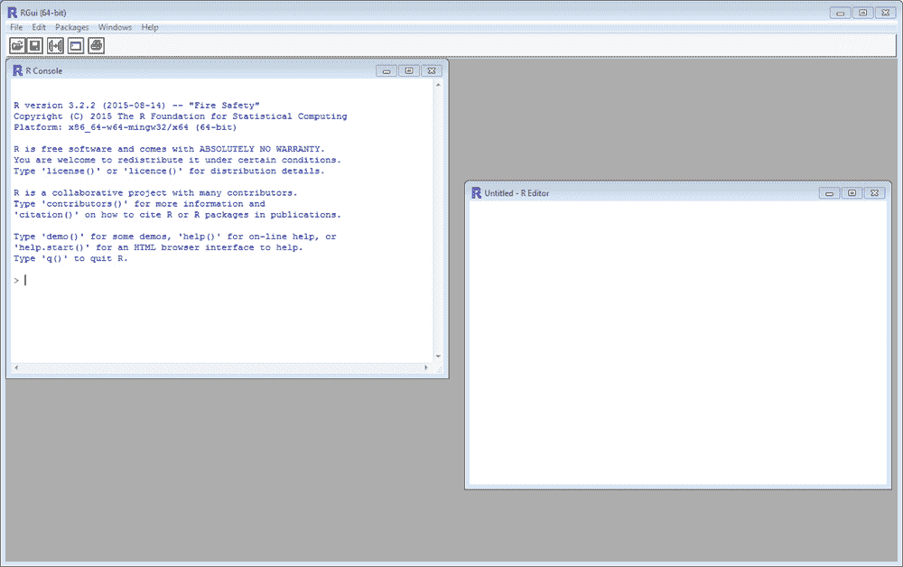
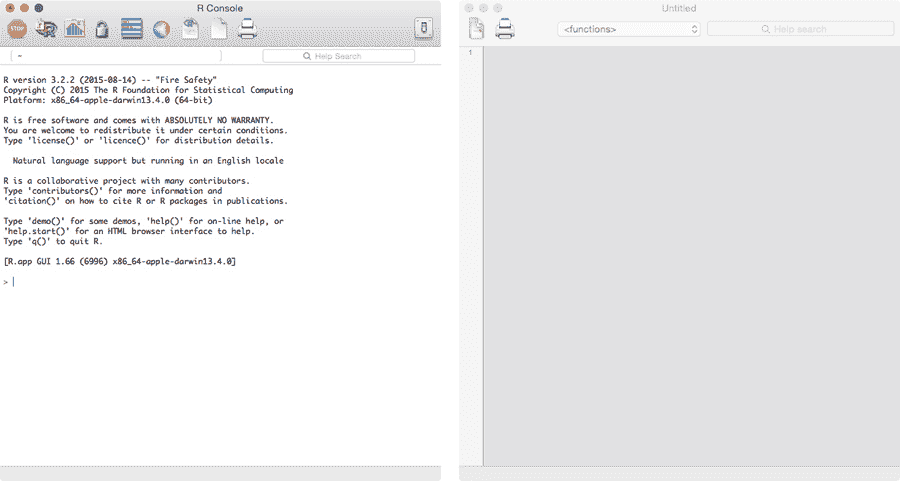
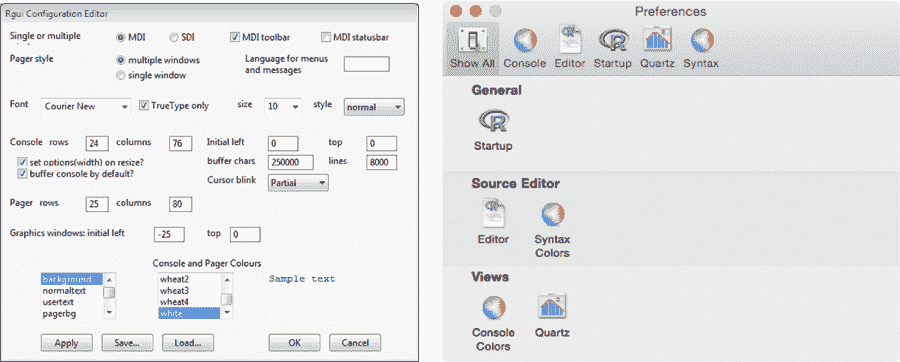
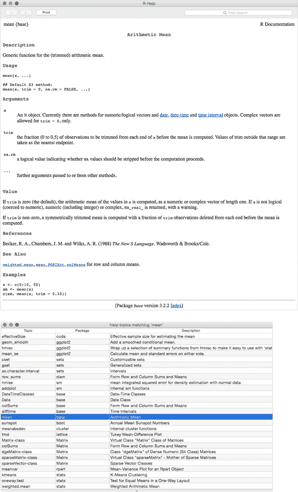
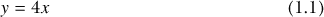

## **1**

**开始使用**


R 提供了一个非常灵活的编程环境，深受许多从事数据分析工作的研究人员喜爱。在本章中，我将为学习和使用 R 打下基础，并介绍安装 R 的基础知识以及一些在开始之前值得了解的内容。

### **1.1 从 CRAN 获取和安装 R**

R 可用于 Windows、OS X 和 Linux/Unix 平台。你可以在综合 R 存档网络（CRAN）上找到 R 资源的主要集合。如果你访问 R 项目网站 *[`www.r-project.org/`](http://www.r-project.org/)*，你可以导航到本地的 CRAN 镜像，并下载与你的操作系统相关的安装程序。第 A.1 节提供了安装 R 基础分发版的逐步说明。

### **1.2 初次打开 R**

R 是一种解释型语言，严格区分大小写和字符，这意味着你需要将遵循特定语法规则的指令输入到控制台或命令行界面中。软件随后解释并执行你的代码，并返回任何结果。

**注意**

*R 是一种所谓的* 高级 *编程语言。* 级别 *是指从计算机执行的基本细节中抽象出来的层次。也就是说，低级语言需要你像手动管理机器的内存分配一样做一些事情，但像 R 这样的高级语言，幸运的是，你不需要处理这些技术细节。*

当你打开基础 R 应用程序时，会看到 R 控制台；图 1-1 显示了 Windows 中的实例，图 1-2 左图显示了 OS X 中的示例。这代表了 R 自然融入的 *图形用户界面（GUI）*，这是使用基础 R 的典型方式。



*图 1-1：Windows 中 R GUI 应用程序（默认配置）*

解释器的功能性和“简洁”的外观，在我看来，常常让许多本科生感到畏惧，这也恰恰体现了该软件的本质——一个空白的统计画布，可以用于任何数量的任务。请注意，OS X 版本使用单独的窗口来显示控制台和编辑器，而 Windows 中的默认行为是将这些面板包含在一个整体的 R 窗口中（如果需要，你可以在 GUI 偏好设置中更改此设置；详见第 1.2.1 节）。



*图 1-2：OS X 中的基础 R GUI 控制台面板（左）和新打开的内置编辑器实例（右）*

**注意**

*正如我刚才所做的那样，在本书的某些部分，我将特别提到 Windows 和 OS X 中的 R GUI 功能，因为这两种平台是初学者最常用的。除了 Linux/Unix 实现之外，R 也可以从终端或 shell 运行，甚至可以在批处理模式下运行。书中的绝大多数代码在所有设置下都是功能性的。*

#### ***1.2.1 控制台和编辑器面板***

用于编程 R 代码和查看输出的有两种主要窗口类型。你刚刚看到的控制台或命令行解释器是所有执行发生的地方，也是所有文本和数字输出的地方。你可以直接使用 R 控制台进行计算或绘图。通常，你只会直接使用控制台来执行短小的单行命令。

默认情况下，R 的 *提示符* 用 `>` 符号表示，表示 R 已准备好并等待输入命令，此时光标会出现在提示符后面。为了避免与数学符号“更大于”的符号 > 混淆，一些作者（包括我）更喜欢修改这个提示符。一个常见的选择是 `R>`，你可以按如下方式设置：

```
> options(prompt="R> ")
R>
```

将光标置于提示符后，你可以使用键盘上的向上箭头（↑）和向下箭头（↓）滚动浏览之前执行过的命令；这在对之前的命令进行小幅调整时非常有用。

对于较长的代码块和函数的编写，最好先在 *编辑器* 中编写命令，完成后再在控制台中执行。为此，R 提供了一个内置的代码编辑器。在代码编辑器中编写的 R *脚本* 本质上只是带有 *.R* 扩展名的纯文本文件。

你可以通过 R GUI 菜单打开一个新的编辑器实例（例如，在 Windows 中选择 文件 → 新建脚本，或者在 OS X 中选择 文件 → 新建文档）。

内置编辑器提供了有用的快捷键（例如，在 Windows 中是 CTRL-R，或者在 OS X 中是 -RETURN），这些快捷键会自动将行发送到控制台。你可以发送光标所在的行、已选中的行、已选中的行的一部分，或者已选中的代码块。当你在处理多个 R 脚本文件时，通常会同时打开多个编辑器面板；快捷键提交代码时只会作用于当前选中的编辑器。

控制台和编辑器的美学效果，如着色和字符间距，可以根据操作系统的不同进行一定程度的定制；你只需访问相关的 GUI 偏好设置即可。图 1-3 显示了 Windows 中的 R GUI 偏好设置（编辑 → GUI 偏好设置...）和 OS X 中的设置（R → 偏好设置...）。特别是 OS X 版本的 R 提供了代码着色和括号匹配功能，这能提高大量代码的编写和可读性。



*图 1-3：Windows（左）和 OS X（右）中的 R GUI 偏好设置*

#### ***1.2.2 注释***

在 R 中，您可以使用 *注释* 来注解您的代码。只需在行首加上井号符号（`#`），之后的内容将被解释器忽略。例如，在控制台执行以下内容不会做任何事情，只会将您返回到提示符：

```
R> # This is a comment in R...
```

注释也可以出现在有效命令之后。

```
R> 1+1 # This works out the result of one plus one!
[1] 2
```

如果您在编辑器中编写大量或复杂的代码，这种注释可以帮助其他人（以及您自己！）理解您的代码在做什么。

#### ***1.2.3 工作目录***

活跃的 R 会话始终与一个 *工作目录* 相关联。除非您在保存或导入数据文件时明确指定文件路径，否则 R 会默认使用这个工作目录。要检查工作目录的位置，可以使用 `getwd` 函数。

```
R> getwd()
[1] "/Users/tdavies"
```

文件路径总是被双引号括起来，R 在指定文件夹位置时使用正斜杠，而不是反斜杠。

您可以使用 `setwd` 函数更改默认工作目录，如下所示：

```
R> setwd("/folder1/folder2/folder3/")
```

您可以相对于当前工作目录提供文件路径，或者提供完整路径（换句话说，从系统根驱动器开始）。无论哪种方式，都必须记住 R 对大小写敏感；您必须精确匹配文件夹名称的大小写和标点符号，否则会抛出错误。

也就是说，如果您愿意每次读取或写入文件时都指定完整且正确的文件路径（第八章中有更多细节），那么相关文件可以存放在您计算机的任何位置。

#### ***1.2.4 安装和加载 R 包***

R 的基本安装已经准备好大量内建命令，用于数值计算、常见统计分析以及绘图和可视化。这些命令可以直接使用，无需任何加载或导入。我将在本文中称这些函数为 *内建* 或 *现成可用* 的函数。

更加专业的技术和数据集包含在 *包*（也称为 *库*）中。使用贡献的包是常见的做法，在本书中您将会经常这样做，因此熟悉安装和加载所需库非常重要。

第 A.2 节涵盖了从 CRAN 下载和安装软件包的相关细节，但在这里我将提供一个简要概述。

##### **加载包**

有少数推荐的包已经包含在 R 的基础分发版中（列在 第 A.2.2 节）。这些包无需单独安装，但要使用它们，您需要通过调用 `library` 来加载它们。在本书中，您将使用一个名为 `MASS` 的包（Venables 和 Ripley, 2002）。要加载它（或任何其他已安装的包）并访问其功能和数据集，只需在提示符下执行 `library`，如下所示：

```
R> library("MASS")
```

请注意，调用 `library` 仅为当前的 R 会话提供对包功能的访问。当你关闭 R 并重新打开一个新的实例时，你需要重新加载任何你想使用的包。

##### **安装包**

有成千上万的贡献包没有包含在典型的 R 安装中；为了让它们可以在 R 中加载，你必须首先从仓库（通常是 CRAN）下载并安装它们。最简单的方法是直接在 R 提示符下使用 `install.packages` 函数（为此，你需要互联网连接）。

例如，`ks` 包（Duong, 2007）就是一个这样的包，你将在第二十六章中使用它。执行以下命令将尝试连接到本地 CRAN 镜像，下载并安装 `ks`，以及它依赖的几个包（称为*依赖项*）：

```
R> install.packages("ks")
```

控制台将在过程完成时显示运行输出。

你只需要安装包一次；之后它将对你的 R 安装可用。然后，你可以像加载 `MASS` 一样，通过调用 `library` 在任何新打开的 R 实例中加载已安装的包（如 `ks`）。

第 A.2.3 节提供了有关包安装的更多细节。

##### **更新包**

贡献包的维护者会定期提供版本更新，以修复错误和添加功能。你可能需要不时检查已安装包的更新情况。

从 R 提示符执行以下命令，将尝试连接到你的包仓库（默认为 CRAN），查找所有已安装包的更新版本。

```
R> update.packages()
```

第 A.3 节提供了更多关于更新包的详细信息，第 A.4 节讨论了备用 CRAN 镜像和仓库。

#### ***1.2.5 帮助文件和函数文档***

R 配备了一套*帮助文件*，你可以利用它们来搜索特定功能，了解如何使用给定的函数并指定其*参数*（换句话说，执行函数时你提供的值或对象），澄清参数在操作中的角色，学习任何返回对象的形式，提供函数使用示例，并获取如何引用软件或数据集的详细信息。

要访问给定命令或其他对象的帮助文件，请在控制台提示符下使用 `help` 函数或方便的快捷方式 `?`。例如，考虑现成的算术平均函数 `mean`。

```
R> ?mean
```

这会弹出图 1-4 中的文件。



*图 1-4：R 中函数* `mean` *的帮助文件*（上图）*和在 OS X 中搜索字符串* `"mean"` *的帮助结果*（下图）

如果你不确定所需函数的精确名称，你可以使用字符字符串（双引号中的语句）传递给`help.search`来搜索所有已安装包中的文档，或者你也可以使用`??`作为快捷方式：

```
R> ??"mean"
```

这个搜索会列出包含相关字符串的函数、它们所在的包和描述，如图 1-4 底部图像所示（高亮显示的条目是算术平均值的函数）。

所有帮助文件遵循图 1-4 顶部图像中展示的通用格式；文件的长度和详细程度通常反映了函数执行操作的复杂性。大多数帮助文件包括这里列出的前三项；其他项则是常见但可选的：

• *描述*部分简要说明了执行的操作。

• *用法*部分指定了函数的形式，包括如何将其传递给 R 控制台，参数的自然顺序以及任何默认值（这些是通过`=`设置的参数）。

• 在*参数*部分，提供了每个参数的详细说明，以及它们允许采用的可能值。

• 返回的对象的性质（如果有的话）在*返回值*下进行了说明。

• *参考文献*部分提供了与命令或函数背后的方法论相关的引用。

• 相关函数的帮助文件可以通过*另见*链接找到。

• *示例*提供了可以复制并粘贴到控制台中的可执行代码，演示函数的实际应用。

帮助文件中可能还有更多的字段——具有较长解释的函数通常在*参数*部分后面包含一个*详细信息*部分。调用函数时常见的陷阱或错误通常会放在*警告*部分，额外的信息可以放在*注释*部分。

虽然当你刚开始时它们看起来可能相当技术化，但我鼓励你继续查看帮助文件——即使你已经知道一个函数的工作原理，熟悉函数文档的布局和解释也是成为一名熟练 R 用户的重要步骤。

#### ***1.2.6 第三方编辑器***

R 的流行促使了多个第三方代码编辑器的开发，或者为现有的代码编辑软件提供兼容插件，这些都能提升在 R 中编程的体验。

一个值得注意的贡献是 RStudio（RStudio 团队，2015）。这是一个集成开发环境（IDE），可以在 Windows、OS X 和 Linux/Unix 平台上免费使用，网址为*[`www.rstudio.com/`](http://www.rstudio.com/)*。

RStudio 包含一个直接提交的代码编辑器；独立的点选面板，用于文件、对象和项目管理等功能；以及创建包含 R 代码的标记文档。附录 B 更详细地讨论了 RStudio 及其功能。

使用任何第三方编辑器，包括 RStudio，基本上是个人选择。在本书中，我假设使用的是典型的基础 R 图形用户界面应用程序。

### **1.3 保存工作并退出 R**

所以，你已经在 R 中编程几个小时了，是时候回家了吗？在保存 R 中的工作时，你需要注意两点：任何在当前会话中创建（并保存）的 R 对象，以及任何在编辑器中编写的 R 脚本文件。

#### ***1.3.1 工作区***

你可以使用 GUI 菜单项（例如，在 Windows 中是文件下的选项，在 OS X 中是工作区下的选项）来保存和加载 *工作区图像* 文件。一个 R 工作区图像包含了在退出时 R 会话中所有的信息，并以 *.RData* 文件形式保存。这将包括你在会话中创建并保存（换句话说，*分配*）的所有对象（你将在第二章中看到如何做到这一点），包括那些可能从先前的工作区文件中加载的对象。

本质上，加载存储的 *.RData* 文件可以让你“从上次停下的地方继续”。在 R 会话的任何时刻，你都可以在提示符下执行 `ls()`，它会列出当前在活动工作区中所有的对象、变量和用户定义的函数。

或者，你可以在控制台使用 R 命令 `save.image` 和 `load` 来处理工作区 *.RData* 文件——这两个函数都包含一个 `file` 参数，你可以传递目标 *.RData* 文件的文件夹位置和名称（有关这些函数的更多信息，请参见相应的帮助文件 `?save.image` 和 `?load`）。

请注意，以这种方式保存工作区图像不会保留先前加载的任何贡献包的功能。如第 1.2.4 节所述，你需要使用 `library` 来加载每个新的 R 实例所需的任何包。

退出软件的最快方式是输入 `q()` 在提示符下：

```
R> q()
```

仅仅退出控制台会弹出一个对话框，询问是否希望保存工作区图像。在这种情况下，选择保存并不会打开文件浏览器来命名你的文件，而是会在工作目录中创建（或覆盖）一个“无名”文件，并为其命名为 *.RData* 扩展名的文件（参见第 1.2.3 节）。

如果在默认工作目录中存在一个未命名的 *.RData* 文件，当打开新的 R 实例时，程序会自动加载该默认工作区——如果发生了这种情况，你将在控制台的欢迎文本中收到通知。

**注意**

*与 .RData 文件一起，R 会自动保存一个文件，包含所有在控制台中执行的命令的逐行历史记录，并将其保存在同一目录下的相关工作空间中。正是这个历史文件使你能够使用键盘方向键滚动查看之前执行的命令，正如前面所提到的。*

#### ***1.3.2 脚本***

对于需要超过少量命令的任务，通常你会希望在内置的代码编辑器中工作。因此，保存你的 R 脚本至少和保存工作空间一样重要，甚至可能更重要。

你将编辑器脚本保存为纯文本文件，文件扩展名为 *.R*（在第 1.2.1 节中提到）；这会让你的操作系统默认将这些文件与 R 软件关联。要从内置编辑器保存脚本，请确保选择了编辑器，然后导航到 文件 → 保存（或在 Windows 中按 CTRL-S，或在 OS X 中按 -S）。要打开一个之前保存的脚本，请选择 文件 → 打开脚本...（在 Windows 中按 CTRL-O），或在 OS X 中选择 文件 → 打开文档... (-O)。

通常，如果你的脚本文件已保存，你就不需要保存工作空间 *.RData* 文件。只要在新的 R 控制台中重新执行保存脚本中的任何必要命令，之前创建的对象（换句话说，即那些包含在保存的 *.RData* 文件中的对象）将被重新创建。这在你同时处理多个问题时非常有用，因为单靠独立的默认工作空间很容易不小心覆盖一个对象。因此，保持 R 脚本的分离是区分多个项目的简单方法，无需担心覆盖任何之前可能存储的重要内容。

R 还提供了多种方法将单独的对象（如数据集和绘图的图像文件）写入磁盘，你将在第八章中了解更多内容。

### **1.4 约定**

在书中，我会遵循一些关于代码和数学表达式的呈现约定。

#### ***1.4.1 编程***

如前所述，当你使用 R 编程时，通常是在控制台中执行代码，可能是在编辑器中先编写脚本。以下几点是需要特别注意的：

• 直接在控制台输入执行的 R 代码显示时，前面会有 `R>` 提示符，并且后面会跟上控制台中显示的任何输出。例如，来自第 2.1.1 节的这个简单的 14 除以 6 运算看起来是这样的：

R> 14/6

[1] 2.333333

如果你想直接从书中的文本中复制并粘贴在控制台执行的代码，你需要去掉 `R>` 提示符。

• 对于应该在编辑器中编写后再在控制台执行的代码，我会在文本中注明，并且代码将 *不带* 提示符。以下示例来自第 10.2.1 节：

for(myitem in 5:7){

cat("--大括区域开始--\n")

cat("当前项是", myitem, "\n")

cat("--大括区域结束--\n\n")

}

我在实际编排和缩进此类代码块时的编码风格，会随着你在 第 II 部分 的学习而变得更加清晰。

• 有时会出现较长的代码行（无论是在控制台直接执行还是在编辑器中编写），为了打印方便，这些代码行将在合适的位置分割并缩进，以适应页面。例如，看看 第 6.2.2 节中的这一行：

R> ordfac.vec <- factor(x=c("Small","Large","Large","Regular","Small"),

levels=c("Small","Regular","Large"),

ordered=TRUE)

尽管在使用 R 时可以将其写成一行，但你也可以在逗号处换行（在这种情况下，逗号分隔了 `factor` 函数的参数）。换行后的代码将会缩进至相关命令的左括号位置。无论是单行形式还是分行形式，执行时都能正常工作。

• 最后，在某些地方，当控制台输出较长且对于你理解当前内容并非必需时，为了打印方便，它将被抑制。我会在文本中说明这一点，你会看到受影响的代码块中出现 `--snip--` 的标记。

#### ***1.4.2 数学和方程引用***

本书中出现的数学和方程（主要在 第 III 部分 和 第 IV 部分 中）将尽量简化，但在某些章节中，有时需要涉及一些数学细节。

重要的方程将单独列在自己的行上，如下所示：



方程会用括号编号，文中的方程引用将使用这些带括号的数字，前面可能会加上 *Equation*。例如，你会看到以下两种方式引用方程：

• 根据 方程 (1.1)，当 *x* = 2 时，*y* = 8。

• 对(1.1)进行反演得到 *x* = *y*/4。

当数字结果四舍五入到某一位时，会根据小数位数（*decimal places*，缩写为 *d.p.*）注明。例如：

• 著名的几何值π表示为 *π* = 3.1416（保留 4 位小数）。

• 在(1.1)中设置 *x* = 1.467 会得到 *y* = 5.87（保留 2 位小数）。

#### ***1.4.3 练习***

章节中的练习题会出现在一个圆角框中：

**练习 1.1**

1.  大声说出 *cat* 这个词。

1.  仅用你的大脑，找出 1 + 1 的解答。

这些练习是可选的。如果你选择完成它们，它们旨在帮助你在出现在文本中的时候完成，以帮助你练习和理解紧接在它们前面的章节中的具体内容和代码。

本书中用于编码和绘图示例的所有数据集，都可以作为内建的 R 对象或作为你将安装的贡献包的一部分。这些包会在相关文字中注明（有关它们的简短列表，请参见第 A.2.3 节）。

为了方便起见，本书中的所有代码示例，以及对*所有*练习题的完整建议解决方案，都可以作为可运行的*.R*脚本文件免费下载，文件可在本书的网页上找到，网址是 *[`www.nostarch.com/bookofr/`](https://www.nostarch.com/bookofr/)*。

你应该将这些解决方案（以及任何附带的评论）视为“建议”，因为在 R 中通常有多种方式来执行某项任务，这些方式未必比提供的方式更好或更差。

##### **本章重要代码**

| **函数/操作符** | **简要描述** | **首次出现** |
| --- | --- | --- |
| `options` | 设置各种 R 选项 | 第 1.2.1 节，第 5 页 |
| `#` | 注释（解释器忽略） | 第 1.2.2 节，第 6 页 |
| `getwd` | 打印当前工作目录 | 第 1.2.3 节，第 7 页 |
| `setwd` | 设置当前工作目录 | 第 1.2.3 节，第 7 页 |
| `library` | 加载已安装的包 | 第 1.2.4 节，第 7 页 |
| `install.packages` | 下载并安装包 | 第 1.2.4 节，第 8 页 |
| `update.packages` | 更新已安装的包 | 第 1.2.4 节，第 8 页 |
| `help` 或 `?` | 函数/对象帮助文件 | 第 1.2.5 节，第 9 页 |
| `help.search` 或 `??` | 搜索帮助文件 | 第 1.2.5 节，第 10 页 |
| `q` | 退出 R | 第 1.3.1 节，第 12 页 |
