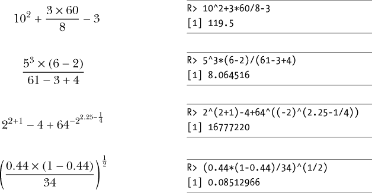
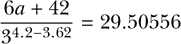
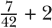
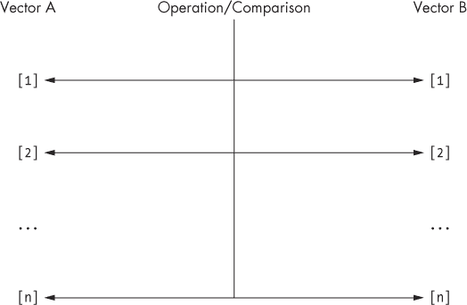
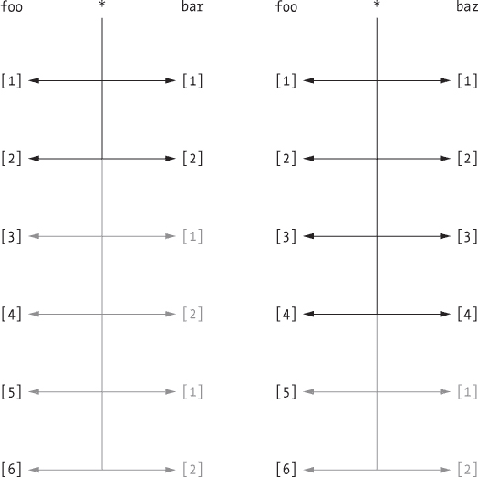
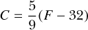

## 2

**数值、算术、赋值和向量**


在最简单的情况下，R 可以作为一个普通的桌面计算器。在本章中，我将讨论如何使用软件进行算术运算。我还会展示如何存储结果，以便你可以在其他计算中稍后使用它们。接下来，你将学习向量，它可以让你一次处理多个值。向量是 R 中的一个重要工具，R 的许多功能设计时都考虑到了向量操作。你将研究一些常见且有用的方式来操作向量，并利用面向向量的行为。

### 2.1 R 基础数学

所有常见的算术操作和数学功能都可以在控制台提示符下使用。你可以分别使用符号 `+`、`-`、`*` 和 `/` 执行加法、减法、乘法和除法。你可以使用 `^` 创建指数（也称为*幂*或*指数*），并通过括号 `()` 控制单个命令中的运算顺序。

#### *2.1.1 算术运算*

在 R 中，标准的数学规则始终适用，并遵循通常的从左到右的运算顺序：括号、指数、乘法、除法、加法、减法（PEMDAS）。这是一个在控制台中的示例：

```
R> 2+3
[1] 5
R> 14/6
[1] 2.333333
R> 14/6+5
[1] 7.333333
R> 14/(6+5)
[1] 1.272727
R> 3²
[1] 9
R> 2³
[1] 8
```

你可以使用 `sqrt` 函数来计算任何非负数的平方根。只需将期望的数字提供给 `x`，如下所示：

```
R> sqrt(x=9)
[1] 3
R> sqrt(x=5.311)
[1] 2.304561
```

在使用 R 时，你会发现需要将复杂的算术公式转化为代码进行计算（例如，当复制教科书或研究论文中的计算时）。以下示例提供了一个数学表达式的计算，然后是其在 R 中的执行：



请注意，有些 R 表达式需要额外的括号，而这些括号在数学表达式中并不存在。缺少或位置不当的括号是 R 中算术错误的常见原因，尤其是在处理指数时。如果指数本身是一个算术计算，它必须始终放在括号中。例如，在第三个表达式中，你需要在 `2.25-1/4` 周围加上括号。如果要对某个数进行幂运算，而这个数本身是一个计算结果，像第三个例子中的表达式 `2^(2+1)`，你也需要使用括号。请注意，R 将负数视为一个计算，因为它会将 `-2` 解释为 `-1*2`。这就是为什么在这个表达式中你也需要将 `-2` 放入括号的原因。强调这些问题很重要，因为它们在大量代码中很容易被忽视。

#### *2.1.2 对数与指数*

你会经常看到或阅读到研究人员对某些数据进行*对数变换*。这意味着根据*对数*重新缩放数字。当给定一个数字*x*和一个被称为*底数*的值时，对数计算出必须将底数提升到哪个幂才能得到*x*。例如，*x* = 243 以 3 为底的对数（数学上写作 log[3] 243）为 5，因为 3⁵ = 243。在 R 中，对数变换通过`log`函数实现。你提供`log`函数需要变换的数字，赋值给`x`，以及底数，赋值给`base`，如下所示：

```
R> log(x=243,base=3)
[1] 5
```

以下是一些需要考虑的事项：

• *x*和底数都必须是正数。

• 当底数为*x*时，任意数*x*的对数结果为 1。

• 对于*x* = 1 的对数结果永远是 0，不论底数是什么。

在数学中有一种特别的对数变换，称为*自然对数*，它将底数固定为一个特殊的数学常数——*欧拉数*。这个数通常表示为*e*，约等于 2.718。

欧拉数引出了*指数函数*，其定义为*e*的*x*次方，其中*x*可以是任何数（负数、零或正数）。指数函数*f*(*x*) = *e*^x，通常写作 exp(*x*)，表示自然对数的*逆*，使得 exp(log[*e*] *x*) = log[*e*] exp(*x*) = *x*。指数函数的 R 命令是`exp`：

```
R> exp(x=3)
[1] 20.08554
```

`log`的默认行为是默认使用自然对数：

```
R> log(x=20.08554)
[1] 3
```

如果你想使用除了*e*以外的其他底数，必须自己提供`base`的值。这里提到对数和指数函数，因为它们在本书后面非常重要——许多统计方法使用它们，因为它们具有多种有用的数学性质。

#### *2.1.3 E-表示法*

当 R 打印出超出某个有效数字阈值（默认设置为 7）的非常大或非常小的数字时，这些数字将以经典的科学计数法表示。E 表示法是大多数编程语言——甚至许多桌面计算器——所使用的，用以便于理解极端值。在 E 表示法中，任何数字*x*都可以表示为*x*e*y*，它等于*x* × 10^(*y*)。考虑数字 2,342,151,012,900。例如，它可以表示为：

• 2.3421510129e12，相当于写作 2.3421510129 × 10¹²

• 234.21510129e10，相当于写作 234.21510129 × 10¹⁰

你可以为*y*的幂使用任何值，但标准的 E 表示法使用将小数点放在第一个有效数字后面的幂。简单来说，对于*正*的幂+*y*，E 表示法可以解释为“将小数点向*右*移动*y*位”。对于*负*的幂−*y*，解释为“将小数点向*左*移动*y*位”。这正是 R 如何呈现 E 表示法的方式：

```
R> 2342151012900
[1] 2.342151e+12
R> 0.0000002533
[1] 2.533e-07
```

在第一个示例中，R 只显示前七位有效数字，并隐藏其余部分。请注意，即使 R 隐藏了数字，计算过程中并不会丢失任何信息；e-表示法仅仅是为了方便用户阅读，额外的数字仍然被 R 存储，即使它们没有显示出来。

最后，注意 R 必须对数字的极限值施加约束，才能将其视为无穷大（对于大数字）或零（对于小数字）。这些约束取决于你的具体系统，我将在第 6.1.1 节中详细讨论技术细节。然而，任何现代桌面系统默认情况下都可以被认为足够精确，能够满足大多数 R 中的计算和统计需求。

**练习 2.1**

1.  使用 R，验证以下内容

    

    当 *a* = 2.3 时。

1.  以下哪个选项是将负 4 平方并加 2 到结果？

    1.  `(-4)²+2`

    1.  `-4²+2`

    1.  `(-4)^(2+2)`

    1.  `-4^(2+2)`

1.  使用 R，你如何计算数字 25.2、15、16.44、15.3 和 18.6 的平均值的一半的平方根？

1.  计算 log[*e*] 0.3。

1.  计算你在 (d) 中的答案的指数变换。

1.  在控制台中打印时，识别 R 如何表示 −0.00000000423546322 这个数字。

### 2.2 赋值对象

到目前为止，R 仅通过将计算结果打印到控制台来展示示例计算结果。如果你想保存结果并进行进一步操作，你需要能够将给定计算的结果*赋值*给当前工作空间中的一个*对象*。简单来说，这意味着将某个项或结果存储在给定的名称下，以便稍后访问，而不必重新计算这个结果。在本书中，我将交替使用*赋值*和*存储*这两个术语。请注意，有些编程书籍将存储的对象称为*变量*，因为可以轻松地覆盖该对象并将其更改为其他内容，这意味着它所代表的内容可能在整个会话中发生变化。然而，我将在本书中使用*对象*这个术语，因为我们将在第三部分讨论变量作为一个截然不同的统计学概念。

你可以通过两种方式在 R 中指定赋值：使用箭头符号（`<-`）和使用单个等号符号（`=`）。这两种方法在这里都展示了：

```
R> x <- -5
R> x
[1] -5
R> x = x + 1 # this overwrites the previous value of x
R> x
[1] -4

R> mynumber = 45.2

R> y <- mynumber*x
R> y
[1] -180.8

R> ls()
[1] "mynumber" "x"      "y"
```

正如你从这些示例中看到的，当你将对象的名称输入到控制台时，R 会显示分配给该对象的值。当你在后续操作中使用该对象时，R 会替代你分配给它的值。最后，如果你使用 `ls` 命令（你在第 1.3.1 节中看到过）检查当前工作空间的内容，它将按字母顺序显示对象的名称（以及其他任何先前创建的项目）。

虽然`=`和`<-`执行相同的操作，但为了代码的整洁（至少在这方面），保持一致性是明智的。许多用户选择坚持使用`<-`，因为使用`=`可能会引起混淆（例如，之前我显然不是想说*x*在*数学上*等于*x* + 1）。在本书中，我也会这样做，并将`=`保留用于设置函数参数，这将在第 2.3.2 节中开始讲解。到目前为止，你只使用了数字值，但请注意，赋值的过程对于所有类型和类的对象都是通用的，接下来的章节中你将进一步探讨这些内容。

对象的命名几乎没有限制，只要名称以字母开头（换句话说，不能以数字开头），避免使用符号（不过下划线和句点是可以的），并避免使用一些“保留”词汇，例如用于定义特殊值的词汇（见第 6.1 节）或用于控制代码流的词汇（见第十章）。你可以在第 9.1.2 节找到这些命名规则的有用总结。

**练习 2.2**

1.  创建一个存储值为 3² × 4^(1/8)的对象。

1.  用(a)中的对象除以 2.33 来覆盖该对象。将结果打印到控制台。

1.  创建一个值为−8.2 × 10^(−13)的新对象。

1.  直接在控制台打印将(b)乘以(c)的结果。

### 2.3 向量

通常你会希望对多个实体执行相同的计算或比较，例如当你需要重新缩放数据集中的测量值时。你可以逐个条目进行操作，尽管这样显然不理想，尤其是当你有大量条目时。R 提供了一个更高效的解决方案——*向量*。

目前为了简化问题，你将继续只处理数字条目，尽管这里讨论的许多实用函数也可以应用于包含非数字值的结构。你将在第四章开始查看这些其他类型的数据。

#### *2.3.1 创建一个向量*

向量是 R 中处理多个项目的基本构件。从数字的角度来看，你可以把向量看作是关于单一变量的观察值或测量值的集合，例如 50 个人的身高或你每天喝的咖啡数量。更复杂的数据结构可能由多个向量组成。创建向量的函数是单个字母`c`，所需条目放在括号内，条目之间用逗号分隔。

```
R> myvec <- c(1,3,1,42)
R> myvec
[1]  1  3  1 42
```

向量条目可以是计算结果或先前存储的项目（包括向量本身）。

```
R> foo <- 32.1
R> myvec2 <- c(3,-3,2,3.45,1e+03,64⁰.5,2+(3-1.1)/9.44,foo)
R> myvec2
[1]    3.000000   -3.000000    2.000000    3.450000 1000.000000    8.000000
[7]    2.201271   32.100000
```

这段代码创建了一个新向量并赋值给对象`myvec2`。其中一些条目被定义为算术表达式，存储在向量中的则是表达式的结果。最后一个元素`foo`是一个已定义的数字对象，其值为`32.1`。

我们来看一个新的例子。

```
R> myvec3 <- c(myvec,myvec2)
R> myvec3
[1]     1.000000    3.000000    1.000000    42.000000    3.000000    -3.000000
[7]     2.000000    3.450000 1000.000000     8.000000    2.201271    32.100000
```

这段代码创建并存储了另一个向量`myvec3`，它包含了`myvec`和`myvec2`的条目，按顺序连接在一起。

#### *2.3.2 序列、重复、排序和长度*

在这里，我将讨论一些与 R 向量相关的常见和有用的函数：`seq`、`rep`、`sort`和`length`。

让我们创建一个均匀间隔的递增或递减数值序列。这是您在编程循环时（见第十章）或绘制数据点时（见第七章）常常需要的功能。创建此类序列最简单的方法是使用冒号操作符，将数值按间隔 1 分隔。

```
R> 3:27
 [1]  3  4  5  6  7  8  9 10 11 12 13 14 15 16 17 18 19 20 21 22 23 24 25 26 27
```

示例`3:27`应理解为“从 3 到 27（步长为 1）”。结果是一个数字向量，就像您手动列出每个数字并用`c`括起来一样。像往常一样，您也可以在使用冒号操作符时提供先前存储的值或（严格的）括号计算：

```
R> foo <- 5.3
R> bar <- foo:(-47+1.5)
R> bar
 [1]   5.3   4.3   3.3   2.3   1.3   0.3  -0.7  -1.7  -2.7  -3.7  -4.7
[12]  -5.7  -6.7  -7.7  -8.7  -9.7 -10.7 -11.7 -12.7 -13.7 -14.7 -15.7
[23] -16.7 -17.7 -18.7 -19.7 -20.7 -21.7 -22.7 -23.7 -24.7 -25.7 -26.7
[34] -27.7 -28.7 -29.7 -30.7 -31.7 -32.7 -33.7 -34.7 -35.7 -36.7 -37.7
[45] -38.7 -39.7 -40.7 -41.7 -42.7 -43.7 -44.7
```

##### 使用 seq 生成序列

您还可以使用`seq`命令，它允许您更灵活地创建序列。这个现成的函数接收一个`from`值，一个`to`值，以及一个`by`值，然后返回相应的序列，作为一个数字向量。

```
R> seq(from=3,to=27,by=3)
[1]  3  6  9 12 15 18 21 24 27
```

这将为您提供一个间隔为 3 而不是 1 的序列。请注意，这类序列将始终从`from`数字开始，但是否包含`to`数字取决于您要求 R 按什么方式增加（或减少）它们。例如，如果您按偶数增加（或减少），且序列以奇数结尾，则最后一个数字将不会被包含。然而，您可以通过指定`length.out`值来生成一个具有该数量数字的向量，这些数字在`from`和`to`值之间均匀分布。

```
R> seq(from=3,to=27,length.out=40)
 [1]  3.000000  3.615385  4.230769  4.846154  5.461538  6.076923  6.692308
 [8]  7.307692  7.923077  8.538462  9.153846  9.769231 10.384615 11.000000
[15] 11.615385 12.230769 12.846154 13.461538 14.076923 14.692308 15.307692
[22] 15.923077 16.538462 17.153846 17.769231 18.384615 19.000000 19.615385
[29] 20.230769 20.846154 21.461538 22.076923 22.692308 23.307692 23.923077
[36] 24.538462 25.153846 25.769231 26.384615 27.000000
```

通过将`length.out`设置为`40`，您可以让程序从 3 到 27 打印出恰好 40 个均匀间隔的数字。

对于递减序列，`by`的值必须为负。这里是一个例子：

```
R> foo <- 5.3
R> myseq <- seq(from=foo,to=(-47+1.5),by=-2.4)
R> myseq
 [1]   5.3   2.9   0.5  -1.9  -4.3  -6.7  -9.1 -11.5 -13.9 -16.3 -18.7 -21.1
[13] -23.5 -25.9 -28.3 -30.7 -33.1 -35.5 -37.9 -40.3 -42.7 -45.1
```

这段代码使用先前存储的对象`foo`作为`from`的值，并使用括号中的计算`(-47+1.5)`作为`to`的值。给定这些值（即`foo`大于`(-47+1.5)`），序列只能按负数步长递进；在上面，我们将`by`设置为`-2.4`。然而，使用`length.out`来创建递减序列的方式保持不变（指定“负长度”是没有意义的）。对于相同的`from`和`to`值，您可以轻松创建一个长度为 5 的递减序列，如下所示：

```
R> myseq2 <- seq(from=foo,to=(-47+1.5),length.out=5)
R> myseq2
[1]   5.3  -7.4 -20.1 -32.8 -45.5
```

有一些简化的调用方式，您将在第九章中学到这些，但在这些早期阶段，我将坚持使用显式的用法。

##### 使用 rep 进行重复

序列非常有用，但有时您可能只想重复某个特定值。您可以使用`rep`来做到这一点。

```
R> rep(x=1,times=4)
[1] 1 1 1 1
R> rep(x=c(3,62,8.3),times=3)
[1]  3.0 62.0  8.3  3.0 62.0  8.3  3.0 62.0  8.3
R> rep(x=c(3,62,8.3),each=2)
[1]  3.0  3.0 62.0 62.0  8.3  8.3
R> rep(x=c(3,62,8.3),times=3,each=2)
 [1]  3.0  3.0 62.0 62.0  8.3  8.3  3.0  3.0 62.0 62.0  8.3  8.3  3.0  3.0 62.0
[16] 62.0  8.3  8.3
```

`rep`函数接受一个单一值或一个值的向量作为参数`x`，并且需要提供`times`和`each`的值。`times`的值指定重复`x`的次数，而`each`指定重复`x`中每个元素的次数。在上面的第一行，你仅仅是将一个值重复四次。其他例子首先使用`rep`和`times`对一个向量进行重复整个向量的操作，然后使用`each`重复向量中每个元素，最后同时使用`times`和`each`一次性完成两者操作。

如果没有指定`times`或`each`，R 的默认行为是将`times`和`each`的值视为`1`，因此调用`rep(x=c(3,62,8.3))`时，返回的将是原始的`x`，没有任何变化。

与`seq`一样，你可以将`rep`的结果包含在相同数据类型的向量中，如下例所示：

```
R> foo <- 4
R> c(3,8.3,rep(x=32,times=foo),seq(from=-2,to=1,length.out=foo+1))
[1]  3.00  8.30 32.00 32.00 32.00 32.00 -2.00 -1.25 -0.50  0.25  1.00
```

在这里，我构建了一个向量，其中第三到第六个条目（包含在内）由`rep`命令的计算结果决定——单一值`32`被重复`foo`次（其中`foo`的值为 4）。最后五个条目是`seq`的计算结果，即从−2 到 1 的序列，长度为`foo+1`（5）。

##### 使用 sort 进行排序

对一个向量进行升序或降序排序是日常任务中的另一个简单操作。便捷的`sort`函数正是用来做这件事的。

```
R> sort(x=c(2.5,-1,-10,3.44),decreasing=FALSE)
[1] -10.00  -1.00   2.50   3.44

R> sort(x=c(2.5,-1,-10,3.44),decreasing=TRUE)
[1]   3.44   2.50  -1.00 -10.00

R> foo <- seq(from=4.3,to=5.5,length.out=8)
R> foo
[1] 4.300000 4.471429 4.642857 4.814286 4.985714 5.157143 5.328571 5.500000
R> bar <- sort(x=foo,decreasing=TRUE)
R> bar
[1] 5.500000 5.328571 5.157143 4.985714 4.814286 4.642857 4.471429 4.300000

R> sort(x=c(foo,bar),decreasing=FALSE)
 [1] 4.300000 4.300000 4.471429 4.471429 4.642857 4.642857 4.814286 4.814286
 [9] 4.985714 4.985714 5.157143 5.157143 5.328571 5.328571 5.500000 5.500000
```

`sort`函数非常简单。你将一个向量作为参数`x`传入该函数，第二个参数`decreasing`表示你希望排序的顺序。这个参数使用了一种你之前没有遇到过的类型：即重要的*逻辑*值。逻辑值只能是两个特定的、区分大小写的值之一：`TRUE`或`FALSE`。一般来说，逻辑值用于指示某个*条件*是否满足，并且是所有编程语言的重要组成部分。你将在 R 语言第四章第一部分中详细学习逻辑值。现在，关于`sort`，你可以将`decreasing=FALSE`设为从小到大排序，而`decreasing=TRUE`则是从大到小排序。

##### 使用 length 查找向量长度

我将通过`length`函数来总结这一部分，`length`函数用于确定作为参数`x`传入的向量中存在多少条目。

```
R> length(x=c(3,2,8,1))
[1] 4

R> length(x=5:13)
[1] 9

R> foo <- 4
R> bar <- c(3,8.3,rep(x=32,times=foo),seq(from=-2,to=1,length.out=foo+1))
R> length(x=bar)
[1] 11
```

请注意，如果你包含依赖于其他函数计算结果的条目（在此案例中，调用了`rep`和`seq`），`length`会告诉你在这些内置函数执行**后**的条目数。

**练习 2.3**

1.  创建并存储一个从 5 到−11 的数值序列，步长为 0.3。

1.  使用相反顺序的相同序列覆盖（a）中的对象。

1.  将向量`c(-1,3,-5,7,-9)`重复两次，每个元素重复 10 次，并存储结果。然后将结果按从大到小排序并显示。

1.  创建并存储一个包含以下内容的向量，无论其配置如何：

    1.  从 6 到 12（包含 12）的整数序列

    1.  值 5.3 的三重重复

    1.  数字−3

    1.  从 102 开始，到在（c）中创建的向量的总长度为止，共九个值的序列

1.  确认在（d）中创建的向量的长度为 20。

#### *2.3.3 子集和元素提取*

在你到目前为止在控制台屏幕上看到的所有结果中，你可能注意到一个奇怪的特征。在输出的左侧紧挨着有一个方括号中的`[1]`。当输出是一个较长的向量，跨越了控制台的宽度并换行时，新的方括号中的数字会出现在新的一行左侧。这些数字表示直接右侧条目的*索引*。简单来说，索引对应于一个值在向量中的*位置*，这就是为什么第一个值旁边总是有一个`[1]`（即使它是唯一的值，不是更大向量的一部分）。

这些索引允许你从一个向量中提取特定的元素，这被称为*子集提取*。假设你在工作区有一个名为`myvec`的向量。那么`myvec`中将会有`length(x=myvec)`个条目，每个条目有一个特定的位置：`1`、`2`、`3`，一直到`length(x=myvec)`。你可以通过让 R 返回`myvec`在特定位置的值来访问单个元素，这通过输入向量的名称并在后面跟上方括号中的位置来完成。

```
R> myvec <- c(5,-2.3,4,4,4,6,8,10,40221,-8)
R> length(x=myvec)
[1] 10
R> myvec[1]
[1] 5

R> foo <- myvec[2]
R> foo
[1] -2.3

R> myvec[length(x=myvec)]
[1] -8
```

因为`length(x=myvec)`给出了向量的最终索引（在这个例子中是`10`），在方括号中输入这个短语会提取最后一个元素`-8`。同样，你可以通过从长度中减去 1 来提取倒数第二个元素；我们来尝试一下，并将结果赋值给一个新对象：

```
R> myvec.len <- length(x=myvec)
R> bar <- myvec[myvec.len-1]
R> bar
[1] 40221
```

正如这些例子所示，索引可能是其他数字或之前存储值的算术函数。你可以像平常一样使用`<-`符号将结果赋值给工作区中的新对象。利用你对序列的了解，你可以使用冒号符号和特定向量的长度来获得所有可能的索引，以提取向量中的特定元素：

```
R> 1:myvec.len
[1]  1  2  3  4  5  6  7  8  9 10
```

你还可以通过使用方括号中提供的索引的*负数*版本来删除单个元素。继续使用前面定义的对象`myvec`、`foo`、`bar`和`myvec.len`，请考虑以下操作：

```
R> myvec[-1]
[1]    -2.3    4.0    4.0    4.0    6.0    8.0    10.0 40221.0    -8.0
```

这一行生成了不包含第一个元素的`myvec`内容。同样，以下代码将`myvec`中不包含第二个元素的内容赋值给对象`baz`：

```
R> baz <- myvec[-2]
R> baz
[1]     5     4     4     4     6     8     10 40221     -8
```

同样，方括号中的索引也可以是一个适当计算的结果，如下所示：

```
R> qux <- myvec[-(myvec.len-1)]
R> qux
[1]  5.0 -2.3  4.0  4.0  4.0  6.0  8.0 10.0 -8.0
```

使用方括号操作符来提取或删除向量中的值，并不会改变你正在子集化的原始向量，*除非*你显式地用子集化后的版本覆盖该向量。例如，在这个例子中，`qux`是一个新向量，定义为`myvec`去掉倒数第二个条目，但在你的工作空间中，`myvec`本身*保持不变*。换句话说，以这种方式对子集化向量仅仅返回请求的元素，如果你想的话可以将它们分配给一个新对象，但不会改变工作空间中的原始对象。

现在，假设你想通过`qux`和`bar`将`myvec`重新拼接在一起。你可以调用类似这样的代码：

```
R> c(qux[-length(x=qux)],bar,qux[length(x=qux)])
 [1]     5.0    -2.3     4.0     4.0     4.0    6.0    8.0    10.0 40221.0
[10]    -8.0
```

如你所见，这行代码使用`c`将向量分成三部分来重构：`qux[-length(x=qux)]`，之前定义的`bar`对象，以及`qux[length(x=qux)]`。为了清晰起见，我们依次查看每一部分。

• `qux[-length(x=qux)]`

这段代码返回了`qux`的值，除了它的最后一个元素。

R> length(x=qux)

[1] 9

R> qux[-length(x=qux)]

[1]  5.0 -2.3  4.0  4.0  4.0  6.0  8.0 10.0

现在你有一个与`myvec`的前八个条目相同的向量。

• `bar`

之前，你已经将`bar`存储为以下内容：

R> bar <- myvec[myvec.len-1]

R> bar

[1] 40221

这正是`myvec`中`qux`缺少的倒数第二个元素。因此，你将把这个值插入到`qux[-length(x=qux)]`之后。

• `qux[length(x=qux)]`

最后，你只需要`qux`的最后一个元素，它与`myvec`的最后一个元素匹配。这是通过`length`从`qux`中提取的（不像之前那样删除）。

R> qux[length(x=qux)]

[1] -8

现在应该清楚了，如何通过按此顺序调用这三部分代码来重构`myvec`。

与 R 中的大多数操作一样，你不必逐一进行操作。你还可以使用*索引向量*来子集化对象，而不是单个索引。再次使用之前的`myvec`，你可以得到以下结果：

```
R> myvec[c(1,3,5)]
[1] 5 4 4
```

这一次返回了`myvec`的第一个、第三个和第五个元素。另一个常见且方便的子集化工具是冒号操作符（在第 2.3.2 节中讨论），它用于创建索引序列。这里是一个例子：

```
R> 1:4
[1] 1 2 3 4
R> foo <- myvec[1:4]
R> foo
[1]  5.0 -2.3  4.0  4.0
```

这提供了`myvec`的前四个元素（记住，冒号操作符返回一个数字向量，所以不需要显式使用`c`来包裹它）。

返回的元素的顺序完全取决于方括号中提供的索引向量。例如，再次使用`foo`，考虑索引的顺序和由此得到的提取结果，如下所示：

```
R> length(x=foo):2
[1] 4 3 2
R> foo[length(foo):2]
[1]  4.0  4.0 -2.3
```

这里你从向量的末尾提取了元素，向后工作。你还可以使用`rep`来重复一个索引，如下所示：

```
R> indexes <- c(4,rep(x=2,times=3),1,1,2,3:1)
R> indexes
 [1] 4 2 2 2 1 1 2 3 2 1
R> foo[indexes]
 [1]  4.0 -2.3 -2.3 -2.3  5.0  5.0 -2.3  4.0 -2.3  5.0
```

这现在已经是一个比严格的“子集”更通用的东西——通过使用索引向量，你可以创建一个全新的向量，长度可以为任意值，并包含原始向量中的一些或所有元素。如前所示，这个索引向量可以包含按任意顺序排列的目标元素位置，并且可以重复索引。

你还可以在删除多个元素后返回向量的元素。例如，要创建一个删除了`foo`中的第一个和第三个元素后的向量，可以执行以下操作：

```
R> foo[-c(1,3)]
[1] -2.3  4.0
```

请注意，无法在单个索引向量中混合使用正负索引。

有时候，你需要用新值覆盖现有向量中的某些元素。在这种情况下，你首先使用方括号指定要覆盖的元素，然后使用赋值运算符给这些元素赋上新值。以下是一个例子：

```
R> bar <- c(3,2,4,4,1,2,4,1,0,0,5)
R> bar
 [1] 3 2 4 4 1 2 4 1 0 0 5
R> bar[1] <- 6
R> bar
 [1] 6 2 4 4 1 2 4 1 0 0 5
```

这会将`bar`的第一个元素（原为`3`）覆盖为新值`6`。当选择多个元素时，你可以指定一个单一的值来替换它们，或者输入一个与所选替换元素数量相同的向量，从而一一替换它们。我们来尝试一下之前提到的同一个`bar`向量。

```
R> bar[c(2,4,6)] <- c(-2,-0.5,-1)
R> bar
 [1]  6.0 -2.0  4.0 -0.5  1.0 -1.0  4.0  1.0  0.0  0.0  5.0
```

在这里，你将第 2、第 4 和第 6 个元素分别覆盖为`-2`、`-0.5`和`-1`，其余部分保持不变。相比之下，以下代码将元素`7`到`10`（包括第 10 个）覆盖为`100`：

```
R> bar[7:10] <- 100
R> bar
 [1]   6.0  -2.0   4.0  -0.5   1.0  -1.0 100.0 100.0 100.0 100.0   5.0
```

最后，需要提到的是，本节仅讨论了 R 中两种主要方法之一，或者说是两种“风格”的向量元素提取方法。你将在第 4.1.5 节中查看另一种方法，使用逻辑标志。

**练习 2.4**

1.  创建并存储一个包含以下元素的向量，顺序如下：

    – 一个从 3 到 6（包括 6）的长度为 5 的序列

    – 向量`c(2,-5.1,-33)`的两倍重复

    – 值

1.  从向量(a)中提取第一个和最后一个元素，并将它们存储为一个新对象。

1.  将通过省略向量(a)的第一个和最后一个值返回的值存储为第三个对象。

1.  只使用(b)和(c)来重建(a)。

1.  使用从最小到最大排序后的相同值覆盖(a)。

1.  使用冒号运算符作为索引向量来反转(e)的顺序，并确认这与对(e)使用`sort`函数并设置`decreasing=TRUE`是等价的。

1.  从(c)中创建一个向量，其中包含(c)的第三个元素重复三次、第六个元素重复四次以及最后一个元素重复一次。

1.  创建一个新向量，作为(e)的副本，将(e)原样赋值给一个新命名的对象。使用这个新副本的(e)，依次将第一个元素、第 5 到第 7 个元素（包括第 7 个）以及最后一个元素覆盖为 99 到 95（包括 95）的值。

#### *2.3.4 向量导向行为*

向量之所以如此有用，是因为它们允许 R 以高速和高效的方式对多个元素同时进行操作。这个*面向向量*、*向量化*或*按元素*的行为是该语言的一个关键特性，你将在这里通过一些重新缩放测量的示例简要地了解它。

让我们从这个简单的例子开始：

```
R> foo <- 5.5:0.5
R> foo
[1] 5.5 4.5 3.5 2.5 1.5 0.5
R> foo-c(2,4,6,8,10,12)
[1]   3.5   0.5  -2.5  -5.5  -8.5 -11.5
```

这段代码创建了一个从 5.5 到 0.5 的六个值的序列，增量为 1。然后，从这个向量中减去另一个包含 2、4、6、8、10 和 12 的向量。这会怎么做呢？简单来说，R 会根据元素的位置匹配每个元素，并对每一对相应的元素进行操作。结果向量是通过从 `c(2,4,6,8,10,12)` 的第一个元素减去 `foo` 的第一个元素（5.5 − 2 = 3.5），然后从 `c(2,4,6,8,10,12)` 的第二个元素减去 `foo` 的第二个元素（4.5 − 4 = 0.5），依此类推。因此，与手动或显式使用循环逐个处理每个元素相比，R 允许使用面向向量的行为进行快速而高效的替代。图 2-1 展示了如何理解这种类型的计算，并突出了元素位置在最终结果中的重要性；不同位置的元素互不影响。

当使用不同长度的向量时，情况会变得更加复杂，这种情况可以通过两种不同的方式发生。第一种是较长的向量的长度可以被较短向量的长度整除。第二种是较长的向量的长度*不能*被较短向量的长度整除——这通常是用户无意的行为。在这两种情况下，R 本质上会尝试重复，或*回收*，较短的向量，直到它的长度与较长的向量匹配，然后完成指定的操作。举个例子，假设你想将之前显示的 `foo` 的条目交替设为负数和正数。你可以显式地将 `foo` 乘以 `c(1,-1,1,-1,1,-1)`，但你不需要写出完整的后者向量。相反，你可以写以下内容：



*图 2-1：在 R 中对两个相同长度的向量进行比较或操作时，按元素行为的概念图。请注意，操作是通过将元素位置一一匹配来进行的。*

```
R> bar <- c(1,-1)
R> foo*bar
[1]  5.5 -4.5  3.5 -2.5  1.5 -0.5
```

这里 `bar` 已在 `foo` 的整个长度上重复应用，直到完成。图 2-2 的左侧图展示了这个特定示例。现在让我们看看当向量长度不能整除时会发生什么。

```
R> baz <- c(1,-1,0.5,-0.5)
R> foo*baz
[1]  5.50 -4.50  1.75 -1.25  1.50 -0.50
Warning message:
In foo * baz :
  longer object length is not a multiple of shorter object length
```

在这里，你可以看到 R 已将 `foo` 的前四个元素与整个 `baz` 匹配，但它无法再次完全重复该向量。虽然 R 尝试重复该向量，将 `baz` 的前两个元素与较长的 `foo` 的后两个元素匹配，但这并不没有完全成功，因为 R 发出警告，提示长度无法均匀除尽（你将在第 12.1 节中更详细地查看警告）。右图中的图 2-2 展示了这一示例。



*图 2-2：对两个不同长度的向量执行逐元素操作。左：* `foo` *与* `bar` *相乘；长度可以均匀除尽。右：* `foo` *与* `baz` *相乘；长度不能均匀除尽，并发出警告。*

正如我在第 2.3.3 节中提到的，你可以将单个值视为长度为 1 的向量，因此你可以使用单个值对任何长度的向量执行操作。以下是一个例子，使用相同的向量 `foo`：

```
R> qux <- 3
R> foo+qux
[1] 8.5 7.5 6.5 5.5 4.5 3.5
```

这远比执行 `foo+c(3,3,3,3,3,3)` 或更一般的 `foo+rep(x=3,times=length(x=foo))` 要容易。以这种方式操作向量，使用单个值是非常常见的，例如，如果你想通过某个常数对一组测量值进行重新缩放或平移。

面向向量的行为的另一个好处是，你可以使用矢量化函数完成潜在的繁重任务。例如，如果你想对一个数字向量中的所有元素求和或相乘，你只需要使用一个内置函数。

回想一下之前展示的 `foo`：

```
R> foo
[1] 5.5 4.5 3.5 2.5 1.5 0.5
```

你可以通过以下方式求得这六个元素的和：

```
R> sum(foo)
[1] 18
```

以及它们的乘积：

```
R> prod(foo)
[1] 162.4219
```

矢量化函数不仅方便，而且比显式编写的迭代方法（例如循环）更快、更高效。这些示例的主要启示是，R 的许多功能是专门为某些数据结构设计的，确保了代码的简洁性和性能的优化。

最后，如前所述，这种面向向量的行为同样适用于覆盖多个元素。再次使用 `foo`，请查看以下内容：

```
R> foo
[1] 5.5 4.5 3.5 2.5 1.5 0.5
R> foo[c(1,3,5,6)] <- c(-99,99)
R> foo
[1] -99.0   4.5  99.0   2.5 -99.0  99.0
```

你会看到四个特定元素被长度为 2 的向量覆盖，这些向量以你熟悉的方式重复。同样，替换向量的长度必须能均匀除尽要被覆盖的元素数量，否则当 R 无法完成一个完整长度的重复时，将发出类似之前的警告。

**练习 2.5**

1.  将向量 `c(2,0.5,1,2,0.5,1,2,0.5,1)` 转换为仅包含 `1` 的向量，使用长度为 3 的向量。

1.  华氏度 *F* 到摄氏度 *C* 的转换是通过以下公式进行的：

    

    使用面向向量的行为，在 R 中将温度值 45、77、20、19、101、120 和 212 华氏度转换为摄氏度。

1.  使用向量`c(2,4,6)`和向量`c(1,2)`，结合`rep`和`*`运算符，生成向量`c(2,4,6,4,8,12)`。

1.  将结果向量（来自(c)）中的中间四个元素，按顺序替换为两个回收的值`-0.1`和`-100`。

##### 本章的重要代码

| **函数/运算符** | **简要描述** | **首次出现** |
| --- | --- | --- |
| `+`, `*`, `-`, `/`, `^` | 算术运算 | 第 2.1 节, 第 17 页 |
| `sqrt` | 平方根 | 第 2.1.1 节, 第 18 页 |
| `log` | 对数 | 第 2.1.2 节, 第 19 页 |
| `exp` | 指数 | 第 2.1.2 节, 第 19 页 |
| `<-`，`=` | 对象赋值 | 第 2.2 节, 第 21 页 |
| `c` | 向量创建 | 第 2.3.1 节, 第 23 页 |
| `:`，`seq` | 序列创建 | 第 2.3.2 节, 第 24 页 |
| `rep` | 值/向量重复 | 第 2.3.2 节, 第 25 页 |
| `sort` | 向量排序 | 第 2.3.2 节, 第 26 页 |
| `length` | 确定向量长度 | 第 2.3.2 节, 第 27 页 |
| `[ ]` | 向量子集提取 | 第 2.3.3 节, 第 28 页 |
| `sum` | 求和所有向量元素 | 第 2.3.4 节, 第 36 页 |
| `prod` | 乘积所有向量元素 | 第 2.3.4 节, 第 36 页 |
