## 第三章：3

**矩阵与数组**


到现在为止，你已经能够熟练使用 R 中的向量了。一个*矩阵*实际上是几个向量的集合。而向量的大小由其长度描述，矩阵的大小则通过行数和列数来指定。你还可以创建更高维度的结构，称为*数组*。在本章中，我们将首先了解如何处理矩阵，然后再增加维度形成数组。

### 3.1 定义矩阵

矩阵是一个重要的数学构造，并且是许多统计方法的基础。你通常将矩阵 *A* 描述为一个 *m* × *n* 矩阵；即 *A* 将有 *m* 行和 *n* 列。这意味着 *A* 将有总共 *mn* 个条目，每个条目 *a[i,j]* 都有一个独特的位置，由其特定的行（*i* = 1,2, ..., *m*）和列（*j* = 1, 2, ..., *n*）给出。

因此，你可以按以下方式表示矩阵：

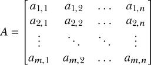

要在 R 中创建一个矩阵，可以使用恰如其分的`matrix`命令，将矩阵的条目作为向量传递给`data`参数：

```
R> A <- matrix(data=c(-3,2,893,0.17),nrow=2,ncol=2)
R> A
     [,1]   [,2]
[1,]   -3 893.00
[2,]    2   0.17
```

你必须确保这个向量的长度与所需的行数（`nrow`）和列数（`ncol`）完全匹配。你也可以选择在调用`matrix`时不提供`nrow`和`ncol`，在这种情况下，R 的默认行为是返回一个包含`data`条目的单列矩阵。例如，`matrix(data=c(-3,2,893,0.17))`与`matrix(data=c(-3,2,893,0.17),nrow=4,ncol=1)`是相同的。

#### *3.1.1 填充方向*

重要的是要了解 R 如何使用来自 `data` 的条目填充矩阵。通过查看前面的示例，你可以看到 2 × 2 矩阵 `A` 是按 *列* 填充的，即从左到右读取 `data` 条目。你可以使用 `byrow` 参数控制 R 填充数据的方式，如以下示例所示：

```
R> matrix(data=c(1,2,3,4,5,6),nrow=2,ncol=3,byrow=FALSE)
     [,1] [,2] [,3]
[1,]    1    3    5
[2,]    2    4    6
```

在这里，我指示 R 提供一个包含数字 1 到 6 的 2 × 3 矩阵。通过使用可选参数`byrow`并将其设置为`FALSE`，你明确告诉 R 按列填充这个 2 × 3 结构，即在移动到下一列之前填充每一列，从左到右读取`data`参数向量。这是 R 对`matrix`函数的默认处理方式，因此如果没有提供`byrow`参数，软件将默认`byrow=FALSE`。图 3-1 展示了这一行为。

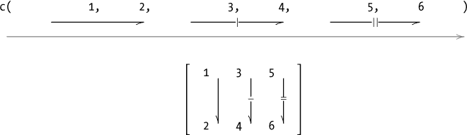

*图 3-1：按列填充 2 × 3 矩阵，`byrow=FALSE`（R 默认）*

现在，让我们重复相同的代码行，但将`byrow=TRUE`。

```
R> matrix(data=c(1,2,3,4,5,6),nrow=2,ncol=3,byrow=TRUE)
     [,1] [,2] [,3]
[1,]    1    2    3
[2,]    4    5    6
```

结果得到的 2 × 3 结构现在已经按行填充，如图 3-2 所示。

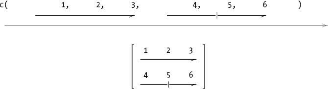

*图 3-2：按行填充 2 × 3 矩阵，`byrow=TRUE`*

#### *3.1.2 行和列绑定*

如果你有多个相同长度的向量，可以通过使用内置的 R 函数`rbind`和`cbind`将这些向量快速地构建为一个矩阵。你可以将每个向量视为一行（使用命令`rbind`），或者将每个向量视为一列（使用命令`cbind`）。假设你有两个向量`1:3`和`4:6`。你可以通过以下方式使用`rbind`重建图 3-2 中的 2 × 3 矩阵：

```
R> rbind(1:3,4:6)
     [,1] [,2] [,3]
[1,]    1    2    3
[2,]    4    5    6
```

在这里，`rbind`将向量作为矩阵的两行连接在一起，行的自上而下顺序与提供给`rbind`的向量顺序一致。可以使用`cbind`按以下方式构造相同的矩阵：

```
R> cbind(c(1,4),c(2,5),c(3,6))
     [,1] [,2] [,3]
[1,]    1    2    3
[2,]    4    5    6
```

这里，你有三个长度为 2 的向量。你使用`cbind`按提供的顺序将这三个向量粘合在一起，每个向量成为结果矩阵的一列。

#### *3.1.3 矩阵维度*

另一个有用的函数`dim`可以提供存储在工作空间中的矩阵的维度。

```
R> mymat <- rbind(c(1,3,4),5:3,c(100,20,90),11:13)
R> mymat
     [,1] [,2] [,3]
[1,]    1    3    4
[2,]    5    4    3
[3,]  100   20   90
[4,]   11   12   13

R> dim(mymat)
[1] 4 3
R> nrow(mymat)
[1] 4
R> ncol(mymat)
[1] 3
R> dim(mymat)[2]
[1] 3
```

定义了矩阵`mymat`之后，你可以使用`dim`确认其维度，`dim`会返回一个长度为 2 的向量；`dim`总是首先提供行数，然后是列数。你还可以使用两个相关的函数：`nrow`（只提供行数）和`ncol`（只提供列数）。在最后的命令中，你使用`dim`和向量子集的知识来提取与`ncol`相同的结果。

### 3.2 子集操作

从矩阵中提取和子集元素的过程与从向量中提取元素类似。唯一的复杂之处在于，现在你有了一个额外的维度。元素提取仍然使用方括号操作符，但现在必须同时提供行和列的位置，严格按照`[row, column]`的顺序。让我们从创建一个 3 × 3 的矩阵开始，我将使用它来展示本节中的示例。

```
R> A <- matrix(c(0.3,4.5,55.3,91,0.1,105.5,-4.2,8.2,27.9),nrow=3,ncol=3)
R> A
     [,1]  [,2] [,3]
[1,]  0.3  91.0 -4.2
[2,]  4.5   0.1  8.2
[3,] 55.3 105.5 27.9
```

要让 R“查看`A`的第三行并给我第二列的元素”，你可以执行以下操作：

```
R> A[3,2]
[1] 105.5
```

正如预期的那样，你得到了位于位置`[3,2]`的元素。

#### *3.2.1 行、列和对角线提取*

要从矩阵中提取整个行或列，你只需要指定所需的行或列编号，并将另一个值留空。需要注意的是，*你仍然必须包括*用来分隔行和列编号的逗号——这是 R 区分请求行和请求列的方式。以下代码返回矩阵`A`的第二列：

```
R> A[,2]
[1]  91.0    0.1 105.5
```

以下代码检查第一行：

```
R> A[1,]
[1]  0.3 91.0 -4.2
```

请注意，每当一个提取（或删除，稍后讨论）结果为单一值、单行或单列时，R 总是会返回一个独立的向量，其中包含所请求的值。你还可以执行更复杂的提取，例如请求整行或整列，或者多行或多列，结果将以新的矩阵形式返回，并具有适当的维度。考虑以下子集：

```
R> A[2:3,]
     [,1]  [,2] [,3]
[1,]  4.5   0.1  8.2
[2,] 55.3 105.5 27.9

R> A[,c(3,1)]
     [,1] [,2]
[1,] -4.2  0.3
[2,]  8.2  4.5
[3,] 27.9 55.3

R> A[c(3,1),2:3]
      [,1] [,2]
[1,] 105.5 27.9
[2,]  91.0 -4.2
```

第一条命令返回`A`的第二行和第三行，第二条命令返回`A`的第三列和第一列。最后一条命令访问`A`的第三行和第一行，并按顺序返回这两行的第二列和第三列元素。

你还可以使用`diag`命令来识别方阵（即行列数相等的矩阵）沿对角线的值。

```
R> diag(x=A)
[1]  0.3  0.1 27.9
```

这将返回一个向量，包含`A`沿对角线的元素，从`A[1,1]`开始。

#### *3.2.2 省略与覆盖*

要删除或省略矩阵中的元素，你再次使用方括号，但这次使用负索引。以下命令返回没有第二列的`A`：

```
R> A[,-2]
     [,1] [,2]
[1,]  0.3 -4.2
[2,]  4.5  8.2
[3,] 55.3 27.9
```

以下命令从`A`中删除第一行，并按顺序获取剩余两行的第三列和第二列的值：

```
R> A[-1,3:2]
     [,1]  [,2]
[1,]  8.2   0.1
[2,] 27.9 105.5
```

以下命令返回没有第一行和第二列的`A`：

```
R> A[-1,-2]
     [,1] [,2]
[1,]  4.5  8.2
[2,] 55.3 27.9
```

最后，这条命令删除第一行，然后删除结果中的第二列和第三列：

```
R> A[-1,-c(2,3)]
[1]  4.5 55.3
```

请注意，这个最终操作只留下了`A`第一列的最后两个元素，因此结果作为独立向量而不是矩阵返回。

要覆盖特定元素或整个行或列，你需要识别要替换的元素，然后分配新的值，正如你在第 2.3.3 节中对向量所做的那样。新的元素可以是一个单一值，一个长度与要替换元素数量相同的向量，或一个长度能够整除要替换元素数量的向量。为了说明这一点，让我们首先创建`A`的副本，并将其命名为`B`。

```
R> B <- A
R> B
     [,1]  [,2] [,3]
[1,]  0.3  91.0 -4.2
[2,]  4.5   0.1  8.2
[3,] 55.3 105.5 27.9
```

以下命令用序列`1`、`2`和`3`覆盖`B`的第二行：

```
R> B[2,] <- 1:3
R> B
     [,1]  [,2] [,3]
[1,]  0.3  91.0 -4.2
[2,]  1.0   2.0  3.0
[3,] 55.3 105.5 27.9
```

以下命令用`900`覆盖第一行和第三行的第二列元素：

```
R> B[c(1,3),2] <- 900
R> B
     [,1] [,2] [,3]
[1,]  0.3  900 -4.2
[2,]  1.0    2  3.0
[3,] 55.3  900 27.9
```

接下来，你用`B`的第三*行*的值替换`B`的第三列。

```
R> B[,3] <- B[3,]
R> B
     [,1] [,2]  [,3]
[1,]  0.3  900  55.3
[2,]  1.0    2 900.0
[3,] 55.3  900  27.9
```

为了尝试 R 的向量回收，我们现在将第一行和第三行的第一列和第三列元素（共四个元素）用两个值`-7`和`7`覆盖。

```
R> B[c(1,3),c(1,3)] <- c(-7,7)
R> B
     [,1] [,2] [,3]
[1,]   -7  900   -7
[2,]    1    2  900
[3,]    7  900    7
```

长度为 2 的向量以*按列的方式*替换了这四个元素。替换向量`c(-7,7)`按顺序覆盖了位置(1,1)和(3,1)的元素，然后重复该过程，按顺序覆盖(1,3)和(3,3)的元素。

为了突出索引顺序对矩阵元素替换的影响，请考虑以下示例：

```
R> B[c(1,3),2:1] <- c(65,-65,88,-88)
R> B
     [,1] [,2] [,3]
[1,]   88   65   -7
[2,]    1    2  900
[3,]  -88  -65    7
```

替换向量中的四个值已按列的顺序覆盖了四个指定的元素。在这种情况下，由于我反向指定了第一列和第二列，因此覆盖操作依次进行，先填充第二列，再转到第一列。位置（1,2）对应`65`，然后（3,2）对应`-65`；接着（1,1）变成`88`，（3,1）变成`-88`。

如果你只想替换一个方阵的对角线元素，你可以避免显式索引，直接使用`diag`命令来覆盖值。

```
R> diag(x=B) <- rep(x=0,times=3)
R> B
     [,1] [,2] [,3]
[1,]    0   65   -7
[2,]    1    0  900
[3,]  -88  -65    0
```

**练习 3.1**

1.  构造并存储一个 4 × 2 的矩阵，按行顺序填充值 4.3、3.1、8.2、8.2、3.2、0.9、1.6 和 6.5。

1.  如果从(a)中删除任意一行，确认矩阵的维度是 3 × 2。

1.  用按从小到大的顺序排序的相同列，覆盖矩阵（a）中的第二列。

1.  如果从(c)中删除第四行和第一列，R 会返回什么？使用`matrix`确保结果是一个单列矩阵，而不是一个向量。

1.  将(c)中的底部四个元素存储为新的 2 × 2 矩阵。

1.  按此顺序，覆盖(c)中位置（4,2）、（1,2）、（4,1）和（1,1）的元素，使用矩阵（e）对角线上的两个值的–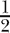。

### 3.3 矩阵运算与代数

你可以从两个角度理解 R 中的矩阵。首先，你可以纯粹将这些结构作为编程中的计算工具，用来存储和操作结果，正如你迄今所见。其次，你可以利用矩阵在相关计算中的数学性质，例如使用矩阵乘法表示回归模型方程。这个区别很重要，因为矩阵的数学行为并不总是与更通用的数据处理行为相同。在这里，我将简要介绍一些特殊的矩阵，以及一些涉及矩阵的最常见数学运算和 R 中的相应功能。如果矩阵的数学行为对你不感兴趣，你可以暂时跳过这一部分，稍后根据需要再参考。

#### *3.3.1 矩阵转置*

对于任何*m* × *n*矩阵*A*，它的*转置*，*A*^⊤，是通过将其列写成行或将其行写成列得到的*n* × *m*矩阵。

这是一个例子：

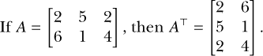

在`R`中，矩阵的转置可以通过`t`函数找到。让我们创建一个新矩阵，然后对其进行转置。

```
R> A <- rbind(c(2,5,2),c(6,1,4))
R> A
     [,1] [,2] [,3]
[1,]    2    5    2
[2,]    6    1    4
R> t(A)
     [,1] [,2]
[1,]    2    6
[2,]    5    1
[3,]    2    4
```

如果你对* A *进行“转置再转置”，你将恢复原始矩阵。

```
R> t(t(A))
     [,1] [,2] [,3]
[1,]    2    5    2
[2,]    6    1    4
```

#### *3.3.2 单位矩阵*

*单位矩阵*写作*I*[*m*]，是数学中一种特殊类型的矩阵。它是一个*m* × *m*的方阵，对角线上的元素为 1，其他位置为 0。

这是一个例子：

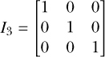

你可以使用标准的 `matrix` 函数创建任意维度的单位矩阵，但有一种更快捷的方法可以使用 `diag`。之前，我在一个现有的矩阵上使用了 `diag` 来提取或覆盖它的对角元素。你也可以按以下方式使用它：

```
R> A <- diag(x=3)
R> A
     [,1] [,2] [,3]
[1,]    1    0    0
[2,]    0    1    0
[3,]    0    0    1
```

在这里你可以看到 `diag` 可以用来轻松生成单位矩阵。为进一步说明，`diag` 的行为取决于你传递给它的参数 `x`。如果像之前那样，`x` 是一个矩阵，`diag` 会提取该矩阵的对角元素。如果 `x` 是一个正整数，就像这里的情况，`diag` 会生成对应维度的单位矩阵。你可以在 `diag` 的帮助页面找到更多的用法。

#### *3.3.3 矩阵的标量倍数*

标量值只是一个单一的、一维的值。任何矩阵 *A* 与标量值 *a* 相乘，都会得到一个新的矩阵，其中每个元素都被 *a* 乘以。

这里有一个例子：

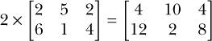

R 会以逐元素的方式执行此乘法，正如你所期望的那样。矩阵的标量乘法是通过标准的算术 `*` 运算符来执行的。

```
R> A <- rbind(c(2,5,2),c(6,1,4))
R> a <- 2
R> a*A
     [,1] [,2] [,3]
[1,]    4   10    4
[2,]   12    2    8
```

#### *3.3.4 矩阵加法和减法*

两个相同大小矩阵的加法或减法也是逐元素进行的。对应的元素会根据操作进行加法或减法。

这里有一个例子：

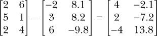

你可以使用标准的 `+` 和 `-` 符号来加减任何两个相同大小的矩阵。

```
R> A <- cbind(c(2,5,2),c(6,1,4))
R> A
     [,1] [,2]
[1,]    2    6
[2,]    5    1
[3,]    2    4
R> B <- cbind(c(-2,3,6),c(8.1,8.2,-9.8))
R> B
     [,1] [,2]
[1,]   -2  8.1
[2,]    3  8.2
[3,]    6 -9.8
R> A-B
     [,1] [,2]
[1,]    4 -2.1
[2,]    2 -7.2
[3,]   -4 13.8
```

#### *3.3.5 矩阵乘法*

为了*乘*两个矩阵 *A* 和 *B*，它们的大小分别为 *m* × *n* 和 *p* × *q*，必须满足 *n* = *p*。结果矩阵 *A* · *B* 的大小将是 *m* × *q*。乘积的元素是按行乘列的方式计算的，其中位置 (*AB*)[*i,j*] 的值是通过将 *A* 的第 *i* 行的每个元素与 *B* 的第 *j* 列的每个元素进行逐元素相乘并求和得到的。

这里有一个例子：

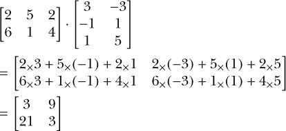

请注意，通常情况下，适当大小的矩阵（例如，*C* 和 *D*）的乘法不是交换的；也就是说，*CD* ≠ *DC*。

与加法、减法和标量乘法不同，矩阵乘法不是简单的逐元素计算，标准的 `*` 运算符不能使用。相反，你必须使用 R 的矩阵乘积运算符，它是由百分号符号 `%*%` 表示的。在你尝试此运算符之前，让我们先存储这两个示例矩阵，并使用 `dim` 检查确保第一个矩阵的列数与第二个矩阵的行数匹配。

```
R> A <- rbind(c(2,5,2),c(6,1,4))
R> dim(A)
[1] 2 3
R> B <- cbind(c(3,-1,1),c(-3,1,5))
R> dim(B)
[1] 3 2
```

这证明了这两个矩阵可以进行相乘，因此你可以继续操作。

```
R> A%*%B
     [,1] [,2]
[1,]    3    9
[2,]   21    3
```

你可以通过使用相同的两个矩阵来证明矩阵乘法是不可交换的。改变乘法的顺序会得到完全不同的结果。

```
R> B%*%A
     [,1] [,2] [,3]
[1,]  -12   12   -6
[2,]    4   -4    2
[3,]   32   10   22
```

#### *3.3.6 矩阵求逆*

一些方阵是可以*逆转*的。矩阵 *A* 的逆矩阵用 *A*^(–1) 表示。一个可逆矩阵满足以下方程：

*AA*^(–1) = *I*[*m*]

这是一个矩阵及其逆矩阵的示例：


不可逆的矩阵被称为*奇异矩阵*。当使用矩阵解方程时，求矩阵的逆是常常需要的，并且具有重要的实际意义。矩阵求逆有多种方法，随着矩阵大小的增大，这些计算会变得非常耗费计算资源。我们在这里不会深入讨论，但如果你感兴趣，可以参考 Golub 和 Van Loan（1989）的正式讨论。

现在，我将向你展示 R 语言中的 `solve` 函数作为求矩阵逆的一个选项。

```
R> A <- matrix(data=c(3,4,1,2),nrow=2,ncol=2)
R> A
     [,1] [,2]
[1,]    3    1
[2,]    4    2
R> solve(A)
     [,1] [,2]
[1,]    1 -0.5
[2,]   -2  1.5
```

你也可以验证这两个矩阵的乘积（使用矩阵乘法规则）会得到一个 2 × 2 的单位矩阵。

```
R> A%*%solve(A)
     [,1] [,2]
[1,]    1    0
[2,]    0    1
```

**练习 3.2**

1.  计算如下内容：

    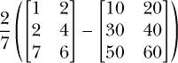

1.  存储这两个矩阵：

    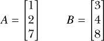

    以下哪些乘法是可能的？对于那些可以的，计算结果。

    1.  *A* · *B*

    1.  *A* ^⊤ · *B*

    1.  *B* ^⊤ · (*A* · *A* ^⊤)

    1.  (*A* · *A* ^⊤) · *B* ^⊤

    1.  [(*B* · *B* ^⊤) + (*A* · *A* ^⊤) − 100*I*[3]]^(−1)

1.  对于

    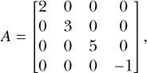

    验证 *A*^(–1) · *A* − *I[4]* 结果是一个 4 × 4 的零矩阵。

### 3.4 多维数组

就像矩阵（一个“矩形”元素集合）是通过增加向量（一个“线”元素集合）的维度得到的结果一样，矩阵的维度也可以增加，从而得到更复杂的数据结构。在 R 中，向量和矩阵可以被认为是更一般的*数组*的特殊情况，当它们具有超过两个维度时，我将用这个术语来指代这些结构。

那么，矩阵的下一步是什么呢？就像矩阵被认为是相同长度的向量集合一样，三维数组可以被认为是等维度矩阵的集合，从而为你提供一个元素的长方体。你仍然有固定数量的行和列，以及一个新的第三维度，称为*层*。图 3-3 展示了一个三行四列两层（3 × 4 × 2）的数组。

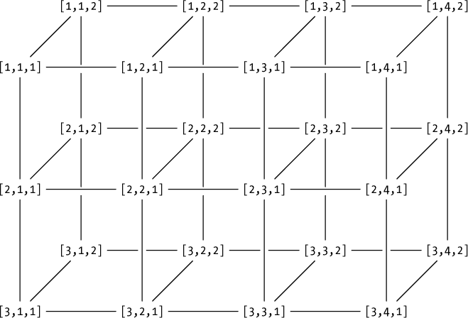

*图 3-3：一个 3* × *4* × *2 数组的概念图。每个元素的索引在相应位置给出。这些索引是严格按照* `[行，列，层]`的顺序提供的。*

#### *3.4.1 定义*

在 R 中创建这些数据结构时，使用 `array` 函数，并将 `data` 参数中的元素指定为一个向量。然后，在 `dim` 参数中指定大小，作为一个向量，其长度对应于维度的数量。注意，`array` 按列的顺序严格地填充每一层的条目，从第一层开始。考虑以下示例：

```
R> AR <- array(data=1:24,dim=c(3,4,2))
R> AR
, , 1

     [,1] [,2] [,3] [,4]
[1,]    1    4    7   10
[2,]    2    5    8   11
[3,]    3    6    9   12

, , 2
     [,1] [,2] [,3] [,4]
[1,]   13   16   19   22
[2,]   14   17   20   23
[3,]   15   18   21   24
```

这会给你一个和图 3-3 一样大小的数组——每个层构成一个 3 × 4 的矩阵。在这个例子中，注意提供给`dim`的维度顺序：`c(行,列,层)`。就像单个矩阵一样，数组的维度大小乘积将得出元素的总数。随着维度的增加，`dim`向量必须相应地扩展。例如，四维数组是下一个层次，可以看作是*三维数组的块*。假设你有一个四维数组，由三个`AR`（即刚才定义的三维数组）组成。这个新数组可以如下方式在 R 中存储（同样，数组按列填充）：

```
R> BR <- array(data=rep(1:24,times=3),dim=c(3,4,2,3))
R> BR
, , 1, 1

     [,1] [,2] [,3] [,4]
[1,]    1    4    7   10
[2,]    2    5    8   11
[3,]    3    6    9   12

, , 2, 1

     [,1] [,2] [,3] [,4]
[1,]   13   16   19   22
[2,]   14   17   20   23
[3,]   15   18   21   24

, , 1, 2

     [,1] [,2] [,3] [,4]
[1,]    1    4    7   10
[2,]    2    5    8   11
[3,]    3    6    9   12

, , 2, 2

     [,1] [,2] [,3] [,4]
[1,]   13   16   19   22
[2,]   14   17   20   23
[3,]   15   18   21   24

, , 1, 3

     [,1] [,2] [,3] [,4]
[1,]    1    4    7   10
[2,]    2    5    8   11
[3,]    3    6    9   12

, , 2, 3

     [,1] [,2] [,3] [,4]
[1,]   13   16   19   22
[2,]   14   17   20   23
[3,]   15   18   21   24
```

使用`BR`，你现在拥有三个`AR`的副本。这些副本被拆分为两个层，以便 R 能够将对象打印到屏幕上。和之前一样，行由第一位数字索引，列由第二位数字索引，层由第三位数字索引。新的第四位数字索引块。

#### *3.4.2 子集、提取和替换*

尽管高维对象可能难以概念化，但 R 会始终如一地对它们进行索引。这使得提取这些结构中的元素变得直接简单，因为你已经学会了如何对子集矩阵进行操作——你只需继续在方括号中使用逗号作为维度之间的分隔符。接下来的例子会强调这一点。

假设你想要获取之前创建的数组`AR`的第二层的第二行。你只需在方括号中输入`AR`的这些精确维度位置。

```
R> AR[2,,2]
[1] 14 17 20 23
```

所需的元素已被提取为一个长度为 4 的向量。如果你想从这个向量中获取特定的元素，比如第三个和第一个（按这个顺序），你可以调用以下代码：

```
R> AR[2,c(3,1),2]
[1] 20 14
```

再次，这种字面量的子集方法使得处理 R 中的高维对象变得可控。

产生多个向量的提取会在返回的矩阵中以列的形式呈现。例如，要提取`AR`的两个层的第一行，你可以输入如下代码：

```
R> AR[1,,]
     [,1] [,2]
[1,]    1   13
[2,]    4   16
[3,]    7   19
[4,]   10   22
```

返回的对象包含了每个矩阵层的第一行。然而，它返回的这些向量被作为单个返回矩阵的*列*。正如这个例子所示，当从数组中提取多个向量时，它们会默认作为列返回。这意味着提取的行不一定会作为行返回。

转到对象`BR`，下面的代码会给你三维数组中位于第三块的矩阵第一层的第二行第一列的单一元素。

```
R> BR[2,1,1,3]
[1] 2
```

同样，你只需查看方括号中索引的位置，就能知道你要求 R 从数组中返回哪些值。以下示例强调了这一点：

```
R> BR[1,,,1]
     [,1] [,2]
[1,]    1   13
[2,]    4   16
[3,]    7   19
[4,]   10   22
```

这将返回第一个块中第一行的所有值。由于我在这个子集`[1,,,1]`中没有指定列和层的索引，这个命令返回了`BR`块中所有四列和两个层的值。

接下来，以下代码将返回`BR`数组第二层中的所有值，该层由三个矩阵组成：

```
R> BR[,,2,]
, , 1

     [,1] [,2] [,3] [,4]
[1,]   13   16   19   22
[2,]   14   17   20   23
[3,]   15   18   21   24

, , 2

     [,1] [,2] [,3] [,4]
[1,]   13   16   19   22
[2,]   14   17   20   23
[3,]   15   18   21   24

, , 3

     [,1] [,2] [,3] [,4]
[1,]   13   16   19   22
[2,]   14   17   20   23
[3,]   15   18   21   24
```

最后的这个例子突出了前面提到的一个特性，其中从`AR`提取的多个向量作为矩阵返回。一般来说，如果你进行提取操作并得到多个*d*维数组，结果将会是下一个维度（*d* + 1）的数组。在最后的例子中，你提取了多个（二维）矩阵，它们作为三维数组返回。这个特性在接下来的例子中再次得到展示：

```
R> BR[3:2,4,,]
, , 1

     [,1] [,2]
[1,]   12   24
[2,]   11   23

, , 2

     [,1] [,2]
[1,]   12   24
[2,]   11   23

, , 3

     [,1] [,2]
[1,]   12   24
[2,]   11   23
```

这将提取所有层和所有数组块中，第三行和第二行（按顺序），第四列的元素。考虑下面的最后一个例子：

```
R> BR[2,,1,]
     [,1] [,2] [,3]
[1,]    2    2    2
[2,]    5    5    5
[3,]    8    8    8
[4,]   11    11  11
```

在这里，你要求 R 返回存储在`BR`中的所有数组第一层的完整第二行。

删除和覆盖高维数组中的元素遵循与独立向量和矩阵相同的规则。你通过负索引（用于删除）或使用赋值运算符（用于覆盖）来指定维度位置。

你可以使用`array`函数来创建一维数组（向量）和二维数组（矩阵），如果需要的话（通过设置`dim`参数的长度为 1 或 2）。不过需要注意的是，尤其是向量，在使用`array`而不是`c`创建时，某些函数可能会以不同的方式对待它们（有关技术细节，请参见帮助文件`?array`）。因此，为了使大段代码更具可读性，在 R 编程中通常更倾向于使用特定的向量和矩阵创建函数`c`和`matrix`。

**练习 3.3**

1.  创建并存储一个三维数组，包含六层 4 × 2 矩阵，矩阵中的值是从 4.8 到 0.1 的递减序列，长度适当。

1.  提取并存储第二列中所有层的第四行和第一行元素，顺序为：第四行，第一行，作为一个新对象。

1.  使用矩阵（b）中第二行的四次重复，填充一个新的 2 × 2 × 2 × 3 维数组。

1.  创建一个新数组，包含删除（a）第六层后的结果。

1.  用−99 覆盖（d）中第 1 层、第 3 层和第 5 层的第二列的第二行和第四行元素。

##### 本章中的重要代码

| **函数/运算符** | **简要描述** | **首次出现** |
| --- | --- | --- |
| `matrix` | 创建一个矩阵 | 第 3.1 节，第 40 页 |
| `rbind` | 创建一个矩阵（按行绑定） | 第 3.1.2 节，第 41 页 |
| `cbind` | 创建一个矩阵（按列绑定） | 第 3.1.2 节，第 42 页 |
| `dim` | 获取矩阵维度 | 第 3.1.3 节, 第 42 页 |
| `nrow` | 获取行数 | 第 3.1.3 节, 第 42 页 |
| `ncol` | 获取列数 | 第 3.1.3 节, 第 42 页 |
| `[ , ]` | 矩阵/数组子集提取 | 第 3.2 节, 第 43 页 |
| `diag` | 对角线元素/单位矩阵 | 第 3.2.1 节, 第 44 页 |
| `t` | 矩阵转置 | 第 3.3.1 节, 第 47 页 |
| `*` | 标量矩阵乘法 | 第 3.3.3 节, 第 49 页 |
| `+`, `-` | 矩阵加法/减法 | 第 3.3.4 节, 第 49 页 |
| `%*%` | 矩阵乘法 | 第 3.3.5 节, 第 50 页 |
| `solve` | 矩阵求逆 | 第 3.3.6 节, 第 51 页 |
| `array` | 创建数组 | 第 3.4.1 节, 第 53 页 |
