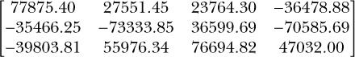
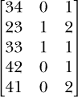

## 6

**特殊值、类和强制转换**


你现在已经了解了数值型、逻辑型、字符型和因子型，以及它们的独特属性和应用。接下来，你将学习 R 中一些不太明确的特殊值。你将看到它们是如何产生的，以及如何处理和测试它们。然后，你将了解 R 中的不同数据类型以及一些通用的对象类概念。

### 6.1 一些特殊值

在 R 中，许多情况需要使用特殊值。例如，当数据集中存在缺失的观测值，或者计算出一个近似无限大的数时，软件会为这些情况保留一些特殊的术语。这些特殊值可以用于标记向量、数组或其他数据结构中的异常值或缺失值。

#### *6.1.1 无限大*

在第 2.1 节中，我提到过 R 对数字的极限有一定的限制，当数字过大，软件无法可靠地表示时，值会被认为是*无限大*。当然，数学中的无限大（∞）并不对应一个特定的数字——R 只需要定义一个极限值。这个精确的截止值会因系统而异，部分由 R 可以访问的内存量决定。这个值由特殊对象 `Inf` 表示，大小写敏感。因为它代表一个数值，`Inf` 只能与数值型向量关联。让我们创建一些对象来进行测试。

```
R> foo <- Inf
R> foo
[1] Inf
R> bar <- c(3401,Inf,3.1,-555,Inf,43)
R> bar
[1] 3401.0    Inf    3.1 -555.0    Inf   43.0
R> baz <- 90000¹⁰⁰
R> baz
[1] Inf
```

这里，你定义了一个对象 `foo`，它是一个无限大值的单一实例。你还定义了一个数值向量 `bar`，其中包含两个无限大元素，然后在 `baz` 中将 90,000 的 100 次方运算得到 R 认为是无限大的结果。

R 还可以表示负无穷，用 `-Inf` 表示。

```
R> qux <- c(-42,565,-Inf,-Inf,Inf,-45632.3)
R> qux
[1]    -42.0    565.0     -Inf     -Inf     Inf -45632.3
```

这会创建一个包含两个负无穷值和一个正无穷值的向量。

尽管无限大并不代表任何特定的数值，但在一定程度上，你仍然可以在 R 中对无限大值进行数学运算。例如，将 `Inf` 乘以任何负数将得到 `-Inf`。

```
R> Inf*-9
[1] -Inf
```

如果你对无限大进行加法或乘法运算，结果仍然是无限大。

```
R> Inf+1
[1] Inf
R> 4*-Inf
[1] -Inf
R> -45.2-Inf
[1] -Inf
R> Inf-45.2
[1] Inf
R> Inf+Inf
[1] Inf
R> Inf/23
[1] Inf
```

零与无限大在除法运算中是密切相关的。任何（有限的）数值除以正或负的无限大都会得到零。

```
R> -59/Inf
[1] 0
R> -59/-Inf
[1] 0
```

尽管在数学上没有明确的定义，但请注意，在 R 中，任何非零值除以零都会得到无限大（根据分子符号的不同，可能是正无穷或负无穷）。

```
R> -59/0
[1] -Inf
R> 59/0
[1] Inf
R> Inf/0
[1] Inf
```

通常，你只是想检测数据结构中的无限大值。`is.infinite` 和 `is.finite` 函数接受一个值的集合，通常是一个向量，并为每个元素返回一个逻辑值，回答提出的问题。这里是一个使用之前的 `qux` 的例子：

```
R> qux
[1]    -42.0    565.0     -Inf     -Inf     Inf -45632.3
R> is.infinite(x=qux)
[1] FALSE FALSE  TRUE  TRUE  TRUE FALSE
R> is.finite(x=qux)
[1]  TRUE  TRUE FALSE FALSE FALSE  TRUE
```

请注意，这些函数不会区分正无穷和负无穷，而`is.finite`的结果总是与`is.infinite`的结果相反（即否定）。

最后，关系运算符的功能如你所预期的那样。

```
R> -Inf<Inf
[1] TRUE
R> Inf>Inf
[1] FALSE
R> qux==Inf
[1] FALSE FALSE FALSE FALSE  TRUE FALSE
R> qux==-Inf
[1] FALSE FALSE  TRUE  TRUE FALSE FALSE
```

这里，第一行确认`-Inf`确实被视为小于`Inf`，第二行显示`Inf`不是大于`Inf`。第三行和第四行再次使用`qux`，测试等式，这是区分正负无穷的一个有用方式，特别是如果你需要做这样的区分。

#### *6.1.2 NaN*

在某些情况下，无法用数字、`Inf`或`-Inf`表示计算结果。这些难以量化的特殊值在 R 中被标记为`NaN`，即*不是一个数字*。

和无穷大值一样，`NaN`值仅与数值型观察相关。虽然可以直接定义或包含`NaN`值，但这并不是它们常见的方式。

```
R> foo <- NaN
R> foo
[1] NaN
R> bar <- c(NaN,54.3,-2,NaN,90094.123,-Inf,55)
R> bar
[1]      NaN    54.30    -2.00      NaN 90094.12      -Inf    55.00
```

通常，`NaN`是尝试进行无法执行的计算时的意外结果，计算中涉及的值不可用。

在第 6.1.1 节中，你看到将`Inf`或`-Inf`加减后仍然得到`Inf`或`-Inf`。然而，如果你试图以任何方式抵消无穷大的表示，结果将是`NaN`。

```
R> -Inf+Inf
[1] NaN
R> Inf/Inf
[1] NaN
```

在这里，第一行不会得到零，因为正负无穷大不能以数值的方式进行解释，因此结果是`NaN`。如果你尝试将`Inf`除以它本身，也会出现相同的情况。此外，虽然你之前看到过非零值除以零会得到正无穷或负无穷，但当*零*除以零时，结果是`NaN`。

```
R> 0/0
[1] NaN
```

请注意，任何涉及`NaN`的数学运算都会简单地得到`NaN`。

```
R> NaN+1
[1] NaN
R> 2+6*(4-4)/0
[1] NaN
R> 3.5^(-Inf/Inf)
[1] NaN
```

在第一行，将 1 加到“不是一个数字”上仍然是`NaN`。在第二行，你从`(4-4)/0`中得到`NaN`，这显然是`0/0`，因此结果也是`NaN`。在第三行，`-Inf/Inf`的结果是`NaN`，因此剩余的计算结果再次是`NaN`。这开始让你明白`NaN`或无穷大的值是如何无意中出现的。如果你有一个函数，其中多个值被传递给固定计算，并且没有防止出现例如`0/0`的情况，那么代码将返回`NaN`。

与`Inf`一样，使用特殊函数(`is.nan`)来检测`NaN`值的存在。然而，与无穷大值不同，关系运算符不能与`NaN`一起使用。这里是一个使用之前定义的`bar`的示例：

```
R> bar
[1]      NaN    54.30    -2.00      NaN 90094.12      -Inf      55.00
R> is.nan(x=bar)
[1]  TRUE FALSE FALSE  TRUE FALSE FALSE FALSE
R> !is.nan(x=bar)
[1] FALSE  TRUE  TRUE FALSE  TRUE  TRUE  TRUE
R> is.nan(x=bar)|is.infinite(x=bar)
[1]  TRUE FALSE FALSE  TRUE FALSE  TRUE FALSE
R> bar[-(which(is.nan(x=bar)|is.infinite(x=bar)))]
[1]    54.30    -2.00 90094.12    55.00
```

使用`is.nan`函数对`bar`进行操作，会将两个`NaN`位置标记为`TRUE`。在第二个示例中，你使用否定操作符`!`来标记那些元素不是`NaN`的位置。然后，使用按元素的逻辑“或”运算符`|`（参见第 4.1.3 节），你可以识别那些既是`NaN`又是无限大的元素。最后，最后一行使用`which`将这些逻辑值转换为数字索引位置，这样你就可以通过方括号中的负索引将其移除（关于如何使用`which`的复习，请参见第 4.1.5 节）。

你可以通过在提示符下输入`?Inf`来获取更多关于`NaN`和`Inf`功能和行为的详细信息。

**练习 6.1**

1.  存储以下向量：

    ```
    foo <- c(13563,-14156,-14319,16981,12921,11979,9568,8833,-12968,
             8133)
    ```

    然后，进行以下操作：

    1.  输出所有`foo`中的元素，这些元素在升到 75 次方时不为无限大。

    1.  返回`foo`的元素，排除那些在升到 75 次方时结果为负无穷大的元素。

1.  将以下 3 × 4 矩阵存储为对象`bar`：

    

    现在，进行以下操作：

    1.  当将`bar`的元素升到 65 次方并除以无穷大时，识别出`NaN`的坐标特定索引。

    1.  返回`bar`中那些在`bar`升到 67 次方并加上无穷大后不为`NaN`的值。确认这与识别那些在升到 67 次方时不等于负无穷大的`bar`值是相同的。

    1.  在将`bar`的元素升到 67 次方时，识别出那些负无穷大或有限的值。

#### *6.1.3 NA*

在统计分析中，数据集经常包含缺失值。例如，有人填写问卷时可能未回答某个项目，或者研究人员可能错误地记录了实验中的一些观察值。识别和处理缺失值很重要，这样你就可以继续使用其余数据。R 提供了一个标准的特殊术语来表示缺失值，`NA`，即*不可用*。

`NA`条目与`NaN`条目不同。`NaN`仅用于数字操作，而缺失值可以出现在任何类型的观察值中。因此，`NA`可以存在于数字和非数字设置中。以下是一个示例：

```
R> foo <- c("character","a",NA,"with","string",NA)
R> foo
[1] "character" "a"         NA          "with"      "string"    NA
R> bar <- factor(c("blue",NA,NA,"blue","green","blue",NA,"red","red",NA,
                 "green"))
R> bar
 [1] blue  <NA>  <NA>  blue  green blue  <NA>   red   red  <NA>  green
Levels: blue green red
R> baz <- matrix(c(1:3,NA,5,6,NA,8,NA),nrow=3,ncol=3)
R> baz
     [,1] [,2] [,3]
[1,]    1   NA   NA
[2,]    2    5    8
[3,]    3    6    NA
```

对象`foo`是一个字符向量，其中第 3 和第 6 项缺失；`bar`是一个长度为 11 的因子向量，其中第 2、3、7 和 10 项缺失；`baz`是一个数值矩阵，第 1 行、第 2 和 3 列、第 3 行第 3 列缺失元素。在因子向量中，请注意`NA`被打印为`<NA>`。这是为了区分因子的真实水平和缺失的观察值，防止将`NA`误解为某个因子水平。

与前面讨论的其他特殊值一样，你可以使用`is.na`函数来识别`NA`元素。这通常对删除或替换`NA`值很有用。考虑以下数字向量：

```
R> qux <- c(NA,5.89,Inf,NA,9.43,-2.35,NaN,2.10,-8.53,-7.58,NA,-4.58,2.01,NaN)
R> qux
 [1]    NA  5.89   Inf    NA  9.43 -2.35   NaN  2.10 -8.53 -7.58    NA -4.58
[13]  2.01   NaN
```

该向量总共有 14 个条目，包括`NA`、`NaN`和`Inf`。

```
R> is.na(x=qux)
 [1]  TRUE FALSE FALSE  TRUE FALSE FALSE  TRUE FALSE FALSE FALSE  TRUE FALSE
[13] FALSE  TRUE
```

正如你所看到的，`is.na`将`qux`中相应的`NA`条目标记为`TRUE`。但这并非全部——请注意，它还标记了元素 7 和 14，它们是`NaN`，而不是`NA`。严格来说，`NA`和`NaN`是不同的实体，但在数值上它们几乎是相同的，因为你几乎无法对这两者做任何事情。使用`is.na`将它们都标记为`TRUE`，允许用户同时删除或重新编码这两者。

如果你想单独标识`NA`和`NaN`条目，可以将`is.nan`与逻辑运算符结合使用。以下是一个示例：

```
R> which(x=is.nan(x=qux))
[1]  7 14
```

这标识出具体为`NaN`的元素索引位置。如果你只想标识`NA`条目，可以尝试以下方法：

```
R> which(x=(is.na(x=qux)&!is.nan(x=qux)))
[1]  1  4 11
```

这仅标识`NA`条目的元素索引（通过检查`is.na`为`TRUE`并且`is.nan`不为`TRUE`的条目）。

在找到问题元素后，你可以使用方括号中的负索引将它们移除，尽管 R 提供了一个更直接的选项。函数`na.omit`将接收一个结构并删除其中所有的`NA`；如果元素是数字类型，`na.omit`也会应用于`NaN`。

```
R> quux <- na.omit(object=qux)
R> quux
[1]  5.89   Inf  9.43 -2.35  2.10 -8.53 -7.58 -4.58  2.01
attr(,"na.action")
[1]  1  4  7 11 14
attr(,"class")
[1] "omit"
```

请注意，传递给`na.omit`的结构作为参数`object`给出，并且打印返回对象时会显示一些额外的输出。这些额外的细节旨在告知用户原始向量中有一些元素被删除（在本例中，被删除的元素位置在属性`na.action`中提供）。属性将在第 6.2.1 节中进一步讨论。

类似于`NaN`，对`NA`进行算术计算也会得到`NA`。使用关系运算符与`NaN`或`NA`进行操作时，结果也会是`NA`。

```
R> 3+2.1*NA-4
[1] NA
R> 3*c(1,2,NA,NA,NaN,6)
[1]   3   6  NA  NA NaN  18
R> NA>76
[1] NA
R> 76>NaN
[1] NA
```

你可以通过输入`?NA`来获取更多关于`NA`值的使用和技术细节。

#### *6.1.4 NULL*

最后，我们来看一下*null*值，即`NULL`。这个值通常用来显式定义一个“空”的实体，这与用`NA`表示的“缺失”实体有所不同。`NA`的实例清晰地表示一个可以访问和/或在必要时被覆盖的位置——而`NULL`则不是如此。如果你将`NA`的赋值与`NULL`的赋值进行比较，你会看到这点的体现。

```
R> foo <- NULL
R> foo
NULL
R> bar <- NA
R> bar
[1] NA
```

请注意，`bar`，即`NA`对象，以索引位置`[1]`打印。这表明你有一个包含单个元素的向量。相比之下，你显式地用`NULL`指示`foo`为空。打印该对象时不会显示位置索引，因为没有可访问的位置。

对`NULL`的这种解释同样适用于那些具有其他明确定义项目的向量。考虑以下两行代码：

```
R> c(2,4,NA,8)
[1]  2  4 NA  8
R> c(2,4,NULL,8)
[1] 2 4 8
```

第一行创建了一个长度为 4 的向量，第三个位置编码为`NA`。第二行创建了一个类似的向量，但使用`NULL`代替`NA`。结果是一个长度只有 3 的向量。这是因为`NULL`无法在向量中占据一个位置。因此，将`NULL`赋值给向量中的多个位置（或任何其他结构）是没有意义的。再举一个例子：

```
R> c(NA,NA,NA)
[1] NA NA NA
R> c(NULL,NULL,NULL)
NULL
```

第一行可以解释为“有三个可能的槽位，其中包含未记录的观测值。”第二行只是简单地提供了“三次空值”，它被解释为一个单一的、无法子集化的空对象。

此时，你可能会想，为什么甚至需要`NULL`。如果某个东西为空且不存在，为什么一开始要定义它？答案在于需要能够明确声明或检查某个对象是否已被定义。这在调用 R 中的函数时经常发生。例如，当一个函数包含可选参数时，函数内部必须检查这些参数中哪些已提供，哪些缺失或为空。`NULL`值是一个有用且灵活的工具，函数的作者可以利用它来方便地进行此类检查。你将在第十一章看到这些的示例。

`is.null`函数用于检查某个东西是否明确为`NULL`。假设你有一个包含名为`opt.arg`的可选参数的函数，如果提供了，`opt.arg`应该是一个长度为 3 的字符向量。假设用户以以下方式调用该函数。

```
R> opt.arg <- c("string1","string2","string3")
```

现在，如果你检查是否使用`NA`提供了参数，你可能会调用这个：

```
R> is.na(x=opt.arg)
[1] FALSE FALSE FALSE
```

`NA`的位置信息性质意味着此检查是逐元素进行的，并且会为`opt.arg`中的每个值返回一个答案。这是有问题的，因为你只想要一个答案——`opt.arg`是空的，还是已经提供？这时`NULL`就派上用场了。

```
R> is.null(x=opt.arg)
[1] FALSE
```

很明显，`opt.arg`不是空的，函数可以按需继续。如果参数为空，使用`NULL`而不是`NA`进行检查，出于这些目的，通常更为合适。

```
R> opt.arg <- c(NA,NA,NA)
R> is.na(x=opt.arg)
[1] TRUE TRUE TRUE

R> opt.arg <- c(NULL,NULL,NULL)
R> is.null(x=opt.arg)
[1] TRUE
```

如前所述，填充向量时使用`NULL`并不是一种常规做法；这里这样做只是为了说明。但`NULL`的使用远不止限于此特定示例。在 R 中，无论是现成的功能还是用户贡献的功能中，它都被广泛使用。

如果将空的`NULL`包含在算术或关系比较中，它有一个有趣的效果。

```
R> NULL+53
numeric(0)
R> 53<=NULL
logical(0)
```

结果并不是你可能预期的`NULL`，而是一个“空的”向量，其类型由所尝试的操作的性质决定。`NULL`通常主导任何算术运算，即使它包含其他特殊值。

```
R> NaN-NULL+NA/Inf
numeric(0)
```

`NULL`在检查列表和数据框时也自然出现。例如，定义一个新的列表`foo`。

```
R> foo <- list(member1=c(33,1,5.2,7),member2="NA or NULL?")
R> foo
$member1
[1] 33.0  1.0  5.2  7.0

$member2
[1] "NA or NULL?"
```

这个列表显然不包含名为`member3`的成员。看看当你尝试通过该名称访问`foo`中的成员时会发生什么：

```
R> foo$member3
NULL
```

`NULL` 的结果表示在 `foo` 中没有名为 `member3` 的成员，或者用 R 的术语来说，就是为空。因此，你可以用任何你想要的内容填充它。

```
R> foo$member3 <- NA
R> foo
$member1
[1] 33.0  1.0  5.2  7.0

$member2
[1] "NA or NULL?"

$member3
[1] NA
```

当使用美元符号操作符查询数据框中不存在的列或变量时，同样的原则适用（如 第 5.2.2 节所示）。

有关 `NULL` 和 `is.null` 在 R 中如何处理的更多技术细节，请参阅通过 `?NULL` 访问的帮助文件。

**练习 6.2**

1.  考虑以下代码行：

    ```
    foo <- c(4.3,2.2,NULL,2.4,NaN,3.3,3.1,NULL,3.4,NA)
    ```

    自己判断以下哪些语句是真，哪些是假的，然后使用 R 来确认：

    1.  `foo` 的长度是 8。

    1.  调用 `which(x=is.na(x=foo))` 不会返回 `4` 和 `8`。

    1.  检查 `is.null(x=foo)` 将提供你当前存在的两个 `NULL` 值的位置。

    1.  执行 `is.na(x=foo[8])+4/NULL` 不会导致 `NA`。

1.  创建并存储一个包含单个成员的列表：向量 `c(7,7,NA,3,NA,1,1,5,NA)`。然后，执行以下操作：

    1.  将成员命名为 `"alpha"`。

    1.  使用适当的逻辑值函数确认列表中没有名为 `"beta"` 的成员。

    1.  添加一个名为 `beta` 的新成员，该成员是通过标识 `alpha` 中为 `NA` 的索引位置得到的向量。

### 6.2 理解类型、类和强制转换

到目前为止，你已经学习了 R 语言中用于表示、存储和处理数据的许多基本特性。在本节中，你将研究如何正式区分不同类型的值和结构，并查看一些从一种类型转换到另一种类型的简单示例。

#### *6.2.1 属性*

你创建的每个 R 对象都有关于该对象本身性质的附加信息。这些附加信息被称为对象的 *属性*。你已经见过一些属性。在 第 3.1.3 节中，你通过 `dim` 确定了矩阵的维度属性。在 第 4.3.1 节中，你使用 `levels` 获取了因子的层次属性。还在 第 5.1.2 节中提到过，`names` 可以获取列表的成员名，在 第 6.1.3 节中，属性注释了应用 `na.omit` 的结果。

一般来说，你可以将属性视为 *显式* 或 *隐式* 的。显式属性对用户是立即可见的，而 R 内部决定隐式属性。你可以使用 `attributes` 函数打印给定对象的显式属性，该函数接受任何对象并返回一个命名的列表。例如，考虑以下的 3 × 3 矩阵：

```
R> foo <- matrix(data=1:9,nrow=3,ncol=3)
R> foo
     [,1] [,2] [,3]
[1,]    1    4    7
[2,]    2    5    8
[3,]    3    6    9

R> attributes(foo)
$dim
[1] 3 3
```

在这里，调用 `attributes` 返回一个包含一个成员的列表：`dim`。当然，你可以通过 `attributes(foo)$dim` 检索 `dim` 的内容，但如果你知道一个属性的名称，也可以使用 `attr`：

```
R> attr(x=foo,which="dim")
[1] 3 3
```

该函数将对象作为 `x` 输入，并将属性名称作为 `which`。回忆一下，在 R 中，名称是作为字符字符串指定的。为了更加方便，最常见的属性都有自己的函数（通常以属性名命名）来访问对应的值。对于矩阵的维度，你已经看到过函数 `dim`。

```
R> dim(foo)
[1] 3 3
```

这些特定属性的函数很有用，因为它们还允许访问隐式属性，这些属性虽然仍然可以由用户控制，但作为必要性，软件会自动设置它们。前面提到的 `names` 和 `levels` 函数也是特定属性的函数。

显式属性通常是可选的；如果没有指定，它们默认为 `NULL`。例如，在使用 `matrix` 函数构建矩阵时，你可以使用可选参数 `dimnames` 来为行和列添加名称。你将 `dimnames` 传递一个由两个成员组成的列表，每个成员都是一个适当长度的字符向量——第一个给出行名，第二个给出列名。我们可以如下定义矩阵 `bar`：

```
R> bar <- matrix(data=1:9,nrow=3,ncol=3,dimnames=list(c("A","B","C"),
                 c("D","E","F")))
R> bar
  D E F
A 1 4 7
B 2 5 8
C 3 6 9
```

因为维度名称是属性，所以当你调用 `attributes(bar)` 时，`dimnames` 会出现。

```
R> attributes(bar)
$dim
[1] 3 3

$dimnames
$dimnames[[1]]
[1] "A" "B" "C"

$dimnames[[2]]
[1] "D" "E" "F"
```

请注意，`dimnames` 本身是一个列表，嵌套在更大的属性列表中。同样，为了提取这个属性的值，你可以使用列表成员引用，使用前面提到的 `attr`，或者使用特定属性的函数。

```
R> dimnames(bar)
[[1]]
[1] "A" "B" "C"

[[2]]
[1] "D" "E" "F"
```

有些属性可以在对象创建后进行修改（如你在第 5.1.2 节中看到的那样，在那里你重新命名了列表的成员）。在这里，为了使 `foo` 完全匹配 `bar`，你可以通过将 `dimnames` 分配给特定属性的函数来给 `foo` 添加一些 `dimnames`：

```
R> dimnames(foo) <- list(c("A","B","C"),c("D","E","F"))
R> foo
  D E F
A 1 4 7
B 2 5 8
C 3 6 9
```

在这里的讨论中我使用了矩阵，但在 R 中，其他对象的可选属性也以相同的方式处理。属性不仅仅局限于内置的 R 对象。你自己构建的对象也可以定义自己的属性和特定属性的函数。只要记住，属性的作用通常是提供关于对象的描述性数据，否则你可能会不必要地使对象结构变得复杂。

#### *6.2.2 对象类*

一个对象的 *class* 是描述 R 中实体最有用的属性之一。你创建的每个对象都会被标识，隐式或显式地至少有一个类。R 是一种 *面向对象* 的编程语言，意味着实体作为对象存储，并且具有可操作它们的方法。在这种语言中，类的标识正式被称为 *继承*。

**注意**

*本节将重点介绍 R 中最常用的分类结构——S3 结构。* S4 *是另一种结构，基本上是对不同对象的识别和处理的更正式的规则集。对于大多数实际用途，尤其是对于初学者，理解和使用 S3 就足够了。你可以在 R 的在线文档中找到更多细节。*

在一些情况下，对象的类别是显式的，比如在你有用户自定义的对象结构或因子向量或数据框等对象时，其他属性在处理对象本身时发挥着重要作用——例如，因子向量的级别标签或数据框中的变量名是可修改的属性，在访问每个对象的观测值时起着主要作用。另一方面，像向量、矩阵和数组这样的基础 R 对象是隐式分类的，这意味着类别不能通过`attributes`函数来识别。无论是隐式还是显式，给定对象的类别始终可以通过特定的属性函数`class`来获取。

##### 独立向量

让我们创建一些简单的向量作为示例。

```
R> num.vec1 <- 1:4
R> num.vec1
[1] 1 2 3 4
R> num.vec2 <- seq(from=1,to=4,length=6)
R> num.vec2
[1] 1.0 1.6 2.2 2.8 3.4 4.0
R> char.vec <- c("a","few","strings","here")
R> char.vec
[1] "a"       "few"     "strings" "here"
R> logic.vec <- c(T,F,F,F,T,F,T,T)
R> logic.vec
[1]  TRUE FALSE FALSE FALSE  TRUE FALSE  TRUE  TRUE
R> fac.vec <- factor(c("Blue","Blue","Green","Red","Green","Yellow"))
R> fac.vec
[1] Blue   Blue   Green  Red    Green  Yellow
Levels: Blue Green Red Yellow
```

你可以将任何对象传递给`class`函数，它会返回一个字符向量作为输出。以下是使用刚刚创建的向量的示例：

```
R> class(num.vec1)
[1] "integer"
R> class(num.vec2)
[1] "numeric"
R> class(char.vec)
[1] "character"
R> class(logic.vec)
[1] "logical"
R> class(fac.vec)
[1] "factor"
```

使用`class`函数在字符向量、逻辑向量和因子向量上的输出结果仅仅是数据存储的类型。然而，数值向量的输出稍微复杂一些。到目前为止，我将所有包含算术有效数字的对象称为`"numeric"`。如果向量中存储的所有数字都是整数，那么 R 会将该向量识别为`"integer"`。另一方面，带有小数点的数字（称为*浮动点*数字）会被识别为`"numeric"`。这种区分是必要的，因为某些任务严格要求使用整数，而非浮动点数字。在口语上，我将继续把这两种类型称为`"numeric"`，事实上，`is.numeric`函数会对整数和浮动点结构都返回`TRUE`，正如你在第 6.2.3 节中所看到的。

##### 其他数据结构

如前所述，R 的类别本质上是为了方便面向对象编程而设计的。因此，`class`通常报告的是数据*结构*的性质，而不是存储的数据类型——它仅在用于独立向量时才返回数据类型。让我们在一些矩阵上试试这个函数。

```
R> num.mat1 <- matrix(data=num.vec1,nrow=2,ncol=2)
R> num.mat1
     [,1] [,2]
[1,]    1    3
[2,]    2    4
R> num.mat2 <- matrix(data=num.vec2,nrow=2,ncol=3)
R> num.mat2
     [,1] [,2] [,3]
[1,]  1.0  2.2  3.4
[2,]  1.6  2.8  4.0
R> char.mat <- matrix(data=char.vec,nrow=2,ncol=2)
R> char.mat
     [,1]  [,2]
[1,] "a"   "strings"
[2,] "few" "here"
R> logic.mat <- matrix(data=logic.vec,nrow=4,ncol=2)
R> logic.mat
      [,1]  [,2]
[1,]  TRUE  TRUE
[2,] FALSE FALSE
[3,] FALSE  TRUE
[4,] FALSE  TRUE
```

请注意，在第 4.3.1 节中提到，因子只能以向量形式使用，因此`fac.vec`不包括在这里。现在检查这些矩阵的`class`。

```
R> class(num.mat1)
[1] "matrix"
R> class(num.mat2)
[1] "matrix"
R> class(char.mat)
[1] "matrix"
R> class(logic.mat)
[1] "matrix"
```

你会发现，无论数据类型如何，`class`报告的是对象本身的结构——所有的矩阵都是如此。其他对象结构，如数组、列表和数据框，也一样。

##### 多种类

某些对象会有多个类。一个对象的变种形式，如有序因子向量，会继承常规因子类，并且还会包含额外的 `ordered` 类。如果使用 `class` 函数，它们都会被返回。

```
R> ordfac.vec <- factor(x=c("Small","Large","Large","Regular","Small"),
                        levels=c("Small","Regular","Large"),
                        ordered=TRUE)
R> ordfac.vec
[1] Small   Large   Large   Regular Small
Levels: Small < Regular < Large
R> class(ordfac.vec)
[1] "ordered" "factor"
```

之前，`fac.vec` 被标识为仅为 `"factor"`，但 `ordfac.vec` 的类有两个组成部分。它仍然被标识为 `"factor"`，但还包括 `"ordered"`，这标识了该对象中存在的 `"factor"` 类的变体。这里，您可以将 `"ordered"` 看作是 `"factor"` 的 *子类*。换句话说，它是一个从 `"factor"` 继承并因此表现得像 `"factor"` 的特殊情况。有关 R 子类的更多技术细节，我推荐 Matloff 的 *《R 编程艺术》*（2011）第九章。

**注意**

*我在这里重点讲解* `class` *函数，因为它与本书中采用的面向对象编程风格直接相关，特别是在第二部分中。还有其他一些函数展示了 R 类规则的复杂性。例如，函数* `typeof` *报告对象中包含的数据类型，不仅适用于向量，还适用于矩阵和数组。然而请注意，* `typeof` *输出中的术语不一定与* `class` *的输出相匹配。有关它返回值的详细信息，请参阅帮助文件* `?typeof` *。*

总结一下，一个对象的类首先是数据结构的描述符，尽管对于简单的向量，`class` 函数报告的是存储的数据类型。如果向量中的条目完全是整数，那么 R 会将该向量归类为 `"integer"`，而 `"numeric"` 则用来标记包含浮点数的向量。

#### *6.2.3 Is-Dot 对象检查函数*

确定对象的类对于操作存储对象的函数至关重要，尤其是那些根据对象类的不同表现不同的函数。要检查对象是否属于特定的类或数据类型，可以对该对象使用 *is-dot* 函数，返回 `TRUE` 或 `FALSE` 逻辑值。

对于几乎任何合理的检查，都会有对应的 is-dot 函数。例如，再次考虑 第 6.2.2 节中的 `num.vec1` 向量和以下六个检查：

```
R> num.vec1 <- 1:4
R> num.vec1
[1] 1 2 3 4
R> is.integer(num.vec1)
[1] TRUE
R> is.numeric(num.vec1)
[1] TRUE
R> is.matrix(num.vec1)
[1] FALSE
R> is.data.frame(num.vec1)
[1] FALSE
R> is.vector(num.vec1)
[1] TRUE
R> is.logical(num.vec1)
[1] FALSE
```

第一个、第二个和第六个 is-dot 函数检查对象中存储的数据类型，而其他函数检查对象本身的结构。结果是可以预期的：`num.vec1` *是* “整数”（并且 *是* “数值型”），它 *是* 一个“向量”。它不是矩阵或数据框，也不是逻辑型。

简单来说，值得注意的是，这些检查使用的类别比通过`class`标识的正式类要更一般化。回想一下，在第 6.2.2 节中，`num.vec1`仅被标识为`"integer"`，但在这里使用`is.numeric`仍然返回`TRUE`。在这个例子中，带有整数数据的`num.vec1`被概括为`"numeric"`。类似地，对于数据框，类为`"data.frame"`的对象会对`is.data.frame` *和* `is.list`返回`TRUE`，因为数据框本质上被概括为列表。

这里详细说明的对象 is-dot 函数与在第 6.1 节中讨论的诸如`is.na`等函数之间存在差异。用于检查特殊值（如`NA`）的函数应该被视为一个等式检查；它们存在的原因是写出像`foo==NA`这样的语法是非法的。因此，来自第 6.1 节的那些函数以元素逐一的方式在 R 中操作，而对象 is-dot 函数则检查对象 *本身*，并只返回一个逻辑值。

#### *6.2.4 As-Dot 强制转换函数*

你已经看到了在对象创建后修改对象的不同方式——例如，通过访问和覆盖元素。但对象本身的结构以及其中包含的数据类型呢？

从一个对象或数据类型转换到另一个对象或数据类型被称为*强制转换*。像你迄今遇到的其他 R 功能一样，强制转换可以是隐式的，也可以是显式的。隐式强制转换会在元素需要转换为另一种类型以完成操作时自动发生。事实上，你已经遇到过这种行为，例如在第 4.1.4 节中，当你使用数值代替逻辑值时。记住，逻辑值可以被视为整数——`TRUE`为 1，`FALSE`为 0。逻辑值隐式转换为其数值对等物的强制转换在像这样的代码行中发生：

```
R> 1:4+c(T,F,F,T)
[1] 2 2 3 5
```

在这个操作中，R 识别出你正在尝试进行一个算术计算（使用`+`），因此它期望数值型量。由于逻辑向量不是这种形式，软件会在内部将其强制转换为 1 和 0，然后再完成任务。

另一个常见的隐式强制转换例子是，当使用`paste`和`cat`将字符字符串拼接在一起时，如第 4.2.2 节中探讨的那样。非字符项在拼接之前会自动转换为字符串。这里是一个例子：

```
R> foo <- 34
R> bar <- T
R> paste("Definitely foo: ",foo,"; definitely bar: ",bar,".",sep="")
[1] "Definitely foo: 34; definitely bar: TRUE."
```

在这里，整数`34`和逻辑值`T`被隐式地转换为字符，因为 R 知道`paste`的输出必须是字符串。

在其他情况下，强制转换不会自动发生，必须由用户进行。这种显式强制转换可以通过*as-dot*函数来实现。像 is-dot 函数一样，as-dot 函数也适用于大多数典型的 R 数据类型和对象类。前面的两个例子可以显式地进行强制转换，如下所示。

```
R> as.numeric(c(T,F,F,T))
[1] 1 0 0 1
R> 1:4+as.numeric(c(T,F,F,T))
[1] 2 2 3 5
R> foo <- 34
R> foo.ch <- as.character(foo)
R> foo.ch
[1] "34"
R> bar <- T
R> bar.ch <- as.character(bar)
R> bar.ch
[1] "TRUE"
R> paste("Definitely foo: ",foo.ch,"; definitely bar: ",bar.ch,".",sep="")
[1] "Definitely foo: 34; definitely bar: TRUE."
```

在大多数情况下，强制转换是“合理”的。例如，很容易理解为什么 R 能够读取如下内容：

```
R> as.numeric("32.4")
[1] 32.4
```

然而，以下转换是没有意义的：

```
R> as.numeric("g'day mate")
[1] NA
Warning message:
NAs introduced by coercion
```

由于没有逻辑方式将“g’day mate”翻译成数字，因此该条目返回 `NA`（在这种情况下，R 还发出了警告信息）。这意味着在某些情况下，可能需要多次强制转换才能获得最终结果。例如，假设你有字符型向量 `c("1","0","1","0","0")`，并希望将其强制转换为逻辑值向量。直接的字符到逻辑的强制转换是不可行的，因为即使所有字符字符串都包含数字，也无法保证它们全都是 1 和 0。

```
R> as.logical(c("1","0","1","0","0"))
[1] NA NA NA NA NA
```

然而，您知道字符型数字可以转换为数字数据类型，且 1 和 0 很容易被强制转换为逻辑值。因此，您可以按照以下两步执行强制转换：

```
R> as.logical(as.numeric(c("1","0","1","0","0")))
[1]  TRUE FALSE  TRUE FALSE FALSE
```

不是所有的数据类型强制转换都完全简单明了。例如，因子更复杂，因为 R 将级别视为整数。换句话说，无论给定因子的级别如何标记，软件内部都会将其作为级别 1、级别 2 等处理。如果尝试将因子强制转换为数字数据类型，这一点会很明显。

```
R> baz <- factor(x=c("male","male","female","male"))
R> baz
[1] male   male   female male
Levels: female male
R> as.numeric(baz)
[1] 2 2 1 2
```

在这里，您可以看到 R 已根据因子标签的存储顺序（默认按字母顺序）分配了因子的数字表示。级别 1 代表 `female`，级别 2 代表 `male`。这个例子相对简单，但重要的是要意识到这种行为，因为从具有数字级别的因子进行强制转换可能会导致混淆。

```
R> qux <- factor(x=c(2,2,3,5))
R> qux
[1] 2 2 3 5
Levels: 2 3 5
R> as.numeric(qux)
[1] 1 1 2 3
```

因子的数字表示 `qux` 是 `c(1,1,2,3)`。这再次强调，`qux` 的级别简单地被视为级别 1（即使它的标签是 `2`）、级别 2（标签为 `3`）和级别 3（标签为 `5`）。

对象类和结构之间的强制转换也非常有用。例如，您可能需要将矩阵的内容存储为单一的向量。

```
R> foo <- matrix(data=1:4,nrow=2,ncol=2)
R> foo
     [,1] [,2]
[1,]    1    3
[2,]    2    4
R> as.vector(foo)
[1] 1 2 3 4
```

请注意，`as.vector` 通过“堆叠”列将矩阵强制转换为单一向量。对于更高维度的数组，也会发生相同的按列解构，按层次或区块的顺序进行。

```
R> bar <- array(data=c(8,1,9,5,5,1,3,4,3,9,8,8),dim=c(2,3,2))
R> bar
, , 1

     [,1] [,2] [,3]
[1,]    8    9    5
[2,]    1    5    1

, , 2

     [,1] [,2] [,3]
[1,]    3    3    8
[2,]    4    9    8

R> as.matrix(bar)
      [,1]
 [1,]    8
 [2,]    1
 [3,]    9
 [4,]    5
 [5,]    5
 [6,]    1
 [7,]    3
 [8,]    4
 [9,]    3
[10,]    9
[11,]    8
[12,]    8

R> as.vector(bar)
 [1] 8 1 9 5 5 1 3 4 3 9 8 8
```

您可以看到，`as.matrix` 将数组存储为 12 × 1 的矩阵，而 `as.vector` 将其存储为单一向量。类似的常识性数据类型规则也适用于在处理对象结构时的强制转换。例如，将以下列表 `baz` 强制转换为数据框会产生错误：

```
R> baz <- list(var1=foo,var2=c(T,F,T),var3=factor(x=c(2,3,4,4,2)))
R> baz
$var1
     [,1] [,2]
[1,]    1    3
[2,]    2    4

$var2
[1]  TRUE FALSE  TRUE

$var3
[1] 2 3 4 4 2
Levels: 2 3 4

R> as.data.frame(baz)
Error in data.frame(var1 = 1:4, var2 = c(TRUE, FALSE, TRUE), var3 = c(1L,  :
  arguments imply differing number of rows: 2, 3, 5
```

错误发生是因为变量的长度不匹配。但对于这里所示的 `qux` 列表，它的成员长度相同，所以没有问题。

```
R> qux <- list(var1=c(3,4,5,1),var2=c(T,F,T,T),var3=factor(x=c(4,4,2,1)))
R> qux
$var1
[1] 3 4 5 1

$var2
[1]  TRUE FALSE  TRUE  TRUE
$var3
[1] 4 4 2 1
Levels: 1 2 4

R> as.data.frame(qux)
  var1  var2 var3
1    3  TRUE    4
2    4 FALSE    4
3    5  TRUE    2
4    1  TRUE    1
```

这将以列方式存储变量，按你的列表提供的顺序将其作为成员存入数据集。

关于对象类别、数据类型和强制转换的讨论并不全面，但它作为一个有用的介绍，帮助你了解 R 是如何处理与所创建对象的正式识别、描述和处理相关的问题的——这些问题在大多数高级语言中都是存在的。一旦你对 R 更加熟悉，可以通过帮助文件（例如，输入 `?as` 以访问的帮助文件）获取更多有关对象处理的详细信息。

**练习 6.3**

1.  确定以下对象的类别。对于每个对象，还需要说明该类别是显式定义的还是隐式定义的。

    1.  `foo <- array(data=1:36,dim=c(3,3,4))`

    1.  `bar <- as.vector(foo)`

    1.  `baz <- as.character(bar)`

    1.  `qux <- as.factor(baz)`

    1.  `quux <- bar+c(-0.1,0.1)`

1.  对于在（a）中定义的每个对象，分别调用 `is.numeric` 和 `is.integer` 来计算结果的总和。例如，`is.numeric(foo)+is.integer(foo)` 将计算（i）的总和。将这五个结果的集合转换为一个因子，具有 `0`、`1` 和 `2` 这三个级别，并由结果本身标识。将此因子向量与将其强制转换为数值向量的结果进行比较。

1.  执行以下操作：

    ```
         [,1] [,2] [,3] [,4]
    [1,]    2    5    8   11
    [2,]    3    6    9   12
    [3,]    4    7   10   13
    ```

    转换为以下内容：

    ```
    [1] "2"  "5"  "8"  "11" "3"  "6"  "9"  "12" "4"  "7"  "10" "13"
    ```

1.  存储以下矩阵：

    

    然后，执行以下操作：

    1.  将矩阵强制转换为数据框。

    1.  作为数据框，将第二列强制转换为逻辑值。

    1.  作为数据框，将第三列强制转换为因子值。

##### 本章重要代码

| **函数/运算符** | **简要描述** | **首次出现** |
| --- | --- | --- |
| `Inf`, `-Inf` | ±无穷大的值 | 第 6.1.1 节, 第 104 页 |
| `is.infinite` | 元素级别检查 `Inf` | 第 6.1.1 节, 第 105 页 |
| `is.finite` | 元素级别检查是否有限 | 第 6.1.1 节, 第 105 页 |
| `NaN` | 无效数值的值 | 第 6.1.2 节, 第 106 页 |
| `is.nan` | 元素级别检查 `NaN` | 第 6.1.2 节, 第 107 页 |
| `NA` | 缺失观测的值 | 第 6.1.3 节, 第 108 页 |
| `is.na` | 元素级别检查 `NA` 或 `NaN` | 第 6.1.3 节, 第 109 页 |
| `na.omit` | 删除所有 `NA` 和 `NaN` | 第 6.1.3 节, 第 110 页 |
| `NULL` | “空”值 | 第 6.1.4 节, 第 110 页 |
| `is.null` | 检查 `NULL` | 第 6.1.4 节, 第 111 页 |
| `attributes` | 列出显式属性 | 第 6.2.1 节, 第 114 页 |
| `attr` | 获取特定属性 | 第 6.2.1 节, 第 115 页 |
| `dimnames` | 获取数组维度名称 | 第 6.2.1 节，第 116 页 |
| `class` | 获取对象类别（S3） | 第 6.2.2 节，第 117 页 |
| `is._` | 对象检查函数 | 第 6.2.3 节，第 120 页 |
| `as._` | 对象强制转换函数 | 第 6.2.4 节，第 121 页 |
