## **7**

**基础绘图**


R 的一个特别受欢迎的功能是其极其灵活的数据和模型可视化绘图工具。这正是许多人最初选择 R 的原因。掌握 R 的图形功能确实需要一些练习，但基本概念是直接明了的。在本章中，我将概述`plot`函数以及一些控制最终图形外观的有用选项。然后，我将介绍使用`ggplot2`的基础知识，`ggplot2`是一个强大的 R 数据可视化库。本章将仅涵盖绘图的基础知识，之后你将在第十四章中学习更多关于创建不同类型的统计图形的内容，以及在第五部分中学习高级绘图技术。

### **7.1 使用坐标向量绘图**

在 R 中生成绘图的最简单方法是把你的屏幕当作一个空白的二维画布。你可以使用*x*和*y*坐标来绘制点和线。在纸上，这些坐标通常表示为一对数值：(*x*值，*y*值)。而 R 的`plot`函数则接收两个向量——一个*x*位置的向量和一个*y*位置的向量——并打开一个*图形设备*来显示结果。如果图形设备已经打开，R 的默认行为是刷新设备，用新图形覆盖当前内容。

例如，假设你想绘制以下五个点：(1.1,2)，(2,2.2)，(3.5, − 1.3)，(3.9,0)，和(4.2,0.2)。在`plot`中，你必须首先提供*x*位置的向量，其次提供*y*位置的向量。我们将这两个向量分别定义为`foo`和`bar`：

```
R> foo <- c(1.1,2,3.5,3.9,4.2)
R> bar <- c(2,2.2,-1.3,0,0.2)
R> plot(foo,bar)
```

图 7-1 显示了绘制结果的图形设备（我将在本节中使用这个简单的数据集作为工作示例）。

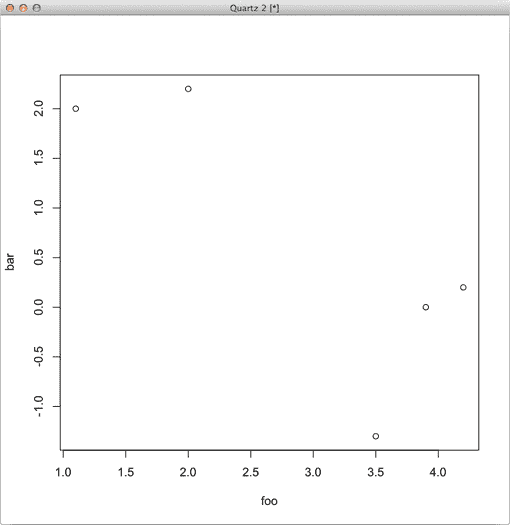

*图 7-1：使用 R 默认行为绘制的五个点*

*x*和*y*位置不一定需要作为单独的向量来指定。你也可以以矩阵的形式提供坐标，其中*x*值在第一列，*y*值在第二列，或者以列表的形式提供。例如，设置五个点的矩阵，下面的代码正好重现图 7-1（注意，窗口窗格在不同的操作系统上可能看起来略有不同）：

```
R> baz <- cbind(foo,bar)
R> baz
     foo  bar
[1,] 1.1  2.0
[2,] 2.0  2.2
[3,] 3.5 -1.3
[4,] 3.9  0.0
[5,] 4.2  0.2
R> plot(baz)
```

`plot`函数是 R 的多功能*通用*函数之一。它对不同的对象工作方式不同，并允许用户为处理对象（包括用户定义的对象类）定义自己的方法。从技术上讲，你刚刚使用的`plot`命令的版本在内部被标识为`plot.default`。帮助文件`?plot.default`提供了有关这种*散点图*数据可视化风格的更多细节。

### **7.2 图形参数**

有许多*图形参数*可以作为参数传递给`plot`函数（或其他绘图函数，例如第 7.3 节中的函数）。这些参数用于简单的视觉增强，如给点上色和添加坐标轴标签，还可以控制图形设备的技术细节（第二十三章详细讲解了后者）。这里列出了一些常用的图形参数；我将在接下来的部分简要讨论每个参数：

`type` 告诉 R 如何绘制提供的坐标（例如，作为单独的点，或者通过线条连接，或同时显示点和线）。

`main`、`xlab`、`ylab` 分别用于包含绘图标题、水平轴标签和垂直轴标签的选项。

`col` 用于绘制点和线的颜色（或颜色）。

`pch` 代表*点字符*。此参数选择用于绘制单个点的字符。

`cex` 代表*字符扩展*。此参数控制绘制点字符的大小。

`lty` 代表*线条类型*。此参数指定用于连接点的线条类型（例如，实线、虚线或点线）。

`lwd` 代表*线条宽度*。此参数控制绘制线条的粗细。

`xlim`、`ylim` 分别提供绘图区域的水平范围和垂直范围的限制。

#### ***7.2.1 自动绘图类型***

默认情况下，`plot`函数将绘制单个点，如图 7-1 所示。这是默认的绘图类型，但其他绘图类型将具有不同的外观。要控制绘图类型，您可以为`type`参数指定一个字符值选项。

例如，在许多情况下，连接每个坐标的线条是有意义的，例如在绘制时间序列数据时。为此，您可以指定绘图类型为`"l"`。使用第 7.1 节中的`foo`和`bar`，如下代码会在图 7-2 的左侧面板中生成图表：

```
R> plot(foo,bar,type="l")
```

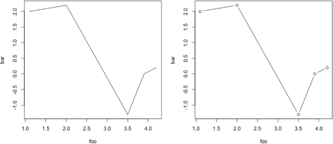

*图 7-2：使用五个相连的坐标生成的线图，设置为* `type="l"` *(左侧) 或* `type="b"` *(右侧)*

`type`的默认值是`"p"`，可以理解为“仅点”。由于您没有指定其他内容，因此在图 7-1 中的图表使用的是该类型。另一方面，在最后这个例子中，您设置了`type="l"`（意味着“仅线”）。其他选项包括`"b"`，表示同时绘制点*和*线（如图 7-2 的右侧面板所示），以及`"o"`，表示用线条覆盖点（这会消除`type="b"`中点和线之间的间隙）。`type="n"`选项则表示不绘制点或线，创建一个空白图，这对于需要逐步构建的复杂图形非常有用。

#### ***7.2.2 标题和坐标轴标签***

默认情况下，基本图形没有主标题，坐标轴会用正在绘制的向量名称来标注。但主标题和更具描述性的坐标轴标签通常会使绘制的数据更易于理解。你可以通过将文本作为字符字符串提供给`main`来添加标题，`xlab`来添加*x*轴标签，`ylab`来添加*y*轴标签。请注意，这些字符串可能包含转义序列（在第 4.2.3 节中讨论）。以下代码生成了图 7-3 中的图表：

```
R> plot(foo,bar,type="b",main="My lovely plot",xlab="x axis label",
        ylab="location y")
R> plot(foo,bar,type="b",main="My lovely plot\ntitle on two lines",xlab="",
        ylab="")
```

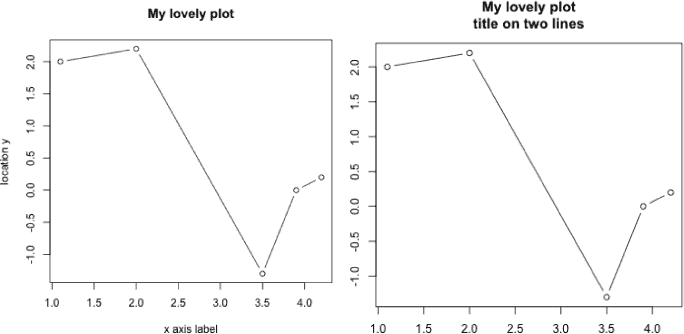

*图 7-3：带有坐标轴标签和标题的图表示例*

在第二个图中，请注意新添加的线条转义序列将标题分割成两行。在该图中，`xlab`和`ylab`也被设置为空字符串`""`，以防止 R 自动用*x*和*y*向量的名称标记坐标轴。

#### ***7.2.3 颜色***

给图形添加颜色远不只是美学考虑。颜色可以使数据更加清晰——例如，通过区分因子水平或强调重要的数值限制。你可以通过`col`参数以多种方式设置颜色。最简单的选项是使用整数选择器或字符字符串。R 语言识别多个颜色字符串值，你可以通过在提示符下输入`colors()`来查看这些颜色。默认颜色是整数`1`或字符字符串`"black"`。 图 7-4 的顶部行展示了通过以下代码创建的两种彩色图表示例：

```
R> plot(foo,bar,type="b",main="My lovely plot",xlab="",ylab="",col=2)
R> plot(foo,bar,type="b",main="My lovely plot",xlab="",ylab="",col="seagreen4")
```

有八种可能的整数值（见图 7-5 的最左侧图），并且大约有 650 种字符字符串可用于指定颜色。但你并不局限于这些选项，因为你还可以通过 RGB（红色、绿色和蓝色）水平以及创建你自己的调色板来指定颜色。我将在第二十五章中详细讨论后两种选项。

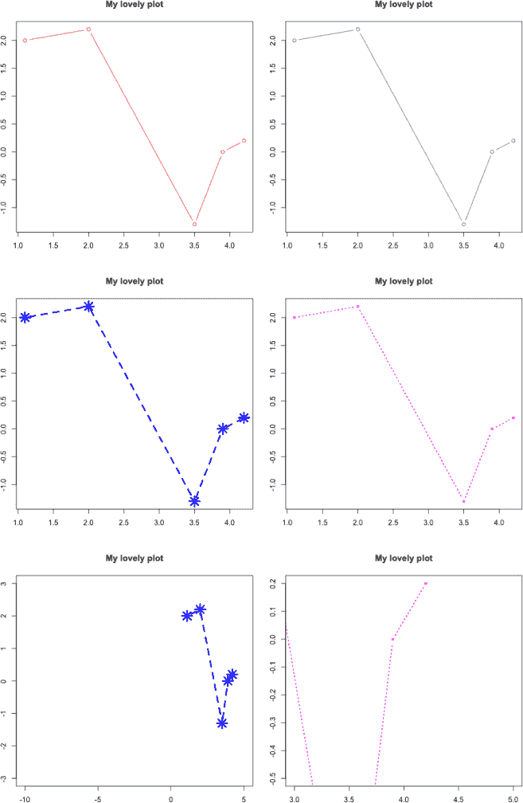

*图 7-4：基本 R 绘图实验。顶部行：使用`col=2`（左）和`col="seagreen4"`（右）创建的两种彩色图表。中间行：进一步使用`pch`、`lty`、`cex`和`lwd`的两种示例。底部行：设置绘图区域限制`xlim=c(-10,5)`、`ylim=c(-3,3)`（左）和`xlim=c(3,5)`、`ylim=c(-0.5,0.2)`（右）。*

#### ***7.2.4 线条和点的外观***

若要改变绘制点的外观，可以使用`pch`参数，若要改变线条的外观，可以使用`lty`参数。`pch`参数控制绘制单个数据点时使用的字符。你可以指定一个字符来表示每个点，或者指定一个介于`1`到`25`（包含）之间的值。每个整数对应的符号显示在图 7-5 的中间图中。`lty`参数控制线条的类型，它的值可以是`1`到`6`。这些选项显示在图 7-5 的最右侧图中。

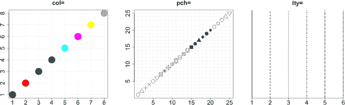

*图 7-5：一些参考图形，显示了`col`（左）、`pch`（中）和`lty`（右）可能的整数选项结果*

你还可以使用`cex`控制绘制点的大小，使用`lwd`控制线条的粗细。默认情况下，这两个的大小和粗细为`1`。例如，要请求半大小的点，可以指定`cex=0.5`；要指定双倍粗细的线条，则使用`lwd=2`。

以下两行代码生成了图 7-4 中间行的两个图形，展示了`pch`、`lty`、`cex`和`lwd`：

```
R> plot(foo,bar,type="b",main="My lovely plot",xlab="",ylab="",
        col=4,pch=8,lty=2,cex=2.3,lwd=3.3)
R> plot(foo,bar,type="b",main="My lovely plot",xlab="",ylab="",
        col=6,pch=15,lty=3,cex=0.7,lwd=2)
```

#### ***7.2.5 绘图区域的限制***

正如你在`foo`和`bar`的图形中看到的，默认情况下，R 通过使用提供的*X*和*Y*值的范围（加上一小常数来为最外层的点周围留下一些区域）来设置每个轴的范围。但你可能需要更多空间，例如，为单独的点添加注释、添加图例或绘制超出原始范围的附加点（正如你将在第 7.3 节中看到的）。你可以使用`xlim`和`ylim`设置自定义的绘图区域限制。两个参数都需要一个长度为 2 的数值向量，表示为`c(下限， 上限)`。

考虑图 7-4 底部行中的图形，这些图形是通过以下两个命令创建的：

```
R> plot(foo,bar,type="b",main="My lovely plot",xlab="",ylab="",
        col=4,pch=8,lty=2,cex=2.3,lwd=3.3,xlim=c(-10,5),ylim=c(-3,3))
R> plot(foo,bar,type="b",main="My lovely plot",xlab="",ylab="",
        col=6,pch=15,lty=3,cex=0.7,lwd=2,xlim=c(3,5),ylim=c(-0.5,0.2))
```

这些图形与中间行的两个图形完全相同，唯一的区别在于，左下图中的*X*和*Y*轴被设置得比观察到的数据宽得多，而右侧的图形限制了绘图窗口，只显示数据的一部分。

### **7.3 向现有图形添加点、线和文本**

一般来说，每次调用`plot`都会刷新活动图形设备以创建一个新的绘图区域。但这并不总是所需的——为了构建更复杂的图形，最容易的方法是从一个空的绘图区域开始，并逐步向该画布添加所需的点、线、文本和图例。以下是一些在 R 中可以用于向图形添加内容而不刷新或清除窗口的有用函数：

`points` 添加点

`lines`, `abline`, `segments` 添加线条

`text` 写入文本

`arrows` 添加箭头

`legend` 添加图例

这些函数的调用和设置参数的语法与`plot`相同。查看这些如何工作的最佳方式是通过一个扩展的示例，我将基于一些由 20 个(*x*，*y*)位置组成的假设数据。

```
R> x <- 1:20
R> y <- c(-1.49,3.37,2.59,-2.78,-3.94,-0.92,6.43,8.51,3.41,-8.23,
       -12.01,-6.58,2.87,14.12,9.63,-4.58,-14.78,-11.67,1.17,15.62)
```

使用这些数据，你将构建出图 7-6 所示的图形（请注意，你可能需要手动放大图形设备并重新绘制，以确保图例不会与图像的其他部分重叠）。值得记住的是一个公认的绘图规则：“保持清晰简洁”。图 7-6 是一个例外，为了演示使用的 R 命令。

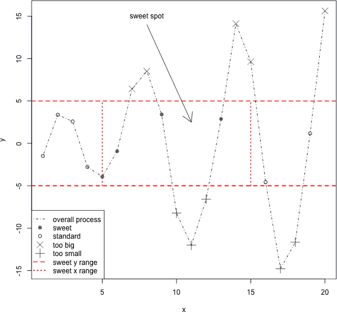

*图 7-6：一些假设数据的复杂最终图形*

在图 7-6 中，数据点将根据它们的 *x* 和 *y* 位置进行不同的绘制，具体取决于它们与图中指出的“甜点”位置的关系。*y* 值大于 5 的点用紫色 × 标记；*y* 值小于 −5 的点用绿色 + 标记。位于这两个 *y* 值之间但仍位于甜点之外的点用 ○ 标记。最后，位于甜点中的点（*x* 在 5 到 15 之间 *且* *y* 在 −5 到 5 之间）用蓝色 • 标记。红色的水平和垂直线划定了甜点区域，并用箭头标出，同时也有一个图例。

用了十行代码来完整构建这个图形（再加上一行代码来添加图例）。该图形的每个步骤的样式可以参见图 7-7。接下来将详细介绍这些代码行。

1.  第一步是创建一个空的绘图区域，你可以在其中添加点和绘制线条。这一行代码告诉 R 绘制 `x` 和 `y` 的数据，尽管 `type` 选项被设置为 `"n"`。如第 7.2 节所述，这将打开或刷新图形设备，并将坐标轴设置为适当的长度（带有标签和坐标轴），但不会绘制任何点或线。

    ```
    R> plot(x,y,type="n",main="")
    ```

1.  `abline` 函数是一种简单的方式，用于在图形中添加跨越整个图形的直线。线条（或线条们）可以通过 *斜率* 和 *截距* 值来指定（详见后续在第二十章中的回归讨论）。你也可以简单地添加水平或垂直线。这行代码添加了两条单独的水平线，一条在 *y* = 5，另一条在 *y* = 5，使用 `h=c(-5,5)`。这三个参数（在第 7.2 节中讲解过）使得这两条线为红色、虚线且具有双重厚度。对于垂直线，你也可以写 `v=c(-5,5)`，这将在 *x* = −5 和 *x* = 5 处绘制它们。

    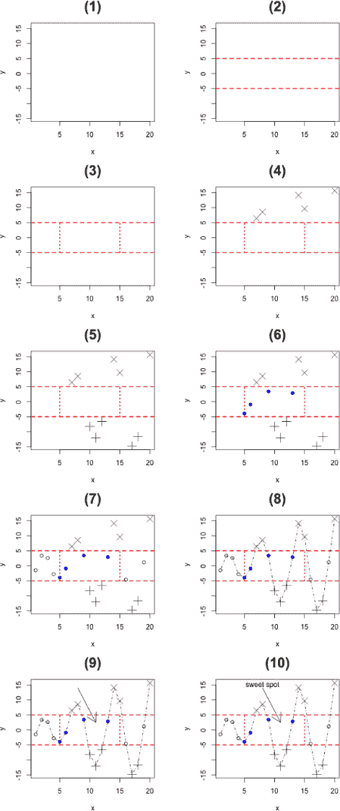

    *图 7-7：根据图 7-6 给出的最终绘图构建过程。图中的（1）到（10）对应文本中逐项列出的代码行。*

    ```
    R> abline(h=c(-5,5),col="red",lty=2,lwd=2)
    ```

1.  代码的第三行在步骤 2 绘制的水平线之间添加了较短的垂直线，以形成一个框。为此，使用 `segments` 而不是 `abline`，因为你不希望这些线跨越整个绘图区域。`segments` 命令接受一个“起点”坐标（以 `x0` 和 `y0` 表示）和一个“终点”坐标（以 `x1` 和 `y1` 表示），并绘制相应的线。R 的矢量化行为将两组“起点”和“终点”坐标配对。两条线均为红色、虚线且具有双重厚度。（你也可以将长度为 2 的向量传递给这些参数，在这种情况下，第一个段落将使用第一个参数值，第二个段落将使用第二个值。）

    ```
    R> segments(x0=c(5,15),y0=c(-5,-5),x1=c(5,15),y1=c(5,5),col="red",lty=3,
                lwd=2)
    ```

1.  第四步，使用`points`开始将特定坐标从`x`和`y`添加到图中。与`plot`一样，`points`需要两个具有相等长度的向量，分别包含*x*和*y*值。在这种情况下，你希望根据位置不同绘制不同的点，因此使用逻辑向量子集（参见第 4.1.5 节）来识别并提取那些*y*值大于或等于 5 的`x`和`y`元素。这些（且仅这些）点将作为紫色的×符号添加，并通过`cex`放大 2 倍。

    ```
    R> points(x[y>=5],y[y>=5],pch=4,col="darkmagenta",cex=2)
    ```

1.  第五行代码与第四行非常相似；这一次，它提取了那些*y*值小于或等于−5 的坐标。使用的是+点字符，并且颜色设置为深绿色。

    ```
    R> points(x[y<=-5],y[y<=-5],pch=3,col="darkgreen",cex=2)
    ```

1.  第六步添加了蓝色的“甜蜜点”坐标，这些点的条件为`(x>=5&x<=15)&(y>-5&y<5)`。这一稍微复杂的条件集提取了那些*x*值介于 5 到 15（包含 5 和 15）之间，且*y*值介于−5 到 5（不包括−5 和 5）之间的点。请注意，这一行使用了逻辑操作符`&`的“简短”形式，因为你希望进行逐元素比较（参见第 4.1.3 节）。

    ```
    R> points(x[(x>=5&x<=15)&(y>-5&y<5)],y[(x>=5&x<=15)&(y>-5&y<5)],pch=19,
              col="blue")
    ```

1.  接下来的命令识别数据集中其*x*值小于 5 或大于 15，且*y*值介于−5 和 5 之间的剩余点。没有指定图形参数，因此这些点会以默认的黑色○符号绘制。

    ```
    R> points(x[(x<5|x>15)&(y>-5&y<5)],y[(x<5|x>15)&(y>-5&y<5)])
    ```

1.  为了连接`x`和`y`中的坐标，你使用`lines`。在这里，你还将`lty`设置为`4`，这会绘制一个点划线样式的线条。

    ```
    R> lines(x,y,lty=4)
    ```

1.  第九行代码添加指向最佳位置的箭头。`arrows`函数的用法与`segments`相似，你需要提供“起始”坐标（`x0`，`y0`）和“终点”坐标（`x1`，`y1`）。默认情况下，箭头的箭头头部位于“终点”坐标处，尽管可以通过帮助文件`?arrows`中描述的可选参数修改这一点（以及箭头头部的角度和长度等其他选项）。

    ```
    R> arrows(x0=8,y0=14,x1=11,y1=2.5)
    ```

1.  第十行代码在箭头顶部的图表上打印标签。根据`text`的默认行为，作为`labels`提供的字符串会在`x`和`y`提供的坐标上*居中*显示。

    ```
    R> text(x=8,y=15,labels="sweet spot")
    ```

最后，你可以使用`legend`函数添加图例，这会生成图 7-6 中所示的最终效果。

```
legend("bottomleft",
       legend=c("overall process","sweet","standard",
                "too big","too small","sweet y range","sweet x range"),
       pch=c(NA,19,1,4,3,NA,NA),lty=c(4,NA,NA,NA,NA,2,3),
       col=c("black","blue","black","darkmagenta","darkgreen","red","red"),
       lwd=c(1,NA,NA,NA,NA,2,2),pt.cex=c(NA,1,1,2,2,NA,NA))
```

第一个参数设置图例的显示位置。有多种方法可以做到这一点（包括设置确切的*x*和*y*坐标），但通常只需要选择一个角落，使用以下四个字符串之一即可：`"topleft"`、`"topright"`、`"bottomleft"`或`"bottomright"`。接下来，你需要将标签作为字符向量传递给`legend`参数。然后，你需要为剩余的参数提供与标签长度相同的向量，这样正确的元素就能与每个标签匹配。

例如，对于第一个标签（`"overall process"`），您希望使用默认粗细和颜色为 4 类型的一条线。因此，在剩余参数向量的第一个位置上，您设置`pch=NA`，`lty=4`，`col="black"`，`lwd=1`和`pt.cex=NA`（所有这些都是默认值，除了`lty`）。这里，`pt.cex` 只是在调用 `points` 时使用 `cex` 参数（在 `legend` 中使用 `cex` 会扩展使用的文本，而不是点）。

请注意，当您不希望设置相应的图形参数时，必须在这些向量中的某些元素中填写 `NA`。这只是为了保持所提供的向量的等长，以便 R 可以跟踪每个特定参考的参数值。当您阅读本书时，您将看到更多使用 `legend` 的示例。

**练习 7.1**

1.  尽可能地重新创建以下图形：

    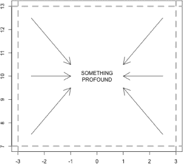

1.  使用以下数据，在 *x* 轴上创建体重图，*y* 轴上创建身高图。使用不同的点字符或颜色来区分男性和女性，并提供匹配的图例。标记坐标轴并为图形添加标题。

    | **体重（kg）** | **身高（cm）** | **性别** |
    | --- | --- | --- |
    | 55 | 161 | 女性 |
    | 85 | 185 | 男性 |
    | 75 | 174 | 男性 |
    | 42 | 154 | 女性 |
    | 93 | 188 | 男性 |
    | 63 | 178 | 男性 |
    | 58 | 170 | 女性 |
    | 75 | 167 | 男性 |
    | 89 | 181 | 男性 |
    | 67 | 178 | 女性 |

### **7.4 ggplot2 软件包**

到目前为止，本章展示了 R 的内置图形工具（通常称为 *基础 R 图形* 或 *传统 R 图形*）。现在，让我们看看另一个重要的图形工具套件：`ggplot2`，这是由 Hadley Wickham（2009）开发的一个知名的贡献包。像任何其他贡献包一样，`ggplot2` 在 CRAN 上提供强大的替代标准绘图程序。*gg* 代表 *图形语法* —— 图形生成的一种特定方法，由 Wilkinson（2005）描述。遵循这种方法，`ggplot2` 标准化了不同绘图类型的生成，简化了向现有图形添加一些棘手的方面（例如包含图例），并允许您通过定义和操作 *层* 来构建图形。暂时，让我们使用 第 7.1 节–第 7.3 节 中相同的简单示例来了解 `ggplot2` 的基本行为。您将熟悉基本的绘图函数 `qplot` 及其与之前使用的通用 `plot` 函数的区别。在 第十四章 中讨论统计图时，我将回到 `ggplot2` 的话题，并在 第二十四章 中探索更多高级功能。

#### ***7.4.1 使用 qplot 快速绘图***

首先，你必须通过手动下载或直接在提示符下输入`install.packages("ggplot2")`来安装`ggplot2`包（参见第 A.2.3 节）。然后，使用以下命令加载该包：

```
R> library("ggplot2")
```

现在，让我们回到最初存储在第 7.1 节中的五个数据点`foo`和`bar`。

```
R> foo <- c(1.1,2,3.5,3.9,4.2)
R> bar <- c(2,2.2,-1.3,0,0.2)
```

你可以使用`ggplot2`的“快速绘图”函数`qplot`生成图 7-1 的版本。

```
R> qplot(foo,bar)
```

结果显示在图 7-8 的左图中。这个图像与使用`plot`生成的图像有一些明显的不同，但`qplot`的基本语法与之前相同。传递给`qplot`的前两个参数是长度相等的向量，`foo`中的*x*坐标首先给出，接着是`bar`中的*y*坐标。

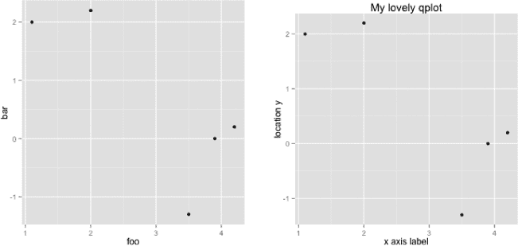

*图 7-8：使用`ggplot2`默认行为绘制的五个数据点*`qplot`*函数（左图）和添加标题及轴标签后的版本（右图）*

添加标题和轴标签也使用了你在第 7.2 节中已经看到的相同参数。

```
R> qplot(foo,bar,main="My lovely qplot",xlab="x axis label",ylab="location y")
```

这将生成图 7-8 的右面板。

尽管在语法上有这种基本的相似性，但`ggplot2`和基础 R 图形创建图形的方式有着根本的区别。使用内置图形工具构建图形本质上是一个实时、逐步的过程。特别是在第 7.3 节中，这一点尤为明显，当时你将图形设备视为一个活跃的画布，逐个添加点、线及其他特征。相比之下，`ggplot2`图形是作为对象存储的，这意味着它们有一个潜在的、静态的表示，直到你*更改*该对象——实际上，你通过`qplot`可视化的是任何给定时刻的`print`ed 对象。为强调这一点，输入以下代码：

```
R> baz <- plot(foo,bar)
R> baz
NULL
R> qux <- qplot(foo,bar)
R> qux
```

第一个赋值使用了内置的`plot`函数。当你运行那行代码时，图 7-1 中的图形会弹出。由于没有实际存储在工作空间中，打印假定的对象`baz`将返回空值`NULL`。另一方面，将`qplot`的内容存储起来（这里存储为对象`qux`）是有意义的。这次，进行赋值时不会显示图形。只有当你在提示符下输入`qux`时，才会显示图形，它调用该对象的`print`方法。这个看似微不足道的细节，实际上通过这种方式保存图形，可以在显示之前修改或增强图形（正如你稍后将看到的那样），并且它相较于基础 R 图形来说是一个明显的优势。

#### ***7.4.2 使用 Geoms 设置外观常量***

要在`ggplot2`图形中添加和自定义点和线，你需要修改对象本身，而不是使用冗长的参数列表或单独执行的辅助函数（如`points`或`lines`）。你可以使用`ggplot2`方便的*几何修改器*，也称为*geoms*，来修改对象。假设你想像在第 7.1 节中那样连接`foo`和`bar`中的五个点，你可以首先创建一个空白的图形对象，然后像这样使用几何修改器：

```
R> qplot(foo,bar,geom="blank") + geom_point() + geom_line()
```

结果图像显示在图 7-9 的左侧。在第一次调用`qplot`时，你通过设置初始几何修改器为`geom="blank"`来创建一个空的图形对象（如果显示该图形，你将只看到灰色背景和坐标轴）。然后，你将另外两个几何图形`geom_point()`和`geom_line()`叠加上去。如括号所示，这些几何图形是函数，它们产生自己的专门对象。你可以通过`+`运算符将几何图形添加到`qplot`对象中。在这里，你没有为任何几何图形提供参数，这意味着它们将使用最初提供给`qplot`的数据（`foo`和`bar`），并且会遵循任何其他特性的默认设置，如颜色或点/线类型。你可以通过指定可选参数来控制这些特性，如下所示：

```
R> qplot(foo,bar,geom="blank") + geom_point(size=3,shape=6,color="blue") +
      geom_line(color="red",linetype=2)
```


*图 7-9：使用几何修改器来改变`qplot`对象外观的两个简单图形。左：使用默认设置添加点和线。右：使用几何图形影响点的字符、大小和颜色，以及线条类型和颜色。*

请注意，这里使用的`ggplot2`的一些参数名称，如点的字符和大小（`shape`和`size`），与基础 R 图形中的参数名称（`pch`和`cex`）不同。但`ggplot2`实际上与 R 标准`plot`函数中使用的许多常见图形参数兼容，因此如果你更喜欢，也可以在此使用那些参数。例如，在此示例中，将`cex=3`和`pch=6`设置在`geom_point`中将会得到相同的图像。

`ggplot2`图形的面向对象特性意味着调整图形或尝试不同的视觉特性不再需要每次更改内容时重新运行所有绘图命令。这是通过几何图形（geoms）实现的。假设你喜欢图 7-9 右侧使用的线条类型，但希望使用不同的点字符。为了尝试，你可以首先存储之前创建的`qplot`对象，然后使用`geom_point`与该对象一起尝试不同的点样式。

```
R> myqplot <- qplot(foo,bar,geom="blank") + geom_line(color="red",linetype=2)
R> myqplot + geom_point(size=3,shape=3,color="blue")
R> myqplot + geom_point(size=3,shape=7,color="blue")
```

第一行将原始图形存储在`myqplot`中，接下来的几行调用`myqplot`并使用不同的点形状。第二行和第三行分别生成图 7-10 左侧和右侧的图形。

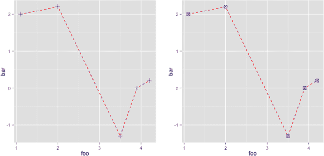

*图 7-10：利用* `ggplot2` *图形的面向对象特性来尝试不同的点形状*

在`ggplot2`中，有许多几何修饰符可以通过以`geom_`开头的函数名称调用。要获取列表，只需确保加载了该包，并在提示符下输入`??"geom_"`进行帮助搜索。

#### ***7.4.3 美学映射与 Geoms***

Geoms 和`ggplot2`还提供了高效的自动化方法，将不同的样式应用于图表的不同子集。如果你使用因子对象将数据集拆分成类别，`ggplot2`可以自动将特定样式应用于不同的类别。在`ggplot2`的文档中，保存这些类别的因子被称为*变量*，`ggplot2`可以将其*映射*到*美学*值。这消除了许多使用基本 R 图形将数据子集隔离并单独绘制的工作（就像你在第 7.3 节中做的那样）。

所有这些最好通过一个例子来说明。让我们回到你手动绘制的 20 个观察值，逐步生成图 7-6 中的精美图表。

```
R> x <- 1:20
R> y <- c(-1.49,3.37,2.59,-2.78,-3.94,-0.92,6.43,8.51,3.41,-8.23,
       -12.01,-6.58,2.87,14.12,9.63,-4.58,-14.78,-11.67,1.17,15.62)
```

在第 7.3 节中，你定义了几个类别，将每个观察值根据其`x`和`y`值分类为“标准”，“甜美”，“过大”或“过小”。使用相同的分类规则，让我们显式地定义一个因子来对应`x`和`y`。

```
R> ptype <- rep(NA,length(x=x))
R> ptype[y>=5] <- "too_big"
R> ptype[y<=-5] <- "too_small"
R> ptype[(x>=5&x<=15)&(y>-5&y<5)] <- "sweet"
R> ptype[(x<5|x>15)&(y>-5&y<5)] <- "standard"
R> ptype <- factor(x=ptype)
R> ptype
 [1] standard  standard  standard  standard  sweet     sweet     too_big
 [8] too_big   sweet     too_small too_small too_small sweet     too_big
[15] too_big   standard  too_small too_small standard  too_big
Levels: standard sweet too_big too_small
```

现在你有一个包含 20 个值的因子，并将这些值排序为四个层级。你将使用这个因子来告诉`qplot`如何映射你的美学属性。下面是一个简单的方法：

```
R> qplot(x,y,color=ptype,shape=ptype)
```

这一行代码生成了图 7-11 中的左侧图表，该图表通过颜色和点形状分隔了四个类别，并提供了图例。这一切都是通过在`qplot`调用中的美学映射完成的，你在其中将`color`和`shape`映射到`ptype`变量。

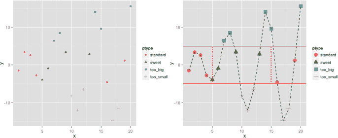

*图 7-11：使用* `qplot` *和 geoms 演示美学映射在* `ggplot2` *中的应用。左：初始调用的* `qplot`*，它使用* `ptype`*映射点形状和颜色。右：通过各种 geoms 增强左侧图表，以覆盖默认映射。*

现在，让我们使用相同的`qplot`对象和一系列的 geom 修饰来重新绘制这些数据，以获得更像图 7-6 的结果。执行以下代码会生成图 7-11 右侧的图表：

```
R> qplot(x,y,color=ptype,shape=ptype) + geom_point(size=4) +
      geom_line(mapping=aes(group=1),color="black",lty=2) +
      geom_hline(mapping=aes(yintercept=c(-5,5)),color="red") +
      geom_segment(mapping=aes(x=5,y=-5,xend=5,yend=5),color="red",lty=3) +
      geom_segment(mapping=aes(x=15,y=-5,xend=15,yend=5),color="red",lty=3)
```

在第一行中，你添加了`geom_point(size=4)`来增大图中所有点的大小。接下来的几行中，你添加了一条连接所有点的线，并加上了水平和垂直线来标出最佳点。在最后四行中，你必须使用`aes`来设置点类别的替代美学映射。让我们仔细看看这里发生了什么。

由于你在初始调用`qplot`时使用了`ptype`进行美学映射，默认情况下，所有其他几何体将按照相同方式映射到每个类别，*除非*你通过`aes`覆盖了该默认映射。例如，当你调用`geom_line`连接所有点时，如果你坚持使用默认的`ptype`映射，而没有包括`mapping=aes(group=1)`，那么这个几何体将绘制连接每个类别内的点的线条。你将看到四条独立的虚线——一条连接所有“标准”点，另一条连接所有“甜美”点，以此类推。但这不是你在这里想要的；你希望绘制一条从左到右连接所有点的线。所以，你告诉`geom_line`通过输入`aes(group=1)`将所有观察值视为一个组。

此后，你使用`geom_hline`函数绘制了*y* = −5 和*y* = 5 的水平线，使用它的`yintercept`参数，参数再次传递给`aes`来重新定义该几何体的`mapping`。在这种情况下，你需要重新定义映射，使其作用于向量`c(-5,5)`，而不是使用观察数据中的`x`和`y`。类似地，你最后使用`geom_segment`绘制了两条垂直的虚线段。`geom_segment`的操作方式与`segments`非常相似——你根据“起始”坐标（`x`和`y`参数）和“结束”坐标（这里的`xend`和`yend`参数）重新定义映射。由于第一个几何体`geom_point(size=4)`为每个绘制的点设置了固定的放大尺寸，因此不管几何体如何映射，都无关紧要，因为它只是对每个点进行了统一的大小调整。

在 R 中绘图，从基础图形到像`ggplot2`这样的贡献包，都忠实于语言的本质。逐元素匹配使得你能够通过少量直观而简单的函数创建复杂的图形。显示图形后，你可以通过选择图形设备并选择“文件”→“保存”来将其保存到硬盘。不过，你也可以直接将图形写入文件，正如你稍后将在第 8.3 节看到的那样。

本节探索的图形功能只是冰山一角，从现在开始，你将继续使用数据可视化。

**练习 7.2**

在练习 7.1(b)中，你使用了基础 R 图形绘制了一些体重和身高数据，使用不同的点或颜色区分了男性和女性。请使用`ggplot2`重复此任务。

##### **本章重要代码**

| **函数/操作符** | **简要描述** | **首次出现** |
| --- | --- | --- |
| `plot` | 创建/显示基础 R 图形 | 第 7.1 节，第 128 页 |
| `type` | 设置图形类型 | 第 7.2.1 节，第 130 页 |
| `main`, `xlab`, `ylab` | 设置坐标轴标签 | 第 7.2.2 节，第 130 页 |
| `col` | 设置点/线颜色 | 第 7.2.3 节，第 131 页 |
| `pch`, `cex` | 设置点的类型/大小 | 第 7.2.4 节, 第 133 页 |
| `lty`, `lwd` | 设置线型/线宽 | 第 7.2.4 节, 第 133 页 |
| `xlim`, `ylim` | 设置绘图区域的限制 | 第 7.2.5 节, 第 134 页 |
| `abline` | 添加垂直/水平线 | 第 7.3 节, 第 137 页 |
| `segments` | 添加特定的线段 | 第 7.3 节, 第 137 页 |
| `points` | 添加点 | 第 7.3 节, 第 137 页 |
| `lines` | 根据坐标添加线条 | 第 7.3 节, 第 138 页 |
| `arrows` | 添加箭头 | 第 7.3 节, 第 138 页 |
| `text` | 添加文本 | 第 7.3 节, 第 138 页 |
| `legend` | 添加/控制图例 | 第 7.3 节, 第 138 页 |
| `qplot` | 创建`ggplot2`的“快速绘图” | 第 7.4.1 节, 第 140 页 |
| `geom_point` | 添加点的几何对象 | 第 7.4.2 节, 第 141 页 |
| `geom_line` | 添加线的几何对象 | 第 7.4.2 节, 第 141 页 |
| `size`, `shape`, `color` | 设置几何对象常量 | 第 7.4.2 节, 第 142 页 |
| `linetype` | 设置几何对象的线型 | 第 7.4.2 节, 第 142 页 |
| `mapping`, `aes` | 几何对象美学映射 | 第 7.4.3 节, 第 145 页 |
| `geom_hline` | 添加水平线的几何对象 | 第 7.4.3 节, 第 145 页 |
| `geom_segment` | 添加线段几何对象 | 第 7.4.3 节, 第 145 页 |
