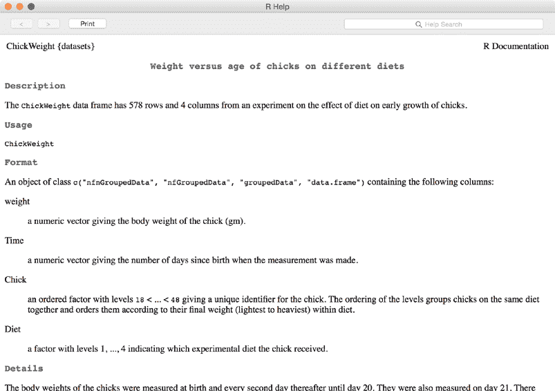
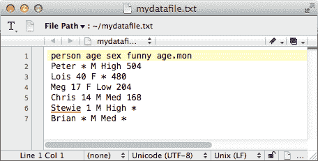
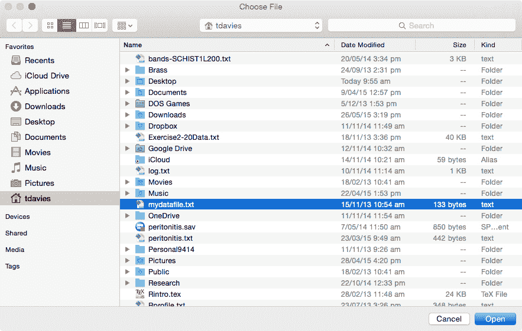
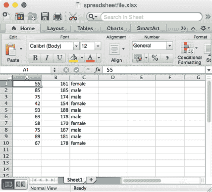
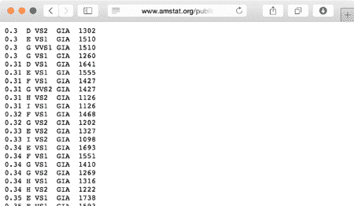
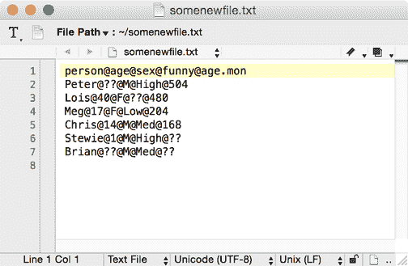
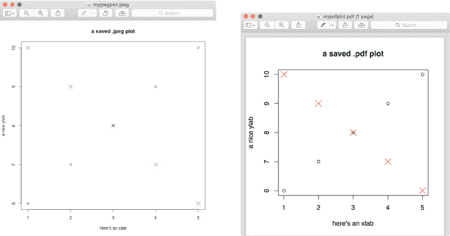
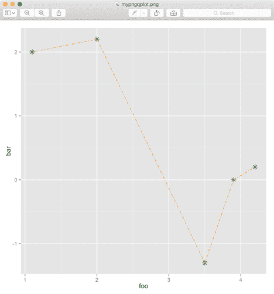
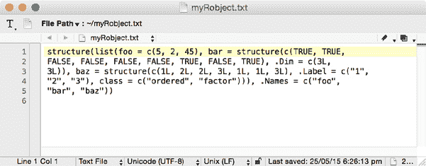

## **8**

**读取和写入文件**


现在我将介绍使用 R 的另一个基本方面：通过读取和写入文件在活动工作区加载和保存数据。通常，要处理一个大数据集，你需要从外部文件读取数据，无论它是存储为纯文本、电子表格文件，还是托管在网站上。R 提供了命令行函数，可以用来导入这些数据集，通常是作为数据框对象。你还可以通过在计算机上写入新文件的方式，从 R 导出数据框，此外，你还可以将创建的任何图表保存为图像文件。在本章中，我将介绍一些有用的基于命令的读写操作，用于导入和导出数据。

### **8.1 R 准备好的数据集**

首先，让我们简要看看一些内置于软件中的数据集或属于用户贡献包的数据集。这些数据集是用来练习和实验功能的有用示例。

在提示符下输入`data()`，会弹出一个窗口，列出这些准备好的数据集，并提供简短的描述。这些数据集按名称的字母顺序组织，并按包分组（显示的确切列表将取决于从 CRAN 安装的贡献包；请参阅第 A.2 节）。

#### ***8.1.1 内置数据集***

内置的、自动加载的包`datasets`中包含了多个数据集。要查看该包中包含的数据集摘要，你可以使用`library`函数，如下所示：

```
R> library(help="datasets")
```

R 准备好的数据集有一个对应的帮助文件，你可以在其中找到关于数据及其组织方式的重要细节。例如，内置的数据集之一叫做`ChickWeight`。如果你在提示符下输入`?ChickWeight`，你会看到图 8-1 中的窗口。



*图 8-1：`ChickWeight`数据集的帮助文件*

如你所见，这个文件解释了变量及其值，并指出数据存储在一个具有 578 行和 4 列的数据框中。由于`datasets`中的对象是内置的，你只需要在提示符下输入`ChickWeight`的名称就可以访问它。让我们来看一下前 15 条记录。

```
R> ChickWeight[1:15,]
   weight Time Chick Diet
1      42    0     1    1
2      51    2     1    1
3      59    4     1    1
4      64    6     1    1
5      76    8     1    1
6      93   10     1    1
7     106   12     1    1
8     125   14     1    1
9     149   16     1    1
10    171   18     1    1
11    199   20     1    1
12    205   21     1    1
13     40    0     2    1
14     49    2     2    1
15     58    4     2    1
```

你可以像处理 R 中创建的任何其他数据框一样处理这个数据集——注意使用`[1:15,]`来访问这个对象中所需的行，具体细节请参考第 5.2.1 节。

#### ***8.1.2 贡献的数据集***

还有更多作为贡献包的一部分提供的 R 准备好的数据集。要访问它们，首先安装并加载相关的包。考虑一下数据集`ice.river`，它位于 Trapletti 和 Hornik（2013）的贡献包`tseries`中。首先，你需要安装该包，可以通过在提示符下运行`install.packages("tseries")`来实现。然后，使用`library`加载包，以访问包的组成部分：

```
R> library("tseries")

    'tseries' version: 0.10-32

    'tseries' is a package for time series analysis and computational finance.

    See 'library(help="tseries")' for details.
```

现在，您可以输入`library(help="tseries")`来查看该包中数据集的列表，并且您可以输入`?ice.river`来查找更多关于您想要使用的数据集的详细信息。帮助文件将`ice.river`描述为一个“时间序列对象”，包含河流流量、降水量和温度的测量数据——这些数据最初由 Tong（1990）报道。要访问该对象本身，您必须显式加载它，使用`data`函数。然后，您可以像平常一样在工作空间中操作`ice.river`。以下是前五条记录：

```
R> data(ice.river)
R> ice.river[1:5,]
      flow.vat flow.jok prec temp
[1,]     16.10     30.2  8.1  0.9
[2,]     19.20     29.0  4.4  1.6
[3,]     14.50     28.4  7.0  0.1
[4,]     11.00     27.8  0.0  0.6
[5,]     13.60     27.8  0.0  2.0
```

这些适用于 R 的数据集的可用性和便利性使得测试代码变得简单，我将在随后的章节中使用它们进行演示。然而，要分析自己的数据，您通常需要从某个外部文件导入它们。让我们来看一下如何操作。

### **8.2 读取外部数据文件**

R 有多种函数可以从存储的文件中读取字符并理解它们。您将看到如何读取*表格格式*文件，它们是 R 最容易读取和导入的文件之一。

#### ***8.2.1 表格格式***

表格格式的文件最好理解为纯文本文件，具有三个关键特征，这些特征完全定义了 R 如何读取数据。

**标题** 如果存在*标题*，它总是文件的第一行。这个可选特性用于为每一列数据提供名称。在将文件导入 R 时，您需要告诉软件是否存在标题，以便它知道是否将第一行视为变量名，或者作为观察到的数据值。

**分隔符** 极其重要的*分隔符*是用于分隔每行条目的字符。分隔符字符在文件中不能用于其他任何用途。这告诉 R 一个特定的条目何时开始和结束（换句话说，它在表格中的确切位置）。

**缺失值** 这是另一个独特的字符字符串，用来专门表示缺失值。在读取文件时，R 会将这些条目转换为它识别的形式：`NA`。

通常，这些文件的扩展名是*.txt*（强调纯文本样式）或*.csv*（用于*逗号分隔值*）。

让我们尝试一个例子，使用在第 5.2.2 节末尾定义的数据框`mydata`的变体。图 8-2 展示了一个名为*mydatafile.txt*的合适的表格格式文件，其中包含该数据框的数据，并且现在标记了一些缺失值。这个数据文件可以在本书网站上找到，网址是* [`www.nostarch.com/bookofr/`](https://www.nostarch.com/bookofr/)*，或者您可以使用文本编辑器从图 8-2 自行创建它。



*图 8-2：一个纯文本表格格式文件*

请注意，第一行是标题，值之间用单个空格分隔，缺失的值用星号（`*`）表示。同时，请注意每个新记录必须从新的一行开始。假设你被交给了一个用于数据分析的纯文本文件，在 R 中可以使用现成的命令 `read.table` 导入表格格式的文件，生成一个数据框对象，如下所示：

```
R> mydatafile <- read.table(file="/Users/tdavies/mydatafile.txt",
                            header=TRUE,sep=" ",na.strings="*",
                            stringsAsFactors=FALSE)
R> mydatafile
  person age sex funny age.mon
1  Peter  NA   M  High     504
2   Lois  40   F  <NA>     480
3    Meg  17   F   Low     204
4  Chris  14   M   Med     168
5 Stewie   1   M  High      NA
6  Brian  NA   M   Med      NA
```

在调用 `read.table` 时，`file` 参数接受一个包含文件名和文件夹位置的字符字符串（使用正斜杠），`header` 是一个逻辑值，告诉 R `file` 是否有标题（此处为 `TRUE`），`sep` 接受一个字符字符串，提供分隔符（此处为单个空格 `" "`），而 `na.strings` 用于指定缺失值所表示的字符（此处为 `"*"`）。

如果你要读取多个文件，并且不想每次都输入完整的文件夹位置，可以先通过 `setwd` 设置工作目录（见第 1.2.3 节），然后只需使用文件名及其扩展名作为传递给 `file` 参数的字符字符串。然而，这两种方法都要求你在 R 提示符下工作时确切知道文件的位置。幸运的是，R 还有一些有用的附加工具，可以帮助你记住文件的具体位置。如果你忘记了文件的准确位置，可以通过 `list.files` 查看任何文件夹的文本输出。以下示例展示了我的本地用户目录的混乱状态。

```
R> list.files("/Users/tdavies")
 [1] "bands-SCHIST1L200.txt" "Brass"                 "Desktop"
 [4] "Documents"             "DOS Games"             "Downloads"
 [7] "Dropbox"               "Exercise2-20Data.txt"  "Google Drive"
[10] "iCloud"                "Library"               "log.txt"
[13] "Movies"                "Music"                 "mydatafile.txt"
[16] "OneDrive"              "peritonitis.sav"       "peritonitis.txt"
[19] "Personal9414"          "Pictures"              "Public"
[22] "Research"              "Rintro.tex"            "Rprofile.txt"
[25] "Rstartup.R"            "spreadsheetfile.csv"   "spreadsheetfile.xlsx"
[28] "TakeHome_template.tex" "WISE-P2L"              "WISE-P2S.txt"
[31] "WISE-SCHIST1L200.txt"
```

这里需要注意的一个重要特点是，文件和文件夹之间可能很难区分。文件通常会有扩展名，而文件夹则没有；然而，`WISE-P2L` 是一个没有扩展名的文件，看起来与任何列出的文件夹没有区别。

你也可以通过 R 交互式地查找文件。`file.choose` 命令直接从 R 提示符打开你的文件系统浏览器——就像任何其他程序在你想打开某个文件时一样。然后，你可以浏览到感兴趣的文件夹，选择文件后（见图 8-3），只会返回一个字符字符串。

```
R> file.choose()
[1] "/Users/tdavies/mydatafile.txt"
```



*图 8-3：在调用* `file.choose` *时打开的我的本地文件浏览器。当感兴趣的文件被打开时，R 命令返回该文件的完整文件路径作为字符字符串。*

这个命令特别有用，因为它返回的目录字符字符串正是用于像 `read.table` 这样的命令所要求的格式。因此，调用以下命令并选择 *mydatafile.txt*（如图 8-3 所示），将产生与之前明确使用文件路径在 `file` 中的结果完全相同：

```
R> mydatafile <- read.table(file=file.choose(),header=TRUE,sep=" ",
                            na.strings="*",stringsAsFactors=FALSE)
```

如果文件已经成功加载，您应该会返回到 R 提示符，并且不会收到任何错误消息。您可以通过调用`mydatafile`来检查这一点，它应该返回数据框。当将数据导入数据框时，请记住字符型观察值与因子型观察值之间的区别。纯文本文件中不会存储因子属性信息，但`read.table`默认会将非数字值转换为因子。在这里，您希望将一些数据保存为字符串，因此设置`stringsAsFactors=FALSE`，以防止 R 将所有非数字元素视为因子。这样，`person`、`sex`和`funny`都将作为字符型字符串存储。

然后，如果您希望将`sex`和`funny`作为因子类型的数据，可以将它们覆盖为因子版本。

```
R> mydatafile$sex <- as.factor(mydatafile$sex)
R> mydatafile$funny <- factor(x=mydatafile$funny,levels=c("Low","Med","High"))
```

#### ***8.2.2 电子表格工作簿***

接下来，让我们来看看一些常见的电子表格软件文件格式。Microsoft Office Excel 的标准文件格式是 *.xls* 或 *.xlsx*。通常，这些文件不能直接与 R 兼容。有一些贡献的包函数试图填补这个空白——例如，Warnes 等人（2014）的`gdata`或 Mirai Solutions GmbH（2014）的`XLConnect`——但通常最好先将电子表格文件导出为表格格式，如 CSV。考虑一下来自练习 7.1（b）中的假设数据，它已存储在名为*spreadsheetfile.xlsx*的 Excel 文件中，如图 8-4 所示。



*图 8-4：来自 练习 7.1（b）数据的电子表格文件*

要用 R 读取这个电子表格，首先需要将其转换为表格格式。在 Excel 中，点击 文件 → 另存为... 提供了许多选项。将电子表格保存为逗号分隔的文件，命名为*spreadsheet.csv*。R 有一个简化版本的`read.table`，即`read.csv`，用于处理这些文件。

```
R> spread <- read.csv(file="/Users/tdavies/spreadsheetfile.csv",
                      header=FALSE,stringsAsFactors=TRUE)
R> spread
   V1  V2     V3
1  55 161 female
2  85 185   male
3  75 174   male
4  42 154 female
5  93 188   male
6  63 178   male
7  58 170 female
8  75 167   male
9  89 181   male
10 67 178 female
```

在这里，`file`参数再次指定所需的文件，该文件没有头部，因此`header=FALSE`。你设置`stringsAsFactors=TRUE`，因为你确实希望将`sex`变量（唯一的非数字变量）视为因子。文件中没有缺失值，因此不需要指定`na.strings`（尽管如果有缺失值，可以像之前一样使用该参数），并且*.csv*文件本身是以逗号分隔的，`read.csv`默认正确实现了这一点，因此不需要`sep`参数。最终的数据框`spread`可以在 R 控制台中打印出来。

如你所见，将表格数据读取到 R 中相当简单——你只需要注意数据文件的标题和分隔符，以及如何标识缺失值。简单的表格格式是数据集常见的存储方式，但如果你需要读取结构更复杂的文件，R 及其贡献的包提供了一些更复杂的函数。例如，可以查看 `scan` 和 `readLines` 函数的文档，这些函数提供了对文件解析的高级控制。你也可以通过在提示符下访问 `?read.table` 来查阅 `read.table` 和 `read.csv` 的文档。

#### ***8.2.3 基于网络的文件***

在有互联网连接的情况下，R 可以使用相同的`read.table`命令从网站读取文件。有关标题、分隔符和缺失值的所有相同规则依然适用；你只需指定文件的 URL 地址，而不是本地文件夹路径。

作为示例，你将使用美国统计协会通过*《统计教育期刊（JSE）》*提供的在线数据集库，地址为*[`www.amstat.org/publications/jse/jse_data_archive.htm`](http://www.amstat.org/publications/jse/jse_data_archive.htm)*。

本页面顶部链接的第一个文件是表格格式的数据集*4cdata.txt*（*[`www.amstat.org/publications/jse/v9n2/4cdata.txt`](http://www.amstat.org/publications/jse/v9n2/4cdata.txt)*），该文件包含基于新加坡报纸广告的 Chu（2001）对 308 顆钻石特征的分析数据。图 8-5 显示了这些数据。

你可以查看文档文件（*4c.txt*）和 JSE 网站上链接的相关文章，以了解此表中记录的具体内容。请注意，五列数据中，第一列和第五列为数值型，其他列则可以用因子来表示。分隔符是空白字符，没有标题，也没有缺失值（因此你不需要指定表示缺失值的标记）。



*图 8-5：在线找到的表格格式数据文件*

记住这一点后，你可以通过以下几行直接从 R 提示符创建数据框：

```
R> dia.url <- "http://www.amstat.org/publications/jse/v9n2/4cdata.txt"
R> diamonds <- read.table(dia.url)
```

请注意，你在调用 `read.table` 时没有提供额外的值，因为默认值已经足够好。由于表格中没有标题，因此你可以保持默认的 `header` 值为 `FALSE`。`sep` 的默认值是 `""`，表示空白字符（不要与 `" "` 混淆，后者表示明确的空格字符），这正是此表使用的分隔符。`stringsAsFactors` 的默认值为 `TRUE`，这正是你希望在字符列中使用的设置。导入后，你可以根据文档中的信息为每一列指定列名，如下所示：

```
R> names(diamonds) <- c("Carat","Color","Clarity","Cert","Price")
R> diamonds[1:5,]
  Carat Color Clarity Cert Price
1  0.30     D     VS2  GIA  1302
2  0.30     E     VS1  GIA  1510
3  0.30     G    VVS1  GIA  1510
4  0.30     G     VS1  GIA  1260
5  0.31     D     VS1  GIA  1641
```

查看前五条记录可以看到数据框按你预期的方式显示。

#### ***8.2.4 其他文件格式***

除了 *.txt* 或 *.csv* 文件之外，还有其他文件格式可以导入 R，例如数据文件格式 *.dat*。这些文件也可以使用 `read.table` 导入，尽管它们可能包含一些顶部的额外信息，必须使用可选的 `skip` 参数跳过。`skip` 参数指定文件顶部应该忽略的行数，在 R 开始导入之前。

如第 8.2.2 节中所述，还有一些贡献包可以处理其他统计软件的文件；然而，如果文件中有多个工作表，这可能会使事情变得复杂。CRAN 上的 R 包 `foreign`（R Core Team, 2015）提供了对 Stata、SAS、Minitab 和 SPSS 等统计程序使用的数据文件的读取支持。

CRAN 上的其他贡献包可以帮助 R 处理来自各种数据库管理系统（DBMS）的文件。例如，`RODBC` 包（Ripley 和 Lapsley, 2013）让你查询 Microsoft Access 数据库，并将结果作为数据框对象返回。其他接口包括 `RMySQL` 包（James 和 DebRoy, 2012）和 `RJDBC` 包（Urbanek, 2013）。

### **8.3 写出数据文件和图表**

从数据框对象中写出新文件和读取文件一样简单。R 的向量化行为是一种快速便捷的方式来重新编码数据集，因此它非常适合读取数据、重新结构化数据并将其写回文件。

#### ***8.3.1 数据集***

用于将表格格式文件写入计算机的函数是 `write.table`。你提供一个数据框对象作为 `x`，该函数将其内容写入一个指定名称、分隔符和缺失值字符串的新文件。例如，以下代码将 第 8.2 节中的 `mydatafile` 对象写入一个文件：

```
R> write.table(x=mydatafile,file="/Users/tdavies/somenewfile.txt",
               sep="@",na="??",quote=FALSE,row.names=FALSE)
```

你提供 `file` 参数，指定文件夹位置，并以你想要的文件名结束。这条命令将在指定的文件夹位置创建一个新的表格格式文件，名为 *somenewfile.txt*，以 `@` 作为分隔符，缺失值用 `??` 表示（因为你实际上是在创建一个新文件，因此通常不会使用 `file.choose` 命令）。由于 `mydatafile` 包含变量名，这些变量名会自动作为文件头写入文件。可选的逻辑参数 `quote` 决定是否将每个非数字条目用双引号括起来（例如，如果你需要它们用于其他软件的格式要求）；通过将该参数设置为 `FALSE`，可以请求不使用引号。另一个可选的逻辑参数 `row.names` 用于决定是否将 `mydatafile` 的行名包含在文件中（在本例中，即为 `1` 到 `6` 的数字），如果不需要行名，可以设置为 `FALSE`。生成的文件，如图 8-6 所示，可以在文本编辑器中打开。

类似于 `read.csv`，`write.csv` 是 `write.table` 函数的简化版本，专为 *.csv* 文件设计。



*图 8-6：* somenewfile.txt *的内容*

#### ***8.3.2 绘图和图形文件***

绘图也可以直接写入文件中。在第七章中，你在活动的图形设备中创建并展示了绘图。这个图形设备不一定是屏幕窗口；它可以是指定的文件。你可以让 R 按照以下步骤进行操作：打开一个“文件”图形设备，执行任何绘图命令以创建最终图形，然后关闭设备。R 支持使用相同名称的函数直接写入 *.jpeg*、*.bmp*、*.png* 和 *.tiff* 文件。例如，以下代码使用这三个步骤来创建一个 *.jpeg* 文件：

```
R> jpeg(filename="/Users/tdavies/myjpegplot.jpeg",width=600,height=600)
R> plot(1:5,6:10,ylab="a nice ylab",xlab="here's an xlab",
        main="a saved .jpeg plot")
R> points(1:5,10:6,cex=2,pch=4,col=2)
R> dev.off()
null device
          1
```

文件图形设备通过调用 `jpeg` 打开，在其中你提供文件的预期名称和其文件夹位置作为 `filename`。默认情况下，设备的尺寸设置为 480 × 480 像素，但在这里你将其更改为 600 × 600。你也可以通过为 `width` 和 `height` 提供其他单位（英寸、厘米或毫米），并通过可选的 `units` 参数指定单位来设置这些尺寸。一旦文件被打开，你就可以执行任何必要的 R 绘图命令来创建图像——这个例子绘制了一些点，然后通过第二个命令添加了一些额外的点。最终的图形结果会默默地写入指定的文件，就像它会显示在屏幕上一样。当你完成绘图后，必须明确地通过调用 `dev.off()` 关闭文件设备，这将打印出有关剩余活动设备的信息（这里，“null device”可以粗略解释为“没有打开的设备”）。如果没有调用 `dev.off()`，R 将继续将任何后续的绘图命令输出到文件中，可能会覆盖你在文件中已有的内容。图 8-7 的左图展示了在此示例中创建的文件。



*图 8-7：直接写入磁盘的 R 绘图：* .jpeg *版本（左）和* .pdf *版本（右）来自相同绘图命令*

你还可以将 R 绘图存储为其他文件类型，如 PDF（使用 `pdf` 函数）和 EPS 文件（使用 `postscript` 函数）。虽然这些函数的一些参数名称和默认值不同，但它们遵循相同的基本原理。你需要指定文件夹位置、文件名以及宽度和高度的尺寸；输入你的绘图命令；然后使用 `dev.off()` 关闭设备。图 8-7 的右面板展示了使用以下代码创建的 *.pdf* 文件：

```
R> pdf(file="/Users/tdavies/mypdfplot.pdf",width=5,height=5)
R> plot(1:5,6:10,ylab="a nice ylab",xlab="here's an xlab",
        main="a saved .pdf plot")
R> points(1:5,10:6,cex=2,pch=4,col=2)
R> dev.off()
null device
          1
```

在这里，您使用了与之前相同的绘图命令，只是在代码中有一些小的差异。文件的参数是`file`（而不是`filename`），`width`和`height`的单位在`pdf`中默认为英寸。图 8-7 中两张图像的外观差异主要来自这些宽度和高度的差异。

这个过程同样适用于`ggplot2`图像。然而，忠于其风格，`ggplot2`提供了一个方便的替代方法。`ggsave`函数可以用来将最近绘制的`ggplot2`图形写入文件，并在一行代码中执行设备的打开/关闭操作。

例如，以下代码创建并显示了一个来自简单数据集的`ggplot2`对象。

```
R> foo <- c(1.1,2,3.5,3.9,4.2)
R> bar <- c(2,2.2,-1.3,0,0.2)
R> qplot(foo,bar,geom="blank")
         + geom_point(size=3,shape=8,color="darkgreen")
         + geom_line(color="orange",linetype=4)
```

现在，要将这个图保存到文件中，您只需要以下一行代码：

```
R> ggsave(filename="/Users/tdavies/mypngqplot.png")
Saving 7 x 7 in image
```

这将把图像写入指定`filename`目录下的*.png*文件中。（注意，如果您没有通过`width`和`height`明确设置它们，尺寸将会被报告；这些尺寸会根据您的图形设备大小而有所不同。）结果如图 8-8 所示。



*图 8-8：使用* `ggplot2` *的* `ggsave` *命令创建的* .png *文件*

除了简洁，`ggsave`在其他几个方面也很方便。首先，您可以使用相同的命令创建各种图像文件类型——类型仅由您在`filename`参数中提供的扩展名决定。此外，`ggsave`具有一系列可选参数，如果您想控制图像的大小、质量或图形的缩放，它们也可以提供帮助。

关于从基础 R 图形保存图像的更多细节，请参阅 `?jpeg`、`?pdf` 和 `?postscript` 帮助文件。如果要了解如何使用`ggplot2`保存图像，请参考`?ggsave`。

### **8.4 临时对象的读写操作**

对于典型的 R 用户，最常见的输入/输出操作可能围绕数据集和图像文件展开。但是，如果您需要读取或写入其他类型的 R 对象，如列表或数组，您将需要`dput`和`dget`命令，它们可以以更临时的方式处理对象。

假设，例如，您在当前会话中创建了这个列表：

```
R> somelist <- list(foo=c(5,2,45),
                    bar=matrix(data=c(T,T,F,F,F,F,T,F,T),nrow=3,ncol=3),
                    baz=factor(c(1,2,2,3,1,1,3),levels=1:3,ordered=T))
R> somelist
$foo
[1]  5  2 45

$bar
      [,1]  [,2]  [,3]
[1,]  TRUE FALSE  TRUE
[2,]  TRUE FALSE FALSE
[3,] FALSE FALSE  TRUE

$baz
[1] 1 2 2 3 1 1 3
Levels: 1 < 2 < 3
```

该对象本身可以写入文件，这在您希望将其传递给同事或在其他地方的新的 R 会话中打开时非常有用。使用`dput`，以下代码将对象存储为一个纯文本文件，R 可以解释该文件：

```
R> dput(x=somelist,file="/Users/tdavies/myRobject.txt")
```

从技术角度讲，这个命令创建了一个对象的美国标准信息交换码（ASCII）表示。通过调用`dput`，您要写入的对象被指定为`x`，新纯文本文件的位置和名称传递给`file`。图 8-9 展示了结果文件的内容。



*图 8-9：* myRobject.txt *是使用* `dput` *对* `somelist` *操作后创建的*

注意，`dput` 存储了对象的所有成员以及其他相关信息，如属性。例如，`somelist` 的第三个元素是一个有序因子，因此仅将其作为独立向量表示在文本文件中是不够的。

现在，假设你想将这个列表导入到 R 工作空间。如果已经通过 `dput` 创建了一个文件，那么可以使用 `dget` 将其读取到任何其他工作空间。

```
R> newobject <- dget(file="/Users/tdavies/myRobject.txt")
R> newobject
$foo
[1]  5  2 45

$bar

      [,1]  [,2]  [,3]
[1,]  TRUE FALSE  TRUE
[2,]  TRUE FALSE FALSE
[3,] FALSE FALSE  TRUE

$baz
[1] 1 2 2 3 1 1 3
Levels: 1 < 2 < 3
```

你通过 `dget` 从 *myRobject.txt* 文件中读取该对象，并将其赋值给 `newobject`。这个对象与原始的 R 对象 `somelist` 相同，所有结构和属性都完整保留。

使用这些命令有一些缺点。首先，`dput` 不是像 `write.table` 那样可靠的命令，因为 R 有时很难为一个对象创建必要的纯文本表示（基本对象类通常没有问题，但复杂的用户自定义类可能会有问题）。另外，由于它们需要存储结构信息，使用 `dput` 创建的文件在所需空间和执行读写操作所需时间上相对低效。对于包含大量数据的对象，这一点尤为明显。尽管如此，`dput` 和 `dget` 仍然是存储或传输特定对象的有用方式，而不必保存整个工作空间。

**练习 8.1**

1.  在 R 的内置 `datasets` 库中，有一个数据框 `quakes`。确保你能够访问这个对象并查看相应的帮助文件，以了解这个数据的含义。然后，执行以下操作：

    1.  仅选择那些 `mag`（震级）大于或等于 `5` 的记录，并将它们写入一个名为 *q5.txt* 的表格格式文件，该文件存放在你机器上的一个现有文件夹中。使用 `!` 作为分隔符，并且不要包含任何行名。

    1.  将文件重新读取到 R 工作空间中，命名为 `q5.dframe`。

1.  在贡献包 `car` 中，有一个数据框 `Duncan`，提供了 1950 年对工作声望的历史数据。安装 `car` 包并访问 `Duncan` 数据集及其帮助文件。然后，执行以下操作：

    1.  编写 R 代码，将 `education` 显示在 *x* 轴上，`income` 显示在 *y* 轴上，并将 *x* 轴和 *y* 轴的范围固定为 [0,100]。提供适当的轴标签。对于 `prestige` 值小于或等于 `80` 的职业，使用黑色 ○ 作为点符号。对于 `prestige` 大于 80 的职业，使用蓝色 •。

    1.  添加一个图例，解释两种点符号的区别，然后保存一个 500 × 500 像素的 *.png* 文件。

1.  创建一个名为 `exer` 的列表，其中包含三个数据集：`quakes`、`q5.dframe` 和 `Duncan`。然后，执行以下操作：

    1.  将列表对象直接写入磁盘，命名为 *Exercise8-1.txt*。在文本编辑器中简要检查文件内容。

    1.  重新读取*Exercise8-1.txt*文件到工作空间中；将结果对象命名为`list.of.dataframes`。检查`list.of.dataframes`确实包含这三个数据框对象。

1.  在第 7.4.3 节中，你创建了一个`ggplot2`图形，显示了 20 个观测值，作为图 7-11 中底部图像，位于第 144 页。使用`ggsave`将该图表保存为*.tiff*文件。

##### **本章重要代码**

| **函数/操作符** | **简要描述** | **首次出现** |
| --- | --- | --- |
| `data` | 加载贡献的数据集 | 第 8.1.2 节, 第 149 页 |
| `read.table` | 导入表格格式数据文件 | 第 8.2.1 节, 第 151 页 |
| `list.files` | 打印特定文件夹内容 | 第 8.2.1 节, 第 151 页 |
| `file.choose` | 交互式文件选择 | 第 8.2.1 节, 第 152 页 |
| `read.csv` | 导入逗号分隔的文件 | 第 8.2.2 节, 第 153 页 |
| `write.table` | 将表格格式文件写入磁盘 | 第 8.3.1 节, 第 156 页 |
| `jpeg`, `bmp`, `png`, `tiff` | 将图像/图表文件写入磁盘 | 第 8.3.2 节, 第 157 页 |
| `dev.off` | 关闭文件图形设备 | 第 8.3.2 节, 第 157 页 |
| `pdf`, `postscript` | 将图像/图表文件写入磁盘 | 第 8.3.2 节, 第 158 页 |
| `ggsave` | 将`ggplot2`图表文件写入磁盘 | 第 8.3.2 节, 第 159 页 |
| `dput` | 将 R 对象写入文件（ASCII 格式） | 第 8.4 节, 第 160 页 |
| `dget` | 导入 ASCII 对象文件 | 第 8.4 节, 第 161 页 |
