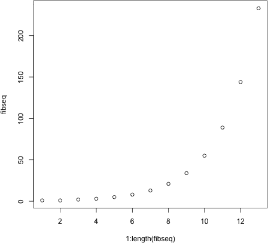
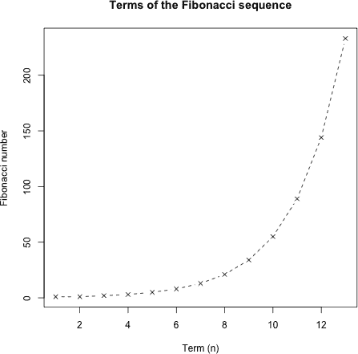
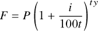
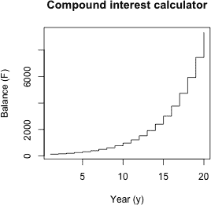
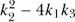
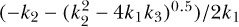
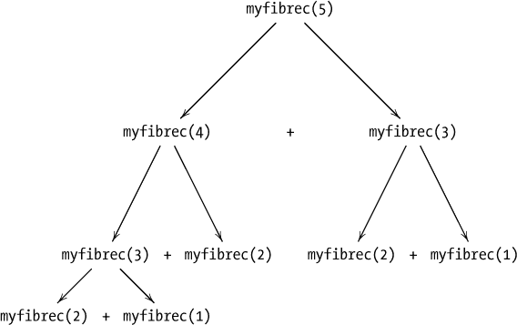
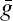
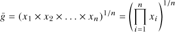
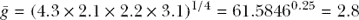

## **11**

**编写函数**


定义函数可以让你重复使用一段代码，而无需反复复制粘贴。它还允许其他用户使用你的函数对他们自己的数据或对象执行相同的计算。在本章中，你将学习如何编写自己的 R 函数。你将了解如何定义和使用参数，如何从函数中返回输出，以及如何以其他方式对函数进行专业化。

### **11.1 函数命令**

要定义一个函数，使用`function`命令并将结果赋给一个对象名称。完成此操作后，你可以像使用其他内置或贡献函数一样，通过该对象名称调用该函数。本节将引导你了解函数创建的基础知识，并讨论一些相关问题，例如返回对象和指定参数。

#### ***11.1.1 函数创建***

函数定义始终遵循以下标准格式：

```
functionname <- function(arg1,arg2,arg3,...){
    do any code in here when called
    return(returnobject)
}
```

`functionname`占位符可以是任何有效的 R 对象名称，最终你将使用它来调用该函数。将`functionname`赋值为`function`的调用，后跟括号，括号内是你希望函数拥有的任何参数。伪代码包括三个参数占位符和一个省略号。当然，参数的数量、标签以及是否包括省略号都取决于你定义的具体函数。如果函数不需要任何参数，只需包含空括号：`()`。如果你确实在这个定义中包含参数，请注意，它们不是工作区中的对象，也没有任何类型或`class`属性—它们仅仅是一个参数名称的声明，这些参数是`functionname`所需要的。

当函数被调用时，它会执行大括号区域中的代码（也称为*函数体*或*函数代码*）。它可以包括`if`语句、循环，甚至其他函数调用。在执行过程中遇到内部函数调用时，R 会遵循第九章中讨论的搜索规则。在大括号区域中，你可以使用`arg1`、`arg2`和`arg3`，它们会被当作函数词法环境中的对象来处理。

根据这些声明的参数在函数体中的使用方式，每个参数可能需要特定的数据类型和对象结构。如果你编写的是打算供他人使用的函数，确保有完善的文档说明函数的预期要求是非常重要的。

通常，函数主体会包含一个或多个`return`命令的调用。当 R 在执行过程中遇到`return`语句时，函数将退出，将控制权交还给用户的命令提示符。这个机制允许你将函数内部操作的结果返回给用户。这个输出在伪代码中由`returnobject`表示，通常是一个在函数主体中较早创建或计算的对象。如果没有`return`语句，函数将简单地返回最后执行表达式所创建的对象（我将在第 11.1.2 节中详细讨论这个特性）。

现在是时候来看一个例子了。我们从第 10.3.2 节中提取斐波那契数列生成器，并将其转化为编辑器中的一个函数。

```
myfib <- function(){
    fib.a <- 1
    fib.b <- 1
    cat(fib.a,", ",fib.b,", ",sep="")
    repeat{
        temp <- fib.a+fib.b
        fib.a <- fib.b
        fib.b <- temp
        cat(fib.b,", ",sep="")
        if(fib.b>150){
            cat("BREAK NOW...")
            break
        }
    }
}
```

我将函数命名为`myfib`，并且它不使用或要求任何参数。代码主体与第 10.3.2 节中的示例完全相同，唯一不同的是我添加了第三行代码`cat(fib.a,", ",fib.b,", ",sep="")`，确保前两个数值 1 和 1 也会被打印到屏幕上。

在你能够从控制台调用`myfib`之前，你需要将函数定义传送到控制台。选中编辑器中的代码并按 CTRL-R 或-RETURN。

```
R> myfib <- function(){
+   fib.a <- 1
+   fib.b <- 1
+   cat(fib.a,", ",fib.b,", ",sep="")
+   repeat{
+       temp <- fib.a+fib.b
+       fib.a <- fib.b
+       fib.b <- temp
+       cat(fib.b,", ",sep="")
+       if(fib.b>150){
+           cat("BREAK NOW...")
+           break
+       }
+   }
+ }
```

这会将函数导入工作空间（如果你在命令提示符下输入`ls()`，`"myfib"`现在会出现在当前对象列表中）。每次你创建或修改一个函数，并且想要在命令提示符下使用它时，都需要执行这一步骤。

现在，你可以从控制台调用这个函数了。

```
R> myfib()
1, 1, 2, 3, 5, 8, 13, 21, 34, 55, 89, 144, 233, BREAK NOW...
```

它计算并打印出最大为 250 的斐波那契数列，正如要求的那样。

##### **添加参数**

与其打印一个固定的数列，让我们添加一个参数来控制打印多少个斐波那契数。考虑下面这个新的函数`myfib2`，它进行了这种修改：

```
myfib2 <- function(thresh){
    fib.a <- 1
    fib.b <- 1
    cat(fib.a,", ",fib.b,", ",sep="")
    repeat{
        temp <- fib.a+fib.b
        fib.a <- fib.b
        fib.b <- temp
        cat(fib.b,", ",sep="")
        if(fib.b>thresh){
            cat("BREAK NOW...")
            break
        }
    }
}
```

这个版本现在接受一个单一的参数`thresh`。在代码主体中，`thresh`充当一个阈值，用于决定何时结束`repeat`过程、停止打印并完成函数——一旦计算出的`fib.b`值大于`thresh`，`repeat`语句将在遇到`break`调用时退出。因此，打印到控制台的输出将是包含第一个大于`thresh`的`fib.b`值的斐波那契数列。这意味着`thresh`必须作为单一的数值提供——例如，提供一个字符字符串是没有意义的。

将`myfib2`的定义导入控制台后，请注意，当你设置`thresh=150`时，得到的结果与原始`myfib`相同。

```
R> myfib2(thresh=150)
1, 1, 2, 3, 5, 8, 13, 21, 34, 55, 89, 144, 233, BREAK NOW...
```

但是现在，你可以将数列打印到任何你想要的限制（这次使用位置匹配来指定参数）：

```
R> myfib2(1000000)
1, 1, 2, 3, 5, 8, 13, 21, 34, 55, 89, 144, 233, 377, 610, 987, 1597, 2584,
4181, 6765, 10946, 17711, 28657, 46368, 75025, 121393, 196418, 317811,
514229, 832040, 1346269, BREAK NOW...
```

##### **返回结果**

如果你想在未来的操作中使用函数的结果（而不是仅仅将输出打印到控制台），你需要将内容返回给用户。继续使用当前的例子，这是一个将序列存储在向量中并返回的斐波那契函数：

```
myfib3 <- function(thresh){
    fibseq <- c(1,1)
    counter <- 2
    repeat{
        fibseq <- c(fibseq,fibseq[counter-1]+fibseq[counter])
        counter <- counter+1
        if(fibseq[counter]>thresh){
            break
        }
    }
    return(fibseq)
}
```

首先，你创建了向量`fibseq`并将其赋值为序列的前两个项。最终，这个向量将成为`returnobject`。你还创建了一个`counter`，初始化为`2`，用于跟踪当前在`fibseq`中的位置。然后，函数进入一个`repeat`语句，它通过`c(fibseq,fibseq[counter-1]+fibseq[counter])`来覆盖`fibseq`。这个表达式通过将最近两个项的和添加到`fibseq`的当前内容中，构造出一个新的`fibseq`。例如，当`counter`从`2`开始时，第一次运行这一行会将`fibseq[1]`和`fibseq[2]`相加，并将结果作为第三项添加到原来的`fibseq`中。

接下来，`counter`被递增，并且检查条件。如果`fibseq[counter]`的最新值不大于`thresh`，循环将继续。如果大于，循环会中断，并且你会到达`myfib3`的最后一行。调用`return`结束函数，并返回指定的`returnobject`（在此情况下，是`fibseq`的最终内容）。

导入`myfib3`后，考虑以下代码：

```
R> myfib3(150)
 [1]   1   1   2   3   5   8  13  21  34  55  89 144 233
R> foo <- myfib3(10000)
R> foo
 [1]     1     1     2     3     5     8    13     21    34   55   89   144
[13]   233   377   610   987  1597  2584  4181   6765 10946
R> bar <- foo[1:5]
R> bar
[1] 1 1 2 3 5
```

这里，第一行调用了`myfib3`并将`thresh`赋值为`150`。输出仍然会打印到屏幕上，但这不是之前通过`cat`命令得到的结果，而是`returnobject`。你可以将这个`returnobject`赋值给一个变量，比如`foo`，此时`foo`就成了全局环境中的另一个 R 对象，可以进行操作。例如，你可以利用它创建一个简单的向量子集`bar`。这是在使用`myfib`或`myfib2`时无法做到的。

#### ***11.1.2 使用 return***

如果函数内部没有`return`语句，函数会在执行完最后一行代码后结束，此时它会返回函数中最后创建或赋值的对象。如果没有创建任何对象，比如之前的`myfib`和`myfib2`，函数会返回`NULL`。为了说明这一点，请在编辑器中输入以下两个示例函数：

```
dummy1 <- function(){
    aa <- 2.5
    bb <- "string me along"
    cc <- "string 'em up"
    dd <- 4:8
}

dummy2 <- function(){
    aa <- 2.5
    bb <- "string me along"
    cc <- "string 'em up"
    dd <- 4:8
    return(dd)
}
```

第一个函数`dummy1`简单地在其词法环境中（而不是全局环境中）赋值了四个不同的对象，并没有显式地返回任何内容。另一方面，`dummy2`创建了相同的四个对象，并显式地返回最后一个对象`dd`。如果你导入并运行这两个函数，它们都会返回相同的对象。

```
R> foo <- dummy1()
R> foo
[1] 4 5 6 7 8
R> bar <- dummy2()
R> bar
[1] 4 5 6 7 8
```

函数会在评估到`return`命令时立即结束，而不会执行函数体中剩余的任何代码。为了强调这一点，考虑一下另一个版本的示例函数：

```
dummy3 <- function(){
    aa <- 2.5
    bb <- "string me along"
    return(aa)
    cc <- "string 'em up"
    dd <- 4:8
    return(bb)
}
```

在这里，`dummy3`函数有两个`return`调用：一个在中间，另一个在末尾。但是，当你导入并执行该函数时，它只返回一个值。

```
R> baz <- dummy3()
R> baz
[1] 2.5
```

执行`dummy3`只会返回对象`aa`，因为只有第一个`return`语句被执行，函数会立即在这一点退出。在当前定义的`dummy3`中，最后三行（`cc`和`dd`的赋值以及`bb`的`return`）永远不会被执行。

使用`return`会向你的代码添加另一个函数调用，因此从技术上讲，它会引入一些额外的计算开销。因此，有人认为，除非绝对必要，否则应避免使用`return`语句。但调用`return`的额外计算成本对于大多数用途来说足够小，可以忽略不计。而且，`return`语句可以使代码更具可读性，更容易看到函数作者打算在哪一处结束函数，并明确希望返回什么作为输出。在剩下的内容中，我将始终使用`return`。

**练习 11.1**

1.  编写另一个斐波那契数列函数，命名为`myfib4`。该函数应提供一个选项，可以执行`myfib2`中的操作（即仅将序列打印到控制台），或者执行`myfib3`中的操作（即正式返回一个序列向量）。你的函数应接受两个参数：第一个，`thresh`，应定义序列的限制（就像`myfib2`或`myfib3`一样）；第二个，`printme`，应为逻辑值。如果为`TRUE`，则`myfib4`应仅打印；如果为`FALSE`，则`myfib4`应返回一个向量。通过以下调用验证结果是否正确：

    – `myfib4(thresh=150,printme=TRUE)`

    – `myfib4(1000000,T)`

    – `myfib4(150,FALSE)`

    – `myfib4(1000000,printme=F)`

1.  在练习 10.4 中，第 203 页要求你编写一个`while`循环来执行整数阶乘计算。

    1.  使用你的阶乘`while`循环（如果你之前没有写，可以编写一个），写一个 R 函数`myfac`，用来计算整数参数`int`的阶乘（你可以假设`int`总是作为非负整数传入）。通过计算 5 的阶乘（即 120）、12 的阶乘（即 479,001,600）和 0 的阶乘（即 1）来快速测试该函数。

    1.  编写另一个版本的阶乘函数，命名为`myfac2`。这次，你仍然可以假设`int`将作为整数传入，但不能假设它一定是非负数。如果是负数，函数应返回`NaN`。在之前的三个测试值上测试`myfac2`，同时尝试使用`int=-6`。

### **11.2 参数**

参数是大多数 R 函数中不可或缺的一部分。在这一部分，你将考虑 R 如何求值参数。你还将看到如何编写具有默认参数值的函数，如何使函数处理缺失的参数值，以及如何通过省略号将额外的参数传递到内部函数调用中。

#### ***11.2.1 延迟求值***

处理许多高级编程语言中参数的一个重要概念是*延迟求值*。通常，这指的是只有在需要时才会对表达式进行求值。这也适用于参数，即它们仅在函数体中出现时才会被访问和使用。

让我们看看 R 函数在执行过程中如何识别和使用参数。作为本节的工作示例，您将编写一个函数，在指定的列表中搜索矩阵对象，并尝试将每个矩阵与作为第二个参数指定的另一个矩阵进行后乘（有关矩阵乘法的详细信息，请参考第 3.3.5 节）。该函数将存储并返回结果到一个新列表中。如果提供的列表中没有矩阵，或者没有适合的矩阵（根据乘法矩阵的维度），函数应该返回一个字符字符串，告知用户这些情况。您可以假设，如果指定的列表中有矩阵，它们将是数值型的。考虑以下函数，我称之为`multiples1`：

```
multiples1 <- function(x,mat,str1,str2){
    matrix.flags <- sapply(x,FUN=is.matrix)

    if(!any(matrix.flags)){
        return(str1)
    }

    indexes <- which(matrix.flags)
    counter <- 0
    result <- list()
    for(i in indexes){
        temp <- x[[i]]
        if(ncol(temp)==nrow(mat)){
            counter <- counter+1
            result[[counter]] <- temp%*%mat
        }
    }

    if(counter==0){
        return(str2)
    } else {
        return(result)
    }
}
```

这个函数接受四个参数，没有默认值。要搜索的目标列表应该传递给`x`；进行后乘的矩阵传递给`mat`；另外两个参数`str1`和`str2`接收字符字符串，如果`x`中没有合适的成员时返回这些字符串。

在代码主体内部，创建了一个名为`matrix.flags`的向量，使用`sapply`隐式循环函数。该函数将`is.matrix`应用于列表参数`x`。结果是一个与`x`等长的逻辑向量，`TRUE`元素表示`x`中对应的成员确实是矩阵。如果`x`中没有矩阵，函数会触发`return`语句，退出函数并输出参数`str1`。

如果函数在那个点没有退出，意味着`x`中确实包含矩阵。接下来的步骤是通过将`which`应用于`matrix.flags`来检索矩阵成员的索引。初始化一个`counter`为`0`，用于跟踪成功执行了多少次矩阵乘法，并创建一个空列表（`result`）用于存储结果。

接下来，进入`for`循环。对于`indexes`中的每个成员，循环会将该位置的矩阵成员存储为`temp`，并检查是否可以将`temp`与参数`mat`进行后乘（为了执行操作，`ncol(temp)`必须等于`nrow(mat)`）。如果矩阵兼容，`counter`增加，并且在`result`的对应位置填充相关计算结果。如果为`FALSE`，则不执行任何操作。索引器`i`然后取`indexes`中的下一个值，并继续重复直到完成。

`multiples1`中的最终程序检查`for`循环是否找到了任何兼容的矩阵乘积。如果没有兼容的矩阵，`for`循环内的花括号`if`语句代码将不会执行，且`counter`将保持为零。因此，如果`counter`在循环结束时仍然等于零，函数将简单地返回`str2`参数。否则，如果找到了兼容的矩阵，适当的结果将被计算，并且`multiples1`将返回`result`列表，列表中至少有一个成员。

现在是时候导入并测试这个函数了。你将使用以下三个列表对象：

```
R> foo <- list(matrix(1:4,2,2),"not a matrix",
               "definitely not a matrix",matrix(1:8,2,4),matrix(1:8,4,2))
R> bar <- list(1:4,"not a matrix",c(F,T,T,T),"??")
R> baz <- list(1:4,"not a matrix",c(F,T,T,T),"??",matrix(1:8,2,4))
```

你将把参数`mat`设置为 2 × 2 的单位矩阵（将任何合适的矩阵与它后乘将只是返回原始矩阵），并为`str1`和`str2`传入适当的字符串消息。以下是该函数在`foo`上的执行方式：

```
R> multiples1(x=foo,mat=diag(2),str1="no matrices in 'x'",
              str2="matrices in 'x' but none of appropriate dimensions given
              'mat'")
[[1]]
     [,1] [,2]
[1,]    1    3
[2,]    2    4

[[2]]
     [,1] [,2]
[1,]    1    5
[2,]    2    6
[3,]    3    7
[4,]    4    8
```

函数已经返回了`result`，包含`foo`的两个兼容矩阵（成员`[[1]]`和`[[5]]`）。现在，让我们使用相同的参数尝试它在`bar`上的表现。

```
R> multiples1(x=bar,mat=diag(2),str1="no matrices in 'x'",
              str2="matrices in 'x' but none of appropriate dimensions given
              'mat'")
[1] "no matrices in 'x'"
```

这次，返回了`str1`的值。初步检查确认在提供给`x`的列表中没有矩阵，因此函数在`for`循环之前已经退出。最后，让我们尝试`baz`。

```
R> multiples1(x=baz,mat=diag(2),str1="no matrices in 'x'",
              str2="matrices in 'x' but none of appropriate dimensions given
              'mat'")
[1] "matrices in 'x' but none of appropriate dimensions given 'mat'"
```

在这里返回了`str2`的值。尽管`baz`中有一个矩阵，且`multiples1`的`for`循环体内的代码已经执行，但该矩阵不适合用`mat`进行后乘。

请注意，字符串参数`str1`和`str2`仅在参数`x`不包含具有适当维度的矩阵时使用。例如，当你将`multiples1`应用于`x=foo`时，根本不需要使用`str1`或`str2`。R 会懒惰地评估已定义的表达式，这意味着只有在执行过程中实际需要这些参数时，才会查找其值。在此函数中，`str1`和`str2`仅在输入列表中没有合适的矩阵时才需要，因此，当`x=foo`时，你可以懒惰地忽略为这些参数提供值。

```
R> multiples1(x=foo,mat=diag(2))
[[1]]
     [,1] [,2]
[1,]    1    3
[2,]    2    4

[[2]]
     [,1] [,2]
[1,]    1    5
[2,]    2    6
[3,]    3    7
[4,]    4    8
```

这与之前的结果相同，完全没有问题。然而，尝试用`bar`来进行此操作则无法成功。

```
R> multiples1(x=bar,mat=diag(2))
Error in multiples1(x = bar, mat = diag(2)) :
  argument "str1" is missing, with no default
```

在这里，R 正确地提醒我们需要`str1`的值。它告诉我们该值缺失且没有默认值。

#### ***11.2.2 设置默认值***

上一个例子展示了在某些情况下设置默认值对于特定参数是有用的。在许多其他情况下，设置默认参数值也是合理的，例如当函数有大量参数时，或者当参数有自然的值并且这些值使用得更频繁时。让我们编写`multiples1`函数的一个新版本，`multiples2`，它现在包含`str1`和`str2`的默认值，参见第 11.2.1 节。

```
multiples2 <- function(x,mat,str1="no valid matrices",str2=str1){
    matrix.flags <- sapply(x,FUN=is.matrix)

    if(!any(matrix.flags)){
        return(str1)
    }

    indexes <- which(matrix.flags)
    counter <- 0
    result <- list()
    for(i in indexes){
        temp <- x[[i]]
        if(ncol(temp)==nrow(mat)){
            counter <- counter+1
            result[[counter]] <- temp%*%mat
        }
    }

    if(counter==0){
        return(str2)
    } else {
        return(result)
    }
}
```

在这里，你为`str1`提供了一个默认值`"no valid matrices"`，通过在参数的正式定义中为其赋值字符串。你还通过将`str1`赋值给它来为`str2`设置了默认值。如果你再次导入并执行此函数，针对三个列表，你不再需要显式地为这些参数提供值。

```
R> multiples2(foo,mat=diag(2))
[[1]]
     [,1] [,2]
[1,]    1    3
[2,]    2    4

[[2]]
     [,1] [,2]
[1,]    1    5
[2,]    2    6
[3,]    3    7
[4,]    4    8

R> multiples2(bar,mat=diag(2))
[1] "no valid matrices"
R> multiples2(baz,mat=diag(2))
[1] "no valid matrices"
```

现在，无论结果如何，你都可以调用该函数，而无需完全指定每个参数。如果你在某次调用中不想使用默认参数，你仍然可以为这些参数指定不同的值，而这些值将覆盖默认值。

#### ***11.2.3 检查缺失的参数***

`missing`函数检查函数的参数，看看是否所有必需的参数都已提供。它接受一个参数标签，并返回一个逻辑值`TRUE`，如果指定的参数没有找到。你可以使用`missing`来避免在之前调用`multiples1`时看到的错误，当时`str1`是必需的但没有提供。

在某些情况下，`missing`函数在代码主体中尤其有用。考虑对示例函数的另一个修改：

```
multiples3 <- function(x,mat,str1,str2){
    matrix.flags <- sapply(x,FUN=is.matrix)

    if(!any(matrix.flags)){
        if(missing(str1)){
            return("'str1' was missing, so this is the message")
        } else {
            return(str1)
        }
    }

    indexes <- which(matrix.flags)
    counter <- 0
    result <- list()
    for(i in indexes){
        temp <- x[[i]]
        if(ncol(temp)==nrow(mat)){
            counter <- counter+1
            result[[counter]] <- temp%*%mat
        }
    }

    if(counter==0){
        if(missing(str2)){
            return("'str2' was missing, so this is the message")
        } else {
            return(str2)
        }
    } else {
        return(result)
    }
}
```

这个版本和`multiples1`之间的唯一区别在于第一个和最后一个`if`语句。第一个`if`语句检查`x`中是否没有矩阵，在这种情况下返回一条字符串消息。在`multiples1`中，该消息始终是`str1`，但现在你使用另一个`if`语句和`missing(str1)`来检查`str1`参数是否有值。如果没有，函数将返回另一条字符字符串，说明`str1`是“缺失的”。对`str2`也定义了类似的替代方案。这里再次导入该函数并使用`foo`、`bar`和`baz`：

```
R> multiples3(foo,diag(2))
[[1]]
     [,1] [,2]
[1,]    1    3
[2,]    2    4

[[2]]
     [,1] [,2]
[1,]    1    5
[2,]    2    6
[3,]    3    7
[4,]    4    8

R> multiples3(bar,diag(2))
[1] "'str1' was missing, so this is the message"
R> multiples3(baz,diag(2))
[1] "'str2' was missing, so this is the message"
```

以这种方式使用`missing`可以允许在给定的函数调用中不提供某些参数。它主要用于当某个参数很难选择默认值时，但函数仍然需要处理没有提供该参数的情况。在当前示例中，为`str1`和`str2`定义默认值更加合理，正如你为`multiples2`所做的那样，而避免了实现`missing`所需的额外代码。

#### ***11.2.4 处理省略号***

在第 9.2.5 节中，我介绍了省略号，也称为点点点符号。省略号允许你传入额外的参数，而不必先在参数列表中定义它们，然后这些参数可以传递给代码主体中的另一个函数调用。当省略号包含在函数定义中时，它通常（但不总是）放在最后一个位置，因为它表示参数的可变数量。

基于第 11.1.1 节中的`myfib3`函数，让我们使用省略号编写一个可以绘制指定斐波那契数列的函数。

```
myfibplot <- function(thresh,plotit=TRUE,...){
    fibseq <- c(1,1)
    counter <- 2
    repeat{
        fibseq <- c(fibseq,fibseq[counter-1]+fibseq[counter])
        counter <- counter+1
        if(fibseq[counter]>thresh){
            break
        }
    }

    if(plotit){
        plot(1:length(fibseq),fibseq,...)
    } else {
        return(fibseq)
    }
}
```

在这个函数中，一个`if`语句检查`plotit`参数是否为`TRUE`（这是默认值）。如果是这样，那么你调用`plot`，传入`1:length(fibseq)`作为* x *轴的坐标，斐波那契数列本身作为* y *轴的坐标。在这些坐标之后，你还将省略号直接传递给`plot`。在这种情况下，省略号表示用户可能传递给`plot`的任何其他参数，用以控制图形的执行。

导入`myfibplot`并执行以下代码后，图形设备中将弹出图形图 11-1。

```
R> myfibplot(150)
```

这里，你使用位置匹配将`150`分配给`thresh`，并为`plotit`参数保留默认值。此调用中的省略号为空。



*图 11-1：通过调用* `myfibplot` *产生的默认图形，参数为* `thresh=150`

由于你没有另行指定，R 会按照`plot`的默认行为运行。你可以通过指定更多的绘图选项来美化图形。以下代码将生成图 11-2 中的图形：

```
R> myfibplot(150,type="b",pch=4,lty=2,main="Terms of the Fibonacci sequence",
             ylab="Fibonacci number",xlab="Term (n)")
```



*图 11-2：通过调用* `myfibplot` *并使用省略号传递图形参数生成的图形*

这里，省略号允许你通过调用`myfibplot`将参数传递给`plot`，即使特定的图形参数并未显式定义为`myfibplot`的参数。

省略号可以很方便，但需要小心使用。模糊的`...`可以代表任何数量的神秘参数。良好的函数文档是指示适当用法的关键。

如果你想解包通过省略号传递的参数，可以使用`list`函数将这些参数转换为列表。以下是一个示例：

```
unpackme <- function(...){
    x <- list(...)
    cat("Here is ... in its entirety as a list:\n")
    print(x)
    cat("\nThe names of ... are:",names(x),"\n\n")
    cat("\nThe classes of ... are:",sapply(x,class))
}
```

这个虚拟函数简单地接受一个省略号，并通过`x <- list(...)`将其转换为一个列表。这样，`x`对象就可以像其他列表一样进行处理。在这种情况下，你可以通过提供其`names`和`class`属性来总结该对象。以下是一个示例运行：

```
R> unpackme(aa=matrix(1:4,2,2),bb=TRUE,cc=c("two","strings"),
            dd=factor(c(1,1,2,1)))
Here is ... in its entirety as a list:
$aa
     [,1] [,2]
[1,]    1    3
[2,]    2    4

$bb
[1] TRUE

$cc
[1] "two"     "strings"

$dd
[1] 1 1 2 1
Levels: 1 2

The names of ... are: aa bb cc dd

The classes of ... are: matrix logical character factor
```

四个带标签的参数，`aa`、`bb`、`cc`和`dd`，作为省略号的内容提供，并通过简单的`list(...)`操作在`unpackme`中显式识别。此结构可用于识别或提取通过`...`在给定调用中传递的特定参数。

**练习 11.2**

1.  累积年复利是投资者常见的财务收益。给定一个本金投资额*P*，年利率*i*（以百分比表示），以及每年支付利息的频率*t*，经过*y*年后的最终金额*F*可以通过以下公式计算：

    

    编写一个函数，按照以下说明计算*F*：

    – 必须为*P*、*i*、*t*和*y*提供参数。*t*的默认值应为 12。

    – 另一个参数给出一个逻辑值，用于确定是否应包括在每个整数时间点 `plot` 显示金额 *F*。例如，如果 `plotit=TRUE`（默认值）且 *y* 为 5 年，则图表应显示 *F* 在 *y* = 1,2,3,4,5 时的金额。

    – 如果绘制此函数，图表应始终为步骤图，因此 `plot` 应始终使用 `type="s"`。

    – 如果 `plotit=FALSE`，则应返回最终金额 *F*，作为与前面显示的相同整数时间对应的数值向量。

    – 如果进行绘图，还应包括省略号以控制其他细节。

    现在，使用你的函数，执行以下操作：

    1.  计算一个$5000 的本金，在年利率 4.4%、按月复利的条件下，10 年后的最终金额。

    1.  重新绘制以下步骤图，显示在每年 22.9%的利率下，按月复利投资$100，持续 20 年的结果：

        

    1.  基于（ii）中的相同参数，进行另一项计算，但这次假设利息按年复利。返回并存储结果作为数值向量。然后，使用 `lines` 将一个第二条步骤线（对应于按年复利计算的金额）添加到之前创建的图表中。使用不同的颜色或线型，并利用 `legend` 函数区分两条线。

1.  *x* 的*二次方程*通常以以下形式表示：

    *k*[1]*x*² + *k*[2]*x* + *k[3]* = 0

    其中，*k*[1]、*k*[2] 和 *k[3]* 是常数。给定这些常数的值后，你可以尝试找到最多两个*实根*—即满足方程的*x*值。编写一个函数，接受 *k*[1]、*k*[2] 和 *k[3]* 作为参数，并在这种情况下找到并返回任何解（作为一个数值向量）。实现方法如下：

    – 评估 。如果它为负，则没有解，应在控制台打印适当的消息。

    – 如果  为零，则有一个解，通过 −*k*[2]/2*k*[1] 计算得出。

    – 如果  为正，则有两个解，分别由  和  给出。

    – 不需要为这三个参数提供默认值，但函数应检查是否有任何参数缺失。如果有，则应返回一个适当的字符字符串消息，通知用户无法进行计算。

    现在，测试你的函数。

    1.  确认以下内容：

        * 2*x*² − *x* − 5 的根为 1.850781 和 −1.350781。

        * *x*² + *x* + 1 没有实根。

    1.  尝试解决以下二次方程的解：

        * 1.3*x*² − 8*x* − 3.13

        * 2.25*x*² − 3*x* + 1

        * 1.4*x*² − 2.2*x* − 5.1

        * −5*x*² + 10.11*x* − 9.9

    1.  测试当函数的一个参数缺失时，你编写的响应。

### **11.3 专门函数**

在本节中，你将了解三种特殊的用户自定义 R 函数。首先，你将了解辅助函数，它们设计为可以被另一个函数多次调用（甚至可以在父函数体内定义）。接下来，你将了解一次性函数，它们可以直接作为另一个函数调用的参数来定义。最后，你将了解递归函数，它们会调用自己。

#### ***11.3.1 辅助函数***

R 函数在其函数体内调用其他函数是很常见的。*辅助函数*是一个通用术语，用来描述专门编写并用于便捷地执行另一个函数计算的函数。它们是提高复杂函数可读性的好方法。

辅助函数可以是内部定义的（在另一个函数定义内）或外部定义的（在全局环境中）。在本节中，你将看到每种情况的示例。

##### **外部定义**

基于第 11.2.2 节中的`multiples2`函数，下面是一个新版本，它将功能拆分成两个独立的函数，其中一个是外部定义的辅助函数：

```
multiples_helper_ext <- function(x,matrix.flags,mat){
    indexes <- which(matrix.flags)
    counter <- 0
    result <- list()
    for(i in indexes){
        temp <- x[[i]]
        if(ncol(temp)==nrow(mat)){
            counter <- counter+1
            result[[counter]] <- temp%*%mat
        }
    }
    return(list(result,counter))
}

multiples4 <- function(x,mat,str1="no valid matrices",str2=str1){
    matrix.flags <- sapply(x,FUN=is.matrix)

    if(!any(matrix.flags)){
        return(str1)
    }

    helper.call <- multiples_helper_ext(x,matrix.flags,mat)
    result <- helper.call[[1]]
    counter <- helper.call[[2]]

    if(counter==0){
        return(str2)
    } else {
        return(result)
    }
}
```

如果你导入并执行这个代码，使用之前的示例列表，它的行为和前一个版本相同。你所做的只是将矩阵检查循环移到了一个外部函数中。`multiples4`函数现在调用一个名为`multiples_helper_ext`的辅助函数。一旦`multiples4`中的代码确认列表`x`中确实有需要检查的矩阵，它就会调用`multiples_helper_ext`来执行所需的循环。这个辅助函数是外部定义的，这意味着它存在于全局环境中，任何其他函数都可以调用它，这使得它更容易重用。

##### **内部定义**

如果辅助函数只打算用于一个特定的函数，那么将辅助函数定义在调用它的函数的词法环境内更有意义。矩阵乘法函数的第五个版本正是这样做的，它将定义移到了函数体内。

```
multiples5 <- function(x,mat,str1="no valid matrices",str2=str1){
    matrix.flags <- sapply(x,FUN=is.matrix)

    if(!any(matrix.flags)){
        return(str1)
    }

    multiples_helper_int <- function(x,matrix.flags,mat){
        indexes <- which(matrix.flags)
        counter <- 0
        result <- list()
        for(i in indexes){
            temp <- x[[i]]
            if(ncol(temp)==nrow(mat)){
                counter <- counter+1
                result[[counter]] <- temp%*%mat
            }
        }
        return(list(result,counter))
    }

    helper.call <- multiples_helper_int(x,matrix.flags,mat)
    result <- helper.call[[1]]
    counter <- helper.call[[2]]

    if(counter==0){
        return(str2)
    } else {
        return(result)
    }
}
```

现在，辅助函数`multiples_helper_int`在`multiples5`内定义。这意味着它仅在词法环境内可见，而不像`multiples_helper_ext`那样存在于全局环境中。当（a）一个辅助函数仅由一个父函数使用，并且（b）它在父函数中被多次调用时，将它定义为内部函数是有意义的。（当然，`multiples5`只满足（a），它在这里仅用于说明。）

#### ***11.3.2 一次性函数***

通常，你可能需要一个执行简单、一行任务的函数。例如，当你使用`apply`时，你通常只需要传入一个简短、简单的函数作为参数。这就是*临时*（或*匿名*）函数的用武之地——它们允许你定义一个仅用于单一实例的函数，而无需在全局环境中显式创建一个新对象。

假设你有一个数值矩阵，想要将其每列重复两次并进行排序。

```
R> foo <- matrix(c(2,3,3,4,2,4,7,3,3,6,7,2),3,4)
R> foo
     [,1] [,2] [,3] [,4]
[1,]    2    4    7    6
[2,]    3    2    3    7
[3,]    3    4    3    2
```

这是`apply`的完美任务，`apply`可以将一个函数应用到矩阵的每一列。这个函数只需接受一个向量，重复它，然后对结果进行排序。你无需单独定义这个简短的函数，而是可以在`apply`的参数中使用`function`命令直接定义一个临时函数。

```
R> apply(foo,MARGIN=2,FUN=function(x){sort(rep(x,2))})
     [,1] [,2] [,3] [,4]
[1,]    2    2    3    2
[2,]    2    2    3    2
[3,]    3    4    3    6
[4,]    3    4    3    6
[5,]    3    4    7    7
[6,]    3    4    7    7
```

该函数直接在调用`apply`时以标准格式定义。函数被定义、调用，并且在`apply`完成后立即被遗忘。它是临时的，因为它仅存在于实际使用的那个实例中。

以这种方式使用`function`命令更多的是一种快捷方式；此外，它还避免了在全局环境中不必要地创建和存储一个函数对象。

#### ***11.3.3 递归函数***

*递归*是指一个函数调用它自己。这种技术在统计分析中不常用，但了解它仍然很有用。本节将简要说明一个函数如何调用它自己。

假设你想编写一个函数，接受一个单一的正整数参数`n`并返回相应的*第 n 项*斐波那契数列（其中*n* = 1 和*n* = 2 分别对应初始的两个项 1 和 1）。早些时候你通过循环构建了斐波那契数列的*迭代*形式。在递归函数中，函数不使用循环来重复操作，而是多次调用自身。请考虑以下内容：

```
myfibrec <- function(n){
    if(n==1||n==2){
        return(1)
    } else {
        return(myfibrec(n-1)+myfibrec(n-2))
    }
}
```

递归函数`myfibrec`检查一个单一的`if`语句，用来定义*停止条件*。如果传递给函数的是`1`或`2`（请求第一个或第二个斐波那契数），那么`myfibrec`会直接返回`1`。否则，函数返回`myfibrec(n-1)`和`myfibrec(n-2)`的和。这意味着，如果你调用`myfibrec`并传入`n`大于`2`，函数将生成两个额外的`myfibrec`调用，分别使用`n-1`和`n-2`。递归会持续直到遇到请求第 1 项或第 2 项的调用，触发停止条件`if(n==1||n==2)`，此时函数仅返回`1`。以下是一个示例调用，用于获取第五个斐波那契数：

```
R> myfibrec(5)
[1] 5
```

图 11-3 展示了这个递归调用的结构。

请注意，任何递归函数都需要一个可访问的停止规则。没有停止规则，递归将会无限进行。例如，当前的`myfibrec`函数定义只要用户提供一个正整数作为参数`n`，就能正常工作。但如果`n`是负数，停止规则条件将永远不会满足，函数会无限递归下去（尽管 R 语言有一些自动化的保护措施来帮助防止这种情况，并应当返回错误消息，而不是陷入无限循环）。

递归是一种强大的方法，特别是当你无法预知函数需要被调用多少次才能完成任务时。对于许多排序和搜索算法，递归提供了最快和最有效的解决方案。但在更简单的情况中，比如这里的斐波那契例子，递归方法往往比迭代循环方法需要更多的计算资源。对于初学者，我建议除非严格要求使用递归，否则最好使用显式的循环。



*图 11-3：对`myfibrec`函数的递归调用可视化，`n=5`*

**练习 11.3**

1.  给定一个包含不同长度字符字符串向量的列表，使用一次性函数与`lapply`将一个感叹号附加到每个元素的末尾，分隔符为空字符串（请注意，`paste`在应用于字符向量时的默认行为是对每个元素进行连接）。在以下列表上执行此代码：

    ```
    foo <- list("a",c("b","c","d","e"),"f",c("g","h","i"))
    ```

1.  编写一个递归版本的函数，实现非负整数阶乘操作符（有关阶乘操作符的详细信息，请参见练习 10.4，见第 203 页）。停止规则应当在提供的整数为`0`时返回`1`。确认你的函数输出与之前的结果相同。

    1.  5 的阶乘是 120。

    1.  120 的阶乘是 479,001,600。

    1.  0 的阶乘是 1。

1.  对于这个问题，我将介绍*几何平均数*。几何平均数是一个特定的集中趋势度量，区别于更常见的算术平均数。给定*n*个观察值，分别记作*x*[1]、*x*[2]、...、*x*[n]，它们的几何平均数的计算公式如下：

    

    例如，要找到数据 4.3、2.1、2.2、3.1 的几何平均数，可以按以下方式计算：

    

    （此值已四舍五入至小数点后一位。）

    编写一个名为`geolist`的函数，它能够遍历指定的列表，并根据以下指导原则计算每个成员的几何平均数：

    – 你的函数必须定义并使用一个内部辅助函数，该函数返回向量参数的几何平均数。

    – 假设列表的成员只能是数字向量或数字矩阵。你的函数应包含一个适当的循环来依次检查每个成员。

    – 如果成员是一个向量，计算该向量的几何平均值，用结果覆盖该成员，结果应该是一个单一的数字。

    – 如果成员是一个矩阵，使用隐式循环计算矩阵*每一行*的几何平均值，并用结果覆盖该成员。

    – 最终的列表应返回给用户。

    现在，作为一个快速测试，检查你的函数是否与以下两个调用匹配：

    1.  ```
        R> foo <- list(1:3,matrix(c(3.3,3.2,2.8,2.1,4.6,4.5,3.1,9.4),4,2),
                       matrix(c(3.3,3.2,2.8,2.1,4.6,4.5,3.1,9.4),2,4))
        R> geolist(foo)
        [[1]]
        [1] 1.817121

        [[2]]
        [1] 3.896152 3.794733 2.946184 4.442972

        [[3]]
        [1] 3.388035 4.106080
        ```

    1.  ```
        R> bar <- list(1:9,matrix(1:9,1,9),matrix(1:9,9,1),matrix(1:9,3,3))
        R> geolist(bar)
        [[1]]
        [1] 4.147166

        [[2]]
        [1] 4.147166

        [[3]]
        [1] 1 2 3 4 5 6 7 8 9

        [[4]]
        [1] 3.036589 4.308869 5.451362
        ```

##### **本章中的重要代码**

| **函数/运算符** | **简短描述** | **首次出现** |
| --- | --- | --- |
| `function` | 函数创建 | 第 11.1.1 节，第 216 页 |
| `return` | 函数返回对象 | 第 11.1.1 节，第 219 页 |
| `missing` | 参数检查 | 第 11.2.3 节，第 227 页 |
| `...` | 省略号（作为参数） | 第 11.2.4 节，第 228 页 |
