## **13**

**基础统计学**


统计学是将*数据*转化为*信息*，以识别趋势并理解群体特征的实践。本章将涵盖一些基本定义，并使用 R 语言演示它们的应用。

### **13.1 描述原始数据**

统计分析师常常首先面对的是原始数据——换句话说，就是构成样本的记录或观察值。根据预定分析的性质，这些数据可能存储在一个专门的 R 对象中，通常是一个数据框（第五章），也可能通过第八章中的技术从外部文件读取。在开始对数据进行汇总或建模之前，明确可用的变量是非常重要的。

*变量*是群体中个体的一个特征，其值在该群体中的不同实体之间可能有所不同。例如，在第 5.2 节中，你使用了一个示例数据框`mydata`进行实验。你记录了一个样本中人们的年龄、性别和幽默感水平。这些特征就是你的变量；所测量的值在个体之间会有所不同。

变量可以有多种形式，这取决于它们可能取值的性质。在开始使用 R 之前，我们将先看看一些描述变量的标准方式。

#### ***13.1.1 数值变量***

*数值*变量是指其观察值自然记录为数字的变量。数值变量有两种类型：连续型和离散型。

*连续*变量可以记录为某个区间内的任意值，可以精确到任意小数位（技术上来说，这会导致无限多的可能值，即使连续区间的范围是有限的）。例如，如果你在观察降水量，15 毫米的值是合理的，同样，15.42135 毫米也是合理的。任何精度的测量都可以得出有效的观察值。

*离散*变量则不同，它只能取特定的数字值——如果其范围是有限的，那么可能的值的数量也是有限的。例如，如果你观察 20 次抛硬币的结果中正面朝上的次数，那么只能得到整数结果。观察 15.42135 次正面朝上是没有意义的；可能的结果仅限于 0 到 20（包括 20）之间的整数。

#### ***13.1.2 类别变量***

尽管许多变量的观察值是数字型的，但考虑*类别*变量也同样重要。像一些离散变量一样，类别变量只能取有限数量的可能值。不过，与离散变量不同的是，类别观察值并不总是以数字形式记录。

分类变量有两种类型。不能逻辑排序的分类变量称为 *名义型*（nominal）。性别就是一个典型的名义型分类变量。在大多数数据集中，它有两个固定的值——男性和女性，而这些类别的顺序是无关紧要的。可以自然排序的分类变量称为 *有序型*（ordinal）。药物剂量就是一个典型的有序型分类变量，可能的值有低、中和高。这些值可以按增加或减少的顺序排列，而这种排序可能与研究相关。

**注意**

*一些统计学文献模糊了离散变量和分类变量的定义，甚至将它们互换使用。虽然这种做法不一定错误，但为了清晰起见，我更倾向于将这些定义区分开来。也就是说，当我提到“离散”时，我指的是一种自然的数值变量，它不能用连续尺度表示（比如计数），而当我提到“分类”时，我指的是某个个体的可能结果不一定是数值的，并且可能值的数量始终是有限的。*

一旦你知道该找什么，识别给定数据集中的变量类型就变得很简单。以数据框 `chickwts` 为例，它包含在自动加载的 `datasets` 包中。在提示符下，直接输入以下内容可以获取该数据集的前五条记录。

```
R> chickwts[1:5,]
  weight      feed
1    179 horsebean
2    160 horsebean
3    136 horsebean
4    227 horsebean
5    217 horsebean
```

R 的帮助文件（`?chickwts`）描述了这些数据，包含了 71 只小鸡（以克为单位）在六周后的体重数据，数据是根据提供的食物类型来分类的。现在让我们看看这两列数据，作为向量的整体：

```
R> chickwts$weight
 [1] 179 160 136 227 217 168 108 124 143 140 309 229 181 141 260 203 148 169
[19] 213 257 244 271 243 230 248 327 329 250 193 271 316 267 199 171 158 248
[37] 423 340 392 339 341 226 320 295 334 322 297 318 325 257 303 315 380 153
[55] 263 242 206 344 258 368 390 379 260 404 318 352 359 216 222 283 332
R> chickwts$feed
 [1] horsebean horsebean horsebean horsebean horsebean horsebean horsebean
 [8] horsebean horsebean horsebean linseed   linseed   linseed   linseed
[15] linseed   linseed   linseed   linseed   linseed   linseed   linseed
[22] linseed   soybean   soybean   soybean   soybean   soybean   soybean
[29] soybean   soybean   soybean   soybean   soybean   soybean   soybean
[36] soybean   sunflower sunflower sunflower sunflower sunflower sunflower
[43] sunflower sunflower sunflower sunflower sunflower sunflower meatmeal
[50] meatmeal  meatmeal  meatmeal  meatmeal  meatmeal  meatmeal  meatmeal
[57] meatmeal  meatmeal  meatmeal  casein    casein    casein    casein
[64] casein    casein    casein    casein    casein    casein    casein
[71] casein
Levels: casein horsebean linseed meatmeal soybean sunflower
```

`weight` 是一个数值测量，可以落在一个连续的范围内，因此它是一个数值连续变量。尽管小鸡体重看起来已被四舍五入或记录为最接近的克数，但这并不影响该定义，因为实际上体重可以是任何合理的数字。`feed` 显然是一个分类变量，因为它只有六个可能的结果，而这些结果不是数值的。由于没有任何自然或容易识别的排序，可以得出结论，`feed` 是一个分类名义型变量。

#### ***13.1.3 单变量和多变量数据***

当讨论或分析仅与一个维度相关的数据时，你正在处理 *单变量* 数据。例如，前面例子中的 `weight` 变量就是单变量的，因为每个测量值可以通过一个组成部分——一个数字来表达。

当有必要考虑具有多个维度的变量数据时（换句话说，即每个观察值关联的组件或测量不止一个），你的数据被视为 *多变量* 数据。当单独考虑每个组件（即作为单变量量）在任何给定的统计分析中不太有用时，多变量测量尤为相关。

一个理想的例子是空间坐标，它必须至少考虑两个分量——一个水平的*x*坐标和一个垂直的*y*坐标。仅仅考虑单变量数据——例如，仅考虑*x*轴值——并不特别有用。考虑`quakes`数据集（与`chickwts`类似，它可以通过`datasets`包自动获得），该数据集包含了在斐济海岸记录的 1,000 个地震事件的观测值。如果你查看前五条记录，并阅读帮助文件`?quakes`中的描述，你很快就能对所展示的内容有一个清晰的理解。

```
R> quakes[1:5,]
     lat   long depth mag stations
1 -20.42 181.62   562 4.8       41
2 -20.62 181.03   650 4.2       15
3 -26.00 184.10    42 5.4       43
4 -17.97 181.66   626 4.1       19
5 -20.42 181.96   649 4.0       11
```

`lat`和`long`列提供了事件的纬度和经度，`depth`提供了事件的深度（以公里为单位），`mag`提供了里氏震级，`stations`提供了检测到该事件的观测站数量。如果你对这些地震的空间分布感兴趣，仅仅查看纬度或经度并不能提供太多信息。每个事件的位置由两个分量描述：纬度*和*经度值。你可以轻松绘制这 1,000 个事件；图 13-1 展示了以下代码的结果：

```
R> plot(quakes$long,quakes$lat,xlab="Longitude",ylab="Latitude")
```

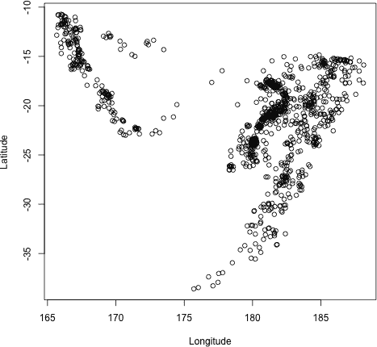

*图 13-1：使用双变量（具有两个分量的多变量）变量绘制地震的空间位置*

#### ***13.1.4 参数还是统计量？***

如前所述，统计学作为一门学科，关注的是理解一个整体*群体*的特征，群体被定义为所有相关个体或实体的集合。该群体的特征称为*参数*。由于研究人员很少能够访问到每个群体成员的相关数据，因此他们通常会收集一个*样本*的实体，代表整个群体，并记录这些实体的相关数据。然后，他们可以使用样本数据来估计感兴趣的参数——这些估计值就是*统计量*。

例如，如果你对拥有猫的美国女性的平均年龄感兴趣，那么感兴趣的群体就是所有居住在美国并拥有至少一只猫的女性。感兴趣的参数是拥有至少一只猫的美国女性的真实平均年龄。当然，获得每一个拥有猫的美国女性的年龄将是一个困难的任务。一种更可行的方法是随机挑选少量拥有猫的美国女性，并从她们那里收集数据——这就是你的样本，而样本中女性的平均年龄就是你的统计量。

因此，统计量与参数之间的关键区别在于，特征是否指的是你所抽取数据的样本，还是更广泛的总体。图 13-2 用均值 *μ* 表示总体中个体的参数，而用均值 *x̄* 表示从该总体抽取的个体样本的统计量。

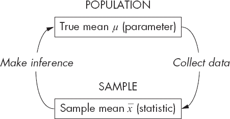

*图 13-2：一个统计实践的概念化，使用均值作为例子来说明* 参数 *和* 统计量 *的定义*

**练习 13.1**

1.  对于以下每一项，识别所描述的变量类型：数值-连续型，数值-离散型，分类-名义型，或分类-顺序型：

    1.  从生产线下来的汽车引擎盖上的瑕疵数量

    1.  一项调查问题，要求参与者从“强烈同意”、“同意”、“中立”、“不同意”和“强烈不同意”中选择

    1.  音乐会上的噪音水平（以分贝为单位）

    1.  三个可能选项中的噪音水平：高，中，低

    1.  选择一个主色

    1.  猫和老鼠之间的距离

1.  对于以下每一项，识别所讨论的量是总体参数还是样本统计量。如果是后者，还要识别相应的总体参数是什么。

    1.  50 名新西兰人中拥有游戏主机的比例

    1.  “No Dodgy Carz”场地上三辆车引擎盖上的瑕疵数量的平均值

    1.  美国国内佩戴项圈的家猫比例

    1.  一年中自动售货机每天使用的平均次数

    1.  基于在该年内三个不同日期收集的数据，自动售货机每天使用的平均次数

### **13.2 概括性统计量**

现在你已经学习了基本术语，准备使用 R 来计算一些统计量。在这一节中，你将了解用来概括我所讨论的不同类型变量的最常见统计量。

#### ***13.2.1 集中趋势：均值、中位数、众数***

*集中趋势度量* 通常用于通过描述数值观察值的集中位置来解释大量数据。最常见的集中趋势度量之一当然是算术 *均值*。它被认为是观察值集合的中央“平衡点”。

对于一组 *n* 个数值型测量值标记为 *x* = {*x*[1], *x*[2], . . . , *x*[n]}，你可以通过以下方式计算样本均值 *x̄*：

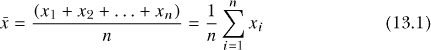

举个例子，如果你观察到的数据是 2, 4.4, 3, 3, 2, 2.2, 2, 4，均值的计算方式如下：

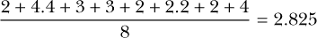

*中位数*是你观测值的“中间大小”，因此，如果你按从小到大的顺序排列观测值，可以通过取中间值（如果观测值个数是奇数）或取中间两个值的平均值（如果观测值个数是偶数）来找到中位数。使用标记为*x*的*n*个测量值，表示为*x* = {*x*[1]、*x*[2]、...、*x*[n]}，你可以按如下方式找到样本中位数 ：

• 将观测值从小到大排序，以获得“顺序统计量” 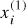、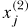、...、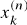，其中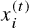表示第*t*小的观测值，不论观测值编号*i*、*j*、*k*等。

• 然后，执行以下操作：

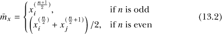

对于相同的数据，按从小到大的顺序排序，它们变为 2、2、2、2.2、3、3、4、4.4。对于*n* = 8 个观测值，*n*/2 = 4。因此，中位数为：

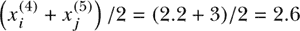

*众数*只是“最常见”的观测值。这个统计量通常用于数字离散数据，而非数字连续数据，尽管它也可以用于后者的*区间*（通常是在讨论概率密度函数时—见第十五章和第十六章）。一组*n*个数字测量值 *x*[1]、*x*[2]、...、*x[n]* 可能没有众数（如果每个观测值都是唯一的），也可能有多个众数（如果有多个特定值出现的次数最多）。要找到众数 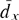，只需列出每个测量值的频率。

再次使用示例中的八个观测值，你可以在这里看到频率：

| **观测值** | 2 | 2.2 | 3 | 4 | 4.4 |
| --- | --- | --- | --- | --- | --- |
| **频率** | 3 | 1 | 2 | 1 | 1 |

值 2 出现三次，比其他任何值都更频繁，因此这些数据的唯一众数是值 2。

在 R 中，使用内置的相同名称函数可以轻松计算算术平均值和中位数。首先，将这八个观测值存储为数字向量`xdata`。

```
R> xdata <- c(2,4.4,3,3,2,2.2,2,4)
```

然后计算统计量。

```
R> x.bar <- mean(xdata)
R> x.bar
[1] 2.825
R> m.bar <- median(xdata)
R> m.bar
[1] 2.6
```

寻找众数最简单的方法或许是使用 R 的`table`函数，它可以给出所需的频率。

```
R> xtab <- table(xdata)
R> xtab
xdata
  2 2.2   3   4 4.4
  3   1   2   1   1
```

虽然这清楚地展示了一个小数据集的众数，但一个好的做法是编写可以自动识别任何`表格`中最频繁观测值的代码。`min`和`max`函数会报告最小值和最大值，而`range`返回这两个值，并以长度为 2 的向量形式输出。

```
R> min(xdata)
[1] 2
R> max(xdata)
[1] 4.4
R> range(xdata)
[1] 2.0 4.4
```

当应用于`table`时，这些命令会作用于报告的频率。

```
R> max(xtab)
[1] 3
```

最后，因此，你可以构建一个逻辑标志向量来从`table`中获取众数。

```
R> d.bar <- xtab[xtab==max(xtab)]
R> d.bar
2
3
```

在这里，2 是值，3 是该值的频率。

让我们回到 第 13.1.2 节中探索过的 `chickwts` 数据集。小鸡的均值和中位数体重如下：

```
R> mean(chickwts$weight)
[1] 261.3099
R> median(chickwts$weight)
[1] 258
```

你还可以查看 第 13.1.3 节中探索过的 `quakes` 数据集。数据集中最常见的地震震级如下所示，表明有 107 次震级为 4.5 的地震发生：

```
R> Qtab <- table(quakes$mag)
R> Qtab[Qtab==max(Qtab)]
4.5
107
```

**注意**

*有几种方法可以计算中位数，尽管对于大多数实际目的，结果的影响通常可以忽略不计。在这里，我只是使用了 R 默认的“样本”版本。*

R 用于从数值结构中计算统计量的许多函数，如果数据集中包含缺失或未定义值（`NA` 或 `NaN`），将无法运行。以下是一个示例：

```
R> mean(c(1,4,NA))
[1] NA
R> mean(c(1,4,NaN))
[1] NaN
```

为了防止在用户不知情的情况下忽略无意中的 `NaN` 或忘记的 `NA`，R 默认情况下在运行诸如 `mean` 之类的函数时不会忽略这些特殊值——因此不会返回预期的数值结果。不过，你可以将可选参数 `na.rm` 设置为 `TRUE`，这将强制函数仅在存在的数值上操作。

```
R> mean(c(1,4,NA),na.rm=TRUE)
[1] 2.5
R> mean(c(1,4,NaN),na.rm=TRUE)
[1] 2.5
```

只有在你知道可能存在缺失值，并且结果将仅基于那些*已*观测到的值时，才应使用此参数。我已经讨论过的函数，如 `sum`、`prod`、`mean`、`median`、`max`、`min` 和 `range`——基本上所有基于数值向量计算数值统计量的函数——都提供了 `na.rm` 参数。

最后，在计算简单的总结统计时，提醒自己使用 `tapply` 函数是很有用的（参见 第 10.2.3 节），它用于按特定类别变量计算分组统计量。例如，假设你想要计算按饲料类型分组的小鸡体重的均值。一个解决方案是对每个特定子集使用 `mean` 函数。

```
R> mean(chickwts$weight[chickwts$feed=="casein"])
[1] 323.5833
R> mean(chickwts$weight[chickwts$feed=="horsebean"])
[1] 160.2
R> mean(chickwts$weight[chickwts$feed=="linseed"])
[1] 218.75
R> mean(chickwts$weight[chickwts$feed=="meatmeal"])
[1] 276.9091
R> mean(chickwts$weight[chickwts$feed=="soybean"])
[1] 246.4286
R> mean(chickwts$weight[chickwts$feed=="sunflower"])
[1] 328.9167
```

这既繁琐又冗长。然而，使用 `tapply`，你可以仅通过一行代码按类别计算相同的值。

```
R> tapply(chickwts$weight,INDEX=chickwts$feed,FUN=mean)
   casein horsebean   linseed  meatmeal   soybean sunflower
323.5833   160.2000  218.7500  276.9091  246.4286  328.9167
```

在这里，第一个参数是要操作的数值向量，`INDEX` 参数指定分组变量，`FUN` 参数给出要在第一个参数的数据上执行的函数名称，按 `INDEX` 定义的子集进行操作。就像你见过的要求用户指定*另一个*函数来控制操作的其他函数一样，`tapply` 包含一个省略号（参见 第 9.2.5 节 和 第 11.2.4 节），允许用户在需要时将其他参数直接传递给 `FUN`。

#### ***13.2.2 计数、百分比和比例***

在这一节中，你将查看不一定是数字的数据的总结。例如，要求 R 计算分类变量的均值毫无意义，但有时统计每个类别中观察值的数量是有用的——这些*计数*或*频率*代表了分类数据的最基本摘要统计量。

这使用了与第 13.2.1 节中的众数计算所必需的相同计数汇总，因此你仍然可以使用`table`命令来获得频率。记住，在`chickwts`数据框中，有六种饲料类型构成了小鸡的饮食。获取这些因子水平的计数就像这样简单：

```
R> table(chickwts$feed)

   casein horsebean   linseed  meatmeal   soybean  sunflower
       12        10        12        11        14         12
```

通过识别每个类别中观察值的*比例*，你可以从这些计数中获取更多信息。这将为你提供跨多个数据集的可比度量。比例表示每个类别中观察值的分数，通常以 0 到 1 之间的十进制（浮动点）数字表示（包括 0 和 1）。要计算比例，你只需要通过将计数（或频率）除以总样本大小来修改之前的计数函数（在此通过对适当的数据框对象使用`nrow`获得样本大小；见第 5.2 节）。

```
R> table(chickwts$feed)/nrow(chickwts)

   casein horsebean   linseed  meatmeal   soybean sunflower
0.1690141 0.1408451 0.1690141 0.1549296 0.1971831 0.1690141
```

当然，你不需要通过`table`处理所有与计数相关的操作。对适当的逻辑标志向量做一个简单的`sum`运算也同样有用——记住，在 R 中对逻辑结构的任何算术操作中，`TRUE`会自动被视为`1`，`FALSE`会被视为`0`（参见第 4.1.4 节）。这样的`sum`将为你提供所需的频率，但要得到比例，你仍然需要除以总样本大小。此外，这实际上等同于找到逻辑标志向量的`mean`。例如，要找到喂食大豆的小鸡的比例，请注意，以下两个计算给出的结果约为 0.197，它们是相同的：

```
R> sum(chickwts$feed=="soybean")/nrow(chickwts)
[1] 0.1971831
R> mean(chickwts$feed=="soybean")
[1] 0.1971831
```

你还可以使用这种方法来计算联合组中实体的比例，方法是通过逻辑运算符轻松实现的（见第 4.1.3 节）。喂食大豆*或*马豆的小鸡的比例如下：

```
R> mean(chickwts$feed=="soybean"|chickwts$feed=="horsebean")
[1] 0.3380282
```

再次，`tapply`函数可以证明是有用的。这一次，为了得到每种饮食的小鸡比例，你将把`FUN`参数定义为一个匿名函数（参见第 11.3.2 节），该函数执行所需的计算。

```
R> tapply(chickwts$weight,INDEX=chickwts$feed,
          FUN=function(x) length(x)/nrow(chickwts))
   casein horsebean   linseed  meatmeal   soybean sunflower
0.1690141 0.1408451 0.1690141 0.1549296 0.1971831 0.1690141
```

这里的可丢弃函数定义了一个虚拟参数`x`，你用它来表示每个饲料组中`FUN`应用的权重向量。因此，找到所需的比例就是将`x`中的观察数除以总观察数。

最后要注意的函数是`round`函数，它将数值数据输出四舍五入到指定的小数位数。你只需将你的数值向量（或矩阵或任何其他适当的数据结构）和你希望四舍五入的小数位数（作为`digits`参数）提供给`round`函数即可。

```
R> round(table(chickwts$feed)/nrow(chickwts),digits=3)

   casein horsebean   linseed  meatmeal   soybean sunflower
    0.169     0.141     0.169     0.155     0.197     0.169
```

这将提供更易于一目了然的输出。如果将`digits=0`（默认值），则输出会四舍五入到最接近的整数。

在进行下一个练习之前，值得简要说明比例与百分比之间的关系。二者表示的是相同的东西，唯一的区别是尺度；*百分比*只是将比例乘以 100。因此，食用大豆饮食的小鸡百分比大约为 19.7%。

```
R> round(mean(chickwts$feed=="soybean")*100,1)
[1] 19.7
```

由于比例总是在区间[0,1]内，百分比总是在区间[0,100]内。

大多数统计学家使用比例而非百分比，因为比例在直接表示*概率*（在第十五章中讨论）中发挥重要作用。然而，在某些情况下，百分比更为常用，例如基本数据摘要或*百分位数*的定义，这将在第 13.2.3 节中详细介绍。

**练习 13.2**

1.  获取`quakes`数据框中发生在 300 公里深度或更深的地震事件的比例，并四舍五入到小数点后两位。

1.  使用`quakes`数据集，计算发生在深度 300 公里或更深的事件的均值和中位数震级。

1.  使用`chickwts`数据集，编写一个`for`循环，计算每种饲料类型的小鸡平均体重——与第 13.2.1 节中`tapply`函数给出的结果相同。显示结果时，四舍五入到小数点后一位，并确保每个均值都标明相应的饲料类型。

另一个现成可用的数据集（在自动加载的`datasets`包中）是`InsectSprays`。它包含了在不同农业单元上发现的昆虫数量，以及在每个单元上使用的昆虫喷雾类型。确保你可以在提示符下访问数据框；然后研究帮助文件`?InsectSprays`，了解 R 如何表示这两个变量。

1.  确定`InsectSprays`中两个变量的类型（根据第 13.1.1 节和第 13.1.2 节中的定义）。

1.  计算不考虑喷雾类型的昆虫计数分布的众数。

1.  使用`tapply`报告每种喷雾类型的昆虫总数。

1.  使用与（c）中相同类型的`for`循环，计算每个喷雾类型组中至少有五只昆虫的农业单元的百分比。打印到屏幕时，四舍五入到最接近的整数。

1.  获取与（g）中相同的数值结果，并进行四舍五入，但使用`tapply`和一次性函数。

#### ***13.2.3 分位数、百分位数和五数概括***

让我们再一次回到思考原始数字观察值。理解观察值是如何*分布*的，是一个重要的统计概念，这将成为从第十五章开始讨论的一个关键特征。

通过检查分位数，你可以更深入地了解一组观察值的分布情况。*分位数*是从一组数字测量值中计算出的一个值，表示一个观察值在与其他观察值比较时的排名。例如，中位数（第 13.2.1 节）本身就是一个分位数——它给出一个值，表示半数测量值位于该值之下——它是 0.5 分位数。或者，分位数也可以表示为*百分位数*——这与分位数相同，但在 0 到 100 的“百分比尺度”上。换句话说，*p*分位数等同于 100 × *p*百分位数。因此，中位数就是第 50 百分位数。

有多种不同的算法可以用来计算分位数和百分位数。它们的工作原理是将观察值从最小到最大排序，并使用某种形式的加权平均来找到与*p*对应的数值，但在其他统计软件中，结果可能会略有不同。

在 R 中获取分位数和百分位数是通过`quantile`函数完成的。使用存储为向量`xdata`的八个观察值，确认 0.8 分位数（或 80 百分位数）为 3.6：

```
R> xdata <- c(2,4.4,3,3,2,2.2,2,4)
R> quantile(xdata,prob=0.8)
80%
3.6
```

如你所见，`quantile`将数据向量作为其第一个参数，后跟传递给`prob`的数值，用于表示感兴趣的分位数。事实上，`prob`可以接受一个数字向量作为分位数值。当需要多个分位数时，这非常方便。

```
R> quantile(xdata,prob=c(0,0.25,0.5,0.75,1))
  0%  25%  50%  75% 100%
2.00 2.00 2.60 3.25 4.40
```

在这里，你使用了`quantile`来获取所谓的`xdata`的*五数概括*，包含 0 百分位数（最小值）、25 百分位数、50 百分位数、75 百分位数和 100 百分位数（最大值）。0.25 分位数被称为*第一个*或*下四分位数*，而 0.75 分位数被称为*第三个*或*上四分位数*。还要注意，`xdata`的 0.5 分位数等于中位数（2.6，在第 13.2.1 节中通过`median`计算）。中位数是第二四分位数，最大值是第四四分位数。

除了使用`quantile`外，还有其他方法可以获取五数概括；当应用于一个数字向量时，`summary`函数也会自动提供这些统计数据，以及均值。

```
R> summary(xdata)
   Min. 1st Qu.  Median    Mean 3rd Qu.    Max.
  2.000   2.000   2.600   2.825   3.250   4.400
```

为了查看一些使用真实数据的示例，让我们计算`chickwts`中小鸡体重的下四分位数和上四分位数。

```
R> quantile(chickwts$weight,prob=c(0.25,0.75))
  25%   75%
204.5 323.5
```

这表示 25%的权重位于或低于 204.5 克，且 75%的权重位于或低于 323.5 克。

让我们还来计算斐济海岸深度小于 400 公里的地震事件震级的五数概括（以及均值），使用`quakes`数据框。

```
R> summary(quakes$mag[quakes$depth<400])
   Min. 1st Qu.  Median    Mean 3rd Qu.    Max.
   4.00    4.40    4.60    4.67    4.90    6.40
```

这开始突显了分位数在解释数值测量分布中的重要性。从这些结果中，你可以看到，大多数深度小于 400 公里的事件的震级集中在 4.6 附近，中位数，第一和第三四分位数分别为 4.4 和 4.9。但你也可以看到，最大值远远大于上四分位数，而最小值与下四分位数的差距较小，这表明了一个*偏态*分布，即从中心向正方向（换句话说，向右）伸展的程度比向负方向（换句话说，向左）要大。这一观点也得到了均值大于中位数这一事实的支持——均值被较大的值“拉高”了。

当你在第十四章中使用基本统计图表来分析数据集时，你将进一步探讨这一点，一些相关术语将在第十五章中正式定义。

#### ***13.2.4 离散度：方差、标准差和四分位距***

在第 13.2.1 节中探讨的集中趋势度量提供了数值测量值集中位置的良好指示，但均值、中位数和众数并没有描述数据的*分散性*。为此，需要使用*离散度*的度量。

除了你已经给出的八个假设观测值外，

```
R> xdata <- c(2,4.4,3,3,2,2.2,2,4)
```

你还将查看以下存储的另外八个观测值：

```
R> ydata <- c(1,4.4,1,3,2,2.2,2,7)
```

尽管这两组数字不同，但请注意，它们具有相同的算术均值。

```
R> mean(xdata)
[1] 2.825
R> mean(ydata)
[1] 2.825
```

现在让我们并排绘制这两个数据向量，每个数据向量位于一条水平线上，通过执行以下操作：

```
R> plot(xdata,type="n",xlab="",ylab="data vector",yaxt="n",bty="n")
R> abline(h=c(3,3.5),lty=2,col="gray")
R> abline(v=2.825,lwd=2,lty=3)
R> text(c(0.8,0.8),c(3,3.5),labels=c("x","y"))
R> points(jitter(c(xdata,ydata)),c(rep(3,length(xdata)),
                                   rep(3.5,length(ydata))))
```

你已经在第七章中了解了如何使用这些基础的 R 图形函数，尽管需要解释的是，由于`xdata`和`ydata`中的某些观测值出现了多次，你可以随机稍微修改它们以防止重叠，这有助于视觉解释。这一步被称为*抖动*，可以通过在绘图前将感兴趣的数值向量传递给`jitter`函数来实现。此外，请注意，在任何`plot`调用中使用`yaxt="n"`可以抑制*y*-轴的显示；同样，`bty="n"`可以去除绘图周围的典型框线（你将在第二十三章中更多地关注这种类型的图形定制）。

如图 13-3 所示，结果提供了有价值的信息。尽管 `xdata` 和 `ydata` 的均值相同，但你可以很容易看出，`ydata` 中的观察值围绕中心值的“扩展”比 `xdata` 中的观察值要更大。为了量化这种扩展，你可以使用方差、标准差和四分位差等值。

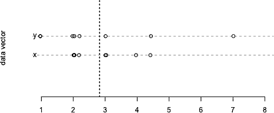

*图 13-3：比较两个假设的数据向量，它们共享相同的算术均值（由垂直虚线标出），但具有不同的扩展幅度。相同的观察值稍微有些抖动。*

样本*方差*衡量了数值观察值围绕算术均值的扩展程度。方差是每个观察值与均值的*平均平方距离*的特殊表示。对于一组标记为 *x* = {*x*[1], *x*[2], ... , *x*[n]} 的 *n* 个数值测量，样本方差 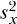由下式给出，其中 *x̄* 是在公式（13.1）中描述的样本均值：

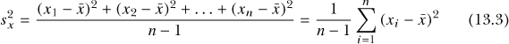

例如，如果你取八个示例观察值 2、4.4、3、3、2、2.2、2、4，它们的样本方差在四舍五入到三位小数后如下（为了可读性，某些项被省略以“...”表示）：

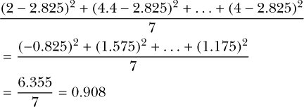

*标准差* 只是方差的平方根。由于方差是平均平方距离的表示，标准差提供了一个可以根据原始观察值的尺度来解释的值。使用相同的符号，对于 *n* 个观察值的样本，样本标准差 *s* 可以通过取公式（13.3）的平方根来计算。

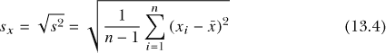

例如，根据之前计算的样本方差，这八个假设观察值的标准差如下（三位小数）：

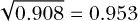

因此，粗略地说，0.953 表示每个观察值与均值的平均距离。

与方差和标准差不同，*四分位差（IQR）* 不是相对于样本均值计算的。四分位差衡量数据“中间 50%”的宽度，也就是说，位于中位数两侧 25%四分位数范围内的值的范围。因此，IQR 是通过计算数据的上四分位数和下四分位数之差来得出的。正式地，当 *Q[x]* ( · ) 表示四分位函数（如 13.2.3 节中定义），IQR 的计算公式为：

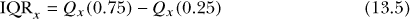

用于计算这些扩展度量的直接 R 命令是 `var`（方差）、`sd`（标准差）和 `IQR`（四分位差）。

```
R> var(xdata)
[1] 0.9078571
R> sd(xdata)
[1] 0.9528154
R> IQR(xdata)
[1] 1.25
```

你可以使用平方根函数`sqrt`来验证样本方差与标准差之间的关系，基于`var`的结果，并可以通过计算第三四分位数和第一四分位数之间的差异来重现 IQR。

```
R> sqrt(var(xdata))
[1] 0.9528154
R> as.numeric(quantile(xdata,0.75)-quantile(xdata,0.25))
[1] 1.25
```

请注意，`as.numeric`（见第 6.2.4 节）会去掉`quantile`返回对象中的百分位标注（默认情况下为结果标注标签）。

现在，对具有与`xdata`相同算术平均值的`ydata`观察进行相同的操作。计算结果如下：

```
R> sd(ydata)
[1] 2.012639
R> IQR(ydata)
[1] 1.6
```

`ydata`与`xdata`在同一尺度上，因此结果验证了你在图 13-3 中看到的内容——即前者的观察数据比后者更加分散。

对于两个快速的最终示例，让我们再次回到`chickwts`和`quakes`数据集。在第 13.2.1 节中，你看到所有小鸡的平均体重为 261.3099 克。你现在可以找到体重的标准差如下：

```
R> sd(chickwts$weight)
[1] 78.0737
```

非正式地说，这意味着每只小鸡的平均体重大约偏离均值 78.1 克（但从技术上讲，记住这仅仅是平方距离函数的平方根——请参见以下注释）。

在第 13.2.3 节中，你使用`summary`来获取`quakes`数据集中某些地震的五数概括。查看这些结果中的第一和第三四分位数（分别为 4.4 和 4.9），你可以快速得出这个子集事件的 IQR 为 0.5。这可以通过使用`IQR`来确认。

```
R> IQR(quakes$mag[quakes$depth<400])
[1] 0.5
```

这给出了在里氏震级单位中，观察数据中间 50%范围的宽度。

**注释**

*这里方差（从而标准差）的定义仅指“样本估计量”，这是 R 的默认设置，使用公式中的 n* − *1 作为除数。这是当手头的观察代表假定的大型总体样本时所使用的公式。在这些情况下，使用除数 n* − *1 更为准确，提供了所谓的*无偏*估计量。因此，你并不完全是在计算“平均平方距离”，尽管可以宽松地认为它是这样，并且随着样本量 n 的增加，确实会接近这种情况。*

**练习 13.3**

1.  使用`chickwts`数据框，计算所有小鸡体重的第 10、第 30 和第 90 百分位数，然后使用`tapply`来确定与体重样本方差最大相关的饲料类型。

1.  转到`quakes`中的地震事件数据，并完成以下任务：

    1.  计算记录深度的四分位距（IQR）。

    1.  查找所有发生在 400 km *或更深*深度的地震事件震级的五数摘要。将其与第 13.2.3 节中发生在 400 km 以下深度的地震事件的五数摘要进行比较，并简要评论你所观察到的差异。

    1.  运用你对`cut`（第 4.3.3 节）的理解，创建一个新的因子向量`depthcat`，它将`quakes$depth`分为四个均匀间隔的类别，确保当你使用`levels(depthcat)`时，得到如下结果：

        ```
        R> levels(depthcat)
        [1] "[40,200)"  "[200,360)" "[360,520)" "[520,680]"
        ```

    1.  查找与`depthcat`每个深度类别相关的地震事件震级的样本均值和标准差。

    1.  使用`tapply`来计算`quakes`中按`depthcat`分组的地震事件震级的 0.8 分位数。

#### ***13.2.5 协方差与相关性***

在分析数据时，能够研究两个数值变量之间的*关系*是很有用的，以便评估趋势。例如，你可能预期身高与体重之间会有明显的正相关关系——身高较高的人往往体重大一些。相反，你可能认为手掌跨度和头发长度之间的关联较小。量化和比较这种关联的最简单和最常见的方式之一就是通过相关性的概念，而这需要协方差的计算。

*协方差*表示两个数值变量是如何“共同变化”的，以及这种关系的性质，无论是正相关还是负相关。假设你有*n*个个体，对于两个变量，分别标记为*x* = {*x*[1], *x*[2], . . . , *x*[n]} 和 *y* = {*y*[1], *y*[2], . . . , *y*[n]}，其中*x[i]*与*y[i]*相对应，*i* = 1, . . . , *n*。样本协方差*r[xy]*的计算公式如下，其中 x̄和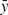分别表示两组观测值的样本均值：

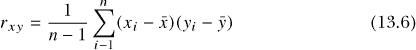

当你得到正值的*r*[xy]时，表示存在正线性关系——即随着*x*的增加，*y*也增加。当你得到负值时，表示存在负线性关系——即随着*x*的增加，*y*减少，反之亦然。当*r[xy]* = 0 时，表示*x*和*y*之间没有线性关系。需要注意的是，公式中变量的顺序并不重要；换句话说，*r[xy]* ≡ *r*[yx]。

为了演示，我们使用原始的八个示例观测值，记作*x* = {2,4.4,3,3,2,2.2,2,4}，以及另外八个观测值，记作*y* = {1,4.4,1,3,2,2.2,2,7}。请记住，*x*和*y*的样本均值均为 2.825。这两组观测值的样本协方差如下（保留三位小数）：

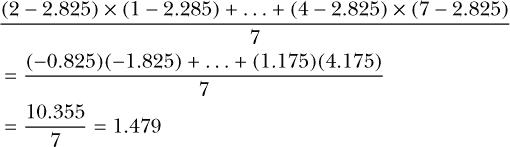

该数字为正值，这表明基于*x*和*y*的观测结果，存在正相关关系。

*相关性*使你能够通过识别任何关联的方向和强度，进一步解释协方差。有不同类型的相关系数，但最常见的是*皮尔逊积矩相关系数*，这是 R 语言中默认实现的相关系数（这是我在本章中使用的估计器）。皮尔逊样本相关系数*ρ*[xy]是通过将样本协方差除以每个数据集的标准差乘积来计算的。形式上，其中*r[xy]*对应于方程式 (13.6)，*s[x]*和*s[y]*对应于方程式 (13.4)，

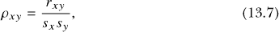

这确保了−1 ≤ *ρ*[xy] ≤ 1。

当*ρ*[xy] = −1 时，存在完全负线性关系。任何小于零的结果表示负相关关系，系数越接近零，关系越弱，直到*ρ*[xy] = 0，表示完全没有关系。当系数大于零时，表示正相关关系，直到*ρ*[xy] = 1，表示完全正线性关系。

如果你采用第 13.2.4 节中已经计算出的*x*和*y*的标准差（*s*[x] = 0.953，*s[y]* = 2.013，精确到小数点后三位），你会发现以下结果（精确到小数点后三位）：

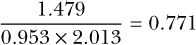

*ρ*[xy]是正数，就像*r*[xy]一样；0.771 的值表示*x*和*y*之间存在中到强的正相关关系。同样，*ρ*[xy] ≡ *ρ*[yx]。

R 命令`cov`和`cor`用于计算样本协方差和相关系数；你只需提供两个相应的数据向量。

```
R> xdata <- c(2,4.4,3,3,2,2.2,2,4)
R> ydata <- c(1,4.4,1,3,2,2.2,2,7)
R> cov(xdata,ydata)
[1] 1.479286
R> cov(xdata,ydata)/(sd(xdata)*sd(ydata))
[1] 0.7713962
R> cor(xdata,ydata)
[1] 0.7713962
```

你可以将这些二元观察值绘制为基于坐标的图（*散点图*——更多示例见第 14.4 节）。执行以下命令会得到图 13-4：

```
R> plot(xdata,ydata,pch=13,cex=1.5)
```


*图 13-4：绘制* `xdata` *和* `ydata` *观察值作为二元数据点，以说明相关系数的解释*

如前所述，相关系数估计两个观测数据集之间*线性*关系的性质，因此，如果你查看图 13-4 中点所形成的模式，并假设画出一条完全直的线来最好地表示所有点，你可以通过这些点与线之间的接近程度来确定线性关联的强度。与完美直线更接近的点，其*ρ*[xy]值会更接近-1 或 1。方向由线条的斜率决定——上升趋势，线条朝右上方倾斜，表示正相关；下降趋势则表现为线条朝右下方倾斜。考虑到这一点，你可以看到，根据之前的计算，图 13-4 中的数据所估计的相关系数是合理的。数据点确实看起来会随着`xdata`和`ydata`的值一起增加，形成一条粗略的直线，但这种线性关联并不完美。如何计算拟合此类数据的“理想”或“最佳”直线将在第二十章中讨论。

为了帮助你理解相关性的概念，图 13-5 展示了不同的散点图，每个图显示 100 个数据点。这些观测值是随机且人工生成的，遵循预设的“真实”*ρ*[xy]值，并在每个图上方标注。

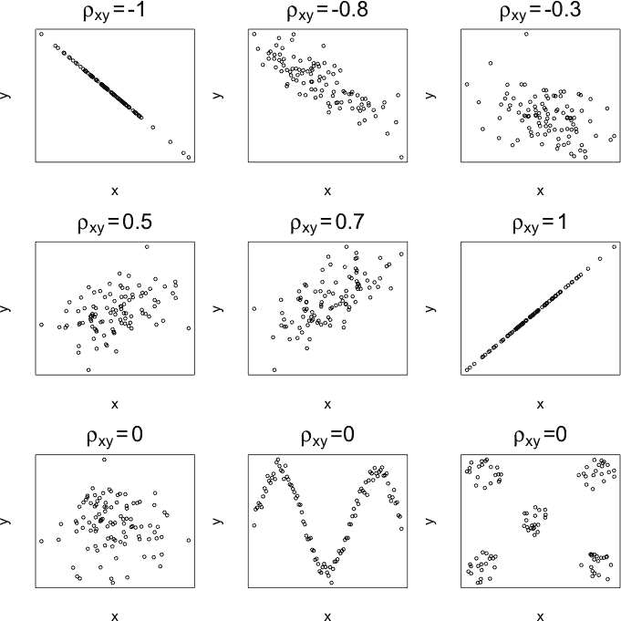

*图 13-5：人工生成的* x *和* y *观测值，用于说明给定的相关系数值*

第一道散点图显示了负相关数据；第二道显示了正相关数据。这些与我们预期看到的结果一致——线条的方向显示了趋势的负相关或正相关，而系数的极值对应于“完美线”的接近程度。

第三行也是最后一行，显示了相关系数为零的数据集，意味着* x*和* y*之间没有线性关系。中间和最右边的图特别重要，因为它们强调了皮尔逊相关系数仅识别“直线”关系的事实；这最后两幅图清楚地显示了某种趋势或模式，但该统计量不能用于检测这种趋势。

为了总结本节内容，再次查看`quakes`数据。两个变量是`mag`（每个事件的震级）和`stations`（报告事件检测的站点数量）。可以通过以下方式绘制`stations`在* y*轴上的数据与`mag`在* x*轴上的数据：

```
R> plot(quakes$mag,quakes$stations,xlab="Magnitude",ylab="No. of stations")
```

图 13-6 展示了这一图像。

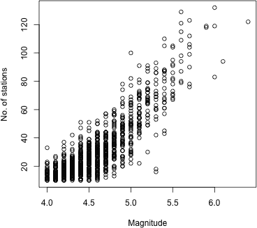

*图 13-6：绘制报告事件的站点数量（* y*）和每个事件的震级（* x*）在`quakes`数据框中的分布图*

通过垂直的图案你可以看到，幅度似乎已被记录到某个特定的精度水平（这与精确测量地震幅度的困难有关）。尽管如此，在散点图中，显然可以看到一个正相关（更多的站点倾向于检测到更大幅度的事件），这一特征通过正协方差得到了确认。

```
R> cov(quakes$mag,quakes$stations)
[1] 7.508181
```

正如你从模式中可以预料到的，皮尔逊相关系数确认了线性关联非常强。

```
R> cor(quakes$mag,quakes$stations)
[1] 0.8511824
```

**注意**

*重要的是要记住，*相关性并不意味着因果关系*。当你检测到两个变量之间有很高的相关效应时，这并不意味着一个*导致*另一个。因果关系在即使是最受控的情况下也很难证明。相关性只是让你测量*关联性*。

如前所述，还有其他相关性的表示方法可以使用；*秩*相关系数，例如斯皮尔曼和肯德尔的相关系数，与皮尔逊的估计不同，因为它们不要求关系是线性的。这些也可以通过`cor`函数访问，通过设置可选的`method`参数（详细信息请参见`?cor`）。然而，皮尔逊相关系数是最常用的，并且与线性回归方法相关，你将在第二十章开始研究这些方法。

#### ***13.2.6 异常值***

*异常值*是一个观察值，它似乎与其余数据“不匹配”。与大多数数据相比，它是一个显著的极端值，换句话说，是一个异常。在某些情况下，你可能怀疑这样的极端观察值并不是来自与其他观察值相同的机制，但没有硬性数值规则来界定什么构成异常值。例如，考虑`foo`中的 10 个假设数据点。

```
R> foo <- c(0.6,-0.6,0.1,-0.2,-1.0,0.4,0.3,-1.8,1.1,6.0)
```

利用第七章的技巧（以及制作图 13-3 的技巧），你可以按照以下方式在一条线上绘制`foo`。

```
R> plot(foo,rep(0,10),yaxt="n",ylab="",bty="n",cex=2,cex.axis=1.5,cex.lab=1.5)
R> abline(h=0,col="gray",lty=2)
R> arrows(5,0.5,5.9,0.1,lwd=2)
R> text(5,0.7,labels="outlier?",cex=3)
```

结果位于图 13-7 的左侧。

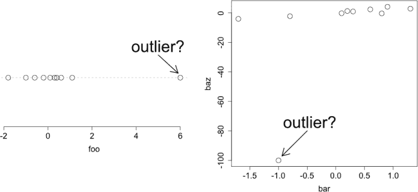

*图 13-7：展示单变量（左）和双变量（右）数据的异常值定义。你是否应该在统计分析中包括这些值？答案可能很难确定。*

从这个图中，你可以看到大多数观察值集中在零附近，但有一个值远在 6 之外。为了给出一个双变量的例子，我将使用两个进一步的向量，`bar`和`baz`，如下所示：

```
R> bar <- c(0.1,0.3,1.3,0.6,0.2,-1.7,0.8,0.9,-0.8,-1.0)
R> baz <- c(-0.3,0.9,2.8,2.3,1.2,-4.1,-0.4,4.1,-2.3,-100.0)
```

我将使用以下代码绘制这些数据；结果位于图 13-7 的右侧。

```
R> plot(bar,baz,axes=T,cex=2,cex.axis=1.5,cex.lab=1.5)
R> arrows(-0.5,-80,-0.94,-97,lwd=2)
R> text(-0.45,-74,labels="outlier?",cex=3)
```

识别异常值非常重要，因为它们可能对任何统计计算或模型拟合产生影响。因此，许多研究人员在计算结果之前，会通过进行“探索性”分析，使用基本的汇总统计和数据可视化工具（比如你将在第十四章中学习到的那些）来尝试识别可能的异常值。

异常值可能是自然发生的，其中异常值是从总体中真实或准确记录的观察值，也可能是非自然发生的，其中某些因素“污染”了样本中的某一贡献，例如数据输入错误。因此，通常会在分析前排除通过非自然来源发生的异常值，但在实践中，这并不总是容易的，因为异常值的原因可能很难确定。在某些情况下，研究人员会同时进行两种分析——展示包括和排除任何被认为是异常值的结果。

考虑到这一点，如果你返回查看图 13-7 中左侧的示例，你会看到当你包含所有观察值时，得到如下结果：

```
R> mean(foo)
[1] 0.49
```

然而，当删除可能的异常值 6（第 10 个观察值）时，得到如下结果：

```
R> mean(foo[-10])
[1] -0.1222222
```

这突显了单个极端观察值可能产生的影响。如果没有关于样本的额外信息，就很难判断是否应该排除异常值 6。类似的效果也能在计算例如`bar`与`baz`的相关系数时观察到，正如图 13-7 右侧所示（再次强调，第 10 个观察值可能是异常值）。

```
R> cor(bar,baz)
[1] 0.4566361
R> cor(bar[-10],baz[-10])
[1] 0.8898639
```

你会发现去除异常值后，相关性变得更强了。同样，判断是否删除异常值在实际中可能很难正确评估。在这个阶段，重要的是要意识到异常值可能对分析的影响，并在进行更严格的统计分析之前，至少对原始数据进行初步检查。

**注释**

*极端观察值对数据分析的影响程度不仅取决于其极端性，还取决于你打算计算的统计量。例如，样本均值对异常值非常敏感，包含或排除异常值会导致其差异很大，因此，任何依赖于均值的统计量，如方差或协方差，也会受到影响。分位数和相关统计量，如中位数或四分位距（IQR），相对不受异常值的影响。在统计学术语中，这种特性被称为*稳健性*。

**练习 13.4**

1.  在练习 7.1 的（b）部分中，第 139 页展示了身高与体重的关系图。请根据这两个变量的观测数据计算相关系数。

1.  R 的另一个内置的、现成可用的数据集是`mtcars`，其中包含了 32 辆汽车的多个性能方面的描述性数据。

    1.  确保你能通过在提示符下输入`mtcars`来访问这个数据框。然后检查它的帮助文件，以了解其中的数据类型。

    1.  两个变量描述了车辆的马力和完成四分之一英里距离的最短时间。使用基础 R 图形，绘制这两个数据向量，马力位于* x *轴上，并计算相关系数。

    1.  确定`mtcars`中对应变速类型的变量。利用你对 R 中因子的知识，从该变量中创建一个名为`tranfac`的新因子，其中手动汽车应标记为`"manual"`，自动汽车标记为`"auto"`。

    1.  现在，使用`ggplot2`中的`qplot`与`tranfac`结合，生成与（ii）相同的散点图，以便你能够在视觉上区分手动和自动汽车。

    1.  最后，基于车辆的变速类型计算马力和四分之一英里时间的相关系数，并将这些估计值与（ii）中的整体值进行比较，简要评论你注意到的内容。

1.  返回`chickwts`以完成以下任务：

    1.  根据仅食向日葵饮食的小鸡体重，绘制如图 13-7 左侧面板所示的图表。注意其中一只向日葵饲养的小鸡的体重比其他小鸡低得多。

    1.  计算向日葵饲养的小鸡体重的标准差和四分位距。

    1.  现在，假设有人告诉你，食向日葵饲养的小鸡的最低体重大概是由某种疾病引起的，而这与您的研究无关。删除此观察值，并重新计算剩余向日葵饲养小鸡的标准差和四分位距。简要评论计算值的差异。

##### **本章重要代码**

| **Function/operator** | **简要描述** | **首次出现** |
| --- | --- | --- |
| `mean` | 算术平均数 | 第 13.2.1 节, 第 268 页 |
| `median` | 中位数 | 第 13.2.1 节, 第 268 页 |
| `table` | 频率表 | 第 13.2.1 节, 第 268 页 |
| `min, max, range` | 最小值和最大值 | 第 13.2.1 节, 第 268 页 |
| `round` | 四舍五入数值 | 第 13.2.2 节, 第 272 页 |
| `quantile` | 分位数/百分位数 | 第 13.2.3 节, 第 274 页 |
| `summary` | 五数概括 | 第 13.2.3 节, 第 275 页 |
| `jitter` | 绘图中的抖动点 | 第 13.2.4 节, 第 276 页 |
| `var, sd` | 方差，标准差 | 第 13.2.4 节, 第 278 页 |
| `IQR` | 四分位距 | 第 13.2.4 节, 第 278 页 |
| `cov, cor` | 协方差，相关性 | 第 13.2.5 节，第 281 页 |
