## 14

**基础数据可视化**


数据可视化是统计分析中的一个重要部分。适合给定数据集的可视化工具取决于你所观察的变量类型（根据第 13.1.1 节和 13.1.2 节的定义）。在本章中，你将了解在统计分析中最常用的数据图，并通过基础 R 图形和`ggplot2`功能的示例来展示。

### 14.1 条形图和饼图

条形图和饼图常用于通过类别频率可视化定性数据。在这一节中，你将学习如何使用 R 生成这两种图表。

#### *14.1.1 构建条形图*

*条形图*绘制的是垂直或水平条形，通常通过空白区域分开，用于根据相关类别可视化频率。尽管原始频率通常会显示出来，条形图也可以用来可视化其他量，例如均值或比例，这些量直接依赖于这些频率。

作为一个示例，让我们使用来自练习 13.4（b）的`mtcars`数据集（位于第 287 页）。该数据集详细描述了 1970 年代中期 32 款经典性能车的各种特征，可以直接从命令行查看前五条记录。

```
R> mtcars[1:5,]
                   mpg cyl disp  hp drat    wt  qsec vs am gear carb
Mazda RX4         21.0   6  160 110 3.90 2.620 16.46  0  1    4    4
Mazda RX4 Wag     21.0   6  160 110 3.90 2.875 17.02  0  1    4    4
Datsun 710        22.8   4  108  93 3.85 2.320 18.61  1  1    4    1
Hornet 4 Drive    21.4   6  258 110 3.08 3.215 19.44  1  0    3    1
Hornet Sportabout 18.7   8  360 175 3.15 3.440 17.02  0  0    3    2
```

`?mtcars`中的文档解释了已记录的变量。其中，`cyl`提供了每个发动机的气缸数——四缸、六缸或八缸。要找出观察到的每种气缸数量的汽车数量，可以使用`table`，如下面所示：

```
R> cyl.freq <- table(mtcars$cyl)
R> cyl.freq
 4 6  8
11 7 14
```

结果可以轻松地显示为条形图，如下所示：

```
R> barplot(cyl.freq)
```

你可以在图 14-1 的左侧找到生成的条形图。

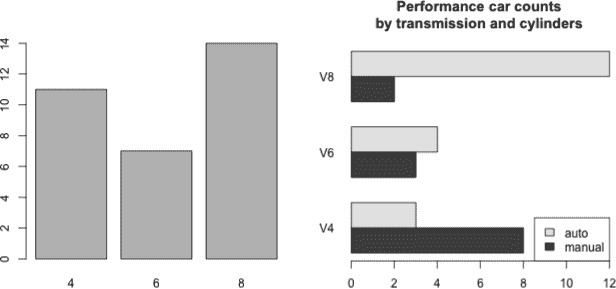

*图 14-1：使用基础 R 图形从`mtcars`数据绘制的两个条形图示例。左侧：最简单的默认版本，使用一个分类变量。右侧：一个“并排”的条形图，展示了各种可视化选项，并使用了两个分类变量。*

该图展示了数据集中四缸、六缸和八缸车的数量，但老实说，这个图表相当无趣，而且没有注释，无法清晰说明总结了什么内容。幸运的是，给这种图表添加注释是很容易的，而且还可以根据一个额外的分类变量进一步分割每个条形的频率。请看以下代码，这次你将根据变速器类型（`am`）来找出与`cyl`相关的计数：

```
R> table(mtcars$cyl[mtcars$am==0])
 4  6  8
 3  4 12

R> table(mtcars$cyl[mtcars$am==1])
4 6 8
8 3 2
```

如果你想生成一个*堆叠的*条形图（即条形垂直分割）或*并排的*条形图（即条形被分开并并排显示），`barplot`的第一个参数需要传入一个合适排列的矩阵。你可以使用`matrix`从之前的两个向量构建它，但继续使用`table`会更简单。

```
R> cyl.freq.matrix <- table(mtcars$am,mtcars$cyl)
R> cyl.freq.matrix

     4 6  8
  0  3 4 12
  1  8 3  2
```

如你所见，通过向`table`传递两个相等长度的分类或离散向量，你可以进行交叉表格计数；第一个向量规定行计数，第二个定义列。结果是一个矩阵对象；在这里它是一个 2 × 3 结构，提供了第一行四缸、六缸和八缸自动挡车的数量，第二行则是手动挡车的数量。规则是，条形图的每一列将对应于提供的矩阵的每一列；这些列会根据提供的矩阵的每一行进一步拆分。图 14-1 右侧的图表就是以下代码的结果：

```
R> barplot(cyl.freq.matrix,beside=TRUE,horiz=TRUE,las=1,
           main="Performance car counts\nby transmission and cylinders",
           names.arg=c("V4","V6","V8"),legend.text=c("auto","manual"),
           args.legend=list(x="bottomright"))
```

帮助文件`?barplot`详细解释了这里的选项。要根据最初传递给`barplot`的矩阵的列变量类别为条形图添加标签，可以使用适当长度的字符向量传递给`names.arg`。选项`beside=TRUE`和`horiz=TRUE`选择一个错开的水平条形图。如果这两个选项都为`FALSE`，则会选择一个堆叠的垂直条形图。参数`las=1`强制垂直轴上的标签水平显示，而不是与其平行。最后两个参数`legend.text`和`args.legend`用于图例——你本可以像在第 7.3 节中一样通过`legend`单独绘制图例，但这种方式会自动分配颜色，以确保参考键与条形本身的精确阴影匹配。

可以使用`ggplot2`生成类似的图表。如果加载已安装的包并输入以下内容，将生成最基础的条形图，如图 14-2 左侧所示：

```
R> qplot(factor(mtcars$cyl),geom="bar")
```

请注意，相关的几何对象是`"bar"`（或者如果单独使用`geom_bar`，如你稍后将看到的那样），并且在`qplot`中默认的映射变量必须作为因子提供（在`mtcars`中，向量`mtcars$cyl`仅为数字类型，这对于`barplot`来说是可以的，但`ggplot2`的功能要求更加严格）。

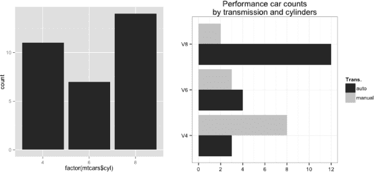

*图 14-2：使用* `ggplot2` *功能展示的来自* `mtcars` *数据的两种条形图示例。左：最简单的* `qplot` *版本，使用一个分类变量。右：一个“错开”的条形图，类似于图 14-1，基于各种附加几何对象和缩放选项的供应。*

同样，你可以根据需要显示的内容创建更复杂的图像。要生成与 14-1 中的“错开”条形图相同的`ggplot2`版本，可以调用以下代码：

```
R> qplot(factor(mtcars$cyl),geom="blank",fill=factor(mtcars$am),xlab="",
         ylab="",main="Performance car counts\nby transmission and cylinders")
         + geom_bar(position="dodge")
         + scale_x_discrete(labels=c("V4","V6","V8"))
         + scale_y_continuous(breaks=seq(0,12,2))
         + theme_bw() + coord_flip()
         + scale_fill_grey(name="Trans.",labels=c("auto","manual"))
```

你可以在图 14-2 右侧找到结果。

请注意，基本的`qplot`设置中增加了许多新的内容。默认映射仍然是按`cyl`，和之前一样。你进一步指定，条形图的填充应根据使用变速器变量`am`创建的因子来填充；因此，每个`cyl`的条形图被指示根据该变量进行拆分。最初对`qplot`的调用是“空”的，意思是`geom="blank"`，因此绘图从向`ggplot2`对象添加`geom_bar`开始。通过`position="dodge"`，它变成了一个偏移条形图；与基本的 R 图形类似，默认行为是生成堆积图。`scale_x_discrete`修饰符指定了每个类别的标签，默认映射为`cyl`；`scale_y_continuous`修饰符则用于控制频率的轴标签。

此外，向对象添加`theme_bw()`会改变图像的视觉主题；在当前的示例中，我选择移除灰色背景，因为它的颜色与手动变速车的条形图颜色过于相似。向对象添加`coord_flip`会翻转坐标轴，提供水平条形图，而不是默认的垂直样式（注意，`scale_`函数的调用是针对未翻转的图像）。`fill`的默认行为是使用颜色，因此你使用`scale_fill_grey`修饰符强制将其设置为灰度，并同时更改自动生成的图例标签，使其匹配。

使用`ggplot2`相对于基本 R 图形的最大优势在于，你不需要手动列出计数或设计这些频率的特定矩阵结构——变量映射会自动完成这一工作。为了练习，我鼓励你尝试修改这个代码示例，省略或修改`qplot`对象中的某些内容，以评估对结果图像的影响。

#### *14.1.2 快速饼图*

古老的*饼图*是另一种可视化频率基础数量在类别变量水平之间的替代方式，通过适当大小的“切片”表示每个类别变量的相对计数。

```
R> pie(table(mtcars$cyl),labels=c("V4","V6","V8"),
       col=c("white","gray","black"),main="Performance cars by cylinders")
```

你可以在图 14-3 中找到结果图。

虽然通过一定的努力可以实现，但`ggplot2`中没有直接的“饼图”几何对象。这至少部分是由于统计学家普遍偏好条形图而非饼图。这一点在帮助文件`?pie`中也有所总结！

饼图是展示信息的一个糟糕方式。人眼擅长判断线性度量，但不擅长判断相对面积。

此外，如果你希望按*第二个*类别变量拆分频率，或者因子水平是有序的，那么条形图比饼图更有价值。

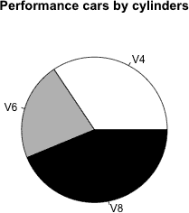

*图 14-3：来自`mtcars`数据框中总气缸频率的饼图*

### 14.2 直方图

条形图在根据类别变量计数观测值时直观易懂，但如果你感兴趣的变量是数值型连续变量时，几乎没有用处。为了可视化连续测量的分布，可以使用*直方图*——这种工具有时会因外观相似而与条形图混淆。直方图同样衡量频率，但在针对数值型连续变量时，首先需要对观察数据进行“分箱”，即定义区间，然后统计落在每个区间内的连续观测值数量。这个区间的大小被称为*分箱宽度*。

作为直方图的一个简单例子，可以考虑`mtcars`数据集中 32 辆车的马力数据，它位于第四列，名为`hp`。

```
R> mtcars$hp
 [1] 110 110 93 110 175 105 245  62  95 123 123 180 180 180 205 215 230  66
[19]  52  65 97 150 150 245 175  66  91 113 264 175 335 109
```

对于本节内容，定义那个时代所有高性能汽车的马力为你的总体，并假设这些观测值代表了从该总体中抽取的一个样本。使用基础 R 图形，`hist`命令接受一个数值型连续观测值的向量，并生成一个直方图，如图 14-4 左侧所示。

```
R> hist(mtcars$hp)
```

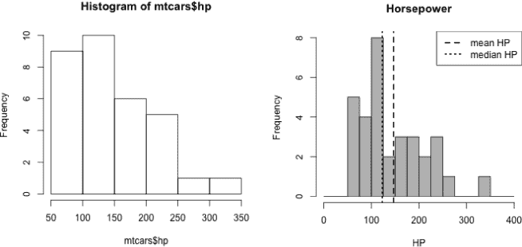

*图 14-4：展示* `hist` *函数在* `mtcars` *马力数据上的默认行为（左）；定制分箱宽度、颜色和标题选项，并添加集中性标记（右）*

你可以立即看到，左侧的直方图使用了 50 个单位的分箱宽度，覆盖了数据的范围，从而为你提供了关于马力测量分布的快速而有用的第一印象。它似乎大致集中在 75 到 150 的范围内，右侧逐渐减少（这被称为*右偏*或*正偏*；更多术语将在第 15.2.4 节中介绍）。

直方图作为测量分布形状的表示的准确性完全取决于用于分箱的区间宽度。`hist`函数通过`breaks`参数控制分箱宽度。你可以通过提供一个向量，给出每个断点，来手动设置这些区间。在下面的代码中，通过将每个分箱的宽度从 50 减小到 25，并略微扩展整体范围，使用等距序列来完成这一操作。

```
R> hist(mtcars$hp,breaks=seq(0,400,25),col="gray",main="Horsepower",xlab="HP")
R> abline(v=c(mean(mtcars$hp),median(mtcars$hp)),lty=c(2,3),lwd=2)
R> legend("topright",legend=c("mean HP","median HP"),lty=c(2,3),lwd=2)
```

该图表展示在图 14-4 的右侧，显示了使用更窄分箱的结果，同时将条形颜色设为灰色并添加了更易读的标题。它还包括表示均值和中位数的垂直线，使用`abline`，并添加了图例（请参阅第 7.3 节）。

使用较小的区间宽度时，数据分布的细节更加清晰。然而，使用更窄的区间有可能突出显示“不重要的特征”（换句话说，直方图中代表由于有限样本大小所产生的自然变异的特征）。这些通常出现在数据稀缺的区间位置。例如，唯一的一辆 335 马力的汽车在右侧的区间产生了一个孤立的条形，但你可能合理地得出结论，认为这并不是该位置的“真实突起”，而是整体人群数据的一个不精确的反映。因此，选择区间宽度时需要注意，这是一种平衡行为。

你需要选择一个合适的宽度，这样可以让你清楚地了解数据分布，而不会因使用过小的区间宽度而强调不重要的细节。换句话说，你也需要避免因使用过*大的*区间宽度而隐藏重要的特征。为了解决这个问题，有一些数据驱动的算法，它们利用记录的观测数据的规模来尝试计算一个合适的平衡区间宽度。你可以为`breaks`提供一个字符字符串，给出你希望使用的算法名称。默认的`breaks="Sturges"`通常表现得很好，尽管在以这种方式探索数据时，尝试少量的替代区间宽度也是值得的。有关此内容和其他使用`breaks`的方法的更多详细信息，文档`?hist`提供了清晰简明的说明。

在`ggplot2`中，区间及其宽度的问题以另一种方式得到强调。默认情况下，当你向`qplot`函数提供一个单一的数值向量但没有为`geom`参数指定值时，它会生成一个直方图。

```
R> qplot(mtcars$hp)
`stat_bin()` using `bins = 30`. Pick better value with `binwidth`.
```

你可以在图 14-5 中找到左侧的结果。然而需要注意的是，`qplot`会向控制台打印关于区间宽度的通知。

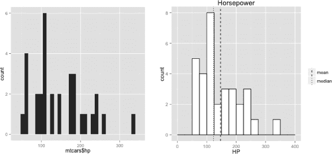

*图 14-5：展示默认的* `qplot` *行为，基于* `mtcars` *的马力数据（左）；定制区间宽度、颜色和标题选项，以及添加中央性标记（右）*

如果你没有明确指定区间，将使用恰好 30 个区间来覆盖数据的范围。通过查看相关的`geom`文档（通过调用`?geom_histogram`）可以得到以下信息：

默认情况下，`stat_bin`使用 30 个区间。这并不是一个理想的默认值，但它的目的是让你开始尝试不同的区间宽度。你可能需要查看几个不同的区间宽度，以揭示数据背后的完整故事。

因此，`ggplot2`鼓励用户意识到问题并主动设置自己的箱宽，而不是默认使用像`hist`这样的数据驱动算法。你可以看到，30 个箱子为此示例提供了不合适的狭窄区间——有很多间隙，那里没有观测值。你可以通过多种方式选择`qplot`中的直方图区间，其中一种是使用`breaks`，像之前一样，给它提供一个适当的数值区间端点向量。为了重新创建图 14-4 右侧的图，使用`ggplot2`功能，使用以下代码，这会生成图 14-5 中的右侧图：

```
R> qplot(mtcars$hp,geom="blank",main="Horsepower",xlab="HP")
     + geom_histogram(color="black",fill="white",breaks=seq(0,400,25),
                      closed="right")
     + geom_vline(mapping=aes(xintercept=c(mean(mtcars$hp),median(mtcars$hp)),
                  linetype=factor(c("mean","median"))),show.legend=TRUE)
     + scale_linetype_manual(values=c(2,3)) + labs(linetype="")
```

从一个“空白”几何对象开始，`geom_histogram`完成了大部分工作，`color`控制条形的轮廓颜色，`fill`控制条形的内部颜色。参数`closed="right"`决定每个区间在右侧是“封闭的”（也就是说，不包括在内），在左侧是“开放的”（也就是说，包括在内），这与`?hist`中注明的默认值相同。`geom_vline`函数用于添加垂直的均值和中位线；在这里，`mapping`必须使用`aes`进行指示，改变这些线的位置。为了确保为均值和中位数创建正确标注的图例，你还必须指示`linetype`在`aes`中映射到所需的值。在这种情况下，这只是一个由两个所需“级别”组成的因子。

由于你是在手动添加这些线条及其相关映射到`ggplot2`对象中，因此必须指示图例本身通过`show.legend=TRUE`来显示。默认情况下，两条线将被绘制为`lty=1`（实线）和`lty=2`（虚线），但是为了与之前的图匹配，你需要`lty=2`和`lty=3`（点线）。你可以添加`scale_linetype_manual`修饰符来进行此更改；所需的线条类型编号作为一个向量传递给`values`。最后，为了抑制自动为你手动添加的图例包含标题，`labs(linetype="")`的添加指示与变量映射到`linetype`的`aes`调用相关的尺度显示时不带标题。

使用`ggplot2`与基本 R 图形的选择通常取决于你的目标。对于自动化处理图形，尤其是在使用分类变量来分割数据集子集的情况下，`ggplot2`特别强大。另一方面，如果你需要手动控制图像的创建，传统的 R 图形可能更容易处理，而且你不需要跟踪多个美学变量映射。

### 14.3 箱型图

一个特别流行的直方图替代品是*箱型图*，或简称*箱线图*。这仅仅是第 13.2.3 节中讨论的五数概括的可视化表示。

#### *14.3.1 独立箱型图*

让我们回到内置的`quakes`数据框，该数据包含了 1000 个发生在斐济附近的地震事件。为了进行比较，你可以使用默认的 R 基础行为检查这些事件的震级的直方图和箱线图。以下代码生成了图 14-6 中给出的图像：

```
R> hist(quakes$mag)
R> boxplot(quakes$mag)
```

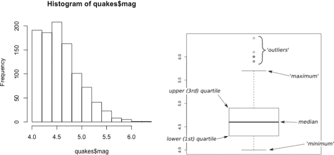

*图 14-6：来自`quakes`的震中数据的默认直方图（左）和箱线图（右）。在箱线图上，外部叠加的注释指出了显示的关键信息。*

类似于直方图，箱线图显示了分布的主要特征，如全局（换句话说，总体）集中性、分散度和偏态。然而，它并不能真正展示局部特征，比如分布中的多个显著峰值。如标签箭头所指，箱体中间的线表示中位数，箱体的上下边缘显示各自的四分位数，从箱体延伸出的垂直线（*胡须*）表示最小值和最大值，任何超出胡须的点被认为是极端值或异常值。默认情况下，`boxplot`将异常值定义为低于下四分位数或高于上四分位数 1.5 倍 IQR 的观测值。这样做是为了防止胡须延伸过远，从而过度强调任何偏态。因此，胡须标记的“最大值”和“最小值”并不总是数据集中的原始整体最大值或最小值，因为被视为“异常值”的数据点实际上可能代表最高或最低值。你可以通过`boxplot`中的`range`参数控制这种分类的性质，尽管默认值`range=1.5`对于基本的数据探索来说通常是合理的。

#### *14.3.2 并排箱线图*

这些图表的一个特别令人愉快的方面是，你可以通过*并排*箱线图轻松比较不同组别的五数总结分布。再次使用`quakes`数据，定义以下对应的因子，并检查前五个元素（如有需要，请参考第 4.3.3 节中`cut`命令的用法）：

```
R> stations.fac <- cut(quakes$stations,breaks=c(0,50,100,150))
R> stations.fac[1:5]
[1] (0,50] (0,50] (0,50] (0,50] (0,50]
Levels: (0,50] (50,100] (100,150]
```

记得，`stations`变量记录了有多少监测站检测到每个事件。该代码生成了一个因子，将这些观测值分为三组——50 个或更少监测站检测到的事件，51 到 100 个监测站检测到的事件，以及 101 到 150 个监测站检测到的事件。因此，你可以根据这三组比较事件震级的分布。以下代码生成了图 14-7 中的左侧图像：

```
R> boxplot(quakes$mag~stations.fac,
           xlab="# stations detected",ylab="Magnitude",col="gray")
```

在这行代码中，你应该注意到新的语法形式，波浪号`~`，在`quakes$mag~stations.fac`中显示。你可以将`~`理解为“按”、“由”或“根据”（你将在第二十章到第二十二章中频繁使用波浪号表示法）。在这里，你指示`boxplot`按照`station.fac`绘制`quakes$mag`，因此每个组都会生成一个单独的箱线图，组内的顺序自然与分组因子的顺序一致。还使用了可选参数来控制轴标签和箱体颜色。你对这个图的解释与在图 13-6 中看到的相同，即记录的震级越高，检测到给定地震事件的台站越多。

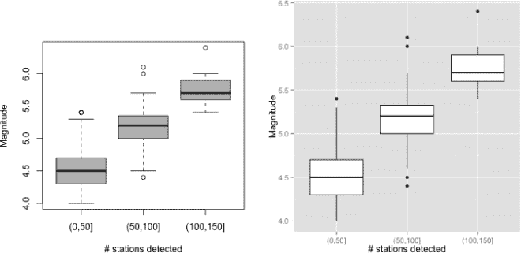

*图 14-7：使用基础 R 图形（左）和`ggplot2`功能（右）绘制的`quakes`震级的并排箱线图，按`station.fac`标识的三组分割*

转向`ggplot2`的功能，`qplot`可以轻松地生成相同类型的图，下面的代码生成了图 14-7 右侧的图像：

```
R> qplot(stations.fac,quakes$mag,geom="boxplot",
         xlab="# stations detected",ylab="Magnitude")
```

默认的箱线图略有不同，但你仍然可以做出相同的解释。在这种`qplot`的使用中，你将箱线图的分组因子作为*X*轴变量（第一个参数），将需要箱线图的连续变量作为*Y*轴变量（第二个参数）。在这里，我显式设置了`geom="boxplot"`以确保显示箱线图，并且添加了轴标签。

### 14.4 散点图

*散点图*最常用于识别两个不同数值连续变量之间的关系，通常显示为*x*-*y*坐标图。基础 R 图形的坐标特性自然适合创建散点图，因此你已经在本书中看到了一些例子。然而，并非每一个基于*x*-*y*坐标的图都被称为散点图；散点图通常假设存在某种“感兴趣的关系”。例如，像图 13-1 这样的空间坐标图可能不被视为散点图，而像图 13-6 中震级与检测到地震事件的台站数量之间的关系图则是。

我将在本章结束时扩展说明如何使用散点图探索多个连续变量。为此，我们来访问另一个现成的 R 数据集，即著名的`iris`数据。该数据集收集于 1930 年代中期，共有 150 行和 5 列，包含了三种多年生鸢尾花的花瓣和萼片的测量数据——*Iris setosa*、*Iris virginica*和*Iris versicolor*（Anderson, 1935; Fisher, 1936）。你可以在这里查看前五条记录：

```
R> iris[1:5,]
  Sepal.Length Sepal.Width Petal.Length Petal.Width Species
1          5.1         3.5          1.4         0.2  setosa
2          4.9         3.0          1.4         0.2  setosa
3          4.7         3.2          1.3         0.2  setosa
4          4.6         3.1          1.5         0.2  setosa
5          5.0         3.6          1.4         0.2  setosa
```

通过查看`?iris`，你可以看到每个物种的每个变量都有 50 个观测值，单位为厘米（cm）。

#### *14.4.1 单个图*

你可以修改简单的散点图，根据分类变量拆分绘制的点，揭示与连续变量相关的任何可见关系之间的潜在差异。例如，使用基本的 R 图形，你可以根据三种物种检查花瓣的测量值。采用第七章中首次介绍的“垫脚石”方法，你可以通过首先使用`type="n"`来生成一个空白的绘图区域，并根据每个物种的情况逐步添加对应的点，按需要调整点的特征和颜色，手动构建该图。

```
R> plot(iris[,4],iris[,3],type="n",xlab="Petal Width (cm)",
        ylab="Petal Length (cm)")
R> points(iris[iris$Species=="setosa",4],
          iris[iris$Species=="setosa",3],pch=19,col="black")
R> points(iris[iris$Species=="virginica",4],
          iris[iris$Species=="virginica",3],pch=19,col="gray")
R> points(iris[iris$Species=="versicolor",4],
          iris[iris$Species=="versicolor",3],pch=1,col="black")
R> legend("topleft",legend=c("setosa","virginica","versicolor"),
          col=c("black","gray","black"),pch=c(19,19,1))
```

你可以在图 14-8 中找到该图。注意，*Iris virginica*物种的花瓣最大，其次是*Iris versicolor*，最小的花瓣属于*Iris setosa*。然而，尽管这段代码可以正常工作，但它相当繁琐。你可以通过首先设置指定每个观测值的点特征和颜色的向量，以更简单的方式生成相同的图像。

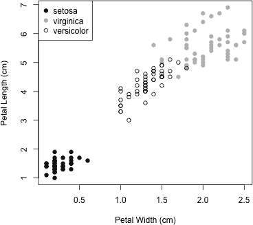

*图 14-8：按物种拆分的花瓣测量值的散点图，来自内置的*`iris`*数据框*

考虑这里创建的两个对象：

```
R> iris_pch <- rep(19,nrow(iris))
R> iris_pch[iris$Species=="versicolor"] <- 1
R> iris_col <- rep("black",nrow(iris))
R> iris_col[iris$Species=="virginica"] <- "gray"
```

第一行创建了一个与`iris`中的观测值数量相等的向量`iris_pch`，每个条目的值为`19`。然后，通过向量子集操作，覆盖了对应*Iris versicolor*的条目，并将点特征设置为`1`。按照相同的步骤创建`iris_col`；首先填充一个适当大小的向量，并将字符字符串`"black"`填入其中，接着覆盖对应*Iris virginica*的条目，将其设置为`"gray"`。这样，注意，接下来的单行代码，配合之前的`legend`调用，将生成一个相同的图：

```
R> plot(iris[,4],iris[,3],col=iris_col,pch=iris_pch,
        xlab="Petal Width (cm)",ylab="Petal Length (cm)")
```

#### *14.4.2 图矩阵*

“单个”类型的平面散点图仅在比较*两个*数值连续变量时非常有用。当涉及更多连续变量时，无法在单个图中令人满意地显示这些信息。一种简单且常见的解决方案是为每一对变量生成一个二变量散点图，并以结构化的方式将它们展示在一起；这种方法被称为*散点矩阵*。利用之前创建的`iris_pch`和`iris_col`向量，你可以为`iris`中的所有四个连续变量生成散点矩阵，并保持物种之间的区分。使用基本的 R 图形，可以使用`pairs`函数。

```
R> pairs(iris[,1:4],pch=iris_pch,col=iris_col,cex=0.75)
```

你可以在图 14-9 中找到该行代码的结果。

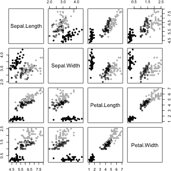

*图 14-9：显示数据框中所有四个连续测量值的散点矩阵*

使用`pairs`最简单的方法是将原始观测值的矩阵或数据框作为第一个参数传递，这里通过选择`iris`的所有列（除了`Species`列，即`iris[,1:4]`）来实现。图表的解释依赖于对角面板的标签，这些面板从左上到右下排列。它们会按照作为第一个参数传递的列的顺序出现。这些“标签面板”可以让你确定矩阵中的每个单独图表对应的是哪一对变量。例如，图 14-9 中的散点图矩阵的第一列对应* x *轴上的萼片长度；矩阵的第三行对应* y *轴上的花瓣长度，每一行和每一列显示的尺度在左右或上下移动时保持不变。这意味着对角线上的图表与对角线下的图表是镜像关系——位于第 4 行第 2 列的花瓣宽度(*y*)与萼片宽度(*x*)的图表显示的数据与位于第 2 行第 4 列的散点图相同，只是坐标轴翻转了。因此，`pairs`包括一个选项，可以仅显示对角线上的*或*下方的散点图，通过设置`lower.panel=NULL`或`upper.panel=NULL`来抑制其中一个。

散点图矩阵因此可以更容易地比较由对多个连续变量进行观测所形成的所有成对关系。在这个矩阵中，注意到花瓣尺寸之间存在强烈的正线性关联，而萼片尺寸之间的关系则较弱。此外，尽管*Iris setosa*可以合理地被认为是花瓣最小的花，但就萼片而言，情况并非如此。

对于使用`ggplot2`的用户，你们知道根据分类变量分割点是很自然的，以下是一个例子。

```
R> qplot(iris[,4],iris[,3],xlab="Petal width",ylab="Petal length",
         shape=iris$Species)
      + scale_shape_manual(values=4:6) + labs(shape="Species")
```

你可以在图 14-10 中找到结果。

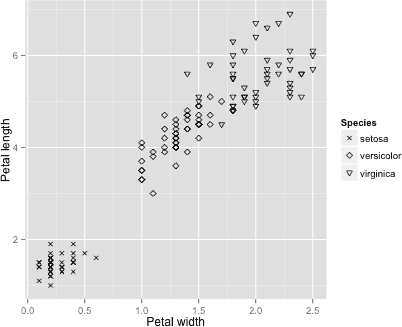

*图 14-10：使用* `ggplot2` *功能绘制三种* `iris` *物种的花瓣尺寸，点的* `shape` *作为美学修饰符*

在这里，我使用映射到`shape`的`Species`变量（相当于 R 基础术语`pch`）将点进行分割，并通过`scale_shape_manual`修饰符修改了点的类型。我还通过`labs`简化了自动生成的图例标题，正如在第 14.2 节中所做的那样。然而，仅使用`ggplot2`无法轻松实现散点图矩阵。为了以`ggplot2`风格生成矩阵，建议下载`GGally`包（Schloerke 等，2014），以访问`ggpairs`函数。该包旨在作为`ggplot2`的扩展或附加功能。可以通过常规方式从 CRAN 安装——例如，运行`install.packages("GGally")`——并且在使用前必须通过`library("GGally")`加载。完成此步骤后，作为一个快速示例，以下代码会生成图 14-11 中的图：

```
R> ggpairs(iris,mapping=aes(col=Species),axisLabels="internal")
```

尽管你可能会看到与直方图箱宽相关的常见警告，但`ggpairs`为这样一行简短的代码提供了令人印象深刻的视觉效果。输出不仅提供了使用`pairs`生成的散点图矩阵的下半部分，还在底部提供了等效的直方图，在右侧提供了箱线图。它还显示了相关系数的估计值。如图所示，你可以将一个变量映射到一个美学修饰符上，根据因子水平分割绘制的观测值。在图 14-11 中，这是通过颜色实现的，并且你指示`ggpairs`操作`Species`变量。在`?ggpairs`中的文档提供了控制各个图形存在与外观的各种选项的简洁信息。

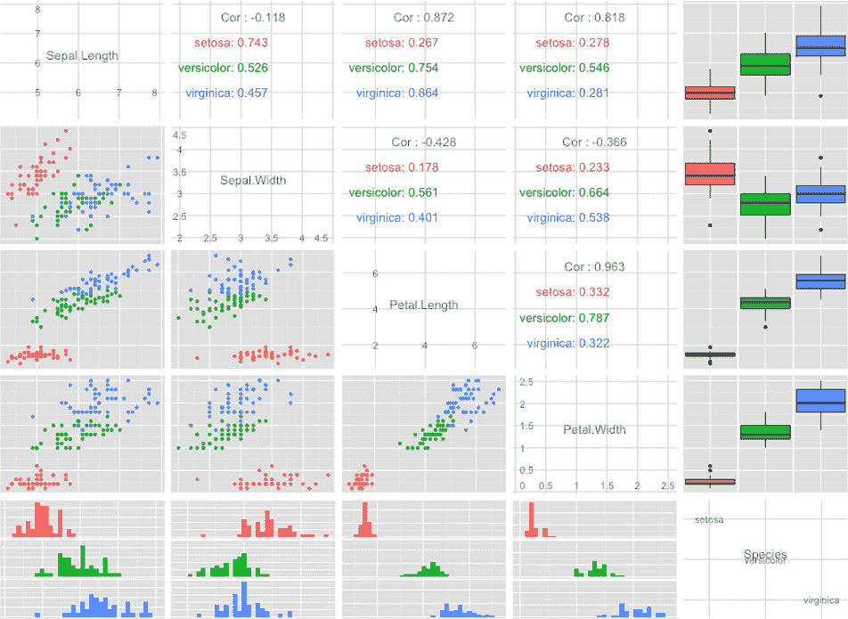

*图 14-11：使用`GGally`包中的`ggpairs`生成散点图矩阵，使用颜色分隔物种。注意增加了估计的相关系数和分布图。*

**练习 14.1**

回顾内置的`InsectSprays`数据框，包含在接受六种不同喷雾处理的各种农业单位上昆虫的计数。

1.  使用 R 基础图形绘制昆虫计数的直方图。

1.  获取每种喷雾处理下发现的昆虫总数（这在练习 13.2（f）中也有要求，见第 273 页）。然后，使用 R 基础图形生成这些总数的垂直条形图和饼图，并适当地标注每个图。

1.  使用`ggplot2`功能生成根据每种喷雾类型的昆虫计数的并排箱线图，并包括适当的轴标签和标题。

R 中另一个有用的现成数据集是`USArrests`，其中包含 1973 年美国 50 个州每 10 万人口中谋杀、强奸和攻击的逮捕人数数据（例如，参见 McNeil, 1977）。它还包括一个变量，给出每个州的城市人口比例。简要检查数据框对象和附带的文档`?USArrests`。然后完成以下操作：

1.  使用`ggplot2`功能生成一个关于各州城市人口比例的右侧排他直方图。将您的断点设置为每 10 个单位，在 0 和 100 之间。直方图显示第一四分位数、中位数和第三四分位数；然后提供一个匹配的图例。根据需要使用颜色，并包括适当的轴注释。

1.  代码`t(as.matrix(USArrests[,-3]))`创建了一个不包含城市人口列的`USArrests`数据矩阵，内置的 R 对象`state.abb`提供了按字母顺序排列的两字母州缩写作为字符向量。使用这两个结构和基本 R 图形，生成一个水平堆叠条形图，水平条形标记有州缩写，每个条形根据犯罪类型（谋杀、强奸和攻击）进行分割。包括一个图例。

1.  定义一个新的因子向量`urbancat`，如果相应的州的城市人口比例大于中位数百分比，则设置为`1`，否则设置为`0`。

1.  在删除`UrbanPop`列后，在您的工作空间中创建`USArrests`的新副本，只留下三个犯罪率变量。然后在此对象中插入一个新的第四列`urbancat`。

1.  使用(g)中的数据框生成一个散点图矩阵和其他相关图，通过`GGally`功能将三种犯罪率相互对比。使用颜色根据`urbancat`的两个级别分割犯罪率。

返回内置的`quakes`数据集。

1.  创建一个与幅度对应的因子向量。每个条目应根据最小幅度、分位数、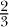分位数和最大幅度标记的断点分为三个类别之一。

1.  重新创建下一个显示的图，根据(i)中的因子向量，绘制低、中、高幅事件，其中`pch`分别分配为`1`、`2`和`3`。

    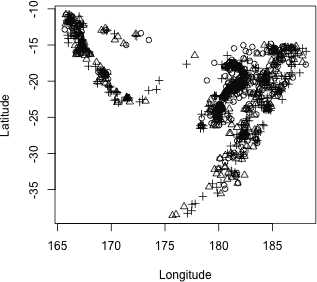

1.  在(j)的图中添加一个图例，引用三个`pch`值。

##### 本章重要代码

| **函数/运算符** | **简要描述** | **首次出现** |
| --- | --- | --- |
| `barplot` | 创建条形图 | 第 14.1.1 节，p. 290 |
| `geom_bar` | 条形图几何对象 | 第 14.1.1 节，p. 292 |
| `scale_x_discrete` | 修改离散的* x *轴（`ggplot2`） | 第 14.1.1 节，第 292 页 |
| `scale_y_continuous` | 修改连续的* y *轴 | 第 14.1.1 节，第 292 页 |
| `theme_bw` | 黑白配色主题 | 第 14.1.1 节，第 292 页 |
| `coord_flip` | 切换* x *轴和* y *轴 | 第 14.1.1 节，第 292 页 |
| `scale_fill_grey` | 填充颜色为灰度色 | 第 14.1.1 节，第 292 页 |
| `pie` | 创建饼图 | 第 14.1.2 节，第 293 页 |
| `hist` | 创建直方图 | 第 14.2 节，第 294 页 |
| `geom_histogram` | 直方图几何对象 | 第 14.2 节，第 297 页 |
| `geom_vline` | 添加垂直线几何对象 | 第 14.2 节，第 297 页 |
| `scale_linetype_manual` | 修改`ggplot2`线条类型 | 第 14.2 节，第 297 页 |
| `labs` | `ggplot2` 图例标签 | 第 14.2 节，第 297 页 |
| `boxplot` | 创建箱线图 | 第 14.3.1 节，第 298 页 |
| `~` | 根据...绘制 | 第 14.3.2 节，第 299 页 |
| `pairs` | 散点图矩阵 | 第 14.4.2 节，第 303 页 |
| `scale_shape_manual` | 修改`ggplot2`点的形状 | 第 14.4.2 节，第 304 页 |
| `ggpairs` | 散点图矩阵（`GGally`） | 第 14.4.2 节，第 304 页 |
