## 第十五章：15

**概率**


*概率*的概念是统计推理的核心。即使是最复杂的统计技术和模型，通常也有一个最终目标，即对某一现象做出概率性的陈述。在本章中，我将通过简单的日常例子来阐述这一关键概念，为接下来的章节做准备。如果你已经熟悉概率和随机变量的基础知识以及相关术语，你可能想跳到第十六章，那里 R 的功能将更为突出。

### 15.1 什么是概率？

*概率*是一个数字，它描述了与做出特定观察或陈述相关的“机会大小”。它始终是一个介于 0 和 1 之间（包括 0 和 1）的数字，通常以分数形式表示。你如何计算概率取决于*事件*的定义。

#### *15.1.1 事件与概率*

在统计学中，*事件*通常指的是可能发生的某个特定结果。为了描述事件*A*实际发生的概率，你使用概率，记作 Pr(*A*)。在极端情况下，Pr(*A*) = 0 意味着*A*不可能发生，而 Pr(*A*) = 1 则意味着*A*会确定无疑地发生。

假设你掷一个六面公平骰子。让*A*表示“你掷出 5 或 6”这一事件。你可以假设，在标准骰子上，每个结果发生的概率是 1/6。基于这些条件，你可以得到：

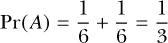

这就是所谓的*频率主义*，或*经典*概率，它假设是事件在多个相同的客观试验中发生的相对频率。

另一个例子是，假设你结婚了，并且比平时晚得多回到家。让*B*表示“你的伴侣因你迟到而生气”这一事件。从数学角度观察*A*是一个相对直接的过程，但*B*就不那么容易客观观察，而且这个量也无法轻易计算。相反，你可能会根据自己过去的经验为 Pr(*B*)赋值。例如，如果你认为你的伴侣生气的概率是 50%，你可能会说“我认为 Pr(*B*) = 0.5”，但这只是基于你对这种情况的个人印象以及对伴侣脾气或情绪的了解，而不是基于一个可以轻松复制的公正实验。这就是所谓的*贝叶斯*概率，它利用先验知识或主观信念来指导计算。

由于其自然隐含的客观性，频率主义的解释通常被视为概率的默认定义；在本书中，你将专注于这种类型的概率。如果你有兴趣了解如何使用 R 进行贝叶斯分析，Kruschke（2010）是一本关于这一主题的广受好评的书籍。

**注意**

*尽管用*可能性*(likelihood)来定义概率概念是很诱人的（在口语中，许多人确实这么做），但在统计理论中，可能性具有稍微不同的含义，因此我现在避免使用这个术语。*

当考虑多个事件时，计算概率的方式由几个重要的规则决定。这些规则与比较逻辑值`TRUE`和`FALSE`时的**与**（AND）和**或**（OR）概念类似，后者在 R 中通过`&&`和`||`进行比较（参见第 4.1.3 节）。就像这些逻辑比较一样，基于多个已定义事件的概率计算通常可以分解为针对两个不同事件的特定计算。为了在接下来的几个部分中作为简单的示例，假设你掷一个标准骰子，事件*A*定义为“你掷出 4 或更大的点数”，事件*B*定义为“你掷出一个偶数”。因此，你可以得出结论，既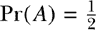又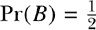。

#### *15.1.2 条件概率*

*条件*概率是指在考虑另一个事件发生后，某个事件发生的概率。数量 Pr(*A*|*B*)表示“在*B*已发生的情况下，*A*发生的概率”，如果你写 Pr(*B*|*A*)，则表示反过来的情况。

如果 Pr(*A*|*B*) = Pr(*A*)，则两个事件是*独立的*；如果 Pr(*A*|*B*) ≠ Pr(*A*)，则两个事件是*相关的*。通常情况下，你不能假设 Pr(*A*|*B*)等于 Pr(*B*|*A*)。

回到之前定义的事件*A*和*B*，假设你掷一个骰子。你已经知道。现在考虑 Pr(*A*|*B*)。在已知掷出的数字是偶数的情况下，掷出 4 或更大数字的概率是多少？由于偶数有三个，2、4 和 6，因此，在偶数已出现的情况下，掷出 4 或更大数字的概率是。因此，Pr(*A*|*B*) ≠ Pr(*A*)，因此这两个事件是相关的。

#### *15.1.3 交集*

两个事件的*交集*写作 Pr(*A* ∩ *B*), 读作“*A*和*B*同时发生的概率”。通常用维恩图来表示这一点，如下所示：

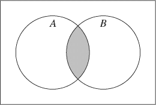

这里，标有*A*的圆盘表示满足*A*的结果（或结果集合），而圆盘*B*表示满足*B*的结果（或结果集合）。阴影区域表示同时满足*A*和*B*的具体结果（或结果集合），而两个圆盘外的区域表示既不满足*A*也不满足*B*的结果（或结果集合）。理论上，你有如下情况：

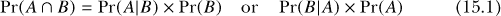

如果 Pr(*A* ∩ *B*) = 0，则表示两个事件是*互斥的*。换句话说，它们不能同时发生。还需要注意的是，如果两个事件是独立的，那么公式（15.1）可以简化为 Pr(*A* ∩ *B*) = Pr(*A*) × Pr(*B*)。

回到骰子的例子，单次掷骰时，出现偶数*并且*它是 4 或以上的概率是多少？利用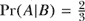和的事实，计算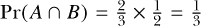是很容易的，如果你愿意，还可以在 R 中验证这一点。

```
R> (2/3)*(1/2)
[1] 0.3333333
```

你可以看到这两个事件不是互斥的，因为 Pr(*A* ∩ *B*) ≠ 0。这是有道理的——在掷骰子时，观察到一个既是偶数又大于等于 4 的数字是完全可能的。

#### *15.1.4 并集*

两个事件的*并集*表示为 Pr(*A* ∪ *B*)，并且可以读作“*A*或*B*发生的概率”。以下是并集的维恩图表示：

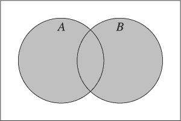

从理论上讲，你有这个：


你需要在这个图中减去交集的原因是，在单独求 Pr(*A*)和 Pr(*B*)时，你会错误地把 Pr(*A* ∩ *B*)计算两次。然而，如果两个事件是互斥的，那么公式(15.2)就简化为 Pr(*A* ∪ *B*) = Pr(*A*) + Pr(*B*)。

所以，在掷骰子时，观察到一个偶数*或者*一个至少为 4 的数字的概率是多少？利用(15.2)公式，很容易计算出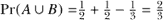。以下是在 R 中验证这一结果：

```
R> (1/2)+(1/2)-(1/3)
[1] 0.6666667
```

#### *15.1.5 补集*

最后，事件的*补集*的概率表示为 Pr(*Ā*)，并且可以读作“*A*不发生的概率”。

这是它的维恩图表示：

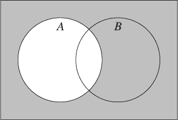

从这个图中，你可以看到以下内容：

Pr(*Ā*) = 1 − Pr(*A*)

总结这个运行例子，很容易找到你不会掷到 4 或更大的数字的概率：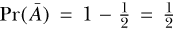。自然地，如果没有掷到 4、5 或 6，那么你一定掷到了 1、2 或 3，所以剩下的六个结果中有三个是可能的。

当然，掷骰子的例子可能并不是今天统计研究者面临的最紧迫的问题，但它提供了概率规则行为和术语的清晰示例。这些规则在各个领域都适用，并在统计建模中的更紧迫任务的解释中起着重要作用。

**习题 15.1**

你有一副标准的 52 张扑克牌。共有两种颜色（黑色和红色）和四种花色（黑桃是黑色，梅花是黑色，红心是红色，方块是红色）。每种花色有 13 张牌，其中包括一张 A，2 到 10 的数字牌，以及三张人头牌（杰克、皇后和国王）。

1.  你随机抽取一张卡片，然后放回。抽到一张 A 的概率是多少？抽到黑桃 4 的概率是多少？

1.  你随机抽一张牌，并在替换后再抽一张。设 *A* 为事件“抽到一张梅花牌”；设 *B* 为事件“抽到一张红牌”。求 Pr(*A*|*B*)。也就是说，第二张牌是梅花牌的概率是多大，*给定* 第一张牌是红牌？这两个事件独立吗？

1.  重复（b）部分，这次假设当第一张（梅花）牌被抽出时，它不会被替换。这会改变你对（b）部分独立性的回答吗？

1.  设 *C* 为事件“抽到一张面牌”，设 *D* 为事件“抽到一张黑色牌”。你抽出一张牌。求 Pr(*C* ∩ *D*)。这两个事件是互斥事件吗？

### 15.2 随机变量与概率分布

*随机变量* 是一种变量，其特定的结果被假定为通过偶然或某种随机的或 *随机过程* 机制产生。

你已经遇到过 *变量* —— 描述个体实体的特征，基于你观察到的数据（第 13.1 节）。然而，当你考虑随机变量时，假设你还没有进行观察。观察到一个特定值，或位于特定区间的值，具有与之相关的概率。

因此，考虑随机变量与定义这些概率的函数相关联是有意义的，这个函数被称为 *概率分布*。在本节中，你将看到一些关于如何总结随机变量及其对应的概率分布如何在统计上处理的基本方法。

#### *15.2.1 实现*

因此，随机变量的概念围绕着以概率的方式考虑变量可能的结果。当你实际观察到一个随机变量时，这些结果被称为 *实现*。

考虑以下情况——假设你掷了你心爱的骰子。定义随机变量 *Y* 为结果。可能的结果是 *Y* = 1, *Y* = 2, *Y* = 3, *Y* = 4, *Y* = 5 和 *Y* = 6。

现在，假设你计划去野餐，并监测你选择的地点的每日最高气温。设随机变量 *W* 为你观察到的温度（华氏度）。严格来说，你可以说 *W* 的可能实现值位于区间 −∞ < *W* < ∞。

这些例子旨在说明两种类型的随机变量。*Y* 是一个 *离散随机变量*；*W* 是一个 *连续随机变量*。任何给定的随机变量是否是离散的还是连续的，都会影响你对与实现相关的概率的思考方式，并可能影响你如何利用这些概率。

#### *15.2.2 离散随机变量*

离散随机变量遵循与第十三章中所述变量相同的定义。其取值只能是某些精确的数值，且无法进一步精确度量或解释。例如，掷标准骰子时，结果只能是先前由 *Y* 描述的六种不同可能性之一，因此，观察到“5.91”是没有意义的。

从第 15.1.1 节中，你知道概率与已定义的结果（即*事件*）直接相关。在讨论离散随机变量时，事件因此是根据变量可以取的不同可能值来定义的，且当考虑与所有可能实现相关的所有概率范围时，相应的概率分布就形成了。

与离散随机变量相关的概率分布称为*概率质量函数*。由于这些函数定义了所有可能结果的概率，因此任何完整的概率质量函数中概率的总和必须始终等于 1。

例如，假设你进入一个赌场并玩一个简单的赌博游戏。在每一轮中，你可能会以 0.32 的概率输掉 4 美元，0.48 的概率不赢也不输（平局），0.15 的概率赢得 1 美元，或 0.05 的概率赢得 8 美元。由于这些是唯一的四种可能结果，因此概率的总和为 1。令离散随机变量 *X* 定义为每轮游戏中的“赚得金额”。这些概率的分布如表 15-1 所示；注意，4 美元的损失被表示为负收入，符合 *X* 的定义。

**表 15-1：** 假设赌博游戏中获得金额 *X* 的概率和累积概率

| ***x*** | **–4** | **0** | **1** | **8** |
| --- | --- | --- | --- | --- |
| Pr(*X* = *x*) | 0.32 | 0.48 | 0.15 | 0.05 |
| Pr(*X* ≤ *x*) | 0.32 | 0.80 | 0.95 | 1.00 |

##### 离散随机变量的累积概率分布

*累积概率*也是概率分布的一部分。对于随机变量 *X*，累积概率是“观察到小于或等于 *x* 的概率”，并写作 Pr(*X* ≤ *x*)。在离散情况下，通过将概率质量函数中的各个概率相加，直到并包括某个给定的 *x* 值，来获得累积概率分布。这在表 15-1 的底部一行中有所展示。例如，尽管 Pr(*X* = 0) 为 0.48，Pr(*X* ≤ 0) = 0.32 + 0.48 = 0.80。

可视化概率分布总是很有用的，由于*X*是离散的，使用`barplot`函数非常方便。运用第 14.1 节中的技巧，以下代码首先存储可能的结果及其相应概率的向量（分别是`X.outcomes`和`X.prob`），然后生成图 15-1 的左图：

```
R> X.outcomes <- c(-4,0,1,8)
R> X.prob <- c(0.32,0.48,0.15,0.05)
R> barplot(X.prob,ylim=c(0,0.5),names.arg=X.outcomes,space=0,
           xlab="x",ylab="Pr(X = x)")
```

可选参数`space=0`可以去除条形之间的间隙。

接下来，你可以使用内建的`cumsum`函数逐步累加`X.prob`中的条目，如下所示，从而获得累积概率：

```
R> X.cumul <- cumsum(X.prob)
R> X.cumul
[1] 0.32 0.80 0.95 1.00
```

最后，使用`X.cumul`，可以像之前一样绘制累积概率分布；以下代码生成了图 15-1 的右面板：

```
R> barplot(X.cumul,names.arg=X.outcomes,space=0,xlab="x",ylab="Pr(X <= x)")
```

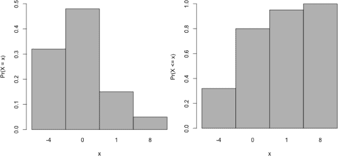

*图 15-1：可视化假设赌博游戏中与事件特定概率相关的概率分布（左）以及相应的累积概率分布（右）*

通常，记住以下几点对于基于离散随机变量*X*的概率质量函数非常重要：

• 有*k*个不同的结果 *x*[1]、...、*x*[k]。

• 对于每个 *x*[i]，其中 *i* = {1, ..., *k*}，0 ≤ Pr(*X* = *x[i]*) ≤ 1。

• 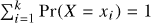。

##### 离散随机变量的均值和方差

描述或总结感兴趣的随机变量的属性就像处理原始数据一样是很有用的。最有用的两个属性是均值和方差，它们都依赖于与该随机变量相关的概率分布。

对于某个离散随机变量*X*，*均值* *μ[X]*（也称为*期望*或*期望值* 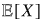[*X*]）是你可以期望在多次实现中得到的“平均结果”。假设*X*有*k*个可能的结果，分别标记为*x*[1]、*x*[2]、...、*x[k]*。那么，公式如下：

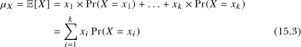

要找到均值，只需将每个结果的数值与其相应的概率相乘，并将结果相加即可。

对于离散随机变量*X*，*方差* 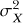，也写作 Var[*X*]，量化了*X*可能实现的变异性。理论上，从期望的角度来看，可以证明 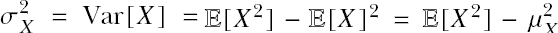。如你所见，离散随机变量方差的计算依赖于其均值*μ[X]*，并给出如下公式：


再次强调，计算过程非常简单——方差是通过对每个实现值与均值的差异进行平方，再乘以对应的发生概率，最后将这些乘积相加来计算的。

实际上，与每个结果相关的概率通常是未知的，需要通过观察数据进行估算。完成这一步后，你应用公式（15.3）和（15.4）来获得相应性质的*估计值*。另外，请注意，均值和方差的一般描述与第 13.2 节中相同——只不过现在你是针对随机现象来量化集中性和离散度。

让我们考虑一下赌博游戏，其中可能的收益实现*X*及其关联的概率如表 15-1 中所示。使用面向向量的行为（参见第 2.3.4 节），使用 R 计算*X*的均值和方差非常容易。通过先前的对象`X.outcomes`和`X.prob`，你可以通过元素间的乘法计算*X*的均值，方法如下：

```
R> mu.X <- sum(X.outcomes*X.prob)
R> mu.X
[1] -0.73
```

所以，*μ[X]* = −0.73。根据同样的逻辑，以下提供了*X*的方差：

```
R> var.X <- sum((X.outcomes-mu.X)²*X.prob)
R> var.X
[1] 7.9371
```

你也可以通过对方差取平方根来计算标准差（回顾第 13.2.4 节中的定义）。这可以通过内置的`sqrt`命令来实现。

```
R> sd.X <- sqrt(var.X)
R> sd.X
[1] 2.817286
```

基于这些结果，你可以对赌博游戏及其结果做出几条评论。期望结果−0.73 表明，平均而言，每回合你将损失 0.73 美元，标准差约为 2.82 美元。这些数量不是，也不需要是，具体定义的结果。它们描述了随机机制在长期运行中的行为。

#### *15.2.3 连续随机变量*

再次根据第十三章中变量的定义，连续随机变量的可能实现数量是没有限制的。对于离散随机变量，通常将一个特定的结果视为一个事件，并为其分配一个相应的概率。然而，当你处理连续随机变量时，情况就有所不同了。如果你以第 15.2.1 节中的野餐例子为例，你会发现，即使你限制假设*W*可能取值的温度范围，比如限制在 40 到 90 华氏度之间（或者，更正式地说，40 ≤ *W* ≤ 90），在这个范围内仍然有无数个不同的值。测量 59.1 度就像观察 59.16742 度一样合理。因此，不可能为具体的单一温度赋予概率；相反，你需要为*区间*的值分配概率。例如，基于*W*，问 Pr(*W* = 55.2)——“温度正好是 55.2 华氏度的概率是多少？”——这个问题是不合法的。然而，问 Pr(*W* ≤ 55.2)——“温度小于或等于 55.2 华氏度的概率是多少？”——则是可以回答的，因为它定义了一个区间。

如果你再次思考概率的分布方式，这会更容易理解。对于离散随机变量，你可以直接想象其质量函数为离散的，即像表 15-1 那样的内容，可以像图 15-1 那样绘制。然而，对于连续随机变量，描述概率分布的函数现在必须是*连续的*，覆盖所有可能的值范围。概率是作为该连续函数下的“面积”计算的，和离散随机变量一样，连续概率分布下的“总面积”必须恰好等于 1。与连续随机变量相关的概率分布被称为*概率密度函数*。

当考虑以下示例时，这些事实会变得更加清晰。假设你被告知与野餐温度随机变量 40 ≤ *W* ≤ 90 相关的概率遵循密度函数*f*（*w*），其中有以下事实成立：

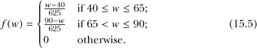

在这个特定函数中，除以 625 是为了确保总概率为 1。将这个函数可视化时，这一点会更容易理解。为了绘制这个密度函数，首先考虑以下代码：

```
R> w <- seq(35,95,by=5)
R> w
 [1] 35 40 45 50 55 60 65 70 75 80 85 90 95
R> lower.w <- w>=40 & w<=65
R> lower.w
 [1] FALSE  TRUE  TRUE  TRUE  TRUE  TRUE  TRUE FALSE FALSE FALSE
[11] FALSE FALSE FALSE
R> upper.w <- w>65 & w<=90
R> upper.w
 [1] FALSE FALSE FALSE FALSE FALSE FALSE FALSE  TRUE  TRUE  TRUE
[11]  TRUE  TRUE FALSE
```

第一个赋值设置了一个偶数值序列，用来表示某些*f*（*w*）的实现，简单地称之为`w`；第二个赋值使用关系运算符和逐元素逻辑运算符`&`来创建一个逻辑标志向量，识别出`w`中那些构成*f*（*w*）的“下半部分”值的元素，这部分值由方程（15.5）定义；第三个赋值做了同样的事情，只不过是针对“上半部分”值。

接下来的几行利用`lower.w`和`upper.w`来评估*f*（*w*）在`w`中的条目的正确结果。

```
R> fw <- rep(0,length(w))
R> fw[lower.w] <- (w[lower.w]-40)/625
R> fw[upper.w] <- (90-w[upper.w])/625
R> fw
 [1] 0.000 0.000 0.008 0.016 0.024 0.032 0.040 0.032 0.024 0.016
[11] 0.008 0.000 0.000
```

这并不意味着你刚刚写了一个 R 语言函数来返回任何*w*的*f*（*w*）。你只是创建了向量`w`并获取了作为向量`fw`的对应数学函数值。然而，这两个向量足以绘制图形。借助第七章中的技巧，你可以绘制一条表示 35 ≤ *w* ≤ 95 区间内连续密度函数*f*（*w*）的曲线。

```
R> plot(w,fw,type="l",ylab="f(w)")
R> abline(h=0,col="gray",lty=2)
```

绘图见图 15-2；注意通过`abline`添加了一个在*f*（*w*）= 0 的虚线水平线。

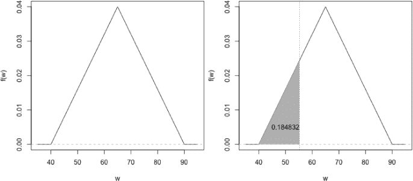

*图 15-2：根据方程（15.5）定义的野餐温度随机变量* W *的概率密度函数的可视化（左）以及从文本中演示特定概率计算的插图（右）*

你可以看到，方程式 (15.5) 定义的连续函数呈三角形形状，顶点位于 *w* = 65。由 *w* = 40 到 *w* = 65 的上升线代表了 (15.5) 中的第一个组成部分，下降线代表第二个组成部分，而对于所有 *w* < 40 和 *w* > 90 的情况，线坐落在零处，这是 (15.5) 的第三个也是最后一个组成部分。

通常，任何定义了随机变量 *W* 概率密度的函数 *f* (*w*) 都必须具备以下属性：

• *f* (*w*) ≥ 0 对于所有 −∞ < *w* < ∞；并且

• 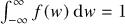（函数下方的总面积必须为 1）。

就温度示例而言，你可以从 (15.5) 看出，对于任何 *w* 值，*f* (*w*) ≥ 0。为了计算函数下方的总面积，你只需关注在 40 ≤ *w* ≤ 90 之间的函数值，因为在其他地方它的值为零。

你可以通过几何方法来计算，由函数与零的水平线围成的三角形的面积。对于这个三角形，你可以使用标准的“半底边乘高”规则。三角形的底边为 90 − 40 = 50，顶点的高度为 0.04。因此，在 R 中，半底边宽度乘以高度可以通过以下公式给出：

```
R> 0.5*50*0.04
[1] 1
```

这确认了它确实等于 1；你现在可以看到我在 (15.5) 中具体定义背后的原因。

让我们回到获取温度小于或等于 55.2 华氏度的概率的问题。为此，你必须找到在 *f*(*w*) 概率密度函数下的区域，该区域由零的水平线和 55.2 处的虚拟垂直线所限定。这个特定的区域形成了另一个三角形，因此再次适合使用“半底边乘高”的规则。在笛卡尔坐标系中，这是由 (40,0)、(55.2,0) 和 (55.2, *f* (55.2)) 这三点形成的三角形，如 图 15-2 右侧面板所示——稍后你会看到如何绘制这一图形。

因此，你应该首先计算 *f* (55.2) 的值。从 方程式 (15.5) 中，这可以通过创建以下对象来提供：

```
R> fw.specific <- (55.2-40)/625
R> fw.specific
[1] 0.02432
```

请注意，这不是一个概率；它不能被赋予特定的实现值。它只是连续密度函数中三角形的高度值，你将需要它来计算基于区间的概率 Pr(*W* ≤ 55.2)。

你可以轻松确定在这种情况下，感兴趣的三角形的底边是 55.2 − 40 = 15.2。然后，结合 `fw.specific`，注意到“半底边乘高”给出了以下结果：

```
R> fw.specific.area <- 0.5*15.2*fw.specific
R> fw.specific.area
[1] 0.184832
```

答案已经得出。你已经通过几何方法，使用 *f*(*w*) 证明了 Pr(*W* ≤ 55.2) = 0.185（四舍五入到三位小数）。换句话说，你可以说，野餐地点的最大温度小于或等于 55.2 华氏度的概率大约是 18.5%。

再次强调，所有这些内容在视觉上更易于理解。以下的 R 代码重新绘制了密度函数*f*（* w *），并标出并填充了感兴趣的区域：

```
R> fw.specific.vertices <- rbind(c(40,0),c(55.2,0),c(55.2,fw.specific))
R> fw.specific.vertices
     [,1]    [,2]
[1,] 40.0 0.00000
[2,] 55.2 0.00000
[3,] 55.2 0.02432
R> plot(w,fw,type="l",ylab="f(w)")
R> abline(h=0,col="gray",lty=2)
R> polygon(fw.specific.vertices,col="gray",border=NA)
R> abline(v=55.2,lty=3)
R> text(50,0.005,labels=fw.specific.area)
```

结果是图 15-2 的右侧面板。绘图命令应该与第七章中的相似，除了`polygon`。内置的`polygon`函数允许你提供自定义的顶点，以便在现有图形上绘制或填充一个多边形。这里，通过`rbind`定义了一个包含两列的矩阵，分别提供了需要填充的三角形三个顶点的* x *和* y *位置（第一列和第二列）。注意，`fw.specific.vertices`的创建使用了`fw.specific`，即* f *（* w *）在* w * = 55.2 时的值；这是被填充三角形的最上方顶点。传递给`polygon`的进一步参数控制着阴影的颜色（`col="gray"`）和是否在定义的多边形周围绘制边框（`border=NA`表示不绘制边框）。

并非所有的密度函数都可以通过这种简单的几何方式来评估。正式来说，*积分*是用于求解连续函数下的面积的数学运算，通常用∫符号表示。也就是说，对于熟悉这一技术的数学爱好者来说，证明“从*w* = 40 到*w* = 55.2 的*f*（* w *）下的面积，即 Pr（*W* ≤ 55.2）”是通过以下公式得到的，应该是简单直观的：

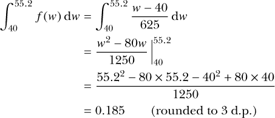

在 R 中，这个计算的第三行看起来是这样的：

```
R> (55.2²-80*55.2-40²+80*40)/1250
[1] 0.184832
```

R 找到了正确的结果。我暂时不讨论数学细节，但确认更一般的积分确实与基于三角形面积的直观几何解相匹配，这是之前计算的`fw.specific.area`。

现在变得更加清晰，为什么将概率分配给与连续随机变量相关的单一特定实现没有意义。例如，在单一值处评估“函数*f*（* w *）下的面积”就等同于找一个底边宽度为*零*的多边形的面积，因此，*任何*Pr（*W* = *w*）的概率本质上是零。此外，在连续设置中，无论你使用<还是≤，或>还是≥，对你的计算结果没有影响。因此，尽管你之前找到了 Pr（*W* ≤ 55.2），如果你的任务是找 Pr（*W* < 55.2），你仍然会得到相同的答案 0.185。最开始这些概念可能看起来有点不自然，但归根结底，这是由于存在无限多个可能的实现，因此对于特定值的“相等”没有实际意义。

##### 连续随机变量的累积分布函数

连续变量的累积分布与离散变量的累积分布解释方式相同。给定某个值 *w*，累积分布函数提供了观察到 *w* 或更小值的概率。这可能看起来很熟悉；你之前计算的概率 Pr(*W* ≤ 55.2)，基于图 15-2 右侧阴影三角形或使用解析方法，实际上就是一个累积概率。更一般地，计算连续随机变量的累积概率时，需要计算从 −∞ 到 *w* 的密度函数下的面积。因此，这一过程通常需要对相关概率密度函数进行数学积分。看图 15-2，你应该想象一条垂直线从密度图的左侧向右移动，并在每个位置上评估该线左侧密度函数下的面积。

对于野餐温度的例子，可以证明累积分布函数 *F* 给出如下：

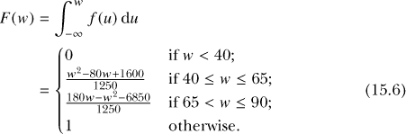

利用之前的序列 `w` 和逻辑标志向量 `lower.w` 与 `upper.w`，你可以使用相同的向量子集和覆盖方法绘制 *F*(*w*)；以下代码创建了所需的向量 `Fw` 并生成了图 15-3：

```
R> Fw <- rep(0,length(w))
R> Fw[lower.w] <- (w[lower.w]²-80*w[lower.w]+1600)/1250
R> Fw[upper.w] <- (180*w[upper.w]-w[upper.w]²-6850)/1250
R> Fw[w>90] <- 1
R> plot(w,Fw,type="l",ylab="F(w)")
R> abline(h=c(0,1),col="gray",lty=2)
```

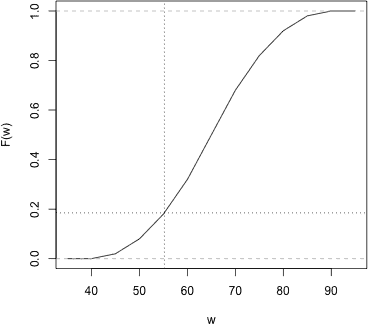

*图 15-3：绘制野餐温度例子的累积分布函数，给出如方程 (15.6)所示。观察到温度小于（或等于）55.2 的累积概率已被标出。*

在创建该图之后，附加这两行清楚地标明了在 *w* = 55.2 时，累积概率恰好位于 *F* 曲线之上：

```
R> abline(v=55.2,lty=3)
R> abline(h=fw.specific.area,lty=3)
```

##### 连续随机变量的均值和方差

自然地，确定连续随机变量的均值和方差也是可能的，并且是有用的。

对于具有密度 *f* 的连续随机变量 *W*，其均值 *μ[W]*（或称为*期望*或*期望值* ）可以解释为在多个实验中你可以期望的“平均结果”。其数学表达式如下：

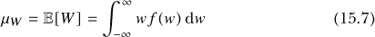

该方程表示方程 (15.3)的连续类比，可以解读为“通过将密度 *f*(*w*) 与 *w* 自身的值相乘得到的函数下的总面积”。

对于 *W*，方差 ，也写作 Var[*W*]，量化了 *W* 实现的固有变异性。计算连续随机变量的方差依赖于其均值 *μ[W]*，其计算公式如下：

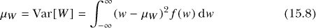

再次说明，步骤是找到密度函数下的面积，并乘以某个量——在这个例子中，是*W*的值与总体期望值*μ[W]*的平方差。

对于野餐温度随机变量的均值和方差的评估必须分别遵循(15.7)和(15.8)公式。这些计算变得相当复杂，因此我不会在这里重复它们。不过，图 15-2 显示，*W*的均值必须是*μ[W]* = 65；它是对称密度函数*f* (*w*)的完美中心。

就所需的积分而言，你可以使用先前存储的`w`和`fw`对象，通过执行以下操作来查看这两个函数，*w f* (*w*)和(*w* − *μ[W]*)² *f* (*w*)，从而生成图 15-4 中的两个图像：

```
R> plot(w,w*fw,type="l",ylab="wf(w)")
R> plot(w,(w-65)²*fw,type="l",ylab="(w-65)² f(w)")
```

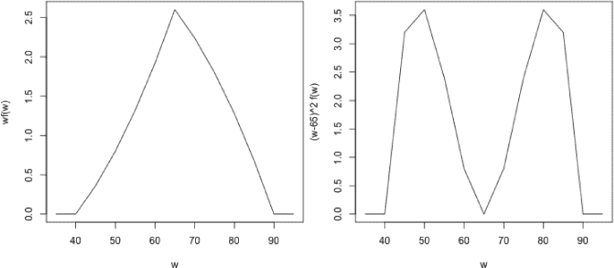

*图 15-4：温度例子中概率密度函数的期望值（左）和方差（右）的积分函数*

请放心，接下来可以通过公式（15.7）和（15.8）进行数学推导。

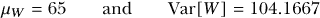

通过在图 15-4 中的每个图像下方近似计算面积，你会发现这些结果是一致的。正如之前所说，*W*的分布的标准差是通过方差的平方根给出的，以下内容可以轻松提供这个值：

```
R> sqrt(104.1667)
[1] 10.20621
```

#### *15.2.4 形态、偏斜与模态*

到目前为止，你已经熟悉了连续和离散随机变量及其与概率分布的自然配对，并且已经看过了概率质量和密度函数分布的可视化图像。在本节中，我将定义一些用于描述这些分布外观的术语——能够描述你的视觉印象和能够迅速计算它们同样重要。

你常常会听到或读到以下这些描述词：

**对称性** 如果一个分布是*对称的*，那么你可以在中心画一条垂直线，且它在该中心线两侧的反射是相等的，且 0.5 的概率分别落在这两侧（见图 15-2）。一个对称的概率分布意味着该分布的均值和中位数是相同的。

**偏斜** 如果一个分布是*非对称的*，你可以通过讨论*偏斜*来进一步描述。 当一个分布的“尾巴”（也就是说，从其集中趋势的度量偏移）在某一方向上比另一方向更长时，就说该分布在这个方向上存在偏斜。*正偏*或*右偏*表示尾巴在中心右侧延伸得更长；*负偏*或*左偏*则表示尾巴在中心左侧延伸得更长。你还可以进一步描述偏斜的强度或显著性。

**峰态** 概率分布不一定总是只有一个峰。*峰态* 描述了感兴趣的分布中易于识别的峰的数量。例如，*单峰*、*双峰* 和 *三峰* 是描述具有一个、两个和三个峰的分布的术语。

图 15-5 提供了对称性、不对称性、偏斜和峰态的视觉解释。（注意，尽管它们是用连续线绘制的，但你可以假设它们代表离散概率质量函数 *或* 连续密度函数的整体形状。）

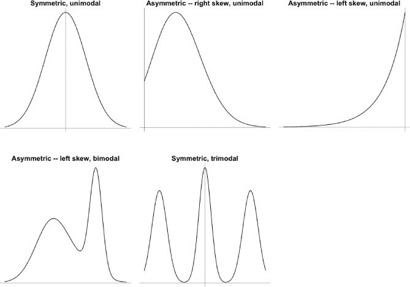

*图 15-5：描述概率分布的术语的一般示例。前三个图像是单峰的，突出了对称与不对称偏斜的概念；底部两个图像强调了峰态的参考。*

你可以使用这些描述符来讨论赌博游戏和野餐温度的概率分布示例。左边在图 15-1 中的 *X* 的质量函数是单峰且不对称的——它似乎有轻微但明显的右偏。给定在图 15-2 中的 *W* 的密度函数也是单峰的，尽管如前所述，它是完全对称的。

**习题 15.2**

1.  对于以下每个定义，识别它是最适合描述为随机变量还是随机变量的*实现*。此外，识别每个陈述是否描述的是连续量还是离散量。

    1.  2016 年 6 月 3 日你附近咖啡店制作的咖啡数量 *x*

    1.  你附近咖啡店在任何给定日子制作的咖啡数量 *X*

    1.  *Y*，明天是否会下雨

    1.  *Z*，明天降水的量

    1.  你桌面上现在有多少块面包屑 *k*？

    1.  任何指定时间你桌面上面包屑的总质量 *W*

1.  假设你构建了下表，提供与随机变量 *S* 相关的概率，这个随机变量表示某位评论家在特定电影类型中给予的总星级：

    | ***s*** | **1** | **2** | **3** | **4** | **5** |
    | --- | --- | --- | --- | --- | --- |
    | **Pr(*S* = *s*)** | 0.10 | 0.13 | 0.21 | ??? | 0.15 |

    1.  假设这个表格描述了完整的结果集，求出缺失的概率 Pr(*S* = 4)。

    1.  获取累积概率。

    1.  随机变量 *S* 的均值是多少？即这位评论家为该类型任何给定的电影预计给予多少颗星？

    1.  随机变量 *S* 的标准差是多少？

    1.  在这个类型中，任何给定的电影至少获得三颗星的概率是多少？

    1.  可视化并简要评论概率质量函数的外观。

1.  返回到基于随机变量 *W* 的野餐温度例子，该随机变量在第 15.2.3 节中定义。

    1.  编写一个 R 函数，根据公式(15.5)返回任意数值向量*w*的*f*(*w*)。尽量避免使用循环，使用面向向量的操作。

    1.  编写一个 R 函数，根据公式(15.6)返回任意数值向量*w*的*F*(*w*)。同样，尽量避免使用显式或隐式的循环。

    1.  使用你在(i)和(ii)中编写的函数来验证文本中的结果，换句话说，验证*f*(55.2) = 0.02432，以及*F*(55.2) = 0.184832。

    1.  使用你为*F*(*w*)编写的函数来计算 Pr(*W* > 60)。提示：注意，由于*f*(*w*)下方的总面积为 1，因此 Pr(*W* > 60) = 1 − Pr(*W* ≤ 60)。

    1.  求解 Pr(60.3 < *W* < 76.89)。

1.  假设以下每个标记为(i)–(iv)的图形展示了概率分布的大致形态。使用第 15.2.4 节中的术语来描述每个图形的形状。

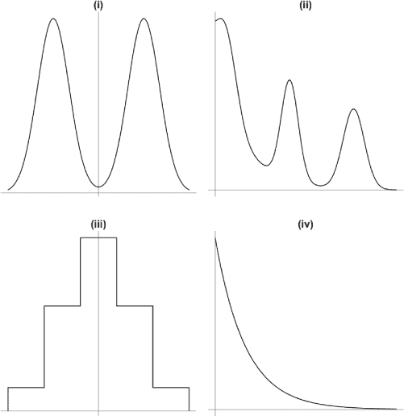

##### 本章重要代码

| **函数/操作符** | **简短描述** | **首次出现** |
| --- | --- | --- |
| `polygon` | 向图形中添加阴影多边形 | 第 15.2.3 节，第 322 页 |
