## 16

**常见的概率分布**


在本章中，你将了解一些用于处理统计建模中常见随机现象的标准概率分布。这些分布遵循与第十五章中所展示的例子相同的自然规则，它们非常有用，因为它们的性质已经得到了广泛的理解和记录。实际上，它们的普遍性如此之强，以至于大多数统计软件包都具有相应的内置功能来评估它们，R 语言也不例外。这些分布中的一些在传统的统计假设检验中扮演了重要角色，这些内容将在第十七章和第十八章中进行探讨。

就像它们所建模的随机变量一样，你在这里将要查看的常见分布大致可分为离散型和连续型。每个分布都有四个核心的 R 函数与之相关——`d`-函数，用于提供特定的质量或密度函数值；`p`-函数，用于提供累积分布概率；`q`-函数，用于提供分位数；以及 `r`-函数，用于提供随机变量生成。

### 16.1 常见的概率质量函数

你将从查看一些常见的离散随机变量的概率质量函数的定义和例子开始。连续分布将在第 16.2 节中进行探讨。

#### *16.1.1 伯努利分布*

*伯努利* 分布是一个离散随机变量的概率分布，它只有两个可能的结果，例如成功或失败。这种类型的变量可以称为 *二元* 或 *二分*。

假设你已经定义了一个二元随机变量 *X*，表示一个事件的成功或失败，其中 *X* = 0 为失败，*X* = 1 为成功，*p* 是已知的成功概率。表 16-1 显示了 *X* 的概率质量函数。

**表 16-1：** 伯努利概率质量函数

| ***x*** | **0** | **1** |
| --- | --- | --- |
| Pr(*X* = *x*) | 1 − *p* | *p* |

从第 15.2.2 节你可以知道，所有可能结果的概率总和必须为 1。因此，如果二元随机变量的成功概率是 *p*，那么唯一的其他可能结果——失败，必须以概率 1 − *p* 发生。

用数学术语表示，对于离散随机变量 *X* = *x*，伯努利质量函数 *f* 为

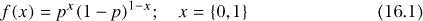

其中 *p* 是分布的一个参数。符号表示

*X* ∼ BERN(*p*)

通常用来表示“*X* 遵循一个参数为 *p* 的伯努利分布。”

以下是需要记住的关键点：

• *X* 是二元的，只能取值 1（“成功”）或 0（“失败”）。

• *p* 应该被理解为“成功的概率”，因此 0 ≤ *p* ≤ 1。

均值和方差分别定义如下：

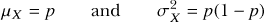

假设你使用掷骰子的常见例子，成功定义为掷出 4 点，并且你掷一次骰子。那么你就有了一个二元随机变量 *X*，它可以通过伯努利分布来建模，成功的概率是 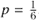。对于这个例子，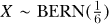。你可以轻松地通过(16.1)得出：

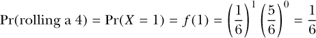

同样地，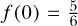也有类似的定义。进一步地，你会得到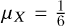和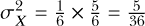。

#### *16.1.2 二项分布*

*二项分布*是描述在 *n* 次试验中成功的分布，这些试验涉及二元离散随机变量。伯努利分布的作用通常是作为更复杂分布（如二项分布）的“构建模块”，这些复杂分布能提供更有趣的结果。

例如，假设你定义了一个随机变量 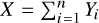，其中 *Y*[1]、*Y*[2]、...、*Y*[n]* 都是每个对应于相同事件的伯努利随机变量，换句话说，就是掷骰子的结果，成功定义为掷出 4 点。新的随机变量 *X* 是伯努利随机变量的和，现在描述的是“在 *n* 次试验中成功的次数”。如果满足某些合理的假设，描述这个成功次数的概率分布就是二项分布。

在数学术语中，对于离散随机变量和一个具体实现 *X* = *x*，二项质量函数 *f* 为：

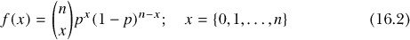

其中


被称为*二项系数*。（回想一下在习题 10.4 中首次讨论的整数阶乘运算符！，见第 203 页）这个系数，也叫做*组合*，表示你可能在 *n* 次试验中观察到 *x* 次成功的所有不同顺序。

二项分布的参数是 *n* 和 *p*，符号表示为

*X* ∼ BIN(*n*, *p*)

通常用来表示 *X* 服从二项分布，进行 *n* 次试验，参数为 *p*。

以下是需要记住的关键点：

• *X* 只能取值 0, 1, ..., *n*，表示成功的总次数。

• *p* 应该理解为“每次试验的成功概率”。因此，0 ≤ *p* ≤ 1，且 *n* > 0 是一个整数，表示“试验的次数”。

• 每次* n * 次试验中的每一项都是伯努利成功或失败事件，试验是独立的（换句话说，一个试验的结果不会影响其他试验的结果），并且*p*是常数。

均值和方差分别定义如下：

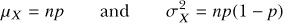

计数重复试验中二值测试的成功次数是本节开头提到的常见随机现象之一。考虑一种特定情况，其中只有一次“试验”，即 *n* = 1。检查方程 (16.2) 和 (16.3)，应该很清楚 (16.2) 会简化为 (16.1)。换句话说，伯努利分布只是二项分布的一个特例。显然，从二项随机变量作为 *n* 个伯努利随机变量之和的定义来看，这一点是有意义的。R 提供了二项分布的相关功能，但并未明确支持伯努利分布。

为了说明这一点，我将回到投掷骰子的例子，其中成功定义为得到 4。如果你独立地掷骰子八次，观察到恰好五次成功（五个 4）的概率是多少？那么，你将得到 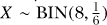，这个概率可以通过 (16.2) 进行数学推导。

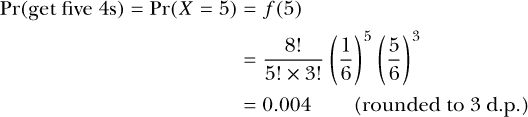

结果告诉你，在八次投掷中恰好观察到五个 4 的概率约为 0.4%。这个概率很小，且合乎常理——在八次投掷中，观察到零到两个 4 的概率远大于观察到五个 4 的概率。

幸运的是，R 函数可以处理这些情况下的运算。内置函数 `dbinom`、`pbinom`、`qbinom` 和 `rbinom` 都与二项分布和伯努利分布相关，并在一个帮助文件中根据这些函数名称进行总结。

• `dbinom` 直接提供任何有效 *x* 的质量函数概率 Pr(*X* = *x*)——即，0 ≤ *x* ≤ *n*。

• `pbinom` 提供累积概率分布——给定一个有效的 *x*，它会输出 Pr(*X* ≤ *x*)。

• `qbinom` 提供*逆*累积概率分布（也称为分布的*分位数函数*）——给定一个有效的概率 0 ≤ *p* ≤ 1，它会输出满足 Pr(*X* ≤ *x*) = *p* 的 *x* 值。

• `rbinom` 用于根据特定的二项分布生成任何数量的 *X* 实现。

##### dbinom 函数

通过这些知识，你可以使用 R 来确认刚才提到的骰子投掷例子的结果 Pr(*X* = 5)。

```
R> dbinom(x=5,size=8,prob=1/6)
[1] 0.004167619
```

对于 `dbinom` 函数，你需要提供感兴趣的具体值作为 `x`；试验的总次数 *n* 作为 `size`；每次试验成功的概率 *p* 作为 `prob`。符合 R 规范，你可以为 `x` 提供一个向量参数。如果你想得到这个例子的 *X* 的完整概率质量函数表，可以将向量 `0:8` 传递给 `x`。

```
R> X.prob <- dbinom(x=0:8,size=8,prob=1/6)
R> X.prob
[1] 2.325680e-01 3.721089e-01 2.604762e-01 1.041905e-01 2.604762e-02
[6] 4.167619e-03 4.167619e-04 2.381497e-05 5.953742e-07
```

这些值可以确认其和为 1。

```
R> sum(X.prob)
[1] 1
```

结果概率向量对应于特定的结果*x* = {0, 1, ..., 8}，以科学计数法形式返回（参见第 2.1.3 节）。你可以通过使用第 13.2.2 节中介绍的`round`函数来整理结果，四舍五入到三位小数，使结果更易于阅读。

```
R> round(X.prob,3)
[1] 0.233 0.372 0.260 0.104 0.026 0.004 0.000 0.000 0.000
```

在八次试验中，成功一次的概率最高，约为 0.372。 此外，*X*的均值（期望值）和方差分别为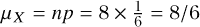和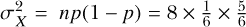。

```
R> 8/6
[1] 1.333333
R> 8*(1/6)*(5/6)
[1] 1.111111
```

你可以像第 15.2.2 节中的例子那样绘制相应的概率质量函数；以下代码生成了图 16-1：

```
R> barplot(X.prob,names.arg=0:8,space=0,xlab="x",ylab="Pr(X = x)")
```

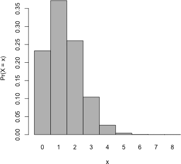

*图 16-1：与掷骰子例子的二项分布相关的概率质量函数*

##### pbinom 函数

其他与二项分布相关的 R 函数的工作方式大致相同。第一个参数始终是感兴趣的值（或值的集合）；*n*被提供为`size`，*p*作为`prob`。例如，要找出你在八次投掷中观察到三次或更少的 4 的概率 Pr(*X* ≤ 3)，你可以像之前那样从`dbinom`中累加相关的单个条目，或者使用`pbinom`。

```
R> sum(dbinom(x=0:3,size=8,prob=1/6))
[1] 0.9693436
R> pbinom(q=3,size=8,prob=1/6)
[1] 0.9693436
```

请注意，`pbinom`的关键参数是标记为`q`，而不是`x`；这是因为在累积的意义上，你是在根据分位数寻找概率。`pbinom`的累积分布结果可以以相同的方式用于寻找“上尾”概率（给定值右侧的概率），因为你知道总的概率质量始终为 1。要找出你在八次掷骰子中至少观察到三次 4 的概率 Pr(*X* ≥ 3)（这在此离散随机变量的上下文中等同于 Pr(*X* > 2)），请注意以下内容能找到正确的结果，因为它是 Pr(*X* ≤ 2)的补集。

```
R> 1-pbinom(q=2,size=8,prob=1/6)
[1] 0.1348469
```

##### qbinom 函数

较少使用的是`qbinom`函数，它是`pbinom`的逆函数。`pbinom`在给定分位值`q`时提供累积概率，而`qbinom`则在给定累积概率`p`时提供分位值。二项随机变量的离散性质意味着`qbinom`将返回`p`所在分位值以下的最近* x *值。例如，注意到

```
R> qbinom(p=0.95,size=8,prob=1/6)
[1] 3
```

提供了 3 作为分位值，尽管从之前的内容你已经知道，Pr(*X* ≤ 3)的确切概率是 0.9693436。 在处理连续概率分布时，你会更多地接触到`p`-和`q`-函数；见第 16.2 节。

##### rbinom 函数

最后，使用 `rbinom` 函数检索二项分布随机变量的实现。再次以 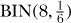 分布为例，请注意以下几点：

```
R> rbinom(n=1,size=8,prob=1/6)
[1] 0
R> rbinom(n=1,size=8,prob=1/6)
[1] 2
R> rbinom(n=1,size=8,prob=1/6)
[1] 2
R> rbinom(n=3,size=8,prob=1/6)
[1] 2 1 1
```

初始参数 `n` 并不代表试验的次数。试验次数仍然通过 `size` 提供，*p* 赋值给 `prob`。在这里，`n` 表示你想为随机变量 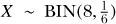 生成的实现次数。前三行每一行请求一个单一的实现——在前八次投掷中，你观察到零次成功（4 点），在第二和第三组八次投掷中，你分别观察到两个和两个 4 点。第四行突出了通过增加 `n` 可以轻松获得和存储多个 *X* 实现并将其作为一个向量的事实。由于这些是*随机生成的实现*，如果你现在运行这些代码，可能会观察到一些不同的值。

尽管在标准统计测试方法中不常使用，但概率分布的 `r-` 函数，无论是离散的还是连续的，在模拟和计算统计学中的各种高级数值算法中起着重要作用。

**练习 16.1**

一个森林自然保护区在一大片土地上分布着 13 个观鸟平台。自然学家声称，在任何时刻，每个平台看到鸟的概率为 75%。假设你在保护区内走动并参观每个平台。如果假设所有相关条件都得到满足，设 *X* 为一个二项分布的随机变量，表示你看到鸟的所有平台数量。

1.  可视化感兴趣的二项分布的概率质量函数。

1.  在所有平台上看到鸟的概率是多少？

1.  在超过 9 个平台上看到鸟的概率是多少？

1.  在 8 到 11 个平台之间（包括 8 和 11）看到鸟的概率是多少？使用 `d`-函数确认你的答案，然后再使用 `p`-函数确认一次。

1.  假设在你访问之前，你决定如果你在不到 9 个站点看到鸟，你就会制造一场骚动并要求退还入场费。你让自己尴尬的概率是多少？

1.  模拟代表 10 次不同访问的 *X* 实现；将你得到的向量存储为一个对象。

1.  计算感兴趣分布的均值和标准差。

#### *16.1.3 泊松分布*

在本节中，你将使用 *泊松* 分布来模拟一个稍微更一般但同样重要的离散随机变量——*计数*。例如，感兴趣的变量可能是某个站点在一年内检测到的地震震动次数，或者某个工厂生产线下来的每平方英尺金属板上的缺陷数量。

重要的是，被计数的事件或项目假设彼此独立地发生。从数学角度来看，对于离散随机变量和一个实现 *X* = *x*，泊松质量函数 *f* 如下所示，其中 *λ*[p] 是分布的一个参数（稍后会进一步解释）：

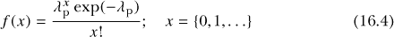

记号

*X* ∼ POIS(*λ*[p])

通常用于表示“*X* 遵循具有参数 *λ*[p] 的泊松分布。”

以下是需要记住的关键点：

• 被计数的实体、特征或事件在一个明确的区间内以恒定的速率独立发生。

• *X* 只能取非负整数：0,1,…。

• *λ*[p] 应解释为“事件发生的均值数量”，因此必须是有限且严格正的；即 0 < *λ*[p] < ∞。

均值和方差如下：

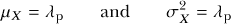

像二项式随机变量一样，泊松随机变量的取值是离散的、非负整数。然而，与二项式不同，泊松计数通常没有上限。这意味着“无限计数”是允许发生的，但泊松分布的一个显著特点是，当 *x* 趋向于无穷大时，与某个值 *x* 相关的概率质量趋近于零。

如方程式 (16.4)所示，任何泊松分布都依赖于单个参数的指定，这里用 *λ*[p] 表示。这个参数描述了事件发生的均值数量，它影响了质量函数的整体形状，如图 16-2 所示。

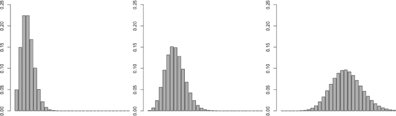

*图 16-2：泊松概率质量函数的三个示例，绘制了 0* ≤ x ≤ *30* 的范围。 “期望计数”参数 *λ*[p] 从 3.00（左）到 6.89（中间）再到 17.20（右）。*

再次需要注意的是，无论 *λ*[p] 的值是多少，总概率质量在所有可能的结果上加和为 1，并且尽管可能的结果理论上可以从 0 到无限，但这一点始终成立。

根据定义，容易理解为什么 *X* 的均值 *μ[X]* 等于 *λ*[p]；实际上，事实证明，泊松分布随机变量的方差也等于 *λ*[p]。

考虑本节开头提到的金属生产线上每平方英尺的缺陷示例。假设你被告知，发现的缺陷数量 *X* 预计遵循泊松分布，且 *λ*[p] = 3.22，即 *X* ∼ POIS(3.22)。换句话说，你期望在每个 1 平方英尺的金属片上看到平均 3.22 个缺陷。

##### dpois 和 ppois 函数

R 中的 `dpois` 函数提供了泊松分布的单个质量函数概率 Pr(*X* = *x*)。`ppois` 函数提供左侧累积分布概率，如 Pr(*X* ≤ *x*)。请参考以下代码行：

```
R> dpois(x=3,lambda=3.22)
[1] 0.2223249
R> dpois(x=0,lambda=3.22)
[1] 0.03995506
R> round(dpois(0:10,3.22),3)
[1] 0.040 0.129 0.207 0.222 0.179 0.115 0.062 0.028 0.011 0.004 0.001
```

第一次调用结果表明 Pr(*X* = 3) = 0.22（保留两位小数）；换句话说，观察到在随机选择的金属片上有恰好三个缺陷的概率约为 0.22。第二次调用表示该金属片没有缺陷的概率小于 4%。第三行返回了相关质量函数的一个近似值，适用于 0 ≤ *x* ≤ 10。你可以手动确认第一个结果，方法如下：

```
R> (3.22³*exp(-3.22))/prod(3:1)
[1] 0.2223249
```

你通过以下方法创建质量函数的可视化：

```
R> barplot(dpois(x=0:10,lambda=3.22),ylim=c(0,0.25),space=0,
           names.arg=0:10,ylab="Pr(X=x)",xlab="x")
```

这显示在图 16-3 的左侧。

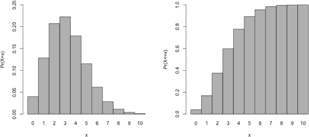

*图 16-3：泊松概率质量函数（左侧）和累积分布函数（右侧），对于* *λ[p] = 3.22* 在整数 0 ≤ x ≤ *10 范围内的绘图，参考金属片示例*

要计算累积结果，你可以使用 `ppois`。

```
R> ppois(q=2,lambda=3.22)
[1] 0.3757454
R> 1-ppois(q=5,lambda=3.22)
[1] 0.1077005
```

这些行的结果显示，观察到至多两个缺陷的概率 Pr(*X* ≤ 2) 约为 0.38，观察到严格超过五个缺陷的概率 Pr(*X* ≥ 6) 约为 0.11。

累积质量函数的可视化展示在右侧的图 16-3，通过以下方法创建：

```
R> barplot(ppois(q=0:10,lambda=3.22),ylim=0:1,space=0,
           names.arg=0:10,ylab="Pr(X<=x)",xlab="x")
```

##### qpois 函数

泊松分布的 `q` 函数 `qpois` 提供了 `ppois` 的逆函数，类似于第 16.1.2 节中的 `qbinom` 提供了 `pbinom` 的逆函数。

##### rpois 函数

要生成随机变量，你可以使用 `rpois`；你需要提供想要生成的变量数 `n`，并且提供重要的参数 `lambda`。你可以想象

```
R> rpois(n=15,lambda=3.22)
[1] 0 2 9 1 3 1 9 3 4 3 2 2 6 3 5
```

就像从生产线上随机选择 15 个 1 平方英尺的金属片，并统计每片上的缺陷数一样。再次强调，这属于随机生成；你的具体结果可能会有所不同。

**练习 16.2**

每个周六，在同一时间，一个人站在路边，记录 120 分钟内经过的车辆数。根据先前的知识，她认为在这段时间内经过的车辆平均数量正好是 107。让 *X* 代表每周六观察到的通过她位置的车辆数的泊松随机变量。

1.  在任何一个周六，超过 100 辆车经过她的概率是多少？

1.  计算没有车经过的概率。

1.  绘制 60 ≤ *x* ≤ 150 范围内相关的泊松质量函数。

1.  从该分布中模拟 260 个结果（大约五年的每周六监测数据）。使用 `hist` 绘制模拟结果；使用 `xlim` 设置横坐标范围为 60 到 150。将你的直方图与（c）部分的质量函数形状进行比较。

#### *16.1.4 其他质量函数*

在 R 内置的统计计算套件中，还有许多其他明确定义的概率质量函数。它们在某些条件下以特定方式对离散随机变量建模，并且至少定义一个参数，且大多数都有自己的`d`-、`p`-、`q`-和`r`-函数。这里我总结了更多的函数：

• *几何*分布统计在成功发生之前失败的次数，并依赖于一个“成功概率参数”`prob`。其函数为`dgeom`、`pgeom`、`qgeom`和`rgeom`。

• *负二项*分布是几何分布的推广，依赖于参数`size`（试验次数）和`prob`。其函数为`dnbinom`、`pnbinom`、`qnbinom`和`rnbinom`。

• *超几何*分布用于建模不放回抽样（换句话说，某次“成功”会改变之后成功的概率），依赖于描述样本项目性质的参数`m`、`n`和`k`。其函数为`dhyper`、`phyper`、`qhyper`和`rhyper`。

• *多项式*分布是二项分布的推广，在每次试验中，成功可以出现在多个类别中的任何一个，其参数为`size`和`prob`（这时，`prob`必须是一个概率向量，表示多个类别的概率）。其内置函数仅限于`dmultinom`和`rmultinom`。

如前所述，一些常见的概率分布只是描述更一般类别分布函数的简化版或特例。

### 16.2 常见概率密度函数

在考虑连续随机变量时，您需要处理概率密度函数。有许多常见的连续概率分布，通常用于各种不同类型的问题。在这一节中，您将了解其中一些分布及其在 R 中的`d`-、`p`-、`q`-和`r`-函数。

#### *16.2.1 均匀分布*

*均匀*分布是一个简单的密度函数，用于描述一个连续的随机变量，其可能值的区间内，概率没有波动。稍后在绘制图 16-4 时，这一点会变得更加清晰。

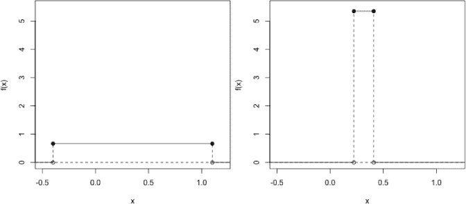

*图 16-4：为了便于比较，将两个均匀分布绘制在相同的尺度上。左：* X ∼ *UNIF(*−*0.4,1.1)；右：* X ∼ *UNIF(0.223,0.410)。每个密度函数下方的总面积，和往常一样，都是 1。*

对于连续随机变量*a* ≤ *X* ≤ *b*，均匀密度函数*f*为：

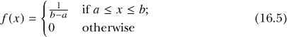

其中*a*和*b*是定义分布可能取值区间的参数。记法：

*X* ∼ UNIF(*a*, *b*)

通常用来表示“*X*服从一个均匀分布，区间为*a*和*b*”。

以下是需要记住的关键点：

• *X*可以取*a*和*b*之间区间中的任何值。

• *a*和*b*可以是任何值，只要*a* < *b*，它们分别表示可能值区间的下限和上限。

均值和方差如下：

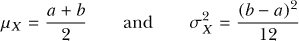

对于本节中的更复杂的密度函数，特别是为了理解与连续随机变量相关的概率结构，形象地展示这些函数非常有用。对于均匀分布，考虑方程（16.5），你可以识别出图 16-4 中显示的两种不同的均匀分布。我会很快提供生成这些类型图形的代码。

对于图 16-4 中的左图，你可以手动确认*X* ∼ UNIF(−0.4,1.1)密度的确切高度：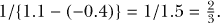。对于右图，基于*X* ∼ UNIF(0.223,0.410)，你可以使用 R 来发现它的高度大约是 5.35。

```
R> 1/(0.41-0.223)
[1] 5.347594
```

##### dunif 函数

你可以使用内置的均匀分布`d`函数`dunif`来返回定义区间内任何值的高度。`dunif`命令对于区间外的值返回零。分布的参数，*a*和*b*，分别作为`min`和`max`的参数提供。例如，下面这一行

```
R> dunif(x=c(-2,-0.33,0,0.5,1.05,1.2),min=-0.4,max=1.1)
[1] 0.0000000 0.6666667 0.6666667 0.6666667 0.6666667 0.0000000
```

在传递给`x`的向量中评估*X* ∼ UNIF(−0.4,1.1)的均匀密度函数。你会注意到，第一个和最后一个值超出了`min`和`max`定义的范围，因此它们的值为零。其他所有值的高度为，如之前计算的那样。

作为第二个例子，下面这一行

```
R> dunif(x=c(0.3,0,0.41),min=0.223,max=0.41)
[1] 5.347594 0.000000 5.347594
```

确认了*X* ∼ UNIF(0.223,0.410)分布的正确密度值，第二个值零，超出了定义的区间。

尤其是这个最新的例子应该提醒你，连续随机变量的概率密度函数与离散变量的质量函数不同，*并不*直接提供概率，正如在第 15.2.3 节中提到的。换句话说，`dunif`返回的结果仅代表各自的密度函数本身，而不是与它们评估的特定*x*值相关的概率。

要基于均匀密度函数计算一些概率，可以使用一个故障钻孔机的例子。在一个木工车间，假设有一台钻孔机在使用时无法保持恒定对准；相反，它会随机地在目标左偏最多 0.4 厘米或右偏最多 1.1 厘米的地方打击目标。让随机变量 *X* ∼ UNIF(−0.4,1.1) 表示钻孔机相对于目标的位置。 图 16-5 在更精细的尺度上重新绘制了图 16-4 中的左图。你有三种版本，每个版本都在密度函数下标出不同的区域：Pr(*X* ≤ −0.21)、Pr(−0.21 ≤ *X* ≤ 0.6) 和 Pr(*X* ≥ 0.6)。

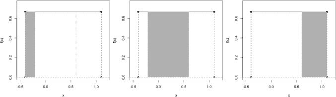

*图 16-5：钻孔机示例下 X ∼ UNIF(−0.4,1.1)密度函数下的三个区域。左：Pr(*X ≤ −0.21*)；中：Pr(*−0.21* ≤ *X* ≤ *0.6*)；右：Pr(*X ≥ 0.6*)。*

这些图是使用第七章中介绍的基于坐标的绘图技巧创建的。密度本身通过以下方式呈现：

```
R> a1 <- -4/10
R> b1 <- 11/10
R> unif1 <- 1/(b1-a1)
R> plot(c(a1,b1),rep(unif1,2),type="o",pch=19,xlim=c(a1-1/10,b1+1/10),
        ylim=c(0,0.75),ylab="f(x)",xlab="x")
R> abline(h=0,lty=2)
R> segments(c(a1-2,b1+2,a1,b1),rep(0,4),rep(c(a1,b1),2),rep(c(0,unif1),each=2),
            lty=rep(1:2,each=2))
R> points(c(a1,b1),c(0,0))
```

你可以使用相同的代码来生成图 16-4 中的图，只需修改`xlim`和`ylim`参数以调整坐标轴的刻度。

你在图 16-5 中添加了表示 *f* (−0.21) 和 *f* (0.6) 的垂直线，使用了另一次`segments`调用。

```
R> segments(c(-0.21,0.6),c(0,0),c(-0.21,0.6),rep(unif1,2),lty=3)
```

最后，你可以使用`polygon`函数来为区域上色，该函数最早在第 15.2.3 节中进行探讨。例如，在图 16-5 中的最左边的图中，使用前面的绘图代码，后跟以下内容：

```
R> polygon(rbind(c(a1,0),c(a1,unif1),c(-0.21,unif1),c(-0.21,0)),col="gray",
           border=NA)
```

如前所述，图 16-5 中的三个阴影区域分别代表从左到右的 Pr(*X* < −0.21)、Pr(−0.21 < *X* < 0.6)和 Pr(*X* > 0.6)。就钻孔机的例子而言，你可以将它们解释为：钻孔机命中目标的概率在左偏 0.21 厘米或更多，钻孔机命中目标的概率在左偏 0.21 厘米到右偏 0.6 厘米之间，和钻孔机命中目标的概率在右偏 0.6 厘米或更多。（记住，在第 15.2.3 节中提到，对于连续随机变量，使用 ≤ 或 <（或 ≥ 或 >）对概率没有影响。）尽管你可以通过几何方法计算这些概率来应对如此简单的密度函数，但使用 R 来计算更快。

##### punif 函数

记住，连续随机变量相关的概率是通过*函数下的面积*来定义的，因此你的研究集中在 *X* 的适当区间，而不是任何特定的数值。密度的 `p`-函数，和离散随机变量的 `p`-函数一样，提供了累积概率分布 Pr(*X* ≤ *x*)。在均匀密度的上下文中，这意味着给定一个特定的 *x* 值（作为“分位数”参数 `q` 提供），`punif` 将提供从该特定值开始的函数下的左侧区域。

访问 `punif`，该行

```
R> punif(-0.21,min=a1,max=b1)
[1] 0.1266667
```

告诉你，图 16-5 中最左侧的区域代表大约 0.127 的概率。该线

```
R> 1-punif(q=0.6,min=a1,max=b1)
[1] 0.3333333
```

告诉你 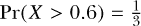。最终结果 Pr(−0.21 < *X* < 0.6)，即 54% 的概率，通过以下公式得到：

```
R> punif(q=0.6,min=a1,max=b1) - punif(q=-0.21,min=a1,max=b1)
[1] 0.54
```

由于第一次调用提供的是从 0.6 开始向左的密度下的面积，而第二次调用提供的是从 −0.21 开始向左的面积。因此，这个差值即为定义中的中间面积。

在使用 R 处理概率分布时，能够操作累积概率结果是非常重要的，初学者可能会觉得在使用 `p`-函数之前，特别是在处理密度函数时，绘制出所需的区域会很有帮助。

##### qunif 函数

密度的 `q`-函数比质量函数使用得更多，因为变量的连续性意味着可以为任何有效的概率 `p` 找到唯一的分位数值。

`qunif` 函数是 `punif` 的逆函数：

```
R> qunif(p=0.1266667,min=a1,max=b1)
[1] -0.21
R> qunif(p=1-1/3,min=a1,max=b1)
[1] 0.6
```

这些行确认了之前用来获取下尾和上尾概率 Pr(*X* < −0.21) 和 Pr(*X* > 0.6) 的 *X* 值。任何 `q`-函数都期待一个*累积*（换句话说，左侧）概率作为它的第一个参数，这就是为什么你需要在第二行提供 `1-1/3` 来恢复 `0.6` 的原因。（总面积为 1。你知道你想要的是 0.6 右侧的区域！image；因此，左侧的区域必须是 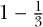。）

##### runif 函数

最后，为了生成特定均匀分布的随机实现，你可以使用 `runif`。假设木工使用故障的压机钻了 10 个独立的孔；你可以通过以下调用来模拟每个孔相对于其目标的位置的一个实例。

```
R> runif(n=10,min=a1,max=b1)
 [1] -0.2429272 -0.1226586  0.9318365 0.4829028 0.5963365
 [6]  0.2009347  0.3073956 -0.1416678 0.5551469 0.4033372
```

再次提醒，像 `runif` 这样的 `r`-函数的具体值每次运行时都会不同。

**练习 16.3**

你参观了一个国家公园，并被告知，森林中某种树木的高度在 3 到 70 英尺之间均匀分布。

1.  遇到一棵比 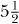 英尺更矮的树的概率是多少？

1.  对于这个概率密度函数，标志着最高 15% 树木的分界点的高度是多少？

1.  计算树高分布的均值和标准差。

1.  使用（c），确认树高在均值的半个标准差范围内（即高于或低于）出现的概率大约为 28.9%。

1.  密度函数本身的高度是多少？请在图中显示它。

1.  模拟 10 个观察到的树高。根据这些数据，使用 `quantile`（参考第 13.2.3 节）估计你在（b）中得到的答案。重复你的模拟，这次生成 1,000 个随机变量，再次估计（b）。做几次这个实验，每次都记录下你的两个估计值（一个基于 10 个随机变量，另一个基于 1,000 个）。总的来说，你会注意到你两个估计值（一个基于 10 个随机变量，一个基于 1,000 个随机变量）与（b）中的“真实”值之间有什么不同吗？

#### *16.2.2 正态分布*

*正态分布* 是建模连续随机变量时最著名和最常用的概率分布之一。它的特点是具有独特的“钟形”曲线，也叫做 *高斯* 分布。

对于连续随机变量 −∞ < *X* < ∞，正态密度函数 *f* 为

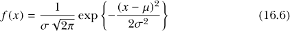

其中 *μ* 和 *σ* 是分布的参数，*π* 是熟悉的几何常数 3.1415 ...，而 exp{·} 是指数函数（参考第 2.1.2 节）。该符号

*X* ∼ N(*μ*, *σ*)

常用来表示“*X* 服从均值为 *μ* 和标准差为 *σ* 的正态分布”。

以下是需要记住的关键点：

• 理论上，*X* 可以取从 −∞ 到 ∞ 的任何值。

• 如前所述，参数 *μ* 和 *σ* 直接描述了分布的均值和标准差，后者的平方，*σ*²，就是方差。

• 在实际应用中，均值参数是有限的 −∞ < *μ* < ∞，标准差参数严格为正且有限 0 < *σ* < ∞。

• 如果你有一个随机变量 *X* ∼ N(*μ*, *σ*)，那么你可以创建一个新的随机变量 *Z* = (*X* − *μ*)/σ，这意味着 *Z* ∼ N(0,1)。这被称为 *标准化* *X*。

之前提到的两个参数完全定义了一个特定的正态分布。这些分布总是完美对称的，单峰的，并且以均值 *μ* 为中心，具有通过标准差 *σ* 定义的“扩展”程度。

图 16-6 的顶部图像展示了四个特定正态分布的密度函数。你可以看到，改变均值会导致分布的平移，其中分布的中心只是简单地移到 *μ* 的特定值上。较小的标准差的效果是减少分布的扩展，导致密度曲线变得更高、更窄。增加 *σ* 会使密度曲线在均值周围变平。

底部的图像聚焦于 N(0,1) 分布，这时你有一个均值为 *μ* = 0，标准差为 *σ* = 1 的正态密度分布。这个分布被称为 *标准正态分布*，常作为标准参考，用来比较不同的正态分布随机变量。通常会将某个变量 *X* ∼ N(*μ[X]*,σ[*X*]) 重新标定或 *标准化* 为一个新的变量 *Z*，使得 *Z* ∼ N(0,1)（你将在 第十八章 中看到这一应用）。图中的垂直线表示均值零上下 1、2、3 倍标准差的值。这有助于突出显示，对于 *任何* 正态分布，精确的 0.5 概率位于均值的上方或下方。此外，注意到，数据落在均值一个标准差以内的概率大约是 0.683，落在从 −2*σ* 到 +2*σ* 的曲线下的概率约为 0.954，落在 −3*σ* 到 +3*σ* 之间的概率约为 0.997。

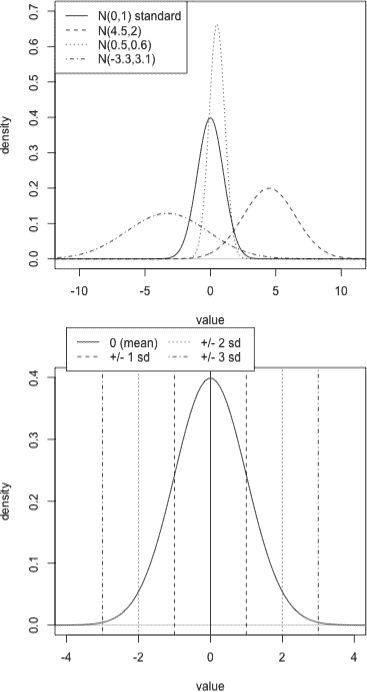

*图 16-6：正态分布示意图。上图：通过改变均值 *μ* 和标准差 *σ* 得到的四种不同的密度情况。下图：标准正态分布 N(0,1)，标出均值 *±1*σ, *±2*σ*, 和 *±3*σ*。

**注意**

*正态密度的数学定义意味着，当你离均值越来越远时，密度函数的值会趋近于零。实际上，任何正态密度函数都永远不会真正触及零的水平线；它只是随着向正无穷或负无穷移动而越来越接近零。这种行为正式被称为* 渐近性*；在这种情况下，你可以说正态分布 f* (*x*) *在 f* (*x*) *= 0* 处有一个水平渐近线。讨论概率作为曲线下的面积时，你可以提到“从负无穷到正无穷曲线下的总面积”是 1，换句话说，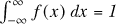。*

##### dnorm 函数

作为一个概率密度函数，`dnorm` 函数本身并不提供概率——它仅仅提供所需正态函数曲线 *f* (*x*) 在任意 *x* 点的值。因此，为了绘制正态密度图，你可以使用 `seq`（参见 第 2.3.2 节）创建一系列细致的 *x* 值，通过 `dnorm` 在这些值处评估密度，然后将结果绘制成一条曲线。例如，为了生成与 图 16-6 底部图像类似的标准正态分布曲线，以下代码将生成所需的 *x* 值，保存在 `xvals` 中。

```
R> xvals <- seq(-4,4,length=50)
R> fx <- dnorm(xvals,mean=0,sd=1)
R> fx
 [1] 0.0001338302 0.0002537388 0.0004684284 0.0008420216 0.0014737603
 [6] 0.0025116210 0.0041677820 0.0067340995 0.0105944324 0.0162292891
[11] 0.0242072211 0.0351571786 0.0497172078 0.0684578227 0.0917831740
[16] 0.1198192782 0.1523049307 0.1885058641 0.2271744074 0.2665738719
[21] 0.3045786052 0.3388479358 0.3670573564 0.3871565916 0.3976152387
[26] 0.3976152387 0.3871565916 0.3670573564 0.3388479358 0.3045786052
[31] 0.2665738719 0.2271744074 0.1885058641 0.1523049307 0.1198192782
[36] 0.0917831740 0.0684578227 0.0497172078 0.0351571786 0.0242072211
[41] 0.0162292891 0.0105944324 0.0067340995 0.0041677820 0.0025116210
[46] 0.0014737603 0.0008420216 0.0004684284 0.0002537388 0.0001338302
```

然后，`dnorm`，其中 *μ* 被指定为 `mean`，*σ* 被指定为 `sigma`，生成在这些 `xvals` 上的 *f*(*x*) 的精确值。最后，像 `plot(xvals,fx,type="l")` 这样的调用实现了一个简单的密度图，你可以通过添加标题并使用 `abline` 和 `segments` 等命令来标记位置（我稍后会再生成另一个图，因此这里没有显示这个基本的图）。

注意，如果你没有为 `mean` 和 `sd` 提供任何值，R 的默认行为是实现标准正态分布；前面显示的对象 `fx` 本可以通过更简短的调用，只用 `dnorm(xvals)` 创建。

##### pnorm 函数

`pnorm` 函数在指定的正态密度下获取左侧概率。与 `dnorm` 一样，如果没有提供参数值，R 会自动设置 `mean=0` 和 `sd=1`。像你在 第 16.2.1 节 中使用 `punif` 一样，你可以通过提供所需的 `q` 参数值，使用 `pnorm` 查找结果的差异，从而找到你想要的区域。

例如，之前提到过，大约 0.683 的概率位于均值的一个标准差范围内。你可以通过对标准正态分布使用 `pnorm` 来确认这一点。

```
R> pnorm(q=1)-pnorm(q=-1)
[1] 0.6826895
```

第一次调用 `pnorm` 评估了从正 1 左侧（换句话说，从 −∞ 到达）的曲线下的面积，然后计算该面积与从 −1 左侧的面积之间的差值。结果反映了 图 16-6 底部两条虚线之间的比例。这些类型的概率对 *任何* 正态分布都是相同的。考虑 *μ* = −3.42 和 *σ* = 0.2 的分布。那么，以下提供了相同的值：

```
R> mu <- -3.42
R> sigma <- 0.2
R> mu.minus.1sig <- mu-sigma
R> mu.minus.1sig
[1] -3.62
R> mu.plus.1sig <- mu+sigma
R> mu.plus.1sig
[1] -3.22
R> pnorm(q=mu.plus.1sig,mean=mu,sd=sigma) -
   pnorm(q=mu.minus.1sig,mean=mu,sd=sigma)
[1] 0.6826895
```

如果要指定感兴趣的分布，需要多一些工作，因为它不是标准的，但原理是相同的：从均值加减一个标准差。

正态分布的对称性在计算概率时也非常有用。以 N(3.42,0.2) 分布为例，可以看到你得到一个大于 *μ* + *σ* = −3.42 + 0.2 = −3.22（一个 *上尾* 概率）的观察值的概率，与得到一个小于 *μ* − *σ* = −3.42 − 0.2 = −3.62（一个 *下尾* 概率）的观察值的概率是相同的。

```
R> 1-pnorm(mu.plus.1sig,mu,sigma)
[1] 0.1586553
R> pnorm(mu.minus.1sig,mu,sigma)
[1] 0.1586553
```

你也可以手动计算这些值，参考你之前计算的结果，即 Pr(μ − *σ* < *X* < *μ* + *σ*) = 0.6826895。剩余的概率 *在* 这个中间区域之外应该是：

```
R> 1-0.6826895
[1] 0.3173105
```

因此，在由 *μ* − *σ* 和 *μ* + *σ* 分别标记的下尾和上尾区域中，必须有如下的概率：

```
R> 0.3173105/2
[1] 0.1586552
```

这就是刚刚使用 `pnorm` 找到的结果（注意，这些计算中可能会有一些小的舍入误差）。你可以在 图 16-7 中看到这个，最初绘制的是以下内容：

```
R> xvals <- seq(-5,-2,length=300)
R> fx <- dnorm(xvals,mean=mu,sd=sigma)
R> plot(xvals,fx,type="l",xlim=c(-4.4,-2.5),main="N(-3.42,0.2) distribution",
        xlab="x",ylab="f(x)")
R> abline(h=0,col="gray")
R> abline(v=c(mu.plus.1sig,mu.minus.1sig),lty=3:2)
R> legend("topleft",legend=c("-3.62\n(mean - 1 sd)","\n-3.22\n(mean + 1 sd)"),
          lty=2:3,bty="n")
```

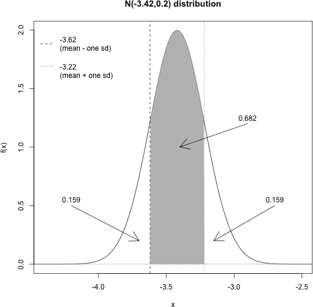

*图 16-7：展示文本中的示例，利用正态分布的对称性来指出曲线下方概率的特征。请注意，密度下方的总面积为 1，结合对称性有助于进行计算。*

要添加*μ* ± *σ*之间的阴影区域，可以使用`polygon`，需要输入感兴趣形状的顶点。为了得到平滑的曲线，可以使用代码中定义的精细序列`xvals`和相应的`fx`，并使用逻辑向量子集来限制关注范围至* x* 的位置，使得 −3.62 ≤ *x* ≤ −3.22。

```
R> xvals.sub <- xvals[xvals>=mu.minus.1sig & xvals<=mu.plus.1sig]
R> fx.sub <- fx[xvals>=mu.minus.1sig & xvals<=mu.plus.1sig]
```

然后，你可以通过使用`polygon`函数所期望的矩阵结构，将这些点夹在阴影多边形底部的两个角落之间。

```
R> polygon(rbind(c(mu.minus.1sig,0),cbind(xvals.sub,fx.sub),c(mu.plus.1sig,0)),
           border=NA,col="gray")
```

最后，`arrows`和`text`表示文本中讨论的区域。

```
R> arrows(c(-4.2,-2.7,-2.9),c(0.5,0.5,1.2),c(-3.7,-3.15,-3.4),c(0.2,0.2,1))
R> text(c(-4.2,-2.7,-2.9),c(0.5,0.5,1.2)+0.05,
        labels=c("0.159","0.159","0.682"))
```

##### qnorm 函数

我们来看看`qnorm`。要找到一个使得下尾概率为 0.159 的分位数值，可以使用以下方法：

```
R> qnorm(p=0.159,mean=mu,sd=sigma)
[1] -3.619715
```

基于之前的结果和你对`q-`函数的了解，应该能清楚为什么结果大约是−3.62。你可以使用以下方法找到上四分位数（即使得概率为 0.25 的值）：

```
R> qnorm(p=1-0.25,mean=mu,sd=sigma)
[1] -3.285102
```

请记住，`q`-函数将根据（左侧）下尾概率进行操作，因此要基于上尾概率找到分位数，必须先从总概率 1 中减去它。

在频率学派统计学中，某些方法和模型假设观察到的数据是正态分布的。你可以通过使用对正态分布理论分位数的了解来验证这一假设，该分位数可以通过`qnorm`函数获得：计算观察数据的分位数范围，并将其与标准化的正态分布的相应分位数进行对比。这种可视化工具被称为正态*分位数-分位数*图或*QQ*图，当与直方图一起查看时特别有用。如果绘制的点没有落在一条直线上，那么数据的分位数与正态曲线的外观不匹配，假设数据符合正态分布可能不成立。

内置的`qqnorm`函数接收原始数据并生成相应的图表。再一次回到现成的`chickwts`数据集。假设你想要检验假设体重是否符合正态分布。为此，你可以使用

```
R> hist(chickwts$weight,main="",xlab="weight")
R> qqnorm(chickwts$weight,main="Normal QQ plot of weights")
R> qqline(chickwts$weight,col="gray")
```

生成图 16-8 中给出的 71 个体重的直方图和正态 QQ 图，见图 16-8。附加的`qqline`命令会添加一条“最优”线，如果数据完全符合正态分布，数据点将沿着这条线排列。

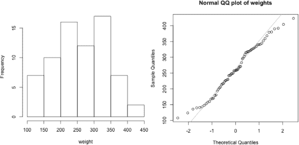

*图 16-8：小鸡体重的直方图（左）和正态 QQ 图（右），来自`chickwts`数据集。数据符合正态分布吗？*

如果你检查权重的直方图，你会发现数据大致符合正态分布的整体外观，呈现出大致对称的单峰特征。也就是说，它并没有完全达到平滑且自然衰减的高度，这种高度会产生我们熟悉的正态钟形曲线。这一点在右侧的 QQ 图中有所反映；中央的分位数值似乎相对较好地位于直线上，除了有一些相对较小的“波动”。在外尾部有一些明显的偏差，但需要注意的是，在任何 QQ 图中，观察到这些极端分位数的偏差是很典型的，因为在这些区域自然会出现较少的数据点。综合考虑所有这些因素，对于这个例子来说，正态性的假设并不完全不合理。

**注意**

*在评估这类假设的有效性时，考虑样本大小非常重要；样本越大，直方图和 QQ 图中的随机变动越小，你可以更有信心地得出数据是否符合正态分布的结论。例如，这个例子中的正态性假设可能会因为样本量较小（只有 71 个样本）而变得复杂。*

##### rnorm 函数

任意给定正态分布的随机变量是通过`rnorm`生成的；例如，以下代码行

```
R> rnorm(n=7,mu,sigma)
[1] -3.764532 -3.231154 -3.124965 -3.490482 -3.884633 -3.192205 -3.475835
```

会生成七个来自 N(−3.42,0.2)的正态分布值。与图 16-8 中小鸡体重的 QQ 图相比，你可以使用`rnorm`、`qqnorm`和`qqline`来检查那些假设上符合正态分布的观测数据集在 QQ 图中的变动程度。

以下代码生成 71 个标准正态值，并生成相应的正态 QQ 图，然后对另一个数据集（*n* = 710）进行相同的操作；这些结果显示在图 16-9 中。

```
R> fakedata1 <- rnorm(n=71)
R> fakedata2 <- rnorm(n=710)
R> qqnorm(fakedata1,main="Normal QQ plot of generated N(0,1) data; n=71")
R> qqline(fakedata1,col="gray")
R> qqnorm(fakedata2,main="Normal QQ plot of generated N(0,1) data; n=710")
R> qqline(fakedata2,col="gray")
```

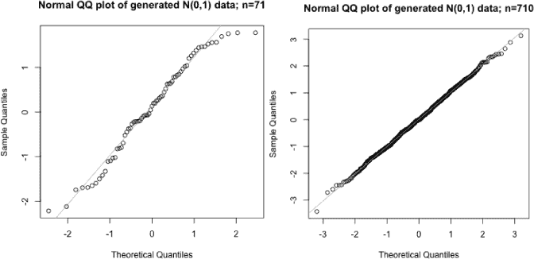

*图 16-9：从标准正态分布随机生成的 71 个（左）和 710 个（右）观测值的正态 QQ 图*

你可以看到，对于模拟数据集（大小为*n* = 71）的 QQ 图，与小鸡体重数据集的偏差相似。将样本量增加十倍后，*n* = 710 的正态观察值的 QQ 图显示出更少的随机变动，尽管尾部的偏差仍然存在。一个很好的方法是多次运行这些代码（换句话说，每次生成新的数据集），并检查每个新的 QQ 图是如何变化的，从而习惯于评估这些影响。

##### 正态函数的应用：一个快速示例

让我们通过一个工作问题结束这一部分。假设某种类型的零食的制造商知道其 80 克标称包装中的零食总净重*X*是正态分布的，平均值为 80.2 克，标准差为 1.1 克。制造商称重随机选取的单个包装内容。随机选取的包装小于 78 克的概率（即 Pr(*X* < 78)）如下：

```
R> pnorm(78,80.2,1.1)
[1] 0.02275013
```

数据包的重量在 80.5 克和 81.5 克之间的概率如下：

```
R> pnorm(81.5,80.2,1.1)-pnorm(80.5,80.2,1.1)
[1] 0.2738925
```

小于下列重量的轻量 20%的数据包如下：

```
R> qnorm(0.2,80.2,1.1)
[1] 79.27422
```

随机选择的五个数据包的模拟结果如下：

```
R> round(rnorm(5,80.2,1.1),1)
[1] 78.6 77.9 78.6 80.2 80.8
```

**练习 16.4**

1.  一名辅导员知道，某种统计学问题的完成时间，对于大一本科生来说，*X*是正态分布的，平均值为 17 分钟，标准差为 4.5 分钟。

    1.  随机选择的本科生完成该问题超过 20 分钟的概率是多少？

    1.  学生完成该问题所需时间在 5 到 10 分钟之间的概率是多少？

    1.  找出标志着最慢 10%的学生的时间。

    1.  绘制感兴趣的正态分布图，范围在±4*σ*之间，并标出概率区域(iii)，即最慢的 10%学生。

    1.  基于 10 名学生完成问题的时间，生成一个时间实现。

1.  一位细心的园丁对他草坪上的草叶长度很感兴趣。他认为草叶长度*X*遵循以 10 毫米为中心，方差为 2 毫米的正态分布。

    1.  找出草叶长度在 9.5 毫米和 11 毫米之间的概率。

    1.  在该分布的背景下，9.5 和 11 的标准化值分别是多少？利用这些标准化值，确认你能用标准正态密度计算出在(i)中找到的相同概率。

    1.  最短的 2.5%的草叶长度低于哪个值？

    1.  将你的答案从(iii)进行标准化。

#### *16.2.3 学生 t 分布*

*学生 t 分布* 是一种连续概率分布，通常用于处理从数据样本中估计的统计数据。它将在接下来的两章中变得尤为重要，因此我在这里先简要解释一下。

任何特定的*t*-分布看起来都像标准正态分布——它是钟形的，对称的，单峰的，并且以零为中心。不同之处在于，正常分布通常用于处理总体数据，而*t*-分布用于处理来自总体的*样本*。

对于* t *分布，你不需要定义任何参数，但你必须通过严格正整数* ν * > 0 来选择合适的* t *分布；这称为*自由度*（df），之所以这样称呼，是因为它表示在计算给定统计量时，“可以自由变化”的个体组件的数量。在接下来的章节中，你会看到这个量通常与样本大小直接相关。

目前，你可以大致把* t *分布看作是一系列曲线的表示，并把自由度看作是你用来选择使用哪一特定版本密度的“选择器”。虽然在初学阶段，* t *分布的精确密度方程并不是特别有用，但记住任何* t *曲线下的总概率自然是 1，这一点是有帮助的。

对于* t *分布，`dt`、`pt`、`qt` 和 `rt` 函数分别代表 R 中的密度函数、累积分布（左侧概率）、分位数和随机变量生成函数。第一个参数 `x`、`q`、`p` 和 `n` 分别提供了这些函数所需的相关值；所有这些函数的第二个参数是 `df`，你必须在其中指定自由度* ν *。

获取* t *分布家族印象的最佳方式是通过可视化。图 16-10 绘制了标准正态分布，以及自由度* ν * = 1，* ν * = 6 和 * ν * = 20 的* t *分布曲线。

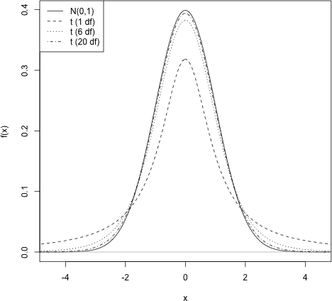

*图 16-10：比较标准正态分布与三种不同自由度的* t *分布。请注意，自由度越高，* t *分布的逼近越接近正态分布。*

从图 16-10 以及这一节中，最重要的要点是，随着自由度的增加，* t *密度函数如何相对于 N(0,1) 分布发生变化。对于接近 1 的小自由度* ν *值，* t *分布在其众数上更短，更多的概率出现在明显更胖的尾部。事实证明，* t *密度随着* ν * → ∞ 而逼近标准正态密度。作为一个例子，注意标准正态分布的上 5%尾部由以下值划定：

```
R> qnorm(1-0.05)
[1] 1.644854
```

相同的* t *分布的上尾部提供了* ν * = 1，* ν * = 6 和 * ν * = 20 的自由度值。

```
R> qt(1-0.05,df=1)
[1] 6.313752
R> qt(1-0.05,df=6)
[1] 1.94318
R> qt(1-0.05,df=20)
[1] 1.724718
```

与标准正态分布直接比较，* t *密度在尾部的较大权重自然导致在给定特定概率时，分位数值更为极端。然而，随着自由度的增加，这种极端性会减少——这与前面提到的事实一致，即* t *分布随着自由度的提高，逼近标准正态分布的效果会越来越好。

#### *16.2.4 指数分布*

当然，概率密度函数不一定像你之前遇到的那样对称，也不需要允许随机变量取值范围从负无穷到正无穷（如正态分布或*t*分布）。一个很好的例子就是*指数分布*，对于这种分布，随机变量*X*的取值仅在 0 ≤ *X* < ∞的范围内有效。

对于连续随机变量 0 ≤ *X* < ∞，指数密度函数*f*为：

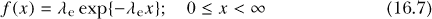

其中*λ*[e]是分布的一个参数，exp{·}是指数函数。记号

*X* ∼ EXP(*λ*[e])

通常用来表示“*X*服从带有速率*λ*[e]的指数分布”。

以下是需要注意的关键点：

• 从理论上讲，*X*可以取值范围为 0 到∞，并且随着*x*的增加，*f*（*x*）会减小。

• “速率”参数必须严格为正；换句话说，*λ*[e] > 0。它定义了*f*（0）和该函数衰减到零水平渐近线的速率。

均值和方差分别如下所示：

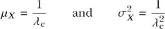

##### dexp 函数

指数分布的密度函数是一条从*f*（0）= *λ*开始的稳定下降的曲线；这一衰减的速率确保曲线下方的总面积为 1。你可以通过下面的代码，使用相关的`d`函数创建图 16-11。

```
R> xvals <- seq(0,10,length=200)
R> plot(xvals,dexp(x=xvals,rate=1.65),xlim=c(0,8),ylim=c(0,1.65),type="l",
        xlab="x",ylab="f(x)")
R> lines(xvals,dexp(x=xvals,rate=1),lty=2)
R> lines(xvals,dexp(x=xvals,rate=0.4),lty=3)
R> abline(v=0,col="gray")
R> abline(h=0,col="gray")
R> legend("topright",legend=c("EXP(1.65)","EXP(1)","EXP(0.4)"),lty=1:3)
```

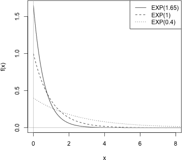

*图 16-11：三种不同的指数密度函数。减小*λ*[e]会降低众数并延长尾部。*

参数*λ*[e]被提供给`rate`参数，在`dexp`函数中进行评估，并传递给第一个参数`x`（通过这个示例中的`xvals`对象）。你可以看到，指数密度函数的一个显著特征是前述的衰减到零，*λ*[e]的较大值意味着更高（但更陡峭和更快速）的下降。

这种自然衰减的行为有助于识别指数分布在应用中的作用——一种“直到事件发生的时间”性质的分布。实际上，指数分布和泊松分布之间有一个特殊的关系，后者在第 16.1.3 节中已介绍。当泊松分布用于建模某一事件在时间上的发生次数时，指数分布则用于建模这些事件之间的时间间隔。在这种情况下，指数分布的参数*λ*[e]定义了事件发生的平均速率。

##### pexp 函数

让我们回顾一下 练习 16.2 中的例子，其中提到在 120 分钟的时间窗口内通过某个人的平均汽车数量为 107。定义随机变量 *X* 为两辆车之间的等待时间，并且使用指数分布来表示 *X*，以分钟为时间尺度，设定 *λ*[e] = 107/120 ≈ 0.89（保留两位小数）。如果通常在两小时的时间窗口内观察到 107 辆车，那么你看到车的平均速率是每分钟 0.89 辆。

因此，你将 *λ*[e] 解释为泊松质量函数中 *λ*[p] 参数的“单位时间”度量。将均值解释为速率的倒数，*μ[X]* = 1/λ[e]，也是直观的。例如，当以每分钟大约 0.89 的速率观察汽车时，注意到两辆车之间的平均等待时间大约是 1/0.89 ≈ 1.12 分钟。

所以，在当前的例子中，你想要检查密度 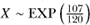。

```
R> lambda.e <- 107/120
R> lambda.e
[1] 0.8916667
```

假设一辆车刚刚通过某个人的位置，你想找出他们必须等待超过两分半钟才能看到下一辆车的概率，换句话说，Pr(*X* > 2.5)。你可以使用 `pexp` 来做到这一点。

```
R> 1-pexp(q=2.5,rate=lambda.e)
[1] 0.1076181
```

这表明你大约有 10% 的机会观察到下辆车出现之前有至少 2 分钟 30 秒的间隔。记住，`p` 函数的默认行为是找到给定值的累计左侧概率，因此你需要从 1 中减去结果，以找到上尾概率。你可以通过以下方式找到等待少于 25 秒的概率，结果大约为 0.31：

```
R> pexp(25/60,lambda.e)
[1] 0.3103202
```

注意需要首先将关注值从秒转换为分钟，因为你通过 *λ*[e] ≈ 0.89 在后者的尺度上定义了 *f* (*x*)。

##### qexp 函数

使用适当的分位数函数 `qexp` 来找到例如最短 15% 等待时间的截止点。

```
R> qexp(p=0.15,lambda.e)
[1] 0.1822642
```

这表明你关注的值大约是 0.182 分钟，换句话说，大约是 0.182 × 60 = 10.9 秒。

和往常一样，你可以使用 `rexp` 来生成任意特定指数分布的随机变量。

**注意**

*重要的是要区分“指数分布”、“指数*族*分布”和“指数*函数*”。前者指的是刚刚研究的密度函数，而后者指的是一个包含泊松分布、正态分布以及指数分布本身的一般概率分布类。第三个则只是标准的数学指数函数，指数族的成员依赖于该函数，并且可以通过 `exp` 在 R 中直接访问。*

**练习 16.5**

1.  位于新西兰中北岛的波胡图间歇泉被称为南半球最大的活跃间歇泉。假设它每年喷发约 3,500 次。

    1.  为了将随机变量 *X* 建模为连续喷发之间的时间，计算时间尺度为天数时的参数值 *λ*[e]（假设每年 365.25 天以考虑闰年）。

    1.  绘制感兴趣的密度函数。两次喷发之间的平均等待时间是多少天？

    1.  等待下次喷发少于 30 分钟的概率是多少？

    1.  定义最长 10%的等待时间是多少？将答案转换为小时。

1.  你也可以使用指数分布来建模某些产品的生存时间，或者“故障时间”类型的变量。假设某个空调设备制造商知道，产品的平均使用寿命为 11 年，之后需要维修。设随机变量 *X* 表示该设备需要维修的时间，并假设 *X* 服从参数 *λ*[e] = 1/11 的指数分布。

    1.  该公司为该设备提供五年的全面维修保修。随机选择的空调用户使用保修服务的概率是多少？

    1.  另一家竞争公司为其空调设备提供六年保修，但知道其设备的平均寿命仅为九年，之后需要维修。使用该保修的概率是多少？

    1.  确定（i）和（ii）中的单位持续超过 15 年的概率。

#### *16.2.5 其他密度函数*

有许多其他常见的概率密度函数广泛用于涉及连续随机变量的各种任务。以下是一些总结：

• *卡方分布* 模拟平方的正态变量之和，因此通常与关于正态分布数据样本方差的操作相关。其函数有 `dchisq`、`pchisq`、`qchisq` 和 `rchisq`，与 *t*-分布类似（参见 16.2.3 节），它依赖于作为输入的自由度指定，输入参数为 `df`。

• *F-分布* 用于建模两个卡方随机变量的比率，通常用于回归问题中（参见 第二十章）。其函数包括 `df`、`pf`、`qf` 和 `rf`，由于涉及两个卡方值，因此依赖于一对自由度值的指定，这两个值通过 `df1` 和 `df2` 作为输入。

• *伽马分布* 是指数分布和卡方分布的一个推广。其函数有 `dgamma`、`pgamma`、`qgamma` 和 `rgamma`，并且依赖于“形状”参数和“尺度”参数，这两个参数分别通过 `shape` 和 `scale` 作为输入。

• *贝塔分布* 常用于贝叶斯建模，其已实现的函数有 `dbeta`、`pbeta`、`qbeta` 和 `rbeta`。它由两个“形状”参数 *α* 和 *β* 定义，分别通过 `shape1` 和 `shape2` 提供。

尤其在接下来的几章中，你将会遇到卡方分布和*F*分布。

**注意**

*在你之前研究的所有常见概率分布中，我强调了执行“减一”操作来找到关于上尾或右尾区域的概率或分位数的必要性。这是因为`p`-和`q`-函数的累积性质——根据定义，处理的是下尾。然而，大多数 R 中的`p`-和`q`-函数包括一个可选的逻辑参数，`lower.tail`，其默认值为*FALSE*。因此，另一种方法是将`lower.tail=TRUE`设置为任何相关函数调用中的参数，这样 R 将特别期望或返回上尾区域。*

##### 本章重要代码

| **函数/运算符** | **简要描述** | **首次出现** |
| --- | --- | --- |
| `dbinom` | 二项质量函数 | 第 16.1.2 节，第 335 页 |
| `pbinom` | 二项分布累积问题 | 第 16.1.2 节，第 336 页 |
| `qbinom` | 二项分位数函数 | 第 16.1.2 节，第 337 页 |
| `rbinom` | 二项随机实现 | 第 16.1.2 节，第 337 页 |
| `dpois` | 泊松质量函数 | 第 16.1.3 节，第 340 页 |
| `ppois` | 泊松分布累积问题 | 第 16.1.3 节，第 341 页 |
| `rpois` | 泊松随机实现 | 第 16.1.3 节，第 341 页 |
| `dunif` | 均匀密度函数 | 第 16.2.1 节，第 344 页 |
| `punif` | 均匀分布累积问题 | 第 16.2.1 节，第 346 页 |
| `qunif` | 均匀分位数 | 第 16.2.1 节，第 346 页 |
| `runif` | 均匀随机实现 | 第 16.2.1 节，第 347 页 |
| `dnorm` | 正态密度函数 | 第 16.2.2 节，第 350 页 |
| `pnorm` | 正态分布累积问题 | 第 16.2.2 节，第 350 页 |
| `qnorm` | 正态分位数 | 第 16.2.2 节，第 353 页 |
| `rnorm` | 正态随机实现 | 第 16.2.2 节，第 355 页 |
| `qt` | 学生* t *分位数 | 第 16.2.3 节，第 358 页 |
| `dexp` | 指数密度函数 | 第 16.2.4 节，第 359 页 |
| `pexp` | 指数分布累积问题 | 第 16.2.4 节，第 361 页 |
| `qexp` | 指数分位数 | 第 16.2.4 节, 第 361 页 |
