## **17**

**抽样分布与置信区间**


在第十五章和第十六章中，你将概率分布的概念应用于定义为某些感兴趣的测量或观察的随机变量的示例。在本章中，你将把样本统计量本身作为随机变量来引入*抽样分布*的概念——这是一种概率分布，用于解释在使用样本统计量估计总体参数时自然存在的变异性。接着，我将引入*置信区间*的概念，它直接反映了抽样分布中的变异性，并以这种方式使用，能够提供总体参数的区间估计。这将为第十八章中的正式假设检验奠定基础。

### **17.1 抽样分布**

抽样分布就像任何其他概率分布，但它特别与作为样本统计量的随机变量相关。在第十五章和第十六章中，我们假设知道相关示例分布的参数（例如，正态分布的均值和标准差，或二项分布中的成功概率），但在实践中，这些数量通常是未知的。在这种情况下，你通常会从样本中估计这些数量（有关这一点的可视化说明，参见图 13-2，位于第 266 页）。任何从样本中估计的统计量都可以视为一个随机变量，其估计值本身就是该随机变量的实现。因此，完全有可能从同一总体中抽取的不同样本会为相同的统计量提供不同的值——随机变量的实现自然会受到变异性的影响。能够理解并建模这种估计样本统计量固有的自然变异性（使用相关的抽样分布）是许多统计分析中的关键部分。

与其他任何概率分布一样，抽样分布的中心“平衡”点是其均值，但抽样分布的标准差被称为*标准误差*。术语上的细微变化反映了这样一个事实：感兴趣的概率不再直接与原始测量或观察值相关，而是与从*样本*中计算出的某个量相关。因此，各种抽样分布的理论公式依赖于（a）假定生成原始数据的原始概率分布，以及（b）样本本身的大小。

本节将解释关键思想并提供一些示例，我将重点介绍两个简单且易于识别的统计量：单一样本均值和单一样本比例。然后，当我在第十八章讨论假设检验时，会进一步展开这个内容，在你查看第二十章到第二十二章的回归方法时，你需要理解抽样分布在评估重要模型参数中的作用。

**注意**

*本章讨论的抽样分布理论的有效性做了一个重要假设。每当我谈论一个样本数据集时，我假设这些观测值相互独立，并且它们是独立同分布的。你会在统计学材料中经常看到这个概念——独立同分布观测值，简称 *iid*。*

#### ***17.1.1 样本均值的分布***

算术平均数可以说是总结数据集时最常用的集中趋势度量（第 13.2.1 节）。

数学上，估计样本均值所固有的变异性描述如下：正式地，表示关注的随机变量为 *X̄*。这表示来自“原始观察”随机变量 *X* 的 *n* 个观测样本的均值，如 *x*[1]、*x*[2]、...、*x*[*n*]。这些观测值假定具有真实的有限均值 −∞ < *μ*[*X*] < ∞ 和真实的有限标准差 0 < *σ*[*X*] < ∞。寻找样本均值的概率分布的条件取决于是否知道标准差的值。

##### **情况 1：已知标准差**

当标准差的真实值 *σ*[*X*] 已知时，以下结论成立：

• 如果 *X* 本身是正态分布，样本均值 *X̄* 的抽样分布也是正态分布，均值为 *μ*[*X*]，标准误差为 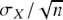。

• 如果 *X* 不是正态分布，样本均值 *X̄* 的抽样分布仍然近似正态分布，均值为 *μ*[*X*]，标准误差为 ，且随着 *n* → ∞，这一近似越来越精确。这被称为 *中心极限定理（CLT）*。

##### **情况 2：已知标准差**

实际上，你通常不会知道生成样本数据的原始测量分布的标准差真实值。在这种情况下，通常将 *σ*[*X*] 替换为 *s*[*X*]，即样本数据的标准差。然而，这种替换会引入额外的变异性，影响与样本均值随机变量相关的分布。

• 样本均值 *X̄* 的抽样分布的标准化值（第 16.2.2 节）遵循 *t* 分布，自由度 *ν* = *n* − 1；标准化是通过标准误差完成的 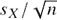。

• 如果*n*较小，还需要假设*X*的分布是正态分布，才能确保基于*t*分布的*X̄*的抽样分布的有效性。

因此，*X̄*的抽样分布的性质取决于是否知道观测值的真实标准差，以及样本大小*n*。中心极限定理（CLT）指出，即使原始观测分布本身不是正态分布，正态性仍然成立，但如果*n*较小，这一近似就不太可靠。通常的经验法则是，只有当*n* ≥ 30 时才可以依赖 CLT。如果使用样本标准差*s*[*X*]来计算*X̄*的标准误差，则抽样分布是*t*分布（经过标准化）。同样，这通常只有在*n* ≥ 30 时才被认为是可靠的。

##### **例子：但尼丁气温**

作为一个例子，假设新西兰但尼丁一月的每日最高温度遵循正态分布，均值为 22 摄氏度，标准差为 1.5 摄氏度。那么，按照情况 1 的注释，对于样本大小*n* = 5，*X̄*的抽样分布将是正态分布，均值为 22，标准误差为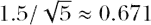。

图 17-1 的顶部图片显示了原始测量分布以及此抽样分布。你可以使用第十六章中熟悉的代码来生成这个图。

```
R> xvals <- seq(16,28,by=0.1)
R> fx.samp <- dnorm(xvals,22,1.5/sqrt(5))
R> plot(xvals,fx.samp,type="l",lty=2,lwd=2,xlab="",ylab="")
R> abline(h=0,col="gray")
R> fx <- dnorm(xvals,22,1.5)
R> lines(xvals,fx,lwd=2)
R> legend("topright",legend=c("raw obs. distbn.","sampling distbn. (mean)"),
          lty=1:2,lwd=c(2,2),bty="n")
```

在这个例子中，*X̄*的抽样分布显然是比与观测值相关的正态分布更高、更窄的正态分布。这是有道理的——你期望多个测量值的*平均值*比原始的单个测量值变动更小。此外，标准误差分母中包含的*n*决定了如果增加样本大小，围绕均值的分布将更加精确。同样，这是合理的——更大的样本将使均值在样本之间“变化更小”。

现在你可以提问各种概率问题；请注意，区分测量分布和抽样分布非常重要。例如，下面的代码提供了 Pr(*X* < 21.5)，即在一月中随机选择的一天的最高温度低于 21.5 度的概率：

```
R> pnorm(21.5,mean=22,sd=1.5)
[1] 0.3694413
```

下一段代码提供了样本均值小于 21.5 度的概率 Pr(*X̄* < 21.5)，基于一月中随机选择的五天样本：

```
R> pnorm(21.5,mean=22,sd=1.5/sqrt(5))
[1] 0.2280283
```

图 17-1 顶部的线条阴影区域显示了这两个概率。在 R 中，可以通过运行以下代码直接将这些阴影区域添加到该图中：

```
R> abline(v=21.5,col="gray")
R> xvals.sub <- xvals[xvals<=21.5]
R> fx.sub <- fx[xvals<=21.5]
R> fx.samp.sub <- fx.samp[xvals<=21.5]
R> polygon(cbind(c(21.5,xvals.sub),c(0,fx.sub)),density=10)
R> polygon(cbind(c(21.5,xvals.sub),c(0,fx.samp.sub)),density=10,
           angle=120,lty=2)
```

请注意，在之前使用`polygon`时，你只是指定了一个`col`；在这个例子中，我改用了阴影线，通过`density`（每英寸的线条数）和`angle`（线条的斜率，单位为度，默认为`angle=45`）来实现阴影线。

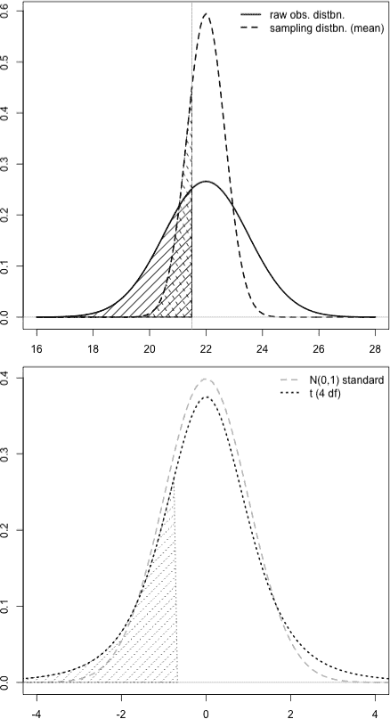

*图 17-1：展示样本均值的抽样分布，n = 5，基于 N(22,1.5)的原始观察分布。上图：基于正态分布的抽样分布版本（假设*σ*[*X*]已知），与观察分布进行比较。下图：基于*t*分布的抽样分布版本，使用 4 个自由度（换句话说，假设使用*s*来计算标准误差），与标准正态分布进行比较。阴影区域表示*Pr(*X* < 21.5)，Pr(*X̄* < 21.5)*(实线和虚线，上图最上面)以及*Pr(*T* < (21.5 − *x̄*)/(s/ 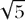)) *(虚线，下图)。*

为了评估概率，请注意，你需要了解控制*X*的参数。在实践中，你很少会拥有这些量（如情境 2 所述）。相反，你会获取一个数据样本并计算汇总统计量。

运行以下代码行会生成五个随机生成的达尼丁温度，这些温度来自于*X* ∼ N(22,1.5)分布：

```
R> obs <- rnorm(5,mean=22,sd=1.5)
R> obs
[1] 22.92233 23.09505 20.98653 20.10941 22.33888
```

现在，为了举例说明，假设这五个值构成了你为此特定问题所拥有的所有数据；换句话说，假设你不知道*μ[*X*]* = 22 和*σ*[*X*] = 1.5。你对*μ[*X*]和*σ*[*X*]的最佳估计值分别是*x̄*和*s*，如下所示：

```
R> obs.mean <- mean(obs)
R> obs.mean
[1] 21.89044
R> obs.sd <- sd(obs)
R> obs.sd
[1] 1.294806
```

可以通过以下方式计算估算的标准误差：

```
R> obs.mean.se <- obs.sd/sqrt(5)
R> obs.mean.se
[1] 0.5790549
```

由于*n* = 5 相对较小，你必须假设`obs`中的值是来自正态分布的实现，符合情境 2 中的要点。这使你能够使用具有 4 个自由度的*t*分布来处理*X̄*的抽样分布。然而，请回顾第 16.2.3 节，任何*t*分布通常都是放置在标准化尺度上的。因此，为了根据你计算的样本统计量找到样本五天的均值温度小于 21.5 的概率，你必须首先使用第 16.2.2 节中概述的规则来标准化这个值。将相应的随机变量标记为*T*，具体值为*t*[4]，并将其存储为 R 中的对象`t4`。

```
R> t4 <- (21.5-obs.mean)/obs.mean.se
R> t4
[1] -0.6742706
```

这将兴趣值 21.5 放置在标准化的尺度上，使其可以与标准正态分布进行解释，或者在这种情况下是正确的（因为你使用的是估算值*s*而不是未知的*σ*[*X*]来计算标准误差），*t[4]*遵循上述的*t*分布，具有 4 个自由度。估算的概率如下所示。

```
R> pt(t4,df=4)
[1] 0.26855
```

请注意，当你计算从抽样分布中得到的“真实”理论概率 Pr(*X̄* < 21.5)时，你得到了约 0.23 的结果（参见第 370 页），但是基于使用样本统计量进行标准化的相同概率（换句话说，基于*估算值*的真实理论值 Pr(*T* < *t*[4])）已经计算为 0.27（保留两位小数）。

图 17-1 的底部图像提供了*t*分布，*ν* = 4，标出了描述的概率。N(0,1)的密度也被绘制出来以供比较；它代表了早前情况 1 中的 N(22,1.5/ )抽样分布的标准化版本。你可以使用以下几行代码生成这张图像：

```
R> xvals <- seq(-5,5,length=100)
R> fx.samp.t <- dt(xvals,df=4)
R> plot(xvals,dnorm(xvals),type="l",lty=2,lwd=2,col="gray",xlim=c(-4,4),
        xlab="",ylab="")
R> abline(h=0,col="gray")
R> lines(xvals,fx.samp.t,lty=3,lwd=2)
R> polygon(cbind(c(t4,-5,xvals[xvals<=t4]),c(0,0,fx.samp.t[xvals<=t4])),
           density=10,lty=3)
R> legend("topright",legend=c("N(0,1) standard","t (4 df)"),
          col=c("gray","black"),lty=2:3,lwd=c(2,2),bty="n")
```

考虑与样本均值相关的概率分布显然不是一项简单的工作。使用样本统计量决定了抽样分布的性质；特别是，如果你使用样本标准差来计算标准误差，那么它将是基于*t*分布的。然而，正如这里的例子所示，一旦这一点得以确认，计算各种概率就变得简单，并且遵循第 16.2 节中详细介绍的相同的一般规则和 R 语言功能。

#### ***17.1.2 样本比例的分布***

样本比例的抽样分布以类似的方式进行解释。如果执行*n*次成功/失败事件的试验，你可以获得成功的比例估计；如果再执行另*n*次试验，新的估计可能会有所不同。正是这种变异性你正在研究的对象。

关注的随机变量表示在任何*n*次试验中，成功的估计比例，每次试验都有一个定义的二元结果。它的估计值为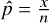，其中*x*是样本大小*n*中成功的次数。让我们用*π*来表示相应的真实成功比例（通常是未知的）。

**注意**

*请注意，这里的*π*并不是指常见的几何值 3.14（保留两位小数）。相反，它仅仅是一个标准符号，用来表示一个真实的总体比例。*

的抽样分布近似为正态分布，均值为*π*，标准误差为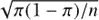。以下是需要注意的关键点：

• 当*n*很大和/或*π*不接近 0 或 1 时，这个近似是有效的。

• 有一些经验法则可以用来确定这种有效性；其中一条经验法则是，当*nπ*和*n*(1 − *π*)都大于 5 时，可以假设正态近似是满意的。

• 当真实的*π*未知或未假设为某个特定值时，通常在所有之前的公式中用代替它。

只要你认为正态分布的近似有效，这就是你需要关心的唯一概率分布。然而，值得注意的是，样本比例的抽样分布的标准误差直接依赖于比例*π*。在构造置信区间和进行假设检验时，这一点非常重要，这些内容将在第十八章中开始探讨。

让我们来看一个实际的例子。假设美国的一位政治评论员对她所在城市的选举年龄公民中，已经知道自己如何投票的比例感兴趣。她从 118 名合适的随机选取的个体那里获得了“是”或“否”的答案。在这些人中，有 80 人表示他们知道如何投票。为了调查与感兴趣比例相关的变异性，您需要考虑

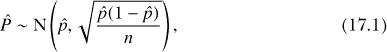

其中 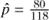。在 R 中，以下代码可以给出感兴趣的估计值：

```
R> p.hat <- 80/118
R> p.hat
[1] 0.6779661
```

在样本中，大约 68% 的被调查者知道他们将在下次选举中如何投票。还要注意，根据上述经验法则，由于这两个值都大于 5，近似正态分布是有效的。

```
R> 118*p.hat
[1] 80
R> 118*(1-p.hat)
[1] 38
```

使用以下代码估算标准误差：

```
R> p.se <- sqrt(p.hat*(1-p.hat)/118)
R> p.se
[1] 0.04301439
```

然后，您可以使用以下代码绘制相应的抽样分布：

```
R> pvals <- seq(p.hat-5*p.se,p.hat+5*p.se,length=100)
R> p.samp <- dnorm(pvals,mean=p.hat,sd=p.se)
R> plot(pvals,p.samp,type="l",xlab="",ylab="",
        xlim=p.hat+c(-4,4)*p.se,ylim=c(0,max(p.samp)))
R> abline(h=0,col="gray")
```

图 17-2 给出了结果。

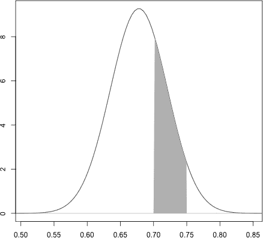

*图 17-2：根据方程式 (17.1)可视化投票例子的抽样分布。阴影区域表示* Pr(0.7 <  < 0.75)*，这是样本比例位于 0.7 和 0.75 之间的概率，且样本大小为* n *= 118。*

现在，您可以使用这个分布来描述其他相同样本大小的投票者中，已经知道自己如何投票的比例的变异性。

例如，图 17-2 中的阴影区域突出了另一个相同大小样本中，已知如何投票的选民比例位于 0.7 和 0.75 之间的概率。这个阴影区域可以通过以下代码添加：

```
R> pvals.sub <- pvals[pvals>=0.7 & pvals<=0.75]
R> p.samp.sub <- p.samp[pvals>=0.7 & pvals<=0.75]
R> polygon(cbind(c(0.7,pvals.sub,0.75),c(0,p.samp.sub,0)),
           border=NA,col="gray")
```

并且通过第 16.2.2 节中介绍的 `pnorm`，您可以使用以下代码来计算感兴趣的概率：

```
R> pnorm(0.75,mean=p.hat,sd=p.se) - pnorm(0.7,mean=p.hat,sd=p.se)
[1] 0.257238
```

这个抽样分布表明，基于相同样本大小的另一个样本比例位于这两个值之间的机会大约是 25.7%。

**练习 17.1**

一位教师希望测试他学校所有 10 年级的学生，以评估他们的基础数学理解，但复印机在仅复印了六份试卷后就坏了。无奈之下，他随机挑选了六名学生参加测试。这些学生的成绩（以 65 分为满分）平均为 41.1。已知该测试的标准差为 11.3。

1.  计算与平均测试分数相关的标准误差。

1.  假设分数本身是正态分布的，评估如果教师再抽取一个相同样本大小的样本，平均分数位于 45 到 55 之间的概率。

1.  一名学生如果答对的问题少于一半，将获得不及格成绩（F）。计算基于另一个相同大小的样本，平均成绩为 F 的概率。

一家营销公司想了解青少年更喜欢哪种能量饮料——饮料 A 还是饮料 B。它调查了 140 名青少年，结果显示只有 35%的青少年更喜欢饮料 A。

1.  使用快速检查来判断是否可以使用正态分布来表示该比例的抽样分布。

1.  在另一个相同大小的样本中，青少年更喜欢饮料 A 的比例大于 0.4 的概率是多少？

1.  找到此抽样分布的两个值，确定所关注比例的中间 80%值。

在第 16.2.4 节中，汽车通过个体位置之间的时间使用指数分布进行建模。假设在城镇的另一端，她的朋友对类似的问题感兴趣。站在她家门外，她记录了 63 个汽车通过之间的时间。这些样本的平均时间为*x̄* = 37.8 秒，标准差为*s* = 34.51 秒。

1.  朋友检查了她的原始数据的直方图，发现她的原始数据严重偏右。简要识别并描述样本均值的抽样分布的性质，并计算适当的标准误差。

1.  使用(g)中的标准误差和适当的概率分布，计算在另一个相同大小的样本中，样本均值介于以下区间的概率：

    1.  超过 40 秒

    1.  少于半分钟

    1.  在给定的样本均值和 40 秒之间

#### ***17.1.3 其他统计量的抽样分布***

到目前为止，你已经研究了涉及单个样本均值或样本比例的抽样分布，尽管需要注意的是，许多问题需要更复杂的度量。然而，你可以将本节中探讨的思想应用于任何从有限样本中估计的统计量。关键始终是能够理解与点估计相关的变异性。

在一些情况下，像之前讨论的那样，抽样分布是参数化的，这意味着概率分布的数学形式本身是已知的，并且仅依赖于特定参数值的提供。这有时取决于满足某些条件，就像你在本章中应用正态分布时看到的那样。对于其他统计量，可能不知道适当抽样分布的形式——在这些情况下，你可以使用计算机模拟来获得所需的概率。

在本章剩余部分以及接下来的几章中，你将继续探索与常见检验和模型的参数抽样分布相关的统计量。

**注意**

*估计量的变异性实际上只是问题的一方面。与此同样重要的是统计学*偏差*问题。当“自然变异”应与*随机误差*相关联时，偏差则与*系统误差*相关联，意思是说一个有偏统计量在样本量增大时并不会收敛到对应的真实参数值。偏差可能是由于研究设计或数据收集中的缺陷造成的，或者可能是由于对感兴趣统计量的估计器不良造成的。偏差是任何给定估计器和/或统计分析中的不良特性，除非它可以被量化并去除，否则在实践中通常是困难甚至不可能做到的。因此，我到目前为止只处理了无偏统计估计量，其中许多是你可能已经熟悉的（例如算术均值），并且我将继续假设无偏性。*

### **17.2 置信区间**

*置信区间（CI）*是由下限*l*和上限*u*定义的区间，用于描述在观察到的样本数据下，可能的真实总体参数值。置信区间的解释使你能够陈述一个“置信水平”，即感兴趣的真实参数值落在此上下限之间的置信度，通常以百分比的形式表示。因此，它是一个常见且有用的工具，直接来源于感兴趣统计量的抽样分布。

以下是需要注意的重要点：

• 置信度通常以百分比的形式表示，因此你会构造一个 100 × (1 − *α*)%的置信区间，其中 0 < *α* < 1 表示“尾部概率的大小”。

• 三个最常见的区间通过*α* = 0.1（90% 区间）、*α* = 0.05（95% 区间）或*α* = 0.01（99% 区间）来定义。

• 通俗地说，你可以这样表述置信区间（*l*，*u*）的解释：“我有 100 × (1 − *α*)%的信心，真实参数值位于*l*和*u*之间。”

置信区间可以通过不同的方式构造，这取决于统计量的类型，从而影响相应抽样分布的形态。对于对称分布的样本统计量，比如本章将使用的均值和比例，可以使用一个通用公式：

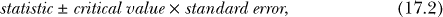

其中，*statistic* 是正在考察的样本统计量，*critical value* 是来自抽样分布标准化版本的值，表示与 *α* 相对应的值，*standard error* 是抽样分布的标准差。临界值和标准误差的乘积被称为区间的*误差组件*；从统计量值中减去误差组件得到 *l*，加上误差组件得到 *u*。

关于适当的抽样分布，置信区间（CI）所提供的仅是分布中的两个值，它们标出了密度下方区域中中央的 100 × (1 − *α*) 百分比区域。（这个过程在练习 17.1（f）中有简要提到。）然后，你使用置信区间来进一步解释关于由相关统计量估计的真实（通常是未知的）参数值。

#### ***17.2.1 均值的区间估计***

从第 17.1.1 节你知道，单个样本均值的抽样分布主要取决于你是否知道原始测量的真实标准差 *σ*[*X*]。然后，假设这个样本均值的样本量大致为 *n* ≥ 30，根据中心极限定理（CLT），可以确保一个对称的抽样分布——如果你知道 *σ*[*X*] 的真实值，那么分布将是正态的；如果必须使用样本标准差 *s* 来估计 *σ*[*X*]（这种情况在实践中更常见），那么它将是基于 *t* 分布，*ν* = *n* − 1 自由度。你已经看到，标准误差的定义是标准差除以 *n* 的平方根。对于小样本量 *n*，还必须假设原始观测值是正态分布的，因为中心极限定理不适用。

为了构造适当的区间，首先必须找到与 *α* 对应的临界值。根据定义，置信区间是对称的，因此这意味着围绕均值的中央概率是 (1 − *α*)，其中在下尾和上尾分别是 *α*/2。

返回到第 17.1.1 节的例子，处理的是新西兰但尼丁 1 月的日最高气温（摄氏度）。假设你知道观测值是正态分布的，但你不知道真实的均值 *μ*[*X*]（假定为 22）或真实的标准差 *σ*[*X*]（假定为 1.5）。按照之前的方法，假设你已经做出了以下五个独立观测：

```
R> temp.sample <- rnorm(n=5,mean=22,sd=1.5)
R> temp.sample
[1] 20.46097 21.45658 21.06410 20.49367 24.92843
```

由于你对样本均值及其抽样分布感兴趣，因此必须计算样本均值 *x̄*、样本标准差 *s* 以及适当的样本均值标准误差， 。

```
R> temp.mean <- mean(temp.sample)
R> temp.mean
[1] 21.68075
R> temp.sd <- sd(temp.sample)
R> temp.sd
[1] 1.862456
R> temp.se <- temp.sd/sqrt(5)
R> temp.se
[1] 0.8329155
```

现在，假设目标是构建一个 95%的置信区间，用于真实的、未知的均值*μ*[*X*]。这意味着*α* = 0.05（尾部概率的总量）对于相关的抽样分布。考虑到你知道原始观测值是正态分布的，并且你使用的是*s*（而不是*σ*[*X*]），适当的分布是*t*分布，具有*n* − 1 = 4 的自由度。对于该曲线下的 0.95 的中心区域，*α*/2 = 0.025 必须位于任一尾部。由于 R 的`q`函数基于总的下尾区域操作，因此（正的）临界值是通过为适当的函数提供 1 − *α*/2 = 0.975 的概率来找到的。

```
R> 1-0.05/2
[1] 0.975
R> critval <- qt(0.975,df=4)
R> critval
[1] 2.776445
```

图 17-3 展示了为什么`qt`函数以这种方式使用（由于我在第十六章中使用了类似的代码，因此这里没有重复图 17-3 的代码）。

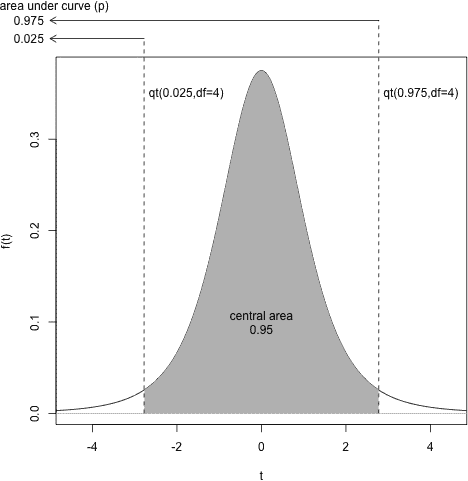

*图 17-3：说明临界值在样本均值置信区间中的作用，使用邓尼丁温度示例。抽样分布为*t*分布，具有 4 个自由度，使用`qt`函数与*α/2 = 0.025*相关的对称尾部概率，得到一个 0.95 的中心区域。*

请注意，当以相同临界值的负版本（即“绕均值反射”，通过使用`qt(0.025,4)`得到）来看时，曲线下的中心对称区域必须是 0.95。你可以通过使用`pt`来确认这一点。

```
R> pt(critval,4)-pt(-critval,4)
[1] 0.95
```

所以，所有的要素都已具备。你可以通过方程（17.2）和以下几行代码计算真实均值*μ*[*X*]的 95%置信区间，分别得到*l*和*u*：

```
R> temp.mean-critval*temp.se
[1] 19.36821
R> temp.mean+critval*temp.se
[1] 23.99329
```

由（19.37,23.99）给出的置信区间（CI）可以解释为：你有 95%的信心，邓尼丁（Dunedin）1 月的真实最大气温位于 19.37 到 23.99 摄氏度之间。

通过这个结果，你将均值估计的知识与样本的固有变异性结合起来，定义了一个区间，其中你可以相当有把握地认为真实均值会落在该区间内。如你所知，这里的真实均值是 22，确实包含在计算出的置信区间内。

由此，你可以轻松地改变置信区间的置信水平。只需更改临界值，正如往常一样，必须在每个尾部定义*α*/2。例如，可以通过以下两行代码分别计算该示例值的 80%置信区间（*α* = 0.2）和 99%置信区间（*α* = 0.01）：

```
R> temp.mean+c(-1,1)*qt(p=0.9,df=4)*temp.se
[1] 20.40372 22.95778
R> temp.mean+c(-1,1)*qt(p=0.995,df=4)*temp.se
[1] 17.84593 25.51557
```

请注意，这里通过乘以向量`c(-1,1)`来计算，以便一次性获得上下限，并将结果返回为一个长度为 2 的向量。如同往常一样，`qt`函数在计算时采用完全的下尾区域，因此`p`设置为 1 − *α*/2。

这些最新的区间突出了提高置信水平对于给定置信区间的自然结果。中央区域的更高概率直接转化为更极端的临界值，导致区间更宽。这是有道理的——为了“更有信心”地估计真实的参数值，你需要考虑更大范围的可能值。

#### ***17.2.2 一个比例的区间***

为样本比例建立置信区间遵循与均值相同的规则。根据第 17.1.2 节中的抽样分布知识，你可以从标准正态分布中获得临界值，对于来自样本大小为*n*的估计，区间本身是通过标准误差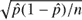构建的。

让我们回到第 17.1.2 节中的例子，在该例中，118 名被调查者中有 80 人表示他们知道如何在下一次美国总统选举中投票。请回忆一下你有以下信息：

```
R> p.hat <- 80/118
R> p.hat
[1] 0.6779661
R> p.se <- sqrt(p.hat*(1-p.hat)/118)
R> p.se
[1] 0.04301439
```

构建 90%的置信区间（*α* = 0.1）时，来自标准化抽样分布的适当临界值如下，这意味着 Pr(−1.644854 < *Z* < 1.644854) = 0.9，适用于*Z* ∼ N(0,1)：

```
R> qnorm(0.95)
[1] 1.644854
```

现在你再次跟随方程(17.2)：

```
R> p.hat+c(-1,1)*qnorm(0.95)*p.se
[1] 0.6072137 0.7487185
```

你可以得出结论，你有 90%的信心认为，在下一次选举中知道自己将如何投票的选民的真实比例位于 0.61 和 0.75 之间（四舍五入到小数点后两位）。

#### ***17.2.3 其他区间***

在第 17.2.1 节和 17.2.2 节中呈现的两个简单情境突出了将任何点估计（换句话说，样本统计量）与其变异性联系起来的重要性。当然，置信区间也可以为其他量构建，在接下来的章节中（作为假设检验的一部分），我将扩展对置信区间的讨论，调查两个均值、两个比例之间的差异，以及类别计数的比率。这些更复杂的统计量有自己的标准误差公式，尽管相应的抽样分布仍然是通过正态曲线和*t*曲线对称的（如果再次满足一些标准假设），这意味着现在熟悉的方程(17.2)公式仍然适用。

通常，置信区间旨在从感兴趣的抽样分布中标出 1 − *α*的中央区域，包括不对称的抽样分布。然而，在这些情况下，基于单一的标准化临界值构造对称 CI（如方程（17.2）所示）是没有太大意义的。同样，您可能不知道抽样分布的函数形式，因此不愿做出任何分布假设，比如对称性。在这些情况下，您可以基于假定的不对称抽样分布的原始分位数（或估算的原始分位数；参见第 13.2.3 节）采取另一条路径。使用特定的分位数值来标出相同的*α*/2 上尾和下尾区域是一种有效方法，能够保持对感兴趣的抽样分布形状的敏感性，同时仍然允许您构造一个有用的区间，描述潜在的真实参数值。

#### ***17.2.4 对置信区间解释的评论***

关于任何置信区间（CI）解释的典型表述，通常会提到对真实参数值所在范围的置信度，但更正式的解释应考虑并澄清构造的概率性质。从技术上讲，给定 100(1 − *α*)的置信度水平，更准确的解释如下：在多次从同一总体中抽取相同大小的样本，并且在每个样本上构造相同置信度水平的 CI 时，您可以期望真实的相应参数值会落在 100(1 − *α*)百分比的这些区间的范围内。

这源于抽样分布的理论，它描述了多个样本之间的变异性，而不仅仅是已经取样的单个样本。乍一看，可能难以完全理解这与口语中常用的“置信声明”之间的差异，但重要的是要始终保持对技术上正确定义的意识，特别是考虑到 CI 通常是基于单个样本来估算的。

**练习 17.2**

一名业余跑者记录了他跑完 100 米所需的平均时间。他在相同条件下完成了 34 次冲刺，并发现这些数据的平均值为 14.22 秒。假设他知道他跑步的标准差为 *σ*[*X*] = 2.9 秒。

1.  构造并解释一个 90%的置信区间，用于估计真实的平均时间。

1.  重复（a），但这次假设标准差未知，且从样本中估算出 *s* = 2.9。这样做会如何影响区间？

在某个国家，真实的左撇子或双手灵活公民的比例未知。随机抽取了 400 人，每人被要求选择以下三种选项之一：仅右手、仅左手或双手灵活。结果显示，37 人选择了左撇子，11 人选择了双手灵活。

1.  计算并解释 99%的置信区间（CI）以估算仅左撇子公民的真实比例。

1.  计算并解释 99%的置信区间（CI）以估算既是左撇子*或*双手灵活的公民的真实比例。

在第 17.2.4 节中，CI 的技术解释是指在计算相同样本大小、来自相同总体的多个相似区间时，包含感兴趣参数真实值的区间比例。

1.  你的任务是编写一个示例，使用模拟演示置信区间的这一行为。为此，请按照以下步骤进行操作：

    – 设置一个矩阵（见第三章），填充`NA`（见第六章），该矩阵具有 5,000 行和 3 列。

    – 使用第十章中的技巧编写一个`for`循环，在每次 5,000 次迭代中，从具有速率参数*λ[e]* = 0.1 的指数分布中生成大小为 300 的随机样本（见第 16.2.4 节）。

    – 评估每个样本的样本均值和样本标准差，并使用这些量与适当抽样分布的临界值一起计算分布的真实均值的 95%置信区间。

    – 在`for`循环中，矩阵现在应按行填充你的结果。第一列将包含下限，第二列将包含上限，第三列将包含逻辑值，如果对应的区间包含真实均值 1/*λ*[e]，则为`TRUE`，否则为`FALSE`。

    – 当循环完成时，计算填充矩阵第三列中`TRUE`的比例。你应该发现这个比例接近 0.95；每次重新运行循环时，这个比例会有所不同。

1.  创建一个绘图，将你估计的前 100 个置信区间绘制为从*l*到*u*的单独水平线，每条线叠加在另一条上。做到这一点的一种方法是首先创建一个具有预设的*x*和*y*轴限制（后者为`c(1,100)`）的空图，然后使用`lines`逐步添加每一条线，使用适当的坐标（这可以通过另一个`for`循环来完成）。最后，为图形添加一条红色的垂直线，表示真实均值。那些不包含真实均值的置信区间将不会与该垂直线相交。

    以下是该图的示例：

    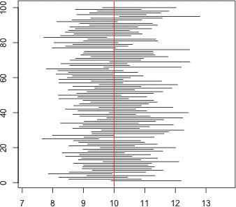
