## **18**

**假设检验**


在本章中，你将基于你在置信区间和抽样分布方面的经验，进一步正式阐述一个真实未知参数的值。为此，你将学习频率派的*假设检验*，通过使用来自相关抽样分布的概率作为反对某个关于真实值的主张的证据。当以这种方式使用概率时，它被称为*p*-值。在本章中，我讲解了如何解释相对基础的统计结果，但你可以将相同的概念应用于更复杂方法（如回归建模，第十九章）中的统计数据。

### **18.1 假设检验的组成部分**

举个假设检验的例子，假设我告诉你某个特定人群中有 7%的人对花生过敏。然后，你从该人群中随机选择了 20 个人，发现其中 18 人对花生过敏。如果假设你的样本没有偏差，且真正反映了整个群体，那么你会如何看待我声称过敏人群比例为 7%的说法？

自然地，你会怀疑我的说法的正确性。换句话说，如果假设成功率为 0.07，那么从 20 次试验中观察到 18 次或更多成功的概率非常小，足以说明你有统计证据反对我的说法，即真实的过敏率为 0.07。事实上，当将*X*定义为 20 个样本中过敏个体的数量，并假设*X* ∼ BIN(20,0.07)，通过评估 Pr(*X* ≥ 18)，你将得到一个非常小的*p*-值。

```
R> dbinom(18,size=20,prob=0.07) + dbinom(19,size=20,prob=0.07) +
   dbinom(20,size=20,prob=0.07)
[1] 2.69727e-19
```

这个*p*-值代表的是在你的样本中观察到结果的概率，*X* = 18，或更极端的结果（*X* = 19 或 *X* = 20），如果成功的机会真的为 7%。

在查看具体的假设检验及其在 R 中的实现之前，本节将介绍一些术语，这些术语是你在报告此类检验时经常会遇到的。

#### ***18.1.1 假设***

正如其名称所示，在假设检验中，正式陈述一个主张以及随后的假设检验是通过*零假设*和*备择假设*来完成的。零假设被解释为*基线*或*无变化*的假设，是被假定为真的主张。备择假设是你要检验的假设，它与零假设相对立。

通常，零假设和备择假设分别用 H[0]和 H[A]表示，它们的写法如下：

H[0] : . . .

H[A] : . . .

原假设通常（但并不总是）被定义为等式 =，与零值相等。相反，备择假设（即你正在检验的情况）通常被定义为与零值的不等式。

• 当 H[A]以小于符号<定义时，它是*单尾*的；这也被称为*左尾检验*。

• 当 H[A]通过“大于”声明（>）定义时，这是*单尾*的；这也称为*上尾检验*。

• 当 H[A]仅通过“不等于”声明（≠）定义时，这是*双尾*的；这也称为*双尾检验*。

这些测试变体完全是特定于情况的，取决于当前面临的问题。

#### ***18.1.2 测试统计量***

一旦假设形成，样本数据被收集，并根据假设中详细描述的参数计算统计量。*测试统计量*是与适当的标准化采样分布进行比较的统计量，用以得出*p*-值。

测试统计量通常是所关注的样本统计量的标准化或重新缩放版本。测试统计量的分布和极端性（即与零的距离）是决定*p*-值小的唯一因素（*p*-值表示反对原假设的证据强度——详见第 18.1.3 节）。具体来说，测试统计量由原始样本统计量与原假设值之间的差异以及样本统计量的标准误差共同决定。

#### ***18.1.3 p 值***

*p*-值是用于量化证据量的概率值，用来衡量是否有证据反对原假设。如果更正式地说，*p*-值是指在假设原假设为真的情况下，观察到测试统计量或更极端情况的概率。

计算*p*-值的确切方式取决于所测试的统计量类型和 H[A]的性质。关于这一点，你将看到以下术语：

• 下尾检验意味着*p*-值是来自所关注采样分布的左尾概率。

• 对于上尾检验，*p*-值是右尾概率。

• 对于双尾检验，*p*-值是左尾概率和右尾概率的总和。当采样分布是对称的（例如，正态分布或*t*分布，如第 18.2 节和第 18.3 节中的所有示例所示），这等同于两倍于其中一条尾部的面积。

简单来说，测试统计量越极端，*p*-值越小。*p*-值越小，反对原假设 H[0]的统计证据越强。

#### ***18.1.4 显著性水平***

对于每个假设检验，假定一个*显著性水平*，记作*α*。这个值用于判定测试结果的显著性。显著性水平定义了一个临界点，用来决定是否有足够的证据认为 H[0]是错误的，并支持 H[A]。

• 如果*p*-值大于或等于*α*，那么你得出结论，无法反对原假设，因此你在与 H[A]比较时*保留*H[0]。

• 如果 *p*-值小于 *α*，那么测试结果是 *统计显著的*。这意味着反对原假设的证据充分，因此你 *拒绝* H[0]，支持 H[A]。

常见或传统的 *α* 值包括 *α* = 0.1，*α* = 0.05，和 *α* = 0.01。

#### ***18.1.5 假设检验的批评***

当你查看接下来的章节中的一些例子时，上述术语会变得更容易理解。然而，即使在这一早期阶段，认识到假设检验是容易受到合理批评的也很重要。任何假设检验的最终结果要么是保留原假设，要么是拒绝原假设，而这一决定完全依赖于一个相当随意的显著性水平 *α* 的选择；通常，这个值就是传统使用的某个数值。

在你开始查看例子之前，同样重要的是要注意，*p*-值从来不能提供 H[0] 或 H[A] 真的正确的“证据”。它只能量化反对原假设的证据，当 *p*-值小于 *α* 时，可以拒绝原假设。换句话说，拒绝原假设并不等于证明它是错误的。拒绝 H[0] 仅仅意味着样本数据表明应该更倾向于 H[A]，而 *p*-值仅表示这种倾向的强度。

近年来，由于在某些应用研究领域过度使用甚至误用 *p*-值，部分入门统计学课程开始反对过度强调统计推断的这些方面。Sterne 和 Smith（2001）的一篇特别好的文章从医学研究的角度讨论了假设检验的作用及其相关问题。另一个不错的参考文献是 Reinhart（2015），它讨论了统计学中对 *p*-值的常见误解。

尽管如此，关于抽样分布的概率推断是，且永远将是，频率统计实践的基石。提高统计测试和建模使用及解释的最佳方式是通过对相关思想和方法的合理介绍，这样从一开始你就能理解统计显著性及其能告诉你和不能告诉你的内容。

### **18.2 测试方法**

涉及样本均值的假设检验的有效性依赖于第 17.1.1 节中提到的相同假设和条件。特别是，在本节中，你应该假设中心极限定理成立，并且如果样本量较小（换句话说，大约小于 30），原始数据是正态分布的。你还将重点关注使用样本标准差*s*来估计真实标准差*σ*[*X*]的例子，因为这是你在实践中最常遇到的情况。同样，参照第 17.1.1 节，这意味着在计算临界值和*p*-值时，你需要使用*t*-分布而不是正态分布。

#### ***18.2.1 单一均值***

由于你已经接触过标准误差公式，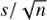，以及需要使用的 R 功能来从*t*-分布中获得分位数和概率（`qt`和`pt`），这里唯一需要引入的新概念是关于假设本身的定义以及结果的解释。

##### **计算：单样本 t 检验**

让我们直接进入一个例子——单样本*t*-检验。回想一下在第 16.2.2 节中的问题，其中某零食生产商对广告中 80 克包装的内容物净重均值感兴趣。假设有消费者打电话投诉——他们在一段时间内购买并精确称量了 44 个随机选择的 80 克包装（来自不同商店），并记录了以下重量：

```
R> snacks <- c(87.7,80.01,77.28,78.76,81.52,74.2,80.71,79.5,77.87,81.94,80.7,
               82.32,75.78,80.19,83.91,79.4,77.52,77.62,81.4,74.89,82.95,
               73.59,77.92,77.18,79.83,81.23,79.28,78.44,79.01,80.47,76.23,
               78.89,77.14,69.94,78.54,79.7,82.45,77.29,75.52,77.21,75.99,
               81.94,80.41,77.7)
```

客户声称他们被少给了，因为他们的数据不能来自均值为*μ* = 80 的分布，因此真实的均值必须小于 80。为了调查这一主张，制造商使用显著性水平*α* = 0.05 进行假设检验。

首先，必须定义假设，零假设为 80 克。记住，备择假设是“你所要检验的内容”；在本例中，H[A]是*μ*小于 80。零假设，解释为“没有变化”，将定义为*μ* = 80：即真实的均值实际上是 80 克。这些假设形式化如下：

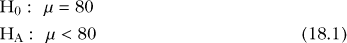

其次，必须从样本中估计均值和标准差。

```
R> n <- length(snacks)
R> snack.mean <- mean(snacks)
R> snack.mean
[1] 78.91068
R> snack.sd <- sd(snacks)
R> snack.sd
[1] 3.056023
```

你的假设所要回答的问题是：在估计的标准差下，如果真实均值为 80 克，那么观察到样本均值（当*n* = 44）为 78.91 克或更低的概率是多少？为了回答这个问题，你需要计算相关的检验统计量。

在假设检验中，对于单一均值相对于零假设值*μ*[0]的检验统计量*T*正式表示为：

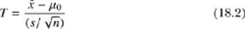

基于大小为 *n* 的样本，样本均值为 *x̄*，样本标准差为 *s*（分母是均值的估计标准误）。假设相关条件已满足，*T* 服从自由度为 *ν* = *n* − 1 的 *t* 分布。

在 R 中，以下代码可以为零食数据提供样本均值的标准误：

```
R> snack.se <- snack.sd/sqrt(n)
R> snack.se
[1] 0.4607128
```

然后，*T* 可以按以下方式计算：

```
R> snack.T <- (snack.mean-80)/snack.se
R> snack.T
[1] -2.364419
```

最后，检验统计量用于获得 *p*-值。回想一下，*p*-值是观察到 *T* 或更极端值的概率。 “更极端”的性质由备择假设 H[A] 决定，作为一个小于的声明，它引导你找到一个左尾的、下侧概率作为 *p*-值。换句话说，*p*-值是作为样本分布下方的面积（当前例中是自由度为 43 的 *t* 分布）在 *T* 的垂直线左侧的面积。从第 16.2.3 节可以轻松完成此操作，如下所示：

```
R> pt(snack.T,df=n-1)
[1] 0.01132175
```

你的结果表明，如果零假设 H[0] 为真，那么观察到客户样本均值 *x̄* = 78.91 或更小的概率仅有 1% 多一点。由于这个 *p*-值小于预定义的显著性水平 *α* = 0.05，制造商得出结论，足够的证据可以拒绝零假设，支持备择假设，表明真实的 *μ* 值实际上小于 80 克。

注意，如果你找到单样本均值的相应 95% CI，如第 17.2.1 节所描述并给出：

```
R> snack.mean+c(-1,1)*qt(0.975,n-1)*snack.se
[1] 77.98157 79.83980
```

它*不*包括零假设值 80，这与在 0.05 水平下的假设检验结果一致。

##### **R 函数：t.test**

单样本的 *t*-检验结果也可以通过内置的`t.test`函数找到。

```
R> t.test(x=snacks,mu=80,alternative="less")

        One Sample t-test

data:  snacks
t = -2.3644, df = 43, p-value = 0.01132
alternative hypothesis: true mean is less than 80
95 percent confidence interval:
     -Inf 79.68517
sample estimates:
mean of x
 78.91068
```

该函数将原始数据向量作为 `x`，均值的零假设值作为 `mu`，以及检验的方向（即如何在适当的 *t* 曲线下找到 *p*-值）作为 `alternative`。`alternative` 参数有三种可用选项：“`less`” 表示 H[A] 小于；“`greater`” 表示 H[A] 大于；“`two.sided`” 表示 H[A] 不等于。*α* 的默认值为 0.05。如果你想要不同于 0.05 的显著性水平，必须将 1 − *α* 传递给 `t.test` 的 `conf.level` 参数。

注意，*T* 的值会在 `t.test` 的输出中报告，同时还包括自由度和 *p*-值。你还会得到一个 95% 的“区间”，但其值 `-Inf` 和 `79.68517` 与之前手动计算的区间不匹配。手动计算的区间实际上是一个双侧区间——一个使用等量误差组件的有界区间。

`t.test` 输出中的置信区间，则根据`alternative`参数进行设置。它提供了*单侧置信界限*。对于下尾检验，它提供了统计量的上界，使得兴趣的采样分布的整个下尾区域为 0.95，而传统的双侧区间则是*中心*区域。单侧界限的使用频率低于完全界定的双侧区间，该区间可以通过相关调用`t.test`并设置`alternative="two.sided"`来获得（作为组件`conf.int`）。

```
R> t.test(x=snacks,mu=80,alternative="two.sided")$conf.int
[1] 77.98157 79.83980
attr(,"conf.level")
[1] 0.95
```

这个结果与之前手动计算的版本一致。还要注意，相应的置信水平 1 − *α*作为一个属性与该组件一起存储（参见第 6.2.1 节）。

在检查零食例子的结果时，*p*-值约为 0.011，请记住在解释假设检验时要小心。对于此特定检验，当*α*设置为 0.05 时，H[0]被拒绝。但如果检验是在*α* = 0.01 下进行的呢？*p*-值大于 0.01，所以在那种情况下，H[0]将被保留，仅仅因为*α*值的任意变化。在这些情况下，帮助对反对原假设的证据的强度进行评论会很有帮助。对于当前的例子，你可以合理地认为存在某些证据支持 H[A]，但这些证据并不特别强。

**练习 18.1**

1.  某些品种的成年家猫据说平均体重大约为 3.5 千克。一位猫迷对此表示不同意见，并收集了 73 只该品种猫的体重样本。根据她的样本，她计算出平均体重为 3.97 千克，标准差为 2.21 千克。进行假设检验，以验证她关于真实平均体重*μ*不等于 3.5 千克的主张，设置适当的假设，进行分析，并解释*p*-值（假设显著性水平为*α* = 0.05）。

1.  假设之前认为斐济海岸地震事件的平均震级为 4.3 里氏震级。使用现成的`quakes`数据集中`mag`变量的数据，该数据集提供了 1000 个该地区的地震事件样本，来检验真实震级是否确实*大于*4.3。设置适当的假设，使用`t.test`（在显著性水平*α* = 0.01 下进行检验），并得出结论。

1.  手动计算(b)部分真实均值的双侧置信区间。

#### ***18.2.2 两个均值***

通常，单一样本均值的检验不足以回答你关心的问题。在许多场景中，研究者希望直接比较两个不同组别的均值，这归结为对两个均值之间真实差异的假设检验；称它们为**μ[1]**和**μ[2]**。

两组数据之间的关系影响两个样本均值差异的标准误差的具体形式，因此也影响检验统计量本身。然而，实际的均值比较通常具有相同的性质——典型的原假设通常定义为**μ[1]**和**μ[2]**相等。换句话说，两个均值之间差异的原假设值通常为零。

##### **非配对/独立样本：非合并方差**

最一般的情况是，两个数据集基于两个独立的、分开的组（也称为*非配对*样本）。你计算两个数据集的样本均值和样本标准差，定义感兴趣的假设，然后计算检验统计量。

当你不能假设两个总体的方差相等时，就需要进行*非合并*版本的两样本*t*检验；这一部分将首先讨论。如果你能够安全地假设方差相等，那么你可以进行*合并*的两样本*t*检验，这样可以提高结果的精确度。稍后你将会看到合并版本的检验。

对于非合并的例子，回到第 18.2.1 节中的 80 克零食包装示例。收集了原制造商 44 包零食样本（将此样本大小标记为*n*[1]），然后不满的消费者去收集了竞争对手零食制造商的*n[2]* = 31 包随机选择的 80 克零食包装。第二组测量数据存储为`snacks2`。

```
R> snacks2 <- c(80.22,79.73,81.1,78.76,82.03,81.66,80.97,81.32,80.12,78.98,
                79.21,81.48,79.86,81.06,77.96,80.73,80.34,80.01,81.82,79.3,
                79.08,79.47,78.98,80.87,82.24,77.22,80.03,79.2,80.95,79.17,81)
```

从第 18.2.1 节开始，你已经知道了第一个样本（大小为*n[1]* = 44）的均值和标准差——这些分别存储为`snack.mean`（大约 78.91）和`snack.sd`（大约 3.06）——可以把它们看作是*x̄[1]*和*s*[1]。现在计算新数据的相同量值，分别是*x̄[2]*和*s*[2]。

```
R> snack2.mean <- mean(snacks2)
R> snack2.mean
[1] 80.1571
R> snack2.sd <- sd(snacks2)
R> snack2.sd
[1] 1.213695
```

设原始样本的真实均值用**μ[1]**表示，竞争对手公司包装的新样本的真实均值用**μ[2]**表示。现在，你关注的是测试是否有统计证据支持**μ[2]**大于**μ[1]**的说法。这意味着假设为 H[0] : **μ[1]** = **μ[2]** 和 H[A] : **μ[1]** < **μ[2]**，可以写成如下形式：

H[0] : **μ[2]** − **μ[1]** = 0

H[A] : **μ[2]** − **μ[1]** > 0

也就是说，竞争对手公司包装的真实均值与原制造商包装的均值之间的差异，当从竞争对手的均值中减去原制造商的均值时，结果大于零。“无变化”场景，即原假设，是两个均值相同，所以它们的差异为零。

现在你已经构建了假设，接下来我们来看如何实际检验它们。两个均值的差异是我们关注的量。对于来自具有真实均值**μ[1]**和**μ[2]**的总体的两个独立样本，样本均值*x̄[1]*和*x̄*[2]，样本标准差*s[1]*和*s*[2]*（并且满足*t*分布的有效性条件），检验**μ[2]**和**μ[1]**之间差异的标准化检验统计量*T*，按顺序给出如下：

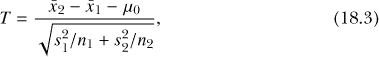

其分布可以近似为具有*ν*自由度的*t*分布，其中

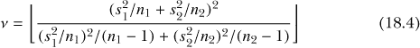

在(18.3)中，*μ*[0]是感兴趣的零假设值——通常在“差异”统计量的检验中为零。因此，这一项将在检验统计量的分子中消失。*T*的分母是这种设置下两个均值差异的标准误。

方程(18.4)右侧的└ · ┘表示一个*floor*操作——严格向下舍入到最接近的整数。

**注意**

*此两样本*t*-检验，使用方程(18.3)进行，也称为*Welch 的*t*-检验*。这指的是使用方程(18.4)，称为*Welch-Satterthwaite 方程*。至关重要的是，它假设两个样本具有不同的真实方差，这就是为什么它被称为*非合并方差*版本的检验。

在定义两个参数集并构建假设时，一致性非常重要。在这个例子中，由于检验的目的是寻找**μ[2]**大于**μ[1]**的证据，因此**μ[2]**−**μ[1]** > 0 形成了 H[A]（一个大于的、右尾检验），这种减法顺序在计算*T*时被镜像反转。如果你将差异定义为相反的顺序，同样的检验也可以进行。在这种情况下，你的备择假设将暗示一个左尾检验，因为如果你检验的是**μ[2]**大于**μ[1]**，那么 H[A]应当正确写作**μ[1]**−**μ[2]** < 0。同样，这将相应地修改方程(18.3)中分子减法的顺序。

同样的注意事项也适用于使用`t.test`进行两样本比较。必须将两个样本作为参数`x`和`y`传递，但该函数在进行右尾检验时将`x`解释为大于`y`，在进行左尾检验时将`x`解释为小于`y`。因此，在对零食包装的例子进行`alternative="greater"`检验时，必须将`snacks2`传递给`x`：

```
R> t.test(x=snacks2,y=snacks,alternative="greater",conf.level=0.9)

        Welch Two Sample t-test

data:  snacks2 and snacks
t = 2.4455, df = 60.091, p-value = 0.008706
alternative hypothesis: true difference in means is greater than 0
90 percent confidence interval:
 0.5859714       Inf
sample estimates:
mean of x mean of y
 80.15710  78.91068
```

由于*p*-值为 0.008706，你可以得出结论，存在足够的证据拒绝零假设 H[0]，支持备择假设 H[A]（事实上，*p*-值显然小于规定的*α* = 0.1 显著性水平，这是由`conf.level=0.9`所隐含的）。证据表明，竞争对手制造商 80 克包装的零食的平均净重大于原制造商的平均净重。

请注意，`t.test`的输出报告了一个自由度值 60.091，这是公式（18.4）的未下取整结果。你还会收到一个单边置信区间（基于上述置信水平），这是由于本检验的单边性质所触发的。再次提醒，常见的双边 90%置信区间也是有用的；知道*ν* = └ 60.091 ┘ = 60，并使用检验统计量和标准误差（分别为公式（18.3）的分子和分母），你可以进行计算。

```
R> (snack2.mean-snack.mean) +
   c(-1,1)*qt(0.95,df=60)*sqrt(snack.sd²/44+snack2.sd²/31)
[1] 0.3949179 2.0979120
```

在这里，你使用了之前存储的样本统计量`snack.mean`、`snack.sd`（原制造商样本的 44 个原始测量值的均值和标准差），`snack2.mean`和`snack2.sd`（与竞争对手制造商的 31 个观测值相对应的均值和标准差）。请注意，置信区间与公式（17.2）在第 378 页中详细说明的形式相同，并且为了提供正确的 1 − *α*中心区域，适当的*t*分布的`q`函数需要以 1 − *α*/2 作为其输入的概率值。你可以理解为“90%的置信度认为，竞争对手和原制造商之间的真实平均净重差异（按此顺序）介于 0.395 克和 2.098 克之间。”由于零不在区间内，并且区间完全为正，这支持了假设检验的结论。

##### **独立/无配对样本：合并方差**

在刚才提到的未合并方差示例中，并没有假设正在比较的两个总体的方差相等。这是一个重要的说明，因为它导致在计算检验统计量时使用了公式（18.3），并在相应的*t*分布中使用了公式（18.4）来计算自由度。然而，如果你*可以*假设方差相等，检验的精度将得到提高——你需要使用不同的标准误差公式来计算差异，并计算相关的自由度（df）。

同样，感兴趣的量是两个均值的差，表示为**μ[2]** − **μ[1]**。假设你有两个独立的样本，样本量分别为*n[1]*和*n[2]*，来自具有真实均值**μ[1]**和**μ[2]**的总体，样本均值*x̄[1]*和*x̄[2]*，以及样本标准差*s[1]*和*s[2]*，并假设满足*t*-分布的有效性条件。此外，假设样本的真实方差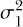和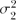相等，即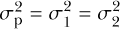。

**注意**

*有一个简单的经验法则可以检查“方差相等”假设的有效性。如果较大样本标准差与较小样本标准差的比值小于* 2*，那么可以假设方差相等。例如，如果 s*[1] > *s*[2]*，那么如果*  < 2, *你可以使用合并方差的检验统计量。*

该场景下的标准化检验统计量*T*为：

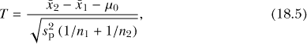

其分布为*t*-分布，*ν* = *n[1]* + *n[2]* − 2 自由度，其中：

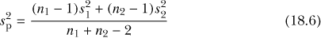

是所有原始测量值方差的*合并估计*。这个值替代了公式(18.3)中分母的*s[1]*和*s[2]*，从而得出了公式(18.5)。

两样本*t*-检验的其他所有方面与之前相同，包括适当假设的构建、*μ*[0]的典型零值以及*p*-值的计算和解释。

对于小吃包示例中的两个均值比较，你会发现很难为使用合并版本的*t*-检验辩护。根据经验法则，两个估算的标准差（*s*[1] ≊ 3.06 和 *s[2]* ≊ 1.21，分别代表原始和竞争厂家样本）具有一个大到小的比率，超过了 2。

```
R> snack.sd/snack2.sd
[1] 2.51795
```

尽管这相当非正式，如果无法合理假设这一点，最好坚持使用未合并版本的检验。

为了说明这一点，让我们考虑一个新例子。智商（IQ）是常用来衡量一个人聪明程度的量。IQ 分数合理地假设为正态分布，并且人群的平均智商被认为是 100。假设你有兴趣评估男性和女性之间的平均 IQ 分数是否存在差异，提出以下假设，其中*n[男]* = 12 和*n[女]* = 20：

H[0] : *μ[男]* − *μ[女]* = 0

H[A] : *μ[男]* − *μ[女]* ≠ 0

你随机抽取了以下数据：

```
R> men <- c(102,87,101,96,107,101,91,85,108,67,85,82)
R> women <- c(73,81,111,109,143,95,92,120,93,89,119,79,90,126,62,92,77,106,
              105,111)
```

和往常一样，我们来计算所需的基本统计量。

```
R> mean(men)
[1] 92.66667
R> sd(men)
[1] 12.0705
R> mean(women)
[1] 98.65
R> sd(women)
[1] 19.94802
```

这些给出了样本均值*x̄[男]*和*x̄[女]*，以及它们各自的样本标准差*s[男]*和*s[女]*。输入以下内容快速检查标准差的比率：

```
R> sd(women)/sd(men)
[1] 1.652626
```

你可以看到，较大样本标准差与较小样本标准差的比值小于 2，因此你可以假设在进行假设检验时，方差是相等的。

`t.test`命令还可以执行合并的两样本 *t*-检验，按照公式(18.5)和(18.6)。要执行该检验，你需要提供可选参数`var.equal=TRUE`（与默认的`var.equal=FALSE`相对，后者会触发 Welch 的*t*-检验）。

```
R> t.test(x=men,y=women,alternative="two.sided",conf.level=0.95,var.equal=TRUE)

        Two Sample t-test
data:  men and women
t = -0.9376, df = 30, p-value = 0.3559
alternative hypothesis: true difference in means is not equal to 0
95 percent confidence interval:
 -19.016393   7.049727
sample estimates:
mean of x mean of y
 92.66667  98.65000
```

还要注意，对于这个例子，H[A]意味着一个双尾检验，因此提供了`alternative="two.sided"`。

该检验的结果*p*-值为 0.3559，显然大于常规的 0.05 截止水平。因此，你的结论是没有足够的证据拒绝 H[0]——即没有足够的证据支持男性与女性在平均 IQ 得分上存在显著差异。

##### **配对/相关样本**

最后，我们将看看如何比较*配对*数据中的两个均值。这个设置与两独立样本*t*-检验明显不同，因为它关注的是数据的收集方式。问题在于两组观测之间的*依赖性*——之前，每组中的测量值被定义为独立的。这个概念对于如何执行检验有着重要的影响。

配对数据出现于形成两组观测数据的测量值是在同一个个体身上记录的，或者它们在某种重要或明显的方式上相关。一个经典的例子是“前后”观测，比如在某种干预治疗前后对每个个体进行的两次测量。这些情况依然关注每组中均值之间的差异，但与其分别处理两个数据集，配对*t*-检验则是通过单一均值来处理——即个体配对差异的真实均值 *μ[d]*。

作为一个例子，考虑一家关注于一种药物的效果的公司，该药物旨在降低静息心率（以每分钟跳动次数（bpm）表示）。测量了 16 个个体的静息心率。然后，这些个体接受了一疗程的治疗，随后再次测量他们的静息心率。数据存储在两个向量`rate.before`和`rate.after`中，具体如下：

```
R> rate.before <- c(52,66,89,87,89,72,66,65,49,62,70,52,75,63,65,61)
R> rate.after <- c(51,66,71,73,70,68,60,51,40,57,65,53,64,56,60,59)
```

很快就能清楚地看到，为什么任何比较这两组的检验都必须考虑依赖性。心率受个体年龄、体型和身体健康状况的影响。一个 60 岁以上的身体不太健康的人，静息心率基线可能高于一个健康的 20 岁年轻人，即使两人都服用了相同的药物来降低心率，他们的最终心率仍可能反映出各自的基线。如果使用任何独立样本*t*-检验来分析，这种药物的真实效果很可能被掩盖。

为了克服这个问题，配对的两样本 *t* 检验考虑每对值之间的差异。将一组 *n* 测量值标记为 *x*[1]，...，*x*[*n*]，另一组 *n* 观测值标记为 *y*[1]，...，*y*[*n*]，则差异 *d* 定义为 *d*[*i*] = *y*[*i*] − *x*[*i*]；*i* = 1，...，*n*。在 R 中，您可以轻松计算成对差异：

```
R> rate.d <- rate.after-rate.before
R> rate.d
 [1]  -1   0 -18 -14 -19  -4  -6 -14  -9  -5  -5   1 -11  -7  -5  -2
```

以下代码计算这些差异的样本均值 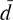 和标准差 *s[d]*：

```
R> rate.dbar <- mean(rate.d)
R> rate.dbar
[1] -7.4375
R> rate.sd <- sd(rate.d)
R> rate.sd
[1] 6.196437
```

您希望查看心率减少的程度，因此此检验将关注以下假设：

H[0] : *μ[d]* = 0

H[A] : *μ[d]* < 0

给定用来获得差异的顺序或减法，心率成功降低的检测将表现为“之后”的均值小于“之前”的均值。

将所有这些用数学语言表达，感兴趣的值是两个依赖测量对之间的真实均值差异，*μ[d]*。这里有两组* n * 测量值，*x*[1]，...，*x*[*n*] 和 *y*[1]，...，*y*[*n*]，它们的成对差异是 *d*[1]，...，*d*[*n*]。必须满足*t*分布有效性的相关条件；在这种情况下，如果成对数 *n* 小于 30，则必须假设原始数据是正态分布的。检验统计量 *T* 由以下公式给出：

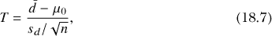

其中  是成对差异的均值，*s[d]* 是成对差异的样本标准差，而 *μ*[0] 是原假设值（通常为零）。统计量 *T* 遵循 *t* 分布，具有 *n* − 1 自由度。

方程式 (18.7) 的形式实际上与 (18.2) 中的检验统计量的形式相同，一旦计算了个别配对差异的样本统计量。进一步需要注意的是，*n* 代表的是配对的总数，而不是单个观测值的总数。

对于当前的假设检验，可以通过 `rate.dbar` 和 `rate.sd` 计算检验统计量和 *p* 值。

```
R> rate.T <- rate.dbar/(rate.sd/sqrt(16))
R> rate.T
[1] -4.801146
R> pt(rate.T,df=15)
[1] 0.000116681
```

这些结果表明有证据拒绝 H[0]。在 `t.test` 中，必须将可选的逻辑参数 `paired` 设置为 `TRUE`。

```
R> t.test(x=rate.after,y=rate.before,alternative="less",conf.level=0.95,
          paired=TRUE)

        Paired t-test

data:  rate.after and rate.before
t = -4.8011, df = 15, p-value = 0.0001167
alternative hypothesis: true difference in means is less than 0
95 percent confidence interval:
      -Inf -4.721833
sample estimates:
mean of the differences
                -7.4375
```

请注意，您提供给 `x` 和 `y` 参数的数据向量的顺序遵循与非配对检验相同的规则，具体取决于所需的 `alternative` 值。通过使用 `t.test` 确认与手动计算的相同的 *p* 值，并且由于此值小于假设的常规显著性水平 *α* = 0.05，因此有效的结论是，您可以声明有统计证据表明药物确实减少了均值静息心率。你还可以进一步说你有 95%的信心，药物治疗后，真实的心率均值差异位于以下区间之间：

```
R> rate.dbar-qt(0.975,df=15)*(rate.sd/sqrt(16))
[1] -10.73935
```

和

```
R> rate.dbar+qt(0.975,df=15)*(rate.sd/sqrt(16))
[1] -4.135652
```

**注意**

*在某些情况下，例如当你的数据强烈表明不符合正态分布时，你可能不愿意假设中央极限定理的有效性（请参考 第 17.1.1 节）。对于此处讨论的检验方法的替代方法，可以采用* 非参数 *技术，放宽这些分布要求。在双样本情况下，可以使用* Mann-Whitney U 检验*（也称为*Wilcoxon 秩和检验*）。这是一个比较两个中位数的假设检验，而不是两个均值。你可以使用 R 函数* `wilcox.test` *来访问此方法，其帮助页面提供了有用的评论和该方法的详细参考。*

**练习 18.2**

在 `MASS` 包中，你会找到数据集 `anorexia`，该数据集包含了 72 名患病年轻女性的治疗前后体重数据（单位为磅），这些数据来自 Hand 等人（1994）。其中一组女性为对照组（即无干预），另外两组分别为认知行为治疗组和家庭支持干预组。加载该库，并确保你能访问数据框并理解其内容。令 *μ[d]* 表示体重差的均值，计算方法为（*治疗后体重* − *治疗前体重*）。

1.  无论参与者属于哪个治疗组，都需要针对所有体重数据进行适当的假设检验，并以 *α* = 0.05 得出结论，检验以下假设：

    H[0] : *μ[d]* = 0

    H[A] : *μ[d]* > 0

1.  接下来，根据参与者所属的治疗组，进行三次独立的假设检验，使用相同的已定义假设。你注意到了什么？

R 中另一个现成可用的数据集是 `PlantGrowth`（Dobson, 1983），该数据集记录了某种植物的连续产量，并比较了在生长过程中施用两种补充剂对产量的潜在影响，目的是提高与对照组（无补充剂）相比的产量。

1.  设置假设来检验对照组的平均产量是否低于接受任一治疗的植物的平均产量。确定这个检验是应该使用合并方差估计，还是 Welch 的 *t* 检验更为合适。

1.  进行测试并得出结论（假设原始观察值符合正态分布）。

如前所述，决定是否在无配对的 *t* 检验中使用合并方差估计的经验法则。

1.  你的任务是编写一个 *包装器* 函数，在根据经验法则决定是否应以 `var.equal=FALSE` 执行后，调用 `t.test`。请遵循以下指导原则：

    – 你的函数应该接受四个已定义的参数：`x` 和 `y`，没有默认值，处理方式与 `t.test` 中相同；`var.equal` 和 `paired`，其默认值与 `t.test` 的默认值相同。

    – 应该包含一个省略号（第 9.2.5 节）来表示传递给`t.test`的任何附加参数。

    – 执行时，函数应确定`paired=FALSE`。

    *如果`paired`为`TRUE`，则无需继续进行合并方差的检验。*

    *如果`paired`为`FALSE`，那么函数应根据经验法则自动确定`var.equal`的值。*

    – 如果`var.equal`的值是自动设置的，你可以假设它会覆盖用户最初提供的该参数的任何值。

    – 然后，适当地调用`t.test`。

1.  在第 18.2.2 节的文本中，尝试在所有三个示例上使用你的新函数，确保结果一致。

### **18.3 检验比例**

在统计建模和假设检验中，重点关注均值尤其常见，因此你还必须考虑样本比例，解释为一系列*n*次二项试验的均值，其中结果是成功（1）或失败（0）。本节重点介绍比例的参数检验，假设目标抽样分布服从正态分布（通常称为*Z*检验）。

关于样本比例假设检验的设置和解释的一般规则与样本均值的假设检验相同。在本节介绍的*Z*检验中，你可以将这些视为关于单一比例的真实值或两个比例之间差异的检验。

#### ***18.3.1 单一比例***

第 17.1.2 节介绍了单个样本比例的抽样分布应服从正态分布，其均值以真实比例*π*为中心，标准误差为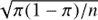。假设试验是独立的，并且*n*不“太小”，*π*也不“太接近”0 或 1，这些公式在这里适用。

**注意**

*检查 n 和*π*后者条件的经验法则简单地包括检查 n*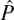*和 n*(1 − )*都大于 5，其中**是*π*的样本估计值。*

值得注意的是，在涉及比例的假设检验中，标准误差本身依赖于*π*。这一点很重要——记住，任何假设检验都假设 H[0]在相关计算中成立。在处理比例时，这意味着在计算检验统计量时，标准误差必须使用零假设值*π*[0]，而不是估计的样本比例。

我将在一个例子中澄清这一点。假设一个喜爱某快餐连锁的个体注意到，他在吃了自己平常的午餐后，总是在一定时间内感到胃部不适。他偶然看到一个博客，博主认为吃这种特定食物后胃不适的几率是 20%。这个人很想知道他自己实际的胃不适率*π*是否与博主的值不同，因此他在*29*次不同的就餐中记录下自己是否经历胃不适（成功为`TRUE`，失败为`FALSE`）。这表明以下假设：

H[0] : *π* = 0.2

H[A] : *π* ≠ 0.2

这些可以根据接下来章节中讨论的通用规则进行检验。

##### **计算：单样本 Z 检验**

在检验某个成功比例*π*的真实值时，设为*n*次试验中的样本比例，零假设值记作*π*[0]。你可以通过以下方式找到检验统计量：

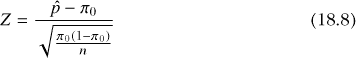

在假设前述关于*π*和*n*大小的条件成立的情况下，*Z* ~ N(0,1)。

方程 (18.8)中的分母，即比例的标准误差，是相对于零假设值*π*[0]计算的，而不是。正如刚才提到的，这是为了满足“真值”假设 H[0]，以便在进行检验时，使得最终的*p*-值的解释与平常一致。标准正态分布用于根据*Z*找到*p*-值；此曲线下的方向由 H[A]的性质决定，和之前一样。

回到快餐例子，假设这些是观测数据，其中`1`表示胃不适，`0`表示其他情况。

```
sick <- c(0,0,1,1,0,0,0,0,0,1,0,0,0,0,0,0,0,0,1,0,0,0,1,1,1,0,0,0,1)
```

该样本中的成功次数和成功概率如下所示：

```
R> sum(sick)
[1] 8
R> p.hat <- mean(sick)
R> p.hat
[1] 0.2758621
```

快速检查表明，按照经验法则，进行检验是合理的：

```
R> 29*0.2
[1] 5.8
R> 29*0.8
[1] 23.2
```

根据方程 (18.8)，本例中的检验统计量*Z*如下所示：

```
R> Z <- (p.hat-0.2)/sqrt(0.2*0.8/29)
R> Z
[1] 1.021324
```

备择假设是双尾的，因此你需要计算对应的*p*-值，作为标准正态曲线下的双尾区域。对于正的检验统计量，可以通过将*Z*的上尾面积乘以 2 来评估。

```
R> 2*(1-pnorm(Z))
[1] 0.3071008
```

假设采用常规的*α*水平 0.05。给出的较高*p*-值 0.307 表明，在假设零假设成立的情况下，样本大小为 29 的结果并不足够不寻常，因此不能拒绝 H[0]。没有足够的证据表明该个体经历胃不适的比例与 0.2 有显著不同，正如博主所指出的那样。

你可以通过置信区间来支持这个结论。在 95%的置信度水平下，你可以计算置信区间（CI）：

```
R> p.hat+c(-1,1)*qnorm(0.975)*sqrt(p.hat*(1-p.hat)/29)
[1] 0.1131927 0.4385314
```

这个区间轻松地包含了零假设值 0.2。

##### **R 函数：prop.test**

再次，R 拯救了你免于繁琐的逐步计算。现成的`prop.test`函数使你可以进行单样本比例检验等多项操作。该函数实际上以稍微不同的方式执行检验，使用卡方分布（将在第 18.4 节中进一步探讨）。然而，检验是等效的，`prop.test`返回的*p*-值与使用*Z*检验得到的值相同。

对于`prop.test`函数，用于单样本比例检验时，你需要提供观察到的成功次数`x`，总试验次数`n`，以及原假设值`p`。另外两个参数，`alternative`（定义 H[A]的性质）和`conf.level`（定义 1 − *α*），与`t.test`中的参数相同，默认值分别是`"two.sided"`和`0.95`。最后，建议在数据满足*n* 和*n*(1 − )的经验法则时，显式设置可选参数`correct=FALSE`。

对于当前的例子，你可以通过以下代码进行测试：

```
R> prop.test(x=sum(sick),n=length(sick),p=0.2,correct=FALSE)

        1-sample proportions test without continuity correction

data:  sum(sick) out of length(sick), null probability 0.2
X-squared = 1.0431, df = 1, p-value = 0.3071
alternative hypothesis: true p is not equal to 0.2
95 percent confidence interval:
 0.1469876 0.4571713
sample estimates:
        p
0.2758621
```

*p*-值与之前得到的相同。不过，注意到报告的置信区间（CI）略有不同（基于正态分布的区间，依赖于中心极限定理）。`prop.test`生成的 CI 被称为*威尔逊得分区间*，它考虑了“成功概率”与二项分布之间的直接关联。为了简化起见，在执行涉及比例的假设检验时，你将继续使用基于正态分布的区间。

同样需要注意的是，像`t.test`一样，任何使用`prop.test`进行的一边检验只会提供一个单边的置信区间；你将在下面的例子中看到这一点。

#### ***18.3.2 两个比例***

通过对标准误差的修改，基本扩展之前的过程，你可以比较来自独立总体的*两个*估计比例。就像两个均值的差异一样，你通常是在检验两个比例是否相同，从而使其差异为零。因此，典型的原假设值是零。

举个例子，考虑一个统计学考试的学生群体。在这个群体中，有*n[1]* = 233 名心理学专业的学生，其中*x[1]* = 180 名通过考试；另外有*n[2]* = 197 名地理学专业的学生，其中 175 名通过考试。假设有人声称地理学专业的学生在统计学考试中的通过率高于心理学专业的学生。

将心理学学生的真实通过率表示为*π*[1]，将地理学学生的通过率表示为*π*[2]，该假设可以通过以下定义的假设对进行统计检验：

H[0] : *π*[2] − *π*[1] = 0

H[A] : *π*[2] − *π*[1] > 0

就像比较两个均值一样，保持差异计算的一致顺序在整个测试计算中是非常重要的。这个例子展示了一个右尾检验。

##### **计算：双样本 Z 检验**

在数学上测试两比例之间的真实差异 *π*[1] 和 *π*[2] 时，令 [1] = *x*[1]/*n*[1] 为 *π*[1] 对应的 *x[1]* 成功次数和 *n[1]* 次试验的样本比例，类似地，令 [2] = *x*[2]/*n*[2] 为 *π*[2] 的比例。假设差异的原假设值为 *π*[0]，则检验统计量为：

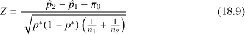

假设你可以应用上述关于 *n*[1]、*n*[2] 和 *π*[1]、*π*[2]* 的条件，你可以将 *Z* 视为符合正态分布 N(0,1)。

在 (18.9) 的分母中有一个新的量 *p*^∗。这是一个 *合并* 比例，计算如下：

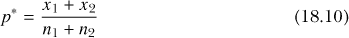

如前所述，在这种类型的检验中，常常将原假设值，即两比例之间的真实差异，设定为零（换句话说，*π*[0] = 0）。

公式 (18.9) 的分母本身是用在假设检验中的两比例差异的标准误差。需要使用 *p*^∗ 再次体现了 H[0] 被假设为真的事实。在 (18.9) 的分母中分别使用 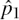 和 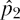，以 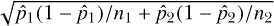 的形式（即在假设检验之外的两比例差异的标准误差）会违反假设 H[0] 的“真实性”。

因此，回到心理学和地理学学生参加的统计学考试，你可以按照以下方式计算所需的各个量：

```
R> x1 <- 180
R> n1 <- 233
R> p.hat1 <- x1/n1
R> p.hat1
[1] 0.7725322
R> x2 <- 175
R> n2 <- 197
R> p.hat2 <- x2/n2
R> p.hat2
[1] 0.8883249
```

结果表明，心理学学生的样本通过率约为 77.2%，地理学学生的通过率为 88.8%；两者的差异约为 11.6%。通过检查 、*n[1]* 和 、*n*[2] 的值，你可以看到该测试满足经验法则；同样，假设标准显著性水平为 *α* = 0.05。

根据公式 (18.10)，合并后的比例 *p*^∗ 如下所示：

```
R> p.star <- (x1+x2)/(n1+n2)
R> p.star
[1] 0.8255814
```

然后你按照 公式 (18.9) 计算检验统计量 *Z*，具体如下：

```
R> Z <- (p.hat2-p.hat1)/sqrt(p.star*(1-p.star)*(1/n1+1/n2))
R> Z
[1] 3.152693
```

根据假设，你可以找到对应的 *p*-值，作为标准正态曲线下右侧上尾区域的 *Z* 值，如下所示：

```
R> 1-pnorm(Z)
[1] 0.0008088606
```

你观察到一个显著小于 *α* 的 *p*-值，因此正式决策当然是拒绝原假设，支持备择假设。样本数据提供了足够的证据反驳 H[0]，因此你可以得出结论，支持地理学学生的通过率高于心理学学生的通过率。

##### **R 函数：prop.test**

再次使用 R，你可以通过一行代码使用`prop.test`来进行检验。对于两个比例的比较，你将每组成功的次数作为长度为 2 的向量传递给`x`，并将各自的样本大小作为另一个长度为 2 的向量传递给`n`。请注意，条目的顺序必须与`alternative`的顺序一致（换句话说，在这里，“大于”要检验的比例对应`x`和`n`的第一个元素）。再次地，`correct`被设置为`FALSE`。

```
R> prop.test(x=c(x2,x1),n=c(n2,n1),alternative="greater",correct=FALSE)

   2-sample test for equality of proportions without continuity correction

data:  c(x2, x1) out of c(n2, n1)
X-squared = 9.9395, df = 1, p-value = 0.0008089
alternative hypothesis: greater
95 percent confidence interval:
 0.05745804 1.00000000
sample estimates:
   prop 1    prop 2
0.8883249 0.7725322
```

*p*-值与之前一系列计算得出的值相同，表明拒绝 H[0]。由于`prop.test`作为单侧检验调用，返回的置信区间提供了一个单侧边界。为了提供真实差异的双侧置信区间，考虑到检验结果，使用单独的和来构造，而不是专门使用(18.9)中的分母（假设 H[0]为真）。两个比例差异的标准误的“单独估计”版本之前已经给出（见方程（18.10）下的文字），因此可以根据以下公式计算 95%的置信区间：

```
R> (p.hat2-p.hat1) +
   c(-1,1)*qnorm(0.975)*sqrt(p.hat1*(1-p.hat1)/n1+p.hat2*(1-p.hat2)/n2)
[1] 0.04628267 0.18530270
```

由此，你可以有 95%的信心，地理学学生通过考试的比例和心理学学生通过考试的比例之间的真实差异位于 0.046 到 0.185 之间。自然，这个区间也反映了假设检验的结果——它不包括零的原假设值，且完全是正的。

**练习 18.3**

一则护肤霜广告声称，九成使用该产品的女性会将其推荐给朋友。一位在百货商店工作的怀疑的销售员认为，愿意推荐该产品的女性用户真实比例*π*远小于 0.9。她随后向 89 位随机选取的购买了护肤霜的顾客询问她们是否会推荐给他人，其中 71 人回答是。

1.  为此检验设置一个合适的假设对，并确定是否可以使用正态分布进行检验。

1.  计算检验统计量和*p*-值，并使用显著性水平*α* = 0.1 给出你的检验结论。

1.  使用你估算的样本比例，构建一个双侧 90%的置信区间，用于估计推荐该护肤霜的女性真实比例。

某国家的政治领导人好奇该国两个州的公民中支持大麻去刑化的比例。政府官员进行的小规模试调查显示，在州 1 中，445 名随机抽取的选民中有 97 人支持去刑化，而在州 2 中，419 名选民中有 90 人支持同一观点。

1.  设*π*[1]为州 1 中支持非刑事化的公民的真实比例，*π*[2]为州 2 中的相同比例，进行并得出假设检验的结论，显著性水平为*α*=0.05，参考以下假设：

    H[0] : *π*[2] − *π*[1] = 0

    H[A] : *π*[2] − *π*[1] ≠ 0

1.  计算并解释相应的置信区间。

尽管在 R 中有标准的现成的*t*-检验功能，但在写作本文时，还没有类似的功能来进行*Z*-检验（换句话说，即本文中描述的基于正态分布的比例检验），除非使用贡献包。

1.  您的任务是编写一个相对简单的 R 函数`Z.test`，该函数可以执行单样本或双样本*Z*-检验，遵循以下指南：

    – 该函数应包含以下参数：`p1`和`n1`（无默认值），作为估计的比例和样本大小；`p2`和`n2`（默认值为`NULL`），在进行双样本检验时，包含第二个样本的比例和样本大小；`p0`（无默认值）作为零假设值；以及`alternative`（默认为`"two.sided"`）和`conf.level`（默认为`0.95`），它们的使用方式与`t.test`中的相同。

    – 在进行双样本检验时，当`alternative="less"`或`alternative="greater"`时，应测试`p1`是否小于或大于`p2`，这与在`t.test`中使用`x`和`y`是一样的。

    – 如果`p2`或`n2`（或两者）为`NULL`，则该函数应使用`p1`、`n1`和`p0`执行单样本*Z*-检验。

    – 该函数应包含检查法则的功能，以确保在单样本和双样本设置中正态分布的有效性。如果违反了这一点，函数仍然可以完成，但应发出适当的警告信息（参见第 12.1.1 节）。

    – 需要返回的只是一个列表，其中包含成员`Z`（检验统计量）、`P`（适当的*p*-值——这个值可以通过`alternative`来确定；对于双边检验，通过判断`Z`是否为正值可以帮助确定），以及`CI`（关于`conf.level`的双边置信区间）。

1.  重复 18.3.1 节和 18.3.2 节中的两个示例，使用`Z.test`；确保您得出相同的结果。

1.  调用`Z.test(p1=0.11,n1=10,p0=0.1)`来在单样本设置中尝试您的警告信息。

### **18.4 测试类别变量**

基于正态分布的*Z*检验特别适用于二元数据。对于更一般的类别变量（具有两个以上不同水平的变量）的统计检验，您需要使用广泛应用的*卡方检验*。*卡方*发音为*kai*，代表希腊字母χ，有时简写为χ²*检验*。

卡方检验有两种常见变体。第一种是卡方分布检验，也叫*拟合优度（GOF）*检验，它用于评估单一类别变量的各个水平的频率。第二种是卡方*独立性*检验，当你调查两个类别变量之间的频率关系时使用。

#### ***18.4.1 单一类别变量***

与*Z*检验类似，单维卡方检验也涉及比例比较，但它适用于类别数大于二的情境。当你有*k*个类别（或等级）的类别变量，并希望假设它们的相对频率，从而找出有多少*n*个观察值落入每个定义的类别时，就使用卡方检验。在接下来的例子中，必须假设这些类别是*互斥的*（换句话说，一个观察值不能属于多个类别）和*完备的*（换句话说，这*k*个类别涵盖了所有可能的结果）。

我将通过以下示例来说明如何构建假设并介绍相关的思想和方法。假设一位社会学研究员对他所在城市男性面部毛发的分布情况感兴趣，并希望了解这些面部毛发类型是否在男性人群中均匀分布。他定义了一个三层次的类别变量：干净剃须（1），仅有胡须*或*仅有胡子（2），以及胡须*和*胡子（3）。他收集了 53 名随机选取的男性数据，发现以下结果：

```
R> hairy <- c(2,3,2,3,2,1,3,3,2,2,3,2,2,2,3,3,3,2,3,2,2,2,1,3,2,2,2,1,2,2,3,
              2,2,2,2,1,2,1,1,1,2,2,2,3,1,2,1,2,1,2,1,3,3)
```

现在，研究问题是是否每个类别中的比例均衡代表。设*π*[1], *π*[2], 和*π*[3]分别表示城市中属于 1、2、3 组的男性的真实比例。因此，你需要检验以下假设：

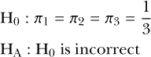

对于这个检验，使用标准显著性水平 0.05。

替代假设的形式与之前看到的稍有不同，但它准确反映了卡方拟合优度检验的解释。在这类问题中，H[0]始终是每个组的比例等于声明的值，H[A]是数据整体与零假设中定义的比例不匹配。假设检验是在假设零假设成立的前提下进行的，反对零假设的证据将以较小的*P*值呈现。

##### **计算：卡方分布检验**

感兴趣的量是每个*k*类别中*n*个观察值的比例，*π*[1], ..., *π*[k]，这是针对单一的互斥且完备的类别变量。原假设定义了每个比例的假定零值；分别将这些标签为*π*[0][(][1][)], ..., *π*[0][(][k][)]。检验统计量χ²定义为

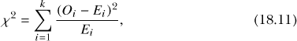

其中 *O[i]* 是第 *i* 类别的 *观察* 计数，*E[i]* 是第 *i* 类别的 *期望* 计数；*i* = 1, ..., *k*。*O[i]* 直接从原始数据中获得，期望计数 *E[i]* = *nπ*[0]*[(][i][)]*，仅仅是总体样本量 *n* 与每个类别相应的零假设比例的乘积。χ² 的结果遵循 *卡方分布*（稍后会进一步解释），自由度为 *ν* = *k* − 1。通常情况下，根据一个非正式的经验法则，检验被认为有效，当期望计数 *E[i]* 中至少 80% 的值应大于或等于 5。

在这种卡方检验中，需要注意以下几点：

• *拟合优度* 一词指的是观察数据与 H[0] 中假定分布的接近程度。

• 结果 (18.11) 的正端提供了反对 H[0] 的证据。因此，相应的 *p-值总是作为上尾面积计算*。

• 正如当前示例中所示，均匀性检验通过将零假设比例 *π*[0] = *π*[0][(][1][)] = ... = *π*[0]*[(][k][)]* 稍微简化了零假设。

• 拒绝 H[0] 并不能告诉你 *π[i]* 的真实值。它仅仅表明它们并不完全符合 H[0]。

卡方分布依赖于自由度的指定，就像 *t* 分布一样。然而，与 *t* 曲线不同，卡方曲线本质上是单向的，只定义为非负值，并具有正的（右侧）水平渐近线（尾部趋向零）。

正是这种单向分布导致了 *p*-值仅定义为上尾面积；一尾或二尾面积在这类卡方检验中没有相关性。为了了解密度函数的实际形态， 图 18-1 展示了三条特定的曲线，定义了 *ν* = 1, *ν* = 5 和 *ν* = 10 的自由度。

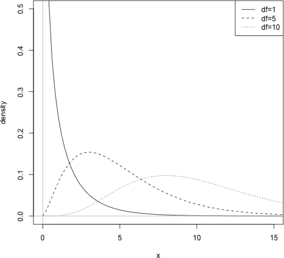

*图 18-1：使用不同自由度值的三种卡方密度函数实例。请注意该函数的正域及其“平坦化”和“右延展”行为，随着*ν*的增加。*

该图像是使用相关的 `d` 函数 `dchisq` 生成的，*ν* 被传递给 `df` 参数。

```
R> x <- seq(0,20,length=100)
R> plot(x,dchisq(x,df=1),type="l",xlim=c(0,15),ylim=c(0,0.5),ylab="density")
R> lines(x,dchisq(x,df=5),lty=2)
R> lines(x,dchisq(x,df=10),lty=3)
R> abline(h=0,col="gray")
R> abline(v=0,col="gray")
R> legend("topright",legend=c("df=1","df=5","df=10"),lty=1:3)
```

当前的面部毛发示例是检验三类频率分布均匀性的测试。你可以通过 `table` 获取观察到的计数和相应的比例。

```
R> n <- length(hairy)
R> n
[1] 53
R> hairy.tab <- table(hairy)
R> hairy.tab
hairy
 1  2  3
11 28 14
R> hairy.tab/n
hairy
        1         2         3
0.2075472 0.5283019 0.2641509
```

计算检验统计量 χ² 时，观察到的计数 *O[i]* 存储在 `hairy.tab` 文件中。期望计数 *E[i]* 是一个直接的算术计算，计算方式为总观察数乘以零假设比例 1/3（结果存储在 `expected` 中），这样你可以为每个类别得到相同的值。

这些，以及每个类别对检验统计量的贡献，都以矩阵形式很好地呈现出来，该矩阵是通过`cbind`构造的（见第 3.1.2 节）。

```
R> expected <- 1/3*n
R> expected
[1] 17.66667
R> hairy.matrix <- cbind(1:3,hairy.tab,expected,
                         (hairy.tab-expected)²/expected)
R> dimnames(hairy.matrix) <- list(c("clean","beard OR mous.",
                                    "beard AND mous."),
                                  c("i","Oi","Ei","(Oi-Ei)²/Ei"))
R> hairy.matrix
                i Oi       Ei (Oi-Ei)²/Ei
clean           1 11 17.66667    2.5157233
beard OR mous.  2 28 17.66667    6.0440252
beard AND mous. 3 14 17.66667    0.7610063
```

请注意，所有期望频数都大于 5，这满足之前提到的非正式经验法则。在 R 编码方面，还需要注意，单个数字`expected`会被隐式回收，以匹配传递给`cbind`的其他向量的长度，并且你使用了`dimnames`属性（参见第 6.2.1 节）来注释行和列。

根据公式（18.11），检验统计量是通过第四列`hairy.matrix`中(*O[i]* − *E[i]*)²/*E*[i]的贡献计算得出的。

```
R> X2 <- sum(hairy.matrix[,4])
R> X2
[1] 9.320755
```

对应的*p*-值是从卡方分布中取出的适当的上尾区域，*ν* = 3 − 1 = 2 个自由度。

```
R> 1-pchisq(X2,df=2)
[1] 0.009462891
```

这个非常小的*p*-值提供了证据，表明在定义的男性面部毛发类别中的真实频率并没有均匀分布为 1/3, 1/3, 1/3 的比例。请记住，检验结果并不会给出真实的比例，而只是表明这些比例并不符合 H[0]中的假设。

##### **R 函数：chisq.test**

与` t.test`和`prop.test`类似，R 提供了一个用于执行卡方拟合优度（GOF）测试的快速函数。`chisq.test`函数将观察到的频率向量作为第一个参数`x`。对于面部毛发的例子，这一简单的代码行提供了与之前相同的结果：

```
R> chisq.test(x=hairy.tab)

        Chi-squared test for given probabilities

data:  hairy.tab
X-squared = 9.3208, df = 2, p-value = 0.009463
```

默认情况下，函数执行的是均匀性检验，认为类别的数量等于传递给`x`的向量的长度。然而，假设收集面部毛发数据的研究人员意识到他是在 11 月收集数据的，那是一个许多男性为了支持“Mo-vember”运动而蓄胡须的月份，以提高对男性健康的关注。这改变了他对清洁剃须（1）、仅有胡须或仅有小胡子（2）、以及胡须和小胡子同时存在（3）类别的真实比例的看法。他现在想测试以下内容：

H[0] : *π*[0][(][1][)] = 0.25； *π*[0][(][2][)] = 0.5； *π*[0][(][3][)] = 0.25

H[A] : H[0] 是错误的。

如果不想进行均匀性的拟合优度（GOF）检验，在类别的“真实”比例不相同的情况下，`chisq.test`函数要求你将原假设比例作为与`x`长度相同的向量传递给`p`参数。自然地，`p`中的每个条目必须与`x`中列出的类别相对应。

```
R> chisq.test(x=hairy.tab,p=c(0.25,0.5,0.25))

        Chi-squared test for given probabilities

data:  hairy.tab
X-squared = 0.5094, df = 2, p-value = 0.7751
```

在*p*-值非常高的情况下，没有证据可以拒绝 H[0]。换句话说，没有证据表明 H[0]中的假设比例是错误的。

#### ***18.4.2 两个分类变量***

卡方检验也适用于具有*两个*互斥且穷尽的分类变量的情况——将它们称为变量*A*和*B*。它用于检测变量*A*和*B*之间是否存在某种影响关系（换句话说，*依赖性*），通过观察频数分布如何随着类别的变化而共同变化。如果没有关系，变量*A*的频数分布将与变量*B*的频数分布无关。因此，这种特定形式的卡方检验被称为*独立性检验*，并始终假设以下假设：

H[0] : 变量*A*和*B*是独立的。

(*或者*，*A*和*B*之间没有关系。)

H[A] : 变量*A*和*B*是*不*独立的。

(*或者*，*A*和*B*之间*有*关系。)

因此，为了进行检验，你需要将观察到的数据与在分布完全无关（即假设 H[0]为真）时期望看到的频数进行比较。若实际频数与期望频数偏差较大，则会导致较小的*p*-值，从而提供反对原假设的证据。

那么，如何最好地呈现这类数据呢？对于两个分类变量，二维结构是合适的；在 R 中，这是一种标准矩阵。例如，假设某些皮肤科医生对治疗常见皮肤病的成功率感兴趣。它们的记录显示*N* = 355 名患者在他们的诊所接受了四种可能治疗中的一种——一疗程药片、系列注射、激光治疗和草药治疗。治愈情况也被记录——无效、部分成功和完全成功。数据以构建的矩阵`skin`给出。

```
R> skin <- matrix(c(20,32,8,52,9,72,8,32,16,64,30,12),4,3,
                  dimnames=list(c("Injection","Tablet","Laser","Herbal"),
                  c("None","Partial","Full")))
R> skin
          None Partial Full
Injection   20       9   16
Tablet      32      72   64
Laser        8       8   30
Herbal      52      32   12
```

以这种方式呈现频数的二维表格称为*列联表*。

##### **计算：卡方独立性检验**

为了计算检验统计量，假设数据以*k[r]* × *k[c]*的列联表形式呈现，换句话说，是基于两个分类变量（均为互斥且穷尽的）的计数矩阵。检验的重点是观察*N*个观测值在“行”变量的*k[r]*个水平和“列”变量的*k[c]*个水平之间频数的联合分布。检验统计量χ²计算公式如下：

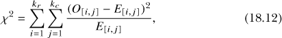

其中，*O*[[]*[i][,] [j]*] 是观察到的频数，*E*[[]*[i][,] [j]*] 是第*i*行第*j*列的预期频数。每个*E*[[]*[i][,] [j]*]是将第*i*行的总和乘以第*j*列的总和，再除以*N*得到的。

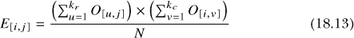

结果，χ²，遵循卡方分布，*ν* = (*k[r]* − 1) × (*k[c]* − 1)的自由度。同样，*p*-值始终是一个上尾区域，当至少 80%的*E*[[]*[i][,] [j]*]大于等于 5 时，你可以认为该检验是有效的。

对于这个计算，需要注意以下几点：

• 不必假设*k[r]* = *k[c]*。

• 方程 (18.12)的功能与(18.11)相同——它涉及到每个单元格观察值和期望值之间的平方差的总和。

• (18.12)中的双重求和仅表示所有单元格的总和，意思是你可以通过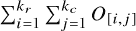来计算总样本量*N*。

• 拒绝 H[0]并不能告诉你频率之间相互依赖的性质，只是表明有证据表明这两个分类变量之间可能存在某种依赖关系。

继续这个例子，皮肤科医生希望确定他们的记录是否表明有统计证据表明治疗类型与皮肤疾病治愈成功率之间存在某种关系。为了方便，分别存储行变量和列变量的类别总数*k[r]*和*k[c]*。

```
R> kr <- nrow(skin)
R> kc <- ncol(skin)
```

你在`skin`中有*O*[[]*[i][,] [j]*]，所以现在你必须计算*E*[[]*[i][,] [j]*]。根据方程 (18.13)，它涉及行和列的总和，你可以使用内建的`rowSums`和`colSums`函数来评估这些。

```
R> rowSums(skin)
Injection    Tablet    Laser    Herbal
       45       168       46        96
R> colSums(skin)
   None Partial    Full
    112     121     122
```

这些结果表示每组中的总数，不考虑其他变量。要获取矩阵中所有单元格的期望频数，方程 (18.13)要求将每行和每列的总和相乘一次。你可以写一个`for`循环，但这会低效且不优雅。更好的做法是使用带有可选`each`参数的`rep`（参考第 2.3.2 节）。通过将列总和（成功的水平）中的每个元素重复四次，你可以利用向量化行为，将这个重复的向量与`rowSums`产生的较短向量相乘。然后，你可以调用`sum(skin)`将其除以*N*并重新排列成矩阵。以下几行展示了这个示例是如何一步步实现的：

```
R> rep(colSums(skin),each=kr)
   None    None    None    None Partial Partial Partial Partial    Full
    112     112     112     112     121     121     121     121     122
   Full    Full    Full
    122     122     122
R> rep(colSums(skin),each=kr)*rowSums(skin)
   None    None    None    None Partial Partial Partial Partial   Full
   5040   18816    5152   10752    5445   20328    5566   11616   5490
   Full    Full    Full
  20496    5612   11712
R> rep(colSums(skin),each=kr)*rowSums(skin)/sum(skin)
    None     None     None     None  Partial  Partial  Partial  Partial
14.19718 53.00282 14.51268 30.28732 15.33803 57.26197 15.67887 32.72113
    Full     Full     Full     Full
15.46479 57.73521 15.80845 32.99155
R> skin.expected <- matrix(rep(colSums(skin),each=kr)*rowSums(skin)/sum(skin),
                           nrow=kr,ncol=kc,dimnames=dimnames(skin))
R> skin.expected
              None  Partial     Full
Injection 14.19718 15.33803 15.46479
Tablet    53.00282 57.26197 57.73521
Laser     14.51268 15.67887 15.80845
Herbal    30.28732 32.72113 32.99155
```

请注意，所有期望值都大于 5，这是首选的情况。

最好构造一个单一的对象来保存计算不同阶段的结果，以得到检验统计量，就像你在一维示例中所做的那样。由于每个阶段都是一个矩阵，你可以使用`cbind`将相关矩阵结合在一起，并生成具有适当维度的数组（详细参考第 3.4 节）。

```
R> skin.array <- array(data=cbind(skin,skin.expected,
                                  (skin-skin.expected)²/skin.expected),
                       dim=c(kr,kc,3),
                       dimnames=list(dimnames(skin)[[1]],dimnames(skin)[[2]],
                                     c("O[i,j]","E[i,j]",
                                       "(O[i,j]-E[i,j])²/E[i,j]")))
R> skin.array
, , O[i,j]

          None Partial Full
Injection   20       9   16
Tablet      32      72   64
Laser        8       8   30
Herbal      52      32   12

, , E[i,j]

              None  Partial     Full
Injection 14.19718 15.33803 15.46479
Tablet    53.00282 57.26197 57.73521
Laser     14.51268 15.67887 15.80845
Herbal    30.28732 32.72113 32.99155

, , (O[i,j]-E[i,j])²/E[i,j]

                None   Partial        Full
Injection   2.371786 2.6190199  0.01852279
Tablet      8.322545 3.7932587  0.67978582
Laser       2.922614 3.7607992 12.74002590
Herbal     15.565598 0.0158926 13.35630339
```

最后的步骤很简单——由 (18.12) 给出的检验统计量仅仅是 `skin.array` 第三层矩阵所有元素的总和。

```
R> X2 <- sum(skin.array[,,3])
R> X2
[1] 66.16615
```

此独立性检验的相应 *p*-值如下：

```
R> 1-pchisq(X2,df=(kr-1)*(kc-1))
[1] 2.492451e-12
```

回想一下，相关的自由度定义为 *ν* = (*k[r]* − 1) × (*k[c]* − 1)。

极小的 *p*-值为反对原假设提供了强有力的证据。适当的结论是拒绝 H[0]，并指出皮肤疾病治疗类型与治愈成功率之间似乎存在关系。

##### **R 函数：chisq.test**

然而，再一次，本章的任何部分如果没有展示 R 在这些基本程序中内置的功能，将不完整。当 `chisq.test` 接受一个矩阵作为 `x` 时，其默认行为是执行一个卡方独立性检验，检验行和列频率的独立性——就像这里对皮肤疾病示例进行的手动计算一样。以下结果轻松验证了你之前的计算：

```
R> chisq.test(x=skin)

        Pearson's Chi-squared test

data:  skin
X-squared = 66.1662, df = 6, p-value = 2.492e-12
```

**练习 18.4**

`HairEyeColor` 是 R 中的一个现成数据集，你可能还没遇到过。这个 4 × 4 × 2 的数组提供了 592 名统计学学生的发色和眼色频率，按性别划分（Snee, 1974）。

1.  在显著性水平 *α* = 0.01 下，对所有学生（无论性别）进行发色与眼色的卡方独立性检验，并进行解释。

在 练习 8.1 中，你访问了贡献包 `car` 中的 `Duncan` 数据集，包含了 1950 年收集的工作声望标记。如果你还没有安装该包，请安装并加载数据框。

1.  `Duncan` 的第一列是变量 `type`，记录作为因子具有三种水平的工作类型：`prof`（专业或管理）、`bc`（蓝领）和 `wc`（白领）。构造适当的假设并执行卡方拟合优度检验，以确定三种工作类型在数据集中是否平等地分布。

    1.  根据显著性水平 *α* = 0.05 解释结果中的 *p*-值。

    1.  如果你使用显著性水平 *α* = 0.01，会得出什么结论？

### **18.5 误差与检验力**

在讨论所有这些形式的统计假设检验时，有一个共同的主题：对 *p*-值的解释，以及它在假设检验中的意义。频率学派统计假设检验在许多研究领域中广泛应用，因此至少要简要探索与之直接相关的概念。

#### ***18.5.1 假设检验误差***

假设检验的目的是获得一个*p*值，以量化反对原假设 H[0]的证据。如果*p*值小于预先定义的显著性水平*α*（通常为 0.05 或 0.01），则拒绝原假设，接受备择假设 H[A]。如前所述，这种方法被批评是正当的，因为*α*的选择基本上是任意的；拒绝或保留 H[0]的决定可以仅仅依赖于*α*值的变化。

设想一下，在某个特定的检验中，*正确*的结果是什么。如果 H[0]是真的，那么你就应该保留它。如果 H[A]是真的，那么你应该拒绝原假设。这种“真理”，无论如何，在实践中是无法知道的。话虽如此，从理论上考虑给定假设检验在得出正确结论方面的效果（好或坏）仍然是有意义的。

为了能够测试你拒绝或保留原假设的有效性，你必须能够识别两种类型的错误：

• 当你错误地拒绝一个真实的 H[0]时，就会发生*第一类错误*。在任何给定的假设检验中，第一类错误的概率等同于显著性水平*α*。

• 当你错误地保留一个错误的 H[0]（换句话说，未能接受一个真实的 H[A]）时，就会发生*第二类错误*。由于这取决于真实的 H[A]是什么，因此，发生这种错误的概率，标记为*β*，在实践中通常是无法知道的。

#### ***18.5.2 第一类错误***

如果你的*p*值小于*α*，则拒绝原假设。但是，如果原假设实际上是真的，*α*直接定义了你*错误*拒绝它的概率。这被称为*第一类错误*。

图 18-2 提供了一个假设检验中第一类错误概率的概念性示意图，其中假设设定为 H[0] : *μ* = *μ*[0] 和 H[A] : *μ* > *μ*[0]。

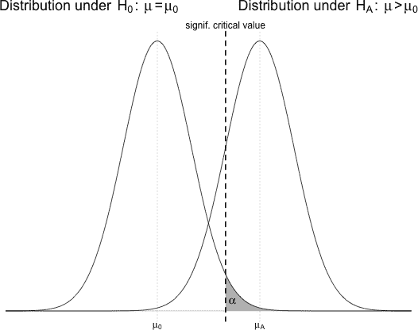

*图 18-2：第一类错误概率* *α*的概念图

原假设分布以原值*μ*[0]为中心；备择假设分布以其右侧的某个均值*μ*[A]为中心，如图 18-2 所示。如你所见，如果原假设是真的，那么在此检验中错误地拒绝它的概率将等于显著性水平*α*，位于原假设分布的右尾部。

##### **模拟第一类错误**

为了通过*数值模拟*演示第一类错误率（这里指的是随机生成假设数据样本），你可以编写代码，执行等效的重复假设检验。为了能够多次使用此代码，可以在 R 脚本编辑器中定义以下函数：

```
typeI.tester <- function(mu0,sigma,n,alpha,ITERATIONS=10000){
    pvals <- rep(NA,ITERATIONS)
    for(i in 1:ITERATIONS){
        temporary.sample <- rnorm(n=n,mean=mu0,sd=sigma)
        temporary.mean <- mean(temporary.sample)
        temporary.sd <- sd(temporary.sample)
        pvals[i] <- 1-pt((temporary.mean-mu0)/(temporary.sd/sqrt(n)),df=n-1)
    }
    return(mean(pvals<alpha))
}
```

`typeI.tester`函数旨在从特定的正态分布中生成`ITERATIONS`个样本。对于每个样本，你将进行一个关于均值的右尾检验（参考第 18.2.1 节），遵循图 18-2 中的思路，假设原假设 H[0] : *μ* = *μ*[0]和备择假设 H[A] : *μ* > *μ*[0]。

你可以减少`ITERATIONS`以生成较少的完整样本，这样可以加速计算时间，但会导致模拟的错误率更为波动。每个大小为`n`的假设原始测量的完整样本都是使用`rnorm`生成的，均值为`mu0`参数（标准差为`sigma`参数）。所需的显著性水平由`alpha`设置。在`for`循环中，为每个生成的样本计算样本均值和样本标准差。

如果每个样本都经过“真实”的假设检验，*p*值将取自自由度为`n-1`的*t*分布的右侧区域（使用`pt`），并依据之前在公式 (18.2)中给出的标准化检验统计量。

在每次迭代中计算出的*p*值存储在预定义的向量`pvals`中。因此，逻辑向量`pvals<alpha`包含相应的`TRUE`/`FALSE`值；前者逻辑值标志着原假设的拒绝，后者标志着原假设的保留。I 型错误率是通过对该逻辑向量调用`mean`得到的，它返回`TRUE`的比例（换句话说，就是“原假设被拒绝”的总体比例），该比例来自模拟的样本。请记住，样本是随机生成的，因此每次运行函数时，结果可能会稍微有所变化。

该函数之所以有效，是因为根据问题的定义，正在生成的样本来自一个均值确实设定为原假设值的分布，换句话说，*μ*[A] = *μ*[0]。因此，任何对该陈述的统计拒绝，如果*p*值小于显著性水平*α*，显然是错误的，完全是随机变异的结果。

要尝试此操作，导入该函数并执行，生成默认的`ITERATIONS=10000`个样本。使用标准正态分布作为原假设分布（在此情况下为“真实”分布）；使每个样本的大小为 40，并将显著性水平设置为常规的*α* = 0.05。以下是一个示例：

```
R> typeI.tester(mu0=0,sigma=1,n=40,alpha=0.05)
[1] 0.0489
```

这表明，取自样本的 10,000 × 0.0489 = 489 个样本，得到了一个相应的检验统计量，提供了一个*p*值，这将错误地导致拒绝 H[0]。这个模拟的 I 型错误率接近预设的`alpha=0.05`。

这是另一个示例，这次使用非标准正态数据样本，*α* = 0.01：

```
R> typeI.tester(mu0=-4,sigma=0.3,n=60,alpha=0.01)
[1] 0.0108
```

请注意，再次提醒，数值模拟的 I 型错误率反映了显著性水平。

这些结果在理论上并不难理解——如果真实分布确实具有等于零假设值的均值，您将自然地在实践中以等于*α*的频率观察到这些“极端”的检验统计量值。当然，问题在于，在实践中真实分布是未知的，这再次强调了拒绝任何 H[0]不能被解读为 H[A]为真的证明。可能仅仅是您观察到的样本遵循了零假设，但由于偶然原因（无论这种偶然性多么小），产生了极端的检验统计量值。

##### **邦费罗尼校正**

第一类错误自然由于随机变异而发生这一事实尤其重要，这促使我们考虑*多重检验问题*。如果您进行许多假设检验，您应该小心仅报告“统计显著的结果数量”——随着假设检验数量的增加，您得到错误结果的机会也会增加。例如，在进行 20 次*α* = 0.05 的检验时，平均会有一次是所谓的假阳性；如果您进行 40 或 60 次检验，您不可避免地会得到更多的假阳性结果。

当进行多个假设检验时，您可以通过使用*邦费罗尼校正*来控制与犯第一类错误相关的多重检验问题。邦费罗尼校正建议，当执行总共*N*个独立的假设检验时，每个检验的显著性水平为*α*，您应该使用*α*[B] = *α*/*N*来进行任何统计显著性的解释。然而，需注意的是，这种显著性水平的校正代表了多重检验问题的最简单解决方案，并且由于其保守性，可能会受到批评，尤其当*N*值较大时可能会带来问题。

邦费罗尼校正及其他校正措施是为了正式化修正多重检验中第一类错误的办法。然而，通常情况下，仅意识到零假设（H[0]）可能为真，即使*p*值被认为较小，也足够了。

#### ***18.5.3 第一类错误***

第一类错误的问题可能会让人认为应该用更小的*α*值进行假设检验。不幸的是，事情并非如此简单；减少任何给定检验的显著性水平将直接导致犯第一类错误的机会增加。

第一类错误（Type II Error）指的是错误地保留原假设——换句话说，当实际为备择假设为真时，得到的*p*值大于显著性水平。对于您至今所看的相同情境（单样本均值的上尾检验），图 18-3 显示了第一类错误的概率，以阴影标示并表示为*β*。

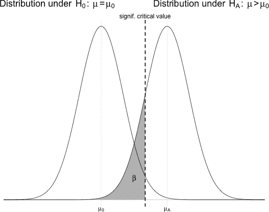

*图 18-3：第一类错误概率*β*的概念图*

找到*β*并不像找到 I 型错误概率那么容易，因为*β*依赖于多个因素，其中之一是*μ*[A]的真实值（通常你是无法知道的）。如果*μ*[A]接近假设的零值*μ*[0]，你可以想象替代分布在图 18-3 中向左平移（偏移），从而导致*β*的增大。同样地，继续参考图 18-3，假设减少显著性水平*α*。这样做意味着垂直虚线（表示相应的临界值）向右移动，也会增加*β*的阴影区域。直观上，这是有道理的——真实的替代值越接近零值和/或显著性水平越小，通过拒绝 H[0]检测到 H[A]的难度就越大。

如前所述，*β*通常无法在实践中计算出来，因为需要知道真实分布是什么。然而，这个量在给出测试在特定条件下错误保留零假设的倾向时是有用的。例如，假设你正在进行一个单样本*t*-检验，零假设 H[0]：*μ* = *μ*[0]，备择假设 H[A]：*μ* > *μ*[0]，其中*μ*[0] = 0，但原始测量的（真实）备择分布具有均值*μ*[A] = 0.5 和标准差*σ* = 1。假设随机样本大小为*n* = 30，并使用显著性水平*α* = 0.05，那么在任何给定的假设检验中，犯 II 型错误的概率是多少（使用零分布的相同标准差）？为了回答这个问题，重新查看图 18-3；你需要临界值，这个临界值由显著性水平（虚线垂直线）标出。如果假设*σ*已知，那么感兴趣的抽样分布将是正态分布，均值为*μ*[0] = 0，标准误差为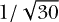（参见第 17.1.1 节）。因此，假设上尾面积为 0.05，你可以通过以下方法找到临界值：

```
R> critval <- qnorm(1-0.05,mean=0,sd=1/sqrt(30))
R> critval
[1] 0.3003078
```

这表示在该特定情况下的垂直虚线（有关`qnorm`使用的复习请见第 16.2.2 节）。这个例子中的 II 型错误是指在替代“真实”分布下，从临界值开始，左侧尾部区域的面积：

```
R> pnorm(critval,mean=0.5,sd=1/sqrt(30))
[1] 0.1370303
```

从这里可以看出，在这些条件下进行假设检验时，错误保留零假设的概率大约为 13.7%。

##### **模拟 II 型错误**

在这里，模拟特别有用。在编辑器中，考虑以下定义的函数`typeII.tester`：

```
typeII.tester <- function(mu0,muA,sigma,n,alpha,ITERATIONS=10000){
    pvals <- rep(NA,ITERATIONS)
    for(i in 1:ITERATIONS){
        temporary.sample <- rnorm(n=n,mean=muA,sd=sigma)
        temporary.mean <- mean(temporary.sample)
        temporary.sd <- sd(temporary.sample)
        pvals[i] <- 1-pt((temporary.mean-mu0)/(temporary.sd/sqrt(n)),df=n-1)
    }
    return(mean(pvals>=alpha))
}
```

这个函数类似于`typeI.tester`。零值、原始测量的标准差、样本大小、显著性水平和迭代次数与之前相同。此外，你现在有了`muA`，提供了生成样本时所使用的“真实”均值*μ*[A]。同样，在每次迭代时，都会生成一个大小为`n`的随机样本，计算其均值和标准差，并使用`pt`从通常的标准化检验统计量中计算出适当的*p*值，`df=n-1`。（记住，由于你正在使用样本标准差*s*来估计测量的真实标准差*σ*，因此技术上使用*t*分布是正确的。）完成`for`循环后，返回*p*值大于或等于显著性水平`alpha`的比例。

在将函数导入工作空间后，你可以为这个测试模拟*β*。

```
R> typeII.tester(mu0=0,muA=0.5,sigma=1,n=30,alpha=0.05)
[1] 0.1471
```

我的结果表明，与之前评估的理论*β*值接近，尽管因为使用基于*t*的采样分布而非正态分布，额外的不确定性使得结果稍微偏大。再次强调，每次运行`typeII.tester`时，由于所有结果都基于随机生成的假设数据样本，结果都会略有不同。

转向图 18-3，你可以看到（与之前的评论一致），如果为了减少一型错误的可能性，使用*α* = 0.01 而非 0.05，垂直线会向右移动，从而增加二型错误的概率，其他条件保持不变。

```
R> typeII.tester(mu0=0,muA=0.5,sigma=1,n=30,alpha=0.01)
[1] 0.3891
```

##### **影响二型错误率的其他因素**

显著性水平不是唯一影响*β*的因素。保持*α*为 0.01，看看当原始测量的标准差从*σ* = 1 增加到*σ* = 1.1，再到*σ* = 1.2 时，会发生什么变化。

```
R> typeII.tester(mu0=0,muA=0.5,sigma=1.1,n=30,alpha=0.01)
[1] 0.4815
R> typeII.tester(mu0=0,muA=0.5,sigma=1.2,n=30,alpha=0.01)
[1] 0.5501
```

增加测量的变异性，而不改变情境中的其他任何内容，也会增加二型错误的机会。你可以想象，图 18-3 中的曲线会因为均值的标准误增大而变得更加平坦且分散，这将导致在由临界值标记的左侧尾部有更多的概率权重。相反，如果原始测量的变异性较小，那么样本均值的采样分布会变得更高更窄，这意味着*β*值会降低。

更小或更大的样本量将产生类似的影响。由于位于标准误差公式的分母，更小的*n*会导致更大的标准误差，从而使曲线变得更平坦，*β*增加；而更大的样本量会产生相反的效果。如果你保持最新的*μ*[0] = 0，*μ*[A] = 0.5，*σ* = 1.2，和*α* = 0.01，注意将样本量从 30 减少到 20 会导致模拟的第二类错误率增加，较最近结果 0.5501 相比，增加样本量到 40 则会改善该比率。

```
R> typeII.tester(mu0=0,muA=0.5,sigma=1.2,n=20,alpha=0.01)
[1] 0.7319
R> typeII.tester(mu0=0,muA=0.5,sigma=1.2,n=40,alpha=0.01)
[1] 0.4219
```

最后，如讨论开始时所述，*μ*[A]的具体值本身会影响*β*，正如你所期望的那样。同样，保持其他所有组件的最新值，在我的案例中，*β* = 0.4219，注意通过将“真实”均值从*μ*[A] = 0.5 改变为*μ*[A] = 0.4，将*μ*[0]的均值拉近，意味着第二类错误的概率增加；如果差异增加到*μ*[A] = 0.6，则情况正好相反。

```
R> typeII.tester(mu0=0,muA=0.4,sigma=1.2,n=40,alpha=0.01)
[1] 0.6147
R> typeII.tester(mu0=0,muA=0.6,sigma=1.2,n=40,alpha=0.01)
[1] 0.2287
```

总结一下，尽管这些模拟的比率应用于假设检验是针对单一均值的上尾检验的特定情况，但这里讨论的基本概念和思想适用于任何假设检验。很容易得出第一类错误率与预定义的显著性水平相匹配，因此可以通过减小*α*来降低。相反，控制第二类错误率是一项复杂的平衡工作，涉及样本量、显著性水平、观察变异性以及真实值与原假设之间的差异大小。这个问题在学术上较为重要，因为在实际中，“真实”通常是未知的。然而，第二类错误率与统计功效的直接关系通常在数据收集准备中起着至关重要的作用，特别是在你考虑样本量需求时，正如你将在下一部分中看到的那样。

**练习 18.5**

1.  编写一个新的`typeI.tester`版本，命名为`typeI.mean`。新函数应能够模拟单一均值测试的第一类错误率，支持任意方向（换句话说，单尾或双尾）。新函数应接受一个额外的参数`test`，该参数取字符字符串`"less"`、`"greater"`或`"two.sided"`，以指定所需的测试类型。你可以通过如下修改`typeI.tester`来实现：

    – 不要直接在`for`循环中计算并存储*p*-值，而是只存储测试统计量。

    – 当循环完成时，设置堆叠的`if`-`else`语句，以适应三种测试类型，根据需要计算*p*-值。

    – 对于双尾检验，请记住*p*-值定义为零假设之外“更极端”的区域的两倍。在计算上，这意味着如果检验统计量为正，必须使用上尾区域，反之则使用下尾区域。如果该区域小于*α*的一半（因为它在“真实”假设检验中会被乘以 2），则应标记为拒绝零假设。

    – 如果`test`的值不是三种可能值之一，函数应使用`stop`抛出适当的错误。

    1.  使用文本中的第一个示例设置进行实验，*μ*[0] = 0，*σ* = 1，*n* = 40，以及*α* = 0.05。调用`typeI.mean`三次，使用`test`的三种可能选项中的每一种。你应该会发现所有模拟结果都接近 0.05。

    1.  重复 (i) 使用文本中的第二个示例设置，*μ*[0] = −4，*σ* = 0.3，*n* = 60，以及*α* = 0.01。你应该会发现所有模拟结果都接近*α*的值。

1.  修改`typeII.tester`，与修改`typeI.tester`的方式相同；将新函数命名为`typeII.mean`。模拟以下假设检验的类型 II 错误率。根据文本，假设*μ*[A]，*σ*，*α*和*n*分别表示真实均值、原始观测的标准差、显著性水平和样本大小。

    1.  H[0] : *μ* = −3.2；H[A] : *μ* ≠ −3.2

        其中*μ*[A] = −3.3，*σ* = 0.1，*α* = 0.05，*n* = 25。

    1.  H[0] : *μ* = 8994；H[A] : *μ* < 8994

        其中*μ*[A] = 5600，*σ* = 3888，*α* = 0.01，*n* = 9。

    1.  H[0] : *μ* = 0.44；H[A] : *μ* > 0.44

        其中*μ*[A] = 0.4，*σ* = 2.4，*α* = 0.05，*n* = 68。

#### ***18.5.4 统计功效***

对于任何假设检验，考虑其潜在的统计功效是非常有用的。*功效*是正确拒绝一个不真实的零假设的概率。对于一个具有类型 II 错误率*β*的检验，统计功效通过 1 − *β* 计算得出。一个检验的功效越高越好。与类型 II 错误概率的简单关系意味着所有影响*β*值的因素也直接影响功效。

对于前一节中讨论的相同单尾 H[0] : *μ* = *μ*[0]和 H[A] : *μ* > *μ*[0]的例子，图 18-4 显示了检验的功效——即类型 II 错误率的补数。按照惯例，假设检验的功效大于 0.8 被认为是*统计显著*的。

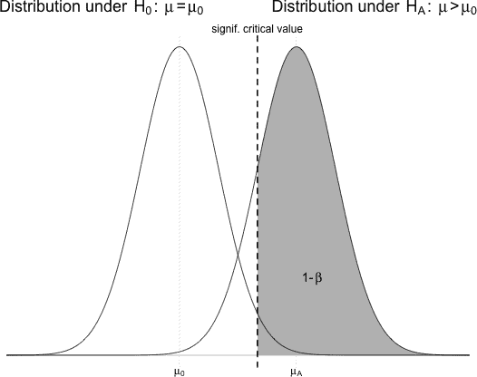

*图 18-4：统计功效 1 − *β**的概念图

您可以通过模拟在特定检验条件下数值化地评估效能。关于第二类错误的前面讨论，您可以通过从 1 中减去所有模拟结果的*β*来评估该特定检验的效能。例如，当*μ*[0] = 0，*μ*[A] = 0.6 时，样本大小为*n* = 40，*σ* = 1.2，*α* = 0.01 时，检测效能为 1 − 0.2287 = 0.7713（使用我之前得到的*β*的最新结果）。这意味着，在基于这些条件生成的测量样本的假设检验中，正确检测到真实均值 0.6 的概率大约为 77%。

研究人员通常对效能与样本大小之间的关系感兴趣（尽管重要的是要记住，这只是决定效能的影响因素之一）。在开始收集数据以检验某个特定假设之前，您可能会从过去的研究或初步研究中获得关于感兴趣参数潜在真实值的想法。这对于确定样本大小非常有用，例如帮助回答类似“如果真实均值实际上是*μ*[A]，我需要多大的样本才能进行一个统计学上有效的检验，以正确拒绝 H[0]？”这样的问题。

##### **模拟效能**

在最近的检验条件下，样本大小为*n* = 40，您已经发现检测*μ*[A] = 0.6 的效能大约为 0.77。为了这个例子，假设您想找出应当如何增加*n*的值，以便进行一个统计学上有效的检验。为了回答这个问题，在编辑器中定义以下`power.tester`函数：

```
power.tester <- function(nvec,...){
    nlen <- length(nvec)
    result <- rep(NA,nlen)
    pbar <- txtProgressBar(min=0,max=nlen,style=3)
    for(i in 1:nlen){
        result[i] <- 1-typeII.tester(n=nvec[i],...)
        setTxtProgressBar(pbar,i)
    }
    close(pbar)
    return(result)
}
```

`power.tester`函数使用第 18.5.3 节中定义的`typeII.tester`函数来评估单一样本均值的给定上尾假设检验的效能。它接受一个作为`nvec`参数传入的样本大小向量（所有其他参数通过省略号传递给`typeII.tester`——请参见第 11.2.4 节）。`power.tester`中的`for`循环依次遍历`nvec`中的每一项，为每个样本大小模拟效能，并将结果存储在一个相应的向量中，该向量会返回给用户。请记住，通过`typeII.tester`，该函数使用假设数据样本的随机生成，因此每次运行`power.tester`时，您观察到的结果可能会有所波动。

在评估许多独立样本大小的效能时可能会有轻微的延迟，因此这个函数也提供了一个很好的机会来展示进度条的实际应用（有关详细信息，请参见第 12.2.1 节）。

设置以下向量，使用冒号操作符（参见第 2.3.2 节）构造一个包含从 5 到 100（包括 100）之间的整数序列，用于检查的样本大小：

```
R> sample.sizes <- 5:100
```

导入`power.tester`函数后，你可以模拟这些整数的功效，用于此特定测试（`ITERATIONS`被减半为`5000`以减少整体完成时间）。

```
R> pow <- power.tester(nvec=sample.sizes,
                       mu0=0,muA=0.6,sigma=1.2,alpha=0.01,ITERATIONS=5000)
  |====================================================================| 100%
R> pow
 [1] 0.0630 0.0752 0.1018 0.1226 0.1432 0.1588 0.1834 0.2162 0.2440 0.2638
[11] 0.2904 0.3122 0.3278 0.3504 0.3664 0.3976 0.4232 0.4478 0.4680 0.4920
[21] 0.5258 0.5452 0.5552 0.5616 0.5916 0.6174 0.6326 0.6438 0.6638 0.6844
[31] 0.6910 0.7058 0.7288 0.7412 0.7552 0.7718 0.7792 0.7950 0.8050 0.8078
[41] 0.8148 0.8316 0.8480 0.8524 0.8600 0.8702 0.8724 0.8800 0.8968 0.8942
[51] 0.8976 0.9086 0.9116 0.9234 0.9188 0.9288 0.9320 0.9378 0.9370 0.9448
[61] 0.9436 0.9510 0.9534 0.9580 0.9552 0.9648 0.9656 0.9658 0.9684 0.9756
[71] 0.9742 0.9770 0.9774 0.9804 0.9806 0.9804 0.9806 0.9854 0.9848 0.9844
[81] 0.9864 0.9886 0.9890 0.9884 0.9910 0.9894 0.9906 0.9930 0.9926 0.9938
[91] 0.9930 0.9946 0.9948 0.9942 0.9942 0.9956
```

正如预期的那样，随着*n*的增加，检出功效稳步上升；这些结果中，常规的 80%临界值出现在 0.7950 和 0.8050 之间。如果你不想通过视觉来识别该值，你可以使用`which`先找到`pow`中至少为 0.8 的条目的索引，然后使用`min`返回该类别中的最小值。然后，可以在方括号中指定该索引到`sample.sizes`中，以得到与该模拟功效对应的*n*值（在此情况下为 0.8050）。这些命令可以像这样嵌套：

```
R> minimum.n <- sample.sizes[min(which(pow>=0.8))]
R> minimum.n
[1] 43
```

结果表明，如果你的样本量至少为 43，在这些特定条件下进行假设检验应该是具有统计功效的（基于此次`pow`中随机模拟的输出）。

如果这个测试的显著性水平放宽了会怎样呢？假设你想在显著性水平为*α* = 0.05 而非 0.01 的情况下进行测试（仍然是在*μ*[0] = 0，*μ*[A] = 0.6，*σ* = 1.2 的条件下进行上尾检验）。如果你再次查看图 18-4，这个变化意味着垂直线（临界值）会向左移动，从而减少*β*并增加功效。因此，这表明你需要比之前更小的样本量，换句话说，在*α*增加时，进行统计上有力的测试时，*n* < 43。

为了模拟这个情况，使用相同范围的样本量并将结果功效存储在`pow2`中，查看以下内容：

```
R> pow2 <- power.tester(nvec=sample.sizes,
                        mu0=0,muA=0.6,sigma=1.2,alpha=0.05,ITERATIONS=5000)
  |====================================================================| 100%
R> minimum.n2 <- sample.sizes[min(which(pow2>0.8))]
R> minimum.n2
[1] 27
```

这个结果表明，至少需要 27 个样本量，这是相比于*α* = 0.01 时所需的 43 个样本量的显著减少。然而，放宽*α*意味着增加犯第一类错误的风险！

##### **功效曲线**

为了比较，你可以通过使用`pow`和`pow2`绘制你的模拟功效，生成一种功效曲线，使用以下代码：

```
R> plot(sample.sizes,pow,xlab="sample size n",ylab="simulated power")
R> points(sample.sizes,pow2,col="gray")
R> abline(h=0.8,lty=2)
R> abline(v=c(minimum.n,minimum.n2),lty=3,col=c("black","gray"))
R> legend("bottomright",legend=c("alpha=0.01","alpha=0.05"),
          col=c("black","gray"),pch=1)
```

我的特定图像见图 18-5。一条水平线标出了 0.8 的功效值，垂直线标出了在`minimum.n`和`minimum.n2`中存储的最小样本量值。最后，添加了图例来参考每条曲线的*α*值。

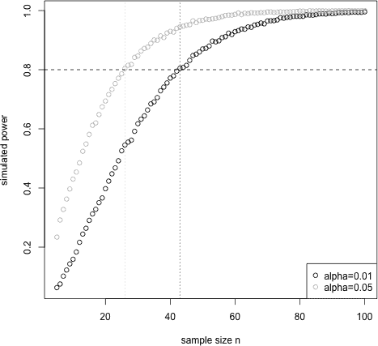

*图 18-5：单一样本均值上尾假设检验的模拟功效曲线*

曲线本身显示了你所期望的情况——随着样本量的增加，检出功效也增加。你还可以注意到，当功效接近 1 时，曲线趋于平稳，这通常是功效曲线的典型特征。对于*α* = 0.05，曲线几乎始终位于*α* = 0.01 曲线之上，尽管当*n*超过 75 左右时，差异变得微不足道。

之前关于错误和功效的讨论突出了在解释即便是最基础的统计检验结果时需要小心。*p*值仅仅是一个概率，因此，无论它在任何情况下有多小，都无法单独证明或反驳一个假设。应考虑与假设检验质量相关的问题（无论是参数性检验还是非参数性检验），尽管在实践中这可能是一个挑战。然而，了解 I 型和 II 型错误，以及统计功效的概念，对于任何正式统计检验程序的实施和评估都极为有用。

**练习 18.6**

1.  在这个练习中，您需要写出来自练习 18.5（b）中的`typeII.mean`函数。使用该函数，修改`power.tester`，使得新函数`power.mean`调用`typeII.mean`，而不是调用`typeII.tester`。

    1.  确认假设检验 H[0] : *μ* = 10; H[A] : *μ* ≠ 10，且*μ*[A] = 10.5，*σ* = 0.9，*α* = 0.01，*n* = 50 的检验功效大约为 88%。

    1.  记得第 18.2.1 节中关于 80 克零食包净重的假设检验，基于`snack`向量中提供的*n* = 44 个观察值。假设如下：

        H[0] : *μ* = 80

        H[A] : *μ* < 80

        如果真实均值是*μ*[A] = 78.5 克，且真实的体重标准差是*σ* = 3.1 克，使用`power.mean`来判断该检验是否在统计上有效，假设*α* = 0.05。如果*α* = 0.01，您的答案是否会改变？

1.  继续使用零食假设检验，利用文本中的`sample.sizes`向量，确定使用*α* = 0.05 和*α* = 0.01 时，统计学上有效的最低样本量。绘制显示两条功效曲线的图表。

##### **本章中的重要代码**

| **函数/操作符** | **简要描述** | **首次出现** |
| --- | --- | --- |
| `t.test` | 单样本和双样本*t*检验 | 第 18.2.1 节, 第 391 页 |
| `prop.test` | 单样本和双样本*Z*检验 | 第 18.3.1 节, 第 405 页 |
| `pchisq` | 卡方累积分布问题 | 第 18.4.1 节, 第 414 页 |
| `chisq.test` | 卡方分布/独立性检验 | 第 18.4.1 节, 第 414 页 |
| `rowSums` | 矩阵行总和 | 第 18.4.2 节, 第 417 页 |
| `colSums` | 矩阵列总和 | 第 18.4.2 节, 第 417 页 |
