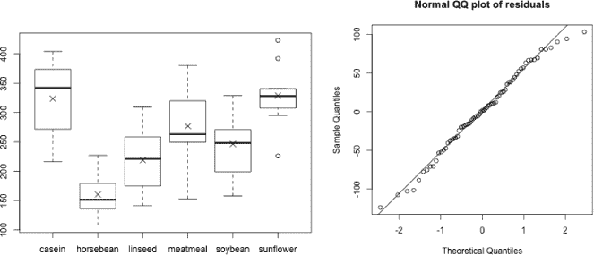
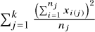
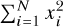
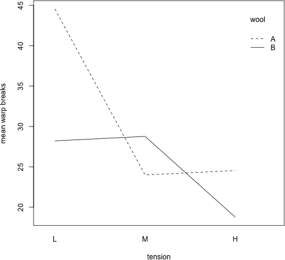
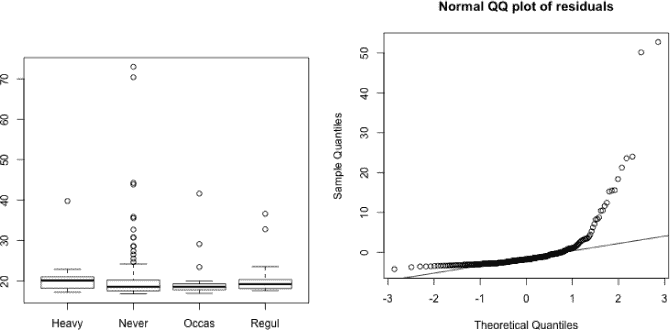

## 19

**方差分析**


*方差分析（ANOVA）*，其最简单的形式，用于比较多个均值是否相等的检验。从这个意义上讲，它是对比两个均值的假设检验的直接扩展。这里有一个连续变量，通过它计算出感兴趣的均值，且至少有一个分类变量告诉你如何为这些均值定义组。在本章中，你将探索关于方差分析的相关概念，首先看看通过一个分类变量（单向 ANOVA）划分组的均值比较，然后再看看通过多个分类变量（多因素 ANOVA）划分组的均值比较。

### 19.1 单向 ANOVA

最简单版本的方差分析（ANOVA）被称为*单因素*或*单向*分析。简而言之，单向 ANOVA 用于检验两个或更多均值是否相等。这些均值通过一个分类的*组*或*因子*变量来划分。方差分析通常用于分析实验数据，以评估干预措施的影响。例如，你可能有兴趣比较内置`chickwts`数据集中，按照它们所喂食的不同食物类型划分的小鸡的平均体重。

#### *19.1.1 假设与诊断检查*

假设你有一个分类的名义型变量，它将总共*N*个数值型观测分为*k*个不同的组，其中*k* ≥ 2。你想要统计地比较这*k*个组的均值，*μ[1]*,...,*μ[k]*，看看它们是否可以声称是相等的。标准的假设如下：

H[0] : *μ[1]* = *μ[2]* = ... = *μ[k]*

H[A] : *μ[1]*, *μ[2]*, ... , *μ[k]* 并不相等

（或者，至少有一个均值不同）。

实际上，当*k* = 2 时，两样本*t*检验等同于方差分析；因此，方差分析最常用于*k* > 2 的情况。

为了使基本的单向 ANOVA 测试结果被认为是可靠的，以下假设需要满足：

**独立性** 组成*k*组的样本必须相互独立，每个组中的观测值必须是独立且同分布的（iid）。

**正态性** 每个组中的观测值应该服从正态分布，或者至少是大致如此。

**方差齐性** 每个组中的观测值方差应该相等，或者至少是大致相等的。

如果方差齐性或正态性假设被违反，这并不意味着你的结果完全没有价值，但会影响检测均值差异的整体有效性（请参阅第 18.5.4 节关于统计功效的讨论）。在使用 ANOVA 之前，评估这些假设的有效性始终是个好主意；我将在接下来的示例中非正式地进行这种评估。

另外值得注意的是，进行检验时，组内观察值数量不必完全相等（此时称为*不平衡*）。然而，组不平衡会使检验对方差相等性和正态性假设不成立时产生潜在不利影响时更加敏感。

让我们回到`chickwts`数据作为本例——这是根据* k * = 6 种不同饲料的小鸡体重数据。你希望比较不同饲料类型下的均值体重，看看它们是否相等。使用`table`来总结六个样本的大小，使用`tapply`（例如参见第 13.2.1 节）来获取每个组的均值，如下所示：

```
R> table(chickwts$feed)

   casein horsebean   linseed  meatmeal   soybean sunflower
       12        10        12        11        14        12
R> chick.means <- tapply(chickwts$weight,INDEX=chickwts$feed,FUN=mean)
R> chick.means
   casein horsebean   linseed  meatmeal   soybean sunflower
 323.5833  160.2000  218.7500  276.9091  246.4286  328.9167
```

你在第 14.3.2 节中的技能使你能够生成并排显示的箱形图，比较不同喂养方式下的小鸡体重分布。接下来的两行代码将生成图 19-1 左侧的图表：

```
R> boxplot(chickwts$weight~chickwts$feed)
R> points(1:6,chick.means,pch=4,cex=1.5)
```



*图 19-1：探索* `chickwts` *数据。左图：按饲料类型划分的小鸡体重并排箱形图，均值由* ×*标出。右图：每个饲料组的均值中心化数据的正态 QQ 图。*

由于箱形图显示的是中位数而不是均值，第二行代码通过`points`将每个箱形图的喂养特定均值（存储在你刚刚创建的`chick.means`对象中）添加到箱形图中。

检查图 19-1 左侧的图表，显然看起来均值体重有所不同。然而，这种明显的差异是否具有统计学意义呢？为了弄清楚这一点，本例的方差分析（ANOVA）测试涉及以下假设：

H[0] : *μ*[casein] = *μ*[horsebean] = *μ*[linseed] = *μ*[meatmeal] = *μ*[soybean] = *μ*[sunflower]

H[A] : 均值不全相等。

假设数据独立，在执行测试之前，首先必须检查其他假设是否有效。为了检查方差是否相等，你可以使用与两样本*t*检验中相同的非正式经验法则。也就是说，如果最大样本标准差与最小样本标准差之比小于 2，就可以假设方差相等。对于小鸡体重数据，以下代码将帮助你进行这一检查：

```
R> chick.sds <- tapply(chickwts$weight,INDEX=chickwts$feed,FUN=sd)
R> chick.sds
   casein horsebean   linseed  meatmeal   soybean sunflower
 64.43384  38.62584  52.23570  64.90062  54.12907  48.83638
R> max(chick.sds)/min(chick.sds)
[1] 1.680238
```

这个非正式结果表明，做出这个假设是合理的。

接下来，考虑原始观测值的正态性假设。在许多真实数据的例子中，这可能很难确定。然而，至少值得检查直方图和 QQ 图，寻找非正态性的迹象。你已经在第 16.2.2 节中检查了所有 71 个权重的直方图和 QQ 图，但对于方差分析（ANOVA），你需要针对观测值的分组进行此操作（也就是说，不仅仅是对所有权重的“总体”进行检查，而不考虑分组）。

为了对`chickwts`数据进行此操作，你需要首先通过各自的样本均值*均值中心化*每个重量。你可以通过取原始的体重向量并从中减去`chick.means`向量来做到这一点，但首先你必须重新排列并复制后者的元素，以使其与前者的元素对应。这可以通过对表示饲料类型的因子向量使用`as.numeric`来完成，从而获得每条记录在原始数据框中`chickwts$feed`水平的数值。当将该数值向量通过方括号传递给`chick.means`时，你会得到正确的组均值与每个观察值匹配。作为练习，你可以检查创建以下`chick.meancen`对象所涉及的所有元素，以确保你理解其中的过程：

```
R> chick.meancen <- chickwts$weight-chick.means[as.numeric(chickwts$feed)]
```

在当前分析的背景下，这些按组均值中心化的值也被称为*残差*，这是你在接下来的几章中研究回归方法时经常会遇到的术语。

现在，你可以使用残差评估整体观察值的正态性。要检查正态 QQ 图，相关的函数是`qqnorm`和`qqline`，你在第 16.2.2 节中首次遇到这两个函数。以下两行代码生成图 19-1 右侧的图像。

```
R> qqnorm(chick.meancen,main="Normal QQ plot of residuals")
R> qqline(chick.meancen)
```

基于这个图（绘制点与完美直线的接近程度），假设这些数据呈正态分布似乎是合理的，特别是当与相同样本大小的生成正态数据的 QQ 图进行比较时（一个例子在图 16-9 的左侧，第 355 页提供了说明）。

调查任何所需假设的有效性被称为*诊断检查*。如果你想对 ANOVA 进行更严格的诊断检查，其他的视觉诊断可能包括检查按组划分的 QQ 图（你将在第 19.3 节的示例中进行此操作）或绘制每个组的样本标准差与对应样本均值的关系。实际上，也有一些通用的正态性假设检验（例如 Shapiro-Wilk 检验或 Anderson-Darling 检验——你将在第 22.3.2 节中看到前者的使用），以及方差齐性检验（例如 Levene 检验），但在这个例子中，我将坚持使用基本的经验法则和视觉检查。

#### *19.1.2 单因素方差分析表构建*

回到图 19-1 的左侧，记住，目标是统计地评估标记为×的均值是否相等。因此，这项任务需要你考虑的不仅是每个*k*样本*内部*的变异性，还需要考虑样本间的变异性；这就是为什么这个检验被称为方差分析。

测试的过程首先通过计算与总体变异性相关的各种指标，然后计算组内和组间的变异性。这些数字涉及平方和量及其相关的自由度值。所有这些最终汇总成一个单一的检验统计量和*p*-值，针对上述假设。这些成分通常以表格的形式呈现，定义如下。

设 *x*[1], ... , *x[N]* 代表所有的 *N* 次观察，无论是哪个组；设 *x*[1][(][*j*][)], ... , *xnj* 表示第 *j* 组中的特定组观察，其中 *j* = 1, ... , *k*，且 *n[1]* + ... + *n[k]* = *N*。定义所有观察的“总体均值”为 。然后构建 ANOVA 表，其中 SS 代表平方和，df 代表自由度，MS 代表均方，*F*表示*F*检验统计量，*p*表示*p*-值。

|  | df | SS | MS | *F* | *p* |
| --- | --- | --- | --- | --- | --- |
| 总体 | 1 | **(1)** |  |  |  |
| 组（或“因素”） | *k* − 1 | **(2)** | **(5)** | **(5)÷(6)** | *p*-值 |
| 误差（或“残差”） | *N* − *k* | **(3)** | **(6)** |  |  |
| 总和 | *N* | **(4)** |  |  |  |

你可以使用这些公式来计算数值：

1.  *Nx̄*²

1.  

1.  **(4)–(2)–(1)**

1.  

1.  **(2)** ÷ (*k* – 1)

1.  **(3)** ÷ (*N* – *k*)

假设有三个输入来源，它们构成了观察数据，当加在一起时，结果会得到总和行。让我们更详细地思考这些：

**总体行** 这与数据整体所在的尺度有关。它不会影响假设检验的结果（因为你只关心均值之间的相对差异），有时会从表格中移除，从而相应影响总和值。

**组行/因素行** 这与各个感兴趣组的数据相关，从而解释了*组间变异性*。

**误差行/残差行** 这解释了每个组的估计均值的随机偏差，从而解释了*组内变异性*。

**总和行** 这表示原始数据，基于前三个元素。通过差分计算误差 SS。

三个输入源每个都在第一列有一个对应的自由度（df）值，并且在第二列附有一个与 df 相关的平方和（SS）值。组间和组内的变异性通过将平方和（SS）除以自由度（df）来平均，从而得到这两个项目的均方（MS）值。测试统计量*F*是通过将均方组（MSG）效应除以均方误差（MSE）效应来计算的。这个测试统计量遵循*F*-分布（参见第 16.2.5 节），该分布需要一对自由度值，按 df[1]（表示组别自由度，*k*−1）和 df[2]（表示误差自由度，*N*−*k*）的顺序排列。像卡方分布一样，*F*-分布是单向的，并且*p*-值是从测试统计量*F*的上尾区域中获得的。

#### *19.1.3 使用 aov 函数构建 ANOVA 表*

正如你可能预期的那样，R 允许你使用内置的`aov`函数轻松构建小鸡体重测试的 ANOVA 表，方法如下：

```
R> chick.anova <- aov(weight~feed,data=chickwts)
```

然后，使用`summary`命令将表格打印到控制台屏幕上。

```
R> summary(chick.anova)
            Df Sum Sq Mean Sq F value   Pr(>F)
feed         5 231129   46226   15.37 5.94e-10 ***
Residuals   65 195556    3009
---
Signif. codes:  0 '***' 0.001 '**' 0.01 '*' 0.05 '.' 0.1 ' ' 1
```

这里有几个需要说明的地方。请注意，你使用公式表示法`weight~feed`来指定感兴趣的测量变量体重，它由感兴趣的类别-名义变量喂养类型来建模。在这种情况下，变量名`weight`和`feed`不需要以`chickwts$`为前缀，因为可选的`data`参数已经传入了相关数据框。

请记住，来自第 14.3.2 节的内容，对于表达式`weight~feed`中的符号表示法，感兴趣的“结果”变量必须始终出现在`~`的左侧（这种符号表示法将在第二十章到第二十二章中特别重要）。

要实际查看表格，必须对调用`aov`函数后返回的对象应用`summary`命令。R 会省略第一行和最后一行（总体和总计），因为这些行与计算*p*-值没有直接关系。除此之外，很容易识别出`feed`行指的是组别行，而`Residuals`行指的是误差行。

**注意**

*默认情况下，R 会在模型基础的*`summary`*输出中添加显著性星号*。这些星号表示显著性区间，星号的数量会随着*p*-值的减小而增加，当*p*-值低于 0.1 的临界值时。这对于你检查多个*p*-值汇总的更复杂分析可能很有用，尽管并非每个人都喜欢这个功能。如果你愿意，可以通过在提示符下输入*`options(show.signif.stars=FALSE)`*来关闭此功能，或者你也可以直接在调用`summary`时，通过设置附加参数*`signif.stars=FALSE`*来关闭此功能。在本书中，我将保留这一功能。*

从这个例子的 ANOVA 内容中，你可以快速确认计算结果。注意，MSE（均方误差）为 3009，它被定义为误差平方和（Error SS）除以误差自由度（Error df）。实际上，在 R 中，手动计算也能得出相同的结果（表格输出已四舍五入到最接近的整数）。

```
R> 195556/65
[1] 3008.554
```

你可以通过使用前面提到的相关公式，确认表格输出中的所有其他结果。

解释基于 ANOVA 的假设检验遵循与其他任何检验相同的规则。通过理解*p*-值为“如果原假设 H[0]为真，你观察到当前样本统计量或更极端的情况的概率”，一个小的*p*-值表明反对原假设的证据。在当前的例子中，一个极小的*p*-值提供了强有力的证据，反对均值相同的原假设，即不同饮食对小鸡体重的影响相同。换句话说，你拒绝原假设 H[0]，支持备择假设 H[A]；后者表示存在差异。

与卡方检验类似，一元 ANOVA 中的原假设被拒绝并不能告诉你差异到底在哪里，仅仅表明有证据表明存在差异。需要对各个组的数据进行进一步审查，以确定存在问题的均值。在最简单的层面上，你可以回到成对的两样本*t*-检验，在这种情况下，你也可以使用 ANOVA 表中的 MSE 作为合并方差的估计。如果方差相等的假设成立，则这种替代是有效的，这一步是有益的，因为相应的基于*t*的抽样分布将利用误差自由度（Error df）（如果自由度仅基于两个特定组的样本大小，通常情况下该自由度会较低）。

**习题 19.1**

考虑以下数据：

| **遗址 I** | **遗址 II** | **遗址 III** | **遗址 IV** |
| --- | --- | --- | --- |
| 93 | 85 | 100 | 96 |
| 120 | 45 | 75 | 58 |
| 65 | 80 | 65 | 95 |
| 105 | 28 | 40 | 90 |
| 115 | 75 | 73 | 65 |
| 82 | 70 | 65 | 80 |
| 99 | 65 | 50 | 85 |
| 87 | 55 | 30 | 95 |
| 100 | 50 | 45 | 82 |
| 90 | 40 | 50 |  |
| 78 |  | 45 |  |
| 95 |  | 55 |  |
| 93 |  |  |  |
| 88 |  |  |  |
| 110 |  |  |  |

这些图表提供了在新墨西哥州四个遗址上发现重要考古学发现的深度（单位：厘米）（参见 Woosley 和 Mcintyre, 1996）。将这些数据存储在你的 R 工作区，其中一个向量包含深度，另一个向量包含每个观察点的遗址。

1.  生成按组分割的深度箱型图，并使用额外的点来标出样本均值的位置。

1.  假设独立性成立，执行正态性和方差齐性的诊断检查。

1.  执行并得出一元 ANOVA 检验的结论，以确认均值之间是否存在差异。

在第 14.4 节中，你查看了一个数据集，提供了三种鸢尾花物种的花瓣和花萼大小的测量数据。该数据集在 R 中可以通过`iris`访问。

1.  基于正态性和方差齐性的诊断检查，决定哪四个结果测量（萼片长度/宽度和花瓣长度/宽度）适合方差分析（使用物种作为组变量）。

1.  对任何合适的测量变量执行单因素方差分析。

### 19.2 二因素方差分析

在许多研究中，您感兴趣的数值结果变量将不仅由一个分组变量进行分类。在这些情况下，您将使用*多因素*方差分析而不是单因素方差分析。这种技术直接通过使用的分组变量数量来指代，二因素和三因素方差分析是其下一个和最常见的扩展。

增加分组变量的数量会使情况变得复杂一些——仅对每个变量分别执行单因素方差分析是不够的。在处理多个分类分组因素时，您必须考虑每个因素对数值结果的*主效应*，同时考虑其他分组因素的存在。但这还不是全部。同样重要的是额外研究*交互效应*的概念；如果存在交互效应，则表明一个分组变量对感兴趣的结果的影响（由其主效应指定）会根据其他分组变量的水平变化而变化。

#### *19.2.1 一组假设*

对于此说明，请用 *O* 表示您的数值结果变量，用 *G[1]* 和 *G*[2] 表示您的两个分组变量。在二因素方差分析中，假设应设置如下：

H[0]：*G[1]* 对 *O* 的均值没有主要（边际）影响。

*G*[2] 对 *O* 的均值没有主要（边际）影响。

*G[1]* 与 *G*[2] 对 *O* 的均值没有交互效应。

H[A]：在 H[0]中，各个声明分别不正确。

您可以从这些一般性假设中看出，现在您必须为这三个组成部分中的每一个获取一个*p*-值。

例如，让我们使用内置的 `warpbreaks` 数据框架（Tippett, 1950），它提供了观察到的 54 根相同长度的纱线中的“断裂”缺陷数量（列 `breaks`）。每根纱线根据两个分类变量进行分类：`wool`（纱线类型，具有 `A` 和 `B` 两个水平）和 `tension`（施加在该纱线上的张力水平，分别为 `L`、`M` 或 `H`，分别代表低、中、高）。使用 `tapply`，您可以查看每个分类的平均断裂数。

```
R> tapply(warpbreaks$breaks,INDEX=list(warpbreaks$wool,warpbreaks$tension),
          FUN=mean)
         L        M        H
A 44.55556 24.00000 24.55556
B 28.22222 28.77778 18.77778
```

您可以将多个分组变量作为列表的单独成员提供给 `INDEX` 参数（此参数给定的任何因子向量应与指定感兴趣的数据的第一个参数的长度相同）。结果作为矩阵返回给两个分组变量，作为三个分组变量的 3D 数组返回给，依此类推。

然而，对于某些分析，你可能需要以不同的格式提供之前的信息。`aggregate`函数与`tapply`类似，但它返回的是一个数据框，结果按照指定的分组变量以*堆叠*格式呈现（与`tapply`返回的数组不同）。它的调用方式基本相同。第一个参数是你感兴趣的数据向量。第二个参数`by`应是所需分组变量的列表，而在`FUN`中，你指定要对每个子集操作的函数。

```
R> wb.means <- aggregate(warpbreaks$breaks,
                         by=list(warpbreaks$wool,warpbreaks$tension),FUN=mean)
R> wb.means
  Group.1 Group.2        x
1       A       L 44.55556
2       B       L 28.22222
3       A       M 24.00000
4       B       M 28.77778
5       A       H 24.55556
6       B       H 18.77778
```

在这里，我将对`aggregate`的调用结果存储为对象`wb.means`以供后续使用。

#### *19.2.2 主效应和交互效应*

我之前提到过，你可以分别对每个分组变量执行单因素方差分析，但通常这不是一个好主意。我现在将使用`warpbreaks`数据演示这一点（对相关诊断的快速检查显示没有明显的原因需要担忧）：

```
R> summary(aov(breaks~wool,data=warpbreaks))
            Df Sum Sq Mean Sq F value Pr(>F)
wool         1    451   450.7   2.668  0.108
Residuals   52   8782   168.9
R> summary(aov(breaks~tension,data=warpbreaks))
            Df Sum Sq Mean Sq F value  Pr(>F)
tension      2   2034  1017.1   7.206 0.00175 **
Residuals   51   7199   141.1
---
Signif. codes:  0 '***' 0.001 '**' 0.01 '*' 0.05 '.' 0.1 ' ' 1
```

该输出告诉你，如果忽略`tension`，没有证据表明仅根据`wool`类型对经纱断裂的平均数量有任何差异（*p*-值为 0.108）。然而，如果忽略`wool`，则*有*证据表明仅根据`tension`存在经纱断裂的差异。

这里的问题在于，忽略了其中一个变量后，你就失去了在更细致的层面上检测差异（或更一般地说，统计关系）的能力。例如，虽然单独看`wool`类型似乎对经纱断裂的平均数量没有显著影响，但你无法知道如果仅仅在某一特定的`tension`水平下查看`wool`类型时，情况是否会不同。

相反，你使用双因素方差分析（two-way ANOVA）来研究这个问题。以下代码执行基于两个分组变量主效应的双因素方差分析，针对的是经纱断裂数据：

```
R> summary(aov(breaks~wool+tension,data=warpbreaks))
            Df Sum Sq Mean Sq F value  Pr(>F)
wool         1    451   450.7   3.339 0.07361 .
tension      2   2034  1017.1   7.537 0.00138 **
Residuals   50   6748   135.0
---
Signif. codes:  0 '***' 0.001 '**' 0.01 '*' 0.05 '.' 0.1 ' ' 1
```

看一下公式。指定`wool+tension`在结果变量右侧，`~`符号允许你同时考虑这两个分组变量。结果显示，现在附加在每个分组变量上的*p*-值略有下降；实际上，`wool`的*p*-值约为 0.073，接近传统的显著性水平*α* = 0.05。为了解释结果，你保持一个分组变量不变——如果你只关注某一种类型的羊毛，仍然有统计学显著的证据表明不同`tension`水平之间的经纱断裂均值存在差异。如果你只关注某一特定的`tension`水平，考虑到两种`wool`类型的差异证据有所增加，但仍然不显著（假设上述的*α* = 0.05）。

仅考虑主效应仍然存在一定的局限性。虽然先前的分析表明在不同类别变量的各个水平之间，结果存在差异，但它并没有考虑这样一种可能性：在保持另一个变量不变时，*哪一个*`tension`或`wool`水平的变化可能会进一步影响经线断裂的均值差异。这个相对微妙但重要的考虑被称为*交互作用*。具体而言，如果在`tension`和`wool`之间对于经线断裂存在交互效应，那么这意味着均值差异的幅度和/或方向*在两个分组因子的不同水平下是不相同的*。

为了考虑交互作用，你需要对双因素方差分析模型代码做出小的调整。

```
R> summary(aov(breaks~wool+tension+wool:tension,data=warpbreaks))
             Df Sum Sq Mean Sq F value   Pr(>F)
wool          1    451   450.7   3.765 0.058213 .
tension       2   2034  1017.1   8.498 0.000693 ***
wool:tension  2   1003   501.4   4.189 0.021044 *
Residuals    48   5745   119.7
---
Signif. codes:  0 '***' 0.001 '**' 0.01 '*' 0.05 '.' 0.1 ' ' 1
```

你可以明确指定交互作用作为主要效应模型公式的*加*上符号`wool:tension`，其中两个分组变量通过`:`分隔。（注意，在这种设置下，`:`运算符与第 2.3.2 节中首次讨论的创建整数序列的快捷方式无关。）

从方差分析表的输出可以看到，统计上存在交互效应的证据；也就是说，均值差异的本质依赖于因子水平本身，即使这个证据相对较弱。当然，约为 0.021 的*p*-值只告诉你总体上可能存在交互作用，但并没有提供交互作用的具体特征。

为了帮助理解，你可以通过*交互作用图*更加详细地解释这样的二项交互作用效应，R 中的`interaction.plot`可以提供此图。

```
R> interaction.plot(x.factor=wb.means[,2],trace.factor=wb.means[,1],
                    response=wb.means$x,trace.label="wool",
                    xlab="tension",ylab="mean warp breaks")
```

当调用`interaction.plot`时，需要将结果的均值传递给参数`response`，并将提供每个因子不同水平的向量分别传递给参数`x.factor`（表示水平从左到右变化的水平轴变量）和`trace.factor`（每个水平将产生不同的线，并在自动生成的图例中进行引用；该图例的标题会传递给`trace.label`）。分组变量的顺序并不重要；图形的外观会相应变化，但你的解释（应该是！）会保持一致。结果显示在图 19-2 中。

双向交互图显示了纵轴上的结果变量，并根据两个分组变量的不同水平对记录的均值进行分组。这让你可以检查改变分组变量水平对结果的潜在影响。通常，当线条（或其中的某些部分）不平行时，表明可能存在交互作用。绘制点之间的垂直分隔线表示分组变量的个别主效应。

事实证明，`aggregate`函数返回的列非常适合用来绘制`interaction.plot`。像往常一样，你可以指定常见的图形参数，比如在第 7.2 节中首次遇到的那些，来控制图表和轴注释的特定功能。在图 19-2 中，你指定了`x.factor`应该是`wb.means`矩阵的第二列，这意味着`张力`水平在水平轴上变化。`trace.factor`是`wool`的类型，所以这里只有两条对应于`A`和`B`的不同水平的线。`response`是`wb.means`矩阵的第三列，可以通过`$x`提取（查看`wb.means`对象；你会看到，在调用`aggregate`之后，包含感兴趣结果的列默认标记为`x`）。



*图 19-2：完整双向 ANOVA 模型的交互作用图，用于* `warpbreaks` *数据集*

考虑到图 19-2 中图表的实际外观，的确可以看到，如果`张力`较低，羊毛类型`A`的平均断裂数较高，但当张力变为中等时，`B`的点估计值高于`A`。当张力变为高时，`A`的平均断裂数再次高于`B`，尽管在高张力下，`A`和`B`之间的差异远不如低张力时那么大。（但请注意，交互作用图没有显示任何标准误差的度量，因此你必须记住，所有均值的点估计都存在变异性。）

交互作用显然不是多因素方差分析（ANOVA）特有的概念；它们在许多不同类型的统计模型中都是一个重要的考虑因素。目前，了解交互作用的基本概念就足够了。

### 19.3 Kruskal-Wallis 检验

在比较多个均值时，可能会遇到你不愿意假设正态性，或者在诊断检查中发现正态性假设无效的情况。在这种情况下，你可以使用*Kruskal-Wallis 检验*，这是一个放宽正态性要求的单因素 ANOVA 替代方法。该方法检验每个分组因素水平中测量值的“分布是否相等”。如果你假设这些组的方差相等，那么你可以将此检验视为比较多个中位数而非均值的检验。

测试的假设因此相应地发生变化。

H[0] : 各组的中位数相等。

H[A] : 各组的中位数不全相等

（或者，至少有一个组的中位数不同）。

Kruskal-Wallis 检验是一种*非参数*方法，因为它不依赖于标准化参数分布的分位数（换句话说，即正态分布）或其任何函数。与 ANOVA 是两样本*t*检验的推广一样，Kruskal-Wallis ANOVA 是 Mann-Whitney 检验对两个中位数的推广。它也被称为 Kruskal-Wallis*秩和*检验，且你使用卡方分布来计算*p*值。

将注意力转向位于`MASS`包中的数据框`survey`。这些数据记录了来自南澳大利亚阿德莱德大学一门统计学课程的 237 名大一本科生的特定特征。首先通过调用`library("MASS")`加载所需的包，然后在提示符下输入`?survey`。你可以阅读帮助文件以了解数据框中包含了哪些变量。

假设你有兴趣查看学生的年龄（`Age`）是否在四个吸烟类别（`Smoke`）之间存在差异。通过检查相关的并排箱线图和残差的正态 QQ 图（以每组为基础的均值中心化观察值），可以看出，简单的一元方差分析（ANOVA）不一定是一个好主意。以下代码（模拟了你在第 19.1.1 节中看到的步骤）生成了图 19-3 中的两幅图，表明正态性存在疑问：

```
R> boxplot(Age~Smoke,data=survey)
R> age.means <- tapply(survey$Age,survey$Smoke,mean)
R> age.meancen <- survey$Age-age.means[as.numeric(survey$Smoke)]
R> qqnorm(age.meancen,main="Normal QQ plot of residuals")
R> qqline(age.meancen)
```

由于可能存在正态性假设的违反，你因此可以选择使用 Kruskal-Wallis 检验，而不是参数化的 ANOVA。通过方差齐性检验可以进一步支持这一点，最大和最小组的标准差比率明显小于 2。

```
R> tapply(survey$Age,survey$Smoke,sd)
   Heavy    Never    Occas    Regul
6.332628 6.675257 5.861992 5.408822
```



*图 19-3：并排箱线图（左）和残差的正态 QQ 图（右），根据吸烟状态划分的学生年龄观察值*

在 R 中，Kruskal-Wallis 检验可以通过`kruskal.test`来执行。

```
R> kruskal.test(Age~Smoke,data=survey)

        Kruskal-Wallis rank sum test

data:  Age by Smoke
Kruskal-Wallis chi-squared = 3.9262, df = 3, p-value = 0.2695
```

这个检验的语法与`aov`相同。正如你可能从图 19-3 中猜到的那样，较大的* p *值表明没有反驳原假设的证据，原假设认为中位数都相等。换句话说，在四个吸烟类别的学生之间，似乎没有明显的年龄差异。

**练习 19.2**

再次提取`quakes`数据框，它描述了在斐济海岸附近发生的 1,000 次地震事件的地点、震级、深度以及检测到这些地震事件的观测站数量。

1.  使用`cut`（参见第 4.3.3 节）创建一个新的因子向量，根据以下三个类别定义每个事件的深度：（0,200]、（200,400]和（400,680]。

1.  决定是使用单因素方差分析还是克鲁斯克尔-瓦利斯检验来比较根据(a)中三个类别拆分的检测站数量的分布，更为合适。

1.  执行你在(b)中选择的检验（假设* α * = 0.01 的显著性水平），并得出结论。

如果你还没有在当前 R 会话中加载，使用`library("MASS")`加载`MASS`包。这个包包括现成的`Cars93`数据框，包含了 1993 年在美国出售的 93 辆汽车的详细数据（Lock, 1993; Venables 和 Ripley, 2002）。

1.  使用`aggregate`计算 93 辆汽车的平均长度，按两个分类变量拆分：`AirBags`（气囊类型—级别有`Driver & Passenger`、`Driver only`和`None`），以及`Man.trans.avail`（是否提供手动变速箱—级别为`Yes`和`No`）。

1.  使用(d)中的结果生成一个交互图。是否可以观察到`AirBags`与`Man.trans.avail`在这些汽车的平均长度上存在交互效应（如果只考虑这些变量的话）？

1.  为平均长度拟合一个完整的双因素方差分析模型，根据两个分组变量（假设所有相关假设均满足）。交互效应在统计上显著吗？是否有任何主效应的证据？

##### 本章重要代码

| **函数/运算符** | **简要描述** | **首次出现** |
| --- | --- | --- |
| `aov` | 生成方差分析表 | 第 19.1.3 节, 第 440 页 |
| `aggregate` | 按因子堆叠统计数据 | 第 19.2.1 节, 第 444 页 |
| `interaction.plot` | 双因素交互图 | 第 19.2.2 节, 第 446 页 |
| `kruskal.test` | 克鲁斯克尔-瓦利斯检验 | 第 19.3 节, 第 449 页 |
