## 20

**简单线性回归**


尽管单个统计量的简单比较测试本身有用，但你通常希望从数据中获取更多信息。在本章中，你将了解*线性回归*模型：一套用于精确评估变量之间如何相互关系的方法。

简单线性回归模型描述了某个特定变量（称为*解释变量*）对一个连续型结果变量（称为*响应变量*）可能产生的影响。解释变量可以是连续的、离散的或分类的，但为了引入关键概念，我将在本章的前几节专注于连续型解释变量。然后，我会讲解当解释变量是分类时，模型表示的变化。

### 20.1 线性关系示例

作为开始的例子，我们继续使用第 19.3 节中的数据，并稍微深入查看学生调查数据（在`MASS`包中的`survey`数据框）。如果你还没有这样做，可以在加载所需包（调用`library("MASS")`）后，阅读帮助文件`?survey`了解关于变量的详细信息。

将学生的身高绘制在*y*轴上，将他们的写字手跨度绘制在*x*轴上。

```
R> plot(survey$Height~survey$Wr.Hnd,xlab="Writing handspan (cm)",
        ylab="Height (cm)")
```

图 20-1 显示了结果。

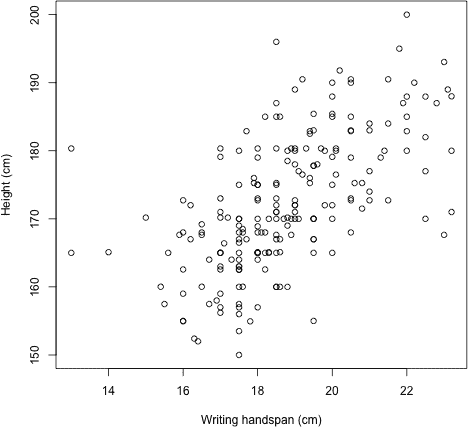

*图 20-1：一张显示身高与写字手跨度的散点图，数据来自一组大一统计学学生*

请注意，调用`plot`时使用了公式表示法（也称为*符号表示法*）来指定“身高*对*手跨度”。你也可以使用坐标向量形式的（*x*，*y*）来生成相同的散点图，即`plot(survey$Wr.Hnd,survey$Height,...)`，但我在这里使用符号表示法，因为它更好地反映了你稍后如何拟合线性模型。

正如你所预期的那样，学生的手跨度与身高之间存在正相关关系。这个关系看起来是线性的。为了评估线性关系的强度（参见第 13.2.5 节），你可以找到估计的相关系数。

```
R> cor(survey$Wr.Hnd,survey$Height,use="complete.obs")
[1] 0.6009909
```

尽管数据框中有 237 条记录，但图表实际上并没有显示 237 个点。这是因为存在缺失的观测值（编码为`NA`；见第 6.1.3 节）。默认情况下，R 在绘制这样的图表时会删除任何“不完整”的数据对。为了找出被删除的有问题的观测值的数量，可以使用简短形式的逻辑操作符`|`（见第 4.1.3 节），并与`is.na`（见第 6.1.3 节）和`which`（见第 4.1.5 节）一起使用。然后使用`length`发现有 29 对缺失的观测值。

```
R> incomplete.obs <- which(is.na(survey$Height)|is.na(survey$Wr.Hnd))
R> length(incomplete.obs)
[1] 29
```

**注意**

*因为在传递给相关系数函数*`cor`*的向量中存在`NA`值，所以你还必须指定可选参数*`use="complete.obs"`*。这意味着计算的统计量只考虑*`Wr.Hnd`*和*`Height`*向量中那些*两者都不是`NA`*的观测对。你可以把这个参数理解为与单变量摘要统计函数（如*`mean`*和*`sd`*）中的*`na.rm=TRUE`*做的事情非常相似。

### 20.2 一般概念

线性回归模型的目的是提出一个函数，估算在给定另一个变量的特定值时，某个变量的*均值*。这些变量被称为*响应变量*（你试图找出其均值的“结果”变量）和*解释变量*（你已经有其值的“预测”变量）。

以学生调查的例子来说，你可能会问类似这样的问题：“如果学生的手掌宽度是 14.5 厘米，那么他们的身高预期是多少？”在这里，响应变量是身高，解释变量是手掌宽度。

#### *20.2.1 模型定义*

假设你想根据解释变量*X*的值来确定响应变量*Y*的值。*简单线性回归模型*表示响应的值可以用以下方程表达：

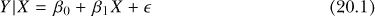

在方程（20.1）的左侧，符号*Y*|*X*表示“在给定*X*值的条件下*Y*的值。”

##### 残差假设

你可以根据（20.1）式得出的结论的有效性，关键取决于对*∊*所做的假设，这些假设定义如下：

• 假设*∊*的值服从正态分布，即*∊* ~ N(0,*σ*)。

• *∊*是中心化的（即其均值为零）。

• *∊*的方差，*σ*²，是常数。

*∊*项代表随机误差。换句话说，你假设响应的任何原始值都归因于给定值*X*的线性变化，加上或减去一些随机的、*残差*变动或正态分布的*噪声*。

##### 参数

由*β*[0]表示的值称为*截距*，由*β*[1]表示的值称为*斜率*。它们合起来也被称为*回归系数*，并按以下方式进行解释：

• 截距*β*[0]被解释为当预测变量为零时，响应变量的预期值。

• 通常，斜率*β*[1]是关注的重点。它表示每增加一个单位的预测变量，平均响应的变化。当斜率为正时，回归线从左到右上升（当预测变量增大时，平均响应也增大）；当斜率为负时，回归线从左到右下降（当预测变量增大时，平均响应减小）。当斜率为零时，表示预测变量对响应值没有影响。*β*[1]的绝对值越大（即远离零），回归线的升降越陡峭。

#### *20.2.2 估计截距和斜率参数*

目标是使用你的数据来估计回归参数，从而得到估计值和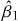；这被称为*拟合*线性模型。在这种情况下，数据包括每个个体的*n*对观察值。所关注的拟合模型涉及对特定预测值*x*的平均响应值，记作ŷ，公式如下：

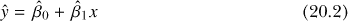

有时，会使用替代符号，如[*Y*]或[*Y*|*X* = *x*]，在公式（20.2）的左侧，强调模型给出的响应的均值（即期望值）。为了简洁起见，许多人直接使用类似ŷ的符号，如这里所示。

令你观察到的*n*对数据分别记作*X[i]*和*Y[i]*，其中*i* = 1, . . . , *n*。然后，简单线性回归函数的参数估计值为

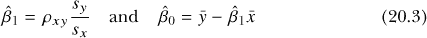

其中

• *x̄*和*ȳ*分别是*x[i]*和*y[i]*的样本均值。

• *s[x]*和*s[y]*分别是*x[i]*和*y[i]*的样本标准差。

• *ρ[xy]*是基于数据估计的*X*和*Y*之间的相关性（见第 13.2.5 节）。

通过这种方式估计模型参数被称为*最小二乘回归*；稍后你会明白其原因。

#### *20.2.3 使用 lm 拟合线性模型*

在 R 语言中，命令`lm`会为你执行估计。例如，下面这一行手动创建了一个基于手掌跨度的平均学生身高的拟合线性模型对象，并将其存储在你的全局环境中，命名为`survfit`：

```
R> survfit <- lm(Height~Wr.Hnd,data=survey)
```

第一个参数是现在熟悉的`response` ~ predictor 公式，它指定了所需的模型。你不需要使用`survey$`前缀来从数据框中提取向量，因为你已经明确指示`lm`去查找提供给`data`参数的对象。

拟合的线性模型对象本身`survfit`在 R 中有一个特殊的类——即`"lm"`类。`"lm"`类的对象本质上可以看作是一个包含多个组件的列表，这些组件描述了该模型。稍后你将查看这些组件。

如果你在提示符下直接输入 `"lm"` 对象的名称，它将提供最基本的输出：重复你的调用并显示截距 () 和斜率 () 的估计值。

```
R> survfit

Call:
lm(formula = Height ~ Wr.Hnd, data = survey)

Coefficients:
(Intercept)       Wr.Hnd
    113.954        3.117
```

这揭示了本例的线性模型估计如下：

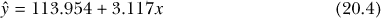

如果你对ŷ—方程 (20.2)—在不同的*x*值范围内进行计算，结果会绘制出一条直线。考虑到之前给出的截距定义，即当预测变量为零时响应变量的期望值，在当前示例中，这意味着一个手掌宽度为 0 厘米的学生的平均身高是 113.954 厘米（这可能是一个不太有用的陈述，因为解释变量为零的值没有实际意义；你将在第 20.4 节中考虑这些及相关问题）。斜率，即预测变量每增加 1 单位时平均响应的变化量，为 3.117。这表示，平均而言，每增加 1 厘米的手掌宽度，学生的身高估计会增加 3.117 厘米。

记住这一切后，再次运行该行代码，以绘制第 20.1 节中给出的原始数据，并在图 20-1 中显示，但现在使用 `abline` 添加拟合的回归线。到目前为止，你只使用了 `abline` 命令将完美的水平线和垂直线添加到现有图形，但当传递一个表示简单线性模型的 `"lm"` 类对象时，如 `survfit`，则会添加拟合的回归线。

```
R> abline(survfit,lwd=2)
```

这增加了图 20-2 中显示的略微加厚的对角线。

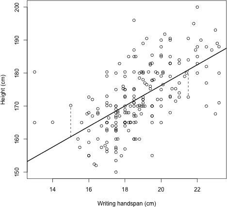

*图 20-2：拟合到观测数据的简单线性回归线（实线，粗体）。两条虚线垂直线段提供了正（最左侧）和负（最右侧）残差的示例。*

#### *20.2.4 说明残差*

当参数按这里所示使用（20.3）进行估计时，拟合的线称为*最小二乘回归*，因为它是最小化观测数据与拟合线之间的平均平方差的线。通过绘制观测值与拟合线之间的距离（正式称为*残差*），你可以更容易地理解这一概念，特别是图 20-2 中的个别观测值。

首先，让我们从 `Wr.Hnd` 和 `Height` 数据向量中提取两个特定的记录，并将结果向量命名为 `obsA` 和 `obsB`。

```
R> obsA <- c(survey$Wr.Hnd[197],survey$Height[197])
R> obsA
[1]  15.00 170.18
R> obsB <- c(survey$Wr.Hnd[154],survey$Height[154])
R> obsB
[1]  21.50 172.72
```

接下来，简要检查 `survfit` 对象成员的名称。

```
R> names(survfit)
 [1] "coefficients"  "residuals"   "effects"    "rank"
 [5] "fitted.values" "assign"      "qr"         "df.residual"
 [9] "na.action"     "xlevels"     "call"       "terms"
[13] "model"
```

这些成员是自动构成拟合模型对象 `"lm"` 类的组件，如前所述。请注意，有一个名为 `"coefficients"` 的组件，其中包含截距和斜率估计值的数字向量。

你可以像在命名列表上进行成员引用那样提取这个组件（以及这里列出的任何其他组件）：通过在提示符处输入`survfit$coefficients`。不过，在可能的情况下，从编程角度来说，使用“直接访问”函数提取这些组件是更为推荐的做法。对于`"lm"`对象的`coefficients`组件，你需要使用的函数是`coef`。

```
R> mycoefs <- coef(survfit)
R> mycoefs
(Intercept)      Wr.Hnd
 113.953623    3.116617
R> beta0.hat <- mycoefs[1]
R> beta1.hat <- mycoefs[2]
```

这里，回归系数从对象中提取出来，然后分别赋值给对象`beta0.hat`和`beta1.hat`。其他常见的直接访问函数包括`resid`和`fitted`；这两个函数分别涉及到“残差”和“拟合值”组件。

最后，我使用`segments`绘制图 20-2 中存在的垂直虚线。

```
R> segments(x0=c(obsA[1],obsB[1]),y0=beta0.hat+beta1.hat*c(obsA[1],obsB[1]),
            x1=c(obsA[1],obsB[1]),y1=c(obsA[2],obsB[2]),lty=2)
```

请注意，这些虚线与拟合线在垂直轴位置相交，这些位置通过传递给`y0`的值反映了使用回归系数`beta0.hat`和`beta1.hat`后，方程(20.4)。

现在，假设有一组通过数据绘制的不同回归线（通过改变截距和斜率的值实现）。然后，对于每一条替代的回归线，假设你计算每个观察值的响应值与该回归线的*拟合值*之间的残差（垂直距离）。根据(20.3)估算的简单线性回归线是“最接近所有观察值”的那条线。这里的意思是，拟合的回归模型由通过由变量均值（*x̄*，*ȳ*）给出的坐标的估计线表示，它是那条使得残差的平方和最小的线。因此，像这样最小二乘估计的回归方程的另一个名字是*最佳拟合线*。

### 20.3 统计推断

回归方程的估计相对简单，但这仅仅是开始。现在你应该考虑从结果中可以推断出什么。在简单线性回归中，始终应该提出一个自然的问题：是否有统计证据支持预测变量与响应变量之间存在关系？换句话说，是否有证据表明解释变量的变化会影响平均结果？你可以通过类似于在第十七章中引入的思想来研究这个问题，那里你开始思考估计统计量中的变异性，并随后使用置信区间进行推断，在第十八章中进行了假设检验。

#### *20.3.1 总结拟合模型*

这种*基于模型的推断*在处理`lm`对象时会自动由 R 执行。对`lm`创建的对象使用`summary`函数，将为你提供比仅仅打印对象到控制台更详细的输出。此时，你将重点关注`summary`提供的两个方面的信息：与回归系数相关的显著性检验，以及所谓的*决定系数*（在输出中标记为`R-squared`）的解释，我将在稍后进行说明。

对当前模型对象`survfit`使用`summary`，你将看到以下内容：

```
R> summary(survfit)

Call:
lm(formula = Height ~ Wr.Hnd, data = survey)

Residuals:
     Min       1Q   Median      3Q       Max
-19.7276  -5.0706  -0.8269  4.9473   25.8704

Coefficients:
            Estimate Std. Error t value Pr(>|t|)
(Intercept) 113.9536     5.4416   20.94   <2e-16 ***
Wr.Hnd        3.1166     0.2888   10.79   <2e-16 ***
---
Signif. codes:  0 '***' 0.001 '**' 0.01 '*' 0.05 '.' 0.1 ' ' 1
Residual standard error: 7.909 on 206 degrees of freedom
  (29 observations deleted due to missingness)
Multiple R-squared:  0.3612,   Adjusted R-squared:  0.3581
F-statistic: 116.5 on 1 and 206 DF,  p-value: < 2.2e-16
```

#### *20.3.2 回归系数显著性检验*

让我们首先关注回归系数报告的方式。系数表的第一列包含截距和斜率的点估计（截距标记为“截距”，斜率则标记为数据框中预测变量的名称）；表格还包括这些统计量的标准误差估计。可以证明，简单线性回归系数在使用最小二乘法估计时，遵循具有*n* − 2 自由度的*t*分布（其中*n*为模型拟合中使用的观测值数量）。每个参数都报告了标准化的*t*值和*p*-值。这些值表示一个双尾假设检验的结果，定义为

H[0] : *β[j]* = 0

H[A] : *β[j]* ≠ 0

其中*j* = 0 表示截距，*j* = 1 表示斜率，使用公式(20.1)中的符号。

关注预测变量的结果行。零的假设值下，H[0]的成立意味着预测变量对响应没有影响。这里关注的是协变量是否有*任何影响*，而不是这种影响的方向，因此 H[A]是双尾的（通过≠）。与任何假设检验一样，*p*-值越小，反对 H[0]的证据就越强。在此特定检验统计量下，*p*-值非常小（< 2 × 10^−¹⁶）（你可以使用第十八章中的公式确认：*T* = (3.116 − 0)/0.2888 = 10.79），因此你可以得出结论，存在强有力的证据*反对*预测变量对响应均值没有影响的说法。

对截距进行相同的检验，但对斜率参数*β*[1]的检验通常更为有趣（因为拒绝零假设的*β*[0]仅表示回归线与纵轴交点不为零），尤其是在观察数据不包含*x* = 0 的情况下，正如这里的情况。

从中可以得出结论，拟合模型表明，手掌跨度的增加与所研究人群的身高增加之间存在关联。每增加一厘米的手掌跨度，身高的平均增加约为 3.12 厘米。

你还可以使用方程式(17.2)和回归参数的抽样分布知识，计算估计值的置信区间；然而，R 再次为`"lm"`类对象提供了一个方便的函数，可以为你自动完成此操作。

```
R> confint(survfit,level=0.95)
                 2.5 %     97.5 %
(Intercept) 103.225178 124.682069
Wr.Hnd        2.547273   3.685961
```

对于`confint`函数，你需要将模型对象作为第一个参数，并将所需的置信水平作为`level`传递。这表明你应该有 95%的信心，*β*[1]的真实值位于 2.55 和 3.69 之间（保留两位小数）。和之前一样，排除零的原假设值反映了早先的统计显著结果。

#### *20.3.3 决定系数*

`summary`的输出还为你提供了`Multiple R-squared`和`Adjusted R-squared`的值，这些值尤其有趣。这两者都被称为*决定系数*；它们描述了响应中变异的比例，这部分变异可以归因于预测变量。

对于简单线性回归，第一项（未经调整的）度量是通过估计的相关系数的平方获得的（请参考第 13.2.5 节）。对于学生身高的例子，首先将`Wr.Hnd`和`Height`之间的估计相关性存储为`rho.xy`，然后对其平方：

```
R> rho.xy <- cor(survey$Wr.Hnd,survey$Height,use="complete.obs")
R> rho.xy²
[1] 0.3611901
```

你将得到与`Multiple R-squared`值相同的结果（通常用数学符号表示为*R*²）。这告诉你，大约 36.1%的学生身高变异可以归因于手跨度。

调整后的度量是一种替代估计，考虑了需要估计的参数数量。调整后的度量通常只有在你使用决定系数来评估拟合模型的整体“质量”，即平衡拟合优度与复杂性时，才显得重要。我将在第二十二章中讲解这一点，所以目前不会再深入探讨。

#### *20.3.4 其他摘要输出*

模型对象的`summary`会为你提供更有用的信息。“残差标准误”是*∊*项的估计标准误（换句话说，就是*∊*的估计方差的平方根，即*σ*²）；下面还报告了任何缺失值。（这里“因缺失而删除的 29 对观测值”与第 20.1 节中确定的不完整观测值的数量一致。）

输出还提供了残差距离的五数总结（第 13.2.3 节），我将在第 22.3 节中进一步讲解。最终结果中，你将得到使用*F*分布进行的某个假设检验。这是一个关于预测变量对响应变量影响的全局检验；这一点将在第 21.3.5 节中与多元线性回归一起探讨。

你可以直接访问`summary`提供的所有输出，作为单独的 R 对象，而不必从整个打印的摘要中读取它们。就像`names(survfit)`为你提供了指示`survfit`独立对象内容的线索一样，以下代码会为你提供在使用`summary`处理`survfit`后可以访问的所有组件的名称。

```
R> names(summary(survfit))
 [1] "call"          "terms"        "residuals"      "coefficients"
 [5] "aliased"       "sigma"        "df"             "r.squared"
 [9] "adj.r.squared" "fstatistic"   "cov.unscaled"   "na.action"
```

将大多数组件与打印的`summary`输出进行匹配是相当简单的，而且它们可以像往常一样使用美元运算符提取。例如，残差标准误差可以直接通过以下方式检索：

```
R> summary(survfit)$sigma
[1] 7.90878
```

该内容的更多细节可以在`?summary.lm`帮助文件中找到。

### 20.4 预测

为了总结这些线性回归的初步细节，现在你将看到如何将拟合模型用于预测目的。拟合统计模型的能力意味着你不仅可以理解并量化数据中关系的性质（比如学生示例中每增加 1 厘米手掌跨度，均值身高增加 3.1166 厘米的估算值），还可以*预测*感兴趣结果的值，即使你在原始数据集中没有实际观察到任何解释变量的值。不过，像任何统计量一样，总是需要伴随点估计或预测值提供一个分布度量。

#### *20.4.1 置信区间还是预测区间？*

使用拟合的简单线性模型，你可以计算在给定解释变量值的条件下，*均值响应*的点估计。为此，你只需要将感兴趣的*x*值代入（拟合的模型方程）。像这样的统计量总是会受到变化的影响，因此，就像在前面章节中讨论的样本统计量一样，你使用*均值响应的置信区间（CI）*来衡量这种不确定性。

假设已对*n*个观测值拟合了一个简单的线性回归线，并计算了给定*x*值时，*均值响应*的！image 百分比置信区间。

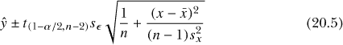

在这里，你通过减法得到下限，通过加法得到上限。

这里，ŷ是拟合值（来自回归线），对应于*x*；*t*[(][1][−] [/][2][,][n][−][2][)] 是从*t*分布中得出的适当临界值，具有*n* − 2 的自由度（换句话说，结果导致上尾区域恰好为/2）；*s[ɛ]*是估计的残差标准误差；*x̄*和分别表示预测变量的样本均值和观测值的方差。

对于观察到的响应，*预测区间（PI）*与置信区间在背景上有所不同。置信区间用于描述*均值*响应的变异性，而预测区间用于提供响应变量的*个体实现*可能取值的范围，前提是给定*x*。这个区别微妙但重要：置信区间对应均值，预测区间对应个体观察值。

让我们继续使用前面的符号。可以证明，给定*x*值的个体响应的 100(1 − *α*)百分比预测区间可以通过以下公式计算：

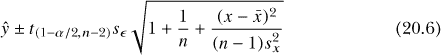

事实证明，(20.5)中的唯一区别是出现在平方根中的 1+。因此，在*x*处，预测区间比置信区间宽。

#### *20.4.2 解释区间*

继续我们的例子，假设你想确定手掌跨度为 14.5 cm 和 24 cm 的学生的平均身高。点估计本身很简单——只需将所需的*x*值代入回归方程 (20.4)。

```
R> as.numeric(beta0.hat+beta1.hat*14.5)
[1] 159.1446
R> as.numeric(beta0.hat+beta1.hat*24)
[1] 188.7524
```

根据模型，你可以预期，手掌跨度为 14.5 cm 和 24 cm 时，平均身高分别约为 159.14 cm 和 188.75 cm。`as.numeric`强制转换函数（首次在第 6.2.4 节中遇到）仅用于去除来自`beta0.hat`和`beta1.hat`对象的注释名称。

##### 平均身高的置信区间

要找到这些估计值的置信区间，你可以使用(20.5)手动计算，但当然 R 有一个内置的`predict`命令可以为你完成这个任务。使用`predict`时，你首先需要以特定方式存储你的*x*值：将其作为新数据框中的一列。列名必须与原始模型拟合时所使用的预测变量名称匹配。在这个例子中，我将创建一个新的数据框`xvals`，并命名一列为`Wr.Hnd`，该列仅包含两个感兴趣的值——14.5 cm 和 24 cm 的手掌跨度。

```
R> xvals <- data.frame(Wr.Hnd=c(14.5,24))
R> xvals
  Wr.Hnd
1   14.5
2   24.0
```

现在，当调用`predict`时，第一个参数必须是感兴趣的拟合模型对象，在这个例子中是`survfit`。接下来，在`newdata`参数中，你需要传递包含指定预测值的特别构建的数据框。在`interval`参数中，你必须指定`"confidence"`作为字符值。置信水平在这里设置为 95％，并将其传递给`level`（以概率的尺度）。

```
R> mypred.ci <- predict(survfit,newdata=xvals,interval="confidence",level=0.95)
R> mypred.ci
       fit      lwr      upr
1 159.1446 156.4956 161.7936
2 188.7524 185.5726 191.9323
```

此调用将返回一个矩阵，矩阵有三列，每列的行数（以及顺序）与您在 `newdata` 数据框中提供的预测值相对应。第一列，标题为 `fit`，表示回归线上的点估计值；你可以看到这些数字与之前计算的值一致。其他列分别提供了下限和上限 CI 值，分别为 `lwr` 和 `upr` 列。在这种情况下，你可以解释为：我们有 95% 的信心认为，手掌跨度为 14.5 cm 的学生的平均身高位于 156.5 cm 到 161.8 cm 之间，手掌跨度为 24 cm 时，身高位于 185.6 cm 到 191.9 cm 之间（四舍五入到 1 位小数）。记住，这些 CI 是根据（20.5）公式通过 `predict` 计算的，是针对 *均值* 响应值的。

##### 个别观测值的预测区间

`predict` 函数还会提供你的预测区间。要找到某个概率下可能个别观测值的预测区间，你只需要将 `interval` 参数改为 `"prediction"`。

```
R> mypred.pi <- predict(survfit,newdata=xvals,interval="prediction",level=0.95)
R> mypred.pi
       fit      lwr      upr
1 159.1446 143.3286 174.9605
2 188.7524 172.8390 204.6659
```

注意，拟合值保持不变，正如方程（20.5）和（20.6）所示。然而，PIs 的宽度显著大于相应 CIs 的宽度——这是因为原始观测值本身在特定 *x* 值下会自然比它们的均值更具变异性。

解释也相应发生变化。这些区间描述了原始学生身高在“95% 的时间”内预测的范围。对于手掌跨度为 14.5 cm 的情况，模型预测个别观测值将在 143.3 cm 到 175.0 cm 之间，概率为 0.95；对于手掌跨度为 24 cm，预测的 PI 范围为 172.8 cm 到 204.7 cm（四舍五入到 1 位小数）。

#### *20.4.3 绘制区间*

CIs 和 PIs 都非常适合用于简单线性回归模型的可视化。使用以下代码，你可以像绘制 图 20-2 那样开始绘制数据和估计的回归线，不过这一次使用 `plot` 中的 `xlim` 和 `ylim` 来稍微扩展 *x* 和 *y* 轴的范围，以便容纳完整的 CI 和 PI 长度。

```
R> plot(survey$Height~survey$Wr.Hnd,xlim=c(13,24),ylim=c(140,205),
        xlab="Writing handspan (cm)",ylab="Height (cm)")
R> abline(survfit,lwd=2)
```

在此基础上，你可以添加 *x* = 14.5 和 *x* = 24 时的拟合值位置，以及两组垂直线，分别表示 CIs 和 PIs。

```
R> points(xvals[,1],mypred.ci[,1],pch=8)
R> segments(x0=c(14.5,24),y0=c(mypred.pi[1,2],mypred.pi[2,2]),
            x1=c(14.5,24),y1=c(mypred.pi[1,3],mypred.pi[2,3]),col="gray",lwd=3)
R> segments(x0=c(14.5,24),y0=c(mypred.ci[1,2],mypred.ci[2,2]),
            x1=c(14.5,24),y1=c(mypred.ci[1,3],mypred.ci[2,3]),lwd=2)
```

对 `points` 的调用标记了这两个特定 *x* 值的拟合值。第一次调用 `segments` 将预测区间（PIs）绘制为加粗的垂直灰色线条，第二次绘制置信区间（CIs）为较短的垂直黑色线条。这些绘制的线段的坐标分别直接取自 `mypred.pi` 和 `mypred.ci` 对象。

你还可以生成围绕拟合回归线的“带”，标记出预测变量在*所有*自变量值上的一个或两个区间。从编程角度来看，对于连续变量来说，这在技术上是不可能的，但你可以通过沿* x *轴定义一个细的值序列（使用`seq`并设置较大的`length`值），然后在这个细的序列中的每个点计算置信区间和预测区间，实际上实现这一目标。然后，你只需在绘制时将结果点连接为线。

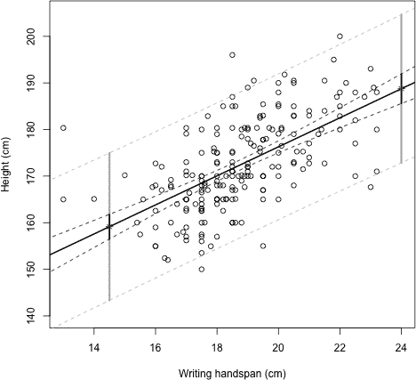

*图 20-3：学生身高回归示例，带有拟合回归线和在* x *= 14.5 和* x *= 24 的点估计，并且对应的 95% 置信区间（黑色垂直线）和预测区间（灰色垂直线）。虚线黑色和虚线灰色线条提供了在可见的* x *值范围内响应变量的 95% 置信带和预测带。*

在 R 中，这需要你重新运行如下的`predict`命令：

```
R> xseq <- data.frame(Wr.Hnd=seq(12,25,length=100))
R> ci.band <- predict(survfit,newdata=xseq,interval="confidence",level=0.95)
R> pi.band <- predict(survfit,newdata=xseq,interval="prediction",level=0.95)
```

这段代码的第一行创建了细的预测值序列，并将其存储为`newdata`参数所需的格式。置信区间和预测区间带的* y *轴坐标存储在矩阵对象`ci.band`和`pi.band`的第二列和第三列中。最后，使用`lines`添加四条虚线，分别对应两个区间的上限和下限，并且一个图例为图表增添了最后的修饰。

```
R> lines(xseq[,1],ci.band[,2],lty=2)
R> lines(xseq[,1],ci.band[,3],lty=2)
R> lines(xseq[,1],pi.band[,2],lty=2,col="gray")
R> lines(xseq[,1],pi.band[,3],lty=2,col="gray")
R> legend("topleft",legend=c("Fit","95% CI","95% PI"),lty=c(1,2,2),
          col=c("black","black","gray"),lwd=c(2,1,1))
```

请注意，黑色虚线的置信区间带与垂直黑线相交，灰色虚线的预测区间带与垂直灰线相交，正如你所预期的那样，分别对应之前的两个* x *值。

图 20-3 显示了所有这些元素添加到图表后的最终结果。区间的“内弯”曲线是这种图表的典型特征，在置信区间中尤为明显。这一曲线的出现是因为在预测数据较多的地方，变化自然较小。有关线性模型对象的`predict`更多信息，请查看`?predict.lm`帮助文件。

#### *20.4.4 插值与外推*

在完成关于预测的介绍之前，重要的是要明确两个关键术语的定义：*插值*和*外推*。这两个术语描述了给定预测的性质。如果你指定的* x *值在观察数据的范围内，那么该预测被称为插值；如果* x *值超出了这个范围，则为外推。通过你刚才做的点预测，你可以看到* x * = 14.5 是插值的例子，而* x * = 24 是外推的例子。

通常，内插比外推更为可取——在已观察到的数据附近使用拟合模型进行预测更有意义。尽管如此，外推如果不远离该区域，仍然可以认为是可靠的。学生身高的外推例子，*x* = 24 就是一个典型例子。这个值超出了观察数据的范围，但从尺度上来看并不远，而且预计值的估计区间 ŷ = 188.75 cm 从视觉上看是合理的，考虑到其他观察值的分布。相比之下，在例如手掌跨度为 50 厘米的情况下使用拟合模型预测学生身高就显得不太合理了：

```
R> predict(survfit,newdata=data.frame(Wr.Hnd=50),interval="confidence",
           level=0.95)
       fit      lwr      upr
1 269.7845 251.9583 287.6106
```

这种极端的外推意味着一个手掌跨度为 50 厘米的人的平均身高几乎是 270 厘米，这显然是一个不现实的测量值。相同的情况也适用于另一个方向；截距没有特别有用的实际解释，这意味着手掌跨度为 0 厘米的学生的平均身高大约是 114 厘米。

这里的主要信息是，在从线性模型拟合进行任何预测时，要运用常识。在结果的可靠性方面，在适当接近观测数据的值范围内进行的预测更为可靠。

**练习 20.1**

继续使用 `MASS` 包中的 `survey` 数据框来进行接下来的几个练习。

1.  使用你拟合的学生身高与写字手掌跨度的模型`survfit`，为手掌跨度为 12、15.2、17 和 19.9 厘米的学生提供均值的点估计和 99%的置信区间。

1.  在第 20.1 节中，你定义了对象 `incomplete.obs`，这是一个数值向量，提供了在估计模型参数时被自动移除的 `survey` 记录。现在，使用 `incomplete.obs` 向量与 `survey` 数据框以及公式 (20.3)来计算 R 中的和。 （记住使用 `mean`、`sd` 和 `cor` 函数，确保你的答案与 `survfit` 的输出一致。）

1.  `survey` 数据框除了 `Height` 和 `Wr.Hnd` 之外，还包含其他一些变量。此次练习的最终目标是拟合一个简单的线性模型来预测学生的平均身高，但这次是根据他们的脉搏率（在 `Pulse` 中给出）来预测（继续假设满足第 20.2 节列出的条件）。

    1.  拟合回归模型，并生成带有拟合线的散点图，确保你能够写下拟合的模型方程，并保持图表打开。

    1.  识别并解释斜率的点估计值，以及与假设 H[0] : *β*[1] = 0; H[A] : *β*[1] ≠ 0 相关的检验结果。同时找到斜率参数的 90%置信区间。

    1.  使用你的模型，在(i)中的图表上添加 90%置信区间和预测区间带，并添加图例以区分这些线条。

    1.  为当前的“脉冲高度”数据创建一个`incomplete.obs`向量。使用该向量计算在(i)中拟合模型所使用的高度观测值的样本均值。然后在该均值处为图表添加一条完全水平的线（使用颜色或线型选项，以避免与其他线条混淆）。你注意到什么了吗？图表是否支持你在(ii)中的结论？

接下来，查看`mtcars`数据集的帮助文件，该数据集你在练习 13.4 中首次见到，位于第 287 页。本练习的目标是将燃油效率（以每加仑多少英里（MPG）衡量）与车辆的整体重量（以千磅为单位）进行建模。

1.  绘制数据——将`mpg`绘制在*y*轴上，将`wt`绘制在*x*轴上。

1.  拟合简单线性回归模型。将拟合的直线添加到(d)中的图表上。

1.  写下回归方程并解释斜率的点估计值。`wt`对均值`mpg`的影响是否被估计为统计显著？

1.  对于一辆重 6,000 磅的车，产生一个点估计和相关的 95%置信区间（PI）。你相信模型能准确预测此解释变量值的观测值吗？为什么或为什么不？

### 20.5 理解类别预测变量

到目前为止，你已查看依赖于连续解释变量的简单线性回归模型，但也可以使用离散或类别解释变量来建模均值响应，该解释变量由*k*个不同的组或水平组成。你必须能够做出与第 20.2 节中相同的假设：即所有观测值相互独立，残差呈正态分布且具有相等的方差。首先，你将查看最简单的情况，其中*k* = 2（一个二值预测变量），这为稍微复杂一点的情况奠定基础，在该情况下类别预测变量具有多个水平（多级预测变量：*k* > 2）。

#### *20.5.1 二元变量：k = 2*

回到方程 (20.1)，在这个方程中，回归模型被指定为 *Y*|*X* = *β*[0] + *β*[1]*X* + *∊*，其中 *Y* 是响应变量，*X* 是预测变量，且 *∊* ~ N(0,*σ*²)。现在，假设你的预测变量是类别型的，只有两个可能的水平（即二元变量；*k* = 2），并且观测值编码为 0 或 1。在这种情况下，(20.1) 仍然成立，但模型参数 *β*[0] 和 *β*[1] 的解释不再是“截距”和“斜率”。更好的理解方式是将它们看作是两个截距，其中 *β*[0] 提供了当 *X* = 0 时响应的 *基准* 或 *参考* 值，而 *β*[1] 则表示当 *X* = 1 时对平均响应的 *附加效应*。换句话说，如果 *X* = 0，那么 *Y* = *β*[0] + *∊*；如果 *X* = 1，那么 *Y* = *β*[0] + *β*[1] + *∊*。像往常一样，估计是通过找到 *平均* 响应 ŷ [*Y* |*X* = *x*]，如方程 (20.2)所示，因此方程变为 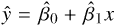。

返回到 `survey` 数据框，并注意你有一个 `Sex` 变量，记录了学生的性别。你可以查看帮助页面 `?survey` 的文档，或者像这样输入：

```
R> class(survey$Sex)
[1] "factor"
R> table(survey$Sex)

Female   Male
   118    118
```

你会看到，性别数据列是一个具有两个水平（`Female` 和 `Male`）的因子向量，并且这两个类别的数量恰好相等（237 条记录中有一条缺失此变量的值）。

你将确定是否有统计证据表明学生的身高受性别影响。这意味着你再次对身高作为响应变量建模，但这次是将类别型的性别变量作为预测变量。

为了可视化数据，如果你按照如下方式调用 `plot`，你将得到一对箱线图。

```
R> plot(survey$Height~survey$Sex)
```

这是因为在 `~` 左侧指定的响应变量是数值型的，而右侧的解释变量是因子类型，在这种情况下，R 的默认行为是生成并排的箱线图。

为了进一步强调解释变量的类别性质，你可以将原始的身高和性别观测值叠加在箱线图上。为此，只需通过调用 `as.numeric` 将因子向量转换为数值型；可以在 `points` 函数调用中直接完成此操作。

```
R> points(survey$Height~as.numeric(survey$Sex),cex=0.5)
```

记住，箱线图通过中央的粗线表示中位数，而最小二乘线性回归是通过平均结果定义的，因此展示按性别分组的平均身高也是有用的。

```
R> means.sex <- tapply(survey$Height,INDEX=survey$Sex,FUN=mean,na.rm=TRUE)
R> means.sex
  Female     Male
165.6867 178.8260
R> points(1:2,means.sex,pch=4,cex=3)
```

你在第 10.2.3 节中接触过`tapply`；在此调用中，参数`na.rm=TRUE`与`tapply`的省略号匹配，并传递给`mean`（你需要它来确保数据中的缺失值不会导致结果为`NA`）。进一步调用`points`将这些坐标（以×符号表示）添加到图像中；图 20-4 给出了最终结果。

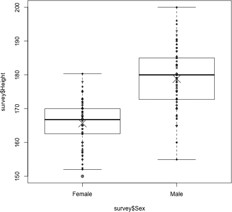

*图 20-4：按性别划分的学生身高箱形图，带有叠加的原始观测值和样本均值（分别用小○和大×符号表示）*

图表总体上表明，男性的身高往往高于女性——但是否有统计证据支持这一差异？

##### 二元变量的线性回归模型

要用简单的线性回归模型来回答这个问题，你可以使用`lm`来产生最小二乘估计，就像你之前拟合的每个模型一样。

```
R> survfit2 <- lm(Height~Sex,data=survey)
R> summary(survfit2)

Call:
lm(formula = Height ~ Sex, data = survey)

Residuals:
    Min      1Q  Median      3Q    Max
-23.886  -5.667   1.174   4.358 21.174

Coefficients:
            Estimate Std. Error t value Pr(>|t|)
(Intercept)  165.687      0.730  226.98   <2e-16 ***
SexMale       13.139      1.022   12.85   <2e-16 ***
---
Signif. codes:  0 '***' 0.001 '**' 0.01 '*' 0.05 '.' 0.1 ' ' 1

Residual standard error: 7.372 on 206 degrees of freedom
  (29 observations deleted due to missingness)
Multiple R-squared:  0.4449, Adjusted R-squared:  0.4422
F-statistic: 165.1 on 1 and 206 DF,  p-value: < 2.2e-16
```

然而，由于预测变量是一个因子向量而非数值向量，系数的报告方式略有不同。[0]的估计再次报告为`(Intercept)`；这是学生为女性时的平均身高估计值。*β*[1]的估计报告为`SexMale`。对应的回归系数 13.139 是男性学生的平均身高与女性学生之间的估计差异。如果你查看相应的回归方程

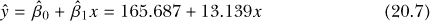

你可以看到，假设变量 *x* 被定义为“个体为男性”——0 表示否/假，1 表示是/真，模型已经拟合完成。换句话说，性别变量的“女性”水平被假定为参考，明确估计的是“为男性”对平均身高的影响。对于*β*[0]和*β*[1]的假设检验是按照第 20.3.2 节中定义的相同假设进行的：

H[0] : *β[j]* = 0

H[A] : *β[j]* ≠ 0

再次强调，通常最感兴趣的是*β*[1]的检验，因为正是这个值告诉你是否存在统计证据表明平均响应变量受到解释变量的影响，也就是说，如果*β*[1]显著不同于零。

##### 来自二元分类变量的预测

由于* x* 只有两个可能的值，因此预测非常简单。在评估方程时，唯一需要做的决定是是否使用（换句话说，个体是否为男性）或不使用（如果个体为女性）。例如，你可以输入以下代码来创建一个包含五个额外观测值的新因子，这些额外观测值的水平名称与原始数据相同，并将新数据存储在`extra.obs`中：

```
R> extra.obs <- factor(c("Female","Male","Male","Male","Female"))
R> extra.obs
[1] Female Male   Male   Male   Female
Levels: Female Male
```

然后，使用`predict`函数以熟悉的方式来找到预测变量的这些额外值下的平均值。 （记住，当你通过`newdata`参数将新数据传递给`predict`时，预测变量必须与最初用于拟合模型的数据形式相同。）

```
R> predict(survfit2,newdata=data.frame(Sex=extra.obs),interval="confidence",
           level=0.9)
       fit      lwr      upr
1 165.6867 164.4806 166.8928
2 178.8260 177.6429 180.0092
3 178.8260 177.6429 180.0092
4 178.8260 177.6429 180.0092
5 165.6867 164.4806 166.8928
```

从输出中你可以看到，预测结果只在两组值之间有所不同——`Female`的两次点估计值相同，只是具有 90%的置信区间。`Male`的点估计值和置信区间也都相同，基于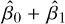的点估计。

仅凭这一例子，确实没有什么特别令人兴奋的。然而，理解 R 在使用类别预测变量时如何展示回归结果是至关重要的，特别是当考虑到第二十一章中的多元回归时。

#### *20.5.2 多级变量：k > 2*

在处理数据时，通常会遇到类别预测变量有超过两个水平的情况，即(*k* > 2)。这也可以被称为*多级*类别变量。为了处理这种更复杂的情况，同时保持参数的可解释性，你必须首先将预测变量编码为*k* − 1 个二元变量。

##### 虚拟编码多级变量

为了展示如何操作，假设你想要找出响应变量*Y*在给定类别变量*X*的值时的值，其中*X*有*k* > 2 个水平（还假设线性回归模型的有效性条件——第 20.2 节——已满足）。

在回归建模中，*虚拟编码*是用于从类别变量如*X*创建多个二元变量的过程。它不同于单一的类别变量和可能的实现值。

*X* = 1,2,3, . . . , *k*

你将它重新编码为多个“是/否”变量——每个级别一个——并可能得到以下实现值：

*X*[(][1][)] = 0,1; *X*[(][2][)] = 0,1; *X*[(][3][)] = 0,1; . . . ; *X*[(][k][)] = 0,1

如你所见，*X*[(][i][)]表示原始*X*的第*i*级的二元变量。例如，如果某个个体在原始类别变量中有*X* = 2，那么*X*[(][2][)] = 1（是），而其他所有*X*[(][1][)], *X*[(][3][)], . . . , *X*[(][k][)]都将是零（否）。

假设*X*是一个可以取 1、2、3 或 4 中的任何一个值的变量，并且你已经对这个变量进行了六次观测：1、2、2、1、4、3。 表 20-1 显示了这些观测值及其虚拟编码的等效值*X*[(][1][)]、*X*[(][2][)]、*X*[(][3][)]和*X*[(][4][)]。

**表 20-1：** 具有*k* = 4 组的类别变量的六个观测值的虚拟编码示例

| *X* | *X*[(][1][)] | *X*[(][2][)] | *X*[(][3][)] | *X*[(][4][)] |
| --- | --- | --- | --- | --- |
| 1 | 1 | 0 | 0 | 0 |
| 2 | 0 | 1 | 0 | 0 |
| 2 | 0 | 1 | 0 | 0 |
| 1 | 1 | 0 | 0 | 0 |
| 4 | 0 | 0 | 0 | 1 |
| 3 | 0 | 0 | 1 | 0 |

在拟合后续模型时，通常只使用*k* − 1 个虚拟二元变量——其中一个变量作为*参考*或*基准*水平，并被纳入模型的整体截距项中。实际上，您最终会得到一个类似于这样的估计模型，

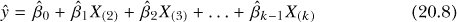

假设 1 是参考水平。如您所见，除了整体截距项，您还会得到*k* −1 个其他的估计截距项，这些项根据原始类别中的观察值会调整基准系数。例如，根据（20.8）中施加的编码，如果一个观察值有*X*[(][3][)] = 1，而所有其他二元值为零（因此该观察值在原始分类变量中会有*X* = 3 的值），则响应的预测均值将是。另一方面，由于参考水平定义为 1，如果观察值对于所有二元变量的值为零，这意味着该观察值原本有*X* = 1，预测值将仅为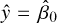。

对于这种性质的分类变量进行虚拟编码是必要的原因是，一般来说，类别之间不能像连续变量那样以相同的数值关系相互关联。例如，通常不适合认为类别 4 中的观察值是类别 2 中的“两倍”，这正是估计方法所假定的。二元存在/不存在变量是有效的，并且可以轻松地融入建模框架中。选择参考水平通常是次要的——估计系数的具体数值会相应变化，但基于拟合模型做出的任何整体解释都将保持不变。

**注意**

*实施这种虚拟编码方法从技术上来说是一种多元回归形式，因为您现在将多个二元变量包含在模型中。然而，重要的是要意识到虚拟编码的某种人为特性——您仍然应该将多个系数看作代表一个单一的分类变量，因为二元变量 X*[(][1][)]*，...，X*[(][k][)]* 之间不是相互独立的。这就是为什么我在本章中选择定义这些模型的原因；多元回归将在第二十一章中正式讨论。*

##### 多层变量的线性回归模型

R 使得以这种方式处理分类预测变量变得非常简单，因为在您调用`lm`时，它会自动为任何此类解释变量进行虚拟编码。不过，在拟合模型之前，有两件事需要检查。

1.  关注的分类变量应该存储为一个（形式上无序的）因子。

1.  你应该检查你是否满意分配给参考水平的类别（用于解释性目的—见第 20.5.3 节）。

当然，你还必须确保对常见假设的有效性感到满意，即*∊*的正态性和独立性。

为了演示所有这些定义和概念，让我们回到`MASS`包中的学生调查数据，并将“学生身高”作为感兴趣的响应变量。数据中包含变量`Smoke`，该变量描述了每个学生自报告的吸烟类型，按频率定义并分为四个类别：“heavy”（重度吸烟）、“never”（从不吸烟）、“occasional”（偶尔吸烟）和“regular”（常规吸烟）。

```
R> is.factor(survey$Smoke)
[1] TRUE
R> table(survey$Smoke)

Heavy Never Occas Regul
   11   189    19    17
R> levels(survey$Smoke)
[1] "Heavy" "Never" "Occas" "Regul"
```

这里，`is.factor(survey$Smoke)`的结果表明你确实手头有一个因子向量，调用`table`可以得到每个类别中学生的数量，正如第五章中所述，你可以通过`levels`显式请求任何 R 因子的水平属性。

让我们问一下是否有统计证据支持吸烟频率对学生身高均值的差异。你可以使用以下两行代码绘制这些数据的箱线图；图 20-5 展示了结果。

```
R> boxplot(Height~Smoke,data=survey)
R> points(1:4,tapply(survey$Height,survey$Smoke,mean,na.rm=TRUE),pch=4)
```

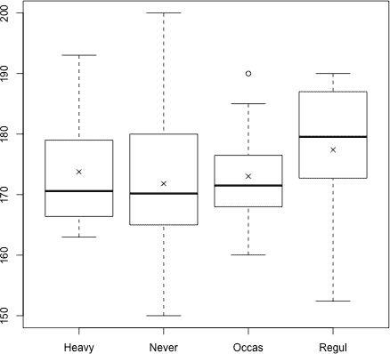

*图 20-5：按吸烟频率划分的观察到的学生身高箱线图；各自的样本均值用* × 标出。

从早期的 R 输出中可以看到，除非在创建时明确定义，否则因子的水平默认按字母顺序排列——`Smoke`就是这种情况——并且 R 会自动将第一个水平（如`levels`函数输出所示）设置为参考水平，在随后的模型拟合中使用该因子作为预测变量时也是如此。使用`lm`拟合线性模型时，从后续的`summary`输出中可以看到，确实是`Smoke`的第一个水平，“heavy”被用作参考水平：

```
R> survfit3 <- lm(Height~Smoke,data=survey)
R> summary(survfit3)

Call:
lm(formula = Height ~ Smoke, data = survey)

Residuals:
   Min     1Q Median     3Q    Max
-25.02  -6.82  -1.64   8.18  28.18

Coefficients:

            Estimate Std. Error t value Pr(>|t|)
(Intercept) 173.7720     3.1028  56.005   <2e-16 ***
SmokeNever   -1.9520     3.1933  -0.611    0.542
SmokeOccas   -0.7433     3.9553  -0.188    0.851
SmokeRegul    3.6451     4.0625   0.897    0.371
---
Signif. codes:  0 '***' 0.001 '**' 0.01 '*' 0.05 '.' 0.1 ' ' 1

Residual standard error: 9.812 on 205 degrees of freedom
  (28 observations deleted due to missingness)
Multiple R-squared:  0.02153, Adjusted R-squared:  0.007214
F-statistic: 1.504 on 3 and 205 DF,  p-value: 0.2147
```

如方程式（20.8）所示，你可以得到对应于虚拟二元变量的系数估计值，这些变量对应于此示例中四个可能类别中的三个——即三个非参考水平。参考类别`Heavy`中的观察值仅通过表示，首先被指定为整体的`(Intercept)`，其他系数则提供与其他类别中的观察值相关的效应。

##### 多级分类变量的预测

你通过预测得到点估计值，像往常一样。

```
R> one.of.each <- factor(levels(survey$Smoke))
R> one.of.each
[1] Heavy Never Occas Regul
Levels: Heavy Never Occas Regul
R> predict(survfit3,newdata=data.frame(Smoke=one.of.each),
           interval="confidence",level=0.95)
       fit      lwr      upr
1 173.7720 167.6545 179.8895
2 171.8200 170.3319 173.3081
3 173.0287 168.1924 177.8651
4 177.4171 172.2469 182.5874
```

这里，我创建了对象`one.of.each`用于说明；它代表四个类别中每个类别的一个观察值，作为与原始`Smoke`数据的类别（和水平）匹配的对象存储。例如，`Occas`类别中的一个学生的预测身高为 173.772 − 0.7433 = 173.0287。

然而，之前模型摘要的输出显示，所有二元虚拟变量系数都不被认为与零显著不同（因为所有*p*-值都太大）。结果表明，正如你可能已经怀疑的那样，基于这份个体样本，吸烟频率（或更具体地说，吸烟频率与参考水平不同）对学生平均身高没有影响。像常见的那样，基准系数在统计上显著——但这仅表明整体截距可能不为零。（因为你的响应变量是身高的测量，显然不会接近 0 厘米，这个结果是合理的。）提供的置信区间是按照常规的*t*检验方式计算的。

小的`R-Squared`值加强了这一结论，表明几乎无法通过改变吸烟频率的类别来解释响应的变化。此外，整体的*F*-检验*p*-值相当大，大约为 0.215，表明预测变量对响应的整体影响不显著；你将在第 20.5.5 节以及稍后在第 21.3.5 节中更详细地查看这一点。

如前所述，解释这些结果——事实上，任何基于回归中的*k*-级分类变量的结果——时，必须以*集体*的方式进行。你只能声称吸烟对身高*没有*可察觉的影响，因为所有二元虚拟变量系数的*p*-值都不显著。如果其中一个水平实际上是显著的（通过一个较小的*p*-值），那么这将意味着在此定义的吸烟因素作为整体，*确实*对响应有统计学上可检测的影响（即使其他两个水平仍然与非常高的*p*-值相关）。这一点将在第二十一章中的多个例子中进一步讨论。

#### *20.5.3 更改参考水平*

有时你可能会决定更改自动选择的参考水平，基于此，其他任何水平的效应都会被估计。更改基准将导致不同系数的估计，意味着个别的*p*-值可能发生变化，但总体结果（就因素的全球显著性而言）不会受到影响。因此，更改参考水平仅是出于解释目的——有时预测变量有一个直观上自然的基准（例如，在某些临床试验分析中，“安慰剂”与“药物 A”和“药物 B”作为治疗变量），你希望基于此估计与其他可能类别的均值响应的偏差。

重新定义参考水平可以通过 R 内置的`relevel`函数快速实现。此函数允许您选择在给定因子向量对象定义中哪个水平优先，并因此在随后的模型拟合中作为参考水平。在当前示例中，假设您希望将不吸烟者作为参考水平。

```
R> SmokeReordered <- relevel(survey$Smoke,ref="Never")
R> levels(SmokeReordered)
[1] "Never" "Heavy" "Occas" "Regul"
```

`relevel`函数将`Never`类别移动到了新因子向量中的第一个位置。如果您继续使用`SmokeReordered`而不是原来的`Smoke`列来拟合模型，它将提供与三种不同吸烟者水平相关的回归系数估计。

值得注意的是，在回归应用中，无序因子向量与有序因子向量的处理方式有所不同。为吸烟变量正式排序，按吸烟频率递增，例如创建一个新的因子向量，似乎是合理的。然而，当有序因子向量在调用`lm`时被提供，R 会以不同的方式反应——它不会执行我们在这里讨论的相对简单的虚拟编码，即将效应与每个可选水平与基线（技术上称为*正交对比*）关联起来。相反，默认行为是基于所谓的*多项式对比*拟合模型，其中有序分类变量对响应的效应在更复杂的函数形式中定义。这个讨论超出了本文的范围，但可以简要地说，当您的兴趣在于“向上”移动通过有序类别集的具体功能特性时，这种方法是有益的。有关技术细节，请参见 Kuhn 和 Johnson（2013）。在本书的所有相关回归示例中，我们将专门处理无序因子向量。

#### *20.5.4 将分类变量视为数值型*

`lm`决定拟合模型参数的方式主要取决于您传递给函数的数据类型。如前所述，`lm`只有在解释变量是无序因子向量时才会进行虚拟编码。

有时候，您想要分析的分类数据并未作为因子存储在数据对象中。如果分类变量是字符向量，`lm`会隐式地将其强制转换为因子。然而，如果目标分类变量是数值型的，那么`lm`将像对待连续数值预测变量一样执行线性回归；它会估算一个回归系数，这个系数被解释为响应均值的“每单位变化”。

如果原始解释变量应该由不同组组成，那么这样做似乎不太合适。然而，在某些设置下，尤其是当变量可以自然地被视为数值离散时，这种处理不仅在统计上是有效的，而且有助于解释。

让我们暂时离开`survey`数据，回到现成的`mtcars`数据集。假设你对变量油耗（`mpg`，连续型）和气缸数量（`cyl`，离散型）感兴趣（该数据集包含四缸、六缸或八缸的汽车）。现在，自动将`cyl`视为一个分类变量是完全合理的。将`mpg`作为响应变量时，箱线图非常适合反映`cyl`作为预测变量的分组性质；以下代码的结果如图 20-6 左侧所示：

```
R> boxplot(mtcars$mpg~mtcars$cyl,xlab="Cylinders",ylab="MPG")
```

在拟合相关回归模型时，你必须意识到你正在指示 R 做什么。由于`mtcars`中的`cyl`列是数字型变量，而不是因子向量，直接访问数据框时，`lm`会将其视为连续型变量。

```
R> class(mtcars$cyl)
[1] "numeric"
R> carfit <- lm(mpg~cyl,data=mtcars)
R> summary(carfit)

Call:
lm(formula = mpg ~ cyl, data = mtcars)

Residuals:
    Min      1Q  Median      3Q     Max
-4.9814 -2.1185  0.2217  1.0717  7.5186

Coefficients:
            Estimate Std. Error t value Pr(>|t|)
(Intercept)  37.8846     2.0738   18.27  < 2e-16 ***
cyl          -2.8758     0.3224   -8.92 6.11e-10 ***
---
Signif. codes:  0 '***' 0.001 '**' 0.01 '*' 0.05 '.' 0.1 ' ' 1

Residual standard error: 3.206 on 30 degrees of freedom
Multiple R-squared:  0.7262, Adjusted R-squared:  0.7171
F-statistic: 79.56 on 1 and 30 DF,  p-value: 6.113e-10
```

就像前面章节中一样，你已经得到了一个截距和一个斜率估计；后者在统计上显著，表明有证据反对斜率的真实值为零。你拟合的回归线是

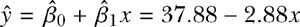

其中ŷ是平均油耗，*x*是数字型变量——气缸数。对于每增加一个气缸，模型表示油耗将平均减少 2.88 MPG。

认识到你已经将连续线拟合到实际上是分类数据的这一事实非常重要。以下几行代码创建的图 20-6 右侧面板突出了这一点：

```
R> plot(mtcars$mpg~mtcars$cyl,xlab="Cylinders",ylab="MPG")
R> abline(carfit,lwd=2)
```

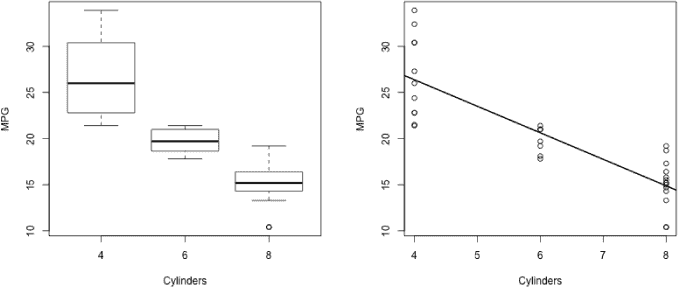

*图 20-6：左：根据气缸数划分的`mtcars`数据集的油耗箱线图。右：同一数据的散点图，并叠加了拟合的回归线（将`cyl`视为数字型-连续型）。*

一些研究人员故意将分类或离散预测变量拟合为连续变量。首先，这样做允许插值；例如，你可以使用这个模型评估一辆五缸车的平均油耗（MPG）。其次，这意味着需要估计的参数较少；换句话说，对于一个有 *k* 个组的分类变量，你只需要一个斜率参数，而不是 *k* − 1 个截距参数。最后，这可以是控制所谓“干扰变量”的一种便捷方式；这将在第二十一章中更清楚地解释。另一方面，这意味着你不再获得特定组的信息。如果某个观测值的预测变量类别的均值响应差异没有很好地线性表示，继续这样做可能会误导——重要效应的检测可能完全丧失。

至少，在拟合模型时，认识到这一点非常重要。如果你现在才意识到 R 将`cyl`变量拟合为连续型，并且希望将其作为分类变量来拟合模型，那么你必须提前或在实际调用`lm`时显式地将其转换为因子向量。

```
R> carfit <- lm(mpg~factor(cyl),data=mtcars)
R> summary(carfit)

Call:
lm(formula = mpg ~ factor(cyl), data = mtcars)

Residuals:
    Min      1Q  Median      3Q     Max
-5.2636 -1.8357  0.0286  1.3893  7.2364

Coefficients:
             Estimate Std. Error t  value Pr(>|t|)
(Intercept)   26.6636      0.9718  27.437  < 2e-16 ***
factor(cyl)6  -6.9208      1.5583  -4.441 0.000119 ***
factor(cyl)8 -11.5636      1.2986  -8.905 8.57e-10 ***
---
Signif. codes:  0 '***'  0.001 '**' 0.01 '*' 0.05 '.' 0.1 ' ' 1

Residual standard error: 3.223 on 29 degrees of freedom
Multiple R-squared:  0.7325, Adjusted R-squared:  0.714
F-statistic:  39.7 on 2 and 29 DF,  p-value: 4.979e-09
```

在这里，通过在指定`lm`公式时将`cyl`包装在`factor`调用中，你可以看到你已经为`cyl`的各个水平（对应 6 缸和 8 缸汽车，参考水平自动设置为 4 缸汽车）获得了回归系数估计值。

#### *20.5.5 与单因素 ANOVA 的等价性*

还有一个关于具有单一名义类别预测变量的回归模型的最终观察。考虑到这些模型描述的是*k*个不同组的均值响应值，这让你想到了什么吗？在这个特定的情境中，你实际上做的和单因素 ANOVA (第 19.1 节)中的操作是一样的：比较多个均值并确定是否有统计证据表明至少一个均值与其他均值不同。你需要为这两种技术做出相同的独立性和正态性假设。

实际上，使用最小二乘估计法实现的具有单一类别预测变量的简单线性回归，只是进行单因素 ANOVA 的另一种方式。或者，更简洁地说，ANOVA 是最小二乘回归的特例。单因素 ANOVA 检验的结果是一个*p*-值，它量化了反对零假设（即组均值相等）的一种统计证据。当回归中有一个类别预测变量时，正是这个*p*-值会在`lm`对象的`summary`输出的最后报告——我现在已经提到过几次，这是“整体”或“全局”显著性检验（例如，在第 20.3.3 节中）。

回顾一下学生身高由吸烟状态建模的全球显著性检验的最终结果——你得到了一个*p*-值为 0.2147。这个值来源于一个*F*检验统计量 1.504，df[1] = 3 和 df[2] = 205。现在，假设你只是拿到了数据，并被要求对身高与吸烟的关系进行单因素 ANOVA 分析。使用在第 19.1 节中介绍的`aov`函数，你将调用如下内容：

```
R> summary(aov(Height~Smoke,data=survey))
             Df Sum Sq Mean Sq F value Pr(>F)
Smoke         3    434  144.78   1.504  0.215
Residuals   205  19736   96.27
28 observations deleted due to missingness
```

这些相同的值在这里返回；你还可以找到 MSE 的平方根：

```
R> sqrt(96.27)
[1] 9.811728
```

这实际上是`lm`摘要中给出的“剩余标准误差”。你从吸烟状态对身高的影响得出的两个结论（一个是`lm`输出，另一个是 ANOVA 测试）当然也是相同的。

`lm` 提供的全局检验不仅仅是为了确认方差分析的结果。作为方差分析的推广，最小二乘回归模型提供的不仅仅是系数特定的检验。这个全局检验正式称为 *总合* F-*检验*，虽然它确实等同于单一类别预测变量设置下的单因素方差分析，但它也是一个有用的整体、独立的检验，用于评估多个预测变量对结果值的统计贡献。你将在第 21.3.5 节中深入探讨这一点，当你开始使用多个解释变量来建模响应变量时。

**练习 20.2**

接下来的几个练习继续使用 `MASS` 包中的 `survey` 数据框。

1.  `survey` 数据集有一个名为 `Exer` 的变量，它是一个因子，*k* = 3 个水平，描述每个学生的运动时间：无运动、适量运动或频繁运动。获取每个类别中学生的数量，并绘制分组箱线图，展示不同运动类别下学生的身高。

1.  假设观察值独立且符合正态分布，拟合一个线性回归模型，将身高作为响应变量，运动作为解释变量（虚拟编码）。预测变量的默认参考水平是什么？生成模型摘要。

1.  根据（b）中拟合的模型得出结论——运动频率是否对平均身高有影响？估计效果的性质是什么？

1.  预测三个运动类别中每个个体的平均身高，并提供 95% 预测区间。

1.  如果你使用 `aov` 构建方差分析表，你是否得出与身高与运动频率模型相同的结果和解释？

1.  如果你改变模型，使得练习变量的参考水平为“无”，那么（e）中的结果会有什么变化？你预计会有变化吗？

现在，回到已经准备好的 `mtcars` 数据集。这个数据框中的一个变量是 `qsec`，描述为赛车跑四分之一英里的时间（秒）；另一个变量是 `gear`，表示前进挡位的数量（这个数据集中的车有 3、4 或 5 个挡位）。

1.  使用数据框中的直观向量，拟合一个简单的线性回归模型，将 `qsec` 作为响应变量，`gear` 作为解释变量，并解释模型摘要。

1.  明确将 `gear` 转换为因子向量并重新拟合模型。将该模型摘要与（g）的摘要进行比较。你发现了什么？

1.  请借助与图 20-6 右图相同风格的相关图表，解释为什么你认为（g）和（h）两个模型之间存在差异。

##### 本章重要代码

| **函数/操作符** | **简要描述** | **首次出现** |
| --- | --- | --- |
| `lm` | 拟合线性模型 | 第 20.2.3 节，第 455 页 |
| `coef` | 获取估计的系数 | 第 20.2.4 节, 第 457 页 |
| `summary` | 总结线性模型 | 第 20.3.1 节, 第 458 页 |
| `confint` | 获取估计系数的置信区间 | 第 20.3.2 节, 第 460 页 |
| `predict` | 从线性模型中进行预测 | 第 20.4.2 节, 第 463 页 |
| `relevel` | 更改因子参考水平 | 第 20.5.3 节, 第 477 页 |
