## **21**

**多元线性回归**


多元线性回归是对上一章讨论的单一预测变量模型的直接推广。它允许你通过多个预测变量来建模你的连续响应变量，从而衡量多个解释变量对响应变量的联合影响。在本章中，你将看到如何以这种方式建模响应变量，并使用 R 来通过最小二乘法拟合模型。你还将探索线性建模的其他关键统计方面，如变量转换和包含交互效应。

多元线性回归是统计学实践中的一个重要部分。它允许你控制或调整多个因素对响应值的影响，而不仅仅是衡量一个解释变量的效果（在大多数情况下，结果的测量有多个因素共同作用）。这种方法的核心目标是揭示响应变量与任何解释变量（联合作用）的潜在因果关系。实际上，因果关系本身非常难以确立，但你可以通过设计良好的研究、支持有力的数据收集，及拟合能够合理衡量数据中关系的模型，来增强因果关系的证据。

### **21.1 术语**

在你了解多元回归模型背后的理论之前，首先要清楚理解一些与变量相关的术语。

• *潜在变量*影响响应变量、另一个预测变量，或者两者，但在预测模型中未被测量（或未被包括）。例如，假设一位研究人员发现家庭丢弃垃圾的量与家庭是否拥有蹦床之间存在关联。这里的潜在变量可能是家庭中孩子的数量——这一变量更可能与垃圾量的增加和拥有蹦床的几率正相关。将蹦床的拥有与垃圾增加直接关联的解释是错误的。

• 潜在变量的存在可能导致关于响应变量与其他预测变量之间因果关系的虚假结论，或者它可能掩盖一个真实的因果关系；这种错误被称为*混淆*。换句话说，你可以将混淆理解为一个或多个预测变量对响应变量的影响交织在一起。

• 一个 *干扰* 或 *外部变量* 是一个次要的或不相关的预测变量，它有可能混淆其他变量之间的关系，从而影响你对其他回归系数的估计。外部变量作为必要的建模元素被包含在内，但它们对响应的具体影响并不是分析的主要关注点。

一旦你开始拟合并解释回归模型，在第 21.3 节中，这些定义将变得更加清晰。我想再次强调的主要信息是，相关性并不意味着因果关系。如果拟合的模型发现预测变量（或多个预测变量）与响应之间存在统计显著关联，那么考虑潜在变量可能对结果的影响是非常重要的，并且在得出结论之前，要尽量控制任何混杂因素。多元回归模型使你能够做到这一点。

### **21.2 理论**

在开始使用 R 来拟合回归模型之前，你需要检查具有多个预测变量的线性回归模型的技术定义。在这里，你将从数学角度了解模型的工作原理，并一窥在 R 中估计模型参数时“幕后”发生的计算过程。

#### ***21.2.1 将简单模型扩展到多重模型***

与仅有一个预测变量不同，你希望根据 *p* > 1 个独立解释变量 *X*[1], *X*[2], . . ., *X*[p] 的值来确定一个连续响应变量 *Y* 的值。总体模型定义为：

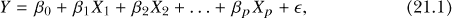

其中，*β*[0], . . . , *β*[p] 是回归系数，并且，如前所述，你假设残差 є ~ N(0, ˙) 独立、正态分布，围绕均值分布。

在实践中，你有 *n* 个数据记录；每个记录为每个预测变量 *X*[*j*] 提供值；*j* = {1, . . ., *p*}。待拟合的模型是基于特定解释变量集合的实现条件下的均值响应给出的。

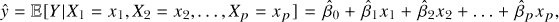

其中，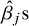 代表回归系数的估计值。

在简单线性回归中，当你只有一个预测变量时，回顾一下，目标是找到“最佳拟合线”。对于多个独立预测变量的线性模型，最小二乘估计的思想是类似的。然而，现在你可以在抽象意义上将响应与预测变量之间的关系看作是一个多维平面或曲面。你要找到一个表面，它最能拟合你的多变量数据，并通过最小化该表面与原始响应数据之间的总平方距离来实现。

更正式地，对于你的 *n* 数据记录， 是通过最小化以下总和得到的值：

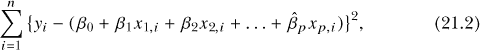

其中，*x* [*j*],[*i*] 是第 *i* 个个体在解释变量 *X*[*j*] 上的观察值，*y[i]* 是他们的响应值。

#### ***21.2.2 矩阵形式的估计***

通过数据的 *矩阵表示*，最小化此平方距离 (21.2) 的计算变得更加简便。在处理 *n* 个多变量观察值时，你可以将 公式 (21.1) 写作如下，

***Y*** = ***X*** · + є,

其中 ***Y*** 和 є 表示 *n* × 1 的列矩阵，使得

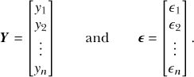

这里，*y[i]* 和 є[*i*] 分别表示第 *i* 个个体的响应观察值和随机误差项。量 ***β*** 是一个 (*p* + 1) × 1 的回归系数列矩阵，而所有个体的观察预测数据和解释变量则存储在一个 *n* × (*p* + 1) 的矩阵 ***X*** 中，这个矩阵被称为 *设计矩阵*：

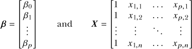

最小化 (21.2) 提供的估计回归系数值是通过以下计算得到的：

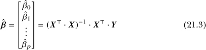

需要注意以下几点：

• 符号 · 表示矩阵乘法，上标 ^⊤ 表示转置，^−¹ 表示逆矩阵（参见 第 3.3 节）。

• 扩展 *β* 和 ***X*** 的大小（注意 ***X*** 中前导的 1 列）以创建 *p* + 1 的结构（而不仅仅是预测变量的数量 *p*），从而可以估计总体截距 *β*[0]。

• 除了 (21.3) 外，设计矩阵在估计其他量（如回归系数的标准误差）中也发挥着关键作用。

#### ***21.2.3 一个基本示例***

你可以使用 第三章 中介绍的函数在 R 中手动估计 *β[j]*（*j* = 0, 1, ..., *p*）：`%*%`（矩阵乘法）、`t`（矩阵转置）和 `solve`（矩阵求逆）。作为一个快速示例，假设你有两个预测变量：*X[1]* 是连续的，*X[2]* 是二元的。因此，你的目标回归方程是 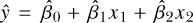。假设你收集了以下数据，其中响应数据、*X*[1] 和 *X*[2] 的数据，针对 *n* = 8 个个体，分别列在 `y`、`x1` 和 `x2` 列中。

```
R> demo.data <- data.frame(y=c(1.55,0.42,1.29,0.73,0.76,-1.09,1.41,-0.32),
                           x1=c(1.13,-0.73,0.12,0.52,-0.54,-1.15,0.20,-1.09),
                           x2=c(1,0,1,1,0,1,0,1))
R> demo.data
      y    x1 x2
1  1.55  1.13  1
2  0.42 -0.73  0
3  1.29  0.12  1
4  0.73  0.52  1
5  0.76 -0.54  0
6 -1.09 -1.15  1
7  1.41  0.20  0
8 -0.32 -1.09  1
```

要获得线性模型中 ***β*** = [*β*[0], *β*[1], *β*[2]]^┬ 的点估计，你首先需要按照 (21.3) 的要求构造 ***X*** 和 ***Y***。

```
R> Y <- matrix(demo.data$y)
R> Y
      [,1]
[1,]  1.55
[2,]  0.42
[3,]  1.29
[4,]  0.73
[5,]  0.76
[6,] -1.09
[7,]  1.41
[8,] -0.32
R> n <- nrow(demo.data)
R> X <- matrix(c(rep(1,n),demo.data$x1,demo.data$x2),nrow=n,ncol=3)
R> X
     [,1]  [,2] [,3]
[1,]    1  1.13    1
[2,]    1 -0.73    0
[3,]    1  0.12    1
[4,]    1  0.52    1
[5,]    1 -0.54    0
[6,]    1 -1.15    1
[7,]    1  0.20    0
[8,]    1 -1.09    1
```

现在你需要做的就是执行与公式 (21.3) 相对应的那行代码。

```
R> BETA.HAT <- solve(t(X)
R> BETA.HAT
           [,1]
[1,]  1.2254572
[2,]  1.0153004
[3,] -0.6980189
```

你刚刚使用最小二乘法根据 `demo.data` 中的观察数据拟合了你的模型，得到了估计值 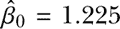、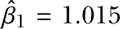 和 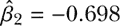。

### **21.3 在 R 中实现与解释**

R 总是很有帮助，当你指示它拟合多元线性回归模型时，它会自动构建矩阵并执行所有必要的计算。与简单回归模型一样，你使用 `lm` 并在指定第一个参数的公式时包含任何额外的预测变量。为了让你能够专注于 R 语法和结果解释，我暂时只关注*主效应*，然后你可以在本章后面探索更复杂的关系。

在输出和解释方面，使用多个解释变量遵循的规则与第二十章中看到的相同。任何数值型连续变量（或作为此类变量处理的分类变量）都有一个斜率系数，提供“每单位变化”的数量。任何 *k* 类别的分类变量（因子，形式上是无序的）都采用虚拟编码，并提供 *k* − 1 个截距。

#### ***21.3.1 额外的预测变量***

让我们首先确认一下刚才手动计算的矩阵。使用 `demo.data` 对象，拟合多元线性模型，并按如下方式检查该对象的系数：

```
R> demo.fit <- lm(y~x1+x2,data=demo.data)
R> coef(demo.fit)
(Intercept)          x1          x2
  1.2254572   1.0153004  -0.6980189
```

你将看到，你得到的正是之前在 `BETA.HAT` 中存储的点估计。

按照惯例，响应变量位于左侧，你在 `~` 符号的右侧指定多个预测变量；所有这些一起构成了公式参数。为了拟合包含多个主效应的模型，使用 `+` 来分隔你想要包含的任何变量。事实上，你已经在第 19.2.2 节中看到过这种符号，用于研究双因素方差分析。

为了研究多元线性回归模型参数估计值的解释，我们回到 `MASS` 包中的 `survey` 数据集。在第二十章中，你探讨了几种简单的线性回归模型，基于学生身高作为响应变量，以及手掌跨度（连续型）和性别（分类变量，*k* = 2）作为独立预测变量。你发现手掌跨度在统计学上非常显著，估计系数表明手掌跨度每增加 1 厘米，身高平均增加约 3.12 厘米。当你使用性别作为解释变量查看相同的 *t*-检验时，模型也提供了反对零假设的证据，表明“男性”与女性（作为参考类别）相比，平均身高多出约 13.14 厘米。

这些模型无法告诉你的是性别和手掌跨度对预测身高的*联合效应*。如果你在多元线性模型中同时包含这两个预测变量，你可以（在一定程度上）减少可能在单独拟合每个预测变量对身高影响时发生的混杂效应。

```
R> survmult <- lm(Height~Wr.Hnd+Sex,data=survey)
R> summary(survmult)
Call:
lm(formula = Height ~ Wr.Hnd + Sex, data = survey)

Residuals:
     Min       1Q   Median       3Q      Max
-17.7479  -4.1830   0.7749   4.6665  21.9253

Coefficients:
            Estimate Std. Error t value Pr(>|t|)
(Intercept) 137.6870     5.7131  24.100  < 2e-16 ***
Wr.Hnd        1.5944     0.3229   4.937 1.64e-06 ***
SexMale       9.4898     1.2287   7.724 5.00e-13 ***
---
Signif. codes:  0 '***' 0.001 '**' 0.01 '*' 0.05 '.' 0.1 ' ' 1

Residual standard error: 6.987 on 204 degrees of freedom
  (30 observations deleted due to missingness)
Multiple R-squared:  0.5062, Adjusted R-squared:  0.5014
F-statistic: 104.6 on 2 and 204 DF,  p-value: < 2.2e-16
```

手掌跨度的系数现在只有大约 1.59，几乎是其在独立的简单线性回归中与身高相关的系数（3.12 厘米）的一半。尽管如此，在性别存在的情况下，它仍然具有高度的统计显著性。与其简单线性模型相比，性别的系数也有所减小，但在手掌跨度的存在下仍然显著。稍后你会解释这些新数字。

至于其余的输出，`Residual standard error`仍然为你提供了随机噪声项є的标准误差估计值，同时还提供了一个`R-squared`值。当与多个预测变量关联时，后者正式被称为*多重*决定系数。这个系数的计算，与单一预测变量设置中的计算方式一样，来自于模型中各变量之间的相关性。我将理论上的复杂性留给更高级的文献，但需要注意的是，`R-squared`仍然代表了回归模型解释的响应变量的变异性比例；在这个例子中，它约为 0.51。

如果需要，你可以继续以相同的方式添加解释变量。在第 20.5.2 节中，你曾将吸烟频率作为单独的分类预测变量来分析身高，发现该解释变量并未提供对均值响应的显著统计影响。但是，如果你控制了手掌跨度和性别，吸烟变量是否能够以统计显著的方式做出贡献呢？

```
R> survmult2 <- lm(Height~Wr.Hnd+Sex+Smoke,data=survey)
R> summary(survmult2)

Call:
lm(formula = Height ~ Wr.Hnd + Sex + Smoke, data = survey)

Residuals:
     Min       1Q   Median       3Q      Max
-17.4869  -4.7617   0.7604   4.3691  22.1237

Coefficients:
            Estimate Std. Error t value Pr(>|t|)
(Intercept) 137.4056     6.5444  20.996  < 2e-16 ***
Wr.Hnd        1.6042     0.3301   4.860 2.36e-06 ***
SexMale       9.3979     1.2452   7.547 1.51e-12 ***
SmokeNever   -0.0442     2.3135  -0.019    0.985
SmokeOccas    1.5267     2.8694   0.532    0.595
SmokeRegul    0.9211     2.9290   0.314    0.753
---
Signif. codes:  0 '***' 0.001 '**' 0.01 '*' 0.05 '.' 0.1 ' ' 1

Residual standard error: 7.023 on 201 degrees of freedom
  (30 observations deleted due to missingness)
Multiple R-squared:  0.5085, Adjusted R-squared:  0.4962
F-statistic: 41.59 on 5 and 201 DF,  p-value: < 2.2e-16
```

由于吸烟是一个具有*k* > 2 个水平的分类变量，`Smoke`采用虚拟编码（以重度吸烟者为默认参考水平），为该变量的三个非参考水平提供了三个额外的截距项；第四个则并入总体截距。

在最新拟合的`summary`中，你可以看到，尽管手掌跨度和性别继续产生非常小的*p*值，但吸烟频率并未提供与零系数假设相悖的证据。与`survmult`中的前一个模型相比，吸烟变量对其他系数值的影响很小，并且`R-squared`多重决定系数几乎没有增加。

你现在可能会问，如果吸烟频率在预测均值身高方面没有实质性的帮助，是否应该将该变量从模型中完全移除？这是*模型选择*的主要目标：找到最适合预测结果的“最佳”模型，而不是拟合一个不必要复杂的模型（通过包含过多不必要的解释变量）。你将在第 22.2 节中查看研究人员尝试实现这一目标的几种常见方法。

#### ***21.3.2 边际效应的解释***

在多元回归中，每个预测因子的估计考虑了模型中所有其他预测因子的影响。因此，特定预测因子*Z*的系数应解释为在保持其他所有预测因子不变的情况下，*Z*增加一个单位时平均反应的变化。

既然你已经确定吸烟频率在考虑性别和手掌跨度时似乎对平均身高没有明显影响，那么请将注意力重新集中到`survmult`，这个模型只包含性别和手掌跨度这两个解释变量。请注意以下几点：

• 对于相同性别的学生（即仅关注男性或仅关注女性），手掌跨度增加 1 厘米，预计平均身高将增加 1.5944 厘米。

• 对于手掌跨度相似的学生，男性的平均身高比女性高 9.4898 厘米。

• 当将两个估计的预测系数与各自的简单线性模型拟合进行比较时，值的差异，再加上两者在多元拟合中仍然表明反对“为零”这一零假设的证据，表明在单一预测模型中存在混杂（即手掌跨度和性别对身高反应变量的影响）。

最后一点突出了多元回归的一般用途。它表明，在此示例中，如果仅使用单一预测模型，确定每个解释变量在预测平均反应中所产生的“真实”影响是误导性的，因为身高的变化部分由性别决定，另一部分则归因于手掌跨度。值得注意的是，`survmult`模型的决定系数（参见第 20.3.3 节）明显高于任何单变量模型中的同一数量，因此通过使用多元回归，实际上你考虑到了更多反应变量的变化。

拟合的模型本身可以被视为

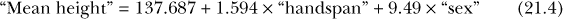

其中，“手掌跨度”是以厘米为单位提供的写手手掌跨度，“性别”则以 1（男性）或 0（女性）的方式提供。

**注意**

*基准（总体）截距约为 137.687 厘米，表示一个手掌跨度为 0 厘米的女性的平均身高——再次强调，这在应用的背景下显然无法直接解释。在这种情况下，一些研究者会通过从每个观察值中减去该预测因子所有观测值的样本均值，将问题中的连续预测因子（或多个预测因子）中心化为零，然后使用中心化后的数据进行模型拟合。通过这种方式拟合的模型允许你使用未转换预测因子（在此例中为手掌跨度）的均值，而不是零值，以便直接解释截距估计值* 。

#### ***21.3.3 可视化多元线性模型***

如图所示，“性别为男性”仅将整体截距改变约 9.49 厘米：

```
R> survcoefs <- coef(survmult)
R> survcoefs
(Intercept)      Wr.Hnd     SexMale
 137.686951    1.594446    9.489814
R> as.numeric(survcoefs[1]+survcoefs[3])
[1] 147.1768
```

因此，你也可以将（21.4）写成两个方程式。这里是女性学生的方程：

“平均身高” = 137.687 + 1.594 × “手掌宽度”

这里是男性学生的方程：

| “平均身高” | = | (137.687 + 9.4898) + 1.594 × “手掌宽度” |
| --- | --- | --- |
|  | = | 147.177 + 1.594 × “手掌宽度” |

这很方便，因为它让你能够像可视化简单线性模型一样，可视化多变量模型。此代码生成了图 21-1：

```
R> plot(survey$Height~survey$Wr.Hnd,
        col=c("gray","black")[as.numeric(survey$Sex)],
        pch=16,xlab="Writing handspan",ylab="Height")
R> abline(a=survcoefs[1],b=survcoefs[2],col="gray",lwd=2)
R> abline(a=survcoefs[1]+survcoefs[3],b=survcoefs[2],col="black",lwd=2)
R> legend("topleft",legend=levels(survey$Sex),col=c("gray","black"),pch=16)
```

首先，绘制一个按照性别分割的身高和手掌宽度的散点图。然后，`abline`会添加一条对应女性的线，并基于这两个方程添加另一条对应男性的线。

尽管这个图看起来像是两个独立的简单线性模型拟合，每个模型针对性别的一个水平，但重要的是要认识到事实并非如此。你实际上是在二维画布上查看多元模型的表示，其中决定这两条可见线拟合的统计量是“联合”估算的，换句话说，是在考虑两个预测变量的情况下估算的。

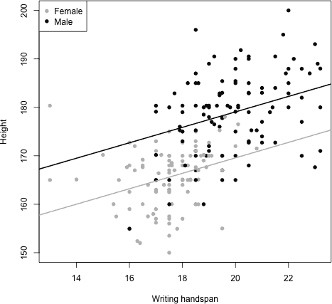

*图 21-1：可视化观测数据和由手掌宽度及性别建模的学生身高的拟合多元线性模型*

#### ***21.3.4 计算置信区间***

如同第二十章中所述，你可以通过`confint`轻松找到任何回归参数的置信区间，在多元回归模型中，使用`survmult2`，即包含吸烟频率预测变量的学生身高拟合模型的对象，调用`confint`后的输出如下所示：

```
R> confint(survmult2)
                  2.5 %     97.5 %
(Intercept) 124.5010442 150.310074
Wr.Hnd        0.9534078   2.255053
SexMale       6.9426040  11.853129
SmokeNever   -4.6061148   4.517705
SmokeOccas   -4.1312384   7.184710
SmokeRegul  -4.8543683    6.696525
```

请注意，在之前的模型总结中，`Wr.Hnd`和`SexMale`变量在 5%的显著性水平下被证明是统计显著的，并且它们的 95%置信区间不包括零值。另一方面，与吸烟频率预测变量相关的所有虚拟变量的系数都是不显著的，并且它们的置信区间明显包含零。这反映了吸烟变量在该模型中整体上不被认为是统计显著的。

#### ***21.3.5 总体 F 检验***

在第 20.5.2 节首次介绍过的多级预测变量的上下文中，你可以更一般地将总体*F*-检验应用于多元回归模型，作为一个包含以下假设的检验：

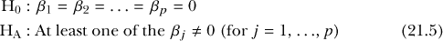

该检验实际上是在比较“零”模型（换句话说，只有截距的模型）所归因的误差与在所有预测变量都存在时，预测变量所归因的误差。换句话说，预测变量能够更好地拟合响应变量时，解释的误差更多，从而得到更极端的 *F* 统计量，因此 *p*-值更小。这个单一的结果使得当你有多个解释变量时，该检验尤其有用。无论你在给定模型中有多少种预测变量组合，检验方式都是相同的：一个或多个可能是连续的、离散的、二元的和/或具有 *k* > 2 水平的分类变量。当拟合多个回归模型时，仅输出量的大小就可能需要时间来消化和解释，并且必须小心避免第一类错误（错误地拒绝真实的零假设—参见 第 18.5 节）。

*F* 检验有助于简化这一过程，使你能够得出以下结论之一：

1.  如果相关的 *p*-值小于你选择的显著性水平 *α*，则反对 H[0] 的证据，这表明你的回归模型——你对解释变量的组合——在预测响应变量方面显著优于如果去掉 *所有* 这些预测变量时的模型。

1.  如果相关的 *p*-值大于 *α*，则没有反对 H[0] 的证据，这表明使用预测变量相比单独使用截距并没有明显的好处。

缺点是，检验并不能告诉你哪些预测变量（或哪些子集）对模型拟合产生了有益的影响，也无法告诉你它们的系数或各自的标准误。

你可以使用拟合回归模型中的决定系数 *R*² 来计算 *F* 检验统计量。令 *p* 为需要估计的回归参数个数，排除截距 *β*[0]。然后，

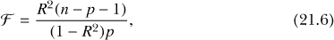

其中 *n* 是用于拟合模型的观测值数量（在删除了缺失值记录后）。然后，在 H[0] 假设下，如公式 (21.5) 所示， 服从 *F* 分布（见 第 16.2.5 节，以及 第 19.1.2 节），其自由度为 df[1] = *p*，df[2] = *n*− *p*−1。与公式 (21.6) 相关的 *p*-值是该 *F* 分布上尾区域的面积。

作为一个快速练习来确认这一点，回到在 第 21.3.1 节 中拟合的多元回归模型 `survmult2`，这是基于 `survey` 数据集中的手掌跨度、性别和吸烟状态来预测学生身高的模型。你可以从 `summary` 报告中提取多重决定系数（使用 第 20.3.4 节 中提到的技术）。

```
R> R2 <- summary(survmult2)$r.squared
R> R2
[1] 0.508469
```

这与第 21.3.1 节中的多个 R 平方值相匹配。然后，你可以得到*n*，即`survey`数据集的原始大小减去任何缺失值（在之前的`summary`输出中报告为 30）。

```
R> n <- nrow(survey)-30
R> n
[1] 207
```

你得到*p*，即估计的回归参数的数量（减去 1 用于截距）。

```
R> p <- length(coef(survmult2))-1
R> p
[1] 5
```

然后，你可以确认*n* − *p* − 1 的值，这与`summary`输出中的值相匹配（`201 自由度`）：

```
R> n-p-1
[1] 201
```

最后，你可以根据（21.6）找到检验统计量 ，并且你可以按如下方式使用`pf`函数来获得该检验的相应*p*-值：

```
R> Fstat <- (R2*(n-p-1))/((1-R2)*p)
R> Fstat
[1] 41.58529
R> 1-pf(Fstat,df1=p,df2=n-p-1)
[1] 0
```

你可以看到，这个例子的全局*F*-检验给出的*p*-值非常小，几乎为零。这些计算结果与`summary(survmult2)`输出中报告的相关结果完全一致。

回顾基于手掌跨度、性别和吸烟情况的学生身高多重回归拟合（在`survmult2`中）第 21.3.1 节，不难理解，两个预测变量的*p*-值较小，而全局*F*-检验基于（21.5）表明强烈反对 H[0]的证据。这突出了全局检验的“伞形”特性：尽管吸烟频率变量本身似乎没有显著的统计贡献，但该模型的*F*-检验仍然表明，`survmult2`应该优于“不含预测变量”的模型，因为手掌跨度和性别都是重要的。

#### ***21.3.6 从多重线性模型进行预测***

多重回归的预测（或*预测*）遵循与简单回归相同的规则。重要的是要记住，为特定*协变量特征*（给定个体的预测变量值的集合）找到的点预测是与响应的均值（或*期望值*）相关联的；置信区间提供均值响应的度量；而预测区间提供原始观察值的度量。你还必须考虑插值（基于* x *值的预测，这些值落在原始观察到的协变量数据的范围内）与外推（基于* x *值的预测，这些值超出了该数据的范围）的问题。除此之外，`predict`的 R 语法与第 20.4 节中使用的完全相同。

例如，使用在`survmult`中将学生身高拟合为手掌跨度和性别的线性函数的模型，你可以估计一位手掌跨度为 16.5 厘米的男性学生的平均身高，并给出置信区间。

```
R> predict(survmult,newdata=data.frame(Wr.Hnd=16.5,Sex="Male"),
           interval="confidence",level=0.95)
       fit      lwr      upr
1 173.4851 170.9419 176.0283
```

结果表明，你的期望值约为 173.48 厘米，且你可以 95%的置信度确认真实值介于 170.94 和 176.03 之间（四舍五入到小数点后两位）。同样，手掌跨度为 13 厘米的女性的平均身高估计为 158.42 厘米，99%的预测区间为 139.76 到 177.07。

```
R> predict(survmult,newdata=data.frame(Wr.Hnd=13,Sex="Female"),
           interval="prediction",level=0.99)
       fit      lwr      upr
1 158.4147 139.7611 177.0684
```

数据集中实际上有两名雌性学生的手掌跨度为 13 厘米，如图 21-1 所示。通过你对数据框子集操作的知识，你可以检查这两条记录，并选择三种感兴趣的变量。

```
R> survey[survey$Sex=="Female" & survey$Wr.Hnd==13,c("Sex","Wr.Hnd","Height")]
       Sex Wr.Hnd Height
45  Female     13 180.34
152 Female     13 165.00
```

现在，第二只雌性猫的身高落在预测区间内，但第一只雌性猫的身高显著高于上限。重要的是要意识到，从技术上讲，模型拟合和解释上并没有出错——尽管不太可能，但观察值可能会落在预测区间外，甚至是一个宽广的 99%区间内。这种情况可能有许多原因。首先，模型可能不足。例如，你可能在拟合的模型中排除了重要的预测变量，从而使得预测能力较差。其次，尽管预测值在观察数据的范围内，但它发生在这个范围的极端端点，那里数据相对稀疏，因此预测值的可靠性较差。第三，观察值本身可能以某种方式受到污染——也许个体在记录手掌跨度时不准确，在这种情况下，她的不有效观察应在模型拟合前被移除。正是以这种批判性的眼光，一个优秀的统计学家会评估数据和模型；这是我将在本章中进一步强调的技能。

**练习 21.1**

在`MASS`包中，你会找到数据框`cats`，它提供了 144 只家猫的性别、体重（以千克为单位）和心脏重量（以克为单位）数据（有关更多详细信息，请参见 Venables and Ripley, 2002）；你可以通过调用`?cats`来阅读文档。使用`library("MASS")`加载`MASS`包，并通过在控制台提示符下输入`cats`来直接访问该对象。

1.  将心脏重量绘制在纵轴上，将体重绘制在横轴上，使用不同的颜色或点字符来区分雄性和雌性猫。在图表上加上图例和适当的轴标签。

1.  使用心脏重量作为响应变量，其他两个变量作为预测变量，拟合一个最小二乘多元线性回归模型，并查看模型摘要。

    1.  写下拟合模型的方程，并解释体重和性别的回归系数估计值。这两个系数是否具有统计显著性？这说明响应变量和预测变量之间的关系如何？

    1.  报告并解释决定系数和整体*F*检验的结果。

1.  Tilman 的猫，Sigma，是一只体重 3.4 千克的雌性猫。使用你的模型来估计她的平均心脏重量，并提供一个 95%的预测区间。

1.  使用`predict`根据拟合的线性模型，在你从（a）部分绘制的图表上叠加连续的线条，分别为雄性猫和雌性猫绘制。你注意到什么？这是否反映了参数估计的统计显著性（或缺乏统计显著性）？

`boot`包（Davison 和 Hinkley, 1997; Canty 和 Ripley, 2015）是另一个与标准安装一起提供的 R 语言库，但不会自动加载。使用`library("boot")`来加载`boot`。你将找到一个名为`nuclear`的数据框，它包含关于 1960 年代末美国核电厂建设的数据（Cox 和 Snell, 1981）。

1.  通过在提示符下输入`?nuclear`访问文档，并检查变量的详细信息。（请注意，`date`存在一个错误，它提供了建筑许可证颁发的日期——它应该写为“自**1900 年 1 月 1 日**以来的年份，取整到最近的月份。”）使用`pairs`生成数据的快速散点图矩阵。

1.  原始目标之一是预测这些电厂进一步建设的成本。创建一个线性回归模型并总结，模型旨在通过`t1`和`t2`这两个描述申请和颁发各种许可证时所经历的不同时间的变量来建模`cost`。注意拟合模型中估计的回归系数及其显著性。

1.  重新拟合模型，但这次还要考虑建筑许可证颁发日期的影响。将这个新模型的输出与之前的模型进行对比。你注意到了什么？这些信息表明了关于这些预测变量的数据关系？

1.  为电厂成本拟合第三个模型，使用“许可证颁发日期”、“电厂容量”和描述电厂是否位于美国东北部的二元变量作为预测变量。写出拟合模型方程，并为每个估计的系数提供 95%的置信区间。

以下表格给出了 1961 年到 1973 年间汇编的历史数据的摘录。它涉及密歇根州底特律的年谋杀率；这些数据最初由 Fisher（1976）提出并分析，现由 Harraway（1995）在此处重现。在数据集中，你将找到每 10 万人中谋杀人数、警察人数和发放的枪支许可证数量，以及整体失业率占总人口的百分比。

| **谋杀** | **警察** | **失业率** | **枪支** |
| --- | --- | --- | --- |
| 8.60 | 260.35 | 11.0 | 178.15 |
| 8.90 | 269.80 | 7.0 | 156.41 |
| 8.52 | 272.04 | 5.2 | 198.02 |
| 8.89 | 272.96 | 4.3 | 222.10 |
| 13.07 | 272.51 | 3.5 | 301.92 |
| 14.57 | 261.34 | 3.2 | 391.22 |
| 21.36 | 268.89 | 4.1 | 665.56 |
| 28.03 | 295.99 | 3.9 | 1131.21 |
| 31.49 | 319.87 | 3.6 | 837.60 |
| 37.39 | 341.43 | 7.1 | 794.90 |
| 46.26 | 356.59 | 8.4 | 817.74 |
| 47.24 | 376.69 | 7.7 | 583.17 |
| 52.33 | 390.19 | 6.3 | 709.59 |

1.  在 R 工作区中创建自己的数据框，并生成散点图矩阵。哪些变量似乎与谋杀率最强相关？

1.  使用谋杀案件数作为响应变量，其他所有变量作为预测变量，拟合一个多元线性回归模型。写下模型方程并解释系数。是否可以合理地说，响应变量和预测变量之间的所有关系都是因果关系？

1.  确定响应中由于三种解释变量的联合作用而产生的变化量。然后重新拟合模型，排除与最大（换句话说，“最不显著”）*p*值相关的预测变量。将新模型的决定系数与之前模型的决定系数进行比较。差异大吗？

1.  使用(k)中的模型预测每 10 万人中谋杀案件的平均数量，假设有 300 名警察和 500 个发放的枪支许可证。将其与没有发放枪支许可证时的平均响应进行比较，并为两种预测提供 99%的置信区间。

### **21.4 数值变量的转换**

有时，严格按照标准回归方程(21.1)定义的线性函数在捕捉响应与选择的协变量之间的关系时可能不足。例如，您可能会在两个数值变量之间的散点图中观察到曲线性，而完美的直线不一定是最佳拟合。某种程度上，可以通过在估计或模型拟合之前简单地对某些变量进行转换（通常是非线性转换）来放宽要求，即数据必须表现出线性行为，才能使线性回归模型适用。

*数值转换*是指对数值观察值应用数学函数以便重新缩放它们。求一个数的平方根和将温度从华氏度转换为摄氏度都是数值转换的例子。在回归分析中，转换通常仅适用于连续变量，并且可以通过多种方式进行。在本节中，您将重点关注使用两种最常见方法的示例：*多项式*和*对数*转换。然而，请注意，所使用的转换变量方法是否适当，以及可能出现的建模优势，必须根据具体情况逐一评估。

转换通常并不是解决数据趋势中非线性问题的普遍解决方案，但它至少可以改善线性模型对这些趋势的拟合程度。

#### ***21.4.1 多项式***

继续前面提到的一个评论，假设你在数据中观察到一种曲线关系，这样一条直线就不再是合适的建模选择。为了更精确地拟合你的数据，可以对回归模型中的特定预测变量应用多项式或*幂次*变换。这是一种简单的技术，通过在关系中允许*多项式曲率*，使得该预测变量的变化能够以比通常更复杂的方式影响响应。你通过在模型定义中添加额外的项来实现这一点，这些项表示变量的更高次幂对响应的影响。

为了更清晰地阐述多项式曲率的概念，考虑以下在−4 到 4 之间的序列，以及由此计算出的简单向量：

```
R> x <- seq(-4,4,length=50)
R> y <- x
R> y2 <- x + x²
R> y3 <- x + x² + x³
```

在这里，你需要对原始的`x`值进行特定函数运算。向量`y`作为`x`的副本，显然是线性的（从技术角度来看，这是“1 阶多项式”）。你将`y2`赋值为`x`的平方，从而提供*二次*行为——2 阶多项式。最后，向量`y3`表示`x`的*立方*函数的结果，其中包括`x`的 3 次方——3 阶多项式。

以下三行代码分别生成图 21-2 中从左到右的图示。

```
R> plot(x,y,type="l")
R> plot(x,y2,type="l")
R> plot(x,y3,type="l")
```

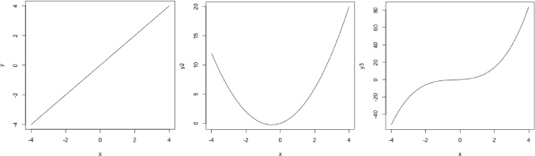

*图 21-2：展示`x`的线性（左）、二次（中）和立方（右）函数*

更普遍地说，假设你有一个连续预测变量*X*的数据，你希望用它来建模响应*Y*。按通常的方式线性估计，简单模型是 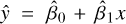；*X*的二次趋势可以通过多元回归 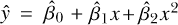 来建模；立方关系可以通过 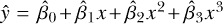 捕捉；依此类推。从图 21-2 的图示中，可以很好地解释包括这些额外项的效果，即可以捕捉到的曲线的复杂度。在 1 阶时，线性关系不允许曲率；在 2 阶时，任何给定变量的二次函数允许一个“弯曲”；在 3 阶时，模型可以处理关系中的两个弯曲，继续添加对应于协变量更高次幂的项时，情况会如此继续。这些项相关的回归系数（在生成前述图表的代码中，所有回归系数都被假设为 1）能够控制曲率的具体表现（换句话说，控制曲率的*强度*和*方向*）。

##### **拟合多项式变换**

将注意力转回内置的`mtcars`数据集。考虑描述发动机排量（单位：立方英寸）的`disp`变量，并与响应变量（每加仑英里数）进行比较。如果你查看图 21-3 中的数据图，可以看到排量与里程之间的关系确实存在一个轻微但明显的曲线。

```
R> plot(mtcars$disp,mtcars$mpg,xlab="Displacement (cu. in.)",ylab="MPG")
```

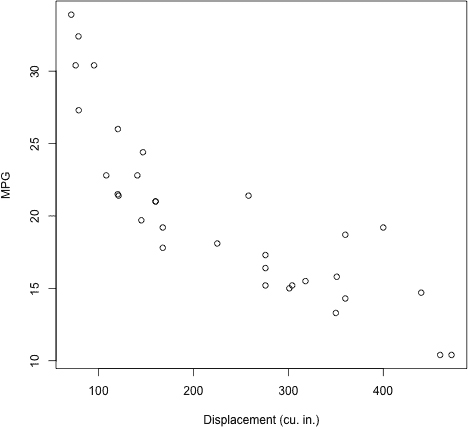

*图 21-3：`mtcars`数据集中的每加仑英里数与发动机排量的散点图*

简单线性回归模型提供的直线真的能最好地表示这种关系吗？为了调查这一点，首先拟合那个基础的线性模型。

```
R> car.order1 <- lm(mpg~disp,data=mtcars)
R> summary(car.order1)

Call:
lm(formula = mpg ~ disp, data = mtcars)

Residuals:
    Min      1Q  Median      3Q     Max
-4.8922 -2.2022 -0.9631  1.6272  7.2305

Coefficients:
             Estimate Std. Error t value Pr(>|t|)
(Intercept) 29.599855   1.229720  24.070  < 2e-16 ***
disp        -0.041215   0.004712  -8.747 9.38e-10 ***
---
Signif. codes:  0 '***' 0.001 '**' 0.01 '*' 0.05 '.' 0.1 ' ' 1

Residual standard error: 3.251 on 30 degrees of freedom
Multiple R-squared:  0.7183,        Adjusted R-squared:  0.709
F-statistic: 76.51 on 1 and 30 DF,  p-value: 9.38e-10
```

这清晰地表明排量对里程的负线性影响的统计证据——每增加一个立方英寸的排量，平均响应下降约 0.041 英里每加仑。

现在，尝试通过在模型中添加`disp`的二次项来捕捉数据中的明显曲线。你可以通过两种方式实现这一点。首先，你可以通过简单地对`mtcars$disp`向量进行平方运算，创建一个新的向量并将结果提供给`lm`函数中的公式。其次，你可以直接在公式中将`disp²`作为一个加法项指定。如果你选择这种方法，必须将该表达式包裹在`I`函数调用中，如下所示：

```
R> car.order2 <- lm(mpg~disp+I(disp²),data=mtcars)
R> summary(car.order2)

Call:
lm(formula = mpg ~ disp + I(disp²), data = mtcars)

Residuals:
    Min      1Q  Median      3Q     Max
-3.9112 -1.5269 -0.3124  1.3489  5.3946

Coefficients:
              Estimate Std. Error t value Pr(>|t|)
(Intercept)  3.583e+01  2.209e+00  16.221 4.39e-16 ***
disp        -1.053e-01  2.028e-02  -5.192 1.49e-05 ***
I(disp²)    1.255e-04  3.891e-05   3.226   0.0031 **
---
Signif. codes:  0 '***' 0.001 '**' 0.01 '*' 0.05 '.' 0.1 ' ' 1

Residual standard error: 2.837 on 29 degrees of freedom
Multiple R-squared:  0.7927,        Adjusted R-squared:  0.7784
F-statistic: 55.46 on 2 and 29 DF,  p-value: 1.229e-10
```

当公式中的某一项需要进行算术计算时——在本例中是`disp²`——才需要使用`I`函数对该项进行包裹，才能在模型拟合之前进行计算。

回到拟合后的多元回归模型本身，可以看到平方项的贡献具有统计学显著性——对应于`I(disp²)`的输出显示*p*-值为 0.0031。这意味着，即使考虑了线性趋势，包含二次项（引入曲线）的模型也更适合拟合数据。这个结论得到了明显更高的决定系数支持（0.7927 对比 0.7183）。你可以在图 21-4 中看到这个二次曲线的拟合效果（相关代码稍后展示）。

在这里，你可能会合理地想知道，通过在相关变量中再添加一个更高阶项，是否能进一步提高模型捕捉关系的能力。为此：

```
R> car.order3 <- lm(mpg~disp+I(disp²)+I(disp³),data=mtcars)
R> summary(car.order3)

Call:
lm(formula = mpg ~ disp + I(disp²) + I(disp³), data = mtcars)

Residuals:
    Min      1Q  Median      3Q     Max
-3.0896 -1.5653 -0.3619  1.4368  4.7617

Coefficients:
              Estimate Std. Error t value Pr(>|t|)
(Intercept)  5.070e+01  3.809e+00  13.310 1.25e-13 ***
disp        -3.372e-01  5.526e-02  -6.102 1.39e-06 ***
I(disp²)    1.109e-03  2.265e-04   4.897 3.68e-05 ***
I(disp³)   -1.217e-06  2.776e-07  -4.382  0.00015 ***
---
Signif. codes:  0 '***' 0.001 '**' 0.01 '*' 0.05 '.' 0.1 ' ' 1

Residual standard error: 2.224 on 28 degrees of freedom
Multiple R-squared: 0.8771,         Adjusted R-squared: 0.8639
F-statistic: 66.58 on 3 and 28 DF,  p-value: 7.347e-13
```

输出结果显示，三次项同样提供了统计学显著的贡献。然而，如果你继续添加更高阶的项，你会发现拟合一个四阶多项式并不能改善拟合效果，几个系数被判定为不显著（四阶拟合结果未显示）。

因此，设ŷ为每加仑英里数，*x*为排量（单位：立方英寸），并扩展前述输出中的科学计数法，拟合后的多元回归模型为

ŷ = 50.7 − 0.3372*x* + 0.0011*x*² − 0.000001*x*³，

这正是图 21-4 左侧面板中 3 阶曲线所反映的内容。

##### **绘制多项式拟合**

要展示图表本身，你可以按常规方式可视化数据和`car.order1`中的第一个（简单线性）模型。首先，执行以下代码以开始图 21-4：

```
R> plot(mtcars$disp,mtcars$mpg,xlab="Displacement (cu. in.)",ylab="MPG")
R> abline(car.order1)
```

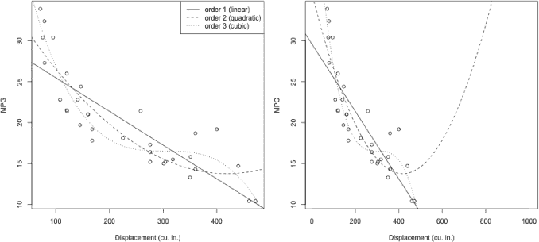

*图 21-4：三种不同的模型，1、2、3 阶多项式，拟合“每单位排量的里程”关系，数据来自*`mtcars`*数据集。左：可视化图表的限制仅限于数据。右：可视化图表的限制大幅扩展，以说明外推的可靠性不足。*

添加与任何多项式模型对应的线条要稍微困难一些，因为`abline`只能处理直线趋势。实现这一点的一种方法是使用`predict`，对代表期望解释变量值的序列中的每个值进行预测。（我更倾向于这种方法，因为它还允许你同时计算置信区间和预测区间，如果你愿意的话。）要仅为 2 阶模型添加线条，首先要在观察到的`disp`范围内创建所需的序列。

```
R> disp.seq <- seq(min(mtcars$disp)-50,max(mtcars$disp)+50,length=30)
```

在这里，序列通过减去和加上 50 来稍微扩大，以预测原始协变量数据范围两侧的少量值，因此曲线会接触到图表的边缘。然后进行预测，并将拟合线叠加上去。

```
R> car.order2.pred <- predict(car.order2,newdata=data.frame(disp=disp.seq))
R> lines(disp.seq,car.order2.pred,lty=2)
```

对于 3 阶多项式，你使用相同的技术，接着最后添加图例。

```
R> car.order3.pred <- predict(car.order3,newdata=data.frame(disp=disp.seq))
R> lines(disp.seq,car.order3.pred,lty=3)
R> legend("topright",lty=1:3,
          legend=c("order 1 (linear)","order 2 (quadratic)","order 3 (cubic)"))
```

所有这些的结果都显示在图 21-4 的左面板上。即使你只使用了来自单一协变量`disp`的原始数据，这里所展示的示例也被认为是多元回归，因为在 2 阶和 3 阶模型中，除了普遍的截距*β*[0]外，还需要估计多个参数。

对于里程和排量数据所拟合的不同类型趋势线，清楚地展示了对关系的不同解释。从视觉上来看，你可以合理地认为，简单线性拟合不足以建模响应变量与预测变量之间的关系，但当选择 2 阶和 3 阶版本时，得出明确结论就更困难。2 阶拟合捕捉到了随着`disp`增加而逐渐变缓的曲线；3 阶拟合则额外考虑了一个凸起（在技术术语中为*鞍点*或*拐点*），随后在相同范围内出现更陡的下降趋势。

那么，哪个模型是“最优”的呢？在这种情况下，参数的统计显著性表明应该优先选择 3 阶模型。话虽如此，在选择不同模型时还有其他因素需要考虑，这些你将在第 22.2 节中更仔细地思考。

##### **多项式的陷阱**

与线性回归模型中的多项式项相关的一个特定缺点是，当尝试执行任何形式的外推时，拟合趋势的不稳定性。图 21-4 右侧的图显示了相同的三个拟合模型（MPG 与排量的关系），但这次排量的尺度要宽得多。如你所见，这些模型的有效性值得怀疑。尽管二阶和三阶模型在观测数据范围内较好地拟合了 MPG，但如果你稍微超出最大观测排量值的阈值，平均油耗的预测就会大幅偏离。尤其是二阶模型变得完全不合理，暗示一旦发动机排量超过 500 立方英寸，MPG 会迅速提高。如果你打算在回归模型中使用高阶项，必须牢记多项式函数的这一自然数学行为。

为了创建这个图，可以使用创建左侧图的相同代码；你只需使用`xlim`来扩大* x *轴的范围，并定义`disp.seq`对象为一个相应更宽的序列（在本例中，我只是在创建`disp.seq`时设置了`xlim=c(10,1000)`，并设置了匹配的`from`和`to`限制）。

**注意**

*像这样的模型仍然被称为* 线性 *回归模型，这可能有点令人困惑，因为高阶多项式拟合的趋势显然是非线性的。这是因为* 线性回归 *指的是定义平均响应的函数在回归参数* **β**[0]、**β**[1]，...，[**β**p] *方面是线性的。因此，对个别变量施加的任何变换都不会影响该函数相对于系数本身的线性性质。*

#### ***21.4.2 对数变换***

在统计建模中，当你有正的数值观测值时，通常会对数据进行对数变换，以大幅度减少数据的总体范围，并将极端观测值拉近到中心度量值。在这个意义上，转变为对数尺度可以帮助减少严重偏斜数据的严重性（见第 15.2.4 节）。在回归建模的背景下，对数变换可以用来捕捉那些表面上“平坦化”的曲线趋势，而不会像某些多项式那样，在观测数据范围之外出现不稳定性。

如果你需要复习对数的相关知识，可以回到第 2.1.2 节；这里只需注意，对数是必须将基数提升到某个幂次才能得到*x*值。例如，3⁵ = 243 时，对数是 5，3 是基数，表示为 log[3] 243 = 5。由于指数函数在常见概率分布中的普遍存在，统计学家几乎专门使用自然对数（以*e*为底的对数）。从这里开始，假设所有提到的对数转换都指的是自然对数。

简要说明对数转换的典型行为，请查看图 21-5，该图通过以下方式实现：

```
R> plot(1:1000,log(1:1000),type="l",xlab="x",ylab="",ylim=c(-8,8))
R> lines(1:1000,-log(1:1000),lty=2)
R> legend("topleft",legend=c("log(x)","-log(x)"),lty=c(1,2))
```

这张图绘制了 1 到 1000 的整数的对数与原始值的关系，并且还绘制了负对数。你可以看到，对数转换后的值随着原始值的增加逐渐趋于平缓。

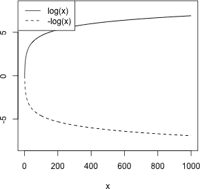

*图 21-5：应用于 1 到 1000 的整数的对数函数*

##### **拟合对数转换**

如前所述，在回归分析中，使用对数转换的一种情况是当完美的直线不适合观察到的关系时，用来处理这种曲线性。为了说明这一点，回到`mtcars`的示例，考虑将里程作为马力和变速器类型（变量`hp`和`am`）的函数。创建一个散点图，显示 MPG 与马力的关系，用不同的颜色区分自动挡车和手动挡车。

```
R> plot(mtcars$hp,mtcars$mpg,pch=19,col=c("black","gray")[factor(mtcars$am)],
        xlab="Horsepower",ylab="MPG")
R> legend("topright",legend=c("auto","man"),col=c("black","gray"),pch=19)
```

图 21-6 中显示的绘制点表明，马力的曲线趋势可能比直线关系更为合适。请注意，你需要明确地将二进制数字型的`mtcars$am`向量强制转换为因子，以便将其用作两种颜色的向量选择器。你将在拟合线性模型后添加这些线。


*图 21-6：根据变速器类型分割的 MPG 与马力的散点图，线条表示使用对数尺度马力效应的多元线性回归的结果*

让我们使用马力的对数转换来尝试捕捉曲线关系。因为在这个例子中，你还想考虑变速器类型可能对响应产生的影响，所以按照惯例，这将作为一个额外的预测变量进行包含。

```
R> car.log <- lm(mpg~log(hp)+am,data=mtcars)
R> summary(car.log)

Call:
lm(formula = mpg ~ log(hp) + am, data = mtcars)

Residuals:
    Min      1Q  Median      3Q     Max
-3.9084 -1.7692 -0.1432  1.4032  6.3865

Coefficients:
            Estimate Std. Error t value Pr(>|t|)
(Intercept)  63.4842     5.2697  12.047 8.24e-13 ***
log(hp)      -9.2383     1.0439  -8.850 9.78e-10 ***
am            4.2025     0.9942   4.227 0.000215 ***
---
Signif. codes:  0 '***' 0.001 '**' 0.01 '*' 0.05 '.' 0.1 ' ' 1

Residual standard error: 2.592 on 29 degrees of freedom
Multiple R-squared:  0.827,        Adjusted R-squared:  0.8151
F-statistic: 69.31 on 2 and 29 DF,  p-value: 8.949e-12
```

输出结果表明，马力对数和变速器类型对里程的影响在统计上显著。保持变速器类型不变时，马力对数每增加一个单位，平均 MPG 将下降大约 9.24。手动变速器使得平均 MPG 增加约 4.2（根据`am`的编码顺序来估计——`0`表示自动挡，`1`表示手动挡；参见`?mtcars`）。决定系数表明，该回归解释了响应变量 82.7%的变异，表明拟合情况令人满意。

##### **绘制对数变换拟合图**

为了可视化拟合模型，你首先需要计算所有所需预测值的拟合值。以下代码创建了一系列马力值（增加和减少 20 马力），并对两种变速器类型执行所需的预测。

```
R> hp.seq <- seq(min(mtcars$hp)-20,max(mtcars$hp)+20,length=30)
R> n <- length(hp.seq)
R> car.log.pred <- predict(car.log,newdata=data.frame(hp=rep(hp.seq,2),
                                                      am=rep(c(0,1),each=n)))
```

在上述代码中，由于你想绘制`am`的两种可能值的预测，当使用`newdata`时，你需要将`hp.seq`重复两次。然后，当你将`am`的值提供给`newdata`时，一组`hp.seq`与适当复制的`am`值 0 配对，另一组与值 1 配对。结果是一个预测向量，其长度是`hp.seq`的两倍，`car.log.pred`，前`n`个元素对应自动挡汽车，后`n`个元素对应手动挡汽车。

现在你可以将这些线添加到图 21-6，如下所示：

```
R> lines(hp.seq,car.log.pred[1:n])
R> lines(hp.seq,car.log.pred[(n+1):(2*n)],col="gray")
```

通过检查散点图，你可以看到拟合模型似乎很好地估计了马力/变速器与 MPG 之间的联合关系。变速器类型在此模型中的统计显著性直接影响两条新增线之间的差异。如果`am`不显著，两条线会更接近；在这种情况下，模型会建议使用一条曲线就足以捕捉这种关系。像往常一样，将预测数据外推得过远并不是一个好主意，尽管对于对数变换趋势来说，它比多项式函数外推要稳定一些。

#### ***21.4.3 其他变换***

变换可以涉及数据集中的多个变量，并且不仅限于预测变量。在他们对`mtcars`数据的原始研究中，Henderson 和 Velleman（1981）也注意到，你在响应变量与如马力和排量等变量之间发现的曲线关系。他们认为，使用每加仑英里数（GPM）作为响应变量，而非每加仑英里数（MPG），更能改善线性关系。这将涉及对 MPG 进行变换，即 GPM = 1/MPG。

作者们还评论了当将汽车重量纳入拟合模型时，马力和排量对每加仑英里数（GPM）的影响有限，因为这三个预测变量之间存在相对较高的相关性（这被称为*多重共线性*）。为了解决这个问题，作者们创建了一个新的预测变量，即马力除以重量。他们用这个变量来衡量汽车的“过度动力”，并用这个新变量代替了单独的马力或排量。这只是他们在寻找适合的建模方法过程中进行的一些实验。

为了实现这个目标，无论你选择以何种方式建模自己的数据，转化数值变量的目标应始终是拟合一个有效的模型，能够更真实、准确地表示数据和变量之间的关系。在追求这个目标时，你在回归方法的应用中如何转化数值观测值有很大的自由度。关于线性回归中转化的进一步讨论，请参考 Faraway（2005）的第七章（Chapter 7），该章节提供了一个有益的介绍。

**练习 21.2**

以下表格展示了伽利略在其著名的“球体”实验中收集的数据，在这些实验中，他将一个球从不同高度的坡道上滚下，并测量球从坡道底部滚出的距离。有关更多信息以及其他有趣的例子，请查阅 Dickey 和 Arnold 的《用具有历史意义的数据教学统计学》（1995）。

| **初始身高** | **距离** |
| --- | --- |
| 1000 | 573 |
| 800 | 534 |
| 600 | 495 |
| 450 | 451 |
| 300 | 395 |
| 200 | 337 |
| 100 | 253 |

1.  在 R 中创建一个数据框架，基于此表格绘制数据点，距离放在*Y*-轴上。

1.  伽利略认为初始身高和行进距离之间存在二次关系。

    1.  以身高为自变量，拟合一个二次多项式，距离作为因变量。

    1.  对这些数据拟合一个三次（3 阶）模型和一个四次（4 阶）模型。它们告诉你关于关系性质的什么信息？

1.  基于你在（b）部分建立的模型，选择你认为最能代表数据的模型，并将拟合线绘制到原始数据上。为图表添加 90%的置信带，表示平均行进距离的置信区间。

`faraway`贡献的 R 包包含大量数据集，配合 Faraway 的线性回归教材（2005）使用。安装该包后，调用`library("faraway")`加载它。该数据包中的一个数据集是`trees`，提供了某一类型被砍伐的树木的尺寸数据（例如，参见 Atkinson, 1985））。

1.  在提示符下访问数据对象并绘制体积与胸围的关系（胸围放在*X*-轴上）。

1.  以`体积`为因变量，拟合两个模型：一个是`胸围`的二次模型，另一个是`体积`和`胸围`的对数变换模型。写出每个模型的方程，并评论两者在决定系数和全局*F*-检验方面的拟合相似性（或差异）。

1.  使用 `predict` 向 (d) 中的图表添加两种模型（来自 (e)）的线条。使用不同的线型；添加相应的图例。还应包括 95% 的预测区间，线型与拟合值的线型一致（注意，对于涉及响应变量和预测变量对数转换的模型，`predict` 返回的值本身会是对数尺度的；你必须使用 `exp` 对这些值进行反向转换，才能将该模型的线条叠加到图表上）。对各自的拟合效果及其估计的预测区间进行评论。

最后，将注意力转回到 `mtcars` 数据框。

1.  拟合并总结一个多元线性回归模型，用于根据马力、重量和排量来预测平均 MPG。

1.  参考 Henderson 和 Velleman（1981）的精神，使用 `I` 重新拟合 (g) 中的模型，以 GPM = 1/MPG 作为目标。哪个模型解释了响应变量中更多的变异？

### **21.5 交互项**

到目前为止，你只看了预测变量如何影响结果变量的联合主效应（以及其一对一的转换）。现在，你将查看协变量之间的交互作用。预测变量之间的*交互效应*是对响应变量的额外变化，这种变化发生在特定的预测变量组合下。换句话说，如果对于给定的协变量配置，预测变量的值使得它们产生的效应会增强这些预测变量本身的独立主效应，那么就存在交互效应。

#### ***21.5.1 概念与动机***

如图 21-7 所示的图表，通常用于帮助解释交互效应的概念。这些图表如通常一样，展示了纵轴上的平均响应值 ŷ，以及横轴上变量 *x[1]* 的预测值。它们还展示了一个二元分类变量 *x*[2]，其值可以是零或一。这些假设变量在图中被标记为这样。

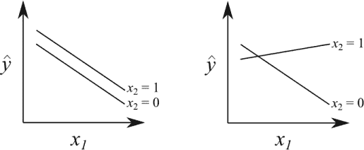

*图 21-7：两个预测变量 x*[1] *和 x*[2]* 之间的交互效应概念，对平均响应值*ŷ*的影响*。左图：仅有 x*[1]* 和 x[2]* 的主效应*影响* ŷ*。右图：需要 x*[1]* 和 x[2]* 的交互效应，除了它们的主效应之外，以便对 ŷ 进行建模。

左图展示了你在本章中迄今为止考虑的模型的限制——即 *x[1]* 和 *x[2]* 独立地影响 ŷ。而右图则清楚地显示，*x[1]* 对 ŷ 的影响完全取决于 *x[2]* 的值。在左图中，仅需 *x[1]* 和 *x[2]* 的主效应来确定 ŷ；而在右图中，除了主效应外，还需要 *x[1]* 和 *x[2]* 之间的交互效应。

**注意**

*在估计回归模型时，您总是需要将交互作用与相关预测变量的主效应一起考虑，这是出于可解释性的原因。由于交互作用本身最好理解为主效应的增强，因此没有意义去删除主效应而保留交互作用。*

一个好的交互作用例子可以参考药理学。药物之间的交互效应是相对常见的，这也是为什么医疗专业人员通常会询问您可能正在服用的其他药物。考虑他汀类药物——一种常用于降低胆固醇的药物。服用他汀类药物的人被告知避免饮用葡萄柚汁，因为葡萄柚汁含有天然化学成分，能够抑制负责药物正确代谢的酶的效能。如果一个人正在服用他汀类药物并且没有饮用葡萄柚汁，您会预期胆固醇水平与他汀使用之间存在负相关关系（无论是将“他汀使用”视为连续变量还是分类剂量变量）——随着他汀使用量的增加或肯定，胆固醇水平下降。另一方面，对于那些正在服用他汀类药物并且*正在*饮用葡萄柚的人，胆固醇水平与他汀使用之间的关系可能完全不同——可能是负相关减弱、无关或甚至正相关。如果是这样，由于他汀对胆固醇的影响会根据另一个变量（是否饮用葡萄柚）的值而发生变化，这就被视为这两个预测变量之间的交互作用。

交互作用可以发生在分类变量、数值变量或两者之间。最常见的是*二元*交互作用——即恰好两个预测变量之间的交互作用，这也是您在第 21.5.2 节到第 21.5.4 节中将重点讨论的内容。三元及更高阶的交互效应在技术上是可能的，但较少见，部分原因是它们在实际应用中较难解释。您将在第 21.5.5 节中考虑这些例子的情况。

#### ***21.5.2 一个分类变量，一个连续变量***

通常，分类变量和连续变量之间的二元交互作用应该被理解为影响连续变量相对于分类变量非参考水平的斜率变化。在连续变量项存在的情况下，具有*k*个水平的分类变量将有*k* − 1 个主效应项，因此将有*k* − 1 个交互项，表示分类变量的所有替代水平与连续变量之间的交互作用。

在图 21-7 的右侧可以清楚地看到*y[1]*按*x[2]*类别变化的不同斜率。在这种情况下，除了*x[1]*和*x[2]*的主效应外，拟合模型中还会有一个交互项对应于*x[2]* = 1。这定义了需要的附加项，用以将*x[2]* = 0 时的*x[1]*斜率转换为*x[2]* = 1 时的新斜率。

作为一个例子，让我们访问一个新的数据集。在练习 21.2 中，你使用了`faraway`包（Faraway, 2005）来访问`trees`数据。在这个包中，你还会找到`diabetes`对象——一个关于 403 名非裔美国人的心血管疾病数据集（最初由 Schorling 等，1997 和 Willems 等，1997 研究并报告）。如果你还没有安装`faraway`，请先安装并使用`library("faraway")`加载它。将注意力集中在总胆固醇水平（`chol`——连续变量）、个体的年龄（`age`——连续变量）和体型类型（`frame`——分类变量，具有*k* = 3 个水平：以`"small"`为参考水平，`"medium"`和`"large"`）。你可以在图 21-8 中查看这些数据，图表将很快生成。

你将研究按年龄和体型建模总胆固醇。预期胆固醇与年龄和体型都有关系似乎是合乎逻辑的，因此考虑到年龄对胆固醇的影响可能因个体的体型不同而异也是有道理的。为了进行调查，我们将拟合多元线性回归，并包括这两个变量之间的双向交互作用。在调用`lm`时，首先指定主效应，像往常一样使用`+`，然后通过在两个预测变量之间使用冒号（`:`）来指定它们之间的交互效应。

```
R> dia.fit <- lm(chol~age+frame+age:frame,data=diabetes)
R> summary(dia.fit)

Call:
lm(formula = chol ~ age + frame + age:frame, data = diabetes)

Residuals:
    Min      1Q  Median      3Q     Max
-131.90  -26.24   -5.33   22.17  226.11

Coefficients:
                Estimate Std. Error t value Pr(>|t|)
(Intercept)     155.9636    12.0697  12.922  < 2e-16 ***
age               0.9852     0.2687   3.667  0.00028 ***
framemedium      28.6051    15.5503   1.840  0.06661 .
framelarge       44.9474    18.9842   2.368  0.01840 *
age:framemedium  -0.3514     0.3370  -1.043  0.29768
age:framelarge   -0.8511     0.3779  -2.252  0.02490 *
---
Signif. codes:  0 '***' 0.001 '**' 0.01 '*' 0.05 '.' 0.1 ' ' 1

Residual standard error: 42.34 on 384 degrees of freedom
  (13 observations deleted due to missingness)
Multiple R-squared:  0.07891,       Adjusted R-squared: 0.06692
F-statistic:  6.58 on 5 and 384 DF, p-value: 6.849e-06
```

检查输出中的估计模型参数时，你可以看到`age`的主效应系数，`frame`两个非参考水平的主效应系数，以及`age`与这两个非参考水平的交互效应的两个额外项。

**注意**

*其实在 R 中有一个快捷方式来做到这一点——交叉因子*符号。之前展示的相同模型可以通过使用`chol~age*frame`在`lm`中拟合；公式中两个变量之间的符号`*`应该解释为“包括截距、所有主效应和交互作用”。我从现在开始会使用这个快捷方式。*

输出结果显示了`age`的显著性，并提供了一些证据支持`frame`的主效应存在。尽管交互作用的显著性较弱，但也有轻微的显著性迹象。在这种情况下，评估显著性时，若其中一个预测变量是类别型并且*k* > 2（即有多个水平），则按照第 20.5.2 节讨论中的规则进行评估——如果至少有一个系数显著，整个效应应被认为是显著的。

拟合模型的通用方程可以直接从输出中写出。

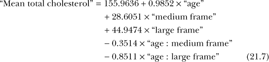

我使用了冒号（:）来表示交互项，以便与 R 输出格式一致。

对于类别型预测变量的参考水平——体型为“小”的情况，可以直接从输出中写出拟合模型。

“平均总胆固醇” = 155.9636 + 0.9852 × “age”

对于只包含主效应的模型，改变体型为“中型”或“大型”只会影响截距——你可以从第 20.5 节了解到，相关效应仅是加到结果中的。然而，交互作用的存在意味着，除了截距的变化，`age`的主效应斜率也必须根据相关的交互项进行调整。对于体型为“中型”的个体，模型为

| “平均总胆固醇” | = | 155.9636 + 0.9852 × “age” + 28.6051 − 0.3514 × “age” |
| --- | --- | --- |
|  | = | 184.5687 + (0.9852 − 0.3514) × “age” |
|  | = | 184.5687 + 0.6338 × “age” |

对于体型为“大”的个体，模型为

| “平均总胆固醇” | = | 155.9636 + 0.9852 × “age” + 44.9474 − 0.8511 × “age” |
| --- | --- | --- |
|  | = | 200.911 + (0.9852 − 0.8511) × “age” |
|  | = | 200.911 + 0.1341 × “age” |

你可以通过访问拟合模型对象的系数，轻松在 R 中计算这些值：

```
R> dia.coef <- coef(dia.fit)
R> dia.coef
    (Intercept)             age     framemedium     framelarge
    155.9635868       0.9852028      28.6051035     44.9474105
age:framemedium  age:framelarge
     -0.3513906      -0.8510549
```

接下来，我们来计算这个向量的相关分量的总和。得到总和后，你就可以绘制拟合模型了。

```
R> dia.small <- c(dia.coef[1],dia.coef[2])
R> dia.small
(Intercept)         age
155.9635868   0.9852028
R> dia.medium <- c(dia.coef[1]+dia.coef[3],dia.coef[2]+dia.coef[5])
R> dia.medium
(Intercept)         age
184.5686904   0.6338122
R> dia.large <- c(dia.coef[1]+dia.coef[4],dia.coef[2]+dia.coef[6])
R> dia.large
(Intercept)         age
200.9109973   0.1341479
```

这三条直线作为长度为 2 的数字向量存储，其中截距在前，斜率在后。这是`abline`的可选`coef`参数所要求的形式，它允许你将这些直线叠加到原始数据的图表上。以下代码生成了图 21-8。

```
R> cols <- c("black","darkgray","lightgray")
R> plot(diabetes$chol~diabetes$age,col=cols[diabetes$frame],
        cex=0.5,xlab="age",ylab="cholesterol")
R> abline(coef=dia.small,lwd=2)
R> abline(coef=dia.medium,lwd=2,col="darkgray")
R> abline(coef=dia.large,lwd=2,col="lightgray")
R> legend("topright",legend=c("small frame","medium frame","large frame"),
          lty=1,lwd=2,col=cols)
```

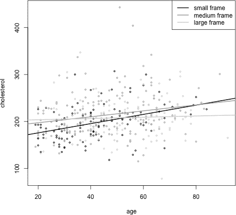

*图 21-8：拟合的线性模型，主效应和年龄与体型对总胆固醇的交互效应*

如果你检查图 21-8 中的拟合模型，可以明显看出，加入年龄和体型的交互作用使得平均总胆固醇与这两个预测变量的关系更加灵活。三条图示的线条呈非平行状态，反映了图 21-7 中展示的概念。

我通过这个过程来说明概念的运作方式，但实际上你不需要经过所有这些步骤来找到点估计（以及任何相关的置信区间）。你可以通过使用`predict`从拟合的线性模型中进行预测，方法与仅含主要效应模型相同。

#### ***21.5.3 两个分类变量***

你在第 19.2 节中的双因素方差分析引言中接触到了两个分类解释变量之间交互作用的概念。在那里，你揭示了羊毛类型和张力对纱线的平均断裂次数之间的交互效应（基于现成的`warpbreaks`数据框）。然后，你通过交互作用图（图 19-2，见第 447 页）将这种交互作用进行了可视化，类似于图 21-7 中的示意图。

让我们以第 19.2.2 节中的最后一个`warpbreaks`例子为基础，以显式的线性回归格式实现相同的模型。

```
R> warp.fit <- lm(breaks~wool*tension,data=warpbreaks)
R> summary(warp.fit)

Call:
lm(formula = breaks ~ wool * tension, data = warpbreaks)

Residuals:
     Min       1Q   Median        3Q       Max
-19.5556  -6.8889  -0.6667    7.1944   25.4444

Coefficients:
               Estimate Std. Error t value Pr(>|t|)
(Intercept)      44.556      3.647  12.218 2.43e-16 ***
woolB           -16.333      5.157  -3.167 0.002677 **
tensionM        -20.556      5.157  -3.986 0.000228 ***
tensionH        -20.000      5.157  -3.878 0.000320 ***
woolB:tensionM   21.111      7.294   2.895 0.005698 **
woolB:tensionH   10.556      7.294   1.447 0.154327
---
Signif. codes:  0 '***' 0.001 '**' 0.01 '*' 0.05 '.' 0.1 ' ' 1

Residual standard error: 10.94 on 48 degrees of freedom
Multiple R-squared:  0.3778,        Adjusted R-squared:  0.3129
F-statistic: 5.828 on 5 and 48 DF,  p-value: 0.0002772
```

在这里，我使用了交叉因子符号`*`，而不是`wool + tension + wool:tension`。当两个预测变量都为分类变量时，每个非参考水平的第一个预测变量与第二个预测变量的所有非参考水平组合，会产生一个交互项。在这个例子中，`wool`是二分类变量，只有*k* = 2 个水平，而`tension`有*k* = 3 个水平；因此，唯一的交互项是“中等”(`M`)和“高”(`H`)张力水平（“低”`L`是参考水平）与羊毛类型`B`（`A`是参考水平）组合。因此，在拟合模型中，总共包含了`B`、`M`、`H`、`B:M`和`B:H`的项。

这些结果与 ANOVA 分析得出的结论一致——确实存在羊毛类型和张力对平均断裂次数的交互效应，此外还有这些预测变量的主要效应。

一般的拟合模型可以理解为

| “平均断裂次数” | = | 44.556 − 16.333 × “羊毛类型 B” |
| --- | --- | --- |
|  |  | − 20.556 × “中等张力” |
|  |  | − 20.000 × “高张力” |
|  |  | + 21.111 × “羊毛类型 B : 中等张力” |
|  |  | + 10.556 × “羊毛类型 B : 高张力” |

额外的交互项与主要效应的作用方式相同——当只涉及分类预测变量时，模型可以看作是对整体截距的加性项。你在任何给定预测中的使用项，取决于特定个体的协变量特征。

让我们快速看几个例子：对于低张力的羊毛 A，预估的经向断裂数是简单地为整体截距；对于高张力的羊毛 A，你有整体截距和高张力的主效应项；对于低张力的羊毛 B，你只有整体截距和羊毛类型 B 的主效应项；而对于中等张力的羊毛 B，你有整体截距、羊毛类型 B 的主效应、中等张力的主效应，*以及*羊毛 B 与中等张力的交互项。

你可以使用`predict`来估算这四种情境下的平均经向断裂数；这些估算结果会伴随 90%的置信区间：

```
R> nd <- data.frame(wool=c("A","A","B","B"),tension=c("L","H","L","M"))
R> predict(warp.fit,newdata=nd,interval="confidence",level=0.9)
       fit      lwr      upr
1 44.55556 38.43912 50.67199
2 24.55556 18.43912 30.67199
3 28.22222 22.10579 34.33866
4 28.77778 22.66134 34.89421
```

#### ***21.5.4 两个连续变量***

最后，你将查看两个预测变量都是连续变量时的情况。在这种情况下，交互项作为修饰符作用于连续平面，这个平面仅使用主效应拟合。类似于连续变量与分类预测变量之间的交互作用，两个连续自变量之间的交互作用允许一个变量的斜率受另一个变量的值影响，而这种修饰是连续的（即根据另一个连续变量的值）。

回到`mtcars`数据框，再次考虑 MPG 作为马力和重量的函数。接下来展示的拟合模型，除了包括两个连续预测变量的主效应外，还包含了交互作用项。正如你所看到的，有一个单独估算的交互项，并且它被认为显著不同于零。

```
R> car.fit <- lm(mpg~hp*wt,data=mtcars)
R> summary(car.fit)

Call:
lm(formula = mpg ~ hp * wt, data = mtcars)

Residuals:
    Min      1Q  Median      3Q     Max
-3.0632 -1.6491 -0.7362  1.4211  4.5513

Coefficients:
            Estimate Std. Error t value Pr(>|t|)
(Intercept) 49.80842    3.60516  13.816 5.01e-14 ***
hp          -0.12010    0.02470  -4.863 4.04e-05 ***
wt          -8.21662    1.26971  -6.471 5.20e-07 ***
hp:wt        0.02785    0.00742   3.753 0.000811 ***
---
Signif. codes:  0 '***' 0.001 '**' 0.01 '*' 0.05 '.' 0.1 ' ' 1

Residual standard error: 2.153 on 28 degrees of freedom
Multiple R-squared:  0.8848,        Adjusted R-squared:  0.8724
F-statistic: 71.66 on 3 and 28 DF,  p-value: 2.981e-13
```

该模型写作如下：

| “平均 MPG” | = | 49.80842 − 0.12010 × “马力” |
| --- | --- | --- |
|  |  | − 8.21662 × “重量” |
|  |  | + 0.02785 × “马力 : 重量” |
|  | = | 49.80842 − 0.12010 × “马力” |
|  |  | − 8.21662 × “重量” |
|  |  | + 0.02785 × “马力” × “重量” |

这里提供的第二版本模型方程首次揭示了交互作用，该交互作用表示为两个预测变量值的*乘积*，这正是拟合模型用来预测响应的方式。（从技术上讲，这与至少一个预测变量是分类变量的情况相同——但是虚拟编码只会为相应项生成零和一，因此乘法实际上只是表示某一项的存在或缺失，正如你所看到的那样。）

你可以通过考虑系数的符号（+或−）来解释两个连续预测变量之间的交互作用。负值表明，随着预测变量值的增加，响应结果在计算了主效应后的数值会减少。正值，正如这里的情况，表明随着预测变量值的增加，效果会进一步增加，对平均响应产生放大作用。

从上下文来看，`hp`和`wt`的负主效应表明，重量更大、动力更强的汽车通常会降低燃油经济性。然而，交互效应的正向性表明，随着马力或重量的增加，这种对响应的影响会“减弱”。换句话说，主效应所带来的负相关关系，在预测变量值越来越大的时候，会变得“不那么极端”。

图 21-9 对比了仅包含主效应的模型版本（通过`lm`使用公式`mpg~hp+wt`获得；在本节中未显式拟合）与上述交互作用模型版本，后者作为对象`car.fit`进行了拟合。

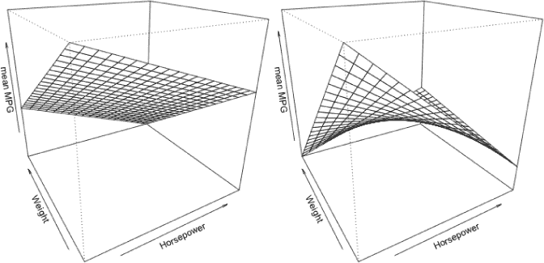

*图 21-9：按马力和重量绘制的平均 MPG 响应曲面，左侧为仅含主效应的模型，右侧为包含连续预测变量之间双向交互作用的模型*

绘制的*响应曲面*显示了垂直的*z*轴上的平均 MPG，以及标记的两个预测变量的水平轴。你可以根据给定的马力和重量值，将预测的平均 MPG 解释为曲面上的一个点。请注意，随着你沿各自的水平轴增加任一预测变量的值，两个曲面上的 MPG（沿*z*轴垂直方向）都呈下降趋势。

我将在第二十五章中展示这些图是如何创建的。目前，它们仅用于突出在`car.fit`中交互作用的“减弱”影响。左侧的仅主效应模型显示了一个根据每个预测变量的负线性斜率递减的平面。然而，在右侧，正交互作用项的存在使得这个平面变得平坦，这意味着随着预测变量值的增加，下降的速率变得更慢。

#### ***21.5.5 高阶交互作用***

如前所述，双向交互作用是回归方法应用中最常见的交互作用类型。这是因为对于三向或更高阶的交互项，你需要更多的数据来可靠地估计交互效应，并且有许多解释上的复杂性需要克服。三向交互作用比双向效应更为罕见，而四向及以上的交互作用则更为稀有。

在练习 21.1 中，你使用了`boot`包中的`nuclear`数据集（该包随标准 R 安装一起提供），该数据集包括美国核电站建设的数据。在这些练习中，你主要关注与建设许可证相关的日期和时间预测变量，以建模核电站的平均建设成本。为了简化这个例子，假设你没有这些预测变量的数据。仅使用描述电站本身特征的变量，能否充分地建模建设成本？

加载`boot`包并访问`?nuclear`帮助页面，了解变量的详细信息：`cap`（描述工厂容量的连续变量）；`cum.n`（作为连续变量，描述工程师之前参与过的类似建筑数量）；`ne`（二元变量，描述工厂是否位于美国东北部）；`ct`（二元变量，描述工厂是否拥有冷却塔）。

以下模型以工厂的最终建设成本作为响应变量；容量的主效应；以及`cum.n`、`ne`和`ct`之间的主效应、所有二阶交互效应和三阶交互效应：

```
R> nuc.fit <- lm(cost~cap+cum.n*ne*ct,data=nuclear)
R> summary(nuc.fit)

Call:
lm(formula = cost ~ cap + cum.n * ne * ct, data = nuclear)

Residuals:
     Min       1Q   Median       3Q      Max
-162.475  -50.368   -8.833   43.370  213.131

Coefficients:
             Estimate Std. Error t value Pr(>|t|)
(Intercept)  138.0336    99.9599   1.381 0.180585
cap           0.5085      0.1127   4.513 0.000157 ***
cum.n       -24.2433      6.7874  -3.572 0.001618 **
ne         -260.1036    164.7650  -1.579 0.128076
ct         -187.4904     76.6316  -2.447 0.022480 *
cum.n:ne     44.0196     12.2880   3.582 0.001577 **
cum.n:ct     35.1687      8.0660   4.360 0.000229 ***
ne:ct       524.1194    200.9567   2.608 0.015721 *
cum.n:ne:ct -64.4444     18.0213  -3.576 0.001601 **
---
Signif. codes:  0 '***' 0.001 '**' 0.01 '*' 0.05 '.' 0.1 ' ' 1

Residual standard error: 107.3 on 23 degrees of freedom
Multiple R-squared:  0.705,        Adjusted R-squared:  0.6024
F-statistic: 6.872 on 8 and 23 DF,  p-value: 0.0001264
```

在这段代码中，你通过增加与`*`连接的变量数量来指定高阶交互作用（使用`*`而不是`:`，因为你希望包括这三个预测变量的所有低阶效应）。

在估计结果中，`cap`的主效应为正，表明电力容量的增加与建设成本的增加相关。所有其他主效应为负，表面上看似表明减少的建设成本与更有经验的工程师、东北地区建造的工厂以及拥有冷却塔的工厂相关。然而，这并不是准确的陈述，因为你还没有考虑到这些预测变量的交互项。所有估计的二阶交互效应为正——无论是否有冷却塔，更多经验的工程师意味着东北地区的建设成本更高，而更多经验的工程师也意味着对于拥有冷却塔的工厂，成本更高，无论所在地区。

对于东北地区的工厂，拥有冷却塔的工厂成本也大幅增加，无论工程师的经验如何。尽管如此，负三阶交互作用表明，在计算了主效应和二阶交互效应后，具有更多经验的工程师在东北地区工作并且工厂有冷却塔时，增加的成本有所减少。

至少，这个例子突显了理解高阶交互作用的模型系数所涉及的复杂性。也有可能是由于未考虑的潜在变量，导致统计显著的高阶交互作用的出现。也就是说，显著的交互作用可能只是数据中模式的虚假表现，而这些模式可以通过包含这些遗漏预测变量的更简单的项来解释得更好（如果不是更好）。部分原因上，这促使了对适当的*模型选择*的重视，这是接下来讨论的重点。

**练习 21.3**

将注意力转回到`MASS`包中的`cats`数据框。在练习 21.1 的前几个问题中，你拟合了仅包含主效应的模型，用以根据体重和性别预测家猫的心脏重量。

1.  再次拟合该模型，这一次包括两个预测变量之间的交互作用。检查模型摘要。与之前仅含主效应的版本相比，参数估计值和它们的显著性有何不同？

1.  绘制心脏重量与体重的散点图，使用不同的点字符或颜色根据性别区分观察值。使用`abline`添加两条线表示拟合模型。这个图与练习 21.1 (d)中的图有何不同？

1.  使用新模型预测 Tilman 猫的心脏重量（记住 Sigma 是一个 3.4 公斤的雌性猫），并提供 95%的预测区间。将其与之前练习中的仅主效应模型进行比较。

在练习 21.2 中，你访问了`trees`数据框，这是贡献的`faraway`包中的一部分。加载包后，访问`?trees`帮助文件；你将看到之前使用过的体积和树干周长的测量值，以及每棵树的高度数据。

1.  在不对数据进行任何转换的情况下，拟合并检查一个仅包含主效应的模型，用于预测体积与树干周长和高度之间的关系。然后，拟合并检查包含交互作用的第二个版本的模型。

1.  重复(d)，但这次使用所有变量的对数变换。与未变换模型相比，变换后的模型中交互作用的显著性有何变化？这对数据中的关系有什么启示？

回到`mtcars`数据集，查看`?mtcars`帮助文件以回顾其中的变量。

1.  基于`hp`和`factor(cyl)`之间的双向交互作用及其主要效应，以及`wt`的主要效应，为`mpg`拟合一个线性模型。生成拟合的摘要。

1.  解释马力与（分类的）气缸数之间交互作用的估计系数。

1.  假设你有意购买一辆 1970 年代的性能车。你的妈妈建议你购买一辆“实用且经济”的车，要求平均 MPG 值至少为 25。你看到三辆车的广告：车 1 是一辆四缸、100 马力的车，重 2100 磅；车 2 是一辆八缸、210 马力的车，重 3900 磅；车 3 是一辆六缸、200 马力的车，重 2900 磅。

    1.  使用你的模型预测三辆车的平均 MPG；提供 95%的置信区间。仅根据点估计，你会建议哪辆车给你妈妈？

    1.  你仍然想要一辆最省油的车，且希望得到妈妈的批准，所以你决定偷偷地根据置信区间告诉你的信息来做决定。这样会改变你选择的车辆吗？

##### **本章重要代码**

| **函数/运算符** | **简要描述** | **首次出现** |
| --- | --- | --- |
| `I` | 包含算术项 | 第 21.4.1 节，第 505 页 |
| `:` | 交互项 | 第 21.5.2 节，第 516 页 |
| `*` | 交叉因子算符 | 第 21.5.3 节，第 519 页 |
