## 第二十二章：22

**线性模型选择与诊断**


你现在已经花费了相当多的时间研究线性回归模型的许多方面。在这一章中，我将介绍如何使用正式的 R 工具和技术来研究回归的另两个方面，这两个方面同样重要：为你的分析选择合适的模型，并评估你所做假设的有效性。

### 22.1 拟合优度与复杂度

拟合任何统计模型的总体目标是忠实地表示数据及其内部关系。一般而言，拟合统计模型归结为在两者之间取得平衡：拟合优度和复杂度。*拟合优度*指的是获得一个最能表示响应变量与预测变量（或多个预测变量）之间关系的模型的目标。*复杂度*描述了一个模型的复杂程度；它始终与模型中需要估计的项数相关——更多的预测变量和附加函数（如多项式变换和交互项）的加入会使模型更复杂。

#### *22.1.1 简约原则*

统计学家将拟合优度和复杂度之间的平衡称为*简约原则*，其相关的*模型选择*目标是找到一个尽可能简单的模型（换句话说，具有相对较低的复杂度），同时又不牺牲太多的拟合优度。我们可以说，满足这一概念的模型是*简约的*拟合。你常常会听到研究人员谈论选择“最佳”模型——他们实际上是在指简约原则的概念。

那么，你如何决定在这种平衡上划定界限呢？自然，统计显著性在其中发挥着作用——而模型选择通常归结为评估预测变量或预测变量函数对响应的影响是否显著。为了使这一过程尽可能客观，你可以使用系统化的选择算法，例如在第 22.2 节中学习到的算法，来决定多个解释变量及其相关函数之间的选择。

#### *22.1.2 一般指南*

执行任何类型的模型选择或将多个模型进行比较，都涉及到关于是否包含可用预测变量的决策。在这个话题上，有几个指南是你应当始终遵循的。

• 首先，重要的是要记住，你不能在给定的模型中删除分类预测变量的单独水平；这样做是没有意义的。换句话说，如果某个非参考水平具有统计显著性，而其他所有水平都不显著，那么你应该将该分类变量整体视为对平均响应的统计显著贡献。只有在所有非参考系数都与缺乏证据（反对为零）相关时，你才应考虑*完全*删除该分类预测变量。这同样适用于涉及分类预测变量的交互项。

• 如果拟合的模型中存在交互效应，则所有相关预测变量的低阶交互项和主效应必须保留在模型中。这一点在第 21.5.1 节中有所提及，当时我讨论了交互效应作为低阶效应的扩展。例如，只有在拟合的模型中没有涉及该预测变量的交互项时，才应考虑删除该预测变量的主效应（即使该主效应的*p*-值很高）。

• 在使用某一解释变量的多项式变换的模型中（参考第 21.4.1 节），如果最高次幂被认为是显著的，则应保留模型中的所有低阶多项式项。例如，包含三次多项式变换的预测变量模型，必须同时包含该变量的一级和二级变换。这是由于多项式函数的数学特性——只有通过明确地将线性、二次和三次（以此类推）效应作为独立项分开，才能避免将这些效应相互混淆。

### 22.2 模型选择算法

模型选择算法的任务是以某种系统的方式筛选你可用的解释变量，以确定哪些变量能最好地联合描述响应，而不是像之前那样仅通过单独考察预测变量的特定组合来拟合模型。

模型选择算法可能存在争议。它有几种不同的方法，没有一种方法对于每个回归模型都是普遍适用的。不同的选择算法可能会得出不同的最终模型，正如你将看到的那样。在许多情况下，研究人员会有关于问题的额外信息或知识，这会影响决策——例如，某些预测变量必须始终包括，或者它们的包括根本没有意义。必须同时考虑这些因素，以及其他复杂情况，例如交互效应或未观察到的潜在变量对显著关系的影响，以及确保任何拟合模型在统计上是有效的（这一点你将在第 22.3 节中看到）。

记住统计学家乔治·博克斯（George Box，1919–2013）的一句名言很有帮助：“所有模型都是错误的，但有些模型是有用的。”

任何你拟合的模型都不能被假设为真，但一个经过仔细检查的拟合模型可以揭示数据的有趣特征，从而有可能通过提供这些特征的定量估计，揭示关联性和关系。

#### *22.2.1 嵌套比较：部分 F 检验*

部分*F*检验可能是比较多个不同模型的最直接方式。它考察两个或多个*嵌套*模型，其中较小、较简单的模型是较大、较复杂模型的简化版本。正式地说，假设你拟合了两个线性回归模型，如下所示：

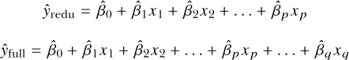

在这里，简化模型*ŷ*[redu]有*p*个预测变量，加上一个截距项。完整模型*ŷ*[full]有*q*个预测变量项。这个符号表示*q* > *p*，并且，除了标准的截距项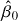外，完整模型包括了简化模型*ŷ*[redu]的所有*p*个预测变量，以及*q* − *p*个额外项。这强调了模型*ŷ[redu]*是嵌套在*ŷ*[full]*中的事实。

需要注意的是，增加回归模型中的预测变量数量总是会提高*R*²以及其他拟合优度的衡量标准。然而，真正的问题是，拟合优度的改善是否足够大，以至于包括任何额外的预测变量项所增加的复杂性“是值得的”。正是这个问题，部分*F*检验试图在嵌套回归模型的背景下回答。它的目的是测试是否包括那些额外的*q* − *p*项（这些项构成完整模型而不是简化模型）能显著改善拟合优度。部分*F*检验所解决的假设如下：

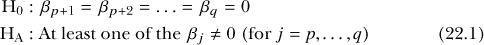

计算测试统计量以检验这些假设的过程遵循与 R 在总结拟合的线性模型对象时自动生成的总体*F*检验背后的相同思想（详见第 21.3.5 节）。将简化模型和完整模型的决定系数分别表示为 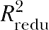 和 。如果*n*表示用来拟合这两个模型的数据样本大小，那么测试统计量为：

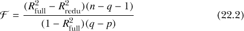

在假设(22.1)中的 H[0]下，遵循*F*分布，df[1] = *q* − *p*，df[2] = *n* − *q*自由度。*p*-值通过通常的方式，从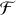的上尾区域得出；它越小，越能反驳原假设，即认为一个或多个额外的参数对响应变量没有影响。

以第 21.3.1 节中的模型对象`survmult`和`survmult2`为例。`survmult`模型旨在基于`MASS`包中的`survey`数据框，通过写手跨和性别来预测学生的平均身高；`survmult2`则在这些预测变量中加入了吸烟状态。如果需要，可以回到第 21.3.1 节重新拟合这两个模型。将这些对象打印到控制台，可以预览这两个拟合结果，并且容易确认较小的模型确实嵌套在较大的模型中，其解释变量是相同的：

```
R> survmult

Call:
lm(formula = Height ~ Wr.Hnd + Sex,
            data =
            survey)

Coefficients:
(Intercept)       Wr.Hnd      SexMale
    137.687        1.594        9.490

R>
                survmult2

Call:
lm(formula = Height ~ Wr.Hnd + Sex + Smoke, data =
            survey)

Coefficients:
(Intercept)       Wr.Hnd      SexMale   SmokeNever   SmokeOccas   SmokeRegul
   137.4056       1.6042       9.3979      -0.0442       1.5267       0.9211
```

一旦你拟合了嵌套模型，R 可以使用`anova`函数进行部分 *F* 检验（部分 *F* 检验属于方差分析方法的一部分）。要判断将`Smoke`作为预测变量是否能显著改善拟合效果，只需从简化模型开始，并将模型对象作为参数传入。

```
R> anova(survmult,survmult2)
Analysis of Variance
            Table

Model 1: Height ~ Wr.Hnd + Sex
Model 2: Height ~ Wr.Hnd + Sex +
            Smoke
  Res.Df    RSS Df Sum of
            Sq      F Pr(>F)
1    204
            9959.2
2    201
            9914.3  3    44.876 0.3033  0.823
```

输出提供了与计算 和 以及检验统计量 （来自式（22.2））相关的量，这些内容在结果表中以`F`的形式给出，是最受关注的。通过打印`survmult`和`survmult2`时得到的*p*和*q*值，你应该能够确认，例如，表格第二行中`Df`和`Res.Df`列中出现的 df[1]和 df[2]的值。

这个特定测试的结果，来自与 df[1] = 3 和 df[2] = 201 相关的检验统计量 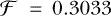，得到一个较高的*p*-值 0.823，表明没有反对 H[0] 的证据。这意味着，将`Smoke`加入到包含解释变量`Wr.Hnd`和`Sex`的简化模型中，在建模学生身高时并没有显著改善拟合效果。这个结论并不令人惊讶，因为之前在第 21.3.1 节中看到，所有非参考水平的`Smoke`都没有显著的*p*-值。

这就是部分 *F* 检验在模型选择中的应用——在当前示例中，简化模型将是更简洁的拟合模型，并且更倾向于选择它而非完整模型。

你可以在一次`anova`调用中比较多个嵌套模型，这对于调查例如是否包含交互项或包含预测变量的多项式变换等情况非常有用，因为自然的层次结构要求你保留任何较低阶的项。

例如，我们可以使用`faraway`包中的`diabetes`数据框，来自第 21.5.2 节，该模型拟合用于预测胆固醇水平（`chol`）与年龄（`age`）和体型（`frame`）之间的关系，以及这两个预测变量的交互作用。在使用部分*F*检验比较嵌套模型之前，你需要确保每个模型使用的是相同的记录，并且在所有预测变量中没有缺失值，这样才能确保所有“更全面”的模型使用相同的样本量进行比较。为此，你只需要首先定义一个版本的`diabetes`，该版本删除了在你使用的预测变量中包含缺失值的记录。

加载`faraway`包，并使用逻辑子集选择方法，找出并删除`age`*或*`frame`中存在缺失值的个体。定义这个新的`diabetes`对象版本：

```
R> diab <- diabetes[-which(is.na(diabetes$age) |
            is.na(diabetes$frame)),]
```

现在，使用新的`diab`对象拟合以下四个模型：

```
R> dia.model1 <- lm(chol~1,data=diab)
R> dia.model2 <-
            lm(chol~age,data=diab)
R> dia.model3 <-
            lm(chol~age+frame,data=diab)
R> dia.model4 <-
            lm(chol~age*frame,data=diab)
```

第一个模型仅包含截距，第二个模型加入了`age`作为预测变量，第三个模型包含了`age`和`frame`，第四个模型则包括了交互项。可以看到模型之间存在嵌套关系，随着每一步模型复杂度的增加，你可以比较拟合优度改善的显著性。

```
R> anova(dia.model1,dia.model2,dia.model3,dia.model4)
Analysis
            of Variance Table

Model 1: chol ~ 1
Model 2: chol ~ age
Model 3:
            chol ~ age + frame
Model 4: chol ~ age *
            frame
  Res.Df    RSS Df Sum of
            Sq       F    Pr(>F)
1    389
            747265
2    388
            712078  1     35187 19.6306 1.227e-05
            ***
3    386
            697527  2     14551  4.0589   0.01801
            *
4    384
            688295  2      9233  2.5755   0.07743
            .
---
Signif. codes:  0 '***' 0.001 '**' 0.01 '*' 0.05 '.' 0.1 ' '
            1
```

如果你没有删除那些包含缺失值的记录，你会收到一个错误提示，告诉你四个模型的数据集大小不一致。

结果本身表明，包含`age`显著改善了`chol`的建模；包含`frame`的主效应进一步带来了轻微的改善；而包括交互效应对拟合优度的提升几乎没有证据，甚至可以说没有任何证据。从这些结果来看，你可能更倾向于使用`dia.mod3`，即仅包含主效应的模型，作为这四个模型中最简洁的均值胆固醇表现方式。

#### *22.2.2 前向选择*

部分*F*检验是检查嵌套模型的自然方式，但如果你有许多不同的模型需要拟合，尤其是当有许多预测变量时，管理起来可能会很困难。

这就是*前向选择*（也称为*前向消除*）的应用场景。其思路是从一个仅包含截距的模型开始，然后通过一系列独立的检验，确定哪些预测变量显著改善了拟合优度。接着，你会通过加入这些变量来更新模型对象，并对剩余的变量执行一系列检验，以确定哪些变量会进一步改善拟合。这个过程会一直重复，直到没有任何变量在统计学上显著提高拟合优度为止。R 语言中的`add1`和`update`函数可以执行这些检验并更新你拟合的回归模型。

你将使用`boot`库中的`nuclear`数据框作为示例，来自第 21.1 节的第 499 页和第 21.5.5 节。目标是选择最具信息量的模型来预测建筑成本。加载`boot`库并访问帮助文件`?nuclear`，以提醒自己变量定义。首先，仅用一个总截距项拟合建筑成本模型。

```
R> nuc.0 <- lm(cost~1,data=nuclear)
R>
            summary(nuc.0)

Call:
lm(formula = cost ~ 1, data =
            nuclear)

Residuals:
    Min      1Q  Median      3Q    Max
-254.05
            -151.24  -13.46  150.40
            419.68

Coefficients:
            Estimate
            Std. Error t value
            Pr(>|t|)
(Intercept)   461.56      30.07   15.35
            4.95e-16 ***
---
Signif. codes:  0 '***' 0.001 '**' 0.01 '*' 0.05
            '.' 0.1 ' ' 1

Residual standard error: 170.1 on 31 degrees of freedom
```

你从之前的实验中知道，这个特定的模型对于`cost`的可靠预测相当不足。所以，考虑以下代码行来开始前向选择（我已经抑制了输出，稍后会单独展示并讨论）：

```
R>
            add1(nuc.0,scope=.~.+date+t1+t2+cap+pr+ne+ct+bw+cum.n+pt,test="F")
```

`add1`的第一个参数总是你要更新的模型。第二个参数`scope`非常重要——你必须提供一个公式对象，定义你考虑拟合的“最完整”模型。通常你会使用`.~.`符号，点号表示第一个参数中模型的定义。具体来说，点号代表“已经存在的部分”。换句话说，通过`scope`，你告诉`add1`，你考虑的最完整模型是以`cost`作为响应变量，包含一个截距项，以及`nuclear`数据框中所有其他预测变量的主效应（为了演示方便，我将完整模型限制为仅包含主效应）。你无需提供数据框作为参数，因为数据已经包含在第一个参数中的模型对象里。最后，你需要告诉`add1`要执行的测试。这里有一些可用的变体（参见`?add1`），但在此你将坚持使用`test="F"`进行部分*F*检验。

现在，关注`add1`执行后直接提供的输出。

```
Single term additions

Model:
cost ~
            1
       Df Sum of
            Sq   RSS    AIC F
            value    Pr(>F)
<none>             897172
            329.72
date    1    334335 562837 316.80
            17.8205 0.0002071
            ***
t1      1    186984 710189
            324.24  7.8986 0.0086296
            **
t2      1        27
            897145 331.72  0.0009
            0.9760597
cap     1    199673 697499
            323.66  8.5881 0.0064137
            **
pr      1      9037
            888136 331.40  0.3052
            0.5847053
ne      1    128641
            768531 326.77  5.0216 0.0325885
            *
ct      1     43042 854130
            330.15  1.5118
            0.2284221
bw      1     16205
            880967 331.14  0.5519
            0.4633402
cum.n   1     67938 829234
            329.20  2.4579
            0.1274266
pt      1    305334
            591839 318.41 15.4772 0.0004575 ***
---
Signif. codes:  0 '***'
            0.001 '**' 0.01 '*' 0.05 '.' 0.1 ' ' 1
```

输出包含一系列行，从`<none>`开始（表示对当前模型没有任何修改）。你会得到`Sum of Sq`和`RSS`值，这些值与计算测试统计量直接相关。自由度的差异也会被报告。另一个简洁性的度量`AIC`也会提供（你将在第 22.2.4 节中详细查看）。

最相关的是测试结果；使用`test="F"`时，每一行对应一个独立的部分*F*检验，比较第一个参数中的模型（*ŷ*[redu]）与仅添加该行项后的模型（*ŷ*[full]）。因此，通常你会通过仅添加具有最大（和“最显著”）改进的项来更新模型。

在这里，你应该能看到将`date`作为预测变量添加对建模`cost`提供了最大的显著改进。所以，接下来我们更新`nuc.0`，在代码中加入该项。

```
R> nuc.1 <- update(nuc.0,formula=.~.+date)
R>
                summary(nuc.1)

Call:
lm(formula = cost ~ date, data =
            nuclear)

Residuals:
    Min      1Q  Median      3Q     Max
-176.00
            -105.27  -25.24   58.63  359.46

Coefficients:
            Estimate
            Std. Error t value Pr(>|t|)
(Intercept)
            -6553.57    1661.96  -3.943 0.000446
            ***
date          102.29      24.23   4.221
            0.000207 ***
---
Signif. codes:  0 '***' 0.001 '**' 0.01 '*' 0.05
            '.' 0.1 ' ' 1

Residual standard error: 137 on 30 degrees of
            freedom
Multiple
            R-squared:  0.3727,        Adjusted
            R-squared:  0.3517
F-statistic: 17.82 on 1 and 30 DF,  p-value:
            0.0002071
```

在`update`中，你将想要更新的模型作为第一个参数，第二个参数`formula`告诉`update`如何更新该模型。再次使用`.~.`符号，指示通过将`date`添加为预测因子来更新`nuc.0`，从而生成一个与第一个参数同类的拟合模型对象。对新模型`nuc.1`调用`summary`以查看结果。

所以，我们继续吧！再次调用`add1`，但这次将`nuc.1`作为第一个参数。

```
R>
            add1(nuc.1,scope=.~.+date+t1+t2+cap+pr+ne+ct+bw+cum.n+pt,test="F")
Single term
            additions

Model:
cost ~
            date
       Df Sum of
            Sq    RSS    AIC F
            value    Pr(>F)
<none>              562837
            316.80
t1      1     15322
            547515 317.92  0.8115
            0.3750843
t2      1     68161
            494676 314.67  3.9959 0.0550606
            .
cap     1    189732 373105 305.64
            14.7471 0.0006163
            ***
pr      1      4027
            558810 318.57  0.2090
            0.6509638
ne      1     92256
            470581 313.07  5.6854 0.0238671
            *
ct      1     54794 508043
            315.52  3.1277 0.0874906
            .
bw      1      1240
            561597 318.73  0.0640
            0.8020147
cum.n   1      4658 558179
            318.53  0.2420
            0.6264574
pt      1     90587
            472250 313.18  5.5628 0.0252997 *
---
Signif. codes:  0
            '***' 0.001 '**' 0.01 '*' 0.05 '.' 0.1 ' ' 1
```

注意，现在没有为`date`添加行；它已经在`nuc.1`中。似乎下一个最有信息量的添加项是`cap`。将`nuc.1`更新为此。

```
R> nuc.2 <- update(nuc.1,formula=.~.+cap)
```

现在继续进行，测试并更新。通过对`nuc.2`调用`add1`（此处未显示输出），你会发现下一个最显著的添加项是`pt`（仅略微更为显著）。更新为一个新对象`nuc.3`，它包含以下项：

```
R> nuc.3 <- update(nuc.2,formula=.~.+pt)
```

然后再次测试，使用`add1`对`nuc.3`进行测试。你会发现有弱证据表明可以额外加入`ne`的主效应，因此更新并包含它，生成`nuc.4`。

```
R> nuc.4 <- update(nuc.3,formula=.~.+ne)
```

在这一点上，你可以相当确定不会有更多有用的添加项，但还是通过对最新拟合模型进行最后一次`add1`调用来彻底检查。

```
R>
            add1(nuc.4,scope=.~.+date+t1+t2+cap+pr+ne+ct+bw+cum.n+pt,test="F")
Single term
            additions

Model:
cost ~ date + cap + pt +
            ne
       Df Sum of
            Sq    RSS AIC F value
            Pr(>F)
<none>              222617
            293.12
t1      1     107.0
            222510 295.10  0.0125
            0.9118
t2      1   19229.9 203387
            292.23  2.4583
            0.1290
pr      1    5230.8 217386
            294.36  0.6256
            0.4361
ct      1   15764.7 206852
            292.77  1.9815
            0.1711
bw      1     448.0
            222169 295.06  0.0524
            0.8207
cum.n   1   13819.9 208797
            293.07  1.7209 0.2010
```

确实看来，如果将其纳入模型，剩余的协变量都不会显著提高拟合优度，因此你的最终模型将保持为`nuc.4`。

```
R> summary(nuc.4)

Call:
lm(formula = cost ~ date +
            cap + pt + ne, data =
                nuclear)

Residuals:
     Min       1Q   Median       3Q      Max
-157.894  -38.424   -2.493   35.363   267.445

Coefficients:
              Estimate
            Std. Error t value Pr(>|t|)
(Intercept)
            -4.756e+03  1.286e+03  -3.699 0.000975
            ***
date         7.102e+01  1.867e+01   3.804
            0.000741
            ***
cap          4.198e-01  8.616e-02   4.873
            4.29e-05
            ***
pt          -1.289e+02  4.950e+01  -2.605
            0.014761
            *
ne           9.940e+01  3.864e+01   2.573
            0.015908 *
---
Signif. codes:  0 '***' 0.001 '**' 0.01 '*' 0.05 '.'
            0.1 ' ' 1

Residual standard error: 90.8 on 27 degrees of
            freedom
Multiple R-squared:
            0.7519,         Adjusted R-squared:
            0.7151
F-statistic: 20.45 on 4 and 27 DF,  p-value: 7.507e-08
```

这种方法可能看起来有点繁琐，有时很难决定用哪个最完整的模型作为`scope`，但它是一个非常好的方式，让你在每个选择阶段都能保持参与，从而仔细考虑每个添加项。然而，请注意，存在一定的主观性；通过选择一个项而非另一个，可能会得出不同的最终模型，比如你可能会添加`pt`而不是`date`（它们在第一次调用`add1`时具有相似的显著性水平）。

#### *22.2.3 后向选择*

学习了前向选择后，理解*后向选择*（或*淘汰法*）并不难。如你所猜测的那样，前向选择是从一个简化的模型开始，通过添加项逐步构建最终模型，而后向选择则从最完整的模型开始，系统地去除项。这个过程的 R 函数是`drop1`，用于检查部分*F*检验，以及`update`。

前向选择与后向选择的选择通常是根据具体情况决定的。如果最完整的模型未知或难以定义和拟合，则通常倾向于使用前向选择。另一方面，如果你有一个自然且容易拟合的最完整模型，那么后向选择可能更方便实现。有时，研究人员会同时进行两者，以查看他们最终得到的模型是否有所不同（这是完全可能的情况）。

再次回顾`nuclear`示例。首先，定义最完整的模型，即通过所有可用协变量的主效应来预测`cost`（就像你在前向选择中使用`scope`时所做的那样）。

```
R> nuc.0 <-
            lm(cost~date+t1+t2+cap+pr+ne+ct+bw+cum.n+pt,data=nuclear)
R>
            summary(nuc.0)

Call:
lm(formula = cost ~ date + t1 + t2 + cap + pr + ne
            + ct + bw +
    cum.n + pt, data =
            nuclear)

Residuals:
     Min       1Q   Median       3Q       Max
-128.608  -46.736   -2.668   39.782   180.365

Coefficients:
              Estimate
            Std. Error t value Pr(>|t|)
(Intercept)
            -8.135e+03  2.788e+03  -2.918 0.008222
            **
date         1.155e+02  4.226e+01   2.733
            0.012470
            *
t1           5.928e+00  1.089e+01   0.545
            0.591803
t2           4.571e+00  2.243e+00   2.038
            0.054390
            .
cap          4.217e-01  8.844e-02   4.768
            0.000104
            ***
pr          -8.112e+01  4.077e+01  -1.990
            0.059794
            .
ne           1.375e+02  3.869e+01   3.553
            0.001883
            **
ct           4.327e+01  3.431e+01   1.261
            0.221008
bw          -8.238e+00  5.188e+01  -0.159
            0.875354
cum.n       -6.989e+00  3.822e+00  -1.829
            0.081698
            .
pt          -1.925e+01  6.367e+01  -0.302
            0.765401
---
Signif. codes:  0 '***' 0.001 '**' 0.01 '*' 0.05 '.'
            0.1 ' ' 1

Residual standard error: 82.83 on 21 degrees of
            freedom
Multiple R-squared:
            0.8394,         Adjusted R-squared:
            0.763
F-statistic: 10.98 on 10 and 21 DF,  p-value: 2.844e-06
```

显然，有几个预测变量似乎对响应变量没有显著贡献，这些相同的结果在你第一次使用`drop1`检查每个变量删除后对拟合优度的影响时也很明显。

```
R> drop1(nuc.0,test="F")
Single term
            deletions

Model:
cost ~ date + t1 + t2 + cap + pr + ne + ct + bw + cum.n
            + pt
       Df Sum of
            Sq    RSS    AIC F
            value    Pr(>F)
<none>              144065
            291.19
date    1     51230 195295
            298.93  7.4677 0.0124702
            *
t1      1      2034
            146099 289.64  0.2965
            0.5918028
t2      1     28481
            172546 294.97  4.1517 0.0543902
            .
cap     1    155943 300008 312.67
            22.7314 0.0001039
            ***
pr      1     27161
            171226 294.72  3.9592 0.0597943
            .
ne      1     86581 230646
            304.25 12.6207 0.0018835
            **
ct      1     10915
            154980 291.53  1.5911
            0.2210075
bw      1       173
            144238 289.23  0.0252
            0.8753538
cum.n   1     22939 167004
            293.92  3.3438 0.0816977 .
pt      1       627
            144692 289.33  0.0914 0.7654015
---
Signif. codes:  0
            '***' 0.001 '**' 0.01 '*' 0.05 '.' 0.1 ' ' 1
```

`drop1`的一个方便功能是，它的`scope`参数是可选的。如果你不包含`scope`，它默认为仅截距模型作为“最简化”模型，通常这是一个合理的选择。

在直接进入删除过程之前，提醒自己你所做的事情的解释。就像在前向选择中添加任何项总是会改善拟合优度一样，在后向选择中删除任何项总是会使拟合优度变差。真正的问题是这些拟合质量变化的显著性。就像之前一样，你只希望添加那些在拟合优度上提供*统计显著改进*的项，在删除项时，你只希望删除那些*不会*导致拟合优度的*统计显著恶化*的项。因此，后向选择是前向选择的完全反向过程。

所以，从`drop1`的输出中，你需要选择从模型中删除的项，它对拟合优度的影响最小。换句话说，你在寻找的是其部分*F*检验中*p*-值最大且不显著的项——因为删除*p*-值显著小的项会显著恶化回归模型的预测能力。

在当前示例中，似乎预测变量`bw`对拟合优度的减少影响最不显著，因此让我们从`nuc.0`中删除该项开始更新。

```
R> nuc.1 <- update(nuc.0,.~.-bw)
```

在这个选择算法中使用`update`和之前一样；不过现在，你使用`-`符号表示删除项，遵循标准的“已经存在的”`.~.`符号表示法。

然后，使用最新的模型`nuc.1`重复此过程：

```
R> drop1(nuc.1,test="F")
Single term
            deletions

Model:
cost ~ date + t1 + t2 + cap + pr + ne + ct + cum.n +
            pt
       Df Sum of
            Sq    RSS    AIC F
            value    Pr(>F)
<none>              144238
            289.23
date    1     55942 200180
            297.72  8.5326 0.007913
            **
t1      1      3124
            147362 287.92  0.4765
            0.497245
t2      1     30717
            174955 293.41  4.6852 0.041546
            *
cap     1    159976 304214 311.11
            24.4005 6.098e-05
            ***
pr      1     27140
            171377 292.75  4.1395 0.054122
            .
ne      1     86408 230646
            302.25 13.1795 0.001479
            **
ct      1     11815
            156053 289.75  1.8021 0.193153
cum.n   1     24048 168286
            292.17  3.6680 0.068557
            .
pt      1       930
            145168 287.44  0.1419 0.710039
---
Signif. codes:  0 '***'
            0.001 '**' 0.01 '*' 0.05 '.' 0.1 ' ' 1
```

看起来`pt`是下一个最合理的主效应删除项。执行删除，并将结果对象命名为`nuc.2`。

```
R> nuc.2 <- update(nuc.1,.~.-pt)
```

现在继续前进，通过调用`drop1`进行重新检查（未显示），你会发现预测变量`t1`表现为另一个可以删除的项。更新你的模型并删除该预测变量；将模型对象命名为`nuc.3`。

```
R> nuc.3 <- update(nuc.2,.~.-t1)
```

重新检查新的`nuc.3`与`drop1`。你现在应该发现`ct`的效应仍然不显著，因此删除该项并再次更新，得到新的`nuc.4`。

```
R> nuc.4 <- update(nuc.3,.~.-ct)
```

再次使用`drop1`进行检查，这次检查的是`nuc.4`。此时，你可能会对再删除任何预测变量感到犹豫，因为删除这些变量会与它们的显著性强度相关。然而需要注意的是，对于剩余的至少三个预测变量——`t2`、`pr`和`cum.n`，它们的统计显著性可能最多只能算是边缘显著——它们的*p*-值都在传统的显著性水平*β* = 0.01 和*β* = 0.05 之间。这再次强调了研究人员在选择模型时必须发挥的主动作用，尤其是在前向或后向选择算法中；是否要删除更多的变量是一个难以回答的问题，最终取决于你的判断。

让我们将`nuc.4`作为最终模型。总结一下，你可以看到估计的回归参数以及通常的拟合后统计数据。

```
R> summary(nuc.4)

Call:
lm(formula = cost ~ date + t2
            + cap + pr + ne + cum.n, data =
            nuclear)

Residuals:
     Min       1Q   Median        3Q       Max
-152.851  -53.929   -8.827    53.382   155.581

Coefficients:
              Estimate
            Std. Error t value Pr(>|t|)
(Intercept)
            -9.702e+03  1.294e+03  -7.495 7.55e-08 ***
date         1.396e+02  1.843e+01   7.574
            6.27e-08
            ***
t2           4.905e+00  1.827e+00   2.685
            0.012685
            *
cap          4.137e-01  8.425e-02   4.911
            4.70e-05
            ***
pr          -8.851e+01  3.479e+01  -2.544
            0.017499
            *
ne           1.502e+02  3.400e+01   4.419
            0.000168
            ***
cum.n       -7.919e+00  2.871e+00  -2.758
            0.010703 *
---
Signif. codes:  0 '***' 0.001 '**' 0.01 '*' 0.05 '.'
            0.1 ' ' 1

Residual standard error: 80.8 on 25 degrees of
            freedom
Multiple R-squared:
            0.8181,         Adjusted R-squared:
            0.7744
F-statistic: 18.74 on 6 and 25 DF,  p-value: 3.796e-08
```

立刻你就可以看到，尽管两者的完整模型相同，但你在第 22.2.2 节中从前向选择得到的最终模型与这里选出的最终模型不同。这是怎么发生的呢？

简单来说，答案是模型中的预测变量相互影响。记住，当前预测变量的估计系数在你控制不同变量时很容易发生变化。随着预测变量项数的增加，这些关系变得越来越复杂，因此选择算法的顺序和方向可能会引导你走上不同的路径，并得出不同的最终结论，这正是这里发生的情况。

作为一个完美的例子，考虑`nuclear`数据中`pt`的主效应。在前向选择中，`pt`被加入，因为它对模型`cost~date+cap`的改进最为“显著”。在后向选择中，`pt`被早早移除，因为它在从模型`cost~date+t1+t2+cap+pr+ne+ct+cum.n+pt`中移除时，对拟合优度的减少最小。这意味着，对于后者模型，`pt`可能在预测结果方面的贡献，已经被其他现有的预测变量解释了。在较小的模型中，这一效应尚未被解释，因此`pt`是一个有吸引力的新增变量。

所有这一切都突显了大多数选择算法的反复无常，尽管它们的实施方式是系统的。重要的是要认识到，最终模型的拟合可能会因不同方法而异，你应该将这些选择方法视为找到最简约模型的有用指南，而不是提供普适的、最终的解决方案。

#### *22.2.4 步进 AIC 选择法*

一系列部分*F*-检验的应用是最常见的*基于检验*的模型选择方法，但这并不是研究人员可用的唯一工具。你还可以通过采用*基于准则*的方法来找到简约性。最著名的准则之一是*赤池信息准则*（*Akaike’s Information Criterion*，简称 AIC）。你可能已经注意到，这个值作为`add1`和`drop1`输出中的一列。

对于给定的线性模型，AIC 的计算公式如下：

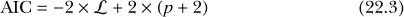

这里，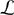是一个名为*对数似然*的拟合优度度量，*p*是模型中的回归参数数量，排除了整体截距。的值是用于拟合模型的估计过程的直接结果，尽管其确切计算超出了本文的范围。需要知道的是，它对拟合得更好的模型取较大的值。

公式 (22.3) 产生一个值，它用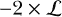来奖励拟合优度，同时用 2 × (*p* + 2)来惩罚模型复杂性。与相关的负号和*p* + 2 的正号意味着 AIC 值较小的模型表示更为简洁的模型。

要找到拟合线性模型的 AIC，你可以在`lm`函数返回的对象上使用`AIC`或`extractAIC`函数；查看这些函数的帮助文件，了解两者的技术差异。（因此 AIC 值）没有直接的解释意义，只有在你将其与另一个模型的 AIC 进行比较时才有意义。你可以根据 AIC 选择模型，方法是找出 AIC 值最小的拟合模型。这就是为什么`add1`和`drop1`的输出中直接报告了 AIC 的原因——你可以根据导致 AIC 最小变化的项的添加或删除来决定添加或删除哪个项，而不是仅仅关注通过*F*检验得出的变化的*显著性*。

让我们更进一步，结合前向选择和后向选择的思想。*逐步*模型选择允许删除当前项*或*添加缺失项，通常是基于 AIC 来实施的。也就是说，选择添加或删除的项是基于所有可能操作中，能最大程度减少 AIC 的单一操作。这让你在探索候选模型的过程中有了更大的灵活性，最终模型的拟合是通过选择一个没有任何添加或删除能进一步降低 AIC 值的模型来决定的。

你可以通过在每个阶段使用`add1`或`drop1`自己实现逐步 AIC 选择，但幸运的是，R 提供了内建的`step`函数来为你完成这项工作。使用过去几章中的`MASS`包中的`mtcars`数据。让我们最终尝试获得一个关于平均油耗的模型，该模型提供了包括所有可用预测变量的机会。

首先，查看`?mtcars`中的文档，并再次查看数据的散点图矩阵，以帮助你回忆变量及其在 R 数据框对象中的格式。然后定义起始模型（通常称为*空*模型）为仅包含截距的模型。

```
R> car.null <- lm(mpg~1,data=mtcars)
```

你的起始模型可以是你喜欢的任何模型，只要它符合你为`step`提供的`scope`参数描述的模型范围。在这个例子中，定义`scope`为要考虑的最完整模型——设置为一个过于复杂的模型，包含`wt`、`hp`、`cyl`和`disp`之间的四阶交互作用（以及通过交叉因子操作符获得的所有相关低阶交互作用和主效应），同时包括`am`、`gear`、`drat`、`vs`、`qsec`和`carb`的主效应。这两个多级分类变量，`cyl`和`gear`，被显式转换为因子，以避免它们被当作数值型处理（参见第 20.5.4 节）。

最终模型中的交互作用潜力将突出显示`add1`、`drop1`和`step`的一个特别重要（且方便）的特点。这些函数都会遵循交互作用和主效应所强加的层次结构。也就是说，对于`add1`（和`step`），除非所有相关的低阶效应已经出现在当前的拟合模型中，否则交互项不会作为添加选项提供；同样地，对于`drop1`（和`step`），除非所有相关的高阶效应已经从当前拟合模型中删除，否则交互项或主效应不会作为删除选项提供。

`step`函数本身返回一个拟合的模型对象，并且默认会提供每个选择阶段的详细报告。现在让我们调用它；为了打印输出的方便，一些输出已经被剪切掉了，所以你可以在自己的机器上查看完整的输出。

```
R> car.step <-
            step(car.null,scope=.~.+wt*hp*factor(cyl)*disp+am
                                      +factor(gear)+drat+vs+qsec+carb)
Start:  AIC=115.94
mpg
            ~
            1

              Df
            Sum of Sq     RSS     AIC
+
            wt           1    847.73  278.32  73.217
+
            disp         1    808.89  317.16  77.397
+
            factor(cyl)  2    824.78  301.26  77.752
+
            hp           1    678.37  447.67  88.427
+
            drat         1    522.48  603.57  97.988
+
            vs           1    496.53  629.52  99.335
+
            factor(gear) 2    483.24  642.80 102.003
+
            am           1    405.15  720.90
            103.672
+
            carb         1    341.78  784.27
            106.369
+
            qsec         1    197.39  928.66
            111.776
<none>                     1126.05
            115.943

Step:  AIC=73.22
mpg ~
            wt

              Df
            Sum of Sq     RSS    AIC
+
            factor(cyl)  2     95.26  183.06  63.810
+
            hp           1     83.27  195.05  63.840
+
            qsec         1     82.86  195.46  63.908
+
            vs           1     54.23  224.09  68.283
+
                carb         1     44.60  233.72  69.628
+
            disp         1     31.64  246.68  71.356
+
            factor(gear)
            2     40.37  237.95  72.202
<none>                      278.32  73.217
+
            drat         1      9.08  269.24  74.156
+
            am           1      0.00  278.32  75.217
-
            wt           1    847.73
            1126.05 115.943

Step:  AIC=63.81
mpg ~ wt +
            factor(cyl)

                 Df
            Sum of Sq    RSS    AIC
+
            hp              1    22.281
            160.78 61.657
+ wt:factor(cyl)  2    27.170 155.89
            62.669
<none>                      183.06
            63.810
+
            qsec            1    10.949
            172.11 63.837
+
            carb            1     9.244
            173.81 64.152
+
            vs              1     1.842
            181.22 65.487
+
            disp            1     0.110
            182.95 65.791
+
            am              1     0.090
            182.97 65.794
+
            drat            1     0.073
            182.99 65.798
+
            factor(gear)    2     6.682 176.38
            66.620
- factor(cyl)     2    95.263
            278.32 73.217
-
            wt              1   118.204
            301.26 77.752

Step:  AIC=61.66
mpg ~ wt + factor(cyl) +
                hp

--snip--

Step:  AIC=55.9
mpg ~ wt + factor(cyl) + hp +
                wt:hp

--snip--

Step:  AIC=52.8
mpg ~ wt + hp +
                wt:hp

--snip--

Step:  AIC=52.57
mpg ~ wt + hp + qsec +
            wt:hp

               Df
            Sum of
            Sq    RSS    AIC
<none>                      121.04
            52.573
-
            qsec          1     8.720
            129.76 52.799
+ factor(gear)  2     9.482 111.56
            53.962
+
            am            1     1.939
            119.10 54.056
+
            carb          1     0.080
            120.96 54.551
+
            drat          1     0.012
            121.03 54.570
+
            vs            1     0.010
            121.03 54.570
+
            disp          1     0.008
            121.03 54.571
+ factor(cyl)   2     0.164
            120.88 56.529
-
            wt:hp         1    65.018
            186.06 64.331
```

每个输出块展示了当前模型的拟合情况、其 AIC 值，以及一个显示可能操作的表格（包括添加`+`、删除`-`或不做任何操作`<none>`）。每个操作单独执行后的 AIC 值会列出，并且这些潜在的单一操作会按从小到大的 AIC 值进行排序。

随着算法的进行，你会看到`<none>`行在表格中逐渐上升。例如，在第一个表格中，仅包含截距模型的 AIC 值为 115.94。AIC 值的最大下降将来自添加`wt`的主效应；在做出这个调整后，重新评估后续调整对 AIC 的影响。还需注意，`wt`与`factor(cyl)`之间的二阶交互项只在第三步考虑，前提是这些预测因子的主效应已经被添加。然而，这个特定的二阶交互项最终并没有被纳入模型，因为在第三步时，`hp`的主效应更优，且随后的涉及`hp`的交互项在第四步中能显著降低 AIC 值。事实上，在第五步，实际*删除*`factor(cyl)`的主效应被认为能最大程度地降低 AIC，因此第六步和第七步的表格中不再包含`wt:factor(cyl)`项。第六步建议添加`qsec`的主效应能略微减少 AIC，因此这一调整得以执行。第七个表格标志着算法的结束，因为此时不做任何调整即可获得最低的 AIC 值，任何其他操作都会增加 AIC（这一点通过`<none>`在最后表格中占据首位得以体现）。

最终模型被存储为对象`car.step`；通过对其进行总结，你会发现几乎 90%的响应变化被体重、马力及它们的交互作用所解释，另外还有稍微显得有些奇怪的`qsec`主效应（尽管该效应本身被认为在统计上并不显著）。

```
R> summary(car.step)

Call:
lm(formula = mpg ~ wt + hp
            + qsec + wt:hp, data =
            mtcars)

Residuals:
    Min      1Q  Median      3Q    Max
-3.8243
            -1.3980  0.0303  1.1582
            4.3650

Coefficients:
             Estimate
            Std. Error t value Pr(>|t|)
(Intercept)
            40.310410   7.677887   5.250 1.56e-05 ***
wt          -8.681516   1.292525  -6.717
            3.28e-07
            ***
hp          -0.106181   0.026263  -4.043
            0.000395
            ***
qsec         0.503163   0.360768   1.395
            0.174476
wt:hp        0.027791   0.007298   3.808
            0.000733 ***
---
Signif. codes:  0 '***' 0.001 '**' 0.01 '*' 0.05
            '.' 0.1 ' ' 1

Residual standard error: 2.117 on 27 degrees of
            freedom
Multiple R-squared:
            0.8925,         Adjusted
            R-squared:  0.8766
F-statistic: 56.05 on 4 and 27 DF,  p-value:
            1.094e-12
```

从这一点来看，似乎值得进一步探讨这个预测因子，以验证拟合模型的有效性（见第 22.3 节），并且或许可以尝试对数据进行转换（例如将 GPM 建模而非 MPG；见第 21.4.3 节），以观察这一效应是否会在之后的逐步 AIC 算法运行中持续存在。`qsec`出现在最终模型中，说明模型选择不仅仅基于预测因子贡献的显著性，而是基于一种标准化的衡量方法，旨在追求其对简洁性的定义。

AIC 有时因倾向于偏向更复杂的模型和更高的*p*值而受到批评。为平衡这一点，你可以通过增加右侧方程式(22.3)中(*p* + 2)的乘法贡献，来增强额外预测变量的惩罚效应；尽管在大多数情况下，标准的乘法因子为 2（在`step`函数中，你可以使用可选参数`k`来更改此值）。话虽如此，基于准则的度量在你拥有非嵌套模型时（排除了部分*F*-检验）非常有用，这时你可以快速比较它们，找出可能提供最简洁数据表示的模型。

**习题 22.1**

在第 22.2.2 节和第 22.2.3 节中，你使用了前向选择和后向选择方法来寻找一个用于预测核电站建设成本的模型（基于`boot`包中的`nuclear`数据框）。

1.  使用相同的最全模型（换句话说，只包含所有现有预测因子的主效应），使用逐步 AIC 选择来找到适合数据的模型。

1.  在 (a) 中找到的最终模型与之前使用前向选择和后向选择得到的模型是否匹配？它们有什么不同？

习题 21.2 在第 512 页详细介绍了伽利略的球数据。如果你还没有这样做，将这些数据作为数据框输入到你当前的 R 工作空间中。

1.  对这些数据拟合五个线性模型，以距离作为响应变量——一个仅包含截距的模型和四个逐渐增加阶数 1 到 4 的多项式模型。

1.  构建一个部分*F*-检验表，以确定你偏好的距离旅行模型。你的选择是否与习题 21.2 (b) 和 (c) 一致？

你第一次遇到`diabetes`数据框是在贡献的`faraway`包的第 21.5.2 节中，在那里你建立了总胆固醇的均值模型。加载该包并通过`?diabetes`检查文档，以便回顾数据集的内容。

1.  在`diabetes`数据框中有一些缺失值，这可能会干扰模型选择算法。定义一个新的`diabetes`数据框版本，删除以下变量中任何一个存在缺失值的行：`chol`、`age`、`gender`、`height`、`weight`、`frame`、`waist`、`hip`、`location`。提示：使用`na.omit`或者你对数据框中记录提取或删除的知识。你可以使用`which`和`is.na`创建需要提取或删除的行号向量，或者你可以尝试使用`complete.cases`函数来获得一个逻辑标志向量——查看其帮助文件以了解更多细节。

1.  使用(e)中的数据框，拟合两个线性模型，以`chol`为响应变量。空模型对象，命名为`dia.null`，应为仅含截距的模型。完全模型对象，命名为`dia.full`，应为包含`age`、`gender`、`weight`和`frame`之间的四阶交互作用（及所有低阶项）；`waist`、`height`和`hip`之间的三阶交互作用（及所有低阶项）；以及`location`的主效应的过于复杂的模型。

1.  从`dia.null`开始，并使用与`dia.full`相同的`scope`中的术语，通过 AIC 实现步进选择法来选择一个平均总胆固醇的模型，并总结结果。

1.  使用基于部分*F*检验的前向选择法，采用常规显著性水平*α* = 0.05 来选择模型，仍然从`dia.null`开始。这里的结果是否与(g)中得到的模型相同？

1.  步进选择法不一定从最简单的模型开始。重复(g)步骤，但这次将`dia.full`设置为起始模型（如果从最复杂的模型开始，`scope`不需要提供任何内容）。如果从`dia.full`开始，AIC 最终选择的模型是什么？与(g)中的最终模型有何不同？你认为这是为什么，还是没有差别？

重新审视`MASS`包中的普遍使用的`mtcars`数据框。

1.  在 22.2.4 节中，你使用了步进 AIC 选择法来建模平均 MPG。所选模型包括了`qsec`的主效应。重新运行相同的 AIC 选择过程，但这次用 GPM=1/MPG 来做。这样会改变最终模型的复杂度吗？

#### *22.2.5 其他选择算法*

任何模型选择算法都始终旨在定量定义*简约性*，并建议在可用数据的基础上优化该定义。有一些 AIC 的替代方案，比如*修正 AIC (AIC[c])*或*贝叶斯信息准则 (BIC)*，它们比默认的 AIC（在 22.3 中）对复杂度的惩罚更重。

有时，人们很容易只关注一系列模型的*R*²，即决定系数。然而，如 22.2.1 节中所提到的，单独依赖这一指标不足以在模型之间进行选择，因为它没有对复杂度进行惩罚，并且通常随着你继续添加预测变量而增加，无论这些变量是否具有统计学意义。*调整后的 R*² *统计量*，用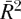表示，并在`summary`中以`Adjusted R-squared`报告，是原始*R*²的一个简单转换，考虑了相对于样本大小*n*的复杂度惩罚；计算公式为：

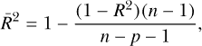

其中 *p* 是预测变量的数量（不包括截距项）。基于测试和标准的算法总是更可取的（因为解释可能比较困难），但监控作为嵌套模型之间的快速检查也很有用——更高的值指示更优的模型。

欲进一步阅读，Faraway 的第八章（2005）对基于测试和标准的模型选择程序的指导性性质进行了精彩的评论。无论您采用哪种方法，请始终记住，使用这些算法得到的最终模型仍然需要审查。

### 22.3 残差诊断

在前面的章节中，您已经研究了多元线性回归模型的实际方面，如拟合和解释、虚拟变量编码、变量变换等，但您尚未涉及确定模型*有效性*的必要方法。本章的最后部分将向您介绍*模型诊断*，其主要目标是确保您的回归模型有效并准确地表示数据中的关系。为此，我将重点回到早些时候在第 21.2.1 节中提到的多元线性回归模型的理论假设。

作为复习，一般来说，在拟合这些模型时，请记住以下四点：

**误差** 误差项*ɛ*定义了任何观测值与拟合的均值结果模型之间的偏差，假定其服从正态分布，均值为零，常数方差用*σ*²表示。给定观测值的误差也假定与其他观测值的误差独立。如果拟合模型表明违反了这些假设中的任何一项，则需要进一步调查（通常涉及重新拟合模型的变体）。

**线性** 假设均值响应作为回归参数*β*[0]、*β*[1]、...、*β*[*p*]的函数是线性的至关重要。尽管对单个变量的变换和交互项的存在可以在一定程度上放宽估计趋势的具体性质，但任何诊断结果表明关系是非线性的（因此未被拟合模型捕捉到）都必须进行调查。

**极端或不寻常的观测值** 始终检查极端数据点或对拟合模型有强烈影响的数据点——例如，记录错误的数据点应从分析中删除。

**共线性** 高度相关的预测变量可能会对整个模型产生不利影响，这意味着很容易误解任何包含预测变量的效应。在任何回归分析中都应避免这种情况。

在使用诊断工具拟合模型后，你会检查前三项。任何对这些假设的违反都会降低模型的可靠性，有时会严重影响结果。共线性和/或极端观测值可以通过对原始数据进行基本的统计探索（例如，查看散点图矩阵）在拟合前发现，但任何后续的影响则在拟合后进行评估。

你可以执行一些统计检验来诊断统计模型，但通常诊断检查归结为解释专门设计的图形工具的结果，这些工具旨在针对特定的假设。解释这些图形可能相当困难，只有通过经验才会变得更加容易。在这里，我将概述这些在 R 中的工具，并描述一些常见的检查内容。有关更详细的讨论，请参阅专门的回归方法书籍，例如 Chatterjee 等人（2000），Faraway（2005），或 Montgomery 等人（2012）。

#### *22.3.1 残差的检查与解释*

如果你回顾一下图 20-2 中的图表（位于 456 页），你将看到一个很好的示范，展示了将 *ŷ* 作为均值响应值解释结果的重要性。在假定的模型下，原始观测值与拟合直线的任何偏离都被认为是由方程（20.1）中 *ɛ* 项所定义的（正态分布的）误差所导致的，方程见 453 页。

当然，在实践中，你无法获得真实的误差值，因为你并不知道数据的真实模型。对于第 *i* 个响应观测值 *y*[*i*] 及其模型拟合值 *ŷ*[*i*]，你通常会使用估计残差 *e*[*i*] = *y*[*i*] − *ŷ*[*i*] 来评估诊断图。对 `summary` 的调用甚至鼓励通过提供 *e*[*i*] 的五数概括在估计系数表上方进行拟合后分析。这使你能够查看它们的值，并对其分布的对称性进行初步的数值评估（这也是正态性假设所要求的——参见第 22.3.2 节）。

除了对原始残差 *e*[*i*] 进行诊断检查外，还可以使用它们的 *标准化*（或 *Student 化*）值进行一些诊断检查。标准化残差将原始残差 *e*[*i*] 重新缩放，以确保它们具有相同的方差，这在需要直接相互比较时非常重要。正式地，这通过计算 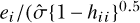 来实现，其中 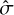 是残差标准误差的估计值，*h*[*ii*] 是第 *i* 个观测值的 *杠杆作用*（你将在第 22.3.4 节中学习杠杆作用）。

可以说，最常用的残差后验分析图形工具是简单的散点图，将“观察值减去拟合值”的原始残差绘制在纵轴上，横轴则是回归模型的相应拟合值。如果关于*ɛ*的假设有效，那么*e*[*i*]应该随机分布在零周围（因为假设误差与响应变量的值之间没有任何关系）。散点图中的任何系统性模式都表明残差与误差假设不符——这可能是由于数据中的非线性关系或观察值之间存在依赖性（换句话说，你的数据点是相关的，因此彼此之间并不独立）。该图还可以用于检测*异方差性*——即残差的方差不恒定——通常表现为随着拟合值的增加，残差围绕零“张开”。

再次提醒，确保这些理论假设有效非常重要，因为它们影响回归系数估计值的有效性以及其标准误差的可靠性（进而影响统计显著性）——换句话说，它们影响你对其对响应变量影响的解释是否正确。

为了让你更好地理解这一点，请参考图 22-1 中的三张图。这些图展示了三个假设情境下的残差与拟合值的散点图。

左侧的图基本上就是你所期望看到的——残差随机分布在零周围，且其分布的范围似乎是恒定的（*同方差性*）。然而，在中间的图中，你可以看到残差中存在系统性行为。尽管可变性似乎在拟合值范围内保持恒定，但明显的趋势表明当前模型未能解释响应与预测变量（或预测变量）之间的某些关系。在右侧的图中，残差似乎再次随机分布在零周围。然而，它们所表现出的可变性并不恒定。除了其他因素外，这种异方差性会影响你置信区间和预测区间的可靠性。

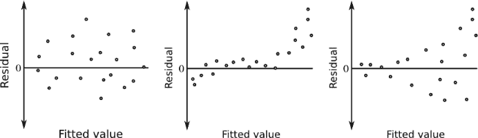

*图 22-1：假设的线性回归残差与拟合值诊断图的三种印象：随机（左）、系统性（中）、异方差性（右）*

需要注意的是，即使你的图形诊断结果不像图 22-1 左侧的假设性示例那样表现良好，也不意味着应该立即放弃分析。这些图形可以作为找到适合你数据的模型的一个重要组成部分。你通常可以通过加入额外的预测变量或交互作用、改变分类变量的处理方式，或对某些连续预测变量进行非线性变换来减少非线性问题。在某些研究领域，异方差性，特别是图 22-1 中那种拟合值较高时波动性较大的情况，是常见的。解决这个问题的第一步通常是对响应变量进行简单的对数变换，然后重新检查诊断结果。

现在是时候看一个例子了。在第 22.2.4 节中，你使用逐步 AIC 选择法为 `mtcars` 数据选择了一个模型，用于预测 MPG，创建了对象 `car.step`。现在，让我们诊断一下这个拟合结果，看看模型假设是否存在问题。

当你将 `plot` 函数直接应用于 `lm` 对象时，它可以方便地生成六种类型的拟合诊断图。默认情况下，这四个图会依次生成。按照控制台中的提示 "Hit <Return> to see next plot"（按回车键查看下一个图），依次查看这些图。不过，在接下来的例子中，你将使用可选的 `which` 参数来单独选择每个图（指定整数 `1` 到 `6`；详见 `?plot.lm` 文档）。残差与拟合图通过 `which=1` 生成；以下行会生成左侧的图，图 22-2。

```
R> plot(car.step,which=1)
```

如你所见，R 会添加一条平滑线，帮助用户解读任何趋势，尽管这一点不应该作为唯一依据来做出判断。默认情况下，零点附近的三个最极端的数据点会被标注（根据拟合模型时所用数据框的 `rownames` 属性）。模型公式本身会在横轴标签下方指定。

从中可以看出，`car.step` 的残差与拟合值图几乎没有任何值得关注的地方。没有明显的趋势，而且你可以进一步放心，因为误差（*e*[*i*]）似乎在其分布中是同方差的。

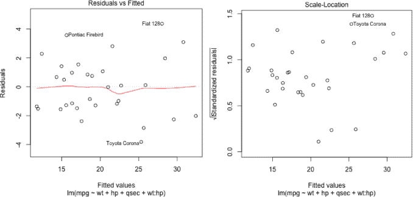

*图 22-2：残差与拟合值及尺度-位置诊断图，适用于* `car.step` *模型*

*规模-位置*图类似于残差与拟合图，不过它不是在纵轴上绘制原始的*e*[*i*]，而是提供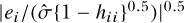，即标准化残差的绝对值的平方根（用| · |表示；这使得所有负值变为正值）。这些值与横轴上的拟合值进行绘制。通过这种方式限制关注每个残差的大小，规模-位置图用于揭示每个数据点与拟合值之间偏差大小的趋势，随着拟合值的增大。这意味着，诸如异方差性（heteroscedasticity）等问题，规模-位置图可能比原始的残差与拟合图更有用。就像原始的残差与拟合图一样，你希望看到一个没有明显模式的图形，这表明没有违反任何误差假设。

图 22-2 的右图展示了`car.step`的规模-位置图，这是通过`which=3`选择的。该图还演示了如何使用`add.smooth`参数去除默认的平滑趋势线，并控制如何使用`id.n`参数标记多少个极端点。

```
R> plot(car.step,which=3,add.smooth=FALSE,id.n=2)
```

与原始的残差与拟合图类似，对于这个`mtcars`模型，规模-位置图似乎也没有什么值得担忧的地方。

返回到伽利略的滚球数据，这些数据最初在练习 21.2 中展示，位于第 512 页。在下面的例子中，响应变量“行驶距离”作为列`d`给出，解释变量“高度”作为列`h`，数据框`gal`中的数据。我将重新创建一些练习内容，给你展示几个简单的残差诊断图中值得关注的例子。执行以下代码来定义包含七个观测值的数据框，并拟合两个回归模型——第一个是关于高度的线性模型，第二个是二次模型（有关多项式变换的详细信息，请参见第 21.4.1 节）。

```
R> gal <-
            data.frame(d=c(573,534,495,451,395,337,253),
                     h=c(1,0.8,0.6,0.45,0.3,0.2,0.1))
R>
            gal.mod1 <- lm(d~h,data=gal)
R> gal.mod2 <- lm(d~h+I(h²),data=gal)
```

现在，看看图 22-3 中的三幅图，这些图是使用以下代码创建的：

```
R> plot(gal$d~gal$h,xlab="Height",ylab="Distance")
R>
            abline(gal.mod1)
R> plot(gal.mod1,which=1,id.n=0)
R>
            plot(gal.mod2,which=1,id.n=0)
```

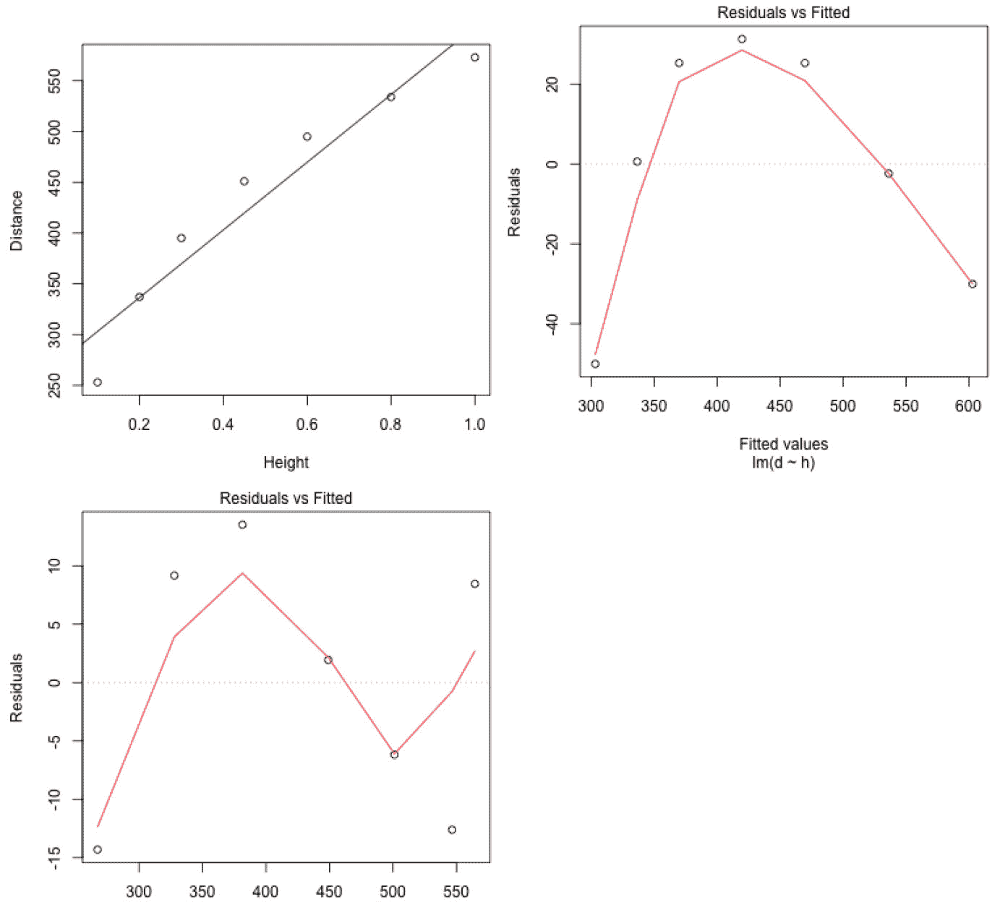

*图 22-3：展示了伽利略滚球数据的残差诊断。左上：原始数据及与之相对应的简单线性趋势*`gal.mod1`*叠加图。右上：仅针对线性趋势模型的残差与拟合值图。下方：针对二次模型*`gal.mod2`*的残差与拟合值图。*

左上方的图展示了数据，并提供了简单线性模型的直线。尽管这清晰地捕捉到了增长趋势，但该图表明也存在一些曲率。右上方的诊断残差与拟合图表明，仅有线性趋势的模型是不充分的——系统性模式提出了关于线性模型误差假设的警示。底部图像展示了基于`gal.mod2`模型二次版本的残差与拟合图。包括“高度”的二次项去除了残差中的明显曲线。然而，这些最新的*e*[*i*]值似乎仍然表现出波动的系统性行为，或许暗示你应尝试一个三次模型，但在如此小的样本量下，这非常困难。

#### *22.3.2 评估正态性*

为了评估误差正态分布的假设，你可以使用正态 QQ 图，正如在第 16.2.2 节中首次讨论的那样。在调用`lm`对象的`plot`时，选择`which=2`来生成（标准化）残差的正态分位数-分位数图。返回`car.step`模型对象并输入以下代码来生成图 22-4。

```
R> plot(car.step,which=2)
```

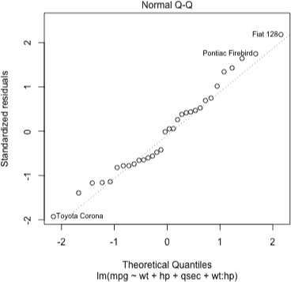

*图 22-4：来自`car.step`模型的残差正态 QQ 图*

你可以像在第 16.2.2 节中那样解释残差的 QQ 图。灰色对角线表示真实的正态分位数，绘制的点则是估计回归误差的相应数值分位数。正态分布的数据应该接近这条直线。

对于`car.step`回归模型，点图大体上似乎遵循理论正态分位数所描绘的路径。存在一定的偏差，这是可以预期的，但没有明显的正态性偏离。

还有其他检测正态性的方法，例如著名的 Shapiro-Wilk 假设检验。Shapiro-Wilk 检验的原假设是数据服从正态分布，因此，较小的*p*值会暗示数据非正态性（详细技术细节请参见 Royston, 1982）。要执行此过程，可以使用 R 中的`shapiro.test`函数。首先通过`rstandard`提取拟合模型的标准化残差，你会发现对`car.step`应用此检验会得到一个较大的*p*值。

```
R>
            shapiro.test(rstandard(car.step))

        Shapiro-Wilk
            normality test

data:  rstandard(car.step)
W = 0.97105, p-value
            = 0.5288
```

换句话说，根据这个检验，并没有证据表明`car.step`的残差不服从正态分布。

假设误差项正态分布有助于支持用于产生回归系数可靠估计的方法。只要你的数据是*大致*正态的，你就不需要太担心轻微的非正态性迹象。对数据进行一些变换，以及增加样本量，可以减少对更严重的非正态残差迹象的担忧。

#### *22.3.3 说明异常值、杠杆值和影响力*

始终重要的是调查那些与大多数观测值相比显得不寻常或极端的单个观测值。一般来说，进行数据的探索性分析，可能涉及汇总统计或散点矩阵，是一个好主意，因为它可以帮助你识别这些值——它们有可能对模型拟合产生不利影响。在继续之前，澄清一些常用的术语是很重要的。

**异常值** 这是一个用于描述数据中不寻常观测值的通用术语，正如你在第 13.2.6 节中看到的那样。在线性回归中，异常值通常有较大的残差，但只有当其不符合拟合模型的趋势时，才被视为异常值。异常值可以，也不一定，会显著改变拟合模型所描述的趋势。

**杠杆值** 这个术语指的是当前预测值的极端性。高杠杆点是那些预测值极端到足以可能显著影响拟合模型的斜率或趋势的观测值。异常值可以有高杠杆值或低杠杆值。

**影响力** 一个具有高杠杆值的观测值，如果*确实*影响了估计的趋势，就被认为是有影响力的。换句话说，影响力只有在考虑响应值与相应的预测值一起时，才能做出判断。

这些定义有一定的重叠，因此给定的观测值可以用这些术语的组合来描述。让我们来看一些假设的例子。创建以下两个包含十个假设响应（`y`）和解释（`x`）值的向量：

```
R> x <- c(1.1,1.3,2.3,1.6,1.2,0.1,1.8,1.9,0.2,0.75)
R> y
            <- c(6.7,7.9,9.8,9.3,8.2,2.9,6.6,11.1,4.7,3)
```

这些将构成数据的主体部分。现在，考虑以下六个对象，`p1x`到`p3y`，它们将用于存储三个附加观测点的预测值和响应值：

```
p1x <- 1.2
p1y <- 14
p2x <- 5
p2y <-
            19
p3x <- 5
p3y <- 5
```

也就是说，点 1 是 (1.2,14)；点 2 是 (5,19)；点 3 是 (5,5)。

接下来，以下四个`lm`的使用提供了四个简单的线性模型拟合。第一个是`y`对`x`的回归。接下来的三个分别将点 1、2 和 3 作为第 11 个观测值单独包含进去。

```
R> mod.0 <- lm(y~x)
R> mod.1 <-
            lm(c(y,p1y)~c(x,p1x))
R> mod.2 <- lm(c(y,p2y)~c(x,p2x))
R> mod.3
            <- lm(c(y,p3y)~c(x,p3x))
```

现在，你可以使用这些对象来直观地澄清*异常值*、*杠杆值*和*影响力*的定义，如图 22-5 所示。输入以下代码来初始化散点图，并设置`x`和`y`的轴限：

```
R> plot(x,y,xlim=c(0,5),ylim=c(0,20))
```

然后使用`points`、`abline`和`text`来构建图 22-5 的左上角图，如下所示：

```
R> points(p1x,p1y,pch=15,cex=1.5)
R> abline(mod.0)
R>
            abline(mod.1,lty=2)
R> text(2,1,labels="Outlier, low leverage, low
            influence",cex=1.4)
```

通过将`p1x`、`p1y`和`mod.1`替换为对应于点 2 和 3 的对象，并修改`text`中的`labels`参数，来创建中间和右侧的图。

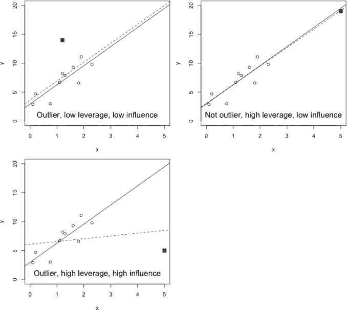

*图 22-5：线性回归上下文中异常值、杠杆值和影响力的三种定义示例。在每个图中，实线表示拟合到原始观察数据的模型，基于`x`和`y`，而虚线表示包含额外点后拟合的模型，额外点用▪表示。*

在图 22-5 的左上图中，额外的点是一个异常值的例子，因为它与大部分数据分开，*并且*不符合原始观察结果所暗示的趋势。尽管如此，因其预测值为 1.2 (`p1x`)，与其他 `x` 值相比并不显得异常，因此它被认为杠杆值较低。实际上，它靠近 `x` 值的整体均值，表明将其包含在 `mod.1` 中，主要是对原始截距的修正。你甚至可以将其归类为一个低影响点——拟合模型的整体变化似乎很小。

在右上图中，你可以看到一个示例，说明了一个*不*被视为异常值的观察点。尽管点 2 确实与原始的 10 个观察点有所不同，但它很好地符合仅基于`x`和`y`拟合的模型，这在回归分析中非常重要。话虽如此，点 2 被认为是一个高杠杆点，因为它位于一个极端的预测值位置，与所有其他 `x` 值相比（换句话说，它有*潜力*在响应值不同的情况下显著改变拟合结果）。就目前而言，它是一个低影响点，因为模型本身几乎不受它的包含影响。

最后，底部图展示了一个明显的异常值，位于高杠杆位置，并且具有高影响力——它远离原始的 10 个观察点，并未明显符合原始趋势；其极端的预测值意味着它具有高杠杆；而其包含则显著改变了整个模型，拉低了斜率并提高了截距。这些概念在更高维度（即当你有多个预测变量时）对于多元线性回归模型仍然适用。

#### *22.3.4 计算杠杆值*

杠杆值的计算是基于第 21.2.2 节中定义的设计矩阵结构***X***。具体来说，如果你有*n*个观察点，那么第 *i* 个点（*i* = 1, . . . , *n*）的杠杆值表示为 *h*[*ii*]。这些是*n* × *n* 矩阵 *H* 的对角线元素（第 *i* 行，第 *i* 列），其计算方式为：

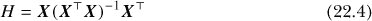

在 R 中，构造你在第 22.3.3 节中定义的 10 个示例预测观测值`x`的设计矩阵是通过使用`cbind`的知识来实现的（参见第 3.1.2 节）。随后，通过矩阵乘法（`%*%`）、矩阵转置（`t`）、矩阵求逆（`solve`）和提取对角线元素（`diag`）的相应函数计算出*H*。然后，你可以将值*h*[*ii*]与`x`的值本身绘制出来。以下代码生成了图 22-6：

```
R> X <- cbind(rep(1,10),x)
R> hii <-
            diag(X%*%solve(t(X)%*%X)%*%t(X))
R> hii
 [1] 0.1033629 0.1012107
            0.3487221 0.1302663 0.1001345 0.3723971 0.1711595
 [8] 0.1980630 0.3261232
            0.1485607
R> plot(hii~x,ylab="Leverage",main="",pch=4)
```

通常，你会使用内置的 R 函数`hatvalues`，该函数以方程式（22.4）中的矩阵代数风格命名，用于获取杠杆值（而不是手动构造设计矩阵***X***并自己进行计算）。只需将拟合的模型对象提供给`hatvalues`。你可以通过使用之前拟合到`x`和`y`数据的相应`lm`对象（即之前创建的`mod.0`）来确认你的计算结果。

```
R>
            hatvalues(mod.0)
        1         2         3         4         5         6         7
0.1033629
            0.1012107 0.3487221 0.1302663 0.1001345 0.3723971
            0.1711595
        8         9        10
0.1980630
            0.3261232 0.1485607
```

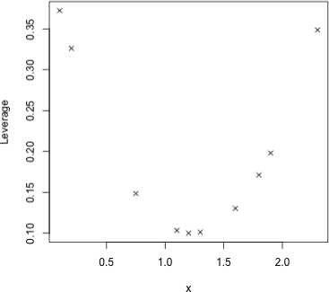

*图 22-6：在`x`中绘制 10 个示例预测观测值的杠杆值*

看图 22-6，将杠杆值与相应的预测值本身绘制在一起，这种趋势是合理的——杠杆值随着你离预测数据的均值越远而逐渐增大。这基本上是你在任何原始杠杆值图中看到的模式。

#### *22.3.5 Cook 距离*

当然，仅凭杠杆值不足以确定每个观测值对拟合模型的总体影响。为此，响应值也必须考虑在内。

可以说，最著名的影响度量是*Cook 距离*，它估计删除第*i*个值对拟合模型的影响大小。观测值*i*的 Cook 距离（记作*D*[*i*]）通过以下方程给出：

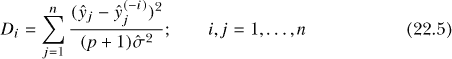

事实证明，这个方程是一个特定的函数，表示某个点的杠杆值和残差。这里，值*ŷ*[*j*]是使用所有*n*个观测值拟合的模型对观测值*j*的预测均值，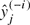表示使用*不包括*第*i*个观测值的模型对观测值*j*的预测均值。像往常一样，术语*p*是预测回归参数的数量（不包括截距），值是残差标准误差的估计值。

简单来说，*D*[*i*]值越大，第*i*个观察值对拟合模型的影响越大，这意味着处于高杠杆位置的离群观察值将对应于更高的*D*[*i*]值。一个重要的问题是，*D*[*i*]的值要多大，才能认为第*i*个点是有影响力的？在实践中，这个问题没有普遍的答案，也没有正式的假设检验，但有几个经验法则的截止值。一个规则是，如果*D*[*i*] > 1，应该认为该点是有影响力的；另一个更为敏感的规则建议*D*[*i*] > 4/*n*（例如，参见 Bollen 和 Jackman, 1990；Chatterjee 等, 2000）。一般建议，比较给定拟合模型的多个 Cook 距离，而不是分析单一值，并且任何对应于相对较大*D*[*i*]值的点可能需要进一步检查。

继续使用在第 22.3.3 节中创建的对象，其中包含`x`和`y`中的 10 个示例观察值，以及在`p1x`和`p1y`中定义的额外点。拟合这些数据的线性回归模型被存储为对象`mod.1`。编写一些代码计算根据公式(22.5)得到的 Cook 距离度量是一个很好的练习。

为此，在 R 编辑器中输入以下代码：

```
x1 <- c(x,p1x)
y1 <- c(y,p1y)
n <-
            length(x1)
param <- length(coef(mod.1))
yhat.full <-
            fitted(mod.1)
sigma <- summary(mod.1)$sigma
cooks <-
            rep(NA,n)
for(i in 1:n){
    temp.y <-
            y1[-i]
    temp.x <-
            x1[-i]
    temp.model <-
            lm(temp.y~temp.x)
    temp.fitted <-
            predict(temp.model,newdata=data.frame(temp.x=x1))
    cooks[i]
            <- sum((yhat.full-temp.fitted)²)/(param*sigma²)
}
```

首先，创建新的对象`x1`和`y1`来保存所有 11 个观察值。对象`n`、`param`和`sigma`提取数据集的大小、回归参数的总数（此处为 2），以及最初拟合到所有 11 个数据点的模型的估计残差标准误差。后两项，`param`和`sigma`，分别表示公式(22.5)中的(*p* + 1)和。

为了存储 Cook 距离，使用`rep`创建了一个包含 11 个位置的向量`cooks`（初始化为`NA`）。现在，为了计算每个*D*[*i*]值，设置一个`for`循环（参见第十章），循环遍历从`1`到`11`的每个索引。循环的第一步是创建两个临时向量`temp.x`和`temp.y`，它们分别是去除第`i`个观察值后的`x1`和`y1`。基于`temp.x`，对`temp.y`进行拟合一个新的临时线性模型；然后，`predict`函数基于`temp.model`为每个 11 个预测值计算均值响应（换句话说，包括被删除的那个观察值）。这样，得到的向量`temp.fitted`代表了公式(22.5)中的值。最后，`sum`和`param`与`sigma²`的乘积计算出*D*[*i*]，并将结果存储在`cooks[i]`中。

在高亮并执行代码后，得到的 Cook 距离如下：

```
R> cooks
 [1] 2.425993e-03 4.060891e-07 1.027322e-01
            1.844150e-03 2.923667e-03
 [6] 7.213229e-02 1.387284e-01 3.021075e-02
            7.099904e-03 1.251882e-01
[11] 3.136855e-01
```

不出所料，最大的值是最后一个，大约为 0.314。这对应于`x1`和`y1`中的第 11 个观测点，它是最初在`p1x`和`p1y`中定义的额外点。值 0.314 小于 1，也小于 4/11 = 0.364，这是之前经验法则中定义的临界值。这与图 22-5 中左上角图像的评估相一致——即与像`p3x`和`p3y`这样的点相比，`p1x`和`p1y`的影响是微不足道的。

就像`hatvalues`函数为你计算杠杆值一样，内建的`cooks.distance`函数也为*D*[*i*]做同样的事情。你可以在`cooks`中确认之前的值，这些值是基于`mod.1`的。

```
R>
            cooks.distance(mod.1)
           1            2            3            4            5            6
2.425993e-03
            4.060891e-07 1.027322e-01 1.844150e-03 2.923667e-03
            7.213229e-02
           7            8            9           10           11
1.387284e-01
            3.021075e-02 7.099904e-03 1.251882e-01 3.136855e-01
```

当你在`plot`函数的相关用法中选择`which=4`时，R 会自动计算并提供 Cook 距离，作为拟合线性模型对象的诊断图。以下代码使用了之前的`mod.1`、`mod.2`和`mod.3`，生成了图 22-7 中的三张图像；这些对应于图 22-5 中的三组数据。

```
R> plot(mod.1,which=4)
R> plot(mod.2,which=4)
R>
            plot(mod.3,which=4)
R> abline(h=c(1,4/n),lty=2)
```

图 22-7 左上方显示的*D*[*i*]与之前你手动计算并存储在`cooks`中的值相匹配。右上图中所有数据点的影响相对较小，这与你在图 22-5 右上图中看到的情况一致，在那里，额外的点（`p2x`，`p2y`）对整体拟合没有产生太大影响。在底部图中，`abline`叠加了两条水平线，分别标记了值 1（最高线）和 4/11 = 0.364，这两条线都被第 11 个点（`p3x`，`p3y`）明显突破了，就像你在图 22-5 中的对应底部图像所预期的那样。

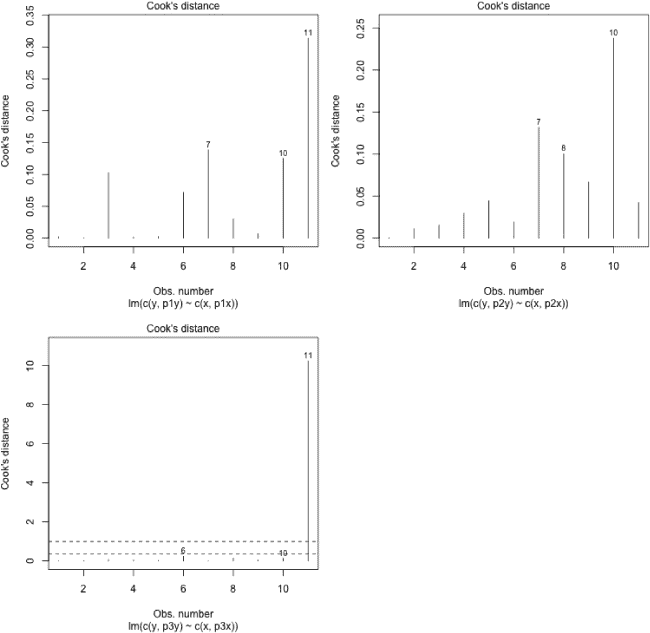

*图 22-7：在 R 中生成的 Cook 距离图的三个示例，分别基于* `mod.1` *(左上)，* `mod.2` *(右上)，和* `mod.3` *(底部)*

回到你之前建立的`car.step`模型，你使用`mtcars`数据集对 MPG 进行了建模，最终的拟合结果是通过第 22.2.4 节中的逐步 AIC 选择得到的。你已经查看过残差与拟合值的关系图以及 QQ 图，分别见图 22-2 和图 22-4。图 22-8 提供了该模型的 Cook 距离图，包含以下两条线：

```
R> plot(car.step,which=4)
R>
            abline(h=4/nrow(mtcars),lty=2)
```

该图默认标记了残差最高的三个*D*[*i*]点；其中两个突破了 4/*n* = 4/32 = 0.125 的界限。根据基于汽车重量（`wt`）、马力（`hp`）和四分之一英里时间（`qsec`）的各类效应拟合的模型，克莱斯勒帝国和丰田卡罗拉被认为处于高杠杆位置，且残差足够大，被归类为高影响力观察值。还应注意，菲亚特 128 虽然没有突破 0.125 线，但仍然具有相当大的影响力，事实上，它也曾是残差图（图 22-2）和 QQ 图（图 22-4）中标记的极端点之一。

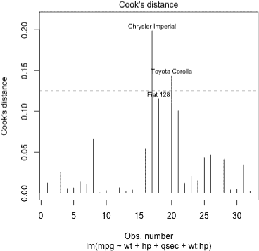

*图 22-8：模型在*`car.step`*中的库克距离；虚线水平线标记了 4/*n*，适用于*`mtcars`*数据框

这可能合理地建议你进一步调查这些高影响力的观察值。所有记录都正确吗？你的模型选择是否谨慎？模型是否有其他选择，比如额外的预测变量或转换？你可以探索这些选项，并继续监控库克距离的图（以及其他诊断图）。

无论你的结果如何，有影响力的数据点并不一定意味着你的模型存在严重问题——这只是一个帮助你检测那些在预测值组合上*极端*，并且残差较大的观察值的工具，这些观察值的响应值偏离了模型所预测的趋势。这在多元回归中尤其有用，因为响应与预测数据的高维性可能使得传统的单一图表可视化原始数据变得困难。

#### *22.3.6 图形化组合残差、杠杆值和库克距离*

来自`plot`的最后两个诊断图结合了标准化残差、杠杆值和第*i*个观察值的库克距离。这些组合图特别有助于你判断是高杠杆值还是大残差，或者两者共同作用，导致了高影响力的观察值。

使用数据模型`mod.1`、`mod.2`和`mod.3`，输入以下代码，设置`which=5`，以生成图 22-9 左列中的三个图像：

```
R>
            plot(mod.1,which=5,add.smooth=FALSE,cook.levels=c(4/11,0.5,1))
R>
            plot(mod.2,which=5,add.smooth=FALSE,cook.levels=c(4/11,0.5,1))
R>
            plot(mod.3,which=5,add.smooth=FALSE,cook.levels=c(4/11,0.5,1))
```

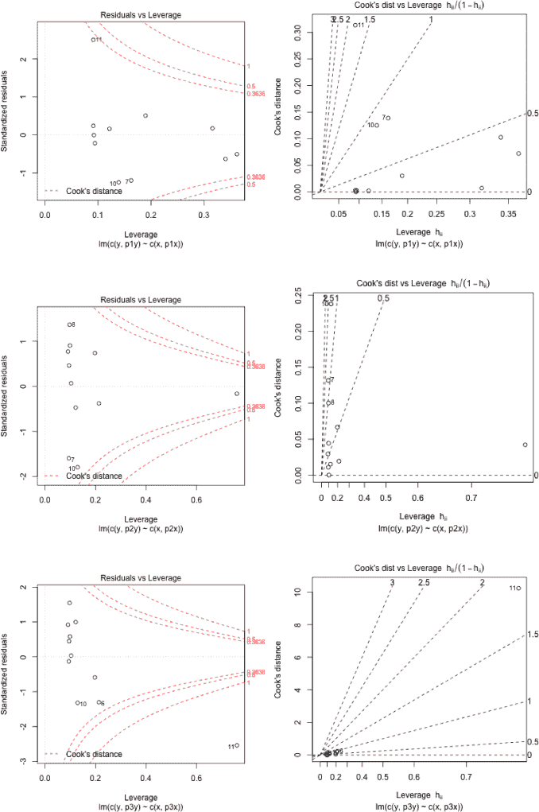

*图 22-9：标准化残差与杠杆值的组合诊断图（左列）以及库克距离与杠杆值的组合诊断图（右列），适用于三个示例模型* `mod.1` *(上)，* `mod.2` *(中)，以及* `mod.3` *(下)*

这些图展示了每个观测值的杠杆值在横轴上的位置，标准化残差在纵轴上的位置。作为残差和杠杆的函数，Cook 距离可以作为*等高线*绘制在这些散点图上。这些等高线划定了图中的空间区域，表示高影响（位于右侧极端角落处）。

越是接近零的横轴线，点的残差就越小。位于横轴左侧的点，其杠杆值较小。如果一个点根据其杠杆（*x*轴）位置远离横轴，它将突破标记某些*D*[*i*]值的等高线（默认值为 0.5 和 1），表示该点具有高影响力。实际上，通过这些图中从左到右等高线逐渐变窄可以看出，如果一个观测值位于高杠杆位置，则将其分类为高影响点会更容易，这完全符合直觉。在之前使用`plot`和`which=5`时，`cook.levels`参数的可选项用于为这三个例子包含 4/11 的经验法则等高线。

`mod.1`的图显示添加的点（`p1x`，`p1y`）具有较大的残差，但由于其位于低杠杆位置，因此并未突破 4/11 等高线。`mod.2`的图显示添加的点（`p2x`，`p2y`）位于高杠杆位置，但由于其残差较小，因此没有表现出影响力。最后，`mod.3`的图清楚地识别出添加的点（`p3x`，`p3y`）为高度有影响力的点——具有较大的残差和高杠杆，明显突破了高层次等高线。回顾这三个示例数据集之前的所有图，可以明显看到，这三幅图清楚地反映了每个单独添加的额外观测值的性质。

最后的诊断图使用`which=6`，显示了与`which=5`组合诊断相同的信息，但这次纵轴显示的是 Cook 距离，横轴显示的是杠杆的转换值，即*h*[*ii*]/(1 − *h*[*ii*])。这种转换放大了较大杠杆点在横轴上的位置，这一效果部分间接地表现为*x*轴上的“拉伸”尺度——如果你特别关注与预测变量集合相关的观测值的极端情况，这将非常有用。

因此，这些等高线现在定义了标准化残差，作为缩放杠杆和 Cook 距离的函数。以下三行代码生成了图 22-9 右侧列中的三幅图：

```
R> plot(mod.1,which=6,add.smooth=FALSE)
R>
            plot(mod.2,which=6,add.smooth=FALSE)
R> plot(mod.3,which=6,add.smooth=FALSE)
```

位于右侧的点是高杠杆点；位于上方的点是高影响点。从图 22-9 的右列图中可以看出，这三个额外的点正如你所预期的那样，根据它们在`mod.1`、`mod.2`和`mod.3`中的特征出现。

对于一个真实数据的例子，返回到存储在`car.step`中的模型。输入以下代码来生成图 22-10 中的两个组合诊断图：

```
R>
            plot(car.step,which=5,cook.levels=c(4/nrow(mtcars),0.5,1))
R>
            plot(car.step,which=6,cook.levels=c(4/nrow(mtcars),0.5,1))
```

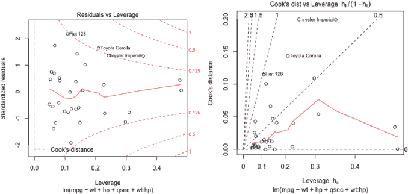

*图 22-10：标准化残差与杠杆（左）和库克距离与杠杆（右）的组合诊断图，针对* `car.step` *模型*

图 22-10 中的两张图片显示了 Corolla 和 Imperial 作为具有影响力的观测点，它们的*D*[*i*]值大于`4/nrow(mtcars)`的经验法则截断值。有趣的是，这张图揭示了 Imperial（在图 22-8 中显示其*D*[*i*]值远大于其他点）实际上有一个比 Corolla 和 Fiat 128 更小的残差。它的高影响力显然是因为其在`car.step`中的预测变量位置具有高杠杆性。另一方面，Fiat 128 在整个数据集中拥有最大的残差之一（这也是它在一些早期诊断图中被标记的原因），但由于其相对较低的杠杆位置（完全基于经验法则截断值），它刚好未被标记为高影响力的观测点。

任何线性回归模型都会有比其他观测值更能影响模型的观测点，这些图表旨在帮助你识别它们。但决定如何处理这些具有高度影响力的观测点可能很困难，而且是具体应用问题。虽然一个单一观测点对最终估计模型的影响过大并不理想，但在没有深思熟虑的情况下删除这些观测点也是极其不明智的，因为它们可能指示其他问题，比如当前拟合的不足或先前未检测到的趋势。

**练习 22.2**

在第 22.2.2 节中，你使用了`boot`包中的`nuclear`数据框来说明前向选择方法，其中为`cost`选择了一个模型，作为`date`、`cap`、`pt`和`ne`的主要效应的函数。

1.  访问数据框；拟合并总结之前描述的模型。

1.  检查原始残差与拟合值的关系图，以及残差的正态 QQ 图，并评论你的解释——在这种情况下，线性模型的误差成分的假设是否得到了满足？

1.  基于库克距离，确定影响观测点的经验法则截断值。生成库克距离的图，并添加一个水平线对应于截断值。评论你的发现。

1.  生成标准化残差与杠杆值的组合诊断图。设置 Cook 距离等高线，以包括(c)中的截止值以及默认等高线。解释该图—如何描述任何具有单独影响力的点？

1.  基于(c)和(d)，您应该能够识别出在`nuclear`中对拟合模型产生最大影响的记录。为了便于讨论，假设该观察值记录错误。重新拟合(a)中的模型，这次从数据框中省略了有问题的行。总结该模型—哪些系数变化最大？生成(b)中的诊断图，并将其与之前的图进行比较。

加载`faraway`包并访问`diabetes`数据框。在练习 22.1 (g)中，您使用逐步 AIC 选择法选择了`chol`的模型。

1.  使用`diabetes`，拟合在早期练习中识别的多重线性模型，即包括主效应和`age`与`frame`之间的二阶交互作用，以及`waist`的主效应。通过总结拟合结果，确定`diabetes`中包含缺失值的记录数，这些记录已被从估算中删除。

1.  生成原始残差与拟合值的散点图以及 QQ 诊断图，适用于(f)中的模型。评论误差假设的有效性。

1.  调查具有影响力的点。利用熟悉的经验法则进行截止值的判断（请注意，您需要从数据框的总大小中减去缺失值的数量，以获得有效的样本量）。在标准化残差与杠杆值的组合图中，使用一次、三次和五次截止值作为 Cook 距离的等高线。

回顾在第 8.2.3 节中关于读取基于网络的文件的讨论。在那里，您调用了一个包含 308 颗钻石价格（以新加坡元为单位）的数据框，以及重量（以克拉为单位—连续型），颜色（分类—六个等级，从`D`，最少黄色，作为参考级别，到`I`，最多黄色），清晰度（分类—五个等级，包括`IF`，几乎无瑕，作为参考级别，`VVS1`，`VVS2`，`VS1`和`VS2`，最后一个是最不清晰的），以及认证（分类—三个不同钻石认证机构的等级，`GIA`为参考级，`HRD`和`IGI`）。查阅 Chu（2001）的免费文章以获取更多关于这些数据的信息。在连接互联网的情况下，运行以下代码行，这将以对象`diamonds`读取数据并为每个变量列命名。

```
R> dia.url <-
                "http://www.amstat.org/publications/jse/v9n2/4cdata.txt"
R> diamonds <-
                read.table(dia.url)
R> names(diamonds) <-
                c("Carat","Color","Clarity","Cert","Price")
```

1.  使用基础 R 图形或`ggplot2`，为了更好地了解数据，生成价格与克拉重量的散点图，其中价格放在*y*轴，克拉重量放在*x*轴。试着使用颜色来区分不同的数据点，按以下方式：

    – 钻石清晰度

    – 钻石颜色

    – 钻石认证

1.  拟合一个以`Price`为响应变量的多元线性模型，并将其他变量作为预测变量。总结该模型并生成三个诊断图，帮助判断误差项的假设情况。对图表进行评论——你是否认为这是一个适合钻石价格的模型？为什么或为什么不？

1.  重复（j），但使用`Price`的对数变换。同样，检查并评论误差假设的有效性。

1.  重复（k），但在对数价格建模时，这次为`Carat`包含一个额外的二次项（有关多项式变换的详细信息，请参见第 21.4.1 节）。现在，残差诊断结果如何？

### 22.4 共线性

拟合回归模型的最后一个方面从技术上讲并不被归类为诊断检查，但它仍然有可能对你从拟合模型中得出的结论的有效性产生不利影响，而且发生的频率足够高，因此值得在这里讨论。*共线性*（也称为*多重共线性*）是指两个或更多的解释变量彼此高度相关的情况。

#### *22.4.1 潜在警告信号*

两个预测变量之间的高度相关性意味着它们在响应变量方面所包含的信息可能存在某种程度的冗余。这是一个问题，因为它可能会破坏模型的可靠拟合能力，并且如前所述，这可能对后续的基于模型的推断产生不利影响。

在检查模型摘要时，以下项目可能是共线性的潜在警告信号：

• 全局*F*检验（第 21.3.5 节）结果具有统计显著性，但回归参数的各个*t*检验结果都不显著。

• 给定系数估计的符号与合理预期相矛盾，例如，喝更多的酒导致血液酒精含量降低。

• 参数估计与异常高的标准误差相关，或者在模型拟合到数据的不同随机记录子集时，标准误差变化剧烈。

如最后一点所示，共线性往往对系数的标准误差（以及相关的结果，如置信区间、显著性检验和预测区间）产生更为不利的影响，而不仅仅是对点预测本身的影响。在大多数情况下，您只需小心就能避免共线性。要注意已存在的变量以及数据是如何收集的。例如，确保您打算包括在模型中的任何预测因子不仅仅是另一个包含预测因子的重尺度值。还建议对数据进行探索性分析，生成总结性统计和基本的统计图表。您可以列出分类变量之间的计数，或者查看连续变量之间的估计相关系数。例如，在后者的情况下，作为一个粗略的指导，一些统计学家建议，0.8 或以上的相关性可能会导致潜在问题。

#### *22.4.2 相关预测因子：一个简短的例子*

再次考虑统计学生的`survey`数据，位于`MASS`包中。在您查看过的这些数据的多数模型中，您尝试从某些解释性变量预测学生身高，通常包括写字手的手跨度（`Wr.Hnd`）。帮助页面`?survey`显示，这些数据还收集了非写字手的手跨度（`NW.Hnd`）。可以合理预期，这两个变量会高度相关，这也是我之前避免使用`NW.Hnd`的原因。事实上，执行

```
R> cor(survey$Wr.Hnd,survey$NW.Hnd,use="complete.obs")
[1]
            0.9483103
```

显示出一个高相关系数，表明学生的写字手与非写字手的手跨度之间存在强正线性关联。换句话说，这两个变量在任何给定的模型中应该代表相同的信息。

现在，您从之前拟合的模型中知道，写字手跨度对预测学生的平均身高有显著且正向的影响。以下代码通过简单线性回归快速确认了这一点。

```
R>
            summary(lm(Height~Wr.Hnd,data=survey))

Call:
lm(formula = Height ~
            Wr.Hnd, data =
            survey)

Residuals:
     Min      1Q    Median      3Q       Max
-19.7276
            -5.0706   -0.8269  4.9473   25.8704

Coefficients:
              Estimate
            Std. Error t value Pr(>|t|)
(Intercept)
            113.9536       5.4416   20.94   <2e-16
            ***
Wr.Hnd        3.1166       0.2888   10.79   <2e-16
            ***
---
Signif. codes:  0 '***' 0.001 '**' 0.01 '*' 0.05 '.' 0.1 ' '
            1

Residual standard error: 7.909 on 206 degrees of
            freedom
  (29 observations deleted due to missingness)
Multiple
            R-squared: 0.3612,         Adjusted
            R-squared: 0.3581
F-statistic: 116.5 on 1 and 206 DF,  p-value: <
            2.2e-16
```

`Wr.Hnd`和`NW.Hnd`之间的高度正相关表明，使用`NW.Hnd`替代应该会产生类似的效果。

```
R>
            summary(lm(Height~NW.Hnd,data=survey))

Call:
lm(formula = Height ~
            NW.Hnd, data =
                survey)

Residuals:
     Min       1Q   Median      3Q       Max
-21.8285  -5.1397  -0.2867  4.5611   25.5750
Coefficients:
             Estimate
            Std. Error t value Pr(>|t|)
(Intercept)
            118.0324      5.2912   22.31   <2e-16
            ***
NW.Hnd        2.9107      0.2818   10.33   <2e-16
            ***
---
Signif. codes:  0 '***' 0.001 '**' 0.01 '*' 0.05 '.' 0.1 ' '
            1

Residual standard error: 8.032 on 206 degrees of
            freedom
   (29 observations deleted due to
            missingness)
Multiple R-squared:
            0.3412,          Adjusted R-squared:
            0.338
F-statistic: 106.7 on 1 and 206 DF,   p-value: <
            2.2e-16
```

从这些结果中可以看出，确实是这种情况。

然而，看看如果您同时尝试基于这两个预测因子建模身高时会发生什么：

```
R>
            summary(lm(Height~Wr.Hnd+NW.Hnd,data=survey))

Call:
lm(formula = Height
            ~ Wr.Hnd + NW.Hnd, data =
            survey)

Residuals:
     Min       1Q  Median        3Q      Max
-20.0144  -5.0533
            -0.8558    4.7486  25.8380

Coefficients:
            Estimate
            Std. Error t value Pr(>|t|)
(Intercept)
            113.9962     5.4545 20.900 <2e-16
            ***
Wr.Hnd        2.7451     1.0728
            2.559 0.0112
            *
NW.Hnd        0.3707     1.0309
            0.360 0.7195
---
Signif. codes:  0 '***' 0.001 '**' 0.01 '*' 0.05
            '.' 0.1 ' ' 1

Residual standard error: 7.926 on 205 degrees of
            freedom
  (29 observations deleted due to missingness)
Multiple
            R-squared: 0.3616,         Adjusted
            R-squared: 0.3554
F-statistic: 58.06 on 2 and 205 DF,  p-value: <
            2.2e-16
```

由于`Wr.Hnd`和`NW.Hnd`对`Height`的影响相互交织，同时考虑这两者会严重掩盖各自对建模响应的独立贡献。预测因子的统计显著性几乎不存在；至少，这些效应都与比单一预测因子拟合中更高的*p*-值相关。也就是说，整体*F*检验仍然高度显著，这给出了之前提到的第一个警告信号的例子。

##### 本章中的重要代码

| **函数/操作符** | **简要描述** | **首次出现** |
| --- | --- | --- |
| `anova` | 部分 *F* 检验 | 第 22.2.1 节, 第 531 页 |
| `add1` | 回顾单项添加 | 第 22.2.2 节, 第 533 页 |
| `update` | 修改拟合模型 | 第 22.2.2 节, 第 534 页 |
| `drop1` | 回顾单项删除 | 第 22.2.3 节, 第 538 页 |
| `step` | 分步 AIC 模型选择 | 第 22.2.4 节, 第 543 页 |
| `plot`（用于 `lm` 对象） | 模型诊断 | 第 22.3.1 节, 第 551 页 |
| `rstandard` | 提取标准化残差 | 第 22.3.2 节, 第 555 页 |
| `shapiro.test` | Shapiro-Wilk 正态性检验 | 第 22.3.2 节, 第 555 页 |
| `hatvalues` | 计算杠杆值 | 第 22.3.4 节, 第 558 页 |
| `cooks.distance` | 计算 Cook’s 距离 | 第 22.3.5 节, 第 561 页 |
