## **23**

**高级绘图自定义**


许多用户最初被 R 吸引，是因为它令人印象深刻的图形灵活性以及可以轻松控制和定制结果视觉效果的能力。在本章中，你将更详细地了解基础 R 图形设备，以及如何微调你已经熟悉的图形，以最大化地利用你的可视化效果。在接下来的章节中，你将进一步扩展你在`ggplot2`和传统 R 图形中的技巧。

本章的大部分内容假设你已经熟悉第七章和第十四章的内容。一般来说，我还会假设你使用的是标准的基础 R 应用程序（例如，在 Mac 上是*R.app*，在 Windows 上是*Rgui.exe*—参见附录 A），因为在不同环境中工作时，一些命令的行为和可用性可能会有所不同。

根据你的操作系统，用于在计算机屏幕上渲染图形显示的软件驱动程序也不同。例如，在 Mac 上的标准*R.app*应用程序中，你会注意到生成实时图形时会打开一个窗口，窗口的标题可能类似于*Quartz 2 [*]*——OS X 的默认图形设备驱动程序是 Quartz 窗口系统。在 Windows 机器上，你会看到*R Graphics: Device 2 (ACTIVE)*。任何图形设备的编号总是从 2 开始；设备 1 被称为*空设备*，意味着当前没有任何设备处于活动状态。

**注意**

*要查看你当前 R 会话可用的设备列表，请在提示符下输入* `?Devices` *。你会注意到列表中包括了像* `png` *和* `pdf`*这样的命令，这些是所谓的静默图形设备，它们启用了直接文件绘图，详细内容请参见第八章。如果你希望为某个绘图使用不同的设备，可以这样做，尽管默认设备通常最为合适，特别是当你直接在屏幕上绘图时。*

### **23.1 处理图形设备**

到目前为止，你的绘图操作都是一次处理一张图像。虽然可以同时打开多个图形设备，但在任何给定的时刻，只有一个设备会被认为是活动的（横幅标题会用*[*]*或*(ACTIVE)*来高亮当前活动的设备）。当你同时处理多个图形，或者希望查看或修改某一张图而不关闭其他图形时，这非常有用。

#### ***23.1.1 手动打开新设备***

你已经接触过的典型基础 R 命令（如`plot`、`hist`、`boxplot`等）会自动打开一个绘图设备并绘制所需的图形，如果当前没有打开设备。你也可以使用`dev.new`来打开新的设备窗口；这个新窗口将立即变为活动设备，之后的所有绘图命令将作用于该设备。

例如，首先关闭所有已打开的图形窗口，然后在 R 提示符下输入以下内容：

```
R> plot(quakes$long,quakes$lat)
```

这将生成一个关于 1000 个地震事件发生位置的图，数据来自准备好的 `quakes` 数据框。如果当前唯一可用的设备是设备 1，即空设备，那么任何刷新绘图窗口并生成新图像的绘图命令（例如这里的 `plot`，或者更专业的命令如 `hist` 或 `boxplot`）都会在实际绘图之前自动打开一个默认图形设备的新实例。在我的机器上，我看到 *Quartz 2 [*]* 被打开并显示空间坐标的图像。

现在，假设你还想查看每个事件被多少个站点检测到的直方图。执行以下命令以打开一个新的绘图窗口：

```
R> dev.new()
```

这个新窗口将被编号为 3（通常它会出现在之前打开的窗口上方，所以你可能需要用鼠标将它移到一边）。重要的是，你会看到这个窗口成为了活动设备：在 Mac 上，*[*]*现在位于设备 3 的横幅上；在 Windows 上，设备 3 会显示 *(ACTIVE)*，而设备 2 则会显示 *(inactive)*。

到此为止，你可以输入常规命令以在设备 3 中显示所需的直方图：

```
R> hist(quakes$stations)
```

如果你没有使用 `dev.new`，直方图将直接覆盖设备 2 上的空间位置图。

#### ***23.1.2 在设备间切换***

如果想在不关闭设备 3 的情况下修改设备 2，使用 `dev.set` 后跟你希望激活的设备编号。以下代码激活设备 2，并重新绘制地震事件的位置，使得每个点的大小与检测到该事件的站点数量成比例。它还会整理坐标轴标签。

```
R> dev.set(2)
quartz
     2
R> plot(quakes$long,quakes$lat,cex=0.02*quakes$stations,
        xlab="Longitude",ylab="Latitude")
```

使用 `dev.set` 总是通过打印到控制台来确认新激活的设备；具体文本会根据你的操作系统和设备类型有所不同。

切换回设备 3，作为最终调整，添加一个垂直线来标示检测站点的平均数。

```
R> dev.set(3)
quartz
     3
R> abline(v=mean(quakes$stations),lty=2)
```

图 23-1 显示了在进行这些修改后的两个图形设备。

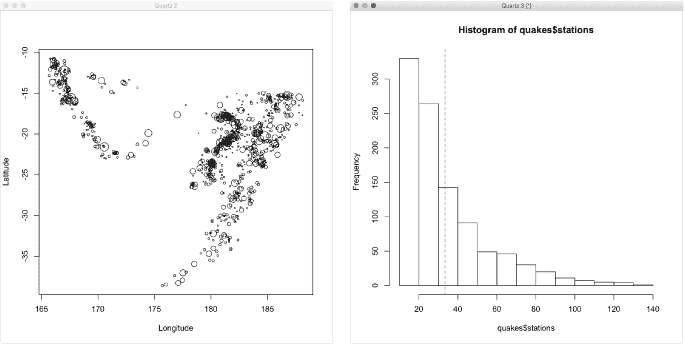

*图 23-1：我的两个可见图形设备，设备 2（左）和设备 3（右），显示生成和操作两个* `quakes` *数据图的最终结果*

#### ***23.1.3 关闭设备***

要关闭图形设备，可以像关闭任何窗口一样，点击鼠标上的 *X*，或者使用 `dev.off` 函数（你最初在 第八章 中看到过这个命令，用于关闭直接输出到文件的设备）。不带参数调用 `dev.off()` 会简单地关闭当前活动设备。否则，你可以像使用 `dev.set` 一样指定设备编号。要关闭空间位置图，保持直方图为活动设备，可以调用 `dev.off`，并传入 2 作为参数：

```
R> dev.off(2)
quartz
     3
```

然后重复调用不带参数的命令以关闭剩余的设备：

```
R> dev.off()
null device
          1
```

类似于`dev.set`，打印输出会告诉你在关闭一个设备后，哪个设备变为当前活动设备。当你关闭最后一个可用的可操作设备时，你会返回到空设备。

#### ***23.1.4 单个设备中的多个图形***

你还可以控制任何设备中图形的数量。有几种方法可以做到这一点；我将在这里描述两种最简单的方法。

##### **设置 mfrow 参数**

回想一下，`par`函数用于控制传统 R 图形的各种图形参数。`mfrow`参数指示一个新的（或当前活动的）设备“隐形”地将其自己划分为指定尺寸的网格，每个单元格包含一个图形。你传递给`mfrow`选项的是一个长度为 2 的数值整数向量，形式为`c(行数,列数)`；如你所猜测的那样，它的默认值是`c(1,1)`。

在你的 R 会话中，确保没有打开任何绘图窗口。现在，假设你希望将`quakes`数据的两个图形并排显示在同一设备中。你可以将`mfrow`设置为一个 1 × 2 的网格，向量为`c(1,2)`——一行图形和两列图形。

```
R> dev.new(width=8,height=4)
R> par(mfrow=c(1,2))
R> plot(quakes$long,quakes$lat,cex=0.02*quakes$stations,
        xlab="Longitude",ylab="Latitude")
R> hist(quakes$stations)
R> abline(v=mean(quakes$stations),lty=2)
```

第一行使用可选参数`width`和`height`来预设新设备的尺寸（单位为英寸），使其宽度是高度的两倍。图 23-2 显示了图像的显示方式，新图形的创建会根据`mfrow`的值填充可用的单元格。

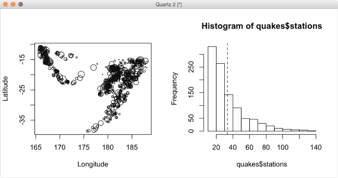

*图 23-2：使用* `mfrow` *在* `par` *中生成一个单一图形设备中的图形网格，显示`quakes`数据的两个图形*

如果你关闭了任何图形设备，并且在没有调用`dev.new`的前提下重新运行这段代码，执行`par(mfrow=c(1,2))`将自动打开一个默认大小为 7 × 7 英寸的图形设备。两个图形仍然会并排显示，但会被压缩。你可以手动使用鼠标调整设备大小，使其适应`mfrow`设置的值，然后当你重新绘制图形时，图形及其坐标轴会更清晰。你会发现，你会经常使用这种反复试验的方法来在一个设备中生成多个图形，尤其是在你不想显式调用`dev.new`以及设置`width`和`height`时。

请注意，任何这样使用`par`的操作将*仅*影响当前活动的设备。随后的`dev.new`调用会打开新的设备，举例来说，`mfrow`会被重置为默认的“仅一个图形”设置`c(1,1)`。换句话说，如果你想定制任何新图形设备（包括直接输出到文件的设备）的选项，你需要在打开设备之后、执行任何绘图命令之前设置所需的`par`值。

##### **定义特定的布局**

你可以使用`layout`函数来细化单个设备中图形的排列方式，它提供了更多的方法来个性化图形将要绘制的面板。

返回到`MASS`包中的学生调查数据`survey`。假设你想要展示三个统计图表——一个展示身高与写字手部跨度的散点图，一个展示按吸烟状态分组的身高箱线图，以及一个展示学生锻炼频率的条形图。如果你想将图表排列成一个方形设备（而不是三个图表的单行或单列），仅使用`mfrow`在`par`中可能无法达到最佳效果。你可以设置一个方形网格，使用`par(mfrow=c(2,2))`，但你会发现某个单元格会留下空白，因为没有图像分配给它。

使用`layout`时，你需要将矩阵`mat`作为第一个参数传入，这些参数控制一个看不见的矩形网格，就像控制`mfrow`选项一样。不同之处在于，你现在可以在`mat`中使用整数数字条目来告诉`layout`，哪个绘图编号将放置在哪里。请查看以下对象：

```
R> lay.mat <- matrix(c(1,3,2,3),2,2)
R> lay.mat
     [,1] [,2]
[1,]    1    2
[2,]    3    3
```

该矩阵的维度创建了一个 2 × 2 的绘图单元格网格，但`lay.mat`中的值告诉 R，你希望图 1 占据左上单元格，图 2 占据右上单元格，图 3 则扩展到两个底部单元格。

按如下方式调用`layout`，将根据`lay.mat`静默初始化活动设备，或者在当前唯一可用的空设备的情况下打开一个新的设备并初始化它。

```
R> layout(mat=lay.mat)
```

如果你对指定结果不确定，可以使用`layout.show`函数查看绘图如何布局。以下代码生成的图像位于图 23-3 的左侧。

```
R> layout.show(n=max(lay.mat))
```

然后，在你通过调用`library("MASS")`加载了`MASS`包以访问`survey`数据后，运行以下代码行，将图形按照绘图命令执行的顺序排列，并与`lay.mat`中的整数匹配。

```
R> plot(survey$Wr.Hnd,survey$Height,
        xlab="Writing handspan",ylab="Height")
R> boxplot(survey$Height~survey$Smoke,
        xlab="Smoking frequency",ylab="Height")
R> barplot(table(survey$Exer),horiz=TRUE,main="Exercise")
```

注意，如果你已经关闭了由`layout.show`产生的图形，那么你需要重新初始化一个新设备，并使用相同的`layout`调用，这样这三个图形才能按照预期显示。结果应该类似于图 23-3 的右侧。

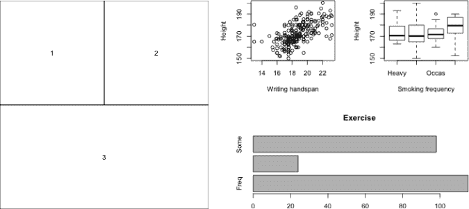

*图 23-3：左侧：使用*`layout.show`*可视化计划的绘图布局和顺序。右侧：展示三个根据*`lay.mat`*通过*`layout`*排列的*`survey`*数据的绘图。*

`layout`的最大好处之一是它能相较于使用`mfrow par`选项时，放松绘图单元格的固定性，正如你刚刚看到的那样。`layout`的其他参数，特别是`widths`和`heights`，甚至允许你预设`mat`参数中结构化的单元格的相对宽度和高度。有关详细信息，请参见`?layout`中的文档；你还可以在文件底部找到一些其灵活性的其他示例。

**注意**

*这里讨论的两种方法的一个不幸后果是，一旦完成了一个图形并进入下一个，就无法编辑之前的图形。有一个`split.screen`函数，允许你在一个设备中设置多个“屏幕”并在它们之间切换。然而，这种方法需要大量的额外编码，并且通常在绘图区域和边距（参见下一节）方面表现不佳。许多用户（包括我自己）更倾向于使用`layout`，即使这意味着需要通过一些试验和错误。*

### **23.2 绘图区域和边距**

尽管绘图时主要关注的数据集或模型是被可视化的对象，但同样重要的是确保图形的注释清晰准确，以便正确解读。为此，你需要知道如何操作和绘制给定设备上所有可见区域，而不仅仅是数据所在的区域。

对于任何使用基本 R 图形创建的单个图形，图像由三个区域组成。

*绘图区域*是你迄今为止处理的所有区域。这是你的实际图形出现的地方，也是你通常绘制点、线、文本等的地方。绘图区域使用*用户坐标系统*，它反映了水平和垂直坐标轴的值和刻度。

*图形区域*是包含坐标轴、坐标轴标签和标题空间的区域。这些空间也称为*图形边距*。

*外部区域*，也称为*外部边距*，是围绕图形区域的额外空间，默认情况下不包括在内，但如果需要，可以进行指定。

你可以通过几种不同的方式明确测量和设置边距空间。一种典型的方式是使用*行数*—具体来说，是能在每个边缘上并排显示的文本行数。你需要按照特定的顺序指定这些行数，作为一个长度为 4 的向量；四个元素分别对应四个边：`c(底部，左侧，顶部，右侧)`。图形参数`oma`（外部边距）和`mar`（图形边距）用于控制这些数量；像`mfrow`一样，它们通过调用`par`进行初始化，在你开始绘制任何新图形之前。

#### ***23.2.1 默认间距***

你可以通过在 R 中调用`par`来找到默认的图形边距设置。

```
R> par()$oma
[1] 0 0 0 0
R> par()$mar
[1] 5.1 4.1 4.1 2.1
```

你可以看到这里`oma=c(0, 0, 0, 0)`—默认情况下没有设置外部边距。默认的图形边距空间是`mar=c(5.1, 4.1, 4.1, 2.1)`—换句话说，底部有 5.1 行文本，左侧和顶部各有 4.1 行，右侧有 2.1 行。

为了说明这些区域，考虑图 23-4 左侧的图像，它是在一个新的图形设备中创建的，使用了以下代码：

```
R> plot(1:10)
R> box(which="figure",lty=2)
```

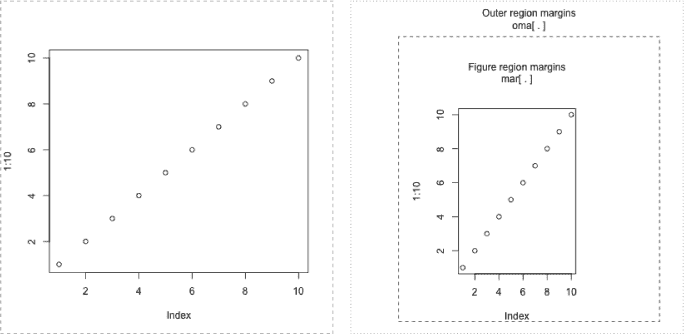

*图 23-4：展示传统（基本）R 图形设备区域的示例；实线框显示图表区域，虚线框显示图形区域，点线框显示外部区域。左：默认设置。右：用户通过* `par`* 指定的外部和图形边距区域，分别通过* `oma` *和* `mar` *指定“文本行数”。*

如果你使用 `box` 函数，并将可选参数 `which` 设置为 `"figure"`，它会显示图形区域（另外指定 `lty=2` 会绘制虚线）。

如果你在屏幕上的图形设备中查看这个图表，你会注意到虚线紧贴着窗口的边缘。查看 `mar` 的默认值，你可以看到，相对来说，它们正确地对应图表区域四个边的间距（由默认的实线框给出）。与图表区域底部平行的最宽图形边距为 5.1 行；与图表区域右侧平行的最窄图形边距为 2.1 行。

#### ***23.2.2 自定义间距***

让我们生成相同的图表，但使用定制的外部边距，使得底部、左侧、顶部和右侧区域分别为 1、4、3 和 2 行，而图形边距则分别为 4、5、6 和 7 行。以下代码的结果如 图 23-4 右侧所示。

```
R> par(oma=c(1,4,3,2),mar=4:7)
R> plot(1:10)
R> box("figure",lty=2)
R> box("outer",lty=3)
```

请注意，不规则的边距已将图表区域在默认的方形设备中压缩，以适应定义的边缘间距。如果你设置的图形参数将图表区域压缩到不存在，R 会抛出错误，提示 `figure margins too large`。

由于你通常需要调整边距空间以适应图表的特定注释，下面我们来看看 `mtext` 函数，它专门用于在图形或外部边距中生成文本。默认情况下，参数 `outer` 为 `FALSE`，意味着文本将写入图形边距。设置 `outer=TRUE` 则将文本定位到外部区域。如果你保持最新的图表打开，下面的几行代码将提供右侧显示的额外边距注释，见 图 23-4：

```
R> mtext("Figure region margins\nmar[ . ]",line=2)
R> mtext("Outer region margins\noma[ . ]",line=0.5,outer=TRUE)
```

在这里，你将你想要写入的文本作为第一个参数传递，而参数 `line` 指示文本距离内部边框的行数。`mtext` 中还有一个可选参数 `side`，它决定文本出现的位置。默认值为 `3`，将文本设置在顶部，但你可以设置 `side=1` 将文本放置在底部，使用 `side=2` 将其设置在左侧，使用 `side=4` 将其设置在右侧。详细信息可以查看 `?mtext`，了解更多可用于边距文本的参数。

你还可能想要研究现成的`title`函数，它是`mtext`的专门实现，通常用于当图形的四个轴的边缘注释（超出指定`main`、`xlab`或`ylab`等基本功能）是主要关注点时。

#### ***23.2.3 裁剪***

控制*裁剪*可以让你在参考图形自身的用户坐标时，在或向边缘区域绘制或添加元素。例如，你可能希望将图例放置在绘图区域外，或者你可能希望绘制一个箭头，延伸到绘图区域之外，以强调某个特定的观察点。

图形参数`xpd`控制基本 R 图形中的裁剪。默认情况下，`xpd`设置为`FALSE`，因此所有绘图仅限于可用的绘图区域（特殊的边缘添加函数，如`mtext`除外）。将`xpd`设置为`TRUE`，允许你在正式定义的绘图区域外绘制内容到图形边缘，但不能进入任何外部边缘。将`xpd`设置为`NA`，则允许在所有三个区域中绘制——绘图区域、图形边缘和外部边缘。

例如，查看图 23-5 中的图像，展示了按气缸数量划分的里程的并排箱线图，使用以下代码创建：

```
R> dev.new()
R> par(oma=c(1,1,5,1),mar=c(2,4,5,4))
R> boxplot(mtcars$mpg~mtcars$cyl,xaxt="n",ylab="MPG")
R> box("figure",lty=2)
R> box("outer",lty=3)
R> arrows(x0=c(2,2.5,3),y0=c(44,37,27),x1=c(1.25,2.25,3),y1=c(31,22,20),
          xpd=FALSE)
R> text(x=c(2,2.5,3),y=c(45,38,28),c("V4 cars","V6 cars","V8 cars"),
        xpd=FALSE)
```

这段代码的具体结果是图 23-5 中的左上图。我已为说明目的定义了设备区域本身，并为图形和外部边缘设置了特定的边距。通过在`boxplot`调用中使用`xaxt="n"`来抑制绘制水平轴；调用`box`函数添加图形和外部边缘的边界（分别为虚线和点线）。最后，调用`arrows`和`text`分别指向并注释每个箱线图；V4 车型的标签延伸到外部边距，V6 车型的标签延伸到图形区域，而 V8 车型的标签保持在绘图区域内。

请注意，图形参数`xpd`仅在两个“添加到当前绘图”函数`arrows`和`text`中指定，并显式设置为默认值`FALSE`。这意味着所有绘图都仅限于绘图区域。

如果你再次运行代码块，但现在在`arrows`和`text`的调用中将`xpd=TRUE`，你将得到图 23-5 右上角的图像。这允许 V6 车型的标签在边缘打印，而不是被截断。最后，重新运行代码并将`xpd=NA`，将生成图 23-5 中的下方图形，允许所有绘制内容超出绘图区域。

当你需要以某种方式注释主图时，这种效果通常是需要的，尤其是在图形区域没有足够空间添加内容时。我在前面章节创建的图形，例如 图 16-6 （图例位于主图之外，位于 第 349 页）和 图 17-3 （注释了关键值，位于 第 380 页），都是通过在相关函数（`legend`、`text`、`segments` 和 `arrows`）中指定 `xpd=TRUE` 来创建的。

如所示，通常你会在特定命令中设置 `xpd`（换句话说，是逐行设置），这样只有该特定命令的结果会按照给定的裁剪规则生成。这提供了更多控制，决定哪些内容能否显示在图形区域之外。不过，你也可以在初始调用 `par` 时，将 `xpd` 与 `oma` 和 `mar` 一起设置，使得 `xpd` 的值在该设备上“通用”。

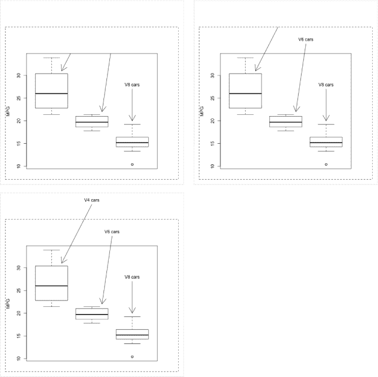

*图 23-5：展示设置* `xpd=FALSE` *(左上角，默认)，* `xpd=TRUE` *(右上角)，以及* `xpd=NA` *(底部)在相关绘图命令中启用根据用户坐标在图形区域内及外部边距绘制的行为*

### **23.3 点选坐标交互**

与图形设备的交互不一定仅限于命令方式。在典型情况下，R 可以读取你在设备内的鼠标点击。

#### ***23.3.1 静默检索坐标***

`locator` 命令允许你查找并返回用户坐标。要查看其工作原理，首先执行 `plot(1,1)` 来显示一个简单的图形，其中中央有一个点。要使用 `locator`，你只需执行该函数（默认行为下不传递任何参数），这会“挂起”控制台，直到返回提示符。然后，在一个活动的图形设备上，你的鼠标光标会变成一个+符号（你可能需要先点击一次设备，将其带到桌面前台）。在光标为+时，你可以在设备内执行一系列（左键）鼠标点击，R 会静默记录精确的用户坐标。要停止此操作，只需右键点击终止命令（其他停止方法取决于系统，并在帮助文件 `?locator` 中提及），一旦停止，设备中识别的坐标将作为包含 `$x` 和 `$y` 组件的列表返回。这些坐标会打印到控制台，除非你特别将 `locator` 的调用结果赋值给 R 对象。

在我的机器上，我在绘制点 (1,1) 周围的任意位置静默标识了四个点，顺时针从左上角到左下角。以下是打印到控制台的输出：

```
R> plot(1,1)
R> locator()
$x
[1] 0.8275456 1.1737525 1.1440526 0.8201909

$y
[1] 1.1581795 1.1534442 0.9003221 0.8630254
```

`locator` 的这种静默使用在你需要例如确定图形区域中大致的用户坐标，以便在未来放置注释时非常有用。

#### ***23.3.2 可视化选定的坐标***

你还可以使用`locator`将所选的点绘制为单独的点或线。运行以下代码会生成图 23-6：

```
R> plot(1,1)
R> Rtist <- locator(type="o",pch=4,lty=2,lwd=3,col="red",xpd=TRUE)
R> Rtist
$x
 [1] 0.5013189 0.6267149 0.7384407 0.7172250 1.0386740 1.2765699
 [7] 1.4711542 1.2352573 1.2220592 0.8583484 1.0483300 1.0091491

$y
 [1] 0.6966016 0.9941945 0.9636752 1.2819852 1.2766579 1.4891270
 [7] 1.2439071 0.9630832 0.7625887 0.7541716 0.6394519 0.9618461
```

使用`locator`进行绘图时，你需要指定绘图的`type`，详见第七章。选择`type="o"`（与默认的静默值`type="n"`不同）会在图 23-6 中生成重叠的点和线。仅绘制点时使用`type="p"`；仅绘制线时使用`type="l"`。控制其他相关特征的图形参数，如点/线类型和颜色，也可以使用，正如你在第七章中看到的常规绘图中所示。我还使用了`xpd=TRUE`，如前所示，这允许`locator`的点和/或线超出图形区域的边界。对`locator`的调用被直接赋值给一个新的对象`Rtist`，这演示了如果需要，你可以稍后使用点击的坐标。

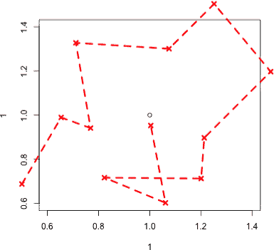

*图 23-6：使用* `locator` *绘制任意顺序的重叠点和线*

#### ***23.3.3 临时注释***

`locator`函数还允许你在绘图中放置临时注释，如图例——记住，由于`locator`返回的是有效的 R 用户坐标，这些结果可以直接作为大多数标准注释函数的位置信息。

返回到`MASS`包中的学生调查数据，首先通过调用`library("MASS")`来加载该包。以下代码会生成用来说明多个线性模型的散点图，模型将平均学生身高作为手掌宽度和性别的函数，详见第 21.3.3 节。

```
R> plot(survey$Height~survey$Wr.Hnd,pch=16,
        col=c("gray","black")[as.numeric(survey$Sex)],
        xlab="Writing handspan",ylab="Height")
```

对于第 21.3.3 节中的绘图（图 21-1 见第 495 页），我只是用字符串`"topleft"`来定位图例。这时，调用以下代码：

```
R> legend(locator(n=1),legend=levels(survey$Sex),pch=16,
          col=c("gray","black"))
```

`locator`的一个可选参数`n`接受一个正整数，用于设定你希望选择的最大点数；默认值为`512`。如果你指定`n=1`，`locator`将在你在设备上左键单击一次后自动终止，因此你不需要通过右键单击手动退出函数。

当代码执行时，+光标将出现在图形设备上，你只需要点击一次来选择图例的位置。我选择在点云的上方空白处点击，生成了图 23-7 中的图像。

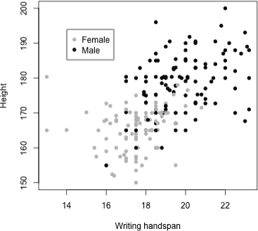

*图 23-7：在散点图中临时放置图例，数据来自* `survey` *数据集*

**练习 23.1**

1.  在第 20.5.4 节（第 478 页）中，我给出了一个简单的线性模型代码，展示了将类别预测变量当作连续变量拟合的情况（`mtcars`数据集，`mpg`为响应变量，`cyl`为解释变量）。请复现图 20-6 中的并排箱型图和散点图（带拟合线），但这次使用`mfrow`将这两张图以垂直列的形式在一个设备上呈现。

1.  创建适当的布局矩阵，以复现以下三个图（它们在一个方形设备中呈现）：

    1.  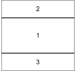

    1.  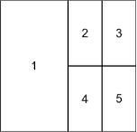

    1.  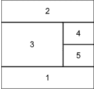

1.  通过打开一个尺寸为 9 × 4.5 英寸的新设备，设置以下布局：

    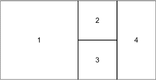

    然后，精确地生成以下组合图表：

    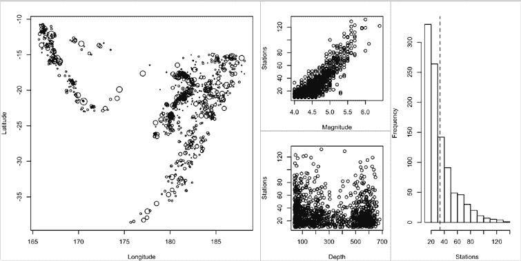

    为了实现这一点，请注意以下事项：

    – 打开设备并设置布局后，图表的边距应重置为底部、左侧、顶部和右侧分别为四行、四行、两行和一行的空间。

    – 在每个图表之后，添加一个对应于图形区域的灰色框，以实现可见的分区。

    – 图表 1 和图表 4 与图 23-1 和图 23-2 中显示的两张图相同。

    – 图表 2 和图表 3 是散点图，分别显示了检测站的数量（*y*轴），以及震级和深度（*x*轴）。

    – 不要在任何图表上放置主标题，确保坐标轴标题整洁（即，与默认设置相比）。

1.  编写一个小的 R 函数，命名为`interactive.arrow`。该函数的目的是通过鼠标点击两次，在任何基础 R 图形上叠加一个箭头。具体细节如下：

    – 你函数的关键是使用`locator`来读取恰好两次鼠标点击。你可以假设每次调用该函数时，合适的活动图形设备已经打开。第一次点击应表示箭头的起点，第二次点击应表示箭头的箭头尖端（即它指向的位置）。

    – 在函数中，`locator`返回的坐标应传递给`arrows`，以进行实际绘图。

    – 该函数应该将省略号作为第一个参数，用于传递直接给`arrows`的附加参数。

    – 该函数应接受一个可选的逻辑参数`label`，其默认值为`NA`，但应打算传入一个可选的字符字符串。如果`label`不是`NA`，那么在绘制箭头后，`locator`应该再次被调用（单独调用）来选择一个精确的坐标。该点将传递给`text`，以便用户可以将传入`label`的字符字符串作为注释（预计是用于交互式放置的箭头）。对`text`的调用应该始终允许完全放松裁剪（换句话说，以这种方式添加的任何文本仍然会在图形区域和外部边距中可见，如果有的话）。

    再看一眼第 14-6 图中最右侧的绘图，第 298 页的 `quakes` 数据框中的震幅数据的独立箱线图。箭头和标签被外部叠加，指向箱线图总结的各种统计信息。创建相同的箱线图，并使用`interactive.arrow`来标注相同的特征，直到你满意为止（你可能需要使用省略号来放松每个箭头的裁剪）。我的结果如下所示：

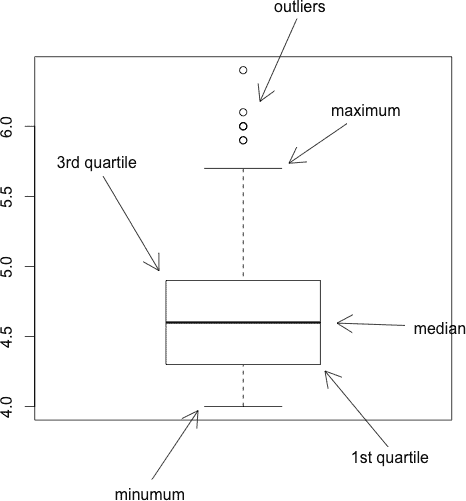

### **23.4 自定义传统的 R 绘图**

现在你已经熟悉了 R 在图形设备中放置和处理图形的方式，是时候关注图形的常见特征了。到目前为止，你大多数情况下都保持了默认设置。

#### ***23.4.1 用于样式和抑制的图形参数***

如果你想对 R 绘图进行更精细的控制，通常你需要从一个“干净的画布”开始。为此，你需要了解在调用绘图函数时某些图形参数的默认设置，以及如何抑制诸如框线和坐标轴等元素。这就是你开始的地方。

作为示例图像，让我们将 MPG 与马力（来自现成的`mtcars`数据集）进行绘制，并将每个绘制点的大小设置为与每辆车的重量成比例。为了方便起见，创建以下对象：

```
R> hp <- mtcars$hp
R> mpg <- mtcars$mpg
R> wtcex <- mtcars$wt/mean(mtcars$wt)
```

最后一个对象是按样本均值缩放的汽车重量向量。这会创建一个向量，其中小于平均重量的汽车值小于 1，大于平均重量的汽车值大于 1，使得它非常适合用于`cex`参数来相应地缩放绘制点的大小（参见第七章）。

让我们首先关注一些通常在首次调用`plot`时使用的图形参数，为使用`box`和`axis`命令铺平道路。执行以下代码将给出绘图的默认外观以及它的框线、坐标轴和标签；这在第 23-8 图中的最左侧图像中显示。

```
R> plot(hp,mpg,cex=wtcex)
```

有两种坐标轴“样式”，由图形参数`xaxs`和`yaxs`控制。它们的唯一目的是决定是否在每个坐标轴的末端加上少量的水平和垂直缓冲空间，以防止数据点被截断。默认设置`xaxs="r"`和`yaxs="r"`会包括这些空间。另一种选择是将其中一个或两个设置为`"i"`，指示绘图区域*严格*由数据的上下限（或由`xlim`和/或`ylim`可选提供的限值）定义，也就是*没有*额外的填充空间。

例如，下面这行代码会生成图 23-8 中的中间图。

```
R> plot(hp,mpg,cex=wtcex,xaxs="i",yaxs="i")
```

这个图与默认设置几乎相同，但请注意，现在坐标轴的末端没有填充空间；最极端的数据点正好位于坐标轴上。通常情况下，默认的坐标轴样式`"r"`是可以的，但在需要对坐标轴的刻度和相应的绘图区域进行更精细控制的情况下，额外的缓冲空间可能会带来问题。在这些情况下，你通常会看到`xlim`/`ylim`与`xaxs="i"`/`yaxs="i"`一起使用。

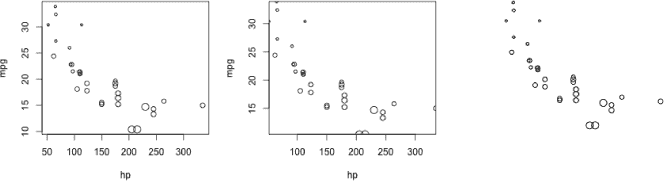

*图 23-8：绘制`mtcars`数据集中的马力与英里每加仑的关系；点的大小与汽车重量成比例，仅使用`plot`进行绘制。左：默认外观。中：设置`xaxs="i"`和`yaxs="i"`，以防止坐标轴末端的缓冲空间。右：使用`xaxt`、`yaxt`、`xlab`、`ylab`和`bty`来抑制所有框架、坐标轴和标签的绘制（也可以通过设置`axes=FALSE`和`ann=FALSE`来实现）。*

如果你希望完全控制任何框架、坐标轴及其标签的具体外观，你可以从不添加这些元素的绘图开始，然后根据设计逐步添加。图 23-8 中的最右侧图即是通过调用来抑制这些默认绘制的结果。

```
R> plot(hp,mpg,cex=wtcex,xaxt="n",yaxt="n",bty="n",xlab="",ylab="")
```

或者

```
R> plot(hp,mpg,cex=wtcex,axes=FALSE,ann=FALSE)
```

你可以通过将参数`xaxt`、`yaxt`和`bty`设置为`"n"`，并将默认的坐标轴标签`xlab`和`ylab`设置为空字符串`""`，或者简单地将`axes`和`ann`都设置为`FALSE`来实现这一点（前者抑制所有坐标轴和框架，后者抑制所有注释）。尽管第一种方式看起来可能有些复杂，但它能提供更大的灵活性，允许你逐个抑制给定绘图的每个方面（与第二种方法通过“完全”抑制来实现不同）。

#### ***23.4.2 自定义框架***

当你从一个抑制框或抑制坐标轴的图开始时，要在当前活动图形设备的图形区域中添加特定的框，你可以使用`box`并通过`bty`指定其类型。例如，如果你从像图 23-8 右侧那样的图开始（只需运行最新一行代码即可得到此图），那么再调用以下代码将会给你呈现图 23-9 左侧的图像。

```
R> box(bty="u")
```

`bty`参数接受一个单一字符值：`"o"`（默认值）、`"l"`、`"7"`、`"c"`、`"u"`、`"]"`或`"n"`。在`?par`的帮助文件中，`bty`的条目告诉你，基于这些值之一，结果框的边界将遵循相应大写字母的外观，`"n"`除外（正如你刚才看到的，它将抑制框的显示）。

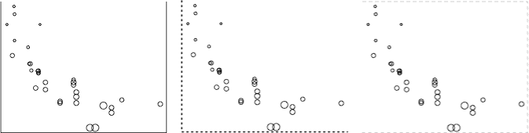

*图 23-9: 向`mtcars`散点图添加的各种框配置*

你可以使用之前学过的其他相关参数，如`lty`、`lwd`和`col`，进一步控制框的外观。重新绘制数据，如图 23-8 右侧所示，然后调用以下代码可以生成图 23-9 中间的图像：

```
R> box(bty="l",lty=3,lwd=2)
```

图 23-9 右侧的最终示例是通过以下代码创建的：

```
R> box(bty="]",lty=2,col="gray")
```

#### ***23.4.3 自定义坐标轴***

一旦你将框调整到你想要的样子，你就可以专注于坐标轴了。`axis`函数允许你更详细地控制在图形区域的四个边上添加和显示坐标轴。它的第一个参数是`side`，并接受一个单一的整数：`1`（底部）、`2`（左侧）、`3`（顶部）或`4`（右侧）。这些数字与设置图形参数向量（如`mar`）时相关的边距间隔值的位置一致。

你可能想要在坐标轴上首先改变的是刻度标记的位置。默认情况下，R 使用内置函数`pretty`来找到每个坐标轴尺度的“整洁”值序列，但你也可以通过传递`at`参数到`axis`来设置自己的刻度标记。以下代码生成了图 23-10 左侧的图。

```
R> hpseq <- seq(min(hp),max(hp),length=10)
R> plot(hp,mpg,cex=wtcex,xaxt="n",bty="n",ann=FALSE)
R> axis(side=1,at=hpseq)
R> axis(side=3,at=round(hpseq))
```

首先，存储了一个均匀分布的 10 个值的序列，这些值跨越了`hp`的范围，并命名为`hpseq`。初始的`plot`调用抑制了*x*轴、框架和任何默认的轴标签；然而，*y*轴仍然按默认方式显示。接着，`axis`被指示在*x*轴上绘制（`side=1`），并在`hpseq`的位置绘制刻度标记。为了与之对比，还会在顶部（`side=3`）绘制一个坐标轴，但这次刻度标记是根据`hpseq`四舍五入到最接近的整数后绘制的。

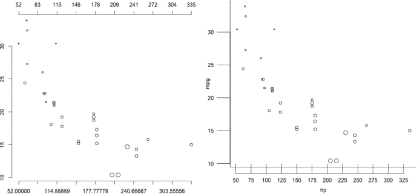

*图 23-10: 自定义`mtcars`散点图的坐标轴*

如图左侧所示，我在底部创建的自定义 *x* 轴显示了 `at` 提供的值序列中的 10 个刻度标记。R 可能会抑制一些标签，以避免它们相互重叠，这就是此处发生的情况。由于这些“十进制”值可能不太符合美观，沿顶部绘制的坐标轴则在 `hpseq` 的最接近整数位置绘制了刻度标记，这是通过在前面显示的最终 `axis` 调用中的 `round` 函数实现的。严格来说，这意味着刻度标记不再完全均匀分布，但通过四舍五入，默认的坐标轴标签更短，可以在当前设备中完全显示。

从这些困难中可以看出，刻度标记的位置通常最好交给 R 来处理，除非你有特定的坐标值并且明确知道要标记出来——你将在第 23.6 节看到这个例子的展示。现在，让我们看一下你可以对坐标轴进行的一些其他调整。特别是，`tcl`（刻度线的长度）、`las`（标签的方向）和 `mgp`（坐标轴的间距）这几个参数无疑是最常用的。以下代码创建了图 23-10 右侧的图表。

```
R> hpseq2 <- seq(50,325,by=25)
R> plot(hp,mpg,cex=wtcex,axes=FALSE)
R> box(bty="l")
R> axis(side=2,tcl=-2,las=1,mgp=c(3,2.5,0))
R> axis(side=1,at=hpseq2,tcl=1.5,mgp=c(3,1.5,1))
```

定义一个新的序列—`hpseq2`—它包含所有落在数据记录范围内且相隔 25 个单位的整数后，图表被初始化。盒子和坐标轴被隐藏，但默认的变量标题（`mpg` 和 `hp`）仍然沿着坐标轴显示。

现在，添加了一个 L 形的框和 *y* 轴（`side=2`）。在后者中，`tcl` 参数控制每个刻度线在“平行文本行”中的长度（请回想，这是 R 图表中边距间隔的标准单位测量）；它的默认值是 `-0.5`。当值为负时，它会将刻度线绘制到图表区域外；当值为正时，刻度线则会绘制到图表内部。对于这个 `side=2` 轴，`tcl=-2`，意味着刻度线会从图表外侧指向，但长度是通常的四倍（相当于两整行文本，而不是半行文本）。

`las` 参数控制每个刻度标签的方向；将其设置为 `1` 指示 R 将所有刻度标签 *水平* 显示，无论坐标轴在哪一侧。默认值 `las=0` 会将所有标签 *与相应的坐标轴平行*；另一种选择 `las=2` 表示标签总是 *垂直* 显示，且与坐标轴垂直；使用 `las=3` 则会将所有标签设置为 *垂直* 显示，无论坐标轴位置如何。

接下来，`mgp` 参数控制轴间距的三个方面，因此它被提供一个长度为 3 的向量，定义如下：`c(轴标题, 轴标签, 轴线)`。这些参数仍然以“文本行”表示。`mgp` 的默认值为 `c(3,1,0)`——这意味着，在你看到的每个轴中，标题距离绘图区域有三行文本，刻度标签距离绘图区域一行文本，而轴线本身距离绘图区域没有文本行（即它与任何绘制的绘图区域框对齐）。当在 `axis` 中使用时，只有 `mgp` 的第二个和第三个元素是相关的。在 图 23-10 右侧的绘图中，垂直轴唯一的变化是将第二个元素（轴标签的间距）设置为 `2.5`——将轴标签推向左侧，远离绘图区域。刻度标记本身由于 `tcl` 被显著延长，因此需要进行此调整，以避免轴刻度标签穿过这些刻度。尝试重新绘制图像和该轴，但不指定 `mgp`，你将看到不太理想的效果。

移动到 *x* 轴（`side=1`），你可以看到 `hpseq2` 上的刻度标记通过 `at` 被放置。这一次，向 `tcl` 提供了一个正值，指示轴线具有 *向内* 的刻度标记，长度为 1.5 行文本。在 `mpg` 中，注意向量的第三个元素现在设置为 `1`，意味着你希望轴线本身距离绘图区域一行文本的距离。看向 图 23-10 的右侧，你可以看到整个轴线已被向下移动，远离绘图区域。为了适应这种刻度标记标签的间距，`mgp` 的第二个元素已稍微增大，从默认值调整为 `1.5`。

### **23.5 专门的文本和标签表示法**

接下来，你将探讨一些可以立即使用的工具，用于控制字体和显示特殊符号，如希腊字母和数学表达式。

#### ***23.5.1 字体***

显示字体由两个图形参数控制：`family`（特定字体系列）和 `font`（控制粗体和斜体的整数选择器）。

可用字体取决于你的操作系统和你使用的图形设备。不过，有三种通用字体系列——`"sans"`（默认字体）、`"serif"` 和 `"mono"`——是始终可用的。这些字体系列可以与 `font` 的四个可能值配合使用——`1`（正常文本，默认）、`2`（粗体）、`3`（斜体）和 `4`（粗体和斜体）。你可以通过 `par` 为设备统一设置这两个图形参数，但像使用 `xpd` 一样，在相关的注释函数中设置 `family` 和 `font` 同样常见（如果不是更常见的话）。

图 23-11 展示了几种变体，并显示了相应的`family`和`font`值。要创建它，从一个带有预设*x*和*y*坐标范围的空白图区域开始，使用以下代码：

```
R> par(mar=c(3,3,3,3))
R> plot(1,1,type="n",xlim=c(-1,1),ylim=c(0,7),xaxt="n",yaxt="n",ann=FALSE)
```

然后，通过执行以下几行代码，完成了六种可能的变体图像：

```
R> text(0,6,label="sans text (default)\nfamily=\"sans\", font=1")
R> text(0,5,label="serif text\nfamily=\"serif\", font=1",
        family="serif",font=1)
R> text(0,4,label="mono text\nfamily=\"mono\", font=1",
        family="mono",font=1)
R> text(0,3,label="mono text (bold, italic)\nfamily=\"mono\", font=4",
        family="mono",font=4)
R> text(0,2,label="sans text (italic)\nfamily=\"sans\", font=3",
        family="sans",font=3)
R> text(0,1,label="serif text (bold)\nfamily=\"serif\", font=2",
        family="serif",font=2)
R> mtext("some",line=1,at=-0.5,cex=2,family="sans")
R> mtext("different",line=1,at=0,cex=2,family="serif")
R> mtext("fonts",line=1,at=0.5,cex=2,family="mono")
```

在这里，`text`用于在预定的坐标处放置内容，`mtext`则用于将内容添加到顶部图形的边距中。

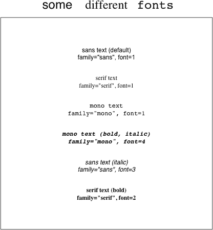

*图 23-11：通过使用* `family` *和* `font` *图形参数显示字体样式*

#### ***23.5.2 希腊字母***

对于统计或数学技术绘图，注释有时需要使用希腊字母或数学标记。你可以使用`expression`函数来显示这些内容，它除了其他功能外，还能调用 R 的`plotmath`模式（Murrell 和 Ihaka，2000; Murrell，2011）。使用`expression`返回一个特殊的对象，其类名相同，随后可以将该对象传递给任何需要字符字符串的绘图函数的参数。

目前我们集中讨论希腊字母，请参见图 23-12，它是通过以下代码生成的：

```
R> par(mar=c(3,3,3,3))
R> plot(1,1,type="n",xlim=c(-1,1),ylim=c(0.5,4.5),xaxt="n",yaxt="n",
        ann=FALSE)
R> text(0,4,label=expression(alpha),cex=1.5)
R> text(0,3,label=expression(paste("sigma: ",sigma," Sigma: ",Sigma)),
        family="mono",cex=1.5)
R> text(0,2,label=expression(paste(beta," ",gamma," ",Phi)),cex=1.5)
R> text(0,1,label=expression(paste(Gamma,"(",tau,") = 24 when ",tau," = 5")),
        family="serif",cex=1.5)
R> title(main=expression(paste("Gr",epsilon,epsilon,"k")),cex.main=2)
```

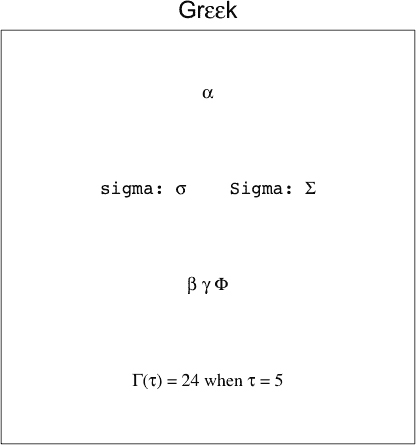

*图 23-12：使用* `expression` *显示希腊字母*

如果你只想单独显示一个特殊字符，那么像`expression(alpha)`这样的写法就足够了，它会在图中显示*β*，如代码片段中的第一次调用`text`所示。请注意，特殊字符的指定是*没有*引号的，直接使用所需符号的名称。然而，更常见的情况是你希望字符与其他组件一起出现，比如常规文本或在公式中。为此，你需要在`expression`的调用中使用`paste`，用逗号分隔各个组件。它们在后面三次调用`text`中得以体现。

你可以使用`cex`来控制大小，尽管`family`和`font`的使用仅影响普通文本（引用的文本），而不影响符号，正如最后一次调用`text`所示。

然后使用`title`函数，它允许你添加轴标题和主标题，通过提供相应的`expression`给`main`来添加标题“Gr*ɛɛ*k”。在同一次调用中，我使用了`cex.main=2`来将其大小加倍（稍有不同的标签`cex.main`在这里是必需的，用来区分主标题的大小与轴标题的大小，后者由`cex.lab`控制）。

#### ***23.5.3 数学表达式***

格式化整个数学表达式以在 R 绘图中显示稍微复杂一些，且让人联想到使用 LAT[E]X 等标记语言。由于这个原因，我在这里不会详细介绍所需的语法，但我会提供一些可能的示例，如图 23-13 所示。为了创建该图像，我首先定义了四个表达式对象，如下所示：

```
R> expr1 <- expression(c²==a[1]²+b[1]²)
R> expr2 <- expression(paste(pi^{x[i]},(1-pi)^(n-x[i])))
R> expr3 <- expression(paste("Sample mean: ",
                             italic(n)^{-1},
                             sum(italic(x)[italic(i)],
                                 italic(i)==1,
                                 italic(n))
                             ==frac(italic(x)[1]+...+italic(x)[italic(n)],
                                    italic(n))))
R> expr4 <- expression(paste("f(x","|",alpha,",",beta,
                             ")"==frac(x^{alpha-1}~(1-x)^{beta-1},
                                       B(alpha,beta))))
```

然后我在以下代码中使用了它们：

```
R> par(mar=c(3,3,3,3))
R> plot(1,1,type="n",xlim=c(-1,1),ylim=c(0.5,4.5),xaxt="n",yaxt="n",
        ann=FALSE)
R> text(0,4:1,labels=c(expr1,expr2,expr3,expr4),cex=1.5)
R> title(main="Math",cex.main=2)
```

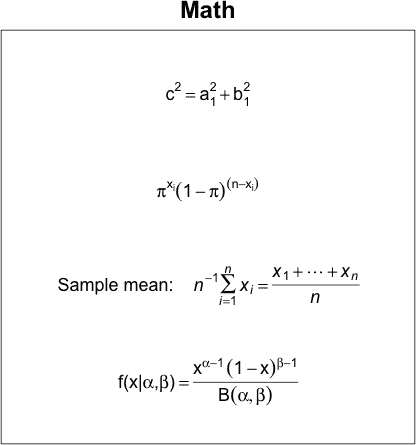

*图 23-13：在 R 绘图中排版数学表达式的一些示例*

所有的希腊字母和数学标记都包含在对`expression`的调用中。如果需要分离的组件（由逗号分隔），其中一些可能是常规文本（即需要用引号包围的内容），则必须使用`paste`来生成最终结果。以下是一些关键的注意事项：

• 上标由`^`表示，下标由`[ ]`表示；例如，`c²`在`expr1`中提供 c²，而`a[1]²`组件提供如图所示的内容：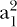.

• 你可以使用圆括号`( )`将组件分组，这些圆括号是可见的（例如，`expr2`中的`(1-pi)^(n-x[i])`组件），或者使用大括号`{ }`，这些大括号不可见（例如，`pi^{x[i]}`组件）。

• 斜体字母变量使用`italic()`绘制；例如，`italic(n)`在`expr3`中产生*n*。

• 常见的算术操作符构造已经存在，如`sum( , , )`和`frac( , )`；例如，在`expr3`中，调用`sum(italic(x)[italic(i)],italic(i)==1,italic(n))`会生成一个看起来像这样的结果：

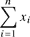

而`frac(italic(x)[1]+...+italic(x)[italic(n)],italic(n))`则生成如下表达式：

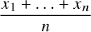

• 还有其他标记工具用于正确格式化表达式，例如将引号中的常规文本与数学标记直接结合，并在组件之间创建空格而无需插入引号。这些需求取决于标记内容的位置（换句话说，作为`paste`调用的独立组件，或者作为操作符工具如`frac`的组件）。例如，查看`expr4`中的`")"==frac( , )`部分，以及通过`~`符号在`x^{alpha-1}~(1-x)^{beta-1}`之间分隔空格（这些位于分数的分子部分）。

R 中内置了大量的功能来进行此类字符串格式化，以便在图形显示中使用，这里没有涉及。如果你有兴趣查看更多内容，可以通过在提示符下输入`?plotmath`来访问帮助文件作为第一步。另外，R 中还有一个非常有用的演示，你可以通过输入`demo(plotmath)`来查看，它展示了许多可能的功能，以及`expression`的相关语法。

### **23.6 完整注释的散点图**

为了提供一个包含你迄今为止所考虑的大部分概念的最终示例，让我们创建一个详细的 MPG 与马力数据的散点图，该数据在 23.4.1 节到 23.4.3 节中使用。 图 23-14 中的图像展示了最终结果，底部是最大的图，而顶部是三个较小的中间图，展示了不同制作阶段。

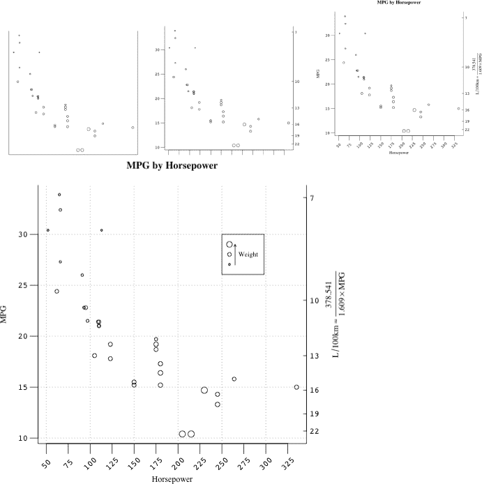

*图 23-14：一个详细的*`mtcars`*散点图，展示了 MPG 与马力的关系，点的大小与重量成比例*

首先，确保你的工作空间中有`mpg`、`hp`、`wtcex`和`hpseq2`对象（在第 23.4.1 节和第 23.4.3 节中定义），因为你将使用它们来简化代码长度。这里它们再次列出：

```
R> hp <- mtcars$hp
R> mpg <- mtcars$mpg
R> wtcex <- mtcars$wt/mean(mtcars$wt)
R> hpseq2 <- seq(50,325,by=25)
```

图形，具有稍微宽一点的右边距和 U 形框，通过以下代码开始：

```
R> dev.new()
R> par(mar=c(5,4,4,4))
R> plot(hp,mpg,cex=wtcex,axes=FALSE,ann=FALSE)
R> box(bty="u")
```

这提供了图 23-14 的左上角图像。我使用了`dev.new`在我的计算机上显式打开了一个新的图形设备，默认大小为 7 × 7 英寸。如果你想，可以使用`dev.new`提供的`width`和`height`参数来改变设备的大小。

现在添加一些坐标轴：

```
R> axis(2,las=1,tcl=-0.8,family="mono")
R> axis(1,at=hpseq2,labels=FALSE,tcl=-1)
```

这两行代码为 MPG 添加了左侧垂直坐标轴；通过`tcl`稍微延长了刻度线，使用`las`将刻度标签设置为水平，并请求使用`"mono"`字体。对于水平坐标轴（马力），在`hpseq2`中的值处绘制了更长的外部刻度线，但通过设置`labels=FALSE`将其标签隐藏。稍后你将填充这些标签。

很多国家并不使用 MPG 作为燃油效率的度量，而是使用“每百公里的升数”（L/100km）。因此，为了方便他们，假设你希望在图表的右侧提供第二个垂直坐标轴，标明 L/100km。为此，你需要转换公式。基于美国加仑，以下是两者之间的近似转换：

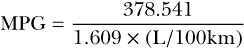

结果表明这个函数是*自反的*。也就是说，从 MPG 转换回 L/100km，只需在公式中交换这两个变量。

根据观察到的 MPG 数据的范围，我对转换公式进行了一些实验，得到了一个合理的 L/100km 值集合，用来标记右侧坐标轴。

```
R> L100 <- seq(22,7,by=-3)
R> L100
[1] 22 19 16 13 10 7
```

请注意，这些坐标轴是按降序排列的，为了方便起见，因为一旦你将这些值转换为 MPG，结果将是递增的：

```
R> MPG.L100 <- (100/L100*3.78541)/1.609
R> MPG.L100
[1] 10.69385 12.38236 14.70405 18.09729 23.52648 33.60925
```

这是有道理的——L/100km 的数字越小，意味着汽车的燃油效率越高。

为什么需要这些数字的 MPG 版本呢？嗯，记住，图形本身是基于 MPG 刻度的，因此为了指示 R 在右侧标出适当的刻度线，你需要 MPG“坐标系”中的 L/100km 值。

完成这些后，再次调用`axis`，你就得到了图 23-14 的顶部中间图像。

```
R> axis(4,at=MPG.L100,labels=L100,las=1,tcl=0.3,mgp=c(3,0.3,0),family="mono")
```

这里特别值得注意的是，你使用了`at`来指定 MPG 刻度上的刻度线位置，位置在`MPG.L100`的值处，但由于它们对应于`L100`中的 L/100km 序列，因此你实际提供给`labels`的是后者向量，以便正确标记这些刻度线。

接下来，是时候为坐标轴添加一些标题，并为水平坐标轴上的刻度线提供标签了。在此之前，构建一个`expression`用于 MPG 到 L/100km 的转换，以便澄清右侧垂直坐标轴。

```
R> express.L100 <- expression(paste(L/100,"km"%~~%frac(378.541,1.609%*%MPG)))
```

在`express.L100`中，`%~~%`表示“约等于”符号（≈），而`%*%`表示显式的乘法符号（×）。

然后，运行以下代码行，你就可以在图 23-14 中看到右上方的图像。

```
R> title(main="MPG by Horsepower",xlab="Horsepower",ylab="MPG",
         family="serif")
R> mtext(express.L100,side=4,line=3,family="serif")
R> text(hpseq2,rep(7.5,length(hpseq2)),labels=hpseq2,srt=45,
        xpd=TRUE,family="mono")
```

第一行提供了主标题以及`x`和`y`轴的标题，采用了`"serif"`样式。接着，`mtext`将刚刚创建的算术表达式的`"serif"`版本放置在右轴的适当位置（`side=4`），`line=3`。第三行将`"mono"`样式的刻度标签放置在`hpseq2`上，沿着`x`轴按适当的用户坐标和竖直位置`7.5`放置（经过一些反复试验）。由于你使用`text`在图形边距中绘制文本，你必须将`xpd`设置为`TRUE`。`text`特有的可选图形参数`srt`允许你旋转标签，在这里它们被旋转了`45`度。

现在，你已经准备好对图表进行最后的修饰了。到目前为止，点的大小按照汽车重量的比例被忽略了。提供至少一些关于这一点以及其他有助于解释关系的特征（尤其是考虑到有两个垂直坐标轴）的信息会很有帮助，比如叠加的网格。

在这样的图表上叠加网格非常简单。

```
R> grid(col="darkgray")
```

你可以使用可选参数`nx`和`ny`分别指定水平和垂直坐标轴的单元格数；如果不指定，R 会在默认的*x*-和*y*-轴刻度位置绘制网格线（正如我在这里所做的）。其他美学效果可以按照常规方法通过`col`（颜色）和`lty`（线型）等参数进行修改。

有趣的部分是现在尝试通过汽车的重量来计算绘制点的大小。你可以通过多种方式实现这一点。在这个最后的示例中，我将直接操作`legend`函数，以便生成图形。以下三行代码提供了最终结果。

```
R> legend(250,30,legend=rep("           ",3),pch=rep(1,3),pt.cex=c(1.5,1,0.5))
R> arrows(265,27,265,29,length=0.05)
R> text(locator(1),labels="Weight",cex=0.8,family="serif")
```

图例被放置在用户坐标（250,30）处，包含三个默认`pch`类型为`1`的点——一个大点，一个标准点，一个小点——使用`pt.cex`分别设置为`1.5`、`1`和`0.5`。我并没有通过`legend`参数为这三个点写标签，而是将它们设置为空字符串，由 10 个空格组成。这样做的结果是扩大了图例周围的框，腾出空间给三个点添加的内容——一个朝上的小箭头和单词*Weight*。找到合适的用户坐标以便箭头能够适应人为创建的空白图例框需要一些反复试验，最后通过调用交互式`locator`函数（正如你在第 23.3 节中看到的）来放置“Weight”文字。

使用 R 功能制作这种复杂的图形是学习如何处理语言的传统图形功能的一个很好的起点。通过反复试验和一些小技巧来达成最终结果并不罕见，尽管当然，这种方式会影响代码的健壮性。例如，即使适度地调整图形设备的大小，并尝试重新绘制前面展示的 `mtcars` 散点图，可能会导致图例中箭头的不对齐。如果你想了解更多内容，关于 R 图形的权威参考书是 Murrell (2011)，这是一本很好的教材，适合在你掌握了此处讨论的基础知识后，深入了解 R 中所有与图形相关的内容。

**练习 23.2**

对于以下任务，你将使用 Chu (2001) 分析的钻石定价数据。你需要有互联网连接来完成此操作。读取数据并像之前一样命名列：

R> dia.url <- "http://www.amstat.org/publications/jse/v9n2/4cdata.txt"

R> diamonds <- read.table(dia.url)

R> names(diamonds) <- c("克拉","颜色","清晰度","证书","价格")

1.  打开一个新的图形设备，大小为 6 × 6 英寸。将图形区域的边距设置为底部、左侧、顶部和右侧分别为零行、四行、二行和零行。然后，完成以下操作：

    1.  生成并排的箱线图，展示以认证分类的钻石价格（单位：新加坡元 SGD$）。隐藏所有坐标轴和周围的框架—请注意，`boxplot` 命令需要设置 `frame=FALSE` 来隐藏框架（而不是 `plot` 中的 `bty="n"`）。使用相同的命令为图形添加合适的标题。

    1.  接下来，插入一个垂直轴。该轴的刻度范围从 SGD$0 到 SGD$18000，步长为 SGD$2000。然而，轴应当被裁剪到绘图区域内。刻度线应指向轴内，并且长度为一行。轴标签应距离轴线半行，并且应水平显示。

    1.  最后，使用 `locator` 和 `text` 结合来添加一个合适的标题，位于 *y* 轴的顶部；请注意，裁剪需要被放宽。使用相同的方法向每个箱线图内添加文本，表示相应的认证（如 GIA、HRD 或 IGI）。

        我的绘图版本如下所示：

        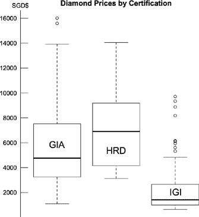

1.  现在，打开一个新的图形设备，大小为 8 × 7 英寸。将图形的边距设置为底部、左侧、顶部和右侧分别为两行、五行、三行和五行。还要在底部以外的每一侧留出一行外边距空间，而底部则应有两行外边距。

    1.  绘制一个散点图，将钻石价格放在纵轴上，克拉重量放在横轴上。使用红色、绿色和蓝色根据认证区分点。初始图中抑制所有轴线、框框、标签和标题，但随后添加一个 U 形框。

    1.  添加横轴。使用`axis`在 0.2 到 1.1 之间的克拉值上，以 0.1 为步长，均匀地放置刻度标记。为标签使用粗体、斜体、无衬线字体，并将标签调整为离轴线仅半行的距离。然后，在现有的刻度标记之间添加更小的、朝外的刻度标记。为此，第二次调用`axis`函数，将刻度放置在 0.15 到 1.05 之间的值上，步长为 0.1。将这些次级刻度标记的长度设置为四分之一行，并抑制轴标签。

    1.  添加纵轴。左侧的刻度应出现在 SGD$1000 到 17000 之间。标签应水平可读，并与横轴使用相同的字体风格。右侧的轴刻度应以美元（USD$）为单位，范围是 USD$1000 到 11000，步长为 USD$1000，并应标注为 USD$。为此，使用转换公式 USD$ = 1.37 × SGD$。标签方向和字体应与其他轴匹配。

    1.  对数据的克拉重量进行二次多项式的线性模型拟合。为一系列克拉值提供该模型的预测，跨越观测值的范围；包括 95%的预测区间估计。利用这些信息在散点图上叠加灰色实线表示拟合值，并用灰色虚线表示预测区间。

    1.  设置表达式对象，用于标注大约的美元转换和回归方程。将转换命名为`expr1`，它应类似于 USD$ ≈ 1.37 × SGD$。回归方程应类似于 Price = *β[0]* + *β*[1]Carat + *β*[2]Carat²；将其命名为`expr2`。

    1.  使用`mtext`添加适当的主标题以及三个单独坐标轴的标题。你可能需要稍微调整每个标题的行深度，以及是否在外边距或图形边距中书写，具体取决于你的间距偏好。最右边的轴标题应使用`expr1`。

    1.  可以通过试错找到合适的坐标，或者使用第 23.1 节练习中的`interactive.arrow`函数，放置一个指向拟合多项式回归线的箭头，并用`expr2`进行标注。

    1.  最后，使用`locator`调用将图例放置在任何合适的位置，参考根据认证标识的点的颜色。

        我的图表看起来是这样的：

        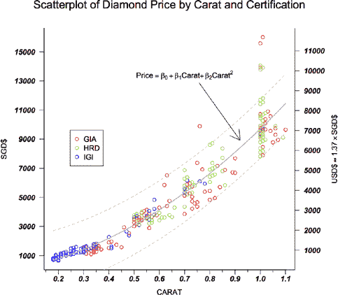

##### **本章节的重要代码**

| **功能/操作符** | **简要描述** | **首次出现** |
| --- | --- | --- |
| `dev.new` | 打开新的图形设备 | 第 23.1.1 节, 第 576 页 |
| `dev.set` | 更改活动设备 | 第 23.1.2 节, 第 577 页 |
| `dev.off` | 关闭设备 | 第 23.1.3 节, 第 578 页 |
| `par` | 设置图形参数 | 第 23.1.4 节, 第 579 页 |
| `layout` | 打开新的图形设备 | 第 23.1.4 节, 第 580 页 |
| `box` | 向图表添加框 | 第 23.2.1 节, 第 583 页 |
| `mtext` | 在边距中写文本 | 第 23.2.2 节, 第 584 页 |
| `locator` | 交互式坐标定位 | 第 23.3.1 节, 第 587 页 |
| `axis` | 向图表添加坐标轴 | 第 23.4.3 节, 第 594 页 |
| `expression` | 在图表中渲染希腊字母/数学表达式 | 第 23.5.2 节, 第 598 页 |
| `title` | 添加主标题/坐标轴标题 | 第 23.5.2 节, 第 598 页 |
| `italic` | 文字斜体化 | 第 23.5.3 节, 第 600 页 |
| `grid` | 向图表添加网格 | 第 23.6 节, 第 605 页 |
