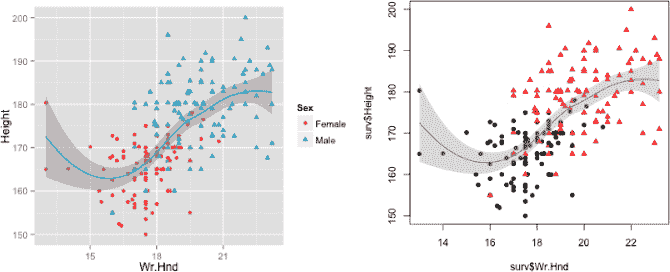
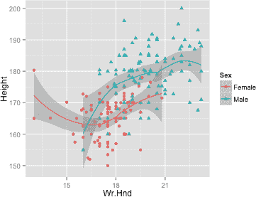
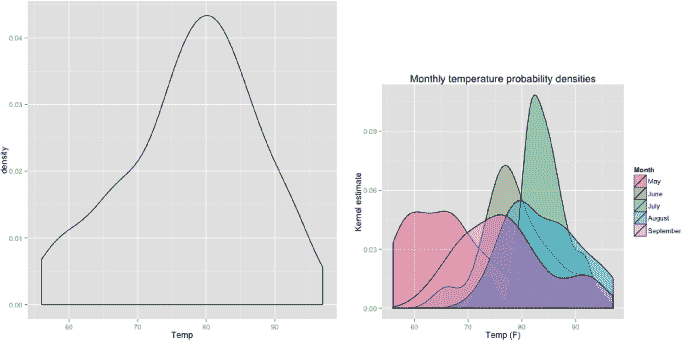
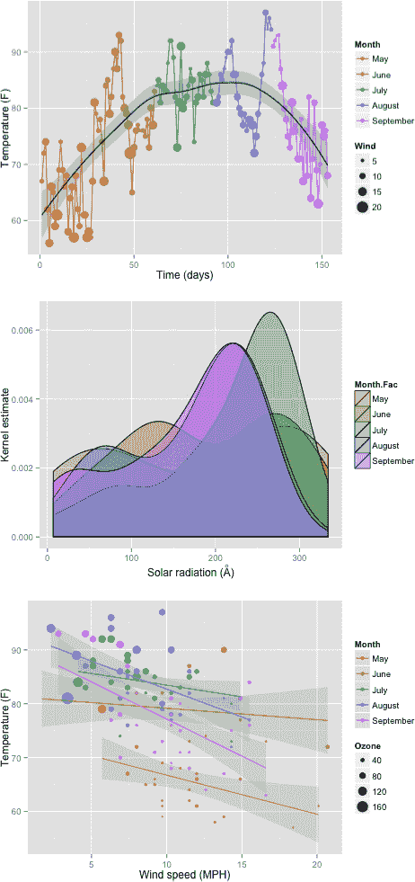
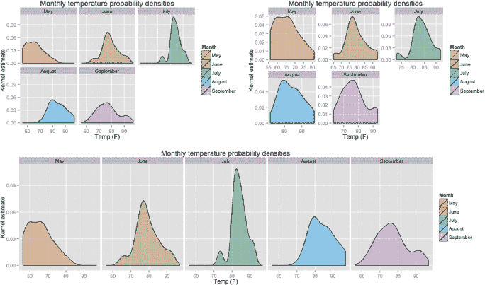
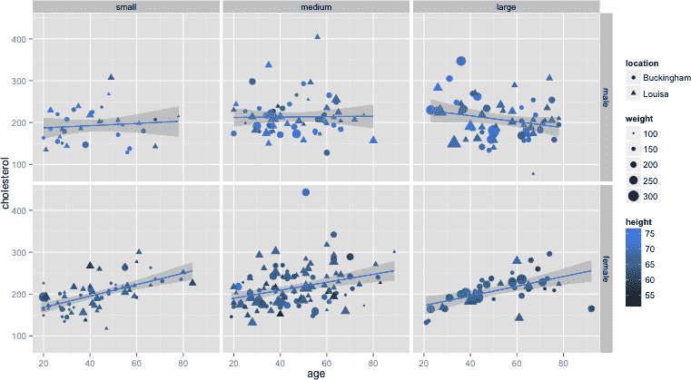
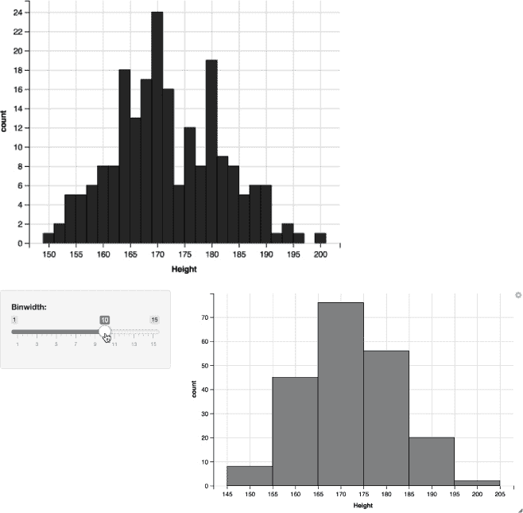
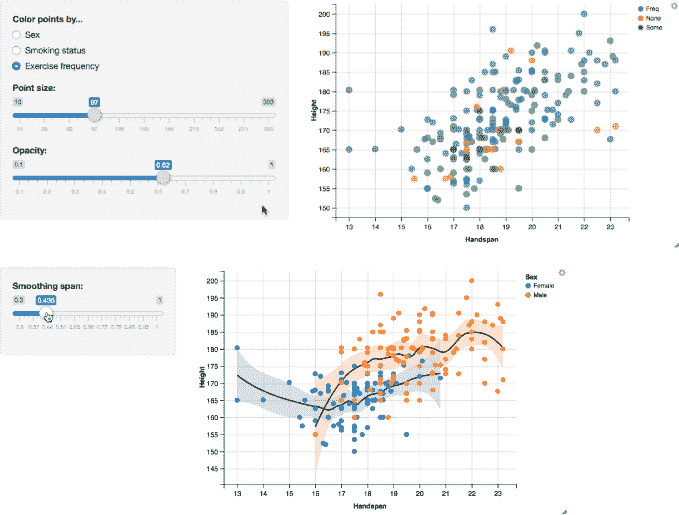

## **24**

**进一步探索图形语法**


你在第 7.4 节和第十四章中已经了解了 `ggplot2` 包的基础知识——这是传统 R 图形的替代方案。在本章中，你将了解这个包的几个更受欢迎和有用的功能，以及它相对年轻的“表亲”`ggvis`，后者提供了一个交互式的基于浏览器的体验。

### **24.1 使用 ggplot 还是 qplot？**

到目前为止，在创建相对简单的 `ggplot2` 图形时，你已经使用了 `qplot` 函数来初始化视觉对象。实际上，更通用的 `ggplot` 命令是 `ggplot2` 的核心功能。这两个初始化函数之间有几个关键的区别：

• `qplot` 是 `ggplot` 的简化版；如果你只想快速查看数据，或者在直接使用 R 控制台时，它非常适用。

• `qplot` 设计上让人联想到基础 R 的 `plot` 函数——你传入 *x* 和 *y* 坐标向量，然后告诉它该做什么。相比之下，`ggplot` 更倾向于将数据参数作为数据框对象，并通过显式地添加几何层来告诉它该做什么。

• 单独调用 `qplot` 就可以生成一个图形。而使用 `ggplot` 时，必须先添加图层，才能看到任何内容。

• 要访问 `ggplot2` 图形的全部功能和灵活性，推荐使用 `ggplot` 函数；这需要提供比 `qplot` 更多的显式指令。

总的来说，你可以使用 `qplot` 或 `ggplot` 创建大多数图形。许多用户根据数据的形式（换句话说，是数据框还是全局环境中的单独向量）以及他们是否希望图形更精美（例如用于出版）或只是想快速查看数据（直接在控制台中操作）来做出决定。

作为语法差异的快速示例，可以翻回第 297 页上创建右侧图 14-5 直方图的代码。你可以说，对该图形所做的众多修改，确实需要比 `qplot` 所提供的更为模块化的方法。加载 `ggplot2` 包，并调用 `library("ggplot2")`，然后创建以下三个对象：

```
R> gg.static <- ggplot(data=mtcars,mapping=aes(x=hp)) +
                    ggtitle("Horsepower") + labs(x="HP")
R> mtcars.mm <- data.frame(mm=c(mean(mtcars$hp),median(mtcars$hp)),
                           stats=factor(c("mean","median")))
R> gg.lines <- geom_vline(mapping=aes(xintercept=mm,linetype=stats),
                          show.legend=TRUE,data=mtcars.mm)
```

第一个对象`gg.static`表示图形中始终保持不变的部分，比如如果你稍后想要实验性地添加其他特征。请注意，`ggplot`的调用与`qplot`不同，前者的第一个参数是整个数据框，这样可以访问数据框中的所有数据列，以便后续的所有几何对象或注释使用。然后，你可以添加`ggtitle`和`labs`函数来设置主标题和横轴标题。第二个对象`mtcars.mm`存储了马力的均值和中位数，作为一个“虚拟”数据框。最后，通过第三个对象`gg.lines`，将均值和中位数的线叠加到直方图上，`gg.lines`是对`geom_vline`函数的单一调用，使用的内容与早期代码中相同，只是在形式上稍作修改，以保持与最初使用`ggplot`的一致性。

在你调用打印`ggplot2`对象的命令之前，什么都不会显示（如第 7.4 节中所述）。以下调用将重现图 14-5 右侧的图像：

```
R> gg.static + geom_histogram(color="black",fill="white",
                              breaks=seq(0,400,25),closed="right") + gg.lines +
               scale_linetype_manual(values=c(2,3)) + labs(linetype="")
```

这些部分的组合方式与图 14-5 的创建方法非常相似：将`geom_histogram`层添加到`gg.static`中以调用图形，而将`gg.lines`添加并通过`scale_linetype_manual`修改默认线条类型以标记均值和中位数。如果你想要生成没有这些线条的直方图，只需打印`gg.static`对象加上`geom_histogram`即可。

随着你对`ggplot2`的熟练度提高，你会发现自己根据应用的不同更倾向于使用`ggplot`或`qplot`。`?ggplot`中的帮助文件提供了对`ggplot`的典型用法的良好描述，并与`qplot`进行了对比。有关更多信息，请参考 Wickham 的《*ggplot2: 数据分析的优雅图形*》（2009）。我将在本章余下的图形中使用`ggplot`，以提供一些`ggplot`命令语法的示例，并与之前使用`qplot`的情况进行比较。

### **24.2 平滑和阴影**

使用`ggplot2`包进行数据可视化在你想按一个或多个分类变量拆分图形特征时特别强大。特别是在你用更难通过基础 R 命令实现的功能来增强图形时，这一点尤为明显。

#### ***24.2.1 添加 LOESS 趋势***

当你查看原始数据时，有时很难在不拟合参数模型（例如，通过线性回归）的情况下获得整体趋势的印象，这意味着你需要对这些趋势的性质做出假设。这就是*非参数平滑*的作用——你可以使用某些方法来确定数据的表现方式，而无需拟合特定的模型。这些方法是解释整体趋势的灵活工具，无论它们的形式如何，但其权衡之处在于，你无法提供响应变量和预测变量之间关系的任何具体数值细节（因为你没有估计任何系数，如斜率或截距），而且你也失去了任何可靠的外推能力。

*局部加权散点图平滑（LOESS 或 LOWESS）* 是一种非参数平滑技术，通过对数据的局部子集使用回归方法，逐步地在解释变量的整个范围内产生平滑趋势。

**注意**

*有关理论细节，第六章 的《应用非参数回归*（Härdle, 1990)，以及《非参数回归导论*（Takezawa, 2006)的第二章 和第三章 提供了 LOESS 平滑器的清晰讨论。*

为了举例说明，加载 `MASS` 包并返回注意到 `survey` 数据框。首先，创建一个新的数据框对象，删除任何缺失值，以避免默认的警告消息：

```
R> surv <- na.omit(survey[,c("Sex","Wr.Hnd","Height")])
```

然后，加载 `ggplot2` 后，执行以下命令生成图 24-1 左侧的图像。

```
R> ggplot(surv,aes(x=Wr.Hnd,y=Height)) +
       geom_point(aes(col=Sex,shape=Sex)) + geom_smooth(method="loess")
```

调用 `ggplot` 会初始化对象并设置默认的映射：手掌跨度作为 *x* 轴，身高作为 *y* 轴。添加 `geom_point` 会添加点，并使用颜色和点类型来区分男性和女性。添加 `geom_smooth` 会叠加 LOESS 平滑曲线。默认情况下，估算趋势的 95% 置信区间会通过一个透明的灰色阴影区域标出。



*图 24-1：展示* `ggplot2` *（左）和基础 R 图形（右）用于显示通过 LOESS 估算的非参数趋势*

现在我将演示如何使用基础 R 图形生成类似的结果。尽管有基础 R 函数，如 `scatter.smooth`，可以相对快速地生成带有平滑趋势的散点图，但为了能够做一些例如给置信区间区域加阴影的操作，能够一步步构建图形是非常有用的。请比较以下基础 R 代码与 `ggplot2` 方法的相对简便性，后者生成了图 24-1 右侧的图像：

```
R> plot(surv$Wr.Hnd,surv$Height,col=surv$Sex,pch=c(16,17)[surv$Sex])
R> smoother <- loess(Height~Wr.Hnd,data=surv)
R> handseq <- seq(min(surv$Wr.Hnd),max(surv$Wr.Hnd),length=100)
R> sm <- predict(smoother,newdata=data.frame(Wr.Hnd=handseq),se=TRUE)
R> lines(handseq,sm$fit)
R> polygon(x=c(handseq,rev(handseq)),
           y=c(sm$fit+2*sm$se,rev(sm$fit-2*sm$se)),
           col=adjustcolor("gray",alpha.f=0.5),border=NA)
```

第一行绘制了原始数据，第二行使用内置的 `loess` 函数提供了平滑的趋势——语法与 `lm` 完全相同。就像使用 `lm` 拟合的线性模型一样，在开始绘制之前，你需要为 *x* 轴变量设置一个精细的数值序列，用于获取点估计及其标准误差；这在第三行通过 `seq` 实现，然后在第四行使用 `predict`，并将 `se` 参数设置为 `TRUE`。这样会得到一个对象 `sm`，它是一个包含 `$fit` 和 `$se` 组件的列表。

然后，平滑的趋势会通过 `sm$fit` 调用 `lines` 来绘制。最后，为每个预测值计算一个粗略的 95% 置信区间，计算方式是将 `sm$fit` 元素加上和减去 `sm$se` 中相应标准误差的两倍。这是在调用 `polygon` 时直接完成的，它根据置信区间形成的顶点绘制了灰色带（其中，`rev` 命令用于反转给定 `handseq` 向量中的条目）。你需要通过调用现成的 `adjustcolor` 命令，指示灰色填充形状透明（`alpha.f` 参数的值从 0（完全透明）到 1（完全不透明）不等）；设置 `alpha.f=0.5` 就设置了指定的 `"gray"` 的 50% 透明度。

这一切，还没有添加图例！这个例子确实揭示了基础 R 版本的图像所需的额外努力，不仅体现在脚本的长度上，还体现在整个思考构建过程（例如，正确地将多边形的顶点组合起来以形成置信区域，并记得调整填充形状的透明度，以防止任何预绘制的内容被遮盖）上。当你在这些功能上稍微变得更有雄心时，这一点变得更加明显。假设你想分别为每个性别叠加平滑线；这将需要分别估计 LOESS 函数并重新考虑绘图策略。然而，在 `ggplot2` 中，这个添加非常简单，只需要改变相关几何体的美学映射。以下代码生成了图 24-2：

```
R> ggplot(surv,aes(x=Wr.Hnd,y=Height,col=Sex,shape=Sex)) +
       geom_point() + geom_smooth(method="loess")
```

所发生的唯一变化是，颜色和点的类型（`col=Sex` 和 `shape=Sex`）的美学映射发生了变化，因此，它不再仅限于绘制的点，而是成为了在初始化调用 `ggplot` 时声明的默认映射的一部分。任何后续添加的图层（如果没有重新分配映射）都将遵循这个默认设置，就像 `geom_point` 和 `geom_smooth` 一样。

**注意**

*LOESS 和其他趋势平滑方法的实现取决于你指定的平滑程度；这由用于每个步骤/位置的局部加权子集的数据比例控制。在估计过程中，较大的比例会导致更平滑、变化较小的趋势估计，而较小的比例则会产生更具变化性的趋势估计。这个值称为* span*，可以通过 `loess` 或 `geom_smooth` 中的可选参数* `span` *来设置。然而，对于快速的数据探索，默认值 0.75 通常是足够的。你可以尝试在本节中的示例图中进行实验，看看它对各自趋势的影响。*



*图 24-2：说明对数据的类别子集分别应用 LOESS 平滑方法，结果是简单的美学映射变化，使用* `ggplot2` *功能*

#### ***24.2.2 构建平滑密度估计***

平滑的思想不仅限于散点图趋势。*核密度估计（KDE）* 是一种基于观测数据生成概率密度函数平滑估计的方法。简而言之，KDE 的过程是为数据集中的每一个观测值分配一个缩放的概率函数（即 *核*），并将这些核加总，以呈现数据集整体的分布。这基本上是直方图的一个高级版本。有关理论细节，Wand 和 Jones（1995）的著作是一个很好的参考。

为了说明这种方法，考虑使用内置的 `airquality` 数据框；在提示符下输入 `?airquality` 打开文档，它会告诉你该数据框包含了纽约市在几个月内测量的空气质量数据。使用以下代码绘制温度数据的核密度估计基本图，并显示在图 24-3 的左侧：

```
R> ggplot(data=airquality,aes(x=Temp)) + geom_density()
```

这样的图表也可以通过基础 R 图形轻松创建，使用内置的 `density` 命令对给定的数据向量实现 KDE。然而，`ggplot2` 允许你通过美学映射轻松装饰图表，这对 `ggplot2` 的爱好者来说是一个很大的吸引力。例如，假设你想根据观测的月份分别可视化温度的密度估计。首先，执行以下代码：

```
R> air <- airquality
R> air$Month <- factor(air$Month,
                       labels=c("May","June","July","August","September"))
```



*图 24-3：通过 KDE 可视化* `airquality` *数据框中的温度分布，使用* `ggplot2` *功能*

这会在你的工作区中创建一个 `airquality` 数据框的副本，并将原本是数字型的 `Month` 向量重新编码为因子向量（这是 `ggplot2` 映射所要求的），并为条目适当地标注。然后，使用 `air`，以下代码生成了图 24-3 右侧的图：

```
R> ggplot(data=air,aes(x=Temp,fill=Month)) + geom_density(alpha=0.4) +
       ggtitle("Monthly temperature probability densities") +
       labs(x="Temp (F)",y="Kernel estimate")
```

不同的密度通过不同的颜色填充来清晰标识，这在`ggplot`初始化时通过`aes`中的`fill=Month`设置。你还可以将`alpha=0.4`传递给`geom_density`，设置 40%的透明度，以便清楚地看到所有五条曲线。剩余的`ggtitle`和`labs`调用则简洁地整理了主标题和坐标轴标题。这些测量值的分布特征正如你所预期的那样——例如，七月是最热的月份，温度集中在比五月高得多的范围内。

**注意**

*就像 LOESS 技术一样，核估计的概率密度函数的精确外观依赖于所使用的平滑程度。就像构建直方图时的 binwidth 一样，KDE 中的兴趣量称为*带宽*或*平滑参数*——更大的带宽在数据范围内施加更大的平滑。在这些示例中，带宽的默认选择是通过数据驱动的技术自动选择的。这种默认的平滑级别通常适用于数据的简单探索。*

### **24.3 多图和变量映射的面板**

在第 23.1.4 节中，你看到了几种传统 R 图形如何在一个图形设备中查看或布局的不同方法。类似的方式，例如在调用`par`时设置`mfrow`或使用`layout`对设备进行分区，无法应用于`ggplot2`图形。不过，仍有其他函数可以让独立的`ggplot2`图形填充一个设备。与其一贯的风格一致，`ggplot2`还提供了一种方便的方法，通过面板来处理多图形，其中所有图形都可以一次性绘制。

#### ***24.3.1 独立图形***

首先，假设你已经独立创建了多个`ggplot2`图形，并希望将它们安排为一张单一的图像。实现这一点的快速方法是使用贡献包`gridExtra`中提供的`grid.arrange`函数 (Auguie, 2012)。通过在提示符下运行`install.packages("gridExtra")`来安装该包（你需要有互联网连接）。

为了说明如何使用`grid.arrange`，继续使用`air`对象——你在第 24.2 节中创建的带有`Month`列的`airquality`副本。现在，考虑以下三个`ggplot2`对象，我稍后会进一步解释：

```
R> gg1 <- ggplot(air,aes(x=1:nrow(air),y=Temp)) +
              geom_line(aes(col=Month)) +
              geom_point(aes(col=Month,size=Wind)) +
              geom_smooth(method="loess",col="black") +
              labs(x="Time (days)",y="Temperature (F)")
R> gg2 <- ggplot(air,aes(x=Solar.R,fill=Month)) +
              geom_density(alpha=0.4) +
              labs(x=expression(paste("Solar radiation (",ring(A),")")),
                   y="Kernel estimate")
R> gg3 <- ggplot(air,aes(x=Wind,y=Temp,color=Month)) +
              geom_point(aes(size=Ozone)) +
              geom_smooth(method="lm",level=0.9,fullrange=FALSE,alpha=0.2) +
              labs(x="Wind speed (MPH)",y="Temperature (F)")
```

执行`library("gridExtra")`来加载所需的包。要在一个窗口中查看`gg1`、`gg2`和`gg3`，只需调用以下代码，这将生成图 24-4：

```
R> grid.arrange(gg1,gg2,gg3)
```

请注意，你可能会看到一些警告信息，告诉你`air`数据框中有缺失值，并建议调整显示图形的窗口大小。



*图 24-4：一系列三幅*`ggplot2`*图形，展示了*`airquality`*数据，通过*`grid.arrange`*在*`gridExtra`*包中绘制在同一设备窗口中。顶部：按天的温度时间序列，区分月份和风速，带有整体 LOESS 趋势和 95%置信区间。中部：按月分布的太阳辐射的核密度估计。底部：温度与风速的散点图，使用颜色区分月份，点大小参考臭氧水平。温度与风速的简单线性回归模型分别拟合，按月份划分，并叠加 90%置信区间。

如你所见，`grid.arrange`非常易于使用——你只需首先创建你的`ggplot2`图像并将它们存储为对象，然后将它们直接传递给排列函数。`grid.arrange`根据你提供的对象数量来决定如何生成最终布局（在这个例子中，是三幅图的列排布）。你可以通过改变传入对象的顺序来控制图表的排列顺序。还有更多可选的参数，你可以在文档文件`?grid.arrange`中阅读详细内容。

图表`gg1`、`gg2`和`gg3`也为我们提供了讨论更多`ggplot2`功能的机会。由于特别是在`gg1`和`gg3`中涉及的内容较多，我将分别讨论每个对象的代码。

`gg1` 第一个图表显示的是每日温度。在`ggplot`中设置默认美学时，我创建了一个整数序列，与`air`中的行数相匹配，并与相关的`Temp`元素配对。然后，`geom_line`和`geom_point`添加了连接线和原始观测数据，并被加入到默认的美学映射中。连接线的颜色根据`Month`变化。原始观测数据的颜色也根据`Month`变化，点的大小与风速读数成正比。我包括了一个整体的 LOESS 平滑曲线，其默认颜色被更改为`"black"`。我在这里保留默认映射——我不希望每个月都有单独的平滑趋势。最后，添加`labs`仅仅是为了澄清轴标题，正如你已经看到的那样。

`gg2` 第二个图表是图 24-3 右侧图表的变体。这一次，它显示了太阳辐射读数的估计密度（单位为埃）。正如你之前看到的，透明度是通过`geom_density`中的`alpha`设置的。值得注意的是，我在`labs`中使用了`expression`来近似表示埃单位符号Å，使用了`ring(A)`。

`gg3` 最后一张是温度与风速的散点图，其中可以看到负相关关系。颜色（再次为每个月分配）也设置为`ggplot`中的默认美学映射。在调用`geom_point`时，美学增强指示点的大小与臭氧读数成比例（这是为了确保相应图例的正确格式化，考虑到接下来的内容）。在这里，你可以看到`geom_smooth`的另一种使用方式。在设置`method="lm"`时，我想要叠加的线条（或多条线）是根据`x`和`y`美学映射分别作为预测变量和响应变量拟合的简单线性模型。此外，默认映射中包括因子`Month`，确保为每个月的温度与风速数据分别拟合简单线性模型，并进行适当的着色（需要注意的是，绘制的线条并不反映包含图中所有变量的多元线性模型）。每个回归都包括透明度为 90%的置信区间（`level=0.9` 和 `alpha=0.2`），并且通过设置`fullrange=FALSE`，每条回归线的范围仅限于每个月观测数据的宽度。

#### ***24.3.2 映射到类别变量的面板***

如果你希望独立创建的`ggplot2`图形出现在同一窗口中，`grid.arrange`无疑是处理它们的最佳方式。然而，`ggplot2`包提供了一种灵活的替代方法，可以快速查看多个图形。在探索数据集时，你可能希望根据一个或多个重要类别变量的级别创建多个相同变量的图形。这种行为被称为*面板化*，使用`ggplot2`的`facet_wrap`或`facet_grid`命令是这一领域的常见方法。

让我们专注于最简单的情况，即你只有一个类别变量。继续使用`air`数据框对象，以下代码行创建了一个`ggplot2`对象，该对象显示了右侧图 24-3 中纽约气温的密度图：

```
R> ggp <- ggplot(data=air,aes(x=Temp,fill=Month)) + geom_density(alpha=0.4) +
              ggtitle("Monthly temperature probability densities") +
              labs(x="Temp (F)",y="Kernel estimate")
```

与其将所有密度估计一起查看，不如将每个密度估计分别绘制出来，并显示在同一个设备中，使用以下三种`facet_wrap`方式；结果如图 24-5 所示，分别位于左上角、右上角和底部。

```
R> ggp + facet_wrap(~Month)
R> ggp + facet_wrap(~Month,scales="free")
R> ggp + facet_wrap(~Month,nrow=1)
```



*图 24-5：使用* `facet_wrap` *显示按月划分的温度数据的核密度估计的三种示例*

`facet_wrap`函数自动排列多个图形；公式指定了分面变量。在之前的所有图形中，这个变量被设置为`~Month`，表示“按月份分面”。位于左上角的第一张图的代码没有添加其他参数，并且没有参数时，*x*轴和*y*轴的范围是固定的，这样你可以在相同的尺度上比较图形。如果你不希望如此，你可以指示坐标轴为“自由”，意味着每个图形会根据其自身内容在独立的尺度上显示。你可以在第二张图中看到这一点，位于图 24-5 的右上角，其代码指定了`scales="free"`。你也可以选择仅将水平或垂直轴设为自由，分别使用`scales="free_x"`或`scales="free_y"`。最后，请注意，通过使用`nrow`和`ncol`参数可以定制分面位置。在第三张图中，设置`nrow=1`指示 R 将图形仅放置在一行中，生成图 24-5 底部的水平排列。有关位置的更多细节，你可以在`?facet_wrap`文档中找到相关信息。

`facet_wrap`的替代方法，`facet_grid`，执行的操作大致相同，但如果仅通过一个分类变量进行分面时，无法将图形进行换行。公式`var1` ~ var2 的含义是“按`var1`进行行分面，按`var2`进行列分面”。如果你确实只希望通过一个分组变量进行列或行的分面，只需将`var1`或`var2`中的一个替换为点（`.`）。例如，图 24-5 中的第三张图可以通过`facet_grid`轻松实现，如下所示：

```
R> ggp + facet_grid(.~Month)
```

然而，下一个例子展示了`facet_grid`在两个分组变量下的应用。再次关注`faraway`包中的`diabetes`数据框。在加载该包后，以下代码创建了包含`diab`数据框的对象，并删除了缺失值行，从而生成图 24-6：

```
R> diab <- na.omit(diabetes[,c("chol","weight","gender","frame","age",
                               "height","location")])
R> ggplot(diab,aes(x=age,y=chol)) +
       geom_point(aes(shape=location,size=weight,col=height)) +
       facet_grid(gender~frame) + geom_smooth(method="lm") +
       labs(y="cholesterol")
```

初始调用`ggplot`命令告诉 R 使用`diab`数据框，并绘制总胆固醇与年龄的关系。接着，添加`geom_point`设置每个点的形状、大小和颜色，分别根据县位置、体重和身高的不同而变化（如你已经看到的，基于连续变量的点大小，点的颜色也会自动根据映射的美学变量变化，如果该变量不是因子的话）。



*图 24-6：展示了在*`ggplot2`*中使用*`faraway`*包中的*`diabetes`*数据框进行双向分面。胆固醇水平与年龄的关系图，以及简单的线性模型拟合，按性别（行）和体型类型（列）进行分面。点的颜色和大小分别根据体重和身高来设置，两个不同的点类型区分了研究参与者来自弗吉尼亚的两个县的位置。*

到目前为止，这些命令仍然仅定义了一个单一的散点图。通过添加对`facet_grid`的调用，公式`gender~frame`将图形分成不同的散点图，分别展示男性/女性（按行）以及三种体型类型：小型/中型/大型（按列）。你为每个图形设置了简单线性模型拟合，基于默认的美学映射（胆固醇与年龄的关系），并通过调用`geom_smooth`来实现，最后通过调用`labs`明确了纵轴的标题。

这些图形本身总体上揭示了你在之前对这些数据的分析中可能已注意到的一些趋势（第 21.5.2 节）。年龄的增加往往与胆固醇的均值增加相关，尽管这种关系似乎在视觉上对于男性不那么明显。左侧小体型列中的点整体较小是合理的——体型较小的人通常体重较轻。底行（女性）的图形倾向于比顶部行的图形颜色更深——这表明，平均而言，女性通常比男性矮。关于两个县的参与者之间的差异，很难分辨——看起来巴金汉县（•）和路易莎县（▴）的符号模式没有明显的系统性差异（不过请记住，如果你想理解多变量数据中复杂的潜在交互关系，适当的统计模型拟合优于仅依赖图形）。  

这些优雅的图形进一步突出了`ggplot2`包在生成复杂图形方面的相对简便性——通常涉及根据一个或多个因素对观测数据进行分区——无论是在单独的图像还是图像的排列方面。尽管使用基础 R 方法当然仍然可以绘制类似的图形，但这种方法要求你更细致或更低级地处理数据子集的细节，以及任何变化的美学特征。这并不意味着基础 R 图形是多余的或应该被忽视（你将在第二十五章看到一些通过传统命令实现的不错的新图形）——只是通过使用 Wickham 的图形语法实现，你可以减少编码工作（并且通常会得到一个更漂亮的最终结果）。

**练习 24.1**

加载`MASS`包并查看`UScereal`数据的帮助文件。该数据框提供了 1990 年代初期美国市场上销售的早餐谷物的营养及其他信息。

1.  创建数据框的副本，命名为`cereal`。为了简化绘图，将`cereal`中的`mfr`列（制造商）转换为具有三个层次的因子，并将相应标签设置为`"General Mills"`、`"Kelloggs"`和`"Other"`。同时，将`shelf`变量（货架编号）转换为因子。

1.  使用`cereal`，构建并存储两个`ggplot`对象。

    1.  一个卡路里与蛋白质关系的散点图。点的颜色应根据货架位置，点的形状应根据制造商来区分。包括卡路里与蛋白质关系的简单线性回归线，按货架位置拆分。确保坐标轴和图例标题整洁。

    1.  一组卡路里的核密度估计图，使用填充颜色区分货架位置。填充色透明度设为 50%，并确保坐标轴和图例的标题整洁。

1.  将(b)中的两个图表排列在一个设备上。

1.  创建一个显示卡路里与蛋白质关系的面板图，每个面板对应`cereal`对象中定义的一个制造商。在每个散点图上叠加一个 90%跨度的 LOESS 平滑线。此外，点的颜色应根据糖分含量，点的大小应根据钠含量，点的形状应根据货架位置来决定。

加载`car`包（如果你还没有安装，请先下载并安装），并查看`Salaries`对象——一个数据框，详细记录了 2008–2009 学年期间在美国工作的 397 名学者的薪资（以美元为单位）(Fox and Weisberg, 2011)。通过查看帮助文件`?Salaries`，你可以了解当前的变量，除了薪资数字外，还包括每位学者的职称、性别和研究领域（作为因子），以及服务年限。

1.  生成一个名为`gg1`的`ggplot`对象，绘制一个散点图，其中纵轴为薪资，横轴为服务年限。使用颜色区分男性和女性，并显示性别特定的 LOESS 趋势，同时确保坐标轴和图例的标题易于理解。查看你的图表。

1.  创建以下三个附加的绘图对象，确保坐标轴和图例标题整洁。分别命名为`gg2`、`gg3`和`gg4`：

    1.  按职称分组的薪资并排箱型图。每个箱型图应根据性别进一步分组（这可以通过默认的美学映射来完成——尝试将性别变量分配给`col`或`fill`）。

    1.  按学科分组的薪资并排箱型图，每个学科按性别进一步分组，使用颜色或填充来区分。

    1.  使用 30%透明度填充区分职称的薪资核密度估计图。

1.  将你的四个绘图对象（`gg1`、`gg2`、`gg3`和`gg4`）从(e)和(f)中显示在一个设备上。

1.  最后，绘制以下内容：

    1.  一系列使用 70%不透明填充来区分男性和女性的薪资核密度估计图，按学术职称分面显示。

    1.  使用颜色区分男性和女性的薪资与工作年限的散点图，按学科作为行，按学术职称作为列进行分面。每个散点图应有性别特定的简单线性回归线，并叠加置信区间带，同时具有自由的横轴刻度。

### **24.4 ggvis 中的交互式工具**

在本章结束时，我将介绍“gg”家族中一个相对较新的成员，`ggvis`，由 Chang 和 Wickham（2015）开发。这个包使你能够设计灵活的统计图表，最终用户可以与之互动。结果以网页图形的形式提供。当图像弹出时，它会作为一个新标签页出现在你默认的网页浏览器中（如果你使用的是 RStudio IDE——参见附录 B——`ggvis`图形会嵌入在 Viewer 面板中）。

作为警告，请注意，`ggvis`在撰写时仍由其作者开发中。新的功能正在添加，bug 也在修复。如果你对该功能感兴趣，可以访问`ggvis`网站，网址是*[`ggvis.rstudio.com/`](http://ggvis.rstudio.com/)*。该网站包含面向初学者的教程和目前可用功能的食谱。在这里，我将简要概述`ggvis`。

安装`ggvis`包及其依赖项，然后通过调用`library("ggvis")`加载它。同时确保你可以访问学生调查数据`survey`，通过加载`MASS`包来实现。创建以下对象以供后续示例使用：

```
R> surv <- na.omit(survey[,c("Sex","Wr.Hnd","Height","Smoke","Exer")])
```

开始一个`ggvis`图形的常见方式是声明感兴趣的数据框，然后调用`ggvis`来定义要使用的变量，最后添加各个图层。当你使用数据框中的变量时，它们必须以`~`为前缀，这明确告诉 R 你是在引用该数据框的列，而不是其他地方同名的对象。要在对象定义中添加函数时，不像`ggplot2`中使用`+`，而是使用`%>%`（称为*管道*）。`ggplot2`中的`geom_`函数在`ggvis`中以`layer_`为前缀。

我们从一个简单的静态图开始。上方的图 24-7 中的直方图（身高测量值）可以通过以下执行获得：

```
R> surv %>% ggvis(x=~Height) %>% layer_histograms()
Guessing width = 2 # range / 25
```

声明`surv`数据框后，将其传递给`ggvis`，指示`~Height`变量映射到*x*轴。最后，通过管道传递给`layer_histograms`，生成图形，并根据*x*映射数据的范围分配默认的 bin 宽度。

那又怎样？你已经创建了很多直方图。但如果你能够在不需要一个又一个静态图的情况下调整 binwidth 的值，那不是更好吗？`ggvis` 中的 `input_` 命令集允许你指示生成的图形接受交互输入。参考以下代码；图 24-7 展示了我的结果。

```
R> surv %>% ggvis(x=~Height) %>%
     layer_histograms(width=input_slider(1,15,label="Binwidth:"),fill:="gray")
Showing dynamic visualisation. Press Escape/Ctrl + C to stop.
```



*图 24-7：来自* `survey` *数据框的身高观察值的直方图，使用* `ggvis` *。上图：默认静态图。下图：包含与 binwidth 关联的滑动按钮的结果——用户可以与之互动，并立即看到更改 bins 的效果。*

这里，控制感兴趣特征的 `width` 参数被设置为 `input_slider` 的结果，从而设置了一个交互式滑动按钮。`width` 的滑动值范围设置为 `1` 到 `15`（包括 15），可选的 `label` 参数为交互式工具提供了标题。最后，使用 `layer_histogram` 中的 `fill` 设置条形的颜色。请注意，特定的赋值 `fill:="gray"` 使用的是 `:=`，而不是 `=`。单独使用 `=` 在 `ggvis` 中用于变量映射，即当感兴趣的特征需要传递一个可变的变量时，本质上类似于 `ggplot2` 中的美学映射。`:=` 的组合应被理解为一个常量设置，也就是说，当你简单地打算全局固定某个特征时。

一旦代码成功执行，你可以尝试滑动按钮来调整更小或更大的 binwidth。观察你的分布图解释随着调整而变化的情况很有意思。如同控制台中执行命令下方输出的文字所示，你必须退出交互式图形才能再次使用 R。按下 ESC 键将终止交互并将控制权交回给用户。

其他类型的交互功能包括 `input_select`（用于下拉菜单）、`input_radiobuttons`（单选按钮选项）和 `input_checkbox`（用于复选框）。你甚至可以使用 `input_numeric` 设置交互式文本或数字输入框。有关更多详细信息，请参阅相关帮助文件或 `ggvis` 网站。

作为另一个基于 `surv` 数据框的示例，我们尝试一个散点图。从一个简单的静态图开始，运行以下代码：

```
R> surv %>% ggvis(x=~Wr.Hnd,y=~Height,size:=200,opacity:=0.3) %>%
     layer_points()
```

我在这里不会展示这个结果，但你可以从 `ggvis` 的调用中看到，你将绘制身高与手掌跨度之间的关系，并且你会普遍放大点的大小，同时设置 30% 不透明度的全局水平。最后一条管道传递给 `layer_points` 生成图像。与静态直方图的情形一样，由于没有交互性，你无需“退出”图形——控制权会立即返回到控制台提示符处。

如果想要更有趣的图形，可以尝试如下：

```
R> filler <- input_radiobuttons(c("Sex"="Sex","Smoking status"="Smoke",
                                  "Exercise frequency"="Exer"),map=as.name,
                                label="Color points by...")
R> sizer <- input_slider(10,300,label="Point size:")
R> opacityer <- input_slider(0.1,1,label="Opacity:")
R> surv %>% ggvis(x=~Wr.Hnd,y=~Height,fill=filler,
                  size:=sizer,opacity:=opacityer) %>%
     layer_points() %>% add_axis("x",title="Handspan") %>%
     add_legend("fill",title="")
Showing dynamic visualisation. Press Escape/Ctrl + C to stop.
```

首先，为交互部分创建三个对象。一组单选按钮指定根据三个可能的类别变量之一（`Sex`、`Smoke` 或 `Exer`）来设置绘制点的颜色，两个滑块按钮控制点的大小和透明度。注意，当你打算使用数据框中的变量作为交互行为的要素时，需要将它们的精确名称作为字符字符串向量提供，并设置可选的 `map=as.name`；这是在定义 `filler` 对象时完成的。在随后的 `ggvis` 调用中，使用 `=` 将 `filler` 传递给 `fill`。对象 `sizer` 和 `opacityer` 中的两个滑块按钮通过 `:=` 传递给相关参数，因为它们不依赖于数据框中的变量。调用 `layer_points` 生成图形，接下来的管道操作 `add_axis` 和 `add_legend` 仅仅是将 *x* 轴和图例标题从默认值调整为更整洁的形式。

图 24-8 的顶部展示了结果的截图，我已选择点的颜色根据运动频率变量变化，减少了点的大小，并选择了中到高透明度。



*图 24-8：* `ggvis` *散点图的两个例子，展示了学生调查数据中的身高与手掌跨度关系。顶部：通过单选按钮根据性别、吸烟状态或运动频率更改颜色（填充），并使用滑块按钮调整点的大小和透明度。底部：通过颜色将点按性别划分，并叠加性别特定的 LOESS 平滑曲线及相应的置信区间；其平滑跨度可以通过滑块按钮进行控制。*

最后，让我们生成相同的散点图，但选择使用性别来为点着色。你可以为男性和女性分别添加 LOESS 平滑曲线，并使用滑块按钮动态控制平滑的程度。这个最后的例子，其截图出现在 图 24-8 的底部，是执行以下代码的结果：

```
R> surv %>% ggvis(x=~Wr.Hnd,y=~Height,fill=~Sex) %>% group_by(Sex) %>%
     layer_smooths(span=input_slider(0.3,1,value=0.75,
                                     label="Smoothing span:"),
                   se=TRUE) %>% layer_points() %>%
     add_axis("x",title="Handspan")
Showing dynamic visualisation. Press Escape/Ctrl + C to stop.
```

LOESS 平滑曲线通过 `layer_smooths` 命令添加，其 `span` 参数，即感兴趣的目标参数，分配给一个 `input_slider`。其可能的值范围按常规设置，可选的 `value` 参数（在其他 `input_` 函数中也适用）设置初始值，当图形首次初始化时使用。此外，`se=TRUE` 参数确保 95% 的置信区间与平滑趋势一同显示。请注意，管道操作 `layer_smooths` 被 `group_by(Sex)` 的管道操作所预先处理。如果没有这个，平滑曲线将仅应用于 `x` 和 `y` 数据的整体（另外需要注意的是，在写作时，你在 `group_by` 中不需要为变量名加上 `~`）。

因此，`ggvis`展示了用于动态数据可视化探索的巨大潜力。这些工具在演示或网站设计等活动中特别有用，因为你可以为观众提供一种图形语法风格的交互式数据展示。如果你有兴趣使用这些工具，我强烈建议你关注`ggvis`网站的最新动态。

**练习 24.2**

确保加载了`car`和`ggvis`包。重新查看你在练习 24.1 中查看过的`Salaries`数据框；查看帮助文件`?Salaries`，以回顾当前的变量。

1.  生成一个交互式散点图，纵轴为薪资，横轴为工作年限。使用单选按钮根据学术职称、研究领域或性别来为点上色。使用管道操作符`add_legend`和`add_axis`，分别去除图例标题并整理坐标轴标题。

1.  使用管道操作符`layer_densities`（你尚未接触过）生成核密度估计，类似于图 24-5 中出现的估计。

    1.  使用`ggvis`创建一个静态图，展示按照学术职称分组的薪资分布的核密度估计。为此，将薪资变量分配给`x`，将职称变量分配给`fill`，然后使用管道操作符`group_by`显式指定按职称变量分组。最后，使用管道操作符`layer_densities`（在此情况下使用所有默认参数值）生成图形。你的结果应该类似于练习 24.1 中的`gg4`对象。

    1.  就像`layer_histograms`中的`width`参数用于控制直方图外观一样，`layer_densities`中的`adjust`参数用于控制核密度估计的平滑程度。重新生成前一个图中的职称特定核密度估计，但这次图形应为交互式——实现一个滑块按钮，范围从 0.2 到 2，标签为“平滑度”，以控制平滑调整。根据需要，可以选择抑制或明确显示结果中的坐标轴和图例标题。

确保已经加载了`MASS`包，这样可以再次访问`UScereal`数据框。如果还没有做过此操作，请查看帮助文件`?UScereal`，并按照练习 24.1（a）中指定的方式重新创建`cereal`对象。然后执行以下操作：

1.  设置一个对象，供单选按钮选择制造商、货架和维生素变量。确保每个单选按钮的标签清晰，并设置一个适当的标题标签，用于形成将点上色的选项集合。将该对象命名为`filler`。

1.  借用在第 24.4 节中创建的`sizer`和`opacityer`对象，并使用你刚刚在(c)中创建的对象来控制`fill`，创建一个交互式的蛋白质与卡路里的散点图。整理轴标题，并抑制点的颜色填充的图例标题。最终效果在功能上应与图 24-8 中顶部截图的图形基本相同。

1.  为（c）中指定的相同单选按钮创建一个新对象，用来控制点的形状（换句话说，就是用于绘制点的字符）。相应地修改标题标签。将此对象命名为`shaper`。

1.  最后，重新创建与(d)中完全相同的蛋白质与卡路里的交互式散点图，但这次还需要将(e)中的`shaper`分配给`ggvis`调用中的`shape`修饰符。为了防止两个单选按钮组的图例重叠，你需要在代码中添加以下管道：

    add_legend("shape",title="",

    properties=legend_props(legend=list(y=100)))

    和

    set_options(duration=0)

    第一个管道将`shape`修饰符的图例垂直向下移动，第二个管道消除了交互式图形在切换选项时默认发生的轻微“动画延迟”。再次使用额外的`add_axis`和`add_legend`调用来澄清或抑制轴和图例标题。

##### **本章中的重要代码**

| **函数/操作符** | **简要描述** | **首次出现** |
| --- | --- | --- |
| `ggplot` | 初始化`ggplot2`图表 | 第 24.1 节, 第 610 页 |
| `geom_smooth` | 趋势线几何 | 第 24.2.1 节, 第 612 页 |
| `loess` | 计算 LOESS（基础 R） | 第 24.2.1 节, 第 612 页 |
| `rev` | 反转向量元素 | 第 24.2.1 节, 第 612 页 |
| `adjustcolor` | 改变颜色的不透明度（基础 R） | 第 24.2.1 节, 第 612 页 |
| `geom_density` | 核密度几何 | 第 24.2.2 节, 第 614 页 |
| `ggtitle` | 添加`ggplot2`标题 | 第 24.2.2 节, 第 615 页 |
| `grid.arrange` | 多个`ggplot2`图表 | 第 24.3.1 节, 第 616 页 |
| `facet_wrap` | 单因素分面 | 第 24.3.2 节, 第 619 页 |
| `facet_grid` | 两因素分面 | 第 24.3.2 节, 第 620 页 |
| `ggvis` | 初始化`ggvis`图表 | 第 24.4 节, 第 624 页 |
| `%>%` | 管道到`ggvis`层 | 第 24.4 节, 第 624 页 |
| `layer_histograms ggvis` | 直方图层 | 第 24.4 节，第 624 页 |
| `input_slider` | 交互式滑块 | 第 24.4 节，第 624 页 |
| `:=` | 常量`ggvis`赋值 | 第 24.4 节，第 624 页 |
| `layer_points ggvis` | 点层 | 第 24.4 节，第 626 页 |
| `input_radiobuttons` | 交互式按钮 | 第 24.4 节，第 626 页 |
| `add_legend` | 添加/修改`ggvis`图例 | 第 24.4 节，第 626 页 |
| `layer_smooths ggvis` | 趋势线层 | 第 24.4 节，第 627 页 |
| `add_axis` | 添加/修改`ggvis`坐标轴 | 第 24.4 节，第 627 页 |
