## **25**

**定义颜色和在高维度中绘制图形**


现在你已经掌握了一些基本的可视化技巧，你可以通过给点着色来超越标准的*x*和*y*坐标轴，依据某些附加的值或变量，或者添加一个*z*轴来构建 3D 图表。像这样的高维度图表允许你使用比其他方式更多的变量来直观地探索你的数据或模型。

在本章中，你将深入了解如何在 R 中处理颜色和调色板，然后你将看到四种新的图表类型：3D 散点图、等高线图、像素图和透视图。

### **25.1 表示和使用颜色**

颜色在许多图表中起着关键作用。正如你已经看到的，颜色不仅可以纯粹用于美学增强，也可以通过区分不同的值和变量，成为解读数据/模型的重要工具。在学习一些更复杂的数据和模型可视化工具之前，了解 R 如何正式表示和处理颜色是很有用的。在本节中，你将学习常见的创建和表示特定颜色的方法，以及如何定义和使用一组协调一致的颜色；后一种方法称为*调色板*。

#### ***25.1.1 红绿蓝十六进制颜色代码***

在指定图表中的颜色时，你迄今为止给 R 的指令通常是通过一个从`1`到`8`的整数值，或者是字符字符串的形式（请参见第 7.2.3 节中的相关注释）。为了编程目的，你需要这些颜色的更客观的表示方式。

最常见的颜色指定方法之一是指定三种原色——红色、绿色和蓝色（RGB）的不同*饱和度*或*强度*，然后将它们混合形成最终的目标颜色。标准 RGB 系统中的每个原色分量都被赋予一个从 0 到 255（包含）的整数。因此，这样的混合可以形成 256³ = 16,777,216 种可能的颜色。

你总是按（R，G，B）的顺序来表示这些值；结果通常称为*三元组*。例如，（0,0,0）代表纯黑色，（255,255,255）代表纯白色，（0,255,0）代表纯绿色。

`col`参数允许你在输入从 1 到 8 的整数时，选择八种颜色中的一种。你可以通过以下调用来找到这八种颜色：

```
R> palette()
[1] "black"   "red"    "green3"  "blue"   "cyan"   "magenta"
[7] "yellow"  "gray"
```

这些只是你通过在 R 提示符下输入`colors()`命令可以列出的 650 多个命名颜色的一个小子集。所有这些命名颜色也可以用标准 RGB 格式表示。要查找颜色的 RGB 值，只需将所需的颜色名称作为字符向量传递给内置的`col2rgb`函数。以下是一个示例：

```
R> col2rgb(c("black","green3","pink"))
      [,1] [,2] [,3]
red      0    0  255
green    0  205  192
blue     0    0  203
```

结果是一个 RGB 值矩阵，每一列代表你指定的颜色之一。这就是 R 在 RGB 意义上，当你请求它用相应的字符字符串绘制这些颜色时的实际含义。

这些 RGB 三元组通常表示为*十六进制数*，这是一种在计算机中常用的数字编码系统。在 R 中，十六进制或*十六进制代码*是一个字符字符串，前面跟着一个`#`，后面是六个字母数字字符：有效字符是字母*A*到*F*和数字 0 到 9。第一个字符对表示红色分量，第二和第三个字符对分别表示绿色和蓝色。如果你有或创建一个或多个 RGB 三元组，你可以通过`rgb`函数将它们转换为 R 可以在后续绘图中使用的十六进制代码。这个命令接受一个 RGB 值的矩阵，但请注意，它期望每个(R, G, B)颜色是该矩阵的行（而不是例如通过`col2rgb`调用时提供的列）。

你还需要告诉`rgb`，根据标准的 RGB 格式，你的最大颜色值是 255（因为默认情况下，它将此值缩放并使用 1）。以下代码对之前调用`col2rgb`的结果执行矩阵转置（参见第 3.3 节），将我的三种颜色作为 RGB 三元组以行的形式放入所需的格式，并相应地指定`maxColorValue`：

```
R> rgb(t(col2rgb(c("black","green3","pink"))),maxColorValue=255)
[1] "#000000" "#00CD00" "#FFC0CB"
```

输出会告诉你 R 所指的 RGB 值对应的十六进制代码，分别为`"black"`，`"green3"`和`"pink"`。

我不会在这里详细讲解如何将标准的 RGB 三元组转换为十六进制，因为这超出了本书的范围，但了解 R 代表你使用 RGB 三元组创建的任何颜色作为十六进制代码是很重要的，所以当你在绘制图形时，至少应该能够识别十六进制代码。

为了更丰富的探索，让我们写一个简单的函数，用单独的颜色绘制点，并用 RGB 三元组和相应的十六进制代码为其加上标签。请在编辑器中参考以下内容：

```
pcol <- function(cols){
        n <- length(cols)
        dev.new(width=7,height=7)
        par(mar=rep(1,4))
        plot(1:5,1:5,type="n",xaxt="n",yaxt="n",ann=FALSE)
        for(i in 1:n){
                pt <- locator(1)
                rgbval <- col2rgb(cols[i])
                points(pt,cex=4,pch=19,col=cols[i])
                text(pt$x+1,pt$y,family="mono",
                     label=paste("\"",cols[i],"\"","\nR: ",rgbval[1],
                                 "  G: ",rgbval[2],"  B: ",rgbval[3],
                                 "\nhex: ",rgb(t(rgbval),maxColorValue=255),
                                 sep=""))
        }
}
```

函数`pcol`接受一个参数`cols`，它应该是一个字符向量，包含 R 识别的颜色名称。当你执行`pcol`时，它会打开一个新的图形设备，并将图形边距设置为每一边各一行。一个图形开始绘制，但除了边框外，其他部分都被完全抑制。这样，你可以使用`locator`（见第 23.3 节）在图形区域内逐个放置点，这通过一个`for`循环实现。每个点代表一个`cols`中的颜色，`locator`返回其坐标后，`points`会在当前位置绘制一个大的颜色点，`text`则在每个点的右侧提供注释，注释是通过`paste`实现的（参见第 4.2 节）。这个注释包括 R 颜色名称、RGB 三元组和十六进制代码，它们依次叠加在一起；后两个通过`col2rgb`和`rgb`函数获得，正如前面所演示的。

以下代码设置了设备，首先将 14 个有效的 R 颜色名称（随机选择）存储在字符向量`mycols`中。在通过鼠标点击不同区域消耗完这些颜色后，执行过程完成。

```
R> mycols <- c("black","blue","royalblue2","pink","magenta","purple",
               "violet","coral","lightgray","seagreen4","red","red2",
               "yellow","lemonchiffon3")
R> pcol(mycols)
```

当我执行如这里所示的`pcol`时，我点击了 14 个点，在我的图形设备上生成了粗略的列。图 25-1 展示了结果。

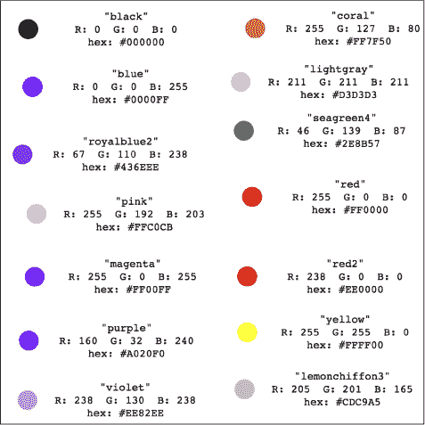

*图 25-1: 各种命名的 R 颜色及其对应的 RGB 三元组和十六进制代码。*

实质上，你可以通过指定 RGB 值并获取其十六进制代码，获得任何你想要的颜色（换句话说，比 R 内置的命名颜色多得多）。这些十六进制数值可以直接用于任何传统的 R 图形函数中，在那里你指定颜色（通常是`col`参数）。随着章节的进展，你将看到这一点。当然，你也可以将一个十六进制代码或一组十六进制代码（例如，如果你正在创建自己的自定义颜色）分配给 R 工作区中的一个新对象，这样你就可以在后续绘图中使用它。

#### ***25.1.2 内置调色板***

当你需要许多颜色时，能够实现自己的 RGB 颜色是最有用的，这些颜色的集合被称为*调色板*。通常，当颜色用于描述某种连续体的事物时，你会需要一个调色板，比如在图 24-6 的第 621 页上使用的不同蓝色阴影来表示高度测量。

基础 R 安装中内置了多个颜色调色板。这些由函数`rainbow`、`heat.colors`、`terrain.colors`、`topo.colors`、`cm.colors`、`gray.colors`和`gray`定义。除了`gray`之外，你可以直接指定所需颜色的数量，它们将作为一个包含十六进制代码的字符向量返回，表示该调色板整个颜色范围内等间距的颜色序列。

最容易通过可视化效果来查看这一点。以下代码从每个调色板中生成恰好 600 种颜色：

```
R> N <- 600
R> rbow <- rainbow(N)
R> heat <- heat.colors(N)
R> terr <- terrain.colors(N)
R> topo <- topo.colors(N)
R> cm <- cm.colors(N)
R> gry1 <- gray.colors(N)
R> gry2 <- gray(level=seq(0,1,length=N))
```

请注意，`gray`期望的是一个介于 0（完全黑）和 1（完全白）之间的数值向量来提供灰度，而不是一个单一的整数。它的对应函数`gray.colors`的工作原理与其它内置调色板相同，但默认的视觉范围稍微窄一些，位于黑与白之间的极限。这些可以通过可选参数`start`和`end`来重置，稍后你会看到。

接下来的代码块使用了第二十三章中的技巧，初始化了一个新的图形，并使用向量重复将 600 个点放置到`points`函数的一次调用中，根据十六进制代码向量为这些点着色。

```
R> dev.new(width=8,height=3)
R> par(mar=c(1,8,1,1))
R> plot(1,1,xlim=c(1,N),ylim=c(0.5,7.5),type="n",xaxt="n",yaxt="n",ann=FALSE)
R> points(rep(1:N,7),rep(7:1,each=N),pch=19,cex=3,
          col=c(rbow,heat,terr,topo,cm,gry1,gry2))
R> axis(2,at=7:1,labels=c("rainbow","heat.colors","terrain.colors",
                          "topo.colors","cm.colors","gray.colors","gray"),
        family="mono",las=1)
```

图 25-2 展示了结果。

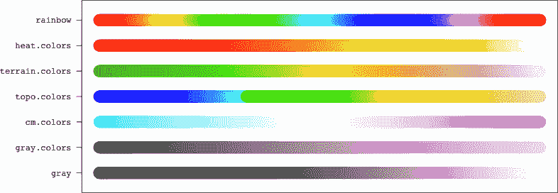

*图 25-2：展示了内置调色板的颜色范围，使用的是`gray.colors`的默认限制。*

欲了解更多信息，请访问帮助文件`?gray.colors`和`?gray`，了解各自的灰度调色板，其它的则都在`?rainbow`中。

#### ***25.1.3 自定义调色板***

你并不局限于使用现成的颜色设计。函数`colorRampPalette`允许你创建自己的调色板；你只需为同名参数提供两个或更多的期望关键颜色，它就会创建一个在这些颜色之间过渡的调色板。调用`colorRampPalette`的结果本身就是一个函数——其行为与前面提到的内置调色板函数完全相同。

假设你希望能够在紫色和黄色之间生成颜色。你需要指定要插值的关键颜色，并按所需的顺序将它们作为字符向量的名称，选择 R 所识别的颜色集合中的名称。以下代码行创建了这个调色板函数：

```
R> puryel.colors <- colorRampPalette(colors=c("purple","yellow"))
```

让我们再创建一个，这次选择一个颜色稍微清晰一些的调色板，以防使用它的颜色图打印为灰度图（在这种情况下，使用单色调色板是个好主意）。

```
R> blues <- colorRampPalette(colors=c("navyblue","lightblue"))
```

这里有更多的示例，这次使用了超过两种颜色：

```
R> fours <- colorRampPalette(colors=c("black","hotpink","seagreen4","tomato"))
R> patriot.colors <- colorRampPalette(colors=c("red","white","blue"))
```

创建了一些自定义调色板函数后，你现在可以像以前一样从每个范围中生成任意数量的颜色（这里使用之前存储的`N`值，即每个 600 个）。完成后，你可以调整之前的绘图代码，得到图 25-3 中的图像。

```
R> py <- puryel.colors(N)
R> bls <- blues(N)
R> frs <- fours(N)
R> pat <- patriot.colors(N)
R> dev.new(width=8,height=2)
R> par(mar=c(1,8,1,1))
R> plot(1,1,xlim=c(1,N),ylim=c(0.5,4.5),type="n",xaxt="n",yaxt="n",ann=FALSE)
R> points(rep(1:N,4),rep(4:1,each=N),pch=19,cex=3,col=c(py,bls,frs,pat))
R> axis(2,at=4:1,labels=c("peryel.colors","blues","fours","patriot.colors"),
        family="mono",las=1)
```

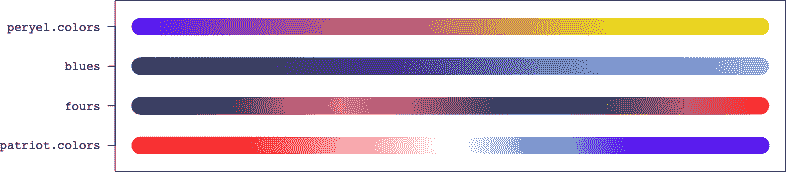

*图 25-3：一些使用`colorRampPalette`创建的自定义颜色调色板示例。*

#### ***25.1.4 使用颜色调色板对连续值进行索引***

你已经多次看到如何使用颜色来根据分类变量标识组（属于某一特定级别的数据简单地被赋予一个与其他数据不同的颜色），这其实很容易实现。然而，给连续值适当地分配颜色则需要更多的思考。为此有两种方法：通过分类或通过标准化连续值。我们首先来看第一种方法。

##### **通过分类**

根据连续变量为值着色的一种方法是将其转化为为分类变量着色的熟悉问题。你可以通过将连续值分箱为固定数量的*k*类，从你的调色板中生成*k*种颜色，并根据每个观测值所属的箱子匹配相应的颜色。

在第 20.1 节，你绘制了来自`MASS`包的`survey`数据的身高与书写手跨度之间的关系。这一次，我们使用颜色来额外表达非书写手跨度变量。加载该包并执行以下代码：

```
R> surv <- na.omit(survey[,c("Wr.Hnd","NW.Hnd","Height")])
```

这将创建数据框对象`surv`，它只包含三个必要的列。通过调用`na.omit`去除所有包含缺失值的行（参见第 6.1.3 节）。

现在，首先要做的是决定你的调色板。

```
R> NW.pal <- colorRampPalette(colors=c("red4","yellow2"))
```

这将生成从比例尺下端的深暗红色到上端稍微褪色的黄色的颜色（类似于内置的`heat.colors`调色板；见图 25-2）。接下来，你需要决定你将为连续值构建多少个箱子，*k*。这将决定从`NW.pal`生成多少种不同的颜色。对于这些数据，设置*k* = 5。

```
R> k <- 5
R> ryc <- NW.pal(k)
R> ryc
[1] "#8B0000" "#A33B00" "#BC7700" "#D5B200" "#EEEE00"
```

你的五种`NW.pal`颜色，作为十六进制代码，已经准备好。接下来，你需要实际对连续值进行分箱，可以使用`cut`来实现。首先，你需要设置*k* + 1 个分割点（参见第 4.3.3 节复习），使用`seq`。

```
R> NW.breaks <- seq(min(surv$NW.Hnd),max(surv$NW.Hnd),length=k+1)
R> NW.breaks
[1] 12.5 14.7 16.9 19.1 21.3 23.5
```

六个等距的值跨越学生的非书写手的跨度范围，划定了你的五个目标箱子。然后，`cut`根据这些箱子对非书写手的跨度进行因子化。你可以使用`as.numeric`特意返回索引，以从`ryc`中的五个有序十六进制代码提取每个观测值的适当颜色（由于打印原因，这里省略了完整输出）。

```
R> NW.fac <- cut(surv$NW.Hnd,breaks=NW.breaks,include.lowest=TRUE)
R> as.numeric(NW.fac)
  [1] 3 4 3 4 3 3 3 4 3 3 2 4 3 3 4 4 4 5 4 3 4 4 5 4 3 3 4 4 2 3 5
 [32] 3 2 3 4 1 3 5 5 3 3 5 4 3 4 5 3 2 3 4 5 3 4 3 3 4 3 3 3 4 2 3
 [63] 2 3 3 3 3 4 3 5 3 3 3   --snip-
R> NW.cols <- ryc[as.numeric(NW.fac)]
R> NW.cols
  [1] "#BC7700" "#D5B200" "#BC7700" "#D5B200" "#BC7700" "#BC7700"
  [7] "#BC7700" "#D5B200" "#BC7700" "#BC7700"   --snip--
```

你已经准备好绘图；以下结果见图 25-4 左侧：

```
R> plot(surv$Wr.Hnd,surv$Height,col=NW.cols,pch=19)
```

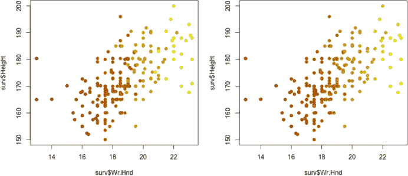

*图 25-4：展示两种根据连续值为点着色的方法：通过分类（左）和通过归一化（右）*

##### **通过归一化**

使用分类法通过颜色为连续值进行索引有点过于简单。你可以通过多种方式将观测值分箱，例如，你的图可能与另一个人设计的相同图表看起来完全不同。从计算的角度来看，保留你的连续数据不变是更准确（更优雅）的做法。

回想一下第 25.1.2 节中提到的内置`gray`调色板。这个函数的行为与其他函数略有不同。它不是简单地要求你从指定的调色板中选择颜色数量，而是要求你提供一个数值向量，以告知 R 在从 0 到 1 的连续范围内，调色板“走多远”。这种行为非常适合当前的任务，因为你的原始数据也是连续的。为了实现这一点，你需要两样东西：一种能够像`gray`一样行为的调色板，以及一个*归一化*后的连续值版本，这些值必须落在 0 到 1 的标准化范围内（包括 0 和 1）。

`colorRamp`函数允许你创建调色板，并且与`colorRampPalette`的用法相同，但返回的结果是一个颜色调色板函数，期望输入一个数值向量。你将很快看到这一点。为了将一组原始值 {*x*[1], ..., *x*[n]} 转换为，比如说， {*z*[1], ..., *z*[n]}，其中 0 ≤ *z[i]* ≤ 1；*i* = 1, ..., *n*，你可以使用以下公式：

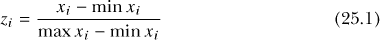

让我们通过在 R 编辑器中编写以下代码将其转化为一个 R 函数：

```
normalize <- function(datavec){
    lo <- min(datavec,na.rm=TRUE)
    up <- max(datavec,na.rm=TRUE)
    datanorm <- (datavec-lo)/(up-lo)
    return(datanorm)
}
```

基于 `datavec` 向量作为唯一参数，`normalize` 实现了公式 (25.1)，使用可选的 `na.rm` 参数来确保 `datavec` 中的任何缺失值不会污染最小值和最大值的计算（见第 13.2.1 节）。

导入 `normalize`，并输入以下代码，它展示了原始的非书写手跨度值（来自你之前创建的 `surv` 对象）及其对应的归一化值（为了简洁，输出被省略）：

```
R> surv$NW.Hnd
  [1] 18.0 20.5 18.9 20.0 17.7 17.7 17.3 19.5 18.5 17.2 16.0 20.2
 [13] 17.0 18.0 19.2 20.5 20.9 22.0 20.7    --snip-
R> normalize(surv$NW.Hnd)
  [1] 0.50000000 0.72727273 0.58181818 0.68181818 0.47272727
  [6] 0.47272727 0.43636364 0.63636364     --snip--
```

现在，你需要使用`colorRamp`创建一个新的颜色调色板版本。

```
R> NW.pal2 <- colorRamp(colors=c("red4","yellow2"))
```

根据归一化数据为每个观测值生成相应的颜色。

```
R> ryc2 <- NW.pal2(normalize(surv$NW.Hnd))
```

如果你实际查看`ryc2`中返回的对象，你会注意到它是一个 RGB 三元组矩阵，对应于你提供给`colorRamp`函数`NW.pal2`的每个归一化值（非整数值最终会被强制转换为整数）。在你将它们用于绘图之前，需要将这些值转换为十六进制代码。像在第 25.1.1 节中看到的那样，使用`rgb`函数，你将得到所需的向量（为打印简洁，已省略）。

```
R> NW.cols2 <- rgb(ryc2,maxColorValue=255)
R> NW.cols2
  [1] "#BC7700" "#D3AD00" "#C48A00" "#CEA200" "#B97000" "#B97000"
  [7] "#B66700" "#CA9700" "#C18100" "#B56500"   --snip--
```

注意你在`NW.cols2`中获得的十六进制代码和在`NW.cols`中获得的十六进制代码之间的差异。在这里，你为每个独特的值获取一个十六进制代码，但对于分类后的`NW.cols`，你每个分箱只有一个十六进制代码（所以只有*k* = 5 种颜色）。

这一行生成了图 25-4 右侧的图像。

```
R> plot(surv$Wr.Hnd,surv$Height,col=NW.cols2,pch=19)
```

就这个相对简单的例子而言，两种方法之间的视觉差异很小，尽管仔细观察，你确实可以辨认出归一化版本中更平滑的颜色过渡。当你增加 *k* 值时，使用分类技术的视觉效果将越来越接近归一化方法。然而，通常应优先选择归一化方法，因为它更贴合你想要可视化的值的连续特性，并且对于分布偏斜的值或使用复杂色板时更为有效。

#### ***25.1.5 包含颜色图例***

现在你可以在图形中有效使用颜色，你需要一个图例来参考颜色尺度。尽管使用基础 R 工具也可以创建图例，但使用 R 中的贡献功能通常会更简单。

一个有用的函数是 `colorlegend` 命令。这个函数位于 `shape` 包中（Soetaert, 2014），因此首先需要从 CRAN 下载并安装 `shape` 包。接下来的代码将加载该包，重新绘制最近的图形（基于之前创建的 `surv` 对象，并显示在图 25-4 的右侧），并绘制颜色条图例：

```
R> library("shape")
R> plot(surv$Wr.Hnd,surv$Height,col=NW.cols2,pch=19,
        xlab="Writing handspan (cm)",ylab="Height (cm)")
R> colorlegend(NW.pal(200),zlim=range(surv$NW.Hnd),zval=seq(13,23,by=2),
               posx=c(0.3,0.33),posy=c(0.5,0.9),main="Nonwriting handspan")
```

这个结果见于图 25-5 的左侧。

`colorlegend` 函数假设你已经在活动的图形设备中创建了一个图形，因此你需要先创建一个图形。你传递给 `colorlegend` 的第一个参数是你想要参考的值的颜色范围。使用像 `?rainbow` 帮助文件中列出的颜色调色板函数或通过 `colorRampPalette` 创建的函数最为简便——换句话说，一个接受整数值的函数，告诉它需要生成多少种颜色。使用大量颜色时，可以得到平滑的色带，因此我使用 `NW.pal(200)`。接下来，使用 `zlim` 为 `colorlegend` 提供一个值的范围，这个值将被图例所参考，在这个例子中，是非写手手势的范围 `range(surv$NW.Hnd)`。`zval` 参数接受你希望在图例上标记的值。一个从 13 到 23，步长为 2 的序列被标记了出来。

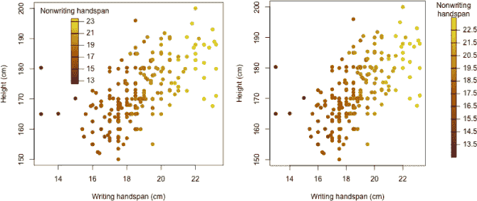

*图 25-5：使用来自贡献包* `shape` *的* `colorlegend` *函数实现颜色条图例的两个例子*

颜色图例的位置和大小是通过`posx`和`posy`参数来控制的。这两个参数并非使用用户坐标，而是必须是一个长度为 2 的向量，在*相对设备坐标*下描述条形的水平（`posx`）和垂直（`posy`）长度。在这个例子中，`posx=c(0.3,0.33)`指示函数从设备左侧的 30%到 33%之间绘制图例的宽度，使得宽度占整个设备的 3%，并且位置靠左于中心。设置`posy=c(0.5,0.9)`表示你希望条形的长度覆盖设备的 40%，从底部 50%的位置到 90%之间。最后，你可以通过向`main`提供一个字符字符串为图例添加标题。

你可能需要通过试验和错误的方式来调整图例的位置、大小（以及使用`zval`设置适当的刻度标记）。`posx`和`posy`的设备特定性意味着如果你重新调整设备大小，可能需要重新评估这些参数的值。

如果你希望图例出现在默认绘图区域之外，可以很容易地在第一次调用`plot`时使用`xlim`参数来加宽绘图的横向大小，从而为绘制完整的图例腾出额外的空间。或者，你也可以通过调整图形或外边距的间距（参考第 23.2 节）来为图例腾出足够的空间，使其出现在绘图区域之外。以下代码段通过加宽右边距、重新绘制散点图，并将颜色图例插入到额外的空间中，完成了这一操作。

```
R> par(mar=c(5,4,4,6))
R> plot(surv$Wr.Hnd,surv$Height,col=NW.cols2,pch=19,
        xlab="Writing handspan (cm)",ylab="Height (cm)")
R> colorlegend(NW.pal(200),zlim=range(surv$NW.Hnd),zval=13.5:22.5,digit=1,
               posx=c(0.89,0.91),main="Nonwriting\nhandspan")
```

结果如图 25-5 右侧所示。图例比之前更窄，右侧仅占设备宽度的 2%，`posx=c(0.89,0.91)`。由于没有指定`posy`，`colorlegend`使用了默认值`c(0.05,0.9)`，这使得颜色条几乎覆盖了设备的整个高度。新图例的刻度标记和标签现在以 1 为增量，范围从 13.5 到 22.5；请注意，要显示小数位数（也就是说，*有效数字*），你需要将`digit`参数从默认值`0`调整为其他值。在此，`digit=1`将刻度标签显示为一位小数。

你还可以控制这些图例的更多属性，包括标签样式和刻度标记的位置；有关详细信息，请参阅`?colorlegend`帮助文件。你也可以考虑查看贡献的`plotrix`包中同名的函数`color.legend`（Lemon, 2006），它提供了一种稍微不同的方法来绘制现有 R 图上的颜色图例。

#### ***25.1.6 不透明度***

另一个有用的技能是能够指定迄今为止讨论的任何颜色和色板的透明度。所有提供十六进制代码的函数都有一个可选参数 `alpha`，其有效范围取决于函数（你可以快速查阅相关文档了解详细信息）。例如，`rgb` 函数使用 `maxColorValue` 来设定透明度的上限，而像 `rainbow` 这样的色板函数都使用 0 到 1 之间的标准化范围（就像在 第二十四章 中创建的 `ggplot2` 图表一样）。

默认情况下，R 在创建颜色时假定完全不透明。然而，当显式设置透明度时，十六进制代码会略有变化。此时，`#` 后面将不再是六个字符，而是八个字符，最后两个字符包含额外的透明度信息。考虑以下代码行，它们分别生成了四种不同版本的红色：默认、不透明度为零、40% 不透明度（0.4 × 255 = 102）和完全不透明：

```
R> rgb(cbind(255,0,0),maxColorValue=255)
[1] "#FF0000"
R> rgb(cbind(255,0,0),maxColorValue=255,alpha=0)
[1] "#FF000000"
R> rgb(cbind(255,0,0),maxColorValue=255,alpha=102)
[1] "#FF000066"
R> rgb(cbind(255,0,0),maxColorValue=255,alpha=255)
[1] "#FF0000FF"
```

请注意，第一种和最后一种颜色是相同的；只是最后一个十六进制代码明确指定了完全不透明。

你可以通过 `alpha.f` 参数（该参数的取值范围是 0 到 1）调整任何已有颜色的透明度，该参数属于随时可用的 `adjustcolor` 函数。以下代码将前一个示例中创建的默认红色十六进制代码转化为 40% 不透明的版本（即前面代码中的第三行）：

```
R> adjustcolor(rgb(cbind(255,0,0),maxColorValue=255),alpha.f=0.4)
[1] "#FF000066"
```

你已经在 第 24.2.1 节 中简要接触过此命令，当时你使用基础 R 图形绘制了一个 LOESS 平滑趋势的透明灰色置信区间。该方法同样适用于使用内置或自定义色板函数生成的十六进制代码，以获得颜色向量。

你将通过内置的 `quakes` 数据框进行透明度测试，该数据框包含关于斐济附近 1,000 个地震事件的数据。我们来重新创建 图 13-6 中的图表，该图显示了“检测站数量”与“事件震级”之间的关系，并通过颜色来识别连续的“深度”数据。由于有许多重叠的观测点，因此降低每个点的透明度对可视化是一个不错的选择。代码如下：

```
R> keycols <- c("blue","red","yellow")
R> depth.pal <- colorRampPalette(keycols)
R> depth.pal2 <- colorRamp(keycols)
```

设置一个自定义的三色调色板，支持两种方式（换句话说，作为一个期望整数的函数 `depth.pal` 和作为一个期望介于 0 和 1 之间值的函数 `depth.pal2`；参考 第 25.1.3 节 和 25.1.4 节）。接下来，以下代码行使用标准化方法，通过在 第 25.1.4 节 中定义的 `normalize` 函数，根据数据集的“深度”变量获得适当的颜色，用于绘制图上的点：

```
R> depth.cols <- rgb(depth.pal2(normalize(quakes$depth)),maxColorValue=255,
                     alpha=0.6*255)
```

60% 不透明度的请求是通过调用 `rgb` 时的 `alpha` 参数来实现的。你可以使用以下调用来创建图表，该调用将颜色存储在 `depth.cols` 中：

```
R> plot(quakes$mag,quakes$stations,pch=19,cex=2,col=depth.cols,
        xlab="Magnitude",ylab="No. of stations")
```

这个图表提供了另一个机会来展示 `shape` 包中的 `colorlegend` 函数。假设你已经在当前 R 会话中加载了 `shape`，接下来的代码行将在图表区域内绘制一个相应的颜色图例（在默认大小的设备上）：

```
R> colorlegend(adjustcolor(depth.pal(20),alpha.f=0.6),
               zlim=range(quakes$depth),zval=seq(100,600,100),
               posx=c(0.3,0.32),posy=c(0.5,0.9),left=TRUE,main="Depth")
```

这里你可以看到另一个 `adjustcolor` 的使用示例，其中通过调用 `depth.pal(20)` 生成的颜色序列随后被减少到 60% 的不透明度，以匹配绘制的点。同样，`posx` 和 `posy` 用于定位图例，且可选的逻辑参数 `left` 被设置为 `TRUE`，使得刻度标记和颜色图例标签显示在条形的左侧。图 25-6 显示了最终结果。

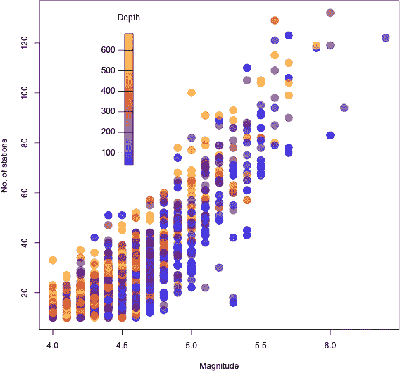

*图 25-6：在自定义调色板中改变颜色不透明度，用于在“站点数量”与“震级”图中索引连续的“事件深度”观察，并使用 `shape` 包中的 `colorlegend` 绘制相应的颜色图例*

#### ***25.1.7 RGB 替代方案与进一步的功能***

RGB 三元组并不是 R 中表示颜色的唯一方式。其他的表示方法包括色相-饱和度-明度（HSV）和色相-色度-亮度（HCL），这些可以通过内置的 `hsv` 和 `hcl` 函数来实现。这些方法的工作原理与 `rgb` 类似，你指定三种成分的影响强度，随后会得到相应的字符字符串十六进制代码，这些代码可以形成有效的 R 颜色，用于任何相关的绘图命令。实际上，HSV 参数化是内置调色板的实现方式，如 第 25.1.2 节中详细介绍的 `rainbow` 和 `heat.colors`。

贡献的功能提供了更大的灵活性。`colorspace` 包（Ihaka 等，2015）可以在不同的颜色格式之间转换，值得注意，`RColorBrewer`（Neuwirth, 2014）也值得一提，它直接基于 Cynthia Brewer 设计的广受好评的颜色方案（见 *[`colorbrewer2.org/`](http://colorbrewer2.org/)*）。`RColorBrewer` 提供了比内置功能 `colorRampPalette` 和 `colorRamp` 更多的调色板选项。也就是说，从入门的角度来看，你会发现这里讨论的 RGB 和基础 R 功能对于大多数数据和模型的可视化探索来说已经足够。

**练习 25.1**

确保已加载`car`包。重新访问你在练习 24.1（第 622 页）和 24.2（第 628 页）中查看过的`Salaries`数据框，并查看帮助文件`?Salaries`以提醒自己有关变量的信息。你的任务是使用颜色、点大小、透明度和点字符类型，在“薪水”与“服务年限”的散点图中，反映“获得博士学位的年数”、“性别”和“职级”，完成以下步骤：

1.  设置一个自定义色板，从`"black"`到`"red"`再到`"yellow2"`。创建两个版本的色板——一个期望多个颜色，另一个期望一个在 0 和 1 之间的标准化值向量。

1.  创建两个向量，用来控制点字符和字符扩展，遵循（i）和（ii）的指南。每个向量都可以通过根据数据框中相应因子向量的数值强制转换来进行子集/重复操作，在一行中完成。

    1.  使用点字符`19`、`17`和`15`依次引用三个递增的学术职级。

    1.  为女性使用字符扩展`1`，为男性使用字符扩展`1.5`。

1.  使用第 25.1.4 节中定义的`normalize`函数，创建一个“获得博士学位年数”变量的[0,1]标准化版本。然后，使用（a）中的适当色板，并结合`rgb`将这些值转换为所需的十六进制代码。

1.  修改你在（c）中创建的颜色向量，调整透明度。与女性对应的颜色透明度应减少到 90%；与男性对应的颜色透明度应减少到 30%。

1.  现在，开始绘制图形；将默认的图形边距调整为底部 4 行、左侧 5 行、顶部 4 行和右侧 6 行。将薪水绘制在*y*-轴上，将服务年限绘制在*x*-轴上。根据你在（d）中创建的向量设置相应的点颜色，并根据你在（b）中创建的向量设置点字符和字符扩展。整理好*x*-轴和*y*-轴的标题。

1.  按照（i）和（ii）的指南，合并两个单独的图例。两个图例应该是水平放置的，且应放松裁剪以允许它们放置在图形边距中（参见第 23.2.3 节）。

    1.  将第一个图例放置在用户坐标`x=-5`和`y=265000`的位置。它应使用“职级”因子向量的各个水平作为参考文本，并将这些文本与对应的`pch`符号进行配对。为图例添加一个合适的标题。

    1.  第二个图例应放置在第一个图例旁边，使用`40`的*x*-坐标和相同的*y*-坐标值。该图例应显示两个点，都是红色的，类型为`19`，但通过改变字符扩展和透明度来引用性别的两个水平。

1.  最后，确保`shape`包已加载，并使用`colorlegend`函数配合从（a）中选出的适当调色板生成的 50 种颜色，来表示“自博士毕业以来的年数”。你可以将图例的水平和垂直位置保持为默认值。`zlim`范围应设置为与观察数据的范围一致，而通过`zval`设置的刻度值应为 10 到 50 之间的序列，每次增加 10。为颜色图例添加一个合适的标题。

    完成这些后，我的版本如下所示：

    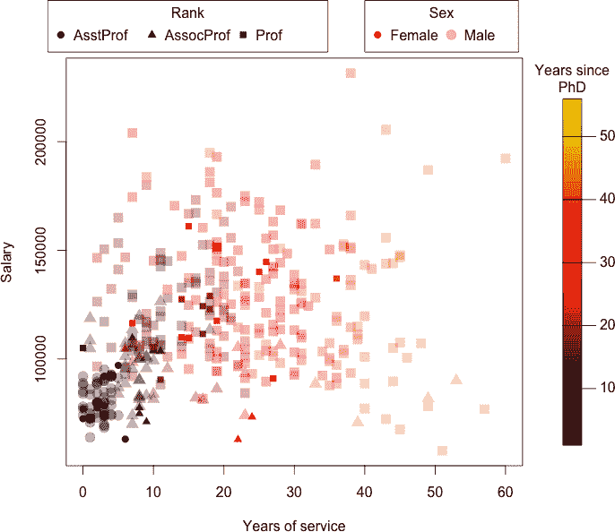

你的下一个任务有些不同。目标是绘制标准正态概率密度函数，但使用颜色对曲线下方的多边形进行着色，表示“与均值的距离”。为此，完成以下任务：

1.  从内置调色板`terrain.colors`生成一个恰好包含 25 种颜色的向量，并命名为`tcols`。然后，使用`tcols[25:1]`得到它的反转版本，将这两个向量拼接在一起，形成一个新的长度为 50 的向量，其中前 25 种颜色按一种方式着色，接着这 25 种颜色按相反的方式着色。

1.  接下来，创建并存储一个精确的 51 个值的均匀间隔序列，范围从−3 到 3（包括 3）；命名为`vals`。使用`dnorm`计算并存储标准正态密度曲线的对应 51 个值；命名为`normvals`。

1.  通过绘制（i）中的值作为一条线来绘制标准正态密度曲线（记得`type="l"`）。在同一次调用`plot`中，使用第二十三章中的知识，将*X*轴和*Y*轴的样式设置为`"i"`类型；用空字符串隐藏两个轴的标题；将四周的框改为*L*形状；并禁止绘制*X*轴。给图形添加一个合适的主标题。

1.  要在曲线下方着色不同的颜色，使用`for`循环，遍历 1 到 50 的整数。在每次迭代中，循环应调用`polygon`（参考第 15.2.3 节）。假设你的索引变量是`i`，则每个多边形的顶点应由向量`vals[rep(c(i,i+1),each=2)]`和`c(0,normvals[c(i,i+1)],0)`构成。每个多边形应隐藏其边框，并根据在（h）中创建的长度为 50 的颜色向量的相应`i`项着色。

1.  最后，确保`shape`包已经加载，并使用你长度为 50 的颜色向量生成一个默认位置的颜色图例，用来表示“与均值的距离”。你可以通过`vals`轻松设置调用`colorlegend`时的`zlim`和`zval`参数。为图例添加一个合适的标题。我的结果如下所示：

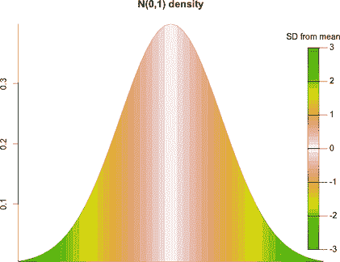

### **25.2 三维散点图**

本节将介绍如何创建 3D 散点图，这使你可以基于三个连续变量一次性绘制原始观察数据，而不仅仅是传统 2D 散点图中的两个变量。接着，你将学习如何增强你的 3D 散点图，以表示更多的变量并使其更易于解读。有多种方法可以在 R 中创建三变量散点图，但通常采用的方式是使用同名的贡献包中的 `scatterplot3d` 函数（Ligges 和 Mächler, 2003）。

#### ***25.2.1 基本语法***

`scatterplot3d` 函数的语法类似于默认的 `plot` 函数。在后者中，你提供 *x* 和 *y* 轴坐标的向量；在前者中，你仅需提供额外的第三个向量，提供 *z* 轴坐标。通过这个额外的维度，你可以将这三个坐标轴视为：*x* 轴从左到右增加，*y* 轴从前景到背景增加，*z* 轴从下到上增加。

安装并加载 `scatterplot3d` 包，我们直接进入一个示例。回想一下著名的鸢尾花数据，你第一次在第 14.4 节中接触到该数据集。这个数据集包含了四个连续变量的测量值（花瓣长度/宽度和萼片长度/宽度）以及一个分类变量（花卉物种）；`iris` 数据框可以直接从 R 提示符获取，因此无需加载任何内容。输入以下命令，以便快速访问构成数据的测量值：

```
R> pwid <- iris$Petal.Width
R> plen <- iris$Petal.Length
R> swid <- iris$Sepal.Width
R> slen <- iris$Sepal.Length
```

基本的 3D 散点图，例如花瓣长度、花瓣宽度和萼片宽度，可以通过以下代码实现：

```
R> library("scatterplot3d")
R> scatterplot3d(x=pwid,y=plen,z=swid)
```

就这么简单——此代码的结果如图 25-7 左侧所示。在这里，你可以观察到所有三个绘制变量之间的一般正相关关系。前景中还有一簇明显孤立的观察值，它们具有相对较大的萼片宽度，但花瓣测量值较小。

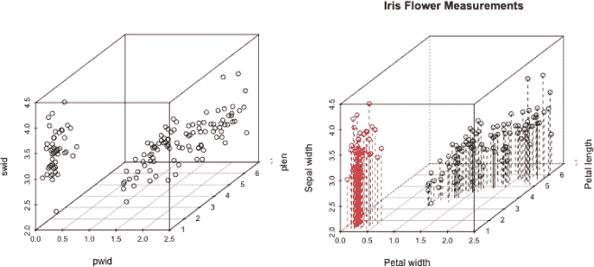

*图 25-7：两种 3D 散点图，展示了著名的* `iris` *数据，花瓣宽度、花瓣长度和萼片宽度分别在* x*、* y* 和* z* 轴上。左：基本的默认外观。右：整理标题并增加视觉增强，以通过颜色和垂直线条标记来强调 3D 深度和可读性。*

#### ***25.2.2 可视化增强***

即便有默认绘制的盒子和 *x*-*y* 平面网格线，仍然很难清晰地感知图中点云的深度。因此，你可以对 `scatterplot3d` 图表进行几个可选的增强—通过给点上色来帮助更清晰地表达前景到背景的过渡，并通过设置 `type="h"` 参数来绘制垂直于 *x*-*y* 平面的线条。

图 25-7 中的右侧图显示了这些增强效果的图表，并且是以下操作的结果：

```
R> scatterplot3d(x=pwid,y=plen,z=swid,highlight.3d=TRUE,type="h",
                 lty.hplot=2,lty.hide=3,xlab="Petal width",
                 ylab="Petal length",zlab="Sepal width",
                 main="Iris Flower Measurements")
```

`xlab`、`ylab`、`zlab`和`main`控制三个坐标轴和图形本身的标题。

垂直线使得读取点的数值更加容易。默认情况下，在`type="h"`图中，这些线是实线，但你可以通过`lty.hplot`参数来修改（它的行为与标准图形参数`lty`相同）；设置`lty.hplot=2`会要求使用虚线。同样，你也可以修改“不可见”边框的线型；设置`lty.hide=3`会要求图表将这些线绘制为点线。

设置`highlight.3d=TRUE`通过根据点在*y*轴的位置应用从红色到黑色的颜色过渡来强调 3D 深度。这是有用的，但也有一个重要的后果——这意味着你不能再使用颜色来表示图表中的第四个变量。

按照这个思路，请记住`iris`数据集还包含一个第四个连续变量，即花萼长度（在第 25.2.1 节中存储为`slen`），但你在图 25-7 中的任何图表里都没有展示它。你也没有展示花卉物种的分类变量，所以我们来解决这个问题。首先，为缺失的测量变量设置一个颜色带，利用你在第 25.1.4 节中了解到的，通过颜色调色板引用一个连续变量的知识。

```
R> keycols <- c("purple","yellow2","blue")
R> slen.pal <- colorRampPalette(keycols)
R> slen.pal2 <- colorRamp(keycols)
R> slen.cols <- rgb(slen.pal2(normalize(slen)),maxColorValue=255)
```

请注意，要运行最后一行代码，你需要在当前会话中定义第 25.1.4 节中的`normalize`函数。

以下代码生成了 3D 散点图，并且也使用了`pch`参数来区分三种不同的物种：

```
R> scatterplot3d(x=pwid,y=plen,z=swid,color=slen.cols,
                 pch=c(19,17,15)[as.numeric(iris$Species)],type="h",
                 lty.hplot=2,lty.hide=3,xlab="Petal width",
                 ylab="Petal length",zlab="Sepal width",
                 main="Iris Flower Measurements")
```

我使用了向量`c(19,17,15)`，并将`iris$Species`向量强制转换为数字后传递给方括号，以将`pch`字符编号与如下内容配对：`19`对应*Iris setosa*（因子中的第一个水平），`17`对应*Iris versicolor*（第二个水平），`15`对应*Iris virginica*（第三个水平）（请参见图 7-5 以及第 133 页了解不同的点字符类型）。

然后，你可以插入一个参考物种的图例，使用常见的`legend`调用。

```
R> legend("bottomright",legend=levels(iris$Species),pch=c(19,17,15))
```

通过一些实验，你还可以包含一个颜色条图例（确保你已经加载了`shape`包，以便可以使用`colorlegend`函数，参考第 25.1.4 节）。

```
R> colorlegend(slen.pal(200),zlim=range(slen),zval=5:7,digit=1,
               posx=c(0.1,0.13),posy=c(0.7,0.9),left=TRUE,
               main="Sepal length")
```

所有这些的最终结果是图 25-8 中的图像。

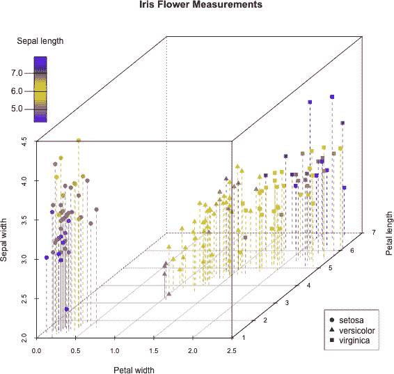

*图 25-8：一个著名的`iris`数据集的 3D 散点图，展示了所有五个变量，并额外使用了颜色（表示花萼长度）和点的形态（表示物种）。*

通过创意地使用颜色和点类型，您现在能够在一个单一的 3D 散点图中展示五维数据。这揭示了关于数据的重要信息。例如，您现在可以识别出*Iris setosa*作为前景中明显分离的点组，并看到虽然*Iris setosa*的花瓣宽度和长度较小，且比其他两种物种（特别是*Iris versicolor*）的萼片宽度要大，但位于量表下端的紫色着色表明它们的萼片长度较小。

**练习 25.2**

确保`scatterplot3d`库已在您当前的 R 会话中加载。

1.  回到`faraway`包中的`diabetes`数据框（您第一次在第 21.5.2 节中查看了这些数据）。您的目标是根据以下指南，生成一个包含体重、髋部和腰围测量值的`scatterplot3d`图：

    – 髋部、腰围和体重变量应分别对应于*x*轴、*y*轴和*z*轴；提供整洁的轴标题。

    – 使用内置功能，确保通过颜色突出显示 3D 深度。

    – 选择两种不同的点字符来反映性别。

    – 在左上角的空白区域放置一个简单的图例，引用这两种点字符和性别。

1.  根据以下指南，创建一个内置的`airquality`数据集的 3D 散点图，您第一次在第 24.2.2 节中遇到该数据集：

    – 使用`na.omit`创建数据框的副本，移除所有包含缺失值的行，并使用该副本进行操作。

    – 将风速和太阳辐射分别绘制在*x*轴和*y*轴上，使用*z*轴绘制温度。

    – 在*x*–*y*平面上应用垂直虚线，延伸至每个观测点。

    – `airquality`数据包含了从 5 月到 9 月五个月内的测量数据。每个绘制的点应根据这五个月的顺序，分别取`pch`值从`1`到`5`。

    – 使用从内置的`topo.colors`调色板生成的 50 种颜色的向量，使用分类方法确保每个绘制的点根据其臭氧值着色。

    – 设置一个图例，引用根据月份的五种点类型。

    – 设置一个颜色图例（使用`shape`包中的功能），根据臭氧值进行引用。

    – 确保图表有整洁的轴、主标题和图例标题。

### **25.3 为绘图准备表面**

在本章的其余部分，你将看到三种类型的 3D 绘图，用于可视化一个*双变量表面*。当你有两个变量，并且基于这两个变量定义了一个函数、估计或模型时，这种图形是必需的，并且你希望使用第三个可用轴（换句话说，就是*z*轴）来描绘出结果的表面。你已经通过在第 21.5.4 节中查看`mtcars`数据的响应面（在那里你看到了车重和马力作为自变量时，平均油耗的变化）以及在第 22.3.6 节中研究线性回归模型的诊断工具（在那里你看到了如何将库克距离表示为残差和杠杆的函数）看过双变量函数的例子。

在你开始绘制这些图形之前，理解它们是如何在 R 中创建的非常重要。你关注的函数/估计/模型应该被视为一个平面或表面，可以根据连续的二维*x*-*y*坐标发生变化。绘制一个完全连续的表面在技术上是不可能的，因为那需要你在无限多个坐标上评估函数。因此，表面的评估通常是在沿*x*轴和*y*轴均匀间隔的有限*网格*坐标上进行的。每个唯一坐标对下的函数结果被存储在适当大小的矩阵中的相应位置（其大小直接取决于在*x*和*y*轴上评估网格的分辨率），通常被称为*z 矩阵*。

由于所有传统的 R 图形命令在绘制这些双变量函数时都以相同的方式操作——使用这个*z*矩阵——因此理解这个矩阵是如何构建、排列和由这些命令解释的至关重要，以确保你能正确地绘制结果。在本节中，你将通过在一个假设情境中熟悉这一构造，为本章其余部分中讨论的特定绘图类型做好准备。

#### ***25.3.1 构建评估网格***

假设你有一个双变量函数，它生成一个定义在*x*轴的 1 到 6 之间和*y*轴的 1 到 4 之间的连续表面。你可以使用`seq`在这些坐标范围内定义均匀间隔的序列；为了简化，我们就直接用整数来定义。

```
R> xcoords <- 1:6
R> xcoords
[1] 1 2 3 4 5 6
R> ycoords <- 1:4
R> ycoords
[1] 1 2 3 4
```

这意味着你计划基于在由 24 个唯一位置定义的*x*-*y*值网格上评估感兴趣的双变量函数来绘制你的表面。

当传入两个向量时，内置的`expand.grid`函数通过简单地将第二个向量中的每个值与第一个向量的整个长度重复，显式生成所有唯一的坐标对。

```
R> xycoords <- expand.grid(x=xcoords,y=ycoords)
```

结果以一个两列的数据框存储，共有 24 行。如果您查看 R 控制台中的`xycoords`对象，您会看到`x`值从`1`到`6`与重复的`y`值`1`配对，然后是`x`从`1`到`6`与`y`值`2`配对，依此类推。

实际操作中，您现在需要使用`xycoords`中的评估网格坐标来计算双变量函数的结果。在这个假设的例子中，假设您的双变量函数生成了从*a*到*x*的 24 个字母，分别对应于`xycoords`中唯一评估坐标的顺序。为了更清晰地说明这一点，看看下面将假设函数结果与每个评估坐标列绑定的示例（请注意，R 中的现成`letters`对象可以快速生成字母）：

```
R> z <- letters[1:24]
R> cbind(xycoords,z)
  x y z
1 1 1 a
2 2 1 b
3 3 1 c
4 4 1 d

--snip--

21 3 4 u
22 4 4 v
23 5 4 w
24 6 4 x
```

这强调了每个唯一的*x*–*y*评估坐标，通过`expand.grid`表示，都将有一个与之相关联的*z*值。所有这些*z*值一起定义了结果的曲面。

#### ***25.3.2 构建 z 矩阵***

用于可视化双变量函数的 3D 图需要将对应于*x*–*y*评估网格的*z*值呈现为适当构建的矩阵。*z*矩阵的大小直接由评估网格的分辨率决定；行数对应于唯一的*x*网格值的数量，列数对应于唯一的*y*网格值的数量。

因此，您需要小心将计算得到的*z*值转换为矩阵。当您的*z*轴向量与标准`expand.grid`方式排列的评估网格相对应时（换句话说，坐标按增加的*x*值和重复的*y*值堆叠），确保您的结果*z*矩阵以默认的列优先方式填充（参见第 3.1.1 节），行和列的数量应该准确代表每个*x*和*y*值序列中的值的数量（分别是之前显示的`xcoords`和`ycoords`）。在当前的例子中，您知道结果*z*矩阵的大小需要是 6 × 4，因为有六个*x*位置和四个*y*位置。

以下是假设“函数结果”向量`z`的正确矩阵表示：

```
R> nx <- length(xcoords)
R> ny <- length(ycoords)
R> zmat <- matrix(z,nrow=nx,ncol=ny)
R> zmat
     [,1] [,2] [,3] [,4]
[1,] "a"  "g"  "m"  "s"
[2,] "b"  "h"  "n"  "t"
[3,] "c"  "i"  "o"  "u"
[4,] "d"  "j"  "p"  "v"
[5,] "e"  "k"  "q"  "w"
[6,] "f"  "l"  "r"  "x"
```

#### ***25.3.3 构思 z 矩阵***

本节最重要的收获是了解当前排列的*z*矩阵如何转换为基于*x*–*y*坐标的绘图。将`zmat`与早期的输出进行比较，您可以看到，沿着`zmat`的列向下移动，意味着对于给定的*y*坐标值，*x*坐标值在增加。换句话说，当这个假设的字母曲面被绘制时，沿着矩阵的一列向下移动对应于在给定的垂直*y*位置下，从左到右水平移动。

图 25-9 提供了这个示例表面的概念图，按`zmat`索引，基于`xcoords`和`ycoords`定义的 24 个唯一坐标。（生成此图形的代码包含在本书的 R 脚本文件中，可以在*[`www.nostarch.com/bookofr/`](https://www.nostarch.com/bookofr/)*找到。）

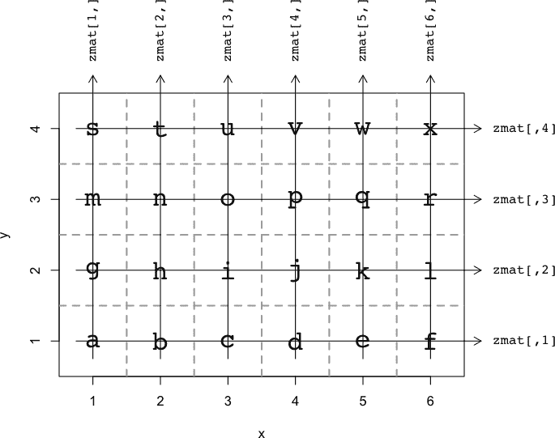

*图 25-9：绘制双变量函数的*z*矩阵概念图，基于 6×4 坐标网格*

当你开始绘制实际的感兴趣表面时，应牢记图 25-9 中所示的*z*矩阵的概念。这个假设示例中使用的 6 × 4 网格较为粗糙。实际上，为了提高表面的视觉效果，你通常会使用更精细的网格，在*x*和*y*序列的分辨率上有所改进。

### **25.4 等高线图**

显示基于二维坐标网格评估函数的表面的最常见图形之一是*等高线图*。等高线图可以通过一系列线条——即等高线——在二维评估网格上绘制来解释，每条等高线表示感兴趣表面上的特定水平。

#### ***25.4.1 绘制等高线***

基于给定的数字*z*矩阵，R 函数`contour`用于生成连接具有相同*z*值的*x*-*y*坐标的等高线。

##### **示例 1：地形图**

作为示例，你将使用另一个现成的数据集——`volcano`对象。这个数据集是一个矩阵，包含新西兰奥克兰地区一座休眠火山上空的海拔（单位：米）；有关详细信息，请参阅`?volcano`文档。要查看地形，你需要`volcano`对象（它是你的*z*矩阵）和相关的*x*和*y*坐标序列。在这种情况下，只需使用与`volcano`矩阵大小相对应的整数（可以通过调用`dim`轻松获取行和列的数量；请参见第 3.1.3 节）。

```
R> dim(volcano)
[1] 87 61
R> contour(x=1:nrow(volcano),y=1:ncol(volcano),z=volcano,asp=1)
```

*x*和*y*序列分别提供给`x`和`y`，而*z*矩阵提供给`z`。可选参数`asp=1`，指的是图形的纵横比，它强制坐标轴以 1:1 的比例处理（当单位具有物理大小解释时，比如在地理区域的绘图中，这一点非常重要——如这里的情况）。

图 25-10 展示了此示例的结果。默认情况下，R 会自动选择绘制等高线的`z`值，以获得视觉上美观的效果。等高线也会根据其对应的*z*值选择性地进行标注。观察地形，可以看到最高点位于左侧的边缘，190 米的椭圆形等高线标记着这个位置，右侧则有一个大约 160 米的凹陷。

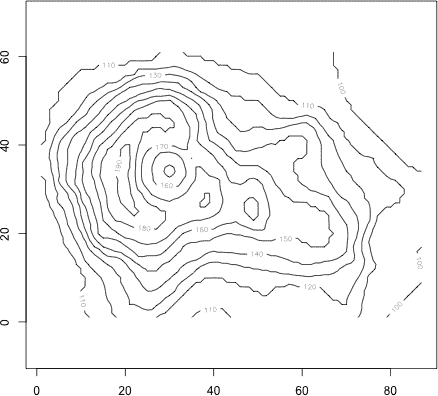

*图 25-10：使用* `contour` *绘制* `volcano` *数据的地形图*

等高线不仅能显示表面上的峰值和谷值，还能显示任何此类特征的“陡峭度”。等高线之间越紧密，双变量函数的整体水平变化越快速。

##### **示例 2：参数响应面**

作为另一个例子，考虑前面提到的对`mtcars`数据拟合的多元线性模型——即由马力、重量及其相互作用预测的每加仑英里数（MPG）。如同在第 21.5.4 节中所示，你可以使用以下代码获取拟合的模型对象：

```
R> car.fit <- lm(mpg~hp*wt,data=mtcars)
R> car.fit

Call:
lm(formula = mpg ~ hp * wt, data = mtcars)

Coefficients:
(Intercept)           hp            wt       hp:wt
   49.80842     -0.12010      -8.21662     0.02785
```

目标是绘制响应，即平均油耗，作为前面所提到的马力和重量的函数。为此，你需要根据前面的模型评估马力和重量值的网格上的平均 MPG。以下代码正是执行这一操作。

```
R> len <- 20
R> hp.seq <- seq(min(mtcars$hp),max(mtcars$hp),length=len)
R> wt.seq <- seq(min(mtcars$wt),max(mtcars$wt),length=len)
R> hp.wt <- expand.grid(hp=hp.seq,wt=wt.seq)
R> nrow(hp.wt)
[1] 400
R> hp.wt[1:5,]
         hp    wt
1  52.00000 1.513
2  66.89474 1.513
3  81.78947 1.513
4  96.68421 1.513
5 111.57895 1.513
```

首先，这段代码在`hp`和`wt`两个变量上设置了均匀间隔的序列（每个序列长度为 20，涵盖观察数据的范围）——这就是你的*x-*和*y*-序列。这意味着将在 20 × 20 = 400 个独特的坐标点上评估拟合模型；这些坐标通过`expand.grid`获取，正如第 25.3 节中所述。

接下来，你可以使用`predict`获取对应的 400 个平均 MPG（*z*）值；由于它已经是所需格式的数据框，`hp.wt`可以直接传递给`newdata`参数。

```
R> car.pred <- predict(car.fit,newdata=hp.wt)
```

然后，你只需将结果向量排列为适当的 20 × 20 *z*矩阵。

```
R> car.pred.mat <- matrix(car.pred,nrow=len,ncol=len)
```

最后，你将结果绘制为等高线，如在图 25-11 中所示。

```
R> contour(x=hp.seq,y=wt.seq,z=car.pred.mat,levels=32:8,lty=2,lwd=1.5,
           xaxs="i",yaxs="i",xlab="Horsepower",ylab="Weight",
           main="Mean MPG model")
```

在此调用中，你可以看到可选的`levels`参数的使用。与让 R 自动决定在哪些*z*值上显示等高线不同，你可以向该参数提供一个数值向量，指定绘制等高线的具体水平。这个数值向量必须与结果的双变量函数在相同的尺度上；在这里，我要求在 32 到 8 的所有整数水平上绘制等高线。我还使用了常见的参数`lty`和`lwd`来控制等高线的外观，这里设置为虚线且比通常的略粗。

此外，特别是对于等高线图，你通常需要偏离默认的坐标轴限制样式，因为默认图形区域中包含的少量额外“填充”空间（参见第 23.4.1 节）可能显得较为突出——再看一眼图 25-10 中的火山等高线图。如前所示，设置`xaxs`和`yaxs`为`"i"`将限制所有绘图在`x`和`y`强加的精确限制内。

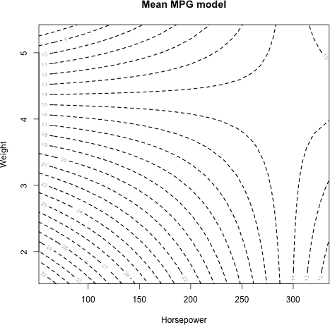

*图 25-11：基于由马力和重量建模的多元线性模型的响应面等高线，数据来自* `mtcars`

##### **示例 3：非参数二元密度估计（地震数据）**

等高线图和本章中的其他图表还履行了一个有用的角色，即可视化二元密度函数。

在第 24.2.2 节中，您了解了核密度估计（KDE）作为一种方法，通过它可以构建数据的平滑概率密度函数估计——本质上是复杂的直方图。KDE 自然地扩展到更高维度，因此您也可以估计*x*-*y*平面中的二元观测密度。这同样涉及在固定坐标网格上可视化一个*z*矩阵。有关多元 KDE 的理论细节，请参阅 Wand 和 Jones（1995）。

将注意力转回到内置的`quakes`数据框，并回想一下 1,000 个地震事件的空间坐标图（例如，图 13-1 在第 265 页，和图 23-1 在第 578 页）。为了估计这些点的概率密度函数，您可以使用`MASS`包中的`kde2d`函数。加载`MASS`并执行以下代码来生成观测二维数据的核密度估计：

```
R> quak.dens <- kde2d(x=quakes$long,y=quakes$lat,n=100)
```

您将二元数据作为`x`和`y`参数提供，分别对应水平和垂直轴。可选参数`n`用于指定在两个轴上的评估坐标数（即实际返回估计的密度曲面的点数）。这定义了通过调用`kde2d`返回的矩阵大小。在这里，您要求在观测数据的范围内，沿 100 × 100 均匀间隔的网格执行 KDE。

生成的对象仅仅是一个包含三个成员的列表。通过`$x`和`$y`访问的组件包含相应轴方向上均匀间隔的评估网格坐标，`$z`则提供对应的*z*矩阵。您可以通过在命令行输入`quak.dens$x`或`quak.dens$y`来确认它们确实是增加的序列，涵盖了观测数据的范围。输入以下内容可以确认感兴趣矩阵的大小：

```
R> dim(quak.dens$z)
[1] 100 100
```

有了这些，您就拥有了显示 KDE 曲面等高线所需的所有元素。下一行代码生成默认的等高线图，如图 25-12 左上角所示。

```
R> contour(quak.dens$x,quak.dens$y,quak.dens$z)
```

`contour`函数有许多更多的可选参数，用于显示您的连续曲面。它也可能有助于同时查看其他数据或原始观测数据（如果它们已以某种方式被用于创建曲面，就像二元 KDE 中的情况一样）。以下代码重新绘制了`quakes`的核密度估计，使用未加填充的轴、与默认值不同的等高线级别和原始观测数据；您可以在图 25-12 的右上角看到结果：

```
R> contour(quak.dens$x,quak.dens$y,quak.dens$z,nlevels=50,drawlabels=FALSE,
           xaxs="i",yaxs="i",xlab="Longitude",ylab="Latitude")
R> points(quakes$long,quakes$lat,cex=0.7)
```

与使用`levels`来确定绘制轮廓的精确等级（如示例 2 中所做）不同，你可以使用`nlevels`参数来指定要显示的*等级数*，函数将自动选择具体的值。在此调用`contour`时，要求绘制 50 个等级。你可以通过设置`drawlabels=FALSE`来抑制自动标签的显示，接着调用`points`将原始观测值添加到图像中。显然，平滑的轮廓线描绘了非参数密度估计，反映了数据的异质空间模式。

更改绘制轮廓的外观不一定要全局进行；你也可以单独更改每个轮廓等级的外观。例如，如果你只想在几个特定的等级上显示轮廓而不显示默认标签（以便专注于表面的形状），但仍希望能够辨认出这些轮廓的值，这时这种方式就非常有用。你也可能想要将轮廓叠加到一个已经绘制其他数据或基于模型的结果的现有图形上。图 25-12 底部的第三个地震 KDE 表面图展示了如何同时实现这两种需求。

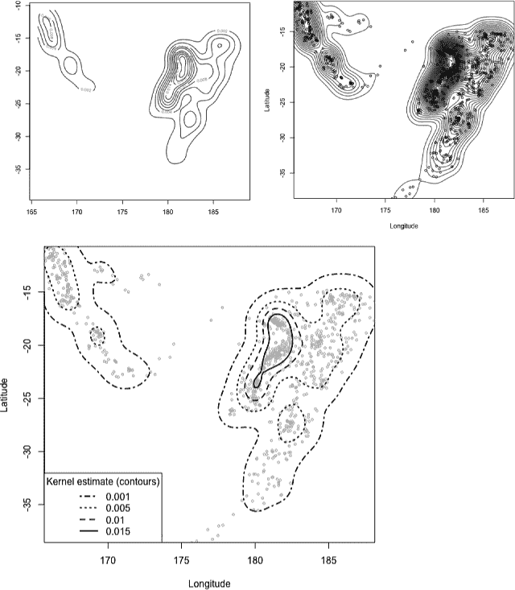

*图 25-12：地震位置空间的双变量核密度估计概率密度函数的轮廓图示例，数据来自`quakes`数据集*

为了开始绘制图形，使用`plot`将地震数据的空间位置绘制为半大小的灰色点，轴的样式通过`xaxs`和`yaxs`进行设置，以去除图形区域边缘的人工填充，并添加轴标题。

```
R> plot(quakes$long,quakes$lat,cex=0.5,col="gray",xaxs="i",yaxs="i",
        xlab="Longitude",ylab="Latitude")
```

然后，在调用`contour`之前，将要绘制轮廓的期望等级存储在一个名为`quak.levs`的向量中（再次强调，选择适当的轮廓等级完全取决于你绘制的表面类型；你至少需要大致了解相关的*z*矩阵中存储的值）。

```
R> quak.levs <- c(0.001,0.005,0.01,0.015)
```

现在，请记住，默认情况下，`contour` 会刷新图形设备并开始一个新的绘图，但当你向现有图形添加等高线时，你需要避免这种情况。为此，你需要明确指定`add=TRUE`。然后，将 `quak.levs` 中指定的四个水平传递给 `levels`，并通过 `drawlabels=FALSE` 来抑制标签。为了控制各个水平上等高线的外观，你需要将整数序列 `4:1` 提供给 `lty`，其中第一个条目 `4` 定义了 *z* = 0.001 时等高线的线型。第二个条目 `3` 指定了 *z* = 0.005 等高线的线型，依此类推。最后，通过单个提供的值 `lwd=2` 将所有绘制的等高线设置为双重粗细。（如果你希望不同的等高线有不同的线粗，也可以在此提供一个包含四个元素的向量。对于其他相关的美学，如通过 `col` 控制颜色，同样可以按元素指定等高线的参数。）

```
R> contour(quak.dens$x,quak.dens$y,quak.dens$z,add=TRUE,levels=quak.levs,
           drawlabels=FALSE,lty=4:1,lwd=2)
```

最后，由于在 `contour` 中抑制了自动标签，因此在图形区域的左下角添加一个图例，通过四种不同的线型来引用等高线的值。

```
R> legend("bottomleft",legend=quak.levs,lty=4:1,lwd=2,
          title="Kernel estimate (contours)")
```

**注意**

*许多内建的和贡献的基本 R 绘图函数，默认情况下会初始化、刷新或打开一个新图形，都包含一个 `add` 参数，如这里所示。这使得你可以将这些函数生成的图形作为现有图形的附加部分来使用。查看相关的帮助文件，看看某个特定命令是否适用。*

#### ***25.4.2 彩色填充等高线***

对于等高线图的简单变体，你可以使用颜色来填充不同水平之间的空隙。结合颜色图例，这样就无需标记等高线，在某些情况下，这可以更容易地直观地解释绘制的 *z*-矩阵表面中的波动。

`filled.contour` 函数为你完成了这一切。你需要将 *x* 轴和 *y* 轴方向上逐渐增大的网格坐标序列以及相应的 *z* 矩阵提供给 `x`、`y` 和 `z` 参数，方法与 `contour` 中相同。指定颜色的最简单方法是将颜色调色板传递给 `color.palette` 参数（默认为内建的 `cm.colors` 调色板；请参见 图 25-2），其余的由 R 自动完成。

让我们使用示例 2 中的 `mtcars` 响应面来快速演示。如果你的工作空间中尚未有相关数据，请使用 第 25.4.1 节中的代码来获取相关的拟合多元线性回归模型、评估网格坐标以及相应的预测结果。在之前定义的 `hp.seq`、`wt.seq` 和 `car.pred.mat` 对象基础上，以下调用将生成 图 25-13：

```
R> filled.contour(x=hp.seq,y=wt.seq,z=car.pred.mat,
           color.palette=colorRampPalette(c("white","red4")),
           xlab="Horsepower",ylab="Weight",
           key.title=title(main="Mean MPG",cex.main=0.8))
```

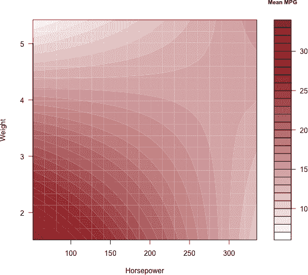

*图 25-13：`mtcars` 数据集的拟合多元线性模型响应面的填充等高线图*

请注意，这个图中没有使用默认的颜色调色板。相反，你为相关参数提供了一个自定义的调色板（这是通过适当调用`colorRampPalette`直接生成的；参考第 25.1.3 节），从下端的白色到上端的深红色。同时注意，尽管*X*轴和*Y*轴的标题像往常一样通过`xlab`和`ylab`提供，但你必须以特定的方式为颜色图例提供标题—通过在`title`中调用`key.title`参数来实现。这是因为`filled.contour`实际上生成了两个图，一个是图像本身，另一个是颜色图例，并使用`layout`命令将它们并排放置。

这种对`layout`的内部使用并不直接构成问题，但正如你在第 23.1.4 节中看到的，如果你想在事后为填充等高线图添加注释（例如，向现有图形中添加点），会有些复杂，因为原始用户坐标系丢失了。

回到空间`quakes`数据的二维核估计（如果你还没有在工作区中获得`quak.dens`对象，可以使用第 25.4.1 节中的代码重新创建）。以下代码使用内置的`topo.colors`调色板创建了密度曲面的填充等高线图，并将绘制的级别数从默认的 20 个改为 30 个。在同一个调用中，通过特别使用可选的`plot.axes`参数，你还可以将原始观测数据点叠加到图像上。图 25-14 显示了结果。

```
R> filled.contour(x=quak.dens$x,y=quak.dens$y,z=quak.dens$z,
                  color.palette=topo.colors,nlevels=30,xlab="Longitude",
                  ylab="Latitude",key.title=title(main="KDE",cex.main=0.8),
                  plot.axes={axis(1);axis(2);
                             points(quakes$long,quakes$lat,cex=0.5,
                                    col=adjustcolor("black",alpha=0.3))})
```

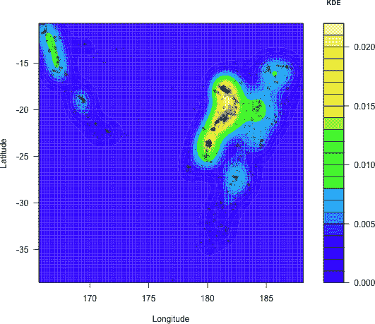

*图 25-14：空间* `quakes` *数据的概率密度函数核估计的填充等高线图，原始观测数据叠加其上。*

看看`plot.axes`的使用方式；它实际上需要一段代码。当调用`plot.axes`时，如果你希望标记的刻度线保持显示，必须明确告诉它标记*X*轴和*Y*轴。这可以通过两次调用`axis`来完成（参考第 23.4.3 节—`axis(1)`表示*X*轴，`axis(2)`用于*Y*轴）。你可以通过调用`points`来添加数据点；在这个例子中，这些点被指示以半尺寸绘制，使用`adjustcolor`设置了 30%的透明度。由于你同时向`plot.axes`参数提供多个单独的命令，每个命令需要用分号（`;`）在大括号（`{ }`）内分隔。

以这种方式注释填充等高线图需要更多的预先思考，因为你需要通过调用`axis`手动添加坐标轴，并在调用`filled.contour`时执行所有随后想要的绘图操作。例如，不能像生成`quakes`的 KDE 表面那样生成一个填充的等高线图，然后再将`points`作为单独的代码行调用。如果你这样做，你会发现观察到的数据点无法正确对齐到它们在坐标轴上原始的用户坐标。

**练习 25.3**

记住，你曾经检查过关于核电厂建设成本的多个线性回归模型，详见第二十一章和第二十二章。现在的目标是通过等高线图视觉评估包括/排除两个连续预测变量之间的交互项的影响。重新访问`nuclear`数据集，该数据集在加载`boot`包时可用，并查看帮助文件以刷新你对其中变量的记忆。

1.  根据以下指导方针，拟合并总结两个线性模型，将建设成本作为响应变量：

    1.  第一个应考虑两个预测变量关于建设许可证发布日期和工厂容量的主要效应。

    1.  第二个模型，除了两个主要效应外，应包括许可证发布日期和容量之间的交互项。

1.  为每个响应面设置适当的* z *矩阵进行绘图。每个矩阵应基于一个 50 × 50 的评估网格，该网格通过在容量和日期变量中使用均匀间隔的序列构建。

1.  在`par`中指定`mfrow`，以便你可以将（a）（i）和（a）（ii）中的两个响应面显示在一起。它们看起来相似吗？这与（a）（ii）中的交互项的统计显著性（或缺乏显著性）有关系吗？

1.  为了直接比较这两个表面，使用你选择的内置颜色调色板，生成仅包含主要效应的模型的填充等高线图，并将交互式模型的等高线叠加在其上。注意以下几点：

    – 这个图是通过一次`filled.contour`调用实现的。回忆一下你是如何使用`plot.axes`在现有的颜色填充等高线图上绘制附加特征的特殊方法。

    – 交互式模型的等高线可以通过适当的`contour`调用添加。回忆一下可选参数`add`的使用。

    – 重叠的等高线应为双倍厚度的虚线。

    – 应包含* x *轴和* y *轴，并为其提供整洁的标题。

    – 添加一些简短的文本，描述填充等高线与等高线的区别，并参考建设成本模型的两个版本，同时通过额外调用`text`来使用来自`locator`的单击位置（参见第 23.3 节）。请注意，这个调用需要完全放松剪辑，以便文本能够在任何边缘区域显示。

    我的结果如下所示。

    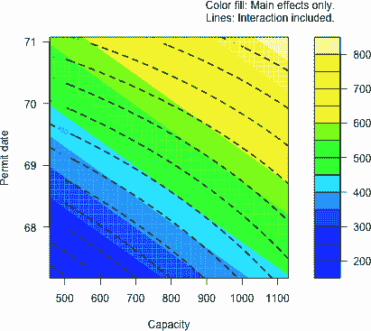

1.  R 中的另一个内置数据框`faithful`包含黄石国家公园老忠实喷泉的等待时间和喷发持续时间的观测数据。有关详细信息，请参见`?faithful`中的文档。使用持续时间作为* y *轴，等待时间作为* x *轴绘制数据。

1.  通过 KDE 估算这些数据的双变量密度，使用 100 × 100 的评估网格，并生成该密度的默认等高线图。

1.  使用从`"darkblue"`到`"hotpink"`的自定义调色板，绘制核密度估计的填充等高线图；将原始数据作为半尺寸的灰色点添加。适当标注坐标轴和标题。

1.  将原始数据重新绘制为灰色的 3/4 大小，`2`号点字符；设置坐标轴的样式，确保坐标轴的范围严格限制为观察数据的范围；并确保坐标轴标题和主标题整洁。在该图中，添加密度估计的等高线，特定水平从 0.002 到 0.014，以 0.004 为步长进行序列计算。抑制等高线的标签显示。等高线应为深红色，并且随着密度水平的增加，线宽应变粗。为每条等高线添加图例，指示密度水平。

    我的(g)和(h)的图像如下所示。

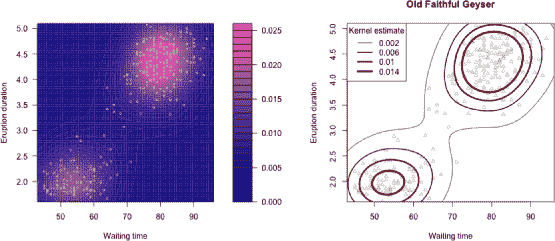

### **25.5 像素图像**

*像素图像*可以说是最直观的连续表面视觉表示，通过有限的评估网格来近似。它的外观类似于填充的等高线图，但图像图允许您更直接地控制每个相关* z *矩阵条目的显示。

#### ***25.5.1 一个网格点 = 一个像素***

将您的* z *矩阵的每个条目视为一个小矩形，其颜色表示其相对值。这些矩形，或称为*像素*，正是图 25-9 中虚线灰色线条所形成的* z *矩阵概念图的单元格。在第 656 页的图中有所显示。这强调了一个重要事实，即评估网格序列（无论是* x *轴还是* y *轴方向）的细密程度直接决定了每个像素的大小，从而影响生成图像的平滑度。较小的像素意味着图像的*分辨率*提高。

内置的`image`函数用于绘制像素图像。与`contour`函数类似，您将* x *和* y *轴的评估网格坐标作为递增序列传递给`x`和`y`参数，并将相应的* z *矩阵传递给`z`。回到在第 25.4.1 节的示例 1 中首次查看的`volcano`数据集，以下代码生成了图 25-15：

```
R> image(x=1:nrow(volcano),y=1:ncol(volcano),z=volcano,asp=1)
```

请再次注意，使用可选参数 `asp=1` 来强制水平和垂直轴的纵横比为 1：1。此图由正好 87 × 61 = 5307 个像素组成；每个像素代表 `volcano` 矩阵中的一个特定条目。从视觉上看，这个图像在同一数据的轮廓图（见图 25-10）中的反射非常明显。

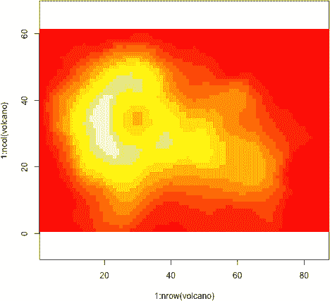

*图 25-15：奥克兰火山地形的像素图像*

`image` 命令期望传入一个颜色向量，通常通过调色板的十六进制代码提供，传递给其 `col` 参数。如果没有指定，默认使用内建调色板 `heat.colors(12)`，就像 `volcano` 图像中的那样。然而，一个直接的问题是缺少颜色图例。来自 `shape` 包的 `colorlegend` 函数（参见第 25.1.5 节）等贡献工具在这些图像中非常有用。

现在返回到示例 2 中的 `mtcars` 响应面，它拟合了关于马力和重量的 MPG 多元线性回归模型（以及这两个预测变量之间的交互效应）。这里为方便起见，简化了必要对象的代码（有关操作的完整说明，请参见第 25.4.1 节）：

```
R> car.fit <- lm(mpg~hp*wt,data=mtcars)
R> len <- 20
R> hp.seq <- seq(min(mtcars$hp),max(mtcars$hp),length=len)
R> wt.seq <- seq(min(mtcars$wt),max(mtcars$wt),length=len)
R> hp.wt <- expand.grid(hp=hp.seq,wt=wt.seq)
R> car.pred.mat <- matrix(predict(car.fit,newdata=hp.wt),nrow=len,ncol=len)
```

就像之前一样，你已经在 `car.pred.mat` 中设置了一个包含 400 个元素的矩阵，这个矩阵是基于两个连续预测变量的长度为 20 的序列。

现在，确保加载 `shape` 包，这样你就可以使用 `colorlegend` 函数。接下来的代码首先设置了一个自定义的蓝色调色板，设置了新的边距限制以扩展右侧轴的区域，然后绘制了包括颜色图例的预测 20 × 20 响应面；结果展示在 图 25-16 的左侧。

```
R> blues <- colorRampPalette(c("cyan","navyblue"))
R> par(mar=c(5,4,4,5))
R> image(hp.seq,wt.seq,car.pred.mat,col=blues(10),
         xlab="Horsepower",ylab="Weight")
R> colorlegend(col=blues(10),zlim=range(car.pred.mat),zval=seq(10,30,5),
               main="Mean\nMPG")
```

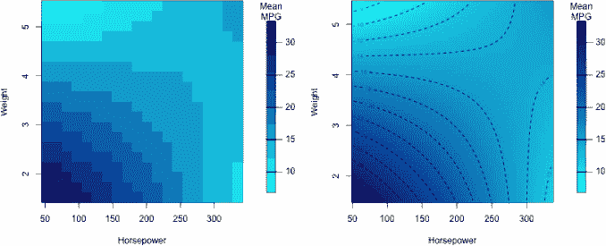

*图 25-16：两个像素图像，展示了在示例 2 中引入的`mtcars`平均 MPG 响应面，并附带颜色图例。关于马力和重量变量的评估网格，左侧的图像分辨率为 20²；右侧的图像基于更细的 50² 网格。轮廓图叠加在最右侧的图上。*

在较粗的评估网格下，构成响应面的像素较为显眼。你可以通过使用更细的 `hp.seq` 和 `wt.seq` 评估网格，轻松提高参数响应面的分辨率。接下来的代码通过将 `len` 增加到 `50`，并覆盖之前使用的对象来实现这一点：

```
R> car.fit <- lm(mpg~hp*wt,data=mtcars)
R> len <- 50
R> hp.seq <- seq(min(mtcars$hp),max(mtcars$hp),length=len)
R> wt.seq <- seq(min(mtcars$wt),max(mtcars$wt),length=len)
R> hp.wt <- expand.grid(hp=hp.seq,wt=wt.seq)
R> car.pred.mat <- matrix(predict(car.fit,newdata=hp.wt),nrow=len,ncol=len)
```

然后，通过以下代码生成了 图 25-16 右侧的图像：

```
R> par(mar=c(5,4,4,5))
R> image(hp.seq,wt.seq,car.pred.mat,col=blues(100),
         xlab="Horsepower",ylab="Weight")
R> contour(hp.seq,wt.seq,car.pred.mat,add=TRUE,lty=2)
R> colorlegend(col=blues(100),zlim=range(car.pred.mat),zval=seq(10,30,5),
               main="Mean\nMPG")
```

新绘制的表面由 50² = 2500 个像素组成，而之前的图像仅由 20² = 400 个像素组成。图像的改善显而易见。在绘制新图像时，使用的颜色数量（来自自定义的`blues`调色板）增加到 100，以提供更平滑的颜色过渡。还注意到，在调用`contour`时使用了`add`，将等高线叠加到图像上，从而进一步强调评估网格上的波动表面。最后，使用`colorlegend`添加了一个图例，为图像增添了最后的润色。

#### ***25.5.2 表面截断和空像素***

由于其对*z*矩阵的逐字一对一表示，像素图像在你想绘制不规则覆盖或小于标准矩形评估网格（跨越*x-*和*y*-轴）的表面时，尤其有效。为了仔细展示这种操作，让我们转到由 Baddeley 和 Turner（2005）提供的`spatstat`包中的新数据集。使用`install.package("spatstat")`安装`spatstat`。请注意，`spatstat`有许多依赖项；如果在下载和安装`spatstat`时遇到任何问题，请参见附录 A.2.3。

##### **示例 4：非参数双变量密度估计（Chorley-Ribble 数据）**

一旦`spatstat`被安装并加载到当前的 R 会话中，使用`library("spatstat")`调用，在提示符下输入`?chorley`查看帮助文件。这将详细介绍 Chorley-Ribble 癌症数据——收集于 1970 年代末到 1980 年代初的英格兰某地区的 1,036 例喉癌和肺癌的空间位置（数据首次由 Diggle, 1990 分析）。`chorley`对象是`spatstat`特有的特殊类（一个`"ppp"`对象——*平面点模式*），但其组件可以像引用命名列表的成员一样提取。

观察数据的坐标可以作为`$x`和`$y`组件提取。为了查看观察数据的空间分布，以下代码给出了图 25-17 的左上角图像：

```
R> plot(chorley$x,chorley$y,xlab="Eastings (km)",ylab="Northings (km)")
```

你的目标是显示癌症分布的二维概率密度函数的核密度估计，类似于你在示例 3 中对地震数据所做的。你将使用`kde2d`函数来完成这个任务——执行`library("MASS")`以访问该函数。然后，正如你对`quakes`的空间位置所做的那样，观察到的 Chorley-Ribble 数据的默认 KDE 表面如下所示：

```
R> chor.dens <- kde2d(x=chorley$x,y=chorley$y,n=256)
```

请注意，指定了一个细致的 256 × 256 东西-北方向评估网格。

要显示密度估计，请使用内置的`rainbow`调色板，并使用可选的`start`和`end`参数将调色板的总范围限制在从红色开始到洋红/粉色结束（这些参数在第 25.1.2 节中简要提到；更多关于使用`start`和`end`的详细信息，请参考帮助文件`?rainbow`）。使用以下行从此调色板预存 200 种颜色：

```
R> rbow <- rainbow(200,start=0,end=5/6)
```

然后，通过调用以下命令生成图像：

```
R> image(x=chor.dens$x,y=chor.dens$y,z=chor.dens$z,col=rbow)
```

另一个`chorley`的组件，名为`$window`，包含一个不规则多边形的顶点。该多边形定义了地理研究区域，观测数据就是在这个区域内收集的。`$window`组件也是`spatstat`中另一个特殊的对象类，即`"owin"`，表示“观测窗口”。虽然可以提取多边形的特定顶点并使用内置功能手动绘制它，但`spatstat`的作者提供了一个标准的`plot`方法来实现这一目的。

运行`image`命令后，调用以下代码将研究区域的边界叠加在像素图像上：

```
R> plot(chorley$window,add=TRUE)
```

最终结果显示在图 25-17 的右上角。

你会注意到，数据收集的地理区域比观测数据本身的*x*和*y*范围稍宽，因此当前的绘图未能完整显示该区域。以下代码以数字方式显示这一点：

```
R> chor.WIN <- chorley$window
R> range(chorley$x)
[1] 346.6 364.1
R> WIN.xr <- chor.WIN$xrange
R> WIN.xr
[1] 343.45 366.45
R> range(chorley$y)
[1] 412.6 430.3
R> WIN.yr <- chor.WIN$yrange
R> WIN.yr
[1] 410.41 431.79
```

研究区域的*x*和*y*范围可以作为`$window`组件（存储在对象`chor.WIN`的第一行）的`$xrange`和`$yrange`组件获得。与在原始数据上调用`range`的结果比较时，你可以看到整体研究区域略大一些。

当然，问题并不仅此而已。从图中还可以看出，KDE 表面已经在实际上*超出*研究区域的一些区域进行了估算和绘制，因此这也需要修正。（稍后会看一下。）

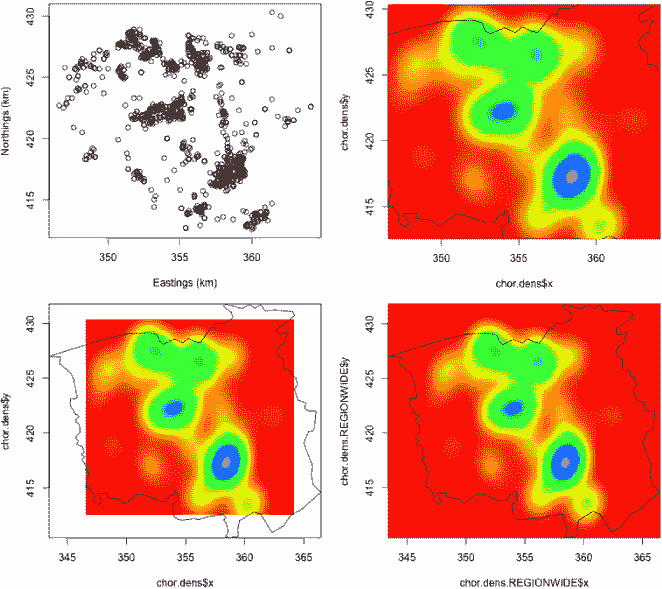

*图 25-17：试图绘制 Chorley-Ribble 癌症数据二维核密度函数的可视化实验。左上：原始数据。右上：基于数据范围的默认`kde2d`结果，上面叠加了研究区域。左下：在绘制原始密度估计时扩展`xlim`和`ylim`的调用。右下：使用研究区域的整个 x 和 y 范围重新定义评估网格的修订密度估计。*

首先，你可以如何确保显示整个地理区域？嗯，当然可以使用之前存储在向量`WIN.xr`和`WIN.yr`中的区域范围，并在调用`image`时将它们提供给熟悉的可选参数`xlim`和`ylim`。

```
R> image(chor.dens$x,chor.dens$y,chor.dens$z,col=rbow,
         xlim=WIN.xr,ylim=WIN.yr)
R> plot(chor.WIN,add=TRUE)
```

这两行代码的结果显示在图 25-17 的左下角。不幸的是，原始的密度估计仍然是基于原始数据的*x*和*y*范围定义的，这导致了空白像素的边界；此外，前述的密度区域仍然位于观察窗口之外。

所有这些都强调了一个重要的事实，即*z*矩阵是特定于预定义评估网格的。要使你的密度估计涵盖 Chorley-Ribble 数据的地理研究区域，唯一的方法是修改你的核密度估计，使其在覆盖该区域边界的评估网格上生成。幸运的是，`kde2d`函数允许你通过`lims`参数设置评估网格的可选*x*-*y*限制。这个参数接受一个长度为 4 的数值向量，顺序为*x*轴的下限和上限，接着是*y*轴的下限和上限。以下代码使用研究区域的边界重新估计密度并绘制图形。结果显示在图 25-17 的右下角。

```
R> chor.dens.WIN <- kde2d(chorley$x,chorley$y,n=256,lims=c(WIN.xr,WIN.yr))
R> image(chor.dens.WIN$x,chor.dens.WIN$y,chor.dens.WIN$z,col=rbow)
R> plot(chor.WIN,add=TRUE)
```

这样，你就解决了确保表面覆盖所需区域的问题。然而，这也明确突出了第二个问题——实际观察到的数据严格位于定义的多边形内，但你可以看到地理区域外的像素被绘制出来，这显然不合逻辑。你可以通过将*z*矩阵中相关条目的值设为`NA`来精确控制在任何给定像素图像中绘制哪些像素。

你需要一个机制来判断你的*z*矩阵中某个特定单元格的条目，即`chor.dens.WIN$z`，是否对应于多边形内部或外部的位置（对象`chor.WIN`）。如果它位于外部，你会希望强制该条目为`NA`。通常，这种类型的决策需要你根据评估网格中的坐标值来测试矩阵中的每个元素，可能需要使用你自己的 R 函数。幸运的是，在这种情况下，`spatstat`包中的`inside.owin`函数正是做了这件事，但无论何时你需要精确控制哪些像素被绘制，哪些没有，被绘制的像素也需要类似的原则。

给定一个或多个二维(*x*,*y*)坐标和一个类为`"owin"`的对象，`inside.owin`函数返回一个相应的逻辑向量，其中坐标在定义区域内的为`TRUE`，其他坐标为`FALSE`。作为快速演示，请观察以下结果：

```
R> inside.owin(x=c(355,345),y=c(420,415),w=chor.WIN)
[1]  TRUE FALSE
```

这确认了你可以从图 25-17 看到的内容——坐标(355,420)位于多边形内，而坐标(345,415)不在其中。

现在，你需要在评估网格上的每个坐标使用`inside.owin`函数，该网格上的*z*-矩阵`chor.dens.WIN$z`所在的区域。首先，使用`expand.grid`创建完整的网格坐标集，方式与第 25.3.1 节中所示相同。

```
R> chor.xy <- expand.grid(chor.dens.WIN$x,chor.dens.WIN$y)
R> nrow(chor.xy)
[1] 65536
```

对结果数据框的坐标调用`nrow`可以确认你有正好 256² = 65536 个网格点，这些点在`chor.dens.WIN` KDE 对象中被定义。接下来的调用将使用`chor.xy`的两列，并通过逻辑取反（使用`!`）生成一个逻辑向量，标记那些位于定义的地理区域*外部*的网格坐标。

```
R> chor.outside <- !inside.owin(x=chor.xy[,1],y=chor.xy[,2],w=chor.WIN)
```

最后的步骤现在已经到来。

```
R> chor.out.mat <- matrix(chor.outside,nrow=256,ncol=256)
R> chor.dens.WIN$z[chor.out.mat] <- NA
```

首先，为了清晰起见，将长的`chor.outside`向量重新组织为一个 256 × 256 的矩阵，以强调它完全对应于感兴趣的*z*-矩阵。然后，这个逻辑标志矩阵用于直接覆盖*z*-矩阵中的“外部”条目，将其设置为`NA`。

现在剩下的就是用新处理过的*z*-矩阵绘制图像。确保你已经加载了`shape`包，以完成颜色图例的最后处理。以下代码创建了 KDE 表面像素图，只将像素点限制在由`$window`定义的地理区域内：

```
R> dev.new(width=7.5,height=7)
R> par(mar=c(5,4,4,7))
R> image(chor.dens.WIN$x,chor.dens.WIN$y,chor.dens.WIN$z,col=rbow,
         xlab="Eastings",ylab="Northings",bty="l",asp=1)
R> plot(chor.WIN,lwd=2,add=TRUE)
R> colorlegend(col=rbow,zlim=range(chor.dens.WIN$z,na.rm=TRUE),
               zval=seq(0,0.02,0.0025),main="KDE",digit=4,posx=c(0.85,0.87))
```

首先，你打开一个新的图形设备，并将右边距加宽，以容纳颜色图例。接着，你调用`image`函数绘制图形，具体使用一个*L*形框，并保持严格的 1:1 的*x*-*y*纵横比，然后你添加一个略微加粗的区域多边形。最后，你执行`colorlegend`来获得一个适当位置的图例，引用颜色值（该位置和刻度线是通过一些试验和错误后确定的）。你可以在图 25-18 中看到最终结果。

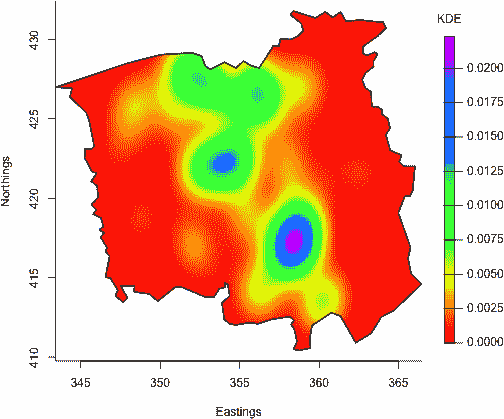

*图 25-18：Chorley-Ribble KDE 表面最终像素图，只包含原始收集数据的地理研究区域。*

**注意**

*在截断最初定义在整个矩形评估网格上的二元密度估计核时，从技术上讲，你不再拥有有效的概率密度函数（因为在不规则区域上的积分将无法评估为总概率 1）。一个更数学上严谨的方法需要更深入的多元 KDE 知识，超出了本书的范围。然而，能够像这样截断像素图在任何情况下都很有用，尤其是在你想在一个（可能不规则的）子集上定义你的表面时。*

**练习 25.4**

重新查看内置的`airquality`数据集，并查看帮助文件以刷新你对现有变量的记忆。创建数据框的副本：选择与每日温度、风速和臭氧水平相关的列，并使用`na.omit`删除任何包含缺失值的记录。

1.  从你在第二十四章中对这些数据的探索来看，似乎存在日温度、风速和臭氧水平之间的关联。拟合一个多元线性回归模型，旨在根据风速和臭氧水平预测平均温度，包括交互效应。总结结果对象。

1.  使用(a)中的模型，基于风速和臭氧的 50 × 50 评估网格构建一个*z*矩阵，预测每日平均温度。

1.  创建响应面像素图像，并根据以下要求叠加原始观测值：

    – 应该根据底部、左侧、顶部和右侧的边距线分别初始化一个图形设备，边距线分别为 5、4、4 和 6。

    – 应使用来自内建`topo.colors`调色板的 20 种颜色来生成图像；包括整洁的坐标轴标题。

    – 重新访问在第 25.1.4 节中定义的`normalize`函数，并使用内建的`gray`函数生成一个灰色调色板（请参阅第 25.1.2 节）基于规范化后的原始温度观测。根据风速和臭氧叠加原始观测到像素图像上，使用灰色调色板来表示相应的温度观测。

    – 然后，应该分别调用`shape`包中的`colorlegend`两次。第一次应出现在右侧边距的空间，引用表面本身。第二次应使用内建的`gray.colors`函数，设置可选参数`start=0`和`end=1`，生成 10 种灰度用于表示原始温度观测值的图例，这个图例应位于像素图像的右上角，没有原始观测值的地方。

    – 两个图例应具有适当的标题，您可能需要稍微调整`posx`和`posy`参数，以找到满意的放置位置。

    我的绘图练习结果如下所示。

    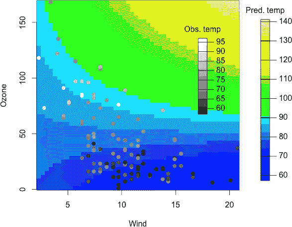

在第 25.5.2 节中，你使用了`chorley`数据集来创建一个截取了整体矩形评估网格子集的像素图像。确保在当前的 R 会话中加载了`spatstat`，并执行以下两行代码：

R> fire <- split(clmfires)$intentional

R> firewin <- clmfires$window

这段代码提取了记录为故意点燃的火灾位置，共计 1,786 个位置，位于西班牙的某个特定区域。空间坐标可以作为`fire`的`$x`和`$y`成员提取，而地理区域本身则作为多边形存储在`firewin`中（它与之前查看的`chorley$window`对象属于同一类）。更多细节请参见使用`?clmfires`获得的文档。

1.  使用研究区域的总*x*和*y*范围，使用`MASS`包中的`kde2d`计算空间分布的二元核密度估计。KDE 表面应基于 256 × 256 的评估网格计算。

1.  使用`expand.grid`与`inside.owin`结合，识别所有落在矩形评估网格外的点。将密度表面上所有对应的像素设置为`NA`。

1.  构建一个截断密度的像素图，具体如下：

    – 图形设备应在绘图区域的底部、左侧和顶部留有三行空间，右侧留有七行空间。

    – 在生成图像时，应使用`heat.colors`调色板生成的 50 种颜色。应保持 1:1 的纵横比，压制坐标轴标题，并将框类型设置为*L*形。

    – 应使用双宽度的线条将地理研究区域叠加到图像上。

    – 使用`shape`中的`colorlegend`，应在图像右侧放置一个参考密度的颜色图例，并附上合适的标题。你需要尝试调整`posx`参数来确定图例的位置。图例标签应从`5e-6`到`35e-6`，步长为`5e-6`（有关 e 记数法的解释，请参见第 2.1.3 节）；同时，确保这些标签可以显示最多六位小数的精度。

供你参考，我的结果在此给出。

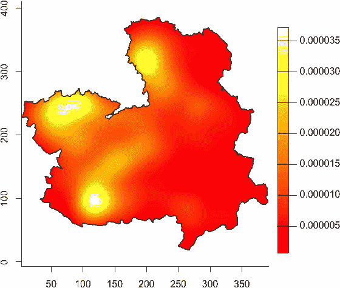

### **25.6 透视图**

本章中你将看到的最后一种图形是*透视图*，有时也被称为*线框图*。与等高线图和像素图不同，后者通过线条模式和/或颜色强调表面的波动，而透视图则利用物理的第三维度，在此基础上绘制*z*值。

#### ***25.6.1 基本图形和角度调整***

透视图在你想强调填充*z*矩阵的值波动特性时尤其有用。例如，在某些应用中，你可能希望能够很好地感知绘制表面中任何峰值和/或谷值的相对极值，这在像素图或等高线图中更难实现。

回顾在第 25.4.1 节和 25.5.1 节中绘制的`mtcars`响应面，包括等高线图和像素图。你在马力和重量变量上创建了一个 20 × 20 的评估网格，并得到了相应的 400 个*z*矩阵值，表示预测的平均 MPG 结果：

```
R> car.fit <- lm(mpg~hp*wt,data=mtcars)
R> len <- 20
R> hp.seq <- seq(min(mtcars$hp),max(mtcars$hp),length=len)
R> wt.seq <- seq(min(mtcars$wt),max(mtcars$wt),length=len)
R> hp.wt <- expand.grid(hp=hp.seq,wt=wt.seq)
R> car.pred.mat <- matrix(predict(car.fit,newdata=hp.wt),nrow=len,ncol=len)
```

内建的 R 函数`persp`用于创建透视图。它的基本用法与`contour`、`filled.contour`和`image`相同。你在*x*轴和*y*轴方向上的递增序列（定义了评估网格）被传递给`x`和`y`，而对应的*z*矩阵则传递给`z`。用以下代码可以显示 20 × 20 `mtcars`响应面图的默认外观：

```
R> persp(x=hp.seq,y=wt.seq,z=car.pred.mat)
```

该示例出现在第 25-19 图的左上方。

解读透视图是简单直接的。默认的视角显示了前景中的*x*轴，从左到右递增，左侧显示了*y*轴，从前景延伸到背景深处。这样，评估网格就平铺在三维图形的底部，*z*轴即你绘制表面的轴，从底部垂直向上递增。

视角是这种图形中最重要的方面之一。在`persp`中，你可以通过两个可选参数来控制它，`theta`用于水平旋转图形，`phi`用于调整垂直视角。两者的单位都是度；`theta`的默认值是`0`，这意味着你正对着从左到右的*x*轴，`phi`的默认值是`15`，让视角稍微抬高一些，以便看到从前景到背景延伸的*y*轴。一般来说，你可以将`theta`的可能值视为从`0`到`360`，代表围绕图形进行一次完整的旋转，而`phi`的可能值则是从`90`到`-90`，这一范围将视角从鸟瞰图直接从上方俯视到潜水员视角直接从下方仰视。

第二个示例展示了这种行为：

```
R> persp(x=hp.seq,y=wt.seq,z=car.pred.mat,theta=-30,phi=23,
         xlab="Horsepower",ylab="Weight",zlab="mean MPG")
```

事实上，正是这行代码最初生成了第 21-9 图右侧的图像，位于第 523 页（当你第一次接触到多重线性回归模型中两个连续预测变量的交互项的概念时）。该图形在第 25-19 图的右上方被重新呈现。轴标题通过`xlab`和`ylab`进行了整理，`zlab`则用于控制第三个垂直轴的标题。此示例中`theta`和`phi`的使用稍微抬高了视角，并旋转了图形，使得原点（即表示*x*-*y*平面下限的下端点）更加突出在前景。值得注意的是，增大`theta`值（从`0`开始）会使图形顺时针水平旋转，但你也可以给该参数传递负值来使图形逆时针旋转。将`theta=-30`，如这里所示，与设置`theta=330`具有相同的效果。

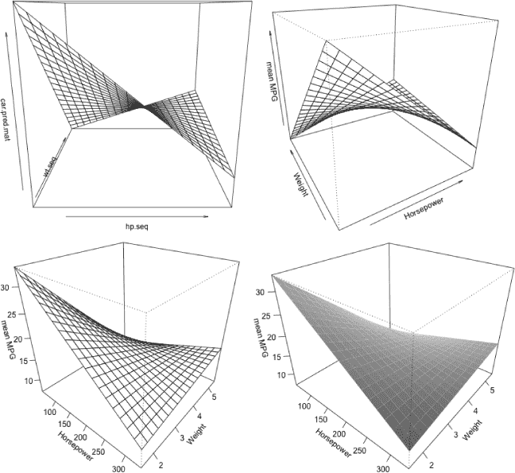

*图 25-19：使用`persp`创建的 20* × *20* `mtcars` *响应面透视图。左上角：默认外观。右上角：使用* `theta` *和* `phi` *调整视角。左下角：设置* `ticktype="detailed"` *提供详细的轴标签。右下角：使用* `shade` *添加深度阴影，并通过* `border=NA` *移除面边框线。*

默认情况下，没有勾选标记或标签，只有方向箭头。你可以通过将可选的`ticktype`参数设置为`"detailed"`来解决这个问题。你可以在图 25-19 的左下角查看以下结果，该图还提供了另一个视角：

```
R> persp(x=hp.seq,y=wt.seq,z=car.pred.mat,theta=40,phi=30,ticktype="detailed",
         xlab="Horsepower",ylab="Weight",zlab="mean MPG")
```

帮助文件`?persp`详细列出了控制任何给定透视图展示的其他许多参数。例如，你可以将表面着色为灰度，以强调图像的三维深度，或者你可以更改颜色或抑制组成表面的网格线的绘制，或者你可以更改*z*轴的相对长度。`mtcars`响应面的最终图示例展示了这些操作。以下调用的结果可以在图 25-19 的右下角看到。

```
R> persp(x=hp.seq,y=wt.seq,z=car.pred.mat,theta=40,phi=30,ticktype="detailed",
         shade=0.6,border=NA,expand=0.8,
         xlab="Horsepower",ylab="Weight",zlab="mean MPG")
```

这张图与前一张图使用相同的视角，通过`shade`参数为表面面板着色，产生一种光照效果，稍微增强了感知的深度。阴影的计算依赖于一个非负数值；设置`shade=0.6`会提供一个中等强度的效果。你可以尝试更大或更小的值。如果你以这种方式给表面着色，通常最好抑制默认构成表面的网格线；你可以通过设置`border=NA`来实现这一点（`border`参数也可以通过提供任何有效的 R 颜色来改变表面网格的颜色）。最后，`expand`参数用于调整*z*轴的大小。指定`expand=0.8`会请求一个垂直轴，其大小为评估网格中轴的 80%，从而在其中绘制出一个稍微“压扁”的棱柱。你还可以为`expand`指定大于 1 的值，在这种情况下，效果是沿垂直方向“拉伸”图形。

#### ***25.6.2 着色面板***

与大多数传统的 R 绘图命令一样，你可以使用可选的`col`参数为透视表面着色。如果你希望透视表面以恒定颜色填充，只需为`col`提供一个单一的值。

然而，如果你对`col`感兴趣，通常情况下，你会希望根据波动的*z*值为表面着色，以突出显示二元函数值的变化。为了成功地为构成表面的各个面片进行着色，重要的是要理解，这些面片与构成同一*z*矩阵的像素不同。`image`像素由例如你的*m* × *n*大小的*z*矩阵条目直接表示，而`persp`面片应该理解为这些矩阵条目处绘制的边界线之间的空间，这样你会得到(*m* − 1) × (*n* − 1)个面片。换句话说，在透视图中，每个*z*矩阵条目位于绘制线条的交点处——*z*矩阵条目*不是*位于每个面片的中心。

为了说明这一点，再看一眼图 25-9 中的内容，位于 656 页。当你使用`image`时，R 会根据你的*x*和*y*轴评估网格序列自动计算像素大小，并根据虚线灰色线条形成的矩形绘制表面，直接表示*z*矩阵条目`a`、`b`、`c`等。当你使用`persp`时，然而，边界线是通过实线网格（箭头）表示的，在每个条目处交叉，因此，生成的表面的面片是由这些线之间的空间形成的，每个面片由四个相邻条目定义。图 25-20 显示了图 25-9 中假设网格的一部分，我标出了`image`解释的一个像素和`persp`解释的一个面片。这样，你可以理解为什么在图 25-9 中，图像绘图中会有 6 × 4 = 24 个像素，而透视图中会有 5 × 3 = 15 个面片。

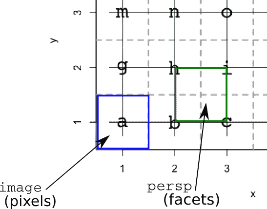

*图 25-20：说明像素图像和透视图中*z*矩阵处理的区别。左下角突出显示的框代表值为`a`的`image`像素，右侧突出显示的框代表由`b`、`h`、`i`和`c`值形成的`persp`面片。为了着色，突出显示的面片的*z*值将被计算为这四个条目的平均值，换句话说，*(`b` + `h` + `i` + `c`)* / 4*。*

`col`参数需要指定(*m* − 1) × (*n* − 1)个面片的颜色（假设传递给`z`的是一个*m* × *n*的*z*矩阵）。如果你打算根据*z*值为面片着色，在 R 中找到这个方法的典型方式是，首先计算每个面片的*z*值，该值将是四个相邻*z*矩阵条目的平均值。只有这样，你才能部署第 25.1.4 节中的一种颜色分配方法。

让我们将 Chorley-Ribble 核密度估计的像素图像（示例 4；图 25-18），并加入 *z* 轴特定的着色，重新绘制为一个透视图。首先，确保已经加载了 `spatstat` 和 `MASS` 这两个包。然后重复之前的代码，以便在适当的评估网格上获得核估计，并将其截断到地理研究区域。

```
R> chor.WIN <- chorley$window
R> chor.dens.WIN <- kde2d(chorley$x,chorley$y,n=256,
                          lims=c(chor.WIN$xrange,chor.WIN$yrange))
R> chor.xy <- expand.grid(chor.dens.WIN$x,chor.dens.WIN$y)
R> chor.out.mat <- matrix(!inside.owin(x=chor.xy[,1],y=chor.xy[,2],w=chor.WIN),
                          256,256)
R> chor.dens.WIN$z[chor.out.mat] <- NA
```

接下来，你需要计算所有的面片 *z* 值；可以使用以下代码批量完成此操作：

```
R> zm <- chor.dens.WIN$z
R> nr <- nrow(zm)
R> nc <- ncol(zm)
R> zf <- (zm[-1,-1]+zm[-1,-nc]+zm[-nr,-1]+zm[-nr,-nc])/4
R> dim(zf)
[1] 255 255
```

前三行只是将 *z* 矩阵存储为对象 `zm`，并将其总行数和列数（在此情况下都是 256）分别存储为 `nr` 和 `nc`，以使代码更加简洁。

第四行是进行相关计算的地方，生成一个面片 *z* 值的矩阵。它通过对原始 *z* 矩阵的四个版本按元素逐个求和来系统地完成此操作：`zm[-1,-1]`（省略第一行和第一列）、`zm[-1,-nc]`（省略第一行和最后一列）、`zm[-nr,-1]`（省略最后一行和第一列）、以及 `zm[-nr,-nc]`（省略最后一行和最后一列）。当这四个替代矩阵按此方式相加并在最后除以 4 时，结果是一个矩阵 `zf`，其每个元素是原始 *z* 矩阵中四个相邻条目所组成的每个“矩形”的四点平均值，正如图 25-20 中的讨论和标题所述。对 `zf` 的最终 `dim` 调用确认了结果的大小。由于定义的 *z* 矩阵中总共有 256 × 256 的评估网格线，因此这些网格包含了总共 255 × 255 的透视面片。

繁重的工作已经完成，现在你只需要将调色板中的颜色分配给 `zf` 中计算出的面片 *z* 值。你可以使用分类方法或标准化方法来完成此操作，如第 25.1.4 节中所述；为了简便起见，我们保持使用分类方法。考虑以下代码：

```
R> rbow <- rainbow(200,start=0,end=5/6)
R> zf.breaks <- seq(min(zf,na.rm=TRUE),max(zf,na.rm=TRUE),length=201)
R> zf.colors <- cut(zf,breaks=zf.breaks,include.lowest=TRUE)
```

第一行是从第 25.5.2 节重复的，用于生成与像素图像中相同的 200 种颜色，这些颜色来自内置的 `rainbow` 调色板。第二行设置了一个均匀间隔的序列，跨度为计算出的面片 *z* 值的范围，用来形成分类方法所需的类别断点。请注意，在调用 `min` 和 `max` 时使用了 `na.rm=TRUE`，以避免 `zf` 中的所有 `NA` 项（记住，表面已被截断为表示地理研究区域的不规则多边形）。这个序列的长度比生成的颜色数多一个——再次参考第 25.1.4 节以了解分类方法所需的这一特性。最后，`cut` 将每个 `zf` 面片值条目分配给相应的秩，按照 200 个排序好的区间进行分类。如你所学，`zf.colors` 的秩随后在绘图时用于索引存储在 `rbow` 中的 200 种颜色。

这样，你就可以享受你劳动的成果了！以下代码绘制了 Chorley-Ribble 观察值的双变量核密度估计，并使用视角图来展示，其中通过面片着色反映表面沿 *z* 轴的相对高度。为了清晰地展示颜色，边框线被抑制，*z* 轴略微缩小，并在右侧插入了一个颜色图例（确保已加载 `shape` 包）。在通过 `par` 调用 `mar` 调整默认图形边距后，额外的空间被用于插入该图例。你可以在 图 25-21 中查看结果。

```
R> par(mar=c(0,1,0,7))
R> persp(chor.dens.WIN$x,chor.dens.WIN$y,chor.dens.WIN$z,border=NA,
         col=rbow[zf.colors],theta=-30,phi=30,scale=FALSE,expand=750,
         xlab="Eastings (km)",ylab="Northings (km)",zlab="Kernel estimate")
R> colorlegend(col=rbow,zlim=range(chor.dens.WIN$z,na.rm=TRUE),
               zval=seq(0,0.02,0.0025),main="KDE",digit=4,
               posx=c(0.85,0.87),posy=c(0.2,0.8))
```

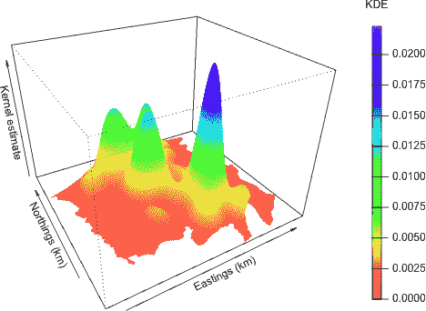

*图 25-21：Chorley-Ribble 密度估计的视角图，演示了根据表面 *z* 值变化的面片着色效果。*

我在执行 `persp` 时加入了可选参数 `scale=FALSE`。这保持了 *x* 和 *y* 坐标方向上的一对一纵横比；这对于查看地理数据非常有用。不幸的是，这也迫使 *z* 轴上的密度估计值按照相同的方式进行缩放，这在当前图表的上下文中是没有意义的。为了避免小比例造成表面看起来过于平坦，你需要使用 `expand` 来人为地放大第三个轴上的表面。在这个例子中，将其乘以大约 750 的因子能够得到一个视觉上令人愉悦的结果。需要注意的是，如果你将 `scale` 参数保留为默认的 `TRUE` 值（因为在这种情况下，R 会自动为三个轴进行一对一比例缩放），这就不需要进行这种操作。

#### ***25.6.3 使用循环进行旋转***

如果你想对绘制的表面有一个整体的印象，可以通过视角图进行最后一点有趣的操作。使用一个简单的 `for` 循环（第 10.2.1 节），通过递增 `theta` 或 `phi`，你可以对 `persp` 进行一系列的重复调用，每次以略微不同的角度进行。按顺序执行这些操作会产生一个动画——本质上是一个旋转表面的卡通效果，让你能够从不同的角度观察它。

在 R 编辑器中，考虑以下基本函数：

```
persprot <- function(skip=1,...){
    for(i in seq(90,20,by=-skip)){
        persp(phi=i,theta=0,...)
    }
    for(i in seq(0,360,by=skip)){
        persp(phi=20,theta=i,...)
    }
}
```

使用省略号（见 第 11.2.4 节），`persprot` 只是接受通常传递给 `persp` 调用的所有参数，除了 `theta` 和 `phi`。接下来是一个 `for` 循环，它立即调用 `persp`，设置 `theta=0` 和省略号的内容。`for` 循环通过改变垂直视角来进行调整，从 `phi=90`（鸟瞰图）开始，然后逐渐下降到轻微抬高的 `phi=20`。第二个 `for` 循环则通过改变 `theta` 完成一个完整的 360 度水平旋转。

唯一正式标记的参数是`skip`，它决定了每次迭代中`phi`和`theta`的增量。默认值`skip=1`会在整数角度之间移动。增加`skip`值会减少完成旋转所需的时间，尽管这会使动画变得更加生硬。

根据你使用的图形设备类型，你可能想尝试调整`skip`。请注意，并非所有图形设备类型都适合通过运行这个相对粗糙的函数来实现动画效果（例如，如果你使用的是 RStudio，这种效果并不合适——见附录 B）。不过，在 OS X 或 Windows 上的基本 R GUI 应用中，我发现`persprot`在默认图形设置下运行良好。

导入该函数来试试；在这里我们将其用于空间`quakes`位置的概率密度函数核估计的视角图，这些位置你在示例 3 中首次研究过，第 25.4.1 节有介绍。`MASS`包已经加载，使用以下代码在 50 × 50 的评估网格上生成密度估计。

```
R> quak.dens <- kde2d(x=quakes$long,y=quakes$lat,n=50)
```

然后你像使用`persp`一样使用`persprot`，无需指定`theta`或`phi`。

```
R> persprot(x=quak.dens$x,y=quak.dens$y,z=quak.dens$z,border="red3",shade=0.4,
            ticktype="detailed",xlab="Longitude",ylab="Latitude",
            zlab="Kernel estimate")
```

图 25-22 展示了一系列旋转图的截图。

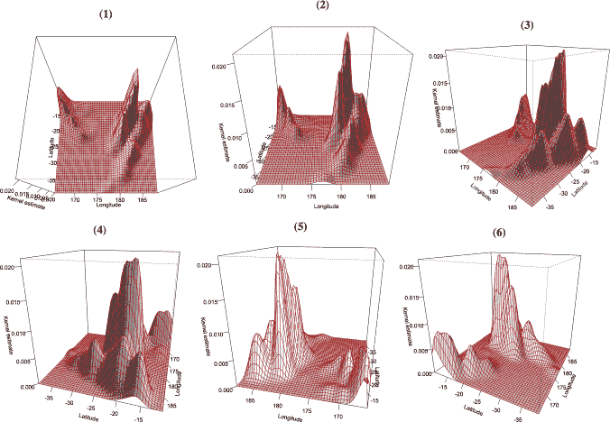

*图 25-22：一个旋转视角图，展示了空间地震位置的 KDE 表面，在调用自定义*`persprot`*函数之后*

**练习 25.5**

在练习 25.3（a）中，你重新审视了来自`boot`包的`nuclear`数据集，并拟合了两个多元线性回归模型，旨在通过许可日期发放和工厂容量来建模平均建设成本——一个仅包括主效应，另一个则包括两个连续预测变量之间的交互项。

1.  重新拟合两个版本的模型，并基于 50 × 50 的评估网格生成响应表面的视角图，再次考虑以下因素：

    在调用`par`时使用`mfrow`将两个视角图并排显示。在同一个`par`调用中，覆盖默认的图形边距，使每一侧只有一行空白（`par`在第二十三章中有详细探讨）。

    – 使用`zlim`确保两个图形在相同的纵轴比例上显示，分别将每个图水平旋转 25 度，确保轴标记清晰并且标题整洁。

    是否有任何视觉指示表明交互项的存在对建模响应产生了有意义的影响？

1.  开始一个新的图形。为了更好地了解两个表面之间的差异，生成一个视角图，展示通过对两个拟合模型中各自的*z*矩阵逐元素相减所得到的*z*矩阵。通常来说，包含交互项的效果是什么？

将注意力转回到奥克兰火山的地形信息，使用内置的 R 对象 `volcano`：一个 87 × 61 的海拔值矩阵（单位为米）。你在第 25.4.1 节中首次以等高线图的形式查看了这个数据。

1.  使用简单的整数序列为 *x* 和 *y* 坐标绘制火山的最基本默认透视图。

1.  图(c)的绘图由于多种原因显得不太吸引人。根据以下要求，制作一个更现实的火山图：

    – 使用一个新的图形设备，将边距宽度重置为底部、左侧、顶部和右侧分别为 1、1、1 和 4 行。

    – 帮助文件 `?volcano` 显示火山的 *x* 和 *y* 坐标对应的 *z* 矩阵单位是 10 米。使用 `scale` 并调整 `expand`，重新绘制表面，使得三个坐标轴的纵横比正确。

    – 使用 `axes` 去除所有坐标轴刻度和标注。

    – 各个面板的颜色应根据从内置 `terrain.colors` 调色板生成的 50 种颜色来着色，并且应去除面板的边框线。

    – 选择一个视觉上更具吸引力的视角。

    – 使用 `shape` 包中的 `colorlegend` 在图表右侧的空间中放置一个颜色图例，表示以米为单位的海拔高度。可以尝试不同的参数来找到合适的放置位置和刻度标记。

    这是我改进后的图表版本：

    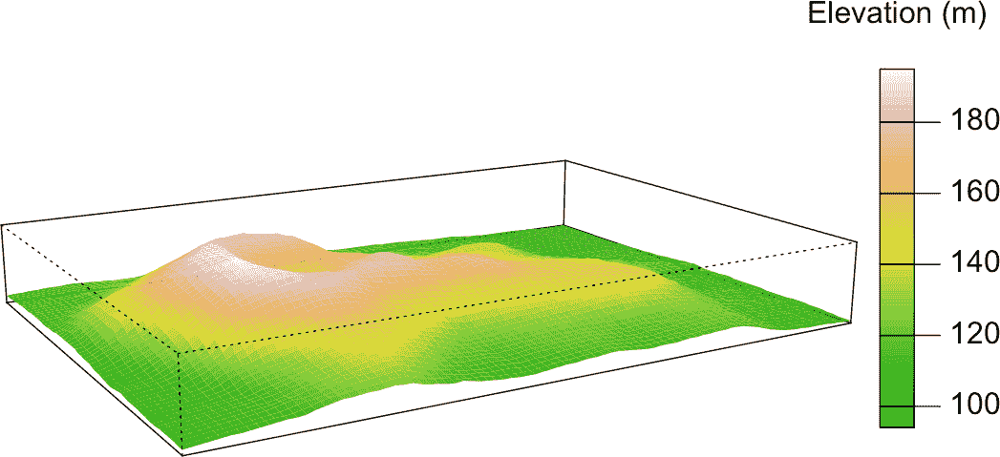

在练习 25.4 中，你研究了西班牙某地区故意点燃的火灾的空间分布。确保加载了 `spatstat` 包，然后重新运行以下代码行以获得相关的数据对象：

R> fire <- split(clmfires)$intentional

R> firewin <- clmfires$window

1.  从练习 25.4 中借用代码(d)和(e)，根据 256 × 256 的评估网格（截断至研究区域）重新绘制这个分布观察值的核密度估计。然后，按照以下方式将其显示为透视图：

    – 和像素图像一样，使用内置的 `heat.colors` 调色板中的 50 种颜色，根据 *z* 值为各个面板着色。请注意，这个函数的截断 *z*-矩阵包含 `NA` 值。

    – 表面上的边框线应被去除，并且你应找到自己喜欢的视角。

    – 使用 `scale` 来确保正确的空间纵横比。在这样做时，你还需要通过大约 5,000,000 倍的因子调整 *z* 轴的扩展，以便在垂直方向上显示密度表面，这是由于在指定评估网格上密度估计的自然缩放。

    – 使用详细的坐标轴标签，并根据需要简单地将坐标轴命名为 `"X"`、`"Y"` 和 `"Z"`。

    我的产品如下所示。

    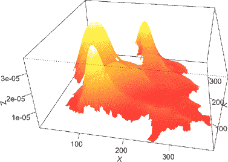

1.  使用在第 25.6.3 节中定义的 `persprot` 函数来查看(e)中的表面，设置 `skip=10`。

##### **本章重要代码**

| **函数/操作符** | **简要描述** | **首次出现** |
| --- | --- | --- |
| `palette` | 列出整数颜色 | 第 25.1.1 节, 第 632 页 |
| `col2rgb` | 命名颜色转 RGB | 第 25.1.1 节, 第 632 页 |
| `rgb` | RGB 转十六进制代码 | 第 25.1.1 节, 第 633 页 |
| `rainbow`, `heat.colors`, `gray`, `terrain.colors`, `cm.colors`, `topo.colors`, `gray.colors` | 内建调色板 | 第 25.1.2 节, 第 635 页 |
| `colorRampPalette` | 自定义调色板（整数） | 第 25.1.3 节, 第 636 页 |
| `colorRamp` | 自定义调色板（[0,1]区间） | 第 25.1.4 节, 第 640 页 |
| `colorlegend` | 颜色图例（`shape`） | 第 25.1.5 节, 第 641 页 |
| `scatterplot3d` | 3D 散点图（`scatterplot3d`） | 第 25.2.1 节, 第 649 页 |
| `expand.grid` | 所有唯一的评估坐标 | 第 25.3.1 节, 第 654 页 |
| `letters` | 字母字符 | 第 25.3.1 节, 第 655 页 |
| `contour` | 等高线图 | 第 25.4.1 节, 第 657 页 |
| `kde2D` | 双变量 KDE（`MASS`） | 第 25.4.1 节, 第 660 页 |
| `filled.contour` | 颜色填充的等高线图 | 第 25.4.2 节, 第 664 页 |
| `image` | 像素图像 | 第 25.5.1 节, 第 668 页 |
| `inside.owin` | 测试区域内部（`spatstat`） | 第 25.5.2 节, 第 674 页 |
| `persp` | 透视图 | 第 25.6.1 节, 第 680 页 |
