## **26**

**交互式 3D 图**


当谈到 3D 绘图时，能够从不同的角度查看它们非常重要，这样才能解读所显示的函数或表面。Adler 等人（2015）的 `rgl` 包提供了一些非常棒、易于使用的 R 函数，可以让你通过鼠标旋转和放大三维图形。在本章中，你将看到一些展示 `rgl` 功能的例子。

从内部实现来看，`rgl` 使用 OpenGL —— 一个标准的应用程序接口 —— 在你的计算机屏幕上渲染图形。安装 `rgl`（例如，通过在提示符下调用 `install.packages("rgl")`）后，再调用 `library("rgl")` 来加载它。

### **26.1 点云**

让我们从最基本的 3D 图开始——*点云*。在统计学中，这个工具通常用于提供三种连续变量的散点图，就像你在创建静态 3D 散点图时看到的那样。

#### ***26.1.1 基础 3D 云图***

回到内置的 `iris` 数据集，该数据集由对三种花卉的四个测量值组成。像在第 25.2.1 节中做的那样，在你的工作空间中创建以下四个向量以方便访问：

```
R> pwid <- iris$Petal.Width
R> plen <- iris$Petal.Length
R> swid <- iris$Sepal.Width
R> slen <- iris$Sepal.Length
```

你可以使用 `rgl` 的 `plot3d` 函数来显示一个交互式的 3D 点云。它的调用方式和散点图类似——分别将 *x*、*y* 和 *z* 坐标传递给 `x`、`y` 和 `z` 参数。以下代码行打开一个 RGL 设备，并绘制来自 `iris` 数据集的花瓣宽度、花瓣长度和萼片宽度的散点图：

```
R> plot3d(x=pwid,y=plen,z=swid)
```

你可能想要使用鼠标增大设备的大小，以便更清楚地查看数据。然后，通过左键点击图形并按住按钮，你可以移动鼠标，在任何你喜欢的方向旋转图形。如果右键点击图形并按住，你可以控制缩放。具体来说，右键点击并按住同时将鼠标向上移动将会缩小，右键点击并按住同时将鼠标向下移动将会放大。坐标轴的刻度线和标签会根据你的观察角度自动出现在不同的侧面。图 26-1 展示了这一图形。

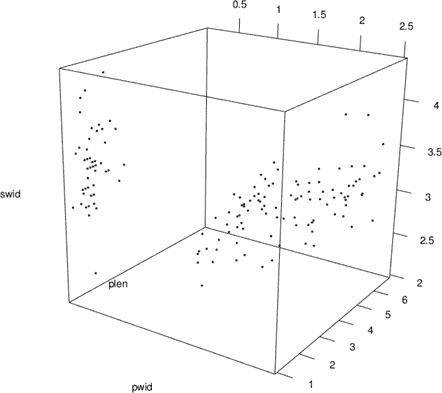

*图 26-1：使用 `rgl` 的 `plot3d` 函数绘制的* `iris` *数据的交互式 3D 散点图。 这是绘制花瓣宽度、花瓣长度和萼片宽度时的默认显示效果。*

#### ***26.1.2 视觉增强和图例***

你可以通过一些新的方式以及一些熟悉的方式来改变`plot3d`散点图的外观。例如，默认的可选参数`type`设置为`"p"`（即“点”），将点绘制为像最近的散点图那样的小圆点。要将点绘制为可见的 3D 球体，可以使用`type="s"`。你可以通过使用`size`来控制任何绘制的点或球体的大小，还可以通过使用`col`来控制颜色（或颜色）。`legend3d`函数是`rgl`库中`legend`函数的类似物，它也非常有用；它通过更改交互式图形背景图像来工作。

为了说明这些修改，让我们重新绘制相同的`iris`观察数据。首先，关闭任何当前打开的 RGL 图形设备。然后，执行以下命令：

```
R> plot3d(x=pwid,y=plen,z=swid,size=1.5,type="s",
          col=c(1,2,3)[as.numeric(iris$Species)])
```

这将启动一个新的 RGL 设备，根据花卉物种为球体着色。像往常一样，你需要将`col`参数传递一个与绘制坐标长度相同的向量，它会逐一为对应的点分配颜色。你指定`size`参数时使用的尺度略有不同于传统 R 图形的`cex`参数，它会根据`type`的值发生变化——可以查看帮助文件`?plot3d`了解详细信息。通过一些实验，你可以轻松找到一个适合图形的大小值。

要添加图例，首先用鼠标调整 RGL 设备的大小到你喜欢的显示尺寸，然后执行以下命令：

```
R> legend3d("topright",col=1:3,legend=levels(iris$Species),pch=16,cex=2)
```

这会插入一个静态、不可移动的图例，通过颜色引用绘制的物种。`legend3d`函数实际上调用了基础 R 的`legend`函数，因此它们的使用方法非常方便。图例静态显示后，散点图仍然是完全交互式的，你可以继续旋转和缩放。图 26-2 展示了这一切。

`legend3d`函数会改变背景画布，这就是为什么在添加图例之前，你需要手动打开一个新设备并调整其大小。如果你在没有先关闭设备或重置背景的情况下，在同一个设备中创建了一个新的`rgl`图形，花卉物种的图例仍然会存在。如果你要创建多个`rgl`图形，可以随时通过调用以下命令将背景重置为默认的白色画布：

```
R> bg3d(color="white")
```

如果你尝试在最最近的图形仍然处于活动状态时使用此方法，你会看到花卉物种的图例消失，而散点图仍然存在。或者，你可以在完成时直接关闭 RGL 设备，这样任何后续图形都会使用新的设备。

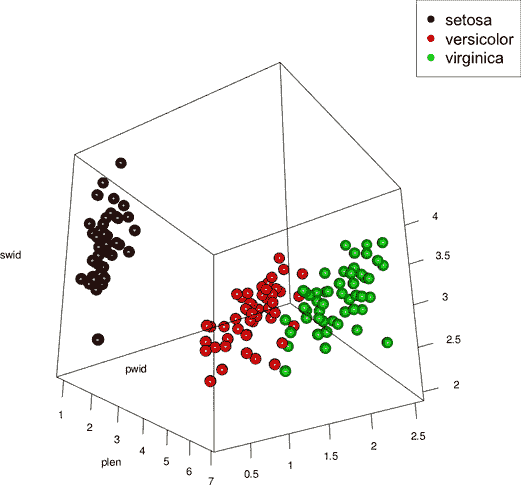

*图 26-2：使用`plot3d`重新绘制*`iris`*花瓣宽度、长度和萼片宽度数据。观察值被绘制为球体，增加了大小，并根据物种类型着色；通过`legend3d`添加了图例。*

#### ***26.1.3 添加更多的 3D 组件***

你还可以向当前的 3D 图形中添加新的观察点和线条。`rgl` 包含了 `points3d`、`lines3d` 和 `segments3d` 函数，类似于基础 R 图形中的 `points`、`lines` 和 `segments`。举个例子，在第 25.2.2 节中，你使用了一个可选参数，将垂直线从 *x*-*y* 平面基准点画到每个绘制的点，在 `scatterplot3d` 中实现这一功能。如果是在 `plot3d` 散点图中，你将使用 `segments3d` 达到相同效果。此外，你还可以通过 `rgl` 图形的 `grid3d` 函数添加默认情况下在相同平面上绘制的网格线，这是 `scatterplot3d` 图形的默认功能。

让我们实际操作一下。回顾一下 图 25-8 和 第 652 页。要使用 `rgl` 功能创建类似的图形，其中颜色用于表示第四个连续变量——花萼长度，首先重新创建调色板并为每个观察点设置颜色。这里通过对 50 种颜色的分类实现（见第 25.1.4 节）。

```
R> slen.pal <- colorRampPalette(c("purple","yellow2","blue"))
R> cols <- slen.pal(50)
R> slen.cols <- cut(slen,breaks=seq(min(slen),max(slen),length=51),
                    include.lowest=TRUE)
```

然后，关闭任何当前激活的 RGL 设备，或者清除聚焦设备的背景。调用 `plot3d` 会用适当颜色的球体开始绘制图形。

```
R> plot3d(x=pwid,y=plen,z=swid,type="s",size=1.5,col=cols[slen.cols],
          aspect=c(1,1.75,1),xlab="Petal width",ylab="Petal length",
          zlab="Sepal width")
```

你向 `aspect` 参数提供一个长度为 3 的向量，描述 *x*、*y* 和 *z* 轴的相对长度。通过将第二个条目改为 `1.75`，你将 *y* 轴的长度按该倍数相对于其他轴进行了拉伸。这会在 *y* 轴上产生拉伸效果。颜色通过使用 `slen.cols` 因子向量的向量索引分配，而 `xlab`、`ylab` 和 `zlab` 用来整理坐标轴的标题。

现在，要从 *x*-*y* 平面到每个观察点添加垂直线，你需要了解如何使用 `segments3d` 函数。与基础 R 中的 `segments` 不同，`segments3d` 不会将“起点”和“终点”坐标分成不同的参数（回想一下在 `segments` 和 `arrows` 中使用的 `x0`、`y0`、`x1` 和 `y1`）。相反，它将依次处理传递给 `x`、`y` 和 `z` 参数的每对观察点，将它们视为每个线段的起点和终点。

因此，要在现有的 RGL 设备上绘制垂直线，首先需要设置包含“起点”和“终点”位置的向量，这些位置位于 3D 空间中。考虑以下代码：

```
R> xfromto <- rep(pwid,each=2)
R> yfromto <- rep(plen,each=2)
R> zfromto <- rep(min(swid),times=2*nrow(iris))
R> zfromto[seq(2,length(zfromto),2)] <- swid
```

前两行分别通过简单地将每个观测值复制两次，设置了*x*和*y*分量的向量`xfromto`和`yfromto`。这些非常简单，因为这些坐标方向上的“从–到”值不会变化。然而，*z*分量会变化。你首先通过将最小的花萼宽度值`min(swid)`复制两倍数据集大小来创建`zfromto`向量，从而得到一个与`xfromto`和`yfromto`长度相同的向量。然后，`zfromto`的每隔一个位置会被花萼宽度向量的元素覆盖。这为所有观测值提供了“从”*z*值，即`min(swid)`，并按要求（以对方式配对）与`swid`中的“到”*z*值匹配。结合`xfromto`和`yfromto`，你将得到从图表底部*x*-*y*平面（其垂直位置自动定在`min(swid)`）到实际`swid`值的线条（这当然是每个球体的相应*z*值）。

为了帮助理解它们是如何设置的，可以将坐标向量打印到控制台屏幕，以便查看它们的内容。然后，调用`segments3d`将这些线条绘制到图表上。

```
R> segments3d(x=xfromto,y=yfromto,z=zfromto,col=rep(cols[slen.cols],each=2))
```

为了确保每条线的颜色与其对应的球体匹配，你还需要将`cols[slen.cols]`中由向量索引的颜色集合中的每个条目复制两次，这意味着颜色的“从–到”是恒定的。

然后，执行以下操作将参考网格放置在下方的*x*-*y*平面上：

```
R> grid3d(side="z-")
```

对于`side`参数，你需要指定要保持不变的轴（在这里是*z*轴）以及放置网格的位置（在这种情况下，因为你希望网格位于*z*轴的下端，所以你使用负号指定）。如果你想将网格放置在垂直轴的上端，即矩形棱柱的顶部，你可以指定`side="z+"`。

最后，你可以向图表添加一个自定义的、连续颜色的图例，用于参考花萼长度。`bgplot3d`函数是`legend3d`的一个更通用版本；它允许你指定任何绘图命令来定义 RGL 设备的背景。我们将使用`shape`包中的`colorlegend`函数来实现这一点，该函数在第 25.1.5 节中首次介绍。确保你已经加载了`shape`包，并且散点图的 RGL 设备大小符合你的需求。在我的机器上，我执行以下操作：

```
R> bgplot3d({plot.new();colorlegend(slen.pal(50),zlim=range(slen),
                                    zval=seq(4.5,7.5,0.5),digit=1,
                                    posx=c(0.91,0.93),posy=c(0.1,0.9),
                                    main="Sepal length")})
```

`bgplot3d`函数可以接受多个绘图命令，这些命令需要作为一个代码块放在大括号`{}`内，每个命令用分号（`;`）分隔。在此示例中，最初调用`plot.new()`会静默初始化 RGL 设备的背景，以便你可以添加连续颜色的图例。如果没有这个调用，`colorlegend`仍然可以工作，但会发出警告。图 26-3 显示了最终结果，散点图仍然可以通过鼠标进行旋转和缩放。

旋转 3D 散点图以及你将在接下来的几节中看到的任何图形，使用简单的鼠标命令特别方便，尤其是当你在探索高维数据的可视化时。你不受限于单一视角，也不需要在实际生成图形之前手动决定视角。`rgl`功能还使得将额外元素添加到现有图形中变得容易——这是`scatterplot3d`或`persp`图形难以做到的。尽管如此，你可能会发现某些在传统绘图中习以为常的功能在交互式图形中很难实现。例如，`rgl`中没有与`pch`图形参数对应的功能。要绘制不同的符号，你需要设计、渲染并放置新的 3D 形状。

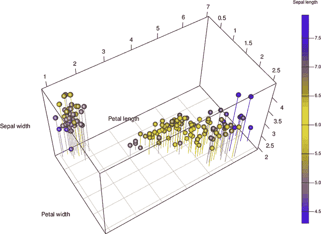

*图 26-3：这展示了在`iris`数据的`plot3d` *3D 散点图*上添加线条和平面网格，以模拟之前的`scatterplot3d`同一数据的示例。*

**练习 26.1**

返回`survey`数据框，位于`MASS`包中，如果需要的话，可以查看帮助文件`?survey`以了解当前变量的描述。创建一个`survey`的副本，仅包含书写手距、非书写手距、左撇子或右撇子、性别和身高这几列。然后使用`na.omit`来删除包含缺失值的这一子集数据框的行。

1.  生成一个基本的交互式 3D 点云，*z*-轴表示学生身高，*x*-轴表示书写手距，*y*-轴表示非书写手距。

1.  创建一个更具信息量的散点图版本，使用颜色区分性别，使用点的大小区分左撇子和右撇子个体，按照以下指导进行：

    – 首先绘制只对应右撇子个体的点。通过使用性别的数字版本来设置颜色，右撇子女性应为黑色，男性为红色。

    – 将右撇子个体的绘制点大小设置为 4，并确保坐标轴标签整洁。

    – 使用`points3d`，将左撇子个体的点添加到现有图形中。颜色应按照与右撇子学生相同的方式根据性别分配，但这次，点的大小应设置为 10。

    – 调整 RGL 设备的大小，并在左上角添加一个图例，参考四种类型的点：“`Male RH`”（男性 RH）、“`Female RH`”（女性 RH）、“`Male LH`”（男性 LH）和“`Female LH`”（女性 LH）。在设置图例时，使用 `pch` 值为 `19`，并为右撇子和左撇子分别使用 `pt.cex` 值 `0.8` 和 `1.5`。

    作为参考，我的可旋转 3D 散点图版本如下所示：

    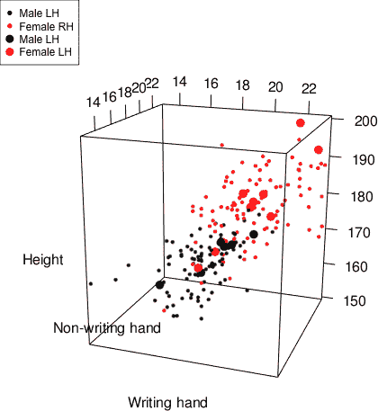

在练习 25.2 中，您查看了内置的 `airquality` 数据的静态 3D 散点图。再次创建数据框的副本，省略任何包含 `NA` 条目的行。

1.  使用 `rgl` 功能创建一个与之前练习相似的图，分别在 *x*、*y* 和 *z* 轴上显示风速、太阳辐射和温度，按照以下指南：

    – 从内置的 `topo.colors` 调色板中设置 50 种颜色。根据分类方法，为臭氧值设置相应的颜色索引向量。

    – 将观测值绘制为大小为 1 的球体，颜色与之前相同，并修改长宽比，使得 *y* 轴的长度是其他两个轴的 1.5 倍。提供整洁的轴标题。

    – 添加相应颜色的线条，每条线代表一个观测值，从 *x*–*y* 平面垂直向上延伸，直到与绘制的球体相交。同时，在下方的 *x*–*y* 平面上放置网格。

    – 修改 RGL 设备的背景，包含一个与臭氧水平相关的颜色图例；使用 60 到 95 之间以 5 为步长的数值来标记它。这是我的结果：

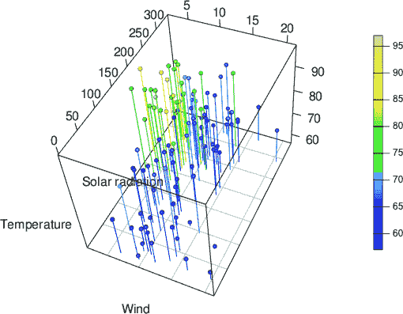

### **26.2 双变量表面**

接下来，你将使用 `rgl` 绘制双变量表面——一个相对于 2D *x*–*y* 评估网格计算出的连续表面。在第二十五章中，你使用基础 R 图形的 `contour`、`filled.contour`、`image` 和 `persp` 绘制了这些图形。任何你能够使用这些函数绘制的图形，也可以通过 `rgl` 的 `persp3d` 函数绘制为交互式透视图。

#### ***26.2.1 基本透视表面***

以 `mtcars` 数据集中的平均 MPG（每加仑英里数）作为马力和重量的函数响应面（首次在第 25.4.1 节中使用）作为一个简单的初步示例。在第 25.6.1 节中，你绘制了该响应面的静态基础 R 视角图。接下来的几行将重新拟合多元线性回归模型，并重新创建 20 × 20 的评估网格 *x* 和 *y* 序列：

```
R> car.fit <- lm(mpg~hp*wt,data=mtcars)
R> len <- 20
R> hp.seq <- seq(min(mtcars$hp),max(mtcars$hp),length=len)
R> wt.seq <- seq(min(mtcars$wt),max(mtcars$wt),length=len)
R> hp.wt <- expand.grid(hp=hp.seq,wt=wt.seq)
```

为了创建该表面，像之前一样使用 `hp.wt` 中的评估网格进行预测，但这次，包含对原始观测值的预测区间计算。

```
R> car.pred <- predict(car.fit,newdata=hp.wt,interval="prediction",level=0.99)
```

（你将在后续示例中使用该间隔。）然后，构建 *z* 矩阵，并用以下两行绘制一个绿色的 `persp3d` 表面：

```
R> car.pred.mat <- matrix(car.pred[,1],nrow=len,ncol=len)
R> persp3d(x=hp.seq,y=wt.seq,z=car.pred.mat,col="green")
```

结果如图 26-4 的左侧所示。如果你将其与图 25-19 进行比较，便可以看到它显示了相同的表面。`persp3d`表面所产生的默认光照和阴影效果有助于深度感知，类似于`persp`的`shade`参数。这个版本的主要优点是基于鼠标的旋转和缩放交互性。

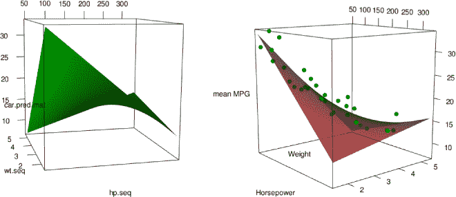

*图 26-4：两种交互式* `persp3d` *版本的* `mtcars` *响应面。左侧：绿色的默认外观。右侧：红色，70%不透明度的表面，原始数据在三维空间中叠加。两个图都可以通过鼠标旋转和缩放。*

#### ***26.2.2 添加组件***

`persp3d`绘制的表面还有一个有用的属性，那就是可以轻松地添加更多组件——这是基础 R 功能中远远不如这个方法直接的事情。你将继续使用之前为`mtcars`响应面创建的对象。

##### **添加点**

由于这个响应面是基于适配于马力、重量和 MPG 这三个变量的数据的模型，它会很有帮助将原始观测数据与拟合模型一起查看。为此，你可以使用`points3d`，它的功能就像基础 R 图形中的`points`。执行以下命令：

```
R> persp3d(x=hp.seq,y=wt.seq,z=car.pred.mat,col="red",alpha=0.7,
           xlab="Horsepower",ylab="Weight",zlab="mean MPG")
R> points3d(mtcars$hp,mtcars$wt,mtcars$mpg,col="green3",size=10)
```

调整 RGL 设备的大小以适应你的需要并保持设备开启。这两个命令绘制了预测的平均 MPG 响应面，这次使用可选的`alpha`参数设置为 70%的不透明度并显示为红色，然后将原始观测数据以绿色添加到同一图像中，并略微放大它们的默认大小。你可以在图 26-4 的右侧看到这个图；你现在可以比较响应面与原始数据的拟合情况，并从任何角度查看。

##### **添加表面**

你还可以添加更多的透视表面！让我们继续使用你为图 26-4 创建的`car.pred`对象来添加当前图表。响应面存储在`car.pred`的第一列；相应的上下预测限制存储在第二列和第三列——回到第 20.4.2 节讨论线性回归模型的`predict`。要将这些预测边界添加到图 26-4 右侧显示的响应面，你首先需要将每个边界表面存储为一个对应于*x*-*y*评估网格的*z*-矩阵。

```
R> car.pred.lo <- matrix(car.pred[,2],nrow=len,ncol=len)
R> car.pred.up <- matrix(car.pred[,3],nrow=len,ncol=len)
```

然后，简单地对每一个*z*-矩阵调用`persp3d`，并使用可选的`add`参数设置为`TRUE`——这指示`persp3d`函数将新的图形添加到现有的图形中，而不刷新图表。

```
R> persp3d(x=hp.seq,y=wt.seq,z=car.pred.up,col="cyan",add=TRUE,alpha=0.5)
R> persp3d(x=hp.seq,y=wt.seq,z=car.pred.lo,col="cyan",add=TRUE,alpha=0.5)
```

在这里，你还将每个附加表面的颜色设置为青色，并将不透明度设置为 50%。你可以在图 26-5 左侧看到结果。通过鼠标旋转它，你将能够看到所有观测值都落在这个特定模型的 3D 99%预测区间的范围内。

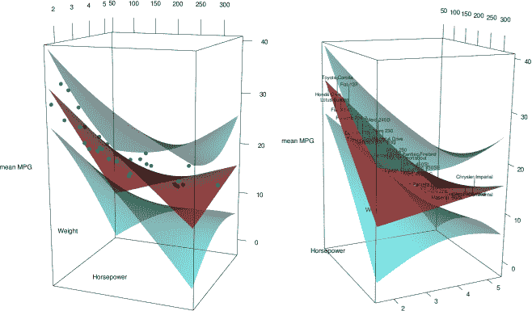

*图 26-5：在现有的`persp3d`拟合`mtcars`模型图中，添加进一步的表面表示 99%预测区间。左侧：绿色点表示原始观测值。右侧：原始观测值被加上文本标签，相应的线段标记了对应的残差。*

另外，你可以使用原始`mtcars`数据框的行名属性将原始观测值标注为文本，这样你就可以在图中识别出每辆车对应的名称。在这种情况下，可以使用内置的`rownames`函数将名称作为字符字符串向量获取。为了在现有的 3D 图形中添加文本，`rgl`有一个类似于传统`text`函数的函数`text3d`。执行以下四行代码会重新绘制半透明的红色响应面，在对应的（*x*，*y*，*z*）坐标处添加适当的文本，并再次添加青色的预测区间：

```
R> persp3d(x=hp.seq,y=wt.seq,z=car.pred.mat,col="red",alpha=0.7,
           xlab="Horsepower",ylab="Weight",zlab="mean MPG")
R> text3d(x=mtcars$hp,y=mtcars$wt,z=mtcars$mpg,texts=rownames(mtcars),cex=0.75)
R> persp3d(x=hp.seq,y=wt.seq,z=car.pred.up,col="cyan",add=TRUE,alpha=0.5)
R> persp3d(x=hp.seq,y=wt.seq,z=car.pred.lo,col="cyan",add=TRUE,alpha=0.5)
```

由于文本比绿色点更难以视觉定位，因此在拟合的表面上标出它们的位置是有意义的——而使用拟合模型的残差来实现这一点又有什么比这更好的方法呢？正如你从`iris`数据的 3D 散点图中知道的那样，`segments3d`函数非常适合这个目的。首先，你需要在三个坐标轴上设置“从–到”向量（有关`segments3d`的解释，请参见第 26.1 节）。

```
R> xfromto <- rep(mtcars$hp,each=2)
R> yfromto <- rep(mtcars$wt,each=2)
R> zfromto <- rep(car.fit$fitted.values,each=2)
R> zfromto[seq(2,2*nrow(mtcars),2)] <- mtcars$mpg
```

在这里，*x*轴和*y*轴的值在从“从”位置到“到”位置的过程中并没有变化，因此它们只是原始数据框中每个马力和重量条目的双重副本。你需要指示*z*轴的“从”值保持为模型的拟合值（换句话说，响应面的实际垂直位置），而“到”值是原始数据的*z*值。然后，最后一次调用`segments3d`函数绘制残差，每个带有`text3d`标签的汽车对应一条标准的黑色线段。

```
R> segments3d(x=xfromto,y=yfromto,z=zfromto)
```

花一点时间与最终产品互动，见图 26-5 右侧。

#### ***26.2.3 根据 z 值着色***

`persp3d`图的一个优点是，你可以根据*z*值着色表面，而无需做任何特殊处理。回想一下，如果你使用的是基础 R 的`persp`函数，按*z*值着色将需要一个小小的变通，因为你需要计算作为每个面片四个相邻*z*矩阵条目的平均值来获得相关的垂直位置（见第 25.6.2 节）。

幸运的是，使用`persp3d`时并不需要这么做。再次以`mtcars`响应面为例，你可以设置所需的颜色调色板，并直接将颜色分配给*z*-矩阵的条目，而无需先平均每组相邻的四个值。

```
R> blues <- colorRampPalette(c("cyan","navyblue"))
R> blues200 <- blues(200)
R> zm <- car.pred.mat
R> zm.breaks <- seq(min(zm),max(zm),length=201)
R> zm.colors <- cut(zm,breaks=zm.breaks,include.lowest=TRUE)
```

然后，使用分类方法为连续值分配颜色，当在`persp3d`中指定`col`值时，只需要通过`zm.colors`索引`blues200`。

```
R> persp3d(x=hp.seq,y=wt.seq,z=car.pred.mat,col=blues200[zm.colors],
           alpha=0.6,xlab="Horsepower",ylab="Weight",zlab="mean MPG")
```

图 26-6 展示了结果。

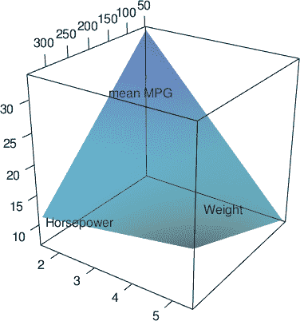

*图 26-6：展示在`persp3d`中使用*z*-矩阵值直接分配颜色，生成的`mtcars`响应面结果*

#### ***26.2.4 处理纵横比***

从`mtcars`模型中休息一下，你现在将返回到 Chorley-Ribble 数据的双变量核密度估计，该数据在第 25.5.2 节和 25.6.2 节中使用。加载`spatstat`包以访问`chorley`数据，并使用`MASS`包访问`kde2D`函数。为了方便起见，以下代码计算使用`kde2D`的 KDE 表面，结果存储在`chor.dens.WIN`对象的`$z`组件中：

```
R> chor.WIN <- chorley$window
R> chor.dens.WIN <- kde2d(chorley$x,chorley$y,n=256,
                          lims=c(chor.WIN$xrange,chor.WIN$yrange))
R> chor.xy <- expand.grid(chor.dens.WIN$x,chor.dens.WIN$y)
R> chor.out.mat <- matrix(!inside.owin(x=chor.xy[,1],y=chor.xy[,2],
                                       w=chor.WIN),
                          256,256)
R> chor.dens.WIN$z[chor.out.mat] <- NA
```

它还通过将所有位于该多边形外部的*z*-矩阵元素设置为`NA`，将表面截断，以使其落入表示地理研究区域的多边形内（你已经在第 25.5.2 节中详细学习了如何实现这一点）。

然后，执行接下来的几行代码生成 200 种颜色，这些颜色来自你之前为这个 KDE 图使用的内置`rainbow`调色板，并将截断后的*z*-矩阵条目适当地分类：

```
R> zm <- chor.dens.WIN$z
R> rbow <- rainbow(200,start=0,end=5/6)
R> zm.breaks <- seq(min(zm,na.rm=TRUE),max(zm,na.rm=TRUE),length=201)
R> zm.colors <- cut(zm,breaks=zm.breaks,include.lowest=TRUE)
```

请再次注意，区别在于你不需要像在第 25.6.2 节中那样计算面板平均值——`cut`直接应用于`zm`。

在调用`persp3d`之前，值得记住的是，由于你处理的是地理区域，应该考虑*x*轴和*y*轴方向的纵横比。正如你在第 26.1 节中看到的，`rgl`函数中的`aspect`参数的作用与`image`中的`asp`参数或`persp`中的`scale`/`expand`参数有所不同。在`rgl`图形中，包括`persp3d`，`aspect`请求一个长度为 3 的数值向量，用来定义*x*、*y*和*z*轴的相对比例，顺序为*x*轴、*y*轴和*z*轴。

为了确定 Chorley-Ribble 数据的适当相对比例，你需要计算定义研究区域的总*x*轴和*y*轴宽度，并找出它们的比率。

```
R> xd <- chor.WIN$xrange[2]-chor.WIN$xrange[1]
R> xd
[1] 23
R> yd <- chor.WIN$yrange[2]-chor.WIN$yrange[1]
R> yd
[1] 21.38
R> xd/yd
[1] 1.075772
```

这是通过使用`spatstat`多边形的`$xrange`和`$yrange`组件完成的，分别在每种情况下从上限减去下限。最终的`xd/yd`比率显示出你几乎达到了 1:1 的比例，尽管从技术上讲，区域在*x*轴上的物理宽度比在*y*轴上的宽度大，大约是 1.076 倍。

考虑到这一点，你可以调用`persp3d`正确绘制 KDE 曲面。

```
R> persp3d(chor.dens.WIN$x,chor.dens.WIN$y,chor.dens.WIN$z,
           col=rbow[zm.colors],aspect=c(xd/yd,1,0.75),
           xlab="Eastings (km)",ylab="Northings (km)",
           zlab="Kernel estimate")
```

使用`aspect`来指定*x*轴应该根据`xd/yd`的比例因子相对于*y*轴进行缩放，*y*轴被视为参考比例 1，*z*轴应相对于*y*轴按 0.75 的因子进行压缩。这个设置是任意的，使得图形与图 25-21 中在第 685 页的原始`persp`图形相似。

让我们通过添加一个颜色图例来完成图形的绘制。确保已经加载了`shape`包，调整包含最近一次调用`persp3d`结果的 RGL 设备大小，并执行以下命令：

```
bgplot3d({plot.new();
          colorlegend(col=rbow,zlim=range(chor.dens.WIN$z,na.rm=TRUE),
                     zval=seq(0,0.02,0.0025),main="KDE",digit=4,
                     posx=c(0.87,0.9),posy=c(0.2,0.8))})
```

记住，必须使用`bgplot3d`来更改当前 RGL 设备的背景—请参考第 26.1 节的末尾。你可能想稍微实验一下`posx`和`posy`，以找到你偏好的颜色图例位置。图 26-7 展示了我机器上的结果。

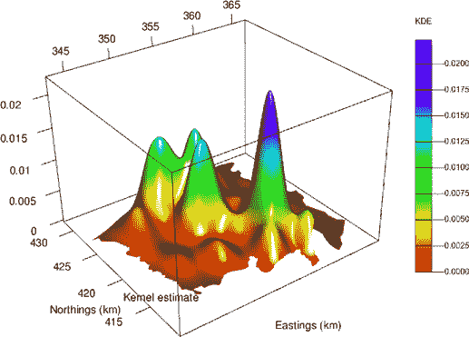

*图 26-7：一个交互式* `persp3d` *表示的 Chorley-Ribble 核密度估计，按*z*轴值着色，并带有静态颜色图例*

**练习 26.2**

返回内置的`airquality`数据框中的测量值。创建一个数据框的副本，包含与温度、风速、臭氧水平和月份相关的变量；删除所有包含缺失值的行。现在，你将使用`rgl`对之前的均温回归模型进行可视化实验。

1.  重新拟合练习 25.4 中的多元线性模型，该模型对温度与主要效应和风速与臭氧的交互效应进行了回归。使用`expand.grid`和`predict`构造响应面对应的*z*矩阵；包括对拟合均值的 95%置信区间估计。然后，使用`rgl`功能生成响应面的交互式 3D 图，并将其着色为黄色。

1.  使用内置的`topo.colors`调色板，重新绘制响应面，将颜色根据*z*值进行分配，并设置不透明度为 80%。整理轴标题，调整 RGL 设备大小，并保持图形打开。

1.  如下所示，增强(b)中的图形：

    1.  从一个自定义调色板中生成正好五种颜色，颜色从`"red4"`到`"pink"`，并将原始的风速、臭氧和温度观察值作为点添加到响应面图上。根据月份（5 月到 9 月）使用这五种颜色按顺序为点着色。将添加的点的大小设置为`10`。

    1.  向图形添加垂直线，表示拟合模型的残差；换句话说，每个观察值应有一条垂直线将其连接到响应曲面的相应拟合值。这些添加的线条应该使用先前的自定义调色板，以匹配每个数据点的颜色。

    1.  添加在 (a) 中存储的模型预测的上下 95% 置信区间。添加的曲面应为灰色，并具有 50% 的不透明度。

    1.  在交互式图形的右上角添加一个图例，参考按月份划分的五种颜色的点/线。使用 `pch` 值为 `19`，`cex` 值为 `2`。

        结果应如下所示：

        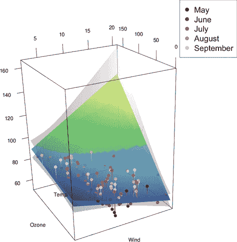

接下来，加载 `spatstat` 包并重新访问 `clmfires` 数据集。执行以下代码行，仅关注故意点燃的火灾，并获取地理研究区域：

R> fire <- split(clmfires)$intentional

R> firewin <- clmfires$window

1.  根据以下指南，将 练习 25.5 (e) 中的静态透视图在 第 689 页 上重现为交互式透视图。然后保持该图形打开。

    – 计算 `fire` 的 `$x` 和 `$y` 坐标的 KDE 曲面，限制为 `firewin` 中的研究区域，使用 256 × 256 的评估网格。

    – 使用内置的颜色调色板 `heat.colors`，根据 *z* 值为表面着色。将不透明度设置为 70%。

    – 确保 *x*-*y* 轴具有正确的比例。然后将垂直方向的纵横比缩小为相对于 *y*-轴的 0.6。

    – 抑制 *z*-轴标题，但在另外两个轴上添加整齐的 `"X"` 和 `"Y"` 标题。

1.  对图形进行以下增强：

    1.  添加原始观察值，使其位于表面下方。为此，将每个数据点的常量 *z* 值设置为 *z*-矩阵的最小（且非 `NA`）值。

    1.  您可以通过以下方式使用 `spatstat` 的 `vertices` 函数获取形成研究区域的非规则多边形的 *x* 和 *y* 坐标向量：

        R> firepoly <- vertices(firewin)

        R> fwx <- firepoly$x

        R> fwy <- firepoly$y

        通过将这两个向量提供给 `lines3d` 函数的适当 `x` 和 `y` 参数，将研究区域添加到位于绘制表面下方的 *x*-*y* 平面上，以包围叠加的观察值。同样，您需要指定 *z* 值作为所有绘制线条的最小 *z*-矩阵值。设置 `lwd=2` 以绘制比默认线条稍粗的线条。

        你的结果应该像这样：

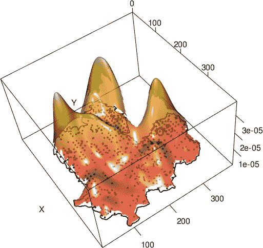

### **26.3 三维曲面**

到目前为止，您已经看到了形式为 *z* = *f* (*x*, *y*) 的二元函数，其中您的评估网格是二维的。换句话说，您通过 *x* 值和 *y* 值来评估函数 *f*；*x* 和 *y* 值绘制在前两个坐标轴上，*f* 的值则用于绘制第三维。接下来，您将绘制 *三变量* 函数，它可以看作是 *w* = *f* (*x*, *y*, *z*)。也就是说，评估网格本身是三维的，而 *f* 会给您一个第四个值 *w*，用于绘制表面。

#### ***26.3.1 三维评估坐标***

在处理三变量数学函数时，您需要一个 *x*、一个 *y* 和一个 *z* 值来评估结果。与平面的评估网格不同，您将拥有一个位于立方体或其他三维棱镜中的评估 *格子*。

作为三变量函数的完美示例，您将创建一个“颜色立方体”，其中每个点是红色、绿色和蓝色的三种值的结果——有关详细信息，请参见 第 25.1.1 节。您将使用三个物理轴来反映红色、绿色和蓝色值的评估格子，结果将在 3D 空间中的相应位置绘制该颜色的点。

以下代码设置了三个坐标方向上的评估格子：

```
R> reds <- seq(0,255,25)
R> reds
 [1]   0  25  50  75 100 125 150 175 200 225 250
R> greens <- seq(0,255,25)
R> blues <- seq(0,255,25)
R> full.rgb <- expand.grid(reds,greens,blues)
R> nrow(full.rgb)
[1] 1331
```

前四行生成三种颜色在标准 0 到 255 的 RGB 整数范围内等间距递增的序列。然后，您使用内置的 `expand.grid` 函数根据这三个序列生成包含所有唯一颜色三元组的数据框，从而得到一个包含 11³ = 1331 个特定坐标的评估格子。请注意，`expand.grid` 对于高维评估网格的工作方式与对二元 *x*-*y* 网格的工作方式相同（有关详细信息，请参见 第 25.3.1 节）。

最后，调用 `plot3d` 在每个 3D 评估坐标点上放置球体（回想一下在 第 25.1.1 节中使用的 `rgb` 命令）：

```
R> plot3d(x=full.rgb[,1],y=full.rgb[,2],z=full.rgb[,3],
          col=rgb(full.rgb,maxColorValue=255),type="s",
          size=1.5,xlab="Red",ylab="Green",zlab="Blue")
```

图 26-8 展示了从两个不同角度得到的结果，您可以看到 RGB 三元组的红色、绿色和蓝色分量的强度如何控制每个点的颜色。

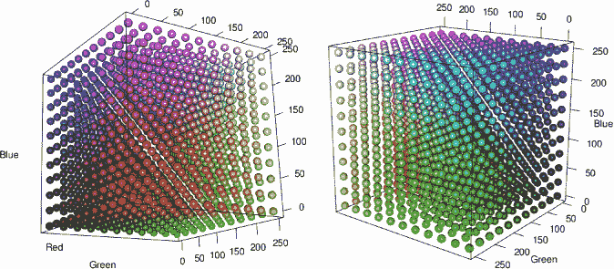

*图 26-8：由 `rgl` 创建的“颜色立方体”，该立方体作为球体，其中第四维的结果（颜色本身）是评估三变量 RGB 函数的结果。*

#### ***26.3.2 等值面***

在每个 3D 评估坐标点绘制单独的点球时，问题暴露出来了——图 26-8 中显示了这个问题——很难看到“内部”的球体，这个问题同样使得可视化连续三变量函数变得更加复杂。

为了解决这个问题，您可以改为生成一个 *等值面*，它可以被看作是等高线图的三变量类比。

使用等值面时，你选择一个特定的值层次 *w* = *f* (*x*, *y*, *z*)，并将该层次上所有的*w*值在 3D 空间内连接起来形成一个形状或“块”。这些块显示了在三维空间中，三变量函数在哪些位置取到了所选的值。如果你再在不同的层次上绘制这些块，你将得到一个 3D 版本的等高线图，展示哪些层次具有最高的观测密度，正如你在第 25.4.1 节中所创建的那样。

##### **高维概率密度**

回想一下第 16.2.2 节中详细介绍的单变量正态概率密度函数。首先，我将介绍高维密度函数的概念，使用双变量版本的正态分布，然后我会进一步使用三变量版本来演示等值面绘图。

为了处理多元正态分布，你可以使用`mvtnorm`包，可以通过调用`install.packages("mvtnorm")`进行安装。与单变量正态分布的`rnorm`函数类似，`rmvnorm`函数用于从指定的多元正态分布中生成随机变量。安装了`mvtnorm`后，执行以下代码：

```
R> library("mvtnorm")
R> rand2d.norm <- rmvnorm(n=500,mean=c(0,0))
R> plot(rand2d.norm,xlab="x",ylab="y")
```

这产生了图 26-9 左侧的图形。`rmvnorm`函数用于从标准双变量正态分布中生成 500 个独立的变量。你通过传递一个数值向量给`mean`来将这些变量围绕坐标(0,0)进行居中处理。默认情况下，*x*-*y*坐标方向上的独立标准差分量均为 1。

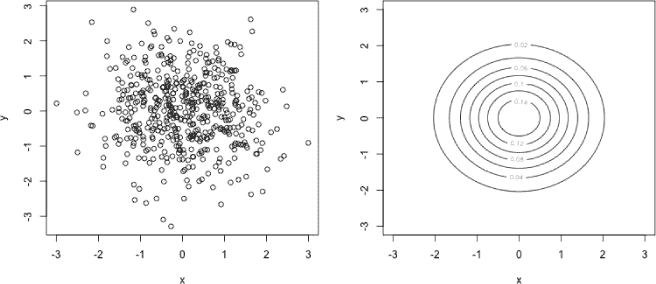

*图 26-9：使用`mvtnorm`功能查看随机生成的数据，以及它们来源的标准双变量正态密度*

要实际查看双变量密度函数，你需要决定* x *-* y *评估网格，并像往常一样使用`expand.grid`构造*z*矩阵。以下代码在两个坐标方向上设置了一个均匀间隔的序列，并使用`dmvnorm`函数（这是`dnorm`的多元版本，给定指定坐标时提供密度函数值）来填充*z*矩阵：

```
R> vals <- seq(-3,3,length=50)
R> xy <- expand.grid(vals,vals)
R> z <- matrix(dmvnorm(xy),50,50)
```

然后，你可以使用`contour`（或`persp`或`persp3d`）来查看用于比较的`rand2d.norm`数据生成的密度（限制在−3 到 3 的范围内）。以下代码行生成了图 26-9 右侧的图形：

```
R> contour(vals,vals,z,xlab="x",ylab="y")
```

##### **基本一阶等值面**

现在让我们再增加一个维度——*三变量*正态密度函数是什么样子的？

首先，让我们看看从这个密度生成的一些数据。以下代码再次生成 500 个随机变量：

```
R> rand3d.norm <- rmvnorm(n=500,mean=c(0,0,0))
R> plot3d(rand3d.norm,xlab="x",ylab="y",zlab="z")
```

然而，由于你将一个长度为 3 的向量作为`mean`参数传递给`rmvnorm`，该函数知道你有三个维度要处理。你告诉它，你希望数据来自一个三元正态分布，且在每个坐标方向上的均值为 0、0 和 0。你可以在图 26-10 左侧看到通过`plot3d`生成的数据的`rgl`点云。

要计算并显示生成这些数据的实际三元密度函数，你需要一个 3D 评估网格，如第 26.3 节开头所述。

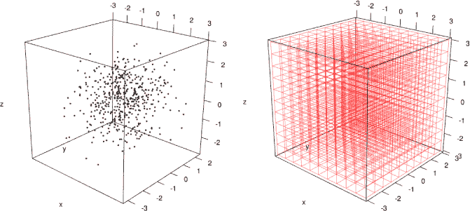

*图 26-10：左侧：查看从标准三元正态分布随机生成的数据。右侧：三元密度函数将被绘制的 3D 评估网格的概念图。*

看一看图 26-10 右侧的图表。它显示了基于在*x*、*y*和*z*中跨越[−3,3]的序列生成的 3D 11 × 11 × 11 评估网格。这应该能清晰地展示如何通过增加连续函数的维度来工作。这个 11 × 11 × 11 网格中的每个交点是图 25-9 中二维 6 × 4 评估网格中的每个实线交点的三维等价物，而这个 3D 网格中的每个 10³个迷你 3D 立方体是二维面片的三维等价物，如在图 25-20 的讨论中所提到的，在第 683 页。 (与图 25-9 类似，你可以在本书的网站上找到绘制此 3D 网格的代码。)

要绘制三元函数的结果，你需要评估网格的独特评估坐标。使用`vals`，即之前创建的跨越-3 到 3 的值序列，以下代码会生成一个包含所有 50³ = 125,000 个独特 3D 评估网格坐标的数据框。

```
R> xyz <- expand.grid(vals,vals,vals)
R> nrow(xyz)
[1] 125000
```

然后，你使用`dmvnorm`来获取标准三元正态分布的数值，就像在二元正态分布中做的那样。该函数会自动识别你请求的是三元密度，因为你的数据参数`xyz`有三列。

```
w <- array(dmvnorm(xyz),c(50,50,50))
```

请注意，结果被适当地存储为一个 50 × 50 × 50 的 3D 数组——有关`array`的详细信息，请参见第 3.4 节。查看 3D 数组的概念图（图 3-3 在第 53 页）并将其与图 26-10 右侧的 3D 网格进行比较。对象`w`中的三元正态值显然是通过一个 3D 数值块表示的，坐落在定义的 3D 空间中的每个对应的独特评估坐标上。

可以使用`contour3d`函数生成等高面，该函数是`misc3d`包的一部分（Feng and Tierney, 2008），与`rgl`密切配合。要使用它，你需要决定绘制等高面时的水平（或多个水平）。对于密度图，通常根据所谓的*α*水平等高线来做出此选择；有关更多细节，请参阅 Scott 的权威著作《多元密度理论》（1992）。简而言之，对于某个密度*f*，这些水平通过将等高面绘制在多元评估格点中与密度值*α* × max(*f*)对应的位置来划定（1 − *α*) × 100 百分比的“最密集”观察值。

对于三元标准正态分布，密度的最大值位于坐标(0,0,0)的均值处。

```
R> max3d.norm <- dmvnorm(c(0,0,0),mean=c(0,0,0))
R> max3d.norm
[1] 0.06349364
```

在生成接下来的几个图时，你需要使用这个方法。接下来，安装`misc3d`，用`library("misc3d")`加载它，然后调用`contour3d`。

```
R> contour3d(x=vals,y=vals,z=vals,f=w,level=0.05*max3d.norm)
```

这将在 RGL 设备中生成一个等高面，你可以根据需要旋转和缩放它；你可以在图 26-11 的左侧看到结果。你需要为`contour3d`提供`x`、`y`和`z`作为在*x*、*y*、*z*坐标方向上的均匀间隔序列（在这个例子中，所有这些都是由向量`vals`定义的）。你还需要为函数`f`提供相应的 3D 数组，定义三元函数的整体结果，并将你希望绘制等高面的水平（或多个水平）传递给`level`。在这里，我选择了*α*水平，以便将分布尾部的 5%概率留在外面，这意味着 95%的总质量集中在“团块”内。

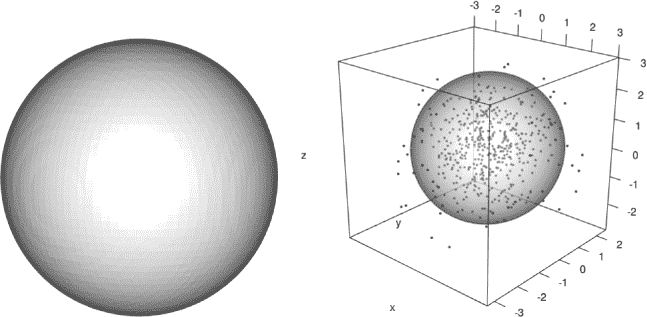

*图 26-11：使用`misc3d`包的`contour3d`函数生成的三元标准正态密度函数等高面。左图：在*α*水平为 0.05 时绘制的独立图形。右图：将相同的等高面添加到现有的`rgl`图中，图中包含随机生成的三元正态观察值，且不透明度为 50%。*

图形与预期相符——基于你之前生成的随机数据的图形，三元密度的形状相对清晰。然而，没有缩放的话，它不过是一个统计学上的高尔夫球。通常，将数据与其来源的密度一起查看会更有帮助，而这也是很容易做到的。以下代码使用`plot3d`重新绘制`rand3d.norm`中的数据，并再次调用`contour3d`以在*α*水平为 0.05 时绘制：

```
R> plot3d(rand3d.norm,xlab="x",ylab="y",zlab="z")
R> contour3d(x=vals,y=vals,z=vals,f=w,level=0.05*max3d.norm,add=TRUE,alpha=0.5)
```

就像传统的 R `contour`函数一样，如果你希望使用`contour3d`添加到现有的`rgl`图中（就像这里的情况），你需要显式指定`add=TRUE`。你还可以使用可选的`alpha`参数来调整不透明度，在这个例子中降低到 50%，以便“查看”密度等高面的内部。

##### **通过颜色和不透明度控制多个水平**

玩弄透明度特别有用，特别是在你想要同时绘制多个*α*水平的等值面时。颜色也在这方面非常有用，作为一个变量，可以表示第四维，而无需在图形中添加额外的物理轴。

要在多个层次上查看三变量正态密度，请执行以下代码生成的图形：

```
R> plot3d(rand3d.norm,xlab="x",ylab="y",zlab="z")
R> contour3d(x=vals,y=vals,z=vals,f=w,
             level=c(0.05,0.2,0.6,0.95)*max3d.norm,
             color=c("pink","green","blue","red"),
             alpha=c(0.1,0.2,0.4,0.9),add=TRUE)
```

图 26-12 显示了结果。在这里，你重新绘制了 500 个随机生成的三变量正态观测数据，另一个`contour3d`调用现在在三变量密度的四个特定*α*水平（0.05、0.2、0.6 和 0.95）上绘制了等高线。你使用可选的`color`参数将这些等高线分别渲染为粉色、绿色、蓝色和红色，并通过`alpha`参数逐步增加每个水平的透明度。

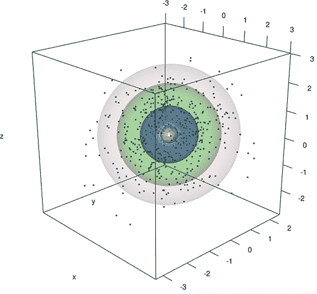

*图 26-12：在四个不同的水平上绘制的三变量正态密度等值面，覆盖在随机生成的观测数据上。使用颜色和透明度来区分绘制函数的不同数值水平。*

你应该能够看到，在这个分布的三维空间中，你可以通过类似于使用标准二维等高线来评估双变量观测分布的方式，来衡量点密度的增加。

#### ***26.3.3 示例：非参数三变量密度***

要查看使用真实数据的扩展示例，请再次查看内置的`quakes`数据框，它包含了 1000 次地震事件的空间位置、震级和深度。

在第 25.4.1 节，你使用`MASS`函数`kde2D`构建了二维经度-纬度空间坐标的双变量核密度估计。如那里所述，KDE 自然扩展到更高维度。现在的目标是计算并可视化相同空间地震数据的密度估计，但这次基于三变量坐标——经度、纬度和*深度*，在三维空间中进行。

##### **原始数据**

首先，让我们看一下原始观测数据。以下代码创建了`quakes`数据的副本，提取了三个变量并将`depth`设置为负值。我这样做是为了在绘制时，使得地震深度对应于沿垂直轴向*下*移动，给人一种深度低于海平面的印象。

```
R> quak <- quakes[,c("long","lat","depth")]
R> quak$depth <- -quak$depth
```

以通常的`rgl`方式，你可以通过以下代码创建原始数据的点云：

```
R> plot3d(x=quak$long,y=quak$lat,z=quak$depth,
          xlab="Longitude",ylab="Latitude",zlab="Depth")
```

图 26-13 显示了结果。如果你旋转图形，使得你直接从上方俯视，你将认出你已经绘制的二维空间模式；例如，可以参见图 13-1（第 265 页）、图 23-1（第 578 页）或图 25-12（第 662 页）。

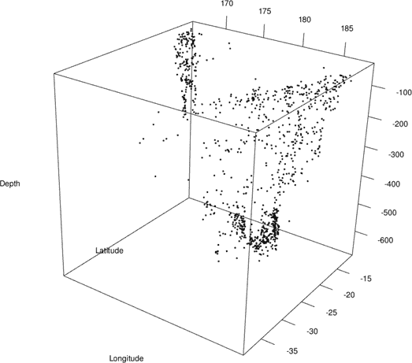

*图 26-13：查看地震事件的三维空间分布——纬度、经度和深度*

##### **计算 3D 估计**

该核估计的评估网格将由经度-纬度-深度数据所在的整个 3D 空间定义，正如第 26.3.2 节中所示。

要实际计算`quak`数据的 3D KDE 表面，你将使用贡献包`ks`（Duong, 2007）的强大功能。安装该包并通过调用`library("ks")`加载它。`ks`包中的`kde`函数允许你使用核平滑来估计 1D 到 6D 数据的概率密度。

你传递给`kde`的第一个参数是你的数据，形式为矩阵或数据框，并带有标签`x`。注意，在使用`kde`时，数据对象中列的顺序非常重要。当与`quak`一起调用时，并考虑到之前代码中创建`quak`时提取的三个变量的顺序，结果 3D 核估计中的*x*、*y*和*z*坐标轴将分别对应经度、纬度和深度。

```
R> quak.dens3d <- kde(x=quak,gridsize=c(64,64,64),compute.cont=TRUE)
```

这与图 26-13 中显示数据的方式一致。`gridsize`参数指定每个轴的网格分辨率。在这个例子中，我选择了 64 × 64 × 64 的网格；默认情况下，`kde`会选择每个坐标方向上略宽于观测数据的评估范围。最后，为了绘制结果，指定参数`compute.cont=TRUE`也是有用的；稍后我会解释这样做的原因。

返回的对象有多个组成部分。3D 估计作为适当大小的数组通过`$estimate`成员提供；如果你想检查，执行以下代码行可以确认它与期望的网格分辨率匹配：

```
R> dim(quak.dens3d$estimate)
[1] 64 64 64
```

`$eval.points`组件包含一个列表，其成员是特定的评估坐标，这些坐标在三个轴上是等间距的序列。成员的数量反映了问题的维度，其顺序对应于特定轴。你可以通过以下代码提取它们：

```
R> x.latt <- quak.dens3d$eval.points[[1]]
R> y.latt <- quak.dens3d$eval.points[[2]]
R> z.latt <- quak.dens3d$eval.points[[3]]
```

如果你将这些向量打印到控制台屏幕上，你会看到每个向量的长度为 64，`x.latt`、`y.latt`和`z.latt`对应于与数据框`quak`中列的顺序匹配的变量。

##### **等值面级别选择**

选择显示的级别取决于构成三变量函数结果的值的范围。当你在调用`kde`时选择`compute.cont=TRUE`，你会自动获得一组适当的级别。这些级别在`$cont`组件中作为一个长度恰好为 99 的数值向量返回，表示从 1%到 99%的每个整数。

在内部，这些水平是通过计算每个原始观察数据点位置上三变量函数的结果，然后使用`quantile`函数获得这些密度值的所有整数百分位数（从 99 百分位到 1 百分位）（有关分位数的复习，请参见第 13.2.3 节）。这些值按降序返回；换句话说，`quak.dens3d$cont[1]`对应于第 99 百分位，`quak.dens3d$cont[99]`对应于第 1 百分位。

尽管这些值是通过与绘制三变量正态密度时实验的*α*水平不同的方式获得的，但当你可视化结果时，本质上你会得到相同的解释——这些值允许你在所需的估计观察“密度”水平上绘制等值面。例如，较低四分位数（即第 25 百分位数）可以通过以下方式提取：

```
R> quak.dens3d$cont[75]
         25%
2.002741e-05
```

这提供了 KDE 三变量函数的值，该值估算出将最空间分散的 25%的观察与其余部分区分开来的值（换句话说，使得结果中的斑块包含了最密集的 75%的数据）。

**注意**

*在撰写时，* `rgl` *和* `misc3d` *包是* `ks` *的依赖项。这意味着当你加载* `ks` *时，它们会自动加载，因此在这种情况下，你不需要显式调用* `library("rgl")` *或* `library("misc3d")` *，* `plot3d` *和* `contour3d` *已经可以使用。随着开发者更新其包，这种情况可能会有所变化。*

当你执行以下代码时，它首先重新绘制了基于密度估计的`quak`数据，然后使用下四分位点的密度值作为所需的水平，添加了相应的等值面。你可以在图 26-14 的左侧看到结果。

```
R> plot3d(x=quak$long,y=quak$lat,z=quak$depth,
          xlab="Longitude",ylab="Latitude",zlab="Depth")
R> contour3d(x=x.latt,y=y.latt,z=z.latt,f=quak.dens3d$estimate,
             color="blue",level=quak.dens3d$cont[75],add=TRUE)
```

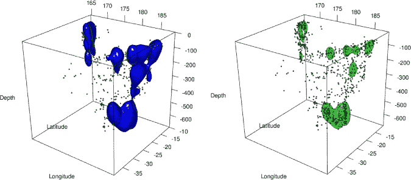

*图 26-14：基于使用贡献的* `kde` *和* `contour3d` *函数绘制的三变量核密度估计的等值面（3D 等高线图），在特定点密度分位数处。左侧：蓝色实线表示下四分位数——最分散的 25%点。右侧：绿色表示中位数——最分散的 50%与最密集的 50%之间的分界线，透明度减半。*

看着图像，可以清楚地看到代表指定水平的 3D 等高线的蓝色斑块。三变量函数的较高水平，即密集分布的点，位于这些斑块的“内部”。换句话说，蓝色形状包含了与纬度、经度和深度相关的估计密度的最高 75%观察数据。要查看等值面内部，你可以通过调整透明度`alpha`来实现。

让我们取出划定下半部分和上半部分 50%估计密度值所对应观察的水平。

```
R> quak.dens3d$cont[50]
         50%
3.649565e-05
```

然后，重新运行`plot3d`调用以重新绘制原始`quak`数据。之后，调用`contour3d`产生图 26-14 右侧的结果，让你能够透过绿色斑块看到更多信息。

```
R> contour3d(x=x.latt,y=y.latt,z=z.latt,f=quak.dens3d$estimate,
             color="green",level=quak.dens3d$cont[50],add=TRUE,alpha=0.5)
```

最后，你将使用多个层次突出显示最密集聚集的前 80%的观测数据。执行以下操作：

```
R> qlevels <- quak.dens3d$cont[c(80,60,40,20)]
R> qlevels
         20%          40%          60%          80%
1.771214e-05 2.964305e-05 4.249407e-05 9.543976e-05
```

这将得到四个层次——确定最密集聚集观测数据的 80%、60%、40%和 20%的分位数。然后，设置几个向量来控制每个密度层次的颜色和透明度。

```
R> qcols <- c("yellow","orange","red","red4")
R> qalpha <- c(0.2,0.3,0.4,0.5)
```

颜色和透明度的范围意味着等值面在密度增加时会变暗并变得更加不透明。

最后一次，像之前一样使用`plot3d`重新绘制原始`quak`数据。然后，只需将长度为 4 的向量传递给`contour3d`中的每个相应参数。

```
R> contour3d(x=x.latt,y=y.latt,z=z.latt,f=quak.dens3d$estimate,
             color=qcols,level=qlevels,add=TRUE,alpha=qalpha)
```

图 26-15 展示了结果。你可以看到，地震的最紧密聚集出现在非常深的位置，且位于 3D 空间棱柱的东部边缘（可见的“三室”密度斑块是这些特定数据的一个著名特征）。

### **26.4 处理参数方程**

到目前为止，本章中的大多数例子中，曲面是由常规评估网格或格点的坐标直接定义的，但也有一些情况，你希望可视化的最终轴*不是*某个评估网格的函数。这种情况在你只是想绘制常见几何形状时非常自然，但也扩展到更复杂的数学情境。

在本节中，你将从一组参数方程中绘图，这些方程共同定义了感兴趣的形状或曲面。本节假设你熟悉基本的三角函数*正弦*和*余弦*，以及角度从*度*到*弧度*的转换，因为默认情况下，R 只处理后者。话虽如此，我会在需要时引导你完成相关的计算和 R 代码。

#### ***26.4.1 简单轨迹***

使用数学术语，*轨迹*（复数形式为*loci*）是满足并由特定参数方程定义的一组点。在 R 中，这些方程决定了结果对象中每个数字元素的计算方式，随后你可以使用熟悉的函数轻松地绘制它们。

**注意**

*在讨论轨迹时，任何关于二维或三维空间的引用都指的是*欧几里得空间*，这就是你迄今为止处理* x*、* y* 和* z*轴坐标的标准方式。*

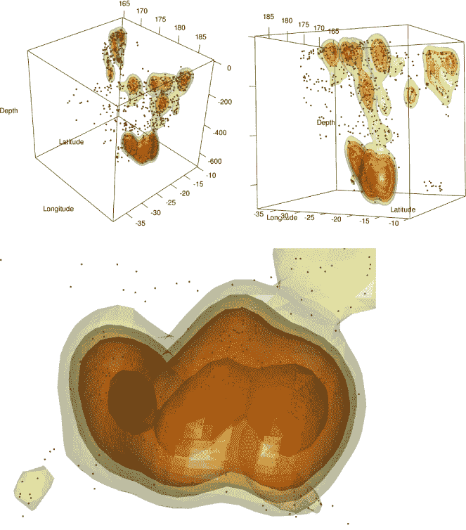

*图 26-15：地震观测的三维核密度估计的三个截图，分别从不同角度和不同的缩放级别拍摄。密度增加的层次通过等值面的黄色到红色变暗颜色和更高的透明度反映出来。*

##### **二维圆**

让我们从一个简单的例子开始。通过这种方式定义的最易识别的形状之一是二维圆。要找到圆上的任何一点，您需要知道圆心位置及其半径，并提供一个特定的角度（通常相对于水平线）。位于圆上的任何平面二维点 (*x*,*y*) 都可以通过以下方程表示，如果您将圆心设为坐标 (*a*, *b*)，半径为 *r* > 0，并且查看角度 *θ*：

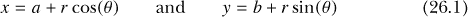

如果您使用的是度数，则严格来说 0 ≤ *θ* < 360；要转换为弧度，必须乘以 *π*/180，使得 0 ≤ *θ* < 2*π*。

要根据（26.1）中的方程绘制圆，首先确定半径，然后确定圆心位置，再生成相应的 *x* 和 *y* 值。请参见以下代码：

```
R> radius <- 3
R> a <- 1
R> b <- -4.4
R> angle <- 0:360*(pi/180)
R> x <- a+radius*cos(angle)
R> y <- b+radius*sin(angle)
R> plot(x,y,ann=FALSE)
R> abline(v=a)
R> abline(h=b)
```

该圆的半径为 3，中心在 (1,−4.4)。给定定义为 `angle` 的序列，注意该图会在从 0 到 360 度的每个整数角度上放置一个点——我已将上限设置为恰好 360，以完整地完成旋转——然后将其转换为弧度（通过 *π*/180 的乘法），以便使用内置的 R 函数 `cos` 和 `sin`。圆周率的几何值 (*π* = 3.1415...) 存储在 R 中可直接使用的对象 `pi` 中（请参见帮助文件 `?Constants`）。最后三行执行绘图，结果如图 26-16 所示。

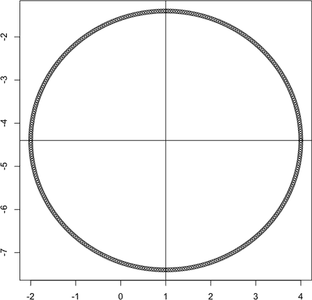

*图 26-16：在 R 中绘制中心为 (1,*−*4.4) 且半径为 3 的二维圆，遵循相关的参量方程*

这里的关键要点是，*y* 不是直接由 *x* 计算得出的，就像在绘制例如线性回归模型时，您可能会获得一个均匀间隔递增的 *x* 序列，然后计算出相应的 *y*。相反，方程（26.1）联合定义了二维空间中轨迹的规则。

##### **3D 圆柱体**

绘制三维曲面的方法基本相同，只是现在您的方程式定义了在 *x*、*y* 和 *z* 轴上所有满足条件的点的规则。

例如，位于空心圆柱上的点可以通过以下方程定义：

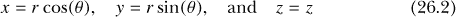

要实际绘制满足这些规则的点，您需要决定一个固定的半径 *r*，并认识到 0 ≤ *θ* < 360（以度为单位），同时定义一个固定的最大高度 *h*，以确保 0 ≤ *z* ≤ *h*。根据这些信息，为了生成 *x*、*y* 和 *z* 的向量，您需要首先设置数值序列，涵盖 *θ* 和 *z* 的可能值。请参见以下代码：

```
R> r <- 3
R> h <- 10
R> zseq <- 0:h
R> theta <- 0:360*(pi/180)
```

这些行展示了半径设置为 3（`r`）和最大高度设置为 10（`h`）。*z* 的序列设置为 `zseq` 中从 0 到 10 的 11 个整数值——这将允许你在每个定义的 *z* 值上放置点。*θ* 的序列设置为 0 ≤ *θ* < 2*π*（在 `theta` 中，注意需要转换为弧度）。接下来，你需要这些参数值的所有唯一组合，以获取绘图所需的所有相关 (*x*, *y*, *z*) 坐标。你可以通过 第 25.3.1 节 使用 `expand.grid` 来做到这一点。

```
R> ztheta <- expand.grid(zseq,theta)
R> nrow(ztheta)
[1] 3971
```

调用 `nrow` 函数查看结果，表明你现在有 11 × 361 = 3971 个独特的高度-角度值。现在，你可以根据公式 (26.2) 生成 *x*、*y* 和 *z* 的值。你可以使用 `for` 循环（见 第 10.2.1 节），逐行遍历 `ztheta`，但更简洁的方式是使用 `apply` 中的隐式循环（详细内容参见 第 10.2.3 节）。

```
R> x <- apply(ztheta,1,function(vec) r*cos(vec[2]))
R> y <- apply(ztheta,1,function(vec) r*sin(vec[2]))
R> z <- apply(ztheta,1,function(vec) vec[1])
```

请注意，使用了可丢弃函数（参见 第 11.3.2 节），这些函数用于对 `ztheta` 每一行组成的两个元素的高度-角度向量进行操作。

你可以使用 `rgl` 中的 `persp3d` 来绘制这种参数化定义的曲面，但方式与本章前面的部分有所不同。现在，计算出的 *x*、*y* 和 *z* 坐标必须作为大小相同、适当排列的矩阵一起提供。这是因为 *x* 和 *y* 坐标方向上不再有均匀间隔的评估网格——连同 *z* 值，*x* 和 *y* 值已经通过应用 (26.2) 进行定义。在这种类型的图中，你实际上拥有一个由参数值（在此为高度和角度）的独特组合定义的 *潜在* 评估网格。

所有的 *x*、*y* 和 *z* 坐标矩阵由三个 11 × 361 的矩阵组成，这些矩阵按典型的列优先方式填充了 `x`、`y` 和 `z` 值。

```
R> xm <- matrix(x,length(zseq),length(theta))
R> ym <- matrix(y,length(zseq),length(theta))
R> zm <- matrix(z,length(zseq),length(theta))
```

此时，值得介绍内置的 `outer` 函数，它接受两个变量的值序列，生成所有独特的值组合，在每个组合上计算结果，并将结果返回为矩阵——一次性完成了 `expand.grid`、`apply` 和 `matrix` 三个步骤。使用这种方法，你可以通过简单地调用以下代码来创建相同的 `xm`、`ym` 和 `zm`：

```
R> xm <- outer(zseq,theta,function(z,t) r*cos(t))
R> ym <- outer(zseq,theta,function(z,t) r*sin(t))
R> zm <- outer(zseq,theta,function(z,t) z)
```

唯一的区别是，作为第三个参数传递的匿名函数必须明确地定义为两个单独的参数，这些参数表示必要的高度和角度参数的值。

无论你如何获得 `xm`、`ym` 和 `zm`，现在只需要调用 `persp3d` 并传入这些坐标矩阵。再调用一次 `points3d`，以强调这些矩阵中返回的精确评估点。接下来的两行代码的结果显示在 图 26-17 的左侧。

```
R> persp3d(x=xm,y=ym,z=zm,col="red")
R> points3d(x=xm,y=ym,z=zm)
```

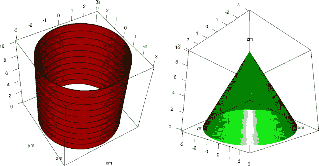

*图 26-17：使用 `persp3d` 绘制圆柱体和圆锥体，矩阵参数在三个坐标方向上。轨迹由对应的参数方程定义。圆柱体上可见的黑色环代表存储在所需矩阵`xm`、`ym`和`zm`中的实际评估点。*

##### **3D 圆锥体**

下一个示例将展示，一旦你理解了设置 *x*、*y* 和 *z* 坐标矩阵的过程，你就可以轻松显示几乎任何 3D 形状或表面。将 *r*、*h* 和 *θ* 分别视为底面半径、最大高度和角度，一个圆锥体遵循以下方程：

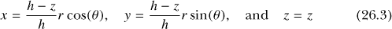

使用之前的相同对象 `r`、`h`、`zseq` 和 `theta`，以下代码会修改 `outer` 中的可用函数，以反映（26.3）。图 26-17 右侧显示了结果。

```
R> xm <- outer(zseq,theta,function(z,t) (h-z)/h*r*cos(t))
R> ym <- outer(zseq,theta,function(z,t) (h-z)/h*r*sin(t))
R> zm <- outer(zseq,theta,function(z,t) z)
R> persp3d(x=xm,y=ym,z=zm,col="green")
```

#### ***26.4.2 数学抽象***

数学的许多领域、应用数学建模和统计学都利用高维形状。为了总结这一章，实际上也是整本书的总结，让我们使用`rgl`来通过第 26.4.1 节中的技能，观察一些著名的抽象概念。

##### **莫比乌斯带**

一个经典的例子是 *莫比乌斯带* ——一个只有一个面和一条边的连续表面。它可以通过参数方程表示：


其中

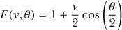

其中 −1 ≤ *v* ≤ 1 且 0 ≤ *θ* < 2*π*（假设角度以弧度为单位）。参数 *v* 控制点在带宽上的位置，*θ* 控制旋转角度。

你可以像之前绘制圆柱体和圆锥体一样绘制莫比乌斯带。首先，设置 *v* 和 *θ* 的可能值序列，这里设置的分辨率为 200：

```
R> res <- 200
R> vseq <- seq(-1,1,length=res)
R> theta <- seq(0,2*pi,length=res)
```

接下来，使用 `outer` 获取每个 *x*、*y* 和 *z* 坐标的 200 × 200 矩阵，如（26.4）所示。

```
R> xm <- outer(vseq,theta,function(v,t) (1+v/2*cos(t/2))*cos(t))
R> ym <- outer(vseq,theta,function(v,t) (1+v/2*cos(t/2))*sin(t))
R> zm <- outer(vseq,theta,function(v,t) v/2*sin(t/2))
```

然后，快速调用 `rgl` 包中的 `plot3d` 函数，可以展示基于定义的 `vseq` 和 `theta` 序列的 40,000 个点，这些点位于莫比乌斯带上。以下代码的结果显示在图 26-18 的左侧：

```
R> plot3d(x=xm,y=ym,z=zm)
```

让我们使用 `persp3d` 将莫比乌斯带显示为一个连续表面，以充分理解其一面一边的现象。图 26-18 右侧显示了以下代码的结果：

```
R> persp3d(x=xm,y=ym,z=zm,col="orange",axes=FALSE,xlab="",ylab="",zlab="")
```

请注意使用 `axes` 来抑制默认的框和坐标轴，并使用空字符串来移除默认的坐标轴标题，表示 `xm`、`ym` 和 `zm`。

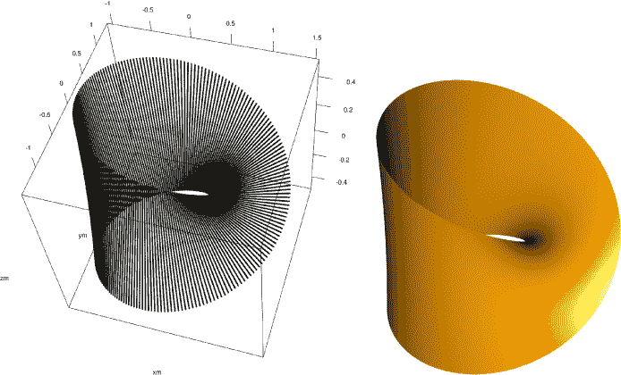

*图 26-18：在 R 中绘制莫比乌斯带。左：在带上的具体计算点，通过 `plot3d` 可视化。右：通过 `persp3d` 连接左侧的点形成的表面。*

你也可以以更有趣的方式使用颜色来强调莫比乌斯环的环绕特性。受第 25.1.3 节中类似颜色集的启发，创建以下自定义调色板：

```
R> patriot.colors <- colorRampPalette(c("red4","red","white","blue",
                                        "white","red","red4"))
```

该调色板特别生成了从深红色到白色再到蓝色的过渡，并且还会从蓝色回到白色和深红色，形成环绕效果。这是因为`patriot.colors`中的颜色将按点逐一分配给绘制的条带。

为了绘制表面，颜色向量的长度需要为 200² = 40,000，考虑到预设的`res`值（决定了`vseq`和`theta`的长度）。为了填充该向量，执行以下操作：

```
R> patcols <- patriot.colors(2*res-1)
R> stripcols <- rep(NA,res²)
R> for(i in 0:(res-1)){
+  stripcols[1:res+res*i] <- patcols[1:res+i]
+ }
```

第一行生成了来自`patriot.colors`的 399 种颜色，第二行设置了所需长度的向量，用于存储分配的颜色（`stripcols`）。`for`循环确保在第一次迭代时，将`stripcols`中第 1 到 200 个元素分配给`patcols`中的第 1 到 200 种颜色；在第二次迭代时，将`stripcols`中第 201 到 400 个元素分配给`patcols`中的第 2 到 201 种颜色，以此类推。这样就实现了颜色的环绕效果。

为了正确理解`for`循环，首先查看传递给`outer`函数的参数顺序。将`vseq`放在第一位，`theta`放在第二位，意味着结果矩阵的每一列（长度为 200）对应于在*v*的范围从−1 到 1 的跨度，这指的是从某一行点的一端移动到另一端，也就是沿着条带的宽度。通过使用一个从`0`到`199`（包括`199`）的索引变量`i`，循环将`stripcols`中每一个连续的 200 个元素（在每次迭代中通过`+res*i`增加）分配给 399 个`patcols`中的 200 个元素，方法是每次迭代时前进一个元素（通过`+i`增加）。这样做的结果是，循环早期绘制的点线条中颜色从红色变为白色再变为蓝色，但随着循环的进行，颜色逐渐环绕条带，直到在最后几行绘制的点线条中颜色从蓝色变为白色再变为红色。其效果是随着*v*和*θ*的变化，颜色平滑地过渡。你可以在图 26-19 中看到以下结果：

```
R> persp3d(x=xm,y=ym,z=zm,col=stripcols,aspect=c(2,2.5,1.5),axes=FALSE,
           xlab="",ylab="",zlab="")
```

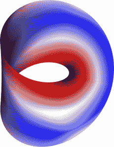

*图 26-19：一条爱国的莫比乌斯环，通过精心构建合适的颜色向量创建。*

该绘图仍然可以像往常一样在你的电脑上进行旋转和缩放。你可以尝试调整`aspect`，修改特定轴的长宽比，以增强最终效果；在这里，我已将*x*轴和*y*轴相对于*z*轴进行了拉宽。

##### **环面**

另一个常见的三维空间形状是*环形圆环*（复数形式为*tori*）。这是经典的拓扑学“有一个孔的形状”，像是一个更通俗的说法——甜甜圈。圆环的数学性质在许多领域都非常有用。

圆环的参数化可以通过以下方程实现：

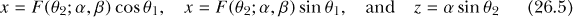

在哪里

*F*(*θ*[2]; *α*, *β*) = *β* + *α* cos *θ*[2]

其中 0 ≤ *θ*[1] < 2*π* 且 *θ*[2] 同理（假设角度以弧度为单位）。固定值*α*和*β*控制“管道”的半径（换句话说，就是甜甜圈的相对厚度）以及圆环的整体大小，即从孔的中间到管道中间的距离。假设*α* < *β*，公式（26.5）给你提供了经典的环形圆环形状；你可以通过放宽*α*和*β*的条件得到不同类型的圆环。

将*α* = 1 和 *β* = 2，以下代码使用先前定义的`theta`对象计算 Möbius 带在 *x*、*y* 和 *z* 坐标方向上的矩阵，如公式（26.5）所示：

```
R> alpha <- 1
R> beta <- 2
R> xm <- outer(theta,theta,function(t1,t2) (beta+alpha*cos(t2))*cos(t1))
R> ym <- outer(theta,theta,function(t1,t2) (beta+alpha*cos(t2))*sin(t1))
R> zm <- outer(theta,theta,function(t1,t2) alpha*sin(t2))
```

如果需要，参考第 26.4.1 节来提醒自己如何使用`outer`。

然后，这一行展示了圆环的计算点：

```
R> plot3d(x=xm,y=ym,z=zm)
```

这样，你就得到了连续表面的最终外观：

```
R> persp3d(x=xm,y=ym,z=zm,col="seagreen4",axes=FALSE,xlab="",ylab="",zlab="")
```

图 26-20 展示了两者的结果。

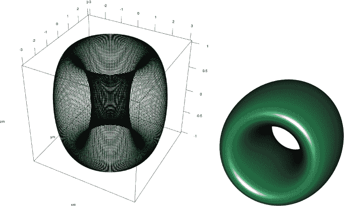

*图 26-20：在 R 中绘制圆环。左图：在表面上特别计算的点，通过* `plot3d`* 可视化。右图：通过使用* `persp3d`* 将左侧的点连接起来形成的形状。

之前，你使用了一个特意构建的颜色向量来给 Möbius 带着色，但你也可以通过识别定义矩阵中你想要控制的特定点，给任何这样的表面赋色。由于这是书中的最后一个例子，让我们在当前的数学“甜甜圈”上稍微玩一下，通过这个点状索引来说明这一点。

首先，甜甜圈需要看起来真实。以下代码行设置了一个长度为 200² = 40,000 的向量，用来存储你将要使用的颜色。最初，每个元素都设置为甜甜圈的颜色——棕黄色。

```
R> donutcols <- rep("tan",res²)
```

接下来，加点装饰。如果你查看点的分布（如图 26-20 左侧的图所示），你可以看到这个圆环表面上“上半部分”的绘制位置的*z*坐标大于零。基于这一点，你可以使用以下一行代码覆盖`donutcols`中相关的元素：

```
R> donutcols[as.vector(zm)>0] <- "pink"
```

最后，任何优质的甜甜圈都应该撒上糖粒。你需要一种机制来识别表面上半部分的随机位置，并为其着色。为此，你可以使用内置的`sample`函数从现有向量中随机选择一部分元素。例如，如果你有整数 1 到 10，并且想要随机选择四个，可以执行以下操作：

```
R> sample(x=1:10,size=4)
[1] 8 9 2 6
```

参数`x`接受一个向量，用于从中选择样本，`size`则是你希望从该向量中抽取的元素数量。注意，当执行这一行代码时，你很可能会得到一组不同的四个随机数。

有了这些知识，你可以使用以下代码制作撒花：

```
R> sprinkles <- c("blue","green","red","violet","yellow")
R> donutcols[sample(x=which(as.vector(zm)>0),size=300)] <- sprinkles
```

这段代码设置了五种不同的撒花颜色；然后从冰面区域的 300 个位置中随机选择位置；最后将五种颜色分配给这些位置。由于向量回收的特性，每种颜色的撒花数量将精确为 60，随机分布在环面的上半部分。你可以通过增加`size`来增加撒花数量，不过鉴于颜色数量，你应该确保`size`能被 5 整除。

以下调用完成了视觉效果，如图 26-21 所示：

```
R> persp3d(xm,ym,zm,col=donutcols,aspect=c(1,1,0.4),axes=FALSE,
           xlab="",ylab="",zlab="")
```

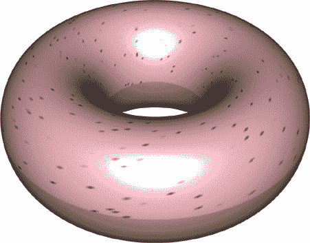

*图 26-21：美味的数学甜甜圈。环面表面的着色是通过识别颜色向量中对应位置并替换元素来实现的。*

你可以在 Davies 和 Bryant（2013）中找到一个更为严谨（且技术性更强）的环面可视化，环面作为一种便捷的计算结构，用于生成特别定义的高维随机正态变量。

**练习 26.3**

确保在当前 R 会话中可以使用`mvtnorm`、`rgl`、`misc3d`和`ks`包的功能。通过指定不同的*协方差矩阵*，你可以控制多元正态随机变量的各个成分之间的关系，从而影响分布本身的外观。例如，在标准的三元正态密度中，三个元素（*x*、*y*、*z*）彼此是独立的。执行以下代码将生成 1000 个观测值，这些值来自一个非标准的三元正态分布，其中三个元素按特定方式相互关联：

R> covmat <- matrix(c(1,0.8,0.4,0.8,1,0.6,0.4,0.6,1),3,3)

R> rand3d.norm <- rmvnorm(1000,mean=c(0,0,0),sigma=covmat)

请注意，协方差矩阵`covmat`作为可选参数传递给`sigma`，并且这些点的均值仍然保持在(0,0,0)的中心位置。

1.  将生成的数据绘制为交互式 3D 点云，轴标签为`"x"`、`"y"`和`"z"`。你应该能够看到点云形成一个椭圆形，这与标准三元正态分布中的球形分布（见图 26-11 和 26-12）形成对比。保持图形窗口开启。

1.  使用在每个轴上从−3 到 3 的 50 × 50 × 50 评估网格，使用`dmvnorm`计算此三变量正态密度函数并将其存储为适当大小的数组。请注意，你还需要在使用`dmvnorm`时设置`σ=covmat`。计算密度的最大值，并利用这个最大值在点云等值面上叠加三个特定的*α*水平——0.1、0.5 和 0.9。将这三个等值面分别着色为`"yellow"`、`"seagreen4"`和`"navyblue"`，并设置它们的透明度分别为 20%、40%和 60%。

1.  现在，使用`ks`功能基于 1000 个生成的观察数据计算 3D 核密度估计。确保返回的对象包含 99 个合理的等值层级向量。重新绘制（a）部分的点云图，在一个新的 RGL 设备中显示，然后按照以下方式调用`contour3d`两次。

    1.  第一个应该仅叠加（b）部分的*α*水平为 0.5 的理论等值面。使用和（b）中相同的颜色和透明度。

    1.  第二个应该绘制从点特定 KDE 曲面估算的 50 百分位的等值面。将其设置为红色，并将透明度降低至 20%。

    这是我在（b）部分的结果，左侧是（b）的结果，右侧是（c）的结果。请注意，由于 1000 个数据点是随机生成的，KDE 等值面（isosurface）的外观会有所不同，这些数据点决定了最终的估计结果。

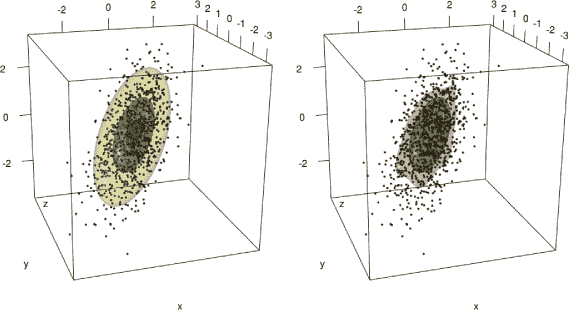

`MASS`包中有另一个数据集你还没有接触过。`Boston`数据框对象包含了关于 1970 年代美国马萨诸塞州波士顿郊区房价的许多描述性观察数据（Harrison 和 Rubinfeld, 1978）。加载`MASS`包并查看帮助文件`?Boston`，了解当前的变量。

1.  关注变量中平均房间数、低社会经济地位住房的百分比和中位房价——你将进行如下的 3D 散点图可视化实验：

    1.  使用`rgl`功能绘制三个变量，分别在*x*、*y*、*z*轴上绘制房间数、状态和价值；提供整洁的轴标题。数据点应以灰色球体表示，大小为 0.5。保持该图像打开。

    1.  使用`ks`功能估算这些数据的三变量密度函数。基于 64 × 64 × 64 的评估网格进行估算；确保返回 99 个观察特定密度水平的整数百分位数。使用绿色、黄色和蓝色绘制出分别表示 75 百分位、50 百分位和 10 百分位“最密集”观察的等值面轮廓。设置透明度分别为 10%、40%和 50%。

    1.  最后，在下方的*z*轴、上方的*x*轴和上方的*y*轴位置添加参考网格。

1.  解释（d）部分的最终图形。例如，当前变量的哪些值倾向于表征波士顿郊区最常见类型的房屋？

    结果如下：

    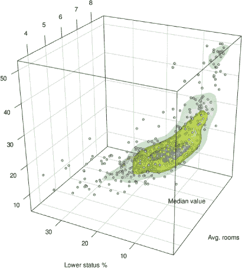

*umbilic torus* 是数学中另一个有趣的 3D 形状，可以通过以下参数方程定义：

*x* = sin(*θ*)*F*(*θ*, *φ*)

*y* = cos(*θ*)*F*(*θ*, *φ*)

*z* = sin(*θ*/3 − 2*φ*) + 2sin(*θ*/3 + *φ*)

在这些方程中，*F*(*θ*, *φ*) = 7 + cos(*θ*/3 − 2*φ*) + 2 cos(*θ*/3 + *φ*)，并且你允许 −*π* ≤ *θ* ≤ *π* 和 −*π* ≤ *φ* ≤ *π*。

1.  使用长度为 1000 的*θ*和*φ*序列，以及从内置的`rainbow`调色板生成的 1000 种颜色，直接分配给`col`参数，生成一个交互式的 umbilic torus 3D 图。去掉盒子、坐标轴和坐标轴标题。在从不同角度查看物体时，请注意，与之前绘制的莫比乌斯带类似，这个形状只有一条边。

    结果如下：

    

##### **本章的重要代码**

| **函数/运算符** | **简要描述** | **首次出现** |
| --- | --- | --- |
| `plot3d` | 交互式 3D 点云 | 第 26.1.1 节，第 692 页 |
| `legend3d` | 添加 RGL 设备图例 | 第 26.1.2 节，第 693 页 |
| `bg3d` | 重置 RGL 设备背景 | 第 26.1.2 节，第 693 页 |
| `segments3d` | 添加 3D 线段 | 第 26.1.3 节，第 696 页 |
| `grid3d` | 添加平面网格 | 第 26.1.3 节，第 696 页 |
| `bgplot3d` | 更改/重新绘制 RGL 设备背景 | 第 26.1.3 节，第 696 页 |
| `persp3d` | 交互式 3D 透视面 | 第 26.2.1 节，第 700 页 |
| `points3d` | 添加 3D 点 | 第 26.2.2 节，第 701 页 |
| `text3d` | 添加 3D 文本 | 第 26.2.2 节，第 702 页 |
| `rmvnorm` | 随机多元正态变量 | 第 26.3.2 节，第 711 页 |
| `dmvnorm` | 多元正态密度 | 第 26.3.2 节，第 711 页 |
| `contour3d` | 绘制等值面 | 第 26.3.2 节，第 713 页 |
| `kde` | 多元核估计 | 第 26.3.3 节，第 717 页 |
| `pi` | 几何常数 *π* | 第 26.4.1 节，第 722 页 |
| `sin`, `cos` | 正弦和余弦 | 第 26.4.1 节，第 722 页 |
| `outer` | 外积运算 | 第 26.4.1 节，第 724 页 |
| `sample` | 从向量中随机抽样 | 第 26.4.2 节，第 731 页 |
