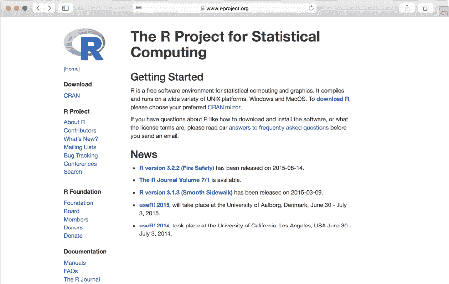
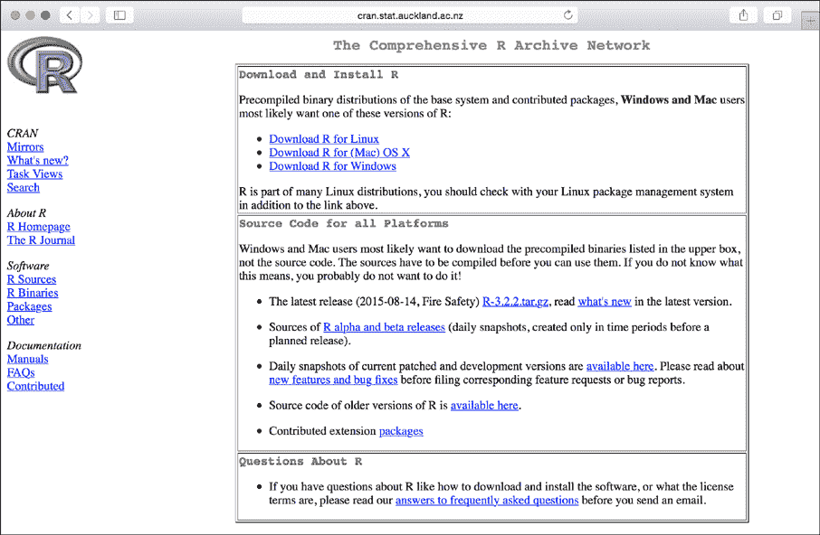
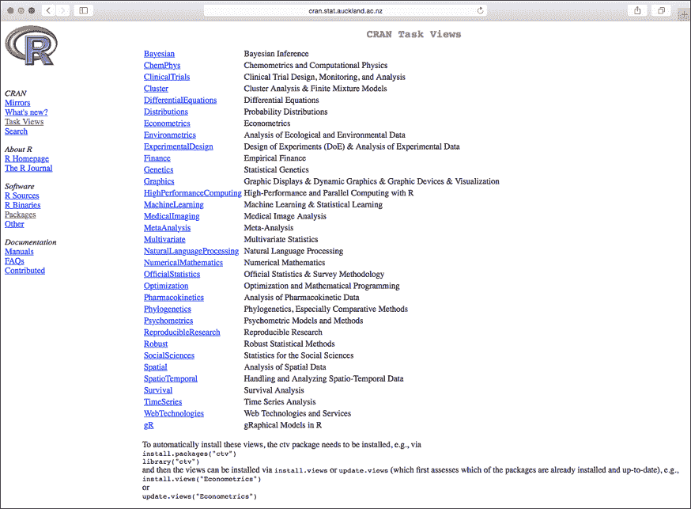
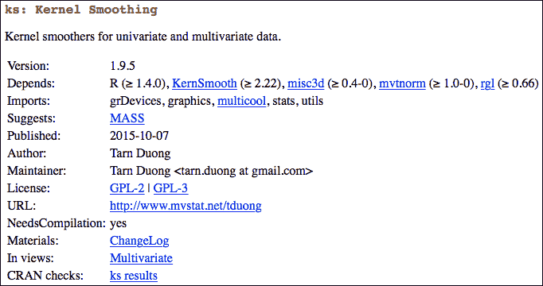
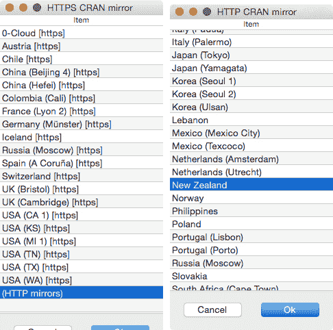
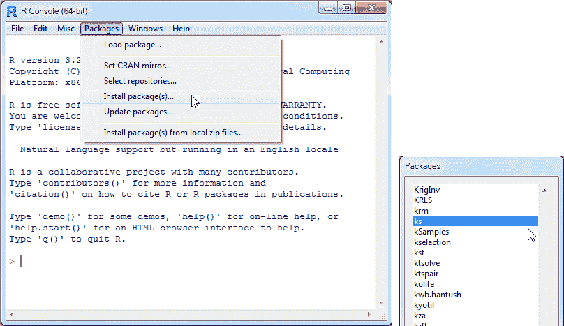
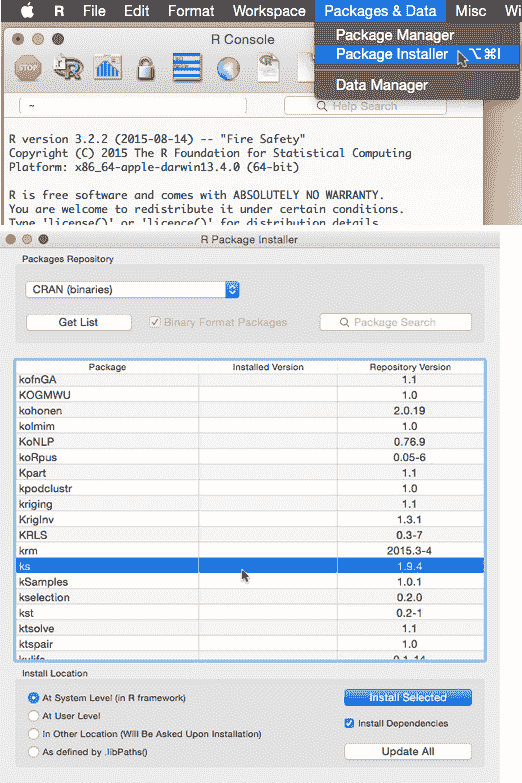
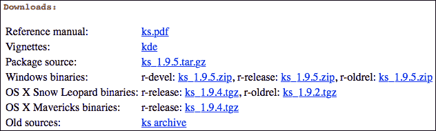
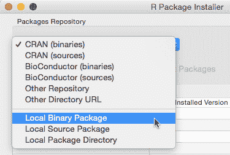

## 第二十七章：A

**安装 R 和贡献包**


本附录提供了更多关于如何找到 R 以及如何安装 R 和其贡献包的详细信息。R 可以通过 CRAN（全面的 R 存档网络）获取，通过 R 网站访问，网址为 *[`www.r-project.org/`](https://www.r-project.org/)*。这里我只讲解基础内容，但你可以在 Hornik（2015）的 R 常见问题解答中找到大量信息，网址为 *[`CRAN.R-project.org/doc/FAQ/R-FAQ.html`](http://CRAN.R-project.org/doc/FAQ/R-FAQ.html)*。如果你在安装 R 及其包时需要帮助，应该首先访问这个页面。R 和其贡献包的安装在常见问题解答的第二部分和第五部分中有详细说明。

### A.1 下载和安装 R

进入 R 网站后，点击欢迎文本中的 **CRAN 镜像** 链接，或点击左侧“下载”下的 **CRAN** 链接，如图 A-1 所示，页面会加载并要求你选择一个 CRAN 镜像。



*图 A-1：R 的主页*

选择一个靠近你地理位置的镜像站点并点击链接。图 A-2 展示了我本地的镜像，位于奥克兰大学；你的镜像站点会类似。



*图 A-2：一个 CRAN 镜像站点。这是你将找到各种下载链接的地方。*

然后点击与你操作系统相对应的链接。

• 如果你是 Windows 用户，点击 Windows 链接，在该页面选择安装文件（即二进制可执行文件）以安装 `base` 版本。双击该可执行文件，按照安装向导中的说明进行操作。你需要选择适合当前 Windows 安装的 32 位或 64 位版本——你可以通过进入控制面板 → 系统来查看你的版本。

• 如果你是 Mac 用户，点击 Mac OS X 链接，你将被带到一个包含预打包二进制文件的页面。写这篇文章时，仍然有两个版本可供下载：一个适用于 OS X 10.9（Mavericks）及更高版本，另一个适用于 OS X 10.6 至 10.8（此文件带有 *snowleopard* 标记），虽然对 Snow Leopard 的支持正在逐步取消。下载适合你操作系统的文件。下载完成后，双击该文件将立即启动安装程序；按照其中的说明进行操作。我还推荐安装 XQuartz 窗口系统，可以从 *[`xquartz.macosforge.org/`](http://xquartz.macosforge.org/)* 免费下载，它为图形设备提供支持。

• Linux 用户将被带到一个子目录，里面有按操作系统名称命名的文件夹，例如 Debian 或 Ubuntu。点击与你的系统相关的链接，你将被带到一个页面，提供逐步的命令行安装 R 的说明。

### A.2 使用包

R *包*（或 *库*）是包含在 R 中使用的代码、数据和功能的集合。熟悉加载这些库是非常必要的，这样才能访问某些特性和命令。

包有三种类型。构成软件核心功能的那些随安装一起提供，并且在你打开 R 时会自动加载。另外，一些 *推荐的* 包也随典型的 R 安装一起提供，但不会自动加载。最后，一个庞大的用户贡献包集合——在写作时已有超过 7000 个——极大地扩展了 R 的应用。

#### *A.2.1 基础包*

*基础包* 提供了编程、计算和图形生成的基本语法和命令，以及内置数据集、基本算术运算和统计功能，并且在你启动 R 时立即可用。写作时，总共有 14 个。

base       compiler   datasets   grDevices   graphics  grid   methods

parallel   splines    stats      stats4      tlctk     tools  utils

你可以在 Kurt Hornik 的 R FAQ 中的 第 5.1.1 节 中找到每个基础包的简要描述。

#### *A.2.2 推荐的包*

在写作时，有 15 个 *推荐的包*，如 R FAQ 第 5.1.2 节 中所述。这些包包含在任何标准 R 安装中，并扩展了基础包的功能，包含了稍微更专业（但仍然广泛使用）的统计方法和计算工具。在本书中，你只会使用来自该列表的 `MASS` 和 `boot`。

KernSmooth   MASS      Matrix     boot   class   cluster

codetools    foreign   lattice    mgcv   nlme    nnet

rpart        spatial   survival

这些推荐包 *不会* 自动加载。如果你想访问这些包中的函数或数据集，必须手动加载它们，可以使用 `library` 命令。例如，要访问作为 `MASS` 部分提供的数据集，可以在提示符下执行以下命令：

```
R> library("MASS")
```

一些包在加载时会提供简短的欢迎信息，R 总是会通知你发生的任何遮蔽（参见 第 12.3.1 节）。

当你关闭当前的 R 会话时，包也会关闭，因此如果你打开另一个 R 实例并希望再次使用该包，则需要重新加载它。如果你决定在某个会话中不再需要某个包，并希望卸载它，以避免例如遮蔽问题，可以使用 `detach` 命令，如下所示：

```
R> detach("package:MASS",unload=TRUE)
```

你可以在本书的 第 9.1 节 和 第 12.3.1 节 中找到有关包加载和卸载的主题和技术细节。

#### *A.2.3 贡献的包*

除了这些内置和推荐的包之外，还有一个通过 CRAN 提供的大量用户贡献的包集合，涵盖了统计学与数学、计算以及图形学等各类应用。如果你访问本地的 CRAN 镜像站点，页面左侧的 Packages 链接（见图 A-2）会引导你到一个页面，提供更新的所有可用包的列表。你还会找到有用的 CRAN 任务视图网页，这是一个集合了各个主题的文章，概述了相关的包，如图 A-3 所示。这是熟悉 R 中各种专门化分析方法的一个很好的途径。

由于可用包的数量庞大，R 在安装时自然不会包含所有包，作为研究人员，你只会对某一时刻的相对小部分方法感兴趣。



*图 A-3：CRAN 任务视图网页。每篇文章讨论了该领域中常用的 CRAN 包。*

本书中你将使用一些贡献的包。它们中的一些用于访问特定的数据集或对象，其他的则用于其独特的功能或说明统计方法。这些包列在这里：

car             faraway   GGally     ggplot2   ggvis

gridExtra       ks        misc3d     mvtnorm   rgl

scatterplot3d   shape     spatstat   tseries

当你需要访问任何贡献的包时，你首先需要互联网连接来下载并安装它。包的大小通常不超过几兆字节。一旦包安装完成，你就可以像平常一样通过`library`函数加载它，以访问相关的功能。对于上面列出的包，你将在书中的相关部分根据需要被提示进行此操作。

接下来，你将看到几种方法来执行 R 包的下载和安装，我们以`ks`包（Duong, 2007）为例。

**注意**

*贡献的 R 包在正确性、速度与效率以及用户友好性方面通常具有较好的质量。尽管在提交的包被放到 CRAN 之前，必须通过基本的兼容性检查，但通过这些检查并不意味着包的整体质量和可用性。你只能通过使用该包、研究其文档以及查阅相关出版物来评估它的质量。*

##### 在 CRAN 上查找包

CRAN 上的每个 R 包都有自己的标准网页，提供直接的下载文件链接和关于该包的重要信息。在 CRAN 的列表中找到包名并点击，或者快速搜索，例如我们这里的*ks r cran*。图 A-4 显示了`ks`网页的顶部。



*图 A-4：CRAN 网页上关于* `ks` *包的描述信息*

除了基本的信息，如版本号和维护者的姓名及联系信息外，你还会看到 Depends 字段。这对于安装很重要；如果你感兴趣的 R 包依赖于其他贡献包（并不是所有包都这样），那么你也需要安装这些包，以便你的包能够成功安装。

查看 图 A-4，你可以看到你的 R 版本需要高于 1.4，`ks` 需要 `KernSmooth`（已安装——它是 A.2.2 节中提到的推荐包之一），同时它还需要 `misc3d`、`mvtnorm` 和 `rgl`。幸运的是，如果你直接从 R 安装一个包，依赖项也会自动安装。

##### 在提示符下安装包

下载并安装一个贡献的 R 包的最快方法是直接从 R 提示符使用 `install.packages` 命令。从全新安装的 R 开始，我在我的 iMac 上看到以下内容：

```
R> install.packages("ks")
--- Please select a CRAN mirror for use in this session ---
also installing the dependencies 'misc3d', 'mvtnorm', 'rgl'

--snip--
```

你可能会首先被要求选择一个 CRAN 镜像。列表弹出并默认仅显示安全的 HTTPS 服务器；选择 HTTP 会切换到不安全的服务器。我选择了 HTTP，找到了新西兰镜像并点击了确定，如 图 A-5 所示。完成后，所选的镜像将保持设置为默认站点，直到你重新设置它；参见 A.4.1 节。



*图 A-5：选择用于下载贡献包的 CRAN 镜像站点的弹出窗口。左侧：可选的 HTTP 服务器选择（与 HTTPS 相对）。右侧：选择我的本地 HTTP 镜像。*

在点击 **确定** 后，R 会列出将被下载和安装的任何依赖项，并呈现每个包的下载通知（在省略的输出中）。

有一些额外的注意事项：

• 你只需安装一次包，它会保存到硬盘上，以便在使用 `library` 调用时加载，就像往常一样。

• 你可能会被提示使用或创建一个本地文件夹来存储已安装的包。这是为了确保 R 知道在使用 `library` 请求包时应该从哪里获取它们。同意这样做意味着你有一个特定于用户的包库，这通常是一个好主意。

• `install.packages` 有许多可选参数；请查看通过在提示符下输入 `?install.packages` 调用的帮助文件。例如，如果你想在控制台中指定一个 CRAN 镜像，可以将相关的 URL 作为字符字符串传递给 `repos` 参数，或者如果你希望防止安装依赖项，可以使用 `dependencies` 参数。

• 你也可以从源代码安装 R 包，也就是说，从未编译的代码安装，这些源代码可能包含比预编译的二进制版本更新的版本。如果你是 OS X 用户，R 的最新版本会询问你是否希望为有更新版本的包从源代码下载包，而这些版本比预编译的二进制版本更为新颖。要执行此操作，你的系统上需要安装某些命令行工具；如果下载失败，你可以在 `download from source` 提示时选择 `n`（“否”），继续使用二进制版本。

##### 使用图形界面安装包

本书中使用的基本 R 图形用户界面（GUI）允许你通过控制台和菜单项下载并安装贡献包。接下来，我们简要介绍 Windows 和 OS X 版本。

在 Windows 上，点击 **Packages** → **Install package(s)...** 菜单项，如 图 A-6 左侧所示。选择一个 CRAN 镜像，一个高窗口将打开，按字母顺序列出所有可用的包。向下滚动以选择你感兴趣的包。你可以在 图 A-6 右侧看到我选择的 `ks`。点击 **OK** 以下载并安装这些包及其依赖项。



*图 A-6：通过 Windows 中的 GUI 菜单启动下载并安装一个贡献的 R 包（以及任何缺失的依赖项）*

对于 OS X R，点击 OS X 菜单栏中的 **Packages & Data** → **Package Installer** 项，如 图 A-7 顶部所示。当包安装程序打开时，点击 **Get List** 按钮以显示可用包的列表。选择你需要的包，确保在点击 **Install Selected** 之前勾选安装程序底部的 **Install Dependencies** 选项框。R 将下载并安装所需的所有内容，包括任何依赖项，如 图 A-7 底部所示。你可以选择多个包。请注意，安装程序左下角的选项允许你选择安装包存储的位置；如果你是非管理员用户，可能需要创建一个用户专用的库，如前文所述。



*图 A-7：通过 OS X 中的基于 GUI 的包安装程序启动下载并安装一个贡献的 R 包（以及任何缺失的依赖项）*

##### 使用本地文件安装包

最后，你可以通过互联网浏览器从 CRAN 下载所需的包文件，就像下载其他任何东西一样，将它们存储在本地驱动器上，然后指示 R 使用这些本地文件。

在 `ks` 的 CRAN 网页上，你会看到如图 A-8 所示的下载部分。对于 Linux，选择包源文件。对于 Windows 或 OS X，选择相应的*.zip*或*.pkg*文件，标记为 *r-release*。只有在遇到兼容性问题时，才应使用 *r-oldrel* 和 *r-devel* 版本。Old sources 链接包含旧版本的归档源文件。

在 Windows 上，选择 **Packages** → **从本地 zip 文件安装包...**（如图 A-6 所示）。这将打开一个文件浏览器，让你可以找到下载的*.zip*文件；R 会自动完成剩下的步骤。



*图 A-8：CRAN 网页上的`ks`下载部分*

在 OS X 上，下载完 *.pkg* 文件后，选择 **Packages & Data** → **Package Installer**。在安装程序顶部的下拉菜单中选择 **Local Binary Package**，如图 A-9 所示。要打开文件浏览器以找到本地文件，你需要点击安装程序底部的 **Install...** 按钮。R 会处理剩下的步骤。



*图 A-9：在 OS X 上使用包安装程序从本地文件安装 R 包*

需要注意的是，这种方法*不会*自动安装任何依赖项。你还需要安装包所依赖的其他包，及其依赖项，依此类推——因此，务必检查 CRAN 包网页上的 Depends 字段，如前所述。

从 R 提示符直接使用`install.packages`，或通过 GUI 自动化这个过程要容易得多。只有在自动方法因某些原因失败时，或者你正在安装一个不在 CRAN 上（或其他任何容易获取的仓库——参见第 A.4.2 节）的包，或该包不适用于你的操作系统时，你才需要进行本地文件安装。

### A.3 更新 R 和已安装的包

大约每年会发布四个新的 R 版本，解决功能、兼容性问题和修复 bug。保持更新这些新版本是个好主意。R 项目的主页和任何 CRAN 镜像站点都会告诉你最新版本的发布信息，你也可以在 R 提示符下执行`news()`以查看更新内容。

贡献的 R 包也会定期更新，并将新的包文件上传到 CRAN。你安装的包不会自动更新，因此你需要手动更新它们。由于更新发布完全取决于维护者，所以很难预测更新发布的频率，但建议每隔几个月检查一下已安装包的最新版本，或者至少在你升级 R 版本时进行检查。

检查包更新很简单。只需调用`update.packages()`，不带任何参数，它会系统地检查你安装的包，并标记出有更新版本的包。

例如，在我当前的安装中，执行以下命令告诉我，`MASS`的更新版本可用（以及其他一些未在此输出片段中显示的软件包）。

```
R> update.packages()
MASS :
 Version 7.3-43 installed in /Library/Frameworks/R.framework/Versions/3.2/
                              Resources/library
 Version 7.3-44 available at http://cran.stat.auckland.ac.nz
Update (y/N/c)? y

--snip--
```

输入`y`从 CRAN 下载更新的软件包。如果有多个软件包有更新可用，R 会逐一询问你是否希望更新，你需要为每个软件包输入`y`（或者`N`或`c`）。

你也可以通过 R 的图形用户界面菜单进行软件包更新（或者通过本地文件安装手动更新）。在 Windows 上，选择**Packages** → **Update packages...**打开一个可用更新列表。在 OS X 上，包安装器的已填充表格中会有一列提供你当前安装的每个软件包的版本信息，以及 CRAN 上当前版本的信息，给你一个安装更高版本的选项。还有一个“Update All”按钮，这是你通常会使用的。

### A.4 使用其他镜像和仓库

有时候，你可能需要更改与你的典型软件包安装过程相关联的 CRAN 镜像，或者实际上将目标仓库更改为非 CRAN 的其他仓库——有几个选项可供选择。

#### *A.4.1 切换 CRAN 镜像*

你很少需要更改 CRAN 镜像，但如果，例如，你常用的镜像站点因为某些原因无法访问，或者你希望从不同的地点使用 R，可能需要更改。要查询当前设置的仓库，可以使用`getOption`并传入`"repos"`。

```
R> getOption("repos")
                             CRAN
"http://cran.stat.auckland.ac.nz"
```

若要将其更改为例如墨尔本大学的镜像，只需将新的 URL 分配给`repos`组件，并在调用`options`时按如下方式操作：

```
R> options(repos="http://cran.ms.unimelb.edu.au/")
```

之后使用`install.packages`或`update.packages`时，将使用此澳大利亚镜像进行下载。

#### *A.4.2 其他软件包仓库*

CRAN 并不是唯一的 R 软件包仓库。其他仓库包括 Bioconductor（见* [`www.bioconductor.org/`](https://www.bioconductor.org/)*），Omegahat（见* [`www.omegahat.org/`](http://www.omegahat.org/)*），以及 R-Forge（见* [`r-forge.r-project.org/`](https://r-forge.r-project.org/)*），还有更多其他仓库。这些仓库通常处理不同的主题。例如，Bioconductor 托管与 DNA 微阵列及其他基因组分析方法相关的软件包；Omegahat 托管专注于 Web 和 Java 应用的包。

就一般统计分析而言，CRAN 是大多数用户首选的仓库。要了解更多关于其他仓库的信息，你可以访问相关网站。

### A.5 引用与编写软件包

在使用 R 及其软件包进行数据分析等研究项目时，必须以适当的方式认可这些工作的贡献。实际上，当你考虑编写自己的软件包时，了解以下内容是非常重要的。

#### *A.5.1 引用 R 和贡献的软件包*

若要引用 R 及其包，`citation`命令会输出相关内容。

```
R> citation()

To cite R in publications use:

  R Core Team (2016). R: A language and environment for statistical computing.
  R Foundation for Statistical Computing, Vienna, Austria. URL
  https://www.R-project.org/.

A BibTeX entry for LaTeX users is
  @Manual{,
    title = {R: A Language and Environment for Statistical Computing},
    author = {{R Core Team}},
    organization = {R Foundation for Statistical Computing},
    address = {Vienna, Austria},
    year = {2016},
    url = {https://www.R-project.org/},
  }

We have invested a lot of time and effort in creating R, please cite it when
using it for data analysis. See also 'citation("pkgname")' for citing R
packages.
```

请注意，LAT[E]X 用户可以通过自动生成的 BIBT[E]X 条目方便地进行引用。

如果某些包在完成某个特定工作中起到了重要作用，你也可以引用这些包。以下是一个示例：

```
R> citation("MASS")

To cite the MASS package in publications use:

  Venables, W. N. & Ripley, B. D. (2002) Modern Applied Statistics with S.
  Fourth Edition. Springer, New York. ISBN 0-387-95457-0

A BibTeX entry for LaTeX users is

  @Book{,
    title = {Modern Applied Statistics with S},
    author = {W. N. Venables and B. D. Ripley},
    publisher = {Springer},
    edition = {Fourth},
    address = {New York},
    year = {2002},
    note = {ISBN 0-387-95457-0},
    url = {http://www.stats.ox.ac.uk/pub/MASS4},
  }
```

#### *A.5.2 编写你自己的包*

一旦你成为 R 语言的专家，你可能会发现自己有一系列其他人可能会觉得有用的函数、数据集和对象，或者你使用得足够频繁，以至于值得将它们打包成标准化、易于加载的格式。当然，你没有义务将你的包提交到 CRAN 或其他任何仓库，但如果你打算这样做，请注意，确实有一些严格的要求，以确保用户能够信任你的包的稳定性和兼容性。

如果你有兴趣构建自己的可安装 R 包，请参阅官方的*Writing R Extensions*手册，你可以通过点击主页左侧文档部分的 Manuals 链接，在任何 CRAN 镜像站点上找到该手册；你可以在图 A-2 中看到这个链接。如果你感兴趣，你也可以去寻找 Wickham 的书（2015*b*），这本书提供了有关 R 包编写过程的有用指导以及相关的注意事项。
