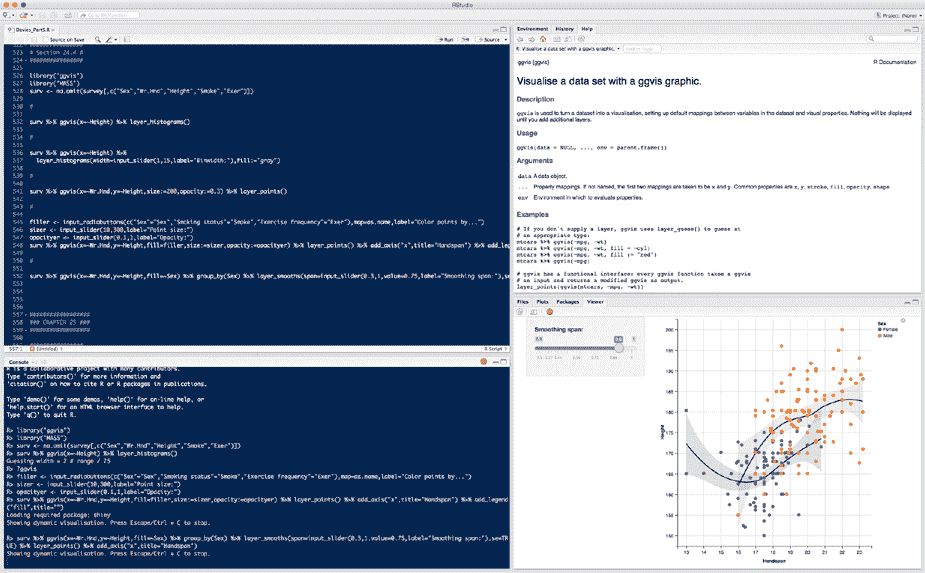
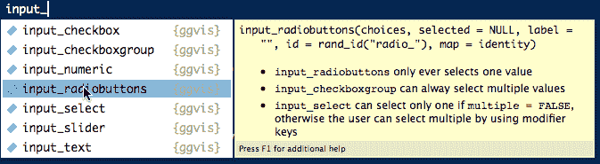
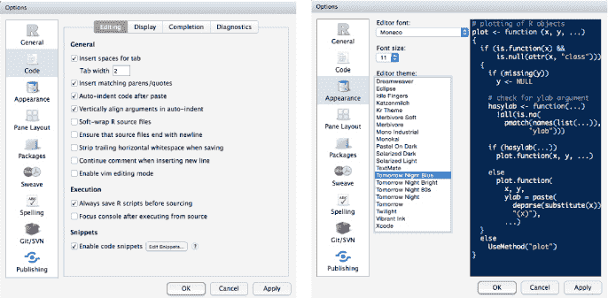
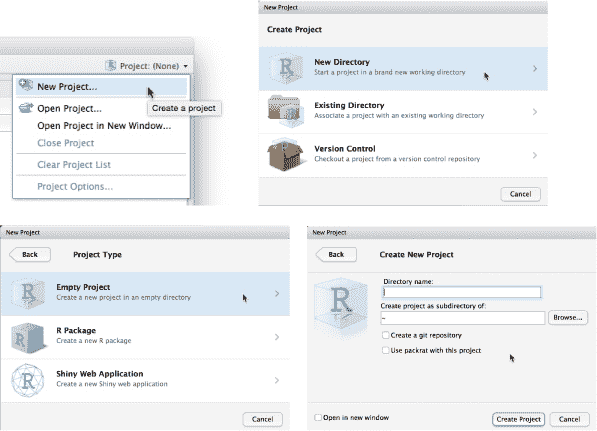
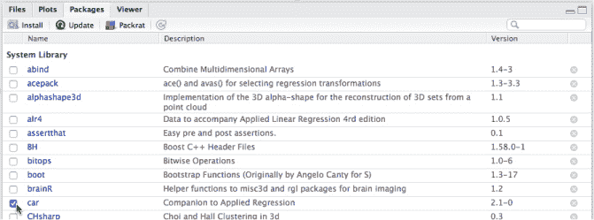
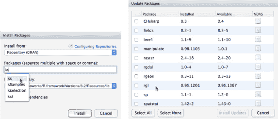
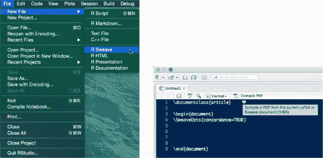
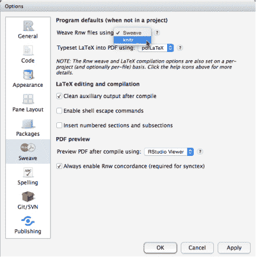
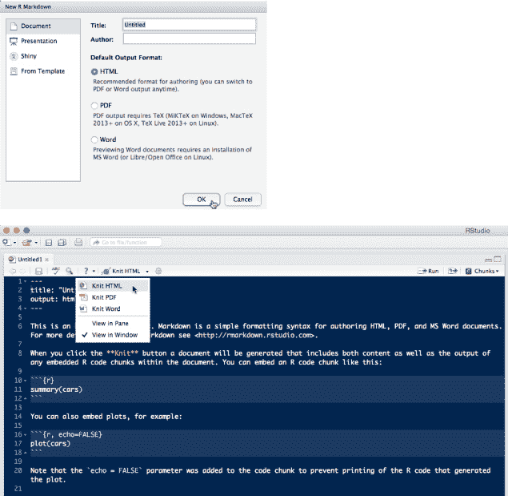

## **B**

**使用 RStudio**

尽管基础的 R 应用程序和 GUI 已经可以释放出所有可用功能，但控制台和代码编辑器的简陋外观可能会让一些人，尤其是初学者，感到不适应。为了增强日常使用 R 语言的体验，RStudio 是最优秀的集成开发环境（IDE）之一。

像 R 一样，RStudio 的桌面版本（RStudio Team, 2015）是免费的，可以在 Windows、OS X 和 Linux 系统上使用。在安装 RStudio 之前，你必须先安装 R，如附录 A 中所述（OS X 用户还需要安装 XQuartz；参见第 A.1 节））。然后，你可以从官方网站下载 RStudio，地址是*[`www.rstudio.com/products/rstudio/download/`](https://www.rstudio.com/products/rstudio/download/)*。

RStudio 网站还提供了各种有用的支持文章和链接，以及针对各种特殊增强功能的说明，其中一些已在第 B.2 节中提到。如果你需要帮助，可以访问*[`support.rstudio.com/hc/en-us/`](https://support.rstudio.com/hc/en-us/)*。特别是，你应该花时间点击文档链接；你也可以通过选择帮助 → RStudio 文档来查看。

在本附录中，你将概览 RStudio 及其最常用的工具。

### **B.1 基本布局和使用**

RStudio IDE 分为四个窗格，你可以自定义内容和布局，以适应你的偏好。图 B-1 展示了我的设置。在其中，我正在使用第 24.4 节中的 `ggvis` 代码。

*图 B-1：RStudio 在实际操作中的界面。四个窗格可以根据你的需要进行排列和隐藏；在这里，你可以看到代码编辑器（左上），控制台（左下），帮助页面（右上）和图形查看器（右下）。右侧的窗格还可以选择额外的标签。*

你在内置编辑器中编写 R 代码，并在控制台中执行；“发送代码到控制台”的快捷键是 Windows 中的 CTRL-ENTER 或 CTRL-R，Mac 上则是-RETURN。文本输出会像往常一样出现在控制台中。

#### ***B.1.1 编辑器功能和外观选项***

RStudio 编辑器最有用的功能之一是色彩主题的代码高亮和括号匹配。这使得编程体验比基础 R 编辑器更加轻松，特别是在编写长段代码时。在编辑器或控制台中输入时，还有自动补全选项弹出。你可以在图 B-2 中看到一个示例。

*图 B-2：RStudio 的自动补全功能包括每个选项的提示。*

这些功能可以使用 RStudio 选项进行启用、禁用和自定义（在 Windows 和 OS X 上选择 **工具** → **全局选项...**；对于 OS X，你也可以选择 **RStudio** → **偏好设置...**）；你可以在图 B-3 中看到代码和外观选项。

*图 B-3：代码编辑（左）和外观（右）选项窗格*

#### ***B.1.2 自定义窗格***

接下来，你可能需要整理四个 RStudio 窗格的排列和内容。两个窗格始终是编辑器和控制台，但你可以设置多个额外的标签页，以显示在两个实用窗格上。这些包括文件浏览器，您可以用它来搜索并打开本地计算机上的 R 脚本，图形和文档查看器，标准的 R 函数帮助文件，以及包安装器。

你可以通过 RStudio 选项中的窗格布局部分的下拉菜单和复选框配置你的实用窗格。图 B-4 展示了我当前的设置；我对默认布局所做的一项更改是将帮助文件显示在最上面的实用窗格中，将图形显示在底部，因为我经常在尝试绘图时需要参考函数文档。

*图 B-4：窗格布局和排列选项*

### **B.2 辅助工具**

RStudio 为你提供了一些方便的工具，可以与 R 一起使用，我将在这里简要介绍。如果你想了解某个特定功能的更多信息，请查看支持文档 *[`support.rstudio.com/hc/en-us/`](https://support.rstudio.com/hc/en-us/)*。

#### ***B.2.1 项目***

RStudio *项目* 帮助你在处理更复杂的工作时进行开发和文件管理。在这些情况下，你通常会使用多个脚本文件，可能希望保存单独的 R 工作区，或者你可能已经将某些 R `options` 设置为特定或非默认值。RStudio 使这个过程更加便捷，因此你不需要手动设置。

在 RStudio 窗口的右上角，你会看到一个 Project: (None) 按钮。点击它，你会看到一个简短的菜单，如图 B-5 所示；通过点击 **新建项目** 并选择 **新目录** → **空项目** 项目，设置一个基本的项目文件夹。

本质上，创建新项目的操作如下：

• 将工作目录设置为项目文件夹

• 默认情况下，将 R 工作区、历史记录和所有 *.R* 源文件保存在该文件夹中

• 创建一个 *.Rproj* 文件，该文件可以在以后打开已保存的项目，并存储特定于该项目设置的 RStudio 选项

*图 B-5：RStudio 项目菜单；设置基本的项目目录*

当你在一个特定的项目中工作时，它的名称将会替代 Project: (None) 按钮上的 (None)。

#### ***B.2.2 包安装器和更新器***

RStudio 提供了一个包安装器来管理贡献包的下载和安装。您可以在所选的工具窗格中的“包”标签中找到包管理器。它仅列出您当前已安装的包及其版本号，您可以使用每个包名称旁边的复选框加载它（而不是在 R 控制台提示符下使用`library`）。

我的演示出现在图 B-6 中。我刚刚选择了`car`包的复选框，这会自动在控制台中执行相关的`library`调用。

*图 B-6：RStudio 包安装器，显示通过勾选其复选框加载的* `car` *包*

该图还显示了安装和更新包的按钮。要安装包，请点击**安装**按钮并在字段中输入您想要的包名。RStudio 会在您输入时提供选项，如图 B-7 左侧显示的`ks`包。确保勾选“安装依赖项”以自动安装任何额外所需的包。

要更新包，请点击**更新**按钮，调出图 B-7 右侧的对话框；在这里，您可以选择更新单个包或点击**全选**按钮更新所有包。

*图 B-7：RStudio 中的包安装和更新功能*

当然，如果您愿意，仍然可以直接从 RStudio 控制台提示符下使用`install.packages`、`update.packages`和`library`命令。

#### ***B.2.3 调试支持***

RStudio 的另一个优点是它内置的代码调试工具。调试策略通常涉及能够在特定位置“暂停”代码，以检查对象和函数值的“实时”状态。具体的技术最好参考更高级的书籍，如*《调试的艺术》*（Matloff 和 Salzman, 2008）和*《R 编程的艺术》*（Matloff, 2011）；另见*《高级 R》*（Wickham, 2015*a*）的第九章。但我在此提到它，因为 RStudio 提供的工具比基本的 R 命令更方便、更高级地支持调试。

当您开始编写由多个相互关联的 R 函数组成的程序时，您可能希望了解更多内容。关于 R 和 RStudio，Jonathan McPherson 在支持网站上有一篇很好的入门文章，您可以在*[`support.rstudio.com/hc/en-us/articles/205612627-Debugging-with-RStudio/`](https://support.rstudio.com/hc/en-us/articles/205612627-Debugging-with-RStudio/)*上阅读。

#### ***B.2.4 标记语言、文档和图形工具***

在编写项目报告或特定分析的教程时，研究人员通常使用 *标记* 语言。最著名的标记语言之一，尤其在科学领域，是 LAT[E]X；它促进了对技术文档排版、格式化和布局的统一方法。

有一些专门的包将 R 代码集成到这些文档的编译过程中。这些包反过来又被集成到 RStudio 中，使你能够创建动态文档，利用 R 代码和图形，而无需在不同的应用程序之间切换。

你需要在计算机上安装 T[E]X 才能使用这些工具，安装包可以在 *[`www.latex-project.org/`](https://www.latex-project.org/)* 找到。在这一节中，我将简要讨论最广泛使用的增强功能。

##### **Sweave**

Sweave (Leisch, 2002) 可以说是第一个在 R 中流行的标记语言；其功能包含在任何标准的 R 安装中。Sweave 遵循典型的 LAT[E]X 标记规则；在你的文档中，你声明特殊的字段，称为 *chunks*，在其中编写 R 代码，并指示将任何相应的输出显示出来；输出可以包括控制台文本和图形。当你编译 Sweave 文件（扩展名为 *.Rnw*）时，R 代码字段将被发送到 R 进行实时评估，结果会出现在完成产品的指定位置。要开始一个新文档，选择 **文件** → **新建文件** → **R Sweave**，如 图 B-8 所示。有关一些示例和资源，请访问 Sweave 的主页 *[`www.statistik.lmu.de/~leisch/Sweave/`](https://www.statistik.lmu.de/~leisch/Sweave/)*。

*图 B-8：在 RStudio 中开始一个新的 Sweave 文档。编辑器用于标记和实时代码字段，你可以使用编译 PDF 按钮来渲染结果。*

##### **knitr**

knitr (Xie, 2015) 是一个 R 包，作为 Sweave 的扩展，提供了一些附加功能，使得文档创建更简单、更灵活。你可以在 RStudio 选项的 Sweave 标签中选择 knitr 作为文档的“编织器”，通过选择 **工具** → **全局选项...** 来找到该选项（见 图 B-9）。要了解更多关于 Sweave 和 knitr 在 RStudio 中的使用，参考 Josh Paulson 的文章 *[`support.rstudio.com/hc/en-us/articles/200552056-Using-Sweave-and-knitr/`](https://support.rstudio.com/hc/en-us/articles/200552056-Using-Sweave-and-knitr/)*。

*图 B-9：在 RStudio 选项的 Sweave 标签中选择 knitr 作为标记文档的编织器*

##### **R Markdown**

R Markdown (Allaire et al., 2015) 是另一个动态文档创建工具，可以从 CRAN 下载 `rmarkdown` 包。与 Sweave 和 knitr 类似，它的目标是生成精美的文档，其中可以自动包含 R 代码和输出。然而，与 Sweave 和 knitr 不同，R Markdown 的一个目标是尽量减少学习复杂标记语言（如 LAT[E]X）的需求，因此它的语法相对简单。从 *.Rmd* 源文件开始，你可以创建多种输出文档类型，如 PDF、HTML 和 Word。

要开始一个新的 R Markdown 文档，请点击 **R Markdown...** 菜单项，路径为 **文件** → **新建文件**，如 图 B-8 左侧所示；这将打开 图 B-10 顶部显示的新建 R Markdown 对话框。在这里，你可以选择适合你项目的文档类型，然后 RStudio 编辑器会提供一个基本模板；图 B-10 底部显示了一个模板。模板还引导你访问 R Markdown 的主页 *[`rmarkdown.rstudio.com/`](http://rmarkdown.rstudio.com/)*，如果你有兴趣深入了解，绝对值得一探。Garrett Grolemund 还提供了一系列关于使用 R Markdown 的有用链接，见 *[`support.rstudio.com/hc/en-us/articles/205368677-R-Markdown-Dynamic-Documents-for-R/`](https://support.rstudio.com/hc/en-us/articles/205368677-R-Markdown-Dynamic-Documents-for-R/)*。

*图 B-10：在 RStudio 中启动一个新的 R Markdown 文件。与所选输出文件类型相关的模板会自动提供。*

##### **Shiny**

Shiny 是由 RStudio 团队开发的一个用于创建交互式网页应用的框架。如果你有兴趣分享你的数据、统计模型和分析结果，以及图形，你可以创建一个 Shiny 应用。R 包 `shiny` (Chang et al., 2015) 提供了所需的功能。Shiny 应用要求你在后台运行一个 R 会话，这会在用户通过网页浏览器与应用交互时驱动图表。

与其他 RStudio 相关工具一样，Shiny 是一个高层次的框架，旨在对用户和开发者都友好。它的重点是创建交互式可视化图形，这些图形与你在 第 24.4 节 使用 `ggvis` 创建的图形相似，然后你可以将它们部署到网上供任何人使用。

你可以访问 Shiny 的官网 *[`shiny.rstudio.com/`](http://shiny.rstudio.com/)*。开发团队为创建全面的教程以及大量示例投入了大量精力。一旦你熟悉了这个应用，你甚至可以使用 Shiny 通过 R Markdown 创建交互式文档——请注意 图 B-10 顶部图像中的 Shiny 文档选项。
